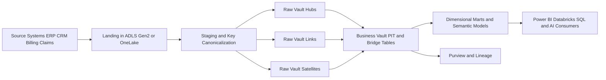
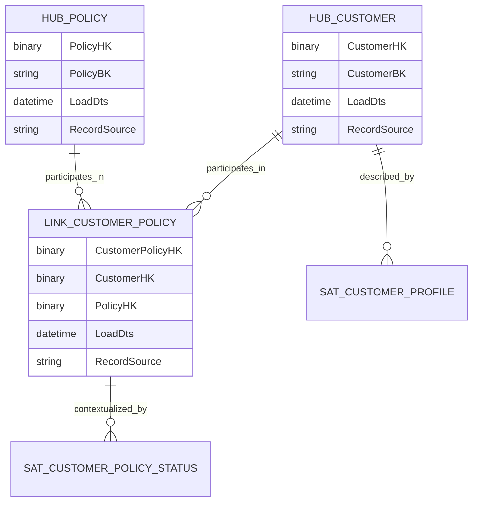
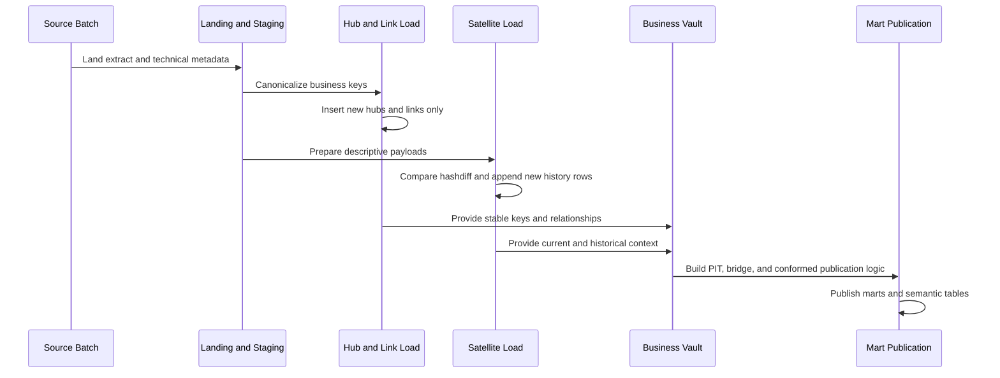

# Data Vault 2.0

> Part of the **Enterprise Data & AI Architecture Handbook** · Phase-06 - Data Modeling & Warehousing · Chapter 02.
> Estimated study time: **60 min reading + ~4h labs**.
> **Prerequisite:** read [Dimensional Modeling](01_Dimensional_Modeling.md) first.

---

## Executive Summary

Data Vault 2.0 is an enterprise data modeling and delivery pattern optimized for historical traceability, parallel loading, and change-tolerant integration across many source systems. It is not a reporting schema and it is not a semantic model. Its value is that it gives large organizations a stable, auditable integration backbone that can absorb source churn without forcing every upstream change to ripple through curated analytics and AI consumers.

The architectural separation matters. Hubs store stable business keys. Links store relationships between those keys. Satellites store descriptive context, history, and source-specific change detail. This separation allows ingestion and history capture to move quickly and in parallel while preserving source lineage. In Azure-first estates, the common pattern is to land raw source history in ADLS Gen2 or OneLake, load raw-vault structures with Azure Databricks or Fabric Spark, govern metadata in Purview or Unity Catalog, and then publish business-vault and dimensional or semantic consumption layers for reporting.

The design question is not whether Data Vault is better than dimensional modeling. That framing is too shallow. The real question is where enterprise volatility, audit requirements, source multiplicity, regulatory replay needs, and organizational scale justify a dedicated integration layer before curated marts. When those pressures are real, Data Vault is often a better long-term integration model than forcing raw source volatility directly into dimensional stars. When those pressures are low, Data Vault can be unnecessary ceremony and cost.

The most common failure pattern is using Data Vault as a universal answer. Teams implement hubs, links, and satellites, but never publish trustworthy business-vault rules or dimensional marts, leaving analysts with a technically elegant but operationally unusable warehouse. Mature teams use Data Vault where it fits: as the governed historical integration layer feeding dimensional, semantic, or AI-serving models, not as the final shape for business consumption.

## Learning Objectives

By the end of this chapter you should be able to:

1. Explain the roles of hubs, links, and satellites and how they differ from dimensional facts and dimensions.
2. Decide when business keys and hash keys improve scalability and when they create unnecessary complexity.
3. Distinguish raw vault from business vault and assign the right transformation responsibilities to each.
4. Design parallel load patterns for hubs, links, and satellites on Azure-first platforms.
5. Evaluate when Data Vault fits better than directly modeling dimensional marts.
6. Build replay-safe vault pipelines with source lineage, load timestamps, and hashdiff-based change capture.
7. Govern vault metadata, stewardship, and cost controls in an enterprise setting.
8. Publish dimensional marts from a vault backbone without duplicating business logic unsafely.
9. Recognize anti-patterns such as over-hashing, under-modeling business keys, and vault-only analytics.
10. Defend Data Vault architecture decisions in engineer, staff engineer, architect, and CTO reviews.

## Business Motivation

- Large enterprises ingest from many operational systems whose structures change independently and often.
- Audit, compliance, and regulatory teams need immutable source lineage and point-in-time reconstruction.
- Merger and acquisition programs need a way to integrate overlapping business entities without immediately reconciling every semantic conflict.
- Data-platform teams need ingestion patterns that scale across domains and can be loaded in parallel.
- Analytics teams need a stable integration core that does not collapse every time a source system adds columns or alters relationship rules.
- Azure estates need a controllable pattern for landing raw history, preserving provenance, and publishing downstream marts with bounded blast radius.
- AI and analytics programs need source-faithful history for feature backtesting, model audit, and explainability, even when curated marts abstract the business view later.

## History and Evolution

- Classical enterprise warehouses often pushed directly from source-oriented staging into normalized integration stores or dimensional marts, which worked until source volatility and organizational scale became hard to manage.
- Dan Linstedt formalized Data Vault as a modeling approach that emphasized auditable historical storage, business keys, and scalable loading patterns.
- Data Vault 2.0 extended the original method with stronger automation, metadata-driven delivery, MPP and cloud execution patterns, and operational discipline.
- Cloud object storage, Spark, and elastic SQL engines made vault loads easier to parallelize because raw history no longer had to fit within one monolithic warehouse runtime window.
- Modern lakehouse platforms made Data Vault more attractive for enterprises that wanted immutable historical integration without locking themselves into a single proprietary warehouse engine.
- At the same time, many teams rediscovered that vault models are not analyst-friendly, which reinforced the need to pair vault backbones with consumption models such as dimensional marts and semantic layers.
- Current practice in mature Azure programs is increasingly hybrid: source-aligned bronze, raw-vault integration, business-vault enrichment, and dimensional or semantic gold products.

## Why This Technology Exists

Data Vault exists because enterprises need an integration model optimized for change, history, and scale rather than immediate end-user simplicity. Source systems rename attributes, re-key records, split domains, merge domains, and introduce new relationship structures. If every such change is forced directly into curated marts, the analytics layer becomes fragile and politically expensive to maintain.

It also exists because historical reconstruction matters. Many organizations must answer questions such as what the source said on a given date, which system asserted that value, when the platform first observed it, and which transformation later standardized it. A raw vault is designed to preserve that evidence. Hubs anchor stable business keys, links preserve relationships, and satellites preserve descriptive context over time. This makes replay, audit, and reconciliation materially easier than if only curated marts remain.

The technology further exists because cloud-scale engineering rewards decomposition and parallelism. Data Vault separates entity identity, relationships, and changing context into load units that can be computed concurrently. On Azure Databricks or Fabric Spark, this maps naturally to distributed jobs, metadata-driven orchestration, and append-oriented lakehouse storage. The resulting platform is not simpler than a direct dimensional mart, but it is more resilient under source volatility and multi-domain integration.

## Problems It Solves

| Problem | Data Vault response | Enterprise signal that it is working |
|---|---|---|
| source systems change frequently | isolate changes into satellites and source-specific structures | curated marts change less often than source feeds |
| many systems share overlapping business entities | anchor integration on business keys in hubs | customer, product, policy, or asset history from multiple sources can be reconciled later |
| audit and replay are difficult | preserve raw, timestamped history with record source metadata | teams can reconstruct what was known and when |
| nightly windows are too tight for sequential ETL | load hubs, links, and satellites in parallel | ingest throughput scales with source count and partitions |
| acquisitions introduce incompatible schemas | onboard new sources without redesigning every analytical mart | integration can start before full business harmonization |
| lineage is weak in direct-to-mart pipelines | attach source, load time, and hashdiff metadata to every structure | root-cause analysis is faster and more defensible |
| raw integration logic is coupled to report semantics | split raw vault from business vault and consumption marts | changes in business rules do not corrupt raw historical preservation |

## Problems It Cannot Solve

- It cannot replace dimensional or semantic serving models for self-service analytics.
- It does not make undefined business keys magically stable; if the enterprise cannot identify the business key, the hub design will drift.
- It is not a good fit for small, low-volatility data estates where direct marts are sufficient.
- It does not remove the need for governance, master-data stewardship, or metric ownership.
- It cannot by itself create business-friendly measures, conformed dimensions, or executive-ready reporting.
- It is not free; the model adds tables, metadata, orchestration, and skill requirements.
- It does not fix poor source quality. It preserves evidence of poor quality more faithfully.
- It should not be used as the final user-facing data model for general BI consumption.

## Core Concepts

### 8.1 Hubs

Hubs store unique business keys and minimal identifying metadata such as load timestamp and record source. A hub does not store descriptive attributes beyond what is necessary to define identity. Customer number, policy number, account number, order number, asset ID, and supplier code are common hub candidates. The main engineering goal is stability. If the enterprise later changes how a customer is classified or described, the hub remains intact because identity is separated from context.

### 8.2 Links

Links store relationships between hubs. A sales-order-to-customer relationship, a claim-to-policy relationship, an account-to-customer relationship, or a product-to-supplier relationship are common examples. Links preserve association history at the key level without embedding descriptive context. This separation makes relationships loadable in parallel and allows new sources to contribute to the same relationship pattern over time.

### 8.3 Satellites

Satellites store descriptive context, history, and source-specific change detail for hubs or links. They typically include load timestamp, record source, effective dates where needed, and a hashdiff or equivalent change-detection field. Multiple satellites can hang off one hub or link, often split by source system, rate of change, security classification, or business ownership. This is one of the main reasons Data Vault handles source volatility well: attribute churn affects satellites, not core identity structures.

### 8.4 Business keys and hash keys

Business keys are the real-world identifiers used by the enterprise or source system. Hash keys are deterministic computed keys derived from normalized business-key values, often using SHA-256 or MD5 depending on platform standards and collision tolerance policy. Hash keys enable parallel loading because a downstream load can compute the same key independently without waiting for a centralized surrogate-key generator.

Hash keys are useful, but they are not a theology. They improve distributed load independence and cross-platform determinism, but they also introduce debugging cost, collision-policy requirements, and canonicalization discipline. The business key remains the actual business anchor. If teams treat the hash as the business meaning, they have already lost clarity.

### 8.5 Raw vault versus business vault

The raw vault stores source-faithful integrated history with minimal business-rule interference. It should preserve what was received, from where, and when. The business vault applies enterprise logic such as survivorship, standardization, same-as mappings, reference harmonization, derived relationships, point-in-time tables, and bridge tables. The boundary is critical. Raw vault is for traceability and ingestion resilience. Business vault is for business-ready integration and performance helpers. Mixing the two makes audit and change management harder.

### 8.6 Loading patterns and parallelism

Because hubs, links, and satellites are separated, a platform can load many of them concurrently. Hubs for customer, product, and supplier can load in parallel. Links can load once the relevant business keys are resolved or hashed deterministically. Satellites can load independently per source and per change group. This parallelism is one of Data Vault's main operational advantages on Spark, MPP, and cloud-scale engines.

### 8.7 When Data Vault fits versus Kimball

Data Vault fits best when integration volatility, auditability, source multiplicity, and long-lived historical reconstruction matter more than immediate analyst usability. As discussed in [Dimensional Modeling](01_Dimensional_Modeling.md), Kimball-style dimensional marts fit best for governed business consumption. The mature pattern is often both: Data Vault for the integration core and dimensional marts for the consumption layer. Choosing one as a universal answer usually reflects organizational politics rather than sound architecture.

## Internal Working

### 9.1 Source landing and staging

Operational extracts, CDC feeds, or API snapshots first land in bronze storage such as ADLS Gen2 or OneLake. The staging layer standardizes raw file structure, canonicalizes business-key fields, and captures technical metadata such as batch ID, source system, extract timestamp, and ingest timestamp. This staging step exists to make vault loads deterministic and replay-safe.

### 9.2 Hub loading

Hub loads identify distinct business keys from staging, normalize them according to enterprise key rules, compute hash keys if the platform uses them, and insert only previously unseen identities. The load is append-oriented. A hub row should not be updated because its role is identity registration, not changing descriptive state.

### 9.3 Link loading

Link loads resolve the participating hub keys or compute them deterministically from business keys. The link captures the association itself plus minimal metadata. If a relationship arrives multiple times, the load must remain idempotent. In distributed engines, this usually means anti-join or merge-on-key logic using deterministic link hashes.

### 9.4 Satellite loading

Satellite loads compare current descriptive payloads against prior versions, often using hashdiff values. When the descriptive payload changes, a new satellite row is appended with a new load timestamp and record source. The previous row remains as historical evidence. Some implementations also manage end-dating or current-row indicators, though insert-only raw-vault patterns often leave point-in-time interpretation to downstream queries or business-vault structures.

### 9.5 Business-vault derivation

Business-vault jobs apply survivorship rules, same-as relationships, reference-data standardization, and performance helpers such as point-in-time tables and bridge tables. This is where enterprise interpretation becomes explicit. It is also where organizational ownership must be clearest, because derived business logic is no longer merely a copy of the source.

### 9.6 Publication to consumption models

Dimensional marts, semantic models, feature tables, and serving views are produced from the business vault or from carefully governed raw-vault structures where appropriate. This keeps the vault from becoming a user-facing maze. The publication layer should be the place where measures, conformed dimensions, and business-friendly navigation are stabilized.

## Architecture

### 10.1 Azure-first reference architecture

The most common Azure pattern uses ADF, Fabric pipelines, or event-driven ingestion to land raw data into ADLS Gen2 or OneLake. Azure Databricks Premium or Fabric Spark performs metadata-driven raw-vault loads into Delta tables. Unity Catalog or Purview governs table ownership, lineage, and access policy. Business-vault jobs create same-as hubs, reference harmonization satellites, point-in-time tables, and bridge tables. Curated marts are then published into Fabric Warehouse, Databricks SQL, Synapse dedicated SQL pool, or Azure SQL depending on concurrency and serving requirements.

### 10.2 Why the decomposition works

This architecture aligns storage, compute, and governance boundaries. Raw landing preserves ingestion evidence. Raw vault preserves integrated historical identity and relationship structures. Business vault adds enterprise interpretation. Consumption marts deliver analyst usability. When source systems change, most changes are isolated to staging and satellites instead of rippling across business-facing stars. When reporting logic changes, the raw vault remains untouched, protecting replay and auditability.

### 10.3 ADR example: adopt Data Vault as the enterprise integration core, not the reporting model

**Context:** The organization has twelve major source systems across finance, CRM, policy, claims, and operations. Mergers have introduced overlapping customer and product identifiers. Direct dimensional builds repeatedly break when upstream systems change or when a new acquisition is onboarded. Regulators require reconstruction of source-state history.

**Decision:** Standardize enterprise integration on a raw-vault plus business-vault pattern using Delta tables on ADLS Gen2 or OneLake, loaded by Databricks or Fabric Spark with hash-key-based parallelism. Publish dimensional marts for reporting and semantic consumption rather than exposing raw-vault structures directly to analysts.

**Consequences:** Source onboarding becomes faster and more resilient to structural change. Audit and replay capability improve materially. The platform requires stronger metadata discipline, more tables, and engineers who understand both vault and dimensional publication. Delivery of first-report value may be slower for simple domains.

**Alternatives considered:**

1. Direct source-to-dimensional pipelines only: rejected because repeated upstream volatility caused high rework.
2. Pure normalized enterprise warehouse: rejected because large-scale historical change tracking and source lineage were harder to maintain consistently.
3. Raw lake only with semantic logic in BI tools: rejected because governance, replay, and cross-domain integration remained weak.

## Components

| Component | Role | Azure-first implementation choices | Common failure mode |
|---|---|---|---|
| hub | registers unique business keys | Delta table in Databricks or Fabric | descriptive attributes leak into identity structure |
| link | stores key relationships | Delta table, Fabric Warehouse, Synapse SQL table | relationship granularity is inconsistent |
| satellite | stores history and descriptive change | Delta table with hashdiff-based loads | satellites become junk drawers with no ownership split |
| staging layer | canonicalizes keys and technical metadata | ADLS Gen2 or OneLake with notebook or SQL prep | inconsistent business-key normalization |
| raw vault | source-faithful integrated history | Delta lakehouse zone | business rules contaminate traceability layer |
| business vault | enterprise interpretation and performance helpers | Databricks or Fabric derived tables | undocumented survivorship logic |
| PIT table | accelerates point-in-time joins | Delta or SQL helper table | stale rebuild schedule |
| bridge table | supports many-to-many or hierarchical navigation | business-vault helper structure | mistaken for a reporting mart |
| orchestration layer | metadata-driven parallel execution | ADF, Fabric pipeline, Databricks Workflows | hand-built bespoke jobs for every table |
| catalog and lineage | ownership, source, sensitivity, trust state | Purview, Unity Catalog | no steward for same-as rules |

## Metadata

Vault platforms are metadata-heavy by design.

| Metadata class | What to capture | Why it matters |
|---|---|---|
| business key definition | canonicalization rules, source fields, null policy | prevents inconsistent hub identity |
| hash-key rule | algorithm, delimiters, casing, trimming, null replacement | ensures cross-pipeline determinism |
| hashdiff rule | included columns and normalization order | makes change detection reproducible |
| load metadata | load timestamp, batch ID, pipeline run ID | supports replay and RCA |
| record source | source system and extract path | preserves auditability |
| effectivity metadata | valid-from or inferred timing where needed | improves business-vault reasoning |
| same-as mapping metadata | survivorship and entity-resolution evidence | governs business-vault harmonization |
| sensitivity metadata | PII, PCI, HR, legal labels | enforces access control |
| publication metadata | downstream marts, semantic models, SLA tier | links vault operations to business impact |

The rule is simple: if a vault cannot explain how it computed a key or why it added a history row, it is not operationally trustworthy.

## Storage

Storage design in a vault platform is driven by append-heavy historical loads and efficient downstream reconstruction.

| Storage question | Recommended posture | Notes |
|---|---|---|
| raw landing | immutable or append-only | preserve extract fidelity and manifests |
| raw-vault tables | columnar Delta or equivalent open table format | enables ACID inserts and scalable history |
| business-vault helpers | separate schema or zone from raw vault | keeps audit and interpretation boundaries clean |
| partitioning | partition large satellites by load date or source date when justified | avoid over-partitioning hubs and small links |
| clustering | cluster large satellites on hub hash key or business key | improves current-state and point-in-time joins |
| retention | do not prune raw-vault history casually | retention is part of the audit contract |

Hubs are usually small enough that partitioning adds little value. Satellites are often the largest structures and deserve the most storage tuning. Links vary with relationship cardinality and business event density.

## Compute

| Workload class | Best Azure-first surface | Why it fits | Wrong default |
|---|---|---|---|
| metadata-driven raw-vault ingestion | Azure Databricks jobs compute or Fabric Spark | scalable parallel ingestion and hashing | per-table manual stored procedures |
| high-throughput CDC landing | ADF plus Databricks/Fabric or event-driven ingestion | separates movement from transformation | forcing all logic into copy activity expressions |
| business-vault derivation | Databricks SQL, Spark, or Fabric Warehouse depending complexity | supports same-as, PIT, bridge, and reference rules | exposing raw-vault joins directly to BI |
| small domain vault | Azure SQL Database or SQL MI when scale is modest | simpler operations for limited scope | deploying a full Spark platform for trivial volumes |
| reporting publication | Fabric Warehouse, Databricks SQL, Synapse, Azure SQL | curated SQL-serving surface | using raw-vault tables as the dashboard source |

Compute choice should follow integration volatility and volume, not vendor fashion. Spark is useful when parallelism and scale matter. It is not mandatory for every vault.

## Networking

- Keep storage, Databricks or Fabric compute, and SQL-serving surfaces region-aligned to reduce transfer cost and failure domains.
- Use private endpoints for ADLS Gen2, Azure SQL, Key Vault, and Log Analytics where supported by platform standards.
- Isolate self-hosted integration runtime or hybrid connectivity from curated serving surfaces.
- Document outbound dependencies for source API ingestion, especially when batch windows are strict.
- Separate network ownership for landing, vault compute, and BI gateways so incident response has clear accountability.
- Validate DNS and firewall rules before blaming slow vault loads on Spark or SQL design.

Network failures in vault platforms often surface as partial source coverage, which is operationally worse than a total failure because the load may look green while one source silently missed its window.

## Security

| Concern | Recommended control |
|---|---|
| raw source sensitivity | stricter access on raw vault than on curated marts |
| secret management | Managed Identity and Key Vault; avoid embedded credentials |
| cross-domain visibility | limit direct raw-vault browsing to data-engineering and governance roles |
| hash-key misuse | do not treat hashes as anonymization; protect business keys and source payloads directly |
| same-as mappings | restrict steward approval and change rights |
| audit | retain lineage, run IDs, source manifests, and access logs |

Raw-vault storage frequently contains the most operationally sensitive version of the truth because it is closest to source detail. Treat it accordingly.

## Performance

Data Vault performance questions divide into two categories: load performance and query performance. The platform is designed to optimize ingestion scalability first. Query performance for business consumption usually comes from business-vault helpers or downstream marts, not from asking analysts to hand-join dozens of hubs, links, and satellites.

Key performance guidance:

- canonicalize business keys once in staging, not repeatedly across every load statement,
- compute hash keys and hashdiffs deterministically and vectorize the logic where possible,
- keep satellites grouped by change rate or security domain rather than creating one giant all-attribute satellite,
- materialize point-in-time and bridge helpers for recurring current-state or as-of joins,
- publish dimensional marts for interactive BI instead of forcing vault joins into every dashboard query.

| Pattern | Azure recommendation | Why |
|---|---|---|
| large customer satellite with frequent attribute change | partition by load date and cluster by hub key in Delta | reduces scan cost for as-of reconstruction |
| repeated current-state joins | build PIT table in business vault | avoids repeated satellite-window logic |
| multi-source entity onboarding | load source-specific satellites independently | parallelism and source isolation |
| executive dashboards | serve from marts, not raw vault | better latency and simpler semantics |

## Scalability

Scalability is where Data Vault earns its keep in the right environment.

- New sources can be onboarded as new satellites or links without redesigning core identity structures.
- Parallel hub and link loading aligns well with Spark clusters, Fabric capacities, and metadata-driven orchestration.
- Organizational scalability improves because multiple domain teams can contribute source-specific history to shared enterprise entities without forcing immediate semantic convergence.
- Business-vault and publication layers can evolve at different speeds from raw ingestion.

This does not mean limitless scalability without discipline. A poorly governed vault can explode into thousands of tables with inconsistent naming, weak business-key standards, and no steward ownership. That is not scalable architecture. That is distributed entropy.

## Fault Tolerance

Vault platforms should be designed for replay, idempotency, and bounded recovery.

- raw landing must preserve extract manifests and source-watermark evidence,
- hub, link, and satellite loads must be rerunnable without duplicating identical technical rows,
- hashdiff change logic must be deterministic across reruns,
- failed source slices should be reloadable independently,
- business-vault derivations should be rebuildable from raw-vault truth.

The raw-vault and business-vault separation is especially valuable during recovery. If a survivorship rule was wrong, rebuild the business vault. If a source extract was late or malformed, reload the raw-vault slice. These are different incident types and should not be conflated.

## Cost Optimization

Data Vault reduces some forms of rework cost while increasing some structural platform cost. The right question is not whether it has more tables. The right question is whether it lowers the total cost of source change, replay, regulatory support, and multi-domain integration.

- Use Spark or Fabric only where the source count, volume, or parallelism benefit justifies it.
- Avoid publishing duplicate marts from multiple business-vault branches without a consumption reason.
- Keep raw-vault history in cost-efficient object storage, but size serving layers independently for user concurrency.
- Rebuild only affected satellites or business-vault helpers when possible instead of reprocessing everything.
- Use automated metadata-driven code generation to lower engineering toil and reduce per-table bespoke logic.

Worked FinOps example: consider an enterprise with 180 raw-vault tables and 60 business-vault helpers loaded daily on Azure Databricks jobs compute. A naive sequential pattern may run 90 DBU-hours per day on a medium jobs cluster, or roughly $49.50 per day at an illustrative blended rate of $0.55 per DBU-hour, excluding storage and downstream SQL. If metadata-driven parallel loading and source-specific incremental satellites reduce effective compute to 42 DBU-hours per day, monthly compute falls from about $1,485 to about $693. Even if extra storage for retained raw history adds several hundred dollars per month, the platform may still be cheaper overall than repeated mart rewrites and high-severity audit incidents. The main savings usually come from lower change-management cost and faster recovery, not from a smaller storage bill.

## Monitoring

| Metric | Why it matters | Typical threshold |
|---|---|---|
| new hub-key count per load | detects source coverage anomalies | alert on unexpected drop or spike |
| satellite change rate | identifies upstream schema or business-behavior shifts | alert on abnormal variance by source |
| duplicate hash-key insert attempts | catches idempotency or canonicalization failures | zero tolerance on stable keys |
| orphan link rate | detects missing hub dependencies | critical alert for core domains |
| business-vault rebuild time | tracks recovery viability | alert when rebuild breaches RTO |
| cost per source load | exposes inefficiency and drift | review trend by domain and environment |
| publication lag to marts | ties vault operations to business impact | alert on SLA breach |

Monitoring must be source-aware. A green overall pipeline with one red source-system slice is not a success if that source feeds a critical regulated domain.

## Observability

Observability should make it possible to answer what arrived, what changed, what was inferred, and what downstream products were affected.

- Preserve run IDs, source manifests, record-source fields, hash rules, and hashdiff rules as inspectable metadata.
- Link every business-vault transformation to steward ownership and code version.
- Trace downstream marts and semantic models back to the contributing satellites and links.
- Capture data-quality exceptions such as null business keys, malformed canonicalization, and unexpected relationship explosions.

### Operational response playbooks

| Signal | Detection query or rule | Likely cause | First remediation |
|---|---|---|---|
| hub load drops to near zero for a major source | compare expected vs actual distinct business keys by source batch | source extract failure or business-key parser break | hold downstream publication, inspect landing manifests, reload affected batch |
| satellite row volume spikes 20x day over day | monitor hashdiff change rate by satellite | upstream schema drift or bad canonicalization | quarantine source slice, validate column mapping, prevent business-vault rebuild until fixed |
| link orphan rate rises | SQL check for link rows without matching hub keys | incomplete source arrival or wrong hash-key rule | rerun dependent hubs, validate hash normalization, rebuild affected link partitions |

## Governance

Data Vault governance is mostly about standardization and ownership discipline.

- Define enterprise naming standards for hubs, links, satellites, PIT tables, and bridge tables.
- Standardize business-key canonicalization, hash algorithm choice, delimiters, null substitution, and casing rules.
- Assign a technical owner and a business steward to every shared entity and same-as rule set.
- Version metadata specifications in source control and review them like code.
- Publish which raw-vault structures are source-faithful, which business-vault structures contain interpretation, and which marts are certified for business use.
- Restrict direct analyst use of raw-vault structures unless the workload is explicitly investigative or audit-oriented.

The most damaging governance failure is allowing teams to implement local hash rules or business-key rules that nominally represent the same enterprise entity but are not actually compatible.

## Trade-offs

| Choice | Advantages | Disadvantages | When to prefer it |
|---|---|---|---|
| Data Vault raw plus business vault | strong auditability, parallelism, source-change tolerance | more tables, steeper learning curve, indirect BI usability | large volatile multi-source enterprises |
| direct dimensional marts | fast business value, simple BI path | weaker raw lineage and higher rework under source churn | stable domains with clear business semantics |
| normalized integration store | familiar relational discipline | weaker parallelism and historical decomposition | medium-scale traditional warehouse teams |
| raw lake only | quick ingest and low initial modeling effort | poor governance, poor replay semantics, weak business usability | exploratory or temporary landing zones only |

The main trade-off is deliberate complexity in exchange for resilience. If the platform does not need that resilience, the extra structure is waste.

## Decision Matrix

| Requirement | Data Vault | Dimensional modeling | Normalized warehouse | Raw lake only |
|---|---|---|---|---|
| source volatility tolerance | strong | medium | medium | strong |
| analyst usability | weak directly | strong | weak | weak |
| audit reconstruction | strong | medium | medium | medium |
| parallel ingestion | strong | medium | medium | strong |
| business metric clarity | medium after publication | strong | medium | weak |
| model simplicity | weak | strong | medium | strong initially |
| long-term multi-source integration | strong | medium | medium | weak |

Use Data Vault when the integration problem is materially harder than the reporting problem. Use direct dimensional modeling when the reporting problem dominates and source change is manageable.

## Design Patterns

1. **Hub-per-business-key:** separate identity from descriptive context and keep hubs minimal.
2. **Source-specific satellites:** isolate change behavior and source semantics cleanly.
3. **Rate-of-change satellites:** split rapidly changing attributes from slow-moving ones.
4. **Effectivity satellite:** track relationship validity windows where operational timing matters.
5. **PIT table:** precompute point-in-time joins for repeated current-state or as-of queries.
6. **Bridge table:** accelerate many-to-many or hierarchical traversal in business-vault and mart publication.
7. **Same-as link or hub pattern:** reconcile overlapping enterprise identities from multiple systems.
8. **Metadata-driven automation:** generate load SQL or Spark code from modeled metadata.
9. **Vault-to-mart publication:** publish stars and semantic tables from business-vault structures, not from ad hoc report logic.

## Anti-patterns

- Exposing raw-vault tables directly to most business users as the primary analytics surface.
- Stuffing descriptive attributes into hubs because the team wants fewer tables.
- Using one massive satellite for every attribute regardless of change rate, sensitivity, or source ownership.
- Treating hash keys as if they remove the need to understand business keys.
- Mixing raw-vault storage with survivorship and standardized business logic.
- Building a vault without a publication strategy to marts or semantic models.
- Creating bespoke naming and hash rules per domain.
- Replacing every simple warehouse pattern with Data Vault even when the domain is small and stable.

## Common Mistakes

- Business keys are not canonicalized consistently across landing, raw vault, and business vault.
- Teams choose MD5 or SHA-256 without defining collision policy, storage type, and debugging approach.
- Satellites are split arbitrarily rather than by source, rate of change, or security boundary.
- Links represent relationships at mixed granularity, making downstream interpretation unstable.
- PIT tables are built but not refreshed on a schedule aligned to downstream SLAs.
- Same-as mappings are introduced without steward review or evidence.
- Engineers assume Data Vault alone is the end-state model and postpone dimensional publication indefinitely.

## Best Practices

- Declare business-key rules explicitly and store them as versioned metadata.
- Keep hubs minimal and stable.
- Use deterministic canonicalization before hashing: trim, uppercase or lowercase consistently, normalize nulls, and delimit safely.
- Separate raw-vault traceability from business-vault interpretation.
- Group satellites by meaningful operational boundaries rather than aesthetics.
- Automate code generation and tests for repeated vault patterns.
- Publish business-friendly marts from the vault instead of asking every consumer to reinvent joins.
- Monitor change rates and unknown business-key rates by source so anomalies surface early.
- Review whether a domain truly needs Data Vault before adopting it.

## Enterprise Recommendations

1. Standardize a single enterprise hash-key and hashdiff specification and make deviation a formal exception.
2. Require a business-key definition, source-owner signoff, and publication plan before approving new hubs.
3. Use Data Vault as the enterprise integration backbone only for domains with real source volatility, audit pressure, or acquisition-driven complexity.
4. Mandate downstream dimensional or semantic products for broad business consumption.
5. Keep raw-vault access restricted and stewarded because it contains the most source-faithful and often most sensitive history.
6. Invest in metadata-driven automation early; manual per-table vault coding does not scale.
7. Track the cost of source change and replay incidents to justify vault complexity with evidence.
8. Review vault table sprawl quarterly and retire obsolete satellites, helpers, and experimental branches.

## Azure Implementation

### 31.1 Recommended Azure service map

| Layer | Preferred Azure service | Notes |
|---|---|---|
| landing | ADF, Fabric Data Factory, Event Hubs where relevant | choose ingestion mode by source behavior |
| raw storage | ADLS Gen2 or OneLake | immutable or append-first landing |
| raw-vault processing | Azure Databricks Premium or Fabric Spark | strong fit for parallel hash-based loads |
| business-vault processing | Databricks SQL, Spark, Fabric Warehouse, or Fabric Spark | choose by transformation complexity |
| serving publication | Fabric Warehouse, Databricks SQL, Synapse, Azure SQL | dimensional or semantic consumption layer |
| governance | Purview and Unity Catalog | combine platform and table-level governance |
| secrets and identity | Managed Identity and Key Vault | avoid shared secrets |
| monitoring | Azure Monitor, Log Analytics, Databricks alerts | centralize source-aware telemetry |

### 31.2 Example raw-vault DDL in T-SQL

```sql
create table rv.HubCustomer (
    CustomerHK binary(32) not null primary key,
    CustomerBK nvarchar(100) not null,
    LoadDts datetime2 not null,
    RecordSource nvarchar(50) not null
);

create table rv.HubPolicy (
    PolicyHK binary(32) not null primary key,
    PolicyBK nvarchar(100) not null,
    LoadDts datetime2 not null,
    RecordSource nvarchar(50) not null
);

create table rv.LinkCustomerPolicy (
    CustomerPolicyHK binary(32) not null primary key,
    CustomerHK binary(32) not null,
    PolicyHK binary(32) not null,
    LoadDts datetime2 not null,
    RecordSource nvarchar(50) not null
);

create table rv.SatCustomerProfile (
    CustomerHK binary(32) not null,
    LoadDts datetime2 not null,
    HashDiff binary(32) not null,
    RecordSource nvarchar(50) not null,
    CustomerName nvarchar(200) null,
    SegmentCode nvarchar(50) null,
    CountryCode char(2) null,
    primary key (CustomerHK, LoadDts)
);
```

### 31.3 Example canonicalized hub load

```sql
with staged as (
    select distinct
        upper(trim(CustomerId)) as CustomerBK,
        sysutcdatetime() as LoadDts,
        'CRM' as RecordSource,
        hashbytes('SHA2_256', upper(trim(CustomerId))) as CustomerHK
    from stage.CrmCustomer
    where CustomerId is not null
)
insert into rv.HubCustomer (CustomerHK, CustomerBK, LoadDts, RecordSource)
select s.CustomerHK, s.CustomerBK, s.LoadDts, s.RecordSource
from staged s
where not exists (
    select 1
    from rv.HubCustomer h
    where h.CustomerHK = s.CustomerHK
);
```

### 31.4 Example Databricks SQL satellite load using hashdiff

```sql
insert into rv.sat_customer_profile
select
    customer_hk,
    current_timestamp() as load_dts,
    sha2(concat_ws('|', coalesce(customer_name, ''), coalesce(segment_code, ''), coalesce(country_code, '')), 256) as hashdiff,
    'CRM' as record_source,
    customer_name,
    segment_code,
    country_code
from (
    select
        sha2(upper(trim(customer_id)), 256) as customer_hk,
        customer_name,
        segment_code,
        country_code
    from silver.crm_customer_ready
) s
left anti join (
    select customer_hk, hashdiff
    from rv.sat_customer_profile
    qualify row_number() over (partition by customer_hk order by load_dts desc) = 1
) t
on s.customer_hk = t.customer_hk
and sha2(concat_ws('|', coalesce(s.customer_name, ''), coalesce(s.segment_code, ''), coalesce(s.country_code, '')), 256) = t.hashdiff;
```

### 31.5 Example business-vault PIT helper

```sql
create or replace table bv.pit_customer_current as
select
    h.CustomerHK,
    max(s.LoadDts) as CurrentSatLoadDts
from rv.HubCustomer h
join rv.SatCustomerProfile s
  on h.CustomerHK = s.CustomerHK
group by h.CustomerHK;
```

### 31.6 Example Bicep and CLI

```bicep
param location string = resourceGroup().location

resource storage 'Microsoft.Storage/storageAccounts@2023-05-01' = {
  name: 'stdv${uniqueString(resourceGroup().id)}'
  location: location
  sku: {
    name: 'Standard_ZRS'
  }
  kind: 'StorageV2'
  properties: {
    isHnsEnabled: true
    minimumTlsVersion: 'TLS1_2'
    allowBlobPublicAccess: false
  }
}

resource keyVault 'Microsoft.KeyVault/vaults@2023-07-01' = {
  name: 'kv-dv-${uniqueString(resourceGroup().id)}'
  location: location
  properties: {
    tenantId: subscription().tenantId
    sku: {
      family: 'A'
      name: 'standard'
    }
    enableRbacAuthorization: true
  }
}
```

```bash
az group create --name rg-edai-datavault-prod --location westeurope
az deployment group create --resource-group rg-edai-datavault-prod --template-file infra/main.bicep
```

For Azure Databricks, Premium tier is usually the minimum sensible choice when Unity Catalog, cluster policy, and enterprise access control are required. For Fabric-heavy estates, validate whether a dedicated capacity such as F64 or larger is needed to support both Spark-based business-vault derivation and downstream Direct Lake or Warehouse concurrency.

## Open Source Implementation

An enterprise open-source Data Vault stack usually combines open object storage, Spark, orchestration, metadata management, and SQL-serving publication.

| Layer | Open-source choice | Notes |
|---|---|---|
| storage | MinIO or cloud object storage | S3-compatible object layout works well for append-heavy history |
| table format | Delta Lake, Iceberg, or Hudi | choose based on engine interoperability and operational preference |
| transformation | Apache Spark | natural fit for parallel vault loads |
| orchestration | Airflow | metadata-driven DAG generation is common |
| testing | dbt tests, Great Expectations | validate keys, duplicates, and publication quality |
| serving | Trino, ClickHouse, PostgreSQL marts, or DuckDB extracts | use marts rather than raw vault for broad BI |
| observability | Prometheus, Grafana, OpenTelemetry | capture load and lineage signals |
| governance | OpenMetadata or Apache Atlas | steward metadata and lineage |

Example Spark SQL hub load pattern:

```sql
insert into rv.hub_supplier
select
    sha2(upper(trim(supplier_id)), 256) as supplier_hk,
    upper(trim(supplier_id)) as supplier_bk,
    current_timestamp() as load_dts,
    'ERP' as record_source
from stage.erp_supplier
where supplier_id is not null
except
select supplier_hk, supplier_bk, load_dts, record_source
from rv.hub_supplier;
```

Example dbt publication model from business vault to a dimensional customer mart:

```sql
with current_customer as (
    select
        pit.customerhk,
        sat.customername,
        sat.segmentcode,
        sat.countrycode
    from {{ ref('pit_customer_current') }} pit
    join {{ ref('sat_customer_profile') }} sat
      on pit.customerhk = sat.customerhk
     and pit.currentsatloaddts = sat.loaddts
)
select
    row_number() over (order by customerhk) as customer_key,
    customerhk,
    customername,
    segmentcode,
    countrycode
from current_customer;
```

Example Airflow outline:

```python
with DAG("enterprise_data_vault", schedule="0 2 * * *", catchup=False) as dag:
    land_sources = BashOperator(task_id="land_sources", bash_command="python jobs/land_sources.py")
    load_hubs = BashOperator(task_id="load_hubs", bash_command="python jobs/load_hubs.py")
    load_links = BashOperator(task_id="load_links", bash_command="python jobs/load_links.py")
    load_sats = BashOperator(task_id="load_sats", bash_command="python jobs/load_sats.py")
    build_business_vault = BashOperator(task_id="build_business_vault", bash_command="dbt run --select bv_*")
    publish_marts = BashOperator(task_id="publish_marts", bash_command="dbt run --select mart_*")

    land_sources >> [load_hubs, load_links, load_sats]
    [load_hubs, load_links, load_sats] >> build_business_vault >> publish_marts
```

## AWS Equivalent (comparison only)

| Azure pattern | AWS equivalent | Advantages | Disadvantages | Migration note |
|---|---|---|---|---|
| ADLS Gen2 or OneLake raw vault | S3 with Glue catalog and Lake Formation | mature object-storage ecosystem | governance may be split across more services | keep business-key and hash metadata platform-agnostic |
| Azure Databricks or Fabric Spark loads | Databricks on AWS or EMR | similar Spark-based parallelism | IAM and networking posture differ materially | isolate vault logic from cloud-specific secret handling |
| Fabric Warehouse, Synapse, or Azure SQL marts | Redshift or PostgreSQL-based marts | strong SQL serving options | differing workload-management and cost behavior | benchmark mart publication separately from raw-vault loads |
| Purview plus Unity Catalog | Glue catalog plus Lake Formation plus external metadata platform | broad ecosystem support | metadata federation may be more complex | move steward and lineage metadata explicitly |

Preserve the logical vault design during migration. Service substitution is secondary to stable business-key, hash, and publication rules.

## GCP Equivalent (comparison only)

| Azure pattern | GCP equivalent | Advantages | Disadvantages | Migration note |
|---|---|---|---|---|
| ADLS Gen2 or OneLake | GCS | durable object storage with strong analytics integration | governance patterns differ | abstract storage layout and manifests |
| Azure Databricks or Fabric Spark | Dataproc or Databricks on GCP | strong Spark support | operational controls and cost patterns differ | keep canonicalization and hash logic portable |
| Fabric Warehouse or Databricks SQL publication | BigQuery or marts published from BigQuery | serverless scale and simple SQL serving | cost model may encourage different physical patterns | benchmark vault-to-mart publication rather than assuming direct parity |
| Purview and Unity Catalog | Dataplex and Data Catalog | integrated governance path exists | cross-tool stewardship may require redesign | preserve entity ownership and same-as metadata |

BigQuery can tempt teams to skip explicit publication and query raw structures directly. Resist that if business usability and metric governance matter.

## Migration Considerations

- From direct marts to Data Vault: start with the volatile shared entities first, not every small stable data set.
- From on-premises ETL warehouses: separate logical migration from engine migration so hash rules and metadata are defined once.
- From data lake without integration modeling: identify stable business keys and source-system lineage gaps before creating hubs.
- From multiple regional warehouses: use the vault to preserve regional source fidelity before harmonizing business logic in the business vault.
- During phased rollout: keep existing marts running while a vault-backed publication path is reconciled side by side.
- Avoid "big bang vault everything" programs; they maximize table count and organizational confusion before proving business value.

## Mermaid Architecture Diagrams







## End-to-End Data Flow

1. Source systems land extracts, CDC events, or snapshots into raw landing zones with manifest and batch metadata.
2. Staging canonicalizes business keys, normalizes nulls and casing, and assigns record-source metadata.
3. Hubs register new business identities.
4. Links register business relationships.
5. Satellites append descriptive context only when the payload changes.
6. Raw-vault history remains source-faithful and replayable.
7. Business-vault jobs create same-as mappings, PIT tables, bridge tables, and enterprise-standardized reference structures.
8. Curated dimensional marts or semantic models are published from the business vault.
9. Monitoring tracks source completeness, load throughput, anomaly rates, and publication lag.
10. Observability traces any downstream metric back to the contributing source batch and vault structures.

## Real-world Business Use Cases

| Use case | Why Data Vault fits | Typical publication target |
|---|---|---|
| multi-country customer integration after acquisition | overlapping customer identifiers, uneven source maturity, long reconciliation timeline | customer 360 marts and semantic models |
| regulated insurance claims platform | need to preserve what source systems asserted at each step | claims marts, audit extracts, investigation tools |
| banking risk and finance integration | many slowly converging upstream systems with strict traceability | risk marts, liquidity reports, regulatory packs |
| industrial asset data integration | multiple maintenance, telemetry, and ERP systems tied to shared asset IDs | asset reliability marts and digital twin support tables |
| healthcare member and provider integration | sensitive historical source detail and complex identity resolution | care quality marts, cost analytics, compliance extracts |
| enterprise AI feature backtesting | need source-faithful time-based reconstruction across many systems | feature tables and governed model-audit datasets |

## Industry Examples

| Industry | Typical hubs | Typical links | Typical satellites | Common pitfall |
|---|---|---|---|---|
| banking | account, customer, product, branch | account-customer, account-product | balances, status, risk flags | confusing balance history with reporting marts |
| insurance | policy, claim, customer, broker | customer-policy, claim-policy | claim status, premium attributes, policy terms | mixing raw policy source detail with curated actuarial logic |
| telecom | subscriber, service, device, account | subscriber-service, account-device | plan details, usage attributes, service status | trying to query raw vault directly for dashboard latency |
| healthcare | member, provider, encounter | member-provider, encounter-member | diagnosis attributes, provider specialty history | weak stewardship of same-as mappings |
| retail | customer, product, store, order | order-customer, order-product, store-supplier | product attributes, channel details, loyalty status | using Data Vault where a direct mart would have been enough |

## Case Studies

### Case study 1: insurance modernization under regulatory pressure

An insurer replaced a fragile direct-to-mart pipeline with a vault backbone after repeated audit findings showed that historical claim status changes could not be reconstructed reliably. The new design loaded policy, claim, customer, and payment sources into a raw vault on Azure Databricks over ADLS Gen2, with business-vault helpers for same-as claim relationships and point-in-time claims snapshots.

The reporting layer still used dimensional marts because adjusters and finance analysts needed straightforward drill paths, not vault joins. The raw vault reduced audit preparation time materially because the platform could now show what each source asserted on each load date. The lesson was not that Data Vault replaced marts. The lesson was that it made the integration core defensible.

### Case study 2: acquisition-heavy manufacturing group

A manufacturing group with six acquired ERPs attempted to create a single global product mart directly. Every quarterly source change broke transformation logic, and no team agreed on which product identifier should win globally. The redesign introduced product, supplier, plant, and asset hubs with source-specific satellites, while business-vault rules gradually standardized reference attributes and same-as mappings.

This allowed regional sources to onboard quickly without resolving all semantics on day one. The cost was extra modeling and governance effort, but it stopped the endless cycle of mart redesigns tied to upstream mergers.

### Case study 3: failure story of vault-only analytics

A telecom team adopted Data Vault for everything and declared the raw vault to be the analytics platform. Analysts were told to join hubs, links, and satellites directly in SQL and BI tools. Load performance was good, but dashboard latency was poor, logic was duplicated in every report, and business users distrusted the outputs because current-state interpretation varied by analyst.

The recovery path was to accept that the vault was the integration backbone, not the presentation model. The team built business-vault PIT tables and dimensional marts for subscriber and revenue analytics, after which adoption improved. The failure was conceptual, not technical.

## Hands-on Labs

1. **Raw-vault starter lab:** land CRM and ERP customer data, define business-key canonicalization, and build `HubCustomer` plus source-specific customer satellites.
2. **Link and satellite lab:** add policy or order relationships using a link and a relationship satellite, then validate idempotent reload behavior.
3. **Business-vault lab:** create a PIT table and a same-as mapping for duplicated enterprise customer identities.
4. **Publication lab:** publish a small dimensional customer or policy mart from the business vault and compare its usability with direct vault joins.

Acceptance criteria:

- every hub has an explicit business-key rule,
- hash-key and hashdiff logic are deterministic and documented,
- rerunning a source batch does not create duplicate technical rows,
- a downstream mart or semantic table is published from the vault.

## Exercises

1. Identify whether `CustomerId`, `EmailAddress`, or `LoyaltyCardNumber` is the best hub business key for a retail customer domain and defend the choice.
2. Design a link between policy, claimant, and broker. State the relationship grain clearly.
3. Split a hypothetical customer satellite into multiple satellites based on change rate and sensitivity.
4. Write a canonicalization rule for business keys that handles whitespace, case, and null values.
5. Explain why a raw vault should not contain enterprise survivorship logic.
6. Decide whether a small two-source finance domain really needs Data Vault or can go directly to dimensional marts.
7. Describe how you would detect a broken hashdiff implementation.
8. Design a PIT table for a daily current-customer lookup.
9. Explain how you would publish a conformed dimension from the business vault.
10. Show how a vault model and [Dimensional Modeling](01_Dimensional_Modeling.md) complement rather than replace each other.

## Mini Projects

1. **Enterprise customer integration backbone:** build a customer raw vault from CRM, billing, and support sources, then publish a customer dimension.
2. **Claims history platform:** model claim, policy, payment, and adjuster entities with raw-vault traceability and a dimensional claims mart.
3. **Supply-chain integration model:** create hubs for supplier, product, plant, and shipment; add links and satellites; then publish an inventory and supplier-performance mart.

## Capstone Integration

This chapter becomes most useful when treated as part of a layered architecture rather than a standalone modeling ideology.

- Use Data Vault for enterprise integration where source volatility, acquisition pressure, and audit history are real.
- Use [Dimensional Modeling](01_Dimensional_Modeling.md) for curated marts and semantic products.
- Keep the raw-vault and business-vault boundaries explicit so replay and business interpretation do not blur.
- Use metadata-driven automation, source-aware monitoring, and governed publication to keep table count manageable.
- Treat the choice between vault and direct marts as a domain-level architecture decision, not a religion.

## Interview Questions

1. What are hubs, links, and satellites, and why are they separated?
2. Why does Data Vault emphasize business keys instead of only source surrogate keys?
3. What is the purpose of a hash key, and what problem does it solve in distributed loading?
4. What is the difference between raw vault and business vault?
5. Why is Data Vault usually a poor direct reporting model?
6. How do satellites capture change history efficiently?
7. When is Data Vault a better fit than direct dimensional modeling?
8. Why should hash keys not be treated as anonymization?
9. How would you reload a failed satellite batch safely?
10. What role do PIT tables and bridge tables play?

## Staff Engineer Questions

1. How would you standardize business-key canonicalization and hashing across many domain teams?
2. When would you choose Azure SQL over Databricks or Fabric Spark for a vault workload?
3. How would you structure metadata-driven code generation for hundreds of vault tables?
4. What criteria determine whether a satellite should be split by source, change rate, or security classification?
5. How do you keep business-vault logic from drifting away from governed enterprise definitions?
6. What tests would you enforce for hub uniqueness, link completeness, and satellite change detection?
7. How would you benchmark whether Data Vault complexity is still justified for a given domain?
8. How would you publish a dimensional mart from a vault while keeping lineage explicit?

## Architect Questions

1. Where should Data Vault sit relative to landing, lakehouse storage, dimensional marts, and semantic layers in the enterprise reference architecture?
2. Which domains in the enterprise truly justify a vault backbone, and which should bypass it?
3. How do you govern same-as mappings and survivorship rules across business units?
4. How do you prevent raw-vault sprawl from becoming an unmanaged platform tax?
5. What migration path would you choose from fragmented direct marts to a vault-backed integration model?
6. How do you keep the logical vault design portable across Azure, AWS, and GCP?
7. How do you align security policy when raw-vault data is more sensitive than downstream marts?
8. How do you prove the return on complexity for an enterprise Data Vault program?

## CTO Review Questions

1. Which business domains are losing time or money because direct mart pipelines keep breaking under source change?
2. How much audit and compliance risk is driven by weak historical reconstruction today?
3. Is the enterprise treating Data Vault as an integration strategy or mistakenly as the reporting layer?
4. Which shared entities deserve platform investment because they affect many business units?
5. What governance mechanism ensures that hash rules, same-as mappings, and publication logic remain enterprise-consistent?
6. How will the platform measure whether Data Vault complexity is paying off in lower rework and better traceability?

## References

- Internal prerequisite chapter:
- [Dimensional Modeling](01_Dimensional_Modeling.md)
- Canonical sources to study separately:
- Dan Linstedt and Michael Olschimke, *Building a Scalable Data Warehouse with Data Vault 2.0*.
- Microsoft documentation for Azure Databricks, Fabric, ADLS Gen2, Azure SQL, Key Vault, and Microsoft Purview.
- Databricks documentation for Delta Lake, Unity Catalog, SQL warehouses, and workload orchestration.
- Vendor-neutral guidance on metadata-driven automation, data lineage, and lakehouse governance.

## Further Reading

- Revisit [Dimensional Modeling](01_Dimensional_Modeling.md) for the business-consumption layer that typically sits on top of a Data Vault backbone.
- Study same-as patterns, reference-data harmonization, and survivorship design before attempting a business vault for customer or product domains.
- Study automation frameworks for metadata-driven generation of hubs, links, satellites, PIT tables, and marts.
- Study governance patterns for multi-domain identity resolution and catalog certification.
- Study cost attribution by source system and domain so vault complexity is justified with evidence rather than ideology.