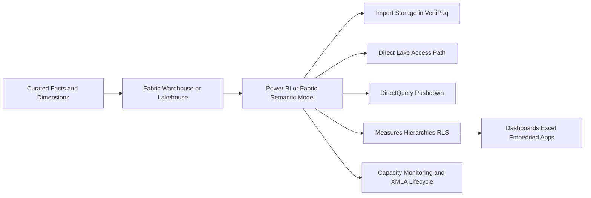
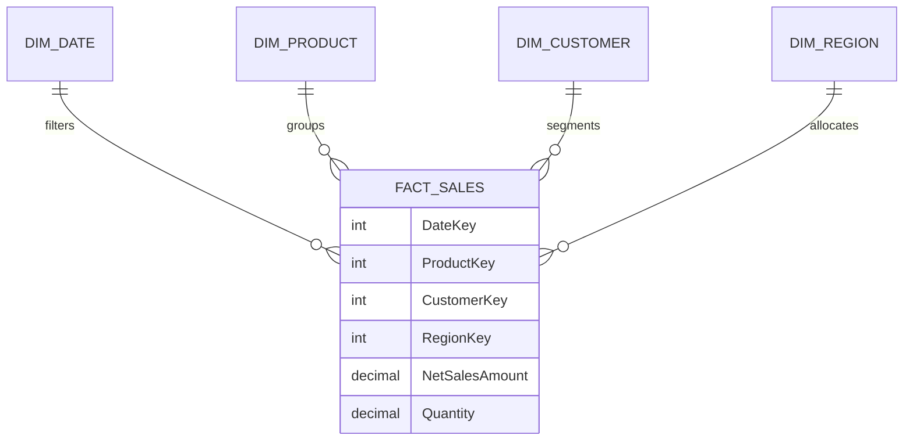
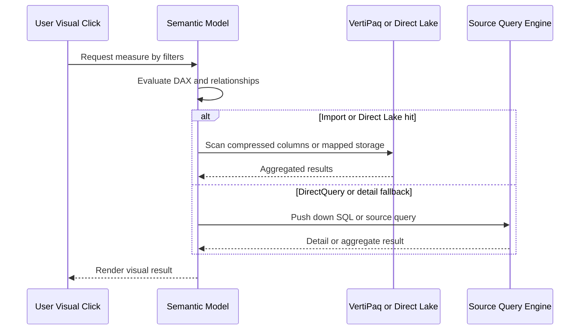

# OLAP and Cube Modeling

> Part of the **Enterprise Data & AI Architecture Handbook** · Phase-06 - Data Modeling & Warehousing · Chapter 04.
> Estimated study time: **45 min reading + ~3h labs**.
> **Prerequisite:** read [Dimensional Modeling](01_Dimensional_Modeling.md) first.

---

## Executive Summary

OLAP and cube modeling exist because business users ask the same expensive analytical questions repeatedly, but they expect sub-second answers and governed semantics rather than raw SQL mechanics. The technology is not about nostalgic cubes. It is about shaping dimensions, measures, hierarchies, compression, pre-computation, and query-routing so that interactive analytics stay fast while business meaning remains consistent. The core design question is not whether a platform exposes a cube metaphor. The real question is where semantic pre-computation, columnar compression, and aggregation awareness materially reduce latency, cost, and ambiguity for high-value analytical workloads.

At enterprise scale, the most practical Azure-first implementation is usually a tabular semantic model rather than a classical multidimensional cube. In Microsoft terms that often means Power BI semantic models on Fabric capacity, Direct Lake where the storage contract and refresh expectations fit, Import mode where VertiPaq compression and predictable interactivity matter most, and DirectQuery only where data volume, freshness, or sovereignty requirements justify trading away latency and modeling freedom. Legacy MOLAP and HOLAP concepts still matter because they teach the fundamental trade-off between pre-computed storage and on-demand query execution.

OLAP systems are downstream of data modeling, not replacements for it. A star schema from [Dimensional Modeling](01_Dimensional_Modeling.md) remains the most common semantic-model substrate because it keeps measure context and filter paths understandable. A semantic layer built on a weak source model becomes a distribution mechanism for inconsistency. A semantic layer built on a well-designed dimensional or curated lakehouse model becomes an enterprise force multiplier for BI, planning, and governed AI features.

This chapter focuses on MOLAP, ROLAP, HOLAP, tabular models, VertiPaq, aggregations, Power BI datasets and DAX basics, and Direct Lake versus Import versus DirectQuery. The goal is to show when cube-style semantic acceleration is the right answer, when it is not, and how to implement it with production discipline in Azure-centric estates.

## Learning Objectives

By the end of this chapter you should be able to:

1. Explain the architectural difference between MOLAP, ROLAP, HOLAP, and modern tabular semantic models.
2. Describe how VertiPaq compression, dictionaries, and columnar storage shape query performance.
3. Choose when to use Import, DirectQuery, or Direct Lake based on workload, freshness, and governance requirements.
4. Design aggregation strategies that reduce scan cost without corrupting business semantics.
5. Build Power BI semantic models that align with star-schema principles from [Dimensional Modeling](01_Dimensional_Modeling.md).
6. Write and review basic DAX measures with correct filter context expectations.
7. Recognize when cube-style acceleration is a better fit than direct SQL or raw lakehouse querying.
8. Govern semantic models, XMLA access, refresh paths, and certified datasets at enterprise scale.
9. Detect anti-patterns such as snowflaked semantic sprawl, uncontrolled bidirectional filters, and DirectQuery over operational schemas.
10. Defend semantic-layer and OLAP architecture decisions in engineer, staff engineer, architect, and CTO reviews.

## Business Motivation

- Executives and analysts expect interactive slicing of revenue, margin, volume, cost, inventory, and planning metrics.
- Business users need governed definitions of measures and hierarchies without each report re-implementing joins and calculations.
- Finance, operations, and sales teams require consistent time intelligence, drill-down paths, and reusable aggregations.
- Azure FinOps programs need to control where expensive scans occur and how often repeated queries hit the underlying lakehouse or warehouse.
- Platform teams need to prevent hundreds of report authors from issuing semantically inconsistent and operationally expensive SQL against shared stores.
- Semantic models provide a contract between curated data products and business consumption tools such as Power BI, Excel, and APIs.
- Interactive analytics often fail not because the warehouse lacks data, but because the serving layer lacks semantic compression, aggregation awareness, and query-routing discipline.

## History and Evolution

- Early reporting systems queried operational stores directly and suffered from poor performance, weak consistency, and repeated business logic.
- OLAP emerged to provide multidimensional navigation, pre-aggregated storage, and interactive pivoting over business dimensions.
- Classical MOLAP systems physically stored cube structures with pre-computed aggregations for fast drill and slice operations.
- ROLAP kept data in relational stores while pushing multidimensional semantics into metadata and SQL generation.
- HOLAP combined pre-computed aggregate storage with drill-through to lower-level relational detail.
- Tabular engines and in-memory columnar compression changed the landscape by making semantic layers simpler to model and faster to iterate than many legacy cube implementations.
- Microsoft Analysis Services, Power BI semantic models, Fabric, VertiPaq, and Direct Lake modernized OLAP concepts while preserving the underlying trade-offs between pre-computation, freshness, and storage locality.

## Why This Technology Exists

OLAP technology exists because interactive business analytics are dominated by repeated patterns: filter by time, geography, product, and customer; aggregate measures; compare periods; drill between summary and detail. Running these patterns directly against raw storage or hand-written SQL for every user interaction is expensive, slow, and governance-hostile. Semantic models make those patterns cheaper and more consistent by centralizing measure logic, relationships, hierarchies, and pre-computed acceleration paths.

It also exists because business users reason in dimensions and measures, not in execution plans. A finance lead asks for gross margin by month, region, and scenario. A supply-chain analyst asks for inventory turns by warehouse and category. A cube or tabular model gives them a governed vocabulary and performance envelope without requiring them to understand the physical layout of Delta files, warehouse partitions, or SQL joins.

Modern semantic platforms further exist because cloud analytics decouples storage from serving. Data may live in lakehouse files, warehouse tables, or external relational systems, but the business still needs one reusable place to define measures, row-level access, time intelligence, and certified hierarchies. OLAP and tabular models are that place when the workload is interactive, repeated, and business-facing.

## Problems It Solves

| Problem | OLAP and cube-modeling response | Enterprise signal that it is working |
|---|---|---|
| repeated dashboard queries rescan large fact tables | use in-memory compression, aggregations, or semantic routing | common dashboards stay fast during business hours |
| each report defines revenue or margin differently | centralize measures in a semantic model | finance and sales see the same numbers |
| business users cannot navigate warehouse schemas confidently | expose hierarchies, perspectives, and friendly metadata | self-service improves without SQL sprawl |
| interactive drilldowns are slow | pre-compute or cache high-value aggregates | drill operations remain sub-second or predictably bounded |
| direct querying overloads lakehouse or warehouse compute | route repeated queries through semantic acceleration | source-engine concurrency pressure drops |
| filtered security is inconsistently applied | centralize RLS and object visibility in the semantic layer | access policies behave consistently across reports |
| time intelligence is reimplemented incorrectly | standardize calendar logic and DAX measures | quarter-over-quarter and YTD calculations reconcile |

## Problems It Cannot Solve

- It cannot fix weak underlying dimensional or curated data models.
- It is not the right persistence model for raw ingestion, historical audit landing, or transactional write capture.
- It cannot make DirectQuery over a poorly indexed operational schema magically fast.
- It does not eliminate the need for data-quality testing and source reconciliation.
- It is not a substitute for domain ownership of business definitions.
- It should not be used to hide uncontrolled semantic drift across many local datasets.
- It cannot always satisfy near-real-time freshness, unlimited concurrency, and full modeling flexibility at once.

## Core Concepts

### 8.1 MOLAP, ROLAP, and HOLAP

MOLAP stores pre-processed multidimensional data structures, often including aggregates, in a dedicated cube store. It is usually the fastest for repeated interactive queries but requires processing windows and additional storage. ROLAP leaves detail and aggregation in relational storage and generates SQL or equivalent queries at runtime. It offers fresher access and less duplication but often with higher query latency. HOLAP stores higher-level aggregates in cube form while drilling to lower-grain detail in relational storage. The conceptual lesson survives modern tooling: pre-computation buys speed, runtime delegation buys freshness and flexibility, and hybrid paths exist between them.

### 8.2 Tabular models and VertiPaq

Modern Microsoft semantic models are usually tabular. Instead of classical multidimensional storage objects and script-heavy cube structures, tabular models use tables, relationships, measures, and columnar compression. VertiPaq is the in-memory columnar engine behind Import-mode Power BI and Analysis Services tabular models. It compresses columns through dictionary encoding, value encoding, and segmentation so repeated analytical scans become memory-efficient.

The practical consequence is that data shape matters. Narrow star schemas, low-cardinality dimensions, and additive facts compress and query well. Wide high-cardinality text-heavy tables compress poorly and often sabotage the semantic layer before the first dashboard even loads.

### 8.3 Aggregations and pre-computation

Aggregations are pre-computed summaries at selected grains that answer common queries more cheaply than scanning atomic detail. They can be materialized in the semantic engine, warehouse, or lakehouse and then mapped to detailed tables by measure, group-by columns, and filter paths. Good aggregations align with actual business query patterns. Bad aggregations are either never used or silently mislead users because the grain or measure semantics were wrong.

### 8.4 Power BI datasets, semantic models, and DAX basics

Power BI now uses the term semantic model where many teams still say dataset. The model defines tables, relationships, hierarchies, measures, security rules, refresh behavior, and sometimes aggregation mappings. DAX is the expression language for measures, calculated columns, calculated tables, and time intelligence. The most important DAX concept is context: row context, filter context, and context transition determine whether a measure behaves correctly. Most enterprise errors come from misunderstanding filter context, not from missing syntax.

### 8.5 Direct Lake vs Import vs DirectQuery

Import loads data into VertiPaq. It usually gives the best interactive performance and most modeling freedom, but it requires refresh and semantic-model memory capacity. DirectQuery leaves data in the source engine and pushes queries down at runtime. It offers fresher access and lower duplication, but latency, concurrency, and modeling complexity often worsen. Direct Lake, in Fabric-centric architectures, reads Delta/OneLake-backed data through a path that avoids traditional import-refresh duplication while still behaving more like an in-memory semantic model when the storage contract is aligned. It is powerful, but it is not magic; model shape, data layout, and capacity sizing still matter.

### 8.6 Hierarchies, perspectives, and drill behavior

Hierarchies such as Year > Quarter > Month > Day or Category > Subcategory > Product reduce report-author friction and improve semantic consistency. Perspectives and display folders help control discoverability in very large enterprise models. Drillthrough and detail rows policies determine how users move from summaries to underlying records. These are usability features, but they are also governance features because they shape what the business thinks the model means.

### 8.7 Semantic models versus source models

The semantic model is not a raw data store. It is a governed consumption layer over curated sources such as stars, warehouse views, lakehouse tables, or business-vault outputs. If the source layer is ambiguous, the semantic layer inherits that ambiguity. If the source layer is clear, the semantic layer becomes a reusable multiplier of business trust.

## Internal Working

### 9.1 Data acquisition and model processing

In Import or classical MOLAP patterns, the semantic engine reads data from source tables, compresses columns, builds dictionaries and segments, validates relationships, and processes measures and calculation dependencies. This processing step is the cost paid up front for fast interactive reads later.

### 9.2 Query resolution and context evaluation

When a user clicks a visual, the semantic engine translates that request into storage engine scans and formula engine calculations. In tabular systems, the storage engine handles compressed column scans and basic aggregations while the formula engine handles DAX evaluation and context logic. Performance issues often arise when the formula engine cannot delegate enough work efficiently to the storage engine.

### 9.3 Aggregation hit and detail fallback

If an aggregation table or semantic aggregation mapping matches the requested grain and filters, the engine can answer from the pre-computed summary. If not, it falls back to the detail table or source query path. The whole value of aggregation design lies in increasing the frequency of correct hits for expensive common queries.

### 9.4 DirectQuery and source pushdown

In DirectQuery, filters, joins, and aggregations are translated into SQL or source-specific queries at runtime. Performance depends on source-engine indexing, statistics, concurrency headroom, and network latency. The semantic model still contributes logic and security, but the execution cost shifts downstream.

### 9.5 Direct Lake behavior

Direct Lake narrows the gap between imported in-memory semantics and lakehouse storage by reading from OneLake-backed tables through an optimized path. In practice, it rewards clean star schemas, well-managed Delta tables, disciplined refresh or metadata sync behavior, and capacity sizing that anticipates semantic load. It is not a license to ignore dimensional discipline.

## Architecture

### 10.1 Azure-first reference architecture

The common Azure pattern is curated dimensional or lakehouse data in Fabric Warehouse, Fabric Lakehouse, Azure Databricks, Synapse, or SQL-serving stores; semantic models in Power BI or Fabric on dedicated capacity; XMLA endpoints or deployment pipelines for model lifecycle; and governed consumption through Power BI apps, Excel, and embedded analytics. High-value enterprise models often use a medallion or curated-gold flow from [Lakehouse Architecture](../Phase-05/02_Lakehouse_Architecture.md) and [Medallion Architecture](../Phase-05/03_Medallion_Architecture.md), then expose a star-schema substrate to the semantic layer.

### 10.2 Why the architecture works

This architecture separates storage, transformation, and consumption concerns. Data engineers optimize the curated fact and dimension layer. Semantic modelers optimize measure logic, security, and interactive performance. Report authors consume certified models instead of rebuilding joins. The result is better governance and often lower total compute cost because repeated business queries stop hammering shared warehouse or lakehouse engines directly.

### 10.3 ADR example: standardize enterprise BI on tabular semantic models over star schemas

**Context:** The organization has strong curated fact and dimension tables but weak report consistency. Teams build local Power BI files against warehouse tables, duplicate DAX logic, and overload the warehouse during month-end reporting. Some architects propose allowing all teams to query the warehouse directly because it seems simpler.

**Decision:** Standardize on centrally governed tabular semantic models over certified star schemas. Use Import or Direct Lake by default for high-value interactive analytics. Allow DirectQuery only for specific freshness, sovereignty, or scale-driven cases that survive architecture review. Manage deployment through workspace pipelines and XMLA-capable lifecycle controls.

**Consequences:** Business measures become more consistent, interactive performance improves, and warehouse concurrency pressure drops. The organization must invest in semantic-model ownership, capacity planning, and lifecycle governance.

**Alternatives considered:**

1. Direct warehouse access for all BI teams: rejected because semantics and performance drifted too widely.
2. Report-local datasets only: rejected because reuse and governance were too weak.
3. Classic MOLAP-only platform revival: rejected because tabular models provide a better modern fit for most workloads.

## Components

| Component | Role | Azure-first implementation choices | Common failure mode |
|---|---|---|---|
| semantic model | central measures, relationships, hierarchies, security | Power BI semantic model, Fabric semantic model, Analysis Services tabular where legacy remains | local copies drift from certified logic |
| storage engine | compressed column scans and aggregation resolution | VertiPaq, Direct Lake optimized path, source pushdown for DirectQuery | model shape defeats compression or aggregation hits |
| formula engine | DAX evaluation and context logic | Power BI / SSAS tabular engine | complex measures force expensive row-by-row evaluation |
| source model | curated star or governed views | Fabric Warehouse, Databricks SQL, Synapse, Azure SQL marts | semantic model built on operational schema |
| aggregation table | pre-computed summary for hot queries | warehouse table, imported summary, semantic aggregation | wrong grain or stale routing metadata |
| calendar dimension | standard time intelligence path | conformed date dimension from curated layer | multiple inconsistent calendars |
| security layer | row or object access enforcement | RLS/OLS in semantic model, source controls where required | RLS logic duplicated inconsistently |
| deployment pipeline | promote models across environments | Fabric deployment pipelines, XMLA automation, CI/CD | manual workspace edits in production |
| capacity | memory and query concurrency envelope | Fabric F SKUs, Power BI Premium, Embedded, legacy AAS S tiers | under-sized capacity causes eviction and throttling |
| usage telemetry | workload and adoption signals | Power BI admin metrics, Log Analytics, Fabric monitoring | no evidence for capacity or aggregation decisions |

## Metadata

Semantic models are metadata-rich systems.

| Metadata class | What to record | Why it matters |
|---|---|---|
| measure definitions | DAX formula, owner, business description | supports trust and reuse |
| relationship metadata | cardinality, direction, active/inactive state | prevents ambiguous filter behavior |
| hierarchy metadata | drill order and business labels | improves usability and governance |
| storage mode | Import, DirectQuery, Direct Lake, dual | drives performance and refresh expectations |
| aggregation mappings | summarized columns, source detail mapping, hit rules | proves acceleration design |
| security metadata | RLS roles, OLS policies, certification state | controls exposure and review |
| lineage metadata | source tables, refresh pipeline, deployment version | supports RCA and change management |
| capacity metadata | workspace, SKU, memory policy, refresh schedule | aligns cost and performance |

If the platform cannot explain why a measure exists, what its filter context assumptions are, and which source columns it depends on, the model is already too informal for enterprise use.

## Storage

OLAP storage strategy is fundamentally about whether you pre-store query-ready structures or delegate reads to a lower layer.

| Storage concern | Recommended posture | Notes |
|---|---|---|
| imported semantic data | store compressed in VertiPaq where interactive reuse is high | favors repeated read performance |
| direct-lake semantic access | align OneLake Delta layout to star-schema semantics | freshness improves, but layout still matters |
| direct-query source storage | keep source tables optimized for pushed-down SQL | semantic model cannot compensate for poor source design |
| aggregation storage | isolate summary tables at hot business grains | keep lineage to detail explicit |
| model size | manage cardinality, wide text columns, and unused attributes | memory is a first-class budget |

The practical rule is simple: memory-efficient semantic storage buys user experience. Abuse it with high-cardinality junk and you lose the benefit quickly.

## Compute

| Workload class | Best Azure-first surface | Why it fits | Wrong default |
|---|---|---|---|
| executive dashboards with repeated filters | Import semantic model on Fabric or Power BI Premium capacity | fastest predictable interactivity | DirectQuery over large warehouse facts by default |
| Fabric lakehouse analytics with tight semantic integration | Direct Lake semantic model | minimizes duplication while keeping semantic acceleration | importing petabytes or relying on ad hoc report-local models |
| near-real-time operational analytics on governed warehouse | selective DirectQuery model | freshness where it truly matters | using DirectQuery for every workload because refresh was inconvenient |
| legacy SSAS enterprise BI | Azure Analysis Services or Power BI Premium XMLA-managed tabular | strong tabular governance path | maintaining unused multidimensional cubes forever |
| open analytics serving | ClickHouse, Trino, DuckDB extracts, Superset | complementary OSS serving patterns | pretending they replace Power BI semantic governance one-for-one |

Compute choice should follow latency, freshness, concurrency, and governance requirements, not brand preference.

## Networking

- Keep semantic capacities, gateways, and source data regions aligned where possible.
- Use private connectivity for source warehouses and data stores that semantic refreshes or DirectQuery paths depend on.
- Minimize on-premises gateway hops for high-concurrency models; gateway architecture often becomes the real bottleneck.
- Document which queries stay in-capacity and which push down to remote sources.
- Treat DirectQuery latency as a network-and-source problem as much as a semantic-model problem.

Interactive analytics degrade quickly when every click traverses distant networks, shared gateways, and under-provisioned source clusters.

## Security

| Concern | Recommended control |
|---|---|
| model access | workspace roles, app audiences, and certified model governance |
| row-level access | semantic-model RLS tied to business roles and tested with effective identity scenarios |
| object-level security | hide sensitive tables or columns where required |
| source credentials | managed identities, service principals, or secure gateway credentials |
| XMLA and admin operations | restrict to controlled deployment principals and semantic engineering roles |
| exported data risk | align tenant settings, sensitivity labels, and downstream sharing policy |

The semantic layer is often where sensitive curated business logic becomes widely discoverable. Secure the model, not only the source.

## Performance

Semantic-model performance depends on data shape, storage mode, measure design, and capacity sizing.

- Prefer star schemas with narrow fact tables and conformed dimensions.
- Remove unused columns, especially high-cardinality text columns.
- Use Import for repeated interactive workloads unless Direct Lake or DirectQuery has a stronger architectural reason.
- Build aggregation tables for common summary queries at stable grains.
- Keep DAX measures set-based and storage-engine-friendly where possible.
- Avoid gratuitous bidirectional relationships and ambiguous filter paths.

| Pattern | Azure recommendation | Why |
|---|---|---|
| finance summary dashboards | Import model with monthly and daily aggregate tables | fast repeated period comparisons |
| Fabric-native lakehouse semantic model | Direct Lake over curated star tables | balances freshness and semantic acceleration |
| operational monitoring with minute-level freshness | constrained DirectQuery plus cached aggregations | freshness where required without over-promising speed |
| large user base with shared common visuals | certified shared semantic model with aggregation awareness | high cache reuse and lower source load |

## Scalability

Scalability in OLAP is partly a semantic challenge and partly a capacity-management challenge.

- Reuse certified semantic models instead of proliferating report-local datasets.
- Split domains by ownership and workload when one model becomes semantically or operationally unmanageable.
- Use aggregation tables and composite models to keep detailed storage from overwhelming interactive use.
- Plan Fabric or Power BI capacity based on concurrent user patterns, refresh windows, and model sizes.
- Treat XMLA automation, model-as-code, and semantic testing as scalability enablers, not optional niceties.

Without governance, semantic sprawl scales faster than semantic value.

## Fault Tolerance

Fault tolerance in semantic platforms means refresh recovery, source fallback understanding, and clear separation of model failures from source failures.

- Import and MOLAP-style models need recoverable processing and rollback-safe deployment behavior.
- DirectQuery and Direct Lake models need source availability and metadata consistency guarantees.
- Aggregation routing failures should degrade to detail scans rather than silently return wrong results.
- Semantic deployment pipelines should allow rollback to prior model versions.
- Source and model lineage must make it clear whether a bad number came from the semantic layer or from upstream data.

Many reported "Power BI failures" are actually source-model or gateway failures surfaced through the semantic layer. Operational ownership must reflect that reality.

## Cost Optimization

OLAP cost optimization is about choosing where repeated work happens and who pays for it.

- Use Import or Direct Lake for repeated high-value queries instead of re-running expensive warehouse scans.
- Reserve DirectQuery for cases where freshness or governance truly requires it.
- Keep semantic models lean so capacity memory is spent on useful business data.
- Use aggregation tables to reduce detail-query frequency.
- Consolidate duplicate local datasets into certified shared models.

Worked FinOps example: suppose a finance workload runs 40,000 dashboard queries per business day against a Fabric Warehouse through DirectQuery. If each common query scans enough data to drive shared capacity pressure and warehouse compute spikes, the combined serving cost may exceed that of a well-designed imported semantic model on an F64 or equivalent premium envelope. If the imported model plus two aggregation tables cuts warehouse query volume by 85 percent and allows the warehouse to scale down a tier during business hours, the total monthly savings may be material even after paying for semantic capacity memory. The major win is not only SKU arithmetic. It is eliminating repeated query work that never needed to hit the warehouse in the first place.

## Monitoring

| Metric | Why it matters | Typical threshold |
|---|---|---|
| semantic query duration p95 | user experience for interactive analytics | alert when sustained above target |
| refresh duration and failure rate | model availability and freshness | alert on SLA breach or repeated failure |
| capacity memory eviction or throttling | indicates undersized or bloated model footprint | investigate immediately on shared enterprise models |
| DirectQuery source latency | shows dependency on downstream engine health | alert when source pushdown exceeds budget |
| aggregation hit rate | proves whether pre-computation is working | review when below design expectation |
| active user concurrency | informs capacity planning | trend by workspace and business cycle |
| DAX error or failed visual rate | detects semantic regressions | alert after deployment spikes |

## Observability

Observability should answer which measure slowed down, which storage mode executed it, which source or aggregation path was used, and which deployment introduced the change.

- Correlate semantic queries to report pages, model versions, and source workloads.
- Track deployment version, XMLA changes, refresh lineage, and source-model lineage.
- Capture whether queries hit import storage, Direct Lake paths, or DirectQuery pushdown.
- Preserve effective identity and security-context evidence for RLS troubleshooting.

### Operational response playbooks

| Signal | Detection query or rule | Likely cause | First remediation |
|---|---|---|---|
| dashboard latency spikes after a model deployment | compare p95 query duration and failed visuals by model version | new DAX measure, ambiguous relationship, or broken aggregation mapping | rollback model version, inspect DAX and relationship changes, retest with performance traces |
| DirectQuery reports slow while import reports remain healthy | source pushdown latency and gateway metrics degrade | warehouse contention, gateway saturation, or source-index regression | isolate source issue, reduce heavy visuals, consider temporary scale-up or cached aggregation fallback |
| refresh begins evicting models from capacity | capacity memory pressure and refresh queue alerts | model growth, too many parallel refreshes, or unused columns bloating memory | trim model, stagger refresh, resize capacity if justified |

## Governance

Semantic governance is the discipline of controlling who defines business truth in analytical tools.

- Certify shared semantic models and discourage unmanaged local dataset duplication.
- Require measure definitions, owners, and test cases for critical KPIs.
- Review storage-mode changes through architecture governance because they alter performance, freshness, and cost envelopes.
- Govern RLS and OLS like application authorization, not as report decoration.
- Use model-as-code or XMLA automation so production semantic changes are versioned and reviewable.
- Keep naming, display-folder, and perspective standards consistent across enterprise models.

The governance failure to avoid is semantic fragmentation: fifty workspaces each defining revenue slightly differently while all claim to be official.

## Trade-offs

| Choice | Advantages | Disadvantages | When to prefer it |
|---|---|---|---|
| Import / VertiPaq | fastest interactivity, rich modeling, lower source load | refresh needed, memory cost, duplicated storage | repeated interactive analytics |
| DirectQuery | fresher data, less duplication, central source control | higher latency, source dependency, constrained modeling | true freshness or sovereignty constraints |
| Direct Lake | Fabric-native low-duplication semantics with strong performance potential | storage contract and capacity discipline required | Fabric lakehouse or warehouse estates |
| classical MOLAP | strong pre-computation and predictable performance | extra processing and legacy operational complexity | specific legacy or tightly controlled workloads |
| ROLAP | no extra cube storage, fresh relational access | source latency and SQL dependency | curated relational engines with moderate interactivity |
| HOLAP | mixed acceleration and drill-through | extra design complexity | workloads needing fast summaries with detailed drill to relational sources |

## Decision Matrix

| Requirement | Import | Direct Lake | DirectQuery | Legacy MOLAP | ROLAP |
|---|---|---|---|---|---|
| interactive speed | strong | strong to medium | weak to medium | strong | medium |
| freshness | medium | medium to strong | strong | weak to medium | strong |
| model flexibility | strong | strong | medium | medium | medium |
| source compute offload | strong | strong | weak | strong | weak |
| storage duplication | medium | low | low | high | low |
| operational simplicity | medium | medium | medium | weak | medium |
| best default for enterprise BI | strong | strong in Fabric estates | weak as default | weak as default | medium |

Import or Direct Lake are usually the sane default starting points for enterprise BI. DirectQuery is a justified exception, not a universal baseline.

## Design Patterns

1. **Certified semantic model over a star schema:** the standard enterprise BI pattern.
2. **Aggregation-aware composite model:** detailed storage plus pre-computed summaries for hot queries.
3. **Thin report pattern:** reports consume a shared certified semantic model instead of embedding local logic.
4. **Import plus incremental refresh:** balances performance and refresh economics for large historical facts.
5. **Direct Lake over curated gold tables:** Fabric-native pattern for governed lakehouse analytics.
6. **Dual date-table pattern with role-playing behavior:** support order date, ship date, and invoice date through semantic roles.
7. **Security-by-domain perspective:** expose domain-specific discovery views while keeping the model centralized.
8. **Drillthrough detail page pattern:** fast summaries with governed navigation into lower-grain context.

## Anti-patterns

- Building a semantic model directly on top of an operational OLTP schema.
- Using DirectQuery by default because refresh management was inconvenient.
- Allowing every team to create a near-duplicate local semantic model for the same domain.
- Massive wide tables with high-cardinality text columns imported into VertiPaq with no pruning.
- Bidirectional filters everywhere because they seemed to fix one report.
- DAX measures that encode business logic differently than the warehouse or finance definitions.
- Treating Direct Lake as a reason to skip dimensional discipline.
- Publishing uncertified models as if they were enterprise truth.

## Common Mistakes

- Confusing a Power BI report with the semantic model that should serve many reports.
- Failing to test measures under different filter contexts and security roles.
- Building aggregation tables that do not match actual user query grains.
- Using snowflaked or ambiguous relationship structures that confuse filter propagation.
- Leaving unused columns and tables in the model, then paying for them in memory and refresh time.
- Forgetting that DirectQuery latency compounds gateway, source, and visual complexity.
- Migrating from import to DirectQuery for freshness without proving that the business really needs it.

## Best Practices

- Start from certified dimensional or curated star-schema sources.
- Default to Import or Direct Lake for interactive shared analytics.
- Keep semantic models narrow, business-friendly, and governed.
- Centralize key measures and time-intelligence logic.
- Build and test RLS and OLS with realistic user identities.
- Use aggregation tables only for proven hot paths.
- Treat XMLA and model-as-code practices as part of production engineering.
- Monitor capacity memory, refresh duration, and query latency continuously.
- Use thin reports to maximize semantic reuse.

## Enterprise Recommendations

1. Standardize enterprise BI on certified shared semantic models, not report-local datasets.
2. Use [Dimensional Modeling](01_Dimensional_Modeling.md) as the default source-model contract for semantic layers.
3. Prefer Import for repeated executive and management reporting; prefer Direct Lake when Fabric-native storage and freshness needs justify it; reserve DirectQuery for explicit exceptions.
4. Require measure owners, test cases, and certification status for top-tier KPIs.
5. Manage semantic models through deployment pipelines, XMLA automation, and source control-backed definitions.
6. Align Fabric or Power BI capacity planning to real concurrency and refresh patterns, not rough user counts alone.
7. Track and retire duplicate local models aggressively.
8. Treat semantic-model governance as a platform capability, not only a reporting-team task.

## Azure Implementation

### 31.1 Recommended Azure service map

| Layer | Preferred Azure service | Notes |
|---|---|---|
| curated source model | Fabric Warehouse, Fabric Lakehouse, Azure Databricks SQL, Synapse, or Azure SQL marts | star-schema or governed views |
| semantic engine | Power BI semantic model on Fabric capacity or Power BI Premium | default modern Microsoft OLAP layer |
| legacy enterprise tabular | Azure Analysis Services or XMLA-managed Premium tabular | use mainly where existing investments justify it |
| governance | Purview, workspace governance, certified semantic models | align ownership and lineage |
| lifecycle automation | Fabric deployment pipelines, XMLA, Tabular Editor-driven CI/CD, Azure DevOps or GitHub Actions | model-as-code path |
| monitoring | Fabric admin metrics, Power BI metrics, Azure Monitor, Log Analytics | capacity and refresh visibility |
| identity | Entra ID, service principals, managed identities where supported | secure source and deployment access |

### 31.2 Example DAX measures

```dax
Net Sales :=
SUM ( FactSales[GrossSalesAmount] ) - SUM ( FactSales[DiscountAmount] )

Gross Margin % :=
DIVIDE ( [Gross Margin Amount], [Net Sales] )

Sales YTD :=
TOTALYTD ( [Net Sales], 'DimDate'[FullDate] )

Prior Year Sales :=
CALCULATE ( [Net Sales], SAMEPERIODLASTYEAR ( 'DimDate'[FullDate] ) )
```

### 31.3 Example aggregation table SQL

```sql
create table gold.fact_sales_daily_agg as
select
    DateKey,
    ProductCategoryKey,
    SalesRegionKey,
    sum(GrossSalesAmount) as GrossSalesAmount,
    sum(DiscountAmount) as DiscountAmount,
    sum(NetSalesAmount) as NetSalesAmount,
    sum(Quantity) as Quantity
from gold.fact_sales
group by
    DateKey,
    ProductCategoryKey,
    SalesRegionKey;
```

### 31.4 Example TMSL refresh command

```json
{
  "refresh": {
    "type": "full",
    "objects": [
      {
        "database": "EnterpriseSalesSemanticModel"
      }
    ]
  }
}
```

### 31.5 Example Bicep for a Power BI Embedded capacity

```bicep
param location string = resourceGroup().location

resource embeddedCapacity 'Microsoft.PowerBIDedicated/capacities@2021-01-01' = {
  name: 'pbi-embed-edai-prod'
  location: location
  sku: {
    name: 'A4'
    tier: 'PBIE_Azure'
  }
}
```

### 31.6 Example Bicep for a Fabric capacity

```bicep
param location string = resourceGroup().location

resource fabricCapacity 'Microsoft.Fabric/capacities@2023-11-01-preview' = {
  name: 'fab-edai-prod'
  location: location
  sku: {
    name: 'F64'
    tier: 'Fabric'
  }
  properties: {}
}
```

```bash
az group create --name rg-edai-semantic-prod --location westeurope
az deployment group create --resource-group rg-edai-semantic-prod --template-file infra/main.bicep
```

Capacity guidance in practice:

- Fabric F SKUs are usually the right default for Fabric-native semantic models and Direct Lake.
- Power BI Embedded A SKUs fit embedded analytics scenarios but still require careful semantic-model sizing.
- Azure Analysis Services remains relevant mainly for existing enterprise tabular estates or controlled migration paths.

## Open Source Implementation

Open-source analytics stacks do not reproduce Power BI semantic models exactly, but they can implement many OLAP ideas: curated star schemas, aggregation tables, columnar engines, cached query layers, and governed SQL-serving patterns.

| Layer | Open-source choice | Notes |
|---|---|---|
| analytical store | ClickHouse, Trino over lakehouse tables, DuckDB extracts | OLAP-oriented query engines |
| data format | Delta Lake, Iceberg, or Hudi | curated star or summary storage |
| transformation | Spark or dbt | build facts, dimensions, and aggregates |
| dashboarding | Superset | semantic-ish reporting layer, though not a full Power BI replacement |
| observability | Prometheus, Grafana, OpenTelemetry | monitor query and refresh behavior |
| governance | OpenMetadata or Apache Atlas | catalog and lineage |

Example dbt aggregation model:

```sql
select
    date_key,
    region_key,
    product_category_key,
    sum(net_sales_amount) as net_sales_amount,
    sum(quantity) as quantity
from {{ ref('fact_sales') }}
group by 1, 2, 3
```

Example ClickHouse table for pre-computed summaries:

```sql
create table mart.fact_sales_daily_agg
(
    date_key UInt32,
    region_key UInt32,
    product_category_key UInt32,
    net_sales_amount Decimal(18,2),
    quantity UInt64
)
engine = SummingMergeTree
order by (date_key, region_key, product_category_key);
```

Example GitHub Actions step for semantic-sql smoke tests:

```yaml
name: olap-smoke-tests
on:
  pull_request:

jobs:
  validate:
    runs-on: ubuntu-latest
    steps:
      - uses: actions/checkout@v4
      - name: Run dbt tests
        run: dbt test --select tag:semantic_source
      - name: Run DuckDB query checks
        run: duckdb analytics.duckdb < tests/aggregation_checks.sql
```

## AWS Equivalent (comparison only)

| Azure pattern | AWS equivalent | Advantages | Disadvantages | Migration note |
|---|---|---|---|---|
| Power BI / Fabric semantic model | QuickSight SPICE, Redshift-based semantic layer, or third-party BI semantic tools | managed dashboarding and in-memory acceleration exist | semantic richness and DAX parity differ | separate business measures from tool-specific visuals during migration |
| Fabric Direct Lake or Import over lakehouse | Redshift, Athena, or Databricks with BI acceleration layers | broad engine options | requires different semantic and caching design | preserve star schemas and measure logic explicitly |
| Azure Analysis Services legacy tabular | self-managed SSAS-equivalent not native; third-party semantic tools or migrated Power BI | flexible vendor choice | no direct managed AAS analogue | expect semantic re-platforming, not lift-and-shift |

The logical architecture should survive migration even if the exact semantic tooling changes.

## GCP Equivalent (comparison only)

| Azure pattern | GCP equivalent | Advantages | Disadvantages | Migration note |
|---|---|---|---|---|
| Power BI / Fabric semantic model | Looker semantic layer, BigQuery BI Engine, or third-party BI tools | strong governed semantic options and acceleration paths | DAX and model behavior are not one-for-one | preserve KPI definitions and hierarchy logic separately from visuals |
| Direct Lake or Import over OneLake/Fabric | BigQuery plus BI Engine or Dataproc-backed curated marts | serverless and strong analytical scale | different storage and cache semantics | retest aggregation strategy and freshness assumptions |
| Azure Analysis Services | no direct managed equivalent; Looker or BI Engine patterns differ | modern semantic governance available | migration is conceptual, not mechanical | redesign security and measure-layer behavior deliberately |

GCP tends to emphasize semantic layers and query acceleration differently, but the core questions about aggregation, freshness, and certified business logic remain the same.

## Migration Considerations

- From report-local Power BI files: consolidate into certified shared semantic models before changing storage modes.
- From SSAS multidimensional cubes: evaluate whether tabular models can preserve required calculations and security with lower operational complexity.
- From warehouse-direct reporting: identify the highest-frequency repeated queries and move them first into shared semantic models.
- From Import to Direct Lake: validate storage contract, model size, refresh expectations, and capacity behavior rather than assuming parity.
- From DirectQuery back to Import: treat it as a performance and governance correction, not as a failure.
- During cutover: run semantic reconciliation side by side and test DAX measures under realistic filter contexts and RLS roles.

## Mermaid Architecture Diagrams







## End-to-End Data Flow

1. Curated facts and dimensions are built in a warehouse or lakehouse from upstream engineering pipelines.
2. A semantic model maps those sources into business-friendly tables, relationships, measures, and hierarchies.
3. Import, Direct Lake, or DirectQuery storage mode is assigned based on workload needs.
4. Optional aggregation tables are defined for high-frequency summary queries.
5. The model is processed or metadata-synchronized and deployed to capacity.
6. Reports and analytical tools connect to the shared certified semantic model.
7. User interactions evaluate DAX and execute through VertiPaq, Direct Lake, or source pushdown paths.
8. Monitoring captures latency, refresh behavior, capacity pressure, and aggregation effectiveness.
9. Governance workflows certify measure changes and manage deployment promotion.

## Real-world Business Use Cases

| Use case | Why OLAP or semantic modeling fits | Typical storage mode |
|---|---|---|
| executive financial dashboards | repeated filtered KPI access with heavy time intelligence | Import |
| enterprise sales analytics | shared revenue, pipeline, and quota measures across many teams | Import or Direct Lake |
| supply-chain inventory visibility | frequent slice-and-dice across product, region, and time | Import with aggregations or Direct Lake |
| near-real-time operations monitoring | governed metrics with fresher source access | selective DirectQuery or hybrid model |
| embedded SaaS analytics | reusable governed metrics for many customer tenants | Import or embedded premium semantic model |
| planning and scenario analysis | reusable hierarchies and semi-additive measures | Import with careful measure design |

## Industry Examples

| Industry | Typical measures | Typical dimensions | Frequent modeling pitfall |
|---|---|---|---|
| retail | net sales, units, gross margin | date, product, customer, channel, store | DirectQuery over raw transactional order tables |
| banking | balances, fees, exposure, delinquency | date, account, branch, product, customer segment | semi-additive balances modeled as simple sums |
| insurance | premium, incurred claims, paid claims, reserves | policy, claim, broker, region, date | mixing operational claim states with certified financial measures |
| manufacturing | OEE, defect count, throughput, scrap cost | plant, line, shift, product, supplier | missing aggregation tables for repeated plant-level monitoring |
| healthcare | encounters, cost, readmissions, utilization | patient cohort, provider, facility, date | uncontrolled RLS complexity and duplicated semantic models |

## Case Studies

### Case study 1: finance reporting moved from warehouse-direct to imported semantic model

A finance team ran month-end packs directly against a shared warehouse. The numbers were correct, but response times degraded badly during close because dozens of similar queries re-executed on the same large fact tables. The remediation was not more warehouse scale alone. The team built a certified Import semantic model with daily and monthly aggregation tables, centralized DAX for margin and YTD logic, and published thin reports against it.

Warehouse pressure dropped sharply during close, and the finance organization stopped maintaining parallel Excel calculation logic. The underlying data model still mattered, but the semantic acceleration path turned it into a usable enterprise experience.

### Case study 2: DirectQuery chosen for the wrong reason

A sales-ops team chose DirectQuery for all reports because leadership asked for "real-time" data. In practice, users refreshed pipeline dashboards every few minutes, but the source warehouse updated only every 30 minutes. The result was worse performance, constrained DAX patterns, source concurrency problems, and no meaningful freshness gain.

The fix was to move the shared dashboards to Import, use frequent scheduled refresh aligned to the actual source SLA, and reserve DirectQuery for a narrow operational exception. The failure was not technical complexity. It was an untested freshness assumption.

### Case study 3: legacy cube migration to Fabric semantic models

An enterprise with long-lived SSAS multidimensional cubes needed to modernize while keeping hundreds of downstream Excel and Power BI consumers stable. The migration strategy first reproduced the core measures and hierarchies in tabular models, validated DAX equivalents for MDX-dependent logic, and moved high-value subject areas to Fabric-backed semantic models over curated stars.

Not every cube feature translated one-for-one, but the operational model simplified significantly. The lesson was that cube modernization should preserve business semantics first and storage-mode ideology second.

## Hands-on Labs

1. **Import model lab:** build a Power BI semantic model over a star schema with measures for net sales, gross margin, and YTD sales.
2. **Aggregation lab:** create a daily summary table and configure a report to benefit from aggregation hits.
3. **Storage-mode lab:** compare Import, DirectQuery, and Direct Lake behavior for the same business questions.
4. **RLS lab:** implement and test row-level security by region or business unit.

Acceptance criteria:

- the model is based on a curated star schema,
- at least three measures are centrally defined in DAX,
- one aggregation or summary strategy is demonstrated,
- storage-mode trade-offs are evidenced with query behavior or timing,
- RLS is validated using representative identities.

## Exercises

1. Explain when MOLAP, ROLAP, HOLAP, Import, Direct Lake, and DirectQuery are conceptually similar or different.
2. Identify which columns in a sample fact table are likely to compress poorly in VertiPaq and why.
3. Design an aggregation table for product-category-by-month sales reporting.
4. Write a DAX measure for prior-year sales and explain the filter-context assumptions.
5. Decide whether an operational support dashboard should use DirectQuery or Import and justify the choice.
6. Explain why a semantic model built over a snowflaked operational schema will often perform and govern poorly.
7. Propose a thin-report strategy for a business domain with twenty report authors.
8. Define an RLS rule for a region-based sales model and name one failure mode to test.
9. Explain why Direct Lake still benefits from strong dimensional design.
10. Compare the semantic model here with the source stars described in [Dimensional Modeling](01_Dimensional_Modeling.md).

## Mini Projects

1. **Executive sales analytics model:** build a certified semantic model with import storage, daily aggregations, and region-based RLS.
2. **Fabric-native lakehouse semantic serving:** publish a Direct Lake model over curated gold tables and compare cost and latency to an imported alternative.
3. **Legacy cube modernization:** map a small SSAS-like measure set into a tabular semantic model with equivalent DAX and drill paths.

## Capstone Integration

This chapter is the business-consumption acceleration layer that sits on top of curated analytical modeling.

- Use [Dimensional Modeling](01_Dimensional_Modeling.md) to design facts, dimensions, and additive behavior correctly.
- Use this chapter to expose those models through governed semantic acceleration, DAX, hierarchies, and security.
- Keep storage-mode and capacity decisions tied to workload evidence rather than vendor defaults.
- Treat semantic models as enterprise software artifacts with lifecycle, telemetry, and governance, not as report files.

## Interview Questions

1. What is the difference between MOLAP, ROLAP, and HOLAP?
2. Why do star schemas usually work better than snowflake or operational schemas for semantic models?
3. What does VertiPaq do, and why does data shape matter to it?
4. When would you choose Import over DirectQuery?
5. What is Direct Lake trying to solve?
6. Why are aggregation tables useful in interactive analytics?
7. What is the most important mental model for writing correct DAX measures?
8. Why are report-local datasets risky in an enterprise setting?
9. How does RLS interact with semantic-model design?
10. Why is a semantic model not a substitute for source data quality?

## Staff Engineer Questions

1. How would you choose between Import, Direct Lake, and DirectQuery for a large finance workload with daily close pressures?
2. What signals tell you that a semantic model needs aggregation tables rather than a larger source warehouse?
3. How do you structure model-as-code and deployment pipelines for critical semantic models?
4. How would you test DAX measures for correctness across many filter contexts and security roles?
5. Under what conditions does DirectQuery become an architectural smell rather than a valid choice?
6. How do you constrain semantic-model sprawl across many business units?
7. How would you benchmark whether a Fabric Direct Lake design is genuinely reducing total cost and latency?
8. How do you assign ownership between data engineering, semantic engineering, and BI teams?

## Architect Questions

1. Where should semantic models sit relative to dimensional marts, lakehouses, and enterprise catalogs in the reference architecture?
2. Which business domains deserve centrally governed shared semantic models and which may tolerate localized models?
3. How do you prevent Power BI workspaces from becoming shadow semantic-platform silos?
4. What is the migration path from legacy cubes or warehouse-direct BI to certified tabular models?
5. How do you balance freshness requirements against performance and cost in storage-mode policy?
6. How do you align RLS, source security, and tenant-level sharing controls in a global enterprise?
7. When should a business domain receive its own capacity versus shared capacity?
8. How do you ensure semantic models remain portable enough for future platform shifts?

## CTO Review Questions

1. Which KPI disputes today are caused by semantic fragmentation rather than missing data?
2. How much warehouse or lakehouse spend is driven by repeated dashboard queries that a shared semantic model could absorb?
3. Is the organization using DirectQuery because it truly needs freshness or because it avoided semantic engineering discipline?
4. Which business domains justify premium semantic capacity because they drive executive decision-making daily?
5. What governance mechanism ensures that certified measures remain stable during platform modernization?
6. How will the enterprise measure whether semantic standardization is improving both trust and cost efficiency?

## References

- Internal prerequisite chapter:
- [Dimensional Modeling](01_Dimensional_Modeling.md)
- Additional supporting chapters:
- [Lakehouse Architecture](../Phase-05/02_Lakehouse_Architecture.md)
- [Medallion Architecture](../Phase-05/03_Medallion_Architecture.md)
- [Microsoft Fabric](../Phase-05/07_Microsoft_Fabric.md)
- [Columnar Storage Internals](../Phase-04/02_Columnar_Storage_Internals.md)
- Canonical sources to study separately:
- Marco Russo and Alberto Ferrari, *The Definitive Guide to DAX*.
- Microsoft documentation for Power BI semantic models, Fabric, Direct Lake, XMLA endpoints, and Azure Analysis Services.
- SQLBI articles and whitepapers on VertiPaq, DAX context, and optimization.

## Further Reading

- Revisit [Dimensional Modeling](01_Dimensional_Modeling.md) to strengthen the source-model contract for semantic acceleration.
- Revisit [Microsoft Fabric](../Phase-05/07_Microsoft_Fabric.md) for Fabric-native capacity, Direct Lake, and OneLake context.
- Study VertiPaq internals, cardinality reduction, and measure-design patterns in greater depth before scaling enterprise models.
- Study XMLA, Tabular Editor, and model-as-code workflows for governed semantic deployments.
- Study workload traces to understand whether import, Direct Lake, or DirectQuery is the real economic and operational fit for each domain.