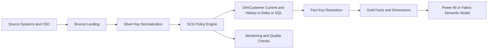
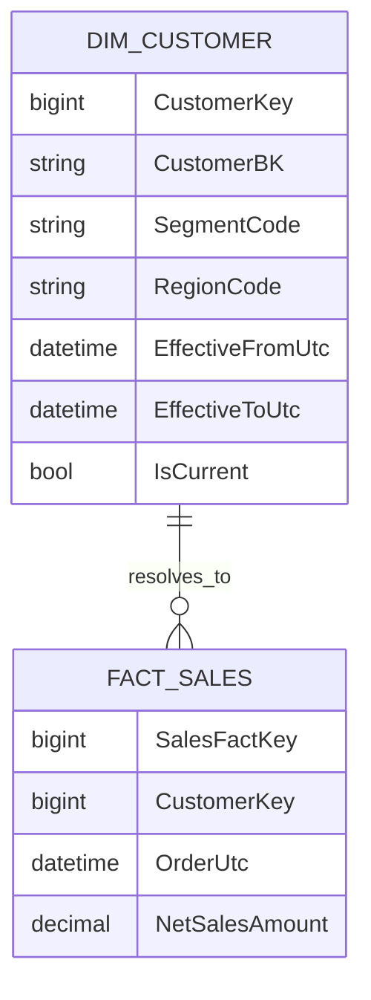
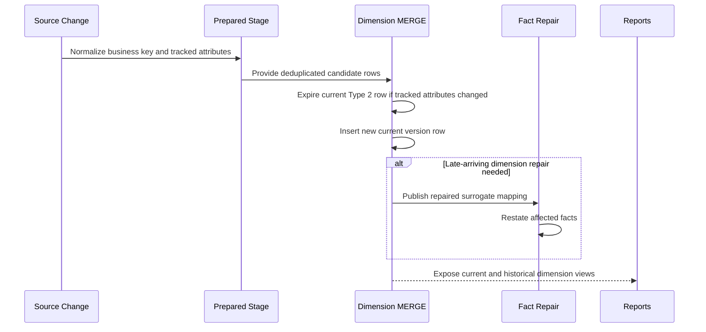

# Slowly Changing Dimensions

> Part of the **Enterprise Data & AI Architecture Handbook** · Phase-06 - Data Modeling & Warehousing · Chapter 05.
> Estimated study time: **45 min reading + ~3h labs**.
> **Prerequisites:** read [Dimensional Modeling](01_Dimensional_Modeling.md), [Data Vault 2.0](02_Data_Vault_2_0.md), [Batch Pipeline Design](../Phase-05/09_Batch_Pipeline_Design.md), [Lakehouse Architecture](../Phase-05/02_Lakehouse_Architecture.md), [Medallion Architecture](../Phase-05/03_Medallion_Architecture.md), [Delta Lake](../Phase-04/04_Delta_Lake.md), [Apache Iceberg](../Phase-04/05_Apache_Iceberg.md), and [dbt and Analytics Engineering](../Phase-05/08_dbt_and_Analytics_Engineering.md) first.

---

## Executive Summary

Slowly changing dimensions are the control mechanism that decides how descriptive business attributes change without destroying analytical truth. They answer questions such as whether a customer should be reported under their current region or the region they belonged to when the sale occurred, whether a product reclassification should restate history, and whether a manager change should affect prior-period accountability. The central design question is not whether a team can implement Type 2. The real question is which changes deserve history, which should be corrected in place, and how facts will resolve to the right surrogate key over time.

The choice of SCD policy is a semantic contract, not an ETL convenience. Type 1 is often right for typo correction and low-value attributes. Type 2 is often right for analytically meaningful context changes such as customer segment, sales territory, or policy status. Types 3 through 6 exist because some domains need current-versus-prior comparisons, separate history tables, or hybrid behavior. The design fails when teams choose an SCD type globally per dimension without thinking at the attribute or business-question level.

In Azure-first data platforms, SCD implementations commonly live in Azure Databricks, Fabric, Synapse, or Azure SQL serving layers over Delta tables, Fabric Warehouses, or relational marts. The operationally hard parts are deterministic change detection, effective dating, surrogate-key assignment, late-arriving dimension handling, idempotent reruns, and fact restatement when business history arrives out of order. Delta Lake and Apache Iceberg make MERGE-driven implementations easier and more auditable, but they do not remove the need to define business history semantics explicitly.

This chapter covers SCD types 0 through 6, effective dating and surrogate keys, MERGE-based implementation, late-arriving dimensions, and SCD with Delta and Iceberg. The intended outcome is pragmatic: choose the smallest history mechanism that preserves business truth, implement it in a replay-safe way, and avoid turning every descriptive attribute into an expensive Type 2 liability.

## Learning Objectives

By the end of this chapter you should be able to:

1. Explain why slowly changing dimensions exist and how they relate to [Dimensional Modeling](01_Dimensional_Modeling.md).
2. Distinguish SCD Types 0 through 6 and choose among them using business semantics rather than habit.
3. Design surrogate-key, natural-key, and effective-dating strategies for historical dimensions.
4. Implement MERGE-based SCD pipelines in Azure SQL, Delta Lake, and Iceberg-backed platforms.
5. Handle late-arriving dimensions, inferred members, and fact restatement safely.
6. Decide which attributes deserve Type 2 history and which should remain Type 1 or Type 0.
7. Optimize SCD tables for storage, compute, and semantic correctness in Azure-first lakehouse and warehouse estates.
8. Recognize anti-patterns such as uncontrolled Type 2 growth, weak key matching, and undocumented hybrid SCD behavior.
9. Build monitoring, observability, and governance controls around dimension-history pipelines.
10. Defend SCD design decisions in engineer, staff engineer, architect, and CTO review settings.

## Business Motivation

- Businesses need to know which customer, product, organization, or policy attributes were true at the time of a transaction.
- Finance and regulatory teams need historically consistent reporting when attributes such as region, legal entity, plan, or channel change.
- Marketing and customer-success teams need both current and historical segmentation views.
- Data teams need a way to correct bad descriptive data without accidentally restating prior facts.
- Azure FinOps teams need to avoid turning every attribute change into a runaway storage and compute bill.
- Enterprises need a consistent cross-domain policy for history so semantic models and marts do not each invent their own version of "customer as of" logic.
- AI feature and audit teams need traceable historical context for training, backtesting, and explainability.

## History and Evolution

- Early reporting systems often overwrote descriptive attributes in place, which made current reporting easy but historical interpretation wrong.
- Kimball-style dimensional modeling formalized slowly changing dimensions as a set of patterns for preserving or overwriting attribute history depending on business need.
- Traditional warehouse ETL implemented Type 2 with batch windows, surrogate keys, current flags, and effective dates in relational warehouses.
- MPP and cloud warehouse platforms made large historical dimensions more feasible, but also exposed the cost of overly broad Type 2 usage.
- Lakehouse patterns using [Delta Lake](../Phase-04/04_Delta_Lake.md) and [Apache Iceberg](../Phase-04/05_Apache_Iceberg.md) brought ACID MERGE semantics and table-version management to open-format SCD implementations.
- [Data Vault 2.0](02_Data_Vault_2_0.md) offered an alternative history-capture strategy at the integration layer, but dimensional SCD remained the dominant pattern for business consumption models.
- Modern platforms increasingly use metadata-driven SCD frameworks, attribute-level change policies, and governed restatement playbooks instead of hand-built dimension scripts.

## Why This Technology Exists

Slowly changing dimensions exist because descriptive context changes more slowly than facts, but it still changes often enough that overwriting it blindly corrupts analysis. A sale happens once. A customer's segment, geography, account owner, or compliance classification may change several times after that sale. If the dimension always shows only the latest value, historical reporting becomes a moving target.

The technology also exists because different attributes deserve different historical treatment. A corrected spelling of a customer name usually should not create a new historical row. A change of sales region, risk class, or employer often should. Without a formal SCD policy, teams either over-preserve history and pay for noise or under-preserve history and lose analytical truth.

It further exists because warehouse and lakehouse pipelines need deterministic, repeatable rules for reconciling source updates. SCD patterns turn ambiguous source change into executable logic: preserve original, overwrite, version, carry prior value, separate history, or combine approaches. That logic becomes the bridge between source volatility and business-readable analytical context.

## Problems It Solves

| Problem | SCD response | Enterprise signal that it is working |
|---|---|---|
| customer or product attributes change after facts are loaded | preserve or overwrite dimension history according to policy | reports reproduce prior-period context correctly |
| business users disagree on whether history should restate | codify attribute-level change treatment | finance, sales, and operations use the same history rules |
| late-arriving dimension data causes lookup gaps | use inferred members, suspense, or bounded restatement | fact loads do not silently lose context |
| repeated source corrections create manual rework | use MERGE-based deterministic change handling | reruns produce the same final state |
| current and prior reporting need different attribute views | use Type 2, 3, 5, or 6 patterns where justified | both as-was and current-state analysis are explainable |
| large Type 2 dimensions become hard to manage | separate change-worthy attributes and optimize storage | history volume grows in line with business value |
| open lakehouse history and business history are confused | distinguish Delta/Iceberg table versioning from SCD semantics | teams know that time travel is not the same as conformed business history |

## Problems It Cannot Solve

- It cannot fix missing or unstable business keys in source systems.
- It does not replace raw ingestion history, CDC lineage, or integration history from [Data Vault 2.0](02_Data_Vault_2_0.md).
- It is not a complete master-data-management strategy.
- It cannot make every attribute historically meaningful; some changes are just noise.
- It should not be used as a substitute for clear fact restatement policy.
- It does not remove the need for source-data quality, stewardship, and reconciliation.
- It cannot resolve privacy and deletion obligations automatically when historical rows contain regulated personal data.

## Core Concepts

### 8.1 What changes in a dimension

Dimensions contain descriptive attributes, not measures. The difficult question is not whether a row changed in a source system. The difficult question is whether that change matters to business interpretation of facts. Address standardization, legal-name corrections, and casing cleanup often deserve Type 1 overwrite. Territory reassignment, customer-segment change, and pricing-band change often deserve Type 2 or a hybrid form because they alter business meaning over time.

### 8.2 SCD Types 0 through 6

The handbook uses the following definitions. Types 4 through 6 vary by organization, so document the pattern behavior explicitly rather than relying on the number alone.

| Type | Pattern | What it does | Typical fit | Main risk |
|---|---|---|---|---|
| 0 | retain original | never change the stored attribute after initial load | birth date, original signup channel, immutable regulatory flags | preserves bad data if immutability was chosen carelessly |
| 1 | overwrite | replace old value in place, no history | typo correction, low-value descriptive cleanup | historical analysis restates silently |
| 2 | add new row | preserve full history through new surrogate-key version rows | customer segment, territory, policy status, organization mapping | storage growth and as-of join complexity |
| 3 | add prior-value column | keep current plus one or a few prior states in extra columns | current-versus-prior comparison for a small set of attributes | limited history depth and awkward schema evolution |
| 4 | separate history table | keep current row in main dimension and archive history separately | hot current-serving plus auditable history | split logic between current and history tables |
| 5 | mini-dimension or current-profile overlay | combine current-profile convenience with historical support, often via Type 4 or mini-dimension patterns | behavioral or rapidly changing profile bands | taxonomy confusion and semantic opacity |
| 6 | hybrid 1+2+3 | preserve Type 2 row history while also carrying current/prior values for simplified reporting | domains needing both as-was and current-aligned reporting | duplicated semantics and extra maintenance |

### 8.3 Surrogate keys, business keys, and effective dating

Type 2 and related patterns depend on separating the natural or business key from the surrogate key. The business key identifies the real entity. The surrogate key identifies one historical version of that entity in the dimension. Effective-from and effective-to timestamps or dates, plus an `IsCurrent` flag, define the validity window. Facts then join to the correct dimension version based on business key plus event time or pre-resolved surrogate key.

### 8.4 Current flags, high dates, and audit columns

Most production SCD tables use a standard set of technical fields: surrogate key, business key, effective-from, effective-to, current flag, load timestamp, source system, and often a hashdiff or canonicalized change hash. High-date conventions such as `9999-12-31` simplify current-row predicates and range joins, but the convention must be standard across the estate.

### 8.5 Late-arriving dimensions and early-arriving facts

Late-arriving dimensions occur when descriptive context arrives after facts that need it. Early-arriving facts are the other side of the same problem. Mature platforms use inferred members, suspense queues, or bounded restatement windows rather than dropping facts or inventing untracked defaults. The key is to make the missing-context state visible and repairable.

### 8.6 MERGE-based implementation and idempotency

MERGE-based pipelines compare staged records to current dimension versions, detect changed attribute groups, close current rows where needed, and insert new versions deterministically. For lakehouse implementations, staged source rows often need to be deduplicated and normalized before MERGE. The operational rule is simple: the same input batch rerun twice must lead to the same final current row and the same history rows, not duplicates.

### 8.7 Delta and Iceberg versus business history

Delta and Iceberg support table-level history and ACID mutation semantics. That is valuable for replay, audit, and rollback. It is not the same as business-conformed SCD history. Time travel tells you how the table looked at a point in processing time. SCD tells you how the business attribute should be interpreted for a point in business time. Conflating those concepts is a recurring design mistake.

## Internal Working

### 9.1 Source change qualification

The pipeline begins by selecting candidate dimension rows from source extracts, CDC, or staging tables. Business keys are canonicalized, duplicate source events are collapsed, and attribute groups are normalized for comparison. If the source does not identify changed rows reliably, the platform must derive change using hashes or full-row comparison.

### 9.2 Change detection by policy

Each attribute or attribute group is evaluated against the SCD policy catalog. Type 1 attributes may be overwritten. Type 2 attributes trigger row versioning when changed. Type 0 attributes are ignored after first load. Type 3 attributes update current and prior columns. Hybrid patterns apply multiple behaviors to the same business entity in a controlled way.

### 9.3 Closing and opening rows

For Type 2, the current version row is closed by setting `EffectiveTo` and `IsCurrent = 0`, then a new row is inserted with the next surrogate key, new effective start, and `IsCurrent = 1`. This step must use deterministic ordering when multiple updates for the same business key arrive in one batch. The system should never create overlapping validity windows unless multi-active dimension behavior is an explicit pattern.

### 9.4 Fact-key resolution

Facts either store the resolved surrogate key at load time or join to dimensions using business key plus event date. The former is faster for downstream reporting. The latter is more flexible but can be expensive or dangerous if the dimension rules shift. In most enterprise dimensional platforms, facts store the resolved surrogate key after the dimension pipeline finishes.

### 9.5 Late-arriving repair

When facts arrive before the correct dimension version exists, the platform inserts an inferred member or routes the fact to a suspense table. Once the missing dimension data arrives, the inferred row is updated or the fact is restated to point to the correct surrogate key. This repair path must be explicit and tested, not improvised after a reporting incident.

### 9.6 Delta and Iceberg execution path

In Delta or Iceberg-backed systems, the MERGE or update-plus-insert sequence writes new data files and metadata snapshots atomically. The platform then needs compaction, clustering, and snapshot-retention policy so history remains queryable without fragmenting performance. Table-format capabilities help operational safety, but they do not choose the SCD type for you.

## Architecture

### 10.1 Azure-first reference architecture

The common Azure pattern lands source data in ADLS Gen2 or OneLake, standardizes business keys in silver, runs SCD logic in Azure Databricks or Fabric Spark, and publishes current and historical dimensions into Delta, Fabric Warehouse, Synapse, or Azure SQL serving layers. Dimension control metadata and quality checks live alongside the pipeline. Facts load only after dimension history and surrogate-key lookup tables are ready.

### 10.2 Why the architecture works

This architecture separates source volatility from business-serving semantics. Bronze and silver absorb source churn. Dimension pipelines apply history policy once. Facts consume the resulting surrogate keys. Semantic models and marts then query a stable historical contract rather than reconstructing history on the fly. The design aligns naturally with [Lakehouse Architecture](../Phase-05/02_Lakehouse_Architecture.md) and [Medallion Architecture](../Phase-05/03_Medallion_Architecture.md).

### 10.3 ADR example: standardize Type 2 only for analytically material attributes

**Context:** The enterprise has large customer and product dimensions. Teams want every change tracked historically because storage seems cheap. Early prototypes generate massive Type 2 growth from minor formatting corrections, making fact resolution slower and history harder to explain.

**Decision:** Standardize an attribute-level SCD policy catalog. Use Type 2 only for analytically material attributes such as segment, territory, legal entity, risk band, and major classification. Use Type 1 for low-value corrections and Type 0 for immutable values. Require steward approval before adding new Type 2 attributes.

**Consequences:** History becomes smaller, more explainable, and cheaper to maintain. Some source changes remain non-historical by design, so stakeholders must agree on what is and is not analytically meaningful.

**Alternatives considered:**

1. Type 2 every attribute: rejected because storage, compute, and interpretability costs were too high.
2. Type 1 by default everywhere: rejected because important business context would be lost.
3. Reconstruct history only from raw CDC at query time: rejected because semantic and performance complexity would shift downstream.

## Components

| Component | Role | Azure-first implementation choices | Common failure mode |
|---|---|---|---|
| business key | stable real-world entity identifier | source key canonicalized in silver or staging | source duplicates treated as real entities |
| surrogate key | identifies one dimension version row | SQL identity, sequence, generated surrogate in warehouse or lakehouse | facts store natural keys only and lose historical resolution |
| current row marker | identifies active dimension version | `IsCurrent` flag plus high date | current row logic becomes inconsistent across dimensions |
| effective dates | define validity window | `EffectiveFromUtc`, `EffectiveToUtc` or date variants | overlapping or gapped validity windows |
| change hash | compare tracked attribute groups | SHA-256 or similar canonicalized hash | non-normalized inputs create false deltas |
| inferred member handler | supports late-arriving context | placeholder row and repair workflow | missing dimensions hidden behind generic unknowns forever |
| MERGE pipeline | executes Type 1/2/6 row changes | Databricks SQL, Fabric SQL, Azure SQL, Spark jobs | source duplicates cause duplicate history |
| dimension lookup service | resolves fact to surrogate key | join table, point lookup, or pre-materialized mapping | facts resolve against stale dimension versions |
| quality checks | validate row uniqueness and date ranges | dbt tests, SQL assertions, Great Expectations | history corruption detected only in reports |
| table format or warehouse engine | stores history and supports mutation | Delta, Iceberg, Fabric Warehouse, Azure SQL | engine time travel mistaken for business history |

## Metadata

SCD platforms require metadata beyond ordinary dimension definitions.

| Metadata class | What to record | Why it matters |
|---|---|---|
| attribute SCD policy | Type 0, 1, 2, 3, 4, 5, or 6 per attribute group | prevents accidental history drift |
| business-key rule | canonicalization, null handling, source precedence | ensures stable identity |
| effective-date rule | event time, source update time, or load time choice | determines historical truth semantics |
| hashdiff rule | tracked columns and normalization order | makes change detection reproducible |
| inferred-member rule | placeholder defaults and repair behavior | governs late-arriving context safely |
| restatement policy | whether and how facts are corrected after late dimension arrival | prevents ad hoc historical rewrites |
| privacy classification | which historical attributes are sensitive or deletable | supports compliance decisions |
| steward ownership | business approver and technical owner | makes change policy reviewable |

If the platform cannot explain why an attribute is Type 2, who approved it, and how late arrivals are repaired, the dimension history is not governed.

## Storage

SCD storage strategy is about preserving history without turning dimensions into write-amplified graveyards.

| Storage concern | Recommended posture | Notes |
|---|---|---|
| Type 2 dimensions | columnar or warehouse tables with efficient current-row pruning | optimize natural key plus current lookup paths |
| current-only serving | optional view or table over active versions | useful for simple current-state consumers |
| Type 4 history split | current table plus archive or history table | reduces hot-path table size |
| Delta or Iceberg history | retain enough snapshots for replay and RCA, not forever without policy | table snapshot history is not a substitute for SCD |
| partitioning | rarely partition small dimensions; partition very large Type 2 tables cautiously by load or effective date | over-partitioning creates small files |
| clustering | cluster or sort on business key, current flag, or effective start for large dimensions | improves as-of join and current lookup speed |

For many dimensions, clustering and good statistics matter more than partitioning. A small customer dimension does not need elaborate physical layout. A huge account or product-history dimension often does.

## Compute

| Workload class | Best Azure-first surface | Why it fits | Wrong default |
|---|---|---|---|
| large Type 2 dimension processing | Azure Databricks jobs or Fabric Spark | scalable hash compare and MERGE semantics | low-code row-by-row ETL logic |
| medium warehouse-centric dimension processing | Fabric Warehouse, Synapse SQL, or Azure SQL | straightforward relational history management | forcing Spark for tiny dimensions |
| small departmental marts | Azure SQL Database or Fabric Warehouse | simple operations and predictable joins | distributed compute for low-volume Type 1 changes |
| metadata-driven open-format history | Delta Lake or Iceberg on Spark | strong support for transactional history mutation | file-by-file overwrite pipelines |
| downstream semantic consumption | Power BI or Fabric semantic model over resolved dimensions | hides historical complexity from report authors | on-the-fly surrogate resolution in every report |

Compute selection should follow change volume, dimension size, and mutation semantics, not only source preference.

## Networking

- Keep storage, Spark compute, and warehouse serving surfaces region-aligned where possible.
- Use private endpoints for ADLS Gen2, Azure SQL, Key Vault, and monitoring sinks in regulated environments.
- Avoid network hops inside long-running dimension transactions or MERGE operations.
- Document source-latency dependencies for late-arriving dimensions so support teams know when history lag is an upstream problem.
- Separate semantic-serving incidents from dimension-processing incidents in runbooks.

Late-arriving dimension problems are often blamed on warehouses even when the real issue is delayed upstream data delivery across network or integration boundaries.

## Security

| Concern | Recommended control |
|---|---|
| historical sensitive values | mask or restrict columns that reveal prior PII, compensation, or risk classifications |
| dimension access | least-privilege access to raw historical tables; wider access through curated views or semantic models |
| secret handling | Managed Identity and Key Vault instead of embedded credentials |
| compliance deletion | define redaction or tombstoning strategy for historical rows containing deletable data |
| audit | retain who changed the pipeline policy, not only who changed the source data |

Type 2 history makes privacy discussions harder because old values remain intentionally preserved. That is a governance decision, not only a technical side effect.

## Performance

SCD performance depends on how efficiently the platform answers two questions: what changed, and which dimension version matches each fact.

- Hash only the tracked attribute set, not the entire row blindly.
- Deduplicate staged source rows by business key and event time before MERGE.
- Keep current-row lookups fast through indexes, clustering, or narrow views.
- Avoid Type 2 on attributes that churn frequently without analytical value.
- Separate current-serving access patterns from historical analysis when beneficial.

| Pattern | Azure recommendation | Why |
|---|---|---|
| current customer lookup | index or cluster on `(CustomerBK, IsCurrent)` | fast fact resolution and serving joins |
| as-of joins on very large dimensions | cluster by business key and effective start; prune by date where possible | reduces range-scan cost |
| heavy Type 2 churn from source corrections | split Type 1 and Type 2 attribute groups | avoids unnecessary row versioning |
| large Delta dimension | periodic `OPTIMIZE` and data skipping on key columns | improves MERGE and query performance |

## Scalability

SCD scales when policy, metadata, and automation scale with it.

- Standardize technical columns and change-detection patterns across dimensions.
- Use metadata-driven pipelines so new dimensions do not require bespoke code.
- Split rapidly changing behavioral attributes into mini-dimensions or separate structures when justified.
- Keep Type 2 growth bounded by business value, not by fear of losing any change.
- Treat late-arriving repair as a first-class workflow, not a support script.

Many failed SCD estates do not fail because Type 2 is conceptually hard. They fail because every dimension invents its own conventions.

## Fault Tolerance

Fault tolerance for SCD means being able to rerun change detection, replay a batch, and repair historical associations without corrupting dimension windows.

- make MERGE sources deterministic and deduplicated,
- store batch IDs, source timestamps, and load timestamps,
- validate for overlapping current rows after every run,
- keep inferred-member repair idempotent,
- use Delta or Iceberg snapshot rollback for operational recovery when appropriate,
- separate table recovery from business-history restatement.

Operational recovery gets much easier when dimensions are driven by versioned metadata and bounded restatement windows rather than ad hoc manual edits.

## Cost Optimization

SCD cost control starts with policy discipline. Storage is cheap until unnecessary Type 2 churn multiplies MERGE work, compaction work, semantic complexity, and report confusion.

- Use Type 2 only for attributes whose history is analytically material.
- Keep high-churn, low-value attributes in Type 1 or off the core dimension entirely.
- Compact and cluster large Delta or Iceberg dimensions periodically instead of continuously.
- Separate current-serving views from full history where downstream workloads do not need the entire table.
- Use small relational engines for dimensions that do not justify distributed compute.

Worked FinOps example: assume a customer dimension has 20 million business keys and receives 1.2 million daily source updates. If every attribute is treated as Type 2, the dimension may add hundreds of millions of version rows annually, forcing heavier Databricks MERGE workloads and repeated file compaction. At an illustrative 18 DBU-hours per daily run on a medium jobs cluster, monthly compute may land near $297 at $0.55 per DBU-hour before storage and serving overhead. If policy review reduces Type 2-tracked attributes so only 8 percent of daily changes create new versions, the same platform might run in 6 DBU-hours per day, or roughly $99 per month, while also reducing downstream semantic complexity. The primary savings come from lower churn and simpler history, not from cheaper disks alone.

## Monitoring

| Metric | Why it matters | Typical threshold |
|---|---|---|
| Type 2 insert count per load | detects change spikes and policy drift | alert on abnormal deviation by dimension |
| Type 1 overwrite count | shows correction volume and source instability | review sustained spikes |
| inferred-member count | measures late-arriving dimension pressure | alert when backlog grows |
| current-row uniqueness violations | detects corrupted history windows | zero tolerance |
| MERGE duration and file count | shows mutation cost and fragmentation | alert on sustained growth |
| fact lookup miss rate | detects missing or mismatched dimension versions | near-zero for critical marts |
| restatement queue size | reveals repair lag | alert when outside business SLA |

## Observability

Observability should let the team answer which source change caused a new dimension version, why the version was classified as Type 2, which facts resolved against it, and whether a later repair changed those associations.

- Capture source record identifiers, batch IDs, load timestamps, and tracked-attribute hashes.
- Persist SCD policy version or configuration version with pipeline runs.
- Trace inferred-member creation and repair to downstream fact restatements.
- Keep lineage from source update to dimension version to semantic model exposure.

### Operational response playbooks

| Signal | Detection query or rule | Likely cause | First remediation |
|---|---|---|---|
| Type 2 row count spikes 10x day over day | compare new version counts by dimension and source | source formatting change, hash canonicalization defect, or bad policy rollout | freeze downstream publish, inspect attribute hash inputs, rollback policy change if needed |
| inferred-member backlog grows | query rows flagged as inferred older than SLA | upstream reference feed delay or broken key match | notify upstream owner, backfill missing dimensions, rerun fact-key repair |
| multiple current rows exist for one business key | SQL check on `BusinessKey` with `IsCurrent = 1` count > 1 | MERGE source duplicates or race condition | quarantine affected keys, rebuild dimension slice, harden source dedupe |

## Governance

SCD governance is the discipline of deciding which changes matter historically and who is allowed to change that answer.

- Maintain an attribute-level SCD policy catalog reviewed by business stewards and data architects.
- Document the handbook's meaning for Types 4, 5, and 6 because enterprises use those labels inconsistently.
- Require approval before changing an attribute from Type 1 to Type 2 or vice versa.
- Publish standard technical columns and validity-window conventions.
- Align privacy, retention, and deletion rules with the fact that historical values may remain intentionally visible.
- Keep semantic-model owners aligned with dimension-history policy so DAX or SQL does not reinvent time logic.

The major governance failure to avoid is casual Type 2 expansion: a local team adds history for convenience, and suddenly enterprise reporting semantics change without review.

## Trade-offs

| Choice | Advantages | Disadvantages | When to prefer it |
|---|---|---|---|
| Type 1 | simple, small, easy to query | loses historical context | corrections and low-value attribute changes |
| Type 2 | full as-was history | larger storage, more complex joins and restatements | analytically important context changes |
| Type 3 | easy current-versus-prior comparison | limited history depth | one-step comparison requirements |
| Type 4 | fast current-state table with separate history | split maintenance and query paths | hot current workloads plus audit history |
| Type 5 or 6 | flexible hybrid reporting | harder to explain and govern | specific current-plus-history comparison needs |
| raw CDC only | source-faithful change evidence | poor direct business usability | integration or audit layer, not user-facing marts |

## Decision Matrix

| Requirement | Type 0 | Type 1 | Type 2 | Type 3 | Type 4 | Type 5 | Type 6 |
|---|---|---|---|---|---|---|---|
| preserve original value only | strong | weak | medium | medium | medium | medium | medium |
| full historical timeline | weak | weak | strong | weak | strong | medium | strong |
| current-versus-prior comparison in one row | weak | weak | weak | strong | weak | medium | strong |
| low storage overhead | strong | strong | weak | medium | medium | medium | weak |
| simple downstream querying | strong | strong | medium | medium | medium | weak | weak |
| best default for enterprise dimensions | weak | strong | strong | weak | medium | weak | weak |

For most enterprises, the real default decision is between Type 1 and Type 2. Types 3 through 6 are deliberate exceptions, not the baseline.

## Design Patterns

1. **Type 2 with current flag and effective dates:** the most common full-history dimensional pattern.
2. **Inferred member pattern:** create a placeholder row for a missing business key, then repair later.
3. **Type 1 plus Type 2 attribute split:** keep only analytically meaningful attributes historical.
4. **Current-view pattern:** expose a current-only view over a Type 2 table for operational consumers.
5. **Type 4 current plus history split:** keep the hot serving table lean while preserving archive history.
6. **Mini-dimension for fast-changing profile bands:** separate rapidly changing segmentation from the core dimension.
7. **Restatement queue pattern:** capture facts that must be re-keyed when late dimensions arrive.
8. **Hashdiff compare pattern:** compare tracked attribute groups efficiently for large dimensions.

## Anti-patterns

- Turning every attribute into Type 2 because storage seems cheap.
- Using source natural keys as fact foreign keys in place of surrogate version keys.
- Running MERGE against duplicated or unordered source data.
- Treating Delta or Iceberg snapshot history as if it were the same as business SCD history.
- Keeping `IsCurrent` flags without effective dates, then attempting as-of reporting later.
- Letting semantic models resolve SCD logic independently from warehouse rules.
- Using hybrid Types 5 or 6 without explicit documentation of behavior.
- Ignoring late-arriving dimensions until users report bad numbers.

## Common Mistakes

- Tracking source formatting cleanup as Type 2 business history.
- Using load time instead of business effective time without acknowledging the semantics.
- Forgetting to expire current rows before inserting a new Type 2 version.
- Allowing overlapping effective windows for one business key.
- Comparing raw strings without trimming, casing, or null normalization, which causes false change detection.
- Failing to deduplicate source updates within a batch.
- Restating facts inconsistently after late-arriving dimensions are repaired.
- Assuming Types 4, 5, and 6 mean the same thing across teams and tools.

## Best Practices

- Decide SCD policy at the attribute or attribute-group level, not only per dimension.
- Standardize business-key normalization, high dates, audit columns, and current-row conventions.
- Use Type 2 only for analytically meaningful changes.
- Deduplicate staged source rows before MERGE and make reruns idempotent.
- Keep inferred-member workflows visible, measurable, and repairable.
- Separate table-format operational history from business history semantics.
- Validate current-row uniqueness and non-overlapping date windows on every run.
- Provide downstream consumers with both current-state and historical-friendly access patterns where needed.
- Document the enterprise meaning of Type 4, 5, and 6 explicitly.

## Enterprise Recommendations

1. Publish an enterprise SCD policy standard with default columns, date semantics, and type definitions.
2. Default to Type 1 unless a business owner can explain why historical preservation affects decisions or compliance.
3. Standardize Type 2 dimensions on surrogate keys, business keys, `IsCurrent`, `EffectiveFrom`, `EffectiveTo`, and audit metadata.
4. Use Delta or Fabric-native lakehouse patterns for large mutable dimensions and Azure SQL or Fabric Warehouse for smaller dimensional serving layers.
5. Require explicit late-arriving-dimension and fact-restatement playbooks for critical marts.
6. Keep semantic models and marts downstream of the governed SCD logic rather than duplicating it.
7. Review Type 2 growth, inferred-member backlog, and restatement volume monthly as platform health metrics.
8. Treat Type 5 and Type 6 as exceptions requiring architecture review.

## Azure Implementation

### 31.1 Recommended Azure service map

| Layer | Preferred Azure service | Notes |
|---|---|---|
| landing and staging | ADF, Fabric Data Factory, Databricks Auto Loader | move source changes into silver reliably |
| SCD compute | Azure Databricks Premium or Fabric Spark | scalable MERGE-based history handling |
| serving dimension storage | Delta in Unity Catalog, Fabric Warehouse, Synapse, or Azure SQL | choose by scale and consumer pattern |
| semantic consumption | Power BI or Fabric semantic model | current and historical reporting paths |
| governance | Purview plus Unity Catalog where Databricks is used | publish policy and lineage |
| secrets and identity | Managed Identity and Key Vault | avoid embedded credentials |
| monitoring | Azure Monitor, Log Analytics, Databricks alerts | dimension-health telemetry |

### 31.2 Example Type 2 dimension DDL in Azure SQL or Fabric Warehouse

```sql
create table dbo.DimCustomer (
    CustomerKey bigint identity(1,1) not null primary key,
    CustomerBK nvarchar(100) not null,
    CustomerName nvarchar(200) not null,
    SegmentCode nvarchar(50) not null,
    RegionCode nvarchar(50) not null,
    EffectiveFromUtc datetime2 not null,
    EffectiveToUtc datetime2 not null,
    IsCurrent bit not null,
    IsInferred bit not null default 0,
    ChangeHash binary(32) not null,
    SourceSystem nvarchar(50) not null,
    LoadUtc datetime2 not null default sysutcdatetime(),
    constraint UQ_DimCustomer_Current unique (CustomerBK, EffectiveFromUtc)
);

create index IX_DimCustomer_CurrentLookup
    on dbo.DimCustomer (CustomerBK, IsCurrent)
    include (CustomerKey, EffectiveFromUtc, EffectiveToUtc, ChangeHash);
```

### 31.3 Example MERGE-based Type 2 pattern in Azure SQL

```sql
declare @Changed table (
    MergeAction nvarchar(10),
    CustomerBK nvarchar(100),
    CustomerName nvarchar(200),
    SegmentCode nvarchar(50),
    RegionCode nvarchar(50),
    EffectiveFromUtc datetime2,
    ChangeHash binary(32),
    SourceSystem nvarchar(50)
);

with src as (
    select
        CustomerBK,
        CustomerName,
        SegmentCode,
        RegionCode,
        EffectiveFromUtc,
        hashbytes(
            'SHA2_256',
            concat(
                upper(trim(CustomerName)), '|',
                upper(trim(SegmentCode)), '|',
                upper(trim(RegionCode))
            )
        ) as ChangeHash,
        SourceSystem
    from stage.CustomerPrepared
)
merge dbo.DimCustomer as target
using src
on  target.CustomerBK = src.CustomerBK
and target.IsCurrent = 1
when matched and target.ChangeHash <> src.ChangeHash then
    update set
        target.IsCurrent = 0,
        target.EffectiveToUtc = dateadd(second, -1, src.EffectiveFromUtc)
when not matched by target then
    insert (
        CustomerBK,
        CustomerName,
        SegmentCode,
        RegionCode,
        EffectiveFromUtc,
        EffectiveToUtc,
        IsCurrent,
        ChangeHash,
        SourceSystem
    )
    values (
        src.CustomerBK,
        src.CustomerName,
        src.SegmentCode,
        src.RegionCode,
        src.EffectiveFromUtc,
        '9999-12-31',
        1,
        src.ChangeHash,
        src.SourceSystem
    )
output
    $action,
    src.CustomerBK,
    src.CustomerName,
    src.SegmentCode,
    src.RegionCode,
    src.EffectiveFromUtc,
    src.ChangeHash,
    src.SourceSystem
into @Changed;

insert into dbo.DimCustomer (
    CustomerBK,
    CustomerName,
    SegmentCode,
    RegionCode,
    EffectiveFromUtc,
    EffectiveToUtc,
    IsCurrent,
    ChangeHash,
    SourceSystem
)
select
    CustomerBK,
    CustomerName,
    SegmentCode,
    RegionCode,
    EffectiveFromUtc,
    '9999-12-31',
    1,
    ChangeHash,
    SourceSystem
from @Changed
where MergeAction = 'UPDATE';
```

This pattern is compact, but it still requires source deduplication and concurrency testing. Many teams prefer explicit `UPDATE` plus `INSERT` for operational clarity even when the logic is conceptually MERGE-based.

### 31.4 Example Delta Lake Type 2 MERGE pattern in Databricks SQL

```sql
with deduped as (
    select *
    from (
        select
            customer_bk,
            customer_name,
            segment_code,
            region_code,
            effective_from_utc,
            sha2(concat_ws('|', upper(trim(customer_name)), upper(trim(segment_code)), upper(trim(region_code))), 256) as change_hash,
            row_number() over (partition by customer_bk order by effective_from_utc desc) as rn
        from silver.customer_prepared
    ) s
    where rn = 1
),
staged as (
    select customer_bk as merge_key, * , 'expire' as action from deduped
    union all
    select cast(null as string) as merge_key, * , 'insert' as action from deduped
)
merge into gold.dim_customer as target
using staged as source
on  target.customer_bk = source.merge_key
and target.is_current = true
when matched and source.action = 'expire' and target.change_hash <> source.change_hash then
  update set
    is_current = false,
    effective_to_utc = source.effective_from_utc - interval 1 second
when not matched and source.action = 'insert' then
  insert (
    customer_bk,
    customer_name,
    segment_code,
    region_code,
    effective_from_utc,
    effective_to_utc,
    is_current,
    change_hash,
    source_system,
    load_utc
  ) values (
    source.customer_bk,
    source.customer_name,
    source.segment_code,
    source.region_code,
    source.effective_from_utc,
    timestamp('9999-12-31 00:00:00'),
    true,
    source.change_hash,
    'crm',
    current_timestamp()
  );
```

### 31.5 Inferred member repair example

```sql
update gold.dim_customer
set
    customer_name = src.customer_name,
    segment_code = src.segment_code,
    region_code = src.region_code,
    is_inferred = false,
    change_hash = sha2(concat_ws('|', upper(trim(src.customer_name)), upper(trim(src.segment_code)), upper(trim(src.region_code))), 256),
    load_utc = current_timestamp()
from silver.customer_prepared src
where gold.dim_customer.customer_bk = src.customer_bk
  and gold.dim_customer.is_inferred = true
  and gold.dim_customer.is_current = true;
```

### 31.6 Example Bicep and CLI

```bicep
param location string = resourceGroup().location

resource storage 'Microsoft.Storage/storageAccounts@2023-05-01' = {
  name: 'stscd${uniqueString(resourceGroup().id)}'
  location: location
  sku: {
    name: 'Standard_ZRS'
  }
  kind: 'StorageV2'
  properties: {
    isHnsEnabled: true
    minimumTlsVersion: 'TLS1_2'
    allowBlobPublicAccess: false
  }
}

resource sqlServer 'Microsoft.Sql/servers@2023-08-01-preview' = {
  name: 'sql-scd-${uniqueString(resourceGroup().id)}'
  location: location
  properties: {
    publicNetworkAccess: 'Disabled'
  }
}
```

```bash
az group create --name rg-edai-scd-prod --location westeurope
az deployment group create --resource-group rg-edai-scd-prod --template-file infra/main.bicep
```

Practical service guidance:

- Azure Databricks Premium is usually the pragmatic choice for large Delta-based Type 2 dimensions with Unity Catalog governance.
- Fabric F64 or larger becomes attractive when Direct Lake and Fabric-native semantic consumption must sit close to the SCD output.
- Azure SQL Database or Fabric Warehouse remains efficient for small and medium dimensions where distributed compute is unnecessary.

## Open Source Implementation

Open-source SCD stacks usually combine Spark, open table formats, orchestration, metadata frameworks, and data-quality testing.

| Layer | Open-source choice | Notes |
|---|---|---|
| storage | object storage or MinIO | append-friendly history storage |
| table format | Delta Lake, Apache Iceberg, or Hudi | choose based on engine ecosystem |
| transformation | Spark SQL or dbt | strong fit for merge-style SCD logic |
| orchestration | Airflow | schedule dimension-first and repair workflows |
| testing | dbt tests or Great Expectations | validate uniqueness and date windows |
| serving | Trino, ClickHouse, DuckDB extracts, or PostgreSQL marts | expose history downstream without rebuilding it in reports |
| governance | OpenMetadata or Apache Atlas | steward policy and lineage |

Example Iceberg Type 2 MERGE pattern in Spark SQL:

```sql
with source_deduped as (
    select
        customer_bk,
        customer_name,
        segment_code,
        region_code,
        effective_from_utc,
        sha2(concat_ws('|', upper(trim(customer_name)), upper(trim(segment_code)), upper(trim(region_code))), 256) as change_hash,
        row_number() over (partition by customer_bk order by effective_from_utc desc) as rn
    from staging.customer_prepared
),
staged as (
    select customer_bk as merge_key, customer_bk, customer_name, segment_code, region_code, effective_from_utc, change_hash, 'expire' as action
    from source_deduped where rn = 1
    union all
    select null as merge_key, customer_bk, customer_name, segment_code, region_code, effective_from_utc, change_hash, 'insert' as action
    from source_deduped where rn = 1
)
merge into mart.dim_customer t
using staged s
on t.customer_bk = s.merge_key and t.is_current = true
when matched and s.action = 'expire' and t.change_hash <> s.change_hash then
  update set is_current = false, effective_to_utc = s.effective_from_utc - interval '1' second
when not matched and s.action = 'insert' then
  insert (customer_bk, customer_name, segment_code, region_code, effective_from_utc, effective_to_utc, is_current, change_hash)
  values (s.customer_bk, s.customer_name, s.segment_code, s.region_code, s.effective_from_utc, timestamp '9999-12-31 00:00:00', true, s.change_hash);
```

Example dbt snapshot for Type 2-like behavior:

```yaml
snapshots:
  - name: dim_customer_snapshot
    relation: ref('stg_customer')
    config:
      strategy: check
      unique_key: customer_bk
      check_cols: ['segment_code', 'region_code']
      invalidate_hard_deletes: true
```

Example Airflow outline:

```python
with DAG("scd_customer_pipeline", schedule="0 2 * * *", catchup=False) as dag:
    land = BashOperator(task_id="land", bash_command="python jobs/land_customer.py")
    prepare = BashOperator(task_id="prepare", bash_command="python jobs/prepare_customer.py")
    merge_dim = BashOperator(task_id="merge_dim", bash_command="spark-sql -f sql/merge_dim_customer.sql")
    repair_inferred = BashOperator(task_id="repair_inferred", bash_command="spark-sql -f sql/repair_inferred_customer.sql")
    validate = BashOperator(task_id="validate", bash_command="dbt test --select dim_customer")

    land >> prepare >> merge_dim >> repair_inferred >> validate
```

## AWS Equivalent (comparison only)

| Azure pattern | AWS equivalent | Advantages | Disadvantages | Migration note |
|---|---|---|---|---|
| Azure Databricks or Fabric Spark on Delta | Databricks on AWS, EMR Spark, or Glue with Iceberg/Hudi | strong open-format SCD options | IAM, catalog, and orchestration patterns differ | keep SCD policy metadata portable and engine-agnostic |
| ADLS Gen2 or OneLake historical dimension store | S3 plus Glue catalog or Lake Formation | mature object-storage ecosystem | governance often spans more services | separate history semantics from storage platform |
| Fabric Warehouse or Azure SQL dimension serving | Redshift or PostgreSQL-based serving marts | strong SQL-serving alternatives | surrogate-key and MERGE behavior may differ operationally | benchmark fact lookup and late-arrival repair flows |

The migration principle is to preserve business history semantics first. Service mapping is secondary.

## GCP Equivalent (comparison only)

| Azure pattern | GCP equivalent | Advantages | Disadvantages | Migration note |
|---|---|---|---|---|
| Databricks or Fabric Spark SCD processing | Dataproc, Databricks on GCP, or BigQuery plus ELT patterns | strong analytical compute options | different mutation semantics and operational cost envelopes | retest MERGE behavior and clustering strategy |
| ADLS Gen2 or OneLake with Delta | GCS plus Iceberg or BigQuery-managed patterns | scalable object storage and serverless analytics | business-history logic may move between engines differently | preserve SCD metadata and restatement rules explicitly |
| Azure SQL or Fabric Warehouse serving | BigQuery or PostgreSQL marts | strong SQL access | different serving and storage-mode assumptions | validate semantic-model expectations around current and historical access |

GCP can execute the same business-history logic, but the operational knobs and cost behaviors differ enough that SCD needs retesting, not just translation.

## Migration Considerations

- From Type 1-only dimensions: identify which attributes materially affect historical reporting before converting anything to Type 2.
- From legacy ETL to Delta or Iceberg: preserve surrogate-key semantics and business effective dates during the move.
- From direct report logic: move SCD interpretation into the curated dimension so semantic tools do not each implement their own as-of rules.
- From raw CDC-only estates: decide whether raw change history must become business-history rows or remain an integration artifact.
- During cutover: reconcile current-state and as-of-period outputs side by side for agreed validation windows.
- Avoid big-bang conversion of every dimension to Type 2 in one release; migrate the highest-value entities first.

## Mermaid Architecture Diagrams







## End-to-End Data Flow

1. Source attributes land in bronze or staging with business keys and technical metadata.
2. Silver normalization standardizes key formats, null handling, and tracked attribute groups.
3. The SCD policy engine classifies each attribute change as Type 0, 1, 2, 3, 4, 5, or 6 behavior.
4. Current dimension rows are compared to deduplicated source candidates using hashes or direct comparison.
5. Type 1 updates overwrite current rows where allowed.
6. Type 2 or hybrid changes expire current rows and insert new surrogate-key versions.
7. Inferred members are created or repaired for late-arriving dimensions.
8. Facts load or restate against the resolved surrogate keys.
9. Semantic models and marts consume stable historical dimensions rather than reconstructing business history on demand.
10. Monitoring and governance track change rates, repair backlog, and history quality.

## Real-world Business Use Cases

| Use case | Why SCD fits | Typical SCD choice |
|---|---|---|
| retail customer segmentation | customers move between loyalty tiers and regions | Type 2 for segment and region, Type 1 for name cleanup |
| insurance policy attributes | broker, policy status, and product class change over time | Type 2 or Type 6 for high-value status fields |
| financial account ownership | responsibility and hierarchy change but prior reporting must remain stable | Type 2 on organization and owner mappings |
| product master reclassification | category and brand families change while historical sales need original context | Type 2 or Type 3 depending reporting need |
| HR workforce analytics | cost center and manager change over time | Type 2 with privacy controls |
| healthcare provider networks | provider affiliation and region change while historical encounter context must remain correct | Type 2 plus inferred-member handling |

## Industry Examples

| Industry | Common SCD entities | Typical historically tracked attributes | Frequent pitfall |
|---|---|---|---|
| retail | customer, product, store | segment, category, region | tracking formatting changes as Type 2 |
| banking | account, branch, customer | risk band, legal entity, portfolio assignment | using load date instead of business effective date |
| insurance | policy, broker, plan | policy status, distribution channel, underwriting class | inconsistent late-arrival repair across claims and policy facts |
| manufacturing | supplier, plant, asset | supplier tier, plant hierarchy, asset ownership | ignoring fact restatement after hierarchy repairs |
| healthcare | member, provider, facility | network, specialty, geography | privacy rules not aligned with historical retention |

## Case Studies

### Case study 1: customer-region restatement avoided through disciplined Type 2

A global retailer initially overwrote customer region in place because it simplified current reporting. Quarterly regional P&L started drifting whenever customers relocated or were reassigned to new sales territories. The platform team converted region and segment to Type 2 while keeping name and email cleanup as Type 1. Facts resolved to surrogate keys at load time, and prior-period regional revenue stabilized immediately.

The key lesson was that not all customer attributes deserved history. The success came from selective Type 2, not from making the entire customer table historical.

### Case study 2: late-arriving provider hierarchy in healthcare

A healthcare analytics team loaded encounter facts before the definitive provider-affiliation hierarchy arrived from an upstream credentialing system. They used a generic unknown provider row for too long, which made regional utilization reporting inaccurate for weeks. The remediation added inferred members, a repair SLA, and explicit fact restatement logic when the true provider dimension row arrived.

The technical change was modest. The important change was operational: unknown and inferred rows became measurable debt rather than tolerated ambiguity.

### Case study 3: failure story from Type 2 everything

A product analytics team configured nearly every product attribute as Type 2, including spelling, description formatting, and internal tagging fields. Daily change volume exploded, Delta compaction lagged, and semantic models became hard to explain because tiny editorial adjustments created new product versions.

The recovery path was to reclassify only analytically meaningful attributes as Type 2, move descriptive cleanup to Type 1, and separate fast-changing behavioral tags into a mini-dimension. The failure was not that Type 2 is bad. The failure was treating history as free.

## Hands-on Labs

1. **Type 1 versus Type 2 lab:** load a customer dimension and classify attributes into overwrite or historical sets.
2. **MERGE lab:** implement a Type 2 dimension using Databricks SQL or Azure SQL with deterministic deduplication.
3. **Late-arriving dimension lab:** create inferred members, then repair them when the true source row arrives.
4. **Delta or Iceberg lab:** compare table-version time travel with business-history SCD queries to show why they are not the same thing.

Acceptance criteria:

- the dimension has surrogate key, business key, current flag, and effective dates,
- at least one Type 1 and one Type 2 attribute are implemented,
- rerunning the same staged batch is idempotent,
- inferred-member repair and validation queries succeed,
- as-of fact joins return the expected historical row.

## Exercises

1. Classify ten sample customer attributes into Type 0, 1, 2, 3, 4, 5, or 6 and justify each choice.
2. Explain why a product description typo is usually Type 1 while a product category reclassification may be Type 2.
3. Design a surrogate-key and effective-date scheme for a policy dimension.
4. Write a query that detects overlapping Type 2 validity windows for one business key.
5. Explain how you would repair facts loaded before their customer dimension row arrived.
6. Compare Delta table time travel to business-effective SCD history.
7. Decide whether manager history in an HR dimension should be Type 2, Type 3, or Type 6 and defend the choice.
8. Design a mini-dimension pattern for rapidly changing behavioral segments.
9. Explain when Type 4 is operationally better than one very large Type 2 table.
10. Describe how semantic models should consume current-state versus historical dimensions from this chapter and [Dimensional Modeling](01_Dimensional_Modeling.md).

## Mini Projects

1. **Retail customer history mart:** build a customer dimension with Type 1 and Type 2 attributes plus a sales fact that resolves surrogate keys correctly.
2. **Insurance policy-history pipeline:** implement late-arriving policy updates, inferred members, and restatement of claim facts.
3. **Fabric-native SCD showcase:** publish a Direct Lake-compatible dimension history from Delta or Warehouse tables and compare current versus historical reporting behavior.

## Capstone Integration

This chapter matters because it operationalizes historical dimensional truth across the rest of the handbook.

- Use [Dimensional Modeling](01_Dimensional_Modeling.md) to decide the business role of the dimension.
- Use [Batch Pipeline Design](../Phase-05/09_Batch_Pipeline_Design.md) to make SCD loads replay-safe and backfillable.
- Use [Data Vault 2.0](02_Data_Vault_2_0.md) when raw historical integration must be broader than the dimensional serving layer.
- Use [Delta Lake](../Phase-04/04_Delta_Lake.md) and [Apache Iceberg](../Phase-04/05_Apache_Iceberg.md) for scalable ACID mutation and operational rollback, not as substitutes for business-history policy.
- Keep semantic-model and metric layers downstream of governed SCD logic so history is interpreted once.

## Interview Questions

1. Why do slowly changing dimensions exist in dimensional models?
2. What is the difference between Type 1 and Type 2, and when would you choose each?
3. Why are surrogate keys necessary for Type 2 dimensions?
4. What problem do effective dates and current flags solve?
5. How would you handle a late-arriving dimension row needed by already loaded facts?
6. Why is Delta or Iceberg table history not the same thing as SCD business history?
7. When would Type 3 be more appropriate than Type 2?
8. What are the risks of using MERGE on duplicated source rows?
9. Why are Types 5 and 6 considered special-case patterns rather than defaults?
10. How would you explain inferred members to a business stakeholder?

## Staff Engineer Questions

1. How would you design an attribute-level SCD policy catalog that many domain teams can reuse?
2. When would you choose Azure SQL over Databricks or Fabric Spark for an SCD workload?
3. How would you benchmark whether a Type 2 dimension has become too wide or too volatile?
4. What tests would you enforce to guarantee non-overlapping effective windows and single-current-row integrity?
5. How would you structure a metadata-driven MERGE framework for hundreds of dimensions?
6. When is fact restatement better than inferred-member correction in place?
7. How do you decide whether a late-arriving dimension should block fact publication or allow provisional load?
8. How would you keep Type 2 semantics aligned between the warehouse and the semantic model layer?

## Architect Questions

1. Where should SCD logic live relative to landing, conformance, business-vault, dimensional marts, and semantic models?
2. Which enterprise attributes truly deserve historical preservation and which do not?
3. How do you standardize SCD taxonomy when different teams use Types 4, 5, and 6 differently?
4. How do you reconcile privacy deletion requirements with intentionally retained Type 2 history?
5. What migration path would you choose from Type 1-only legacy dimensions to a governed Type 2 estate?
6. How do you make SCD logic portable across Azure SQL, Delta, Iceberg, and future platforms?
7. When does a mini-dimension or separate history table outperform a monolithic Type 2 design?
8. How do you prove that Type 2 complexity is delivering business value and not just engineering ceremony?

## CTO Review Questions

1. Which business metrics are currently unstable because historical dimension context is being overwritten?
2. How much cost is the platform carrying from unnecessary Type 2 history that nobody uses?
3. Which regulated or executive decisions depend on correct as-of descriptive context?
4. Is the organization treating source CDC history as if it were already business history?
5. What governance mechanism prevents teams from quietly changing history semantics in dimensions?
6. How will the enterprise measure whether its SCD strategy improves trust without creating uncontrolled complexity?

## References

- Internal prerequisite chapters:
- [Dimensional Modeling](01_Dimensional_Modeling.md)
- [Data Vault 2.0](02_Data_Vault_2_0.md)
- [Batch Pipeline Design](../Phase-05/09_Batch_Pipeline_Design.md)
- [Lakehouse Architecture](../Phase-05/02_Lakehouse_Architecture.md)
- [Medallion Architecture](../Phase-05/03_Medallion_Architecture.md)
- [Delta Lake](../Phase-04/04_Delta_Lake.md)
- [Apache Iceberg](../Phase-04/05_Apache_Iceberg.md)
- [dbt and Analytics Engineering](../Phase-05/08_dbt_and_Analytics_Engineering.md)
- Canonical sources to study separately:
- Ralph Kimball and Margy Ross, *The Data Warehouse Toolkit*.
- Dan Linstedt and Michael Olschimke, *Building a Scalable Data Warehouse with Data Vault 2.0* for contrast at the integration layer.
- Microsoft documentation for Fabric, Azure Databricks, Azure SQL, Delta Lake, and Power BI semantic models.
- Apache Iceberg and Delta Lake documentation for MERGE, snapshot history, and maintenance commands.

## Further Reading

- Revisit [Dimensional Modeling](01_Dimensional_Modeling.md) to connect SCD choices back to business grain and conformed dimensions.
- Study [Batch Pipeline Design](../Phase-05/09_Batch_Pipeline_Design.md) for rerun, backfill, and repair patterns that make SCD pipelines trustworthy.
- Study [Delta Lake](../Phase-04/04_Delta_Lake.md) and [Apache Iceberg](../Phase-04/05_Apache_Iceberg.md) maintenance behavior before scaling large Type 2 dimensions.
- Study semantic-layer history handling so current and as-of reporting remain consistent in Power BI or Fabric.
- Study privacy-retention strategies for historical dimensions containing regulated personal data.