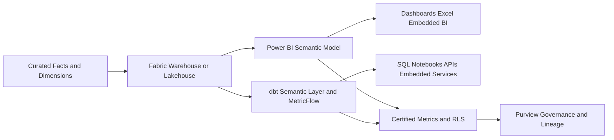
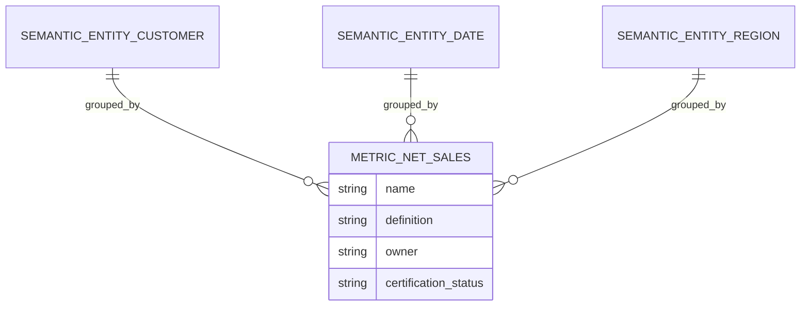
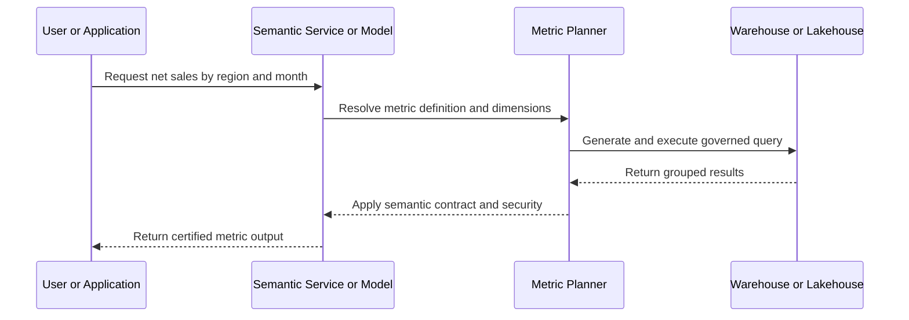

# Semantic Layer and Metrics

> Part of the **Enterprise Data & AI Architecture Handbook** · Phase-06 - Data Modeling & Warehousing · Chapter 06.
> Estimated study time: **60 min reading + ~3h labs**.
> **Prerequisites:** read [Dimensional Modeling](01_Dimensional_Modeling.md), [OLAP and Cube Modeling](04_OLAP_and_Cube_Modeling.md), [Slowly Changing Dimensions](05_Slowly_Changing_Dimensions.md), [Lakehouse Architecture](../Phase-05/02_Lakehouse_Architecture.md), [Medallion Architecture](../Phase-05/03_Medallion_Architecture.md), [dbt and Analytics Engineering](../Phase-05/08_dbt_and_Analytics_Engineering.md), and [Microsoft Fabric](../Phase-05/07_Microsoft_Fabric.md) first.

---

## Executive Summary

The semantic layer exists because most analytical failures are not caused by missing data. They are caused by inconsistent meaning. Revenue, active customer, net retention, gross margin, inventory on hand, and policy count become unreliable when every dashboard, notebook, API, and embedded product calculates them differently. A semantic layer centralizes business meaning above storage and transformation so consumers ask for governed metrics instead of rebuilding logic on top of raw tables.

Modern semantic platforms now span two architectural styles. The first is the traditional BI semantic model, exemplified by Power BI semantic models and tabular engines, where metrics, hierarchies, relationships, and security live close to the reporting surface. The second is headless BI or metric-store architecture, exemplified by dbt Semantic Layer and MetricFlow, where metric definitions are modeled as reusable metadata and served into many downstream tools through APIs, SQL generation, or query planners. The right design question is not which product name is fashionable. The real question is where metric logic should live so that it remains consistent, testable, performant, and reusable across the analytical estate.

In Azure-first environments, the pragmatic pattern is usually hybrid. Curated stars and marts from [Dimensional Modeling](01_Dimensional_Modeling.md) remain the substrate. Power BI semantic models often provide the user-facing semantic contract for business reporting, while dbt Semantic Layer or related metric-store patterns can govern reusable metric definitions for SQL-first, notebook, and embedded analytics consumers. This allows the platform to separate business logic ownership from report authoring and to reduce the repeated reinvention of KPI formulas across tools.

This chapter covers headless BI and metric stores, consistent metric definitions, dbt Semantic Layer and MetricFlow, Power BI semantic models, and governance of metrics. The goal is practical: establish one trusted layer for analytical meaning, keep it deployable and observable like software, and stop treating metrics as informal strings buried in charts and ad hoc SQL.

## Learning Objectives

By the end of this chapter you should be able to:

1. Explain why a semantic layer is distinct from both raw storage and report visualization.
2. Distinguish traditional BI semantic models from headless BI and metric-store architectures.
3. Define metrics so they remain consistent across dashboards, SQL clients, notebooks, and applications.
4. Decide when Power BI semantic models, dbt Semantic Layer, or a hybrid architecture is the right fit.
5. Model governed dimensions, entities, time grains, and filters that support reusable metric computation.
6. Implement and validate metric definitions with dbt Semantic Layer or MetricFlow.
7. Design Azure-first semantic-serving architectures with Fabric, Power BI, Databricks SQL, and curated marts.
8. Govern metric ownership, certification, versioning, and deprecation at enterprise scale.
9. Recognize anti-patterns such as metric duplication, local dashboard logic, and semantic drift between tools.
10. Defend semantic-layer architecture decisions in engineer, staff engineer, architect, and CTO reviews.

## Business Motivation

- Executives need the same KPI answer regardless of whether they ask in Power BI, Excel, SQL, or an embedded application.
- Data teams need to stop re-implementing definitions such as active customer, net sales, and churn in every downstream artifact.
- Finance and operations functions need certified measures with lineage, owners, refresh expectations, and review history.
- Platform teams need to reduce query sprawl and duplicated calculation cost across the lakehouse and warehouse estate.
- Azure FinOps programs need to control the cost of repeated analytical queries and the cost of maintaining many near-duplicate semantic assets.
- Product and AI teams increasingly need governed metrics outside BI tools, including in APIs, notebooks, and agent workflows.
- Enterprises need a way to evolve metric logic deliberately instead of discovering semantic change through broken dashboards.

## History and Evolution

- Early BI programs embedded metric logic directly in reports, spreadsheets, or stored procedures, which scaled usage but not consistency.
- OLAP cubes centralized some business meaning through measures and hierarchies, but often remained tightly coupled to a specific reporting stack.
- Tabular semantic models and tools such as Analysis Services and Power BI improved reuse by separating model logic from report visuals.
- As the modern data stack grew, SQL-first transformation workflows popularized metric definitions in code, especially through dbt.
- Headless BI emerged to separate metric definition from visualization, allowing APIs, notebooks, semantic query planners, and multiple BI tools to reuse the same logical layer.
- Metric stores and semantic compilers such as MetricFlow formalized entities, time grains, dimensions, and measures as software-managed metadata.
- Current enterprise practice is increasingly hybrid: tabular models remain strong for end-user BI, while headless semantic layers support cross-tool analytical reuse and developer-friendly metric governance.

## Why This Technology Exists

The semantic layer exists because the business meaning of data is more stable and more valuable than the SQL used to compute it. Analysts, finance teams, and applications all ask versions of the same questions, but if each one implements filters, grain, joins, and business rules independently, the organization accumulates semantic debt. The semantic layer turns that shared meaning into a centrally managed artifact.

It also exists because warehouses and lakehouses are optimized for storing and querying data, not for governing every consumer-facing definition. Storage engines expose tables, partitions, and file layouts. Businesses reason in metrics, dimensions, entities, and time. The semantic layer translates between those worlds by defining how curated data should be interpreted and consumed.

Headless BI and metric stores exist specifically because semantic logic increasingly needs to escape the boundaries of classic dashboard tools. A metric definition should be consumable by BI, SQL APIs, notebooks, reverse ETL, and AI agents without each consumer re-encoding the calculation. That is why metric semantics are moving into declarative metadata and service layers rather than remaining trapped in one visualization product.

## Problems It Solves

| Problem | Semantic-layer response | Enterprise signal that it is working |
|---|---|---|
| the same KPI is calculated differently in different tools | centralize metric definitions and reusable dimensions | revenue, churn, or margin reconciles across BI and SQL consumers |
| dashboards hide complex local business logic | move logic into governed shared models | report development becomes thinner and more reusable |
| analytical tools do not share semantics | expose metrics through APIs, semantic models, or SQL planners | notebooks, dashboards, and apps reference the same metric catalog |
| report authors query source models inconsistently | provide a curated semantic contract above facts and dimensions | self-service improves without raw-schema guesswork |
| governance teams cannot tell which metric is official | certify metrics with owners, lineage, and lifecycle state | business users know which definitions are authoritative |
| repeated queries overload warehouse or lakehouse compute | cache, aggregate, or semantic-route repeated patterns | source query pressure declines for common business views |
| metric changes break downstream consumers unexpectedly | version and test semantic definitions like code | metric changes are reviewed, communicated, and traceable |

## Problems It Cannot Solve

- It cannot fix bad upstream dimensional models or low-quality source data.
- It is not a substitute for storage, transformation, or raw-history architecture.
- It cannot make every metric universal when different business processes legitimately need different definitions.
- It does not remove the need for data-product ownership and business stewardship.
- It should not be used to mask unresolved grain conflicts or ambiguous dimensions.
- It cannot guarantee low latency if storage mode, source engine, or query routing are poorly chosen.
- It does not eliminate the need for report design discipline and UX judgment.

## Core Concepts

### 8.1 What a semantic layer is

A semantic layer is the governed interpretation layer between curated data and consumers. It defines entities, metrics, dimensions, relationships, hierarchies, filters, time grains, and security behavior so that downstream tools ask for business concepts rather than reconstructing logic from source tables. In practice, the semantic layer can be realized as a Power BI semantic model, a metric store, a headless BI service, or a hybrid of those patterns.

### 8.2 Metrics, measures, entities, and dimensions

The terminology varies by platform, but the conceptual distinctions matter:

- a metric is a business-facing definition such as monthly active customers, net sales, or gross margin percentage,
- a measure is often the computational building block used inside a semantic engine,
- an entity is the reusable business object a metric relates to, such as customer, order, or subscription,
- dimensions are the attributes and time grains used to filter, group, and segment metrics.

Headless metric stores make these distinctions explicit because they need to generate correct SQL or API behavior across many tools, not only one dashboard engine.

### 8.3 Headless BI and metric stores

Headless BI separates semantic definition from visual consumption. Instead of embedding logic inside a reporting tool, the platform defines metrics once and serves them through APIs, generated SQL, or query planners. A metric store is the persisted catalog and serving mechanism for those definitions. This pattern is useful when the organization wants consistent metrics across Power BI, notebooks, SQL clients, embedded analytics, and application services.

### 8.4 dbt Semantic Layer and MetricFlow

dbt Semantic Layer uses semantic models, entities, measures, dimensions, and metrics defined as code. MetricFlow is the planning engine that understands those definitions and generates queries at the right grain. This makes metric logic testable, reviewable, and reusable in SQL-first and developer-centric estates. It does not replace curated stars; it sits on top of them.

### 8.5 Power BI semantic models

Power BI semantic models provide tables, relationships, hierarchies, DAX measures, RLS, aggregations, and storage-mode behavior for business consumption. They are strong when the organization is Microsoft-centric and when end-user BI, Excel, Fabric, and embedded Power BI experiences are important. They are less ideal as the sole cross-tool semantic contract when many non-Power BI consumers need governed metric access programmatically.

### 8.6 Metric governance

Metric governance is the discipline of deciding who owns a metric, how it is defined, when it changes, what it depends on, and which consumers are allowed to treat it as official. Without that discipline, semantic layers become another place where inconsistency hides instead of where it is resolved.

### 8.7 Semantic layer versus OLAP model

As described in [OLAP and Cube Modeling](04_OLAP_and_Cube_Modeling.md), semantic models can include OLAP-style acceleration such as Import, Direct Lake, DirectQuery, and aggregation routing. The semantic-layer concern is broader: it includes metric definition, ownership, and multi-tool reuse even when no classical cube metaphor is present. Not every semantic layer is an OLAP cube, but every governed OLAP model is serving a semantic purpose.

## Internal Working

### 9.1 Curated source ingestion into semantics

Semantic layers begin from curated source models, usually stars, marts, or governed views. The system maps entities and dimensions, declares measures, and then exposes metric definitions above those building blocks. If the underlying grain is wrong, the semantic layer cannot rescue it. That is why [Dimensional Modeling](01_Dimensional_Modeling.md) remains foundational.

### 9.2 Query planning and metric compilation

In headless BI systems, a metric query planner resolves which tables, joins, filters, and time grains are required to answer a request. In dbt Semantic Layer, MetricFlow analyzes semantic-model metadata and generates SQL for the requested metric grain and filters. In Power BI, the engine evaluates DAX measures and relationships, sometimes delegating to Import, Direct Lake, or DirectQuery paths.

### 9.3 Security and filter application

The semantic layer applies row-level, object-level, or consumer-specific filters consistently across queries. This is important because security is part of meaning. A metric that excludes data for a user's scope is not merely a different query result. It is the governed answer that user is allowed to receive.

### 9.4 Caching, aggregation, and acceleration

Semantic platforms often improve performance through pre-computed aggregations, in-memory storage, cached query results, or storage-mode-specific acceleration. The point is not only speed. It is to reduce repeated computational waste on the underlying warehouse or lakehouse while keeping business meaning centralized.

### 9.5 Versioning and lifecycle behavior

Metrics evolve. A modern semantic platform therefore needs source control, deployment processes, backward-compatibility policy, certification state, and deprecation rules. Changes to the definition of active customer or net revenue should look like governed software releases, not hidden edits inside one dashboard file.

## Architecture

### 10.1 Azure-first reference architecture

The common Azure pattern starts with curated facts and dimensions in Fabric Warehouse, Fabric Lakehouse, Azure Databricks SQL, Synapse, or Azure SQL marts. A semantic serving layer is then split into two possible paths. One path uses Power BI semantic models on Fabric or Premium capacity for end-user BI, Excel, and embedded reporting. The other path uses dbt Semantic Layer or MetricFlow-style metadata over curated models for SQL-first, notebook, embedded, and service consumers. Large enterprises often use both, with shared curated models beneath them.

### 10.2 Why this architecture works

This architecture separates data curation from business meaning and separates business meaning from report presentation. Curated stars define the raw analytical contract. Semantic models and metric stores define the governed business interpretation. Reports, notebooks, apps, and APIs consume that interpretation without re-implementing it. The result is better consistency, better reuse, and often lower total cost because repeated metric logic no longer fans out across dozens of local tools.

### 10.3 ADR example: adopt a hybrid semantic strategy for BI and headless metric reuse

**Context:** The enterprise has strong Fabric and Power BI adoption, but data scientists, embedded product teams, and SQL analysts keep redefining metrics outside BI. Finance complains that numbers match in executive dashboards but differ in notebooks and ad hoc SQL. A single-tool semantic standard would not serve all consumers well.

**Decision:** Standardize on certified Power BI semantic models for broad business reporting and use dbt Semantic Layer over curated marts for cross-tool metric reuse in SQL, notebooks, and application-facing analytics. Align both layers to the same governed dimensional substrate and metric ownership process.

**Consequences:** Business reporting and cross-tool analytical reuse both improve. The organization must invest in semantic governance, metadata alignment, and release discipline across two semantic-serving paths.

**Alternatives considered:**

1. Power BI only for all semantics: rejected because non-BI consumers still reimplemented metrics elsewhere.
2. Headless metric store only: rejected because Power BI semantic capabilities and user workflows still mattered materially.
3. No central semantic layer: rejected because inconsistency and duplication were already too costly.

## Components

| Component | Role | Azure-first implementation choices | Common failure mode |
|---|---|---|---|
| curated source model | stable analytical substrate for metrics | Fabric Warehouse, Lakehouse gold tables, Databricks SQL, Azure SQL marts | source grain ambiguity leaks upward |
| semantic model | BI-facing governed measures and relationships | Power BI semantic model, Fabric semantic model | report-local copies diverge from shared logic |
| metric store | reusable declarative metric catalog | dbt Semantic Layer / MetricFlow | metrics exist in code but are not adopted by consumers |
| query planner | resolves metric requests to joins and filters | MetricFlow or engine-specific semantic planner | planner metadata mismatches source reality |
| governance catalog | ownership, certification, lineage, lifecycle state | Purview, Unity Catalog metadata, semantic registry | no one knows which metric is official |
| security layer | RLS, OLS, metric access policy | Power BI roles, service-level filters, source controls | security logic differs across tools |
| acceleration layer | import cache, Direct Lake path, aggregations | Power BI semantic storage modes, warehouse summaries | performance depends on hidden local optimizations |
| deployment pipeline | promotes semantic changes safely | Fabric deployment pipelines, XMLA automation, GitHub Actions, Azure DevOps | production metrics change manually |
| API or SQL serving path | exposes metrics beyond dashboards | dbt Semantic Layer adapters, service endpoints, query APIs | notebooks bypass semantic definitions |
| observability stack | tracks usage, failure, and drift | Fabric metrics, Log Analytics, app telemetry | semantic incidents lack evidence |

## Metadata

Semantic layers are metadata systems first and query systems second.

| Metadata class | What to record | Why it matters |
|---|---|---|
| metric definition | formula, filters, numerator/denominator logic, grain assumptions | preserves business meaning |
| entity definition | primary entity and join path assumptions | avoids invalid metric compilation |
| dimension availability | which dimensions a metric can be grouped by | prevents nonsensical drill paths |
| time semantics | default grain, window rules, fiscal calendar references | aligns period logic |
| ownership metadata | business steward and technical owner | supports approval and incident routing |
| certification state | draft, reviewed, certified, deprecated | guides consumer trust |
| lineage | upstream marts, columns, refresh path, downstream consumers | supports RCA and change analysis |
| security metadata | RLS rules, restricted audiences, sensitivity labels | governs who can see what |
| lifecycle metadata | version, release date, deprecation target, replacement metric | makes change manageable |

If a metric lacks owner, grain assumption, and lineage, it is a formula, not a governed enterprise asset.

## Storage

Semantic layers do not usually invent primary storage formats, but storage choices underneath them strongly affect cost and usability.

| Storage concern | Recommended posture | Notes |
|---|---|---|
| curated facts and dimensions | columnar, query-efficient star or mart layouts | semantic layers work best on stable analytical substrates |
| semantic cache or import storage | use where repeated interactive queries justify duplication | common in Power BI Import and tabular patterns |
| metric-store metadata | version-controlled code or registry | treat metric definitions like software assets |
| summary or aggregation storage | materialize only where usage proves value | avoid speculative aggregate sprawl |
| security-sensitive metrics | separate exposure policy from raw storage presence | not every stored measure should be user-facing |

The important design point is that semantic value comes from interpretation, not from one special file format. But poor storage design underneath the layer will still make metrics expensive or slow.

## Compute

| Workload class | Best Azure-first surface | Why it fits | Wrong default |
|---|---|---|---|
| executive BI and self-service reporting | Power BI semantic model on Fabric or Premium capacity | strong user-facing semantic features and acceleration | exposing raw SQL marts to every report author |
| SQL-first reusable metrics | dbt Semantic Layer with MetricFlow over curated warehouse or lakehouse | developer-friendly metric reuse across tools | coding metrics separately in notebooks and dashboards |
| embedded cross-channel analytics | hybrid metric store plus semantic model | supports APIs and BI simultaneously | forcing embedded consumers to screen-scrape BI logic |
| lightweight domain metrics for a small team | Power BI shared semantic model or dbt-only semantic path | limited governance overhead with central logic | building many isolated metric services too early |
| large Fabric-native analytics estate | Direct Lake or Import semantic models plus shared metrics governance | strong Azure integration | DirectQuery everywhere by convenience |

Compute choice should follow who consumes metrics, how often, through which interfaces, and with what latency and freshness expectations.

## Networking

- Keep semantic services, source warehouses, and BI capacities region-aligned where possible.
- Use private connectivity for source systems that semantic refreshes or metric APIs depend on.
- Avoid long gateway chains between Power BI semantic models and operationally distant sources.
- Treat headless metric API latency as a network and service design concern, not only a SQL concern.
- Document which semantic calls stay within capacity caches and which push down to lakehouse or warehouse compute.

When every metric request crosses multiple network boundaries and shared gateways, users experience semantic inconsistency as performance unreliability.

## Security

| Concern | Recommended control |
|---|---|
| metric visibility | certify and expose only approved metrics by audience or workspace |
| row-level restrictions | centralize RLS logic in semantic models or metric-serving layer where appropriate |
| service credentials | managed identities, service principals, secure gateway secrets, and Key Vault |
| semantic admin access | restrict XMLA, deployment, and metric-registry write access tightly |
| sensitive derived metrics | explicitly govern exposure of compensation, risk, health, or margin-sensitive measures |
| auditability | log metric-definition changes, not only source table access |

Metrics are often more sensitive than the underlying raw columns because they encode business interpretation. Secure the interpretation layer as well as the data.

## Performance

Semantic-layer performance depends on model shape, query planning, storage mode, metric complexity, and consumer reuse.

- Prefer star schemas and governed marts as the metric substrate.
- Keep metric definitions composable and avoid hidden filter surprises.
- Use Import or Direct Lake for repeated interactive BI queries when possible.
- Use headless query planning only when the underlying source model can support generated SQL efficiently.
- Cache or pre-aggregate frequently requested metrics where business patterns are stable.
- Prevent local report logic from bypassing centralized accelerations.

| Pattern | Azure recommendation | Why |
|---|---|---|
| executive KPI dashboards | Power BI Import or Direct Lake over certified semantic model | strong interactivity and reuse |
| SQL notebook reuse of common metrics | MetricFlow over curated marts | keeps SQL analysts on governed definitions |
| embedded API delivery of topline KPIs | headless metric service with caching | decouples app latency from ad hoc warehouse scans |
| high-cardinality local experimentation | separate exploratory path outside certified metrics | prevents semantic layer bloat |

## Scalability

Semantic-layer scalability is mostly an organizational challenge before it is a technical one.

- Reuse shared semantic assets rather than multiplying local copies.
- Version metrics as code and promote them through environments.
- Split metric domains by business ownership when one catalog becomes too broad.
- Align Power BI semantic models and metric-store definitions to the same entity model and naming standards.
- Keep deprecation workflows active so old metrics do not linger indefinitely.

Without discipline, metric sprawl scales faster than data volume.

## Fault Tolerance

Fault tolerance in semantic systems means consumers still know which metric version is in service, which refresh or compilation failed, and how to recover safely.

- semantic definitions should deploy transactionally or with clear rollback,
- cached or imported models need recoverable refresh paths,
- headless metric services need source-failure and planner-failure observability,
- deprecated metrics should fail predictably or redirect clearly, not disappear silently,
- semantic incidents should isolate whether the source data, metric logic, or serving layer is at fault.

Semantic reliability matters because once executives trust a metric layer, a semantic outage becomes a business outage.

## Cost Optimization

Cost optimization is about centralizing repeated semantic work where it creates reuse and avoiding duplicate platforms where it does not.

- Use shared semantic models instead of dozens of report-local datasets.
- Use metric stores to prevent every notebook and app from re-running custom SQL logic.
- Reserve expensive interactive BI capacity for workloads that genuinely need it.
- Avoid over-engineering a metric service when a shared semantic model is sufficient for the domain.
- Materialize or cache only the metrics that are actually queried frequently.

Worked FinOps example: suppose a business domain has 120 Power BI reports, 40 notebook workflows, and 6 embedded services all calculating revenue and active customer independently against a Fabric Warehouse. If this causes repeated warehouse query spend plus duplicated engineering effort, centralizing those definitions into one shared semantic model and one reusable metric-store path can reduce both compute and maintenance cost. Even if a Fabric F64 capacity and a modest semantic-service layer cost more than ad hoc local formulas appear to cost, the combined reduction in warehouse churn, debugging time, and executive metric disputes often outweighs the extra platform line items. The largest savings usually come from semantic reuse, not from one cheaper SKU.

## Monitoring

| Metric | Why it matters | Typical threshold |
|---|---|---|
| metric query latency | user and application experience for governed metrics | alert when breaching agreed SLO |
| semantic-model refresh duration and failures | BI freshness and availability | alert on SLA breach |
| metric adoption by consumer | shows whether certified metrics are actually reused | review low adoption of strategic metrics |
| duplicate local metric count | indicator of governance drift | investigate upward trend |
| source-query pushdown volume | reveals whether semantic caching is effective | review unexpected spikes |
| definition change frequency | highlights unstable business semantics | review abnormal churn |
| RLS or permission failures | detects security misconfiguration | alert immediately for critical domains |

## Observability

Observability should make it possible to answer which metric definition was used, which version served it, which source relations contributed to it, and which consumers would be affected by a change.

- Correlate metric requests to semantic-model versions, metric-store versions, and source query IDs.
- Track whether results were served through Power BI Import, Direct Lake, DirectQuery, or headless metric compilation.
- Preserve lineage from governed metric to curated mart to upstream source.
- Record consumer identity, security context, and failure mode for audit and support.

### Operational response playbooks

| Signal | Detection query or rule | Likely cause | First remediation |
|---|---|---|---|
| a KPI differs between Power BI and notebook outputs | reconcile metric version and source lineage across both paths | duplicated local definition or drift between semantic platforms | freeze local override, identify certified metric source, align both paths to one definition |
| certified semantic model slows suddenly after a release | compare query latency and model version deployment | new measure logic, relationship ambiguity, or storage-mode change | rollback semantic release, inspect changed measures, retest critical dashboards |
| headless metric API error rate spikes | service telemetry shows planner or source failures | broken metric metadata, source outage, or auth issue | isolate failing metric set, rollback metadata change, validate source credentials and planner inputs |

## Governance

Metric governance is the central non-negotiable capability of a semantic layer.

- Assign a business owner and technical owner to every certified metric.
- Define approval workflow for new strategic metrics and for changes to existing ones.
- Publish certification, deprecation, and replacement status clearly.
- Standardize naming, dimensionality, time grain conventions, and fiscal calendar references.
- Require tests for numerator, denominator, filter behavior, and known reconciliation examples.
- Review whether Power BI semantic models and metric-store definitions stay aligned when both exist.

The main governance failure to avoid is false centralization: the platform claims one source of truth while local teams quietly keep their own formulas.

## Trade-offs

| Choice | Advantages | Disadvantages | When to prefer it |
|---|---|---|---|
| Power BI semantic model | rich BI semantics, strong Microsoft integration, interactive acceleration | not ideal as the only programmatic metric interface | Microsoft-centric enterprise BI |
| headless metric store | cross-tool reuse, API-friendly, code-driven governance | requires strong source modeling and consumer integration discipline | multi-tool analytics and productized metrics |
| hybrid semantic architecture | best fit across BI and developer use cases | more governance coordination required | large enterprises with diverse consumers |
| report-local logic | fast local iteration | poor reuse, poor trust, weak governance | temporary experimentation only |
| warehouse-only definitions | simpler tooling surface | downstream duplication and semantic drift | small teams with narrow consumer scope |

## Decision Matrix

| Requirement | Power BI semantic model | dbt Semantic Layer / MetricFlow | Hybrid approach | Report-local logic |
|---|---|---|---|---|
| interactive BI experience | strong | medium | strong | medium |
| programmatic metric reuse | weak to medium | strong | strong | weak |
| Microsoft ecosystem fit | strong | medium | strong | medium |
| SQL-first developer workflow | medium | strong | strong | medium |
| governance simplicity | medium | medium | weak to medium | weak |
| semantic consistency across tools | medium | strong | strong | weak |
| best enterprise default | strong in BI-heavy estates | strong in data-product estates | strong in mixed estates | weak |

For many Azure-first enterprises, the real choice is not semantic model versus metric store. It is how to combine them without letting them drift apart.

## Design Patterns

1. **Certified shared semantic model:** one governed BI-facing semantic layer consumed by many thin reports.
2. **Headless metric API pattern:** metrics defined once and exposed to notebooks, apps, and BI through service interfaces.
3. **Hybrid semantic contract:** Power BI semantic model for reporting and MetricFlow for SQL/programmatic reuse over the same curated marts.
4. **Metric-as-code pattern:** metrics stored in version control with peer review, tests, and deployment promotion.
5. **Semantic domain pattern:** split metrics by business domain such as sales, finance, support, or supply chain.
6. **Certified versus exploratory metric tiers:** official enterprise metrics separated from sandbox or experimental definitions.
7. **Thin report pattern:** dashboards depend on shared measures rather than embedding logic locally.
8. **Semantic deprecation pattern:** old metrics remain discoverable with explicit replacement paths before retirement.

## Anti-patterns

- The same KPI exists in Power BI, dbt, notebooks, and SQL views with slightly different filters.
- A semantic layer is declared official, but teams still build report-local definitions because the central path is slow or unclear.
- Metric stores are deployed on top of poorly modeled raw tables instead of curated stars or marts.
- Headless BI is introduced as ideology without identifying actual cross-tool consumers.
- Power BI semantic models are treated as personal report assets rather than governed shared interfaces.
- Security rules differ between semantic tools and source stores without explicit reason.
- Metric definitions have no owners or approval workflow.
- Deprecated metrics remain available forever with no warning.

## Common Mistakes

- Confusing a semantic layer with a visualization layer.
- Defining metrics without stating the grain, default filters, or allowed dimensions.
- Treating headless BI as a replacement for dimensional modeling instead of a layer above it.
- Creating local DAX measures that diverge from central metric definitions.
- Letting metric stores generate SQL over source models that were never designed for reusable semantics.
- Ignoring lifecycle management when changing a high-impact KPI definition.
- Assuming one tool can cover every consumer without trade-offs.

## Best Practices

- Build semantic layers on curated, dimensional, or otherwise governed analytical models.
- Centralize metric logic once and expose it to many consumers through supported interfaces.
- Treat metrics as software artifacts with owners, tests, versions, and release processes.
- Keep BI semantic models thin where possible by reusing curated measures and shared dimensions.
- Use headless metric stores only where cross-tool reuse is real, not hypothetical.
- Align naming, time semantics, and business glossary terms across semantic platforms.
- Monitor local metric proliferation as a governance smell.
- Prefer certified shared assets over convenience copies.

## Enterprise Recommendations

1. Standardize a semantic-layer strategy explicitly instead of letting BI and developer analytics drift separately.
2. Use [Dimensional Modeling](01_Dimensional_Modeling.md) and curated marts as the source-model contract for enterprise metrics.
3. Prefer Power BI semantic models for broad Microsoft-centric reporting and adopt dbt Semantic Layer or MetricFlow where SQL-first and programmatic reuse materially matter.
4. Require metric owners, certification states, and documented dimensionality for strategic KPIs.
5. Keep semantic definitions in source control and promote them through environments like application code.
6. Review metric changes through business and technical governance before release.
7. Track adoption of certified metrics and retire local duplicates aggressively.
8. Treat semantic-layer drift as a production issue, not a reporting inconvenience.

## Azure Implementation

### 31.1 Recommended Azure service map

| Layer | Preferred Azure service | Notes |
|---|---|---|
| curated metric substrate | Fabric Warehouse, Fabric Lakehouse gold tables, Databricks SQL, Azure SQL marts | use stable analytical models beneath semantics |
| BI semantic layer | Power BI semantic models on Fabric or Premium capacity | primary Microsoft user-facing semantic path |
| headless metric path | dbt Semantic Layer over curated sources, possibly exposed through Databricks SQL, warehouse SQL endpoints, or service adapters | supports SQL, notebook, and app reuse |
| governance | Purview, Fabric workspace governance, semantic model certification | align ownership and discovery |
| lifecycle automation | Fabric deployment pipelines, XMLA, GitHub Actions, Azure DevOps | semantic models and metric code as release artifacts |
| monitoring | Fabric admin metrics, Log Analytics, Application Insights | unify semantic and service telemetry |
| identity | Entra ID, service principals, managed identity where supported | secure semantic access and deployment |

### 31.2 Example dbt semantic-model and metric definition

```yaml
semantic_models:
  - name: sales_orders
    model: ref('fact_sales')
    defaults:
      agg_time_dimension: order_date
    entities:
      - name: order
        type: primary
        expr: order_id
      - name: customer
        type: foreign
        expr: customer_id
    dimensions:
      - name: order_date
        type: time
        type_params:
          time_granularity: day
      - name: sales_region
        type: categorical
      - name: sales_channel
        type: categorical
    measures:
      - name: gross_sales_amount
        agg: sum
        expr: gross_sales_amount
      - name: discount_amount
        agg: sum
        expr: discount_amount

metrics:
  - name: net_sales
    label: Net Sales
    type: simple
    type_params:
      expr: gross_sales_amount - discount_amount
    description: Net booked sales after discount at order grain.
```

### 31.3 Example MetricFlow query

```bash
mf query \
  --metrics net_sales \
  --group-by metric_time,sales_region \
  --where "metric_time >= '2026-01-01'"
```

### 31.4 Example Power BI DAX measures aligned to the same metric

```dax
Gross Sales Amount :=
SUM ( FactSales[GrossSalesAmount] )

Discount Amount :=
SUM ( FactSales[DiscountAmount] )

Net Sales :=
[Gross Sales Amount] - [Discount Amount]
```

### 31.5 Example XMLA or TMSL refresh command

```json
{
  "refresh": {
    "type": "calculate",
    "objects": [
      {
        "database": "EnterpriseMetricsModel"
      }
    ]
  }
}
```

### 31.6 Example Bicep for Fabric capacity

```bicep
param location string = resourceGroup().location

resource fabricCapacity 'Microsoft.Fabric/capacities@2023-11-01-preview' = {
  name: 'fab-metrics-prod'
  location: location
  sku: {
    name: 'F64'
    tier: 'Fabric'
  }
  properties: {}
}
```

```bash
az group create --name rg-edai-semantic-metrics-prod --location westeurope
az deployment group create --resource-group rg-edai-semantic-metrics-prod --template-file infra/main.bicep
```

Practical Azure guidance:

- Fabric F SKUs are often the default for shared Power BI semantic workloads and Direct Lake scenarios.
- Databricks SQL can serve as a strong curated source and query surface beneath both headless and BI semantic layers.
- Power BI semantic models remain the primary user-facing metric layer in many Microsoft estates, but they should not be the only place metrics exist if cross-tool reuse is a real requirement.

## Open Source Implementation

An open-source semantic-layer approach usually combines dbt Semantic Layer, MetricFlow, curated SQL models, and query-serving or dashboard tools.

| Layer | Open-source choice | Notes |
|---|---|---|
| semantic definition | dbt Semantic Layer and MetricFlow | declarative metrics, entities, and dimensions |
| curated source model | dbt marts, Spark-built stars, Trino-accessible views | metric substrate should remain governed |
| query serving | Trino, DuckDB, ClickHouse, PostgreSQL marts | generated SQL runs here |
| dashboarding | Superset or other BI tools | consumer of semantic outputs, not owner of truth |
| observability | Prometheus, Grafana, OpenTelemetry | service and query telemetry |
| governance | OpenMetadata or Apache Atlas | publish metric lineage and owners |

Example semantic-validation SQL check:

```sql
select
    sum(gross_sales_amount) - sum(discount_amount) as expected_net_sales
from mart.fact_sales
where order_date >= date '2026-01-01';
```

Example GitHub Actions semantic-test step:

```yaml
name: semantic-metrics-validate
on:
  pull_request:

jobs:
  validate:
    runs-on: ubuntu-latest
    steps:
      - uses: actions/checkout@v4
      - name: dbt parse
        run: dbt parse
      - name: dbt test semantic sources
        run: dbt test --select tag:semantic_source
      - name: MetricFlow explain
        run: mf query --metrics net_sales --group-by metric_time --explain
```

Open-source stacks usually deliver the strongest value where SQL-first consumers, multi-tool analytics, and code-driven governance are more important than one tightly integrated BI runtime.

## AWS Equivalent (comparison only)

| Azure pattern | AWS equivalent | Advantages | Disadvantages | Migration note |
|---|---|---|---|---|
| Power BI semantic models on Fabric | QuickSight semantic features, third-party BI semantic layers, or embedded semantic tooling | managed BI semantics exist | DAX and Power BI behavior are not equivalent | preserve metric definitions separately from report implementations |
| dbt Semantic Layer over Fabric or Databricks | dbt Semantic Layer over Redshift, Athena, or Databricks on AWS | strong SQL-first reuse | integration patterns differ across serving layers | keep semantic models portable and warehouse-agnostic |
| Fabric Warehouse or Lakehouse substrate | Redshift, Athena, Databricks, or S3-based marts | broad analytical engine choice | semantic acceleration strategy differs by tool | benchmark generated-SQL performance per target engine |

The key migration principle is to move governed metric definitions and ownership models, not only dashboards.

## GCP Equivalent (comparison only)

| Azure pattern | GCP equivalent | Advantages | Disadvantages | Migration note |
|---|---|---|---|---|
| Power BI semantic layer | Looker semantic layer, LookML, or BI Engine-backed models | strong semantic-governance capabilities | tool behavior and modeling idioms differ | migrate metric logic conceptually, not mechanically |
| dbt Semantic Layer over Azure estate | dbt Semantic Layer over BigQuery or Dataproc-backed marts | strong SQL and model-driven semantics | generated-query cost patterns differ | retest metric query cost and caching strategy |
| Fabric lakehouse or warehouse substrate | BigQuery or curated lakehouse-on-GCS patterns | serverless analytical scale | freshness and caching trade-offs differ | preserve dimensional substrate and metric catalog separately |

GCP often makes the semantic-layer discussion more explicit because LookML-style modeling and warehouse semantics are already distinct concepts. The same governance lessons still apply.

## Migration Considerations

- From report-local logic: identify the most reused and most disputed KPIs first and centralize them before attempting full semantic consolidation.
- From warehouse-only BI: introduce a shared semantic layer above curated marts rather than asking every team to self-govern SQL definitions.
- From legacy SSAS or Power BI-only semantics: evaluate which metrics must be reusable outside BI tools.
- From ad hoc dbt measures: evolve toward explicit semantic models, entities, and certification state instead of naming conventions alone.
- During rollout: run old and new metric paths in parallel and reconcile business-critical outputs.
- Avoid a big-bang migration that attempts to centralize every metric before proving domain-level value.

## Mermaid Architecture Diagrams







## End-to-End Data Flow

1. Curated facts and dimensions are built in warehouse or lakehouse gold layers.
2. Semantic metadata defines entities, dimensions, measures, and metrics above those sources.
3. Power BI semantic models expose user-facing BI semantics, while headless metric definitions may also expose SQL or API reuse.
4. Consumers request metrics through dashboards, notebooks, SQL clients, or applications.
5. The semantic engine or metric planner resolves joins, filters, time grains, and security rules.
6. Query execution runs against cached, imported, Direct Lake, DirectQuery, or generated SQL paths depending on architecture.
7. Results are returned as governed metric outputs rather than ad hoc formulas.
8. Monitoring, lineage, certification, and deployment metadata capture the full semantic lifecycle.

## Real-world Business Use Cases

| Use case | Why a semantic layer fits | Typical implementation |
|---|---|---|
| executive KPI reporting | repeated trusted metrics across many dashboards | Power BI semantic model with certified measures |
| cross-tool finance metrics | same metrics needed in BI, SQL, and notebooks | hybrid Power BI plus dbt Semantic Layer |
| embedded product analytics | application needs governed metrics through APIs | headless BI or metric service path |
| self-service analytics at scale | many analysts need consistent drillable metrics | shared semantic model over curated stars |
| ML and experimentation reporting | notebooks need approved business definitions | metric store over curated warehouse or lakehouse |
| revenue operations | CRM, billing, and product metrics must reconcile across teams | centralized metric governance with shared entities |

## Industry Examples

| Industry | Common governed metrics | Typical consumers | Frequent pitfall |
|---|---|---|---|
| retail | net sales, active customers, sell-through | Power BI, finance analysts, planners | local promo or return logic overrides central metric |
| SaaS | ARR, NRR, active accounts, churn | BI, notebooks, product analytics, embedded apps | churn defined differently by finance and product teams |
| banking | exposure, delinquency, fee income | regulated reports, dashboards, audit teams | metric security and lineage not aligned |
| insurance | written premium, incurred claims, loss ratio | actuarial BI, finance, operations | metric definitions drift between claim and finance marts |
| healthcare | utilization, readmission, cost per encounter | BI, compliance, clinical ops | semantic reuse blocked by weak entity modeling |

## Case Studies

### Case study 1: finance and product analytics reconciled through a hybrid semantic layer

A SaaS company had Power BI dashboards for executive reporting and Python notebooks for product analytics. ARR, active customer, and churn were all defined differently across the two environments. Finance trusted only the dashboards. Product trusted only notebook outputs. The fix was not another glossary document. The team implemented a curated subscription mart, certified Power BI measures for executive reporting, and dbt Semantic Layer definitions that reused the same entity and time semantics for notebook access.

Reconciliation work dropped sharply because arguments moved from hidden formulas to reviewed semantic definitions. The lesson was that cross-tool consistency required a semantic contract, not better spreadsheet discipline.

### Case study 2: headless BI introduced only where it had real consumers

A manufacturing firm considered adopting a metric store for every domain. Review showed that most analytical consumption was still Power BI-only, and only two domains had strong SQL-first and embedded consumers. The platform team therefore kept shared Power BI semantic models as the default and introduced headless metric definitions only for the supply-chain and digital-product domains.

This reduced unnecessary platform sprawl. The lesson was that headless BI is a design response to multi-consumer reality, not a maturity badge.

### Case study 3: failure story from false centralization

A company announced one official revenue metric in a central semantic workspace, but teams could still create local measures freely and no adoption reporting existed. Within six months the organization had three incompatible "official" revenue numbers across regional workspaces. The platform had a semantic layer in name only.

Recovery required certification gates, workspace governance, usage telemetry, and aggressive retirement of local duplicates. The failure was not technical capability. It was missing governance enforcement.

## Hands-on Labs

1. **Shared metric lab:** define net sales, active customers, and gross margin in a Power BI semantic model over a curated star schema.
2. **Headless metric lab:** model one domain in dbt Semantic Layer with entities, measures, and metrics, then query it with MetricFlow.
3. **Reconciliation lab:** compare the same metric from Power BI and MetricFlow over the same curated source and prove alignment.
4. **Governance lab:** add ownership, certification, and deprecation metadata for a small metric catalog.

Acceptance criteria:

- at least one metric is centrally defined and reused by more than one consumer,
- the semantic definitions sit on curated dimensional or mart-style sources,
- metric outputs reconcile across two access paths,
- ownership and certification state are documented,
- local duplicate metric logic is identified or removed.

## Exercises

1. Define the difference between a semantic model, a metric store, a report, and a dashboard.
2. Design a semantic contract for monthly active customers including grain, filters, and allowed dimensions.
3. Explain when a Power BI semantic model is sufficient and when a headless metric layer becomes justified.
4. Write a dbt Semantic Layer metric definition for gross margin percentage.
5. Explain why a metric defined only in DAX may be insufficient for notebook and API reuse.
6. Design a governance workflow for changing the definition of churn.
7. Compare how Import, Direct Lake, and MetricFlow-generated SQL each affect the user experience for the same metric.
8. Show how an uncertified exploratory metric should coexist with a certified enterprise metric.
9. Explain how [OLAP and Cube Modeling](04_OLAP_and_Cube_Modeling.md) complements this chapter rather than replacing it.
10. Identify three signals that an organization has semantic drift even if dashboards appear healthy.

## Mini Projects

1. **Enterprise revenue catalog:** build a small certified metric catalog with Power BI semantic measures and matching dbt Semantic Layer definitions.
2. **Embedded analytics semantic service:** expose a handful of product metrics through a headless metric path backed by curated marts.
3. **Domain semantic modernization:** migrate one report-heavy domain from local dashboard logic to shared governed metrics with adoption tracking.

## Capstone Integration

This chapter is the analytical meaning layer that sits above the models built earlier in Phase-06.

- Use [Dimensional Modeling](01_Dimensional_Modeling.md) to provide clean facts and dimensions.
- Use [OLAP and Cube Modeling](04_OLAP_and_Cube_Modeling.md) to understand user-facing acceleration and tabular serving behavior.
- Use [Slowly Changing Dimensions](05_Slowly_Changing_Dimensions.md) so historical attributes used in metrics remain semantically correct.
- Use [dbt and Analytics Engineering](../Phase-05/08_dbt_and_Analytics_Engineering.md) to treat metric definitions as code.
- Keep semantic and metric governance aligned with the broader data-product and BI operating model.

## Interview Questions

1. What is the purpose of a semantic layer?
2. How is a metric different from a measure or a dashboard visualization?
3. What problem does headless BI try to solve?
4. When is a Power BI semantic model enough on its own?
5. Why do organizations adopt dbt Semantic Layer or MetricFlow?
6. What are the risks of defining KPIs directly in individual dashboards?
7. How do you know a metric is properly governed?
8. Why should semantic layers sit on curated marts instead of raw operational tables?
9. What are the trade-offs of using both Power BI semantics and a metric store?
10. How would you explain certification versus exploration to a stakeholder?

## Staff Engineer Questions

1. How would you keep Power BI semantic models and dbt Semantic Layer definitions aligned without double-maintaining business logic dangerously?
2. Under what conditions would you introduce a headless metric service instead of expanding the BI semantic model?
3. How would you test a strategic KPI across filter contexts, tools, and release versions?
4. What telemetry would you capture to prove that certified metrics are displacing local duplicates?
5. How do you structure metric domains so ownership scales without fragmenting enterprise meaning?
6. How would you handle a breaking change to a widely used metric definition?
7. What signals tell you a semantic model has become a hidden monolith?
8. How do you design a semantic layer that remains portable across future BI platform changes?

## Architect Questions

1. Where should the semantic layer sit relative to curated marts, BI tools, APIs, notebooks, and data-product contracts?
2. Which domains in the enterprise need headless metric reuse and which only need shared BI semantics?
3. How do you govern metric ownership across finance, product, sales, and operations without freezing delivery?
4. What migration path would you choose from local dashboard logic to centralized governed metrics?
5. How do you balance semantic centralization with domain autonomy?
6. How do you align security policy between BI semantic models and programmatic metric-serving layers?
7. When should a metric catalog be enterprise-wide versus domain-specific?
8. How do you prevent semantic governance from becoming documentation-only theater?

## CTO Review Questions

1. Which executive metrics currently consume disproportionate time because different teams compute them differently?
2. How much analytical spend and decision friction is caused by duplicated semantic logic today?
3. Does the organization need cross-tool governed metrics badly enough to justify a metric-store investment?
4. Which domains are mature enough for certified shared semantics and which still need exploratory freedom?
5. What governance mechanism ensures that changes to strategic KPIs are visible, approved, and reversible?
6. How will the enterprise know whether its semantic-layer program is actually improving trust and reuse?

## References

- Internal prerequisite chapters:
- [Dimensional Modeling](01_Dimensional_Modeling.md)
- [OLAP and Cube Modeling](04_OLAP_and_Cube_Modeling.md)
- [Slowly Changing Dimensions](05_Slowly_Changing_Dimensions.md)
- [Lakehouse Architecture](../Phase-05/02_Lakehouse_Architecture.md)
- [Medallion Architecture](../Phase-05/03_Medallion_Architecture.md)
- [dbt and Analytics Engineering](../Phase-05/08_dbt_and_Analytics_Engineering.md)
- [Microsoft Fabric](../Phase-05/07_Microsoft_Fabric.md)
- Canonical sources to study separately:
- dbt documentation for Semantic Layer and MetricFlow.
- Microsoft documentation for Power BI semantic models, Fabric, XMLA endpoints, and Direct Lake.
- SQLBI materials on semantic modeling, measures, and tabular governance.
- Vendor-neutral writing on headless BI, metric governance, and semantic-layer operating models.

## Further Reading

- Revisit [Dimensional Modeling](01_Dimensional_Modeling.md) to ensure metric definitions sit on the right grain and conformed dimensions.
- Revisit [OLAP and Cube Modeling](04_OLAP_and_Cube_Modeling.md) for storage-mode and acceleration decisions that affect semantic serving performance.
- Study dbt Semantic Layer and MetricFlow planner behavior in more depth before rolling out headless BI beyond a pilot domain.
- Study Power BI semantic-model lifecycle tooling, XMLA automation, and workspace governance for production deployments.
- Study semantic operating models that distinguish certified, exploratory, and deprecated metrics clearly.