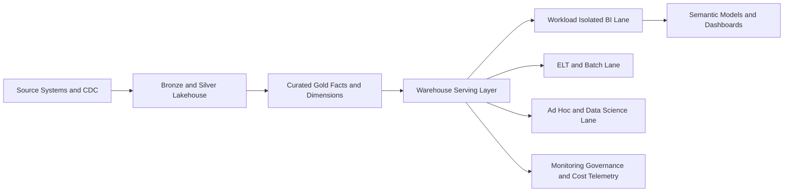
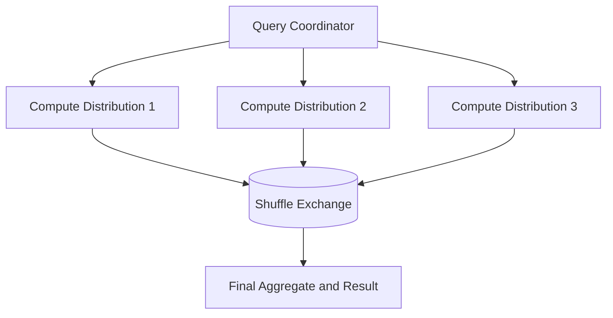
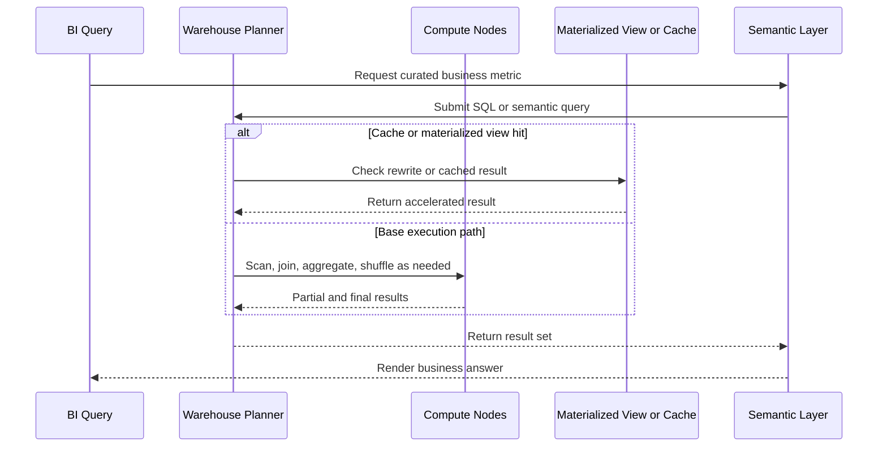

# Data Warehouse Architecture

> Part of the **Enterprise Data & AI Architecture Handbook** · Phase-06 - Data Modeling & Warehousing · Chapter 07.
> Estimated study time: **60 min reading + ~3h labs**.
> **Prerequisites:** read [Dimensional Modeling](01_Dimensional_Modeling.md), [Data Vault 2.0](02_Data_Vault_2_0.md), [OLAP and Cube Modeling](04_OLAP_and_Cube_Modeling.md), [Semantic Layer and Metrics](06_Semantic_Layer_and_Metrics.md), [Lakehouse Architecture](../Phase-05/02_Lakehouse_Architecture.md), [Medallion Architecture](../Phase-05/03_Medallion_Architecture.md), [Delta Lake](../Phase-04/04_Delta_Lake.md), and [Apache Iceberg](../Phase-04/05_Apache_Iceberg.md) first.

---

## Executive Summary

Data warehouse architecture is the discipline of designing analytical systems that can scan large curated datasets, serve many users concurrently, isolate competing workloads, and keep business semantics stable under constant change. The point is not merely to store data in a relational engine. The point is to give the enterprise a governed, performant analytical serving layer whose behavior remains predictable under real concurrency, heavy joins, repeated aggregations, and strict reporting deadlines.

Modern warehouse architecture revolves around a few controlling ideas: massively parallel processing, distributed storage and compute, shuffle minimization, workload isolation, cache and materialization strategy, and the boundary between a warehouse and a lakehouse. The difficult question is not whether a platform can run SQL. The difficult question is whether the platform can do so repeatedly, concurrently, economically, and with enough isolation that one business workload does not degrade another. Most warehouse failures are not caused by bad SQL syntax. They are caused by architectural indifference to distribution, concurrency, and workload shape.

In Azure-first estates, the practical warehouse-architecture discussion usually centers on Synapse dedicated SQL pools, Fabric Warehouse, Databricks SQL on Delta, and curated SQL-serving patterns over lakehouse storage. These are not interchangeable products with different logos. They embody different assumptions about data distribution, metadata management, storage locality, elasticity, result caching, and workload management. The right architecture often combines them with a clear substrate: raw and silver data in lakehouse storage, curated conformed models for serving, and semantic layers above them.

This chapter covers MPP distribution and shuffle, Synapse, Snowflake, and BigQuery internals, workload isolation and concurrency, materialized views and result caching, and warehouse-versus-lakehouse convergence. The goal is pragmatic: understand how warehouse engines really execute, choose the right serving architecture for the business workload, and avoid paying enterprise-scale cost for analytical systems that still behave like oversized shared databases.

## Learning Objectives

By the end of this chapter you should be able to:

1. Explain why MPP distribution, shuffle, and storage locality determine warehouse performance more than generic SQL syntax.
2. Compare the architectural internals of Synapse dedicated SQL pools, Snowflake, and BigQuery at a meaningful technical level.
3. Design warehouse schemas and distribution strategies that align with [Dimensional Modeling](01_Dimensional_Modeling.md) and curated marts.
4. Choose workload-isolation and concurrency patterns that protect interactive BI, ELT, and data-science consumers from each other.
5. Use materialized views, result caches, and summary tables without corrupting semantics.
6. Decide when a warehouse, a lakehouse, or a converged architecture is the right fit.
7. Design Azure-first warehouse architectures that balance serving performance, governance, and FinOps discipline.
8. Recognize anti-patterns such as poor distribution keys, overloaded shared warehouses, and raw-lake direct serving masquerading as architecture.
9. Build monitoring and observability practices around queueing, shuffle, skew, cache effectiveness, and warehouse cost.
10. Defend warehouse-architecture choices in engineer, staff engineer, architect, and CTO reviews.

## Business Motivation

- Enterprises need governed analytical serving for finance, operations, product, customer, and regulatory workloads.
- Business users expect interactive performance on large curated datasets without understanding distribution, partitions, or shuffle behavior.
- Platform teams need concurrency control so ELT, ad hoc analysis, dashboards, and data science do not sabotage one another.
- Azure FinOps programs need to understand when repeated queries should hit cache, warehouse compute, or semantic acceleration paths.
- Data teams need a place where conformed facts, dimensions, and curated business logic can be served predictably at scale.
- Regulatory and executive reporting requires repeatable answers under heavy end-of-period load.
- Warehouse-versus-lakehouse decisions have become business architecture questions, not only storage questions.

## History and Evolution

- Classical enterprise data warehouses often ran on SMP or specialized appliance platforms with careful indexing and batch windows.
- Shared-nothing MPP systems emerged because single-box architectures could not keep up with analytical scan volume and concurrency demands.
- Appliance-era systems such as Teradata, Netezza, and SQL Server PDW emphasized distribution, local processing, and interconnect-aware execution.
- Cloud warehouses decoupled storage from compute to varying degrees and made elasticity, workload isolation, and service-managed optimization more central.
- Snowflake popularized multi-cluster virtual warehouses, micro-partition metadata, and strong separation of storage and compute.
- BigQuery pushed a more serverless model with slots, columnar storage, and service-managed execution over massively distributed infrastructure.
- Azure evolved through SQL DW, Synapse dedicated SQL pools, serverless SQL, Databricks SQL, and Fabric Warehouse, reflecting the broader industry convergence between lakehouse and warehouse patterns.

## Why This Technology Exists

Data warehouse architecture exists because transactional schemas, even when well normalized as discussed in [Normalization and OLTP Modeling](03_Normalization_and_OLTP_Modeling.md), are poor fits for large-scale analytical scan and aggregation workloads. Business users ask cross-domain, historical, multi-dimensional questions that require large joins, precomputed context, and concurrency envelopes far beyond what a transactional system should serve directly.

It also exists because raw data storage is not enough. An analytical estate needs a serving layer that can answer repeated questions reliably while enforcing business semantics, security, and isolation. That serving layer must understand where data lives, how it is distributed, when it needs to move across nodes, and which work deserves dedicated resources.

Modern warehouse architecture further exists because compute is expensive when repeated queries keep redoing the same work. Materialized views, result caches, automatic pruning, statistics, and workload routing all exist to reduce useless computation. In cloud systems, these are not minor optimizations. They are often the difference between a sustainable analytical platform and a budget alarm with a SQL endpoint attached.

## Problems It Solves

| Problem | Warehouse-architecture response | Enterprise signal that it is working |
|---|---|---|
| large analytical joins scan too much data | use distributed compute, columnar storage, pruning, and curated models | business queries finish predictably at scale |
| many users compete for one analytical endpoint | isolate workloads and manage concurrency | BI users are not blocked by ELT or ad hoc spikes |
| repeated dashboard queries waste source compute | use caches, aggregations, and materialized views | repetitive workloads become cheaper and faster |
| enterprise data lives in many source systems | provide a governed serving layer over integrated data products | shared metrics and marts become reusable |
| shared warehouses become unstable during close or peak periods | use workload groups, separate warehouses, or capacity partitioning | month-end and operational windows remain predictable |
| lakehouse data is flexible but hard to serve consistently | converge warehouse and lakehouse roles deliberately | raw flexibility and governed serving coexist |
| platform teams cannot explain cost spikes | expose shuffle, queueing, and workload telemetry | FinOps conversations become evidence-based |

## Problems It Cannot Solve

- It cannot fix ambiguous business definitions or weak curated models.
- It does not replace raw-ingestion architecture, CDC capture, or [Data Vault 2.0](02_Data_Vault_2_0.md) integration layers where those are needed.
- It is not the right system for OLTP write capture or low-latency transactional state changes.
- It cannot make bad distribution choices irrelevant once data volume and concurrency grow.
- It does not remove the need for semantic layers, metric governance, or security design.
- It should not be mistaken for a data lake, a notebook platform, or a universal compute substrate for every analytical task.
- It cannot always optimize simultaneously for lowest cost, highest freshness, lowest latency, and unlimited concurrency.

## Core Concepts

### 8.1 MPP distribution and shared-nothing execution

Most analytical warehouses scale through shared-nothing or shared-storage-plus-distributed-compute execution. Data is logically partitioned across workers, and each worker processes its local slice in parallel. The control layer compiles the query plan, assigns work, and coordinates data movement where local execution is insufficient. The architectural goal is simple: do as much work as possible where the data already lives.

### 8.2 Distribution strategies, skew, and shuffle

Distribution strategy determines where rows land and therefore how much network movement later queries will need. Common strategies include hash distribution, round-robin or even distribution, and replication of small tables. Hash distribution aligns large facts with frequent join keys. Replication avoids shuffling small dimensions. Round-robin can simplify ingestion but often increases movement later.

Shuffle occurs when data has to move across workers so joins, aggregations, or sorts can complete. Shuffle is expensive because it consumes network, memory, and intermediate storage while reducing locality. The warehouse architect's job is therefore to minimize unnecessary shuffle, detect skew, and choose keys that keep common joins as local as possible.

### 8.3 Columnar storage, pruning, and compression

Analytical warehouses use columnar storage because most business queries read a subset of columns across many rows. Compression, dictionary encoding, zone maps, rowgroup metadata, micro-partition statistics, and clustering all reduce the amount of data scanned. As shown earlier in [Columnar Storage Internals](../Phase-04/02_Columnar_Storage_Internals.md), physical layout is part of compute behavior, not merely storage behavior.

### 8.4 Workload isolation and concurrency management

Concurrency is not simply a hardware problem. It is a scheduling and resource-governance problem. ELT refreshes, semantic-model refreshes, dashboards, data science queries, and ad hoc SQL all contend differently for CPU, memory, IO, and slots. Warehouses solve this through workload groups, resource classes, separate compute clusters, priority levels, queueing, and sometimes separate virtual warehouses or capacities. Mature architecture treats these as first-class design elements, not as afterthoughts.

### 8.5 Materialized views and result caching

Materialized views precompute and persist specific query patterns or summaries. Result caches reuse prior query outputs when the semantic result is still valid. Both reduce repeated compute, but they solve different problems. Materialized views are structural acceleration. Result caches are opportunistic reuse. Neither should be confused with semantic governance; they make queries cheaper, not definitions better.

### 8.6 Synapse, Snowflake, and BigQuery internals

Synapse dedicated SQL pools distribute data into a fixed number of distributions and use control-node coordination plus a data movement service to execute distributed queries. Snowflake separates storage from compute through virtual warehouses and relies on micro-partition metadata, local SSD cache, and elastic multi-cluster serving. BigQuery operates more like a serverless execution fabric, using slots, columnar storage, and distributed shuffle services to execute SQL without user-managed clusters. These are not cosmetic differences. They change how architects reason about distribution, caching, isolation, and cost.

### 8.7 Warehouse versus lakehouse convergence

Warehouses historically emphasized curated relational serving and workload management. Lakehouses emphasized open storage, flexible compute, and unified batch-plus-analytics patterns. The convergence trend means many platforms now offer SQL warehouses on top of open formats and lakehouse tables with warehouse-like semantics. The right question is not whether one label wins. The right question is where the governed serving boundary should live and which workloads benefit from each style.

## Internal Working

### 9.1 Query compilation and optimization

The query lifecycle usually begins with parsing, logical optimization, statistics-based planning, join-order selection, and physical operator assignment. The optimizer decides how much data can be pruned, whether predicates are selective, which joins can stay local, and where intermediate reshuffling is unavoidable. Bad statistics or mismatched distribution keys often ruin performance before execution even begins.

### 9.2 Local processing versus data movement

Execution engines first attempt local scans and local joins. When the required rows are not colocated, the engine redistributes or broadcasts data. Synapse uses data movement services between distributions. Snowflake redistributes within the serving warehouse cluster backed by remote storage and local cache. BigQuery uses internal shuffle services and slot-managed execution. The practical principle remains constant: data movement is the tax paid for poor locality or unavoidable cross-key computation.

### 9.3 Intermediate storage and spill behavior

Large joins, sorts, window functions, and group by operations may spill intermediate data to local or remote temporary storage when memory is insufficient. Spills are a leading indicator of under-provisioned compute, poor distribution, or poor query shape. They often explain why a query that is logically simple becomes operationally expensive under concurrency.

### 9.4 Concurrency scheduling

Warehouses manage competing requests by assigning resource classes, slots, memory grants, concurrency quotas, or separate clusters. A dashboard query and a large ELT transformation should not fight as peers for the same resources if the business considers them different priority classes. Good architecture defines these lanes early instead of discovering them through outages.

### 9.5 Cache and materialization paths

If a result cache is valid, the warehouse may return a prior answer without re-executing the full plan. If a materialized view matches the requested aggregation and predicates, the optimizer can answer from the precomputed structure. Otherwise it falls back to the base tables. This is why cache hit rate, materialized-view rewrite usage, and query repetition patterns matter operationally.

### 9.6 Warehouse-lakehouse execution boundary

In converged platforms, the query engine may serve warehouse semantics on top of open lakehouse storage. The storage is flexible, but the serving layer still needs governance, optimization metadata, workload isolation, and sometimes separate compute envelopes. Calling everything a lakehouse does not remove warehouse problems; it only moves where they surface.

## Architecture

### 10.1 Azure-first reference architecture

The common Azure pattern uses ADLS Gen2 or OneLake for bronze and silver storage, curated gold facts and dimensions built in Databricks, Fabric, or Synapse pipelines, and a dedicated warehouse-serving layer in Fabric Warehouse, Synapse dedicated SQL pool, or Databricks SQL depending on workload shape. Power BI or other semantic tools sit above that serving layer. Mission-critical workloads use isolated serving or capacity lanes for BI, ETL, data science, and embedded consumers.

### 10.2 Why the architecture works

This architecture keeps raw flexibility and governed serving separate. Lakehouse layers absorb source variation and open-format storage concerns. The warehouse layer concentrates on predictable SQL serving, concurrency, materialization, and semantic stability. The business does not care whether a row originated in parquet or Delta. It cares whether month-end revenue and daily operations dashboards stay fast and correct.

### 10.3 ADR example: standardize on a converged lakehouse-plus-warehouse serving architecture

**Context:** The enterprise has raw and silver data in open storage, multiple BI teams querying curated Delta tables directly, and increasing performance and concurrency problems during peak reporting windows. Some teams want to move everything into one monolithic warehouse. Others want to keep all serving directly on lakehouse tables.

**Decision:** Standardize on lakehouse storage for raw and conformance layers, but publish curated warehouse-serving models for governed interactive analytics. Use Fabric Warehouse or Synapse dedicated SQL for workloads needing strong SQL concurrency and isolation, and keep Databricks SQL or lakehouse-native serving where those consumers genuinely benefit from open-format proximity.

**Consequences:** The platform gains clearer workload boundaries, better concurrency isolation, and better semantic control. Teams must manage one additional serving layer and keep warehouse publication aligned with curated lakehouse outputs.

**Alternatives considered:**

1. Directly serve all BI from curated lakehouse tables: rejected because concurrency and semantic control were too weak for broad enterprise use.
2. Move all analytical layers into one warehouse only: rejected because raw flexibility, open formats, and lakehouse-native processing were still valuable.
3. Let each domain choose independently: rejected because platform sprawl and FinOps opacity were already growing.

## Components

| Component | Role | Azure-first implementation choices | Common failure mode |
|---|---|---|---|
| control plane | parses, optimizes, and coordinates queries | Synapse control node, Fabric service layer, Databricks SQL planner | plan quality degrades under stale stats or weak metadata |
| compute workers | execute scans, joins, sorts, and aggregates | Synapse compute nodes, Fabric execution engine, SQL warehouse clusters | under-sized or mixed-priority workloads cause spill and queueing |
| distribution layer | controls row placement and locality | Synapse hash/round-robin/replicate, Fabric internal distribution, engine-managed layouts | wrong keys create constant shuffle |
| storage layer | persists compressed analytical data | ADLS Gen2, OneLake, managed warehouse storage, Delta/Iceberg-backed tables | raw and curated layers blurred together |
| data movement service | redistributes data between workers | Synapse DMS, engine shuffle services, remote exchange operators | invisible network tax dominates query time |
| workload manager | controls concurrency, queues, and priorities | Synapse workload groups and classifiers, warehouse cluster isolation, capacity lanes | BI competes with ETL unpredictably |
| materialization layer | stores summaries or optimized rewrites | materialized views, summary tables, semantic aggregates | stale or unused summaries create cost without benefit |
| result cache | avoids re-executing identical or equivalent queries | Synapse result set caching, Snowflake result cache, BigQuery cached results | false assumptions about freshness or invalidation |
| semantic layer | translates curated warehouse data into business consumption | Power BI, Fabric semantic models, other BI tools | semantic drift lives above a technically fast warehouse |
| governance catalog | lineage, ownership, sensitivity, and serving contracts | Purview, Unity Catalog, internal metadata platform | no one knows which warehouse objects are official |

## Metadata

Warehouse architecture depends heavily on physical and operational metadata.

| Metadata class | What to record | Why it matters |
|---|---|---|
| distribution metadata | hash key, replicated status, partition rules | determines data movement cost |
| storage statistics | row counts, distribution skew, micro-partition or rowgroup stats | drives optimizer quality |
| workload metadata | queue class, priority, resource group, concurrency targets | prevents noisy-neighbor failures |
| materialization metadata | summary grain, refresh rule, rewrite eligibility | makes acceleration explainable |
| cache metadata | hit rate, invalidation events, repeated query patterns | informs FinOps and tuning |
| lineage | source tables, publication path, downstream semantic models | supports RCA and trust |
| security metadata | role bindings, row filters, column masking, data classifications | governs access |
| cost attribution | workload tags, capacity mapping, query labels | enables evidence-based cost review |

If the team cannot explain a table's distribution key, workload class, and downstream consumers, it is operating the warehouse by folklore rather than architecture.

## Storage

Warehouse storage design shapes compute behavior more than most teams first assume.

| Storage concern | Recommended posture | Notes |
|---|---|---|
| file or block layout | keep curated data columnar and query-friendly | wide rowstore serving is rarely appropriate for large analytics |
| distribution-aware layout | colocate common large joins where possible | reduces shuffle tax |
| partitioning | align to pruning and maintenance windows, not only calendar habit | over-partitioning creates metadata and small-file pain |
| columnstore organization | keep rowgroups healthy and compression effective | bad load patterns reduce segment quality |
| micro-partition or clustering hygiene | preserve pruning efficiency | critical in Snowflake-style and lakehouse-converged designs |
| temporary and spill storage | monitor intermediate-workload pressure | hidden temp pressure often explains unstable performance |

Warehouse architects should think of storage as active execution metadata, not passive persistence.

## Compute

| Workload class | Best Azure-first surface | Why it fits | Wrong default |
|---|---|---|---|
| high-concurrency enterprise BI SQL serving | Fabric Warehouse or isolated Databricks SQL / Synapse serving layer | predictable relational consumption and workload controls | serving everything from raw Delta notebooks |
| existing MPP warehouse estate with strong SQL patterns | Synapse dedicated SQL pool | explicit distribution and workload constructs | forcing a full re-platform before workload is understood |
| lakehouse-first SQL analytics with open-format proximity | Databricks SQL | strong fit when Delta is the serving substrate | building a second warehouse with no consumer reason |
| mixed business reporting plus ELT | separate warehouses, capacities, or workload groups | reduces interference | one shared cluster for all priorities |
| exploratory data science | separate compute lane from curated warehouse serving | protects governed SQL workloads | running broad notebook scans on the main BI warehouse |

Compute architecture is about serving the right workload with the right isolation boundary, not simply buying more cores.

## Networking

- Keep storage, compute, and BI capacities region-aligned where possible to minimize latency and egress.
- Use private endpoints or approved private connectivity for ADLS Gen2, Synapse, Fabric endpoints, Key Vault, and monitoring sinks.
- Understand that shuffle is a network workload as much as a compute workload.
- Avoid hybrid gateway or cross-region patterns for high-frequency DirectQuery or warehouse BI when low latency matters.
- Document which workloads depend on on-prem or cross-cloud sources because those dependencies often dominate query unpredictability.

In MPP systems, poor network assumptions turn into silent cost and latency multipliers.

## Security

| Concern | Recommended control |
|---|---|
| source and serving isolation | separate raw, curated, and user-facing schemas or workspaces |
| identity | Entra ID, managed identities, scoped service principals |
| network exposure | private endpoints and controlled egress where policy requires |
| data exposure | row, column, and object-level controls aligned to semantic use |
| admin boundaries | separate ETL, BI, and platform-admin rights |
| audit | retain query labels, object access logs, and semantic publication history |

Warehouse security is not only about the data files. It is about who can consume, restate, or overwhelm shared analytical truth.

## Performance

Warehouse performance is dominated by locality, pruning, concurrency discipline, and acceleration path correctness.

- Choose distribution keys based on frequent large joins and skew behavior, not by guesswork.
- Replicate truly small dimensions where the engine benefits from local joins.
- Keep statistics fresh so the optimizer can choose sane plans.
- Use materialized views and summary tables for repeated hot queries.
- Separate heavy transforms from interactive BI where possible.
- Label and trace queries so performance tuning is tied to business workload, not anonymous SQL noise.

| Pattern | Azure recommendation | Why |
|---|---|---|
| large sales fact joined to customer and product | hash distribute by the dominant join key and replicate small dims if supported | reduces movement on hot joins |
| repeated daily executive rollup | materialized view or summary table at daily grain | avoids recomputing the same aggregates |
| BI and ELT contention in Synapse | dedicated workload groups and classifier rules | isolates queueing and memory grants |
| Fabric or Databricks SQL BI peak | separate warehouse or SQL endpoint for interactive consumers | protects user latency from pipeline bursts |

## Scalability

Scalability in warehouses is not only about bigger scans. It is also about more users, more domains, more semantic layers, and more simultaneous deadlines.

- Scale compute independently from storage where the platform supports it.
- Split business domains or workload classes when one warehouse becomes an operational choke point.
- Use semantic layers and aggregations to reduce repeated heavy scans.
- Prefer standardized publication patterns so adding new marts does not create bespoke serving behavior.
- Keep the warehouse focused on curated serving, not every exploratory or raw-data use case.

Many warehouse platforms scale technically long before the operating model scales organizationally.

## Fault Tolerance

Fault tolerance means the analytical platform degrades predictably and can recover without semantic corruption.

- separate serving compute failures from storage durability concerns,
- ensure materialized-view refresh and cache invalidation are recoverable,
- test pause, resume, failover, and restore procedures where the platform supports them,
- keep warehouse publication idempotent and reconstructible from curated lakehouse or staging layers,
- distinguish source-data failure from warehouse-serving failure in incident response.

The warehouse should never be the only place where the enterprise can reconstruct curated truth. It should be the serving layer, not the sole memory of the platform.

## Cost Optimization

Warehouse cost control is largely about preventing repeated waste: unnecessary shuffle, always-on oversized compute, duplicated serving layers, and broad BI scans that never needed to hit detail tables.

- use separate serving and transformation lanes only where the business benefit exceeds the added platform cost,
- pause or scale down dedicated compute where the platform supports it and workloads allow it,
- route repeated dashboard queries through semantic caches, imported models, or materialized views,
- right-size concurrency and memory grants instead of defaulting to the largest tier,
- remove unused summary objects and dead marts regularly.

Worked FinOps example: suppose a shared enterprise warehouse runs at an illustrative 1000 DWU-equivalent or high warehouse tier 24x7 because ELT, executive dashboards, ad hoc analysts, and semantic refreshes all share one serving plane. If that costs roughly $10,000 per month in illustrative compute and repeated dashboard queries account for most daytime load, moving those dashboards to a shared semantic cache or imported semantic model and isolating ELT windows can allow the warehouse to run at a smaller daytime footprint or paused off-hours where supported. Even a 25 to 35 percent reduction in active high-tier runtime can materially reduce spend while improving latency consistency. The biggest savings usually come from workload separation and cache reuse, not from one heroic query rewrite.

## Monitoring

| Metric | Why it matters | Typical threshold |
|---|---|---|
| query duration p95 and p99 | user-facing warehouse health | alert on SLA breach |
| queue wait time | detects workload isolation failure | alert when interactive lanes wait unexpectedly |
| shuffle or data-movement bytes | shows locality problems | review spikes by workload |
| spill to temp or remote storage | reveals memory-pressure or plan issues | investigate repeated spill on hot queries |
| materialized-view rewrite hit rate | proves summary investments are used | review low hit rates |
| cache hit rate | shows repeated-query reuse effectiveness | review trends by workload class |
| skew indicators by distribution | identifies bad hash or hot partitions | zero tolerance for severe skew on core facts |
| compute utilization and cost by workload group | supports FinOps and capacity review | review monthly and during incidents |

## Observability

Observability should make it possible to answer which workload was queued, which operator shuffled data, which summary object was used, and which semantic or BI layer triggered the pressure.

- label queries by consumer, domain, and workload class,
- keep explain plans or equivalent execution details for critical workloads,
- correlate BI refreshes and semantic queries to warehouse pressure,
- persist workload-group, queue, and cache context in telemetry,
- trace lineage from warehouse object to semantic model and business dashboard.

### Operational response playbooks

| Signal | Detection query or rule | Likely cause | First remediation |
|---|---|---|---|
| interactive BI queue time spikes at month end | monitor queue wait by workload group and label | ELT and close-period reporting are contending in one lane | move heavy jobs to separate lane or window, scale serving tier temporarily, protect BI queue |
| one fact query suddenly moves terabytes | compare shuffle bytes and plan changes by release | changed distribution key, stale stats, or new join path | refresh stats, inspect distribution, rollback schema or query change if needed |
| materialized views are not used despite existence | optimizer rewrite hit rate near zero | wrong grain, stale view, or query shape mismatch | realign MV grain to real workloads, refresh object, or retire unused view |

## Governance

Warehouse governance is about controlling what is shared, who is allowed to stress it, and which objects are official.

- define serving zones such as raw, curated, certified, and semantic-publication boundaries,
- require review for distribution-key, partition, and workload-isolation changes on shared objects,
- standardize query labels and workload tagging,
- publish which marts and views are certified for business use,
- align warehouse object lifecycle with semantic-model and metric governance from [Semantic Layer and Metrics](06_Semantic_Layer_and_Metrics.md),
- keep platform cost and capacity reviews tied to actual workload classes, not only aggregate bills.

The main governance failure to avoid is silent shared-warehouse drift: everyone can create objects, no one owns the serving contract, and performance problems become political arguments instead of technical facts.

## Trade-offs

| Choice | Advantages | Disadvantages | When to prefer it |
|---|---|---|---|
| dedicated warehouse serving layer | strong SQL serving, predictable concurrency patterns | extra publication layer and cost | broad governed enterprise BI |
| direct lakehouse SQL serving | fewer copies, open-format proximity | weaker isolation for some workloads, mixed consumer ergonomics | engineering-first or lakehouse-native domains |
| shared warehouse for all workloads | simple initial topology | noisy neighbors and cost opacity | small early-stage environments only |
| isolated warehouses or capacities by workload | strong control and predictability | more operational surfaces and chargeback complexity | large enterprises with distinct priorities |
| materialized views and summaries | lower repeated compute | refresh cost and maintenance | hot, repeated, stable query patterns |
| rely mainly on result cache | low maintenance | limited to repeated equivalent queries | highly repetitive read patterns with stable data |

## Decision Matrix

| Requirement | Fabric Warehouse | Synapse dedicated SQL pool | Databricks SQL | Snowflake | BigQuery |
|---|---|---|---|---|---|
| Microsoft ecosystem fit | strong | strong | strong | medium | weak |
| explicit user-controlled distribution | medium | strong | weak to medium | weak | weak |
| lakehouse convergence | strong | medium | strong | medium | medium |
| interactive BI serving | strong | medium to strong | strong | strong | medium |
| serverless operational model | weak to medium | weak | weak to medium | medium | strong |
| workload isolation primitives | medium | strong | medium to strong | strong | medium |
| migration fit for legacy SQL DW estates | medium | strong | medium | medium | weak |

For Azure-first enterprises, Fabric Warehouse and Databricks SQL often align well with convergence strategies, while Synapse dedicated SQL remains important where explicit MPP distribution and existing SQL DW operating models still matter.

## Design Patterns

1. **Curated warehouse serving layer over lakehouse conformance:** the common converged-enterprise pattern.
2. **Hash-distributed large fact with replicated small dimensions:** reduces shuffle for hot joins.
3. **Workload lane isolation:** separate ELT, BI, and exploration consumers by queue or compute boundary.
4. **Materialized summary layer:** precompute stable high-value rollups.
5. **Semantic-model acceleration over warehouse:** use BI semantics to absorb repeated dashboard pressure.
6. **Domain-serving marts with shared conformed dimensions:** aligns with [Dimensional Modeling](01_Dimensional_Modeling.md).
7. **Warehouse as curated SQL endpoint, lakehouse as raw and silver substrate:** clear role separation.
8. **Chargeback by workload label:** make FinOps visible per business domain or consumer class.

## Anti-patterns

- Using the warehouse as the raw landing zone for every file and source extract.
- Choosing a distribution key from convenience rather than measured join behavior.
- Letting every notebook or ad hoc job run on the same interactive BI compute path.
- Treating result caching as a substitute for performance design.
- Serving enterprise dashboards directly from large raw Delta tables because the SQL endpoint exists.
- Building materialized views nobody queries.
- Assuming Snowflake, BigQuery, Synapse, and Fabric have identical performance tuning levers.
- Ignoring skew because overall row counts look balanced.

## Common Mistakes

- Distribution by date or another low-entropy key that creates hot spots.
- Over-partitioning warehouse tables because it seemed good in a different platform.
- Forgetting that replicated small dimensions stop being small after years of uncontrolled growth.
- Measuring only average query time while queue waits and spill explode.
- Running semantic refreshes and executive dashboards in the same window with no workload separation.
- Confusing semantic-layer acceleration with warehouse-layer architecture and therefore tuning the wrong layer.
- Migrating to a converged warehouse-lakehouse platform without redefining workload boundaries.

## Best Practices

- Start from curated facts and dimensions, not from raw storage convenience.
- Choose distribution and clustering based on real join and filter patterns.
- Separate workload lanes explicitly and test them under concurrency.
- Use materialized views or summary tables only for proven hot queries.
- Keep statistics and optimization metadata current.
- Route repeated BI patterns through semantic acceleration where appropriate.
- Align warehouse and lakehouse roles rather than pretending one replaces the other universally.
- Label queries and attribute cost by workload class.
- Revisit distribution and workload design whenever business use changes materially.

## Enterprise Recommendations

1. Standardize a reference warehouse architecture that separates raw/lakehouse layers from curated serving layers.
2. Default new Microsoft-centric governed SQL-serving workloads toward Fabric Warehouse or an equivalent converged-serving pattern unless a stronger reason favors Synapse or Databricks SQL.
3. Keep Synapse dedicated SQL in play for workloads that benefit from explicit distribution and established MPP operating practices.
4. Require workload-isolation design before onboarding critical BI or ELT consumers to a shared warehouse.
5. Publish distribution-key, partitioning, and summary-object standards with architecture review gates.
6. Use [Semantic Layer and Metrics](06_Semantic_Layer_and_Metrics.md) to reduce repeated query pressure on the warehouse through shared semantics.
7. Track queue time, shuffle, spill, and cache usage as first-class platform metrics.
8. Treat warehouse-versus-lakehouse choice as a domain architecture decision, not as a brand decision.

## Azure Implementation

### 31.1 Recommended Azure service map

| Layer | Preferred Azure service | Notes |
|---|---|---|
| raw and silver storage | ADLS Gen2 or OneLake | open-format substrate |
| curated transformation | Azure Databricks or Fabric Spark | produce governed serving tables |
| warehouse serving | Fabric Warehouse, Synapse dedicated SQL pool, or Databricks SQL | choose by workload and operating model |
| semantic consumption | Power BI or Fabric semantic models | absorb repeated business queries |
| governance | Purview plus workspace/catalog governance | lineage and serving certification |
| secrets and identity | Entra ID, managed identity, Key Vault | secure source and serving access |
| monitoring | Azure Monitor, Log Analytics, Fabric metrics, Synapse monitoring | performance and cost telemetry |

### 31.2 Example Synapse dedicated SQL fact table

```sql
create table dbo.FactSales
(
    DateKey int not null,
    CustomerKey int not null,
    ProductKey int not null,
    RegionKey int not null,
    OrderNumber nvarchar(40) not null,
    Quantity decimal(18,4) not null,
    NetSalesAmount decimal(18,2) not null
)
with
(
    distribution = hash(CustomerKey),
    clustered columnstore index,
    partition (DateKey range right for values (20250101, 20250401, 20250701, 20251001))
);
```

### 31.3 Example replicated small dimension

```sql
create table dbo.DimRegion
(
    RegionKey int not null,
    RegionCode nvarchar(20) not null,
    RegionName nvarchar(100) not null
)
with
(
    distribution = replicate,
    heap
);
```

### 31.4 Example materialized view and result-cache-friendly query label

```sql
create materialized view dbo.MV_SalesDaily
with (distribution = hash(DateKey))
as
select
    DateKey,
    RegionKey,
    ProductKey,
    sum(NetSalesAmount) as NetSalesAmount,
    sum(Quantity) as Quantity
from dbo.FactSales
group by DateKey, RegionKey, ProductKey;

select
    DateKey,
    RegionKey,
    sum(NetSalesAmount) as NetSalesAmount
from dbo.FactSales
group by DateKey, RegionKey
option (label = 'powerbi.sales_daily');
```

### 31.5 Example workload management in Synapse

```sql
create workload group wg_bi
with
(
    min_percentage_resource = 20,
    cap_percentage_resource = 60,
    request_min_resource_grant_percent = 2,
    importance = medium
);

create workload classifier wc_bi
with
(
    workload_group = 'wg_bi',
    membername = 'bi_readers',
    wlm_label = 'powerbi'
);
```

### 31.6 Example Bicep and CLI

```bicep
param location string = resourceGroup().location

resource storage 'Microsoft.Storage/storageAccounts@2023-05-01' = {
  name: 'stdw${uniqueString(resourceGroup().id)}'
  location: location
  sku: {
    name: 'Standard_ZRS'
  }
  kind: 'StorageV2'
  properties: {
    isHnsEnabled: true
    minimumTlsVersion: 'TLS1_2'
    allowBlobPublicAccess: false
  }
}

resource synapseWorkspace 'Microsoft.Synapse/workspaces@2021-06-01' = {
  name: 'syn-edai-dw-prod'
  location: location
  identity: {
    type: 'SystemAssigned'
  }
  properties: {
    defaultDataLakeStorage: {
      accountUrl: 'https://${storage.name}.dfs.core.windows.net'
      filesystem: 'synapse'
    }
    managedVirtualNetwork: 'default'
  }
}

resource sqlPool 'Microsoft.Synapse/workspaces/sqlPools@2021-06-01' = {
  name: '${synapseWorkspace.name}/dwcuratedprod'
  location: location
  sku: {
    name: 'DW1000c'
    tier: 'DataWarehouse'
    capacity: 1000
  }
  properties: {
    createMode: 'Default'
  }
}
```

```bash
az group create --name rg-edai-warehouse-prod --location westeurope
az synapse workspace create --name syn-edai-dw-prod --resource-group rg-edai-warehouse-prod --storage-account stdwprod01 --file-system synapse --sql-admin-login-user sqladmin --sql-admin-login-password <Password>
az synapse sql pool create --name dwcuratedprod --performance-level DW1000c --resource-group rg-edai-warehouse-prod --workspace-name syn-edai-dw-prod
```

Practical Azure guidance:

- Fabric Warehouse is increasingly the natural default for Microsoft-centric converged analytics programs.
- Synapse dedicated SQL pools still make sense when explicit distribution control, established SQL DW processes, or migration fit matter strongly.
- Databricks SQL is a strong serving layer when the lakehouse substrate and Delta-native ecosystem are primary.

## Open Source Implementation

Open-source warehouse architecture usually combines open table formats, distributed SQL engines, and explicit serving design rather than one monolithic managed service.

| Layer | Open-source choice | Notes |
|---|---|---|
| storage | MinIO or cloud object storage | durable substrate for open tables |
| table format | Delta Lake, Iceberg, or Hudi | governs metadata and mutation semantics |
| distributed SQL | Trino or ClickHouse | complementary serving styles |
| transformation | Spark and dbt | curated stars, summaries, and marts |
| orchestration | Airflow | refresh and serving publication control |
| observability | Prometheus, Grafana, OpenTelemetry | query, resource, and service metrics |
| governance | OpenMetadata or Apache Atlas | lineage and certification |

Example ClickHouse summary table:

```sql
create table mart.fact_sales_daily
(
    date_key UInt32,
    region_key UInt32,
    product_key UInt32,
    net_sales_amount Decimal(18,2),
    quantity UInt64
)
engine = SummingMergeTree
partition by toYYYYMM(toDate(toString(date_key)))
order by (date_key, region_key, product_key);
```

Example Trino materialized view over Iceberg:

```sql
create materialized view analytics.mv_sales_region_daily as
select
    date_key,
    region_key,
    sum(net_sales_amount) as net_sales_amount,
    sum(quantity) as quantity
from analytics.fact_sales
group by date_key, region_key;
```

Example GitHub Actions smoke test:

```yaml
name: warehouse-serve-validate
on:
  pull_request:

jobs:
  validate:
    runs-on: ubuntu-latest
    steps:
      - uses: actions/checkout@v4
      - name: Run dbt tests
        run: dbt test --select tag:warehouse_serving
      - name: Validate aggregate queries in DuckDB
        run: duckdb analytics.duckdb < tests/warehouse_checks.sql
```

Open-source stacks offer strong flexibility, but they require the team to own more of the serving architecture explicitly: query isolation, catalog hygiene, and acceleration patterns do not appear automatically.

## AWS Equivalent (comparison only)

| Azure pattern | AWS equivalent | Advantages | Disadvantages | Migration note |
|---|---|---|---|---|
| Synapse dedicated SQL or Fabric Warehouse | Amazon Redshift | strong MPP warehouse fit with familiar serving patterns | distribution, caching, and concurrency controls differ | re-evaluate distribution, sort, and workload settings rather than lift-and-shift |
| ADLS Gen2 or OneLake plus converged serving | S3 plus Redshift Spectrum, Athena, or lakehouse serving | broad ecosystem and open-storage options | semantic and serving boundaries often span more services | keep curated serving contract explicit |
| Databricks SQL on Delta | Databricks on AWS | strong lakehouse-serving equivalence | IAM, networking, and cost patterns differ | preserve curated substrate and consumer contracts |

Preserve workload isolation and serving semantics during migration. Do not reduce the problem to SQL dialect changes.

## GCP Equivalent (comparison only)

| Azure pattern | GCP equivalent | Advantages | Disadvantages | Migration note |
|---|---|---|---|---|
| Fabric Warehouse or Synapse serving | BigQuery | serverless scale and strong analytical ergonomics | different cost and workload-control model | rethink concurrency, reservation, and cache assumptions |
| lakehouse-plus-warehouse convergence | BigQuery over curated lakehouse-like patterns or Dataproc-backed serving | strong SQL and storage abstraction | less explicit user-managed distribution control | retest hot-query and summary strategies |
| Databricks SQL on Azure | Databricks on GCP | preserves Delta-centric serving style | operational and networking posture differ | keep semantic and serving contracts cloud-agnostic |

BigQuery's serverless model changes how teams think about cluster sizing, but it does not remove the need for curated serving, workload insight, and metric governance.

## Migration Considerations

- From on-prem appliance warehouses: separate logical warehouse-serving design from engine-specific physical tuning.
- From Synapse dedicated SQL to Fabric Warehouse: re-evaluate explicit distribution assumptions and workload boundaries rather than translating them mechanically.
- From direct lakehouse BI to curated warehouse serving: identify the most repetitive interactive workloads first.
- From Snowflake or BigQuery to Azure: map not only SQL compatibility but also result caching, workload isolation, and cost-governance differences.
- During cutover: run semantic and reporting reconciliation in parallel for key marts and metrics.
- Avoid a big-bang "warehouse versus lakehouse" platform ideology war. Migrate one business-serving boundary at a time.

## Mermaid Architecture Diagrams







## End-to-End Data Flow

1. Raw data lands in bronze storage and is standardized in silver.
2. Curated facts and dimensions are published in gold or equivalent serving-ready layers.
3. The warehouse-serving layer exposes curated relational access with distribution, statistics, and isolation configured.
4. Materialized views or summary tables are built for repeated hot workloads.
5. BI, semantic models, ELT, and ad hoc consumers are routed through workload-aware serving lanes.
6. Queries execute with local scans where possible and shuffle where necessary.
7. Result caches or semantic accelerations absorb repeated workloads.
8. Monitoring and observability capture queueing, spill, shuffle, cache use, and cost attribution.
9. Governance and semantic layers certify which warehouse objects are official for business consumption.

## Real-world Business Use Cases

| Use case | Why a warehouse architecture fits | Typical serving pattern |
|---|---|---|
| executive finance reporting | repeated high-concurrency summarized access with strict month-end windows | curated warehouse plus semantic model |
| enterprise sales analytics | large fact scans with many shared filters and dashboards | warehouse serving with summaries and semantic acceleration |
| supply-chain visibility | frequent cross-domain joins and operational reporting | isolated BI lane plus curated warehouse marts |
| insurance and claims reporting | regulated reproducibility with many consumers | warehouse layer over curated conformed models |
| product and customer analytics at scale | many analysts plus BI plus notebooks over shared curated data | workload-isolated converged warehouse-lakehouse architecture |
| embedded enterprise analytics | governed SQL or semantic outputs for downstream applications | curated warehouse plus headless or BI semantic layer |

## Industry Examples

| Industry | Typical warehouse pressure point | Common architectural answer | Frequent pitfall |
|---|---|---|---|
| retail | concurrent dashboard and planning traffic | summaries plus semantic acceleration | direct detail scans during peak hours |
| banking | end-of-period close and risk aggregation | strict workload isolation and certified marts | ad hoc analyst queries on the same close lane |
| insurance | claims, policy, and finance cross-domain joins | conformed serving marts with cache strategy | warehouse used as raw integration layer |
| manufacturing | near-real-time plus historical quality analysis | separate operational and planning lanes | one cluster for IoT-like exploration and executive BI |
| healthcare | security-sensitive analytical concurrency | isolated serving and semantic layers | weak row security governance over shared marts |

## Case Studies

### Case study 1: month-end BI stabilized through workload isolation

A finance platform ran close processes, semantic refreshes, and executive dashboards on one shared warehouse lane. Query times were acceptable on average, but month-end performance collapsed because high-priority business reads waited behind heavy transformation jobs. The remediation split workloads into isolated serving and ETL lanes, added summary objects for repeated close queries, and labeled queries by consumer.

The warehouse did not become magically faster. It became operationally predictable. That was the real win.

### Case study 2: lakehouse-direct serving caused repeated compute waste

A data team exposed curated Delta tables directly to dozens of BI users because it reduced publication steps. Over time, repeated dashboard queries, poor SQL reuse, and weak cache locality created rising cost and user complaints. The fix was to publish a warehouse-serving layer with summary tables and semantic models on top.

The lakehouse remained the right substrate for raw and curated transformation. It was simply not the whole serving architecture.

### Case study 3: migration from legacy appliance to converged Azure serving

An enterprise migrated from an on-prem MPP appliance to Azure. The initial assumption was that every distribution and tuning rule from the old platform would translate directly to a new cloud warehouse. Performance suffered because storage locality, concurrency models, and caching behavior were different. The team recovered by redesigning around actual Azure workload patterns instead of appliance nostalgia.

The lesson was that warehouse migration is an architectural translation problem, not a DDL copy exercise.

## Hands-on Labs

1. **Distribution-key lab:** create one large fact table with two candidate distribution strategies and measure shuffle differences.
2. **Materialized-view lab:** build a repeated daily-summary query path and validate whether the optimizer reuses the summary.
3. **Workload-isolation lab:** configure separate BI and ETL lanes in a warehouse environment and observe queue behavior.
4. **Warehouse-versus-lakehouse lab:** serve the same business query from curated warehouse objects and from direct lakehouse tables, then compare cost and latency behavior.

Acceptance criteria:

- the large fact table has a justified distribution or locality design,
- at least one repeated business query is accelerated through summary or cache strategy,
- workload queue or concurrency behavior is observable by class,
- the team can explain why the warehouse-serving path exists separately from the lakehouse substrate.

## Exercises

1. Explain why shuffle is expensive and how distribution keys reduce it.
2. Compare Synapse distributions, Snowflake micro-partitions, and BigQuery slots in plain architectural terms.
3. Design a distribution strategy for a sales fact joined frequently to customer and product dimensions.
4. Explain when a materialized view is better than relying on result caching alone.
5. Describe a workload-isolation design for BI, ELT, and ad hoc data science in one enterprise domain.
6. Explain how warehouse serving complements [Semantic Layer and Metrics](06_Semantic_Layer_and_Metrics.md).
7. Decide whether a new curated domain should serve directly from lakehouse tables or through a dedicated warehouse layer.
8. Write a query or check that detects distribution skew.
9. Explain why a serverless model such as BigQuery does not remove the need for warehouse architecture thinking.
10. Compare the warehouse-serving layer here with [Data Vault 2.0](02_Data_Vault_2_0.md) as an integration backbone.

## Mini Projects

1. **Enterprise sales serving layer:** build a curated warehouse mart with hash-distributed facts, replicated dimensions, and one daily summary path.
2. **Workload-governed finance platform:** design isolated serving and ETL lanes with semantic acceleration for close-period reporting.
3. **Converged lakehouse-to-warehouse publication:** publish curated lakehouse outputs into a warehouse-serving layer and benchmark user-facing query behavior.

## Capstone Integration

This chapter ties the physical serving architecture back to the logical modeling work across Phase-06.

- Use [Dimensional Modeling](01_Dimensional_Modeling.md) for the business shape of facts and dimensions.
- Use [Data Vault 2.0](02_Data_Vault_2_0.md) where the integration history layer must remain broader than the serving model.
- Use [OLAP and Cube Modeling](04_OLAP_and_Cube_Modeling.md) and [Semantic Layer and Metrics](06_Semantic_Layer_and_Metrics.md) for user-facing acceleration and governed consumption.
- Use [Lakehouse Architecture](../Phase-05/02_Lakehouse_Architecture.md) and [Medallion Architecture](../Phase-05/03_Medallion_Architecture.md) to keep raw flexibility and curated serving roles separate.
- Treat warehouse architecture as the performance and concurrency operating model for governed analytics, not merely as a place to put tables.

## Interview Questions

1. What problem does MPP warehouse architecture solve that OLTP systems do not?
2. What is shuffle, and why does it matter so much?
3. How do Synapse, Snowflake, and BigQuery differ architecturally?
4. When should a dimension be replicated instead of hash-distributed?
5. What is the difference between a materialized view and a result cache?
6. Why is workload isolation a first-class warehouse design concern?
7. When does a warehouse layer still make sense in a lakehouse program?
8. How would you detect distribution skew?
9. Why are semantic layers not a substitute for warehouse architecture?
10. What does good FinOps look like for a warehouse platform?

## Staff Engineer Questions

1. How would you choose between Fabric Warehouse, Synapse dedicated SQL, and Databricks SQL for a new governed reporting domain?
2. What evidence would you require before changing a distribution key on a large fact?
3. How would you benchmark whether a materialized view strategy is actually paying off?
4. How would you structure workload classes and query labeling across many teams?
5. When should a domain get its own serving warehouse or capacity rather than remain on a shared platform?
6. How do you decide whether repeated BI pain should be solved in the semantic layer or the warehouse layer?
7. What telemetry would you treat as mandatory for an enterprise MPP warehouse?
8. How would you plan a migration from an appliance MPP warehouse to Azure without carrying over bad assumptions?

## Architect Questions

1. Where should the warehouse-serving layer sit relative to raw storage, conformance, semantic layers, and embedded analytics?
2. Which business domains justify dedicated warehouse-serving infrastructure and which can stay on shared lanes?
3. How do you govern warehouse-versus-lakehouse convergence without platform sprawl?
4. What migration path would you choose for a Synapse-heavy estate moving toward Fabric convergence?
5. How do you align workload isolation with data-product ownership and chargeback?
6. When is direct lakehouse serving acceptable and when is it a smell?
7. How do you keep semantic governance aligned with physical warehouse publication boundaries?
8. How do you make warehouse architecture portable enough to survive future platform shifts?

## CTO Review Questions

1. Which business workloads are currently paying the price for poor analytical workload isolation?
2. How much warehouse spend is caused by repeated unnecessary query work that summaries or semantic reuse could absorb?
3. Does the enterprise need a distinct warehouse-serving layer, or is it carrying one out of habit without workload evidence?
4. Which platforms should remain strategic for the next three years: Fabric, Synapse, Databricks SQL, or a mix?
5. What governance mechanism ensures that shared warehouse capacity remains stable under rising adoption?
6. How will the enterprise know whether its warehouse-versus-lakehouse convergence strategy is improving both cost and user experience?

## References

- Internal prerequisite chapters:
- [Dimensional Modeling](01_Dimensional_Modeling.md)
- [Data Vault 2.0](02_Data_Vault_2_0.md)
- [OLAP and Cube Modeling](04_OLAP_and_Cube_Modeling.md)
- [Semantic Layer and Metrics](06_Semantic_Layer_and_Metrics.md)
- [Lakehouse Architecture](../Phase-05/02_Lakehouse_Architecture.md)
- [Medallion Architecture](../Phase-05/03_Medallion_Architecture.md)
- [Delta Lake](../Phase-04/04_Delta_Lake.md)
- [Apache Iceberg](../Phase-04/05_Apache_Iceberg.md)
- Canonical sources to study separately:
- Microsoft documentation for Synapse dedicated SQL pools, Fabric Warehouse, Power BI semantic models, and Azure monitoring.
- Snowflake documentation on virtual warehouses, micro-partitions, clustering, and result caching.
- Google BigQuery documentation on slots, reservations, partitioning, clustering, and materialized views.
- Classic shared-nothing warehouse literature and MPP query-processing papers for deeper internals.

## Further Reading

- Revisit [Dimensional Modeling](01_Dimensional_Modeling.md) to ensure physical warehouse publication is aligned to business grain and conformed dimensions.
- Revisit [Semantic Layer and Metrics](06_Semantic_Layer_and_Metrics.md) and [OLAP and Cube Modeling](04_OLAP_and_Cube_Modeling.md) to understand how warehouse serving and semantic acceleration complement each other.
- Study Synapse, Snowflake, and BigQuery explain plans and workload telemetry in real environments before declaring one pattern superior.
- Study lakehouse-convergence patterns carefully so warehouse publication remains deliberate rather than accidental.
- Study FinOps and chargeback patterns for shared analytical platforms with mixed workloads.