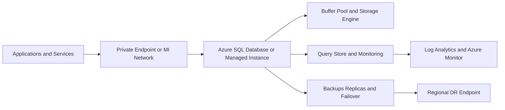
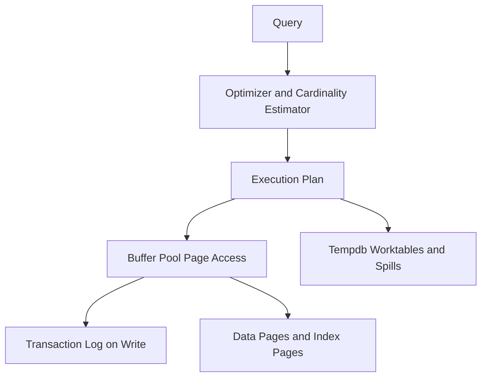
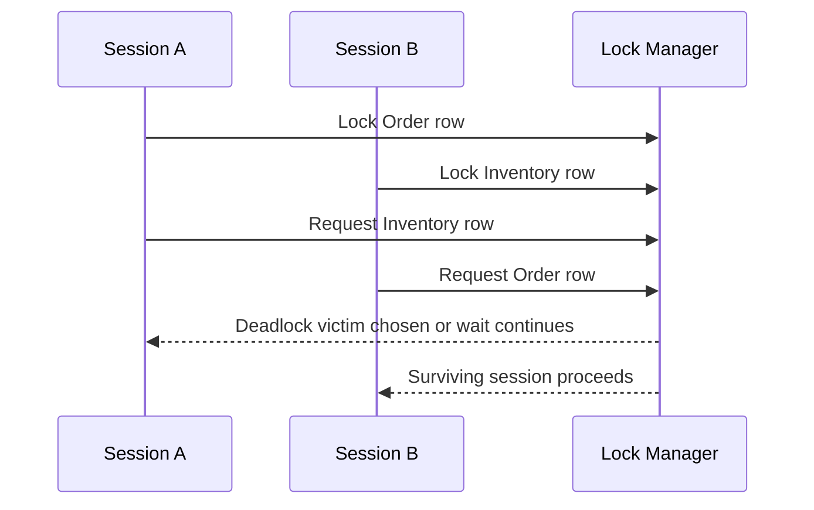

# SQL Server and Azure SQL

> Part of the **Enterprise Data & AI Architecture Handbook** · Phase-06 - Data Modeling & Warehousing · Chapter 08.
> Estimated study time: **75 min reading + ~5h labs**.
> **Prerequisites:** read [Normalization and OLTP Modeling](03_Normalization_and_OLTP_Modeling.md), [Data Warehouse Architecture](07_Data_Warehouse_Architecture.md), [Dimensional Modeling](01_Dimensional_Modeling.md), [Lakehouse Architecture](../Phase-05/02_Lakehouse_Architecture.md), [Azure Core Architecture](../Phase-03/02_Azure_Core_Architecture.md), and [Well-Architected Framework](../Phase-03/07_Well_Architected_Framework.md) first.

---

## Executive Summary

SQL Server and Azure SQL remain core enterprise platforms because they combine mature relational semantics, strong operational tooling, and well-understood performance behavior for both transactional and analytical workloads. The architectural value is not simply that they run T-SQL. The value is that they expose a battle-tested storage engine, query optimizer, concurrency model, and observability surface that let teams reason precisely about correctness, latency, and cost under production conditions.

The hard part is not creating tables. The hard part is understanding how rows become pages, how pages enter the buffer pool, how write-ahead logging protects durability, how the optimizer estimates cardinality, why one index helps while another creates write tax, and how lock or versioning behavior shapes real user experience. Most SQL Server failures are not caused by missing syntax knowledge. They come from using the engine as if it were a black box while production behavior depends on storage, plan quality, and concurrency design.

Azure SQL adds a deployment-architecture layer on top of those engine semantics. Single databases, elastic pools, Business Critical, Hyperscale, Managed Instance, failover groups, and geo-replication are not minor hosting options. They express different assumptions about isolation, compatibility, HA/DR, storage scale, read replicas, and operational ownership. The right architectural decision depends on workload profile, migration constraints, compliance boundaries, and how much operational control the team needs to retain.

This chapter covers storage-engine internals, pages, buffer pool, transaction log, query optimization and execution plans, cardinality estimation, indexing strategy, concurrency, isolation levels, deadlock analysis, and Azure SQL deployment models including Hyperscale, Managed Instance, and HA/DR. The goal is practical: understand how the engine behaves, choose the right Azure deployment model, and stop treating SQL performance as a collection of disconnected tips instead of an architectural system.

## Learning Objectives

By the end of this chapter you should be able to:

1. Explain how SQL Server stores data in pages, writes changes to the transaction log, and serves pages from the buffer pool.
2. Read execution plans and reason about join choice, scan versus seek behavior, memory grants, spills, and cardinality estimation quality.
3. Design clustered, nonclustered, filtered, and columnstore indexes for different workload shapes.
4. Distinguish locking, latching, row versioning, and isolation-level behavior in SQL Server and Azure SQL.
5. Diagnose deadlocks, blocking, and plan regressions using Query Store, Extended Events, DMVs, and Azure monitoring.
6. Choose between Azure SQL Database, Elastic Pools, Business Critical, Hyperscale, Managed Instance, and SQL Server on Azure VMs based on real constraints.
7. Design HA/DR, backup, failover, and restore strategies that match business RTO and RPO requirements.
8. Compare SQL Server and Azure SQL patterns with open-source PostgreSQL and cross-cloud managed relational services.
9. Recognize anti-patterns such as `NOLOCK` abuse, over-indexing, poor key design, and cargo-cult parameter tuning.
10. Defend engine and deployment decisions in engineer, staff engineer, architect, and CTO reviews.

## Business Motivation

- Revenue-critical systems depend on correct relational state changes, durable writes, and predictable concurrency behavior.
- Data products, marts, and operational analytics often rely on SQL Server or Azure SQL as authoritative serving layers.
- Platform teams need a managed or semi-managed relational platform that can support OLTP, hybrid operational reporting, and some departmental analytical patterns.
- Security and compliance teams need auditing, least privilege, encryption, and recoverability in regulated environments.
- Azure FinOps programs need to choose between PaaS convenience, reserved capacity, elastic pooling, and VM control with clear cost trade-offs.
- Migration programs need a realistic path from on-premises SQL Server to Azure-managed deployment models.
- Engineers need a performance model that is grounded in engine internals rather than folklore.

## History and Evolution

- SQL Server evolved from a departmental relational engine into a broad enterprise platform with strong OLTP, BI, and administrative tooling.
- Core engine features such as B-tree indexing, cost-based optimization, transaction logging, and locking matured across decades of enterprise workloads.
- SQL Server Analysis Services, Integration Services, and Reporting Services once extended the platform deeply into the Microsoft BI estate, though modern architectures often separate those concerns more explicitly.
- Azure SQL Database shifted the conversation from instance administration to service tiers, elasticity, and managed HA/DR.
- Managed Instance emerged to support SQL Server compatibility scenarios that single databases and elastic pools could not satisfy easily.
- Hyperscale introduced a different storage and log architecture to support larger databases, rapid scale-out, and fast copy or restore behavior.
- Current enterprise practice treats SQL Server and Azure SQL as one family of engine semantics with different operational envelopes rather than as unrelated products.

## Why This Technology Exists

SQL Server and Azure SQL exist because enterprises need a relational engine that can enforce correctness under concurrency while also providing a precise operational model for performance tuning, recoverability, and security. Many business systems cannot tolerate eventual consistency or weak transactional boundaries for core records such as orders, invoices, policies, claims, identities, and reference data.

They also exist because engineers need observability and control. Query plans, statistics, wait events, DMVs, Query Store, row-versioning behavior, deadlock graphs, and backup chains turn the database from a mystery box into a diagnosable production system. The platform rewards teams that understand it and punishes teams that treat it as a generic black-box datastore.

Azure SQL specifically exists because many organizations want the SQL Server engine behavior without owning every aspect of patching, HA, backups, and failover orchestration. But PaaS convenience is only valuable if teams still understand the engine well enough to design indexes, choose service tiers, and analyze blocking or plan regressions correctly.

## Problems It Solves

| Problem | SQL Server and Azure SQL response | Enterprise signal that it is working |
|---|---|---|
| concurrent writes must remain correct | ACID transactions, locking, versioning, and constraint enforcement | transactional integrity incidents are rare and explainable |
| relational workloads need predictable tuning tools | execution plans, Query Store, DMVs, and statistics-driven optimization | engineers can diagnose performance with evidence |
| workloads need strong point-in-time recovery | transaction log, automated backups, restore chains, and HA/DR features | restore drills and failovers meet business targets |
| operational and some analytical serving need efficient indexing | clustered, nonclustered, filtered, and columnstore indexes | reads are efficient without crippling write paths |
| cloud migration needs SQL Server compatibility | Managed Instance, Azure SQL Database, and VM options | migration paths match workload and feature constraints |
| security and governance need strong platform features | auditing, TDE, Always Encrypted, RLS, Entra integration | compliance controls are enforceable in the platform |
| engine-level failures need root-cause analysis | wait stats, deadlock graphs, query plans, and Azure telemetry | outages become diagnosable rather than anecdotal |

## Problems It Cannot Solve

- It cannot fix poor domain boundaries or ambiguous business semantics.
- It is not the right primary platform for petabyte-scale shared-nothing MPP warehouse workloads better served by engines discussed in [Data Warehouse Architecture](07_Data_Warehouse_Architecture.md).
- It cannot turn badly shaped queries into efficient ones without better indexing, modeling, or workload design.
- It does not remove the need for caches, queues, search systems, or lakehouse platforms where those patterns fit better.
- It should not be used as a universal substitute for every analytical, graph, or document workload.
- It cannot make weak application retry logic or long transactions safe automatically.
- It does not eliminate the need for operational discipline around schema migration, security, and capacity planning.

## Core Concepts

### 8.1 Pages, extents, and the storage engine

SQL Server stores data in 8 KB pages, grouped into extents. Tables and indexes are ultimately collections of pages organized by allocation maps and B-tree or heap structures. Understanding that physical reality matters because fragmentation, page splits, row overflow, and IO behavior all emerge from it. Logical rows become physical pages; physical pages become the unit of caching, reading, writing, and recovery.

### 8.2 Buffer pool and memory behavior

The buffer pool caches data and index pages in memory so queries do not always hit storage. Reads first attempt to find required pages in cache. Writes modify buffer pages in memory and later flush them to disk through checkpoint or background processes, but only after corresponding log records are durably written. This is why memory pressure, buffer cache churn, and read patterns matter so much for performance.

### 8.3 Transaction log and write-ahead logging

SQL Server uses write-ahead logging. Before a data page change is considered committed, the log record describing that change must be written durably to the transaction log. The log therefore protects durability and enables rollback, crash recovery, replication-like features, and point-in-time restore. Slow log IO or long-running transactions frequently become the real bottleneck even when data-file IO appears acceptable.

### 8.4 Query optimizer, cardinality estimation, and execution plans

The optimizer chooses physical execution strategies based on statistics and cost estimates. Cardinality estimation predicts how many rows flow through each operator. If those estimates are wrong, join algorithms, memory grants, parallelism choices, and index selection can all be wrong. Execution plans are therefore not abstract diagrams. They are the engine's current theory of the workload. Engineers tune performance by improving that theory or by changing the available physical paths.

### 8.5 Indexing strategy

Clustered indexes define physical row order for rowstore tables. Nonclustered indexes define alternative access paths. Filtered indexes narrow maintenance cost for targeted predicates. Columnstore indexes compress and vectorize large analytical scans. Each helps a specific workload shape and hurts another through write amplification, fragmentation, or maintenance overhead. Good indexing is workload design, not checkbox optimization.

### 8.6 Concurrency, isolation, and deadlocks

SQL Server supports locking and row-versioning models across isolation levels such as Read Committed, Read Committed Snapshot, Snapshot, Repeatable Read, and Serializable. Blocking is often normal and correct. Deadlocks are not just "too much traffic"; they are cyclic dependency patterns caused by inconsistent access ordering or long transactional scope. Latches and spinlocks are different again: they protect internal structures rather than logical business rows.

### 8.7 Azure SQL deployment models

Azure SQL Database provides database-level managed PaaS with service tiers and optional elastic pooling. Managed Instance provides higher SQL Server compatibility with instance-like behaviors such as SQL Agent and cross-database patterns. Hyperscale changes storage architecture to support rapid scale-out, large size, and faster copy or restore operations. SQL Server on Azure VMs preserves maximum engine and OS control at the cost of more operational ownership. These are architectural choices, not simple SKU variations.

## Internal Working

### 9.1 Read path through the engine

When a query runs, the engine parses and compiles the statement or reuses a cached plan, identifies required pages, checks the buffer pool, and reads missing pages from storage. The storage engine then navigates heaps, clustered indexes, or columnstore segments while the execution engine coordinates operators such as seeks, scans, joins, sorts, and aggregates. If the query spills or reads many cold pages, latency rises quickly.

### 9.2 Write path and commit behavior

Inserts, updates, and deletes modify data pages in memory and generate transaction-log records. The commit cannot complete until the relevant log records are flushed. Dirty pages can remain in memory temporarily; the log makes recovery possible. This is why log throughput and transaction scope determine write behavior more directly than raw data-file capacity.

### 9.3 Plan compilation and parameter sensitivity

The optimizer compiles a plan based on the parameter values and statistics visible at compile time. One plan may work well for one parameter distribution and poorly for another. This is why parameter sniffing, or more accurately parameter sensitivity, appears in production. Query Store, plan forcing, hinting, or query rewrites can help, but the right fix depends on whether the underlying row distribution or statistics are the true problem.

### 9.4 Tempdb, row versioning, and intermediate work

Tempdb stores temporary objects, row versions for snapshot-style isolation, hash spill data, sort spill data, and many internal worktables. Tempdb pressure is therefore a leading indicator of workload instability. Teams that never monitor tempdb often end up treating the symptoms of query regressions instead of the actual cause.

### 9.5 Locking, latching, and deadlock detection

Lock manager components track logical lock compatibility across resources. Latches protect in-memory internal structures such as pages. SQL Server periodically detects deadlock cycles and selects a victim transaction to roll back based on cost and priority. A deadlock graph therefore describes resource order conflict, not generic slowness. The right remediation is usually access-order discipline or transaction-scope reduction, not merely retry loops.

### 9.6 Hyperscale and managed service internals

Hyperscale separates compute, log service, and page-server-like storage responsibilities so databases can scale beyond traditional database-storage boundaries. Managed Instance retains more classic instance semantics while Azure SQL Database pushes more responsibility into the platform boundary. Those managed-service differences affect restore speed, failover behavior, storage elasticity, and administrative freedom.

## Architecture

### 10.1 Azure-first reference architecture

The common Azure pattern uses App Service, AKS, Functions, or other application tiers connecting privately to Azure SQL Database, Managed Instance, or SQL Server on Azure VMs. Key Vault manages secrets, Entra ID manages identity, Azure Monitor and Log Analytics collect telemetry, and Power BI or other reporting systems connect to read paths or curated marts rather than abusing core OLTP databases. For hybrid estates, Managed Instance or SQL Server on VMs often bridges compatibility gaps while strategic workloads move toward cleaner PaaS boundaries.

### 10.2 Why the architecture works

This architecture keeps relational truth capture close to the engine, separates application responsibilities from database responsibilities, and preserves observability, HA/DR, and security boundaries inside Azure-native controls. It also keeps analytical workloads on purpose-built surfaces as described in [Data Warehouse Architecture](07_Data_Warehouse_Architecture.md) rather than using OLTP databases as ad hoc warehouses.

### 10.3 ADR example: standardize new transactional workloads on Azure SQL Database, retain Managed Instance only for compatibility-bound estates

**Context:** The organization has a mix of legacy SQL Server workloads, greenfield applications, and a desire to reduce operational overhead. Some teams want all new workloads on Managed Instance because it feels closest to on-prem SQL Server. Others want maximum PaaS simplification.

**Decision:** Standardize new bounded-context transactional systems on Azure SQL Database by default. Use Managed Instance only when feature compatibility, cross-database dependencies, SQL Agent reliance, or migration constraints materially justify it. Use SQL Server on Azure VMs only for exceptional cases requiring OS-level or instance-level control.

**Consequences:** Most new systems gain simpler PaaS operations, easier scaling choices, and clearer governance boundaries. Legacy or compatibility-heavy workloads still have a viable path without forcing all designs into instance semantics they do not need.

**Alternatives considered:**

1. Managed Instance for everything: rejected because it carries more instance-shaped assumptions and cost than many greenfield systems need.
2. SQL Server on Azure VMs for everything: rejected because operational burden stays too high.
3. One single database per application with no exceptions: rejected because some migration-bound estates genuinely need MI or VM patterns.

## Components

| Component | Role | Azure-first implementation choices | Common failure mode |
|---|---|---|---|
| storage engine | page management, access methods, logging, recovery | SQL Server engine across Azure SQL and VM models | treated as invisible despite performance dependence |
| buffer manager | caches pages and manages memory residency | engine-managed buffer pool | memory pressure misdiagnosed as storage slowness |
| transaction log | durability and recovery backbone | local or managed log storage depending service | long transactions or slow log IO dominate latency |
| query optimizer | plan compilation and cost-based selection | optimizer plus Query Store controls | stale stats or parameter sensitivity cause plan regressions |
| index structures | primary access paths and alternate lookup paths | clustered, nonclustered, columnstore, filtered indexes | index sprawl punishes writes |
| tempdb | transient workspace for row versioning and spills | managed tempdb in Azure SQL / instance tempdb in MI or VM | ignored until production instability appears |
| concurrency manager | locks, latches, deadlock detection, row versions | engine internals plus isolation-level settings | teams confuse blocking, latching, and deadlocks |
| HA/DR layer | backups, failover, replicas, geo-disaster options | zone redundancy, failover groups, AGs on VMs, Hyperscale replicas | business RTO and platform design are misaligned |
| security layer | auth, encryption, auditing, policy enforcement | Entra ID, TDE, Always Encrypted, Defender, auditing | broad privileges and shared logins persist |
| telemetry layer | plans, waits, query history, errors | Query Store, DMVs, Azure Monitor, Extended Events | incidents lack evidence |

## Metadata

SQL Server and Azure SQL depend on internal and operational metadata for correct behavior and tuning.

| Metadata class | What to record | Why it matters |
|---|---|---|
| statistics metadata | row distribution and histogram information | drives cardinality estimation |
| index metadata | key columns, includes, filter predicates, usage | prevents tuning by memory or folklore |
| Query Store metadata | runtime stats, plans, regressions, forcing history | supports plan diagnosis and recovery |
| wait and latch metadata | resource contention signatures | separates CPU, IO, lock, and tempdb problems |
| backup and restore metadata | retention, LTR, PITR windows, restore history | governs recoverability |
| security metadata | roles, principals, auditing status, data classification | supports compliance and least privilege |
| deployment metadata | service tier, vCores, storage size, zone redundancy, replica settings | aligns platform cost and capability |
| workload metadata | query labels, client applications, SLO class | ties performance to business consumers |

If a team cannot explain which statistics a plan depended on or why a key index exists, it is not really governing the database.

## Storage

Storage-engine behavior is central to SQL Server performance.

| Storage concern | Recommended posture | Notes |
|---|---|---|
| rowstore page layout | keep hot rows compact and normalized where possible | aligns with [Normalization and OLTP Modeling](03_Normalization_and_OLTP_Modeling.md) |
| transaction log throughput | monitor log write latency and VLF behavior implications | commit speed often depends here first |
| tempdb usage | monitor spill and version-store pressure | especially important under RCSI or Snapshot workloads |
| columnstore storage | use for scan-heavy analytical or operational-analytic tables | not a default replacement for OLTP rowstore |
| Hyperscale storage | exploit large size and fast copy, but understand remote page-server behavior | architecture differs from boxed SQL Server assumptions |
| archive and partition strategy | move cold data off hot tables where possible | keeps maintenance and buffer use sane |

SQL Server storage tuning is not about chasing one magic setting. It is about reducing unnecessary page churn, log pressure, and tempdb pain while preserving reliable access paths.

## Compute

| Workload class | Best Azure-first surface | Why it fits | Wrong default |
|---|---|---|---|
| greenfield OLTP app with clean boundaries | Azure SQL Database General Purpose or Business Critical | strong PaaS posture and clear scope | Managed Instance by reflex |
| migration-heavy SQL Server estate | Azure SQL Managed Instance | compatibility and operational relief | full rewrite just to fit single-db PaaS |
| very large read-scale or storage-heavy operational database | Azure SQL Hyperscale | scale-out replicas and architectural elasticity | assuming Hyperscale fixes bad schema or query design |
| strict instance-level control or unsupported features | SQL Server on Azure VMs | maximum control | self-managing when PaaS would suffice |
| mixed small databases with bursty usage | elastic pools or serverless where appropriate | cost-efficient multi-tenant or low-duty-cycle serving | dedicated high-end DB per tiny workload |

Compute choice must follow compatibility, isolation, workload predictability, and HA needs, not only habit.

## Networking

- Use private endpoints for Azure SQL Database where possible and private network patterns for Managed Instance.
- Keep application and database regions aligned to reduce latency and cross-zone jitter.
- Use connection pooling aggressively; relational databases are not infinite connection endpoints.
- Design failover-group DNS and retry behavior before an incident happens.
- Separate network retries from transaction retries so duplicate-write risk stays controlled.
- Understand that Managed Instance networking behaves more like a VNet-contained service than a simple public endpoint.

Many production "database incidents" are really connection-management or network-path problems surfaced through SQL symptoms.

## Security

| Concern | Recommended control |
|---|---|
| authentication | Entra ID and managed identities where supported |
| encryption at rest | TDE by default, with CMK where policy requires |
| encryption in use | Always Encrypted for sensitive columns where justified |
| secrets | Key Vault instead of embedded connection strings |
| network restriction | private endpoints, NSGs, and controlled egress |
| auditing and threat detection | SQL auditing, Defender for SQL, vulnerability assessment |
| least privilege | separate application, migration, reporting, and admin principals |

Security failures often come less from missing cryptography and more from broad privileges, stale identities, and ungoverned ad hoc access.

## Performance

Performance work in SQL Server is the art of turning logical requirements into efficient physical access and stable plans.

- index for real predicates and joins, not for every imagined future query,
- keep statistics current on volatile large tables,
- investigate parameter sensitivity before forcing plans blindly,
- monitor waits, not only CPU or duration,
- use columnstore where scan-heavy patterns truly justify it,
- reduce tempdb and spill pressure by improving cardinality, grants, and query shape.

| Pattern | Azure recommendation | Why |
|---|---|---|
| recent-order lookup by customer | composite nonclustered index with selective includes | narrow hot-path read efficiency |
| soft-deleted active rows | filtered index on active predicate | lower write cost and smaller index footprint |
| large warehouse-like summary table in SQL Server | clustered or nonclustered columnstore | scan and compression benefits |
| unstable plan after deployment | Query Store baseline and regression comparison | evidence-based rollback or forcing |

## Scalability

Scalability in SQL Server and Azure SQL is a combination of vertical scaling, workload shaping, and architectural escape hatches.

- scale up for single-database transactional integrity workloads first,
- use elastic pools for many small tenants or bounded multi-database estates,
- use Hyperscale when size and read scale materially matter,
- separate analytical or search workloads into serving layers better suited to them,
- shard only when domain boundaries and workload characteristics demand it.

Good scalability comes from respecting workload type, not from assuming every database problem should become a distributed systems problem.

## Fault Tolerance

Fault tolerance depends on backup posture, failover design, and application correctness under failure.

- automated backups and PITR must align to business restore expectations,
- zone redundancy and Business Critical or Hyperscale replicas should match availability needs,
- auto-failover groups are useful only when clients reconnect safely and idempotently,
- SQL Server on VMs needs explicit Always On or equivalent HA design and testing,
- restore drills matter more than documentation.

The database platform can meet excellent RTO and RPO targets, but only if application retry behavior, runbooks, and operational ownership are equally disciplined.

## Cost Optimization

Cost optimization is mostly about choosing the right service model, avoiding oversized tiers, and stopping repeated operational inefficiency.

- match General Purpose, Business Critical, Hyperscale, and MI choices to actual latency and compatibility needs,
- use elastic pools where many small databases share predictable patterns,
- consider serverless only for truly intermittent workloads,
- remove unused indexes and dead reporting objects,
- move analytics off the OLTP primary path where practical.

Worked FinOps example: imagine a line-of-business workload runs on Azure SQL Database Business Critical 8 vCore at roughly $2,400 per month in illustrative pricing because it supports both OLTP writes and heavy daytime reporting. If report queries are moved to a semantic layer or read-optimized store and write latency tests show the workload fits General Purpose 4 vCore with one smaller read path, total monthly cost may fall materially while operational stability improves. Conversely, a migration-bound SQL Server estate that needs SQL Agent, cross-database patterns, and near-lift-and-shift compatibility may justify Managed Instance even if the monthly bill is higher, because engineering avoidance of a long rewrite has real economic value. The right cost decision is total platform economics, not only SKU sticker price.

## Monitoring

| Metric | Why it matters | Typical threshold |
|---|---|---|
| CPU percent and worker pressure | indicates compute saturation | alert before sustained saturation |
| data IO and log write percent | reveals storage and commit pressure | alert when approaching service limits |
| wait statistics | shows real bottleneck type | review persistent top waits by workload |
| deadlock count | detects concurrency pathology | zero or very low steady state |
| tempdb and version store usage | signals spill or row-versioning stress | investigate rapid growth |
| plan regressions | detects optimizer behavior changes | alert on p95 jump tied to new plan |
| storage growth and backup retention | cost and recoverability indicator | review monthly or on anomaly |

## Observability

Observability should answer which plan ran, which waits dominated, which isolation path applied, which log or tempdb pressure existed, and what changed recently.

- correlate application trace IDs and query labels with Query Store runtime histories,
- capture deadlock XML, blocking chains, and wait distributions,
- preserve database tier, failover, and deployment-version context alongside query telemetry,
- trace sensitive workload changes to index, statistics, and schema deployments.

### Operational response playbooks

| Signal | Detection query or rule | Likely cause | First remediation |
|---|---|---|---|
| deadlocks spike after a release | Query Store plus deadlock graph count by app version | changed access order or widened transaction scope | inspect deployment diff, standardize access order, rollback if needed |
| sudden latency increase with same SQL text | Query Store shows plan regression or higher waits | stale stats, parameter sensitivity, or missing index | compare plans, update stats or force known-good plan temporarily |
| tempdb growth surges during reporting window | tempdb usage and spill wait metrics rise | bad memory grant, sort/hash spill, or row-version backlog | isolate offending query, reduce workload overlap, tune grant or query shape |

## Governance

Engine governance means deciding who can change schema, indexes, tiers, isolation behavior, and security posture.

- keep DDL and index changes in version control and deploy through pipelines,
- review isolation-level and hint changes like code, not as ad hoc tuning,
- require business justification for service-tier increases and plan forcing,
- track compatibility-level and cardinality-estimator decisions explicitly,
- align database roles, schemas, and ownership to domain boundaries.

The most expensive governance failure is quiet drift: manual production fixes, emergency indexes, unreviewed hints, and undocumented service-tier changes that outlive the incident that created them.

## Trade-offs

| Choice | Advantages | Disadvantages | When to prefer it |
|---|---|---|---|
| Azure SQL Database | strong PaaS simplicity and clear scope | fewer instance-level features than MI or VM | greenfield and modernized app databases |
| Managed Instance | high SQL Server compatibility | more cost and instance-shaped operational model | migration-bound or instance-semantic workloads |
| Hyperscale | high storage scale and read-replica flexibility | not a shortcut around weak queries or schema | very large or read-scaled operational DBs |
| SQL Server on Azure VM | maximum control and feature breadth | highest operational burden | exceptional workloads needing full engine or OS control |
| columnstore | high scan performance and compression | not ideal for hot OLTP writes | large read-heavy tables and marts |
| row versioning isolation | fewer reader/writer blocks | tempdb or version-store overhead | read-heavy systems needing lower blocking |

## Decision Matrix

| Requirement | Azure SQL DB GP | Azure SQL DB Business Critical | Azure SQL Hyperscale | Managed Instance | SQL Server on Azure VM |
|---|---|---|---|---|---|
| greenfield OLTP | strong | strong | medium | medium | weak |
| lowest ops overhead | strong | strong | strong | medium | weak |
| very large database size | medium | medium | strong | medium | strong |
| SQL Server feature compatibility | medium | medium | medium | strong | strong |
| read-scale replicas | medium | strong | strong | medium | medium |
| instance-level control | weak | weak | weak | medium | strong |
| migration ease from on-prem | medium | medium | medium | strong | strong |

The real choice is usually between Azure SQL Database and Managed Instance. Hyperscale and VMs are more specialized answers to size or control constraints.

## Design Patterns

1. **Normalized OLTP core with alternate keys:** align to [Normalization and OLTP Modeling](03_Normalization_and_OLTP_Modeling.md) and preserve business uniqueness.
2. **Filtered-index pattern:** accelerate active-row predicates without indexing the entire table.
3. **Outbox pattern:** persist integration events transactionally with business changes.
4. **Read-committed snapshot pattern:** reduce reader/writer blocking in mixed read-heavy workloads.
5. **Query Store baseline pattern:** capture and preserve known-good plans before risky releases.
6. **Partitioned archive pattern:** keep cold history separate from hot rows.
7. **Columnstore sidecar pattern:** use analytical indexes or tables for reporting over operationally sourced data.
8. **Auto-failover group pattern:** protect application-facing databases across regions with tested client reconnect logic.

## Anti-patterns

- Using `NOLOCK` as a default performance feature instead of designing correct concurrency.
- Clustered GUID keys on hot append tables without a specific reason and mitigation strategy.
- Indexing every column used by any query.
- Running broad BI queries directly against primary OLTP databases during business peaks.
- Treating Hyperscale as a fix for bad indexing or terrible plans.
- Using hints and forced plans permanently without understanding the root cause.
- Ignoring tempdb because "the queries usually finish eventually."
- Migrating to Azure SQL without redefining HA/DR and retry assumptions.

## Common Mistakes

- Forgetting alternate business uniqueness when surrogate keys are introduced.
- Leaving auto-created or stale statistics unmanaged on volatile critical tables.
- Confusing blocking with deadlocking and applying the wrong fix.
- Relying on one cached plan for highly skewed parameter distributions.
- Overusing scalar functions or non-SARGable predicates in hot code paths.
- Choosing Managed Instance for every workload because it feels familiar.
- Treating Query Store as optional rather than foundational.

## Best Practices

- understand waits, plans, and log behavior before changing indexes or tiers,
- enable and govern Query Store for critical workloads,
- keep transactions short and deterministic in access order,
- design indexes for proven hot paths and review them regularly,
- prefer row-versioning isolation where it fits business correctness and tempdb budgets,
- separate analytical and reporting read pressure from the core OLTP engine,
- align Azure SQL service choice to compatibility and workload reality,
- test restore, failover, and retry behavior regularly.

## Enterprise Recommendations

1. Default new modern transactional workloads to Azure SQL Database unless compatibility constraints justify Managed Instance.
2. Require Query Store, auditing, and baseline monitoring on all business-critical databases.
3. Standardize review for index additions, forced plans, hint usage, and isolation-level changes.
4. Keep OLTP, warehouse, and semantic responsibilities distinct even when the same SQL family is involved.
5. Use Hyperscale only for clear size or replica-driven reasons, not as a generic premium tier.
6. Treat HA/DR as an application-plus-database design, not a platform checkbox.
7. Publish service-tier decision criteria that include compatibility, latency, HA, and cost.
8. Track deadlock rate, plan regressions, and tempdb pressure as first-class health signals.

## Azure Implementation

### 31.1 Recommended Azure service map

| Layer | Preferred Azure service | Notes |
|---|---|---|
| greenfield relational OLTP | Azure SQL Database | simplest managed deployment boundary |
| migration-heavy SQL Server estate | Managed Instance | strongest compatibility path |
| very large scale-out relational workload | Azure SQL Hyperscale | page-server-like architecture and read replicas |
| full-control exceptional case | SQL Server on Azure VMs | use sparingly |
| secrets and identity | Key Vault, Entra ID, managed identities | reduce credential sprawl |
| monitoring | Azure Monitor, Log Analytics, Query Store, Defender for SQL | unify engine and platform telemetry |
| HA/DR | auto-failover groups, zone redundancy, geo-replication, AGs on VMs | match to RTO/RPO |

### 31.2 Example OLTP schema and indexing in T-SQL

```sql
create schema sales;
go

create table sales.Customer
(
    CustomerId bigint identity(1,1) not null,
    CustomerNumber varchar(30) not null,
    EmailAddress varchar(320) not null,
    CustomerStatusCode varchar(20) not null,
    CreatedUtc datetime2 not null constraint DF_Customer_CreatedUtc default sysutcdatetime(),
    RowVersion rowversion not null,
    constraint PK_Customer primary key clustered (CustomerId),
    constraint UQ_Customer_CustomerNumber unique (CustomerNumber),
    constraint UQ_Customer_EmailAddress unique (EmailAddress)
);

create table sales.[Order]
(
    OrderId bigint identity(1,1) not null,
    CustomerId bigint not null,
    OrderNumber varchar(30) not null,
    OrderStatusCode varchar(20) not null,
    OrderUtc datetime2 not null,
    TotalAmount decimal(18,2) not null,
    constraint PK_Order primary key clustered (OrderId),
    constraint UQ_Order_OrderNumber unique (OrderNumber),
    constraint FK_Order_Customer foreign key (CustomerId) references sales.Customer(CustomerId),
    constraint CK_Order_TotalAmount check (TotalAmount >= 0)
);

create nonclustered index IX_Order_Customer_OrderUtc
    on sales.[Order] (CustomerId, OrderUtc desc)
    include (OrderNumber, OrderStatusCode, TotalAmount);

create nonclustered index IX_Order_Active
    on sales.[Order] (OrderStatusCode, OrderUtc desc)
    where OrderStatusCode in ('Pending','Paid','ReadyToShip');
```

### 31.3 Example row-versioning and Query Store configuration

```sql
alter database current set read_committed_snapshot on;
alter database current set query_store = on;
alter database current set query_store
(
    operation_mode = read_write,
    cleanup_policy = (stale_query_threshold_days = 30),
    data_flush_interval_seconds = 900,
    interval_length_minutes = 15,
    max_storage_size_mb = 2048
);
```

### 31.4 Example columnstore for operational-analytic summary

```sql
create table reporting.FactSalesDaily
(
    DateKey int not null,
    ProductKey int not null,
    RegionKey int not null,
    NetSalesAmount decimal(18,2) not null,
    Quantity bigint not null
);

create clustered columnstore index CCI_FactSalesDaily
    on reporting.FactSalesDaily;
```

### 31.5 Example Query Store regression query

```sql
select top (20)
    qsq.query_id,
    qsp.plan_id,
    rs.avg_duration,
    rs.avg_cpu_time,
    rs.avg_logical_io_reads,
    qt.query_sql_text
from sys.query_store_query qsq
join sys.query_store_query_text qt
  on qsq.query_text_id = qt.query_text_id
join sys.query_store_plan qsp
  on qsq.query_id = qsp.query_id
join sys.query_store_runtime_stats rs
  on qsp.plan_id = rs.plan_id
order by rs.avg_duration desc;
```

### 31.6 Example Bicep and CLI for Azure SQL Hyperscale and failover

```bicep
param location string = resourceGroup().location
param adminLogin string
@secure()
param adminPassword string

resource sqlServer 'Microsoft.Sql/servers@2023-08-01-preview' = {
  name: 'sql-edai-prod'
  location: location
  properties: {
    administratorLogin: adminLogin
    administratorLoginPassword: adminPassword
    publicNetworkAccess: 'Disabled'
  }
}

resource sqlDb 'Microsoft.Sql/servers/databases@2023-08-01-preview' = {
  name: '${sqlServer.name}/sqldb-core-prod'
  location: location
  sku: {
    name: 'HS_Gen5_4'
    tier: 'Hyperscale'
  }
  properties: {
    zoneRedundant: true
    readScale: 'Enabled'
  }
}
```

```bash
az group create --name rg-edai-sql-prod --location westeurope
az sql server create --resource-group rg-edai-sql-prod --name sql-edai-prod --location westeurope --admin-user sqladmin --admin-password <Password>
az sql db create --resource-group rg-edai-sql-prod --server sql-edai-prod --name sqldb-core-prod --edition Hyperscale --family Gen5 --capacity 4 --zone-redundant true
az sql failover-group create --name fog-edai-core --resource-group rg-edai-sql-prod --server sql-edai-prod --partner-server sql-edai-dr --partner-resource-group rg-edai-sql-dr --failover-policy Automatic --grace-period 1
```

Practical Azure guidance:

- General Purpose is the default starting point for many modern app databases.
- Business Critical is justified when local SSD-like behavior, lower latency, or stronger HA profile matter materially.
- Hyperscale fits size, replica, and restore-copy scenarios, not generic performance wishfulness.
- Managed Instance fits estates needing instance semantics such as SQL Agent, cross-database behavior, or broader migration compatibility.

## Open Source Implementation

There is no open-source SQL Server equivalent, but PostgreSQL provides a strong open relational comparison point for engine concepts such as page management, WAL, MVCC, statistics, and indexing.

| Layer | Open-source choice | Notes |
|---|---|---|
| core engine | PostgreSQL | closest widely adopted open relational comparison |
| connection pooling | pgBouncer | protects the engine from client fan-out |
| observability | pg_stat_statements, Prometheus, Grafana | similar role to Query Store plus metrics |
| HA orchestration | Patroni or cloud-managed PostgreSQL HA | explicit HA ownership when self-managed |
| migration automation | Flyway-style or Liquibase-style workflow, GitHub Actions | same governance principles apply |

Example PostgreSQL comparison schema and index:

```sql
create table sales.order_header
(
    order_id bigint generated always as identity primary key,
    customer_id bigint not null,
    order_number text not null unique,
    order_status_code text not null,
    order_utc timestamptz not null,
    total_amount numeric(18,2) not null check (total_amount >= 0)
);

create index ix_order_header_customer_order_utc
    on sales.order_header (customer_id, order_utc desc);

create index ix_order_header_active
    on sales.order_header (order_status_code, order_utc desc)
    where order_status_code in ('Pending','Paid','ReadyToShip');
```

Example PostgreSQL plan inspection:

```sql
explain (analyze, buffers)
select order_number, order_status_code, total_amount
from sales.order_header
where customer_id = 42
order by order_utc desc
limit 20;
```

Open-source comparison is useful because it reinforces which concerns are universal: statistics quality, index shape, concurrency semantics, WAL behavior, and workload observability. The implementation knobs differ, but the architectural thinking is transferable.

## AWS Equivalent (comparison only)

| Azure pattern | AWS equivalent | Advantages | Disadvantages | Migration note |
|---|---|---|---|---|
| Azure SQL Database | Amazon RDS for SQL Server | managed SQL Server compatibility | different operational envelope and some Azure-native integrations lost | preserve engine-level logic but retest HA, auth, and cost assumptions |
| Managed Instance | Amazon RDS for SQL Server or SQL Server on EC2 depending feature needs | familiar SQL Server engine path | no direct one-to-one MI experience | review agent jobs, cross-db patterns, and networking carefully |
| Hyperscale | no direct SQL Server analogue; Aurora or distributed read-scale patterns may be functional alternatives if engine change is allowed | strong cloud-native scale choices | engine semantics differ materially | avoid assuming architectural parity if leaving SQL Server |
| SQL Server on Azure VM | SQL Server on EC2 | maximum control | highest ops burden | compare licensing, storage, and HA automation explicitly |

## GCP Equivalent (comparison only)

| Azure pattern | GCP equivalent | Advantages | Disadvantages | Migration note |
|---|---|---|---|---|
| Azure SQL Database | Cloud SQL for SQL Server | managed SQL Server option | narrower feature and scale envelope than some Azure tiers | validate compatibility and failover behavior |
| Managed Instance | SQL Server on Compute Engine or Cloud SQL depending feature fit | preserves engine familiarity | no exact MI equivalent | expect more design work around instance semantics |
| Hyperscale | AlloyDB or Cloud SQL scale patterns if engine change is acceptable | strong cloud-native relational options | not SQL Server-compatible | treat as re-platforming, not lift-and-shift |
| SQL Server on Azure VM | SQL Server on Compute Engine | full control | full ops burden | reassess HA and storage patterns carefully |

## Migration Considerations

- From on-prem SQL Server to Azure SQL Database: identify unsupported instance-level features, cross-database dependencies, and SQL Agent usage early.
- From on-prem to Managed Instance: validate network topology, authentication integration, and operational process changes rather than assuming near-zero change.
- From SQL Server on VMs to PaaS: separate engine tuning from infrastructure tuning so the migration does not carry avoidable baggage.
- From SQL Server to PostgreSQL or other engines: treat it as semantic and operational re-platforming, not only schema translation.
- During migration: run plan baselines, Query Store comparisons, and failover drills in parallel with functional testing.
- Avoid lift-and-shift of bad indexing, unreviewed hints, and undocumented jobs into Azure.

## Mermaid Architecture Diagrams







## End-to-End Data Flow

1. An application request enters the service tier with a business identifier and transaction intent.
2. The application opens a pooled connection and issues parameterized T-SQL.
3. SQL Server or Azure SQL parses the statement and reuses or compiles an execution plan.
4. The storage engine locates required pages through indexes or scans, reading from the buffer pool or storage.
5. Writes generate log records and modify in-memory pages under transactional control.
6. The commit flushes log records durably before success is returned.
7. Query Store, DMVs, and Azure telemetry record runtime behavior.
8. Backups, replicas, and failover policies protect durability and availability.
9. Downstream warehouse or semantic layers consume curated outputs rather than abusing the core OLTP path.

## Real-world Business Use Cases

| Use case | Why SQL Server or Azure SQL fits | Typical deployment |
|---|---|---|
| order management | strong transactional integrity and familiar operational tooling | Azure SQL Database or Managed Instance |
| policy administration | SQL Server compatibility plus auditability and restore controls | Managed Instance or Azure SQL Database |
| line-of-business SaaS | multi-tenant relational core with strong PaaS value | Azure SQL Database with elastic pools |
| departmental operational mart | T-SQL familiarity and manageable scale | Azure SQL Database or SQL Server on VM |
| regulated finance workflow | auditing, HA/DR, and predictable transaction semantics | Business Critical or Managed Instance |
| very large operational catalog or ledger | read scale and size justify architectural elasticity | Azure SQL Hyperscale |

## Industry Examples

| Industry | Common SQL Server workload | Frequent tuning focus | Common pitfall |
|---|---|---|---|
| retail | checkout, order, inventory reservation | write latency, filtered indexes, tempdb | reports on primary OLTP |
| banking | ledger, account servicing, payments | log throughput, locking, HA/DR | long transactions around external calls |
| insurance | policy, claims, billing | plan stability, MI compatibility, auditing | migration with hidden SQL Agent/job dependencies |
| healthcare | scheduling, encounter admin, member servicing | RLS, audit, concurrency, restore posture | privacy rules not aligned with history retention |
| manufacturing | MES, work orders, quality capture | hotspot reduction, partitioned history, deadlock analysis | GUID clustering and over-indexing |

## Case Studies

### Case study 1: deadlock storm after an application release

A commerce platform deployed a feature that updated `Order` and `InventoryReservation` tables in a different order than the legacy checkout flow. Deadlocks spiked immediately, and retries amplified pressure. Query duration looked worse, but the real issue was cyclic lock dependency, not generic CPU shortage.

The fix standardized access order, shortened transaction scope, and preserved a retry strategy only for truly transient deadlock victims. The lesson was that deadlocks are architectural concurrency bugs, not a sign that SQL Server dislikes scale.

### Case study 2: Managed Instance chosen for the right reason

A large insurer needed SQL Agent jobs, cross-database calls, and a staged migration path from on-prem SQL Server. Moving directly to single databases would have forced a broad app rewrite during a regulatory program. Managed Instance allowed the team to reduce infrastructure burden while preserving enough compatibility to de-risk the timeline.

The lesson was that MI should not be the default for all workloads, but it is an excellent answer when compatibility genuinely changes program economics.

### Case study 3: Hyperscale did not fix bad query design

A product catalog platform moved to Hyperscale after storage growth and read latency complaints. Database size concerns were solved, but the main slow queries remained slow because they scanned wide tables, used poor predicates, and lacked appropriate indexes. The platform had bought the right scale envelope for the wrong immediate problem.

The recovery came from targeted indexing, filtered access paths, and moving some broad analytical queries into downstream serving models. Hyperscale was useful, but not as a substitute for engineering discipline.

## Hands-on Labs

1. **Execution-plan lab:** capture an actual execution plan for a slow query, identify cardinality-estimation issues, and tune indexes or predicates.
2. **Concurrency lab:** reproduce blocking and deadlocks with two sessions, then fix them through access-order or isolation changes.
3. **Indexing lab:** compare clustered, nonclustered, filtered, and columnstore index behavior on sample workloads.
4. **Azure deployment lab:** provision Azure SQL Database or Managed Instance, enable Query Store, and validate backup or failover capabilities.

Acceptance criteria:

- the tuned query shows a measurable plan or IO improvement,
- deadlock or blocking behavior is reproduced and then reduced correctly,
- at least one index decision is justified by workload evidence,
- Azure monitoring or Query Store telemetry is captured and explained,
- deployment-model choice is justified against workload characteristics.

## Exercises

1. Explain why write-ahead logging matters for committed transactions.
2. Describe the difference between a page, an extent, and the buffer pool.
3. Compare lock-based blocking, latch contention, and deadlocks.
4. Decide when a filtered index is better than a broad nonclustered index.
5. Explain why a bad cardinality estimate can lead to tempdb spill.
6. Choose between Azure SQL Database, Managed Instance, Hyperscale, and Azure VM for four example workloads.
7. Write a Query Store query to detect plan regressions.
8. Explain why `NOLOCK` can return wrong answers.
9. Compare a columnstore index in SQL Server to warehouse approaches discussed in [Data Warehouse Architecture](07_Data_Warehouse_Architecture.md).
10. Explain how [Normalization and OLTP Modeling](03_Normalization_and_OLTP_Modeling.md) affects indexing strategy here.

## Mini Projects

1. **Transactional core tuning project:** build a small order system, add realistic indexes, capture plans, and tune blocking behavior.
2. **Azure SQL migration comparison:** assess one hypothetical legacy workload and choose between Azure SQL Database, Managed Instance, Hyperscale, and VM with evidence.
3. **Operational-analytic bridge project:** publish a SQL Server summary table or columnstore-backed reporting layer that feeds a semantic model without overloading OLTP tables.

## Capstone Integration

This chapter anchors the engine-level view behind several earlier architecture choices.

- Use [Normalization and OLTP Modeling](03_Normalization_and_OLTP_Modeling.md) for logical schema boundaries and correctness.
- Use [Data Warehouse Architecture](07_Data_Warehouse_Architecture.md) when the workload becomes a true distributed analytical serving problem rather than a relational engine problem.
- Use [Dimensional Modeling](01_Dimensional_Modeling.md) and downstream semantic layers for business-facing analytical consumption.
- Keep SQL Server and Azure SQL focused on the workloads they serve best: transactional truth, bounded operational serving, and some relational analytical use cases.

## Interview Questions

1. What is the role of the transaction log in SQL Server?
2. How does the buffer pool affect read performance?
3. What is the difference between clustered and nonclustered indexes?
4. When would you use a columnstore index?
5. Why are cardinality estimates so important to plan quality?
6. What is the difference between Read Committed Snapshot and Snapshot isolation?
7. How do you diagnose a deadlock?
8. When is Managed Instance preferable to Azure SQL Database?
9. What problem does Hyperscale solve?
10. Why is Query Store important in production?

## Staff Engineer Questions

1. How would you decide whether a workload should stay on SQL Server semantics versus move to a warehouse or lakehouse serving pattern?
2. What telemetry would you require before approving a service-tier increase?
3. How would you standardize plan-regression detection across many Azure SQL databases?
4. When would you prefer row-versioning isolation over lock-based read behavior, and what trade-offs would you accept?
5. How would you manage parameter-sensitive workload classes without turning every query into a hinted special case?
6. How do you decide whether a deadlock should be fixed through schema, query shape, or application transaction redesign?
7. What criteria would justify Managed Instance for a new workload rather than a migration workload?
8. How would you structure HA/DR testing for a business-critical Azure SQL estate?

## Architect Questions

1. Where should SQL Server and Azure SQL sit relative to caches, warehouses, lakehouses, semantic layers, and integration services in the enterprise reference architecture?
2. Which domains truly need SQL Server compatibility and which should be redesigned for simpler PaaS boundaries?
3. How do you prevent operational OLTP systems from becoming shadow analytical platforms?
4. What migration path would you choose for a large on-prem SQL Server estate with mixed compatibility profiles?
5. How do you align HA/DR, security, and FinOps policy across Azure SQL Database, MI, Hyperscale, and VMs?
6. When is SQL Server on Azure VM a strategic choice versus an avoidance of necessary modernization?
7. How do you govern hint usage, forced plans, and emergency indexes across many teams?
8. How do you prove that engine-level tuning decisions are tied to business outcomes rather than operator preference?

## CTO Review Questions

1. Which business-critical systems still depend on relational engine behavior that has not been explicitly designed for cloud operations?
2. How much spend is being driven by oversized tiers that compensate for weak indexing or mixed workloads?
3. Which migration waves should go to Azure SQL Database, Managed Instance, Hyperscale, or remain on VMs temporarily?
4. Is the organization using SQL Server where a warehouse or lakehouse would be more appropriate, or vice versa?
5. What governance mechanism ensures that strategic SQL platforms remain secure, recoverable, and observable?
6. How will the enterprise measure whether its Azure SQL modernization is improving both reliability and total cost?

## References

- Internal prerequisite chapters:
- [Normalization and OLTP Modeling](03_Normalization_and_OLTP_Modeling.md)
- [Data Warehouse Architecture](07_Data_Warehouse_Architecture.md)
- [Dimensional Modeling](01_Dimensional_Modeling.md)
- [Lakehouse Architecture](../Phase-05/02_Lakehouse_Architecture.md)
- [Azure Core Architecture](../Phase-03/02_Azure_Core_Architecture.md)
- [Well-Architected Framework](../Phase-03/07_Well_Architected_Framework.md)
- Canonical sources to study separately:
- Kalen Delaney, *SQL Server Internals*.
- Grant Fritchey, *SQL Server Execution Plans*.
- Microsoft documentation for Azure SQL Database, Managed Instance, Hyperscale, Query Store, and Defender for SQL.
- PostgreSQL documentation on WAL, MVCC, indexing, and observability for comparison.

## Further Reading

- Revisit [Normalization and OLTP Modeling](03_Normalization_and_OLTP_Modeling.md) to connect logical schema design to physical engine behavior.
- Revisit [Data Warehouse Architecture](07_Data_Warehouse_Architecture.md) to separate SQL Server engine tuning from MPP analytical serving design.
- Study plan-cache behavior, parameter sensitivity, and wait-stat interpretation in real environments before standardizing any tuning playbook.
- Study Azure SQL HA/DR and failover behavior with application retry logic as one combined system.
- Study index-maintenance, statistics, and Query Store governance patterns before scaling operations across many databases.