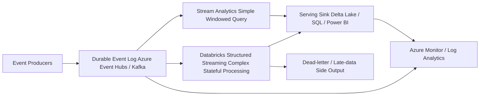
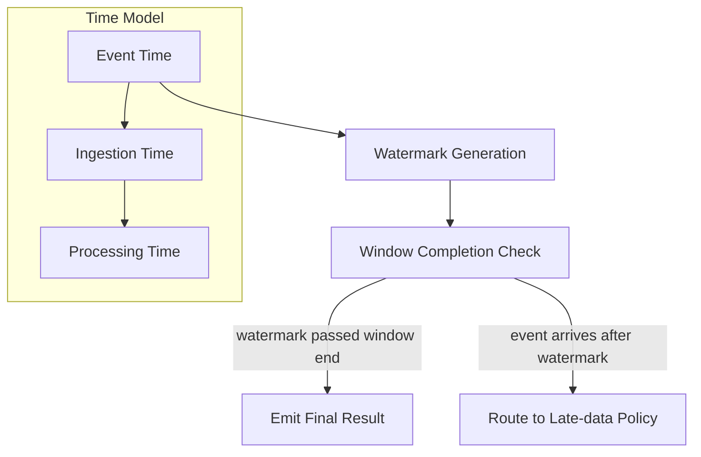
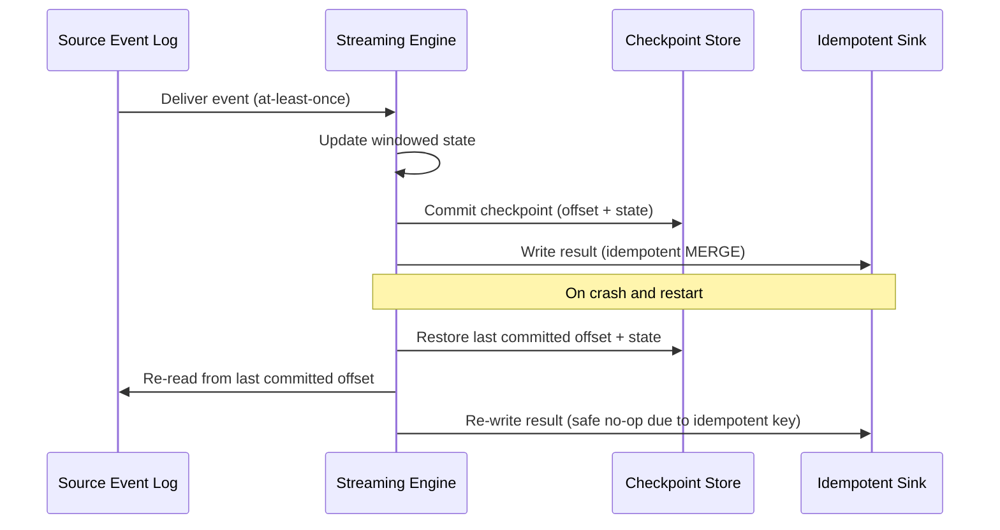

# Streaming Fundamentals

> Part of the **Enterprise Data & AI Architecture Handbook** · Phase-07 - Streaming & Real-Time Analytics · Chapter 01.
> Estimated study time: **60 min reading + ~3h labs**.
> **Prerequisite:** read [Time, Clocks and Ordering](../Phase-02/06_Time_Clocks_and_Ordering.md) first.

---

## Executive Summary

Streaming systems exist because business reality does not arrive in neat, closed batches. Orders, sensor readings, clicks, trades, and fraud signals are produced continuously, out of order, with variable delay, and sometimes duplicated by retries. A streaming platform is an architectural commitment to treat data as an unbounded, continuously arriving sequence of events and to compute correct, incremental results over that sequence as it happens, rather than waiting for an arbitrary batch boundary to declare the data "complete."

The central intellectual challenge of streaming is not throughput. Kafka, Event Hubs, and Flink can all move millions of events per second. The hard problem is correctness under two forms of disorder that batch processing conveniently ignores: events arrive out of the order they occurred, and the pipeline can crash, retry, or scale at any moment without silently corrupting results. Both problems trace back to concepts already established in [Time, Clocks and Ordering](../Phase-02/06_Time_Clocks_and_Ordering.md): there is no global wall clock that all producers agree on, so a streaming engine must separate **event time** (when something actually happened) from **processing time** (when the engine observed it), and it must define **windows** and **watermarks** as an explicit, engineered policy for deciding when a window's answer is "final enough" to emit.

This chapter is deliberately narrow in scope: it is the conceptual foundation that every later Phase-07 chapter depends on. It does not cover Kafka's log architecture, Event Hubs' partition model, Flink's execution runtime, or Structured Streaming's micro-batch engine — those are covered in their own dedicated chapters. What it covers is the vocabulary and reasoning model that makes those later chapters make sense: the stream-versus-batch distinction, event-time versus processing-time semantics, the three canonical windowing strategies (tumbling, sliding, session), watermarks and late-data handling, and the delivery-semantics spectrum (at-most-once, at-least-once, exactly-once / effectively-once).

The practical conclusion for an Azure-first enterprise architecture is this: default to event-time semantics with explicit watermarks for anything that feeds a business metric, choose the narrowest delivery-semantics guarantee that the business case actually requires (because stronger guarantees cost latency and complexity), and treat "batch vs. streaming" as a spectrum of latency and completeness trade-offs rather than a binary technology choice. Azure Stream Analytics, Azure Databricks Structured Streaming, and Azure Event Hubs all implement these same primitives with different ergonomics — this chapter gives you the model to evaluate any of them correctly.

## Learning Objectives

By the end of this chapter you will be able to:

1. Explain the architectural difference between bounded batch processing and unbounded stream processing, and why "streaming" is really a point on a latency/completeness spectrum.
2. Distinguish event time, ingestion time, and processing time, and explain why conflating them silently corrupts business metrics.
3. Design tumbling, sliding, and session windows for concrete business problems and reason about their memory, latency, and correctness trade-offs.
4. Explain watermarks as an explicit engineering policy for trading completeness against latency, and reason about late-arriving and out-of-order data.
5. Distinguish at-most-once, at-least-once, and exactly-once (effectively-once) delivery semantics, and explain the mechanisms (idempotency, transactional writes, dedup keys) that each requires.
6. Reason about why "exactly-once" is a system-wide property, not a single-component feature, and where it typically breaks in real architectures.
7. Map these primitives onto Azure Stream Analytics, Azure Event Hubs, and Azure Databricks Structured Streaming at a conceptual level.
8. Identify common anti-patterns: wall-clock windowing, unbounded watermark lateness, and treating retries as automatically safe.
9. Choose appropriate windowing and semantics for fraud detection, IoT telemetry, clickstream analytics, and financial event processing.
10. Defend a streaming semantics decision (event-time vs. processing-time, watermark lateness bound, delivery guarantee) in a staff-level architecture review.

## Business Motivation

- Fraud, anomaly, and safety-critical detection systems lose most of their value if results arrive hours late; the business need is bounded-latency decisions, not eventual batch correctness.
- Customer-facing personalization, pricing, and recommendation systems increasingly require sub-second to few-second freshness that daily or hourly batch jobs cannot deliver.
- IoT and industrial telemetry pipelines must tolerate network partitions, device clock drift, and reordered delivery without corrupting aggregate metrics such as rolling averages or threshold alarms.
- Financial and trading systems require precise event-time ordering and auditable delivery guarantees, because double-counting or dropping an event has direct monetary or regulatory consequences.
- Executive and operational dashboards increasingly expect "real-time" freshness; the architecture must explicitly decide what "real-time" means in seconds, not treat it as a marketing adjective.
- Streaming reduces the cost of large periodic batch spikes by smoothing compute demand continuously, which materially affects Azure compute and networking cost profiles.
- Getting delivery semantics wrong is an expensive mistake to discover late: duplicate financial postings or silently dropped safety alerts are incidents, not bugs to fix in the next sprint.

## History and Evolution

- Early data processing was almost entirely batch: nightly ETL jobs, mainframe settlement runs, and periodic warehouse loads, where "freshness" meant "as of yesterday."
- Message queues (IBM MQ, JMS, early enterprise service buses) introduced asynchronous event delivery for integration, but mostly without a rigorous model of event time or windowed aggregation.
- The MapReduce/Hadoop era optimized bounded, disk-based batch computation at scale, which entrenched a batch-first mental model across a generation of data engineers.
- Complex Event Processing (CEP) engines in the 2000s (Esper and similar) introduced windowed, rule-based reasoning over event streams, mostly for niche capital-markets and telecom use cases.
- Apache Kafka (2011, LinkedIn) reframed the event log as a durable, replayable, partitioned substrate rather than a transient queue, which made stream processing engines viable at general enterprise scale.
- The Google Dataflow model and the accompanying "Streaming 101 / 102" papers (Akidau et al.) formalized the vocabulary this chapter uses: event time vs. processing time, windowing, triggers, and watermarks as first-class, composable concepts rather than engine-specific tricks.
- Apache Flink adopted true event-time processing with watermarks as a native execution model; Spark Structured Streaming later added event-time watermarking on top of its micro-batch engine.
- Azure's managed offerings (Stream Analytics, then Event Hubs with Kafka-compatible endpoints, then Databricks Structured Streaming and Fabric Real-Time Intelligence) progressively brought these same primitives into a PaaS-first enterprise experience.
- Current practice treats "batch vs. streaming" less as a binary architectural choice and more as a tunable point on a shared execution model — the same logical pipeline can often run as a nightly batch job or a continuous stream with the same aggregation logic and different trigger cadence.

## Why This Technology Exists

Streaming exists because the assumption underlying batch processing — that data arrives in complete, closed, orderable sets — is false for most operational data sources. Sensors, user interactions, financial transactions, and service logs are produced continuously and observed by the platform with variable delay. Waiting for an artificial batch boundary either introduces unacceptable latency (the business needs an answer in seconds, not hours) or forces awkward, error-prone "late batch" reprocessing logic bolted onto a system that was never designed to reason about time.

Streaming also exists because reordering and duplication are physical realities of distributed systems, not implementation bugs. As established in [Time, Clocks and Ordering](../Phase-02/06_Time_Clocks_and_Ordering.md), there is no shared global clock, network delivery is not FIFO across producers, and retries after partial failure are a normal operating condition, not an edge case. A streaming platform's job is to give engineers an explicit, principled vocabulary — event time, watermarks, windows, delivery semantics — to reason about correctness despite this disorder, instead of quietly assuming it away.

Finally, streaming exists because continuous computation is often architecturally and economically superior to giant periodic batch jobs: it smooths compute demand, reduces end-to-end latency, and allows incremental, testable transformation logic instead of monolithic nightly jobs that are hard to debug when they fail at 3 a.m.

## Problems It Solves

| Problem | Streaming's response |
|---|---|
| Business needs sub-minute or sub-second freshness | Continuous, incremental computation instead of periodic batch windows |
| Events arrive out of order across producers and partitions | Event-time semantics decoupled from arrival order |
| Some events are unavoidably late (network delay, offline devices) | Watermarks provide an explicit, tunable lateness policy |
| Failures and retries can duplicate or drop events | Defined delivery semantics (at-least-once, exactly-once) with explicit mechanisms |
| Aggregates need bounded, meaningful time buckets over infinite data | Tumbling, sliding, and session windows |
| Compute demand is spiky under periodic batch models | Continuous processing smooths resource utilization |
| Debugging "what happened when" across distributed producers | Explicit event-time vs. processing-time vs. ingestion-time tracking |

## Problems It Cannot Solve

- Streaming cannot make a business correct about what should count as "the event happened" if the source system itself does not record a trustworthy event timestamp.
- It cannot eliminate the CAP-style trade-off between latency and completeness — a window is either emitted early (possibly incomplete) or late (more complete, less timely); the physics do not go away.
- It does not remove the need for a correct data model; a badly modeled event schema produces badly modeled streaming aggregates just as fast as it produces bad batch ones.
- It cannot guarantee "exactly-once" business outcomes end-to-end unless every hop in the pipeline (source, processing engine, sink) cooperates with idempotency or transactional semantics; a single non-idempotent sink breaks the guarantee regardless of engine marketing claims.
- It is not automatically cheaper than batch; badly designed unbounded state (unbounded windows, no time-to-live) can make a streaming job far more expensive than an equivalent nightly batch job.
- It cannot substitute for proper backpressure and capacity planning; a stream that outpaces its consumers will still queue, lag, or drop data.
- It does not remove the need for reprocessing and backfill strategy when business logic changes; streaming systems still need a replay story.

## Core Concepts

### 8.1 Streams versus batch: a spectrum, not a binary

A batch job operates over a bounded, known dataset: it has a clear start, a clear end, and "complete" has an unambiguous meaning — all the rows that existed when the job started. A stream is unbounded: new events keep arriving indefinitely, and "complete" is never truly known, only approximated. The practical consequence is that streaming systems must define completeness policies (windows and watermarks) that batch systems get for free from dataset boundaries. In practice, most enterprise architectures sit on a spectrum: a "batch" job that runs every five minutes and a "streaming" job with a five-minute trigger interval can produce near-identical results — the distinction is architectural intent and latency target, not a hard technical wall. The Google Dataflow model formalized this by describing streaming and batch as the same computation model with different trigger and windowing configurations.

### 8.2 Event time, ingestion time, and processing time

- **Event time** is when the event actually occurred in the real world (a sensor reading taken at 10:00:03, a payment authorized at 10:00:05), as recorded by the source system.
- **Ingestion time** is when the event first entered the streaming platform (for example, the Kafka broker or Event Hub append timestamp).
- **Processing time** is when the streaming engine's operator actually processes the event, which can be milliseconds or minutes after ingestion depending on backlog, scaling, or restarts.

These three timestamps are frequently different, and conflating them is one of the most common and expensive streaming mistakes. A "last 5 minutes" aggregate computed on processing time answers "what did the engine see in the last 5 minutes of its own wall-clock work," which is a statement about the pipeline, not about the business. A correct business metric — "orders placed in the last 5 minutes" — requires event-time windowing so that a late-arriving event still lands in the window it business-logically belongs to.

### 8.3 Windowing: tumbling, sliding, and session

Windows are the mechanism for turning an unbounded stream into bounded, meaningful units of aggregation.

- **Tumbling windows** are fixed-size, non-overlapping, contiguous intervals (for example, every 1 minute). Each event belongs to exactly one window. Tumbling windows are the simplest model and fit metrics like "orders per minute" or "errors per 5-minute bucket."
- **Sliding windows** are fixed-size but overlap by a step interval smaller than the window size (for example, a 10-minute window that recomputes every 1 minute). Each event can belong to multiple overlapping windows. Sliding windows fit smoothed metrics like moving averages or rolling fraud scores, at the cost of higher compute (each event contributes to several windows).
- **Session windows** are dynamic, activity-based windows that close after a configurable gap of inactivity (for example, a user session closes after 30 minutes with no events). Session windows fit user-behavior and entity-lifecycle analysis where fixed-time buckets do not correspond to a meaningful business unit.

Window size and type are business decisions, not engine defaults: a fraud-detection velocity check might use a 1-minute tumbling window, a smoothed dashboard KPI might use a 15-minute sliding window with a 1-minute step, and a clickstream funnel analysis might use session windows keyed by user ID.

### 8.4 Watermarks and lateness

A watermark is an engine's explicit, moving assertion: "I believe all events with event time earlier than T have now been seen." It is a heuristic, not a guarantee — it is the engineered trade-off between waiting for stragglers and emitting timely results. A tight watermark (small allowed lateness) emits results quickly but may exclude genuinely late events; a loose watermark waits longer, improving completeness at the cost of latency and larger buffered state. Watermarks are typically derived from observed event-time skew in the pipeline (for example, "allow up to 2 minutes of lateness based on historical p99 delay") and are always a deliberate, monitored configuration, not a default to leave untouched. Events arriving after the watermark has passed their window are "late data," and the engine must have an explicit policy for them: drop, route to a side output for reprocessing, or update a previously emitted (and possibly already consumed) result.

### 8.5 Delivery semantics: at-most-once, at-least-once, exactly-once

- **At-most-once**: each event is processed zero or one times; on failure, data may be lost but is never duplicated. Cheapest and simplest, appropriate only where occasional data loss is tolerable (for example, best-effort telemetry sampling).
- **At-least-once**: each event is processed one or more times; on failure, the pipeline retries and may reprocess an event that was already partially handled, producing duplicates unless the consumer is idempotent. This is the most common default for durable messaging systems (Kafka, Event Hubs) because it never silently drops data.
- **Exactly-once (effectively-once)**: the end-to-end effect is as if each event were processed exactly one time, even though the underlying mechanism may still retry internally. This is achieved through idempotent writes (deterministic dedup keys), transactional sinks (atomic commit of processed offset and output together), or exactly-once processing frameworks (Kafka transactions, Flink's two-phase commit, Structured Streaming's idempotent sink plus checkpointed offsets) — never through a single component's marketing claim alone.

The critical architectural point: exactly-once is a **system property**, requiring cooperation across source, engine, and sink. If any hop in the chain is not idempotent or transactional, the end-to-end guarantee degrades to at-least-once regardless of what the processing engine claims.

### 8.6 Backpressure and the coupling of correctness and capacity

Streaming systems must handle the case where producers outpace consumers. Backpressure — propagating "slow down" signals upstream (partition lag, credit-based flow control, or bounded buffers) — is what keeps a lagging consumer from either dropping data or exhausting memory. Backpressure is tightly coupled to watermark and windowing correctness: a consumer that falls far behind its watermark's allowed lateness will start treating in-order data as "late," silently degrading correctness under load rather than just latency.

## Internal Working

### 9.1 How an engine assigns event time

Most engines extract event time from a field in the payload (an explicit `event_time` or `occurred_at` attribute) via a timestamp extractor/assigner configured per source. If the source does not carry a trustworthy event-time field, the engine falls back to ingestion time, and any "event-time" claim downstream becomes misleading. This is why schema governance for event-time fields (mandatory, monotonic-enough, correctly time-zoned as UTC) is a prerequisite for correct streaming, not an optional nicety.

### 9.2 How watermarks propagate through an operator graph

A watermark is generated at the source based on observed event-time progress (often "max event time seen so far minus allowed lateness"). It then flows downstream through each operator in the dataflow graph. A stateful operator (a windowed aggregation, a join) only fires and emits a window's result once the watermark has advanced past the window's end boundary. In multi-source pipelines (a join of two streams), the effective watermark is the minimum across all input streams, because the operator cannot claim completeness for a joined result until every contributing source has confirmed no earlier events remain.

### 9.3 How windowed state is stored and evicted

The engine keeps per-key, per-window aggregation state (running counts, sums, or list buffers) in an in-memory or spillable state store, keyed by window boundaries and partitioning key. When the watermark passes a window's end plus its allowed lateness, the engine emits the final result and evicts the state for that window. Unbounded or misconfigured retention (no watermark, or an excessively generous lateness bound) causes state to grow without bound, which is the most common cause of streaming job memory failures and cost blowouts.

### 9.4 How triggers decide when to emit

A trigger is the policy that decides when a window actually produces output: on watermark completion (the default "final answer" trigger), on every new element (low-latency, frequently-updated early results), or on a fixed processing-time interval (periodic early firing regardless of watermark). Many production pipelines combine early, speculative firings (for dashboards that want partial results quickly) with a final, watermark-triggered firing (for the authoritative, book-of-record result) — this is the "early / on-time / late" trigger pattern popularized by the Dataflow model.

### 9.5 How exactly-once is actually implemented mechanically

Exactly-once is implemented through one (or a combination) of three concrete mechanisms: (1) **idempotent writes**, where the sink deduplicates on a deterministic natural or synthetic key so replays are safe no-ops; (2) **transactional commit**, where the engine atomically commits the processed input offset together with the produced output in a single transaction, so a crash-and-retry either commits both or neither (Kafka's transactional producer/consumer model, Flink's two-phase commit sink); (3) **checkpointed exactly-once state plus at-least-once delivery to an idempotent sink**, which is how Structured Streaming typically achieves end-to-end exactly-once for supported sinks. None of these mechanisms are "free" — they trade latency and throughput for correctness guarantees.

## Architecture

### 10.1 Azure-first reference architecture for a streaming fundamentals layer

The canonical Azure pattern places event producers (applications, IoT devices, CDC connectors) writing into Azure Event Hubs or a Kafka-compatible endpoint, which acts as the durable, replayable, partitioned event log. A streaming engine — Azure Stream Analytics for lightweight SQL-based windowed queries, or Azure Databricks Structured Streaming for complex, stateful, event-time-aware processing — consumes from that log, applies windowing, watermarking, and delivery-semantics policy, and writes results to a serving sink (Delta Lake tables for the lakehouse, Azure SQL for operational serving, or Power BI/real-time dashboards for direct consumption). Azure Monitor and Log Analytics observe consumer lag, watermark delay, and late-data rates across the pipeline.

### 10.2 Why the architecture works

This architecture separates durable, replayable ingestion (the log) from processing logic (the engine), which means event-time and watermark policy can be changed, backfilled, or reprocessed by replaying the log without re-ingesting from source systems. It keeps the correctness-critical concepts — event time extraction, watermark configuration, window definition, delivery semantics — as explicit, reviewable configuration rather than implicit engine defaults, which is what makes the pipeline auditable in a staff-level review.

### 10.3 ADR example: adopt event-time watermarking with a fixed lateness bound as the default for all business-metric streaming pipelines

**Context:** Multiple teams are building streaming pipelines with inconsistent time semantics — some use processing-time windows by default because it is the path of least resistance in their chosen engine, and periodic incidents occur where "last hour" dashboards disagree with the eventual batch reconciliation because late or reordered events were silently excluded or double-counted.

**Decision:** Standardize on event-time semantics with an explicit, per-source watermark lateness bound (derived from measured p99 ingestion delay, reviewed quarterly) for any pipeline that feeds a business metric, alert, or financial calculation. Processing-time windows are permitted only for pipelines explicitly documented as "pipeline health / operational telemetry," never for business-facing metrics.

**Consequences:** Business dashboards and batch reconciliation reports converge because both are computed against event time. Pipelines gain a small amount of latency (bounded by the watermark lateness window) and require an explicit late-data policy (drop, side-output, or corrected re-emit). Teams must instrument and monitor watermark delay as a first-class metric, which adds observability work up front.

**Alternatives considered:**

1. Processing-time windows everywhere: rejected because it silently misattributes late or reordered events to the wrong window, corrupting business metrics under any real-world network or backpressure variance.
2. No watermark, wait indefinitely for completeness: rejected because it makes windows never close, which is operationally equivalent to abandoning streaming for batch while still paying streaming's operational complexity.
3. Per-team ad hoc watermark policy with no governance: rejected because it produced the original inconsistency the ADR exists to fix.

## Components

| Component | Role | Typical Azure-first implementation | Common failure mode |
|---|---|---|---|
| Event producer | Emits events with a trustworthy event-time field | Application SDKs, IoT devices, CDC connectors | missing or unreliable `event_time`, forcing fallback to ingestion time |
| Durable event log | Buffers, orders per partition, and allows replay | Azure Event Hubs, Kafka-compatible endpoint | too few partitions causing hot-key skew, or retention too short for reprocessing |
| Timestamp/watermark assigner | Extracts event time and generates watermarks | Engine-native extractor configuration | watermark lateness bound guessed instead of measured from real skew |
| Windowing operator | Groups events into tumbling, sliding, or session buckets | Stream Analytics windowed query, Structured Streaming `window()` | wrong window type for the business question (for example, tumbling used where session semantics were needed) |
| State store | Holds per-key, per-window aggregation state | Engine-managed state (RocksDB-backed or equivalent), checkpointed | unbounded state growth from missing or overly generous watermark configuration |
| Trigger policy | Decides when a window emits (early, on-time, late) | Engine trigger configuration | only "on watermark" trigger used when the business also needs fast early estimates, or vice versa |
| Sink / serving layer | Persists or serves the windowed result | Delta Lake, Azure SQL, Power BI real-time dataset | non-idempotent sink breaking end-to-end exactly-once claims |
| Monitoring layer | Tracks lag, watermark delay, late-event rate | Azure Monitor, Log Analytics, engine-native metrics | lag and late-data rate not tracked, so degradation is invisible until a business complaint |

## Metadata

| Metadata class | What to record | Why it matters |
|---|---|---|
| Event schema metadata | field names, types, mandatory `event_time` field, UTC convention | prevents ambiguous or missing event-time extraction |
| Watermark configuration metadata | source, allowed lateness bound, last-reviewed date, measured p99 skew | keeps lateness policy evidence-based rather than guessed |
| Window definition metadata | window type, size, step (for sliding), gap (for session), key | ties aggregation logic to the business question it answers |
| Delivery-semantics metadata | at-most-once / at-least-once / exactly-once classification per pipeline | clarifies what guarantee downstream consumers may rely on |
| Late-data policy metadata | drop / side-output / corrective re-emit decision per pipeline | prevents silent, undocumented data loss |
| Lineage metadata | source topic/partition, consumer group, checkpoint location | supports replay, backfill, and incident forensics |
| Operational metadata | consumer lag, watermark delay, late-event count | first-class health signals for the pipeline |

If a team cannot state the watermark lateness bound and the late-data policy for a pipeline from memory, that pipeline is not actually governed — it is just running.

## Storage

| Storage concern | Recommended posture | Notes |
|---|---|---|
| Durable event log retention | size retention to cover the largest anticipated reprocessing/backfill window, not just steady-state consumption | replay is the backbone of streaming reprocessing strategy |
| Checkpoint storage | durable, geo-appropriate storage for engine checkpoints (state snapshots and offsets) | checkpoint loss forces a full reprocessing from the earliest retained offset |
| Windowed state storage | size for worst-case key cardinality times window count, not average-case | unbounded key cardinality (for example, unbounded session keys) is the leading cause of state-store failure |
| Sink storage | favor storage formats that support idempotent/upsert writes (Delta Lake merge, keyed upserts) | idempotency at the sink is often the cheapest way to achieve effectively-once delivery |
| Late-data side-output storage | keep a documented location and reprocessing path for dropped-late events | invisible silently-dropped data is an audit and trust risk |

## Compute

| Workload class | Best Azure-first surface | Why it fits | Wrong default |
|---|---|---|---|
| Simple SQL-like windowed aggregation over one or two streams | Azure Stream Analytics | fast to build, native windowing/watermark support, low operational overhead | using it for complex stateful joins across many streams it was not designed for |
| Complex, stateful, multi-stream event-time processing | Azure Databricks Structured Streaming | full DataFrame/Dataset semantics, rich state management, Delta Lake-native sinks | reaching for a heavier general-purpose engine for a trivial single-stream tumbling count |
| Very low-latency, custom operator graphs | Apache Flink on AKS or HDInsight | true streaming (not micro-batch) execution, fine-grained watermark and trigger control | adopting it purely for its reputation when a simpler managed service would meet the SLA |
| Lightweight event routing with minimal transformation | Azure Functions / Event Grid triggers off Event Hubs | serverless, low operational burden for simple fan-out | using it for stateful windowed aggregation it is not designed to hold |

## Networking

- Co-locate the event log, processing engine, and sink in the same Azure region to minimize event-time-to-processing-time skew introduced by cross-region network latency.
- Use private endpoints and VNet integration for Event Hubs and Databricks to keep event traffic off the public internet.
- Monitor network-induced ingestion delay explicitly, because it directly determines how tight a watermark lateness bound can safely be.
- Design partition count and partition key distribution to avoid hot partitions, since a single overloaded partition delays the effective watermark for the entire join or aggregation that depends on it.
- Separate control-plane traffic (checkpoint commits, consumer group coordination) from data-plane throughput planning; saturating one can stall the other.

## Security

| Concern | Recommended control |
|---|---|
| Producer authentication | Managed identities or SAS/Entra-backed auth to the event log, never shared long-lived keys embedded in producers |
| In-transit encryption | TLS for all producer-to-log and log-to-engine traffic |
| At-rest encryption | Platform-managed or customer-managed keys for the event log and checkpoint storage |
| Field-level sensitivity | Classify and mask/tokenize sensitive fields (PII, payment data) before they enter shared topics consumed by many teams |
| Access control | Per-topic/consumer-group least-privilege access, separate from broad "read everything" service principals |
| Replay risk | Treat log replay capability as a security-relevant feature; audit who can trigger reprocessing from arbitrary offsets |
| Late-data side channel | Ensure side-output paths for late/dropped data follow the same classification and access controls as the primary path |

## Performance

- Choose the narrowest window and shortest watermark lateness bound the business question actually tolerates; every extra second of allowed lateness is buffered state and latency cost.
- Prefer tumbling windows over sliding windows when overlapping recomputation is not truly required, since sliding windows multiply per-event work by the overlap factor.
- Watch for skewed keys in windowed aggregations (a few hot customers or devices) causing uneven state-store and compute load across partitions.
- Track watermark delay (the gap between wall-clock time and the current watermark) as a leading indicator of both backpressure and impending late-data spikes.
- Avoid unbounded session windows with no maximum session duration cap; a single misbehaving client that never goes idle can hold state open indefinitely.

| Pattern | Recommendation | Why |
|---|---|---|
| Fraud velocity check | 1-minute tumbling window, tight watermark (seconds) | needs fast, bounded-latency decisions |
| Smoothed dashboard KPI | 15-minute sliding window, 1-minute step, moderate watermark | favors visual smoothness over strict per-event latency |
| User session funnel | Session window with an explicit max-duration cap | matches variable, activity-driven business unit |
| Financial settlement reconciliation | Tumbling window plus a longer watermark and a documented late-data re-emit policy | favors completeness and auditability over lowest latency |

## Scalability

- Scale partition count in the event log proportional to target throughput and the number of parallel consumer tasks needed, not to an arbitrary round number.
- Scale windowed-aggregation compute by partitioning state on the same key used for partitioning the event log, avoiding shuffle-heavy repartitioning inside the engine.
- For very high-cardinality keyed windows (millions of active session keys), plan state-store sizing and eviction policy explicitly rather than assuming default configuration will cope.
- Decouple ingestion scaling (event log throughput) from processing scaling (engine compute) so each can be resized independently as load patterns change.
- Revisit watermark and window sizing whenever throughput or key cardinality materially changes; correctness policy that was fine at low volume can silently degrade under scale-driven skew.

## Fault Tolerance

- Checkpointing (offsets plus operator state) is what allows a streaming job to resume correctly after a crash without reprocessing from the very beginning or silently skipping data.
- Idempotent or transactional sinks are what prevent a checkpoint-triggered replay from producing duplicate business effects.
- Dead-letter or side-output paths must exist for events that fail schema validation, arrive after the watermark, or otherwise cannot be processed normally — silently dropping them is not fault tolerance, it is data loss with good marketing.
- Test failure recovery deliberately: kill a processing task mid-window and verify the recovered result matches what would have been produced without the failure.
- Multi-region DR for streaming pipelines requires an explicit decision about whether the durable event log itself is geo-replicated, and whether processing failover restarts from the last committed checkpoint or from a defined safe offset.

## Cost Optimization

- Right-size watermark lateness and window retention; excessive lateness bounds inflate state-store memory and checkpoint size for no business benefit.
- Prefer tumbling windows over sliding windows where possible, since sliding windows multiply compute and state cost by the overlap factor.
- Match engine choice to workload complexity: a simple windowed count does not need a general-purpose Spark cluster running continuously when a lighter-weight managed query service would do.
- Monitor and alert on consumer lag as a cost signal too, not only a correctness signal — sustained lag often means over-provisioned but misconfigured (skewed) compute rather than under-provisioned compute.
- Reserve capacity or committed-use discounts for steady-state streaming compute that runs continuously, since it is a poor fit for pure pay-as-you-go pricing at scale.

Worked FinOps example: consider a clickstream sessionization pipeline running on Azure Databricks Structured Streaming with a moderately provisioned cluster costing roughly $1,800 per month in illustrative pricing, driven by an unbounded session window with no maximum duration cap that lets a small fraction of bot traffic hold session state open for days. Capping session duration and adding a bot-filtering stage upstream reduces peak state-store size enough to downsize the cluster to a smaller SKU, cutting the monthly compute cost by roughly a third while also removing a recurring out-of-memory incident. The lesson generalizes: streaming cost problems are very often windowing and state-retention problems wearing a compute-sizing disguise, so the first FinOps lever to pull is correctness configuration, not simply a smaller or larger cluster.

## Monitoring

| Metric | Why it matters | Typical threshold |
|---|---|---|
| Consumer lag (event log offset lag) | shows whether processing is keeping pace with ingestion | alert on sustained growth, not momentary spikes |
| Watermark delay | gap between wall-clock time and current watermark; leading indicator of both backpressure and late-data risk | alert when it exceeds the configured lateness bound |
| Late-event rate | fraction of events arriving after their window's watermark has passed | review baseline and alert on sudden increases |
| Window emission latency | time between window end and result emission | tie directly to the business freshness SLA |
| State-store size / checkpoint size growth | signals unbounded state or key-cardinality explosion | alert on sustained upward trend |
| Duplicate/dedup rate at sink | signals at-least-once delivery working as expected, or a broken idempotency key if it deviates from baseline | review after any sink or key-schema change |

## Observability

Observability for a streaming pipeline should answer: how far behind is processing, how much lateness is currently being tolerated, how many events are being dropped or side-outputted as late, and what changed recently in windowing or watermark configuration.

- correlate event-time, ingestion-time, and processing-time timestamps per event to diagnose where delay is introduced,
- capture watermark progression over time as a first-class time-series metric, not just an internal engine detail,
- preserve window boundaries and trigger type (early/on-time/late) alongside emitted results so a business consumer can tell whether a number was a speculative early estimate or the final answer,
- trace late-data routing so dropped or side-outputted events are auditable rather than silently vanishing.

### Operational response playbooks

| Signal | Detection query or rule | Likely cause | First remediation |
|---|---|---|---|
| Consumer lag grows steadily during peak hours | Event log lag metric trending upward without recovering off-peak | under-provisioned processing compute or a hot-partition skew | scale processing parallelism, or rebalance partition key distribution |
| Late-event rate spikes after a network or upstream change | Late-event counter rises against stable baseline | upstream producer delay increased beyond current watermark lateness bound | temporarily widen watermark lateness, investigate upstream delay root cause, then re-tighten |
| State-store size grows without bound | Checkpoint/state size metric trending upward with no plateau | missing or overly generous watermark, or unbounded session/key cardinality | audit window and watermark configuration; add a maximum session duration cap or key cardinality guard |

## Governance

- Require every business-facing streaming pipeline to document its event-time source field, watermark lateness bound, window type, and delivery-semantics classification in pipeline metadata, not only in code comments.
- Treat changes to watermark lateness, window size, or delivery-semantics guarantees as reviewed architectural changes, not routine tuning, because they change what "correct" means for downstream consumers.
- Require an explicit, reviewed late-data policy (drop, side-output, or corrective re-emit) before a pipeline goes into production.
- Track which pipelines claim exactly-once and verify the claim holds end-to-end (source, engine, and sink), not just at the engine layer.
- Align streaming governance with existing data governance processes so windowed, event-time-based metrics are reconciled against batch/warehouse figures on a scheduled basis.

## Trade-offs

| Choice | Advantages | Disadvantages | When to prefer it |
|---|---|---|---|
| Event-time windowing | Correct regardless of arrival order or delay; reconciles with batch | Requires trustworthy event-time field; adds watermark complexity | Any business-facing metric or financial calculation |
| Processing-time windowing | Simple, no watermark configuration needed | Misattributes late/reordered events; diverges from batch reconciliation | Pipeline-health/operational telemetry only |
| Tumbling windows | Simple, single window membership, cheapest compute | Coarser granularity, boundary effects at window edges | Fixed-period counts and totals |
| Sliding windows | Smooth, frequently updated aggregates | Multiplies compute/state cost by overlap factor | Rolling averages, smoothed dashboards |
| Session windows | Matches variable, activity-driven business units | Unbounded duration risk without a max-duration cap | User behavior, entity-lifecycle analysis |
| At-least-once delivery | Never silently loses data; simplest durable default | Requires idempotent consumers to avoid duplicate effects | Most durable messaging use cases |
| Exactly-once (effectively-once) delivery | Simplifies downstream consumer logic | Higher latency/complexity; requires cooperation across the whole pipeline | Financial postings, billing, anything duplicate-sensitive |

## Decision Matrix

| Requirement | Event-time + watermark | Processing-time only | Tumbling | Sliding | Session |
|---|---|---|---|---|---|
| Correctness under out-of-order arrival | strong | weak | n/a | n/a | n/a |
| Reconciles with batch/warehouse figures | strong | weak | n/a | n/a | n/a |
| Lowest implementation complexity | weak | strong | strong | medium | weak |
| Smooth, frequently updated metrics | n/a | n/a | weak | strong | medium |
| Variable, activity-driven business unit | n/a | n/a | weak | weak | strong |
| Lowest compute/state cost | medium | strong | strong | weak | medium |

Use this matrix as a starting filter; the final choice still depends on the specific business freshness and correctness requirement, which no generic table can fully capture.

## Design Patterns

1. **Event-time-first ingestion pattern:** mandate a trustworthy `event_time` field in every event schema at the producer boundary, never inferred downstream.
2. **Early/on-time/late trigger pattern:** emit fast speculative results for dashboards while reserving a final, watermark-triggered emission as the book-of-record answer.
3. **Idempotent sink pattern:** design sinks around deterministic natural or synthetic dedup keys so at-least-once delivery is safe by construction.
4. **Side-output-for-late-data pattern:** route events that arrive after their window's watermark to a documented, auditable side path instead of silently dropping them.
5. **Bounded session pattern:** cap maximum session window duration explicitly to prevent unbounded state growth from anomalous or bot traffic.
6. **Watermark-as-evidence pattern:** derive watermark lateness bounds from measured upstream delay distributions, reviewed on a schedule, rather than picking a round number once and forgetting it.
7. **Replay-for-correction pattern:** treat the durable event log's replay capability as the primary mechanism for correcting a windowing or watermark bug, rather than patching results in place.

## Anti-patterns

- Windowing on processing time by default because it is the path of least resistance in the chosen engine, for a pipeline that feeds a business metric.
- Setting watermark lateness once from a guess and never revisiting it as upstream delay characteristics change.
- Claiming "exactly-once" because the processing engine's documentation uses the phrase, without verifying the sink is actually idempotent or transactional.
- Silently dropping late data with no side-output, monitoring, or audit trail.
- Using sliding windows everywhere by default when tumbling windows would answer the same business question at a fraction of the compute cost.
- Allowing unbounded session windows with no maximum duration cap.
- Treating retries as automatically safe without verifying the downstream effect is idempotent.

## Common Mistakes

- Extracting event time from the wrong field (ingestion timestamp mislabeled as event time) and only discovering it when batch reconciliation disagrees with the streaming dashboard.
- Forgetting that the effective watermark of a multi-stream join is the minimum watermark across all inputs, and being surprised that one slow source stalls the whole join's output.
- Sizing state-store capacity for average key cardinality instead of worst-case cardinality.
- Confusing "at-least-once delivery" with "exactly-once outcome" and assuming the consumer does not need to be idempotent.
- Choosing session-window gap duration arbitrarily without analyzing real user or device idle-time distributions.
- Failing to monitor watermark delay, so degraded freshness is invisible until a business user complains about stale numbers.

## Best Practices

- default to event-time semantics with an explicit, evidence-based watermark lateness bound for anything business-facing,
- choose the narrowest delivery-semantics guarantee (at-most-once, at-least-once, exactly-once) that the use case genuinely requires, since stronger guarantees cost latency and complexity,
- design sinks to be idempotent wherever possible, because it is usually the cheapest path to an effectively-once outcome,
- document window type, size, watermark bound, and late-data policy as pipeline metadata, not tribal knowledge,
- monitor consumer lag, watermark delay, and late-event rate as first-class production health signals,
- test failure recovery deliberately rather than assuming checkpointing "just works,"
- reconcile streaming metrics against batch/warehouse figures on a schedule to catch silent semantic drift.

## Enterprise Recommendations

1. Mandate a trustworthy, UTC, mandatory `event_time` field in every event schema that feeds a streaming pipeline.
2. Require documented watermark lateness bounds and late-data policy for all business-facing streaming pipelines before production sign-off.
3. Classify every streaming pipeline's delivery-semantics guarantee explicitly and verify it end-to-end, not just at the processing-engine layer.
4. Default to tumbling windows unless a specific business need justifies sliding or session windows.
5. Require watermark delay and late-event rate as standard dashboard metrics for every production streaming pipeline.
6. Schedule reconciliation between streaming-computed metrics and batch/warehouse-computed equivalents to catch semantic drift early.
7. Treat changes to windowing, watermark, or delivery-semantics configuration as reviewed architectural changes, not routine tuning.
8. Cap unbounded constructs (session duration, key cardinality growth) explicitly rather than trusting default engine behavior.

## Azure Implementation

### 31.1 Recommended Azure service map

| Layer | Preferred Azure service | Notes |
|---|---|---|
| Durable, replayable event log | Azure Event Hubs (optionally Kafka-compatible endpoint) | partition count and retention drive both throughput and reprocessing capability |
| Lightweight SQL-based windowed processing | Azure Stream Analytics | native tumbling/sliding/session window syntax and watermark policy configuration |
| Complex stateful event-time processing | Azure Databricks Structured Streaming | full event-time watermarking, arbitrary stateful operators, Delta Lake-native sinks |
| Serverless lightweight routing | Azure Functions / Event Grid triggers | simple fan-out and enrichment without heavy stateful windowing |
| Monitoring | Azure Monitor, Log Analytics | correlate consumer lag, watermark delay, and late-event rate across services |

### 31.2 Example Azure Stream Analytics windowed query (tumbling window with event-time)

```sql
SELECT
    DeviceId,
    System.Timestamp() AS WindowEndUtc,
    AVG(Temperature) AS AvgTemperature,
    COUNT(*) AS ReadingCount
INTO
    [output-alerts]
FROM
    [input-iot-events] TIMESTAMP BY EventTimeUtc
GROUP BY
    DeviceId,
    TumblingWindow(minute, 1)
```

`TIMESTAMP BY EventTimeUtc` explicitly declares event-time semantics rather than falling back to arrival time; Stream Analytics derives its watermark from the declared timestamp policy and configured out-of-order tolerance.

### 31.3 Example Azure Stream Analytics watermark / late-arrival policy configuration

```sql
-- Configure via the job's Event Ordering settings, equivalently expressed here as intent:
-- Out-of-order tolerance window: 00:02:00 (accept events up to 2 minutes late)
-- Action taken on events beyond tolerance: Adjust (assign to the last valid window) or Drop
SELECT
    DeviceId,
    System.Timestamp() AS WindowEndUtc,
    COUNT(*) AS EventCount
INTO
    [output-device-counts]
FROM
    [input-iot-events] TIMESTAMP BY EventTimeUtc
GROUP BY
    DeviceId,
    SlidingWindow(minute, 10)
```

### 31.4 Example Azure Databricks Structured Streaming event-time watermarking and session window (PySpark)

```python
from pyspark.sql import functions as F

events = (
    spark.readStream
    .format("eventhubs")
    .options(**eh_conf)
    .load()
    .select(F.col("body").cast("string").alias("json"))
    .select(F.from_json("json", event_schema).alias("e"))
    .select("e.*")
)

# Tumbling window with explicit event-time watermark
tumbling = (
    events
    .withWatermark("event_time_utc", "2 minutes")
    .groupBy(
        F.window("event_time_utc", "1 minute"),
        F.col("device_id"),
    )
    .agg(F.avg("temperature").alias("avg_temperature"),
         F.count("*").alias("reading_count"))
)

# Session window keyed by user, capped implicitly by the watermark-driven gap timeout
sessions = (
    events
    .withWatermark("event_time_utc", "5 minutes")
    .groupBy(
        F.session_window("event_time_utc", "30 minutes"),
        F.col("user_id"),
    )
    .agg(F.count("*").alias("event_count"))
)

(tumbling.writeStream
    .format("delta")
    .outputMode("append")
    .option("checkpointLocation", "/mnt/checkpoints/device_temp_tumbling")
    .table("curated.device_temperature_by_minute"))
```

### 31.5 Example idempotent Delta Lake sink for effectively-once delivery

```python
def upsert_to_delta(batch_df, batch_id):
    (batch_df.createOrReplaceTempView("updates"))
    batch_df.sparkSession.sql("""
        MERGE INTO curated.order_events_dedup AS target
        USING updates AS source
        ON target.order_id = source.order_id
           AND target.event_time_utc = source.event_time_utc
        WHEN NOT MATCHED THEN INSERT *
    """)

(events.writeStream
    .foreachBatch(upsert_to_delta)
    .option("checkpointLocation", "/mnt/checkpoints/order_events_dedup")
    .outputMode("update")
    .start())
```

The `MERGE` on a deterministic `(order_id, event_time_utc)` key makes replays from a checkpoint recovery safe no-ops, converting Structured Streaming's at-least-once delivery into an effectively-once business outcome.

### 31.6 Practical Azure guidance

- Use Azure Stream Analytics for straightforward windowed aggregations with native event-time and watermark support and minimal operational overhead.
- Use Azure Databricks Structured Streaming when the pipeline needs complex stateful logic, arbitrary joins across streams, or Delta Lake-native idempotent sinks.
- Always declare `TIMESTAMP BY` (Stream Analytics) or `withWatermark` (Structured Streaming) explicitly; never rely on default arrival/processing-time behavior for business-facing metrics.
- Size Event Hubs retention to cover the realistic reprocessing window the team might need after a bug fix, not just steady-state consumption.

## Open Source Implementation

Streaming fundamentals are engine-agnostic; the concepts in this chapter map directly onto the open-source ecosystem, with Kafka, Flink, and Spark Structured Streaming covered in their own dedicated later chapters.

| Layer | Open-source choice | Notes |
|---|---|---|
| Durable event log | Apache Kafka | partitioned, replayable log; the substrate most open-source streaming engines assume |
| True streaming execution engine | Apache Flink | native event-time processing with watermarks as a first-class execution primitive, not a bolt-on |
| Micro-batch streaming engine | Apache Spark Structured Streaming | DataFrame-native event-time watermarking on top of a micro-batch execution model |
| Observability | Prometheus, Grafana, OpenTelemetry | track consumer lag, watermark delay, and late-event rate as exported metrics |
| Schema governance | Confluent Schema Registry or equivalent | enforces a mandatory, typed `event_time` field at the producer boundary |

Example Flink DataStream API watermark and tumbling window (Java-style pseudocode for illustration):

```java
WatermarkStrategy<Event> strategy = WatermarkStrategy
    .<Event>forBoundedOutOfOrderness(Duration.ofMinutes(2))
    .withTimestampAssigner((event, ts) -> event.getEventTimeUtcMillis());

DataStream<Event> events = source.assignTimestampsAndWatermarks(strategy);

events
    .keyBy(Event::getDeviceId)
    .window(TumblingEventTimeWindows.of(Time.minutes(1)))
    .aggregate(new AverageTemperatureAggregator())
    .addSink(new IdempotentDeltaSink());
```

This mirrors the Azure Databricks example structurally: an explicit watermark strategy, an explicit window definition, and an explicit idempotent sink — the same three decisions this chapter has emphasized throughout, expressed in a different engine's API.

## AWS Equivalent (comparison only)

| Azure pattern | AWS equivalent | Advantages | Disadvantages | Migration note |
|---|---|---|---|---|
| Azure Event Hubs | Amazon Kinesis Data Streams or MSK (managed Kafka) | mature managed streaming ingestion | different partition/shard scaling model and API surface | re-validate partition-to-shard mapping and consumer group semantics |
| Azure Stream Analytics | Amazon Kinesis Data Analytics (Flink-based or SQL-based) | comparable managed windowed SQL/Flink processing | different watermark/out-of-order configuration semantics | re-test late-data and watermark behavior; do not assume identical defaults |
| Azure Databricks Structured Streaming | Databricks on AWS Structured Streaming (same engine) | near-identical engine semantics | infrastructure and networking configuration differ | mostly a lift-and-shift for pipeline logic; revalidate connectivity and IAM |

## GCP Equivalent (comparison only)

| Azure pattern | GCP equivalent | Advantages | Disadvantages | Migration note |
|---|---|---|---|---|
| Azure Event Hubs | Google Cloud Pub/Sub or Kafka on GKE | strong managed pub/sub ingestion | different ordering/partitioning model (Pub/Sub is not natively partition-ordered like Kafka/Event Hubs) | re-validate ordering guarantees before migrating event-time-sensitive pipelines |
| Azure Stream Analytics | Google Cloud Dataflow (the original home of the windowing/watermark model this chapter uses) | first-class, unified batch/streaming model with explicit triggers | steeper conceptual learning curve for teams used to SQL-only tooling | strong conceptual fit since Dataflow's model is the basis for this chapter's vocabulary |
| Azure Databricks Structured Streaming | Dataflow or Databricks on GCP | comparable stateful processing capability | different state-store and checkpoint mechanics | revalidate checkpoint compatibility if changing engines, not just clouds |

## Migration Considerations

- When migrating a pipeline between engines, first migrate the concepts (event-time field, watermark lateness bound, window type, delivery-semantics guarantee) as documented decisions, then map them onto the new engine's specific configuration syntax.
- Never assume default out-of-order tolerance or watermark behavior is equivalent across engines; validate it empirically with representative traffic before cutover.
- Preserve the durable event log's replay capability across the migration window so both old and new pipelines can be run in parallel and reconciled before final cutover.
- Re-verify idempotency and delivery-semantics guarantees end-to-end after any sink change, since a sink swap is one of the most common places an "exactly-once" claim silently breaks.
- Budget for a reconciliation period where both old and new pipelines run side by side and their outputs are diffed against the same event-time windows.

## Mermaid Architecture Diagrams







## End-to-End Data Flow

1. A producer emits an event carrying an explicit, UTC `event_time` field alongside its business payload.
2. The event is appended to a durable, partitioned event log (Azure Event Hubs or a Kafka-compatible endpoint), receiving an ingestion timestamp.
3. The streaming engine's timestamp assigner extracts event time from the payload and generates a watermark based on observed skew and the configured lateness bound.
4. Incoming events are grouped into tumbling, sliding, or session windows keyed by the relevant business entity.
5. The windowing operator holds per-key, per-window state until the watermark passes the window's end plus its allowed lateness.
6. Early or periodic trigger firings may emit speculative results for low-latency dashboards, while the final, watermark-triggered firing produces the authoritative result.
7. Events arriving after the watermark has passed are routed according to the documented late-data policy: drop, side-output, or corrective re-emit.
8. The engine writes the emitted result to an idempotent sink, committing the processed offset and output atomically or near-atomically to support safe recovery from failure.
9. Azure Monitor and Log Analytics capture consumer lag, watermark delay, and late-event rate for ongoing observability and reconciliation against batch figures.

## Real-world Business Use Cases

| Use case | Why streaming fundamentals fit | Typical windowing/semantics choice |
|---|---|---|
| Card-fraud velocity checks | Needs sub-second to few-second decisions on transaction bursts | tight tumbling window, tight watermark, effectively-once sink |
| IoT predictive maintenance | Sensor readings arrive with variable network delay and require rolling aggregates | sliding window for smoothed rolling averages, moderate watermark |
| Clickstream funnel analysis | User activity is naturally session-shaped, not fixed-interval | session window with capped max duration |
| Real-time inventory/pricing updates | Needs freshness measured in seconds, tolerant of brief staleness | tumbling window, at-least-once with idempotent upsert sink |
| Financial trade/settlement event processing | Needs precise event-time ordering and auditable, non-duplicated postings | tumbling window, longer watermark, verified end-to-end exactly-once |

## Industry Examples

| Industry | Common streaming workload | Frequent tuning focus | Common pitfall |
|---|---|---|---|
| Retail / e-commerce | real-time inventory, personalization signals | watermark tuning for mobile network delay variance | processing-time windows misattributing late clicks |
| Banking / payments | fraud velocity, transaction monitoring | tight tumbling windows, verified exactly-once postings | assuming at-least-once delivery is automatically duplicate-safe |
| Manufacturing / IoT | predictive maintenance, anomaly alarms | sliding window smoothing, device clock drift handling | unbounded state from unregistered/rogue devices |
| Media / gaming | live engagement metrics, session analytics | session-window gap tuning based on real idle-time data | unbounded session duration from bot or idle-client traffic |
| Logistics | shipment tracking, ETA recalculation | event-time reconciliation across multi-hop carrier events | conflating carrier-reported time with actual event time |

## Case Studies

### Case study 1: dashboard versus batch reconciliation mismatch

A retail analytics team built a "orders per minute" streaming dashboard using processing-time windows because it was the default in their chosen engine. During a network hiccup that delayed a subset of mobile-app events by several minutes, the dashboard showed a temporary dip and later spike that did not match the nightly batch reconciliation, which correctly attributed each order to its actual event time. The mismatch triggered a business escalation because leadership trusted the "real-time" number over the batch number, when in fact the batch number was correct and the streaming number was an artifact of processing-time windowing.

The fix was switching to event-time windowing with a measured watermark lateness bound and adding a scheduled reconciliation job comparing streaming and batch figures. The lesson was that "real-time" is not automatically "correct," and processing-time windows are a silent trap for any pipeline feeding a business-facing number.

### Case study 2: unbounded session state from bot traffic

A media company's engagement-analytics pipeline used session windows with no maximum duration cap, assuming real users would naturally go idle. A wave of bot traffic that periodically pinged endpoints kept thousands of "sessions" open for days, causing state-store size to grow until the streaming job began failing with out-of-memory errors during peak traffic.

The recovery added a maximum session duration cap and an upstream bot-filtering stage. The lesson was that unbounded constructs in streaming state are a correctness assumption as much as a cost concern, and any window type without an explicit upper bound needs one.

### Case study 3: exactly-once claim broken at the sink

A financial-services team migrated a settlement pipeline to a processing engine advertising "exactly-once" semantics and assumed the guarantee was automatic. During a routine checkpoint-recovery test, duplicate settlement records appeared downstream because the sink (a legacy REST API) was not idempotent and reprocessed events after the recovery were accepted as new records.

The fix added a deterministic dedup key and made the sink perform an upsert rather than a blind insert. The lesson reinforced the chapter's core architectural point: exactly-once is a system property spanning source, engine, and sink, and a single non-idempotent hop breaks the guarantee regardless of what the processing engine's documentation promises.

## Hands-on Labs

1. **Event-time versus processing-time lab:** replay a recorded event stream with artificially injected out-of-order delay, compute the same aggregate using processing-time and event-time windows, and compare the diverging results against the known-correct answer.
2. **Windowing comparison lab:** implement the same metric using tumbling, sliding, and session windows over identical input data, and measure the resulting compute cost and result differences.
3. **Watermark tuning lab:** configure progressively tighter and looser watermark lateness bounds against a stream with measured real-world delay skew, and observe the trade-off between completeness and latency.
4. **Delivery-semantics lab:** deliberately crash and restart a streaming job mid-window against a non-idempotent sink, observe the resulting duplicates, then fix the sink to be idempotent and repeat the test to confirm effectively-once behavior.

Acceptance criteria:

- the event-time versus processing-time comparison clearly demonstrates a diverging, incorrect result under processing time,
- at least one windowing choice is justified against a specific business question rather than chosen arbitrarily,
- the watermark tuning lab produces a documented latency-versus-completeness trade-off curve,
- the delivery-semantics lab demonstrates both the duplicate-producing failure and the idempotent fix, with evidence captured for both runs.

## Exercises

1. Explain the difference between event time, ingestion time, and processing time with a concrete example where they diverge.
2. Choose an appropriate window type (tumbling, sliding, or session) for three different business scenarios and justify each choice.
3. Explain why a watermark is a heuristic rather than a guarantee.
4. Describe what happens to an event that arrives after its window's watermark has passed, and list the possible policies for handling it.
5. Compare at-most-once, at-least-once, and exactly-once delivery semantics with an example failure mode for each.
6. Explain why exactly-once delivery requires cooperation across the entire pipeline rather than being a single-component feature.
7. Explain how the effective watermark of a multi-stream join relates to the watermarks of its individual input streams.
8. Design a late-data policy for a fraud-detection pipeline and justify the trade-offs.
9. Explain how [Time, Clocks and Ordering](../Phase-02/06_Time_Clocks_and_Ordering.md) concepts (logical clocks, causality) relate to event-time watermarking.
10. Identify at least two anti-patterns from this chapter present in a hypothetical existing pipeline design and propose fixes.

## Mini Projects

1. **Windowed IoT telemetry project:** build a small pipeline that ingests simulated sensor events, applies event-time tumbling windows with a tuned watermark, and emits rolling averages to an idempotent sink.
2. **Session-based clickstream project:** implement session-windowed funnel analysis with a capped maximum session duration and compare results against a naive fixed-interval tumbling-window approach.
3. **Delivery-semantics verification project:** instrument a pipeline to deliberately test and document its actual end-to-end delivery guarantee (not just the engine's advertised guarantee) under simulated failure and recovery.

## Capstone Integration

This chapter is the conceptual foundation for every later Phase-07 chapter and reconnects to earlier phases as follows.

- Use [Time, Clocks and Ordering](../Phase-02/06_Time_Clocks_and_Ordering.md) for the underlying distributed-systems reasoning about causality and clock skew that justifies event-time semantics.
- Apply these primitives concretely when studying Apache Kafka, Azure Event Hubs and Stream Analytics, Apache Flink, and Spark Structured Streaming later in Phase-07, where the same windowing, watermark, and delivery-semantics vocabulary reappears as engine-specific configuration.
- Carry the idempotent-sink and event-time discipline established here into Change Data Capture and Streaming Patterns and Delivery Semantics chapters, where these same guarantees are examined from the data-integration and pattern-catalog perspective.
- Keep the "narrowest guarantee that the business case requires" principle as the default filter for every subsequent streaming architecture decision in this handbook.

## Interview Questions

1. What is the difference between event time and processing time?
2. Why can a watermark never be a hard guarantee of completeness?
3. What is the difference between a tumbling window and a sliding window?
4. When would you use a session window instead of a fixed-time window?
5. What is the difference between at-least-once and exactly-once delivery?
6. Why is "exactly-once" considered a system-wide property rather than a single-component feature?
7. What happens to an event that arrives after its window's watermark has passed?
8. Why does a join across two streams use the minimum watermark of its inputs?

## Staff Engineer Questions

1. How would you decide the watermark lateness bound for a new streaming pipeline rather than picking an arbitrary round number?
2. How would you design a late-data policy that satisfies both latency-sensitive and completeness-sensitive stakeholders for the same underlying data?
3. What telemetry would you require before approving a pipeline's claim of exactly-once delivery?
4. How would you reconcile a streaming-computed metric against its batch/warehouse equivalent on an ongoing basis?
5. How would you cap unbounded state risk in a session-windowed pipeline without breaking legitimate long-running sessions?
6. When would you choose a lightweight managed SQL-based streaming service over a full general-purpose streaming engine, and vice versa?

## Architect Questions

1. Where should the boundary sit between "operational telemetry" pipelines (processing-time acceptable) and "business metric" pipelines (event-time mandatory) in the enterprise architecture?
2. How do you govern watermark and windowing configuration changes across many teams without creating a bureaucratic bottleneck?
3. How would you design a migration path between streaming engines that preserves event-time and delivery-semantics guarantees end-to-end?
4. What criteria determine whether a given business problem needs true streaming versus a sufficiently frequent batch job?
5. How do you ensure exactly-once claims are verified end-to-end across source, engine, and sink rather than trusted from engine documentation alone?

## CTO Review Questions

1. Which business-facing dashboards or metrics currently rely on processing-time windows without the organization's awareness?
2. How much of current streaming compute spend is driven by unbounded or misconfigured windowing rather than genuine business need?
3. Which pipelines claim exactly-once delivery, and has that claim been independently verified end-to-end?
4. What governance mechanism ensures watermark, windowing, and delivery-semantics decisions remain documented and reviewable as teams change?
5. How will the enterprise measure whether its streaming investments are improving decision latency in a way that is worth the added architectural complexity?

## References

- Internal prerequisite chapters:
- [Time, Clocks and Ordering](../Phase-02/06_Time_Clocks_and_Ordering.md)
- Canonical sources to study separately:
- Tyler Akidau, Slava Chernyak, and Reuven Lax, *Streaming Systems* (O'Reilly).
- Tyler Akidau et al., "The Dataflow Model" (VLDB 2015) and the "Streaming 101 / 102" articles.
- Apache Flink documentation on event time, watermarks, and windowing.
- Microsoft documentation for Azure Stream Analytics windowing functions and Azure Databricks Structured Streaming event-time watermarking.

## Further Reading

- Revisit [Time, Clocks and Ordering](../Phase-02/06_Time_Clocks_and_Ordering.md) to connect event-time watermarking to the deeper distributed-systems causality model.
- Study the Google Dataflow Model paper directly for the canonical formal treatment of windowing, triggers, and watermarks this chapter's vocabulary is built on.
- Preview the upcoming Apache Kafka, Azure Event Hubs and Stream Analytics, Apache Flink, and Spark Structured Streaming chapters to see these same primitives expressed as concrete engine configuration.
- Study real production incident post-mortems involving duplicate financial postings or dropped alerts to build intuition for how delivery-semantics guarantees actually fail in practice.
