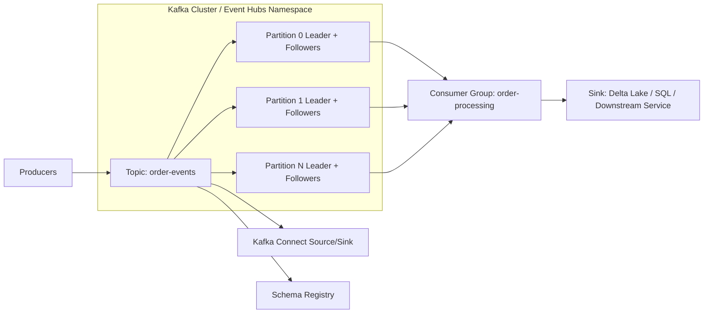
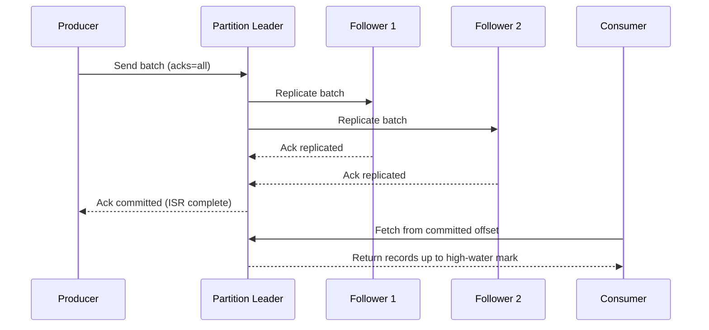
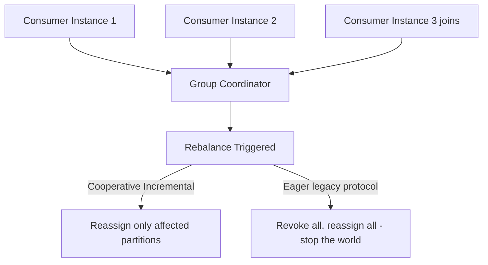

# Apache Kafka

> Part of the **Enterprise Data & AI Architecture Handbook** · Phase-07 - Streaming & Real-Time Analytics · Chapter 02.
> Estimated study time: **90 min reading + ~6h labs**.
> **Prerequisites:** read [Streaming Fundamentals](01_Streaming_Fundamentals.md) and [Replication and Consistency](../Phase-02/02_Replication_and_Consistency.md) first.

---

## Executive Summary

Apache Kafka is the durable, partitioned, replayable event log that turned stream processing from a niche capability into a standard enterprise architecture pattern. Its architectural contribution is not "fast messaging" — plenty of message brokers are fast. Its contribution is a specific, disciplined data structure: an append-only, partitioned log with a retained, replayable history and a durable offset per consumer group, which lets producers and consumers evolve independently, at different speeds, without either one holding the other hostage.

Everything else in this chapter is a consequence of that one data structure. Partitions exist because a single append-only log cannot scale past one machine's disk and network throughput, so Kafka shards a topic into ordered partitions and only guarantees order within a partition, not across a topic. Replication and the in-sync replica (ISR) set exist because a single-partition leader is a single point of failure, so Kafka replicates each partition to followers and only acknowledges a write once it is durably present on enough of them — the same leader-follower replication reasoning introduced in [Replication and Consistency](../Phase-02/02_Replication_and_Consistency.md), specialized to an append-only log instead of a general read/write store. Consumer groups and rebalancing exist because independent consumer instances need to divide partitions among themselves elastically as they scale up, scale down, or fail. Transactions and idempotent producers exist because "at-least-once by default" (established in [Streaming Fundamentals](01_Streaming_Fundamentals.md)) is not good enough for pipelines that must guarantee an event is reflected exactly once in a downstream effect.

The practical, Azure-first conclusion is this: Kafka (or a Kafka-compatible service such as Azure Event Hubs' Kafka endpoint, or fully managed Kafka via Confluent Cloud on Azure) is the correct default durable event log for enterprise streaming architectures precisely because it makes the trade-offs in this chapter explicit and configurable rather than hidden — partition count is a scaling and ordering decision, `acks` and `min.insync.replicas` are a durability decision, consumer group rebalancing strategy is an availability decision, and transactional semantics are a correctness decision. A team that treats these as defaults to leave alone is choosing an architecture by accident.

## Learning Objectives

By the end of this chapter you will be able to:

1. Explain Kafka's core data model — topics, partitions, offsets — and why ordering is guaranteed only within a partition.
2. Reason about replication, the in-sync replica (ISR) set, and leader election, and connect them to the leader-follower replication model in [Replication and Consistency](../Phase-02/02_Replication_and_Consistency.md).
3. Configure producer durability (`acks`, `min.insync.replicas`, idempotence) to match a stated business durability requirement.
4. Explain consumer groups, partition assignment, and rebalancing, including the cost and risk of a rebalance storm.
5. Implement exactly-once semantics using Kafka transactions and idempotent producers, and explain precisely what guarantee this does and does not extend to downstream systems.
6. Use Kafka Connect for source/sink integration and Schema Registry for schema governance and compatibility management.
7. Map Kafka's architecture onto Azure Event Hubs' Kafka-compatible endpoint and fully managed Kafka options, and choose correctly between them.
8. Diagnose common production failure modes: partition hot-spotting, consumer lag, rebalance storms, and under-replicated partitions.
9. Design topic, partition, and retention strategy for a concrete enterprise workload.
10. Defend a Kafka architecture and durability configuration decision in a staff-level review.

## Business Motivation

- Kafka decouples producers and consumers so that dozens of downstream systems (fraud detection, analytics, CDC sinks, notification services) can consume the same event stream independently, without each one requiring a point-to-point integration with the source system.
- The durable, replayable log is what makes reprocessing after a bug fix or new business requirement operationally realistic instead of requiring a full re-extract from source systems.
- Financial, order-management, and inventory systems depend on Kafka's durability and ordering guarantees to avoid silently losing or misordering business events.
- Kafka Connect and Schema Registry reduce the recurring integration cost of connecting new sources and sinks and prevent schema drift from silently breaking downstream consumers.
- Elastic consumer groups let platform teams scale processing capacity up or down independently of producer volume, which materially affects Azure compute cost efficiency.
- Multi-team, multi-domain enterprises need a shared, governed event backbone rather than N-squared point-to-point integrations between systems.
- Getting durability configuration wrong (`acks=1` on a financial pipeline, for example) is an expensive mistake to discover after a leader failure has already dropped acknowledged writes.

## History and Evolution

- Kafka was created at LinkedIn (2010-2011) to solve the problem of connecting an increasingly tangled mesh of internal systems (activity tracking, metrics, operational data) through a single, durable, publish-subscribe log rather than growing point-to-point integrations further.
- It was open-sourced and became an Apache project, and its central insight — treat the commit log itself as the product, not just an implementation detail of a message queue — proved to be broadly reusable beyond LinkedIn's original use case.
- Early Kafka required a separate ZooKeeper ensemble for cluster metadata, controller election, and configuration; this dependency shaped much of Kafka's early operational complexity.
- Kafka Connect (2015-ish) and the Confluent Schema Registry emerged to standardize source/sink integration and schema governance, turning Kafka from "a log you write custom producers and consumers against" into a full integration platform.
- Kafka's transactional API (0.11, 2017) added idempotent producers and multi-partition transactions, enabling true exactly-once semantics for stream-processing pipelines (notably Kafka Streams) built on top of the log.
- KRaft (Kafka Raft metadata mode) removed the ZooKeeper dependency by replacing it with a Raft-based internal metadata quorum, simplifying operations and improving controller failover time — a direct, practical application of the consensus concepts from [Replication and Consistency](../Phase-02/02_Replication_and_Consistency.md) and its prerequisite chapter on consensus.
- Cloud-managed and Kafka-compatible offerings (Confluent Cloud, Amazon MSK, Azure Event Hubs' Kafka endpoint) shifted much of the operational burden of running brokers, replication, and controller elections onto the platform, while preserving the log-based data model and client API.
- Current enterprise practice increasingly treats "Kafka" as a protocol and data model as much as a specific piece of software — the same client code can target self-managed Kafka, Confluent Cloud, or Azure Event Hubs' Kafka-compatible endpoint with configuration-level changes only.

## Why This Technology Exists

Kafka exists because point-to-point integration between N producers and M consumers does not scale organizationally or technically: it creates $N \times M$ brittle connections, each with its own retry, backpressure, and schema-compatibility logic, and each new consumer requires renegotiating access with every producer team. A single, shared, durable, ordered (per-partition) log inverts this: producers write once, and any number of independent consumers read at their own pace, replay history when needed, and are added without producer-side changes.

It also exists because the guarantees a business actually needs from an integration substrate — durability across a broker failure, ordering per business entity, exactly-once processing for sensitive workloads, elastic parallel consumption — cannot be bolted onto a plain message queue as an afterthought. Kafka's specific choices (partitioned append-only log, replicated per partition, committed consumer offsets, an ISR-based durability model) are the direct architectural answer to those requirements, built from the ground up rather than layered on top of a queue designed for simple point-to-point delivery.

Finally, Kafka exists because reprocessing is a first-class operational requirement, not an edge case. As emphasized in [Streaming Fundamentals](01_Streaming_Fundamentals.md), correcting a windowing or watermark bug, backfilling a new consumer, or recovering from a downstream outage all require replaying history from a specific offset. A durable, retained, replayable log is what makes this routine rather than a crisis requiring a full re-extract from source-of-record systems.

## Problems It Solves

| Problem | Kafka's response |
|---|---|
| N-squared point-to-point integrations between producers and consumers | Single shared, durable, ordered-per-partition log with independent consumers |
| Consumers need to replay history after a bug fix or new requirement | Configurable retention with offset-based replay |
| A broker failure must not lose acknowledged writes | Per-partition replication with an ISR set and configurable `acks` |
| Processing throughput must scale independently of a single machine's limits | Partitioning across brokers with parallel consumer group members |
| Multiple independent teams need to consume the same events without interference | Consumer groups track offsets per group, isolated from other groups |
| Pipelines need exactly-once effect despite retries | Idempotent producers and transactional multi-partition writes |
| New sources/sinks need low-effort, standardized integration | Kafka Connect connector ecosystem |
| Schema drift silently breaks downstream consumers | Schema Registry with enforced compatibility modes |

## Problems It Cannot Solve

- Kafka cannot guarantee global ordering across an entire topic if that topic has more than one partition; only per-partition order is guaranteed, which is a deliberate scalability trade-off, not a limitation to work around with tricks.
- It does not provide query capability; Kafka is a log, not a queryable database — serving queries requires materializing state into a downstream store (Kafka Streams state stores, Delta Lake, a key-value store) rather than querying the log directly.
- It cannot make a poorly chosen partition key produce even load distribution; hot-key skew is an application/data-modeling problem Kafka cannot fix for you.
- It does not guarantee exactly-once all the way to an arbitrary downstream sink; transactional guarantees only extend as far as sinks that participate in the transaction protocol or are otherwise made idempotent, echoing the system-wide nature of exactly-once discussed in [Streaming Fundamentals](01_Streaming_Fundamentals.md).
- It cannot substitute for a real schema governance process; Schema Registry enforces compatibility rules but does not decide what a good schema looks like.
- It does not remove the need for capacity planning; under-provisioned partitions, brokers, or consumer parallelism will still produce lag and backpressure.
- It cannot make a rebalance "free"; a stop-the-world rebalance (in older rebalance protocols) pauses an entire consumer group's processing, and even incremental cooperative rebalancing has a non-zero cost.

## Core Concepts

### 8.1 Topics, partitions, and offsets

A **topic** is a named, logical stream of events. Each topic is split into one or more **partitions**, and each partition is an independent, strictly ordered, append-only log. Kafka guarantees ordering only within a single partition, not across the whole topic — this is the direct consequence of partitions living on potentially different brokers and being written independently. Every event within a partition is assigned a monotonically increasing **offset**, which is the durable position a consumer uses to track its progress. A partition key (commonly a business entity ID such as customer ID or device ID) determines which partition an event lands in via a hash function, so choosing a good partition key is simultaneously an ordering decision (all events for the same key are ordered relative to each other) and a load-distribution decision.

### 8.2 Replication, the ISR, and leader election

Each partition has one **leader** broker that handles all reads and writes for that partition, and zero or more **follower** brokers that replicate the leader's log. The set of replicas that are sufficiently caught up with the leader is the **in-sync replica (ISR)** set. A producer's durability guarantee is governed by `acks` (whether the leader alone, or the full ISR set, must acknowledge before the write is considered committed) combined with `min.insync.replicas` (the minimum ISR size required for a write to succeed at all). If a leader fails, a new leader is elected from the ISR set — this is the same leader-follower replication and failover reasoning developed generally in [Replication and Consistency](../Phase-02/02_Replication_and_Consistency.md), specialized here to an append-only log where "catching up" means "having replayed the same log entries," not resolving arbitrary conflicting writes.

### 8.3 Producers and delivery guarantees

A producer's durability and ordering guarantees are controlled by a small number of explicit settings: `acks` (0, 1, or `all`), `retries` combined with `enable.idempotence` (to make retried sends safe rather than duplicate-producing), and `max.in.flight.requests.per.connection` (which affects whether retries can reorder events). The **idempotent producer** (enabled via `enable.idempotence=true`) assigns each producer instance a producer ID and per-partition sequence numbers, letting the broker detect and drop duplicate retries of the same batch — this is the mechanical foundation that Kafka transactions build on top of.

### 8.4 Consumer groups, partition assignment, and rebalancing

A **consumer group** is a set of consumer instances that cooperatively consume a topic's partitions, with each partition assigned to exactly one consumer within the group at a time (parallelism is bounded by partition count). When a group member joins, leaves, or is considered dead (missed heartbeats), the group undergoes a **rebalance**: partitions are reassigned among the surviving members. Older "eager" rebalancing revokes all partitions from all members before reassigning (a brief stop-the-world pause for the whole group); newer **cooperative incremental rebalancing** only reassigns the specific partitions that need to move, substantially reducing the disruption of routine scaling events.

### 8.5 Committed offsets and consumption semantics

Consumers periodically commit the offset of the last successfully processed record (either automatically, or explicitly after processing completes) to a durable, internal Kafka topic (`__consumer_offsets`). Committing before processing completes risks losing work on a crash (events between the committed offset and the actual point of failure are skipped); committing after processing completes but before the commit itself is durable risks reprocessing on a crash (the classic at-least-once pattern, requiring idempotent downstream handling as covered in [Streaming Fundamentals](01_Streaming_Fundamentals.md)).

### 8.6 Transactions and exactly-once semantics

Kafka transactions let a producer atomically write to multiple partitions (and, crucially, atomically commit both the produced records and the consumer offsets of the records that triggered them) so that a "consume-transform-produce" pipeline step either fully commits or fully rolls back. Combined with a `read_committed` isolation level on the consuming side (which hides records from aborted or in-flight transactions), this delivers exactly-once semantics **within Kafka** for consume-transform-produce topologies (the model Kafka Streams uses natively). It does not automatically extend to an arbitrary external sink unless that sink also participates in a two-phase commit-like protocol or is made idempotent — the same system-wide caveat on exactly-once from [Streaming Fundamentals](01_Streaming_Fundamentals.md) applies here without exception.

### 8.7 Kafka Connect and Schema Registry

**Kafka Connect** is a standardized framework for source connectors (pulling data into Kafka from databases, CDC logs, SaaS APIs) and sink connectors (pushing data from Kafka into data lakes, warehouses, or search indexes), configured declaratively rather than hand-coded per integration. **Schema Registry** stores versioned schemas (commonly Avro, Protobuf, or JSON Schema) for topics and enforces compatibility rules (backward, forward, or full compatibility) so that producer or consumer schema evolution does not silently break the other side.

## Internal Working

### 9.1 How a write is committed

A producer sends a batch of records for a partition to that partition's current leader broker. The leader appends the batch to its local log and waits according to the configured `acks`: `acks=0` returns immediately without waiting for any acknowledgment (fastest, least durable), `acks=1` returns once the leader has written to its own log (durable against a follower failure but not a leader failure before replication), and `acks=all` returns only once every replica in the ISR set has replicated the batch (durable against any single-broker failure, provided `min.insync.replicas` is set to at least 2). The high-water mark — the offset up to which all ISR replicas have replicated — is what determines which records are visible to consumers.

### 9.2 How leader election happens

When a partition's leader broker fails, the cluster's active controller (elected via the KRaft metadata quorum in modern Kafka, or historically via ZooKeeper) selects a new leader from the partition's ISR set, preferring the most caught-up replica. If `unclean.leader.election.enable` is left at its safe default of `false`, a broker outside the ISR (one that has fallen behind) will never be elected leader even if it is the only surviving replica, which prioritizes durability over availability — enabling unclean leader election trades that durability guarantee for availability during a severe outage, and must be a deliberate, documented decision, not a default left unexamined.

### 9.3 How consumer group rebalancing actually happens

Each consumer group has a designated **group coordinator** broker. Group members send periodic heartbeats to the coordinator; a missed heartbeat beyond `session.timeout.ms` (or a `poll()` call exceeding `max.poll.interval.ms`, indicating the consumer is stuck) triggers the coordinator to treat the member as dead and initiate a rebalance. Under the cooperative incremental rebalancing protocol, the coordinator computes a new assignment and only revokes/reassigns the specific partitions that must move, rather than pausing the entire group — this materially reduces the "rebalance storm" risk of older eager rebalancing, where a single flapping consumer instance could repeatedly pause the whole group's processing.

### 9.4 How exactly-once transactions are mechanically implemented

A transactional producer is assigned a stable `transactional.id` (surviving producer restarts) mapped to a producer ID by a **transaction coordinator** broker. `beginTransaction()` starts a transaction; the producer writes to one or more partitions and, for consume-transform-produce topologies, also sends the consumer offsets to commit as part of the same transaction; `commitTransaction()` writes a commit marker to every involved partition (using a two-phase-commit-like protocol coordinated by the transaction coordinator writing to an internal `__transaction_state` topic). Consumers configured with `isolation.level=read_committed` will not surface records from a transaction until its commit marker is durably written, and will never surface records from an aborted transaction at all.

### 9.5 How Kafka Connect and Schema Registry interact with the log

A Connect source connector runs as a set of parallel tasks, each producing records into Kafka partitions much like any other producer, while Connect's framework manages offset tracking, error handling (dead-letter queues), and task rebalancing across the Connect cluster itself (a separate rebalancing concern from consumer-group rebalancing). Schema Registry is consulted by producers and consumers using Avro/Protobuf serializers to resolve and validate schema IDs embedded in each record's header/prefix, rejecting writes that violate the topic's configured compatibility mode before they ever reach a partition.

## Architecture

### 10.1 Azure-first reference architecture

The common Azure pattern uses **Azure Event Hubs with its Kafka-compatible endpoint** for teams that want managed infrastructure with minimal operational burden and are comfortable trading some Kafka-specific feature parity for PaaS simplicity, or **self-managed Kafka on AKS** (via a Kafka Kubernetes operator) or **Confluent Cloud on Azure** for teams that need full Kafka feature parity (KRaft-native features, full transactional semantics, Kafka Streams, Connect, Schema Registry) with either more operational control or a fully managed Confluent experience. Producers (applications, CDC connectors) write into topics; Kafka Connect or native consumers (Azure Databricks Structured Streaming, Azure Stream Analytics via Event Hubs) read from those topics; Schema Registry (Confluent Schema Registry or Azure Schema Registry within Event Hubs) governs schema evolution; Azure Monitor, Log Analytics, and Kafka-native JMX metrics (via Prometheus exporters) provide observability.

### 10.2 Why the architecture works

This architecture keeps the durable, replayable log as the single shared integration point, decoupling producer and consumer release cycles and letting new consumers be added without renegotiating with producer teams. It preserves Kafka's explicit durability and ordering configuration as reviewable, auditable settings rather than implicit platform behavior, which is what allows a staff-level review to actually verify a pipeline's guarantees instead of trusting a vendor's marketing claim.

### 10.3 ADR example: adopt Azure Event Hubs' Kafka-compatible endpoint for new pipelines, reserve self-managed/Confluent Kafka for feature-parity-critical workloads

**Context:** Multiple teams need a durable event log. Some want full Kafka feature parity (exactly-once transactions, Kafka Streams, custom Connect plugins); others just need durable, ordered, replayable ingestion with minimal operational ownership, and running self-managed Kafka on AKS for every team multiplies operational burden across the organization.

**Decision:** Default new streaming pipelines to Azure Event Hubs' Kafka-compatible endpoint (Standard or Premium/Dedicated tier depending on throughput). Use self-managed Kafka on AKS or Confluent Cloud on Azure only where a documented feature gap exists — most commonly full Kafka transactional exactly-once semantics with Kafka Streams, or a Connect plugin unavailable in Event Hubs' ecosystem.

**Consequences:** Most teams get a managed, low-operational-burden event log with strong SLAs and native Azure integration (Entra ID, Private Link, Monitor). Teams with a genuine feature-parity requirement retain a documented path to full Kafka, at the cost of owning more operational complexity for that specific workload.

**Alternatives considered:**

1. Self-managed Kafka on AKS for everyone: rejected because it multiplies operational ownership (broker patching, KRaft/ZooKeeper operations, scaling) across every team that only needed a durable log, not full Kafka internals control.
2. Confluent Cloud for everyone: rejected on cost grounds for teams whose workload does not need Confluent-specific features (full Connect ecosystem, ksqlDB, Stream Governance) beyond what Event Hubs' Kafka endpoint already provides.
3. Mixing arbitrarily per team with no default: rejected because it produced inconsistent tooling, monitoring, and governance across teams before this ADR existed.

## Components

| Component | Role | Typical Azure-first implementation | Common failure mode |
|---|---|---|---|
| Broker | Stores and serves partition logs, handles replication | Azure Event Hubs namespace / self-managed Kafka broker on AKS / Confluent Cloud broker | under-provisioned throughput units causing throttling |
| Partition | Ordered, append-only unit of a topic | Configured partition count per topic | too few partitions limiting consumer parallelism, or too many causing metadata/rebalance overhead |
| ISR / replication | Durability and failover mechanism | Replication factor 3 (or Event Hubs' managed replication) | `min.insync.replicas` left at 1, silently weakening the `acks=all` guarantee |
| Controller / metadata quorum | Cluster metadata, leader election | KRaft quorum (modern Kafka) / Event Hubs' managed control plane | ZooKeeper/KRaft quorum instability causing slow or failed leader elections |
| Producer | Writes events with configured durability guarantees | Application SDKs, CDC connectors, Kafka Connect source tasks | `acks=1` used by default for a workload that actually needs `acks=all` |
| Consumer group | Cooperatively consumes partitions with tracked offsets | Application consumers, Kafka Connect sink tasks, Structured Streaming | rebalance storms from a flapping or overloaded consumer instance |
| Transaction coordinator | Manages atomic multi-partition commits | Native Kafka transactional API | assuming transactional guarantees extend to a non-idempotent external sink |
| Kafka Connect | Standardized source/sink integration framework | Managed Connect (Confluent Cloud) / self-hosted Connect cluster | connector configuration drift not tracked in version control |
| Schema Registry | Versioned schema storage and compatibility enforcement | Confluent Schema Registry / Azure Schema Registry in Event Hubs | compatibility mode left permissive, allowing breaking schema changes to ship |

## Metadata

| Metadata class | What to record | Why it matters |
|---|---|---|
| Topic configuration metadata | partition count, replication factor, retention, cleanup policy | governs ordering, durability, and replay capability |
| Durability configuration metadata | `acks`, `min.insync.replicas`, idempotence/transactional settings per producer | makes the actual durability guarantee auditable rather than assumed |
| Consumer group metadata | group ID, assignment strategy, committed offsets, lag | drives capacity planning and incident diagnosis |
| Schema metadata | schema version, compatibility mode, owning team | prevents undocumented breaking schema changes |
| Connector metadata | connector class, configuration, task count, dead-letter topic | supports auditability and troubleshooting of integrations |
| ACL / access metadata | principal, topic, operation (read/write/describe) | supports least-privilege governance across many teams sharing a cluster |
| Operational metadata | under-replicated partition count, ISR shrink/expand events, controller failover history | first-class cluster health signals |

## Storage

| Storage concern | Recommended posture | Notes |
|---|---|---|
| Partition log retention | size retention (time or bytes) to cover the realistic reprocessing/backfill window | replay is the backbone of Kafka-based reprocessing strategy, as established in [Streaming Fundamentals](01_Streaming_Fundamentals.md) |
| Replication factor | use 3 for production topics needing durability against a broker failure | replication factor 1 or 2 is rarely appropriate outside dev/test |
| Log compaction | use compacted topics (`cleanup.policy=compact`) for latest-value-per-key semantics (for example, CDC change streams or entity snapshots) | distinct from time/size-based retention; compaction retains the last value per key indefinitely |
| Tiered storage | consider tiered storage (where available) or Event Hubs Capture for very long retention at lower cost | avoids paying premium broker storage cost for cold, rarely-replayed history |
| Broker disk sizing | size for peak retained volume across all partitions on a broker, not average | disk exhaustion on a broker is a cluster-wide risk, not an isolated topic problem |

## Compute

| Workload class | Best Azure-first surface | Why it fits | Wrong default |
|---|---|---|---|
| Standard enterprise event ingestion with moderate throughput | Azure Event Hubs (Standard/Premium tier, Kafka-compatible endpoint) | managed, low operational burden, native Azure integration | assuming it has full Kafka feature parity (some admin APIs and KRaft-specific features are not exposed) |
| Very high throughput or full Kafka feature parity required | Self-managed Kafka on AKS or Confluent Cloud on Azure | full transactional semantics, Kafka Streams, custom Connect plugins | running self-managed Kafka for a workload that Event Hubs would satisfy at lower operational cost |
| Lightweight source/sink integration | Kafka Connect (managed via Confluent Cloud, or self-hosted) | standardized, declarative connectors instead of bespoke producer/consumer code | hand-rolling custom integration code for a well-supported existing connector |
| Schema governance across many producing/consuming teams | Schema Registry (Confluent or Azure Schema Registry) | enforced compatibility prevents silent breaking changes | relying on informal agreement between teams instead of enforced compatibility rules |

## Networking

- Co-locate producers, brokers, and consumers in the same Azure region where feasible to minimize the network latency that inflates end-to-end event-time-to-processing-time skew discussed in [Streaming Fundamentals](01_Streaming_Fundamentals.md).
- Use Private Link/Private Endpoint for Event Hubs and VNet integration for self-managed Kafka on AKS to keep broker traffic off the public internet.
- Plan partition count and broker network throughput together; a broker approaching its network ceiling degrades every partition it leads, not just the noisy one.
- Separate producer and consumer network paths where practical so consumer fan-out (many downstream consumers reading the same topic) does not starve producer ingest bandwidth.
- Monitor cross-AZ or cross-region replication traffic cost explicitly; `acks=all` with replicas spread across availability zones adds real, ongoing network cost and latency, not just a resiliency benefit.

## Security

| Concern | Recommended control |
|---|---|
| Authentication | Entra ID / SASL with managed identities (Event Hubs) or mTLS/SASL-SCRAM (self-managed Kafka), never shared static keys embedded in producers |
| Authorization | Fine-grained ACLs per topic and operation (produce/consume/describe), scoped per team/service principal |
| In-transit encryption | TLS for all broker-client and inter-broker traffic |
| At-rest encryption | Platform-managed or customer-managed keys for broker storage |
| Schema/data sensitivity | Classify and mask/tokenize sensitive fields before they enter shared topics consumed by many teams |
| Multi-tenancy isolation | Separate topics/namespaces per domain with enforced ACLs rather than one shared, openly-writable topic |
| Audit | Log all ACL and configuration changes, and all administrative topic/partition operations, to a durable audit trail |

## Performance

- Choose partition count based on target parallel consumer throughput and realistic future growth; increasing partition count later is possible but re-keys ordering guarantees for existing keys and requires careful migration.
- Batch producer sends (`linger.ms`, `batch.size`) to trade a small amount of latency for materially higher throughput and lower per-request broker overhead.
- Monitor consumer lag continuously; sustained lag growth is the leading indicator of under-provisioned consumer parallelism or a downstream processing bottleneck.
- Avoid overly large `max.poll.records` combined with slow per-record processing, which risks exceeding `max.poll.interval.ms` and triggering unnecessary rebalances.
- Prefer cooperative incremental rebalancing over the older eager protocol for any consumer group with more than a handful of members, to avoid stop-the-world pauses during routine scaling.

| Pattern | Recommendation | Why |
|---|---|---|
| High-throughput ingestion (clickstream, IoT) | Higher partition count, `acks=1` where occasional loss is tolerable, batching tuned for throughput | favors volume and cost efficiency over strict per-event durability |
| Financial/order events | `acks=all`, `min.insync.replicas=2`, idempotent/transactional producer | favors durability and exactly-once correctness over raw throughput |
| CDC change streams | Compacted topics keyed by entity ID | favors latest-state correctness over full history retention |
| Multi-team fan-out topic | Moderate partition count, strict Schema Registry compatibility mode | favors stability for many independent consumers over any single producer's convenience |

## Scalability

- Scale partition count to match the maximum realistic consumer parallelism needed; consumer parallelism within a group is bounded by partition count, so under-partitioning caps scale-out regardless of how many consumer instances are added.
- Scale brokers (or Event Hubs throughput units/processing units) to keep per-broker partition and network load within safe operating margins, watching for a small number of "hot" brokers hosting a disproportionate share of high-traffic partition leaders.
- For very large consumer groups, prefer cooperative incremental rebalancing and tune `session.timeout.ms`/`max.poll.interval.ms` to avoid rebalance storms under transient load or GC pauses.
- Reassess partition key design whenever throughput or key cardinality changes materially; a partition key that was evenly distributed at launch can become skewed as one entity (a large customer, a popular product) grows disproportionately.
- Decouple producer-side scaling from consumer-side scaling; each can be resized independently, but both are ultimately bounded by the topic's partition count.

## Fault Tolerance

- Replication factor 3 with `acks=all` and `min.insync.replicas=2` tolerates a single broker failure without losing acknowledged writes or blocking availability.
- Leader election from the ISR set (with `unclean.leader.election.enable=false`) prioritizes durability over availability during a severe multi-broker outage — a deliberate, documented trade-off, not a default to leave unexamined.
- Idempotent and transactional producers make producer-side retries after a network failure safe, preventing duplicate writes that a naive retry loop would otherwise introduce.
- Consumer offset commits (ideally after processing completes, or transactionally alongside output writes) are what allow a crashed consumer to resume correctly rather than skip or indefinitely reprocess events.
- Test broker failure and leader-election recovery deliberately (kill a broker hosting a partition leader under production-like load) rather than assuming replication "just works" until an actual incident proves otherwise.

## Cost Optimization

- Right-size partition count and replication factor; over-partitioning inflates broker metadata and rebalance overhead, and replication factors beyond 3 rarely add proportional value for typical enterprise durability requirements.
- Use compacted topics instead of full retention where only the latest value per key is actually needed, reducing storage cost materially for CDC-style workloads.
- Choose Event Hubs' managed tiers (Standard vs. Premium/Dedicated) based on actual throughput-unit consumption rather than defaulting to the largest tier "to be safe."
- Monitor and alert on consumer lag as a cost signal too; sustained lag often indicates under-provisioned consumer compute paired with over-provisioned broker/throughput-unit capacity sitting idle.
- Move cold, rarely-replayed history to Event Hubs Capture or tiered storage rather than paying premium broker storage cost indefinitely.

Worked FinOps example: consider an order-events topic on Azure Event Hubs Premium sized for peak Black Friday throughput year-round, costing roughly $2,200 per month in illustrative pricing, when actual sustained throughput outside the peak season is a small fraction of that capacity. Right-sizing to a smaller Premium/Standard tier with autoscale for the routine season, combined with a documented temporary scale-up procedure for the known seasonal peak, can materially reduce the annual bill while still meeting the peak-season SLA. The lesson generalizes: Kafka/Event Hubs cost problems are very often static capacity sized for a worst-case that occurs a few weeks a year, and the first FinOps lever is matching capacity to the actual demand curve, not simply choosing a smaller tier uniformly and risking a peak-season outage.

## Monitoring

| Metric | Why it matters | Typical threshold |
|---|---|---|
| Consumer lag (per group, per partition) | shows whether consumption is keeping pace with production | alert on sustained growth, not momentary spikes |
| Under-replicated partition count | signals brokers falling behind or a broker outage in progress | alert on any sustained non-zero value |
| ISR shrink/expand rate | signals replication instability | investigate frequent shrink events even if they self-heal |
| Request latency (produce/fetch) | direct indicator of broker or network saturation | tie to producer/consumer SLA expectations |
| Rebalance frequency and duration | signals consumer instability or overly aggressive timeout configuration | alert on frequent or long rebalances |
| Controller/leader election frequency | signals cluster metadata instability | investigate any unexpected controller failover |

## Observability

Observability for a Kafka-based pipeline should answer: how far behind is each consumer group, how healthy is replication right now, how often are rebalances happening and why, and what is the actual durability guarantee currently configured for each producer.

- correlate producer `acks`/idempotence configuration with observed durability incidents so a review can verify claimed guarantees against actual configuration,
- capture rebalance events (cause, duration, affected partitions) as a first-class time series, not just an internal client-log detail,
- track schema compatibility violations and rejected writes at the Schema Registry boundary,
- preserve topic/partition/consumer-group context alongside downstream processing telemetry so an incident can be traced back to a specific partition or consumer instance.

### Operational response playbooks

| Signal | Detection query or rule | Likely cause | First remediation |
|---|---|---|---|
| Consumer lag grows steadily for one group | Lag metric trending upward without recovering off-peak | under-provisioned consumer parallelism, a slow downstream sink, or a hot partition | scale consumer instances up to partition count, investigate sink latency, or rebalance partition key distribution |
| Under-replicated partitions appear | Broker/partition replication metrics show ISR below replication factor | a broker is down, overloaded, or network-partitioned | investigate broker health, ensure `min.insync.replicas` is still satisfied, plan capacity or network remediation |
| Frequent rebalances in a consumer group | Rebalance event count spikes against baseline | consumers exceeding `max.poll.interval.ms`, GC pauses, or flapping instances due to autoscaling churn | tune poll/session timeouts, investigate slow processing, stabilize autoscaling thresholds, or adopt cooperative rebalancing |

## Governance

- Require every production topic to document partition count, replication factor, retention/compaction policy, and durability configuration (`acks`, `min.insync.replicas`) in reviewed metadata, not only in application code.
- Treat changes to partition count, replication factor, and Schema Registry compatibility mode as reviewed architectural changes, since they change durability, ordering, and downstream compatibility guarantees.
- Require Schema Registry enforcement (backward or full compatibility, depending on the topic's consumer population) for any topic with more than one consuming team.
- Track ACLs and topic ownership centrally so a shared cluster does not silently accumulate over-permissioned or orphaned access.
- Align Kafka/Event Hubs governance with existing data governance processes so event schemas are cataloged alongside batch/warehouse schemas rather than living in a separate, ungoverned system.

## Trade-offs

| Choice | Advantages | Disadvantages | When to prefer it |
|---|---|---|---|
| Azure Event Hubs (Kafka-compatible endpoint) | Managed, low operational burden, native Azure integration | Not full Kafka feature parity (some admin/KRaft-specific features unavailable) | Most enterprise event-ingestion pipelines without a specific full-Kafka feature need |
| Self-managed Kafka on AKS | Full feature parity, complete control | Highest operational ownership (patching, scaling, KRaft operations) | Workloads genuinely requiring full Kafka Streams, custom Connect plugins, or fine-grained tuning |
| Confluent Cloud on Azure | Full Kafka feature parity with managed operations | Additional vendor cost layer beyond raw compute | Teams needing full Kafka ecosystem (ksqlDB, Stream Governance, extensive Connect catalog) with managed operations |
| `acks=1` | Lower latency, higher throughput | Acknowledged writes can be lost on a leader failure before replication | High-volume, loss-tolerant telemetry or sampling workloads |
| `acks=all` with `min.insync.replicas=2` | Durable against a single broker failure | Higher latency, lower throughput ceiling | Financial, order, or other durability-critical events |
| Eager rebalancing | Simpler mental model | Stop-the-world pause for the whole group on every membership change | Small, stable consumer groups where rebalance frequency is low |
| Cooperative incremental rebalancing | Minimal disruption during scaling/failures | Slightly more complex assignment logic | Larger or frequently scaling consumer groups |

## Decision Matrix

| Requirement | Event Hubs Kafka endpoint | Self-managed Kafka on AKS | Confluent Cloud |
|---|---|---|---|
| Lowest operational burden | strong | weak | medium |
| Full Kafka feature parity (transactions, Streams, KRaft features) | medium | strong | strong |
| Native Azure identity/networking integration | strong | medium | medium |
| Predictable managed cost model | strong | weak | medium |
| Extensive Connect/ksqlDB ecosystem | medium | medium | strong |
| Fine-grained broker-level tuning control | weak | strong | medium |

Use this matrix as a starting filter; the final choice still depends on the specific throughput, feature-parity, and operational-ownership constraints of the workload.

## Design Patterns

1. **Entity-keyed partitioning pattern:** partition by a stable business entity ID (customer, device, order) so per-entity ordering is preserved and load distributes evenly for high-cardinality entities.
2. **Compacted latest-state pattern:** use `cleanup.policy=compact` for CDC-style topics where only the latest value per key matters, rather than retaining full history.
3. **Idempotent-producer-by-default pattern:** enable `enable.idempotence=true` as the organizational default for all producers, reserving explicit opt-out only for genuinely loss-tolerant workloads.
4. **Consume-transform-produce transactional pattern:** use Kafka transactions to atomically commit output records and input offsets together for pipelines that cannot tolerate reprocessing duplication.
5. **Dead-letter connector pattern:** configure Kafka Connect dead-letter topics for records that fail deserialization or transformation, rather than blocking the whole connector task or silently dropping them.
6. **Schema-Registry-gated evolution pattern:** enforce backward or full compatibility mode on any topic with more than one consuming team, requiring registry validation before a new producer schema version can ship.
7. **Cooperative rebalancing pattern:** standardize on the cooperative incremental rebalancing protocol for consumer groups above a small member count to avoid stop-the-world disruption.

## Anti-patterns

- Using `acks=1` by default for durability-critical business events without a documented, deliberate decision that occasional loss is acceptable.
- Leaving `min.insync.replicas=1` on a replication-factor-3 topic, which silently weakens `acks=all` to the durability of `acks=1` during a single broker outage.
- Choosing a partition key that concentrates traffic on a small number of hot keys (for example, partitioning by a low-cardinality status field instead of a high-cardinality entity ID).
- Assuming Kafka transactions guarantee exactly-once all the way to an external, non-idempotent sink.
- Running large consumer groups on the older eager rebalancing protocol, causing frequent stop-the-world pauses during routine autoscaling.
- Treating Schema Registry compatibility mode as optional or advisory rather than an enforced gate.
- Growing partition count reactively under load pressure without considering the ordering-guarantee implications for existing keyed data.

## Common Mistakes

- Forgetting that ordering is only guaranteed within a partition, and writing downstream logic that implicitly assumes topic-wide ordering.
- Committing consumer offsets before processing completes, silently skipping events on a crash.
- Sizing partition count for launch-day throughput without planning a partition-count growth strategy, then discovering that changing partition count re-keys ordering for existing data.
- Confusing "Kafka guarantees exactly-once" with "my pipeline guarantees exactly-once," without verifying every sink in the chain is idempotent or transactional.
- Ignoring rebalance frequency metrics until a rebalance storm visibly stalls processing during a traffic spike.
- Leaving Event Hubs/Kafka cluster sized for peak season year-round instead of implementing a documented scale-up/scale-down procedure.

## Best Practices

- default to `enable.idempotence=true` for all producers, and use `acks=all` with `min.insync.replicas=2` for any durability-critical topic,
- choose partition keys deliberately for even distribution and meaningful per-entity ordering, and plan partition-count growth in advance rather than reactively,
- adopt cooperative incremental rebalancing for consumer groups beyond a handful of members,
- enforce Schema Registry compatibility mode for any topic with more than one consuming team,
- monitor consumer lag, under-replicated partitions, and rebalance frequency as first-class production health signals,
- test broker failure and leader-election recovery deliberately rather than assuming replication "just works,"
- document topic configuration (partitions, replication factor, retention/compaction, durability settings) as reviewed metadata, not tribal knowledge.

## Enterprise Recommendations

1. Default new streaming pipelines to Azure Event Hubs' Kafka-compatible endpoint; reserve self-managed Kafka or Confluent Cloud for documented feature-parity needs.
2. Mandate `enable.idempotence=true` organization-wide and require explicit, documented justification for any exception.
3. Require `acks=all` and `min.insync.replicas=2` (replication factor 3) for any topic classified as durability-critical.
4. Enforce Schema Registry compatibility mode as a deployment gate for any multi-consumer topic.
5. Standardize on cooperative incremental rebalancing for all consumer groups above a small member count.
6. Require consumer lag, under-replicated partition count, and rebalance frequency as standard dashboard metrics for every production topic and consumer group.
7. Treat partition count, replication factor, and compatibility-mode changes as reviewed architectural changes, not routine tuning.
8. Publish a documented seasonal/peak capacity scale-up and scale-down procedure instead of statically over-provisioning year-round.

## Azure Implementation

### 31.1 Recommended Azure service map

| Layer | Preferred Azure service | Notes |
|---|---|---|
| Managed, Kafka-compatible durable log | Azure Event Hubs (Standard/Premium/Dedicated, Kafka-compatible endpoint) | default choice for most enterprise pipelines |
| Full-feature-parity Kafka | Self-managed Kafka on AKS, or Confluent Cloud on Azure | for documented feature-parity needs (Kafka Streams, custom Connect plugins, ksqlDB) |
| Schema governance | Azure Schema Registry (within Event Hubs) or Confluent Schema Registry | enforce compatibility mode as a deployment gate |
| Source/sink integration | Kafka Connect (self-hosted or Confluent Cloud managed connectors) | standardized, declarative integration |
| Monitoring | Azure Monitor, Log Analytics, Prometheus/Grafana (JMX exporters for self-managed Kafka) | correlate lag, replication health, and rebalance events |

### 31.2 Example: creating an Event Hubs namespace with Kafka-compatible endpoint (Bicep)

```bicep
param location string = resourceGroup().location

resource eventHubNamespace 'Microsoft.EventHub/namespaces@2023-01-01-preview' = {
  name: 'evhns-edai-streaming-prod'
  location: location
  sku: {
    name: 'Standard'
    tier: 'Standard'
    capacity: 4
  }
  properties: {
    kafkaEnabled: true
    zoneRedundant: true
  }
}

resource orderEventsHub 'Microsoft.EventHub/namespaces/eventhubs@2023-01-01-preview' = {
  parent: eventHubNamespace
  name: 'order-events'
  properties: {
    partitionCount: 12
    messageRetentionInDays: 7
  }
}
```

### 31.3 Example producer configuration for durability-critical events (Java-style properties)

```properties
bootstrap.servers=evhns-edai-streaming-prod.servicebus.windows.net:9093
security.protocol=SASL_SSL
sasl.mechanism=OAUTHBEARER
sasl.jaas.config=org.apache.kafka.common.security.oauthbearer.OAuthBearerLoginModule required;

acks=all
enable.idempotence=true
min.insync.replicas=2
retries=2147483647
max.in.flight.requests.per.connection=5
transactional.id=order-events-producer-1
```

### 31.4 Example transactional consume-transform-produce (Java-style pseudocode)

```java
producer.initTransactions();

try {
    ConsumerRecords<String, Order> records = consumer.poll(Duration.ofMillis(500));
    producer.beginTransaction();

    for (ConsumerRecord<String, Order> record : records) {
        Order enriched = enrich(record.value());
        producer.send(new ProducerRecord<>("order-events-enriched", record.key(), enriched));
    }

    Map<TopicPartition, OffsetAndMetadata> offsets = currentOffsets(records);
    producer.sendOffsetsToTransaction(offsets, consumer.groupMetadata());
    producer.commitTransaction();
} catch (Exception e) {
    producer.abortTransaction();
    throw e;
}
```

### 31.5 Example Kafka Connect sink connector to Delta Lake / ADLS (JSON config)

```json
{
  "name": "order-events-to-adls-sink",
  "config": {
    "connector.class": "io.confluent.connect.azure.blob.storage.AzureBlobStorageSinkConnector",
    "topics": "order-events-enriched",
    "azblob.container.name": "curated",
    "azblob.account.name": "stedaicuratedprod",
    "format.class": "io.confluent.connect.azure.blob.storage.format.parquet.ParquetFormat",
    "flush.size": "10000",
    "errors.tolerance": "all",
    "errors.deadletterqueue.topic.name": "order-events-dlq"
  }
}
```

### 31.6 Practical Azure guidance

- Use Event Hubs Standard for moderate throughput with cost efficiency; Premium/Dedicated for high-throughput, isolated-tenant, or stricter latency-SLA workloads.
- Use partition count planning at topic creation time; Event Hubs allows increasing partition count later, but existing keyed ordering is only preserved for keys unaffected by the new hash distribution.
- Use Azure Schema Registry or Confluent Schema Registry with enforced compatibility mode before allowing any new producer schema version to ship to a shared topic.
- Use managed identities and Entra ID for producer/consumer authentication instead of embedding shared access keys.

## Open Source Implementation

Kafka is itself the open-source reference implementation; this section covers the surrounding OSS ecosystem that completes an enterprise-grade deployment.

| Layer | Open-source choice | Notes |
|---|---|---|
| Core broker | Apache Kafka (KRaft mode) | removes the ZooKeeper dependency, simplifying operations |
| Orchestration | Kubernetes (via a Kafka operator such as Strimzi) | declarative broker, topic, and user management on AKS |
| Schema governance | Confluent Schema Registry (or Apicurio Registry) | enforce Avro/Protobuf compatibility modes |
| Integration | Kafka Connect with community/Confluent Hub connectors | standardized source/sink integration |
| Stream processing | Kafka Streams or ksqlDB | native exactly-once consume-transform-produce processing directly on the log |
| Observability | Prometheus (JMX exporter), Grafana, OpenTelemetry | broker, topic, and consumer-group metrics |

Example Strimzi Kafka topic custom resource on AKS:

```yaml
apiVersion: kafka.strimzi.io/v1beta2
kind: KafkaTopic
metadata:
  name: order-events
  labels:
    strimzi.io/cluster: edai-kafka-cluster
spec:
  partitions: 12
  replicas: 3
  config:
    min.insync.replicas: 2
    retention.ms: 604800000
    cleanup.policy: delete
```

This mirrors the Azure Bicep example structurally: explicit partition count, explicit replication factor, and explicit durability/retention configuration — the same three decisions this chapter has emphasized throughout, expressed for a self-managed AKS deployment instead of a managed Azure service.

## AWS Equivalent (comparison only)

| Azure pattern | AWS equivalent | Advantages | Disadvantages | Migration note |
|---|---|---|---|---|
| Azure Event Hubs (Kafka endpoint) | Amazon MSK (Managed Streaming for Kafka) | native full-Kafka broker (not just a compatible protocol endpoint) | more operational surface (broker/version management) than Event Hubs' PaaS model | re-validate feature parity gaps go the other direction — MSK is closer to raw Kafka |
| Self-managed Kafka on AKS | Self-managed Kafka on EKS | comparable operational model | different networking/IAM integration | mostly a lift-and-shift for Kafka configuration; revalidate connectivity and IAM |
| Confluent Cloud on Azure | Confluent Cloud on AWS | same managed Confluent experience | region/network topology differs | minimal re-architecture; primarily a cloud-provider and networking change |

## GCP Equivalent (comparison only)

| Azure pattern | GCP equivalent | Advantages | Disadvantages | Migration note |
|---|---|---|---|---|
| Azure Event Hubs (Kafka endpoint) | Google Cloud Managed Service for Apache Kafka | native full-Kafka broker, closer feature parity to self-managed Kafka | newer managed offering with a smaller enterprise track record than MSK or Event Hubs | validate maturity of monitoring/tooling integration before committing |
| Self-managed Kafka on AKS | Self-managed Kafka on GKE | comparable operational model | different networking/IAM integration | mostly a lift-and-shift for Kafka configuration; revalidate connectivity and IAM |
| Confluent Cloud on Azure | Confluent Cloud on GCP | same managed Confluent experience | region/network topology differs | minimal re-architecture; primarily a cloud-provider and networking change |

## Migration Considerations

- When migrating between Kafka-compatible services (Event Hubs, MSK, self-managed Kafka, Confluent Cloud), first migrate the concepts (partition key strategy, durability configuration, compatibility mode) as documented decisions, then map them onto the target service's specific configuration surface.
- Validate feature parity explicitly before committing; Event Hubs' Kafka endpoint does not expose every Kafka admin API or KRaft-specific feature, and assuming full parity is a common migration-planning mistake.
- Preserve topic replay capability across the migration window (dual-write or mirroring via MirrorMaker2 or equivalent) so both source and target can be validated in parallel before final cutover.
- Re-verify idempotency and transactional guarantees end-to-end after any sink or broker-platform change, since a platform swap is a common place a previously-verified exactly-once claim silently breaks.
- Budget for a reconciliation period comparing message counts, offsets, and downstream results between the old and new platforms before decommissioning the source.

## Mermaid Architecture Diagrams







## End-to-End Data Flow

1. A producer serializes an event (validated against Schema Registry) and sends it to a topic, keyed by a business entity ID.
2. The partitioner hashes the key to select a target partition; the record is sent to that partition's current leader broker.
3. The leader appends the record to its local log and replicates it to follower brokers in the ISR set.
4. Once the durability condition implied by `acks` and `min.insync.replicas` is satisfied, the leader acknowledges the write to the producer.
5. Consumer group members, each assigned a subset of partitions by the group coordinator, fetch records from their assigned partitions starting at their last committed offset.
6. For consume-transform-produce pipelines, a transactional producer atomically writes transformed output and commits input offsets within the same transaction.
7. Kafka Connect sink connectors (or native consumers such as Structured Streaming) persist results to downstream serving layers (Delta Lake, Azure SQL, search indexes).
8. Consumer offsets are committed to the internal offsets topic, marking safe resumption points for crash recovery.
9. Azure Monitor, Log Analytics, and Kafka-native metrics capture lag, replication health, and rebalance activity for ongoing observability.

## Real-world Business Use Cases

| Use case | Why Kafka fits | Typical configuration choice |
|---|---|---|
| Order and payment event backbone | Durable, replayable, ordered-per-entity event stream feeding many downstream consumers | `acks=all`, transactional producer, entity-keyed partitioning |
| Change Data Capture fan-out | Single CDC stream feeding analytics, search, and cache invalidation simultaneously | Compacted topics, Kafka Connect source connectors |
| Real-time fraud/anomaly detection | Low-latency, ordered-per-entity stream for velocity checks | Small partition count per hot key, tight consumer lag SLA |
| Clickstream and product analytics | High-volume, loss-tolerant event ingestion at scale | Higher partition count, `acks=1` where appropriate, batched producers |
| Multi-team internal event backbone | Shared, governed integration point avoiding N-squared point-to-point integrations | Schema Registry enforced compatibility, per-team ACLs |

## Industry Examples

| Industry | Common Kafka workload | Frequent tuning focus | Common pitfall |
|---|---|---|---|
| Retail / e-commerce | order events, inventory updates, clickstream | entity-keyed partitioning, consumer lag SLAs | hot partition from a viral product or flash sale |
| Banking / payments | transaction events, ledger postings | transactional exactly-once, `min.insync.replicas` discipline | `acks=1` used by mistake on a durability-critical topic |
| Telecom / IoT | device telemetry, network events | high partition count, throughput-optimized batching | unbounded consumer lag during a device firmware rollout spike |
| Media / gaming | engagement events, matchmaking, leaderboards | consumer group scaling, rebalance tuning | rebalance storms during autoscaling events |
| Logistics | shipment tracking events, carrier integrations | Kafka Connect source integration, schema evolution | breaking schema change shipped without Schema Registry enforcement |

## Case Studies

### Case study 1: silent durability gap from `min.insync.replicas=1`

A payments platform ran with replication factor 3 and `acks=all`, assuming this guaranteed durability against a broker failure. During a rolling broker maintenance event, a leader failed while `min.insync.replicas` was left at its default of 1, meaning the "ISR complete" acknowledgment had actually only required one replica to have the data, not the intended two. A handful of acknowledged writes were lost when the sole up-to-date replica was itself briefly unavailable during the transition.

The fix set `min.insync.replicas=2` explicitly and added a config-drift check that flags any durability-critical topic with a `min.insync.replicas` value below the documented policy. The lesson was that `acks=all` alone is not the durability guarantee teams assume it to be; it must be paired with an explicit `min.insync.replicas` floor.

### Case study 2: rebalance storm during an autoscaling event

A clickstream analytics consumer group scaled from 4 to 40 instances during a traffic spike using the older eager rebalancing protocol. Each new instance joining triggered a full stop-the-world rebalance of the entire group, and because instances joined in a burst rather than sequentially, the group spent more time rebalancing than processing, causing lag to spike far worse than the original traffic increase would have caused alone.

The fix migrated the consumer group to the cooperative incremental rebalancing protocol and staggered the autoscaler's instance-join cadence. The lesson was that rebalancing strategy is a scalability decision with real production consequences, not an obscure client-library detail.

### Case study 3: exactly-once claim broken at a non-participating sink

A CDC pipeline used Kafka transactions for its consume-transform-produce step and assumed this made the entire pipeline exactly-once, including a final Kafka Connect sink writing to a legacy REST API. During a consumer restart after a transient failure, the transactional guarantee correctly prevented duplicate or missing records within Kafka, but the REST API sink was not idempotent and processed some records twice because Connect's own delivery to that external system was only at-least-once.

The fix added a deterministic dedup key at the REST API layer, converting its at-least-once delivery into an effectively-once outcome. The lesson reinforced the system-wide nature of exactly-once already established in [Streaming Fundamentals](01_Streaming_Fundamentals.md): Kafka's transactional guarantee stops at Kafka's own boundary, and every downstream hop must independently be made idempotent or transactional.

## Hands-on Labs

1. **Partitioning and ordering lab:** produce keyed events with a deliberately skewed partition key, observe hot-partition behavior, then redesign the key for even distribution and measure the improvement.
2. **Durability configuration lab:** run a producer under `acks=1` and `acks=all` with `min.insync.replicas=2` against a cluster where a broker is deliberately killed mid-test, and compare which acknowledged writes survive.
3. **Rebalancing lab:** scale a consumer group up and down under both eager and cooperative incremental rebalancing protocols, and measure the processing disruption of each.
4. **Exactly-once lab:** implement a consume-transform-produce transactional pipeline, verify no duplication or loss occurs across a deliberate consumer crash and restart, and then repeat with a non-idempotent external sink to observe the guarantee break.

Acceptance criteria:

- the partitioning lab produces a measurable before/after improvement in load distribution across partitions,
- the durability lab demonstrates a concrete, reproducible difference in data survival between `acks=1` and `acks=all` with `min.insync.replicas=2`,
- the rebalancing lab captures a measurable difference in processing pause duration between the two rebalancing protocols,
- the exactly-once lab demonstrates both the guarantee holding within Kafka and breaking at a non-idempotent external sink, with evidence captured for both.

## Exercises

1. Explain why Kafka guarantees ordering only within a partition, not across an entire topic.
2. Describe the relationship between `acks`, `min.insync.replicas`, and the ISR set in determining a producer's actual durability guarantee.
3. Explain what happens during a rebalance under the eager protocol versus the cooperative incremental protocol.
4. Describe how a transactional producer atomically commits both output records and input offsets.
5. Explain why Kafka's exactly-once guarantee does not automatically extend to an arbitrary external sink.
6. Design a partition key strategy for a multi-tenant SaaS platform's order events, and justify your choice.
7. Explain the purpose of Schema Registry compatibility modes and what happens when a producer violates one.
8. Compare Azure Event Hubs' Kafka-compatible endpoint against self-managed Kafka on AKS for a workload requiring Kafka Streams.
9. Explain how [Replication and Consistency](../Phase-02/02_Replication_and_Consistency.md)'s leader-follower model maps onto Kafka's partition leader/ISR design.
10. Identify at least two anti-patterns from this chapter present in a hypothetical existing Kafka deployment and propose fixes.

## Mini Projects

1. **Durable event backbone project:** design and provision a topic with justified partition count, replication factor, and durability configuration for a simulated order-management workload.
2. **Schema-governed multi-consumer project:** implement two independent consumer groups reading the same topic with Schema Registry-enforced backward compatibility, and demonstrate a blocked incompatible schema change.
3. **Exactly-once pipeline project:** build a small consume-transform-produce pipeline using Kafka transactions, verified against deliberate consumer crash-and-restart testing.

## Capstone Integration

This chapter operationalizes the streaming vocabulary from [Streaming Fundamentals](01_Streaming_Fundamentals.md) onto a concrete, durable log implementation, and reconnects to earlier phases as follows.

- Use [Streaming Fundamentals](01_Streaming_Fundamentals.md) for the event-time, windowing, and delivery-semantics vocabulary that Kafka-based pipelines must implement correctly at the consuming end.
- Use [Replication and Consistency](../Phase-02/02_Replication_and_Consistency.md) for the general leader-follower replication reasoning that Kafka's partition leader/ISR model specializes.
- Apply Kafka's durability and partitioning discipline concretely when studying Azure Event Hubs and Stream Analytics, Apache Flink, Spark Structured Streaming, and Change Data Capture later in Phase-07, where Kafka (or a Kafka-compatible endpoint) is frequently the upstream durable log those chapters consume from.
- Carry the idempotent-sink and exactly-once-is-system-wide discipline established here into every later integration and pipeline design in this handbook.

## Interview Questions

1. What is the difference between a topic, a partition, and an offset?
2. Why does Kafka guarantee ordering only within a partition?
3. What is the in-sync replica (ISR) set, and how does it relate to `acks` and `min.insync.replicas`?
4. What happens during a consumer group rebalance?
5. What is the difference between the idempotent producer and Kafka transactions?
6. Why doesn't Kafka's exactly-once guarantee automatically extend to every downstream sink?
7. What is the purpose of Kafka Connect, and how does it differ from writing custom producer/consumer code?
8. What does Schema Registry compatibility mode enforce, and why does it matter?

## Staff Engineer Questions

1. How would you decide the right partition count for a new high-throughput topic, and how would you plan for future growth?
2. How would you design a durability configuration policy that different teams can apply consistently without re-deriving it from first principles each time?
3. What telemetry would you require before approving a pipeline's claim of exactly-once delivery through Kafka?
4. How would you diagnose and remediate a rebalance storm during a production incident?
5. When would you choose Azure Event Hubs' Kafka endpoint over self-managed Kafka on AKS, and what would change your recommendation?
6. How would you design Schema Registry governance across many independent producing and consuming teams sharing a cluster?

## Architect Questions

1. Where should Kafka (or Event Hubs) sit relative to CDC pipelines, stream processing engines, and lakehouse ingestion in the enterprise reference architecture?
2. How do you decide which workloads justify self-managed Kafka or Confluent Cloud versus Azure Event Hubs' managed Kafka endpoint?
3. How would you govern partition count, replication factor, and durability configuration changes across many teams without creating a bureaucratic bottleneck?
4. What migration strategy would you design for moving a large multi-team Kafka estate to a new platform or cloud without breaking existing consumers?
5. How do you ensure exactly-once claims are verified end-to-end across every sink in a pipeline rather than trusted from Kafka's transactional API alone?

## CTO Review Questions

1. Which business-critical pipelines depend on Kafka durability guarantees that have not been explicitly reviewed or tested against a broker failure?
2. How much of current Event Hubs/Kafka spend is driven by static peak-season capacity rather than actual sustained demand?
3. Which topics claim exactly-once delivery, and has that claim been independently verified end-to-end across every downstream sink?
4. What governance mechanism ensures topic configuration, schema compatibility, and access control remain documented and reviewable as teams change?
5. How will the enterprise measure whether its event-backbone investment is reducing integration cost and incident rate across teams, not just adding infrastructure?

## References

- Internal prerequisite chapters:
- [Streaming Fundamentals](01_Streaming_Fundamentals.md)
- [Replication and Consistency](../Phase-02/02_Replication_and_Consistency.md)
- Canonical sources to study separately:
- Neha Narkhede, Gwen Shapira, and Todd Palino, *Kafka: The Definitive Guide* (O'Reilly).
- Apache Kafka documentation on replication, the ISR protocol, KRaft, and the transactional API.
- Confluent documentation on Schema Registry compatibility modes and Kafka Connect.
- Microsoft documentation for Azure Event Hubs' Kafka-compatible endpoint, throughput units, and Schema Registry.

## Further Reading

- Revisit [Streaming Fundamentals](01_Streaming_Fundamentals.md) to connect Kafka's delivery-semantics mechanisms back to the general event-time and delivery-guarantee vocabulary.
- Revisit [Replication and Consistency](../Phase-02/02_Replication_and_Consistency.md) to deepen the general leader-follower replication model underlying Kafka's ISR design.
- Study the KRaft design documents to understand how Kafka's own metadata quorum applies the consensus concepts from earlier Phase-02 chapters.
- Preview the upcoming Azure Event Hubs and Stream Analytics, Apache Flink, Spark Structured Streaming, and Change Data Capture chapters to see Kafka's role as the upstream durable log in those architectures.
- Study real production incident post-mortems involving rebalance storms or silent durability gaps to build intuition for how these configuration decisions actually fail in practice.
