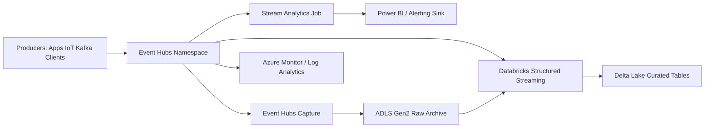
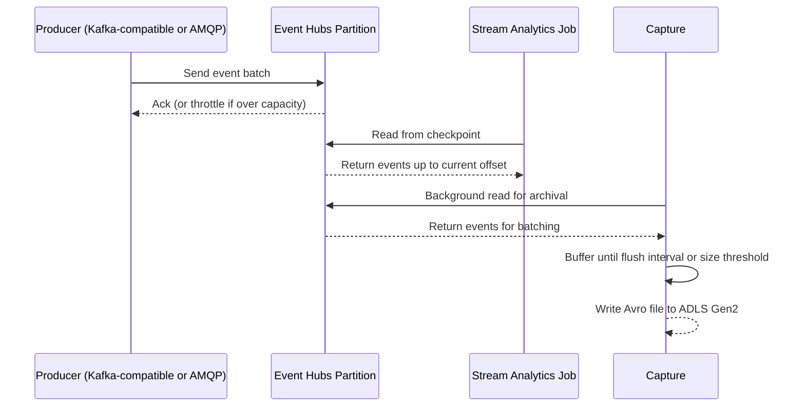
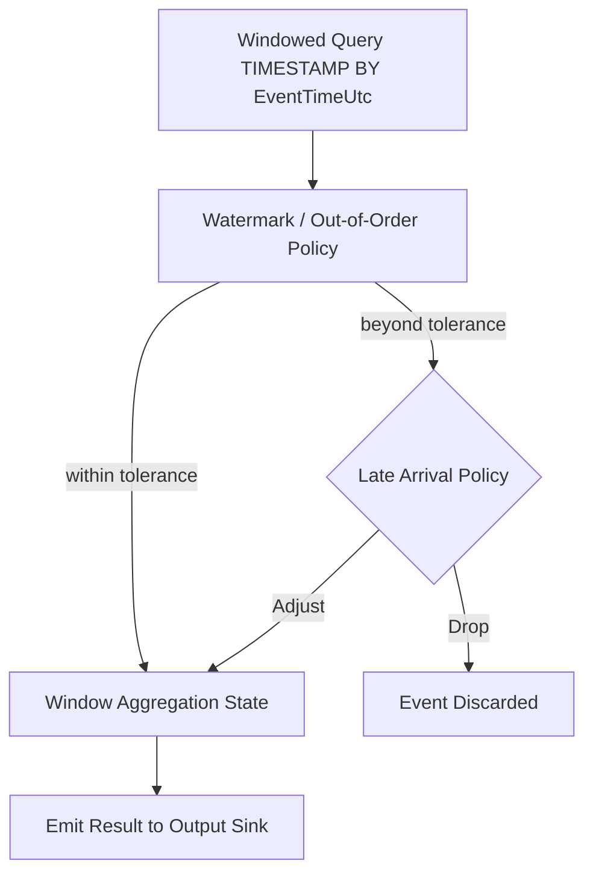

# Azure Event Hubs and Stream Analytics

> Part of the **Enterprise Data & AI Architecture Handbook** · Phase-07 - Streaming & Real-Time Analytics · Chapter 03.
> Estimated study time: **60 min reading + ~4h labs**.
> **Prerequisite:** read [Apache Kafka](02_Apache_Kafka.md) first.

---

## Executive Summary

Azure Event Hubs and Azure Stream Analytics are the managed-PaaS answer to the same architectural problem [Apache Kafka](02_Apache_Kafka.md) solves: a durable, partitioned, replayable event log paired with a way to compute windowed results over it. The difference is not the underlying problem — it is who owns the operational burden. Event Hubs gives an enterprise a Kafka-compatible, partitioned, replicated event log without owning brokers, controllers, or ZooKeeper/KRaft quorums. Stream Analytics gives an enterprise a SQL-based, event-time-aware windowing engine without owning a Spark or Flink cluster. Together they let a team stand up a production streaming pipeline with configuration, not infrastructure.

The architectural nuance that matters at a staff/principal level is that Event Hubs is not "Kafka as a service" in the literal sense — it is a distinct service with its own native protocol (AMQP) that additionally exposes a **Kafka-compatible endpoint** so existing Kafka producers and consumers can talk to it with a configuration change rather than a code rewrite. This compatibility is deep enough for the vast majority of enterprise use cases, but it is not 100% API parity: certain Kafka admin operations, KRaft-specific behaviors, and some client-library edge cases do not map cleanly. Treating Event Hubs as "just Kafka" without validating this is one of the most common Azure streaming migration mistakes.

Stream Analytics' value is narrower and sharper than a general-purpose stream processing engine: it is exceptionally good at expressing tumbling/sliding/hopping/session windowed SQL queries with native `TIMESTAMP BY` event-time semantics and built-in out-of-order/late-arrival policy, deployable in minutes with no cluster to manage. It is not the right tool for arbitrarily complex stateful joins, custom operators, or workloads that outgrow SQL — that is where Azure Databricks Structured Streaming or Apache Flink take over, as covered in later Phase-07 chapters.

The practical Azure-first conclusion: default new managed-ingestion pipelines to Event Hubs with its Kafka-compatible endpoint (validating feature parity against the specific Kafka client behaviors the workload needs, per [Apache Kafka](02_Apache_Kafka.md)), and default lightweight windowed-aggregation processing to Stream Analytics unless the query complexity, state size, or custom-code requirement genuinely exceeds what SQL-based windowing can express. Capture to ADLS Gen2 closes the loop by giving the same durable log a cheap, queryable archival path without a separate ETL pipeline.

## Learning Objectives

By the end of this chapter you will be able to:

1. Explain Event Hubs' partition and throughput-unit (and processing-unit) model and how it maps onto the general Kafka partitioning concepts from [Apache Kafka](02_Apache_Kafka.md).
2. Configure and reason about Event Hubs' Kafka-compatible endpoint, including where it diverges from native Kafka behavior.
3. Write and reason about Stream Analytics windowed queries (tumbling, hopping, sliding, session) with explicit event-time semantics and late-arrival policy.
4. Configure Event Hubs Capture to ADLS Gen2 for cheap, queryable long-term retention without a separate ETL job.
5. Choose correctly between Event Hubs and self-managed/Confluent Kafka on Azure for a given workload's throughput, feature-parity, and operational-ownership constraints.
6. Choose correctly between Stream Analytics and a full stream-processing engine (Databricks Structured Streaming, Flink) for a given query's complexity and state requirements.
7. Diagnose common production failure modes: throughput-unit throttling, Stream Analytics backlog/watermark delay, and Capture file fragmentation.
8. Design end-to-end Azure-native streaming architectures spanning ingestion, processing, Capture archival, and serving.
9. Defend an Event Hubs/Stream Analytics architecture decision, including its cost and scaling model, in a staff-level review.

## Business Motivation

- Enterprises need a durable, managed event backbone without staffing a team to operate broker infrastructure, patch versions, or manage controller/KRaft quorums.
- Existing Kafka client investments (producer/consumer code, Kafka Connect connectors) should be reusable against a managed Azure service without a full rewrite, which is exactly what the Kafka-compatible endpoint enables.
- Business dashboards and operational alerts need low-latency windowed aggregates, and many of those queries are genuinely simple enough to express in SQL rather than justifying a full Spark or Flink cluster.
- Regulatory and analytical requirements often need long-term, queryable retention of raw event history at a materially lower cost than keeping it in premium broker storage indefinitely — Capture to ADLS Gen2 is the direct, low-effort answer.
- FinOps programs need a managed-service cost model (throughput units, processing units) that scales predictably with actual usage rather than requiring capacity planning for self-managed broker clusters.
- Azure-native identity, networking, and monitoring integration (Entra ID, Private Link, Azure Monitor) reduces the security and operational tooling gap that self-managed Kafka on AKS would otherwise require teams to build themselves.

## History and Evolution

- Azure Event Hubs launched as a high-throughput event ingestion service built on Microsoft's internal messaging technology, initially exposed only through its native AMQP protocol and SDKs, well before Kafka dominated the open-source streaming conversation.
- Azure Stream Analytics launched alongside it as a fully managed, SQL-based windowed query engine, aimed at teams that needed real-time aggregation without standing up a Storm or early Spark Streaming cluster.
- As Kafka became the de facto enterprise standard for event streaming (as covered in [Apache Kafka](02_Apache_Kafka.md)), Microsoft added the **Kafka-compatible endpoint** to Event Hubs, letting existing Kafka producer/consumer code and much of the Kafka Connect ecosystem point at Event Hubs with configuration changes rather than a rewrite.
- Event Hubs Capture was introduced to solve the recurring "we also need this raw stream in the data lake" requirement without requiring every team to build a bespoke Kafka Connect sink or custom archival job.
- Premium and Dedicated tiers were introduced to give large enterprises predictable, isolated-tenant throughput and lower per-unit cost at scale, moving beyond the original Basic/Standard throughput-unit model.
- Stream Analytics matured to support more complex windowing (hopping and session windows in addition to tumbling and sliding), user-defined functions, and tighter integration with Power BI for direct real-time dashboarding.
- Current Azure practice treats Event Hubs as the default managed event backbone for most enterprise streaming needs, with Stream Analytics as the default lightweight processing layer and Databricks Structured Streaming as the escalation path for complex, stateful, or high-code-complexity processing.

## Why This Technology Exists

Event Hubs exists because most enterprises do not want to operate broker infrastructure to get the architectural benefits of a durable, partitioned, replayable event log described in [Apache Kafka](02_Apache_Kafka.md). The value of that log — decoupled producers and consumers, replay for reprocessing, elastic parallel consumption — does not require an enterprise to own controller elections, disk capacity planning, or version upgrades. Event Hubs delivers the log as a managed service, and its Kafka-compatible endpoint specifically exists so that the large body of existing Kafka client code, connectors, and institutional knowledge does not have to be discarded to get there.

Stream Analytics exists because a large fraction of real-world streaming queries are genuinely simple: "count events per device per minute," "average temperature per zone per five minutes," "detect a threshold breach within a session." Requiring a Spark or Flink cluster (with its own tuning, checkpointing, and cluster-lifecycle concerns) for queries this shape is architectural overkill. Stream Analytics exists to let that class of query be expressed declaratively in SQL, with event-time and watermark semantics built in as first-class query syntax rather than framework configuration.

Event Hubs Capture exists because "also archive the raw stream to the lake" is such a common secondary requirement that building a bespoke sink for it on every project is wasted effort; Capture makes it a checkbox-level configuration on the Event Hub itself.

## Problems It Solves

| Problem | Event Hubs / Stream Analytics response |
|---|---|
| Need a durable, Kafka-compatible event log without operating brokers | Event Hubs with Kafka-compatible endpoint, fully managed |
| Existing Kafka producer/consumer/Connect investment must be reusable | Kafka-compatible endpoint accepts standard Kafka protocol clients |
| Simple windowed aggregation needed quickly without a cluster | Stream Analytics SQL-based windowed queries with native event-time semantics |
| Raw event history also needed in the data lake for analytics/audit | Event Hubs Capture writes directly to ADLS Gen2 in Avro/Parquet |
| Throughput needs to scale predictably with usage | Throughput units (Standard) or processing units (Premium/Dedicated) as an explicit, billable scaling knob |
| Real-time dashboards need direct, low-latency data feeds | Stream Analytics native Power BI output sink |
| Teams need managed identity and private networking instead of shared keys | Entra ID integration and Private Link support across both services |

## Problems It Cannot Solve

- Event Hubs' Kafka-compatible endpoint does not give 100% Kafka API/administrative parity; workloads relying on specific KRaft internals, certain Kafka admin APIs, or exotic client-library behaviors must be validated explicitly, not assumed compatible.
- Stream Analytics cannot express arbitrarily complex stateful logic, custom operators, machine-learning inference, or large-state joins as gracefully as a general-purpose engine like Databricks Structured Streaming or Flink — pushing it past its natural fit produces unreadable, hard-to-maintain SQL.
- Neither service removes the need for correct event-time and watermark policy design; they provide the mechanism, but the lateness bound and windowing choice are still business decisions, as established in [Apache Kafka](02_Apache_Kafka.md) and its own prerequisite chapter.
- Event Hubs Capture is not a substitute for a governed lakehouse ingestion pattern; captured Avro files still need a downstream Bronze-to-Silver transformation step to become genuinely useful curated data.
- Neither service eliminates the need for schema governance; Event Hubs' Schema Registry integration must still be deliberately adopted and enforced, not assumed automatic.
- Throughput units and processing units do not auto-scale limitlessly; under-provisioning still throttles producers, and capacity planning remains a real, ongoing operational responsibility.

## Core Concepts

### 8.1 Event Hubs partitions and throughput/processing units

An Event Hub, like a Kafka topic, is split into **partitions**, each an ordered, append-only sequence of events — the same partitioning and per-partition-ordering model covered generally in [Apache Kafka](02_Apache_Kafka.md). Partition count is fixed at creation time for the Standard tier (though it can be increased later at the cost of hash-distribution changes for existing keys, mirroring Kafka's own partition-growth caveat) and more flexible under Premium/Dedicated. Throughput is governed by **throughput units** (Standard tier: each unit provides a fixed ingress/egress capacity, roughly 1 MB/s in and 2 MB/s out) or **processing units** (Premium tier: a more powerful, isolated-capacity unit) or **capacity units** (Dedicated tier: single-tenant, highest-scale isolation). Exceeding provisioned throughput results in `ServerBusy`/throttling responses to producers, not silent data loss — but a producer that does not handle throttling with retry/backoff can experience effective loss if it drops on error.

### 8.2 Kafka protocol compatibility

Event Hubs exposes a **Kafka-compatible endpoint** (port 9093, using the Kafka wire protocol over TLS) alongside its native AMQP endpoint. Existing Kafka producer, consumer, and Kafka Connect code can point at this endpoint by changing `bootstrap.servers` and authentication configuration (typically SASL/OAuth with Entra ID, or SASL/plain with a connection-string-derived credential), without changing application logic. Compatibility covers the core produce/consume/consumer-group protocol well, but administrative operations (some topic-management APIs), certain Kafka version-specific features, and KRaft-specific behaviors are not fully equivalent — a fact that must be validated against the specific client library and feature set a workload depends on, not assumed by default.

### 8.3 Stream Analytics jobs and windowed queries

A Stream Analytics **job** binds one or more inputs (Event Hubs, IoT Hub, Blob/ADLS), a SQL-like query, and one or more outputs (ADLS/Blob, SQL, Cosmos DB, Power BI, Service Bus, another Event Hub). The query language extends SQL with `TIMESTAMP BY` to declare the event-time field explicitly and windowing functions — `TumblingWindow`, `HoppingWindow`, `SlidingWindow`, and `SessionWindow` — that map directly onto the tumbling, sliding, and session window concepts from [Streaming Fundamentals](01_Streaming_Fundamentals.md), with hopping windows as an additional named variant (a sliding window with a fixed hop size rather than per-event recomputation). Out-of-order and late-arrival tolerance is configured per job as an explicit policy (`Adjust` or `Drop`), which is Stream Analytics' concrete expression of the watermark-lateness-bound concept.

### 8.4 Event Hubs Capture

**Capture** is a per-Event-Hub feature that automatically writes a copy of the raw event stream to Azure Blob Storage or ADLS Gen2 in Avro (or Parquet, depending on configuration) format, batched by a configurable time or size interval, with no code to write or cluster to run. It is designed for archival, audit, and downstream batch/lakehouse ingestion, not for low-latency serving — Capture files land with the batching interval's inherent delay (commonly minutes), which is an acceptable trade-off for its intended use case but wrong for anything expecting sub-second freshness.

### 8.5 Event Hubs versus Kafka on Azure: the real decision axis

The decision between Event Hubs (managed, Kafka-compatible) and self-managed Kafka on AKS or Confluent Cloud on Azure (full Kafka feature parity) is not "which is better" in the abstract — it is a specific trade between operational ownership and feature completeness, as introduced in [Apache Kafka](02_Apache_Kafka.md)'s ADR. Event Hubs wins for the majority of enterprise ingestion workloads because it removes broker/controller operations entirely. Self-managed Kafka or Confluent Cloud wins only where a documented feature gap exists: full Kafka transactional semantics with Kafka Streams, specific Connect plugins unavailable against Event Hubs, or KRaft-specific administrative behavior the workload genuinely depends on.

## Internal Working

### 9.1 How Event Hubs handles a write under the native protocol

A producer sends an event batch via AMQP (or the Kafka-compatible endpoint) targeting a partition (directly, by partition key hash, or round-robin if no key is specified). The service durably persists and replicates the batch internally (Event Hubs manages replication transparently; there is no user-configurable `acks`/ISR knob as in raw Kafka — durability is a property of the managed service tier) before acknowledging the send. Consumers use the AMQP-based `EventProcessorClient` (or a Kafka consumer against the compatible endpoint) to read from a partition starting at a checkpointed offset, with checkpoints typically stored in an associated Blob Storage container.

### 9.2 How throughput-unit throttling actually manifests

When ingress or egress exceeds the provisioned throughput/processing units, the service returns a throttling error (`ServerBusyException` or a Kafka-protocol equivalent throttling response) rather than silently queuing indefinitely or dropping data. A well-built producer implements retry with backoff against this signal; a producer that treats any error as fatal and drops the event effectively turns a throttling condition into data loss, which is a client-side bug, not a service-side data-loss event.

### 9.3 How Stream Analytics evaluates a windowed query

Stream Analytics ingests events from its configured input, applies the `TIMESTAMP BY` clause to extract event time, and internally maintains windowed aggregation state per key exactly as described generally in [Streaming Fundamentals](01_Streaming_Fundamentals.md)'s Internal Working section — buffering state until the job's configured out-of-order tolerance window has elapsed, then emitting the window's result and evicting the corresponding state. Jobs can be scaled by increasing **Streaming Units (SUs)**, which increase available compute and memory for query execution; a query that cannot be sufficiently partitioned (for example, due to a `PARTITION BY` clause that does not align with the input's partition key) cannot scale beyond a single-node execution path regardless of SUs provisioned.

### 9.4 How Capture batches and writes files

Capture accumulates events per partition in memory until either a configured time interval (for example, 5 minutes) or size threshold (for example, 300 MB) is reached, then flushes a single Avro (or Parquet) file per partition to the configured Blob/ADLS destination, using a path template that typically includes namespace, Event Hub name, partition ID, and a date/time-based folder structure. Very low-traffic partitions can produce many small files if the time-based flush interval fires frequently relative to actual event volume — a small-file problem directly analogous to the columnar storage small-file anti-pattern, requiring compaction in a downstream Bronze-to-Silver step.

## Architecture

### 10.1 Azure-first reference architecture

The canonical pattern places producers (applications, IoT devices, Kafka Connect source connectors) writing into an Event Hubs namespace (Standard, Premium, or Dedicated tier based on throughput and isolation needs), with Stream Analytics jobs consuming directly for lightweight windowed aggregation feeding Power BI dashboards or operational alerting, while Event Hubs Capture simultaneously and independently archives the raw stream to ADLS Gen2 for downstream Bronze-to-Silver lakehouse processing (typically via Azure Databricks). Azure Monitor and Log Analytics observe throughput-unit utilization, Stream Analytics watermark/backlog metrics, and Capture file landing health across the pipeline.

### 10.2 Why the architecture works

This architecture separates concerns cleanly: Event Hubs is the single durable ingestion point, Stream Analytics handles the low-latency serving path without needing a cluster, and Capture handles the archival/lakehouse path without needing a bespoke sink — all from the same underlying event stream, consumed independently, echoing the decoupled-consumer principle from [Apache Kafka](02_Apache_Kafka.md). No single consumer's processing speed or failure affects any other consumer, because each reads from the durable log at its own pace using its own checkpoint.

### 10.3 ADR example: use Stream Analytics for the operational alerting path, Databricks Structured Streaming for the curated lakehouse path, both fed by the same Event Hub

**Context:** A device-telemetry platform needs both a low-latency operational alert (threshold breach within 1 minute) and a curated, deduplicated, joined dataset feeding the enterprise lakehouse. Building both requirements into a single processing engine risks either over-engineering the simple alert path or under-powering the complex curated path.

**Decision:** Use a single Event Hub as the durable ingestion point. Attach a Stream Analytics job for the low-latency threshold-alert path (a simple tumbling-window query with a tight watermark, output to an alerting sink). Attach a separate Azure Databricks Structured Streaming job, consuming the same Event Hub independently, for the curated lakehouse path requiring joins, deduplication, and Delta Lake merge writes.

**Consequences:** Each consumer scales, fails, and is tuned independently without affecting the other; the alerting path remains simple and cheap to operate, while the curated path gets the full expressiveness it needs. The trade-off is running two separate consumers against the same Event Hub, which is a small additional operational surface but avoids forcing one engine to do a job it is not well suited for.

**Alternatives considered:**

1. Single Databricks Structured Streaming job producing both outputs: rejected because it couples the low-latency alert path's availability and tuning to the more complex curated pipeline's development cadence.
2. Single Stream Analytics job attempting the full curated transformation: rejected because Stream Analytics' SQL model does not gracefully express the joins and deduplication logic the curated path needs.
3. Two separate Event Hubs (one per consumer): rejected because it duplicates ingestion and loses the single-source-of-truth benefit of one durable log feeding both paths.

## Components

| Component | Role | Typical configuration | Common failure mode |
|---|---|---|---|
| Event Hubs namespace | Logical container for one or more Event Hubs, billing/scaling boundary | Standard/Premium/Dedicated tier, throughput/processing/capacity units | wrong tier chosen for isolation or throughput needs |
| Event Hub (topic) | Partitioned, durable, replayable event log | Partition count set at creation, retention period | too few partitions limiting consumer parallelism |
| Kafka-compatible endpoint | Protocol-compatible access for existing Kafka clients | Port 9093, SASL/OAuth with Entra ID | assuming full Kafka admin-API parity without validation |
| Consumer group | Independent, isolated read cursor over an Event Hub | One per logically distinct downstream consumer | too many active consumer groups exceeding tier limits (Standard) |
| Stream Analytics job | Windowed SQL query engine over one or more inputs | Streaming Units sized to query complexity/partitioning | non-partitionable query capping scale-out regardless of SUs |
| Capture | Automatic archival of raw events to Blob/ADLS | Time/size-based flush interval, Avro/Parquet format | small-file accumulation on low-traffic partitions |
| Schema Registry (Event Hubs) | Schema governance for producers/consumers | Avro schema with compatibility mode | compatibility mode left permissive |
| Checkpoint store | Durable consumer offset tracking | Associated Blob Storage container | checkpoint store not provisioned with adequate throughput for many consumers |

## Metadata

| Metadata class | What to record | Why it matters |
|---|---|---|
| Namespace/tier metadata | tier (Standard/Premium/Dedicated), throughput/processing units, region | governs cost and scaling ceiling |
| Event Hub configuration metadata | partition count, retention period, Capture settings | governs ordering, replay window, and archival behavior |
| Consumer group metadata | name, owning team/service, checkpoint location | prevents orphaned or conflicting consumer groups |
| Stream Analytics job metadata | input/output bindings, query text, SU allocation, watermark/late-arrival policy | makes windowing and lateness decisions auditable |
| Schema metadata | schema version, compatibility mode, owning team | prevents undocumented breaking changes to shared Event Hubs |
| Capture output metadata | destination path template, file format, flush interval | governs downstream Bronze-layer ingestion design |
| Operational metadata | throttled-request count, Stream Analytics watermark delay/backlog, Capture file landing lag | first-class pipeline health signals |

## Storage

| Storage concern | Recommended posture | Notes |
|---|---|---|
| Event Hub retention | size to cover the realistic reprocessing/backfill window (1-7 days Standard, longer on Premium/Dedicated) | replay is the backbone of reprocessing, as established in [Apache Kafka](02_Apache_Kafka.md) |
| Capture destination storage | ADLS Gen2 with lifecycle management to tier cold Capture files to cool/archive storage | Capture is meant for durable, cheap long-term retention, not hot serving |
| Capture file sizing | tune flush interval/size threshold to avoid excessive small files on low-traffic partitions | small Avro files degrade downstream Spark/lakehouse read performance |
| Checkpoint store | provision the associated Blob Storage container with adequate throughput for the consumer group's checkpoint frequency | undersized checkpoint storage can itself become a bottleneck under many consumers |
| Schema Registry storage | governed, versioned schema storage tied to Event Hubs namespace | keeps schema history auditable alongside event data |

## Compute

| Workload class | Best Azure-first surface | Why it fits | Wrong default |
|---|---|---|---|
| Simple, low-code windowed aggregation | Azure Stream Analytics | SQL-based, no cluster to manage, native event-time/watermark syntax | reaching for Databricks for a trivial single-stream tumbling count |
| Complex, stateful, multi-stream processing | Azure Databricks Structured Streaming | full programmatic expressiveness, arbitrary joins, Delta Lake-native sinks | forcing complex logic into unreadable Stream Analytics SQL |
| Existing Kafka client/connector investment | Event Hubs Kafka-compatible endpoint | reuse producer/consumer/Connect code with configuration changes only | assuming zero validation is needed before cutover |
| Archival and lakehouse ingestion of raw events | Event Hubs Capture to ADLS Gen2 | zero-code, automatic, cost-efficient archival | building a bespoke Kafka Connect sink for a need Capture already covers |

## Networking

- Use Private Link/Private Endpoint for Event Hubs namespaces to keep producer and consumer traffic off the public internet.
- Co-locate Event Hubs, Stream Analytics jobs, and Databricks clusters in the same Azure region to minimize network-induced event-time-to-processing-time skew, consistent with the general guidance in [Streaming Fundamentals](01_Streaming_Fundamentals.md).
- Plan Kafka-compatible endpoint connectivity (port 9093) through the same private networking posture as the native AMQP endpoint; do not leave one exposed publicly while locking down the other.
- Size throughput/processing units with network egress in mind when multiple consumer groups (Stream Analytics, Databricks, Capture) all read the same Event Hub concurrently, since egress is billed and capacity-limited per unit.
- Monitor Capture's write traffic to ADLS Gen2 as a distinct network/throughput concern from the primary ingestion and consumption paths.

## Security

| Concern | Recommended control |
|---|---|
| Producer/consumer authentication | Entra ID managed identities (native AMQP and Kafka-compatible SASL/OAuth) instead of shared access signature keys |
| Authorization | Azure RBAC roles (Event Hubs Data Sender/Receiver/Owner) scoped per namespace or Event Hub |
| In-transit encryption | TLS enforced on both native and Kafka-compatible endpoints |
| At-rest encryption | Platform-managed or customer-managed keys for Event Hubs and Capture destination storage |
| Network isolation | Private Link/Private Endpoint, disabling public network access where feasible |
| Schema/data sensitivity | Classify and mask/tokenize sensitive fields before they enter shared Event Hubs consumed by many teams |
| Stream Analytics job identity | Managed identity for job input/output authentication instead of embedded connection strings |

## Performance

- Size throughput units (Standard) or processing/capacity units (Premium/Dedicated) to the realistic peak ingress/egress, not steady-state average, and monitor throttled-request metrics continuously.
- Ensure Stream Analytics queries include a `PARTITION BY` aligned with the input's partition key wherever possible, since fully partitioned queries scale near-linearly with SUs while non-partitionable queries cap out on a single execution path.
- Tune Capture's flush interval and size threshold to balance archival latency against small-file accumulation.
- Monitor consumer group checkpoint lag (via the associated Blob Storage container or native metrics) as the Event Hubs equivalent of Kafka consumer lag.
- Prefer Premium/Dedicated tiers when isolation from other tenants' noisy-neighbor throughput variance is required for latency-sensitive workloads.

| Pattern | Recommendation | Why |
|---|---|---|
| High-volume IoT telemetry | Higher partition count, Premium/Dedicated tier, partitioned Stream Analytics query | favors sustained throughput and predictable latency |
| Lightweight operational alerting | Standard tier, small tumbling-window Stream Analytics job | favors cost efficiency for a simple, low-volume query |
| Curated lakehouse ingestion | Databricks Structured Streaming consumer, Capture for archival in parallel | favors expressiveness and idempotent Delta writes over SQL-only processing |
| Multi-consumer fan-out | Distinct consumer groups per downstream system, sized throughput units for aggregate egress | avoids one consumer's throughput starving another |

## Scalability

- Scale Event Hubs partition count to the maximum realistic consumer parallelism needed across all consumer groups, since parallelism is bounded by partition count exactly as in raw Kafka.
- Scale Standard-tier throughput units, or move to Premium/Dedicated, as sustained ingress/egress approaches provisioned capacity; auto-inflate (Standard tier) can absorb short-term bursts but should not substitute for right-sized baseline capacity.
- Scale Stream Analytics jobs by increasing Streaming Units, but only after confirming the query is fully partitionable; otherwise, additional SUs do not improve throughput.
- Revisit consumer group design as new downstream systems are added; each independent consumer should get its own consumer group rather than sharing one across unrelated systems.
- For very high-scale multi-region ingestion, consider multiple Event Hubs namespaces per region with a documented aggregation or federation strategy rather than a single global namespace.

## Fault Tolerance

- Event Hubs' managed replication protects against underlying infrastructure failures without user-configurable ISR settings; durability is a property of the chosen tier and region redundancy configuration (zone-redundant where available).
- Stream Analytics jobs support checkpointing internally and can be configured to resume from the last processed point after a job restart; test this deliberately rather than assuming it "just works."
- Consumer applications (including Kafka-compatible clients) must implement checkpoint/commit logic correctly to avoid skipping or reprocessing events on restart, exactly as covered generally in [Apache Kafka](02_Apache_Kafka.md).
- Capture is designed to be resilient to transient storage-write failures with internal retry, but sustained ADLS Gen2 unavailability will cause Capture backlog to grow, which should be monitored explicitly.
- Design multi-region DR by evaluating Event Hubs' geo-disaster-recovery (metadata-only failover, not automatic data replication) against the business's actual RPO/RTO requirements, since it does not replicate event data across regions automatically.

## Cost Optimization

- Right-size throughput units/processing units to actual sustained demand, using auto-inflate only for genuine burst absorption rather than as a substitute for correct baseline sizing.
- Prefer Standard tier for moderate, predictable workloads and reserve Premium/Dedicated for workloads that genuinely need isolation, higher partition counts, or higher per-unit throughput.
- Tune Capture's flush interval to balance ADLS Gen2 write/storage cost against small-file downstream query cost.
- Consolidate consumer groups sensibly; excessive unused consumer groups on Standard tier count against tier limits without providing value.
- Monitor Stream Analytics SU utilization; an over-provisioned non-partitionable query wastes SUs that cannot actually be used in parallel.

Worked FinOps example: consider an IoT telemetry Event Hub provisioned with 20 throughput units sized for an anticipated device rollout that a delayed program has not yet reached, costing a materially higher monthly bill in illustrative pricing than the current actual ingress requires. Right-sizing to the current measured throughput (with auto-inflate enabled to absorb the eventual rollout ramp) reduces the current monthly bill substantially while preserving headroom for growth. Similarly, a Stream Analytics job provisioned with excess Streaming Units for a query with a `PARTITION BY` clause that does not match the input's partition key wastes most of that capacity, since the query cannot execute in parallel regardless of SUs assigned — the fix is aligning the query's partitioning before adding compute, not simply reducing SUs and risking a real throughput shortfall. The lesson generalizes: Event Hubs/Stream Analytics cost problems are frequently a mismatch between configuration (partition alignment, tier choice) and actual workload shape, not a need for more or less capacity in the abstract.

## Monitoring

| Metric | Why it matters | Typical threshold |
|---|---|---|
| Throttled requests (Event Hubs) | direct signal of insufficient throughput/processing units | alert on any sustained non-zero rate |
| Incoming/outgoing bytes and messages | tracks actual utilization against provisioned capacity | review against tier ceiling regularly |
| Consumer group checkpoint lag | Event Hubs equivalent of consumer lag | alert on sustained growth |
| Stream Analytics watermark/backlog metrics (SU utilization, output events, runtime errors) | signals whether the job is keeping pace with input | alert on rising backlog or repeated runtime errors |
| Capture file landing lag | signals whether archival is keeping pace with ingestion | investigate sustained delay beyond configured flush interval |
| Schema Registry validation failures | signals producer/consumer schema drift attempts | review any rejected writes |

## Observability

Observability for an Event Hubs/Stream Analytics pipeline should answer: is any consumer being throttled or falling behind, is the Stream Analytics job's watermark keeping pace with real time, is Capture landing files without excessive delay or fragmentation, and what changed recently in tier, partition, or query configuration.

- correlate throttled-request events with producer-side retry/backoff behavior to distinguish a capacity problem from a client-side bug,
- capture Stream Analytics job diagnostic logs (including late-arrival and out-of-order event counts) as a first-class metric, not just an internal job detail,
- track Capture file size/count distribution per partition to catch small-file accumulation early,
- preserve namespace/tier/partition-count configuration history alongside performance telemetry so a review can correlate configuration changes with observed behavior shifts.

### Operational response playbooks

| Signal | Detection query or rule | Likely cause | First remediation |
|---|---|---|---|
| Producers receiving sustained throttling errors | Throttled-request metric rises against provisioned throughput/processing units | under-provisioned units for current sustained load | increase throughput/processing units, or enable/adjust auto-inflate, and verify producer retry/backoff logic |
| Stream Analytics job backlog grows | SU utilization near 100 percent with rising output latency | non-partitioned query capping scale-out, or genuinely under-provisioned SUs | align `PARTITION BY` with input partition key, then scale SUs if still needed |
| Capture files accumulate as many small files | Average file size per partition falls well below expected batch size | flush interval too short relative to per-partition traffic | increase flush interval or size threshold, and add a downstream compaction step for existing small files |

## Governance

- Require every Event Hubs namespace and Stream Analytics job to document tier, partition count, retention, watermark/late-arrival policy, and consumer group ownership as reviewed metadata.
- Treat changes to partition count, tier, and Stream Analytics windowing/watermark configuration as reviewed architectural changes, since they affect ordering, durability, and downstream correctness guarantees.
- Enforce Schema Registry compatibility mode for any Event Hub with more than one consuming team.
- Track consumer group ownership centrally to avoid orphaned or conflicting consumer groups on shared namespaces.
- Align Event Hubs/Stream Analytics governance with the broader data governance process so Capture-archived event schemas are cataloged alongside batch/warehouse schemas.

## Trade-offs

| Choice | Advantages | Disadvantages | When to prefer it |
|---|---|---|---|
| Event Hubs (native or Kafka-compatible) | Fully managed, no broker operations, native Azure integration | Not 100% Kafka feature/admin-API parity | Most enterprise managed-ingestion workloads |
| Self-managed Kafka on AKS / Confluent Cloud | Full Kafka feature parity | Higher operational ownership or vendor cost | Documented feature-parity needs (Kafka Streams, specific Connect plugins) |
| Stream Analytics | No cluster to manage, fast to build, native windowing/watermark SQL | Limited expressiveness for complex stateful logic | Simple to moderate windowed aggregation queries |
| Databricks Structured Streaming | Full programmatic expressiveness, complex joins, Delta-native sinks | Requires cluster management and more engineering effort | Complex, stateful, or high-code-complexity processing |
| Capture to ADLS Gen2 | Zero-code archival, cost-efficient long-term retention | Not low-latency; introduces flush-interval delay | Audit, backfill, and lakehouse ingestion needs |
| Standard tier | Lower cost for moderate, shared-tenant workloads | Less isolation, lower per-unit ceiling | Predictable, moderate-throughput workloads |
| Premium/Dedicated tier | Higher throughput ceiling, tenant isolation | Higher cost | High-throughput or latency-sensitive, isolation-requiring workloads |

## Decision Matrix

| Requirement | Event Hubs | Self-managed/Confluent Kafka | Stream Analytics | Databricks Structured Streaming |
|---|---|---|---|---|
| Lowest operational burden | strong | weak | strong | medium |
| Full Kafka feature parity | medium | strong | n/a | n/a |
| Simple windowed SQL aggregation | n/a | n/a | strong | medium |
| Complex stateful/joined processing | n/a | n/a | weak | strong |
| Native Azure identity/networking integration | strong | medium | strong | strong |
| Predictable managed cost model | strong | medium | strong | medium |

Use this matrix as a starting filter; the final choice still depends on the specific throughput, query complexity, and operational-ownership constraints of the workload.

## Design Patterns

1. **Dual-consumer fan-out pattern:** attach both a lightweight Stream Analytics alerting job and a complex Databricks Structured Streaming curation job to the same Event Hub via separate consumer groups.
2. **Capture-for-archival pattern:** enable Capture on every production Event Hub by default as the low-effort archival and backfill safety net, independent of the primary processing path.
3. **Kafka-compatible lift-and-shift pattern:** migrate existing Kafka producer/consumer/Connect code to Event Hubs by changing only `bootstrap.servers` and authentication configuration, after validating feature-parity requirements explicitly.
4. **Partitioned-query pattern:** always align Stream Analytics `PARTITION BY` clauses with the input Event Hub's partition key to preserve linear SU scalability.
5. **Schema-Registry-gated Event Hub pattern:** enforce compatibility mode on any Event Hub with more than one consuming team, mirroring the Kafka pattern from [Apache Kafka](02_Apache_Kafka.md).
6. **Tiered-escalation pattern:** start new streaming workloads on Stream Analytics; escalate to Databricks Structured Streaming only when the query genuinely outgrows SQL-based windowing.

## Anti-patterns

- Assuming Event Hubs' Kafka-compatible endpoint is 100% equivalent to native Kafka without validating the specific client/admin-API behaviors the workload depends on.
- Writing a Stream Analytics query whose `PARTITION BY` does not match the input's partition key, then adding Streaming Units expecting proportional throughput improvement.
- Leaving Capture's flush interval at an aggressive default for a low-traffic partition, silently accumulating many small archival files.
- Treating Capture as a substitute for a governed lakehouse Bronze-to-Silver pipeline instead of as its raw input.
- Sizing throughput units for average load and being surprised by sustained throttling during predictable peak periods.
- Forcing genuinely complex, multi-join, high-code-complexity logic into Stream Analytics SQL because "it's already running" rather than escalating to Databricks Structured Streaming.

## Common Mistakes

- Not implementing producer-side retry/backoff against Event Hubs throttling responses, turning a capacity signal into effective data loss.
- Forgetting that Standard-tier partition count is effectively fixed at creation and planning growth reactively instead of proactively.
- Confusing Capture's archival latency with the low-latency serving path and routing a latency-sensitive use case to Capture output by mistake.
- Leaving Schema Registry compatibility mode permissive on a shared, multi-consumer Event Hub.
- Ignoring Stream Analytics runtime errors and late-arrival/out-of-order event counts until a business user notices incorrect aggregates.
- Choosing Premium/Dedicated tier "to be safe" for a workload that Standard tier would serve adequately at much lower cost.

## Best Practices

- default to Event Hubs for managed ingestion and validate Kafka-compatible endpoint feature parity explicitly before treating it as a drop-in Kafka replacement,
- enable Capture by default on production Event Hubs as a low-effort archival and reprocessing safety net,
- align Stream Analytics `PARTITION BY` with input partition keys to preserve scalability,
- escalate to Databricks Structured Streaming (or Flink) once a Stream Analytics query's complexity genuinely exceeds SQL's natural expressiveness,
- monitor throttled requests, consumer group checkpoint lag, Stream Analytics backlog, and Capture file landing lag as first-class production health signals,
- enforce Schema Registry compatibility mode on any multi-consumer Event Hub,
- document tier, partition count, retention, and watermark/late-arrival policy as reviewed metadata, not tribal knowledge.

## Enterprise Recommendations

1. Default new managed-ingestion pipelines to Azure Event Hubs; reserve self-managed Kafka or Confluent Cloud for documented, validated feature-parity gaps.
2. Default new lightweight windowed-aggregation processing to Stream Analytics; escalate to Databricks Structured Streaming only when query complexity genuinely requires it.
3. Enable Capture on every production Event Hub as a standard, low-effort archival practice.
4. Require Schema Registry compatibility enforcement for any Event Hub with more than one consuming team.
5. Require throttled-request rate, consumer group lag, Stream Analytics backlog, and Capture landing lag as standard dashboard metrics for every production pipeline.
6. Treat tier, partition count, and windowing/watermark configuration changes as reviewed architectural changes, not routine tuning.
7. Validate Kafka-compatible endpoint behavior explicitly against the specific client libraries and Connect plugins a migrating workload depends on before cutover.
8. Publish a documented capacity-review cadence for throughput/processing units and Stream Analytics SUs tied to actual measured usage.

## Azure Implementation

### 31.1 Recommended Azure service map

| Layer | Preferred Azure service | Notes |
|---|---|---|
| Managed durable event log | Azure Event Hubs (Standard/Premium/Dedicated) | native AMQP plus Kafka-compatible endpoint |
| Lightweight windowed processing | Azure Stream Analytics | SQL-based, no cluster, native event-time semantics |
| Complex stateful processing | Azure Databricks Structured Streaming | escalation path for logic beyond SQL |
| Archival and lakehouse ingestion | Event Hubs Capture to ADLS Gen2 | zero-code, automatic raw event archival |
| Real-time dashboards | Stream Analytics native Power BI output | direct low-latency dashboard feed |
| Monitoring | Azure Monitor, Log Analytics | throttling, backlog, and Capture lag telemetry |

### 31.2 Example: Event Hubs namespace and hub with Capture enabled (Bicep)

```bicep
param location string = resourceGroup().location

resource ehNamespace 'Microsoft.EventHub/namespaces@2023-01-01-preview' = {
  name: 'evhns-edai-telemetry-prod'
  location: location
  sku: {
    name: 'Standard'
    tier: 'Standard'
    capacity: 6
  }
  properties: {
    kafkaEnabled: true
    isAutoInflateEnabled: true
    maximumThroughputUnits: 12
  }
}

resource telemetryHub 'Microsoft.EventHub/namespaces/eventhubs@2023-01-01-preview' = {
  parent: ehNamespace
  name: 'device-telemetry'
  properties: {
    partitionCount: 16
    messageRetentionInDays: 3
    captureDescription: {
      enabled: true
      encoding: 'Avro'
      intervalInSeconds: 300
      sizeLimitInBytes: 314572800
      destination: {
        name: 'EventHubArchive.AzureBlockBlob'
        properties: {
          storageAccountResourceId: adlsAccountId
          blobContainer: 'eventhub-capture'
          archiveNameFormat: '{Namespace}/{EventHub}/{PartitionId}/{Year}/{Month}/{Day}/{Hour}/{Minute}/{Second}'
        }
      }
    }
  }
}
```

### 31.3 Example Stream Analytics windowed query with explicit event-time and late-arrival handling

```sql
SELECT
    DeviceId,
    ZoneId,
    System.Timestamp() AS WindowEndUtc,
    AVG(Temperature) AS AvgTemperature,
    COUNT(*) AS ReadingCount
INTO
    [output-zone-alerts]
FROM
    [input-device-telemetry] TIMESTAMP BY EventTimeUtc OVER (PARTITION BY DeviceId)
GROUP BY
    DeviceId,
    ZoneId,
    TumblingWindow(minute, 1)
```

### 31.4 Example Kafka-compatible producer configuration pointing at Event Hubs (Java-style properties)

```properties
bootstrap.servers=evhns-edai-telemetry-prod.servicebus.windows.net:9093
security.protocol=SASL_SSL
sasl.mechanism=OAUTHBEARER
sasl.jaas.config=org.apache.kafka.common.security.oauthbearer.OAuthBearerLoginModule required;
sasl.login.callback.handler.class=com.microsoft.azure.eventhubs.kafka.OAuthLoginCallbackHandler

acks=all
enable.idempotence=true
```

This mirrors the producer configuration pattern established in [Apache Kafka](02_Apache_Kafka.md); only `bootstrap.servers` and the SASL/OAuth authentication block change to target Event Hubs instead of a native Kafka cluster.

### 31.5 Example Azure CLI for Stream Analytics job and Capture verification

```bash
az eventhubs namespace create --resource-group rg-edai-streaming-prod --name evhns-edai-telemetry-prod --sku Standard --capacity 6 --enable-auto-inflate --maximum-throughput-units 12

az eventhubs eventhub create --resource-group rg-edai-streaming-prod --namespace-name evhns-edai-telemetry-prod --name device-telemetry --partition-count 16 --message-retention 3

az eventhubs eventhub update --resource-group rg-edai-streaming-prod --namespace-name evhns-edai-telemetry-prod --name device-telemetry --enable-capture true --capture-interval 300 --capture-size-limit 314572800 --archive-name-format "{Namespace}/{EventHub}/{PartitionId}/{Year}/{Month}/{Day}/{Hour}/{Minute}/{Second}"

az stream-analytics job show --resource-group rg-edai-streaming-prod --name asa-zone-alerts --query "jobState"
```

### 31.6 Practical Azure guidance

- Use Standard tier with auto-inflate for moderate, growing workloads; move to Premium/Dedicated once isolation or sustained high throughput justifies the cost.
- Validate the Kafka-compatible endpoint against the specific Kafka client library version and Connect plugins in use before treating a migration as complete.
- Enable Capture by default; the incremental cost is low relative to the reprocessing/audit safety net it provides.
- Escalate from Stream Analytics to Databricks Structured Streaming as soon as a query requires joins across more than a couple of streams, user-defined aggregation logic beyond built-in functions, or large stateful lookups.

## Open Source Implementation

Since this chapter is inherently Azure-native, the open-source comparison is framed around the equivalent capability set using the Kafka ecosystem already covered in [Apache Kafka](02_Apache_Kafka.md), plus open-source stream-processing engines that substitute for Stream Analytics.

| Layer | Open-source choice | Notes |
|---|---|---|
| Durable event log | Apache Kafka (self-managed on AKS, or via Strimzi) | direct open-source substitute for Event Hubs' log role |
| Lightweight SQL-based stream processing | ksqlDB | closest open-source analogue to Stream Analytics' SQL-based windowing model |
| Complex stateful stream processing | Apache Flink or Spark Structured Streaming | substitute for the Databricks Structured Streaming escalation path |
| Archival to object storage | Kafka Connect sink connector to MinIO/ADLS-compatible storage | substitute for Event Hubs Capture |
| Schema governance | Confluent Schema Registry or Apicurio Registry | substitute for Event Hubs' Schema Registry integration |
| Observability | Prometheus, Grafana, OpenTelemetry | substitute for Azure Monitor/Log Analytics telemetry |

Example ksqlDB tumbling-window query, structurally comparable to the Stream Analytics query above:

```sql
CREATE TABLE zone_alerts AS
SELECT
    device_id,
    zone_id,
    AVG(temperature) AS avg_temperature,
    COUNT(*) AS reading_count
FROM device_telemetry
WINDOW TUMBLING (SIZE 1 MINUTE)
GROUP BY device_id, zone_id
EMIT CHANGES;
```

This reinforces the same three decisions emphasized throughout this chapter and [Apache Kafka](02_Apache_Kafka.md): an explicit event-time/windowing choice, an explicit partition/key alignment, and an explicit durability and schema governance posture — expressed here against a self-managed Kafka/ksqlDB stack instead of managed Azure services.

## AWS Equivalent (comparison only)

| Azure pattern | AWS equivalent | Advantages | Disadvantages | Migration note |
|---|---|---|---|---|
| Azure Event Hubs | Amazon Kinesis Data Streams (native) or Amazon MSK (Kafka-native) | mature managed ingestion options | different partition/shard scaling model; MSK is closer to raw Kafka than Event Hubs' compatible endpoint | re-validate partition/shard mapping and consumer semantics before cutover |
| Azure Stream Analytics | Amazon Kinesis Data Analytics (SQL or Flink-based) | comparable managed windowed SQL/Flink processing | different watermark/out-of-order configuration semantics | re-test late-data and watermark behavior; do not assume identical defaults |
| Event Hubs Capture | Kinesis Data Firehose | comparable managed archival-to-storage capability | different format/partitioning conventions for archived files | re-validate downstream Bronze-layer ingestion path against new file layout |

## GCP Equivalent (comparison only)

| Azure pattern | GCP equivalent | Advantages | Disadvantages | Migration note |
|---|---|---|---|---|
| Azure Event Hubs | Google Cloud Pub/Sub or Managed Service for Apache Kafka | strong managed pub/sub or native Kafka ingestion | Pub/Sub lacks Kafka-style partition-ordering guarantees by default | re-validate ordering guarantees before migrating event-time-sensitive pipelines |
| Azure Stream Analytics | Google Cloud Dataflow | first-class unified batch/streaming model with explicit triggers | steeper conceptual learning curve for SQL-only teams | strong conceptual fit given Dataflow's role as the model this handbook's streaming vocabulary is built on |
| Event Hubs Capture | Dataflow sink to Cloud Storage, or Pub/Sub-to-GCS subscription | comparable managed archival pattern | different file layout and batching semantics | re-validate downstream ingestion path against new file layout |

## Migration Considerations

- When migrating from self-managed Kafka to Event Hubs, first validate the Kafka-compatible endpoint against the specific client library, Connect plugins, and admin operations the workload depends on, rather than assuming full parity.
- Preserve dual-running capability (old Kafka cluster and new Event Hubs namespace both receiving traffic, or a bridge/mirroring approach) during the migration window to validate behavior before final cutover.
- Re-verify Stream Analytics query behavior (especially watermark/late-arrival policy) against the same representative traffic used to validate the original pipeline's correctness before decommissioning the old processing path.
- When migrating from a bespoke archival job to Capture, validate the new file format/partitioning layout against downstream Bronze-layer ingestion logic before switching over.
- Budget for a reconciliation period comparing event counts and windowed aggregate results between old and new pipelines before decommissioning the source.

## Mermaid Architecture Diagrams







## End-to-End Data Flow

1. A producer (native AMQP client, or a Kafka-compatible client per [Apache Kafka](02_Apache_Kafka.md)) sends an event batch to an Event Hubs partition, optionally validated against a governed schema.
2. Event Hubs durably persists and replicates the batch internally, acknowledging the producer or returning a throttling response if provisioned capacity is exceeded.
3. A Stream Analytics job, subscribed via its own consumer group, reads events, extracts event time via `TIMESTAMP BY`, and maintains windowed aggregation state per key.
4. The job's out-of-order/late-arrival policy determines whether late events adjust an existing window or are dropped, mirroring the watermark and late-data policy concepts from [Streaming Fundamentals](01_Streaming_Fundamentals.md).
5. Once the window's tolerance window has elapsed, the job emits the aggregate result to its configured output sink (Power BI, SQL, another Event Hub, or Service Bus).
6. Independently, Event Hubs Capture reads the same partitions via its own internal mechanism, batching events by time or size threshold into Avro files written to ADLS Gen2.
7. A downstream Databricks Bronze-to-Silver job periodically compacts and curates the captured raw files into governed lakehouse tables.
8. Azure Monitor and Log Analytics collect throttling, consumer lag, Stream Analytics backlog, and Capture landing-lag telemetry across the entire pipeline for ongoing observability.

## Real-world Business Use Cases

| Use case | Why Event Hubs/Stream Analytics fits | Typical configuration choice |
|---|---|---|
| IoT device telemetry and threshold alerting | Managed, high-throughput ingestion with low-latency SQL-based alerting | Premium tier, tumbling-window Stream Analytics query |
| Existing Kafka application migration to managed PaaS | Kafka-compatible endpoint enables reuse of existing client code | Standard/Premium tier, validated Kafka client compatibility |
| Real-time operational dashboards | Native Power BI output sink for low-latency visualization | Stream Analytics job with hopping/sliding window |
| Regulatory audit and long-term raw event retention | Zero-code archival to a cheap, queryable store | Capture to ADLS Gen2 with lifecycle-managed tiering |
| Multi-team internal event backbone | Shared, governed ingestion point avoiding N-squared integrations | Schema Registry enforced, per-team consumer groups |

## Industry Examples

| Industry | Common Event Hubs/Stream Analytics workload | Frequent tuning focus | Common pitfall |
|---|---|---|---|
| Manufacturing / IoT | sensor telemetry, predictive maintenance alerts | partition alignment, throughput-unit sizing | non-partitioned Stream Analytics query capping scale-out |
| Retail / e-commerce | clickstream ingestion, real-time inventory | Capture for analytics, Stream Analytics for dashboards | small-file accumulation on low-traffic partitions |
| Banking / payments | transaction event ingestion, fraud alerting | Premium tier isolation, tight watermark policy | assuming Kafka-compatible endpoint has full admin-API parity |
| Logistics | shipment tracking event ingestion | Capture-driven lakehouse ingestion, consumer group design | orphaned consumer groups from decommissioned integrations |
| Media / gaming | engagement event ingestion, live leaderboards | Stream Analytics session windows, SU scaling | forcing complex join logic into unreadable Stream Analytics SQL |

## Case Studies

### Case study 1: Kafka migration assumed full parity and broke a Connect plugin

A logistics company migrated an existing Kafka-based shipment-tracking pipeline to Event Hubs' Kafka-compatible endpoint, changing only `bootstrap.servers` and authentication configuration. The migration broke a specific Kafka Connect sink plugin that relied on an administrative API not fully supported by the compatible endpoint, causing silent connector failures that were not caught until a downstream dashboard went stale.

The fix replaced the affected connector with a supported Event Hubs-native integration path and added an explicit pre-migration compatibility validation checklist for future migrations. The lesson was that "Kafka-compatible" is a strong but not unconditional guarantee, and every specific client/connector dependency must be validated before cutover, not assumed.

### Case study 2: non-partitioned Stream Analytics query capped at low throughput despite added SUs

A manufacturing IoT platform's Stream Analytics job used a `GROUP BY` without a matching `PARTITION BY`, and the team responded to growing backlog by repeatedly increasing Streaming Units, with no improvement. The query's execution plan could not be parallelized because its logical partitioning did not align with the input Event Hub's physical partitions, so extra SUs sat idle.

The fix restructured the query to explicitly partition by the input's partition key, after which throughput scaled near-linearly with SUs as expected. The lesson was that Stream Analytics scalability is a function of query structure, not just provisioned compute, mirroring the general principle that adding capacity cannot fix a structural bottleneck.

### Case study 3: Capture small-file accumulation degraded downstream lakehouse performance

A retail analytics team enabled Capture with an aggressive 1-minute flush interval on a moderately low-traffic Event Hub partition, intending fast archival freshness. Over months, this produced a very large number of small Avro files per day, and the downstream Databricks Bronze-to-Silver job's read performance degraded significantly due to file-listing and small-file read overhead.

The fix increased the flush interval to a size-driven threshold better matched to actual traffic volume and added a periodic compaction job for the historical small files already accumulated. The lesson was that Capture's convenience does not remove the need to think about downstream file-layout consequences, echoing the general columnar-storage small-file anti-pattern.

## Hands-on Labs

1. **Kafka-compatible migration lab:** point an existing Kafka producer/consumer application at an Event Hubs Kafka-compatible endpoint, and document any behavioral differences observed against native Kafka.
2. **Windowed query lab:** build a Stream Analytics job with a tumbling window and deliberately test its out-of-order/late-arrival policy under both `Adjust` and `Drop` configurations.
3. **Partition-alignment lab:** compare throughput scaling of a Stream Analytics query with and without a `PARTITION BY` clause matching the input's partition key as Streaming Units are increased.
4. **Capture-to-lakehouse lab:** enable Capture on a test Event Hub, tune the flush interval against a simulated traffic pattern, and build a downstream compaction job for the resulting Avro files.

Acceptance criteria:

- the migration lab documents at least one concrete behavioral difference (or confirms full parity) for the specific client/connector tested,
- the windowed query lab demonstrates the measurable difference between `Adjust` and `Drop` late-arrival handling,
- the partition-alignment lab shows a measurable throughput scaling difference between the aligned and misaligned query,
- the Capture lab produces evidence of the flush-interval-versus-file-count trade-off and a working compaction remediation.

## Exercises

1. Explain the difference between Event Hubs' native AMQP endpoint and its Kafka-compatible endpoint.
2. Describe what happens to a producer when it exceeds provisioned throughput units.
3. Explain why a Stream Analytics query's `PARTITION BY` clause affects its scalability with Streaming Units.
4. Compare Event Hubs Capture with a bespoke Kafka Connect sink for archival purposes.
5. Decide when a workload justifies escalating from Stream Analytics to Databricks Structured Streaming.
6. Explain the trade-off between Standard, Premium, and Dedicated Event Hubs tiers.
7. Design a consumer group strategy for a scenario with three independent downstream systems reading the same Event Hub.
8. Explain how [Apache Kafka](02_Apache_Kafka.md)'s partitioning and ISR concepts map (or do not map) onto Event Hubs' architecture.
9. Identify at least two anti-patterns from this chapter present in a hypothetical existing Event Hubs deployment and propose fixes.
10. Explain why Capture's flush interval is both a latency and a small-file-management decision.

## Mini Projects

1. **Managed ingestion backbone project:** provision an Event Hubs namespace with justified tier, partition count, and Capture configuration for a simulated IoT telemetry workload.
2. **Dual-consumer processing project:** attach both a Stream Analytics alerting job and a Databricks Structured Streaming curation job to the same Event Hub via separate consumer groups.
3. **Kafka-to-Event-Hubs migration project:** migrate a small existing Kafka producer/consumer application to Event Hubs' Kafka-compatible endpoint and document a validated compatibility checklist.

## Capstone Integration

This chapter operationalizes the general streaming and Kafka concepts from earlier Phase-07 chapters onto Azure's managed PaaS surface.

- Use [Streaming Fundamentals](01_Streaming_Fundamentals.md) for the underlying event-time, windowing, and delivery-semantics vocabulary that Stream Analytics queries and Event Hubs consumers must implement correctly.
- Use [Apache Kafka](02_Apache_Kafka.md) for the general partitioning, replication, consumer-group, and exactly-once reasoning that Event Hubs' Kafka-compatible endpoint specializes for a managed-service context.
- Apply the dual-consumer, tiered-escalation pattern established here when studying Apache Flink and Spark Structured Streaming later in Phase-07, both of which serve as the escalation path from Stream Analytics for complex processing.
- Carry the Capture-to-lakehouse archival pattern into Change Data Capture and later lakehouse ingestion design across the handbook.

## Interview Questions

1. What is the difference between Event Hubs' native AMQP endpoint and its Kafka-compatible endpoint?
2. What are throughput units, and what happens when a producer exceeds them?
3. How does Stream Analytics express event-time semantics in its query syntax?
4. What is Event Hubs Capture, and what is it best suited for?
5. When would you choose Stream Analytics over Databricks Structured Streaming, and vice versa?
6. Why does a Stream Analytics query's partitioning affect its ability to scale with Streaming Units?
7. What is the difference between Standard, Premium, and Dedicated Event Hubs tiers?
8. What validation should precede a Kafka-to-Event-Hubs migration?

## Staff Engineer Questions

1. How would you decide whether a new streaming workload should use Event Hubs or self-managed/Confluent Kafka?
2. How would you design a capacity-review process for throughput units and Stream Analytics SUs tied to actual measured usage rather than static provisioning?
3. What validation checklist would you require before approving a Kafka-to-Event-Hubs migration as complete?
4. How would you decide when a Stream Analytics query has outgrown SQL and should escalate to Databricks Structured Streaming?
5. How would you design Capture's flush interval and downstream compaction strategy for a workload with highly variable per-partition traffic?
6. What telemetry would you require before signing off on a production Event Hubs/Stream Analytics pipeline's resilience?

## Architect Questions

1. Where should Event Hubs and Stream Analytics sit relative to self-managed Kafka, Databricks Structured Streaming, and Flink in the enterprise reference architecture?
2. How do you decide which workloads justify Premium/Dedicated tier isolation versus Standard tier with auto-inflate?
3. How would you govern schema evolution consistently across Event Hubs' Schema Registry and the broader enterprise data catalog?
4. What migration strategy would you design for a large multi-team Kafka estate moving to Event Hubs without breaking existing consumers?
5. How do you ensure Capture-archived data feeds a governed lakehouse Bronze-to-Silver pipeline rather than becoming an ungoverned data swamp?

## CTO Review Questions

1. Which business-critical pipelines depend on Event Hubs or Stream Analytics configuration that has not been explicitly reviewed for durability, scaling, or watermark correctness?
2. How much of current Event Hubs/Stream Analytics spend is driven by misaligned query partitioning or oversized tiers rather than genuine workload need?
3. Which Kafka-to-Event-Hubs migrations were completed without a documented feature-parity validation, and what residual risk do they carry?
4. What governance mechanism ensures Event Hubs schema, partition, and tier configuration remain documented and reviewable as teams change?
5. How will the enterprise measure whether its Azure-managed streaming investment is reducing operational burden compared to the self-managed alternative it replaced?

## References

- Internal prerequisite chapters:
- [Apache Kafka](02_Apache_Kafka.md)
- [Streaming Fundamentals](01_Streaming_Fundamentals.md)
- Canonical sources to study separately:
- Microsoft documentation for Azure Event Hubs (throughput units, Kafka-compatible endpoint, Capture, Schema Registry).
- Microsoft documentation for Azure Stream Analytics (windowing functions, query language, scaling with Streaming Units).
- Confluent documentation on Kafka client compatibility considerations for non-Kafka-native brokers.
- Apache Kafka documentation for baseline protocol and client behavior comparison.

## Further Reading

- Revisit [Apache Kafka](02_Apache_Kafka.md) to deepen the general partitioning, replication, and exactly-once model that Event Hubs' Kafka-compatible endpoint specializes.
- Revisit [Streaming Fundamentals](01_Streaming_Fundamentals.md) to reconnect Stream Analytics' windowing syntax to the underlying event-time and watermark vocabulary.
- Study Azure Well-Architected Framework guidance on Event Hubs and Stream Analytics reliability and cost optimization pillars.
- Preview the upcoming Apache Flink and Spark Structured Streaming chapters to see the escalation path from Stream Analytics for complex stateful processing.
- Study real production incident post-mortems involving Kafka-compatible migration gaps or Stream Analytics partitioning mismatches to build intuition for how these configuration decisions actually fail in practice.
