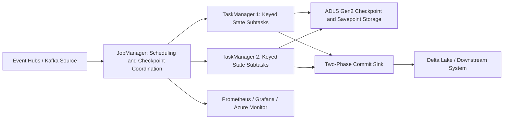
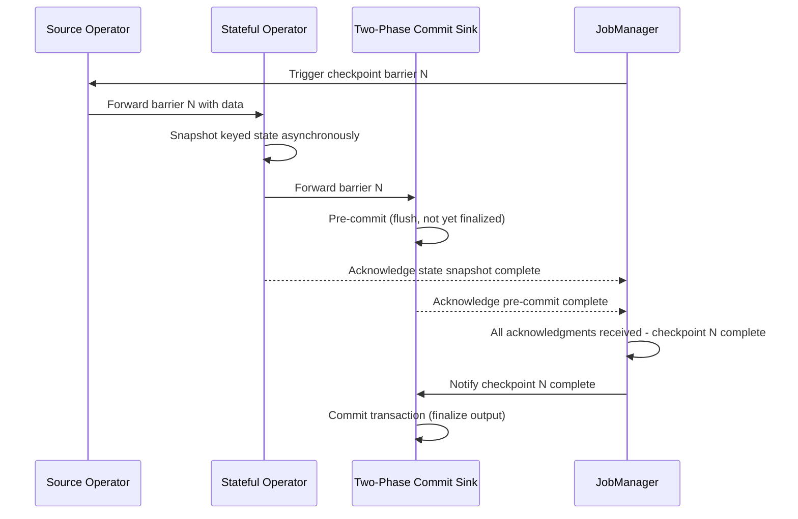
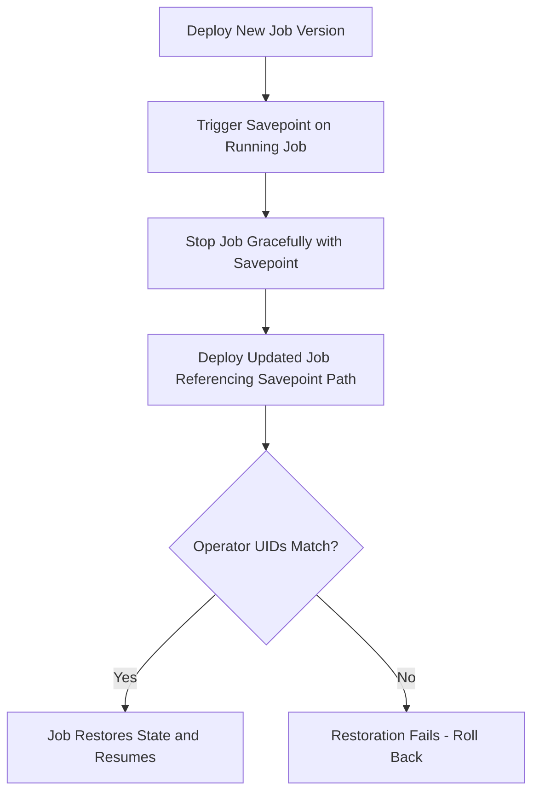

# Apache Flink

> Part of the **Enterprise Data & AI Architecture Handbook** · Phase-07 - Streaming & Real-Time Analytics · Chapter 04.
> Estimated study time: **75 min reading + ~5h labs**.
> **Prerequisite:** read [Streaming Fundamentals](01_Streaming_Fundamentals.md) first.

---

## Executive Summary

Apache Flink is the reference implementation of **true streaming** execution: a dataflow engine that processes each event as it arrives, maintains large amounts of keyed operator state durably and efficiently, and achieves exactly-once end-to-end semantics through a distributed snapshotting protocol rather than through micro-batch boundaries. Where Stream Analytics (covered in [Azure Event Hubs and Stream Analytics](03_Azure_Event_Hubs_and_Stream_Analytics.md)) is deliberately narrow — SQL-based windowing for simple aggregation — Flink is deliberately broad: a general-purpose dataflow programming model capable of expressing arbitrary stateful operators, complex event processing, large keyed joins, and machine-learning feature pipelines, all with native event-time semantics built into the runtime rather than bolted onto a batch engine.

The architectural idea that makes Flink distinctive is the **Chandy-Lamport-inspired asynchronous barrier snapshotting** protocol underlying checkpointing. Rather than pausing the entire dataflow to take a consistent snapshot, Flink injects lightweight **checkpoint barriers** into the data streams themselves; operators snapshot their state as barriers pass through, without stopping event processing on unrelated paths. This is what lets Flink deliver exactly-once state consistency and, combined with two-phase commit sinks, exactly-once *output* delivery, at production-scale throughput and low latency — a materially different mechanism from Spark Structured Streaming's micro-batch-based checkpointing, and the central technical comparison this chapter draws out explicitly.

Flink's state model is equally central: operators can hold arbitrarily large **keyed state** (not just small in-memory aggregates) backed by a pluggable **state backend** — in-memory for small/fast workloads, or RocksDB-backed and spillable to disk for state that exceeds available memory, with incremental checkpointing to keep snapshot cost proportional to the delta rather than the full state size. This state model is what makes Flink suitable for genuinely stateful applications — large keyed joins, long-running session tracking, complex event pattern detection (CEP) — that Stream Analytics's SQL model or a naive streaming approach cannot express or scale to.

The practical, Azure-first conclusion: escalate from Stream Analytics to Flink (or to Azure Databricks Structured Streaming, its closest Azure-native alternative) precisely when a workload needs true low-latency per-event processing, very large keyed state, complex custom operators, or event-pattern (CEP) detection that SQL cannot express gracefully. On Azure, this typically means Flink self-managed on AKS, HDInsight on AKS with Flink, or a managed Flink offering, weighed carefully against Databricks Structured Streaming's lower operational burden and tighter Delta Lake integration — a trade-off this chapter treats as a first-class architectural decision, not an afterthought.

## Learning Objectives

By the end of this chapter you will be able to:

1. Explain Flink's dataflow model — sources, transformations, sinks, and the operator graph — and how it differs from a micro-batch execution model.
2. Reason about Flink's keyed state, state backends (HashMap, RocksDB), and incremental checkpointing.
3. Explain the asynchronous barrier snapshotting protocol underlying checkpointing and how it enables exactly-once state consistency without stopping the world.
4. Distinguish checkpoints from savepoints and use each correctly for failure recovery versus planned upgrades/migrations.
5. Implement exactly-once output delivery using Flink's two-phase commit sink protocol, and explain precisely what it guarantees and what it requires of the sink.
6. Compare Flink's true-streaming execution model against Spark Structured Streaming's micro-batch model on latency, state handling, and operational characteristics.
7. Map Flink deployment options onto Azure (AKS, HDInsight) and compare against Azure Databricks Structured Streaming as the Azure-native alternative.
8. Diagnose common production failure modes: checkpoint timeout/backpressure, state skew, and savepoint incompatibility across version upgrades.
9. Design a Flink job's parallelism, state backend, and checkpoint interval for a concrete stateful streaming workload.
10. Defend a Flink adoption decision (versus Stream Analytics or Databricks Structured Streaming) in a staff-level architecture review.

## Business Motivation

- Fraud detection, real-time risk scoring, and complex event pattern detection need per-event, low-latency processing that a micro-batch engine's inherent batch-interval latency floor cannot match.
- Large-scale session tracking, entity deduplication, and stateful joins over high-cardinality keys need a state backend that scales beyond available cluster memory, which requires a purpose-built, spillable, incrementally checkpointed state store.
- Complex event processing (detecting ordered or correlated sequences of events, such as "three failed logins followed by a password reset within 10 minutes") requires expressive pattern-matching operators that SQL-based windowing cannot naturally express.
- Enterprises running mission-critical streaming pipelines need genuine exactly-once output guarantees with fast recovery from failure, not an approximate or best-effort guarantee.
- Platform teams need the ability to upgrade application code, rescale parallelism, or migrate infrastructure without losing accumulated state or reprocessing from scratch — this is exactly what savepoints exist to provide.
- Choosing between Flink and Spark Structured Streaming (or Stream Analytics) has material cost and staffing consequences; getting the choice wrong either overpays for expressiveness never used or under-delivers on a genuine low-latency, large-state requirement.

## History and Evolution

- Flink originated from the Stratosphere research project at TU Berlin and became an Apache top-level project in 2014, initially positioned as a batch and streaming unification engine with streaming as its more distinctive contribution.
- Flink's designers built it around a true dataflow/streaming-first execution model from the start, in contrast to Spark's original batch-first architecture that later added Structured Streaming as a micro-batch layer on top.
- The asynchronous barrier snapshotting mechanism, based on the Chandy-Lamport distributed snapshot algorithm, was a foundational design choice that distinguished Flink's checkpointing from stop-the-world snapshot approaches used elsewhere.
- Flink's state backend evolution — from simple in-memory state to RocksDB-backed state with incremental checkpointing — was driven directly by production demands for state sizes that exceeded available cluster memory in large enterprise deployments (notably at companies like Alibaba, Netflix, and Uber).
- The introduction of savepoints formalized the distinction between failure-recovery checkpoints (frequent, lightweight, tied to a specific job version) and operator-triggered, portable snapshots usable for planned upgrades, rescaling, and migrations.
- Flink's Table API and SQL layer matured to let a growing share of use cases be expressed declaratively, narrowing (but not eliminating) the gap with SQL-first engines like Stream Analytics or ksqlDB for simpler queries.
- Two-phase commit sinks (and later, more standardized sink APIs) formalized how Flink extends exactly-once guarantees beyond its own state into external systems such as Kafka, filesystems, and JDBC-compatible databases.
- Managed Flink offerings emerged across major clouds (Amazon Managed Service for Apache Flink, and growing options on Azure via HDInsight and AKS-based deployments) to reduce the operational burden of running Flink's JobManager/TaskManager cluster topology.

## Why This Technology Exists

Flink exists because a meaningful class of streaming workloads cannot be adequately served by micro-batch execution or SQL-only windowing. Micro-batch engines introduce an inherent latency floor equal to their batch interval; a fraud-detection rule that must fire within tens of milliseconds of a suspicious event cannot rely on an engine whose minimum latency is bound by batch scheduling overhead. True per-event dataflow execution removes that floor, processing each event as it arrives through the operator graph.

Flink also exists because state is often the hardest part of a streaming system, not the windowing logic. Enterprise workloads frequently need to hold state far larger than available memory — millions of active sessions, large deduplication windows, or long-running joins against slowly changing reference data — and need that state to survive failures without an expensive, blocking recovery process. Flink's pluggable, spillable, incrementally checkpointed state backend exists specifically to make this tractable at scale, going well beyond what the windowed aggregation state model described generally in [Streaming Fundamentals](01_Streaming_Fundamentals.md) assumes for simple bounded windows.

Finally, Flink exists because exactly-once is a genuinely hard distributed-systems problem that deserves a first-class runtime mechanism rather than an application-level workaround. The asynchronous barrier snapshotting protocol and two-phase commit sink integration exist to give engineers a durable, verifiable way to achieve the effectively-once outcome discussed generally in [Streaming Fundamentals](01_Streaming_Fundamentals.md), built into the engine's execution model rather than assembled from ad hoc idempotency tricks alone.

## Problems It Solves

| Problem | Flink's response |
|---|---|
| Micro-batch latency floor is too high for true low-latency processing | Per-event dataflow execution with no inherent batch-interval delay |
| State size exceeds available cluster memory | Pluggable, spillable RocksDB state backend with incremental checkpointing |
| Complex, ordered event-pattern detection needed | Native Complex Event Processing (CEP) library with pattern-matching operators |
| Exactly-once output delivery required to external systems | Asynchronous barrier snapshotting plus two-phase commit sink protocol |
| Application upgrades or rescaling must not lose accumulated state | Savepoints as portable, operator-triggered, version-independent snapshots |
| Very large keyed joins or aggregations need efficient partitioned state | Keyed state partitioned by key group, colocated with the operator instance owning that key range |
| Recovery from failure must be fast and not require reprocessing from the beginning | Checkpoint-based recovery resuming from the last consistent snapshot |

## Problems It Cannot Solve

- Flink cannot make a poorly chosen key distribution evenly loaded; state and processing skew from a hot key remain an application-level data-modeling problem, exactly as with Kafka partition skew discussed in [Streaming Fundamentals](01_Streaming_Fundamentals.md)'s prerequisite chapter.
- It does not remove the operational burden of running and tuning a distributed cluster (JobManager/TaskManager topology, checkpoint storage, state backend sizing); this is real, ongoing work that a fully managed SQL-based service like Stream Analytics avoids.
- It cannot guarantee exactly-once delivery to a sink that does not participate in its two-phase commit protocol or is otherwise made idempotent — the system-wide nature of exactly-once from [Streaming Fundamentals](01_Streaming_Fundamentals.md) applies to Flink without exception.
- It is not automatically the right choice for simple windowed aggregation queries; using Flink for a workload Stream Analytics or ksqlDB could express in a few lines of SQL adds unnecessary operational and engineering cost.
- It does not eliminate the need for correct event-time and watermark policy design; Flink provides powerful mechanisms, but the watermark strategy and allowed-lateness bound remain business decisions.
- Savepoints do not automatically remain compatible across arbitrary application code changes; renaming or restructuring stateful operators without care can break savepoint restoration, requiring careful operator UID management.
- It cannot substitute for proper capacity planning; under-provisioned TaskManager parallelism or state-backend I/O will still produce backpressure and checkpoint delays regardless of Flink's architectural sophistication.

## Core Concepts

### 8.1 The dataflow model: sources, transformations, sinks, and the operator graph

A Flink application is expressed as a **dataflow graph**: one or more **sources** (Kafka, Event Hubs, files) feed **transformations** (map, filter, keyBy, window, process functions, joins) that are chained or fanned out into an **operator graph**, terminating in one or more **sinks** (Kafka, files, databases). Flink's runtime deploys this graph across a cluster of **TaskManagers**, splitting each operator into parallel **subtasks** based on configured parallelism, with a **JobManager** coordinating scheduling, checkpointing, and failure recovery. This is a direct, general-purpose realization of the abstract streaming concepts from [Streaming Fundamentals](01_Streaming_Fundamentals.md): event-time extraction, watermark generation, and windowing are all expressed as specific operators within this same graph, not as separate framework concerns.

### 8.2 Keyed state and state backends

Flink's most distinctive capability is **keyed state**: after a `keyBy` operation partitions the stream by key, each parallel subtask can hold arbitrary per-key state (value state, list state, map state, aggregating state) that persists across events for that key, not just within a single window. This state is managed by a pluggable **state backend**: the `HashMapStateBackend` keeps state as Java objects in memory (fast, but bounded by heap size), while the `EmbeddedRocksDBStateBackend` keeps state serialized on local disk via RocksDB (scales far beyond memory, at some serialization/deserialization cost per access), with checkpoints persisted to durable storage (ADLS Gen2, S3, HDFS) regardless of which backend is used for live state.

### 8.3 Checkpointing: asynchronous barrier snapshotting

Flink achieves consistent, distributed snapshots without pausing the entire pipeline by injecting **checkpoint barriers** into the stream at the sources, at a configured interval. As each barrier flows through the operator graph alongside regular data records, an operator snapshots its own state exactly when the barrier arrives on all its input channels (aligning barriers for operators with multiple inputs), then forwards the barrier downstream and resumes normal processing immediately — no global pause is required. Completed operator-state snapshots are asynchronously persisted to durable checkpoint storage; only once every operator has confirmed its snapshot does the JobManager mark the checkpoint complete.

### 8.4 Checkpoints versus savepoints

**Checkpoints** are automatic, frequent, lightweight-as-possible snapshots used purely for failure recovery — they are tied to the running job and are typically not meant for long-term retention or cross-version compatibility. **Savepoints** are manually (or CI/CD-pipeline) triggered, self-contained, portable snapshots explicitly designed to survive application code changes, parallelism changes, and Flink version upgrades, used for planned operations: deploying a new job version, rescaling parallelism, or migrating a job between clusters. Restoring from a savepoint requires operator state to be identified by stable, explicitly assigned **operator UIDs** rather than Flink's default auto-generated identifiers, which is the most common practical pitfall in using savepoints correctly.

### 8.5 Exactly-once and two-phase commit sinks

Building on the asynchronous barrier snapshotting protocol, Flink extends exactly-once guarantees to external sinks through a **two-phase commit protocol**: a sink implementing this pattern (or using Flink's standardized sink API, which many connectors including the Kafka sink implement) opens a pre-commit/transaction scope aligned with checkpoint boundaries, writes data speculatively, and only commits the transaction once the corresponding checkpoint is confirmed complete across the whole job. On recovery from a failure, any in-flight, uncommitted transaction is aborted and replayed from the last completed checkpoint, ensuring the sink never observes duplicate committed output. This mirrors, at the mechanism level, the same system-wide exactly-once discipline introduced generally in [Streaming Fundamentals](01_Streaming_Fundamentals.md), implemented here as a first-class runtime protocol rather than an application-level convention.

### 8.6 Complex Event Processing (CEP)

Flink's CEP library lets applications express pattern-matching queries over ordered, correlated sequences of events — for example, "detect three failed login attempts for the same user within five minutes, followed by a successful login" — using a fluent pattern API rather than hand-rolled stateful operators. This class of problem does not map naturally onto simple tumbling/sliding/session windows and is one of the clearest cases where Flink's expressiveness materially exceeds what a SQL-based windowing engine like Stream Analytics can express cleanly.

### 8.7 Flink versus Spark Structured Streaming

The central architectural distinction is **true streaming versus micro-batch**: Flink processes events individually through a continuously running dataflow graph with per-event latency and asynchronous barrier-based checkpointing, while Spark Structured Streaming executes as a sequence of small batch jobs on a trigger interval, with checkpointing tied to batch completion. This gives Flink a materially lower latency floor and, historically, more mature large-state handling (RocksDB backend with fine-grained incremental checkpointing predates equivalent Spark capability), while Spark Structured Streaming offers a more unified batch/streaming DataFrame API, tighter native Delta Lake integration, and a generally lower operational learning curve for teams already standardized on the Spark/Databricks ecosystem. Neither is universally superior; the correct choice depends on latency requirements, state size and complexity, and existing platform investment.

## Internal Working

### 9.1 How the operator graph executes across a cluster

The JobManager compiles the application's logical dataflow into a physical execution graph, splitting operators into parallel subtasks distributed across TaskManager slots. Data is exchanged between subtasks over the network (for operations requiring repartitioning, such as `keyBy`) or locally (when operators are chained on the same subtask), with backpressure propagating naturally through bounded, credit-based buffers if a downstream operator falls behind — directly analogous to the general backpressure concept introduced in [Streaming Fundamentals](01_Streaming_Fundamentals.md).

### 9.2 How a checkpoint actually completes

The JobManager triggers a checkpoint by instructing source operators to emit a checkpoint barrier alongside the data stream. Each operator, upon receiving the barrier on all input channels (buffering data from channels that deliver the barrier early, in the default aligned-checkpoint mode, or processing through it in unaligned mode for high-backpressure scenarios), synchronously snapshots its local state reference and asynchronously persists it to durable checkpoint storage, then forwards the barrier downstream. Once every operator instance across the entire graph acknowledges a completed snapshot for a given checkpoint ID, the JobManager marks the checkpoint globally complete and records its metadata, making it available as a recovery point.

### 9.3 How failure recovery actually works

Upon a TaskManager or operator failure, the JobManager restarts the affected job (or the whole job, depending on the configured restart strategy) from the most recent successfully completed checkpoint: every operator's state is restored from the checkpoint's persisted snapshot, and sources rewind to the checkpointed input offsets (for replayable sources like Kafka or Event Hubs). This is why recovery time is a function of state size and restore I/O throughput, not of how far back in history the checkpoint was taken — a large RocksDB state backend with incremental checkpointing keeps this bounded even for very large state.

### 9.4 How incremental checkpointing reduces cost

With the RocksDB state backend, Flink can perform **incremental checkpoints**: instead of re-persisting the entire state on every checkpoint, only the changes (new/modified RocksDB SST files) since the last checkpoint are uploaded to durable storage, with the checkpoint referencing both new and previously persisted files. This keeps checkpoint duration and storage-write volume roughly proportional to the rate of state change, not to the total accumulated state size, which is what makes very large stateful applications operationally tractable.

### 9.5 How two-phase commit sinks integrate with checkpoint completion

A sink implementing the two-phase commit pattern begins a new transaction (or equivalent staging mechanism) each time it processes data between checkpoint barriers. When a checkpoint barrier arrives at the sink, it "pre-commits" (flushing data but not yet finalizing the transaction) as part of its own checkpoint snapshot. Only after the JobManager confirms the checkpoint is globally complete does the sink's second phase actually commit the transaction — coordinated via Flink's checkpoint-completion notification callback. If the job fails before a checkpoint completes, the corresponding pre-committed transaction is aborted on recovery, guaranteeing the sink's committed output reflects exactly the state as of the last completed checkpoint.

## Architecture

### 10.1 Azure-first reference architecture

The common Azure pattern runs Flink as a self-managed cluster on AKS (via the Flink Kubernetes Operator) or via HDInsight on AKS with Flink, consuming from Azure Event Hubs (via its Kafka-compatible endpoint, per [Azure Event Hubs and Stream Analytics](03_Azure_Event_Hubs_and_Stream_Analytics.md)) or directly from Kafka, with checkpoints and savepoints persisted to ADLS Gen2 as durable, cost-efficient checkpoint storage. Output sinks typically write to Delta Lake tables (via a Flink Delta connector or an intermediate Kafka topic consumed by a Databricks job), Azure SQL, or back into Event Hubs for downstream consumption. Azure Monitor, Prometheus, and Grafana (via Flink's metrics reporters) provide observability into checkpoint duration, backpressure, and state size.

### 10.2 Why the architecture works

This architecture keeps Flink's operational surface (cluster lifecycle, checkpoint storage, state backend sizing) explicit and owned deliberately by teams that have a genuine need for Flink's expressiveness and low-latency guarantees, while durable, replayable Event Hubs/Kafka upstream and Delta Lake downstream preserve the same decoupled-consumer and idempotent-sink principles established in [Apache Kafka](02_Apache_Kafka.md) and [Streaming Fundamentals](01_Streaming_Fundamentals.md). Checkpoint storage on ADLS Gen2 keeps recovery durable and cost-efficient without requiring a separate, specialized storage system.

### 10.3 ADR example: adopt Flink only for complex event processing and large-keyed-state workloads, default to Databricks Structured Streaming otherwise

**Context:** A platform team is building several new streaming workloads: a simple daily-aggregate dashboard feed, a large-state entity-deduplication pipeline processing hundreds of millions of active keys, and a fraud-detection pipeline requiring ordered multi-event pattern matching within tight time windows. Standardizing on a single engine for all three either overpays for expressiveness the simple workload never needs, or under-delivers on the state scale and CEP expressiveness the complex workloads genuinely require.

**Decision:** Default new streaming workloads to Azure Databricks Structured Streaming given its lower operational burden and native Delta Lake integration. Adopt Apache Flink (self-managed on AKS via the Flink Kubernetes Operator) specifically for the entity-deduplication and fraud-detection pipelines, where large keyed state with incremental checkpointing and native CEP pattern matching provide capability Structured Streaming and Stream Analytics cannot match as cleanly.

**Consequences:** The organization takes on the operational cost of running and tuning a Flink cluster for two specific pipelines with a clear, documented justification, while the majority of streaming workloads remain on the lower-operational-burden Databricks platform. Teams must build Flink operational expertise (checkpoint tuning, state backend sizing, savepoint discipline) as a specialized, smaller-footprint skill rather than a universal one.

**Alternatives considered:**

1. Standardize entirely on Databricks Structured Streaming: rejected because the fraud-detection pipeline's CEP requirements and the deduplication pipeline's state scale are materially harder to express and operate efficiently without Flink's native capabilities.
2. Standardize entirely on Flink for all streaming workloads: rejected because it imposes unnecessary cluster-operations burden on simple workloads that a managed SQL-based service could serve at a fraction of the operational cost.
3. Adopt a fully managed Flink offering to reduce operational burden: considered but deferred pending validation of managed-Flink maturity and cost on Azure relative to self-managed AKS deployment for the specific workloads in question.

## Components

| Component | Role | Typical Azure-first implementation | Common failure mode |
|---|---|---|---|
| JobManager | Coordinates scheduling, checkpointing, and failure recovery | Flink Kubernetes Operator-managed pod on AKS | single JobManager as an unmanaged single point of failure without HA configuration |
| TaskManager | Executes parallel operator subtasks | AKS node pool-backed pods, sized for state and throughput | under-provisioned task slots causing backpressure |
| State backend | Stores keyed operator state | `EmbeddedRocksDBStateBackend` for large state, `HashMapStateBackend` for small/fast state | RocksDB local disk under-provisioned relative to state size |
| Checkpoint storage | Durable persistence for checkpoints/savepoints | ADLS Gen2 | checkpoint storage throughput insufficient for large incremental uploads |
| Source connector | Ingests events, supports replay for recovery | Kafka connector against Event Hubs' Kafka-compatible endpoint | non-replayable or non-checkpoint-aware source breaking exactly-once guarantees |
| Sink connector | Delivers output, ideally via two-phase commit | Delta Lake connector, Kafka sink, JDBC sink | sink not implementing two-phase commit, silently downgrading to at-least-once |
| Flink Kubernetes Operator | Manages Flink job lifecycle on AKS | Deployed via Helm on AKS | operator misconfiguration causing failed job upgrades or lost savepoints |
| Metrics/observability layer | Exposes checkpoint, backpressure, and state metrics | Prometheus reporter, Grafana dashboards, Azure Monitor | checkpoint duration and backpressure not monitored until an incident occurs |

## Metadata

| Metadata class | What to record | Why it matters |
|---|---|---|
| Job configuration metadata | parallelism, checkpoint interval, state backend choice, restart strategy | governs performance, recovery time, and resource sizing |
| Operator UID metadata | explicitly assigned, stable UIDs per stateful operator | required for reliable savepoint restoration across code changes |
| Checkpoint/savepoint metadata | checkpoint ID, storage location, completion status, triggering reason (automatic vs. manual) | supports recovery auditing and rollback decisions |
| State size metadata | per-operator state size trend over time | leading indicator of skew or unbounded state growth |
| Sink transactional metadata | two-phase commit configuration, transaction ID scheme | verifies exactly-once claims are structurally sound |
| Version/upgrade metadata | Flink version, connector versions, savepoint compatibility notes | prevents savepoint restoration failures during upgrades |
| Operational metadata | backpressure indicators, checkpoint duration/failure rate | first-class cluster health signals |

## Storage

| Storage concern | Recommended posture | Notes |
|---|---|---|
| Checkpoint/savepoint storage | ADLS Gen2 with lifecycle policy for retaining a bounded history of savepoints | savepoints intended for long-term retention (rollback points) should be retained deliberately, not auto-expired like routine checkpoints |
| Local state backend storage (RocksDB) | size AKS node-local or attached disk for the largest anticipated per-TaskManager state share | disk exhaustion on a TaskManager is a job-wide risk, not an isolated operator problem |
| Source/sink durable log | Event Hubs or Kafka retention sized for the realistic reprocessing window | consistent with the general replay-for-reprocessing principle from [Streaming Fundamentals](01_Streaming_Fundamentals.md) |
| Output storage | Delta Lake on ADLS Gen2 for curated results, with idempotent merge writes where two-phase commit is unavailable | preserves effectively-once outcomes even for sinks outside Flink's native two-phase commit protocol |

## Compute

| Workload class | Best Azure-first surface | Why it fits | Wrong default |
|---|---|---|---|
| Simple SQL-expressible windowed aggregation | Azure Stream Analytics (per [Azure Event Hubs and Stream Analytics](03_Azure_Event_Hubs_and_Stream_Analytics.md)) | no cluster to manage, fastest time to production | using Flink for a query a few lines of SQL could express |
| Large-scale, moderately complex stateful processing with strong Delta Lake integration needs | Azure Databricks Structured Streaming | lower operational burden, native Delta integration, unified batch/streaming API | defaulting to Flink purely for its reputation without a genuine feature-parity gap |
| Very large keyed state, complex event pattern detection, or lowest possible per-event latency | Apache Flink on AKS (Flink Kubernetes Operator) or HDInsight on AKS | true streaming execution, native CEP, incremental RocksDB checkpointing | running Flink without RocksDB and incremental checkpointing for genuinely large state |
| Managed Flink with reduced operational burden | Evaluate available managed Flink options on Azure against self-managed AKS | reduces cluster-lifecycle ownership | assuming managed-Flink feature parity without validating against workload-specific requirements |

## Networking

- Co-locate Flink TaskManagers, checkpoint storage (ADLS Gen2), and upstream/downstream systems (Event Hubs, Delta Lake) in the same Azure region to minimize checkpoint-upload and event-time-to-processing-time latency.
- Use Private Link/Private Endpoint for ADLS Gen2 checkpoint storage and Event Hubs connectivity from the AKS cluster.
- Size network bandwidth between TaskManagers for `keyBy`-driven network shuffles; a state-heavy job with high repartitioning traffic can saturate node network bandwidth before it saturates CPU.
- Isolate the JobManager's control-plane traffic (scheduling, checkpoint coordination) from the high-volume TaskManager data-plane traffic on separate node pools or network policies where practical.
- Monitor checkpoint-upload network throughput to ADLS Gen2 explicitly, since it directly bounds achievable checkpoint interval for large incremental state.

## Security

| Concern | Recommended control |
|---|---|
| Cluster access | AKS RBAC and Entra ID-integrated authentication for the Kubernetes control plane |
| Source/sink authentication | Managed identities for Event Hubs/ADLS Gen2 access from Flink connectors instead of embedded credentials |
| In-transit encryption | TLS for all connector traffic (Kafka/Event Hubs, ADLS Gen2, Delta Lake) |
| At-rest encryption | Platform-managed or customer-managed keys for checkpoint/savepoint storage and output Delta tables |
| Secrets management | Azure Key Vault integration for connector credentials, not embedded configuration |
| Network isolation | Private endpoints and network policies restricting TaskManager egress to only required destinations |
| Multi-tenancy | Namespace/node-pool isolation per team or workload sharing an AKS cluster |

## Performance

- Size parallelism to match partition count of the source (Event Hubs/Kafka) and the realistic per-subtask throughput ceiling; over-parallelizing beyond source partition count wastes task slots.
- Choose the RocksDB state backend with incremental checkpointing for any workload whose state materially exceeds available heap memory; the `HashMapStateBackend` is faster per-access but caps out at cluster memory.
- Monitor backpressure metrics continuously; sustained backpressure on one operator degrades the entire upstream pipeline, not just the bottlenecked operator.
- Tune checkpoint interval as an explicit latency-versus-recovery-time trade-off: shorter intervals reduce reprocessing on failure but increase checkpoint overhead; longer intervals reduce overhead but increase recovery-time exposure.
- Use unaligned checkpoints for high-backpressure scenarios where aligned checkpoint barriers would otherwise stall behind slow operators, at the cost of slightly larger checkpoint size.

| Pattern | Recommendation | Why |
|---|---|---|
| Fraud/CEP detection | Low parallelism per hot key, RocksDB backend, tight checkpoint interval | favors low latency and fast recovery for correctness-critical decisions |
| Large-scale entity deduplication | RocksDB with incremental checkpointing, moderate checkpoint interval | favors sustainable large-state operation over minimal latency |
| High-throughput telemetry aggregation | Higher parallelism aligned to source partitions, unaligned checkpoints under load | favors throughput and resilience to transient backpressure |
| Two-phase commit sink to Delta Lake | Checkpoint interval aligned to acceptable output-visibility latency | ties output freshness directly to checkpoint cadence |

## Scalability

- Scale TaskManager parallelism up to the source's partition count as the practical ceiling for keyed operators; beyond that, additional parallelism only benefits non-keyed or already-partitioned stages.
- Use the Flink Kubernetes Operator's autoscaling capabilities cautiously for stateful jobs; rescaling a large-keyed-state job requires a savepoint-based redeploy (state repartitioning across a new parallelism), which is not instantaneous.
- Monitor per-key state size distribution to catch skew early; a small number of disproportionately large keys can bottleneck a single subtask regardless of overall cluster parallelism.
- Plan checkpoint storage (ADLS Gen2) throughput scaling alongside TaskManager scaling, since incremental checkpoint upload volume grows with both state size and parallelism.
- Decouple source/sink scaling (Event Hubs partitions, Delta Lake write parallelism) from Flink's own parallelism, but keep them proportionally aligned to avoid one becoming the bottleneck for the other.

## Fault Tolerance

- Asynchronous barrier snapshotting and checkpoint-based recovery are what let a Flink job resume from a recent consistent state after a TaskManager or JobManager failure, without reprocessing from the beginning.
- Configure JobManager high availability (via Kubernetes-native HA or Zookeeper/etcd-backed HA configuration) to avoid a JobManager failure requiring a full job restart from scratch.
- Two-phase commit sinks are what prevent a checkpoint-triggered recovery from producing duplicate committed output at external systems; a non-two-phase-commit sink degrades to at-least-once regardless of Flink's internal guarantee.
- Test failure recovery deliberately: kill a TaskManager under production-like load and verify the job resumes correctly from the last completed checkpoint with no data loss or duplication at the sink.
- Design savepoint-based upgrade procedures and rehearse them; a savepoint restoration failure due to mismatched operator UIDs discovered during a live incident is a preventable, high-severity operational failure.

## Cost Optimization

- Right-size TaskManager parallelism and memory to actual state size and throughput; over-provisioned RocksDB-backed state incurs unnecessary disk and compute cost.
- Use incremental checkpointing to minimize checkpoint storage-write cost for large, slowly changing state, rather than full checkpoints on every interval.
- Retain only a bounded, deliberately chosen history of savepoints rather than accumulating them indefinitely on ADLS Gen2.
- Evaluate managed Flink options against self-managed AKS total cost of ownership, including the engineering time required to operate and tune a self-managed cluster.
- Reserve Flink adoption for workloads with a genuine feature-parity requirement; every workload defaulted to Flink instead of Stream Analytics or Databricks Structured Streaming carries an ongoing operational cost premium.

Worked FinOps example: consider a fraud-detection Flink job on AKS provisioned with a fixed, large node pool sized for Black-Friday-level transaction volume year-round, costing a materially higher monthly compute bill in illustrative pricing than routine off-peak demand requires. Introducing the Flink Kubernetes Operator's autoscaling for the non-stateful preprocessing stages, combined with a documented savepoint-based rescale procedure for the stateful core operators ahead of known peak periods, can reduce the routine monthly bill substantially while preserving a tested path to scale up before the predictable peak. The lesson generalizes: Flink cost problems are frequently a mismatch between static cluster sizing and a workload's actual demand curve, and the first FinOps lever is aligning capacity (and the operational discipline to rescale it) to real demand, not simply shrinking the cluster and risking a peak-period failure.

## Monitoring

| Metric | Why it matters | Typical threshold |
|---|---|---|
| Checkpoint duration and success rate | direct indicator of state-backend health and network/storage throughput | alert on rising duration trend or any failed checkpoint |
| Backpressure indicators per operator | shows which operator is the bottleneck for the whole pipeline | investigate any sustained high-backpressure operator |
| State size per operator/key group | signals skew or unbounded state growth | alert on sustained upward trend or key-level outliers |
| End-to-end latency (event time to sink commit) | ties directly to the business freshness requirement | tie to the workload's documented SLA |
| Restart/failure count | signals job instability | investigate any repeated restart within a short window |
| TaskManager resource utilization (CPU, memory, disk) | capacity planning and skew detection | alert on sustained saturation |

## Observability

Observability for a Flink job should answer: is checkpointing keeping pace with the configured interval, which operator is causing backpressure, is state size growing unexpectedly for any key, and does the sink's committed output actually match the exactly-once guarantee the job claims.

- correlate checkpoint duration with state size and backpressure trends to distinguish a genuine capacity problem from a transient network blip,
- capture savepoint history (trigger reason, size, restoration outcome) as an auditable operational record, not just a one-off manual action,
- track two-phase commit sink transaction commit/abort rates to verify the exactly-once claim holds under real failure conditions, not just in a clean-path test,
- preserve operator UID and job-graph version history alongside checkpoint metadata so a savepoint restoration failure can be diagnosed against a specific code change.

### Operational response playbooks

| Signal | Detection query or rule | Likely cause | First remediation |
|---|---|---|---|
| Checkpoint duration grows steadily | Checkpoint duration metric trending upward against a stable interval configuration | growing state size, under-provisioned checkpoint storage throughput, or backpressure delaying barrier propagation | scale checkpoint storage throughput, investigate backpressure source, or consider unaligned checkpoints |
| Sustained backpressure on one operator | Per-operator backpressure metric elevated while others remain healthy | that operator is under-parallelized, has a skewed key distribution, or calls a slow external system | rescale parallelism for the bottleneck operator, investigate key skew, or optimize/cache the external call |
| Savepoint restoration fails after a deployment | Job fails to start from savepoint with a state-mismatch error | operator UIDs changed or were not explicitly assigned, or incompatible state schema evolution | roll back to the prior job version, assign explicit stable operator UIDs, and re-attempt a clean savepoint-based upgrade |

## Governance

- Require every production Flink job to document parallelism, state backend choice, checkpoint interval, and sink transactional guarantee as reviewed metadata, not only in application code.
- Treat changes to operator UIDs, state schema, and parallelism as reviewed changes requiring an explicit savepoint-compatibility check before deployment.
- Require a documented, tested savepoint-based upgrade procedure before any Flink job is approved for production.
- Track which sinks genuinely implement two-phase commit versus which rely on idempotency alone, and verify the distinction is accurately reflected in the job's documented guarantees.
- Align Flink governance with the broader streaming governance process established in [Apache Kafka](02_Apache_Kafka.md) so schema and durability decisions are consistent across the streaming estate.

## Trade-offs

| Choice | Advantages | Disadvantages | When to prefer it |
|---|---|---|---|
| Apache Flink | True per-event low latency, native CEP, mature large-state handling | Highest operational ownership, steeper learning curve | Large keyed state, complex event pattern detection, tightest latency requirements |
| Azure Databricks Structured Streaming | Lower operational burden, native Delta Lake integration, unified batch/streaming API | Micro-batch latency floor, historically less mature very-large-state handling than Flink | Most stateful streaming workloads without an extreme latency or CEP requirement |
| Azure Stream Analytics | No cluster to manage, fastest time to production | Limited expressiveness, not suited to large state or CEP | Simple, SQL-expressible windowed aggregation |
| RocksDB state backend | Scales beyond memory, incremental checkpointing | Serialization overhead per state access | Large or unbounded-growth keyed state |
| HashMap state backend | Fastest state access | Bounded by heap memory | Small, bounded state with strict latency requirements |
| Aligned checkpoints | Simpler, smaller checkpoint size | Can stall behind backpressure | Low-to-moderate backpressure workloads |
| Unaligned checkpoints | Resilient to backpressure stalls | Larger checkpoint size (in-flight data included) | High-backpressure workloads needing reliable checkpoint completion |

## Decision Matrix

| Requirement | Apache Flink | Databricks Structured Streaming | Stream Analytics |
|---|---|---|---|
| Lowest per-event latency | strong | medium | medium |
| Very large keyed state | strong | medium | weak |
| Complex event pattern detection (CEP) | strong | weak | weak |
| Lowest operational burden | weak | medium | strong |
| Native Delta Lake integration | medium | strong | weak |
| Simple SQL-expressible aggregation | weak | medium | strong |

Use this matrix as a starting filter; the final choice still depends on the specific latency, state-scale, and operational-ownership constraints of the workload.

## Design Patterns

1. **Escalation-only-when-justified pattern:** default new stateful streaming workloads to Databricks Structured Streaming; adopt Flink only where large state, CEP, or tightest latency requirements are documented and genuine.
2. **Explicit operator UID pattern:** assign stable, explicit UIDs to every stateful operator from day one to guarantee reliable savepoint restoration across future code changes.
3. **Incremental-RocksDB-by-default pattern:** default to the RocksDB state backend with incremental checkpointing for any job with meaningfully large or unbounded-growth keyed state.
4. **Two-phase-commit-sink-first pattern:** prefer sinks implementing Flink's two-phase commit protocol; where unavailable, make the sink idempotent (deterministic upsert keys) as the fallback.
5. **Savepoint-gated deployment pattern:** require every production deployment or rescale to go through a tested savepoint-drain-and-restore procedure rather than a bare restart.
6. **CEP-for-pattern-detection pattern:** use Flink's CEP library for genuinely ordered, correlated multi-event detection rather than approximating it with ad hoc windowed state management.

## Anti-patterns

- Adopting Flink for a workload a SQL-based engine (Stream Analytics, ksqlDB) could express and operate at a fraction of the operational cost.
- Leaving operator UIDs auto-generated, then discovering savepoint restoration breaks after a routine code refactor.
- Using the default `HashMapStateBackend` for a workload whose state is known to grow unbounded or beyond available cluster memory.
- Assuming a job is exactly-once end-to-end because Flink's checkpointing succeeded, without verifying the sink actually implements two-phase commit or idempotency.
- Running a single JobManager without high availability configuration, turning a routine JobManager failure into a full job restart.
- Ignoring per-key state size distribution until a single hot key visibly bottlenecks the entire job.

## Common Mistakes

- Setting checkpoint interval far too aggressively, causing checkpoint overhead to dominate and starve actual event processing throughput.
- Confusing checkpoints (automatic, recovery-only) with savepoints (manual, portable, upgrade-oriented) and using the wrong mechanism for a planned migration.
- Forgetting that rescaling a stateful job's parallelism requires a savepoint-based redeploy, not a simple in-place configuration change.
- Deploying a non-idempotent, non-two-phase-commit sink and assuming Flink's internal exactly-once guarantee extends to it automatically.
- Under-provisioning local disk for the RocksDB state backend, causing state-backend I/O failures under real production state growth.
- Choosing aligned checkpoints by default for a workload with known high backpressure, causing checkpoint stalls precisely when recovery capability matters most.

## Best Practices

- default to Databricks Structured Streaming or Stream Analytics unless a documented, genuine need for Flink's large-state, CEP, or lowest-latency capability exists,
- assign explicit, stable operator UIDs to every stateful operator from the start of development,
- use the RocksDB state backend with incremental checkpointing for any meaningfully large or growing keyed state,
- prefer two-phase-commit sinks, and make non-participating sinks idempotent as the documented fallback,
- configure JobManager high availability for any production Flink deployment,
- monitor checkpoint duration, backpressure, and state size distribution as first-class production health signals,
- rehearse savepoint-based upgrade and rescale procedures before relying on them during a real incident or planned migration.

## Enterprise Recommendations

1. Reserve Apache Flink adoption for workloads with a documented, genuine requirement for large keyed state, CEP, or the lowest achievable per-event latency; default other streaming workloads to Databricks Structured Streaming or Stream Analytics.
2. Mandate explicit, stable operator UIDs and a tested savepoint-based upgrade procedure as a production readiness gate for every Flink job.
3. Require RocksDB with incremental checkpointing as the default state backend for any job with non-trivial keyed state.
4. Require documented verification of each sink's exactly-once mechanism (two-phase commit or idempotency) before a job may claim end-to-end exactly-once delivery.
5. Require JobManager high availability configuration for all production Flink deployments.
6. Require checkpoint duration, backpressure, and state-size-distribution metrics as standard dashboard signals for every production Flink job.
7. Treat parallelism, state schema, and operator UID changes as reviewed architectural changes requiring a savepoint-compatibility check.
8. Periodically reassess whether workloads currently on Flink still justify its operational cost as requirements evolve.

## Azure Implementation

### 31.1 Recommended Azure service map

| Layer | Preferred Azure service | Notes |
|---|---|---|
| Flink cluster orchestration | AKS with the Flink Kubernetes Operator, or HDInsight on AKS with Flink | manages JobManager/TaskManager lifecycle declaratively |
| Source/sink event log | Azure Event Hubs (Kafka-compatible endpoint) or self-managed Kafka | consistent with [Apache Kafka](02_Apache_Kafka.md) and [Azure Event Hubs and Stream Analytics](03_Azure_Event_Hubs_and_Stream_Analytics.md) |
| Checkpoint/savepoint storage | ADLS Gen2 | durable, cost-efficient, incremental-checkpoint-friendly storage |
| Curated output | Delta Lake on ADLS Gen2, or Azure SQL | idempotent merge writes as the fallback where two-phase commit is unavailable |
| Monitoring | Prometheus/Grafana (Flink metrics reporter) plus Azure Monitor and Log Analytics | correlate checkpoint, backpressure, and state metrics with platform telemetry |

### 31.2 Example Flink Kubernetes Operator deployment (YAML)

```yaml
apiVersion: flink.apache.org/v1beta1
kind: FlinkDeployment
metadata:
  name: fraud-detection-cep
spec:
  image: myregistry.azurecr.io/flink-fraud-detection:1.4.0
  flinkVersion: v1_18
  flinkConfiguration:
    state.backend: rocksdb
    state.backend.incremental: "true"
    state.checkpoints.dir: abfss://checkpoints@stedaicheckpointsprod.dfs.core.windows.net/fraud-detection-cep
    execution.checkpointing.interval: "30s"
    execution.checkpointing.unaligned.enabled: "true"
    high-availability: kubernetes
    high-availability.storageDir: abfss://ha@stedaicheckpointsprod.dfs.core.windows.net/fraud-detection-cep
  serviceAccount: flink
  jobManager:
    resource:
      memory: "2048m"
      cpu: 1
    replicas: 2
  taskManager:
    resource:
      memory: "4096m"
      cpu: 2
  job:
    jarURI: local:///opt/flink/usrlib/fraud-detection-cep.jar
    parallelism: 12
    upgradeMode: savepoint
    savepointTriggerNonce: 1
```

### 31.3 Example explicit operator UID assignment and RocksDB configuration (Java-style DataStream API)

```java
StreamExecutionEnvironment env = StreamExecutionEnvironment.getExecutionEnvironment();
env.setStateBackend(new EmbeddedRocksDBStateBackend(true)); // incremental checkpointing enabled
env.enableCheckpointing(30_000);
env.getCheckpointConfig().setCheckpointStorage("abfss://checkpoints@stedaicheckpointsprod.dfs.core.windows.net/fraud-detection-cep");
env.getCheckpointConfig().setCheckpointingMode(CheckpointingMode.EXACTLY_ONCE);

DataStream<LoginEvent> loginEvents = env
    .addSource(kafkaSource)
    .uid("login-event-source")
    .name("login-event-source");

DataStream<FraudAlert> alerts = loginEvents
    .keyBy(LoginEvent::getUserId)
    .process(new FailedLoginTrackerFunction())
    .uid("failed-login-tracker")
    .name("failed-login-tracker");
```

### 31.4 Example two-phase commit Delta Lake sink pattern (conceptual, via intermediate Kafka topic and idempotent merge)

```java
alerts
    .keyBy(FraudAlert::getUserId)
    .addSink(new FlinkKafkaProducer<>(
        "fraud-alerts-committed",
        new FraudAlertSerializationSchema(),
        kafkaProps,
        FlinkKafkaProducer.Semantic.EXACTLY_ONCE))
    .uid("fraud-alerts-two-phase-commit-sink")
    .name("fraud-alerts-two-phase-commit-sink");
```

```python
# Downstream Databricks job consuming the committed alerts topic and applying an
# idempotent MERGE, in case a consuming sink cannot itself participate in 2PC.
def upsert_alerts(batch_df, batch_id):
    batch_df.createOrReplaceTempView("updates")
    batch_df.sparkSession.sql("""
        MERGE INTO curated.fraud_alerts AS target
        USING updates AS source
        ON target.alert_id = source.alert_id
        WHEN NOT MATCHED THEN INSERT *
    """)
```

### 31.5 Example Azure CLI for provisioning checkpoint storage and AKS node pool

```bash
az storage account create --name stedaicheckpointsprod --resource-group rg-edai-streaming-prod --sku Standard_ZRS --kind StorageV2 --hierarchical-namespace true

az aks nodepool add --resource-group rg-edai-streaming-prod --cluster-name aks-edai-streaming-prod --name flinktm --node-count 6 --node-vm-size Standard_D8s_v5 --labels workload=flink-taskmanager
```

### 31.6 Practical Azure guidance

- Use the Flink Kubernetes Operator on AKS for declarative job lifecycle management, including savepoint-based upgrades via `upgradeMode: savepoint`.
- Use ADLS Gen2 with zone-redundant storage for checkpoint/savepoint durability; validate upload throughput against the job's incremental checkpoint volume.
- Reserve Flink adoption for workloads matching the enterprise recommendations above; default other workloads to Databricks Structured Streaming or Stream Analytics.
- Integrate Flink's Prometheus metrics reporter with existing Azure Monitor/Grafana dashboards rather than building a separate, disconnected observability stack.

## Open Source Implementation

Flink is itself the open-source reference implementation covered throughout this chapter; this section frames the broader OSS ecosystem context and comparison.

| Layer | Open-source choice | Notes |
|---|---|---|
| Core dataflow engine | Apache Flink | true-streaming execution with asynchronous barrier snapshotting |
| Cluster orchestration | Kubernetes with the Flink Kubernetes Operator | declarative job lifecycle, savepoint-based upgrades |
| State backend | RocksDB (embedded) | scalable, spillable, incrementally checkpointed keyed state |
| Source/sink integration | Kafka connectors, Delta Lake connector, JDBC connectors | many implementing Flink's two-phase commit sink API |
| Comparable micro-batch engine | Apache Spark Structured Streaming | the primary open-source architectural alternative discussed throughout this chapter |
| Observability | Prometheus, Grafana, OpenTelemetry | Flink's native metrics reporter integrates directly |

Example Flink SQL (Table API) for a simpler subset of workloads, illustrating how Flink can also express SQL-based windowing directly, narrowing the gap with Stream Analytics for simpler queries:

```sql
CREATE TABLE device_telemetry (
    device_id STRING,
    temperature DOUBLE,
    event_time_utc TIMESTAMP(3),
    WATERMARK FOR event_time_utc AS event_time_utc - INTERVAL '2' MINUTE
) WITH (
    'connector' = 'kafka',
    'topic' = 'device-telemetry',
    'properties.bootstrap.servers' = 'kafka-broker:9092',
    'format' = 'json'
);

SELECT
    device_id,
    TUMBLE_END(event_time_utc, INTERVAL '1' MINUTE) AS window_end,
    AVG(temperature) AS avg_temperature
FROM device_telemetry
GROUP BY device_id, TUMBLE(event_time_utc, INTERVAL '1' MINUTE);
```

This reinforces that Flink is not exclusively a low-level DataStream API engine; for workloads that fit SQL-based windowing, Flink SQL narrows the practical gap with Stream Analytics while still running on the same true-streaming, checkpointed runtime described throughout this chapter.

## AWS Equivalent (comparison only)

| Azure pattern | AWS equivalent | Advantages | Disadvantages | Migration note |
|---|---|---|---|---|
| Flink on AKS (Flink Kubernetes Operator) | Amazon Managed Service for Apache Flink | fully managed Flink runtime, reduced operational burden | less infrastructure-level control than self-managed AKS | re-validate connector compatibility and state-backend configuration options exposed by the managed service |
| ADLS Gen2 checkpoint storage | Amazon S3 checkpoint storage | comparable durable, cost-efficient object storage | different consistency and throughput characteristics for incremental checkpoint uploads | benchmark checkpoint upload throughput before assuming parity |
| Delta Lake sink on ADLS Gen2 | Delta Lake or Iceberg sink on S3 | comparable lakehouse table format options | ecosystem tooling and managed integration differ | revalidate connector maturity for the chosen table format on AWS |

## GCP Equivalent (comparison only)

| Azure pattern | GCP equivalent | Advantages | Disadvantages | Migration note |
|---|---|---|---|---|
| Flink on AKS (Flink Kubernetes Operator) | Self-managed Flink on GKE (no fully managed Flink service as mature as AWS's offering at present) | full control over Flink version and configuration | operational burden fully retained, similar to self-managed AKS | plan for the same operational ownership as the Azure self-managed path |
| ADLS Gen2 checkpoint storage | Google Cloud Storage checkpoint storage | comparable durable, cost-efficient object storage | different consistency and throughput characteristics | benchmark checkpoint upload throughput before assuming parity |
| Delta Lake sink on ADLS Gen2 | Delta Lake or Iceberg sink on GCS | comparable lakehouse table format options | ecosystem tooling and managed integration differ | revalidate connector maturity for the chosen table format on GCP |

## Migration Considerations

- When migrating a Flink job between clusters (self-managed to managed, or across clouds), always migrate via a savepoint, never a bare checkpoint, since only savepoints are designed for cross-environment portability.
- Validate operator UID stability before migration; if UIDs were never explicitly assigned, a pre-migration code change to add them (followed by a savepoint taken after that change) is required before a safe migration savepoint can be trusted.
- Re-benchmark checkpoint/savepoint storage throughput on the target environment (different object storage backend) before assuming the same checkpoint interval configuration will perform equivalently.
- Re-verify two-phase commit sink behavior end-to-end after any connector version change accompanying a migration, since sink protocol compatibility can shift between Flink or connector versions.
- Budget for a reconciliation period comparing output correctness and latency between the old and new environments before decommissioning the source deployment.

## Mermaid Architecture Diagrams







## End-to-End Data Flow

1. Events are produced into Azure Event Hubs (via its Kafka-compatible endpoint) or a Kafka cluster, consistent with the ingestion patterns from [Apache Kafka](02_Apache_Kafka.md).
2. A Flink source operator consumes events, extracting event time and generating watermarks per the general model in [Streaming Fundamentals](01_Streaming_Fundamentals.md).
3. Events are partitioned via `keyBy` and routed to the TaskManager subtask instance owning that key's state.
4. Stateful operators (aggregations, CEP pattern matchers, joins) update keyed state held in the configured state backend (RocksDB for large state).
5. The JobManager periodically triggers checkpoint barriers that flow through the operator graph, causing each operator to asynchronously snapshot its state without pausing unrelated processing.
6. A two-phase commit sink pre-commits output data aligned with each checkpoint barrier, finalizing (committing) the transaction only once the JobManager confirms the checkpoint is globally complete.
7. On failure, the job restarts from the last completed checkpoint, restoring state and rewinding replayable sources to the checkpointed offset, with any in-flight sink transaction aborted and safely reprocessed.
8. For planned upgrades or rescaling, an operator- or pipeline-triggered savepoint captures a portable snapshot, which the redeployed job version restores from using stable operator UIDs.
9. Prometheus/Grafana and Azure Monitor collect checkpoint duration, backpressure, and state-size telemetry across the job's lifecycle for ongoing observability.

## Real-world Business Use Cases

| Use case | Why Flink fits | Typical configuration choice |
|---|---|---|
| Real-time fraud/anomaly detection with pattern matching | Native CEP for ordered, correlated multi-event detection with low latency | RocksDB backend, tight checkpoint interval, CEP pattern API |
| Large-scale entity/session deduplication | Very large keyed state exceeding cluster memory | RocksDB with incremental checkpointing |
| Real-time feature computation for ML serving | Low-latency, stateful feature aggregation feeding a serving layer | Two-phase commit sink to a feature store or Delta Lake |
| Network/IoT anomaly detection at scale | High-throughput, large keyed state, tight latency requirements | High parallelism aligned to source partitions, RocksDB backend |
| Complex multi-stream correlation (security, telecom) | CEP-style pattern detection across multiple correlated event types | CEP library, careful watermark alignment across streams |

## Industry Examples

| Industry | Common Flink workload | Frequent tuning focus | Common pitfall |
|---|---|---|---|
| Banking / payments | real-time fraud/CEP detection | checkpoint interval, RocksDB sizing, two-phase commit sinks | assuming exactly-once without verifying sink two-phase commit support |
| Telecom | network event correlation, anomaly detection | large keyed state, CEP pattern complexity | state skew from a small number of high-traffic network elements |
| E-commerce | real-time personalization feature computation | low-latency state access, sink commit latency | non-idempotent sink breaking effectively-once guarantees |
| Manufacturing / IoT | large-scale sensor anomaly detection | RocksDB incremental checkpointing, parallelism alignment | under-provisioned local disk for RocksDB state |
| Gaming | real-time leaderboard and matchmaking state | savepoint-based rescaling for player-base growth | operator UID changes breaking savepoint restoration during a feature release |

## Case Studies

### Case study 1: savepoint restoration failure during a routine deployment

A fraud-detection team refactored their Flink job's operator graph as part of a feature addition, unintentionally causing Flink's auto-generated operator UIDs to change. The next deployment, intended to restore from a savepoint taken before the change, failed with a state-mismatch error, forcing an emergency rollback and a delayed feature release.

The fix retrofitted explicit, stable operator UIDs across every stateful operator and added a CI check that fails a build if a stateful operator lacks an explicit UID. The lesson was that savepoint portability is not automatic; it depends on a specific, easily overlooked discipline that must be enforced structurally, not remembered manually.

### Case study 2: exactly-once claim broken by a non-participating sink

A real-time personalization team built a Flink job with a checkpoint-based exactly-once configuration and assumed the guarantee extended to their final sink, a legacy feature-store API that was not two-phase-commit-aware. During a deliberate chaos-engineering test that killed a TaskManager mid-checkpoint, the recovery correctly restored Flink's internal state, but the feature-store API received duplicate writes because its own delivery from Flink's default at-least-once sink connector was not idempotent.

The fix added a deterministic feature-key-based upsert at the feature store, converting its at-least-once delivery into an effectively-once outcome. The lesson reinforced, once again, the system-wide nature of exactly-once already established in [Streaming Fundamentals](01_Streaming_Fundamentals.md): Flink's internal guarantee stops at Flink's own sink boundary, and every downstream hop must independently be made idempotent or transactional.

### Case study 3: state skew from a hot key bottlenecked the entire job

A telecom network-anomaly-detection job partitioned state by network element ID, and one regional hub element generated disproportionately more events than any other element, causing its owning TaskManager subtask to accumulate far larger state and higher CPU load than its peers. Overall job throughput was bottlenecked by this single hot subtask despite ample aggregate cluster capacity.

The fix introduced a secondary, more granular key (combining element ID with a sub-component identifier) to spread the hot element's load across more subtasks, aggregating results in a subsequent stage. The lesson was that Flink's scalability is bounded by the actual key distribution, not by cluster size alone — a restatement of the same partition-skew principle from [Apache Kafka](02_Apache_Kafka.md) applied to Flink's keyed state model.

## Hands-on Labs

1. **Checkpoint mechanics lab:** run a stateful Flink job, deliberately introduce backpressure, and compare aligned versus unaligned checkpoint behavior and duration.
2. **State backend comparison lab:** run the same job under `HashMapStateBackend` and `EmbeddedRocksDBStateBackend` with progressively larger simulated state, and measure the point at which the HashMap backend degrades or fails.
3. **Savepoint upgrade lab:** deploy a job, take a savepoint, refactor the operator graph without assigning explicit UIDs (observing the restoration failure), then fix it with explicit UIDs and successfully restore.
4. **Two-phase commit sink lab:** implement a two-phase commit sink (or use a Kafka exactly-once sink), deliberately kill a TaskManager mid-checkpoint, and verify no duplicate or missing committed output at the sink.

Acceptance criteria:

- the checkpoint mechanics lab produces a measurable difference in checkpoint completion behavior between aligned and unaligned modes under backpressure,
- the state backend lab demonstrates a concrete failure or degradation point for the HashMap backend that RocksDB handles gracefully,
- the savepoint lab reproduces both the restoration failure (without explicit UIDs) and the successful restoration (with explicit UIDs), with evidence captured for both,
- the two-phase commit lab demonstrates zero duplicate or missing committed records across a deliberate mid-checkpoint failure.

## Exercises

1. Explain the difference between Flink's asynchronous barrier snapshotting and a stop-the-world snapshot approach.
2. Describe the difference between a checkpoint and a savepoint, and give a scenario where using the wrong one would cause a problem.
3. Explain why operator UIDs matter for savepoint restoration.
4. Describe how a two-phase commit sink achieves exactly-once output delivery in coordination with Flink's checkpointing.
5. Compare Flink's true-streaming execution model against Spark Structured Streaming's micro-batch model on at least three dimensions.
6. Explain when RocksDB's incremental checkpointing is preferable to the HashMap state backend, and when it is not.
7. Design a Flink job's checkpoint interval for a workload with known high backpressure, and justify aligned versus unaligned checkpoint mode.
8. Explain how Flink's CEP library addresses a class of problem that windowed aggregation alone cannot.
9. Explain how [Streaming Fundamentals](01_Streaming_Fundamentals.md)'s general exactly-once discussion applies specifically to Flink's two-phase commit sink protocol.
10. Identify at least two anti-patterns from this chapter present in a hypothetical existing Flink deployment and propose fixes.

## Mini Projects

1. **Stateful fraud-detection project:** build a small Flink job using the CEP library to detect a multi-event fraud pattern, with RocksDB state backend and a two-phase commit sink.
2. **Savepoint-based upgrade project:** deploy a stateful Flink job, perform a savepoint-based code upgrade and parallelism rescale, and document the full procedure as a runbook.
3. **Flink versus Structured Streaming comparison project:** implement the same moderately complex stateful aggregation in both Flink and (conceptually) Structured Streaming, and produce a documented comparison of latency, operational complexity, and code expressiveness.

## Capstone Integration

This chapter provides the true-streaming, large-state escalation path referenced throughout earlier Phase-07 chapters.

- Use [Streaming Fundamentals](01_Streaming_Fundamentals.md) for the underlying event-time, windowing, and delivery-semantics vocabulary that Flink's dataflow model implements as first-class runtime mechanisms.
- Use [Apache Kafka](02_Apache_Kafka.md) for the durable, replayable log that typically feeds Flink jobs, and for the general exactly-once and partition-skew reasoning that recurs identically in Flink's own architecture.
- Use [Azure Event Hubs and Stream Analytics](03_Azure_Event_Hubs_and_Stream_Analytics.md) as the lighter-weight default and the explicit decision point for when a workload's complexity justifies escalating to Flink.
- Carry the two-phase-commit-or-idempotent-sink discipline established here into Spark Structured Streaming and Change Data Capture chapters later in Phase-07, where the same system-wide exactly-once reasoning recurs under a different execution model.

## Interview Questions

1. What is the difference between Flink's checkpointing mechanism and a stop-the-world snapshot?
2. What is the difference between a checkpoint and a savepoint?
3. Why do operator UIDs matter for state restoration?
4. How does a two-phase commit sink achieve exactly-once output delivery?
5. What is the difference between the HashMap and RocksDB state backends?
6. How does Flink's execution model differ from Spark Structured Streaming's micro-batch model?
7. What problem does Flink's CEP library solve that windowed aggregation cannot?
8. What happens during recovery after a TaskManager failure?

## Staff Engineer Questions

1. How would you decide whether a new streaming workload justifies adopting Flink over Databricks Structured Streaming or Stream Analytics?
2. How would you design a savepoint-based upgrade and rescale procedure that is safe to execute under production pressure?
3. What telemetry would you require before approving a Flink job's claim of end-to-end exactly-once delivery?
4. How would you diagnose and remediate state skew from a hot key in a production Flink job?
5. How would you decide between aligned and unaligned checkpoints for a specific workload's backpressure profile?
6. What criteria would justify migrating a Flink job to a managed Flink offering versus continuing to self-manage on AKS?

## Architect Questions

1. Where should Flink sit relative to Stream Analytics, Databricks Structured Streaming, and Kafka/Event Hubs in the enterprise streaming reference architecture?
2. How do you decide which workloads justify Flink's operational cost versus a lower-operational-burden alternative?
3. How would you govern operator UID stability and savepoint compatibility across many teams' Flink jobs sharing a platform?
4. What migration strategy would you design for moving a large stateful Flink estate between clusters or clouds without losing accumulated state?
5. How do you ensure exactly-once claims are verified end-to-end across every sink in a Flink pipeline rather than trusted from the checkpointing mechanism alone?

## CTO Review Questions

1. Which business-critical pipelines depend on Flink's exactly-once guarantee without independent verification that every sink actually supports it?
2. How much of current Flink infrastructure spend is driven by static cluster sizing rather than genuine large-state or low-latency requirements?
3. Which Flink jobs lack a tested savepoint-based upgrade procedure, and what operational risk does that represent?
4. What governance mechanism ensures Flink adoption remains justified by documented feature-parity needs rather than growing by default?
5. How will the enterprise measure whether its Flink investment is delivering the latency or state-scale value that justified its higher operational cost compared to simpler alternatives?

## References

- Internal prerequisite chapters:
- [Streaming Fundamentals](01_Streaming_Fundamentals.md)
- [Apache Kafka](02_Apache_Kafka.md)
- [Azure Event Hubs and Stream Analytics](03_Azure_Event_Hubs_and_Stream_Analytics.md)
- Canonical sources to study separately:
- Fabian Hueske and Vasiliki Kalavri, *Stream Processing with Apache Flink* (O'Reilly).
- Chandy and Lamport, "Distributed Snapshots: Determining Global States of Distributed Systems" (the algorithmic basis for Flink's checkpointing).
- Apache Flink documentation on state backends, checkpointing, savepoints, and the two-phase commit sink API.
- Apache Flink CEP library documentation.

## Further Reading

- Revisit [Streaming Fundamentals](01_Streaming_Fundamentals.md) to reconnect Flink's checkpointing and state model to the general event-time and delivery-semantics vocabulary.
- Revisit [Apache Kafka](02_Apache_Kafka.md) to deepen the exactly-once and partition-skew reasoning that recurs identically in Flink's architecture.
- Study the original Chandy-Lamport distributed snapshot paper for the formal algorithmic foundation of Flink's checkpointing protocol.
- Study Flink's Table API and SQL documentation to understand how far declarative expressiveness has narrowed the gap with SQL-first engines like Stream Analytics.
- Study real production incident post-mortems involving savepoint restoration failures or sink exactly-once gaps to build intuition for how these guarantees actually fail in practice.
