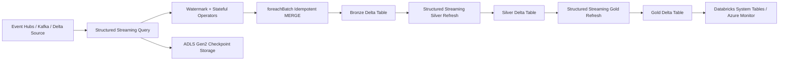
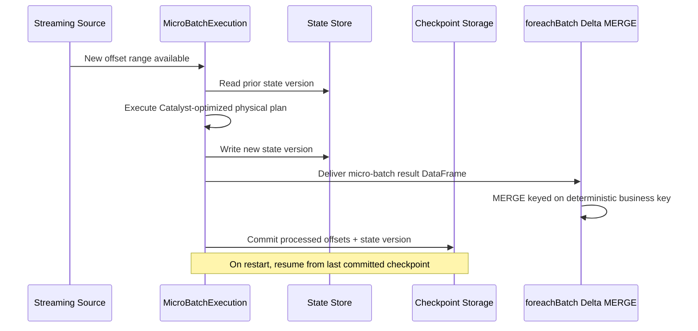
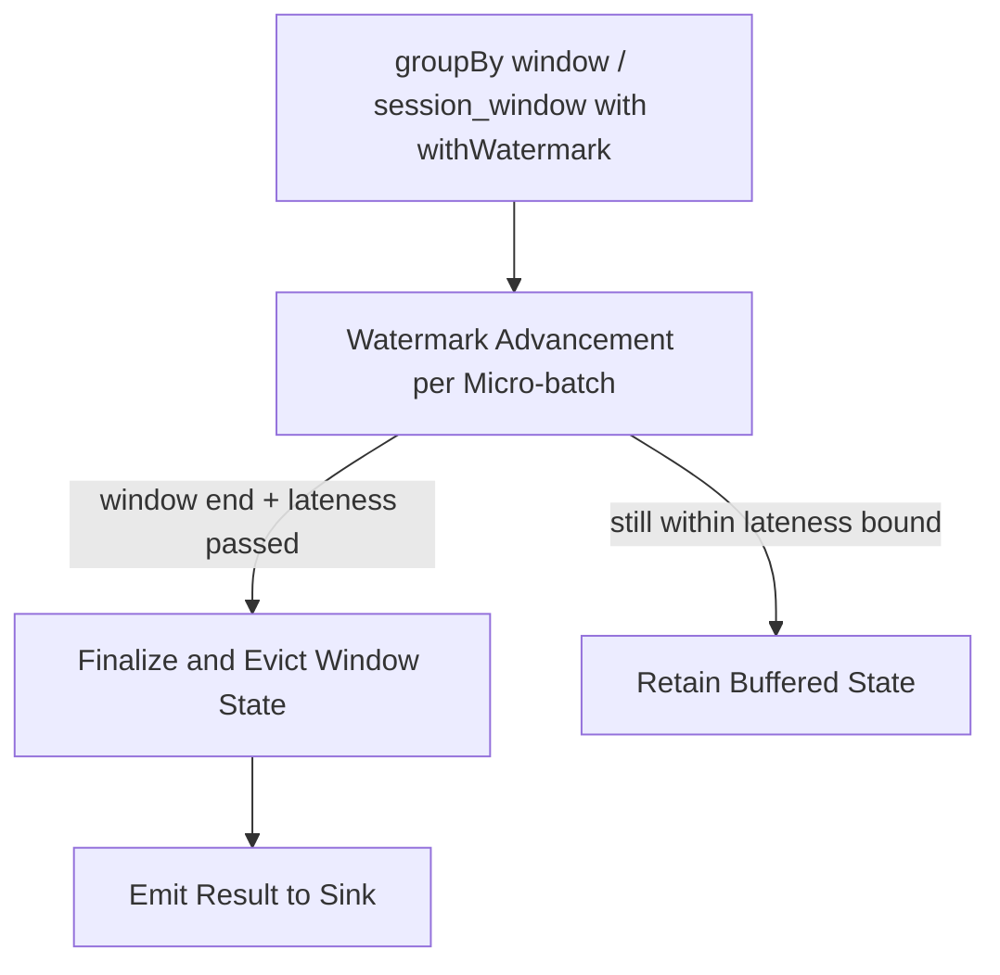

# Spark Structured Streaming

> Part of the **Enterprise Data & AI Architecture Handbook** · Phase-07 - Streaming & Real-Time Analytics · Chapter 05.
> Estimated study time: **60 min reading + ~4h labs**.
> **Prerequisites:** read [Apache Spark Internals](../Phase-05/04_Apache_Spark_Internals.md) and [Streaming Fundamentals](01_Streaming_Fundamentals.md) first.

---

## Executive Summary

Spark Structured Streaming is the lakehouse-native answer to stream processing: it takes the same DataFrame/Dataset API, the same Catalyst optimizer, and the same execution engine described in [Apache Spark Internals](../Phase-05/04_Apache_Spark_Internals.md), and runs it repeatedly against an ever-growing, unbounded input, modeled internally as "a table that keeps getting new rows appended." This single design decision is the source of both its greatest strength and its most important limitation. The strength: the exact same transformation logic, the exact same Catalyst/AQE optimization machinery, and the exact same Delta Lake sink can be reused across batch and streaming jobs with only trigger-cadence and checkpoint configuration changing — an operational and engineering-cost advantage no other engine in this handbook offers as cleanly. The limitation: because execution is fundamentally organized around discrete **micro-batches** rather than Flink's true per-event dataflow (covered in [Apache Flink](04_Apache_Flink.md)), there is an inherent latency floor set by batch-planning and scheduling overhead, even under the lowest-latency trigger configuration.

The core streaming-specific machinery layered on top of Spark's batch engine is exactly the vocabulary established in [Streaming Fundamentals](01_Streaming_Fundamentals.md), made concrete: `withWatermark()` declares the event-time column and allowed lateness bound; `groupBy` with `window()` or `session_window()` expresses tumbling, sliding, or session aggregation; stateful operators (aggregations, streaming joins, `mapGroupsWithState`/`flatMapGroupsWithState`) persist keyed state across micro-batches in a versioned, checkpointed **state store**; and checkpointing to a durable location (ideally Delta Lake or a cloud object store) atomically commits processed offsets alongside state and output, which is the mechanical basis for Structured Streaming's exactly-once guarantees to idempotent, Delta-native sinks.

The other defining architectural fact is that Structured Streaming is where **streaming and the lakehouse genuinely merge**: Delta Lake is not just a convenient sink, it is the natural checkpoint-compatible, ACID-transactional, mergeable destination that makes idempotent, effectively-once writes cheap and native (via `MERGE`), and Delta's own change-data-feed and streaming-read support let a Bronze-to-Silver-to-Gold medallion pipeline be expressed as a chain of Structured Streaming jobs rather than a batch ETL pipeline with a separate streaming bolt-on.

The practical, Azure-first conclusion: default new stateful streaming workloads on Azure to Databricks Structured Streaming precisely because it reuses the same engine, tooling, governance (Unity Catalog), and Delta-native sink story as the rest of the Azure lakehouse estate, and reserve escalation to Flink (per [Apache Flink](04_Apache_Flink.md)) only for workloads whose latency floor, state scale, or CEP requirements genuinely exceed what a well-tuned micro-batch pipeline can deliver.

## Learning Objectives

By the end of this chapter you will be able to:

1. Explain the micro-batch execution model and the "unbounded table" abstraction underlying Structured Streaming.
2. Configure `withWatermark()` and windowed aggregations correctly, connecting them to the general event-time and watermark vocabulary from [Streaming Fundamentals](01_Streaming_Fundamentals.md).
3. Reason about stateful operators, the state store, and how state is versioned and recovered across micro-batches.
4. Configure checkpointing to Delta Lake / cloud storage and explain what it guarantees for exactly-once processing.
5. Implement streaming-to-streaming and streaming-to-static joins, and design deduplication using `dropDuplicatesWithinWatermark` or watermark-bounded state.
6. Choose and tune trigger modes (`ProcessingTime`, `AvailableNow`, `Once`, `Continuous`) for a stated latency and cost requirement.
7. Diagnose common production failure modes: unbounded state growth, small-file proliferation, and stream-static join staleness.
8. Compare Structured Streaming's micro-batch model against Flink's true-streaming model on latency, state handling, and operational fit, extending the comparison from [Apache Flink](04_Apache_Flink.md).
9. Design an Azure Databricks Structured Streaming pipeline feeding a medallion architecture with idempotent Delta writes.
10. Defend a Structured Streaming architecture and trigger/latency configuration decision in a staff-level review.

## Business Motivation

- Enterprises already standardized on Azure Databricks and Delta Lake for batch ETL want to reuse the same engine, code patterns, and governance for streaming rather than operating a second, unrelated stream-processing stack.
- Medallion-architecture lakehouses need a native way to continuously and incrementally update Bronze-to-Silver-to-Gold tables as new data arrives, rather than relying purely on scheduled batch jobs with growing latency.
- Deduplication, sessionization, and streaming joins are common requirements for clickstream, IoT, and CDC pipelines, and need a production-grade, checkpointed implementation rather than ad hoc custom code.
- FinOps programs benefit when the same compute platform, cluster tooling, and governance model (Unity Catalog) serve both batch and streaming workloads, reducing duplicated platform investment.
- Regulatory and business reporting increasingly expects near-real-time curated data rather than next-day batch refreshes, and Structured Streaming is often the lowest-effort way to close that gap on an existing Databricks estate.
- Getting trigger and latency configuration wrong has direct cost consequences: overly aggressive triggers waste compute on empty or near-empty micro-batches, while overly relaxed triggers silently miss a freshness SLA.

## History and Evolution

- Spark Streaming (DStreams) was the original streaming API, built as a sequence of RDD micro-batches with a lower-level, less declarative API than the DataFrame model that later became standard across the rest of Spark.
- Structured Streaming was introduced to unify the batch DataFrame/Dataset API with streaming, modeling a stream as an unbounded table and letting the same Catalyst-optimized query logic apply to both, directly building on the internals described in [Apache Spark Internals](../Phase-05/04_Apache_Spark_Internals.md).
- Event-time watermarking (`withWatermark`) was added to bring the event-time-versus-processing-time discipline described generally in [Streaming Fundamentals](01_Streaming_Fundamentals.md) into the DataFrame API as first-class syntax.
- Stateful operators matured from simple windowed aggregations to arbitrary stateful processing (`mapGroupsWithState`, `flatMapGroupsWithState`) and native streaming-to-streaming joins with watermark-based state eviction.
- A low-latency **Continuous Processing** execution mode was introduced experimentally to reduce the micro-batch latency floor for a restricted set of operations, though it never reached the general-purpose maturity of Flink's native true-streaming model and remains a narrower option today.
- Delta Lake's tight integration with Structured Streaming (`foreachBatch` with `MERGE`, Delta as a streaming source and sink, Delta's transaction log providing exactly-once-compatible commit semantics) became a defining differentiator as the lakehouse architecture matured, tying streaming directly into the medallion Bronze-Silver-Gold pattern.
- `Trigger.AvailableNow` was introduced to give Structured Streaming a genuinely efficient way to run "streaming logic" on a scheduled batch cadence — processing all currently available data and then stopping — bridging the operational gap between true continuous streaming and traditional scheduled batch jobs.
- Current Azure practice treats Structured Streaming on Databricks as the default streaming engine for lakehouse-native workloads, with Stream Analytics ([Azure Event Hubs and Stream Analytics](03_Azure_Event_Hubs_and_Stream_Analytics.md)) as the lighter-weight option for simple SQL-only queries and Flink ([Apache Flink](04_Apache_Flink.md)) as the escalation path for the narrower set of workloads needing true per-event latency or very large keyed state.

## Why This Technology Exists

Structured Streaming exists because most enterprise streaming requirements are not actually latency-extreme; they need "continuously updated, correct, curated data," not "sub-10-millisecond per-event reaction." For that very large class of workloads, reusing a mature, well-optimized batch engine's DataFrame API, Catalyst optimizer, and Delta Lake integration is dramatically more efficient — operationally and in engineering effort — than adopting a second, architecturally distinct streaming engine. The "unbounded table" abstraction exists specifically to let engineers write the same transformation logic once and run it as either a batch job or a streaming job, closing the gap between batch and streaming development that historically required two separate codebases and two separate skill sets.

It also exists because the lakehouse pattern — Bronze raw ingestion, Silver cleaned/conformed data, Gold curated marts, all as Delta tables — benefits enormously from a streaming engine that treats Delta Lake as a first-class citizen rather than an external sink bolted on afterward. Delta's transactional `MERGE` capability, combined with Structured Streaming's checkpointed offset tracking, is what makes idempotent, effectively-once medallion pipelines achievable without hand-rolled deduplication logic at every hop.

Finally, the micro-batch model exists because it is dramatically simpler to reason about and operate than a true per-event streaming engine for the majority of use cases: checkpointing aligns naturally with batch boundaries, backpressure and scaling behave similarly to batch jobs, and the same cluster-sizing and job-scheduling mental model used for batch ETL (as covered in [Apache Spark Internals](../Phase-05/04_Apache_Spark_Internals.md)) carries over directly, at the cost of the latency floor Flink's true-streaming model avoids.

## Problems It Solves

| Problem | Structured Streaming's response |
|---|---|
| Duplicated engineering effort maintaining separate batch and streaming codebases | Unified DataFrame API and execution engine shared with batch Spark jobs |
| Medallion lakehouse tables need continuous, incremental updates | Native Delta Lake source/sink integration with transactional `MERGE` |
| Business metrics need event-time-correct aggregation despite out-of-order arrival | `withWatermark()` plus windowed aggregation, directly implementing [Streaming Fundamentals](01_Streaming_Fundamentals.md)'s vocabulary |
| Deduplication of retried or replayed events | Watermark-bounded `dropDuplicatesWithinWatermark` and stateful dedup patterns |
| Joining a live stream against another stream or a slowly changing reference dataset | Native streaming-to-streaming joins (watermark-bounded) and stream-to-static joins |
| Pipelines must recover correctly after a failure without reprocessing from scratch | Checkpointed offsets and state store, versioned and recoverable |
| Freshness requirements vary from seconds to hours across different pipelines | Configurable trigger modes (`ProcessingTime`, `AvailableNow`, `Once`, `Continuous`) |

## Problems It Cannot Solve

- Structured Streaming cannot eliminate the inherent micro-batch latency floor; even the lowest configured `ProcessingTime` trigger interval carries batch-planning and scheduling overhead that a true-streaming engine like Flink avoids, as discussed in [Apache Flink](04_Apache_Flink.md).
- It does not automatically make a poorly designed streaming job cheap; unbounded or unmanaged state (missing watermarks, unbounded stream-static join reference tables) can make a streaming job as expensive and unstable as any other engine's equivalent misconfiguration.
- It cannot guarantee exactly-once delivery to a non-idempotent, non-transactional external sink; the same system-wide caveat on exactly-once from [Streaming Fundamentals](01_Streaming_Fundamentals.md) applies without exception, and `foreachBatch` with a non-idempotent sink degrades to at-least-once regardless of Structured Streaming's internal checkpoint guarantees.
- It does not remove the need for correct cluster sizing and Spark tuning; the same shuffle, skew, and spill dynamics described in [Apache Spark Internals](../Phase-05/04_Apache_Spark_Internals.md) apply directly to streaming micro-batches, and a poorly tuned streaming job degrades exactly like a poorly tuned batch job.
- The experimental Continuous Processing mode does not support the full breadth of DataFrame operations that the default micro-batch mode supports, so it cannot be adopted as a drop-in low-latency replacement for arbitrary streaming logic.
- It cannot substitute for Flink's native Complex Event Processing (CEP) library for genuinely ordered, correlated multi-event pattern detection; expressing that logic in Structured Streaming's stateful operators is possible but considerably more manual and less expressive.

## Core Concepts

### 8.1 The unbounded table model and micro-batch execution

Structured Streaming models a streaming source as an **unbounded input table** that continuously receives new rows, and a query against it as producing an equally unbounded **result table**, updated incrementally. In practice, this is implemented as a sequence of **micro-batches**: at each trigger interval, the engine determines the new data available since the last batch, executes the same Catalyst-optimized physical plan used for batch DataFrames (per [Apache Spark Internals](../Phase-05/04_Apache_Spark_Internals.md)) against that increment, updates any stateful operator state, and writes the incremental result to the configured output sink and mode (append, update, or complete).

### 8.2 Event-time watermarks and windowed aggregation

`withWatermark("event_time_col", "delay_threshold")` declares the event-time column and the allowed lateness bound — the direct DataFrame-API expression of the watermark concept from [Streaming Fundamentals](01_Streaming_Fundamentals.md). Combined with `groupBy(window("event_time_col", "window_duration", "slide_duration"))` for tumbling/sliding windows, or `session_window("event_time_col", "gap_duration")` for session windows, this gives the same three canonical windowing strategies expressed as concrete DataFrame syntax. Watermark progress is tracked per micro-batch, and once it passes a window's end plus the allowed lateness, that window's state is finalized and evicted.

### 8.3 Stateful operators and the state store

Any operation that must remember information across micro-batches — windowed aggregations, streaming deduplication, streaming joins, or custom logic via `mapGroupsWithState`/`flatMapGroupsWithState` — persists its per-key state in a versioned **state store**, backed by default by an in-memory, checkpoint-synchronized store, or by RocksDB (via the RocksDB state store provider) for state that exceeds comfortable executor memory. Each micro-batch reads the relevant state version, updates it, and writes a new versioned snapshot as part of the batch's checkpoint commit — conceptually parallel to Flink's keyed state and state backend model from [Apache Flink](04_Apache_Flink.md), but tied to micro-batch boundaries rather than continuous asynchronous snapshotting.

### 8.4 Checkpointing to Delta Lake / cloud storage

A Structured Streaming query's checkpoint location (an ADLS Gen2 path, ideally) durably stores the query's progress: processed source offsets, operator state snapshots, and metadata about the query's configuration. On restart after a failure or planned redeploy, the query resumes exactly from the last committed checkpoint, reprocessing only what has not yet been durably reflected in the output — this is the mechanical foundation for Structured Streaming's "exactly-once processing" claim, which, consistent with the system-wide framing in [Streaming Fundamentals](01_Streaming_Fundamentals.md), only becomes an end-to-end guarantee when paired with an idempotent or transactional sink. Delta Lake is the natural sink for this because its `MERGE` operation, combined with a deterministic dedup key, makes replayed micro-batches (after a checkpoint-triggered restart) safe no-ops.

### 8.5 Streaming joins and deduplication

Structured Streaming supports **stream-to-stream joins** (both sides must declare watermarks so the engine can bound how long to retain buffered state waiting for a match) and **stream-to-static joins** (joining a stream against a batch DataFrame or Delta table, refreshed according to the static side's own read semantics). Deduplication is implemented either via `dropDuplicatesWithinWatermark` (bounding the dedup state's retention to the watermark lateness window) or via a custom stateful operator keyed on a deterministic business key, both of which are concrete applications of the idempotent-processing discipline established in [Streaming Fundamentals](01_Streaming_Fundamentals.md).

### 8.6 Trigger modes and latency tuning

The **trigger** configuration determines the pipeline's execution cadence and latency/cost trade-off: `Trigger.ProcessingTime(interval)` runs a new micro-batch on a fixed cadence (the most common mode, tunable from sub-second to many minutes); `Trigger.AvailableNow()` processes all currently available data in one or more micro-batches and then stops, making it ideal for running "streaming" logic on a traditional scheduled batch cadence at much lower operational cost than a continuously running cluster; `Trigger.Once()` (the precursor to `AvailableNow`, now largely superseded) processes exactly one micro-batch and stops; and the experimental `Trigger.Continuous(interval)` mode approximates lower, more Flink-like latency for a restricted subset of supported operations at the cost of losing exactly-once guarantees for some operators and broader DataFrame API support.

## Internal Working

### 9.1 How a micro-batch is planned and executed

At each trigger, the streaming query's `MicroBatchExecution` engine determines the new offset range available from each source, constructs an incremental logical plan reflecting that data increment plus any stateful operator context, and hands it to the same Catalyst analyzer, optimizer, and (where supported) Adaptive Query Execution machinery described in [Apache Spark Internals](../Phase-05/04_Apache_Spark_Internals.md) for physical planning and code generation. The resulting physical plan executes as ordinary Spark tasks across the cluster's executors, exactly like a batch job, with the key difference that stateful operators read and write versioned state store partitions as part of task execution.

### 9.2 How watermark advancement drives state eviction

At the end of each micro-batch, the engine computes the new global watermark value (the minimum of each source's observed watermark, mirroring the multi-source watermark rule from [Streaming Fundamentals](01_Streaming_Fundamentals.md)) and uses it to determine which windowed aggregation groups, join-buffer entries, or deduplication-state entries are now "safe" to finalize and evict from the state store. This eviction step is what keeps unbounded streaming state from growing indefinitely, provided the watermark is configured and the query's logic actually respects it (a `groupBy` without a watermark, for instance, never evicts state and grows without bound).

### 9.3 How checkpointing commits atomically

At the end of each successful micro-batch, the engine writes a new checkpoint entry recording the processed offsets and any updated state store version, using a write-ahead-log-style commit protocol: the batch's output must be durably written (or handed to `foreachBatch` for custom sink logic) before the checkpoint's commit log entry is finalized. On restart, the engine reads the last committed offset and state version from the checkpoint location and resumes from exactly that point, which is why checkpoint-location integrity (durable storage, no manual tampering, no accidental deletion) is operationally critical.

### 9.4 How streaming-to-streaming joins buffer and evict state

For a join between two watermarked streams, each side buffers incoming rows in state, waiting for a matching row to arrive on the other side within a join condition that must include a time constraint (derived from both sides' watermarks) bounding how long a row can wait for its match. Once the global watermark passes a buffered row's eligible matching window, that row is evicted from state regardless of whether a match arrived — meaning a join with a too-tight watermark can silently miss valid matches that arrive slightly late, exactly the lateness/completeness trade-off described generically for windows in [Streaming Fundamentals](01_Streaming_Fundamentals.md).

### 9.5 How `foreachBatch` enables idempotent Delta sink writes

`foreachBatch` exposes each completed micro-batch's resulting DataFrame directly to custom code, most commonly used to perform a Delta Lake `MERGE` keyed on a deterministic business key, converting the underlying at-least-once micro-batch delivery (a checkpoint-triggered restart could reprocess a batch's data) into an effectively-once outcome at the sink. This is the Structured Streaming-specific instance of the general idempotent-sink pattern already established in [Apache Kafka](02_Apache_Kafka.md) and [Apache Flink](04_Apache_Flink.md).

## Architecture

### 10.1 Azure-first reference architecture

The common Azure pattern runs Structured Streaming jobs on Azure Databricks clusters (job clusters for scheduled `AvailableNow` runs, or long-running clusters for continuous `ProcessingTime` triggers), consuming from Azure Event Hubs (via its Kafka-compatible endpoint, per [Azure Event Hubs and Stream Analytics](03_Azure_Event_Hubs_and_Stream_Analytics.md)) or directly reading captured/landed files from ADLS Gen2, applying watermarked windowed aggregation, deduplication, or joins, and writing incrementally to Delta Lake Bronze, Silver, and Gold tables governed by Unity Catalog. Checkpoints are stored on ADLS Gen2 alongside the Delta tables themselves. Azure Monitor, Databricks system tables, and Delta table history provide observability into batch duration, state size, and data freshness.

### 10.2 Why the architecture works

This architecture lets the same Databricks compute platform, Unity Catalog governance model, and Delta Lake storage layer serve both batch and streaming workloads without a second, disjoint toolchain — directly extending the platform-reuse argument from [Apache Spark Internals](../Phase-05/04_Apache_Spark_Internals.md) into the streaming domain. Delta's `MERGE`-based idempotent writes preserve effectively-once outcomes even though the underlying delivery is at-least-once, and the medallion Bronze-Silver-Gold pattern gives every hop a natural, auditable checkpoint and reprocessing boundary.

### 10.3 ADR example: default streaming lakehouse ingestion to Structured Streaming with `Trigger.AvailableNow`, reserve continuous `ProcessingTime` triggers for genuinely low-latency Silver/Gold refresh needs

**Context:** Multiple lakehouse pipelines need to keep Silver and Gold Delta tables updated from Bronze. Some genuinely need near-real-time freshness (operational dashboards refreshing every few seconds to a minute); most only need "continuously fresher than the old nightly batch job," commonly every 15 minutes to a few hours, without justifying the cost of an always-on cluster.

**Decision:** Default new Bronze-to-Silver-to-Gold pipelines to Structured Streaming jobs scheduled on a recurring cadence using `Trigger.AvailableNow()` against ephemeral job clusters, which processes all newly available data and then terminates the cluster, closely matching traditional batch-job cost economics while reusing streaming-native watermark and state logic. Reserve always-on clusters with `Trigger.ProcessingTime` for the smaller set of pipelines with a documented sub-few-minutes freshness requirement.

**Consequences:** Most pipelines gain the engineering benefits of streaming-native logic (correct watermarking, incremental state, Delta `MERGE` idempotency) without paying for an always-on cluster, while genuinely latency-sensitive pipelines get the freshness they need at a justified, higher operating cost. Teams must track and periodically re-validate which pipelines truly need continuous triggers versus which are defaulting to it out of habit.

**Alternatives considered:**

1. Always-on `ProcessingTime` triggers for every pipeline: rejected because it materially inflates cluster cost for pipelines that do not need sub-minute freshness.
2. Pure batch jobs (no streaming semantics) for everything except explicitly latency-critical pipelines: rejected because it forgoes the correctness benefits of watermark-aware incremental processing and reintroduces hand-rolled incremental-load logic that Structured Streaming already solves.
3. Migrating latency-sensitive pipelines to Flink by default: rejected because the majority of "latency-sensitive" requests, on closer review, tolerate a few minutes of freshness, which `ProcessingTime` triggers on Structured Streaming satisfy without Flink's added operational cost.

## Components

| Component | Role | Typical Azure-first implementation | Common failure mode |
|---|---|---|---|
| Streaming source | Provides the unbounded input, tracked via offsets | Event Hubs (Kafka-compatible), Delta table streaming read, Auto Loader over ADLS Gen2 | source not replayable, breaking recovery after a checkpoint restart |
| MicroBatchExecution engine | Plans and executes each micro-batch via Catalyst/AQE | Databricks Runtime's Structured Streaming engine | non-partitionable or badly shaped queries limiting parallelism, exactly as in batch Spark |
| State store | Persists versioned keyed state across micro-batches | Default in-memory store, or RocksDB state store provider for large state | unbounded state growth from a missing or misconfigured watermark |
| Checkpoint location | Durable record of processed offsets and state versions | ADLS Gen2 path per streaming query | checkpoint location deleted or shared across queries, corrupting recovery |
| `foreachBatch` sink logic | Custom, typically idempotent write logic per micro-batch | Delta Lake `MERGE` keyed on a deterministic business key | non-idempotent custom sink logic silently breaking effectively-once outcomes |
| Trigger configuration | Governs execution cadence and latency/cost trade-off | `ProcessingTime`, `AvailableNow`, `Once`, `Continuous` | `ProcessingTime` left running continuously for a workload that only needed a scheduled `AvailableNow` cadence |
| Delta Lake sink tables | Curated, ACID-transactional streaming destination | Bronze/Silver/Gold Delta tables under Unity Catalog | Silver/Gold tables written without `MERGE`, duplicating records on reprocessing |
| Monitoring layer | Tracks batch duration, state size, and input rate vs. processing rate | Databricks system tables, Spark UI streaming tab, Azure Monitor | batch duration and state metrics not tracked until a freshness SLA is visibly missed |

## Metadata

| Metadata class | What to record | Why it matters |
|---|---|---|
| Query configuration metadata | trigger mode/interval, watermark column and lateness bound, output mode | governs latency, correctness, and cost trade-offs |
| Checkpoint metadata | checkpoint location, last committed batch ID, state store provider | supports recovery auditing and safe migration |
| State size metadata | per-operator state size trend over time | leading indicator of unbounded growth or skew |
| Sink transactional metadata | `foreachBatch` MERGE key definition, idempotency verification status | verifies exactly-once claims are structurally sound |
| Source offset metadata | source type, retention window, replay capability | governs realistic reprocessing/backfill windows |
| Schema metadata | source and sink schema versions, evolution policy | prevents undocumented breaking schema drift across Bronze/Silver/Gold |
| Operational metadata | input rate vs. processing rate, batch duration trend | first-class pipeline health signals |

## Storage

| Storage concern | Recommended posture | Notes |
|---|---|---|
| Checkpoint storage | Dedicated ADLS Gen2 path per query, never shared or manually modified | checkpoint corruption or accidental deletion forces a full reprocessing from source retention |
| Delta sink table storage | Standard Delta Lake layout on ADLS Gen2 with regular `OPTIMIZE`/`VACUUM` | streaming writes tend to produce many small files, requiring the same compaction discipline as any Delta table |
| State store storage (RocksDB provider) | Local executor disk sized for the largest anticipated per-partition state, offloaded to checkpoint storage on commit | undersized local disk causes state store I/O failures under real production state growth |
| Source retention (Event Hubs/Kafka/Delta) | Sized to cover the realistic reprocessing/backfill window | consistent with the general replay-for-reprocessing principle from [Streaming Fundamentals](01_Streaming_Fundamentals.md) |

## Compute

| Workload class | Best Azure-first surface | Why it fits | Wrong default |
|---|---|---|---|
| Scheduled, near-real-time medallion refresh (minutes to hours freshness) | Structured Streaming with `Trigger.AvailableNow` on ephemeral Databricks job clusters | matches batch-job cost economics while reusing streaming-native correctness logic | leaving an always-on cluster running for a workload that only needs periodic refresh |
| Genuinely low-latency (seconds) dashboard or alerting feed | Structured Streaming with `Trigger.ProcessingTime` on an always-on cluster, or escalate to Flink | balances latency need against operational cost | defaulting straight to Flink without validating Structured Streaming cannot meet the latency bar first |
| Very large keyed state, CEP, or lowest achievable per-event latency | Escalate to Apache Flink per [Apache Flink](04_Apache_Flink.md) | Structured Streaming's micro-batch model and state store are not optimized for this regime | forcing Flink-shaped requirements into Structured Streaming and fighting the micro-batch latency floor |
| Simple SQL-only windowed aggregation without lakehouse integration needs | Azure Stream Analytics per [Azure Event Hubs and Stream Analytics](03_Azure_Event_Hubs_and_Stream_Analytics.md) | no cluster to manage for genuinely simple queries | standing up a Databricks cluster for a trivial query Stream Analytics already serves |

## Networking

- Co-locate Databricks clusters, Event Hubs/Kafka sources, and ADLS Gen2 storage in the same Azure region to minimize network-induced latency that inflates event-time-to-processing-time skew, consistent with [Streaming Fundamentals](01_Streaming_Fundamentals.md).
- Use Private Link/Private Endpoint for Event Hubs and ADLS Gen2 connectivity from Databricks clusters, and VNet injection or secure cluster connectivity for the Databricks workspace itself.
- Plan cluster network bandwidth for shuffle-heavy streaming joins and stateful aggregations exactly as for batch Spark jobs, since the underlying shuffle mechanics are identical, per [Apache Spark Internals](../Phase-05/04_Apache_Spark_Internals.md).
- Separate checkpoint-write traffic from primary data read/write traffic when sizing storage account throughput, since checkpoint commits happen on every micro-batch regardless of data volume.

## Security

| Concern | Recommended control |
|---|---|
| Cluster and workspace access | Unity Catalog governance and Entra ID-integrated Databricks workspace access |
| Source authentication | Managed identities for Event Hubs/ADLS Gen2 access from streaming jobs |
| In-transit encryption | TLS for all source connector and storage traffic |
| At-rest encryption | Platform-managed or customer-managed keys for checkpoint storage and Delta tables |
| Data sensitivity | Classify and mask/tokenize sensitive fields before they land in shared Bronze tables consumed by many downstream jobs |
| Secrets management | Azure Key Vault-backed secret scopes for connector credentials, not embedded configuration |
| Governance | Unity Catalog lineage and access control applied identically to streaming-written and batch-written Delta tables |

## Performance

- Align watermark lateness bounds and window sizes to the actual business freshness requirement; every extra minute of allowed lateness increases buffered state and end-to-end latency for no benefit if the business does not need it.
- Use the RocksDB state store provider for any stateful operator whose state materially exceeds comfortable executor memory, mirroring the state-backend sizing discipline from [Apache Flink](04_Apache_Flink.md).
- Monitor input rate versus processing rate per micro-batch; sustained processing rate below input rate is the streaming-specific expression of the general Spark performance principle that shuffle, skew, and spill degrade a job under load, per [Apache Spark Internals](../Phase-05/04_Apache_Spark_Internals.md).
- Tune trigger interval as an explicit latency-versus-throughput-efficiency trade-off; very short intervals increase per-batch scheduling overhead relative to useful work, while very long intervals increase end-to-end latency.
- Compact small files produced by frequent micro-batch writes with regular Delta `OPTIMIZE` jobs, since streaming writes are structurally prone to the small-file problem.

| Pattern | Recommendation | Why |
|---|---|---|
| Fraud/alerting feed needing sub-minute freshness | Short `ProcessingTime` interval, tight watermark, always-on cluster | favors low latency over compute efficiency |
| Medallion Silver/Gold refresh | `Trigger.AvailableNow` on a scheduled ephemeral job cluster | favors cost efficiency for a periodic freshness requirement |
| Streaming deduplication of CDC events | `dropDuplicatesWithinWatermark` keyed on a deterministic business key | bounds dedup state to the watermark lateness window |
| Stream-to-static enrichment join | Periodically refreshed static Delta table, broadcast join where the reference table is small | avoids unnecessary state growth from a reference-side stream |

## Scalability

- Scale Databricks cluster size (executor count and size) to match the source's partition count and the realistic peak micro-batch data volume, exactly as for batch Spark jobs per [Apache Spark Internals](../Phase-05/04_Apache_Spark_Internals.md).
- For very high state cardinality, scale the RocksDB state store's local disk and executor memory proportionally, and monitor per-partition state size for skew.
- Decouple source scaling (Event Hubs/Kafka partition count) from Databricks cluster scaling, but keep them proportionally aligned so neither becomes the bottleneck for the other.
- Reassess trigger interval and cluster sizing together whenever source throughput or state cardinality changes materially; a configuration that was efficient at launch can silently degrade as volume grows.
- For `Trigger.AvailableNow` workloads, size the ephemeral job cluster for the largest realistic backlog the schedule might need to catch up on, not just steady-state per-run volume.

## Fault Tolerance

- Checkpointing (offsets plus state store versions) is what allows a Structured Streaming query to resume correctly after a cluster restart, job failure, or planned redeploy without reprocessing from the very beginning.
- `foreachBatch` with a Delta `MERGE` (or another idempotent write pattern) is what prevents a checkpoint-triggered replay from producing duplicate committed rows in Silver/Gold tables.
- Test failure recovery deliberately: kill a streaming job mid-batch and verify it resumes correctly from the last committed checkpoint with no data loss or duplication at the Delta sink.
- Ensure checkpoint locations are never shared across queries and are protected from accidental deletion, since checkpoint loss forces a full reprocessing from the source's earliest retained offset.
- Design multi-region DR by evaluating whether the source (Event Hubs, Delta table) and checkpoint storage are themselves geo-redundant, since Structured Streaming's own recovery guarantee is only as strong as its underlying source and checkpoint storage durability.

## Cost Optimization

- Prefer `Trigger.AvailableNow` on ephemeral job clusters over always-on `ProcessingTime` clusters for any workload whose freshness requirement is genuinely minutes-to-hours rather than seconds.
- Right-size cluster autoscaling bounds to actual micro-batch volume; an always-on cluster provisioned for peak volume but running mostly idle between bursts wastes compute continuously.
- Compact small files from streaming writes regularly; unmanaged small-file accumulation increases both storage cost and downstream query cost.
- Monitor and alert on processing-rate-versus-input-rate as a cost signal too; sustained lag often means under-provisioned compute paired with a trigger interval too aggressive for the provisioned cluster size.
- Periodically reassess which pipelines still genuinely need continuous, always-on triggers versus which could move to scheduled `AvailableNow` runs as requirements or traffic patterns change.

Worked FinOps example: consider a Silver-layer enrichment pipeline running on an always-on Databricks cluster with a 10-second `ProcessingTime` trigger, costing a materially higher monthly bill in illustrative pricing than the business's actual requirement, which review reveals is "fresher than the old nightly batch job," not "near-real-time." Switching to `Trigger.AvailableNow` on an ephemeral job cluster running every 15 minutes reduces the monthly compute bill substantially by eliminating idle always-on cluster time, while still delivering freshness far better than the original nightly batch job. The lesson generalizes: Structured Streaming cost problems are very often a trigger-mode mismatch against the true business freshness requirement, and the first FinOps lever is validating the actual latency need before assuming an always-on cluster is required.

## Monitoring

| Metric | Why it matters | Typical threshold |
|---|---|---|
| Input rate vs. processing rate | shows whether the query is keeping pace with incoming data | alert when processing rate falls sustainably below input rate |
| Batch duration trend | signals growing state, skew, or under-provisioned compute | alert on rising trend relative to the configured trigger interval |
| State store size per operator | leading indicator of unbounded growth or key skew | alert on sustained upward trend or per-key outliers |
| Checkpoint commit latency | signals checkpoint storage throughput issues | alert on rising trend |
| Watermark delay (event time vs. current watermark) | direct freshness and lateness-risk indicator | tie to the workload's documented SLA |
| Delta sink small-file count/size distribution | signals need for compaction | review after periods of high-frequency micro-batch writes |

## Observability

Observability for a Structured Streaming pipeline should answer: is the query keeping pace with its input rate, is state growing unexpectedly, is the checkpoint healthy and committing on schedule, and does the sink's committed output actually reflect an idempotent, effectively-once outcome.

- correlate batch duration and state size trends to distinguish a genuine capacity problem from a transient input spike,
- capture watermark delay as a first-class time-series metric tied directly to the business freshness SLA,
- verify `foreachBatch` MERGE logic's dedup key coverage periodically against real production data to confirm the idempotency claim holds,
- preserve trigger configuration and cluster-sizing history alongside performance telemetry so a review can correlate configuration changes with observed behavior shifts.

### Operational response playbooks

| Signal | Detection query or rule | Likely cause | First remediation |
|---|---|---|---|
| Processing rate falls behind input rate | Structured Streaming metrics show sustained input-rate-exceeds-processing-rate | under-provisioned cluster, growing state, or a shuffle-heavy stateful operator experiencing skew | scale cluster, investigate state growth and skew, and review the query plan for skew-prone joins/aggregations |
| Batch duration grows steadily | Batch duration metric trending upward against a stable trigger interval | unbounded state from a missing/misconfigured watermark, or accumulating small files degrading source/sink read performance | audit watermark configuration, add or tighten lateness bounds, and run Delta `OPTIMIZE` on affected tables |
| Duplicate records appear in a Silver/Gold table after a job restart | Row counts or business-key uniqueness checks reveal duplication following a known restart event | `foreachBatch` sink logic not idempotent, or missing `MERGE` key coverage | add or correct the deterministic MERGE key, and add duplication regression tests to CI |

## Governance

- Require every production Structured Streaming query to document trigger mode/interval, watermark column and lateness bound, checkpoint location, and sink idempotency mechanism as reviewed metadata, not only in application code.
- Treat changes to watermark lateness, window definitions, and trigger mode as reviewed architectural changes, since they change what "correct" and "fresh" mean for downstream consumers.
- Require verification that every `foreachBatch` sink implementation is genuinely idempotent (deterministic MERGE key or equivalent) before a pipeline is approved for production.
- Track checkpoint location ownership centrally to prevent accidental sharing or deletion across queries and teams.
- Align Structured Streaming governance with Unity Catalog's broader data governance so streaming-written Delta tables are cataloged, lineage-tracked, and access-controlled identically to batch-written tables.

## Trade-offs

| Choice | Advantages | Disadvantages | When to prefer it |
|---|---|---|---|
| Structured Streaming (`ProcessingTime`, always-on) | Reuses batch DataFrame API and Delta-native sinks; genuinely low-latency for many use cases | Always-on cluster cost; micro-batch latency floor remains | Continuous freshness needs measured in seconds to low minutes |
| Structured Streaming (`Trigger.AvailableNow`, scheduled) | Matches batch-job cost economics while keeping streaming-native correctness logic | Freshness bounded by schedule interval | Minutes-to-hours freshness requirements |
| Escalate to Apache Flink | True per-event latency, native CEP, mature large-state handling | Higher operational ownership, separate toolchain from the Databricks/Delta estate | Latency, state-scale, or CEP requirements genuinely exceed Structured Streaming's fit |
| Azure Stream Analytics | No cluster to manage, fastest time to production | Limited expressiveness, no native Delta Lake integration | Simple SQL-only windowed aggregation without lakehouse integration needs |
| RocksDB state store provider | Scales beyond executor memory | Serialization overhead per state access | Large or unbounded-growth keyed state |
| Default in-memory state store | Fastest state access | Bounded by executor memory | Small, bounded state with strict latency requirements |

## Decision Matrix

| Requirement | Structured Streaming (`AvailableNow`) | Structured Streaming (`ProcessingTime`) | Apache Flink | Stream Analytics |
|---|---|---|---|---|
| Lowest operational/compute cost | strong | medium | weak | strong |
| Sub-minute freshness | weak | strong | strong | medium |
| Native Delta Lake / lakehouse integration | strong | strong | medium (via connector) | weak |
| Very large keyed state | medium | medium | strong | weak |
| Complex event pattern detection (CEP) | weak | weak | strong | weak |
| Simple SQL-only aggregation without lakehouse needs | medium | medium | weak | strong |

Use this matrix as a starting filter; the final choice still depends on the specific freshness, state-scale, and lakehouse-integration requirements of the workload.

## Design Patterns

1. **Medallion streaming pattern:** express Bronze-to-Silver-to-Gold transformations as a chain of Structured Streaming queries, each reading the prior Delta table as a streaming source.
2. **Scheduled-freshness pattern:** default to `Trigger.AvailableNow` on ephemeral job clusters for any pipeline whose freshness requirement is minutes-to-hours rather than seconds.
3. **Idempotent MERGE sink pattern:** implement every `foreachBatch` sink using a Delta `MERGE` keyed on a deterministic business key, converting at-least-once delivery into an effectively-once outcome.
4. **Watermark-bounded dedup pattern:** use `dropDuplicatesWithinWatermark` (or an equivalent stateful dedup operator) to bound deduplication state to the watermark lateness window rather than retaining state indefinitely.
5. **Stream-to-static enrichment pattern:** join a stream against a periodically refreshed static Delta table for reference-data enrichment without introducing unnecessary streaming state on the reference side.
6. **Escalation-only-when-justified pattern:** default new stateful streaming workloads to Structured Streaming; escalate to Flink only where latency, state scale, or CEP requirements are documented and genuine, mirroring the equivalent ADR pattern in [Apache Flink](04_Apache_Flink.md).

## Anti-patterns

- Running an always-on `ProcessingTime` cluster for a pipeline whose actual business requirement is "fresher than nightly batch," not sub-minute latency.
- Writing a windowed aggregation or join without a watermark, causing state to grow without bound until the job fails.
- Treating Structured Streaming's checkpoint-based recovery as automatically exactly-once at the sink without verifying the `foreachBatch` logic is genuinely idempotent.
- Allowing streaming writes to accumulate small files in Delta tables without a regular `OPTIMIZE`/compaction cadence.
- Forcing genuinely low-latency, large-state, or CEP-shaped requirements into Structured Streaming instead of escalating to Flink when the fit is clearly wrong.
- Sharing a single checkpoint location across multiple distinct streaming queries, corrupting recovery for both.

## Common Mistakes

- Forgetting that a stream-to-stream join requires watermarks and a time-bound join condition on both sides, and being surprised when state grows unbounded without one.
- Confusing `Trigger.Once()` (largely superseded) with `Trigger.AvailableNow()` and missing the latter's more efficient multi-micro-batch catch-up behavior.
- Deleting or relocating a checkpoint directory casually, not realizing it forces a full reprocessing from the source's earliest retained offset.
- Assuming Structured Streaming's "exactly-once" language in documentation means the sink does not need to be idempotent.
- Not monitoring input-rate-versus-processing-rate until a freshness SLA is visibly missed by a business stakeholder.
- Choosing an aggressive short trigger interval without validating the cluster can actually complete a batch within that interval under peak load.

## Best Practices

- default to `Trigger.AvailableNow` on ephemeral job clusters unless a documented sub-minute freshness requirement justifies an always-on cluster,
- always declare a watermark for any stateful operator (aggregation, join, dedup) and size the lateness bound to the actual business tolerance,
- implement every `foreachBatch` sink with a deterministic MERGE key to guarantee effectively-once outcomes regardless of at-least-once delivery underneath,
- use the RocksDB state store provider for any operator with meaningfully large keyed state,
- monitor input-rate-versus-processing-rate, batch duration, state size, and watermark delay as first-class production health signals,
- compact small files from streaming writes on a regular schedule,
- test failure recovery deliberately rather than assuming checkpointing "just works."

## Enterprise Recommendations

1. Default new stateful streaming workloads on Azure to Databricks Structured Streaming, reusing the existing Databricks/Delta/Unity Catalog investment rather than introducing a separate engine by default.
2. Require `Trigger.AvailableNow` as the default trigger mode; require explicit, documented justification for always-on `ProcessingTime` clusters.
3. Mandate watermark declaration for every stateful operator and require lateness bounds to be evidence-based, not guessed.
4. Require verified idempotent `foreachBatch` MERGE logic as a production readiness gate for every streaming pipeline.
5. Require input-rate-versus-processing-rate, batch duration, state size, and watermark delay as standard dashboard metrics for every production pipeline.
6. Schedule regular Delta `OPTIMIZE`/compaction jobs for all streaming-written tables.
7. Treat watermark, window, and trigger-mode configuration changes as reviewed architectural changes, not routine tuning.
8. Reassess Flink escalation criteria periodically as workload latency and state-scale requirements evolve, consistent with the ADR pattern in [Apache Flink](04_Apache_Flink.md).

## Azure Implementation

### 31.1 Recommended Azure service map

| Layer | Preferred Azure service | Notes |
|---|---|---|
| Streaming compute | Azure Databricks (job clusters for `AvailableNow`, always-on clusters for `ProcessingTime`) | reuses the same platform as batch Spark workloads |
| Streaming source | Azure Event Hubs (Kafka-compatible endpoint), Delta streaming source, Auto Loader over ADLS Gen2 | consistent with [Apache Kafka](02_Apache_Kafka.md) and [Azure Event Hubs and Stream Analytics](03_Azure_Event_Hubs_and_Stream_Analytics.md) |
| Checkpoint and sink storage | ADLS Gen2 with Delta Lake table format | native transactional MERGE support for idempotent writes |
| Governance | Unity Catalog | identical lineage/access control for streaming and batch-written tables |
| Monitoring | Databricks system tables, Spark UI streaming tab, Azure Monitor | correlate batch duration, state size, and watermark delay |

### 31.2 Example medallion streaming pipeline (PySpark, Bronze to Silver with watermark and dedup)

```python
from pyspark.sql import functions as F

bronze = spark.readStream.table("bronze.order_events")

silver_dedup = (
    bronze
    .withWatermark("event_time_utc", "10 minutes")
    .dropDuplicatesWithinWatermark(["order_id", "event_time_utc"])
)

def upsert_silver(batch_df, batch_id):
    batch_df.createOrReplaceTempView("updates")
    batch_df.sparkSession.sql("""
        MERGE INTO silver.order_events AS target
        USING updates AS source
        ON target.order_id = source.order_id
           AND target.event_time_utc = source.event_time_utc
        WHEN NOT MATCHED THEN INSERT *
    """)

(silver_dedup.writeStream
    .foreachBatch(upsert_silver)
    .option("checkpointLocation", "abfss://checkpoints@stedaicuratedprod.dfs.core.windows.net/silver/order_events")
    .trigger(availableNow=True)
    .start())
```

### 31.3 Example windowed aggregation with explicit watermark (PySpark)

```python
device_events = (
    spark.readStream
    .format("eventhubs")
    .options(**eh_conf)
    .load()
    .select(F.from_json(F.col("body").cast("string"), event_schema).alias("e"))
    .select("e.*")
)

zone_alerts = (
    device_events
    .withWatermark("event_time_utc", "2 minutes")
    .groupBy(
        F.window("event_time_utc", "1 minute"),
        F.col("zone_id"),
    )
    .agg(F.avg("temperature").alias("avg_temperature"),
         F.count("*").alias("reading_count"))
)

(zone_alerts.writeStream
    .format("delta")
    .outputMode("append")
    .option("checkpointLocation", "abfss://checkpoints@stedaicuratedprod.dfs.core.windows.net/gold/zone_alerts")
    .trigger(processingTime="30 seconds")
    .table("gold.zone_alerts"))
```

### 31.4 Example stream-to-stream join with watermark-bounded state

```python
orders = spark.readStream.table("bronze.orders").withWatermark("order_time_utc", "10 minutes")
payments = spark.readStream.table("bronze.payments").withWatermark("payment_time_utc", "15 minutes")

joined = orders.join(
    payments,
    F.expr("""
        orders.order_id = payments.order_id AND
        payments.payment_time_utc >= orders.order_time_utc AND
        payments.payment_time_utc <= orders.order_time_utc + interval 1 hour
    """),
    "inner"
)
```

### 31.5 Example Databricks Job configuration for a scheduled `AvailableNow` pipeline (Databricks CLI / JSON)

```json
{
  "name": "silver-order-events-refresh",
  "job_clusters": [
    {
      "job_cluster_key": "streaming-refresh",
      "new_cluster": {
        "spark_version": "14.3.x-scala2.12",
        "node_type_id": "Standard_D8s_v5",
        "num_workers": 4,
        "spark_conf": {
          "spark.sql.streaming.stateStore.providerClass": "org.apache.spark.sql.execution.streaming.state.RocksDBStateStoreProvider"
        }
      }
    }
  ],
  "tasks": [
    {
      "task_key": "refresh-silver-order-events",
      "job_cluster_key": "streaming-refresh",
      "notebook_task": {
        "notebook_path": "/Repos/edai/streaming/silver_order_events_availablenow"
      }
    }
  ],
  "schedule": {
    "quartz_cron_expression": "0 */15 * * * ?",
    "timezone_id": "UTC"
  }
}
```

### 31.6 Practical Azure guidance

- Use `Trigger.AvailableNow` on scheduled Databricks Jobs (ephemeral job clusters) as the default for most medallion refresh pipelines; reserve always-on clusters for documented sub-minute freshness needs.
- Use the RocksDB state store provider (`spark.sql.streaming.stateStore.providerClass`) for any pipeline with meaningfully large keyed state.
- Store checkpoints on ADLS Gen2 with a dedicated, uniquely named path per query, never shared.
- Schedule regular `OPTIMIZE` (and `VACUUM`, respecting retention requirements) on streaming-written Delta tables to control small-file growth.

## Open Source Implementation

Structured Streaming is itself part of the open-source Apache Spark project; this section covers the surrounding OSS ecosystem and comparison points relevant to a non-Databricks deployment.

| Layer | Open-source choice | Notes |
|---|---|---|
| Core streaming engine | Apache Spark Structured Streaming (self-managed on Kubernetes or YARN) | same engine as the Azure Databricks-managed experience |
| Lakehouse table format | Delta Lake (open-source), or Apache Iceberg/Apache Hudi as alternatives | Delta Lake retains the tightest native Structured Streaming integration |
| Durable streaming source | Apache Kafka | direct substitute for Azure Event Hubs, per [Apache Kafka](02_Apache_Kafka.md) |
| State store backend | RocksDB state store provider | same technology referenced in the Azure implementation section |
| Observability | Prometheus, Grafana, Spark's built-in streaming metrics listener | substitute for Databricks system tables and Azure Monitor |
| Orchestration | Apache Airflow or equivalent for scheduling `AvailableNow`-style batch-cadence streaming jobs | substitute for Databricks Jobs scheduling |

Example self-managed Spark submit for a Structured Streaming job on Kubernetes:

```bash
spark-submit \
  --master k8s://https://<k8s-api-server>:443 \
  --deploy-mode cluster \
  --conf spark.sql.streaming.stateStore.providerClass=org.apache.spark.sql.execution.streaming.state.RocksDBStateStoreProvider \
  --conf spark.kubernetes.container.image=myregistry/spark-streaming:3.5.0 \
  --class com.edai.streaming.SilverOrderEventsJob \
  local:///opt/spark/jobs/silver-order-events.jar
```

This mirrors the same three decisions emphasized throughout this chapter: an explicit watermark/state configuration, an explicit idempotent sink strategy (Delta MERGE, or an equivalent upsert against Iceberg/Hudi), and an explicit trigger/scheduling cadence — expressed here for a self-managed Kubernetes deployment instead of managed Azure Databricks.

## AWS Equivalent (comparison only)

| Azure pattern | AWS equivalent | Advantages | Disadvantages | Migration note |
|---|---|---|---|---|
| Azure Databricks Structured Streaming | Databricks on AWS Structured Streaming (same engine) | near-identical engine semantics | infrastructure and networking configuration differ | mostly a lift-and-shift for pipeline logic; revalidate connectivity and IAM |
| Event Hubs (Kafka-compatible) as source | Amazon MSK or Kinesis Data Streams as source | mature managed streaming ingestion options | different connector configuration and partition/shard model | re-validate source connector configuration and offset/checkpoint behavior |
| ADLS Gen2 checkpoint/Delta storage | Amazon S3 checkpoint/Delta storage | comparable durable, cost-efficient object storage | different consistency and throughput characteristics | benchmark checkpoint commit latency before assuming parity |

## GCP Equivalent (comparison only)

| Azure pattern | GCP equivalent | Advantages | Disadvantages | Migration note |
|---|---|---|---|---|
| Azure Databricks Structured Streaming | Databricks on GCP Structured Streaming (same engine) | near-identical engine semantics | infrastructure and networking configuration differ | mostly a lift-and-shift for pipeline logic; revalidate connectivity and IAM |
| Event Hubs (Kafka-compatible) as source | Google Cloud Pub/Sub or Managed Service for Apache Kafka as source | strong managed ingestion options | Pub/Sub lacks Kafka-style partition-ordering guarantees by default | re-validate ordering guarantees before migrating event-time-sensitive pipelines |
| ADLS Gen2 checkpoint/Delta storage | Google Cloud Storage checkpoint/Delta storage | comparable durable, cost-efficient object storage | different consistency and throughput characteristics | benchmark checkpoint commit latency before assuming parity |

## Migration Considerations

- When migrating a Structured Streaming pipeline between environments, always validate checkpoint-location portability; a checkpoint tied to a specific storage account or path structure cannot simply be copied without careful path remapping.
- Re-benchmark trigger interval and cluster sizing on the target environment before assuming identical configuration will perform equivalently, since underlying storage and network characteristics differ across clouds.
- Re-verify `foreachBatch` MERGE idempotency end-to-end after any sink or table-format change (for example, migrating from Delta Lake to Iceberg or Hudi), since idempotency logic is often table-format-specific.
- When escalating a workload from Structured Streaming to Flink (or vice versa, descaling from Flink), migrate via a clean cutover with a documented reconciliation window rather than assuming state or checkpoints are portable across engines — they are not.
- Budget for a reconciliation period comparing output correctness and freshness between old and new pipeline versions before decommissioning the source.

## Mermaid Architecture Diagrams







## End-to-End Data Flow

1. Events land in a streaming source: Azure Event Hubs (Kafka-compatible), a raw file drop ingested via Auto Loader, or an upstream Bronze Delta table.
2. A Structured Streaming query reads the new offset range at each trigger, applying `withWatermark()` to declare event time and allowed lateness, consistent with [Streaming Fundamentals](01_Streaming_Fundamentals.md).
3. The MicroBatchExecution engine builds and executes a Catalyst-optimized physical plan for the increment, updating any stateful operator's versioned state store entries.
4. Watermark advancement determines which windowed, joined, or deduplicated state is now final and can be emitted and evicted.
5. The micro-batch's resulting DataFrame is handed to `foreachBatch`, which performs an idempotent Delta `MERGE` keyed on a deterministic business key.
6. The engine commits the micro-batch's processed offsets and state version to the checkpoint location only after the sink write completes.
7. Downstream Structured Streaming queries treat the just-updated Delta table as their own streaming source, propagating the update through Bronze-to-Silver-to-Gold.
8. On failure, the query resumes from the last committed checkpoint, replaying only unprocessed data, with the idempotent MERGE ensuring no duplicate output even if a micro-batch is reprocessed.
9. Databricks system tables, the Spark UI streaming tab, and Azure Monitor collect input-rate, processing-rate, state-size, and watermark-delay telemetry for ongoing observability.

## Real-world Business Use Cases

| Use case | Why Structured Streaming fits | Typical configuration choice |
|---|---|---|
| Medallion lakehouse Bronze-to-Silver-to-Gold refresh | Reuses existing Databricks/Delta investment for continuous curation | `Trigger.AvailableNow` on scheduled job clusters |
| CDC-driven deduplication and upsert into curated tables | Native `dropDuplicatesWithinWatermark` and Delta MERGE support | Watermark-bounded dedup, idempotent MERGE sink |
| Real-time operational dashboard feed | Genuine sub-minute freshness achievable with tuned `ProcessingTime` triggers | Always-on cluster, short trigger interval, tight watermark |
| Streaming enrichment joins (orders with payments, sessions with profile data) | Native stream-to-stream and stream-to-static join support | Watermark-bounded stream-to-stream join, or stream-to-static broadcast join |
| Feature engineering for ML serving pipelines | Reuses the same DataFrame transformation logic as batch feature pipelines | Delta-native sink feeding a feature store |

## Industry Examples

| Industry | Common Structured Streaming workload | Frequent tuning focus | Common pitfall |
|---|---|---|---|
| Retail / e-commerce | order/inventory event curation, clickstream sessionization | trigger-mode selection, small-file compaction | always-on cluster used where scheduled `AvailableNow` would suffice |
| Banking / payments | transaction event dedup and enrichment | stream-to-stream join watermark tuning | non-idempotent custom sink breaking effectively-once outcomes |
| Manufacturing / IoT | sensor telemetry aggregation into Gold tables | RocksDB state store sizing, watermark lateness tuning | missing watermark causing unbounded state growth |
| Healthcare | patient event stream curation with strict auditability | Unity Catalog lineage, checkpoint integrity | checkpoint location accidentally shared across environments |
| Media / logistics | engagement or shipment event curation feeding analytics | medallion pipeline chaining, schema evolution | breaking schema change propagated silently through Bronze-to-Gold chain |

## Case Studies

### Case study 1: always-on cluster running for a workload that only needed periodic refresh

A retail analytics team ran a Silver-layer enrichment pipeline on an always-on Databricks cluster with a 10-second trigger interval, assuming the business needed near-real-time freshness. A cost review revealed the actual consuming dashboard only refreshed every 30 minutes, meaning the always-on cluster and aggressive trigger interval were pure waste relative to the real requirement.

The fix migrated the pipeline to `Trigger.AvailableNow` on a scheduled job cluster running every 15 minutes, cutting compute cost substantially while still exceeding the dashboard's actual freshness need. The lesson was that trigger-mode selection must be driven by a validated business requirement, not an assumed "streaming means fast" default.

### Case study 2: unbounded state growth from a missing watermark on a stream-to-stream join

A payments platform's order-payment reconciliation join initially omitted watermarks on both sides during a rapid prototyping phase, and the join's buffered state grew without bound as production volume ramped up, eventually causing executor out-of-memory failures during a peak processing period.

The fix added explicit watermarks and a time-bound join condition on both the orders and payments streams, allowing the engine to evict unmatched buffered rows once they aged beyond the configured lateness bound. The lesson reinforced that Structured Streaming's stateful operators are only bounded if watermarks are actually configured; the engine does not protect against unbounded growth by default.

### Case study 3: non-idempotent `foreachBatch` sink caused duplicate records after a routine restart

A manufacturing IoT pipeline's `foreachBatch` sink logic performed a plain `INSERT` into a Silver Delta table rather than a `MERGE`, under the mistaken assumption that Structured Streaming's checkpoint-based exactly-once processing guarantee alone was sufficient. A routine cluster restart during a scheduled maintenance window caused the last micro-batch to be reprocessed, inserting duplicate sensor readings into the Silver table and corrupting a downstream daily aggregate.

The fix replaced the plain insert with a Delta `MERGE` keyed on a deterministic `(device_id, event_time_utc)` key, making the sink idempotent to replays. The lesson reinforced, consistent with [Streaming Fundamentals](01_Streaming_Fundamentals.md) and [Apache Flink](04_Apache_Flink.md), that exactly-once processing internal to the engine does not automatically extend to a non-idempotent sink.

## Hands-on Labs

1. **Micro-batch and watermark lab:** build a windowed aggregation with `withWatermark`, deliberately inject out-of-order and late events, and observe correct versus incorrect results with and without the watermark configured.
2. **State store comparison lab:** run the same stateful job under the default in-memory state store and the RocksDB provider with progressively larger simulated state, and measure the point of degradation or failure for the default provider.
3. **Idempotent sink lab:** implement a `foreachBatch` MERGE sink, deliberately restart the query mid-batch, and verify no duplicate records land in the Delta table; then repeat with a plain `INSERT` sink to observe the duplication failure.
4. **Trigger-mode cost/latency lab:** run the same pipeline under `Trigger.ProcessingTime` (short interval, always-on) and `Trigger.AvailableNow` (scheduled), and compare measured latency against estimated compute cost for each.

Acceptance criteria:

- the watermark lab demonstrates a concrete, reproducible correctness difference between watermarked and non-watermarked execution under out-of-order input,
- the state store lab identifies a concrete degradation or failure point for the default provider that RocksDB handles gracefully,
- the idempotent sink lab demonstrates both the duplication failure (plain insert) and the correct effectively-once outcome (MERGE) across a deliberate restart,
- the trigger-mode lab produces a documented latency-versus-cost comparison between the two configurations.

## Exercises

1. Explain the "unbounded table" abstraction underlying Structured Streaming and how it lets the same code serve batch and streaming use cases.
2. Describe what happens to a stateful operator's state if no watermark is configured.
3. Compare `Trigger.ProcessingTime`, `Trigger.AvailableNow`, and `Trigger.Continuous` on latency, cost, and operational fit.
4. Explain why a stream-to-stream join requires watermarks and a time-bound join condition on both sides.
5. Describe how `foreachBatch` with a Delta `MERGE` converts at-least-once delivery into an effectively-once outcome.
6. Compare Structured Streaming's micro-batch model against Flink's true-streaming model on at least three dimensions, referencing [Apache Flink](04_Apache_Flink.md).
7. Design a trigger-mode and cluster-sizing choice for a workload with a documented 15-minute freshness requirement, and justify it.
8. Explain why checkpoint-location integrity is operationally critical to Structured Streaming's recovery guarantee.
9. Explain how [Apache Spark Internals](../Phase-05/04_Apache_Spark_Internals.md)'s shuffle and skew concepts apply directly to a streaming micro-batch.
10. Identify at least two anti-patterns from this chapter present in a hypothetical existing Structured Streaming deployment and propose fixes.

## Mini Projects

1. **Medallion streaming pipeline project:** build a Bronze-to-Silver-to-Gold chain of Structured Streaming queries with watermarking, deduplication, and idempotent Delta MERGE writes.
2. **Trigger-mode optimization project:** take an existing always-on streaming pipeline, benchmark its actual freshness need, and migrate it to the most cost-efficient trigger mode that still satisfies the requirement.
3. **Streaming join enrichment project:** implement a watermark-bounded stream-to-stream join (for example, orders and payments) and a stream-to-static enrichment join, documenting the state-growth and correctness trade-offs of each.

## Capstone Integration

This chapter connects the general streaming vocabulary from earlier Phase-07 chapters directly into the lakehouse platform covered in Phase-05.

- Use [Streaming Fundamentals](01_Streaming_Fundamentals.md) for the event-time, windowing, and delivery-semantics vocabulary that Structured Streaming's DataFrame API implements concretely.
- Use [Apache Spark Internals](../Phase-05/04_Apache_Spark_Internals.md) for the Catalyst/AQE, shuffle, and skew mechanics that apply identically to streaming micro-batches as to batch jobs.
- Use [Apache Kafka](02_Apache_Kafka.md) and [Azure Event Hubs and Stream Analytics](03_Azure_Event_Hubs_and_Stream_Analytics.md) for the durable, replayable sources that typically feed Structured Streaming pipelines.
- Use [Apache Flink](04_Apache_Flink.md) as the documented escalation path when a workload's latency, state-scale, or CEP requirements genuinely exceed what Structured Streaming's micro-batch model can deliver.
- Carry the idempotent-MERGE-sink discipline established here into Change Data Capture and Streaming Patterns and Delivery Semantics chapters later in Phase-07.

## Interview Questions

1. What is the "unbounded table" abstraction, and why does it let Structured Streaming share code with batch Spark?
2. What happens to a windowed aggregation's state if no watermark is declared?
3. What is the difference between `Trigger.ProcessingTime`, `Trigger.AvailableNow`, and `Trigger.Continuous`?
4. Why does a stream-to-stream join require watermarks on both input streams?
5. How does `foreachBatch` with a Delta `MERGE` achieve an effectively-once outcome?
6. What is the difference between the default in-memory state store and the RocksDB state store provider?
7. How does Structured Streaming's micro-batch model differ from Flink's true-streaming execution model?
8. Why is checkpoint-location integrity critical to recovery correctness?

## Staff Engineer Questions

1. How would you decide whether a new streaming workload should use `Trigger.AvailableNow` or an always-on `Trigger.ProcessingTime` cluster?
2. How would you design a verification process to confirm every production `foreachBatch` sink is genuinely idempotent?
3. What telemetry would you require before approving a Structured Streaming pipeline's claim of end-to-end exactly-once delivery?
4. How would you diagnose and remediate unbounded state growth discovered in a production stateful operator?
5. When would you recommend escalating a Structured Streaming workload to Apache Flink, and what evidence would you require first?
6. How would you design a medallion streaming pipeline's watermark and trigger configuration to balance freshness against compute cost across Bronze, Silver, and Gold?

## Architect Questions

1. Where should Structured Streaming sit relative to Stream Analytics, Flink, and batch Spark ETL in the enterprise reference architecture?
2. How do you decide which workloads justify an always-on cluster versus a scheduled `AvailableNow` cadence across a large streaming estate?
3. How would you govern watermark, trigger, and idempotency-verification standards consistently across many teams' streaming pipelines?
4. What migration strategy would you design for moving a Structured Streaming estate between clouds or between Delta Lake and another table format?
5. How do you ensure exactly-once claims are verified end-to-end across every sink in a Structured Streaming pipeline rather than trusted from checkpointing alone?

## CTO Review Questions

1. Which business-critical pipelines depend on Structured Streaming's exactly-once guarantee without independent verification that every sink actually implements idempotent writes?
2. How much of current Databricks streaming compute spend is driven by always-on clusters running workloads that could tolerate a scheduled `AvailableNow` cadence?
3. Which streaming pipelines lack documented watermark and lateness-bound justification, and what correctness risk does that represent?
4. What governance mechanism ensures streaming-written Delta tables receive the same lineage, access control, and quality standards as batch-written tables?
5. How will the enterprise measure whether its lakehouse streaming investment is improving decision freshness in a way that justifies its incremental cost over the batch pipelines it replaced?

## References

- Internal prerequisite chapters:
- [Apache Spark Internals](../Phase-05/04_Apache_Spark_Internals.md)
- [Streaming Fundamentals](01_Streaming_Fundamentals.md)
- [Apache Kafka](02_Apache_Kafka.md)
- [Azure Event Hubs and Stream Analytics](03_Azure_Event_Hubs_and_Stream_Analytics.md)
- [Apache Flink](04_Apache_Flink.md)
- Canonical sources to study separately:
- Matei Zaharia et al., the original Structured Streaming design papers from the Spark project.
- Databricks documentation on Structured Streaming, `foreachBatch`, watermarking, and the RocksDB state store provider.
- Delta Lake documentation on `MERGE`, streaming reads/writes, and change data feed.
- Apache Spark documentation on Structured Streaming programming guide and trigger modes.

## Further Reading

- Revisit [Streaming Fundamentals](01_Streaming_Fundamentals.md) to reconnect Structured Streaming's watermark and windowing API to the general event-time vocabulary.
- Revisit [Apache Spark Internals](../Phase-05/04_Apache_Spark_Internals.md) to deepen the Catalyst/AQE and shuffle mechanics that apply identically to streaming micro-batches.
- Revisit [Apache Flink](04_Apache_Flink.md) to study the true-streaming alternative and the specific evidence that should justify escalating away from Structured Streaming.
- Study Delta Lake's transaction log and `MERGE` implementation to understand precisely why it makes idempotent streaming sinks so natural.
- Study real production incident post-mortems involving unbounded streaming state or non-idempotent sinks to build intuition for how these guarantees actually fail in practice.
