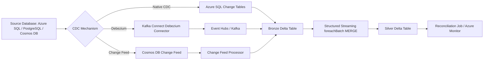
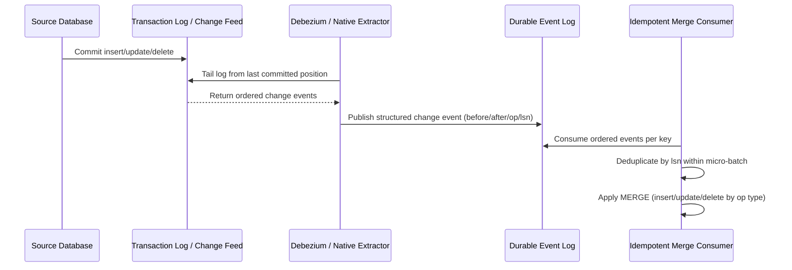
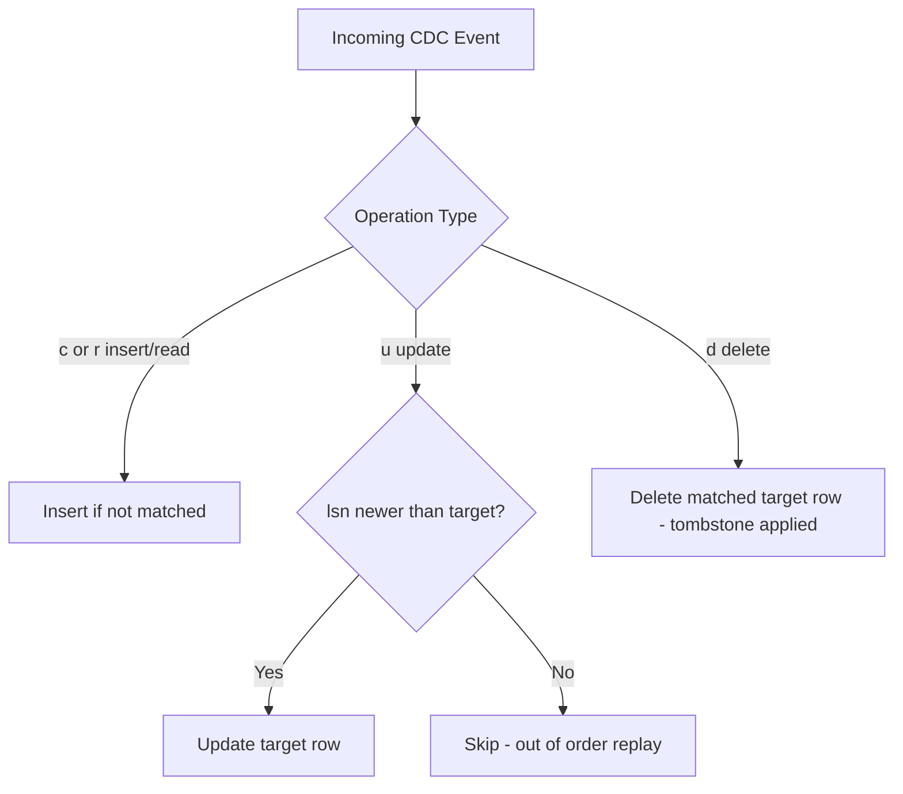

# Change Data Capture

> Part of the **Enterprise Data & AI Architecture Handbook** · Phase-07 - Streaming & Real-Time Analytics · Chapter 06.
> Estimated study time: **60 min reading + ~4h labs**.
> **Prerequisite:** read [Apache Kafka](02_Apache_Kafka.md) first.

---

## Executive Summary

Change Data Capture (CDC) is the architectural pattern that turns a database's own write activity into a durable, ordered, replayable event stream, without requiring source applications to be rewritten to publish events explicitly. Its value is structural: instead of periodically querying a table to infer what changed (fragile, lossy, and expensive at scale), CDC captures every insert, update, and delete as it happens, in commit order, directly from the database's internal change record — the transaction log for relational systems, or a purpose-built change feed for managed cloud databases such as Cosmos DB.

The central architectural distinction this chapter draws precisely is **log-based versus query-based CDC**. Query-based CDC (periodically polling for rows with a modified timestamp or an incrementing key) is simple to implement but structurally cannot see deletes, cannot reliably capture multiple updates to the same row between polls, and imposes repeated read load on the source system. Log-based CDC reads the database's write-ahead log or transaction log directly (as Debezium does for PostgreSQL, MySQL, SQL Server, and others), capturing every change exactly once, in order, including deletes represented as **tombstone** records, with minimal impact on the source system's live query workload. This is the same fundamental trade-off between weak, inferred signals and a durable, authoritative log that motivates Kafka's own architecture, as established in [Apache Kafka](02_Apache_Kafka.md) — CDC is, in effect, applying that same durable-log philosophy to the database's own internal change record rather than to application-level event publishing.

Debezium is the de facto standard log-based CDC implementation, deployed as a set of Kafka Connect source connectors that tail a source database's transaction log and publish structured change events (before/after row images, operation type, source metadata) to Kafka topics — a direct, concrete application of the Kafka Connect integration pattern from [Apache Kafka](02_Apache_Kafka.md). On Azure, this pairs naturally with Event Hubs' Kafka-compatible endpoint, and Azure-native databases increasingly expose their own managed change-capture mechanisms — Azure SQL's native Change Data Capture and Change Tracking features, and Cosmos DB's change feed — that reduce or eliminate the need to self-host Debezium for those specific sources.

The practical, Azure-first conclusion: prefer a database's native managed change-capture mechanism (Azure SQL CDC/Change Tracking, Cosmos DB change feed) when available and sufficient, reserve Debezium on Kafka Connect for sources without a good native option (self-managed PostgreSQL/MySQL, on-premises or IaaS databases) or when a unified multi-database CDC pipeline architecture is required, and always design the downstream consumer with **idempotent, ordered, tombstone-aware merge logic** — most commonly a Delta Lake (or Iceberg) `MERGE` keyed on the source's primary key and ordered by log sequence number or commit timestamp — because CDC's at-least-once delivery guarantee, like every other streaming source in this handbook, only becomes a correct outcome when the sink is built to expect it.

## Learning Objectives

By the end of this chapter you will be able to:

1. Distinguish log-based and query-based CDC, and explain precisely why query-based CDC cannot reliably capture deletes or intermediate updates.
2. Explain how Debezium captures changes from a source database's transaction log and publishes them as structured events via Kafka Connect, extending the Connect pattern from [Apache Kafka](02_Apache_Kafka.md).
3. Reason about CDC event ordering guarantees, deduplication strategy, and tombstone handling for deletes.
4. Design an idempotent CDC-to-Delta-Lake (or Iceberg) ingestion pipeline using `MERGE` keyed on primary key and ordered by log sequence number.
5. Configure and use Azure SQL's native Change Data Capture and Change Tracking features, and choose correctly between them.
6. Configure and consume the Azure Cosmos DB change feed, and reason about its ordering and delivery guarantees.
7. Choose correctly between native managed change-capture mechanisms and self-hosted Debezium for a given source database and enterprise constraint set.
8. Diagnose common production failure modes: snapshot/initial-load gaps, schema evolution breaking downstream consumers, and out-of-order or missed tombstones.
9. Design end-to-end Azure-native CDC architectures spanning capture, durable log, and idempotent lakehouse ingestion.
10. Defend a CDC architecture and tooling decision in a staff-level review.

## Business Motivation

- Enterprises need lakehouse and analytical systems to reflect operational database state with low latency, without burdening source OLTP systems with expensive polling queries or nightly full-table extracts.
- Microservice architectures need a reliable way to propagate state changes from a system-of-record database to other services without introducing dual-write consistency problems.
- Cache invalidation, search-index synchronization, and materialized-view maintenance all need a durable, ordered signal of exactly what changed in a source database, not just periodic bulk comparisons.
- Data migration and replatforming programs need CDC to keep an old and new system synchronized during a phased cutover, avoiding a risky big-bang migration.
- Regulatory and audit requirements increasingly need a durable, replayable record of every change to sensitive records, which query-based polling cannot reconstruct after the fact for deleted rows.
- FinOps programs benefit when CDC eliminates expensive, brute-force nightly full-table extracts in favor of incremental, low-overhead capture.
- Getting CDC ordering, dedup, or tombstone handling wrong is an expensive mistake to discover in production, typically surfacing as silently missing deletes or duplicated records in a downstream analytical table.

## History and Evolution

- Early data integration relied heavily on nightly batch ETL extracts, either full-table dumps or query-based incremental extraction using a "last modified" timestamp column, both of which were expensive, lossy for deletes, and increasingly incompatible with real-time business expectations.
- Database replication technologies (native database replication, trigger-based CDC) existed for years but were typically vendor-specific, operationally heavy, or intrusive to the source schema (trigger-based approaches add write-path overhead and schema coupling).
- Debezium emerged as an open-source project built directly on Kafka Connect, standardizing log-based CDC across multiple relational and NoSQL databases with a consistent event schema and integration model, dramatically lowering the barrier to adopting log-based CDC broadly.
- Kafka's own maturation (as covered in [Apache Kafka](02_Apache_Kafka.md)) provided the durable, ordered, replayable substrate that made CDC-as-a-continuous-stream architecturally practical at enterprise scale, rather than CDC being a batch-oriented extraction technique.
- Cloud-managed databases began exposing their own native change-capture primitives to avoid requiring customers to operate Debezium themselves: Azure SQL's Change Data Capture and Change Tracking features, and Azure Cosmos DB's change feed, each tailored to their underlying storage engine.
- The rise of the lakehouse and open table formats (Delta Lake, Apache Iceberg, Apache Hudi) gave CDC pipelines a natural, transactional, mergeable destination, making CDC-into-lakehouse a standard medallion-architecture ingestion pattern rather than a bespoke integration project.
- Current enterprise practice increasingly treats CDC as a first-class ingestion pattern for lakehouse Bronze layers, with native cloud-database change-capture mechanisms preferred where sufficient, and Debezium reserved for sources or architectures that need it.

## Why This Technology Exists

CDC exists because query-based polling is a fundamentally inadequate way to detect database changes at enterprise scale. A polling query using a "last modified" timestamp cannot see a row that was deleted (it is simply gone from the result set, indistinguishable from never having existed), cannot reliably capture multiple updates to the same row that happened between two poll intervals (only the latest state is visible), and imposes recurring read load on a production OLTP system purely to detect changes it already recorded internally in its transaction log.

Log-based CDC exists because the database has already done the hard work of recording every change, in order, durably, as part of its own crash-recovery and replication machinery — the transaction log. Reading that log directly (rather than re-deriving change information via application-level queries) captures every insert, update, and delete exactly once, in true commit order, with minimal additional load on the source system, since log-tailing is a fundamentally lighter-weight operation than repeated table scans.

Debezium and Kafka Connect specifically exist to standardize this pattern across many different database engines behind a consistent event schema and operational model, so that "add CDC for a new source" becomes a matter of configuring a connector rather than building bespoke log-parsing code for each database technology, directly extending the standardized source/sink integration philosophy already established for Kafka Connect in [Apache Kafka](02_Apache_Kafka.md). Cloud-native change-capture mechanisms (Azure SQL CDC/Change Tracking, Cosmos DB change feed) exist for the same underlying reason, tailored to their specific storage engines, to avoid every customer needing to operate their own log-tailing infrastructure.

## Problems It Solves

| Problem | CDC's response |
|---|---|
| Query-based polling cannot see deleted rows | Log-based CDC captures deletes explicitly as tombstone events |
| Multiple updates to a row between polls are lost | Log-based CDC captures every intermediate change, in order |
| Nightly full-table extracts are expensive and slow | Incremental, continuous capture of only actual changes |
| Source OLTP systems suffer load from repeated polling queries | Log-tailing imposes minimal additional load compared to table scans |
| Downstream systems need low-latency reflection of operational state | Continuous, near-real-time change propagation via a durable log |
| Multiple databases need a standardized integration approach | Debezium/Kafka Connect provide a consistent connector model across engines |
| Migration programs need old and new systems kept in sync during cutover | CDC-driven dual-write/dual-read synchronization during a phased migration |

## Problems It Cannot Solve

- CDC cannot retroactively recover changes that occurred before the transaction log's retention window or before the CDC mechanism was enabled; an initial full snapshot is still required to establish a starting baseline.
- It does not eliminate the need for idempotent, ordered downstream processing; CDC delivery is fundamentally at-least-once (a connector restart can reprocess recent log entries), and the consumer must be built to expect duplicates, exactly as established generally in [Apache Kafka](02_Apache_Kafka.md) and [Streaming Fundamentals](01_Streaming_Fundamentals.md).
- It cannot make schema evolution in the source database automatically safe for downstream consumers; a column rename or type change in the source table can silently break a downstream pipeline unless schema evolution is explicitly governed.
- Log-based CDC cannot be applied to a source system that does not expose or retain a durable transaction log (or an equivalent managed change feed), which rules it out for some legacy or highly restricted systems.
- It does not replace application-level event publishing where business semantics (not just row-level changes) need to be communicated; a raw CDC event describes "this row changed," not "why," and business-meaningful domain events are sometimes still needed alongside CDC.
- It cannot guarantee zero source-side performance impact; even efficient log-tailing has some overhead, and aggressive polling intervals or heavy transformation logic in the CDC pipeline can still affect source system resources if not sized carefully.

## Core Concepts

### 8.1 Log-based versus query-based CDC

**Query-based CDC** periodically queries a source table for rows changed since the last poll, typically using a "last modified" timestamp or monotonically increasing key. It is simple to implement without any special database feature, but it structurally cannot detect deletes (a deleted row simply disappears from the query result), cannot reliably capture multiple updates between polls (only the latest state is visible), and requires accurate, consistently maintained "last modified" columns, which are easy to get wrong. **Log-based CDC** reads the database's write-ahead log or transaction log directly, capturing every committed change — including deletes as explicit tombstone events — exactly once and in true commit order, with substantially lower source-side overhead than repeated polling queries.

### 8.2 Debezium and Kafka Connect connectors

Debezium is deployed as a set of **Kafka Connect source connectors**, one per supported database engine (PostgreSQL, MySQL, SQL Server, MongoDB, Oracle, and others), each tailing that engine's specific transaction log format (logical replication slots for PostgreSQL, the binlog for MySQL, CDC tables or the transaction log for SQL Server) and translating captured changes into a standardized event envelope published to Kafka topics — typically one topic per source table. This is a direct, concrete instance of the Kafka Connect framework described generally in [Apache Kafka](02_Apache_Kafka.md): declarative connector configuration rather than hand-written log-parsing code.

### 8.3 The Debezium change event structure

A Debezium change event carries a **before** image (the row's state prior to the change, null for inserts), an **after** image (the row's state following the change, null for deletes), an **operation type** (`c` for create/insert, `u` for update, `d` for delete, `r` for a read/snapshot event), and **source metadata** (database, table, transaction ID, and a log sequence number or equivalent ordering position). This structure is what lets a downstream consumer distinguish an insert from an update from a delete unambiguously, and reconstruct the correct final state via an ordered merge.

### 8.4 Ordering, deduplication, and tombstones

Debezium publishes change events for a given row (or a related key) to the same Kafka partition, preserving per-key ordering exactly as described generally for Kafka in [Apache Kafka](02_Apache_Kafka.md) — this is essential, since applying an update before its corresponding insert, or an old update after a newer one, would silently corrupt downstream state. **Deduplication** is required because CDC delivery is at-least-once: a connector restart can reprocess recently captured events, so downstream consumers must dedupe using a deterministic ordering key (commit log sequence number, or a combination of transaction ID and event sequence) rather than assuming exactly-once arrival. **Tombstones** are the CDC-specific mechanism for representing deletes: a delete event typically carries the row's before-image with a null after-image, and Kafka-level log-compaction semantics may additionally use a null-valued tombstone record to signal that a compacted topic should eventually purge the key entirely.

### 8.5 CDC into Delta Lake / Apache Iceberg

The standard pattern for landing CDC events into a lakehouse Bronze-to-Silver pipeline is to consume the ordered CDC stream and apply a **`MERGE`** statement against the target Delta Lake or Iceberg table, keyed on the source table's primary key, using the operation type to decide whether to insert, update, or delete the corresponding target row, and using the log sequence number (or commit timestamp) both to order concurrent changes to the same key within a micro-batch and to make the merge idempotent against replayed events. This is a direct, CDC-specific application of the idempotent-sink discipline established generally in [Streaming Fundamentals](01_Streaming_Fundamentals.md) and applied concretely for Structured Streaming's `foreachBatch` pattern.

### 8.6 Azure SQL Change Data Capture and Change Tracking

Azure SQL offers two distinct native change-detection features that are frequently confused. **Change Data Capture (CDC)** records full before/after row images of inserts, updates, and deletes into system-managed change tables, closely paralleling Debezium's event model, and is well suited to full-fidelity downstream replication or auditing. **Change Tracking** is a lighter-weight mechanism that records only which rows changed and their primary keys (not the actual before/after values), suited to synchronization scenarios where the consumer can re-query the current row state rather than needing the historical row image — a materially cheaper mechanism for that narrower use case.

### 8.7 Azure Cosmos DB change feed

Cosmos DB's **change feed** is a persistent, ordered (per logical partition key) record of changes made to items within a container, exposed as a read API rather than a database-log-tailing mechanism, natively supporting consumption via Azure Functions triggers, the Change Feed Processor library, or Spark connectors. It guarantees at-least-once delivery of changes in order per partition key, but (depending on configuration and Cosmos DB API/mode) may not always expose delete events with full historical detail in the same way Debezium's before-image does, which is an important capability gap to validate against a specific pipeline's requirements before design.

## Internal Working

### 9.1 How Debezium tails a transaction log

Upon startup, a Debezium connector first performs a **consistent initial snapshot** of the source tables (reading their current full state under a consistent transaction boundary), then switches to continuously tailing the source database's transaction log (via PostgreSQL logical replication slots, the MySQL binlog, or SQL Server's CDC capture mechanism) from the exact log position corresponding to the snapshot's boundary, ensuring no gap and no unintended overlap between the snapshot and the streamed changes that follow.

### 9.2 How ordering and partitioning are preserved

Debezium publishes change events keyed by the source table's primary key (or a configured logical key), which Kafka's partitioner hashes to a partition, guaranteeing that all changes to a given row land in the same partition and are therefore delivered in the same relative order they were committed in the source database — the same per-partition ordering guarantee described generally in [Apache Kafka](02_Apache_Kafka.md), applied here to database row changes rather than application-level events.

### 9.3 How a downstream merge achieves idempotent, ordered application

A downstream consumer (typically a Structured Streaming or batch job) processes a micro-batch of CDC events, first deduplicating to retain only the latest event per primary key **within that micro-batch** based on log sequence number or commit timestamp, then applying a single `MERGE` statement against the target table: matched rows with a `delete` operation type are deleted, matched rows with an `update` operation type are updated only if the incoming event's ordering key is newer than the target's currently stored ordering key (guarding against out-of-order replay), and unmatched rows with a `create`/`read` operation type are inserted. This pattern is what converts CDC's inherently at-least-once, potentially out-of-order-across-batches delivery into a correct, idempotent target state.

### 9.4 How Azure SQL's native CDC captures changes internally

Azure SQL's CDC feature uses SQL Server's transaction log reader agent internally to asynchronously scan the log for changes on CDC-enabled tables and populate system-managed change tables with captured net changes, which downstream consumers query incrementally using CDC's provided functions (`cdc.fn_cdc_get_all_changes_...`) bounded by log sequence number ranges — functionally similar to Debezium's log-tailing approach, but exposed as queryable change tables within the database itself rather than published directly to an external log.

### 9.5 How the Cosmos DB change feed delivers ordered updates

The Cosmos DB change feed is implemented as a per-partition, append-only record of the latest state of each modified item (not necessarily every intermediate historical state, depending on write frequency and feed-read cadence), read incrementally via continuation tokens that track a consumer's position, guaranteeing at-least-once, in-partition-order delivery to any registered consumer (Azure Functions trigger, Change Feed Processor, or Spark connector), which then must independently implement any deduplication or idempotent application logic downstream exactly as for any other CDC source.

## Architecture

### 10.1 Azure-first reference architecture

The common Azure pattern depends on the source database. For a self-managed PostgreSQL or MySQL database on Azure VMs or Azure Database for PostgreSQL/MySQL Flexible Server, Debezium runs as Kafka Connect connectors (self-managed on AKS, or via Confluent Cloud) publishing to Azure Event Hubs' Kafka-compatible endpoint (per [Azure Event Hubs and Stream Analytics](03_Azure_Event_Hubs_and_Stream_Analytics.md)) or a native Kafka cluster. For Azure SQL, native CDC or Change Tracking is consumed directly (via a scheduled or streaming extraction job) without needing Debezium at all. For Cosmos DB, the change feed is consumed via the Change Feed Processor library or an Azure Functions trigger. In every case, the captured, ordered change stream lands in a Bronze Delta Lake table, and a Structured Streaming or scheduled batch job (per [Spark Structured Streaming](05_Spark_Structured_Streaming.md)) applies an idempotent `MERGE` into curated Silver tables governed by Unity Catalog.

### 10.2 Why the architecture works

This architecture keeps CDC capture, the durable log, and idempotent lakehouse application as distinct, independently scalable and observable concerns, mirroring the general decoupled-consumer principle established in [Apache Kafka](02_Apache_Kafka.md). Preferring native managed change-capture mechanisms where available (Azure SQL, Cosmos DB) reduces operational burden versus self-hosting Debezium, while Debezium remains available as the standardized fallback for sources without a sufficient native option.

### 10.3 ADR example: use native Azure SQL Change Data Capture for Azure SQL sources, Debezium on Kafka Connect only for self-managed/open-source database sources

**Context:** The enterprise has a mix of Azure SQL databases and self-managed PostgreSQL databases (some still on IaaS VMs pending migration) that both need CDC into the lakehouse. Standardizing entirely on Debezium for every source would require operating Kafka Connect infrastructure even for Azure SQL sources that already expose an adequate native change-capture mechanism; standardizing entirely on native mechanisms is not possible because PostgreSQL on IaaS VMs has no equivalent Azure-managed feature.

**Decision:** Use Azure SQL's native Change Data Capture feature (not Change Tracking, since downstream consumers need full before/after row images for audit and merge correctness) for all Azure SQL sources, extracted via a scheduled Structured Streaming or batch job reading the CDC change tables directly. Use Debezium on Kafka Connect (self-hosted on AKS, publishing to Event Hubs' Kafka-compatible endpoint) specifically for the self-managed PostgreSQL sources, until or unless those databases migrate to a managed Azure service with an adequate native mechanism.

**Consequences:** Azure SQL sources avoid the operational overhead of a Kafka Connect deployment entirely, while PostgreSQL sources get a proven, standardized log-based CDC mechanism. The organization operates two distinct CDC extraction patterns rather than one uniform pipeline, which requires documenting both clearly so downstream consumers understand which mechanism feeds which source.

**Alternatives considered:**

1. Debezium for every source including Azure SQL: rejected because it adds unnecessary Kafka Connect operational burden for a source that already has a sufficient native mechanism.
2. Azure SQL Change Tracking instead of Change Data Capture: rejected because downstream audit and merge-correctness requirements need full before/after row images, which Change Tracking does not provide.
3. Wait for PostgreSQL migration to a managed Azure service before implementing any CDC: rejected because the migration timeline was too long relative to the business need for near-real-time lakehouse ingestion from those sources today.

## Components

| Component | Role | Typical Azure-first implementation | Common failure mode |
|---|---|---|---|
| Source transaction log / change table | Durable record of committed changes | PostgreSQL logical replication slot, Azure SQL CDC change tables, Cosmos DB change feed | log/replication slot retention too short, causing gaps if a consumer falls behind |
| Debezium connector | Tails the log and publishes structured change events | Kafka Connect on AKS or Confluent Cloud | connector restart reprocessing recent events without downstream dedup handling |
| Durable event log | Buffers and orders captured change events | Azure Event Hubs (Kafka-compatible) or Kafka | too few partitions limiting per-table parallelism, or key choice breaking per-row ordering |
| Initial snapshot mechanism | Establishes a consistent starting baseline | Debezium snapshot mode, or an explicit full extract for native mechanisms | snapshot and streamed-change boundary misaligned, causing gaps or duplicate rows |
| Idempotent merge consumer | Applies ordered, deduplicated changes to the target table | Structured Streaming `foreachBatch` with Delta `MERGE` | merge not guarding against out-of-order replay using log sequence number |
| Schema registry | Governs source schema evolution for downstream consumers | Confluent Schema Registry or Azure Schema Registry | permissive compatibility mode allowing a breaking source schema change to propagate silently |
| Target lakehouse table | Curated, queryable reflection of source state | Delta Lake (or Iceberg) Bronze/Silver tables under Unity Catalog | target table diverges from source due to unhandled deletes or missed tombstones |

## Metadata

| Metadata class | What to record | Why it matters |
|---|---|---|
| Source configuration metadata | database engine, CDC mechanism (log-based/native/change feed), retention window | governs realistic reprocessing and gap-recovery capability |
| Snapshot metadata | snapshot mode, snapshot completion timestamp, log position at snapshot boundary | prevents gaps or overlaps between initial load and streamed changes |
| Ordering key metadata | log sequence number / commit timestamp field used for merge ordering | makes idempotent merge correctness auditable |
| Schema metadata | source schema version, compatibility mode, owning team | prevents undocumented breaking changes from propagating downstream |
| Tombstone/delete handling metadata | how deletes are represented and applied at the target | prevents silently retained "zombie" rows that were deleted at the source |
| Target table metadata | merge key, last successful merge micro-batch ID, row count reconciliation status | supports drift detection between source and target |
| Operational metadata | connector lag, snapshot duration, merge micro-batch duration | first-class pipeline health signals |

## Storage

| Storage concern | Recommended posture | Notes |
|---|---|---|
| Source log/replication slot retention | size to cover the realistic window a CDC consumer might fall behind or be down for maintenance | insufficient retention causes an unrecoverable gap requiring a full re-snapshot |
| Durable event log (Event Hubs/Kafka) retention | size to cover the realistic reprocessing/backfill window | consistent with the general replay-for-reprocessing principle from [Apache Kafka](02_Apache_Kafka.md) |
| Bronze CDC landing table | append-only Delta table retaining raw change events for audit and reprocessing | preserves the ability to rebuild Silver tables from scratch if merge logic changes |
| Silver curated table | Delta/Iceberg table maintained via idempotent MERGE | regular `OPTIMIZE`/compaction needed given frequent small merge writes |
| Change table storage (Azure SQL CDC) | monitor and manage cleanup job retention explicitly | unmanaged change-table growth can itself become a source-database storage concern |

## Compute

| Workload class | Best Azure-first surface | Why it fits | Wrong default |
|---|---|---|---|
| Self-managed PostgreSQL/MySQL CDC | Debezium on Kafka Connect (AKS or Confluent Cloud) | standardized, proven log-based CDC across engines | operating Debezium for a source that already has a sufficient native mechanism |
| Azure SQL CDC extraction | Scheduled Structured Streaming or batch job reading CDC change tables | reuses native Azure SQL feature without extra infrastructure | assuming Debezium's SQL Server connector is required when native CDC suffices |
| Cosmos DB change feed consumption | Change Feed Processor library, Azure Functions trigger, or Spark connector | native, serverless-friendly consumption model | polling Cosmos DB via queries instead of using the purpose-built change feed |
| Idempotent merge application | Azure Databricks Structured Streaming (per [Spark Structured Streaming](05_Spark_Structured_Streaming.md)) | native Delta `MERGE` and lakehouse governance integration | hand-rolled custom merge logic outside the governed lakehouse pipeline pattern |

## Networking

- Co-locate Debezium/Kafka Connect infrastructure, the source database, and the durable event log in the same Azure region to minimize replication lag and network cost.
- Use Private Link/Private Endpoint for connectivity between Kafka Connect (on AKS), the source database, and Event Hubs.
- Size network bandwidth for the initial snapshot phase separately from steady-state streaming change volume, since a large initial snapshot can be a significant one-time network and I/O burden on the source database.
- Ensure Cosmos DB change feed consumers (Functions, Change Feed Processor) are deployed in the same region as the Cosmos DB account to minimize latency and RU consumption from cross-region reads.

## Security

| Concern | Recommended control |
|---|---|
| Source database credentials | Managed identities or Key Vault-backed secrets for Debezium/native CDC extraction jobs, never embedded credentials |
| CDC replication user privileges | Least-privilege replication/CDC-reader role, not a full administrative account |
| In-transit encryption | TLS for all connector, Event Hubs, and Cosmos DB traffic |
| At-rest encryption | Platform-managed or customer-managed keys for Bronze/Silver tables and change-table storage |
| Sensitive field handling | Classify and mask/tokenize sensitive fields before they land in shared Bronze CDC tables consumed by many teams |
| Schema/data governance | Enforce Schema Registry compatibility mode for any CDC topic with more than one consuming team |
| Audit | Preserve full before/after row images (where feature-appropriate) as an auditable change history, subject to data-retention and privacy policy |

## Performance

- Size the initial snapshot phase carefully; a very large table's snapshot can significantly load the source database and should be scheduled during a low-traffic window where possible.
- Monitor Debezium/native CDC extraction lag continuously as the CDC-specific equivalent of Kafka consumer lag from [Apache Kafka](02_Apache_Kafka.md).
- Batch merge operations at a sensible micro-batch cadence; merging too frequently increases Delta transaction-log overhead and small-file accumulation, while merging too infrequently increases end-to-end freshness latency.
- Deduplicate within each micro-batch before merging (retaining only the latest event per key) to avoid unnecessary redundant merge work against the target table.
- Monitor Cosmos DB change feed consumption RU cost separately from primary read/write RU cost, since sustained change feed consumption is a continuous RU draw.

| Pattern | Recommendation | Why |
|---|---|---|
| High-volume OLTP table CDC | Higher Event Hubs/Kafka partition count aligned to table key distribution, moderate merge micro-batch interval | balances throughput and merge efficiency |
| Low-volume reference table CDC | Change Tracking (Azure SQL) or a simple scheduled full-refresh merge | avoids CDC infrastructure overhead for low-value, low-volume tables |
| Audit-critical financial table CDC | Full Debezium/Azure SQL CDC with before/after images retained in Bronze | favors auditability and completeness over minimal storage cost |
| Cosmos DB CDC to lakehouse | Change Feed Processor with a checkpoint store, moderate polling interval | balances freshness against RU consumption |

## Scalability

- Scale Kafka/Event Hubs partition count for CDC topics to match the source table's realistic write throughput and downstream merge-consumer parallelism.
- Scale Debezium Kafka Connect tasks (where the connector supports table-level parallelism) to handle multiple large tables concurrently without one slow table blocking others.
- Scale the idempotent merge consumer's compute (Databricks cluster size) to the actual merge workload, monitoring merge duration trend as the primary scaling signal.
- For Cosmos DB, scale change feed consumption alongside container throughput (RU/s) provisioning, since change feed reads consume RU capacity from the same budget as primary operations.
- Revisit CDC architecture (native versus Debezium) as source databases migrate between platforms; a migration from self-managed PostgreSQL to Azure Database for PostgreSQL Flexible Server may change which CDC mechanism is optimal.

## Fault Tolerance

- Size source log/replication slot retention to tolerate a realistic CDC consumer outage window without an unrecoverable gap; monitor replication slot/log retention consumption explicitly, since an unconsumed, growing replication slot can itself threaten source database storage health.
- Debezium/Kafka Connect checkpointing (committed Kafka Connect offsets) allows a connector restart to resume from its last processed log position rather than re-snapshotting from scratch.
- Idempotent merge logic at the target ensures a connector restart's inevitable at-least-once reprocessing does not corrupt the target table with duplicate or out-of-order changes.
- Test failure recovery deliberately: kill a Debezium connector task mid-stream and verify it resumes correctly without gaps or duplication at the target table.
- For Azure SQL native CDC, monitor and manage the CDC cleanup job's retention window explicitly, since change tables that are cleaned up before a lagging consumer reads them create an unrecoverable gap identical in effect to an expired replication slot.

## Cost Optimization

- Prefer native managed change-capture mechanisms (Azure SQL CDC/Change Tracking, Cosmos DB change feed) over self-hosted Debezium wherever sufficient, to avoid the ongoing operational cost of a Kafka Connect deployment.
- Use Change Tracking instead of full CDC for Azure SQL tables that genuinely only need "which rows changed," not full before/after row images, since it is a lighter-weight mechanism.
- Right-size Kafka Connect/Debezium infrastructure to actual source table volume rather than provisioning uniformly across tables with very different change rates.
- Monitor Cosmos DB change feed RU consumption and tune polling interval to avoid unnecessary RU draw for low-change-rate containers.
- Retain Bronze CDC landing tables with a deliberate lifecycle policy rather than indefinite raw retention, balancing audit/reprocessing value against storage cost.

Worked FinOps example: consider an enterprise operating Debezium on a dedicated AKS node pool for a set of Azure SQL databases, costing a materially higher monthly compute and operational-engineering bill in illustrative terms than migrating those specific sources to Azure SQL's native Change Data Capture feature, which requires no separate Kafka Connect infrastructure at all — only a scheduled extraction job reading the change tables. Making this switch for the Azure SQL sources (retaining Debezium only for the genuinely non-Azure-SQL sources) can materially reduce both infrastructure cost and the ongoing engineering time spent operating and upgrading the Kafka Connect cluster. The lesson generalizes: CDC cost problems are frequently a mismatch between a uniformly applied tool (Debezium everywhere) and a source-specific native alternative that is cheaper and sufficient, and the first FinOps lever is validating whether the current CDC mechanism is genuinely necessary for each specific source before optimizing its infrastructure sizing.

## Monitoring

| Metric | Why it matters | Typical threshold |
|---|---|---|
| CDC extraction/connector lag | shows whether capture is keeping pace with source changes | alert on sustained growth |
| Replication slot / change-table retention consumption | signals risk of an unrecoverable gap if a consumer falls further behind | alert well before retention exhaustion |
| Merge micro-batch duration | signals target-side processing health | alert on rising trend relative to trigger interval |
| Source-versus-target row count reconciliation | detects silent drift from missed deletes or duplicate inserts | run on a scheduled cadence, not only reactively |
| Schema compatibility violations | signals source schema drift attempts | review any rejected or quarantined events |
| Cosmos DB change feed RU consumption | cost and capacity signal | review against provisioned container RU/s |

## Observability

Observability for a CDC pipeline should answer: is capture keeping pace with source changes, how much retention buffer remains before an unrecoverable gap, does the target table's row count and content actually reconcile with the source, and what changed recently in source schema or connector configuration.

- correlate extraction/connector lag with replication slot or change-table retention consumption to catch a developing gap before it becomes unrecoverable,
- capture before/after image samples periodically for audit and correctness spot-checks, not only aggregate row counts,
- track merge micro-batch duration and dedup/tombstone-application counts as first-class metrics, not just an internal job detail,
- preserve source schema version history alongside pipeline telemetry so a review can correlate a schema change with any observed downstream anomaly.

### Operational response playbooks

| Signal | Detection query or rule | Likely cause | First remediation |
|---|---|---|---|
| CDC extraction lag grows steadily | Connector/extraction lag metric trending upward without recovering | under-provisioned Connect task parallelism, source database load spike, or a downstream sink slowdown | scale Connect tasks/partitions, investigate source load, or address downstream merge bottleneck |
| Replication slot / change-table retention nearing exhaustion | Retention consumption metric approaching configured limit | consumer has been down or lagging for an extended period | prioritize restoring consumer health immediately; if retention is exhausted, plan a full re-snapshot |
| Source-target row count reconciliation fails | Scheduled reconciliation job reports a mismatch | missed tombstones, a schema-evolution gap, or a merge-logic bug | investigate recent schema changes, verify tombstone/delete handling, and re-run a targeted backfill for affected keys |

## Governance

- Require every production CDC pipeline to document its source CDC mechanism (log-based, native, or change feed), snapshot strategy, ordering key, and tombstone-handling approach as reviewed metadata.
- Treat source schema changes as reviewed events requiring explicit validation of downstream compatibility, not silent propagation.
- Enforce Schema Registry compatibility mode for any Debezium-sourced CDC topic with more than one consuming team.
- Require a documented, tested full-re-snapshot recovery procedure for every CDC pipeline before production sign-off.
- Align CDC pipeline governance with Unity Catalog (or equivalent) lineage tracking so Bronze/Silver tables populated via CDC carry the same governance rigor as any other lakehouse ingestion path.

## Trade-offs

| Choice | Advantages | Disadvantages | When to prefer it |
|---|---|---|---|
| Log-based CDC (Debezium) | Captures every change including deletes, minimal source overhead, standardized across engines | Requires operating Kafka Connect infrastructure | Self-managed or open-source database sources without a sufficient native mechanism |
| Query-based CDC | Simple to implement, no special database feature required | Cannot reliably capture deletes or intermediate updates, imposes recurring source load | Low-value, low-change-rate tables where full fidelity is not required |
| Azure SQL native CDC | No separate infrastructure, full before/after row images | Azure SQL-specific, does not generalize to other engines | Azure SQL sources needing full-fidelity change capture |
| Azure SQL Change Tracking | Lighter-weight than full CDC | No before/after row images, requires re-querying current state | Synchronization scenarios where only "what changed" (not historical values) matters |
| Cosmos DB change feed | Native, serverless-friendly, no separate infrastructure | Delete-event fidelity and historical detail depend on configuration/mode | Cosmos DB sources needing change propagation to downstream systems |

## Decision Matrix

| Requirement | Debezium/Kafka Connect | Azure SQL native CDC | Azure SQL Change Tracking | Cosmos DB change feed |
|---|---|---|---|---|
| Full before/after row images | strong | strong | weak | medium (configuration-dependent) |
| No additional infrastructure to operate | weak | strong | strong | strong |
| Multi-engine standardization | strong | n/a (Azure SQL only) | n/a (Azure SQL only) | n/a (Cosmos DB only) |
| Lowest source-side overhead for simple sync | medium | medium | strong | strong |
| Suitable for self-managed/on-prem databases | strong | weak | weak | weak |

Use this matrix as a starting filter; the final choice still depends on the specific source engine, fidelity requirement, and existing infrastructure investment.

## Design Patterns

1. **Native-first CDC pattern:** default to a database's native managed change-capture mechanism where sufficient; reserve Debezium for sources without one.
2. **Snapshot-then-stream pattern:** always perform a consistent initial snapshot before switching to streamed log-tailing, ensuring no gap or overlap at the boundary.
3. **Log-sequence-ordered idempotent merge pattern:** deduplicate within each micro-batch and merge using a log sequence number or commit timestamp to guard against out-of-order replay.
4. **Tombstone-aware deletion pattern:** explicitly handle delete operation types in the merge logic, removing corresponding target rows rather than only handling inserts and updates.
5. **Bronze-raw-retention pattern:** retain raw CDC events in an append-only Bronze table, enabling Silver table rebuilds if merge logic or business rules change.
6. **Reconciliation-as-a-safety-net pattern:** run a scheduled source-versus-target row count (and sampled content) reconciliation job independent of the streaming pipeline itself.

## Anti-patterns

- Using query-based polling for a table that genuinely needs delete visibility or full change history.
- Assuming CDC delivery is exactly-once and omitting deduplication logic in the downstream merge.
- Enabling CDC without first validating source log/replication slot retention is sufficient for a realistic consumer-outage window.
- Ignoring schema evolution governance, letting a source schema change silently break or corrupt a downstream Silver table.
- Operating Debezium for a source (such as Azure SQL) that already has a sufficient, lower-overhead native change-capture mechanism.
- Treating Cosmos DB's change feed as automatically equivalent in delete-fidelity to Debezium's before-image model without validating the specific configuration.

## Common Mistakes

- Forgetting that Azure SQL Change Tracking does not provide historical row values, then discovering a downstream audit requirement cannot be met after the fact.
- Letting a source database's replication slot or change-table retention run out because a downstream consumer was down longer than anticipated, forcing an unplanned full re-snapshot.
- Merging CDC events without an ordering key, allowing an out-of-order replay to overwrite newer data with stale data.
- Not handling delete/tombstone events at all, leaving deleted source rows permanently present in the downstream Silver table.
- Allowing a permissive Schema Registry compatibility mode on a Debezium-sourced topic, letting a breaking source schema change propagate downstream unnoticed.
- Assuming Cosmos DB's change feed guarantees the same delete-event fidelity as Debezium without validating the specific API/mode in use.

## Best Practices

- default to native managed change-capture mechanisms where sufficient, reserving Debezium for sources without one,
- always perform a consistent initial snapshot before switching to streamed capture, and document the exact snapshot-to-stream boundary,
- deduplicate and merge using a log sequence number or commit timestamp, never assuming exactly-once delivery,
- explicitly handle delete/tombstone events in every downstream merge,
- monitor extraction lag and log/replication-slot retention consumption as first-class production health signals,
- enforce Schema Registry compatibility mode (or equivalent schema governance) for any multi-consumer CDC topic,
- run scheduled source-versus-target reconciliation independent of the streaming pipeline itself.

## Enterprise Recommendations

1. Default to native managed change-capture mechanisms (Azure SQL CDC/Change Tracking, Cosmos DB change feed) where sufficient; reserve Debezium/Kafka Connect for sources without an adequate native option.
2. Require a documented initial snapshot strategy and snapshot-to-stream boundary validation for every CDC pipeline before production.
3. Mandate log-sequence-ordered, deduplicated, tombstone-aware merge logic for every CDC-to-lakehouse ingestion pipeline.
4. Require extraction lag and retention-consumption monitoring as standard dashboard metrics for every production CDC pipeline.
5. Enforce Schema Registry compatibility mode for any Debezium-sourced CDC topic with more than one consuming team.
6. Require a scheduled, independent source-versus-target reconciliation job for every CDC pipeline feeding a curated Silver table.
7. Treat source schema changes as reviewed events requiring explicit downstream compatibility validation.
8. Periodically reassess native-versus-Debezium choice as source databases migrate between platforms.

## Azure Implementation

### 31.1 Recommended Azure service map

| Layer | Preferred Azure service | Notes |
|---|---|---|
| Azure SQL CDC | Native Change Data Capture / Change Tracking | no separate infrastructure required |
| Cosmos DB CDC | Native change feed via Change Feed Processor or Azure Functions trigger | serverless-friendly, no separate infrastructure |
| Self-managed/open-source database CDC | Debezium on Kafka Connect (AKS or Confluent Cloud) | standardized log-based CDC across engines |
| Durable event log | Azure Event Hubs (Kafka-compatible endpoint) | consistent with [Azure Event Hubs and Stream Analytics](03_Azure_Event_Hubs_and_Stream_Analytics.md) |
| Idempotent lakehouse ingestion | Azure Databricks Structured Streaming with Delta `MERGE` | consistent with [Spark Structured Streaming](05_Spark_Structured_Streaming.md) |
| Monitoring | Azure Monitor, Log Analytics, Databricks system tables | correlate extraction lag, retention consumption, and merge health |

### 31.2 Example enabling Azure SQL native Change Data Capture (T-SQL)

```sql
EXEC sys.sp_cdc_enable_db;

EXEC sys.sp_cdc_enable_table
    @source_schema = N'sales',
    @source_name = N'Order',
    @role_name = NULL,
    @supports_net_changes = 1;

SELECT * FROM cdc.fn_cdc_get_all_changes_sales_Order(
    sys.fn_cdc_get_min_lsn('sales_Order'),
    sys.fn_cdc_get_max_lsn(),
    N'all'
);
```

### 31.3 Example Debezium PostgreSQL connector configuration (Kafka Connect JSON)

```json
{
  "name": "orders-postgres-cdc",
  "config": {
    "connector.class": "io.debezium.connector.postgresql.PostgresConnector",
    "database.hostname": "psql-edai-orders-prod.postgres.database.azure.com",
    "database.port": "5432",
    "database.user": "debezium_replicator",
    "database.password": "${file:/opt/kafka/secrets/db-creds.properties:password}",
    "database.dbname": "orders",
    "topic.prefix": "edai.orders",
    "table.include.list": "sales.order_header,sales.order_line",
    "plugin.name": "pgoutput",
    "snapshot.mode": "initial",
    "tombstones.on.delete": "true",
    "key.converter": "org.apache.kafka.connect.json.JsonConverter",
    "value.converter": "org.apache.kafka.connect.json.JsonConverter"
  }
}
```

### 31.4 Example idempotent, ordered Delta MERGE for CDC ingestion (PySpark, Structured Streaming `foreachBatch`)

```python
from pyspark.sql import functions as F
from pyspark.sql.window import Window

def upsert_orders(batch_df, batch_id):
    # Deduplicate within the micro-batch, keeping only the latest event per key
    w = Window.partitionBy("order_id").orderBy(F.col("lsn").desc())
    deduped = (
        batch_df
        .withColumn("rn", F.row_number().over(w))
        .filter("rn = 1")
        .drop("rn")
    )
    deduped.createOrReplaceTempView("cdc_updates")

    deduped.sparkSession.sql("""
        MERGE INTO silver.orders AS target
        USING cdc_updates AS source
        ON target.order_id = source.order_id
        WHEN MATCHED AND source.op = 'd' THEN DELETE
        WHEN MATCHED AND source.lsn > target.lsn THEN UPDATE SET *
        WHEN NOT MATCHED AND source.op != 'd' THEN INSERT *
    """)

cdc_stream = spark.readStream.format("eventhubs").options(**eh_conf).load()

(cdc_stream
    .writeStream
    .foreachBatch(upsert_orders)
    .option("checkpointLocation", "abfss://checkpoints@stedaicuratedprod.dfs.core.windows.net/silver/orders_cdc")
    .trigger(processingTime="1 minute")
    .start())
```

### 31.5 Example Cosmos DB change feed consumption (Change Feed Processor, Java-style pseudocode)

```java
CosmosAsyncClient client = new CosmosClientBuilder()
    .endpoint(cosmosEndpoint)
    .credential(new DefaultAzureCredentialBuilder().build())
    .buildAsyncClient();

ChangeFeedProcessor processor = new ChangeFeedProcessorBuilder()
    .hostName("orders-cdc-consumer")
    .feedContainer(client.getDatabase("retail").getContainer("orders"))
    .leaseContainer(client.getDatabase("retail").getContainer("orders-leases"))
    .handleChanges((List<JsonNode> changes) -> {
        for (JsonNode change : changes) {
            publishToEventHub(change); // forward to durable log for lakehouse ingestion
        }
    })
    .buildChangeFeedProcessor();

processor.start().block();
```

### 31.6 Practical Azure guidance

- Use Azure SQL native CDC (not Change Tracking) when downstream consumers need full before/after row images for audit or accurate merge logic.
- Use Cosmos DB's Change Feed Processor library (rather than hand-rolled polling) for reliable, checkpointed change feed consumption.
- Reserve Debezium on Kafka Connect for self-managed or open-source database sources without a sufficient native Azure alternative.
- Always validate source log/replication slot or change-table retention against a realistic consumer-outage recovery window before production sign-off.

## Open Source Implementation

Debezium is itself the open-source reference implementation for log-based CDC across relational and NoSQL engines; this section covers the surrounding OSS ecosystem completing an enterprise-grade CDC deployment.

| Layer | Open-source choice | Notes |
|---|---|---|
| Log-based CDC capture | Debezium (PostgreSQL, MySQL, SQL Server, MongoDB connectors) | standardized across engines, deployed via Kafka Connect |
| Durable event log | Apache Kafka | direct substitute for Azure Event Hubs |
| Idempotent lakehouse ingestion | Spark Structured Streaming with Delta Lake, Apache Iceberg, or Apache Hudi MERGE/upsert | Apache Hudi in particular was designed with CDC-style upserts as a primary use case |
| Schema governance | Confluent Schema Registry or Apicurio Registry | enforces compatibility for Debezium-published topics |
| Observability | Prometheus, Grafana, OpenTelemetry | Debezium exposes JMX metrics for connector lag and snapshot progress |

Example Apache Hudi upsert for CDC ingestion, illustrating a table-format alternative to Delta Lake's MERGE for the same idempotent-application pattern:

```python
hudi_options = {
    "hoodie.table.name": "orders",
    "hoodie.datasource.write.recordkey.field": "order_id",
    "hoodie.datasource.write.precombine.field": "lsn",
    "hoodie.datasource.write.operation": "upsert",
    "hoodie.datasource.write.table.type": "MERGE_ON_READ",
}

(deduped_cdc_df.write
    .format("hudi")
    .options(**hudi_options)
    .mode("append")
    .save("abfss://lakehouse@stedaicuratedprod.dfs.core.windows.net/orders_hudi"))
```

This reinforces the same core decisions emphasized throughout this chapter: an explicit ordering/precombine key, an explicit upsert (idempotent merge) semantics, and an explicit record key — expressed here against Apache Hudi's native CDC-oriented upsert model instead of a hand-written Delta `MERGE`.

## AWS Equivalent (comparison only)

| Azure pattern | AWS equivalent | Advantages | Disadvantages | Migration note |
|---|---|---|---|---|
| Azure SQL native CDC | AWS Database Migration Service (DMS) CDC mode, or native SQL Server CDC on RDS | comparable managed CDC extraction options | different extraction and target-format conventions | re-validate ordering-key and merge logic against the new extraction format |
| Debezium on Kafka Connect (self-hosted) | Debezium on Amazon MSK Connect | same open-source connector, managed Connect runtime | different networking/IAM integration | mostly a lift-and-shift for connector configuration; revalidate connectivity |
| Cosmos DB change feed | DynamoDB Streams | comparable native, per-partition ordered change stream | different consumption API and event structure | re-validate delete-event fidelity and consumption library equivalents |

## GCP Equivalent (comparison only)

| Azure pattern | GCP equivalent | Advantages | Disadvantages | Migration note |
|---|---|---|---|---|
| Azure SQL native CDC | Google Cloud Datastream (CDC for Cloud SQL and other sources) | comparable managed CDC extraction | different extraction and target-format conventions | re-validate ordering-key and merge logic against the new extraction format |
| Debezium on Kafka Connect (self-hosted) | Debezium on GKE or a managed Kafka service on GCP | same open-source connector | operational burden similar to self-managed AKS path | mostly a lift-and-shift for connector configuration; revalidate connectivity |
| Cosmos DB change feed | Firestore/Bigtable change streams | comparable native, ordered change stream | different consumption API and event structure | re-validate delete-event fidelity and consumption library equivalents |

## Migration Considerations

- When migrating a source database between platforms (self-managed PostgreSQL to Azure Database for PostgreSQL Flexible Server, for example), re-validate whether a native Azure change-capture mechanism becomes available, potentially eliminating the need for Debezium.
- Preserve dual-running capability (old and new CDC pipelines both landing to a staging table) during a migration window to validate correctness via reconciliation before final cutover.
- Re-verify ordering-key semantics after any migration; a log sequence number format or equivalent ordering field may differ between the old and new CDC mechanism.
- When migrating the target lakehouse table format (Delta Lake to Iceberg or Hudi, for example), re-verify merge/upsert idempotency logic explicitly, since MERGE semantics and precombine/ordering-key handling differ across table formats.
- Budget for a reconciliation period comparing source-versus-target row counts and sampled content between old and new pipelines before decommissioning the source pipeline.

## Mermaid Architecture Diagrams







## End-to-End Data Flow

1. A source database commits an insert, update, or delete as part of a normal transaction, writing it to its transaction log (or Cosmos DB's internal change tracking).
2. A CDC mechanism — Debezium tailing the log, Azure SQL's native CDC change-table population, or Cosmos DB's change feed — captures the change, preserving commit order per key.
3. The captured change is published as a structured event (before image, after image, operation type, ordering key) to a durable event log (Event Hubs/Kafka) or made available via a change-table query or change feed read.
4. A consumer (Structured Streaming job, Change Feed Processor, or scheduled batch extraction) reads the ordered change stream and lands raw events in an append-only Bronze Delta table for audit and reprocessing capability.
5. A downstream micro-batch job deduplicates events by ordering key within the batch, retaining only the latest event per primary key.
6. The job applies a single `MERGE` statement against the target Silver table: inserting new rows, updating matched rows only if the incoming event is newer, and deleting rows corresponding to delete/tombstone events.
7. A scheduled, independent reconciliation job periodically compares source and target row counts (and sampled content) to detect silent drift.
8. Azure Monitor, Log Analytics, and Databricks system tables collect extraction lag, retention consumption, and merge-duration telemetry across the pipeline for ongoing observability.

## Real-world Business Use Cases

| Use case | Why CDC fits | Typical mechanism choice |
|---|---|---|
| Lakehouse Bronze ingestion from operational databases | Low-latency, low-overhead reflection of OLTP state without expensive polling | Azure SQL native CDC or Debezium, depending on source engine |
| Cache invalidation and search-index synchronization | Reliable, ordered signal of exactly what changed, including deletes | Debezium or Cosmos DB change feed feeding a downstream invalidation consumer |
| Microservice data synchronization without dual writes | Durable, replayable change stream avoiding distributed-transaction complexity | Debezium via Kafka/Event Hubs |
| Legacy-to-cloud migration with phased cutover | Keeps old and new systems synchronized during a gradual migration | Debezium or native CDC feeding both old and new targets during the transition |
| Regulatory audit trail of sensitive record changes | Full before/after row image history, including deletes | Azure SQL native CDC or Debezium with before-image retention |

## Industry Examples

| Industry | Common CDC workload | Frequent tuning focus | Common pitfall |
|---|---|---|---|
| Banking / payments | ledger and account CDC into lakehouse and audit systems | full before/after image retention, ordering-key discipline | assuming exactly-once delivery and omitting dedup logic |
| Retail / e-commerce | order and inventory CDC feeding real-time inventory and analytics | merge micro-batch tuning, tombstone handling | deleted orders/products silently retained in Silver tables |
| Healthcare | patient record CDC for downstream analytics with strict auditability | full-fidelity change capture, retention/reconciliation | change-table cleanup running before a lagging consumer reads it |
| Insurance | policy and claims CDC for migration and modernization programs | dual-run reconciliation during phased cutover | schema evolution breaking downstream consumers silently |
| SaaS / multi-tenant platforms | Cosmos DB change feed driving materialized views and cache invalidation | change feed RU cost tuning, per-partition-key ordering | assuming change feed exposes full delete-event fidelity without validation |

## Case Studies

### Case study 1: replication slot exhaustion during an extended consumer outage

A retail platform's Debezium PostgreSQL connector was down for several days during an unrelated infrastructure migration, and the PostgreSQL logical replication slot's retained WAL grew until it began threatening the source database's disk capacity, since PostgreSQL cannot recycle WAL segments still required by an active, unconsumed replication slot.

The fix restored the connector promptly, added explicit monitoring and alerting on replication slot WAL retention, and documented a maximum-tolerable-outage policy tied to available disk headroom. The lesson was that CDC's durability guarantee is bounded by source-side retention capacity, and that capacity is a shared resource with the production database itself, not a free, unlimited buffer.

### Case study 2: silently retained "zombie" rows from unhandled deletes

An early CDC-to-lakehouse pipeline for a manufacturing work-order system only handled insert and update operation types in its merge logic, omitting explicit delete handling under the assumption that work orders were rarely deleted. When a data-cleanup initiative deleted a batch of erroneous work orders at the source, the corresponding rows remained permanently present in the downstream Silver table, corrupting a downstream reporting aggregate that assumed the Silver table reflected current source state.

The fix added explicit delete/tombstone handling to the merge logic and ran a one-time reconciliation and cleanup pass to remove the zombie rows. The lesson was that CDC merge logic must handle all three operation types from day one, not add delete handling reactively after a business assumption ("deletes are rare") proves false.

### Case study 3: out-of-order replay corrupted a customer record after a connector restart

An insurance platform's CDC pipeline merged events using insertion order rather than the source's log sequence number, assuming Kafka's per-partition ordering alone was sufficient. After a connector restart reprocessed a small window of recently captured events (a normal at-least-once behavior), a replayed older update was applied after a newer one had already been merged, temporarily reverting a customer's policy status to a stale value.

The fix changed the merge logic to compare the incoming event's log sequence number against the target row's currently stored log sequence number, only applying updates that were actually newer. The lesson reinforced that per-partition ordering in the durable log (per [Apache Kafka](02_Apache_Kafka.md)) is necessary but not sufficient; the merge logic itself must also explicitly guard against out-of-order replay using a genuine ordering key.

## Hands-on Labs

1. **Log-based versus query-based CDC lab:** implement both a query-based polling extractor and a Debezium log-based connector against the same test table, then delete a row and observe which approach correctly captures the deletion.
2. **Idempotent merge lab:** build a Delta `MERGE`-based CDC ingestion pipeline, deliberately replay a batch of already-processed events, and verify no duplication or incorrect overwrite occurs.
3. **Tombstone handling lab:** delete rows at the source, verify tombstone events are correctly captured and propagated, and confirm the corresponding target rows are removed from the Silver table.
4. **Azure SQL CDC versus Change Tracking lab:** enable both features on the same table, compare the information each exposes, and document which downstream use cases each can and cannot support.

Acceptance criteria:

- the log-based versus query-based lab demonstrates a concrete, reproducible difference in delete-event visibility between the two approaches,
- the idempotent merge lab shows zero duplication or incorrect state after a deliberate event replay,
- the tombstone lab confirms deleted source rows are correctly removed from the target table, not silently retained,
- the Azure SQL comparison lab documents at least one concrete use case each feature can and cannot support.

## Exercises

1. Explain precisely why query-based CDC cannot reliably capture deletes.
2. Describe the Debezium change event structure (before, after, operation type, source metadata) and how each field is used downstream.
3. Explain why CDC merge logic must use a log sequence number or commit timestamp rather than assuming exactly-once, in-order delivery.
4. Compare Azure SQL Change Data Capture and Change Tracking, and identify a use case that requires the former specifically.
5. Design a tombstone-handling strategy for a CDC pipeline feeding a Silver Delta table.
6. Explain the risk of an unmonitored, unconsumed PostgreSQL logical replication slot.
7. Compare Debezium and Cosmos DB's native change feed on delivery guarantees and delete-event fidelity.
8. Explain how [Apache Kafka](02_Apache_Kafka.md)'s per-partition ordering guarantee applies to CDC event delivery.
9. Design a reconciliation strategy to detect silent drift between a CDC pipeline's source and target tables.
10. Identify at least two anti-patterns from this chapter present in a hypothetical existing CDC deployment and propose fixes.

## Mini Projects

1. **End-to-end CDC-to-lakehouse project:** implement a full CDC pipeline from a source table (via Debezium or Azure SQL native CDC) through a durable event log into an idempotent, tombstone-aware Delta Silver table.
2. **Native-versus-Debezium comparison project:** implement the same CDC use case using both Azure SQL native CDC and Debezium's SQL Server connector, and document a decision recommendation with evidence.
3. **Reconciliation and drift-detection project:** build a scheduled job that compares source and target row counts and sampled content for a CDC pipeline, and demonstrate it catching a deliberately introduced drift scenario.

## Capstone Integration

This chapter operationalizes the durable-log and idempotent-sink discipline from earlier Phase-07 chapters onto database change capture specifically.

- Use [Apache Kafka](02_Apache_Kafka.md) for the durable, ordered, replayable log substrate that Debezium publishes to, and for the general exactly-once and partition-ordering reasoning that CDC pipelines depend on.
- Use [Streaming Fundamentals](01_Streaming_Fundamentals.md) for the general at-least-once delivery and idempotent-sink vocabulary that CDC merge logic implements concretely.
- Use [Azure Event Hubs and Stream Analytics](03_Azure_Event_Hubs_and_Stream_Analytics.md) for the managed durable-log option that Debezium and native Azure change-capture mechanisms typically feed into on Azure.
- Use [Spark Structured Streaming](05_Spark_Structured_Streaming.md) for the idempotent, Delta-native merge pattern that turns a CDC stream into a correct, curated lakehouse table.
- Carry the native-mechanism-first, Debezium-as-fallback decision framework established here into any future data-integration or migration architecture across the handbook.

## Interview Questions

1. What is the difference between log-based and query-based CDC?
2. Why can't query-based CDC reliably capture deletes?
3. What does a Debezium change event contain, and how is each field used downstream?
4. Why must a downstream CDC merge use a log sequence number rather than assuming in-order delivery?
5. What is the difference between Azure SQL's Change Data Capture and Change Tracking features?
6. What risk does an unmonitored, unconsumed replication slot pose to a source database?
7. How does Cosmos DB's change feed differ from Debezium's log-tailing approach?
8. Why is an initial snapshot necessary even when streaming log-tailing is in place?

## Staff Engineer Questions

1. How would you decide whether a new source database should use a native change-capture mechanism or Debezium?
2. How would you design a reconciliation process to catch silent drift between a CDC pipeline's source and target tables?
3. What telemetry would you require before approving a CDC pipeline's readiness for production, particularly around retention and lag?
4. How would you handle a breaking source schema change in a CDC pipeline feeding multiple downstream consuming teams?
5. How would you design a phased migration strategy using CDC to keep an old and new system synchronized during cutover?
6. What criteria would justify retaining Debezium for a source that later migrates to a platform with a native change-capture option?

## Architect Questions

1. Where should CDC pipelines sit relative to application-level event publishing and batch ETL in the enterprise integration architecture?
2. How do you decide, across a large multi-database estate, which sources get native change-capture mechanisms and which get Debezium?
3. How would you govern schema evolution consistently across CDC pipelines feeding many downstream consuming teams?
4. What migration strategy would you design for moving a CDC pipeline's target table format (Delta Lake to Iceberg or Hudi) without breaking idempotency guarantees?
5. How do you ensure CDC-fed curated tables receive the same lineage, governance, and quality standards as any other lakehouse ingestion path?

## CTO Review Questions

1. Which business-critical lakehouse tables depend on CDC pipelines that have not been independently reconciled against their source in the last quarter?
2. How much of current CDC infrastructure spend is driven by Debezium deployments that could be replaced by a native Azure change-capture mechanism?
3. Which CDC pipelines lack a documented, tested recovery procedure for replication slot or change-table retention exhaustion?
4. What governance mechanism ensures source schema changes are reviewed for downstream CDC consumer impact before they ship?
5. How will the enterprise measure whether its CDC investment is reducing integration risk and cost compared to the batch extraction processes it replaced?

## References

- Internal prerequisite chapters:
- [Apache Kafka](02_Apache_Kafka.md)
- [Streaming Fundamentals](01_Streaming_Fundamentals.md)
- [Azure Event Hubs and Stream Analytics](03_Azure_Event_Hubs_and_Stream_Analytics.md)
- [Spark Structured Streaming](05_Spark_Structured_Streaming.md)
- Canonical sources to study separately:
- Debezium project documentation on connector configuration, snapshot modes, and event structure.
- Microsoft documentation for Azure SQL Change Data Capture, Change Tracking, and Azure Cosmos DB change feed.
- Delta Lake and Apache Hudi documentation on MERGE/upsert semantics for CDC-style ingestion.
- Confluent documentation on Kafka Connect and Schema Registry compatibility modes.

## Further Reading

- Revisit [Apache Kafka](02_Apache_Kafka.md) to deepen the durable-log, partition-ordering, and Kafka Connect concepts that Debezium builds directly on.
- Revisit [Streaming Fundamentals](01_Streaming_Fundamentals.md) to reconnect CDC's at-least-once delivery and idempotent-sink requirements to the general streaming vocabulary.
- Revisit [Spark Structured Streaming](05_Spark_Structured_Streaming.md) to deepen the `foreachBatch` MERGE pattern used throughout this chapter's ingestion examples.
- Study Debezium's documentation on snapshot modes and incremental snapshotting for large-table initial-load strategies.
- Study real production incident post-mortems involving replication slot exhaustion or unhandled tombstones to build intuition for how these guarantees actually fail in practice.
