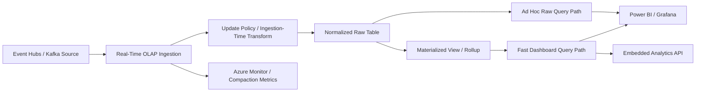
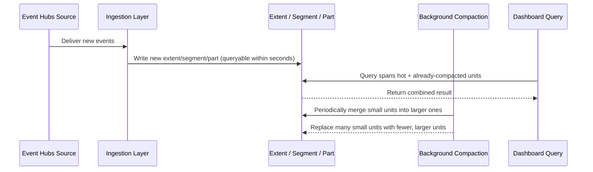
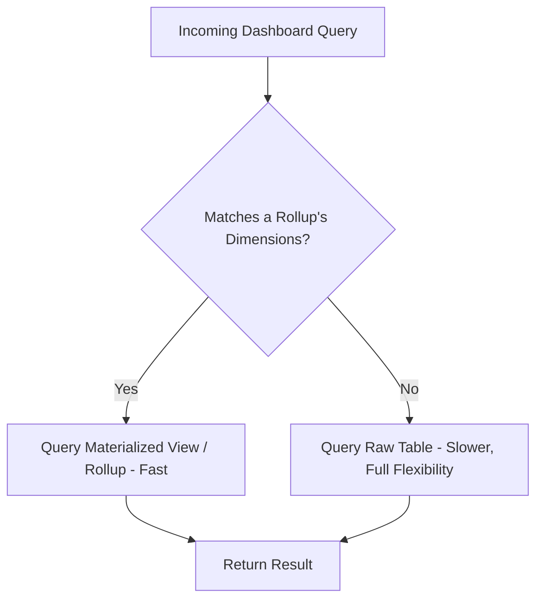

# Real-Time Analytics: ClickHouse and Druid

> Part of the **Enterprise Data & AI Architecture Handbook** · Phase-07 - Streaming & Real-Time Analytics · Chapter 07.
> Estimated study time: **60 min reading + ~4h labs**.
> **Prerequisite:** read [Streaming Fundamentals](01_Streaming_Fundamentals.md) first.

---

## Executive Summary

Real-time OLAP engines — ClickHouse, Apache Druid, Apache Pinot, and Azure's own Azure Data Explorer (Kusto) — exist to answer a question none of the earlier Phase-07 chapters solve: once events have been captured, windowed, and curated, how does a human or an application run an ad hoc, sub-second analytical query ("show me error rate by region for the last 15 minutes, sliced by customer tier") against data that is still arriving? Kafka ([Apache Kafka](02_Apache_Kafka.md)) gives you a durable log. Flink and Structured Streaming ([Apache Flink](04_Apache_Flink.md), [Spark Structured Streaming](05_Spark_Structured_Streaming.md)) give you continuously computed, predefined aggregates. None of them give you **interactive, arbitrary-dimension, low-latency query** over high-velocity data — that is a fundamentally different storage and execution problem, requiring a purpose-built serving engine.

These engines share a common architectural DNA: columnar, compressed storage for scan efficiency; near-real-time ingestion that makes newly arrived rows queryable within seconds, not after a batch load; segment/partition-based indexing (time-partitioned segments in Druid and Pinot, MergeTree-based parts in ClickHouse, extents in Kusto) that supports concurrent background compaction while continuing to serve queries; and materialized views or pre-aggregated rollups that trade storage and ingestion-time compute for dramatically faster query-time performance on known, high-value query shapes. The differences are in emphasis: ClickHouse optimizes for raw single-node and cluster scan throughput with a remarkably simple operational model; Druid and Pinot optimize for very high concurrent query volume against pre-indexed, segment-based storage, historically popular for embedded, user-facing analytics; Azure Data Explorer optimizes for the same class of problem with a fully managed, KQL-based experience deeply integrated into the Azure ecosystem (Log Analytics, Sentinel, IoT, and Azure Monitor all run on Kusto under the hood).

The architectural discipline this chapter adds to the streaming vocabulary from [Streaming Fundamentals](01_Streaming_Fundamentals.md) is **materialized rollups as first-class query acceleration**: rather than relying purely on raw-event scan speed, these engines let architects pre-aggregate along known query dimensions (time bucket, region, customer tier) at ingestion time, trading some flexibility and storage for a query experience that stays fast even as raw event volume grows into the billions of rows.

The practical, Azure-first conclusion: default to **Azure Data Explorer (ADX)** for real-time analytical serving on Azure — it is fully managed, natively KQL-integrated with the rest of the Azure observability and security stack, and directly comparable in architecture and performance envelope to Druid/ClickHouse — and reserve self-managed ClickHouse, Druid, or Pinot for cases with a specific open-source ecosystem requirement, an existing multi-cloud investment, or a documented feature or cost advantage that ADX does not match for the specific workload.

## Learning Objectives

By the end of this chapter you will be able to:

1. Explain why durable logs and stream-processing engines alone do not solve the interactive, ad hoc real-time query problem, and what real-time OLAP engines add.
2. Compare ClickHouse, Apache Druid, and Apache Pinot on ingestion model, indexing/segment architecture, and query concurrency characteristics.
3. Design near-real-time ingestion pipelines feeding these engines from Kafka/Event Hubs with correct indexing and partitioning choices.
4. Design materialized views and rollups that trade storage and ingestion compute for query-time acceleration on known query shapes.
5. Use Azure Data Explorer (Kusto) and KQL for real-time ingestion, update policies, and materialized views.
6. Choose correctly between Azure Data Explorer and a self-managed ClickHouse/Druid/Pinot deployment for a given enterprise workload and constraint set.
7. Design real-time dashboard and serving architectures that avoid overloading OLTP or lakehouse systems with high-concurrency analytical query load.
8. Diagnose common production failure modes: segment/part explosion from small-batch ingestion, unbounded rollup cardinality, and query concurrency saturation.
9. Map streaming ingestion patterns from earlier Phase-07 chapters onto a real-time OLAP serving layer end to end.
10. Defend a real-time analytics engine and architecture decision in a staff-level review.

## Business Motivation

- Operational dashboards (fraud monitoring, network operations centers, live business KPIs) need sub-second query response against data that is seconds old, which neither a data warehouse's typical refresh cadence nor a raw event log can satisfy directly.
- Customer-facing, embedded analytics (usage dashboards inside a SaaS product, real-time leaderboards, live pricing views) need to serve high query concurrency without degrading the OLTP systems of record.
- Security operations (SIEM-style log analytics) need to query massive volumes of near-real-time telemetry interactively, which is precisely the problem Azure Data Explorer was built to solve and now powers under Azure Monitor and Microsoft Sentinel.
- IoT and industrial telemetry platforms need to support both real-time alerting and ad hoc historical drill-down over the same high-cardinality, high-velocity dataset.
- FinOps programs benefit from choosing a purpose-built real-time OLAP engine over over-provisioning a general-purpose data warehouse or lakehouse query engine to fake real-time interactivity it was not designed for.
- Getting the ingestion and indexing design wrong (unbounded rollup cardinality, badly chosen partition/segment keys) directly degrades the query latency the business is paying for the platform to deliver.

## History and Evolution

- Apache Druid emerged at Metamarkets to solve real-time, interactive analytics over high-volume event and ad-tech data, pioneering the segment-based, time-partitioned columnar storage model with near-real-time ingestion and background compaction that became a template for the category.
- ClickHouse was developed at Yandex to power real-time web analytics (Yandex.Metrica) at extreme scale, emphasizing raw columnar scan speed, a simple single-binary operational model, and a SQL dialect close enough to standard SQL to lower the adoption barrier significantly.
- Apache Pinot emerged at LinkedIn with a similar segment-based architecture to Druid but an emphasis on very high query-per-second serving for embedded, user-facing analytics (for example, "who viewed your profile" style features) at massive concurrency.
- Azure Data Explorer originated internally at Microsoft as the engine behind large-scale log and telemetry analytics, and was later externalized as a standalone Azure service, with KQL (Kusto Query Language) becoming the shared query language across Azure Monitor, Log Analytics, Microsoft Sentinel, and Application Insights.
- All four engines converged on broadly the same architectural answer independently: columnar storage, near-real-time ingestion into immutable segments/parts, background merge/compaction, and materialized aggregation as a first-class acceleration mechanism — a strong signal that this is a genuinely distinct architectural category from both OLTP databases and traditional batch data warehouses.
- Cloud-managed offerings matured this category further: Azure Data Explorer as a fully managed PaaS service, and increasingly managed/cloud offerings for ClickHouse and Druid, reducing the historical operational burden of running these engines' clustered, segment-management-heavy architectures.
- Current enterprise practice on Azure increasingly defaults to Azure Data Explorer given its native integration with the broader Azure observability and security stack, with ClickHouse, Druid, or Pinot adopted where a specific open-source, multi-cloud, or cost/performance requirement justifies the added operational ownership.

## Why This Technology Exists

Real-time OLAP engines exist because the two adjacent categories in this handbook — durable event logs ([Apache Kafka](02_Apache_Kafka.md)) and stream-processing engines ([Apache Flink](04_Apache_Flink.md), [Spark Structured Streaming](05_Spark_Structured_Streaming.md)) — are architecturally unsuited to ad hoc, low-latency, arbitrary-dimension analytical queries. A durable log can be scanned but is not indexed for analytical slicing. A stream processor computes predefined, continuously updated aggregates well, but does not let an analyst ask a brand-new question against historical-plus-live data without deploying new processing logic. Real-time OLAP engines exist specifically to fill that gap: ingest continuously, index and compress for scan efficiency, and let arbitrary SQL/KQL queries run in sub-second time against data that includes the last few seconds of activity.

They also exist because traditional data warehouses, while excellent for governed, complex, often longer-running business intelligence queries, were not built for the ingestion latency (continuous streaming ingest, not periodic batch loads) or the query concurrency (thousands of concurrent dashboard/API queries per second) that real-time, user-facing or operational analytics demands. Building that capability by over-provisioning a general-purpose warehouse is usually both more expensive and less effective than adopting an engine purpose-built for the workload.

Materialized rollups and pre-aggregation specifically exist because even a well-indexed columnar store cannot make every conceivable query fast at unlimited raw-event scale; pre-computing along the dimensions that are actually queried (a direct application of the windowed-aggregation discipline from [Streaming Fundamentals](01_Streaming_Fundamentals.md), but now materialized as a queryable table rather than a transient streaming output) is what keeps dashboards fast as data volume grows into the billions of rows.

## Problems It Solves

| Problem | Real-time OLAP engine's response |
|---|---|
| Ad hoc, low-latency analytical queries needed over data seconds old | Near-real-time ingestion into indexed, columnar, queryable storage |
| High-concurrency dashboard/API query load would overload OLTP or lakehouse systems | Purpose-built serving layer isolated from transactional and batch-analytical workloads |
| Query latency degrades as raw event volume grows | Materialized rollups/pre-aggregation along known query dimensions |
| Data needs to be both queryable in real time and retained for historical drill-down | Time-partitioned segments/extents supporting both hot recent data and cold historical data in one system |
| Multiple teams need embedded, self-service analytics without hand-building infrastructure | SQL (ClickHouse) or KQL (ADX)-based query interfaces with native BI/dashboard integration |
| Security and observability telemetry at massive scale needs interactive query | Purpose-built, natively integrated engines (ADX under Azure Monitor/Sentinel) |

## Problems It Cannot Solve

- Real-time OLAP engines are not a substitute for a transactional system of record; they are read-optimized analytical serving layers, not ACID-transactional OLTP stores, and should not hold the authoritative state of a business entity.
- They cannot make an arbitrarily unbounded-cardinality rollup cheap; pre-aggregating along a high-cardinality dimension (for example, raw user ID instead of a coarser segment) can produce as much or more storage and compute cost as not aggregating at all.
- They do not eliminate the need for correct upstream data quality and schema discipline; a bad event schema produces bad real-time aggregates just as fast as it produces bad batch ones.
- They cannot substitute for a general-purpose data warehouse's governed, complex, long-running BI workloads; forcing multi-way joins and complex business logic better suited to a warehouse into a real-time OLAP engine produces brittle, hard-to-maintain query logic.
- They do not remove the need for capacity planning; under-provisioned ingestion or query compute will still produce query latency degradation or ingestion lag regardless of the engine's architectural sophistication.
- They cannot make a poorly chosen partition/segment key evenly loaded; hot-partition or hot-segment skew remains an application/data-modeling problem, exactly as with Kafka partition skew discussed in [Apache Kafka](02_Apache_Kafka.md).

## Core Concepts

### 8.1 OLAP for streaming: the shared architectural pattern across ClickHouse, Druid, and Pinot

All three open-source engines share the same core design: data is ingested continuously (from Kafka, files, or direct API calls) into immutable, time-bounded units — **parts** in ClickHouse's MergeTree engine, **segments** in Druid and Pinot — which are individually compressed, columnar, and indexed, and which background processes periodically merge/compact into fewer, larger, more efficient units without blocking ongoing ingestion or queries. Queries execute against a combination of not-yet-compacted "hot" segments/parts and already-compacted "cold" ones, giving the illusion of a single, continuously updated table while the underlying storage is actually a managed collection of immutable pieces.

### 8.2 ClickHouse's MergeTree engine

ClickHouse's default and most common table engine family, **MergeTree**, organizes data into parts sorted by a configured primary key (an ordering key, not a uniqueness constraint), with a sparse primary index enabling efficient range scans, and background merge processes that combine smaller parts into larger ones over time. Variants (`ReplacingMergeTree`, `AggregatingMergeTree`, `SummingMergeTree`) extend this with deduplication or in-place aggregation semantics applied during merges, letting certain rollup patterns be expressed directly as a table engine choice rather than a separate materialized view.

### 8.3 Druid and Pinot's segment architecture

Druid and Pinot both partition data into time-based **segments**, each segment holding a bounded time range of rows with its own columnar storage, bitmap/inverted indexes for fast filtering on dimension columns, and dictionary encoding for string columns — a segment is the fundamental unit of storage, replication, and query parallelism. Real-time ingestion nodes (or tasks) buffer and index incoming events into in-memory or locally persisted segments that become queryable within seconds, and a background process later hands off "historical" segments to long-term, deep-storage-backed serving nodes, cleanly separating the hot, recently-ingested query path from the cold, historical query path.

### 8.4 Ingestion and indexing

Across all these engines, ingestion is designed to make new data queryable within seconds (not minutes or hours, as a batch load would), while simultaneously building the indexes (sparse primary indexes in ClickHouse, bitmap/inverted indexes and dictionary encodings in Druid/Pinot, term/columnar indexes in Kusto's extents) that make subsequent queries fast. This near-real-time indexing is the central technical achievement that distinguishes this category from a data warehouse's typical batch-load-then-index model, and it comes with an explicit cost: ingesting in very small, frequent batches produces many small segments/parts, which degrades both ingestion efficiency and query performance until background compaction catches up — a direct structural parallel to the small-file problem covered elsewhere in this handbook.

### 8.5 Materialized views and rollups

A **materialized view** or **rollup** in this context pre-computes an aggregation (commonly grouped by a coarser time bucket and a set of known dimensions) at ingestion time or via a background process, storing the pre-aggregated result as its own queryable table or segment set. Queries that match the rollup's grouping can then be served from the much smaller, pre-aggregated dataset instead of scanning raw events, often the difference between a sub-second and a multi-second (or unviable) query at scale. The trade-off is that rollups only accelerate queries whose dimensions were anticipated in advance; an ad hoc query along an unrolled-up dimension still falls back to scanning the raw event table.

### 8.6 Azure Data Explorer (Kusto) and KQL

**Azure Data Explorer** is Microsoft's fully managed, columnar, near-real-time analytical engine, queried via **KQL (Kusto Query Language)** — the same engine and query language underlying Azure Monitor Logs, Log Analytics, Microsoft Sentinel, and Application Insights. Data is organized into **databases** and **tables**, physically stored as **extents** (ADX's analogue to Druid's segments or ClickHouse's parts), with **update policies** providing a native mechanism for automatically transforming and materializing incoming data into derived tables at ingestion time, and **materialized views** providing an explicit, incrementally maintained rollup mechanism directly comparable to the rollup concept described generally above.

### 8.7 Real-time dashboards and serving

The final architectural layer this category serves is **interactive serving**: Power BI (DirectQuery or import against ADX), Grafana (native ClickHouse/Druid/ADX data sources), or custom application APIs querying these engines directly for dashboards and embedded analytics. The key architectural discipline is isolating this high-concurrency, latency-sensitive query workload from both the OLTP systems of record and the batch/streaming lakehouse compute layer, so that a dashboard refresh storm cannot degrade either transactional application performance or scheduled data pipeline SLAs.

## Internal Working

### 9.1 How ClickHouse executes a query against MergeTree parts

A ClickHouse query planner consults each relevant table's sparse primary index to skip parts (and index granules within parts) that cannot contain matching rows for the query's `WHERE` clause, then executes a vectorized, columnar scan across the surviving granules in parallel across available CPU cores, merging partial results — conceptually similar to the vectorized execution and data-skipping principles covered generally for columnar engines elsewhere in this handbook, but tuned specifically for very high scan throughput on a single node or a modestly sized cluster.

### 9.2 How Druid/Pinot separate hot and cold query paths

Newly ingested events land in real-time ingestion nodes/tasks, which build an in-memory (or locally persisted) segment that is immediately queryable, giving near-real-time visibility. On a configured handoff interval, that segment is finalized, pushed to durable deep storage (commonly cloud object storage), and served thereafter by separate "historical" nodes optimized for serving large volumes of immutable, already-indexed segments — meaning a single query at the coordinator/broker layer transparently combines results from both the hot, real-time path and the cold, historical path.

### 9.3 How Azure Data Explorer ingests and materializes data

ADX ingestion (via Event Hubs/IoT Hub streaming ingestion, or batched ingestion for higher-throughput, slightly-higher-latency scenarios) writes incoming rows into extents, optionally triggering an **update policy** — a KQL function executed automatically at ingestion time that transforms and writes derived rows into one or more target tables, commonly used to normalize, enrich, or pre-aggregate data as it lands. A **materialized view** separately and incrementally maintains a rollup aggregation over a source table, periodically merging newly ingested data into the materialized result so that queries against the view see an efficient, pre-aggregated dataset without needing to rescan the full source table's history.

### 9.4 How background compaction/merging keeps query performance stable

All these engines run continuous background processes that merge many small, recently ingested segments/parts/extents into fewer, larger, more efficient ones (ClickHouse's background merges, Druid/Pinot's segment compaction tasks, ADX's extent merging), trading some background compute cost for materially better long-term query performance and lower per-query overhead from having to consult many small storage units. Ingesting in very small, very frequent batches produces segments/parts faster than compaction can consolidate them, degrading query latency until the backlog clears — the operational failure mode to actively monitor in every one of these engines.

### 9.5 How materialized rollups are queried transparently

In systems supporting query-time rollup selection (Druid's automatic or manually configured rollup datasources, ADX materialized views queried directly or via the `materialized_view()` function), a query engine either automatically routes a query to the most specific matching rollup available, or requires the query author to explicitly query the rollup table/view rather than the raw source — a distinction that matters operationally, since an "automatic" routing system can mask a rollup gap (falling back silently to a slow raw scan) unless monitored explicitly.

## Architecture

### 10.1 Azure-first reference architecture

The common Azure pattern ingests events from Azure Event Hubs (per [Azure Event Hubs and Stream Analytics](03_Azure_Event_Hubs_and_Stream_Analytics.md)) directly into Azure Data Explorer via native streaming ingestion, with update policies transforming raw events into normalized tables and materialized views maintaining rollups along known query dimensions (time bucket, region, customer tier). Power BI and Grafana query ADX directly for dashboards, while application APIs query ADX for embedded, user-facing analytics. For workloads with a specific requirement favoring ClickHouse, Druid, or Pinot, the same Event Hubs source feeds a self-managed deployment on AKS, with the engine's own native Kafka-compatible ingestion connector consuming from Event Hubs' Kafka-compatible endpoint.

### 10.2 Why the architecture works

This architecture keeps the high-concurrency, latency-sensitive analytical serving workload fully isolated from both OLTP systems of record and the batch/streaming lakehouse compute layer, while reusing the same durable Event Hubs ingestion point already established for other Phase-07 pipelines. Azure Data Explorer's native integration with Power BI, Grafana, and the broader Azure observability stack (Azure Monitor, Sentinel) means most enterprise real-time analytics needs are served without introducing a second, unrelated open-source cluster to operate.

### 10.3 ADR example: default to Azure Data Explorer for real-time analytical serving, adopt self-managed ClickHouse only for a documented cost/performance advantage on a specific high-volume workload

**Context:** A platform team needs a real-time analytics serving layer for both internal operational dashboards and a customer-facing embedded usage-analytics feature. Azure Data Explorer would unify this with the team's existing Azure Monitor/Sentinel investment, but a benchmark shows ClickHouse delivers materially lower query latency and infrastructure cost for the specific customer-facing workload's very high query concurrency and simple, well-understood query shapes.

**Decision:** Default to Azure Data Explorer for the internal operational dashboards, given its native Azure integration and lower operational burden. Adopt a self-managed ClickHouse cluster on AKS specifically for the customer-facing embedded analytics feature, based on the documented benchmark advantage for that workload's specific query and concurrency profile.

**Consequences:** The organization operates two distinct real-time analytics engines rather than one uniform platform, which must be clearly documented so teams understand which serving layer to use for new use cases. The customer-facing feature gets a materially better cost/performance outcome, while the majority of internal analytical needs stay on the lower-operational-burden, natively integrated ADX platform.

**Alternatives considered:**

1. Azure Data Explorer for both use cases: rejected because the customer-facing workload's specific benchmark showed a material, reproducible cost/performance disadvantage for that workload's query shape and concurrency.
2. ClickHouse for both use cases: rejected because it would forgo ADX's native integration benefits for the internal dashboards, adding unnecessary operational burden for a workload ADX already serves well.
3. Build the customer-facing feature on the existing lakehouse (Databricks SQL): rejected because the lakehouse query engine's latency and concurrency profile was not competitive with a purpose-built real-time OLAP engine for this specific high-QPS, low-latency requirement.

## Components

| Component | Role | Typical Azure-first implementation | Common failure mode |
|---|---|---|---|
| Durable event source | Feeds continuous ingestion | Azure Event Hubs (native or Kafka-compatible) | insufficient partition/throughput alignment with ingestion parallelism |
| Ingestion layer | Writes incoming events into indexed, queryable storage | ADX streaming/batched ingestion; Druid/Pinot real-time nodes; ClickHouse Kafka table engine or native ingestion | very small, frequent micro-batches producing excessive small segments/parts |
| Update policy / transformation | Normalizes or enriches data at ingestion time | ADX update policies; Druid/Pinot ingestion-time transforms; ClickHouse materialized views | update policy logic silently failing and dropping rows without alerting |
| Materialized view / rollup | Pre-aggregates along known query dimensions | ADX materialized views; Druid rollup datasources; ClickHouse `AggregatingMergeTree` | unbounded rollup cardinality inflating storage and compute cost |
| Segment/part/extent storage | Columnar, compressed, indexed storage unit | ADX extents; Druid/Pinot segments; ClickHouse parts | too many small, uncompacted units degrading query latency |
| Background compaction/merge | Consolidates storage units for query efficiency | Native background processes in each engine | compaction falling behind ingestion rate under sustained high-frequency small writes |
| Query/serving layer | Serves dashboards and embedded analytics | Power BI, Grafana, custom APIs against ADX/ClickHouse/Druid | high query concurrency saturating compute without autoscaling or isolation |

## Metadata

| Metadata class | What to record | Why it matters |
|---|---|---|
| Table/schema metadata | column types, ingestion mapping, retention policy | governs query correctness and storage lifecycle |
| Rollup/materialized view metadata | grouping dimensions, aggregation functions, refresh cadence | makes rollup coverage and staleness auditable |
| Ingestion configuration metadata | batching policy (streaming vs. batched), source partition alignment | governs ingestion latency and small-segment risk |
| Segment/part/extent health metadata | count, average size, compaction backlog | leading indicator of query performance degradation |
| Query performance metadata | p50/p95/p99 latency per dashboard/API query pattern | ties platform health directly to business-facing SLAs |
| Access/governance metadata | per-database/table RBAC, row-level security policy | supports least-privilege access across many consuming teams |
| Operational metadata | ingestion lag, compaction backlog, query concurrency | first-class serving-layer health signals |

## Storage

| Storage concern | Recommended posture | Notes |
|---|---|---|
| Hot/recent data retention | size for the realistic window of high-frequency interactive queries | most dashboards query a bounded recent window; do not over-retain hot-tier storage for rarely queried history |
| Cold/historical data retention | tier to cheaper, deep storage (Druid/Pinot deep storage, ADX's own storage tiering) once data ages out of the hot query window | preserves historical drill-down capability at lower cost |
| Rollup/materialized view storage | size proportional to the cardinality of the rollup's grouping dimensions, not raw event volume | unbounded-cardinality rollups can approach or exceed raw event storage cost |
| Segment/part/extent compaction target size | tune ingestion batching to produce reasonably sized units directly, reducing compaction burden | avoids excessive background compaction compute cost from correcting overly small units after the fact |

## Compute

| Workload class | Best Azure-first surface | Why it fits | Wrong default |
|---|---|---|---|
| Enterprise real-time analytics natively integrated with Azure observability/security | Azure Data Explorer | fully managed, native KQL integration with Monitor/Sentinel/Power BI | defaulting to a self-managed OSS engine without validating ADX's native integration benefit first |
| Very high query concurrency, cost-sensitive, simple query shapes | Self-managed ClickHouse on AKS (or a managed ClickHouse offering) | strong raw scan throughput and cost efficiency for well-understood query shapes | adopting ClickHouse without a documented cost/performance benchmark against ADX |
| Embedded, user-facing analytics at massive QPS | Apache Druid or Apache Pinot on AKS | historically strong track record for high-concurrency, segment-based serving | reaching for Druid/Pinot for internal-only dashboards where ADX would suffice with less operational burden |
| Governed, complex, longer-running BI queries | Azure Databricks SQL / Synapse (lakehouse/warehouse query engines) | better suited to complex joins and governed BI than a real-time OLAP engine | forcing complex multi-way joins into a real-time OLAP engine designed for simpler, faster query shapes |

## Networking

- Co-locate the durable event source (Event Hubs), the real-time OLAP engine, and downstream dashboard/API consumers in the same Azure region to minimize ingestion and query latency.
- Use Private Link/Private Endpoint for Azure Data Explorer clusters and for self-managed ClickHouse/Druid/Pinot deployments on AKS.
- Isolate high-concurrency dashboard/API query traffic on its own network path from ingestion traffic where practical, so a query traffic spike does not starve ingestion bandwidth.
- Plan cross-region query federation carefully if serving global dashboards from a single-region deployment; consider regional read replicas or follower clusters for latency-sensitive global audiences.

## Security

| Concern | Recommended control |
|---|---|
| Ingestion authentication | Managed identities / Entra ID-backed ingestion credentials rather than embedded connection strings |
| Query access control | Azure RBAC and ADX database/table-level permissions; row-level security policies for multi-tenant data |
| In-transit encryption | TLS for all ingestion and query traffic |
| At-rest encryption | Platform-managed or customer-managed keys for ADX and self-managed engine storage |
| Multi-tenant isolation | Separate databases/tables per tenant or row-level security, never a single shared table with client-side filtering only |
| Sensitive field handling | Classify and mask/tokenize sensitive fields before they land in shared, broadly queried tables |
| Auditing | Track query access patterns and administrative changes for compliance-sensitive datasets |

## Performance

- Batch ingestion to produce reasonably sized segments/parts/extents directly, rather than ingesting in extremely small, frequent increments that overload background compaction.
- Design materialized views/rollups around the actual, observed query patterns (time bucket, region, tier), not speculative dimensions that may never be queried.
- Choose partition/segment/ordering keys aligned with the most common query filter predicates (time range plus a high-selectivity dimension) to maximize data-skipping efficiency.
- Monitor query latency percentiles (p50/p95/p99) per dashboard or API query pattern, not just an aggregate average, since a slow-tail query pattern can silently violate a business SLA while the average looks healthy.
- Isolate high-concurrency serving workloads (dashboards, embedded analytics APIs) from ingestion and compaction compute where the engine's architecture allows it (as Druid/Pinot's historical/broker separation and ADX's compute isolation both do).

| Pattern | Recommendation | Why |
|---|---|---|
| Operational dashboard over recent telemetry | ADX materialized view rolled up by minute/hour and key dimensions | favors fast, predictable dashboard refresh |
| Customer-facing embedded usage analytics | ClickHouse or Pinot tuned for high QPS, simple query shapes | favors raw concurrency and cost efficiency |
| Security/log analytics at massive scale | Azure Data Explorer under Azure Monitor/Sentinel | native integration and proven scale for this exact workload |
| Ad hoc historical drill-down | Raw event table query with time-range and high-selectivity filter | avoids relying on a rollup that does not cover the ad hoc dimension |

## Scalability

- Scale ingestion parallelism to match the source's partition count (Event Hubs/Kafka), exactly as with any other streaming consumer described in earlier Phase-07 chapters.
- Scale query-serving compute independently from ingestion compute where the engine architecture supports it, since query concurrency and ingestion throughput often grow at different rates.
- Monitor segment/part/extent count and compaction backlog as a leading scalability signal; a growing backlog degrades query performance well before compute utilization metrics alone would suggest a problem.
- For very high-cardinality rollups, evaluate whether a coarser grouping dimension can serve the same business need at materially lower storage and compute cost.
- Plan multi-region or multi-cluster scaling deliberately for globally distributed query audiences, since a single-region deployment's latency may not meet a global SLA.

## Fault Tolerance

- Rely on the durable, replayable upstream event log (Event Hubs/Kafka, per [Apache Kafka](02_Apache_Kafka.md)) to allow re-ingestion after an OLAP engine outage or data-loss event, rather than treating the OLAP engine itself as the sole durable copy of the data.
- Configure replication (ADX cluster redundancy, Druid/Pinot segment replication factor, ClickHouse replicated table engines) appropriate to the workload's availability requirements.
- Test recovery from an ingestion outage deliberately: pause ingestion, verify the upstream source retains sufficient retention to catch up, and confirm materialized views/rollups correctly backfill once ingestion resumes.
- Design multi-region DR by evaluating whether the specific engine and deployment model support cross-region replication or failover, since this varies significantly between ADX, Druid, Pinot, and ClickHouse deployment options.

## Cost Optimization

- Tier hot (frequently queried, recent) and cold (historical, rarely queried) data explicitly, using each engine's native storage tiering rather than keeping everything in the most expensive hot tier indefinitely.
- Size materialized views/rollups to the dimensions actually queried; an unused or overly granular rollup wastes both ingestion-time compute and storage.
- Right-size query-serving compute to actual concurrency and latency requirements rather than defaulting to the largest available SKU "to be safe."
- Prefer Azure Data Explorer's managed cost model over self-managed ClickHouse/Druid/Pinot infrastructure unless a documented, benchmarked cost advantage justifies the added operational ownership.
- Monitor and alert on segment/part/extent compaction backlog as a cost signal too, since a persistent backlog often means over-provisioned ingestion batching settings driving unnecessary background compute.

Worked FinOps example: consider a customer-facing usage-analytics feature initially built on Azure Data Explorer with a cluster sized for its peak query concurrency, costing a materially higher monthly bill in illustrative pricing than a benchmarked ClickHouse deployment on right-sized AKS infrastructure for the same query shapes and concurrency profile. Migrating this specific, well-understood, high-QPS workload to ClickHouse (while retaining ADX for less concurrency-intensive internal dashboards) can reduce the monthly serving-layer cost materially, at the cost of the team taking on ClickHouse cluster operations. The lesson generalizes: real-time analytics cost problems are frequently a mismatch between a workload's specific query/concurrency profile and the chosen engine's cost model, and the first FinOps lever is benchmarking the actual workload against both a managed and a self-managed option before committing to either by default.

## Monitoring

| Metric | Why it matters | Typical threshold |
|---|---|---|
| Ingestion lag (source to queryable) | direct freshness indicator for real-time dashboards | alert on sustained growth beyond the workload's freshness SLA |
| Segment/part/extent count and compaction backlog | leading indicator of query performance degradation | alert on sustained upward trend |
| Query latency percentiles (p50/p95/p99) per query pattern | ties platform health to business-facing SLAs | alert on p95/p99 regression, not just average latency |
| Materialized view / rollup staleness | signals whether a rollup is falling behind its source table | alert on staleness exceeding the acceptable freshness window |
| Query concurrency and queueing | signals need for compute scaling or workload isolation | alert on sustained queueing beyond expected levels |
| Storage growth by tier (hot vs. cold) | cost and lifecycle management signal | review against tiering policy regularly |

## Observability

Observability for a real-time OLAP serving layer should answer: is ingestion keeping pace with the source, are materialized views/rollups fresh and correctly covering the dimensions dashboards actually query, is query latency meeting the business SLA at the tail (not just on average), and is segment/part/extent compaction keeping pace with ingestion.

- correlate ingestion lag with segment/part/extent compaction backlog to distinguish a genuine ingestion-capacity problem from a compaction-lag-driven query slowdown,
- capture per-query-pattern latency (not just aggregate) as a first-class metric tied directly to specific dashboards or APIs,
- track materialized view/rollup staleness explicitly, since a stale rollup silently serving outdated aggregates is a correctness risk, not just a performance concern,
- preserve schema and rollup-definition change history alongside performance telemetry so a review can correlate a configuration change with any observed behavior shift.

### Operational response playbooks

| Signal | Detection query or rule | Likely cause | First remediation |
|---|---|---|---|
| Query latency (p95/p99) regresses for a specific dashboard | Per-query-pattern latency metric rises against a stable baseline | growing segment/part/extent count from compaction backlog, or a query newly falling outside rollup coverage | investigate compaction backlog and rollup coverage for the specific query's dimensions; add a rollup if a genuine gap exists |
| Ingestion lag grows steadily | Ingestion lag metric trending upward without recovering off-peak | under-provisioned ingestion compute, or overly small ingestion batching producing excessive segments | scale ingestion compute, and tune batching policy toward larger, less frequent ingestion units |
| Materialized view / rollup staleness grows | Rollup refresh lag metric rises against source table ingestion rate | rollup refresh compute under-provisioned, or an increasingly high-cardinality grouping dimension slowing refresh | scale rollup refresh compute, or reassess whether the grouping dimension's cardinality has grown beyond its original design assumption |

## Governance

- Require every production real-time analytics table and materialized view/rollup to document its grouping dimensions, refresh cadence, retention policy, and owning team as reviewed metadata.
- Treat schema changes, rollup redefinitions, and retention-policy changes as reviewed architectural changes, since they affect both cost and downstream dashboard correctness.
- Enforce row-level security and least-privilege access for any multi-tenant or sensitive dataset served through these engines.
- Track which dashboards/APIs depend on which specific rollups so a rollup redesign or removal can be safely coordinated with all consumers.
- Align real-time analytics governance with the broader enterprise data governance process so these tables and views are cataloged and lineage-tracked alongside batch/warehouse and streaming assets.

## Trade-offs

| Choice | Advantages | Disadvantages | When to prefer it |
|---|---|---|---|
| Azure Data Explorer | Fully managed, native Azure/Power BI/Sentinel integration, KQL | Less multi-cloud portability, cost model may not always win a specific benchmark | Most enterprise real-time analytics needs on Azure, especially observability/security-adjacent workloads |
| ClickHouse (self-managed) | Very strong raw scan throughput, simple operational model, cost-efficient at scale | Self-managed operational burden, less native Azure ecosystem integration | Documented cost/performance advantage for a specific, well-understood query and concurrency profile |
| Apache Druid / Pinot (self-managed) | Proven track record for very high-concurrency, embedded, user-facing analytics | Higher operational complexity (segment/coordinator/broker/historical topology) than ClickHouse | Massive query-per-second, user-facing analytics with a genuine multi-cloud or OSS ecosystem requirement |
| Rollup/materialized view for a query pattern | Dramatically faster, cheaper queries for that pattern | Only accelerates anticipated dimensions; unbounded cardinality inflates cost | Known, high-value, recurring query shapes (dashboards, alerts) |
| Raw event query without a rollup | Full flexibility for ad hoc questions | Slower and more expensive at very large scale | Genuinely ad hoc, exploratory, or rarely repeated queries |

## Decision Matrix

| Requirement | Azure Data Explorer | ClickHouse | Druid / Pinot |
|---|---|---|---|
| Lowest operational burden | strong | medium | weak |
| Native Azure observability/security integration | strong | weak | weak |
| Very high raw scan throughput at lowest cost | medium | strong | medium |
| Very high concurrent QPS for embedded analytics | medium | medium | strong |
| Multi-cloud/OSS ecosystem portability | weak | strong | strong |
| Complex governed BI and multi-way joins | weak | weak | weak |

Use this matrix as a starting filter; the final choice still depends on a workload-specific benchmark of query shape, concurrency, and cost.

## Design Patterns

1. **ADX-first serving pattern:** default new real-time analytics serving needs to Azure Data Explorer, especially where Azure Monitor/Sentinel/Power BI integration adds direct value.
2. **Benchmark-before-escalation pattern:** require a documented, reproducible cost/performance benchmark before adopting self-managed ClickHouse/Druid/Pinot over ADX for a specific workload.
3. **Update-policy-as-ingestion-transform pattern:** use ADX update policies (or the equivalent ingestion-time transform in ClickHouse/Druid/Pinot) to normalize and enrich raw events before they land in queryable tables.
4. **Dimension-driven rollup pattern:** design materialized views/rollups around actually observed query dimensions, reviewed and adjusted as query patterns evolve, rather than speculative upfront design.
5. **Hot/cold tiering pattern:** explicitly tier recent, frequently queried data separately from historical, rarely queried data using each engine's native storage tiering.
6. **Serving-layer isolation pattern:** isolate high-concurrency dashboard/API query workloads from both OLTP systems of record and batch/streaming lakehouse compute.

## Anti-patterns

- Defaulting to a self-managed OSS engine (ClickHouse, Druid, Pinot) without first validating whether Azure Data Explorer's native integration and managed operations already meet the requirement.
- Ingesting in extremely small, frequent batches, producing excessive small segments/parts/extents that overwhelm background compaction.
- Building a rollup along an unbounded-cardinality dimension (raw user ID, for example), inflating storage and compute cost with little query benefit.
- Treating a real-time OLAP engine as the authoritative system of record for business data rather than a read-optimized serving layer fed from a durable upstream source.
- Forcing complex, multi-way governed BI joins into a real-time OLAP engine designed for simpler, faster query shapes.
- Allowing dashboard/API query traffic to compete directly with ingestion or compaction compute without workload isolation.

## Common Mistakes

- Assuming a rollup automatically covers every dashboard's query pattern without validating actual query-to-rollup routing.
- Ignoring segment/part/extent count and compaction backlog until query latency has already visibly degraded.
- Choosing a partition/ordering/segment key that does not align with the most common query filter predicates, forgoing data-skipping efficiency.
- Provisioning a single shared table for multi-tenant data with only client-side filtering instead of row-level security or per-tenant isolation.
- Sizing ingestion batching for lowest possible latency without considering the resulting small-segment compaction burden.
- Choosing ClickHouse/Druid/Pinot for a workload's operational burden reputation appeal rather than a documented, workload-specific benchmark against Azure Data Explorer.

## Best Practices

- default to Azure Data Explorer for real-time analytical serving on Azure, especially where native ecosystem integration adds direct value,
- require a documented, workload-specific benchmark before adopting self-managed ClickHouse/Druid/Pinot as an alternative,
- design materialized views/rollups around actually observed, evolving query patterns, not speculative upfront assumptions,
- monitor ingestion lag, segment/part/extent compaction backlog, and per-query-pattern latency percentiles as first-class production health signals,
- tier hot and cold data explicitly using each engine's native storage lifecycle features,
- isolate high-concurrency serving workloads from ingestion, compaction, and unrelated batch/streaming compute,
- enforce row-level security and least-privilege access for multi-tenant or sensitive real-time analytics data.

## Enterprise Recommendations

1. Default new real-time analytical serving needs to Azure Data Explorer given its native Azure integration and managed operational model.
2. Require a documented cost/performance benchmark before adopting self-managed ClickHouse, Druid, or Pinot for a specific workload.
3. Require materialized view/rollup coverage to be reviewed and adjusted on a regular cadence as actual dashboard query patterns evolve.
4. Require ingestion lag, compaction backlog, and per-query-pattern latency percentile monitoring as standard dashboard metrics for every production real-time analytics deployment.
5. Enforce row-level security and least-privilege access for all multi-tenant or sensitive real-time analytics datasets.
6. Treat schema, rollup, and retention-policy changes as reviewed architectural changes, not routine tuning.
7. Isolate real-time analytics serving compute from OLTP systems of record and batch/streaming lakehouse compute as a standing architectural principle.
8. Periodically reassess whether workloads on self-managed ClickHouse/Druid/Pinot still justify their operational cost relative to Azure Data Explorer as requirements evolve.

## Azure Implementation

### 31.1 Recommended Azure service map

| Layer | Preferred Azure service | Notes |
|---|---|---|
| Real-time analytical serving | Azure Data Explorer | fully managed, native KQL, Power BI, Monitor, and Sentinel integration |
| Durable ingestion source | Azure Event Hubs (native or Kafka-compatible) | consistent with [Azure Event Hubs and Stream Analytics](03_Azure_Event_Hubs_and_Stream_Analytics.md) |
| Dashboards | Power BI (DirectQuery against ADX), Grafana (native ADX data source) | direct low-latency dashboard integration |
| Self-managed alternative compute | ClickHouse/Druid/Pinot on AKS | for documented, benchmarked cost/performance advantage workloads |
| Monitoring | Azure Monitor, Log Analytics, ADX diagnostic logs | correlate ingestion lag, extent count, and query performance |

### 31.2 Example Azure Data Explorer table, ingestion mapping, and update policy (KQL)

```kql
.create table RawDeviceEvents (
    DeviceId: string,
    ZoneId: string,
    Temperature: real,
    EventTimeUtc: datetime,
    IngestionTimeUtc: datetime
)

.create table NormalizedDeviceEvents (
    DeviceId: string,
    ZoneId: string,
    Temperature: real,
    EventTimeUtc: datetime
)

.create function NormalizeDeviceEvents() {
    RawDeviceEvents
    | project DeviceId, ZoneId, Temperature, EventTimeUtc
}

.alter table NormalizedDeviceEvents policy update
```json
[{
  "IsEnabled": true,
  "Source": "RawDeviceEvents",
  "Query": "NormalizeDeviceEvents()",
  "IsTransactional": true,
  "PropagateIngestionProperties": false
}]
```
```

### 31.3 Example Azure Data Explorer materialized view (rollup by minute and zone)

```kql
.create materialized-view ZoneTemperatureRollup on table NormalizedDeviceEvents
{
    NormalizedDeviceEvents
    | summarize AvgTemperature = avg(Temperature), ReadingCount = count()
        by ZoneId, bin(EventTimeUtc, 1m)
}
```

```kql
// Query the rollup directly for a fast, pre-aggregated dashboard result
ZoneTemperatureRollup
| where EventTimeUtc > ago(1h)
| summarize AvgTemperature = avg(AvgTemperature) by ZoneId, bin(EventTimeUtc, 5m)
```

### 31.4 Example Event Hubs streaming ingestion configuration (Azure CLI)

```bash
az kusto cluster create --resource-group rg-edai-rtanalytics-prod --name adx-edai-telemetry-prod --sku-name Standard_D13_v2 --sku-tier Standard --enable-streaming-ingest true

az kusto database create --resource-group rg-edai-rtanalytics-prod --cluster-name adx-edai-telemetry-prod --database-name TelemetryDb --soft-delete-period P365D --hot-cache-period P30D

az kusto data-connection event-hub create \
  --resource-group rg-edai-rtanalytics-prod \
  --cluster-name adx-edai-telemetry-prod \
  --database-name TelemetryDb \
  --data-connection-name device-telemetry-eh \
  --event-hub-resource-id "$EVENT_HUB_RESOURCE_ID" \
  --consumer-group "adx-consumer" \
  --table-name RawDeviceEvents \
  --data-format JSON \
  --mapping-rule-name RawDeviceEventsMapping
```

### 31.5 Example ClickHouse table using AggregatingMergeTree for a native rollup (SQL)

```sql
CREATE TABLE zone_temperature_raw (
    device_id String,
    zone_id String,
    temperature Float64,
    event_time_utc DateTime
) ENGINE = MergeTree()
ORDER BY (zone_id, event_time_utc);

CREATE MATERIALIZED VIEW zone_temperature_rollup
ENGINE = AggregatingMergeTree()
ORDER BY (zone_id, minute)
AS
SELECT
    zone_id,
    toStartOfMinute(event_time_utc) AS minute,
    avgState(temperature) AS avg_temperature_state,
    count() AS reading_count
FROM zone_temperature_raw
GROUP BY zone_id, minute;
```

### 31.6 Practical Azure guidance

- Use Azure Data Explorer's streaming ingestion for the lowest achievable ingestion latency from Event Hubs; use batched ingestion for higher-throughput workloads that can tolerate slightly higher ingestion latency.
- Use update policies for ingestion-time normalization/enrichment and materialized views for query-time rollup acceleration; do not conflate the two purposes.
- Size ADX's hot cache period to the realistic window of frequently queried recent data, tiering older data to cheaper storage.
- Validate a specific, documented benchmark before adopting ClickHouse/Druid/Pinot over ADX for any given workload.

## Open Source Implementation

ClickHouse, Apache Druid, and Apache Pinot are themselves the open-source reference implementations for this category; this section frames their comparative ecosystem fit.

| Layer | Open-source choice | Notes |
|---|---|---|
| High-throughput, cost-efficient scan engine | ClickHouse | simplest operational model of the three; strong single-cluster scan performance |
| High-concurrency, segment-based serving | Apache Druid | strong historical track record for embedded, user-facing analytics |
| Very high QPS embedded analytics | Apache Pinot | similar segment architecture to Druid, LinkedIn-originated, tuned for massive concurrency |
| Ingestion source | Apache Kafka | direct substitute for Azure Event Hubs, per [Apache Kafka](02_Apache_Kafka.md) |
| Dashboards | Grafana, Apache Superset | native ClickHouse/Druid/Pinot data source support |
| Orchestration | Kubernetes (AKS) | self-managed cluster topology for any of the three engines |

Example Druid ingestion spec (Kafka indexing service, illustrative JSON) showing the same core decisions as the ADX and ClickHouse examples above — explicit schema, explicit time partitioning, explicit rollup configuration:

```json
{
  "type": "kafka",
  "spec": {
    "dataSchema": {
      "dataSource": "zone_temperature",
      "timestampSpec": { "column": "event_time_utc", "format": "iso" },
      "dimensionsSpec": { "dimensions": ["zone_id", "device_id"] },
      "metricsSpec": [
        { "type": "doubleSum", "name": "temperature_sum", "fieldName": "temperature" },
        { "type": "count", "name": "reading_count" }
      ],
      "granularitySpec": {
        "type": "uniform",
        "segmentGranularity": "HOUR",
        "queryGranularity": "MINUTE",
        "rollup": true
      }
    },
    "ioConfig": {
      "topic": "device-telemetry",
      "consumerProperties": { "bootstrap.servers": "kafka-broker:9092" }
    }
  }
}
```

## AWS Equivalent (comparison only)

| Azure pattern | AWS equivalent | Advantages | Disadvantages | Migration note |
|---|---|---|---|---|
| Azure Data Explorer | Amazon OpenSearch Service (with rollups) or managed ClickHouse/Druid on AWS | comparable near-real-time analytical serving options | different query language (OpenSearch DSL vs. KQL) and integration surface | re-validate ingestion mapping, rollup definitions, and dashboard integration when migrating query logic |
| Self-managed ClickHouse/Druid/Pinot on AKS | Self-managed on EKS, or ClickHouse Cloud / managed Druid offerings | comparable operational model or reduced burden via managed offerings | different networking/IAM integration | mostly a lift-and-shift for cluster configuration; revalidate connectivity and IAM |

## GCP Equivalent (comparison only)

| Azure pattern | GCP equivalent | Advantages | Disadvantages | Migration note |
|---|---|---|---|---|
| Azure Data Explorer | Google Cloud BigQuery (streaming inserts, materialized views) or self-managed ClickHouse/Druid on GKE | BigQuery offers strong serverless analytical query capability | BigQuery's latency/concurrency profile differs from purpose-built real-time OLAP engines for very high-QPS serving | benchmark BigQuery's streaming insert and query latency against the original ADX workload before assuming parity |
| Self-managed ClickHouse/Druid/Pinot on AKS | Self-managed on GKE | comparable operational model | different networking/IAM integration | mostly a lift-and-shift for cluster configuration; revalidate connectivity and IAM |

## Migration Considerations

- When migrating between real-time OLAP engines, first migrate the concepts (schema, rollup grouping dimensions, retention policy, ingestion batching strategy) as documented decisions, then map them onto the target engine's specific configuration syntax.
- Validate query-language translation carefully (KQL to SQL, or vice versa); semantic differences in time-bucketing functions, joins, and aggregation syntax are a common source of subtle migration bugs.
- Preserve dual-running capability (old and new engines both ingesting from the same durable Event Hubs/Kafka source) during the migration window to validate query result parity before final cutover.
- Re-benchmark ingestion latency, query latency percentiles, and cost on the target engine using representative production traffic before assuming parity with the original deployment.
- Budget for a reconciliation period comparing dashboard and API query results between old and new engines before decommissioning the source.

## Mermaid Architecture Diagrams







## End-to-End Data Flow

1. Events are produced into Azure Event Hubs (or Kafka), consistent with the durable ingestion patterns from [Apache Kafka](02_Apache_Kafka.md) and [Azure Event Hubs and Stream Analytics](03_Azure_Event_Hubs_and_Stream_Analytics.md).
2. The real-time OLAP engine's streaming ingestion mechanism (ADX streaming ingestion, Druid/Pinot real-time nodes, ClickHouse's Kafka table engine) writes incoming events into a new, immediately queryable segment/part/extent.
3. An update policy or ingestion-time transform normalizes, enriches, or filters the raw incoming data into a clean, normalized table.
4. A materialized view or rollup incrementally aggregates the normalized data along known query dimensions (time bucket, region, tier).
5. Background compaction periodically merges smaller segments/parts/extents into fewer, larger, more efficient units without blocking ongoing ingestion or queries.
6. Dashboards (Power BI, Grafana) and embedded analytics APIs query the materialized view/rollup for fast, predictable performance on known query shapes, falling back to the raw normalized table for genuinely ad hoc questions.
7. Historical data ages out of the hot tier into cheaper, tiered storage while remaining queryable for less latency-sensitive historical drill-down.
8. Azure Monitor, Log Analytics, and each engine's native diagnostics collect ingestion lag, compaction backlog, and per-query-pattern latency telemetry for ongoing observability.

## Real-world Business Use Cases

| Use case | Why real-time OLAP fits | Typical engine/pattern choice |
|---|---|---|
| Security operations and log analytics at massive scale | Purpose-built, natively integrated engine for exactly this workload | Azure Data Explorer under Azure Monitor/Sentinel |
| Operational dashboards for fraud/network monitoring | Sub-second query response against seconds-old data | ADX materialized views, or ClickHouse for cost-sensitive high-volume cases |
| Customer-facing embedded usage analytics | Very high query concurrency without impacting OLTP systems | ClickHouse or Apache Pinot tuned for high QPS |
| IoT telemetry with real-time alerting plus historical drill-down | Hot/cold tiering supporting both use cases in one system | ADX or Druid with time-based segment/extent tiering |
| Live business KPI dashboards for executives | Fast, predictable rollup-driven query performance | ADX materialized views, or Druid rollup datasources |

## Industry Examples

| Industry | Common real-time OLAP workload | Frequent tuning focus | Common pitfall |
|---|---|---|---|
| Financial services / security operations | log and telemetry analytics at massive scale | ingestion batching, materialized view coverage | assuming a rollup covers a dashboard's query without validating routing |
| Retail / e-commerce | real-time inventory and clickstream dashboards | hot/cold tiering, rollup dimension design | unbounded-cardinality rollup inflating cost |
| Media / gaming | live engagement and leaderboard analytics at high QPS | query concurrency isolation, segment/part sizing | serving-layer compute contending with ingestion compute |
| Manufacturing / IoT | sensor telemetry dashboards with historical drill-down | segment/extent compaction backlog monitoring | ingesting in overly small batches, degrading query latency |
| Telecom | network operations center real-time dashboards | partition/segment key alignment with query filters | choosing a partition key misaligned with the most common query predicate |

## Case Studies

### Case study 1: rollup gap silently degraded a dashboard's performance

A retail analytics team built an Azure Data Explorer materialized view rolled up by hour and product category, assuming it covered all their operational dashboards. A new dashboard querying by hour and store location (a dimension not included in the rollup) silently fell back to scanning the full raw event table, producing multi-second query times that the team initially misattributed to a general ADX performance issue rather than a rollup coverage gap.

The fix added a second materialized view covering the store-location dimension and instrumented dashboard query patterns against rollup coverage going forward. The lesson was that rollup-based acceleration is dimension-specific, and a "the platform is slow" complaint often masks a specific, fixable rollup coverage gap rather than a genuine platform capacity problem.

### Case study 2: excessive small-segment ingestion degraded Druid query latency

A manufacturing IoT platform's Druid ingestion pipeline was configured to flush very small, frequent batches to minimize perceived ingestion latency, producing a very high segment count per hour. Background compaction fell increasingly behind, and query latency degraded steadily over weeks as more and more small, uncompacted segments accumulated in the hot query path.

The fix increased the ingestion batching interval to produce fewer, larger segments directly, and ran a one-time manual compaction pass to clear the existing backlog. The lesson was that minimizing ingestion latency and minimizing query latency are not automatically aligned goals; overly aggressive batching in pursuit of the former actively harmed the latter.

### Case study 3: unbounded-cardinality rollup inflated cost without improving query performance

A SaaS platform built a ClickHouse `AggregatingMergeTree` rollup grouped by raw user ID and minute, intending to accelerate per-user usage dashboards. Because the platform had millions of active users, the rollup's cardinality approached the raw event table's own row count, providing negligible query-time benefit while adding substantial extra ingestion-time aggregation compute and storage cost.

The fix redesigned the rollup around a coarser dimension (customer account tier and minute, with per-user drill-down served directly from the raw table only when actually requested), reducing rollup cardinality by orders of magnitude while still serving the vast majority of dashboard queries from the accelerated path. The lesson was that rollup design must weigh cardinality explicitly against the value of the aggregation, not simply group by "whatever dimension the dashboard shows."

## Hands-on Labs

1. **Ingestion and rollup coverage lab:** ingest a simulated event stream into Azure Data Explorer, build a materialized view along one dimension, then run a query along a different, unrolled dimension and observe the performance difference.
2. **Small-segment compaction lab:** ingest the same volume of data using both very small, frequent batches and larger, less frequent batches, and measure the resulting query latency and compaction backlog difference.
3. **Cardinality-aware rollup design lab:** build two versions of the same rollup (one high-cardinality, one coarser) and compare storage cost and query performance for representative dashboard queries against each.
4. **Serving-layer isolation lab:** simulate a high-concurrency dashboard query load against a shared ingestion/query deployment, then repeat with isolated ingestion and query compute, and measure the difference in ingestion lag under load.

Acceptance criteria:

- the rollup coverage lab demonstrates a concrete, measurable performance difference between a rollup-covered and an uncovered query dimension,
- the compaction lab produces a documented, measurable relationship between ingestion batching size and resulting query latency,
- the cardinality lab quantifies the storage and performance trade-off between the high-cardinality and coarser rollup designs,
- the isolation lab demonstrates a measurable ingestion-lag improvement when serving and ingestion compute are isolated under load.

## Exercises

1. Explain why a durable event log and a stream-processing engine alone do not solve the ad hoc, real-time analytical query problem.
2. Compare ClickHouse's MergeTree parts with Druid/Pinot's segments and ADX's extents on their shared architectural role.
3. Explain the trade-off a materialized view/rollup makes, and describe a scenario where it would not help.
4. Design a materialized view for an operational dashboard, and justify its chosen grouping dimensions.
5. Explain why ingesting in very small, frequent batches can degrade query performance.
6. Compare Azure Data Explorer's update policies and materialized views on their distinct purposes.
7. Decide when a workload justifies self-managed ClickHouse/Druid/Pinot over Azure Data Explorer, and justify the criteria.
8. Explain how [Streaming Fundamentals](01_Streaming_Fundamentals.md)'s windowing vocabulary relates to a real-time OLAP rollup.
9. Design a hot/cold tiering strategy for a real-time analytics table with both dashboard and historical drill-down requirements.
10. Identify at least two anti-patterns from this chapter present in a hypothetical existing real-time analytics deployment and propose fixes.

## Mini Projects

1. **Real-time telemetry dashboard project:** build an end-to-end pipeline from Event Hubs through Azure Data Explorer streaming ingestion, an update policy, a materialized view, and a Power BI or Grafana dashboard.
2. **Engine benchmark project:** benchmark the same ingestion and query workload against both Azure Data Explorer and a self-managed ClickHouse deployment, and produce a documented cost/performance comparison and recommendation.
3. **Rollup redesign project:** take an existing high-cardinality rollup design, identify its cost/performance issues, and redesign it around a coarser, more cost-effective grouping dimension while preserving dashboard query coverage.

## Capstone Integration

This chapter closes the Phase-07 streaming architecture loop by providing the interactive, ad hoc analytical serving layer that durable logs and stream processors alone cannot deliver.

- Use [Streaming Fundamentals](01_Streaming_Fundamentals.md) for the windowing and aggregation vocabulary that materialized views/rollups apply concretely as queryable, pre-aggregated tables.
- Use [Apache Kafka](02_Apache_Kafka.md) and [Azure Event Hubs and Stream Analytics](03_Azure_Event_Hubs_and_Stream_Analytics.md) for the durable, replayable ingestion source feeding these real-time OLAP engines.
- Contrast this chapter's interactive, ad hoc query capability against [Apache Flink](04_Apache_Flink.md) and [Spark Structured Streaming](05_Spark_Structured_Streaming.md)'s continuously computed, predefined aggregates to choose the right layer for a given business question.
- Use [Change Data Capture](06_Change_Data_Capture.md) as a common upstream source feeding these engines when real-time analytics needs to reflect operational database state directly.
- Carry the "benchmark before escalating to self-managed infrastructure" discipline established here into the final Phase-07 chapter on streaming patterns and delivery semantics.

## Interview Questions

1. Why can't a durable event log or a stream-processing engine alone serve ad hoc, real-time analytical queries?
2. What is the shared architectural pattern across ClickHouse, Druid, and Pinot?
3. What is the difference between an update policy and a materialized view in Azure Data Explorer?
4. Why does ingesting in very small, frequent batches degrade query performance?
5. What trade-off does a materialized view/rollup make, and when does it not help?
6. What is the difference between Azure Data Explorer's hot cache and its historical storage tiering?
7. When would you choose ClickHouse or Druid/Pinot over Azure Data Explorer?
8. How do these engines separate the hot, real-time query path from the cold, historical query path?

## Staff Engineer Questions

1. How would you decide whether a new real-time analytics workload should default to Azure Data Explorer or a self-managed OSS alternative?
2. How would you design a materialized view/rollup strategy that stays aligned with evolving dashboard query patterns over time?
3. What telemetry would you require before approving a real-time analytics deployment's production readiness?
4. How would you diagnose and remediate a segment/part/extent compaction backlog degrading query latency?
5. How would you design workload isolation between ingestion, compaction, and high-concurrency query serving?
6. What criteria would justify redesigning a high-cardinality rollup to a coarser grouping dimension?

## Architect Questions

1. Where should real-time OLAP engines sit relative to durable event logs, stream processors, and the lakehouse/warehouse in the enterprise reference architecture?
2. How do you decide, across many teams, which workloads justify Azure Data Explorer versus self-managed ClickHouse/Druid/Pinot?
3. How would you govern rollup design and schema evolution consistently across many teams sharing a real-time analytics platform?
4. What migration strategy would you design for moving a real-time analytics workload between engines without breaking dashboard query compatibility?
5. How do you ensure real-time analytics tables and rollups receive the same governance and lineage rigor as batch/warehouse and streaming assets?

## CTO Review Questions

1. Which business-critical dashboards depend on real-time analytics infrastructure that has not been benchmarked against its actual query and concurrency requirements?
2. How much of current real-time analytics spend is driven by unbounded-cardinality rollups or oversized ingestion batching rather than genuine workload need?
3. Which self-managed ClickHouse/Druid/Pinot deployments lack a documented cost/performance benchmark justifying their operational cost over Azure Data Explorer?
4. What governance mechanism ensures rollup and schema changes across the real-time analytics estate remain documented and reviewable as teams change?
5. How will the enterprise measure whether its real-time analytics investment is improving decision speed and customer-facing experience in a way that justifies its cost?

## References

- Internal prerequisite chapters:
- [Streaming Fundamentals](01_Streaming_Fundamentals.md)
- [Apache Kafka](02_Apache_Kafka.md)
- [Azure Event Hubs and Stream Analytics](03_Azure_Event_Hubs_and_Stream_Analytics.md)
- Canonical sources to study separately:
- Microsoft documentation for Azure Data Explorer, KQL, update policies, and materialized views.
- ClickHouse documentation on the MergeTree engine family and materialized views.
- Apache Druid and Apache Pinot documentation on segment architecture, real-time ingestion, and rollup configuration.
- Case studies from Yandex (ClickHouse), Metamarkets (Druid), and LinkedIn (Pinot) on the original design motivations for each engine.

## Further Reading

- Revisit [Streaming Fundamentals](01_Streaming_Fundamentals.md) to reconnect materialized rollups to the general windowing and aggregation vocabulary.
- Revisit [Apache Kafka](02_Apache_Kafka.md) and [Azure Event Hubs and Stream Analytics](03_Azure_Event_Hubs_and_Stream_Analytics.md) to deepen the durable ingestion patterns feeding these real-time OLAP engines.
- Study Azure Data Explorer's documentation on cluster sizing, streaming versus batched ingestion, and materialized view performance tuning.
- Study ClickHouse's and Druid's respective architecture documentation to compare their segment/part management and compaction strategies in more depth.
- Study real production incident post-mortems involving rollup coverage gaps or small-segment compaction backlogs to build intuition for how these systems actually fail in practice.
