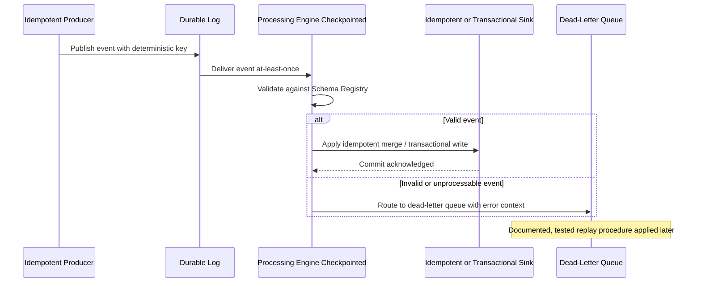
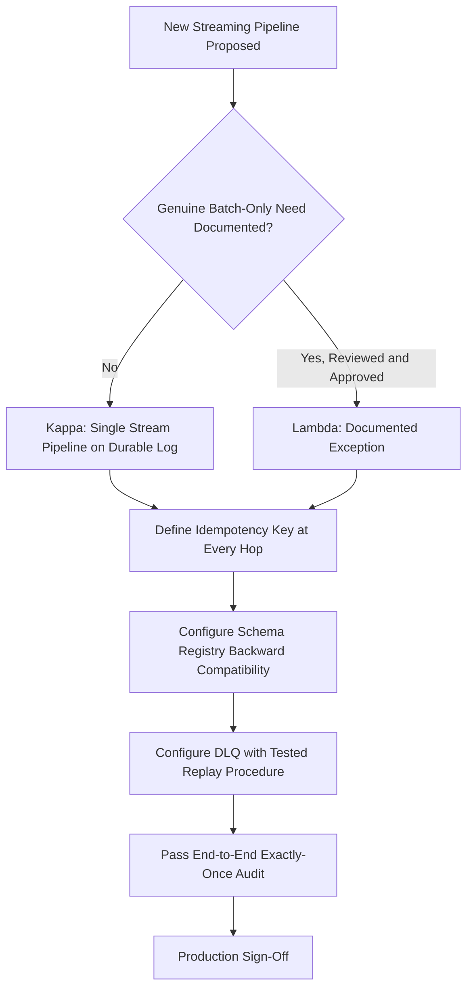

# Streaming Patterns and Delivery Semantics

> Part of the **Enterprise Data & AI Architecture Handbook** · Phase-07 - Streaming & Real-Time Analytics · Chapter 08.
> Estimated study time: **45 min reading + ~3h labs**.
> **Prerequisites:** read [Streaming Fundamentals](01_Streaming_Fundamentals.md), [Apache Kafka](02_Apache_Kafka.md), [Azure Event Hubs and Stream Analytics](03_Azure_Event_Hubs_and_Stream_Analytics.md), [Apache Flink](04_Apache_Flink.md), [Spark Structured Streaming](05_Spark_Structured_Streaming.md), [Change Data Capture](06_Change_Data_Capture.md), and [Real-Time Analytics: ClickHouse and Druid](07_Real_Time_Analytics_ClickHouse_and_Druid.md) first.

---

## Executive Summary

This closing Phase-07 chapter is a synthesis, not a new engine. Every prior chapter in this phase — durable logs ([Apache Kafka](02_Apache_Kafka.md), [Azure Event Hubs and Stream Analytics](03_Azure_Event_Hubs_and_Stream_Analytics.md)), stream processors ([Apache Flink](04_Apache_Flink.md), [Spark Structured Streaming](05_Spark_Structured_Streaming.md)), change capture ([Change Data Capture](06_Change_Data_Capture.md)), and real-time serving ([Real-Time Analytics: ClickHouse and Druid](07_Real_Time_Analytics_ClickHouse_and_Druid.md)) — has repeated the same architectural refrain: delivery is at-least-once by default, ordering is only guaranteed within a partition or key, and "exactly-once" is a claim that only holds if every hop in the pipeline is built to make it true. This chapter names that refrain explicitly as a set of **cross-cutting architectural patterns** an enterprise must standardize once, rather than re-derive independently on every project: Lambda versus Kappa architecture as the top-level pipeline-shape decision, idempotent producers and consumers as the mechanical foundation for effectively-once outcomes, dead-letter queues and replay as the operational safety net for bad data and reprocessing, schema evolution discipline as the mechanism that keeps independently evolving producers and consumers from breaking each other, and end-to-end exactly-once design as the composed result of getting all of the above right simultaneously, not any single technology's feature flag.

The **Lambda versus Kappa** decision is the architectural framing that determines how much of an enterprise's streaming estate is actually one pipeline versus two parallel, hard-to-reconcile ones. Lambda architecture runs a batch layer (for completeness and correction) alongside a speed layer (for low-latency approximate results), merging them at serving time — historically justified when stream processors could not handle both correctness and completeness well, but increasingly viewed as an added-complexity tax now that engines like Structured Streaming and Flink can compute correct, event-time-accurate results directly. Kappa architecture instead treats the stream as the single source of truth for both real-time and historical/reprocessed computation, using replay from a durable log (exactly the retained, replayable Kafka/Event Hubs log from earlier chapters) to recompute history when logic changes, rather than maintaining a parallel batch codebase. This chapter's position, consistent with the tiered-escalation reasoning already established in [Spark Structured Streaming](05_Spark_Structured_Streaming.md) and [Apache Flink](04_Apache_Flink.md), is that Kappa should be the default for new Azure-first lakehouse-native pipelines, with Lambda reserved for cases with a genuine, documented reason a single reprocessing-capable stream pipeline cannot serve both needs.

The practical, Azure-first synthesis of this entire phase is a short, memorizable checklist: retain and replay from a durable log ([Apache Kafka](02_Apache_Kafka.md)/Event Hubs); make every producer idempotent and every consumer's write idempotent or transactional; route bad or unprocessable events to a dead-letter topic with an explicit, monitored replay procedure rather than dropping or blocking on them; govern schema evolution with enforced compatibility modes before it ever reaches a shared topic; and treat "exactly-once" as an audited, end-to-end property verified across every sink, never assumed from a single engine's marketing claim. An enterprise that applies this checklist consistently across every pipeline in this phase has, in effect, industrialized what would otherwise be re-litigated, inconsistently, on every new streaming project.

## Learning Objectives

By the end of this chapter you will be able to:

1. Compare Lambda and Kappa architectures and choose correctly between them for a given enterprise streaming estate.
2. Design idempotent producers and consumers as a standard, reusable pattern across Kafka, Event Hubs, Flink, and Structured Streaming pipelines.
3. Design dead-letter queue (DLQ) handling and a documented, tested replay procedure for any production streaming pipeline.
4. Govern schema evolution in streaming pipelines using enforced compatibility modes, avoiding silent breaking changes across independently evolving producers and consumers.
5. Design and defend an end-to-end exactly-once (effectively-once) architecture spanning source, processing engine, and sink.
6. Synthesize the delivery-semantics vocabulary from every prior Phase-07 chapter into one coherent, auditable enterprise standard.
7. Diagnose common production failure modes that recur across engines: silent duplication, schema-break cascades, and unrecoverable DLQ backlogs.
8. Design a migration or modernization plan converting a legacy Lambda-style pipeline to Kappa where justified.
9. Build an organizational review checklist for evaluating any new streaming pipeline's delivery-semantics claims before production sign-off.
10. Defend an enterprise-wide streaming patterns and delivery-semantics standard in a staff/principal-level architecture review.

## Business Motivation

- Enterprises running many independent streaming pipelines (per earlier Phase-07 chapters) need a consistent, auditable standard for delivery semantics, or every team re-derives (and sometimes gets wrong) the same idempotency and ordering reasoning independently.
- Duplicate financial postings, double-counted metrics, or silently dropped alerts are recurring, expensive incident patterns across the industry, and are almost always traceable to a violation of one of the patterns in this chapter, not an exotic new failure mode.
- Maintaining two parallel codebases (Lambda's batch and speed layers) is a real, ongoing engineering tax; understanding when it is genuinely necessary versus a legacy habit has direct staffing and velocity consequences.
- Schema evolution failures (a producer team renaming a field without coordination) are one of the most common causes of a "the pipeline just stopped working" incident, and are entirely preventable with governance already described in earlier chapters but rarely enforced consistently.
- Dead-letter and replay discipline is what separates a pipeline that degrades gracefully under bad data from one that silently corrupts downstream state or halts entirely.
- Regulatory and audit requirements increasingly expect a defensible, documented answer to "can you prove this event was processed exactly once," which requires the end-to-end discipline this chapter formalizes, not a single engine's internal guarantee.
- FinOps programs benefit when Kappa-style architectures eliminate the duplicated compute and storage cost of a parallel batch layer that a single, well-designed streaming pipeline could replace.

## History and Evolution

- Lambda architecture was formalized (notably by Nathan Marz) at a time when stream processing engines could compute fast, approximate results but could not be fully trusted for long-term correctness, completeness, or easy reprocessing — the batch layer existed specifically to compensate for those real limitations of early stream processors.
- As stream processing engines matured — Flink's asynchronous barrier snapshotting and exactly-once transactions ([Apache Flink](04_Apache_Flink.md)), Structured Streaming's checkpointed, Delta-native `MERGE` pipelines ([Spark Structured Streaming](05_Spark_Structured_Streaming.md)) — the specific correctness and reprocessing gaps that justified Lambda's batch layer narrowed substantially, giving rise to the **Kappa architecture** proposal (notably associated with Jay Kreps, one of Kafka's original creators): treat the durable, replayable log itself as the single source of truth, and reprocess by replaying it through updated stream-processing logic rather than maintaining a separate batch codebase.
- Idempotent producer and exactly-once transactional support in Kafka ([Apache Kafka](02_Apache_Kafka.md)) and equivalent mechanisms in Flink and Structured Streaming matured over roughly the same period, providing the concrete mechanical building blocks that make Kappa's "the stream is the only pipeline" premise practically trustworthy rather than aspirational.
- Dead-letter queue patterns evolved from general messaging-system best practice into a standardized, expected feature of Kafka Connect, Flink, and Structured Streaming pipelines specifically, as production experience made clear that "the pipeline should never fail on bad data" was an unrealistic design goal, and "the pipeline should isolate and preserve bad data for review" was the correct one.
- Schema Registry and enforced compatibility modes (introduced with Kafka Connect's ecosystem, per [Apache Kafka](02_Apache_Kafka.md)) formalized what had previously been an informal, frequently violated agreement between producer and consumer teams about event structure.
- Current enterprise practice increasingly treats this chapter's five patterns — Lambda/Kappa choice, idempotency, DLQ/replay, schema governance, end-to-end exactly-once — as a standard architectural checklist applied uniformly across an organization's streaming estate, rather than bespoke decisions made independently by each pipeline's team.

## Why This Technology Exists

These patterns exist because every individual streaming technology covered in this phase makes the same fundamental trade-off explicit rather than solving it away: distributed systems fail partially, retry, and reorder, and no single component can unilaterally guarantee a business-correct outcome without the cooperation of every other component in the pipeline. Lambda and Kappa exist as competing answers to "how do we get both fast, low-latency results and eventually correct, complete, reprocessable results" — a tension inherent to any system that must serve both real-time and historical correctness needs. Idempotent producers and consumers exist because retries are not an edge case but a routine operating condition in any distributed pipeline, and "make retries safe" is cheaper and more reliable to solve once, structurally, than to re-litigate per pipeline. Dead-letter queues and replay exist because real production data is never perfectly clean, and a pipeline that halts or silently drops on the first malformed event is not resilient, it is fragile with extra steps. Schema evolution governance exists because streaming decouples producers and consumers in time (a defining benefit established in [Apache Kafka](02_Apache_Kafka.md)), which also means they can drift apart in schema assumptions unless that drift is actively governed. End-to-end exactly-once design exists because every individual chapter in this phase has shown that "exactly-once" is a claim about the whole system, never a single component's internal property — this final chapter exists to make that composed responsibility explicit, auditable, and standardized rather than left implicit in each pipeline's undocumented assumptions.

## Problems It Solves

| Problem | This chapter's synthesized response |
|---|---|
| Teams independently re-derive (and sometimes get wrong) the same delivery-semantics reasoning per project | A standardized, auditable enterprise checklist applied to every streaming pipeline |
| Maintaining parallel batch and speed layers is an ongoing engineering tax | Kappa architecture as the default, replacing dual codebases with one replay-capable stream pipeline |
| Retries silently duplicate business effects | Idempotent producers (source) and idempotent/transactional sinks (target) as a standard pattern |
| Bad or unprocessable data halts or silently corrupts a pipeline | Dead-letter queues with a documented, tested replay procedure |
| Independent producer/consumer schema evolution silently breaks pipelines | Enforced Schema Registry compatibility modes as a deployment gate |
| "Exactly-once" is claimed without verification | An explicit, auditable end-to-end exactly-once design and verification checklist spanning source, engine, and sink |
| New streaming pipelines lack a consistent production-readiness bar | A reusable review checklist synthesizing every earlier Phase-07 chapter's guarantees |

## Problems It Cannot Solve

- These patterns cannot make a fundamentally poor data model or business-logic design correct; idempotency and schema governance protect delivery correctness, not business-rule correctness.
- Kappa architecture cannot eliminate the need for a genuine batch reprocessing capability in the rare cases where truly complete historical recomputation requires data or compute patterns a stream processor cannot express efficiently, echoing the escalation caveats already established in [Apache Flink](04_Apache_Flink.md) and [Spark Structured Streaming](05_Spark_Structured_Streaming.md).
- Idempotent producers and consumers cannot make an inherently non-idempotent business operation (for example, "increment a counter" without a deterministic dedup key) safe without redesigning that operation's semantics.
- A dead-letter queue does not fix the underlying data-quality or schema problem generating the DLQ traffic; it only prevents that problem from silently corrupting or halting the primary pipeline, and unmonitored DLQ backlog is itself a governance failure.
- Schema Registry compatibility enforcement cannot substitute for genuine cross-team communication about upcoming breaking changes; it is a safety net, not a replacement for coordination.
- No amount of pattern discipline eliminates the fundamental physics established in [Streaming Fundamentals](01_Streaming_Fundamentals.md): the latency-versus-completeness trade-off in windowing, and the requirement that every sink cooperate for exactly-once to hold end-to-end.

## Core Concepts

### 8.1 Lambda architecture

**Lambda architecture** runs two parallel pipelines against the same raw data: a **batch layer** that periodically (re)computes complete, correct results from the full historical dataset, and a **speed layer** that computes fast, low-latency, approximate results over only recent data, with a **serving layer** merging both views for querying — the speed layer's results are eventually superseded by the batch layer's more complete recomputation. This architecture directly addressed a real historical limitation: early stream processors could not be fully trusted for exactly-once, complete, easily-reprocessable computation, so the batch layer existed as the authoritative correction mechanism. The cost is maintaining two independent codebases (batch and streaming) implementing conceptually the same business logic, which is a substantial, ongoing engineering and consistency-risk burden.

### 8.2 Kappa architecture

**Kappa architecture** rejects the dual-pipeline premise: it treats the durable, replayable event log (per [Apache Kafka](02_Apache_Kafka.md) and [Azure Event Hubs and Stream Analytics](03_Azure_Event_Hubs_and_Stream_Analytics.md)) as the single source of truth, computed by a single stream-processing codebase. When business logic changes or a bug is discovered, the fix is to replay the log from an appropriate historical offset through the corrected processing logic — using exactly the replay-for-reprocessing capability already established as a core reason durable logs exist in [Streaming Fundamentals](01_Streaming_Fundamentals.md) — rather than maintaining a separate batch pipeline for correction. This is viable specifically because modern stream processors (Flink's exactly-once transactions, Structured Streaming's checkpointed Delta `MERGE`) now provide the completeness and correctness guarantees that originally justified Lambda's batch layer.

### 8.3 Idempotent producers and consumers, revisited as a cross-cutting pattern

Every prior Phase-07 chapter introduced idempotency in its own context: Kafka's idempotent producer and `enable.idempotence=true` ([Apache Kafka](02_Apache_Kafka.md)), Flink's two-phase commit sinks ([Apache Flink](04_Apache_Flink.md)), Structured Streaming's `foreachBatch` Delta `MERGE` ([Spark Structured Streaming](05_Spark_Structured_Streaming.md)), CDC's log-sequence-ordered merge ([Change Data Capture](06_Change_Data_Capture.md)). This chapter names the **generalized pattern** underlying all of them: a producer-side mechanism that makes retried sends safe (deterministic sequence numbers, deterministic business keys), and a consumer-side mechanism that makes reprocessed writes safe (deterministic upsert/merge keys, transactional commit of offset-plus-output). Any new streaming pipeline should be designed by explicitly answering "what is the idempotency key at the producer, and what is the idempotency key at the sink" before writing any processing logic.

### 8.4 Dead-letter queues (DLQ) and replay

A **dead-letter queue** is a designated topic or storage location where events that cannot be processed normally (schema violations, deserialization failures, business-rule violations, or downstream sink errors) are routed instead of blocking the primary pipeline or being silently dropped — a pattern already introduced concretely for Kafka Connect in [Apache Kafka](02_Apache_Kafka.md). The DLQ is only a complete pattern when paired with a **documented, tested replay procedure**: a way to inspect DLQ contents, fix the underlying issue (a schema mismatch, a bug in transformation logic), and reprocess the affected events back through the pipeline (or a corrected variant of it) without manual, ad hoc intervention. An unmonitored, never-replayed DLQ is not a safety net; it is a silent, permanent data-loss mechanism with a misleading name.

### 8.5 Schema evolution in streams

Streaming's core benefit — decoupling producers and consumers in time, established in [Apache Kafka](02_Apache_Kafka.md) — is also its central schema risk: a producer and consumer can be running different, independently deployed versions of the event schema at any given moment. **Schema evolution governance** manages this via Schema Registry-enforced compatibility modes: **backward compatible** changes (a consumer using the new schema can read data written with the old schema — typically achieved by only adding optional fields with defaults, never removing or renaming required fields) are the safest default for any topic with independently deployed consumers; **forward compatible** changes support the reverse; **full compatibility** requires both simultaneously. The specific compatibility mode required depends on the deployment order guarantees an organization can realistically enforce across independent producer and consumer teams.

### 8.6 End-to-end exactly-once patterns

**End-to-end exactly-once** (more precisely, effectively-once) is the composed result of every earlier pattern applied consistently across an entire pipeline: an idempotent or transactional producer, a processing engine with checkpoint-based exactly-once internal state (Flink's barrier snapshotting, Structured Streaming's checkpointed micro-batches), and a sink that is either transactionally coordinated with the engine's checkpoint (Flink's two-phase commit sinks, Kafka transactional writes) or made idempotent via a deterministic merge/upsert key (Delta Lake `MERGE`, as used throughout [Spark Structured Streaming](05_Spark_Structured_Streaming.md) and [Change Data Capture](06_Change_Data_Capture.md)). This chapter's core message, repeated because it is the single most commonly violated assumption across this entire phase, is that **exactly-once is only as strong as its weakest, least-idempotent hop** — a single non-participating sink anywhere in the chain silently degrades the entire pipeline's guarantee to at-least-once, regardless of every other component's internal correctness.

## Internal Working

### 9.1 How a Kappa-architecture reprocessing actually executes

To correct a bug or change business logic under Kappa, an engineer deploys an updated version of the stream-processing job (Flink or Structured Streaming), configures it to consume from an appropriate historical offset in the durable log (bounded by the log's retention, per [Apache Kafka](02_Apache_Kafka.md)'s storage guidance), and lets it reprocess that historical range through the corrected logic, typically writing to a new or versioned output table that is validated against the old output before being promoted to replace it — avoiding disruption to consumers of the existing, still-correct-enough output during the reprocessing and validation window.

### 9.2 How idempotent producer-consumer chains compose across hops

Each hop in a multi-stage pipeline (source database to Kafka via Debezium, Kafka to Flink, Flink to Delta Lake, Delta Lake to a real-time OLAP engine) must independently satisfy the idempotency requirement for the composed chain to hold end-to-end: Debezium's log-sequence-numbered events ([Change Data Capture](06_Change_Data_Capture.md)) feed a Flink job with a two-phase commit sink ([Apache Flink](04_Apache_Flink.md)) writing to Delta Lake via `MERGE`, which a Structured Streaming job ([Spark Structured Streaming](05_Spark_Structured_Streaming.md)) or Azure Data Explorer update policy ([Real-Time Analytics: ClickHouse and Druid](07_Real_Time_Analytics_ClickHouse_and_Druid.md)) then reads idempotently downstream. A verification audit of an end-to-end exactly-once claim must trace this entire chain, hop by hop, not just inspect the engine in the middle.

### 9.3 How a DLQ replay procedure is actually executed safely

A well-designed replay procedure first quarantines and inspects the DLQ's contents (schema validation errors, transformation exceptions, or sink errors captured alongside each dead-lettered event), applies a fix (a corrected schema mapping, a patched transformation function, a resolved downstream sink issue), and then replays the corrected events through either the original pipeline (if it can safely reprocess without duplicating already-successful side effects) or a dedicated replay job that applies the same idempotent merge/upsert logic as the primary pipeline, ensuring replayed events land correctly regardless of any partial processing that may have already occurred before the failure.

### 9.4 How Schema Registry compatibility checking actually blocks a bad change

When a producer attempts to register a new schema version, the Schema Registry evaluates it against the configured compatibility mode (backward, forward, or full) relative to the existing registered version(s) for that subject; an incompatible change (removing a required field, changing a field's type incompatibly) is rejected at registration time, before the producer can publish any event using that schema — converting what would otherwise be a runtime consumer failure discovered in production into a build-time or deployment-time failure caught before any bad data is ever published.

### 9.5 How an end-to-end exactly-once audit is actually performed

A rigorous audit traces every hop's delivery mechanism explicitly: does the source produce with idempotence enabled (or a natural deterministic key)? Does the processing engine use checkpoint-based exactly-once internal state? Does the sink either participate in the engine's transactional commit protocol, or independently apply a deterministic idempotent merge/upsert? Is there any hop — a legacy REST API call, a non-transactional third-party integration, an unmonitored side effect — that does not satisfy one of these conditions? Any single "no" answer means the claimed guarantee is, in practice, at-least-once with a residual duplication risk that must be either fixed or explicitly accepted and documented as a known limitation.

## Architecture

### 10.1 Azure-first reference architecture

The synthesized Azure-first reference architecture across this phase places Azure Event Hubs (or self-managed Kafka) as the durable, replayable log at the center; Azure Databricks Structured Streaming or Apache Flink on AKS as the processing layer, chosen per the escalation criteria from [Apache Flink](04_Apache_Flink.md); Change Data Capture (native Azure SQL/Cosmos DB, or Debezium) feeding operational database changes into that same log per [Change Data Capture](06_Change_Data_Capture.md); Delta Lake as the idempotent, mergeable curated destination; and Azure Data Explorer or a benchmarked alternative as the real-time analytical serving layer per [Real-Time Analytics: ClickHouse and Druid](07_Real_Time_Analytics_ClickHouse_and_Druid.md) — with Schema Registry enforcement, dead-letter topics, and an explicit idempotency key documented at every hop.

### 10.2 Why the architecture works

This architecture works because every individual component's guarantee is explicit and independently verifiable, and the composed end-to-end guarantee is the deliberate result of designing each hop's idempotency key rather than an accidental byproduct of picking "good" technologies. A Kappa-style single pipeline, replayable from the durable log, means a bug fix or new requirement does not require reconciling two independently evolving codebases — it requires replaying corrected logic against the same log every other consumer already trusts.

### 10.3 ADR example: adopt Kappa architecture as the enterprise default, retain a documented Lambda exception process for genuinely irreplaceable batch-only computation

**Context:** Several legacy pipelines in the organization still run a Lambda-style batch-plus-speed-layer design, originally justified years ago when the stream processors available at the time could not be trusted for correctness or easy reprocessing. Newer teams building greenfield pipelines are unsure whether to continue this pattern or adopt a single-pipeline Kappa design, given the maturity of Flink and Structured Streaming's exactly-once and reprocessing capabilities documented in this phase.

**Decision:** Adopt Kappa architecture (a single, replay-capable stream-processing pipeline against a durable, retained log) as the enterprise default for all new streaming pipelines. Require an explicit, documented exception with a specific technical justification (for example, a computation genuinely requiring a batch-only algorithm or dataset shape that cannot be expressed efficiently in the available stream processors) before any new pipeline may adopt a Lambda-style dual-pipeline design. Existing legacy Lambda pipelines are migrated opportunistically as they come up for renewal, not forced into an immediate rewrite.

**Consequences:** New pipelines gain a single codebase, lower long-term maintenance cost, and a built-in reprocessing story via log replay. Teams must ensure log retention is sized generously enough to support realistic reprocessing windows, and must build genuine confidence in their stream processor's exactly-once guarantees (verified per this chapter's audit checklist) before relying on Kappa as the sole source of truth. Legacy Lambda pipelines remain a known, documented technical-debt category with a clear migration criterion rather than an indefinitely ignored inconsistency.

**Alternatives considered:**

1. Continue Lambda as the default: rejected because it perpetuates unnecessary dual-codebase maintenance cost for the vast majority of pipelines that no longer have a genuine technical reason to need it.
2. Force an immediate rewrite of all legacy Lambda pipelines: rejected as disproportionate migration risk and cost relative to the incremental benefit of accelerating an already-planned opportunistic migration.
3. Leave the choice entirely to individual teams with no enterprise default: rejected because it was the status quo that produced the original inconsistency this ADR addresses.

## Components

| Component | Role | Typical Azure-first implementation | Common failure mode |
|---|---|---|---|
| Durable, replayable log | Single source of truth for Kappa-style reprocessing | Azure Event Hubs / Kafka, per [Apache Kafka](02_Apache_Kafka.md) | retention sized for steady-state consumption only, insufficient for a real reprocessing need |
| Idempotent producer | Makes retried sends safe | Kafka/Event Hubs idempotent producer, Debezium's deterministic log sequence numbers | idempotence left disabled by default in a producer client library |
| Processing engine with exactly-once internal state | Correct, checkpointed computation | Flink or Structured Streaming, per [Apache Flink](04_Apache_Flink.md) and [Spark Structured Streaming](05_Spark_Structured_Streaming.md) | assuming internal exactly-once extends automatically to external sinks |
| Idempotent / transactional sink | Converts at-least-once delivery into an effectively-once outcome | Delta Lake `MERGE`, Kafka transactional writes, Flink two-phase commit sinks | a sink added later in the pipeline's life that was never verified for idempotency |
| Dead-letter queue | Isolates bad or unprocessable events without halting the pipeline | A dedicated Kafka/Event Hubs topic or Delta table | DLQ accumulates indefinitely with no monitored, tested replay procedure |
| Schema Registry | Enforces compatibility across independently evolving producers/consumers | Confluent Schema Registry or Azure Schema Registry, per [Apache Kafka](02_Apache_Kafka.md) | permissive compatibility mode left as a default rather than deliberately chosen |
| Real-time serving layer | Interactive analytical query surface | Azure Data Explorer or a benchmarked alternative, per [Real-Time Analytics: ClickHouse and Druid](07_Real_Time_Analytics_ClickHouse_and_Druid.md) | treated as authoritative rather than a read-optimized derived view |

## Metadata

| Metadata class | What to record | Why it matters |
|---|---|---|
| Architecture-choice metadata | Lambda or Kappa, with documented justification if Lambda | prevents unreviewed proliferation of unnecessary dual-pipeline designs |
| Idempotency-key metadata | producer-side and sink-side idempotency key definition, per pipeline hop | makes exactly-once claims independently auditable |
| DLQ metadata | DLQ topic/table location, replay procedure documentation, last replay date | prevents an unmonitored, effectively-permanent data-loss mechanism |
| Schema compatibility metadata | compatibility mode per topic, schema version history, owning team | prevents undocumented breaking changes |
| Reprocessing metadata | log retention window, last full reprocessing date and reason | supports Kappa-style correction capability planning |
| End-to-end guarantee metadata | documented exactly-once/at-least-once classification per pipeline, verified hop-by-hop | ties architectural claims to independently checkable evidence |
| Operational metadata | DLQ backlog size, schema rejection rate, reprocessing job duration | first-class enterprise-wide streaming health signals |

## Storage

| Storage concern | Recommended posture | Notes |
|---|---|---|
| Durable log retention for Kappa reprocessing | size generously enough to cover realistic full or partial reprocessing needs, not just steady-state consumption | the single most common Kappa-architecture planning mistake is under-sizing this |
| DLQ storage | retain with a deliberate, documented lifecycle policy, not indefinitely nor prematurely expired | must survive long enough for a realistic investigation-and-fix cycle |
| Schema history storage | retain full schema version history per topic in Schema Registry | supports audit and rollback of a problematic schema change |
| Idempotent sink storage | Delta Lake (or equivalent) with transaction-log-backed `MERGE` capability | the standard mechanism referenced throughout [Spark Structured Streaming](05_Spark_Structured_Streaming.md) and [Change Data Capture](06_Change_Data_Capture.md) |

## Compute

| Workload class | Best Azure-first surface | Why it fits | Wrong default |
|---|---|---|---|
| New greenfield streaming pipeline | Kappa-style single pipeline on Structured Streaming or Flink (per escalation criteria) | avoids unnecessary dual-codebase maintenance | defaulting to Lambda out of habit without a documented technical justification |
| Legacy pipeline with a genuine batch-only computation need | Lambda-style dual pipeline, explicitly justified and documented | serves a real, narrow technical gap | perpetuating Lambda broadly across an estate where the original justification no longer holds |
| Reprocessing after a bug fix or logic change | Replay from the durable log through an updated stream-processing job version | reuses the same pipeline and log rather than a separate correction mechanism | building a bespoke one-off batch correction job instead of using the existing replay capability |
| DLQ investigation and replay | A dedicated, scheduled or on-demand replay job using the same idempotent merge logic as the primary pipeline | ensures replayed events are applied safely regardless of prior partial processing | manual, ad hoc reprocessing scripts bypassing the pipeline's own idempotency guarantees |

## Networking

- Ensure the durable log's retention and replication configuration (per [Apache Kafka](02_Apache_Kafka.md) and [Azure Event Hubs and Stream Analytics](03_Azure_Event_Hubs_and_Stream_Analytics.md)) is sized with Kappa-style reprocessing bandwidth in mind, since a large-scale replay can generate significant, bursty network load distinct from steady-state consumption.
- Isolate DLQ replay traffic from primary pipeline traffic on separate consumer groups/topics where practical, so a large replay operation does not degrade steady-state processing latency.
- Apply the same private networking discipline (Private Link/Private Endpoint) established in every prior Phase-07 chapter uniformly across the entire pipeline, including DLQ and Schema Registry components, not just the primary data path.

## Security

| Concern | Recommended control |
|---|---|
| Cross-pipeline consistency | Apply the same identity, encryption, and access-control standards from earlier Phase-07 chapters uniformly to DLQ topics/tables and Schema Registry, not only primary data paths |
| DLQ sensitive-data handling | Apply the same data classification and masking rules to dead-lettered events as to the primary pipeline; a DLQ is not exempt from data governance |
| Schema Registry access control | Restrict schema registration/modification to owning teams, with compatibility-mode changes treated as a reviewed, auditable action |
| Replay-triggering access | Restrict who can trigger a full or partial reprocessing/replay operation, since it is a security-relevant capability that can expose or duplicate sensitive historical data if misused |
| Audit | Maintain an auditable record of every replay operation (who, when, why, what range) alongside the pipeline's regular operational logs |

## Performance

- Size log retention and DLQ retention explicitly against realistic reprocessing and investigation windows, treating both as capacity-planning inputs, not afterthoughts.
- Monitor DLQ backlog growth rate as a leading indicator of an upstream data-quality or schema-compatibility regression, not merely a curiosity metric.
- Batch replay operations sensibly (similar to the trigger-mode tuning discussed in [Spark Structured Streaming](05_Spark_Structured_Streaming.md)) to avoid overwhelming downstream sinks during a large-scale reprocessing event.
- Track schema-rejection rate at the Schema Registry boundary as a leading indicator of producer/consumer drift before it becomes a production incident.

| Pattern | Recommendation | Why |
|---|---|---|
| Kappa reprocessing after a logic fix | Replay to a new/versioned output table, validate, then promote | avoids disrupting existing consumers during correction and validation |
| DLQ replay after a schema fix | Replay through the same idempotent merge logic as the primary pipeline | ensures correctness regardless of any prior partial processing |
| High-volume topic schema evolution | Backward-compatible-only changes enforced by Schema Registry | supports independently deployed producer/consumer teams safely |
| End-to-end exactly-once audit | Hop-by-hop verification checklist applied before production sign-off | the only reliable way to confirm the composed guarantee actually holds |

## Scalability

- Scale durable log retention and replay-job compute together as an enterprise capacity-planning exercise, not per-pipeline in isolation, since reprocessing demand is often correlated across many pipelines during a platform-wide incident or migration.
- Scale DLQ investigation tooling and process alongside pipeline count; a manual, ad hoc DLQ review process that worked for five pipelines will not scale to fifty.
- Scale Schema Registry governance process (review, approval, compatibility testing) alongside the number of independently deploying producer/consumer teams sharing topics.
- Revisit the Lambda-versus-Kappa decision periodically as stream-processing engine capabilities mature further, since today's genuine Lambda justification may become obsolete as tooling improves.

## Fault Tolerance

- Kappa's replay-from-log capability is itself a fault-tolerance mechanism: a systemic bug affecting weeks of processed data can be corrected by replaying the log through fixed logic, rather than requiring an entirely separate recovery mechanism.
- Idempotent producers and sinks are what make routine retries after a transient failure safe by default, rather than a source of latent duplication risk discovered only during an incident.
- A well-tested DLQ replay procedure is itself a fault-tolerance capability for data-quality failures, distinct from and complementary to the checkpoint-based fault tolerance covered in [Apache Flink](04_Apache_Flink.md) and [Spark Structured Streaming](05_Spark_Structured_Streaming.md).
- Schema Registry compatibility enforcement prevents an entire class of fault — a breaking schema change — from ever reaching production, which is structurally superior to detecting and recovering from it after the fact.
- Test the full chain deliberately: inject a schema-incompatible event, verify it lands in the DLQ rather than corrupting the pipeline; kill a processing job mid-batch, verify checkpoint recovery and sink idempotency both hold; replay a historical range, verify the reprocessed output matches expectations.

## Cost Optimization

- Migrating a legacy Lambda pipeline to Kappa where justified eliminates the ongoing dual-compute and dual-maintenance cost of a redundant batch layer, per the ADR in this chapter.
- Size log and DLQ retention deliberately rather than defaulting to the maximum available retention "to be safe," balancing reprocessing/investigation value against storage cost.
- Avoid over-engineering exactly-once guarantees for workloads that genuinely tolerate at-least-once with idempotent downstream handling at lower engineering cost; not every pipeline needs the full end-to-end exactly-once audit rigor this chapter describes.
- Monitor DLQ backlog and schema-rejection rate as cost signals too; a chronically large DLQ backlog often represents wasted upstream compute producing events that are never successfully processed.

Worked FinOps example: consider an enterprise still running a legacy Lambda-architecture pipeline for a core reporting workload, maintaining both a nightly Databricks batch job and a separate Structured Streaming speed-layer job, together costing a materially higher combined monthly compute and engineering-maintenance bill in illustrative terms than a single, well-designed Kappa-style pipeline replaying from a sufficiently retained Event Hubs log would cost. Migrating this specific pipeline to Kappa, now that Structured Streaming's checkpointed exactly-once `MERGE` pattern (per [Spark Structured Streaming](05_Spark_Structured_Streaming.md)) can serve both the low-latency and eventually-correct needs the original Lambda design addressed separately, eliminates the redundant batch layer's compute cost and the ongoing engineering cost of keeping two codebases' business logic synchronized. The lesson generalizes: the most common streaming-architecture cost problem covered across this entire phase is unnecessary duplication — dual Lambda pipelines, over-provisioned always-on clusters, redundant self-managed infrastructure where a managed Azure service would suffice — and the first FinOps lever, consistently, is eliminating structural duplication before optimizing any individual component's sizing.

## Monitoring

| Metric | Why it matters | Typical threshold |
|---|---|---|
| DLQ backlog size and growth rate | leading indicator of upstream data-quality or schema regression | alert on sustained growth or backlog age exceeding the investigation SLA |
| Schema rejection rate at Schema Registry | signals producer/consumer drift before it becomes a production incident | alert on any sustained non-zero rate |
| Replay/reprocessing job frequency and duration | tracks how often and how expensively corrections are needed | review trend; frequent reprocessing may signal an upstream logic-quality issue |
| End-to-end exactly-once audit pass/fail status | ties an architectural claim to a concrete, periodically re-verified check | require a passing audit before any pipeline may claim the guarantee in documentation |
| Lambda-pipeline count and migration progress | tracks organizational progress toward the Kappa-default standard | review quarterly against the ADR's migration expectations |

## Observability

Enterprise-wide streaming observability, synthesizing every earlier Phase-07 chapter's specific telemetry, should answer: which pipelines are Lambda versus Kappa and why, where is every pipeline's idempotency key documented and verified, how large and how old is every DLQ backlog, is schema governance actually being enforced or silently bypassed, and which pipelines have a currently-passing end-to-end exactly-once audit versus an unverified or known at-least-once classification.

- maintain a centralized, cross-pipeline inventory of architecture choice (Lambda/Kappa), delivery-semantics classification, and last-audited date, rather than leaving this knowledge fragmented across individual team documentation,
- correlate DLQ backlog trends and schema-rejection rates across the entire streaming estate to detect systemic data-quality issues affecting multiple pipelines simultaneously,
- track replay/reprocessing frequency as an organizational health signal — a high rate across many pipelines may indicate a broader upstream data-quality or requirements-volatility problem worth addressing at the source,
- preserve architecture-decision and schema-compatibility-mode change history centrally so a review can correlate an incident with a specific prior decision.

### Operational response playbooks

| Signal | Detection query or rule | Likely cause | First remediation |
|---|---|---|---|
| DLQ backlog grows across multiple pipelines simultaneously | Cross-pipeline DLQ backlog dashboard shows correlated growth | a shared upstream schema change or a shared infrastructure issue (Schema Registry, source database) | investigate the shared upstream dependency first, rather than each pipeline's DLQ independently |
| A pipeline's exactly-once audit fails | Scheduled hop-by-hop audit check reports a non-idempotent or non-transactional hop | a sink was added or changed without idempotency verification | fix the specific non-compliant hop (add a deterministic merge key, or make the sink transactional) and re-run the audit before continuing to claim the guarantee |
| Reprocessing frequency spikes across the estate | Replay/reprocessing job count trending upward organization-wide | a systemic upstream data-quality or requirements-volatility issue | investigate the shared root cause rather than treating each reprocessing event as isolated |

## Governance

- Require every new streaming pipeline to document its Lambda-versus-Kappa architecture choice, with an explicit technical justification required for any Lambda adoption, per the ADR in this chapter.
- Require every pipeline to document its idempotency key at every hop and pass a periodic, scheduled end-to-end exactly-once audit before its documentation may claim that guarantee.
- Require a documented, tested DLQ replay procedure, reviewed on the same cadence as disaster-recovery runbooks, for every production pipeline.
- Enforce Schema Registry compatibility mode uniformly across the enterprise's streaming estate, treating any exception as a reviewed, documented, and time-bounded decision.
- Maintain a centralized inventory (architecture choice, delivery-semantics classification, last-audit date) as a standing governance artifact reviewed on a regular cadence, not a one-time exercise.

## Trade-offs

| Choice | Advantages | Disadvantages | When to prefer it |
|---|---|---|---|
| Kappa architecture | Single codebase, replay-based correction, lower long-term maintenance cost | Requires generously retained log storage and genuine trust in stream-processor exactly-once guarantees | Default choice for new pipelines given modern stream-processor maturity |
| Lambda architecture | Proven, well-understood correctness model via a separate batch layer | Dual codebase maintenance cost, consistency risk between batch and speed layer logic | Documented, narrow technical gaps a stream processor genuinely cannot serve |
| Idempotent producer/consumer by default | Retries become safe by construction, eliminating a whole class of duplication incidents | Requires deliberate key design at every hop, not automatic | Every production streaming pipeline, as a non-negotiable baseline |
| Permissive schema compatibility mode | Faster short-term producer iteration | Silent breaking-change risk to independently deployed consumers | Never, for any topic with more than one independently deployed consumer |
| Full end-to-end exactly-once audit rigor | Verified, defensible delivery-semantics claims | Additional engineering and review overhead | Durability-critical, audit-sensitive, or financially consequential pipelines |

## Decision Matrix

| Requirement | Kappa | Lambda | Idempotent-by-default baseline |
|---|---|---|---|
| Lowest long-term maintenance cost | strong | weak | n/a |
| Genuine batch-only computation need | weak | strong | n/a |
| Correction via replay rather than a separate mechanism | strong | medium | n/a |
| Protection against duplicate business effects from retries | n/a | n/a | strong |
| Suitability as an enterprise-wide default | strong | weak (exception-only) | strong (mandatory) |

Use this matrix as a starting filter for the Lambda-versus-Kappa decision specifically; idempotency, DLQ/replay, and schema governance should be treated as non-negotiable baselines regardless of that choice.

## Design Patterns

1. **Kappa-by-default pattern:** treat a single, replay-capable stream pipeline against a durable log as the enterprise default, requiring documented justification for any Lambda-style exception.
2. **Idempotency-key-first design pattern:** explicitly define the producer-side and sink-side idempotency key before writing any pipeline's processing logic, for every new streaming pipeline without exception.
3. **DLQ-with-tested-replay pattern:** never deploy a dead-letter queue without a documented, periodically tested replay procedure alongside it.
4. **Backward-compatible-by-default schema pattern:** default every shared topic's Schema Registry compatibility mode to backward compatibility, requiring an explicit, reviewed exception for anything more permissive.
5. **Hop-by-hop exactly-once audit pattern:** verify and document every individual hop's idempotency/transactional mechanism explicitly before a pipeline may claim an end-to-end exactly-once guarantee in its documentation.
6. **Centralized streaming-estate inventory pattern:** maintain one enterprise-wide, regularly reviewed inventory of architecture choice, delivery-semantics classification, and audit status across every streaming pipeline.

## Anti-patterns

- Defaulting to Lambda architecture out of habit or unfamiliarity with modern stream processors' exactly-once and reprocessing capabilities.
- Claiming "exactly-once" in pipeline documentation based on the processing engine's marketing language alone, without a verified hop-by-hop audit.
- Deploying a dead-letter queue with no documented or tested replay procedure, letting it accumulate indefinitely as a silent, permanent data-loss mechanism.
- Leaving Schema Registry compatibility mode permissive by default rather than deliberately choosing the narrowest mode the organization's deployment practices can support.
- Treating each streaming pipeline's delivery-semantics design as a bespoke, one-off decision rather than applying a consistent, enterprise-wide standard.
- Sizing durable log retention for steady-state consumption only, without planning for a genuine Kappa-style reprocessing need.

## Common Mistakes

- Assuming a processing engine's internal exactly-once guarantee (Flink's checkpointing, Structured Streaming's checkpointed micro-batches) automatically extends to every downstream sink without independent verification.
- Forgetting to define an idempotency key at every hop of a multi-stage pipeline, leaving one hop as an unverified weak link in an otherwise well-designed chain.
- Building a DLQ without instrumenting its backlog size and age as a monitored metric, discovering months later that it has grown unboundedly and unnoticed.
- Allowing a producer team to register a breaking schema change because compatibility mode was left at a permissive default rather than a deliberately chosen, enforced one.
- Perpetuating a Lambda-style dual pipeline indefinitely after the original technical justification for it (an early stream processor's limitations) no longer applies.
- Treating this chapter's patterns as abstract theory rather than a concrete, applied checklist for every pipeline built using the technologies from earlier Phase-07 chapters.

## Best Practices

- default to Kappa architecture for new pipelines, requiring documented, reviewed justification for any Lambda-style exception,
- define and document the idempotency key at every hop of every streaming pipeline before writing processing logic,
- never deploy a dead-letter queue without a documented, periodically tested replay procedure,
- default every shared topic's Schema Registry compatibility mode to backward compatibility, treating any more permissive mode as an explicit, reviewed exception,
- require a passing, periodically re-verified hop-by-hop exactly-once audit before any pipeline's documentation may claim that guarantee,
- maintain a centralized, regularly reviewed inventory of architecture choice and delivery-semantics classification across the entire streaming estate,
- size durable log and DLQ retention deliberately against realistic reprocessing and investigation needs, not as an afterthought.

## Enterprise Recommendations

1. Adopt Kappa architecture as the enterprise-wide default for new streaming pipelines, with Lambda permitted only via a documented, reviewed technical exception.
2. Mandate idempotency-key documentation at every hop for every production streaming pipeline as a non-negotiable production-readiness requirement.
3. Require a documented, tested DLQ replay procedure for every production pipeline, reviewed on the same cadence as disaster-recovery runbooks.
4. Enforce backward-compatible Schema Registry compatibility mode by default across the streaming estate, with exceptions requiring explicit review.
5. Require a passing, periodically re-verified end-to-end exactly-once audit before any pipeline's documentation may claim that guarantee.
6. Maintain a centralized, regularly reviewed inventory of every streaming pipeline's architecture choice, idempotency design, and delivery-semantics audit status.
7. Establish a migration plan and priority order for existing legacy Lambda pipelines toward the Kappa default, tied to natural renewal/refactor cycles rather than a forced rewrite.
8. Periodically reassess this chapter's patterns themselves as stream-processing technology continues to mature, since today's justified exception may become tomorrow's unnecessary legacy pattern.

## Azure Implementation

### 31.1 Recommended Azure service map

| Layer | Preferred Azure service | Notes |
|---|---|---|
| Durable, replayable log (Kappa foundation) | Azure Event Hubs / Kafka, per [Apache Kafka](02_Apache_Kafka.md) | size retention for genuine reprocessing needs |
| Processing engine | Azure Databricks Structured Streaming (default) or Flink on AKS (escalation), per [Apache Flink](04_Apache_Flink.md) and [Spark Structured Streaming](05_Spark_Structured_Streaming.md) | choose per documented escalation criteria |
| Idempotent curated sink | Delta Lake on ADLS Gen2 | standard `MERGE`-based idempotent pattern throughout this phase |
| Schema governance | Azure Schema Registry (Event Hubs) or Confluent Schema Registry | enforce backward compatibility by default |
| DLQ storage | A dedicated Event Hubs/Kafka topic or Delta table | paired with a documented, tested replay job |
| Real-time serving | Azure Data Explorer, per [Real-Time Analytics: ClickHouse and Druid](07_Real_Time_Analytics_ClickHouse_and_Druid.md) | isolated from primary ingestion/processing compute |

### 31.2 Example idempotent, DLQ-aware Structured Streaming pipeline with schema validation (PySpark)

```python
from pyspark.sql import functions as F
from pyspark.sql.types import StructType

def process_with_dlq(batch_df, batch_id):
    valid = batch_df.filter(F.col("_corrupt_record").isNull())
    invalid = batch_df.filter(F.col("_corrupt_record").isNotNull())

    if invalid.count() > 0:
        (invalid.write
            .format("delta")
            .mode("append")
            .save("abfss://dlq@stedaicuratedprod.dfs.core.windows.net/orders_dlq"))

    valid.createOrReplaceTempView("updates")
    valid.sparkSession.sql("""
        MERGE INTO silver.orders AS target
        USING updates AS source
        ON target.order_id = source.order_id
           AND target.event_time_utc = source.event_time_utc
        WHEN NOT MATCHED THEN INSERT *
    """)

raw_stream = (
    spark.readStream
    .format("eventhubs")
    .options(**eh_conf)
    .load()
    .select(F.from_json(F.col("body").cast("string"), order_schema, {"columnNameOfCorruptRecord": "_corrupt_record"}).alias("e"), "_corrupt_record")
    .select("e.*", "_corrupt_record")
)

(raw_stream.writeStream
    .foreachBatch(process_with_dlq)
    .option("checkpointLocation", "abfss://checkpoints@stedaicuratedprod.dfs.core.windows.net/silver/orders")
    .trigger(processingTime="1 minute")
    .start())
```

### 31.3 Example DLQ replay job (PySpark, applied after fixing a schema issue)

```python
dlq_events = (
    spark.read
    .format("delta")
    .load("abfss://dlq@stedaicuratedprod.dfs.core.windows.net/orders_dlq")
    .filter(F.col("replay_status").isNull())
)

corrected = dlq_events.withColumn("e", F.from_json(F.col("_corrupt_record"), corrected_order_schema)).select("e.*")

corrected.createOrReplaceTempView("replayed_updates")
spark.sql("""
    MERGE INTO silver.orders AS target
    USING replayed_updates AS source
    ON target.order_id = source.order_id
       AND target.event_time_utc = source.event_time_utc
    WHEN NOT MATCHED THEN INSERT *
""")

spark.sql("""
    UPDATE delta.`abfss://dlq@stedaicuratedprod.dfs.core.windows.net/orders_dlq`
    SET replay_status = 'replayed', replay_timestamp_utc = current_timestamp()
    WHERE replay_status IS NULL
""")
```

### 31.4 Example Schema Registry backward-compatible schema evolution check (Azure CLI / REST)

```bash
curl -X POST \
  https://<schema-registry-endpoint>/subjects/order-events-value/compatibility \
  -H "Content-Type: application/vnd.schemaregistry.v1+json" \
  -d '{
    "schema": "{\"type\":\"record\",\"name\":\"Order\",\"fields\":[{\"name\":\"order_id\",\"type\":\"string\"},{\"name\":\"order_status\",\"type\":\"string\"},{\"name\":\"discount_code\",\"type\":[\"null\",\"string\"],\"default\":null}]}"
  }'
```

### 31.5 Example end-to-end exactly-once audit checklist (documentation template)

```markdown
Pipeline: orders-cdc-to-silver
- Source idempotency key: Debezium log sequence number (lsn) per order_id
- Producer idempotence: enabled (enable.idempotence=true) - VERIFIED
- Processing engine checkpoint mechanism: Structured Streaming checkpoint to ADLS Gen2 - VERIFIED
- Sink idempotency mechanism: Delta MERGE on (order_id, event_time_utc) - VERIFIED
- DLQ configured and replay procedure tested: YES, last tested 2026-06-15
- Schema Registry compatibility mode: BACKWARD - VERIFIED
- Overall classification: Effectively-once (audited 2026-07-01)
```

### 31.6 Practical Azure guidance

- Size Event Hubs retention generously enough to support a genuine Kappa-style reprocessing scenario, not just steady-state consumption, per the ADR in this chapter.
- Route schema-validation failures to a dedicated Delta DLQ table with a documented, scheduled replay job, rather than failing the entire micro-batch or silently dropping bad records.
- Enforce backward compatibility mode on Azure Schema Registry (Event Hubs) or Confluent Schema Registry by default for every shared topic.
- Maintain the end-to-end exactly-once audit checklist as living documentation, re-verified whenever any hop in the pipeline changes.

## Open Source Implementation

Every open-source technology in this phase already implements the patterns synthesized in this chapter; this section highlights the specific mechanisms that realize each pattern in the OSS stack.

| Pattern | Open-source mechanism | Notes |
|---|---|---|
| Kappa architecture | Kafka's retained, replayable log plus Flink or Spark Structured Streaming reprocessing | the foundational OSS combination this pattern was originally proposed around |
| Idempotent producer/consumer | Kafka's idempotent producer and transactional API, per [Apache Kafka](02_Apache_Kafka.md) | the mechanical building block for every downstream idempotency pattern in this phase |
| DLQ and replay | Kafka Connect's built-in dead-letter queue configuration | standardized, declarative DLQ support without custom code |
| Schema evolution | Confluent Schema Registry or Apicurio Registry compatibility modes | enforced at the client-library and registry level |
| End-to-end exactly-once | Flink's two-phase commit sinks, or Kafka transactions end-to-end for Kafka Streams topologies | the most rigorously verifiable OSS exactly-once implementations covered in this phase |

Example Kafka Connect dead-letter queue configuration, illustrating the DLQ pattern in its most standardized OSS form:

```json
{
  "name": "orders-sink-connector",
  "config": {
    "connector.class": "io.confluent.connect.jdbc.JdbcSinkConnector",
    "topics": "order-events-enriched",
    "errors.tolerance": "all",
    "errors.deadletterqueue.topic.name": "order-events-dlq",
    "errors.deadletterqueue.context.headers.enable": "true",
    "errors.log.enable": "true"
  }
}
```

This reinforces the same principle emphasized throughout this chapter: a DLQ is a standardized, declarative configuration choice, not a bespoke engineering project, when the underlying tooling (Kafka Connect, in this case) already provides it natively.

## AWS Equivalent (comparison only)

| Azure pattern | AWS equivalent | Advantages | Disadvantages | Migration note |
|---|---|---|---|---|
| Event Hubs/Kafka as Kappa foundation | Amazon MSK or Kinesis Data Streams as the durable log | comparable durable, replayable log capability | different retention and replay tooling conventions | re-validate retention sizing and replay job design against the new platform |
| Schema Registry enforcement | AWS Glue Schema Registry or Confluent Schema Registry on AWS | comparable compatibility-mode enforcement | different API and client-library integration | re-validate compatibility-mode configuration during migration |
| Kafka Connect DLQ pattern | Kafka Connect on Amazon MSK Connect, same DLQ configuration | same open-source connector behavior | different managed-runtime operational model | mostly a lift-and-shift for connector configuration |

## GCP Equivalent (comparison only)

| Azure pattern | GCP equivalent | Advantages | Disadvantages | Migration note |
|---|---|---|---|---|
| Event Hubs/Kafka as Kappa foundation | Google Cloud Managed Service for Apache Kafka or Pub/Sub | comparable durable log capability (validate Pub/Sub's ordering guarantees) | different retention and replay tooling conventions | re-validate ordering and replay job design against the new platform |
| Schema Registry enforcement | Confluent Schema Registry on GCP, or Pub/Sub schema support | comparable compatibility-mode enforcement | different API and client-library integration | re-validate compatibility-mode configuration during migration |
| Kafka Connect DLQ pattern | Kafka Connect on self-managed GKE, same DLQ configuration | same open-source connector behavior | operational burden similar to self-managed AKS path | mostly a lift-and-shift for connector configuration |

## Migration Considerations

- When migrating a legacy Lambda pipeline to Kappa, first validate that the durable log's retention can be sized to support the full historical reprocessing range the batch layer previously covered, or explicitly scope the migration to only the range that can be reasonably retained and replayed.
- Run the new Kappa-style pipeline in parallel with the legacy Lambda pipeline during a validation window, reconciling outputs before decommissioning the batch layer, consistent with the reconciliation discipline established in every earlier Phase-07 chapter's migration guidance.
- When migrating between durable log platforms (Kafka to Event Hubs, or across clouds), re-verify idempotency and schema-compatibility configuration explicitly, since default behaviors and client-library conventions differ across platforms.
- When tightening a previously permissive Schema Registry compatibility mode, audit existing schema version history first to identify any already-registered incompatible versions that would need remediation before the stricter mode can be enforced without breaking existing consumers.
- Budget for an organization-wide inventory and audit pass (per this chapter's governance section) before declaring a broad migration to Kappa-by-default or backward-compatible-by-default complete, since partial, undocumented compliance is a common and risky outcome of an unaudited rollout.

## Mermaid Architecture Diagrams

```mermaid
flowchart LR
    subgraph Lambda Architecture legacy pattern
    RAW1[Raw Data] --> BATCH[Batch Layer - Complete Recompute]
    RAW1 --> SPEED[Speed Layer - Fast Approximate]
    BATCH --> SERVE1[Serving Layer - Merged View]
    SPEED --> SERVE1
    end
    subgraph Kappa Architecture enterprise default
    RAW2[Durable Replayable Log] --> STREAM[Single Stream Processing Pipeline]
    STREAM --> SERVE2[Serving Layer]
    RAW2 -.replay on logic change.-> STREAM
    end
```





## End-to-End Data Flow

1. A new streaming pipeline is proposed and evaluated against the Lambda-versus-Kappa decision criteria, defaulting to Kappa unless a documented, reviewed exception applies.
2. The pipeline's idempotency key is explicitly defined at every hop: producer-side (deterministic sequence or business key) and sink-side (deterministic merge/upsert key).
3. Events flow from an idempotent producer into a durable, replayable log (Event Hubs/Kafka), validated against a Schema Registry-enforced backward-compatible schema.
4. A checkpointed processing engine (Flink or Structured Streaming) consumes the stream, applying business logic and routing any invalid or unprocessable events to a dead-letter queue rather than halting or silently dropping them.
5. Valid, processed results are written to an idempotent or transactional sink (Delta Lake `MERGE`, a two-phase commit sink), converting at-least-once delivery into an effectively-once outcome.
6. A documented, periodically tested replay procedure investigates and reprocesses DLQ contents after a fix is applied, using the same idempotent merge logic as the primary pipeline.
7. A scheduled, hop-by-hop exactly-once audit verifies every component's idempotency/transactional mechanism, updating the pipeline's documented delivery-semantics classification.
8. If business logic changes or a bug is discovered, the Kappa-style correction path replays the durable log through updated processing logic, validating the corrected output before promoting it to replace the existing result.
9. A centralized, enterprise-wide inventory tracks architecture choice, idempotency design, DLQ health, schema governance status, and audit results across the entire streaming estate.

## Real-world Business Use Cases

| Use case | Why this chapter's patterns matter | Typical application |
|---|---|---|
| Enterprise-wide streaming platform standardization | Prevents each team from re-deriving inconsistent delivery-semantics designs independently | Centralized inventory, enforced idempotency-key documentation, mandatory audits |
| Financial event processing modernization | Duplicate or dropped financial events are directly costly incidents | End-to-end exactly-once audit as a mandatory production gate |
| Multi-team shared event backbone | Independent producer/consumer deployment cadences risk silent schema breakage | Enforced backward-compatible Schema Registry governance |
| Legacy batch-plus-streaming pipeline consolidation | Redundant dual-codebase maintenance cost | Kappa migration per the ADR in this chapter |
| Data-quality-sensitive ingestion (IoT, CDC, third-party feeds) | Malformed or unexpected data is a routine, not exceptional, occurrence | DLQ with a documented, tested replay procedure |

## Industry Examples

| Industry | Common application of this chapter's patterns | Frequent focus | Common pitfall |
|---|---|---|---|
| Banking / payments | End-to-end exactly-once audits for ledger and payment event pipelines | hop-by-hop idempotency verification | assuming engine-level exactly-once extends to a legacy non-idempotent sink |
| Retail / e-commerce | Kappa migration of legacy order-analytics Lambda pipelines | eliminating dual-codebase maintenance cost | forcing an immediate rewrite instead of an opportunistic migration |
| Telecom / IoT | DLQ and replay discipline for high-volume, imperfect device telemetry | monitored, tested replay procedures | unmonitored DLQ backlog growing silently for months |
| Insurance | Schema governance across many independently deployed producer/consumer teams | enforced backward compatibility | permissive compatibility mode left as an unreviewed default |
| SaaS / multi-tenant platforms | Centralized streaming-estate inventory across many product teams | consistent enterprise-wide delivery-semantics standard | each team independently re-deriving inconsistent idempotency designs |

## Case Studies

### Case study 1: a decade-old Lambda pipeline outlived its original justification

A financial services enterprise had maintained a Lambda-style batch-plus-speed-layer reporting pipeline for nearly a decade, originally justified because the streaming engine available at the time could not be trusted for correctness. As the team gradually adopted Structured Streaming with checkpointed Delta `MERGE` writes for other pipelines, no one had revisited whether this legacy pipeline's original justification still held, and it continued consuming duplicated engineering effort to keep its batch and speed-layer logic synchronized through every business-rule change.

The fix, prompted by this chapter's ADR-style review process, confirmed the original justification no longer applied, migrated the pipeline to a single Kappa-style Structured Streaming job with sufficient Event Hubs retention for reprocessing, and decommissioned the redundant batch layer. The lesson was that architectural decisions need periodic re-justification, not just initial justification; a good decision made years ago can become technical debt silently.

### Case study 2: an unmonitored DLQ concealed a months-long data-quality regression

A logistics platform's CDC-to-lakehouse pipeline (per [Change Data Capture](06_Change_Data_Capture.md)) included a dead-letter queue for schema-validation failures, correctly preventing malformed events from corrupting the primary Silver table. However, no one had instrumented DLQ backlog size as a monitored metric, and a source-system schema change several months earlier had been silently routing a meaningful fraction of shipment events to the DLQ ever since, with no one aware until a business stakeholder noticed missing shipment records during an audit.

The fix added DLQ backlog monitoring and alerting, replayed the several months of accumulated DLQ events after fixing the schema mapping, and established a monthly DLQ review as a standing operational practice. The lesson was that a DLQ without monitoring is not a safety net; it is a slow, silent data-loss mechanism that happens to have a reassuring name.

### Case study 3: an end-to-end exactly-once audit uncovered a non-idempotent legacy integration

A healthcare platform's patient-event pipeline had been documented as "exactly-once" for years, based on the processing engine's checkpointing configuration, but had never undergone a genuine hop-by-hop audit. When a compliance review required a defensible answer to "can you prove no patient event is ever processed twice," the audit revealed that one downstream integration — a legacy notification service added years after the pipeline's original design — performed a plain, non-idempotent API call rather than a deduplicated or transactional write.

The fix added a deterministic idempotency key check at the notification service, converting its previously undetected at-least-once behavior into a genuinely effectively-once outcome, and the team adopted this chapter's audit checklist as a mandatory, recurring compliance artifact. The lesson was, once again, the central message of this entire phase: exactly-once is only as strong as its weakest hop, and that weakest hop is often an integration added later, outside the original design's scrutiny.

## Hands-on Labs

1. **Lambda-to-Kappa migration lab:** take a simple Lambda-style pipeline (a batch job and a separate streaming job computing the same metric), migrate it to a single Kappa-style Structured Streaming pipeline with replay capability, and validate output parity.
2. **End-to-end idempotency audit lab:** take an existing multi-hop pipeline (from an earlier Phase-07 lab), document its idempotency key at every hop, and deliberately introduce a non-idempotent hop to observe the resulting duplication, then fix it.
3. **DLQ and replay lab:** build a pipeline with a dead-letter queue, deliberately inject malformed events, verify they are correctly isolated, then build and test a replay procedure that safely reprocesses them after a fix.
4. **Schema evolution governance lab:** configure Schema Registry with backward-compatible enforcement, attempt to register a breaking schema change, and verify it is rejected before it can reach any consumer.

Acceptance criteria:

- the Lambda-to-Kappa lab demonstrates output parity between the old dual-pipeline design and the new single Kappa pipeline,
- the audit lab reproduces both the duplication failure (non-idempotent hop) and its resolution, with evidence captured for both,
- the DLQ lab demonstrates correct isolation of malformed events and a successful, safe replay after a fix,
- the schema governance lab demonstrates a breaking change being rejected at registration time, before reaching any consumer.

## Exercises

1. Explain the core architectural difference between Lambda and Kappa, and the historical reason Lambda existed.
2. Design an idempotency-key strategy for a three-hop pipeline (source, processing engine, sink), and justify each hop's chosen key.
3. Explain why an unmonitored dead-letter queue is not actually a safety net.
4. Compare backward, forward, and full schema compatibility modes, and identify which is the safest default for a multi-consumer topic.
5. Design a hop-by-hop exactly-once audit checklist for a pipeline of your choosing from an earlier Phase-07 chapter.
6. Explain why "the processing engine guarantees exactly-once" is an insufficient basis for an end-to-end exactly-once claim.
7. Identify a scenario where Lambda architecture remains genuinely justified today, and explain why Kappa would not suffice.
8. Design a centralized inventory schema for tracking architecture choice and delivery-semantics classification across an enterprise streaming estate.
9. Explain how [Apache Kafka](02_Apache_Kafka.md)'s idempotent producer and [Spark Structured Streaming](05_Spark_Structured_Streaming.md)'s `foreachBatch` MERGE compose into an end-to-end guarantee.
10. Identify at least two anti-patterns from this chapter present in a hypothetical existing enterprise streaming estate and propose fixes.

## Mini Projects

1. **Enterprise streaming standards project:** draft a one-page organizational standard synthesizing this chapter's five patterns (Lambda/Kappa, idempotency, DLQ/replay, schema governance, exactly-once audit) as a reusable production-readiness checklist.
2. **Full-phase capstone pipeline project:** build an end-to-end pipeline exercising every prior Phase-07 chapter's technology (CDC source, Kafka/Event Hubs log, Structured Streaming or Flink processing, Delta Lake sink, Azure Data Explorer serving) with this chapter's patterns applied throughout, and produce a passing exactly-once audit document for it.
3. **Legacy pipeline audit project:** take a hypothetical or real legacy pipeline description, audit it against this chapter's checklist, identify every gap, and produce a remediation and migration plan.

## Capstone Integration

This chapter is the explicit synthesis point for the entire Phase-07 phase, and the natural bridge into subsequent handbook phases covering governance, ML/AI serving, and enterprise platform standards.

- Use [Streaming Fundamentals](01_Streaming_Fundamentals.md) for the foundational event-time, windowing, and delivery-semantics vocabulary this chapter names as reusable, enterprise-standard patterns.
- Use [Apache Kafka](02_Apache_Kafka.md) and [Azure Event Hubs and Stream Analytics](03_Azure_Event_Hubs_and_Stream_Analytics.md) as the durable-log foundation that makes Kappa architecture and replay-based correction viable.
- Use [Apache Flink](04_Apache_Flink.md) and [Spark Structured Streaming](05_Spark_Structured_Streaming.md) as the two primary processing-engine choices whose checkpointing and transactional sink mechanisms realize this chapter's idempotency and exactly-once patterns concretely.
- Use [Change Data Capture](06_Change_Data_Capture.md) as a recurring source of the ordering, dedup, and tombstone-handling discipline this chapter generalizes.
- Use [Real-Time Analytics: ClickHouse and Druid](07_Real_Time_Analytics_ClickHouse_and_Druid.md) as the serving-layer endpoint that depends on every upstream hop's correctness to present a trustworthy result.
- Carry this chapter's audit checklist and centralized-inventory governance model forward into any future enterprise platform standards work, since it is designed to generalize beyond Phase-07's specific technology choices.

## Interview Questions

1. What is the core architectural difference between Lambda and Kappa, and why was Lambda originally necessary?
2. Why is an idempotency key required at every hop of a streaming pipeline, not just at the source?
3. What makes a dead-letter queue an effective pattern rather than a silent data-loss mechanism?
4. What is the difference between backward, forward, and full schema compatibility?
5. Why is "the engine guarantees exactly-once" insufficient to claim an end-to-end exactly-once pipeline?
6. When would Lambda architecture still be justified today?
7. What does a hop-by-hop exactly-once audit actually verify?
8. Why does Kappa architecture require generously sized log retention?

## Staff Engineer Questions

1. How would you lead a migration of a legacy Lambda pipeline to Kappa without disrupting existing consumers during the transition?
2. How would you design an organization-wide idempotency-key documentation standard that teams will actually maintain?
3. What criteria would you use to approve a documented Lambda-architecture exception request?
4. How would you design a scheduled, automated hop-by-hop exactly-once audit process rather than a manual, one-time review?
5. How would you respond to discovering a chronically unmonitored DLQ backlog spanning multiple production pipelines?
6. How would you build organizational buy-in for enforcing backward-compatible schema governance across teams accustomed to unrestricted schema changes?

## Architect Questions

1. How do you decide, at an enterprise level, when Lambda architecture remains a legitimate exception versus an unnecessary legacy pattern?
2. How would you design a centralized governance function overseeing delivery-semantics standards across a large, multi-team streaming estate?
3. What migration strategy would you design for consolidating many independently built, inconsistent streaming pipelines onto this chapter's standardized patterns?
4. How do you balance the engineering overhead of full end-to-end exactly-once audits against pipelines where at-least-once with idempotent handling is genuinely sufficient?
5. How would you structure a cross-team schema governance process that enforces compatibility without becoming a bureaucratic bottleneck?

## CTO Review Questions

1. How many streaming pipelines in the enterprise still run unnecessary Lambda-style dual pipelines, and what is the estimated cost of that redundancy?
2. Which business-critical pipelines lack a passing, currently verified end-to-end exactly-once audit despite claiming that guarantee?
3. How many dead-letter queues across the enterprise lack a documented, tested replay procedure, and what data-loss risk does that represent?
4. What governance mechanism ensures schema compatibility is enforced consistently across every team's streaming pipelines, not just a few well-governed ones?
5. How will the enterprise measure whether standardizing on this chapter's patterns has reduced streaming-related production incidents and engineering maintenance cost over time?

## References

- Internal prerequisite chapters:
- [Streaming Fundamentals](01_Streaming_Fundamentals.md)
- [Apache Kafka](02_Apache_Kafka.md)
- [Azure Event Hubs and Stream Analytics](03_Azure_Event_Hubs_and_Stream_Analytics.md)
- [Apache Flink](04_Apache_Flink.md)
- [Spark Structured Streaming](05_Spark_Structured_Streaming.md)
- [Change Data Capture](06_Change_Data_Capture.md)
- [Real-Time Analytics: ClickHouse and Druid](07_Real_Time_Analytics_ClickHouse_and_Druid.md)
- Canonical sources to study separately:
- Nathan Marz and James Warren, *Big Data* (the original Lambda architecture formulation).
- Jay Kreps, "Questioning the Lambda Architecture" (the original Kappa architecture proposal).
- Tyler Akidau, Slava Chernyak, and Reuven Lax, *Streaming Systems* (O'Reilly), for the underlying delivery-semantics vocabulary.
- Confluent and Apache Kafka documentation on Kafka Connect dead-letter queue configuration and Schema Registry compatibility modes.

## Further Reading

- Revisit every earlier Phase-07 chapter to identify where this chapter's five patterns already appeared in a technology-specific form, reinforcing the synthesis this chapter names explicitly.
- Study the original Lambda and Kappa architecture papers directly to understand the historical engineering constraints that motivated each.
- Study production incident post-mortems (industry-wide, not limited to this handbook's case studies) involving duplicate financial transactions, silent data loss, or breaking schema changes to build broader intuition for how these patterns fail when neglected.
- Study how leading technology organizations (Netflix, Uber, LinkedIn) have publicly documented their own streaming architecture standards and audit practices as a benchmark for enterprise maturity.
- Proceed to the next handbook phase to see how these streaming delivery-semantics standards integrate with broader enterprise data governance, ML/AI serving, and platform reliability practices.
