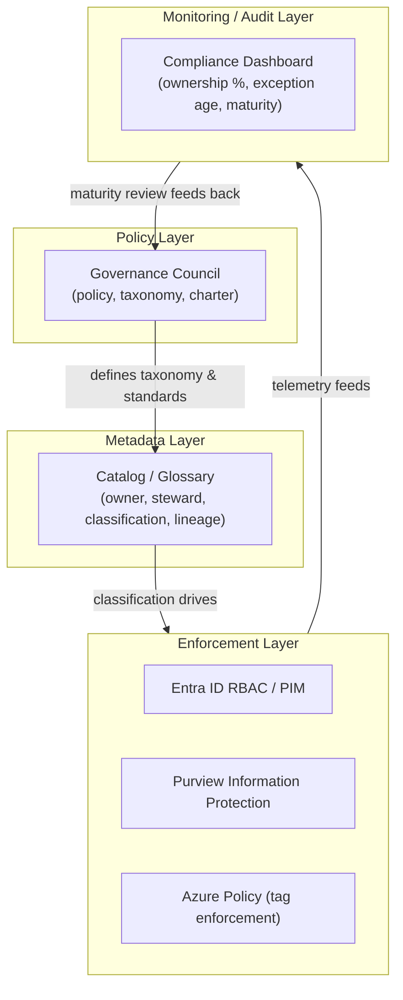
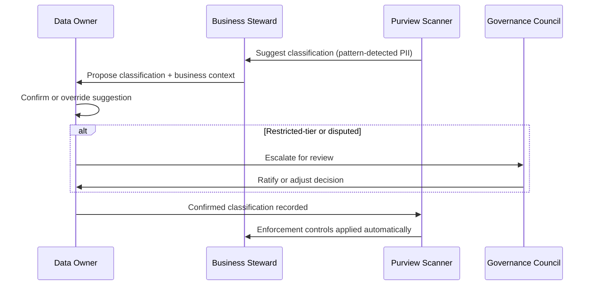
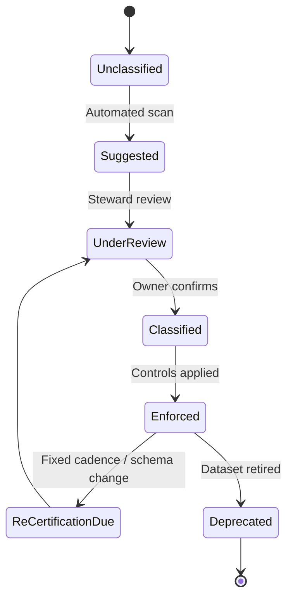

# Data Governance Foundations

> Part of the **Enterprise Data & AI Architecture Handbook** · Phase-08 — Data Governance & Quality · Chapter 01.
> Estimated study time: **60 min reading + ~3h labs**.
> **Prerequisites:** read [Architecture Governance](../Phase-01/02_Architecture_Governance.md) first.

---

## Executive Summary

[Architecture Governance](../Phase-01/02_Architecture_Governance.md#core-concepts) built the machinery that governs *how systems get built* — ARBs, RFCs, golden paths, guardrails. **Data governance** governs something narrower but no less critical: *whether the data those systems produce, move, and consume can be trusted, is owned by someone accountable, and is used within legal and policy boundaries.* A perfectly governed architecture can still produce a customer table with three conflicting definitions of "active customer," a finance dataset nobody owns after a reorg, or a training set fed into a production LLM copilot with no record of its provenance or consent basis. This chapter establishes the **operating model** layer that every other Phase-08 chapter — catalog and lineage, data quality, metadata management, master data management, Microsoft Purview, and data contracts — ultimately enforces. Tooling without an operating model has nothing to enforce; an operating model without tooling doesn't scale past a handful of teams. Both are necessary, and this chapter is deliberately about the former.

The reference body of knowledge throughout is **DAMA-DMBOK2** (Data Management Body of Knowledge, 2nd edition) — not because it is the only framework, but because it is the vendor-neutral lingua franca that Azure, AWS, and GCP governance tooling all implicitly map onto. This chapter covers the DAMA governance domain specifically: operating models (centralized, federated, hybrid), the ownership/stewardship/custodianship role triad, the policy-standard-control-guideline hierarchy, data classification, and maturity measurement.

The governing insight of this chapter: **data governance is an accountability problem before it is a tooling problem.** Microsoft Purview can catalog every asset in a tenant and Azure Policy can enforce every classification tag, but if no named human is accountable for a dataset's quality and appropriate use, the catalog entry is decoration. Conversely, a federated network of empowered, accountable data stewards with only a spreadsheet will outperform a centrally-owned, tool-rich program with no accountability model, at least until it hits scale. The chapters that follow assume the operating model this chapter defines is in place; skipping straight to tooling (Purview, Great Expectations, OpenMetadata) without first assigning ownership is the single most common reason enterprise data governance programs stall after an initial pilot.

The bias remains **Azure-primary (~60%)** — Microsoft Purview's Unified Catalog and Data Map, Microsoft Entra ID roles and Privileged Identity Management for steward access, Microsoft Purview Information Protection for classification-driven labeling, and Azure Policy for resource-level tag enforcement — **~30% enterprise open source** (the DAMA-DMBOK2 framework itself, Apache Atlas and OpenMetadata as open governance-catalog backends, Open Policy Agent for policy-as-code access decisions) and **~10% AWS/GCP comparison-only** (AWS Lake Formation permissions and Glue Data Catalog, GCP Dataplex and Data Catalog).

**Bottom line:** a data governance program succeeds when every dataset that matters has one accountable owner, a documented classification, and a policy that is actually enforced — and fails when governance is a slide deck, a council with no authority, or a catalog nobody keeps current. An architect who can stand up a right-sized operating model — matched to the organization's actual data-domain count and risk profile, not an idealized maximal one — is the person who makes every downstream governance tool (Purview, quality gates, MDM) actually work instead of becoming shelfware.

---

## Learning Objectives

By the end of this chapter you will be able to:

1. **Explain the DAMA-DMBOK2 knowledge wheel** and place data governance correctly as the domain that coordinates the other ten.
2. **Design a governance operating model** — centralized, federated (data-mesh-aligned), or hybrid — matched to an organization's domain count, risk profile, and culture.
3. **Assign and distinguish governance roles** precisely: data owner, business steward, technical steward, data custodian, and the data governance council/office, with a working RACI.
4. **Build a policy hierarchy** — policies, standards, controls, and guidelines — and explain why conflating them produces unenforceable governance.
5. **Design a data classification taxonomy** (sensitivity tiers) and map it to concrete access and handling controls.
6. **Measure governance program maturity** using a recognized model (DAMA DMM-style) and track leading indicators, not just lagging compliance percentages.
7. **Identify governance anti-patterns** — governance theatre, over-centralization, over-classification — before they stall a program.
8. **Map a target operating model onto Microsoft Purview and Microsoft Entra ID**, with an explicit, defensible comparison to AWS Lake Formation and GCP Dataplex.

---

## Business Motivation

Data governance exists because ungoverned data is not a neutral, cost-free state — it actively compounds risk and cost every year it persists:

- **Regulatory exposure is direct and quantifiable.** GDPR fines can reach 4% of global annual turnover; HIPAA violations carry per-record penalties; financial regulators' BCBS 239 principles require banks to *prove* data lineage and ownership for risk-aggregation reporting, not merely assert it. An organization that cannot name the owner of a dataset containing personal data cannot demonstrate compliance on demand — it can only promise to investigate after the fact.
- **AI and copilot initiatives amplify ungoverned data risk.** A retrieval-augmented enterprise copilot built on an ungoverned SharePoint/OneDrive corpus will surface stale, over-shared, or mis-classified documents to users who should never have seen them — turning a governance gap that was previously a slow-burning risk into an instantly-visible incident the moment generative AI is layered on top.
- **Duplicated, conflicting metric definitions cost real money.** When finance, sales, and marketing each maintain their own definition of "active customer" or "revenue," reconciliation meetings, delayed board reporting, and eroded trust in analytics are recurring, measurable costs — not one-time cleanup projects.
- **M&A and divestiture due diligence speed depends on governance maturity.** An acquirer's data-room diligence timeline is directly proportional to how quickly the target can produce an accurate data inventory with ownership and classification — an organization with none of this in place routinely adds months to deal timelines.
- **Ungoverned data blocks self-service analytics, ironically slowing the exact agility data platforms were built to enable.** Without a trustworthy catalog and classification, analysts either over-request access (creating security risk) or under-trust available data (recreating it themselves, at cost) — data governance is what makes safe self-service possible, not what blocks it.

---

## History and Evolution

- **1980s-1990s — Data administration function.** Early data administration groups managed physical data models and dictionaries for centralized mainframe and early relational systems; governance was implicit in a small number of DBAs controlling schema change.
- **1990s-2000s — Data warehousing centralizes accountability, briefly.** Enterprise data warehouse programs (Inmon, Kimball) created a single accountable team for integrated data, but this centralization became a bottleneck as the number of source systems and consumers grew faster than the central team.
- **2004 — DAMA-DMBOK v1 published**, formalizing data management as ten (later eleven) coordinated knowledge areas, with data governance explicitly named as the coordinating domain — a direct response to the fragmentation of "data admin," "data quality," and "metadata" being handled by disconnected teams with no shared framework.
- **2008-2013 — The financial crisis drives regulatory data governance.** The Basel Committee's **BCBS 239** ("Principles for effective risk data aggregation and risk reporting," 2013) was a direct regulatory response to banks' inability to aggregate risk exposure data quickly and accurately during the 2008 crisis — for the first time, data lineage and ownership became a supervisory examination item, not just a best practice.
- **2010s — Big data and self-service outpace governance.** Hadoop-era "data lake" programs prioritized ingestion volume and self-service access over stewardship, producing the "data swamp" anti-pattern at scale — ungoverned, unclassified, undiscoverable data acquired faster than any team could govern it.
- **2018 — GDPR is the inflection point** that forces most global enterprises to build (or formalize) a real data governance operating model for the first time, because "right to be forgotten," lawful-basis tracking, and data subject access requests are operationally impossible without accurate ownership and lineage.
- **2019 — DAMA-DMBOK2 published**, the current reference edition, refining the eleven-domain knowledge wheel and giving governance an explicit place at its center, coordinating rather than competing with the other ten domains.
- **2019-2020s — Data mesh (Zhamak Dehghani) reframes governance as federated, not centralized**, proposing "federated computational governance" — global policy defined once, locally enforced by domain teams via automated platform tooling — directly informing this chapter's federated operating model pattern.
- **2020s-present — Responsible AI extends data governance to model and training data.** Governance scope now routinely includes training-data provenance, consent basis, and model-output classification, because copilots and agentic systems make ungoverned data immediately, visibly consumer-facing rather than a back-office risk.

---

## Why This Technology Exists

Data outlives the team, the project, and often the system that created it — a schema migrated in 2015 by a team that no longer exists is still being queried in 2026 by people with no way to ask the original author what a column means. Without a governance operating model, three structural failures are guaranteed over time: **ownership decays** (the person who understood a dataset leaves, and nobody explicitly inherits it), **definitions diverge** (every downstream consumer independently reinterprets ambiguous fields), and **risk becomes invisible** (nobody is accountable for noticing that a dataset now contains regulated personal data it didn't originally have). Data governance exists to make ownership, classification, and policy an explicit, maintained, discoverable state — rather than an assumption that erodes the moment the original team disperses.

---

## Problems It Solves

- **Ambiguous ownership that stalls remediation.** When a data quality issue or access request has no clear owner, it queues indefinitely in a shared backlog nobody prioritizes; an assigned data owner converts "somebody's problem" into "this specific person's problem," with measurable resolution SLAs.
- **Regulatory compliance that can be demonstrated, not just asserted.** A named owner, documented classification, and recorded lawful basis let an organization answer a regulator's or auditor's question in minutes rather than weeks of forensic investigation.
- **Divergent business definitions.** A governed business glossary with one steward-approved definition of "active customer" ends the recurring reconciliation meetings between finance, sales, and marketing.
- **Untrusted data blocking AI/analytics adoption.** Classification and quality signals attached to catalog entries (built on in [Data Catalog and Lineage](02_Data_Catalog_and_Lineage.md)) let analysts and copilots distinguish curated, trustworthy datasets from experimental ones before consuming them.
- **Slow, inconsistent access provisioning.** A documented classification taxonomy mapped to pre-approved access tiers turns a bespoke, ad hoc access negotiation into a fast, consistent, auditable request-and-approve workflow.

---

## Problems It Cannot Solve

- **It cannot fix bad data at the source.** Governance assigns accountability and policy; the actual technical remediation of null rates, duplicate keys, or schema drift is the job of the tooling and pipelines covered in [Data Quality with Great Expectations](03_Data_Quality_with_Great_Expectations.md) — a data owner without quality tooling can only escalate, not repair.
- **It cannot substitute for sound data architecture.** A well-governed dataset built on a poor logical/physical model (see Phase-06 dimensional modeling and Data Vault chapters) is still a poor model — governance does not retroactively fix modeling debt.
- **It cannot manufacture cultural accountability by decree.** A governance council with a charter but no executive backing, and stewards with the responsibility but not the authority (e.g., no ability to block a non-compliant release), produces governance theatre — documented process with no behavioral change.
- **It cannot govern what nobody understands.** A steward assigned to a domain they have no subject-matter expertise in can maintain a catalog entry's metadata fields but cannot meaningfully judge whether the data is fit for a new purpose — governance requires domain expertise, not just a role title.
- **It cannot eliminate the need for enforcement tooling.** A policy that "sensitive data must be masked in non-production" is unenforceable at scale without the technical controls (dynamic data masking, Purview Information Protection, row/column-level security) that later chapters and Phase-03/07 security chapters implement.

---

## Core Concepts

### 8.1 The DAMA-DMBOK2 Knowledge Wheel

DAMA-DMBOK2 organizes data management into eleven knowledge areas arranged around a hub: **Data Governance** sits at the center, coordinating Data Architecture, Data Modeling & Design, Data Storage & Operations, Data Security, Data Integration & Interoperability, Document & Content Management, Reference & Master Data, Data Warehousing & Business Intelligence, Metadata Management, and Data Quality. The wheel's structure is itself the argument: governance is not "one more domain" alongside the others, it is the coordinating layer that makes the other ten domains operate under a shared, accountable, policy-consistent model rather than as ten independent silos. This handbook's Phase-06 (modeling), Phase-04/05 (storage/warehousing), and Phase-08 chapters 02-07 (catalog, quality, metadata, MDM, Purview, contracts) map directly onto DAMA's outer wheel; this chapter is the hub.

### 8.2 Governance Operating Models

- **Centralized model** — a single data governance office defines policy, classifies data, and often directly performs stewardship for the whole organization. Fast to stand up, produces highly consistent outcomes early, but becomes a throughput bottleneck as the number of data domains grows past what one team can meaningfully understand — mirroring the same bottleneck dynamic covered for architecture governance in [Architecture Governance](../Phase-01/02_Architecture_Governance.md#business-motivation).
- **Federated model** (data-mesh-aligned) — domain teams own governance for their own data domains (customer, orders, inventory), while a small central function defines *global* policy (classification taxonomy, minimum controls, common tooling) and provides the platform that makes local enforcement possible without local teams reinventing it. Zhamak Dehghani's "federated computational governance" is this model formalized: global policy, computationally enforced locally.
- **Hybrid model** — the pragmatic default for most enterprises: central governance office owns cross-cutting concerns (regulatory classification taxonomy, tooling platform, escalation authority) while domain-aligned stewards own day-to-day accountability for their own datasets. Most mature Azure/Purview enterprise rollouts converge here within 18-24 months regardless of where they started.

### 8.3 Roles: Owner, Steward, Custodian, Council

| Role | Accountable for | Typically held by |
|---|---|---|
| **Data Owner** | Business accountability for a dataset's fitness for purpose, classification correctness, and access decisions | Business domain leader (e.g., VP of Sales owns customer data) |
| **Business Data Steward** | Definitions, business rules, quality criteria for a domain, day-to-day escalation point | Senior domain analyst/product owner |
| **Technical Data Steward** | Implementing classification, access controls, and quality checks in the platform | Data engineer / platform engineer embedded in the domain |
| **Data Custodian** | Safe technical custody — backup, platform security, infrastructure — without business decision authority | Platform/infrastructure team |
| **Data Governance Council/Office** | Setting global policy, resolving cross-domain disputes, tracking program maturity | CDO-chaired cross-functional body |

The critical distinction, frequently conflated in immature programs: an **owner** makes business decisions about a dataset (is it fit for this new AI use case? what's its correct classification?); a **custodian** keeps it safe and available but does not decide how it may be used. Assigning both responsibilities to an infrastructure team — a common early mistake — leaves nobody actually accountable for business-context decisions.

### 8.4 Policy, Standard, Control, Guideline Hierarchy

- **Policy** — a high-level, board/CDO-approved statement of intent ("all data classified as Confidential or above must be encrypted at rest and access-logged"). Policies change rarely.
- **Standard** — the specific, mandatory implementation of a policy ("Confidential-classified Azure SQL databases must use Transparent Data Encryption and customer-managed keys"). Standards are technology-specific and change more often than policy.
- **Control** — the actual mechanism that enforces a standard, automated wherever possible ("Azure Policy `DeployIfNotExists` rule enforcing customer-managed-key TDE on databases tagged Confidential").
- **Guideline** — a recommended, non-mandatory practice ("consider tokenizing high-cardinality identifiers even when not strictly required by the standard"). Guidelines exist for cases where a standard would be premature or where flexibility outweighs consistency.

Conflating these — writing a "policy" that is really a specific technical control — is one of the most common reasons a governance policy document becomes unmaintainable: a document that mixes intent and implementation must be entirely rewritten every time the underlying platform changes, instead of only its standards layer.

### 8.5 Data Classification and Sensitivity Tiers

A minimal, defensible classification taxonomy (aligned to Microsoft Purview Information Protection's default labels and adaptable to sector-specific regulation):

| Tier | Examples | Default controls |
|---|---|---|
| **Public** | Published marketing content, public financial filings | No access restriction; integrity controls only |
| **Internal** | Internal reporting, non-sensitive operational metrics | Entra ID authentication required; no external sharing |
| **Confidential** | Customer PII, commercial contracts, employee data | Encryption at rest/in transit, RBAC least-privilege, access logged and reviewed |
| **Restricted** | Payment card data, health records, trade secrets, regulator-reportable risk data | All Confidential controls plus need-to-know approval workflow, masking in non-production, retention/legal-hold controls |

### 8.6 Governance Maturity Models

DAMA's Data Management Maturity (DMM) model, similar in spirit to CMMI, scores a program from **Initial** (ad hoc, person-dependent) through **Managed**, **Defined**, **Measured**, to **Optimized** (governance is instrumented, proactively tuned, and embedded in delivery workflow). Maturity should be measured per DAMA domain, not as one enterprise-wide number — an organization can be "Defined" in data security and still "Initial" in metadata management, and conflating them into a single score hides exactly the gap that needs investment.

### 8.7 Governance Metrics That Matter

Leading indicators (predict future risk) matter more than lagging indicators (report past state) for program health: **percentage of Confidential+ assets with a named owner** and **percentage classified within N days of creation** are leading; **number of compliance audit findings** is lagging. A program tracking only lagging metrics discovers problems only after an audit — see [Monitoring](#monitoring) below.

---

## Internal Working

A data governance operating model functions as a repeating intake-to-monitoring cycle, not a one-time setup:

1. **Domain/dataset intake** — a new data domain (e.g., a new product line's transaction data) is registered, triggering a structured intake questionnaire (source system, expected consumers, known sensitivity).
2. **Ownership assignment** — the governance council or domain leadership assigns a named data owner; if no natural owner exists (common after a reorg), the council escalates until one is confirmed — an unassigned dataset is treated as a tracked risk, not a silent gap.
3. **Classification** — the owner (with technical steward support) classifies the dataset against the sensitivity taxonomy, informed where possible by automated scanning (Purview's built-in classifiers detect likely PII patterns to *suggest*, not replace, the owner's decision).
4. **Catalog registration** — the dataset, its owner, steward, classification, and business glossary terms are registered in the catalog (mechanics in [Data Catalog and Lineage](02_Data_Catalog_and_Lineage.md)).
5. **Policy mapping and enforcement** — classification maps deterministically to a pre-defined control bundle (access tier, encryption requirement, masking rule), applied via automated tooling wherever possible rather than manual configuration per dataset.
6. **Monitoring and re-certification** — the dataset's compliance state is monitored continuously (automated) and its ownership/classification re-certified on a fixed cadence (e.g., annually, or on a triggering event like a schema change touching new fields).
7. **Escalation** — exceptions (an owner disputes a classification, a steward flags a cross-domain conflict) escalate through a defined path ending at the governance council, mirroring the exception-register pattern from [Architecture Governance](../Phase-01/02_Architecture_Governance.md#core-concepts).

A simple RACI for a classification decision: the **Data Owner** is Accountable; the **Business Steward** is Responsible for proposing the classification; the **Technical Steward** and **Custodian** are Consulted (technical feasibility of controls); the **Governance Council** is Informed (or Consulted for Restricted-tier disputes).

---

## Architecture

A governance operating model is best understood as four coordinated layers, each owned by a different part of the organization:

- **Policy layer** — the governance council, its charter, and the policy/standard/control/guideline documents it maintains; changes here are infrequent and high-ceremony.
- **Metadata layer** — the catalog (business glossary, technical metadata, lineage) that makes ownership, classification, and definitions discoverable; this is the system of record the other layers depend on, detailed in [Data Catalog and Lineage](02_Data_Catalog_and_Lineage.md) and [Metadata Management](04_Metadata_Management_OpenMetadata_and_Atlas.md).
- **Enforcement layer** — the technical controls (Entra ID RBAC, Purview Information Protection labels, Azure Policy tag-based rules, row/column-level security) that make classifications and standards operationally real rather than documented intent.
- **Monitoring/audit layer** — continuous measurement of the other three layers' actual state (compliance dashboards, exception aging, access-review completion) feeding back into the policy layer's periodic review.

The critical architectural property: each layer should be able to evolve independently. A classification taxonomy change (policy layer) should not require rewriting catalog entries (metadata layer) if it was designed with extensible tiers; a new enforcement tool (e.g., adopting Purview Information Protection labels where only manual RBAC existed) should not require redefining ownership (policy layer) if the enforcement layer was properly decoupled.

---

## Components

- **Data Governance Council/Office** — the standing body that owns the policy layer and cross-domain escalation, chaired by or reporting to the CDO.
- **Domain Data Owners** — one per data domain, accountable for business decisions about that domain's data.
- **Stewardship network** — the distributed set of business and technical stewards who do day-to-day governance work.
- **Policy and standards repository** — version-controlled documentation of policies, standards, and the classification taxonomy (often a Git repo, mirroring the ADR/RFC pattern from Phase-01).
- **Data catalog / metadata repository** — the discoverable system of record for ownership, classification, definitions, and lineage.
- **Classification/labeling engine** — automated scanning and label application (e.g., Purview Information Protection, Unity Catalog tags).
- **Access and exception request workflow** — the intake mechanism for access requests and policy exceptions.
- **Governance metrics dashboard** — the instrumentation layer reporting on program health.

---

## Metadata

Data governance is fundamentally metadata-dependent: **business metadata** (glossary terms, definitions, owner/steward assignments) is what makes governance human-navigable; **technical metadata** (schema, data types, lineage) is what makes it verifiable; **operational metadata** (classification tags, access-review timestamps, SLA compliance state) is what makes it auditable. This chapter defines *what* metadata a governance program must capture (owner, steward, classification, glossary term, exception status); [Metadata Management](04_Metadata_Management_OpenMetadata_and_Atlas.md) and [Data Catalog and Lineage](02_Data_Catalog_and_Lineage.md) cover *how* it is captured, stored, and kept current at scale.

---

## Storage

Governance artifacts live in purpose-fit stores rather than one monolithic system: the **policy and standards repository** lives in Git (versioned, reviewable via pull request, consistent with the ADR/RFC pattern already established for architecture governance); the **business glossary and catalog metadata** live in the metadata repository underpinning Microsoft Purview's Data Map or an open-source alternative (Apache Atlas, OpenMetadata); **classification labels** are typically stored as first-class metadata directly on the asset (Purview sensitivity labels, Unity Catalog/ADLS tags) rather than in a disconnected spreadsheet, precisely so enforcement tooling can read them directly without a synchronization step that inevitably drifts.

---

## Compute

The governance program's own compute footprint is modest — workflow engines for access requests and exception approvals, and the classification scanning jobs that periodically re-scan registered data sources for sensitive-pattern detection (Purview scanning is billed per Capacity Unit consumed during a scan). The larger compute cost consideration is indirect: enforcement controls like dynamic data masking and row-level security add marginal query-time overhead that should be load-tested before enabling broadly on high-throughput analytical workloads.

---

## Networking

Governance tooling itself has network-security requirements consistent with any sensitive-data-adjacent system: a Microsoft Purview account should be deployed with **private endpoints** so catalog metadata and scanning traffic never traverse the public internet, and scanning connections to source systems (SQL, ADLS, Synapse) should use **managed private endpoints** or the Purview self-hosted integration runtime inside the source's network boundary, rather than opening public network access on the source purely to permit a governance scan.

---

## Security

Governance role design must itself follow least-privilege and separation-of-duties: a data owner approves access and classification decisions but should not be the same person who implements the technical control (separation between owner and custodian, per [Core Concepts](#core-concepts) above); stewardship-network access to Microsoft Purview's data map should be scoped via Entra ID roles (Data Curator, Data Reader) rather than blanket admin, and elevation to modify the classification taxonomy or global policy should require **Microsoft Entra Privileged Identity Management (PIM)** just-in-time activation, consistent with the same principle applied to architecture policy changes in [Architecture Governance](../Phase-01/02_Architecture_Governance.md#security). Every classification and access decision should be audit-logged and attributable to a named principal, never a shared service account.

---

## Performance

Governance overhead is a real, measurable cost against delivery velocity if designed poorly: a classification or access-request workflow that takes two weeks per decision will be routed around exactly as a heavyweight ARB gate is in architecture governance. Right-sizing means automating the high-volume, low-risk path (auto-classify Public/Internal-tier data via scanning with light spot-check review) and reserving human review latency for the low-volume, high-risk path (Restricted-tier classification disputes, cross-domain ownership conflicts) — the same tiering principle as Phase-01's guardrails-vs-gates design.

---

## Scalability

A centralized operating model's single governance team scales roughly linearly with headcount added to that team but sub-linearly with the number of data domains the organization actually has — past a few dozen domains, a central team cannot maintain the subject-matter depth to make good classification and quality judgments for all of them. A federated model scales far better with domain count because stewardship capacity grows automatically as domain teams grow, provided the central function has invested in a self-service platform (automated classification suggestions, templated onboarding, policy-as-code) that lets domain stewards govern their own data without needing to become governance experts themselves.

---

## Fault Tolerance

Governance programs must plan for the departure of key people, not just system failures: an assigned data owner leaving the organization without a documented succession plan is the single most common cause of "orphaned" datasets reappearing years later during an audit. A resilient operating model requires (a) every ownership assignment to have a named backup or an automatic escalation-to-manager rule on a fixed timer, and (b) the governance council itself to have more than one person capable of approving cross-domain escalations, avoiding a single point of failure at the top of the escalation path.

---

## Cost Optimization

The direct cost of a governance program (steward time, council overhead, Purview capacity units, Information Protection licensing) must be weighed against the quantifiable cost of not governing (regulatory fine exposure, incident remediation, duplicated pipeline/definition maintenance). **Worked FinOps example:** a mid-size enterprise with 5,000 monthly Purview scans across roughly 200 registered data sources incurs Purview scanning charges billed per vCore-hour of Capacity Units consumed; at an illustrative rate of roughly $0.60/vCore-hour and an average scan consuming 2 vCore-hours, that's approximately $6,000/month in scanning cost (5,000 × 2 × $0.60 ≈ $6,000). Compare this to a single GDPR Article 83 fine tier starting at €10M or 2% of global turnover for a failure to demonstrate lawful basis and data inventory accuracy — the scanning cost is recovered by avoiding a single such incident many times over, which is the standard justification used to secure executive sponsorship budget for a governance program's tooling spend.

---

## Monitoring

Track, at minimum: **percentage of Confidential+ classified assets with a named, current owner**; **average time from dataset creation to first classification**; **number of open policy exceptions and their age distribution** (mirroring the exception-register pattern from [Architecture Governance](../Phase-01/02_Architecture_Governance.md#monitoring)); **access-review/re-certification completion rate against SLA**; and **DAMA maturity score per domain**, tracked over time rather than as a single point-in-time snapshot. A dashboard reporting only "we are compliant" without trend data cannot distinguish a stable program from one that is silently eroding.

---

## Observability

Observability for a governance program means being able to answer, on demand and without a manual investigation: *who owns this dataset, what is it classified as, who accessed it in the last 90 days, and is that access still justified?* Microsoft Purview's Data Map and its integration with Entra ID sign-in logs and Azure Monitor/Log Analytics is the concrete Azure mechanism; lineage-based impact analysis (built on in [Data Catalog and Lineage](02_Data_Catalog_and_Lineage.md)) extends this to *what downstream reports/models would be affected if this dataset's classification changed.*

---

## Governance

This section addresses governing the governance program itself — a deliberately recursive but necessary concern. The **Data Governance Council** operates under its own charter: membership (CDO plus domain owner representatives), cadence (monthly for standing business, ad hoc for escalations), and a documented decision authority (which classification/policy disputes it can resolve directly versus which require executive sponsor sign-off). An **exception process**, structurally identical to the one described for architecture governance, ensures that a temporary deviation (e.g., a legacy system that cannot yet support required masking) is logged with an owner and an expiry date rather than becoming permanent, silent risk. The council reviews program maturity (per [Core Concepts §8.6](#core-concepts)) and the metrics dashboard on a fixed cadence, and its own membership/charter is itself version-controlled and periodically reviewed rather than fixed at program launch and never revisited.

**ADR Example — Choosing a Federated Operating Model:**

> **Context:** A 60-team engineering organization has 40+ distinct data domains, a single small central data governance team of 4, and a six-month backlog of classification and access requests.
> **Decision:** Adopt a federated (data-mesh-aligned) operating model — each domain appoints its own business and technical stewards, accountable to a domain data owner; the central team retreats to defining global policy, the classification taxonomy, and the self-service tooling platform (Purview onboarding templates, automated classification scanning) that lets domain stewards govern without becoming governance specialists.
> **Consequences:** Classification and access request latency drops from weeks to days for the ~90% of low-risk requests now handled at the domain level; the central team's remaining role — resolving cross-domain disputes and evolving global policy — becomes higher-leverage but requires investing upfront in the self-service platform, without which domain teams cannot actually execute the stewardship responsibility being delegated to them.
> **Alternatives considered:** (1) Scale the central team instead — rejected as cost grows linearly with domain count with no ceiling; (2) Do nothing and let the backlog persist — rejected as regulatory and AI-copilot risk from unclassified data was already escalating; (3) Fully decentralize with no central policy function — rejected because it reproduces the "40 incompatible governance processes" problem the program exists to prevent.

---

## Trade-offs

- **Centralized vs. federated**: centralized gives fast, consistent early results but caps out on scale; federated scales with domain count but requires more upfront platform investment and produces less immediate consistency.
- **Strict, heavyweight classification review vs. lightweight, automation-first classification**: strict review is more accurate initially but creates the same bottleneck dynamic as a maximal ARB; automation-first (scan-and-suggest, human spot-check) scales but requires trusting automated classifiers enough to act on their suggestions for the bulk of low-risk data.
- **Tool-first vs. operating-model-first rollout**: standing up Purview before assigning owners produces a fully-cataloged but unaccountable inventory; assigning owners before any tooling produces accountability with no scalable enforcement — the two must be sequenced together, not chosen exclusively.

---

## Decision Matrix

| Criterion | Centralized | Federated (mesh-aligned) | Hybrid |
|---|---|---|---|
| Time to initial consistency | Fast | Slow | Medium |
| Scales with domain count | Poor | Good | Good |
| Cultural fit for domain-autonomous orgs | Poor | Good | Good |
| Upfront platform investment required | Low | High | Medium |
| Risk of governance-theatre council | Medium | Low (accountability is local) | Low |
| Best fit | <10 data domains, early-stage program | 30+ domains, mature platform team available | Most enterprises 18-24 months into a program |

---

## Design Patterns

- **Federated stewardship network** — domain-embedded stewards accountable to a central policy function, the pattern this chapter recommends as the default target state for enterprises beyond a handful of data domains.
- **Tiered classification with automated suggestion** — automated scanners propose a classification; humans confirm or override, rather than manually classifying every asset from a blank state.
- **Glossary-first onboarding** — require a business glossary entry (definition, owner, steward) before a dataset can be marked "certified" in the catalog, preventing the common failure of a fully-cataloged-but-undefined data estate.
- **Exception register with expiry** — identical in structure to the Phase-01 architecture-governance exception register, reused here for classification and control exceptions.
- **Policy-as-code enforcement of classification tags** — Azure Policy rules that deny or flag resources missing required classification tags, converting a documentation-only standard into a continuously-enforced guardrail.

---

## Anti-patterns

- **Governance theatre** — a council with a charter and quarterly meetings but no authority to block a non-compliant release or reassign an orphaned dataset; produces documentation with no behavioral change.
- **Over-centralization** — a single small team attempting to own classification and quality decisions for every dataset in a 40-domain organization, guaranteeing a permanent backlog and shallow, subject-matter-poor decisions.
- **Over-classification** — labeling everything "Confidential" or "Restricted" out of caution; this doesn't reduce risk, it desensitizes stewards to the label's meaning and creates unnecessary access friction on genuinely low-risk data, undermining the taxonomy's credibility.
- **Governance without automation** — maintaining ownership and classification in a spreadsheet disconnected from the systems that actually enforce access, guaranteeing drift between documented and actual state within months.
- **Tool-first rollout** — deploying Purview enterprise-wide before a single data owner has been assigned, producing an impressively populated catalog that nobody is accountable for keeping accurate.

---

## Common Mistakes

- Launching a governance program without a named executive sponsor (ideally a CDO), leaving it without the authority to enforce decisions against resistant business units.
- Treating governance as a one-time project with a defined end date rather than an ongoing operating capability requiring permanent stewardship capacity.
- Ignoring incentive design — assigning stewardship responsibility as an unrecognized "extra duty" with no time allocation or performance-review credit, guaranteeing it is deprioritized under delivery pressure.
- Building the classification taxonomy in isolation from the teams that will use it, producing tiers that don't map cleanly to how the business actually thinks about its own data.
- Measuring program success only by "number of datasets cataloged" rather than by ownership and classification accuracy, rewarding volume over trustworthiness.

---

## Best Practices

- Secure genuine executive sponsorship (CDO or equivalent) with explicit authority to resolve cross-domain disputes before launching the program, not after the first escalation reveals the gap.
- Start with the highest-value, highest-risk data domain (typically customer PII or regulator-reportable financial data) rather than attempting enterprise-wide coverage on day one.
- Automate classification suggestion and access-tier mapping wherever the tooling supports it, reserving human review capacity for genuinely ambiguous or high-risk cases.
- Tie governance metrics to business outcomes (regulatory audit readiness, AI copilot trust, faster M&A diligence) rather than presenting them as an abstract compliance exercise.
- Integrate the data governance council's escalation path with the existing architecture governance ARB from [Architecture Governance](../Phase-01/02_Architecture_Governance.md) where decisions overlap (e.g., a new system design that touches Restricted-tier data), rather than running two disconnected governance processes.

---

## Enterprise Recommendations

- Run a 90-day bootstrap: weeks 1-2 charter and executive sponsorship; weeks 3-6 pilot on one high-value domain (owner assignment, classification, catalog registration); weeks 7-12 measure, refine the taxonomy and workflow based on pilot friction, then plan the federated rollout to additional domains.
- Set a realistic maturity target per domain rather than an enterprise-wide "Optimized" aspiration — a program claiming full optimization across all eleven DAMA domains within a year is not credible and invites the over-engineering failure mode this handbook consistently warns against.
- Embed governance checkpoints into existing DataOps/CI-CD workflows (schema-change PRs trigger a classification review prompt) rather than running governance as a separate, disconnected process layered on top of delivery.

---

## Azure Implementation

- **Microsoft Purview Unified Catalog and Data Map** is the primary Azure implementation of the metadata layer — registering data sources, running classification scans (built-in classifiers detect ~200 sensitive information types out of the box), and hosting the business glossary that stewards maintain.
- **Microsoft Purview Information Protection** applies sensitivity labels (Public/Internal/Confidential/Restricted, mirroring this chapter's taxonomy) consistently across Microsoft 365, Azure SQL, and Power BI, tying classification to actual enforcement (encryption, access restriction, watermarking) rather than a catalog-only label.
- **Microsoft Entra ID** roles (Purview Data Curator, Data Reader, Collection Admin) implement the owner/steward/custodian role separation at the platform level, with **Privileged Identity Management (PIM)** gating just-in-time elevation to modify global policy or the classification taxonomy.
- **Azure Policy** enforces classification-tag presence and correctness at the resource level — for example, denying deployment of a storage account without a required `dataClassification` tag:

```json
{
  "if": {
    "allOf": [
      { "field": "type", "equals": "Microsoft.Storage/storageAccounts" },
      { "field": "tags['dataClassification']", "exists": "false" }
    ]
  },
  "then": { "effect": "deny" }
}
```

- A minimal Purview account provisioning snippet (Bicep) establishing a private-endpoint-only governance metadata store, consistent with this chapter's [Networking](#networking) guidance:

```bicep
resource purview 'Microsoft.Purview/accounts@2021-12-01' = {
  name: 'contoso-purview-gov'
  location: location
  identity: { type: 'SystemAssigned' }
  properties: {
    publicNetworkAccess: 'Disabled'
    managedResourceGroupName: 'contoso-purview-managed-rg'
  }
}
```

---

## Open Source Implementation

- **DAMA-DMBOK2** itself is the vendor-neutral framework this entire chapter is built on — usable regardless of which cloud or catalog tooling an organization adopts.
- **Apache Atlas** provides an open-source metadata repository and classification/tagging engine historically paired with Hadoop-ecosystem governance, still common in on-premises and hybrid enterprises.
- **OpenMetadata** is a modern, actively developed open-source alternative offering a business glossary, ownership assignment, and classification tagging comparable in scope to Purview's catalog layer, and is the specific tool covered hands-on in [Metadata Management: OpenMetadata and Atlas](04_Metadata_Management_OpenMetadata_and_Atlas.md).
- **Open Policy Agent (OPA)** can implement policy-as-code access decisions keyed off classification tags in a cloud-agnostic way, complementing or substituting for Azure Policy in multi-cloud or Kubernetes-centric environments.

---

## AWS Equivalent (comparison only)

AWS's closest equivalents are **AWS Glue Data Catalog** (technical metadata registry) combined with **AWS Lake Formation** for classification-driven, fine-grained (row/column) access permissions, and **Amazon Macie** for automated sensitive-data discovery in S3. **Advantages:** Lake Formation's permission model integrates tightly with S3-based lake architectures and Glue-cataloged tables. **Disadvantages:** Lake Formation's governance scope is narrower than Purview's — it is primarily an access-control and catalog layer, with weaker native support for business glossary and cross-source lineage compared to Purview's Unified Catalog. **Migration strategy:** map Purview classification labels to Lake Formation LF-Tags, and rebuild business glossary content in a governance layer on top (Lake Formation does not natively provide one). **Selection criteria:** organizations already standardized on an S3/Glue-based lake will find Lake Formation's access-control integration faster to adopt; organizations needing a unified business glossary plus multi-source (SaaS, on-prem, multi-cloud) catalog will find Purview's broader scope a better fit.

---

## GCP Equivalent (comparison only)

GCP's equivalents are **Dataplex** (unified data fabric providing discovery, classification, and quality management across BigQuery, GCS, and external sources) and the underlying **Data Catalog** service for metadata search and tagging, with **IAM Conditions** implementing attribute-based access decisions keyed off classification tags. **Advantages:** Dataplex's tight native integration with BigQuery gives strong lineage and quality signal for GCP-native analytics workloads. **Disadvantages:** cross-cloud and SaaS-source coverage is less mature than Purview's connector ecosystem. **Migration strategy:** map Purview classification taxonomy to Dataplex data attributes/tags and rebuild IAM Condition policies keyed to the same tags. **Selection criteria:** BigQuery-centric organizations will find Dataplex's native integration compelling; multi-cloud or Microsoft-365-heavy organizations will find Purview's broader connector and Information Protection integration more complete.

---

## Migration Considerations

- **From spreadsheet-tracked ownership to a governed catalog**: run a one-time reconciliation import into Purview/OpenMetadata, then immediately deprecate the spreadsheet as the source of truth to prevent the two from silently diverging.
- **From centralized to federated operating model**: pilot federation on 2-3 willing, higher-maturity domains before mandating it organization-wide, using the pilot to validate that the self-service platform tooling is actually sufficient for domain stewards to succeed without central-team hand-holding.
- **From manual classification to automated scanning**: run automated classifiers in suggestion-only mode first, comparing suggestions against a manually-verified sample to establish confidence before allowing them to drive access decisions automatically.
- **From Atlas/OpenMetadata to Purview (or vice versa) during a cloud consolidation**: expect a metadata model mapping exercise, not a direct import — glossary terms, classification taxonomies, and lineage graph structures differ enough between platforms that a validation pass against the DAMA framework (which both should map to) is the safest reconciliation approach.

---

## Mermaid Architecture Diagrams

**Governance operating model layers:**



**Classification decision sequence:**



**Data asset classification lifecycle:**



---

## End-to-End Data Flow

1. A new transactional dataset is created by a product team launching a new payments feature, triggering the domain intake questionnaire as part of the CI/CD pipeline's schema-registration step.
2. The dataset has no obvious pre-existing owner (new product line), so the governance council assigns the payments domain lead as data owner within the program's 5-business-day SLA.
3. Purview's automated scanner detects card-number-pattern fields and suggests **Restricted** classification; the business steward confirms this is correct given the payments context.
4. Classification confirmation automatically triggers the mapped control bundle: encryption at rest with customer-managed keys, row-level masking for non-production environments, and an access-approval workflow requiring owner sign-off for any new consumer.
5. The dataset is registered in the catalog with its owner, steward, classification, and a business glossary term ("Payment Transaction") linked from three other domains' documentation that reference it, giving downstream analysts and copilots a single, trustworthy definition to consume.
6. Twelve months later, a scheduled re-certification prompts the owner to reconfirm the classification is still accurate; a subsequent schema change adding a new field is flagged automatically for interim re-classification review rather than waiting for the annual cycle.

---

## Real-world Business Use Cases

- **A global bank's BCBS 239 program**: risk-data lineage and ownership, previously undocumented and reconstructed manually for each regulatory exam, was formalized into a governed catalog with named owners per risk-reporting dataset, cutting exam-preparation time from months to weeks.
- **A healthcare provider's HIPAA classification program**: a federated stewardship network across clinical departments replaced a single overwhelmed central compliance team, reducing average access-request turnaround from three weeks to two days while improving classification accuracy (verified via subsequent internal audit).
- **A retail company's unified "customer" glossary**: a single steward-approved definition of "active customer," enforced through the catalog and referenced by every BI tool's semantic layer, ended a years-long recurring reconciliation dispute between finance and marketing reporting.

---

## Industry Examples

- **Uber's Databook** (internal data catalog) formalized ownership and metadata discovery at a scale of hundreds of thousands of tables, directly influencing the broader industry's move toward automated, scan-driven catalog population rather than manual documentation.
- **LinkedIn's DataHub** (open-sourced) originated from an internal need to track ownership and lineage across a rapidly growing number of Kafka topics and Hadoop tables, and remains a widely cited reference architecture for federated metadata collection.
- **Netflix's data mesh-aligned domain ownership model** is frequently cited as an early large-scale production example of federated computational governance — global standards, locally enforced by domain teams via shared platform tooling.
- **Capital One's cloud-native governance program**, built heavily on AWS Lake Formation and Glue, is a widely referenced case of a highly regulated financial institution operationalizing classification-driven access control at scale in the public cloud.

---

## Case Studies

**Case Study 1 — An Over-Centralized Council That Became the Bottleneck.** A 45-team organization launched its data governance program with a single central team required to approve every classification decision across all domains. Within four months, the approval queue exceeded 300 open requests, and several teams began quietly self-classifying and self-provisioning access to unblock delivery, silently reintroducing the exact ungoverned state the program existed to prevent — with no audit trail of these workarounds. The remediation, now this chapter's default recommendation, was to redesign as a federated model: domain teams took direct ownership of classification for their own data with the central team retreating to policy-setting and cross-domain dispute resolution, cutting the queue to near-zero within two quarters.

**Case Study 2 — Years of Divergent Metric Definitions from Unassigned Ownership.** A retail enterprise's finance, marketing, and sales teams each maintained an independent definition of "active customer" for years, with no assigned steward for the term and no governed glossary to arbitrate. Board-level reporting regularly required a multi-day reconciliation exercise before quarterly reviews because the three departments' numbers never matched. Assigning a single business steward for the customer domain, publishing one glossary-approved definition, and requiring all BI tools to reference it via the catalog's semantic layer eliminated the reconciliation exercise entirely within one reporting cycle — the fix was organizational (ownership), not technical.

---

## Hands-on Labs

1. **Draft a RACI matrix** for a classification decision in your own organization (or a realistic hypothetical), naming a specific owner, steward, custodian, and escalation path.
2. **Build a five-term business glossary** for a domain you know well, including a definition, an assigned steward, and at least one example of a prior ambiguity the definition resolves.
3. **Design a four-tier classification taxonomy** (or adapt this chapter's) and map each tier to at least three concrete technical controls.
4. **Stand up a Microsoft Purview trial account**, register one data source, run an automated classification scan, and manually confirm or override its top three suggestions.
5. **Design an escalation workflow** (diagram or written process) for a disputed Restricted-tier classification, including SLA timers at each step.
6. **Run a DAMA-DMM-style self-assessment** across two knowledge areas (e.g., data governance and metadata management) for your own organization, scoring each Initial through Optimized with a one-sentence justification.

---

## Exercises

1. A stakeholder argues "we don't need data owners if we have Microsoft Purview — the tool will handle governance." Explain precisely what a catalog tool can and cannot do without an assigned owner.
2. Given a governance council with a six-month classification-request backlog, propose a concrete federation plan and identify the first two domains you would pilot it with, and why.
3. Critique this classification: "All customer data is Restricted." Explain why blanket over-classification undermines a taxonomy's usefulness, using a concrete counter-example.
4. Explain the difference between a data owner and a data custodian using a specific example where conflating the two roles caused a real governance failure.
5. Design a succession plan for data ownership that survives a reorg, specifying exactly what triggers a re-assignment review.

---

## Mini Projects

- **Domain Governance Charter**: write a one-page charter for a single real or hypothetical data domain — owner, steward, classification, glossary terms, and escalation path — and have a peer review it for gaps.
- **Classification Scanning Pilot**: register a small, non-sensitive dataset in a Purview or OpenMetadata trial instance, run automated scanning, and document the suggestion accuracy against your own manual review.
- **Governance Maturity Scorecard**: build a simple scorecard (spreadsheet or small script) scoring 3-4 DAMA domains against the Initial-to-Optimized scale for a real or hypothetical organization, with a one-quarter improvement plan for the lowest-scoring domain.

---

## Capstone Integration

This chapter's operating model — ownership, stewardship, classification taxonomy, and the policy/standard/control hierarchy — is the accountability layer that [Data Catalog and Lineage](02_Data_Catalog_and_Lineage.md), [Data Quality with Great Expectations](03_Data_Quality_with_Great_Expectations.md), [Metadata Management](04_Metadata_Management_OpenMetadata_and_Atlas.md), [Master Data Management](05_Master_Data_Management.md), [Microsoft Purview](06_Microsoft_Purview.md), and [Data Contracts](07_Data_Contracts.md) all build on directly — none of those chapters' tooling has anything to enforce without a named owner and a classification decision already in place. Later phases' DataOps and data-mesh chapters (Phase-09) apply this chapter's federated operating model concretely to pipeline and platform ownership. In the handbook's capstone (Phase-20), the governance operating model designed here — federated stewardship, a maintained classification taxonomy, and a live exception register — is the accountability structure used to justify and govern the capstone reference platform's data estate.

---

## Interview Questions

1. What is the difference between a data owner and a data steward?
   **A:** A data owner holds business accountability for a dataset — its fitness for purpose, correct classification, and access decisions; a data steward (business or technical) does the day-to-day work of maintaining definitions, quality criteria, and implementing controls on the owner's behalf, but does not hold final accountability.
2. Name the eleven DAMA-DMBOK2 knowledge areas' coordinating domain.
   **A:** Data Governance sits at the center of the knowledge wheel, coordinating the other ten domains (architecture, modeling, storage, security, integration, content management, master/reference data, warehousing/BI, metadata, and quality) rather than operating as an independent, disconnected domain.
3. Why does over-classifying data (labeling everything "Confidential" or "Restricted") undermine a governance program?
   **A:** It desensitizes stewards and consumers to what the label actually means, creates unnecessary access friction on genuinely low-risk data, and erodes trust in the taxonomy's accuracy — a credible taxonomy must differentiate risk levels meaningfully, not default to maximum caution everywhere.
4. What is "federated computational governance"?
   **A:** An operating model, popularized by data mesh, where a small central function defines global policy and provides shared platform tooling, while domain teams locally enforce that policy against their own data — combining global consistency with the scalability of distributed ownership.
5. Why must a policy exception have an expiry date?
   **A:** Without one, a temporary deviation granted under delivery pressure becomes permanent, unreviewed risk; an expiry date forces a future decision point to either remediate or formally re-justify the exception.

---

## Staff Engineer Questions

1. Your organization's central governance team has become a six-month classification backlog. How would you diagnose whether the fix is more headcount or an operating model change, and what data would you look at first?
   **A:** Look at whether backlog growth is proportional to new-domain count (an operating-model problem, since headcount can never scale linearly with organizational growth) versus a temporary spike from a one-time event (a headcount/process problem); a persistent, structural correlation with domain count points to federating rather than staffing up a centralized bottleneck.
2. How would you design an automated classification suggestion system that stewards will actually trust enough to act on, rather than treating every suggestion as noise to re-verify manually?
   **A:** Start the scanner in suggestion-only mode, track suggestion accuracy against a sample of manually-verified ground truth for several weeks, and only promote it to auto-apply for the highest-confidence pattern types (e.g., well-known PII regexes) once measured precision clears an agreed threshold — trust is earned incrementally, not granted by default.
3. A domain team disputes a Restricted classification the automated scanner assigned, arguing the data is anonymized. How do you resolve this without either overriding the scanner blindly or ignoring the team's domain expertise?
   **A:** Escalate to the business steward and owner to formally document the anonymization method and confirm it meets the organization's re-identification-risk standard, then update the classification with that justification recorded — the resolution must be a documented business decision, not a silent scanner override.

---

## Architect Questions

1. Design a governance operating model for a 60-team organization currently running fully centralized governance with a six-month backlog. Specify the target model, migration sequencing, and what platform investment must precede the migration.
   **A:** Target a federated (mesh-aligned) model; sequence a 2-3 domain pilot first to validate self-service tooling sufficiency before organization-wide rollout; the central team must invest in automated classification scanning, onboarding templates, and a self-service access-request workflow *before* asking domain teams to take on stewardship, or the migration simply relocates the bottleneck rather than resolving it.
2. How would you reconcile this chapter's data governance council with the existing Architecture Review Board from [Architecture Governance](../Phase-01/02_Architecture_Governance.md) when a single proposal (e.g., a new system touching Restricted-tier data) requires both?
   **A:** Define a joint escalation path where the ARB's tiering questionnaire includes a data-classification trigger that automatically routes to a joint review when Restricted-tier data is touched, avoiding both a redundant double-approval process and a gap where neither body believes it owns the decision.
3. A newly acquired business unit has an incompatible classification taxonomy and no assigned data owners. Design an integration approach avoiding both a disruptive big-bang re-classification and a permanent parallel-taxonomy problem.
   **A:** Run a time-boxed harmonization: map the acquired unit's existing classifications to the parent taxonomy's closest equivalent tier as an interim state, assign temporary owners immediately (even if imperfectly matched) to close the "nobody accountable" gap first, then run a proper re-classification exercise against the unified taxonomy on a defined schedule rather than indefinitely maintaining two parallel systems.

---

## CTO Review Questions

1. What percentage of our Confidential-or-above data assets currently have a named, current owner, and what is the trend over the last two quarters?
   **A:** This must be answerable from the governance dashboard, not estimated; a flat or declining percentage signals the program is losing ground against organic data growth and needs either more automation or a federation shift, not just reassurance that "most of it is covered."
2. If we tripled our data domain count next year through organic growth and acquisition, would our current governance model hold, or become the new bottleneck?
   **A:** A centralized model does not scale linearly with domain count and would become the bottleneck first; the highest-leverage investment ahead of that growth is federating stewardship and building the self-service platform tooling that makes domain-level ownership actually executable without central-team hand-holding.
3. Could we produce, within 48 hours, an accurate inventory of every dataset containing regulated personal data, its owner, and its lawful basis for processing, if a regulator asked tomorrow?
   **A:** This is the direct test of whether the governance program is real or theoretical; if the honest answer requires a multi-week forensic exercise rather than a catalog query, the program's metadata layer (ownership and classification currency) is the priority gap to close, regardless of how mature its policy documentation looks.

---

## References

- DAMA International. *DAMA-DMBOK: Data Management Body of Knowledge, 2nd Edition.* Technics Publications, 2017.
- Basel Committee on Banking Supervision. *BCBS 239 — Principles for effective risk data aggregation and risk reporting.* https://www.bis.org/publ/bcbs239.htm
- European Union. *General Data Protection Regulation (GDPR).* https://gdpr.eu/
- Microsoft. *Microsoft Purview Documentation.* https://learn.microsoft.com/purview/
- Microsoft. *Microsoft Purview Information Protection.* https://learn.microsoft.com/purview/information-protection
- Dehghani, Zhamak. *Data Mesh: Delivering Data-Driven Value at Scale.* O'Reilly Media, 2022.
- AWS. *AWS Lake Formation Documentation.* https://aws.amazon.com/lake-formation/
- Google Cloud. *Dataplex Documentation.* https://cloud.google.com/dataplex/docs
- LinkedIn Engineering. *DataHub: A Generalized Metadata Search & Discovery Tool.* https://engineering.linkedin.com/blog/2019/data-hub

---

## Further Reading

- Ladley, John. *Data Governance: How to Design, Deploy, and Sustain an Effective Data Governance Program, 2nd Edition.* Academic Press, 2019.
- Dehghani, Zhamak. *How to Move Beyond a Monolithic Data Lake to a Distributed Data Mesh* (original essay). https://martinfowler.com/articles/data-monolith-to-mesh.html
- TDWI. *Data Governance research and best-practices reports.* https://tdwi.org/
- Microsoft Cloud Adoption Framework. *Govern Methodology.* https://learn.microsoft.com/azure/cloud-adoption-framework/govern/
- Gartner. *Data and Analytics Governance research.* (subscription required, referenced for maturity-model benchmarking)
