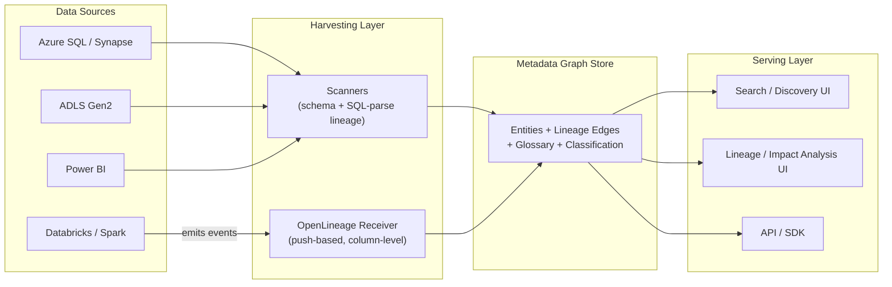
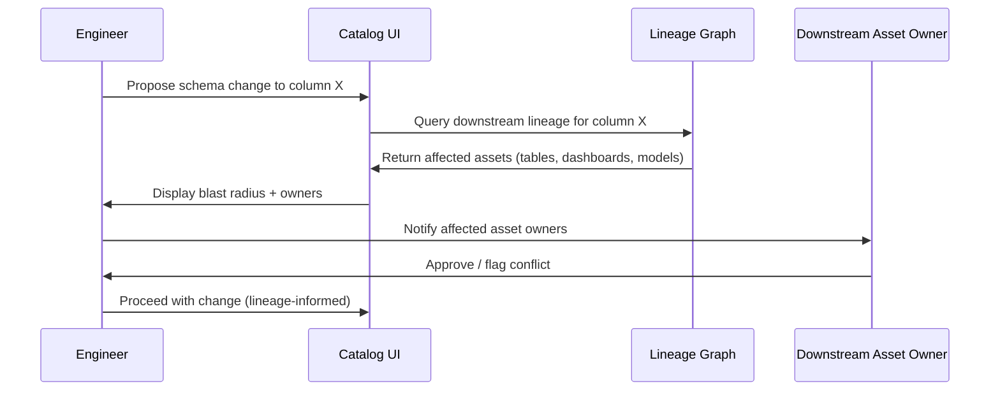
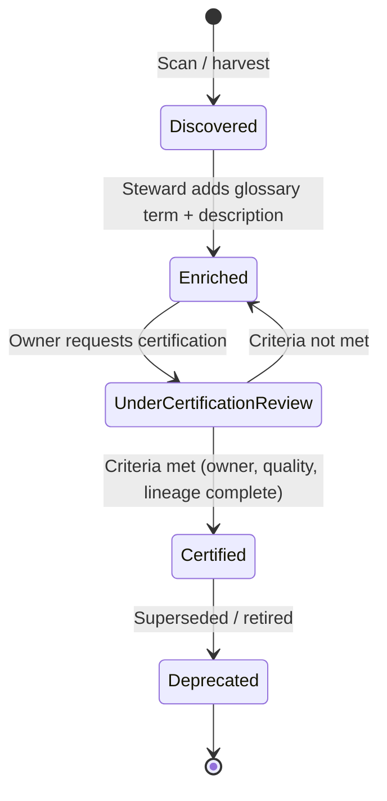

# Data Catalog and Lineage

> Part of the **Enterprise Data & AI Architecture Handbook** · Phase-08 — Data Governance & Quality · Chapter 02.
> Estimated study time: **60 min reading + ~3h labs**.
> **Prerequisites:** read [Data Governance Foundations](01_Data_Governance_Foundations.md) first.

---

## Executive Summary

[Data Governance Foundations](01_Data_Governance_Foundations.md#core-concepts) established *who* is accountable for data (owners, stewards) and *how* it must be classified and policed. None of that is discoverable or verifiable at scale without a **catalog** — the searchable system of record for what data exists, what it means, and where it came from — and **lineage** — the traceable record of how it got there and what depends on it. A governance program with owners and policies but no catalog is accountability with no way to find what you're accountable for; a catalog with no lineage tells you a table exists but not whether changing it breaks fourteen downstream dashboards and a fraud-detection model.

This chapter covers the catalog and lineage layer concretely: the distinction between **technical metadata** (schema, types, partitions — machine-generated) and **business metadata** (glossary terms, definitions, ownership — human-curated), why **column-level lineage** is qualitatively more valuable than table-level lineage for impact analysis and root-cause debugging, how **automated harvesting** (scanning, query-log parsing, pipeline instrumentation) is the only way lineage stays current at enterprise scale, and how **search, tagging, and glossaries** turn a metadata repository from a database only engineers can query into a tool business users actually use to self-serve trustworthy data.

The governing insight: **lineage that must be manually maintained is lineage that is wrong within a quarter.** Every catalog and lineage program that has scaled successfully — at Uber, LinkedIn, Netflix, or in Microsoft Purview's own architecture — treats manual documentation as a last resort for sources that cannot be automatically parsed, not the primary collection mechanism. The chapters that follow — [Data Quality](03_Data_Quality_with_Great_Expectations.md), [Metadata Management](04_Metadata_Management_OpenMetadata_and_Atlas.md), [Master Data Management](05_Master_Data_Management.md), [Microsoft Purview](06_Microsoft_Purview.md), and [Data Contracts](07_Data_Contracts.md) — all depend on the catalog and lineage graph this chapter builds being both automated and column-level; a table-level, manually-updated catalog cannot support automated quality-gate impact analysis, MDM golden-record traceability, or contract-breach blast-radius calculation.

The bias remains **Azure-primary (~60%)** — Microsoft Purview's Data Map, automated scanning, and lineage connectors for Azure Data Factory, Synapse, and Databricks — **~30% enterprise open source** (OpenMetadata and DataHub as leading open-source catalog platforms with native column-level lineage, Apache Atlas as the historical Hadoop-ecosystem catalog, OpenLineage as the emerging vendor-neutral lineage-emission standard) and **~10% AWS/GCP comparison-only** (AWS Glue Data Catalog plus DataZone, GCP Dataplex and Data Catalog).

**Bottom line:** a catalog succeeds when it is populated by automation faster than data changes, and when its lineage is granular enough (column-level) to answer "what breaks if I change this?" without a manual investigation. An architect who designs harvesting-first, column-level-lineage-first, and treats the business glossary as a thin, curated layer on top of an automatically-maintained technical metadata graph — rather than the reverse — builds a catalog people actually trust and use.

---

## Learning Objectives

By the end of this chapter you will be able to:

1. **Distinguish technical, business, and operational metadata** and explain why each requires a different collection strategy and refresh cadence.
2. **Design column-level lineage collection** across batch (Spark, ADF, dbt) and streaming pipelines, and explain why table-level lineage is insufficient for production impact analysis.
3. **Choose an automated harvesting strategy** — scanning, query-log parsing, pipeline instrumentation (OpenLineage) — matched to each source type in a heterogeneous data estate.
4. **Design a search, tagging, and glossary experience** that makes a catalog usable by business analysts, not only data engineers.
5. **Compare Microsoft Purview, OpenMetadata, DataHub, and Apache Atlas** on lineage granularity, connector breadth, and total cost of ownership.
6. **Run impact and root-cause analysis** using a lineage graph to answer "what downstream assets are affected" and "what upstream source caused this anomaly."
7. **Identify catalog and lineage anti-patterns** — stale manual documentation, table-level-only lineage, ungoverned tag sprawl — before they erode trust in the catalog.
8. **Map a target catalog and lineage architecture onto Microsoft Purview**, with an explicit, defensible comparison to AWS Glue/DataZone and GCP Dataplex/Data Catalog.

---

## Business Motivation

- **Discovery time is a direct, measurable cost.** Without a catalog, analysts routinely spend hours to days per task locating the right dataset, re-deriving a metric that already exists elsewhere, or asking around in chat channels for "who owns this table" — time that a searchable, governed catalog collapses to minutes.
- **Incident blast-radius calculation is impossible without lineage.** When an upstream schema change or data-quality incident occurs, an organization without lineage must manually trace downstream consumers — a process that, for a widely-consumed table, can take longer than the incident itself was originally live, extending customer and regulatory impact.
- **AI/copilot grounding depends on catalog-verified provenance.** A retrieval-augmented enterprise assistant that cannot distinguish a certified, lineage-traceable dataset from an ad hoc export will confidently answer questions from stale or unauthorized data — a governance gap that becomes an instantly visible product failure the moment generative AI is layered on top.
- **Regulatory data-lineage requirements (BCBS 239, GDPR Article 30 records of processing) are unattainable without automated, column-level lineage** — manually reconstructing lineage for an audit is exactly the forensic exercise [Data Governance Foundations](01_Data_Governance_Foundations.md#business-motivation) identified as a compliance risk multiplier.
- **Duplicated pipeline and dataset creation is a direct infrastructure cost** — teams that cannot discover an existing certified dataset routinely re-extract and re-transform the same source data, multiplying compute and storage spend for no informational gain.

---

## History and Evolution

- **1990s-2000s — Data dictionaries and static documentation.** Early data warehouses maintained data dictionaries as separate, manually-updated documents (often spreadsheets or wiki pages), disconnected from the systems they described and reliably stale within months.
- **2010s — Hadoop-era metadata sprawl drives the first purpose-built catalogs.** **Apache Atlas** (2015, originated at Hortonworks) and **Apache Hive Metastore** emerged to track schema and basic lineage across a rapidly growing number of Hadoop tables, but lineage was largely table-level and dependent on specific engine integrations (Hive, Sqoop, Storm).
- **2016 — LinkedIn's internal metadata scale problem produces WhereHows**, later open-sourced and evolved into **DataHub** (2019), one of the first catalogs designed from the outset around a general-purpose, push-based metadata event model rather than pull-only scanning — enabling near-real-time lineage updates from instrumented pipelines.
- **2019 — Uber publishes Databook**, documenting a catalog built to handle hundreds of thousands of tables and emphasizing automated metadata harvesting over manual documentation as the only viable strategy at that scale.
- **2019-2021 — OpenMetadata and Microsoft Purview (GA 2021, evolved from Azure Data Catalog v1/v2) launch**, both explicitly designed around automated scanning plus a unified technical-and-business-metadata model, reflecting the industry's consensus shift away from documentation-first catalogs.
- **2021 — OpenLineage launches** (originated at Datakin, now an LF AI & Data Foundation project), standardizing how pipeline frameworks (Spark, Airflow, dbt, Flink) emit lineage events in a vendor-neutral format — directly addressing the fragmentation problem where every catalog previously needed a bespoke integration per pipeline engine.
- **2022-present — Column-level lineage becomes table stakes**, driven by the same regulatory (BCBS 239, GDPR) and AI-grounding pressures described in this chapter's Business Motivation, with Purview, DataHub, and OpenMetadata all investing heavily in column-level parsing (SQL/Spark plan parsing) rather than only table-to-table edges.

---

## Why This Technology Exists

A data estate with hundreds or thousands of tables, views, pipelines, and reports has no way for a human to hold "what exists, what it means, and what depends on it" in memory — the moment an organization's data footprint exceeds what one experienced engineer can personally recall, that knowledge must live in a system, not in tribal memory. Catalogs exist to externalize that knowledge into something searchable; lineage exists to externalize the dependency graph that would otherwise require archaeology (reading pipeline code, asking around) every time a change's impact needs to be assessed. Both compound in value with data-estate size and pipeline complexity — which is exactly why they are frequently under-invested in early (when the pain is tolerable) and desperately needed later (when tribal memory has already been lost to team turnover).

---

## Problems It Solves

- **"What data exists, and can I trust it?"** — a searchable catalog with certification status, ownership, and classification (from [Data Governance Foundations](01_Data_Governance_Foundations.md#core-concepts)) answers this in seconds instead of a Slack thread.
- **"What breaks if I change this column?"** — column-level lineage turns impact analysis from a manual code-reading exercise into a graph query.
- **"Where did this suspicious value come from?"** — upstream lineage traversal turns root-cause analysis from "grep every pipeline" into tracing a graph edge by edge back to the source.
- **"Is this the same 'customer_id' as that other table's 'customer_id'?"** — a shared business glossary linked to technical columns resolves semantic ambiguity that schema alone cannot.
- **"Are we compliant with data-lineage regulatory requirements?"** — an automated, current lineage graph is the artifact regulators and auditors actually ask to see, not a narrative description.

---

## Problems It Cannot Solve

- **It cannot fix a bad data model.** A perfectly cataloged, fully-lineage-traced star schema with a poor grain choice (see Phase-06 dimensional modeling) is still a poor model — the catalog documents the design, it doesn't improve it.
- **It cannot substitute for the ownership and accountability layer.** A catalog can show a dataset has no assigned owner; it cannot assign one — that is an organizational governance action from [Data Governance Foundations](01_Data_Governance_Foundations.md#internal-working), not a catalog feature.
- **It cannot guarantee semantic correctness of harvested metadata.** Automated column-level lineage from SQL parsing can mis-attribute lineage through complex `UNION`, dynamic SQL, or heavily obfuscated stored procedures — high automation coverage still requires spot-verification on business-critical paths.
- **It cannot make business users adopt it by existing.** A technically excellent catalog with a confusing search experience or no glossary curation will be ignored in favor of asking a colleague, exactly as an unusable golden path is routed around per [Architecture Governance](../Phase-01/02_Architecture_Governance.md#design-patterns).
- **It cannot replace real-time observability for pipeline failures.** Lineage tells you *what* depends on a failed job; it does not alert you *that* the job failed — that is the domain of pipeline monitoring and the Observability practices in Phase-05/09.

---

## Core Concepts

### 8.1 Technical, Business, and Operational Metadata

- **Technical metadata** — schema, data types, partition keys, file formats, table/column statistics, physical storage location. Machine-generated, should be 100% automated, and changes whenever the underlying system changes (every schema migration, every new partition).
- **Business metadata** — glossary term definitions, business-friendly descriptions, classification labels, ownership assignments (from [Data Governance Foundations](01_Data_Governance_Foundations.md#core-concepts)). Human-curated, changes slowly, and is the layer that makes technical metadata meaningful to non-engineers.
- **Operational metadata** — freshness/last-updated timestamps, pipeline run history, data-quality scan results, access/query frequency. Machine-generated and time-series in nature, the layer that answers "can I trust this *right now*," distinct from the static "what does this mean" answered by business metadata.

The critical design principle: **technical and operational metadata must be harvested automatically**; only business metadata should require human curation, and even that should be scoped to a thin, high-value layer (glossary terms, certification) rather than attempting to hand-write descriptions for every column in the estate — an unattainable goal that guarantees partial, stale coverage.

### 8.2 Table-Level vs. Column-Level Lineage

Table-level lineage answers "does table B depend on table A" — useful for a first-pass dependency map, but insufficient for real work: if table A has 40 columns and a pipeline change only touches 3 of them, table-level lineage forces a manual investigation of all downstream consumers of table B to determine whether *their* query actually references the 3 affected columns. **Column-level lineage** tracks the dependency at column granularity — table B's `total_revenue` column derives from table A's `unit_price` and `quantity` columns specifically — making impact analysis precise: only consumers of `total_revenue` (not all of table B) need review. This precision is what makes automated, non-manual impact analysis and blast-radius estimation possible at all; without it, every lineage query degrades back into "well, technically the whole table could be affected," which is rarely actionable.

### 8.3 Automated Harvesting Strategies

- **Metadata scanning** — periodically connecting to a source system (a database, ADLS container, Synapse workspace) and extracting schema, statistics, and sometimes stored-procedure-level lineage by parsing SQL. This is how Purview populates its Data Map from most sources; it is comprehensive but runs on a schedule (not real-time) and its lineage-parsing accuracy depends on the SQL/procedural complexity of the source.
- **Query-log parsing** — mining a warehouse's query history (e.g., Synapse/SQL DMVs, Snowflake `ACCESS_HISTORY`) to infer lineage from actually-executed `INSERT ... SELECT` and `CREATE TABLE AS SELECT` statements. This captures lineage scanning alone might miss (ad hoc transformations) but only reflects queries that have actually run.
- **Pipeline instrumentation (push-based)** — the pipeline framework itself emits lineage events as it runs, using a standard like **OpenLineage** (natively supported by Spark, Airflow, dbt, Flink). This is the most accurate and near-real-time approach because the lineage comes directly from the execution plan the pipeline actually used, not an external inference — and is the recommended default wherever the pipeline framework supports it.

The enterprise-scale rule: prefer push-based instrumentation for pipelines you control (Spark/Databricks jobs, ADF pipelines with lineage extensions, dbt models), and fall back to scanning/query-log parsing only for sources where instrumentation isn't available (legacy ETL, third-party SaaS exports, ungoverned ad hoc scripts) — manual documentation should be the last resort, reserved for sources that can be neither instrumented nor parsed.

### 8.4 Search, Tagging, and Glossaries

A catalog's search experience is the single biggest driver of business-user adoption: full-text search across technical names, business glossary terms, and column descriptions, with faceted filtering by classification, owner, and certification status, turns a catalog from an engineer-only metadata database into a self-service discovery tool. **Tagging** (classification labels from [Data Governance Foundations](01_Data_Governance_Foundations.md#core-concepts), plus free-form organizational tags like `finance-domain` or `deprecated`) provides the faceting dimension; an ungoverned free-for-all tagging scheme, however, degrades into the same "tag sprawl" anti-pattern as an unmanaged folksonomy — a small, curated tag taxonomy, owned by the governance council, scales far better than unrestricted user-created tags. The **business glossary** is the semantic backbone: each term (e.g., "Active Customer") has one steward-approved definition and links to every physical column across the estate that implements it, which is what actually resolves the "is this the same concept as that other table's column" ambiguity that schema metadata alone cannot answer.

### 8.5 Certification and Trust Signals

A mature catalog surfaces a **trust signal** per asset — certified/verified (steward has reviewed and approved for broad use), deprecated (should not be used for new work), or experimental/uncataloged (exists but unreviewed) — so consumers (human or AI copilot) can distinguish a governed, production-grade dataset from an ad hoc one without needing tribal knowledge. This trust signal is the catalog-level analog of the classification tiers in [Data Governance Foundations](01_Data_Governance_Foundations.md#core-concepts), applied to fitness-for-use rather than sensitivity.

---

## Internal Working

A catalog and lineage platform's steady-state operation is a continuous, largely automated cycle:

1. **Registration** — a new data source (a Synapse workspace, an ADLS container, a Databricks Unity Catalog metastore) is registered with the catalog, specifying connection/scan credentials via managed identity.
2. **Scanning/harvesting** — on a schedule (or triggered by pipeline instrumentation events), the catalog extracts technical metadata (schema, types, partitions) and attempts lineage extraction (SQL/plan parsing, or receiving OpenLineage events directly).
3. **Classification suggestion** — automated classifiers scan sampled data for sensitive patterns and propose classifications, feeding into the [Data Governance Foundations](01_Data_Governance_Foundations.md#internal-working) classification workflow rather than duplicating it.
4. **Business enrichment** — stewards attach glossary terms, descriptions, and certification status to the automatically-harvested technical assets — the human-curation step is deliberately layered *on top of* automated technical metadata, never a substitute for it.
5. **Lineage graph construction** — individual column-level lineage edges from each source/pipeline are stitched into a single traversable graph, enabling multi-hop upstream/downstream queries across pipeline and tool boundaries.
6. **Consumption** — analysts, engineers, and increasingly AI copilots query the catalog for search, impact analysis, and root-cause investigation; access itself is logged as operational metadata, feeding the "how much is this asset actually used" signal referenced in [Monitoring](#monitoring).
7. **Re-scan and drift detection** — subsequent scans detect schema drift (new/removed columns) and flag it against existing lineage and quality expectations, rather than silently updating without signal.

---

## Architecture

A catalog and lineage platform is best understood as three cooperating subsystems: **harvesters** (scanners, query-log parsers, and OpenLineage event listeners that populate technical and operational metadata from every source system in the estate), a **metadata graph store** (the system of record holding entities — tables, columns, glossary terms, pipelines — and the typed edges between them, most importantly `derivesFrom` column-level lineage edges), and a **serving layer** (search index, graph-traversal API, and UI) that makes the graph queryable by both humans and downstream automation (quality gates, AI copilot grounding checks). The architectural property that most determines long-term success is whether the metadata graph store models lineage as a genuine graph with column-level nodes and edges — capable of efficient multi-hop traversal — rather than as flat table-to-table pairs bolted onto a relational schema, which becomes both slow and incomplete as the estate grows.

---

## Components

- **Source connectors/scanners** — per-source-type integrations (Azure SQL, Synapse, ADLS, Databricks, Power BI, Snowflake, on-prem SQL Server via self-hosted integration runtime).
- **Lineage extraction engine** — SQL/Spark-plan parsers plus OpenLineage event receivers that produce column-level `derivesFrom` edges.
- **Metadata graph store** — the entity-and-edge repository (tables, columns, glossary terms, pipelines, dashboards) underlying the whole platform.
- **Business glossary** — the curated, steward-owned term repository linked to physical assets.
- **Classification/tagging engine** — shared with [Data Governance Foundations](01_Data_Governance_Foundations.md#components)' classification workflow, not a separate taxonomy.
- **Search and discovery UI** — full-text search, faceted browsing, certification badges.
- **Lineage visualization and impact-analysis UI** — graph traversal rendered as an interactive upstream/downstream view.
- **API/SDK layer** — programmatic access for CI/CD-integrated impact checks (e.g., "does this schema change break a certified downstream asset?") and AI copilot grounding queries.

---

## Metadata

This chapter is, in a sense, entirely about metadata — but the operational distinction worth restating precisely: the catalog's own internal metadata model must itself separate **entity metadata** (a table's schema, a column's type), **relationship metadata** (lineage edges, glossary-term-to-column links), and **descriptive metadata** (human-written descriptions, tags). A catalog platform that conflates these into a single flat schema (common in early, homegrown catalogs) struggles to support graph-native queries like multi-hop impact analysis efficiently — which is precisely why purpose-built platforms (Purview, DataHub, OpenMetadata, Atlas) model metadata as a typed graph from the outset rather than as rows in a relational table.

---

## Storage

Purpose-built catalog platforms store the metadata graph in a graph-capable or graph-adjacent store optimized for entity-relationship traversal: Microsoft Purview's Data Map is backed by a managed graph/search index abstracted from the user; DataHub uses a combination of a document store (for entity metadata) and a graph index (Neo4j or an equivalent) specifically for lineage traversal; OpenMetadata similarly separates its entity store from a search index (Elasticsearch/OpenSearch) used for the discovery/search experience. The practical lesson for anyone evaluating or extending these platforms: catalog storage is deliberately polyglot — one store optimized for search, another for graph traversal — because no single storage engine excels at both full-text discovery and multi-hop lineage queries simultaneously.

---

## Compute

Harvesting is the dominant compute cost: full-source scans (schema plus statistics plus SQL-parse-based lineage) consume the scanning engine's compute proportional to source size and object count, billed in Azure as Purview Capacity Units per scan; query-log parsing consumes the warehouse's own query compute (already-run queries, so marginal cost is typically the log-extraction job only); OpenLineage event emission is lightweight (a metadata event per job run) and adds negligible overhead to the pipeline framework itself, which is one more reason to prefer instrumentation over full re-scanning wherever available.

---

## Networking

As with the broader governance platform (see [Data Governance Foundations — Networking](01_Data_Governance_Foundations.md#networking)), the catalog's scanning traffic to sensitive source systems should traverse **managed private endpoints** or a **self-hosted integration runtime** deployed inside the source's network boundary, never requiring the source to expose public network access purely to permit a scan. The catalog's own serving/search endpoints should similarly sit behind private endpoints when serving internal enterprise consumers.

---

## Security

Catalog and lineage metadata is itself sensitive: a lineage graph reveals an organization's internal data architecture, and a business glossary can reveal proprietary metric definitions — both should be access-controlled, not open-by-default. Scanning credentials should use **managed identities** scoped to read-only metadata access (never data-plane read/write) wherever the source supports it; search and lineage-viewing access should respect the same classification-driven access tiers from [Data Governance Foundations](01_Data_Governance_Foundations.md#security) — a Restricted-tier table's column-level lineage detail should not be visible to a user who lacks access to the underlying data itself, since the schema and lineage can themselves leak sensitive structure (e.g., a column literally named `ssn_encrypted`).

---

## Performance

Full-estate re-scans are expensive and slow at scale; a well-tuned harvesting strategy uses **incremental scanning** (only re-scanning sources with detected changes, via change-tracking or watermark timestamps) rather than full re-scans on every cycle, and prioritizes push-based instrumentation for high-change-frequency pipelines specifically because it eliminates the scan-latency tradeoff entirely — lineage arrives the moment the job runs, not on the next scheduled scan.

---

## Scalability

A catalog's scalability bottleneck is rarely the metadata graph store itself (these are designed for millions of entities) — it is almost always the **harvesting pipeline's** ability to keep pace with the rate of change across an expanding source estate. An organization adding new data sources faster than its scanning schedule can absorb them accumulates a growing backlog of stale or unscanned assets, silently eroding trust in the catalog exactly the way an under-resourced central governance team accumulates a classification backlog (per [Data Governance Foundations](01_Data_Governance_Foundations.md#scalability)). Push-based instrumentation scales far better than pull-based scanning as source count grows, because harvesting cost becomes proportional to actual pipeline executions rather than to the full size of the estate being re-scanned.

---

## Fault Tolerance

A harvesting failure (a scan job errors out, an OpenLineage event is dropped) should degrade gracefully to "this asset's metadata is stale as of timestamp X," clearly surfaced in the UI, rather than silently serving outdated lineage as if it were current — a silent staleness failure is more dangerous than an outright outage because it produces confidently wrong impact-analysis answers. Lineage graph stores should be backed up and, for platforms like Purview, benefit from the underlying managed service's built-in resiliency; self-hosted platforms (OpenMetadata, DataHub, Atlas) require the same backup/DR discipline as any other production data store.

---

## Cost Optimization

The dominant catalog cost driver is scanning compute (Purview Capacity Units) plus, for self-hosted open-source platforms, the infrastructure running the metadata store, search index, and UI. **Worked FinOps example:** an enterprise with 300 registered data sources running a full weekly scan at an average 1.5 vCore-hours per source, at an illustrative Purview rate of ~$0.60/vCore-hour, costs roughly 300 × 1.5 × $0.60 ≈ $270/week (~$1,170/month). Shifting the 200 highest-change-frequency sources to incremental scanning (touching only changed objects, at roughly 20% of a full scan's compute) while keeping the remaining 100 low-change sources on full weekly scans reduces the estimated cost to (200 × 1.5 × 0.2 × $0.60) + (100 × 1.5 × $0.60) ≈ $36 + $90 = $126/week — a roughly 53% reduction — illustrating why incremental/change-aware scanning, not just reducing scan frequency outright, is the recommended first FinOps lever for catalog scanning cost.

---

## Monitoring

Track: **scan success rate and staleness age per source** (how long since each asset's metadata was last refreshed); **lineage coverage percentage** (what fraction of registered assets have at least one lineage edge, versus existing as an isolated, disconnected node); **glossary term-to-column linkage coverage**; and **catalog search-to-result-click rate** as a proxy for whether users are actually finding what they search for (a low click-through rate on frequent searches signals either poor descriptions or missing certified assets).

---

## Observability

Observability here means answering, without manual investigation: *is this asset's lineage current, and can I trust an impact-analysis query run against it right now?* This requires surfacing scan/harvest job health (success/failure, last-run timestamp) directly alongside the lineage graph itself — a lineage UI that shows a confident-looking dependency graph without also showing "last updated 47 days ago" is presenting stale data as if it were live, undermining exactly the trust the catalog exists to build.

---

## Governance

Catalog and lineage governance is largely inherited from [Data Governance Foundations](01_Data_Governance_Foundations.md#governance): the same governance council that owns the classification taxonomy also owns the **glossary term approval workflow** (who can propose a new business term, who ratifies it — typically the relevant domain's business steward) and the **tag taxonomy** (preventing the free-for-all tag sprawl anti-pattern). A catalog-specific governance addition is the **certification workflow**: a defined process (who can mark an asset "certified," what criteria must be met — assigned owner, passing quality checks, complete lineage) that gives the certification badge in [Core Concepts §8.5](#core-concepts) actual meaning rather than being a self-asserted, unverified label.

**ADR Example — Column-Level Lineage via OpenLineage Instead of SQL-Parse-Only Scanning:**

> **Context:** An enterprise's Purview rollout initially relied solely on scan-time SQL parsing to build lineage across ~150 Synapse and Databricks pipelines. Parsing accuracy on dynamically-generated SQL (common in a subset of legacy ETL) was under 60%, producing an unreliable, partially-populated lineage graph that engineers stopped trusting for impact analysis.
> **Decision:** Instrument all Spark/Databricks and Airflow-orchestrated pipelines to emit **OpenLineage** events directly during execution, feeding Purview (via its OpenLineage-compatible ingestion API) with accurate, execution-time column-level lineage for the ~70% of pipelines built on instrumentable frameworks; retain SQL-parse scanning only for the remaining legacy stored-procedure-based ETL that cannot be instrumented.
> **Consequences:** Lineage accuracy for instrumented pipelines rose to near-100% (lineage reflects what actually executed, not an inferred guess), at the cost of a one-time engineering effort to add OpenLineage emitters to each pipeline framework; the remaining legacy-ETL lineage segment remains lower-confidence and is explicitly flagged as "parsed, not instrumented" in the catalog UI so consumers can weight their trust accordingly.
> **Alternatives considered:** (1) Manually document legacy lineage — rejected as unsustainable at 150-pipeline scale and guaranteed to go stale; (2) Wait for a full legacy-ETL rewrite before pursuing accurate lineage — rejected as the rewrite had no committed timeline and the lineage gap was an active, current risk; (3) Accept the 60% SQL-parse accuracy as sufficient — rejected because engineers had already demonstrably stopped trusting and using the lineage graph at that accuracy level.

---

## Trade-offs

- **Pull-based scanning vs. push-based instrumentation**: scanning requires no pipeline code changes but is scheduled, lower-accuracy on complex SQL, and scales poorly with source count; instrumentation is near-real-time and highly accurate but requires engineering effort per pipeline framework.
- **Column-level vs. table-level lineage**: column-level enables precise impact analysis but costs meaningfully more to build and maintain (parsing complexity, graph size); table-level is cheaper and faster to stand up but produces coarse, less actionable impact analysis.
- **Centrally-curated glossary vs. crowdsourced tagging**: a centrally-curated glossary produces higher-trust, consistent definitions but scales more slowly; crowdsourced tagging scales faster but risks the tag-sprawl anti-pattern without governance oversight.

---

## Decision Matrix

| Criterion | Microsoft Purview | DataHub (OSS) | OpenMetadata (OSS) | Apache Atlas (OSS) |
|---|---|---|---|---|
| Column-level lineage | Strong (native + OpenLineage) | Strong (native, push-based design) | Strong (growing rapidly) | Weaker (table-level historically stronger) |
| Azure-native connector breadth | Excellent | Good (via community connectors) | Good | Limited (Hadoop-ecosystem-centric) |
| Multi-cloud/SaaS connector breadth | Good and growing | Excellent (broad OSS connector ecosystem) | Excellent | Limited |
| Operational overhead (self-hosted) | None (managed service) | Moderate-high (Kafka, Elasticsearch, Neo4j/graph store) | Moderate (simpler stack than DataHub) | Moderate-high |
| Licensing cost model | Consumption-based (Capacity Units) | Free (self-hosted infra cost only) | Free (self-hosted infra cost only) | Free (self-hosted infra cost only) |
| Best fit | Azure-primary enterprises wanting a managed service | Engineering-heavy orgs wanting maximum connector/lineage flexibility | Orgs wanting OSS with a simpler ops footprint than DataHub | Legacy Hadoop-ecosystem environments |

---

## Design Patterns

- **Instrumentation-first harvesting** — prefer OpenLineage/native pipeline-emitted lineage over SQL-parse scanning wherever the framework supports it, reserving scanning for sources that cannot be instrumented.
- **Thin glossary layer over automated technical metadata** — curate a small, high-value set of business terms rather than attempting exhaustive manual documentation of every column.
- **Certification workflow gating "trusted" status** — an explicit, criteria-based process (owner assigned, quality checks passing, lineage complete) before an asset earns a certified badge, rather than a self-asserted label.
- **Incremental/change-aware scanning** — re-scan only what changed (via watermarks or change-tracking) rather than full-estate re-scans on every cycle, for both cost and staleness-latency reasons.
- **Governed tag taxonomy** — a small, council-owned set of tags rather than unrestricted free-form tagging, preventing search-degrading tag sprawl.

---

## Anti-patterns

- **Manual-documentation-first catalogs** — hand-writing table and column descriptions as the primary population strategy; guaranteed to be incomplete and stale within a quarter at any real enterprise scale.
- **Table-level-only lineage** — sufficient for a first dependency map but insufficient for the precise impact analysis that justifies the investment in lineage at all.
- **Ungoverned tag sprawl** — allowing every user to create arbitrary free-form tags produces a search experience as degraded as having no tags, defeating the faceted-discovery purpose tags exist for.
- **Treating the catalog as a one-time migration project** — populating it once during a Purview rollout and never re-visiting harvesting coverage as new sources are added, silently producing an increasingly incomplete catalog over time.
- **Silent staleness** — displaying lineage and metadata without a visible last-refreshed timestamp, letting users unknowingly act on out-of-date information.

---

## Common Mistakes

- Prioritizing connector breadth ("we can scan everything") over lineage depth ("we can precisely trace column-level dependencies"), producing a catalog that is wide but not useful for the impact-analysis use case that justified the investment.
- Underinvesting in the search and glossary UX, producing a catalog only engineers who already know the technical schema can use effectively — defeating the self-service goal.
- Scanning every source on an identical schedule regardless of change frequency, wasting compute on rarely-changing sources while under-refreshing high-change ones.
- Building a glossary in isolation from the classification taxonomy in [Data Governance Foundations](01_Data_Governance_Foundations.md#core-concepts), producing two disconnected metadata systems instead of one coherent model.
- Ignoring lineage for BI/reporting-layer assets (Power BI datasets, dashboards) and stopping the graph at the warehouse table level, missing the "what dashboards break" question that is often the most business-relevant impact-analysis use case.

---

## Best Practices

- Default to push-based (OpenLineage or native) instrumentation for any pipeline framework that supports it, and treat scan-based SQL parsing as the fallback for legacy or third-party sources only.
- Extend the lineage graph through the BI/reporting layer (Power BI datasets and reports), not just the warehouse, since business-facing impact ("which dashboards break") is frequently the most actionable question stakeholders actually ask.
- Keep the business glossary deliberately small and high-value at first — a few dozen well-curated, steward-approved terms outperform an exhaustive but shallow attempt to define every column.
- Gate "certified" status behind explicit, checkable criteria (owner present, quality checks passing, lineage complete) so the badge remains meaningful as the catalog scales.
- Instrument catalog search analytics (query terms, click-through, zero-result searches) from day one to identify glossary and description gaps empirically rather than by guesswork.

---

## Enterprise Recommendations

- Sequence the rollout: register and scan the highest-value, highest-consumption sources first (the ones already identified as high-priority domains in the governance program), rather than attempting simultaneous full-estate coverage.
- Budget explicit engineering time for OpenLineage instrumentation of in-house pipeline frameworks as part of the catalog rollout, not as an optional follow-on — the ADR example in [Governance](#governance) above demonstrates this is often the difference between a trusted and an ignored lineage graph.
- Assign glossary and certification governance to the same council and stewardship network established in [Data Governance Foundations](01_Data_Governance_Foundations.md#governance), rather than standing up a parallel, catalog-specific governance process.

---

## Azure Implementation

- **Microsoft Purview Data Map** is the primary technical and business metadata repository, with built-in scanners for Azure SQL, Synapse Analytics, ADLS Gen2, Cosmos DB, Power BI, and (via the self-hosted integration runtime) on-premises SQL Server and file shares.
- **Purview lineage connectors** natively capture pipeline-level lineage for **Azure Data Factory** and **Synapse pipelines**, and Purview's **Atlas-compatible ingestion API** accepts **OpenLineage** events, enabling Databricks/Spark and Airflow-orchestrated pipelines to push accurate, column-level lineage directly rather than relying on scan-time parsing.
- **Microsoft Purview's business glossary and classification** integrate directly with the Information Protection labels and Entra ID roles described in [Data Governance Foundations](01_Data_Governance_Foundations.md#azure-implementation), so glossary terms and certification live in the same platform as ownership and access control.
- Example: registering a Purview scan for an Azure Data Lake source via CLI:

```bash
az purview scan create \
  --account-name contoso-purview-gov \
  --data-source-name adls-sales-lake \
  --scan-name weekly-incremental-scan \
  --recurrence "Week" \
  --scan-ruleset "AdlsGen2" \
  --credential-name adls-scan-msi
```

- Emitting OpenLineage events from a Databricks job (using the OpenLineage Spark listener) so Purview ingests execution-time, column-level lineage:

```python
spark.conf.set("spark.openlineage.transport.type", "http")
spark.conf.set("spark.openlineage.transport.url", "https://contoso-purview-gov.purview.azure.com/openlineage")
spark.conf.set("spark.openlineage.namespace", "sales-pipeline")
```

---

## Open Source Implementation

- **OpenMetadata** provides a unified technical/business metadata model with column-level lineage, a business glossary, and a simpler self-hosted operational footprint than DataHub — covered hands-on in [Metadata Management: OpenMetadata and Atlas](04_Metadata_Management_OpenMetadata_and_Atlas.md).
- **DataHub** (LinkedIn-originated, now an LF AI & Data Foundation project) is built around a push-based metadata event model from the outset, making it a natural fit for organizations already emitting **OpenLineage** events from Spark/Airflow/dbt pipelines.
- **Apache Atlas** remains the standard catalog for Hadoop-ecosystem-centric environments (Hive, HBase) but has weaker native column-level lineage support than more modern alternatives, making it a better fit for legacy environments than new builds.
- **OpenLineage** itself is not a catalog but the vendor-neutral lineage-emission standard now natively supported by Spark, Airflow, dbt, and Flink — adopting it decouples pipeline instrumentation from any single catalog vendor, letting the same lineage events feed Purview, DataHub, or OpenMetadata interchangeably.

---

## AWS Equivalent (comparison only)

AWS's equivalents are the **AWS Glue Data Catalog** (technical metadata registry, tightly coupled to Glue ETL and Athena/Redshift Spectrum) combined with **Amazon DataZone** for business glossary, data-product certification, and governed discovery across accounts. **Advantages:** deep native integration with Glue-based ETL and S3-cataloged data lakes. **Disadvantages:** column-level lineage support is less mature than Purview's OpenLineage-integrated approach, and DataZone's business-glossary and certification workflow is newer and less battle-tested than Purview's. **Migration strategy:** re-point OpenLineage-instrumented pipelines at Purview's ingestion API instead of Glue-specific lineage hooks, and rebuild glossary terms in Purview's business glossary or DataZone as the target platform requires. **Selection criteria:** organizations standardized on Glue/Athena-based lake architectures will find Glue Data Catalog's native integration lower-friction initially; organizations prioritizing mature, accurate column-level lineage and unified glossary/classification will find Purview's OpenLineage-native approach more complete today.

---

## GCP Equivalent (comparison only)

GCP's equivalents are **Dataplex** (unified discovery, lineage, and quality across BigQuery and GCS) and the underlying **Data Catalog** service, with **Dataplex's native BigQuery lineage** tracking column-level dependencies for BigQuery-native transformations automatically. **Advantages:** very strong native lineage for BigQuery-centric analytics workloads with no additional instrumentation required. **Disadvantages:** lineage coverage outside BigQuery (e.g., Spark-based pipelines not orchestrated through Dataplex) requires the same OpenLineage-style instrumentation effort as any other platform, and cross-cloud/SaaS connector breadth trails Purview's. **Migration strategy:** map Purview's classification and glossary terms to Dataplex's data attributes and glossary equivalent, and route OpenLineage-emitting pipelines to Dataplex's lineage ingestion where available. **Selection criteria:** BigQuery-centric organizations will find Dataplex's native lineage compelling with minimal setup; multi-source, Microsoft-365-heavy, or Azure-primary organizations will find Purview's broader connector ecosystem and unified glossary/classification model a better overall fit.

---

## Migration Considerations

- **From no catalog to Purview/OpenMetadata**: prioritize registering and scanning the domains already prioritized in the governance program's 90-day bootstrap (per [Data Governance Foundations](01_Data_Governance_Foundations.md#enterprise-recommendations)) rather than attempting full-estate registration on day one.
- **From table-level to column-level lineage**: instrument the highest-value, highest-change-frequency pipelines with OpenLineage first, since these produce the largest immediate improvement in impact-analysis usefulness relative to engineering effort.
- **Between catalog platforms (e.g., Atlas to Purview during a cloud migration)**: expect a metadata-model mapping exercise for glossary terms and classification, and re-validate lineage coverage post-migration since scan-based and push-based lineage extraction differ enough between platforms that a direct export/import rarely preserves full graph fidelity.

---

## Mermaid Architecture Diagrams

**Catalog and lineage platform architecture:**



**Column-level lineage impact-analysis sequence:**



**Metadata asset lifecycle state diagram:**



---

## End-to-End Data Flow

1. A Databricks pipeline transforming raw sales events into a curated `fact_sales` table emits **OpenLineage** events at execution time, capturing that `fact_sales.total_revenue` derives from `raw_sales.unit_price` and `raw_sales.quantity`.
2. Microsoft Purview ingests these events via its OpenLineage-compatible endpoint, adding column-level lineage edges to the Data Map alongside the technical metadata already harvested by its ADLS scanner.
3. A business steward attaches the glossary term "Total Revenue" to `fact_sales.total_revenue`, linking the technical column to the organization's steward-approved business definition.
4. A Power BI report ingests `fact_sales` and is itself scanned by Purview, extending the lineage graph one hop further to the dashboard layer.
5. An engineer proposing to change `raw_sales.unit_price`'s data type queries the lineage graph, discovers the `fact_sales.total_revenue` dependency and the downstream Power BI report, and notifies the report's owner before making the change — turning what would have been a production incident into a coordinated, lineage-informed change.
6. Post-change, the catalog's scan/instrumentation confirms the new lineage edges reflect the updated pipeline, and the asset's "last verified" timestamp updates, keeping the graph's staleness signal accurate.

---

## Real-world Business Use Cases

- **A financial services firm's regulatory lineage program**: automated, column-level lineage from Databricks pipelines to regulatory risk-reporting tables replaced a previously manual, quarterly lineage-reconstruction exercise for BCBS 239 audits, cutting audit-preparation effort from weeks to days.
- **A retail company's dashboard impact analysis**: extending lineage through the Power BI layer let a data platform team confidently deprecate 40 unused or duplicate tables by verifying, via the lineage graph, that no certified dashboard depended on them — work that previously required manually surveying report owners.
- **A healthcare provider's AI-copilot grounding gate**: an internal retrieval-augmented assistant was configured to only surface catalog-certified datasets to end users, using the certification badge from [Core Concepts §8.5](#core-concepts) as an automated trust filter rather than relying on prompt engineering alone to avoid ungoverned sources.

---

## Industry Examples

- **Uber's Databook** remains a widely cited reference for automated-harvesting-first catalog design at a scale of hundreds of thousands of tables, explicitly rejecting manual documentation as a primary strategy.
- **LinkedIn's DataHub**, born from the same WhereHows lineage-at-scale problem, popularized the push-based metadata event model that OpenLineage later standardized industry-wide.
- **Netflix's data platform** publishes extensively on lineage-driven impact analysis as a prerequisite for safe self-service data production, directly informing this chapter's emphasis on column-level precision.
- **Lyft** was an early production adopter and co-contributor to OpenLineage, using it to unify lineage collection across a heterogeneous Airflow/Spark pipeline estate.

---

## Case Studies

**Case Study 1 — A Table-Level-Only Lineage Graph That Failed Its First Real Incident.** A retail enterprise's initial catalog rollout captured only table-to-table lineage. When a critical `customers` table's `email` column needed to be re-hashed for a security remediation, the lineage graph could only report that "40 tables depend on `customers`" — with no way to determine which of those 40 actually referenced the `email` column specifically. The team was forced to manually grep pipeline code across all 40 dependents under incident time pressure, extending the remediation timeline by several days. The retro's conclusion, now standard practice, was that column-level lineage is not a "nice to have" refinement — for any table with more than a handful of columns, table-level lineage's imprecision makes it nearly as unhelpful as no lineage at all for real incident response.

**Case Study 2 — A Catalog Nobody Used Because Search Returned Noise.** A manufacturing enterprise's Purview rollout achieved comprehensive scanning coverage (95% of sources registered) within three months, but adoption remained under 10% after six months. Investigation found the search experience returned raw technical table names with no business context and no certification signal, forcing users back to asking colleagues directly rather than trusting search results. Introducing a curated glossary (initially just 30 high-value business terms) linked to the most-queried tables, plus a certification badge for the governance council's top 50 priority datasets, raised weekly active catalog users by roughly 6x within one quarter — the fix was a thin curation layer on top of already-comprehensive automated harvesting, not more scanning coverage.

---

## Hands-on Labs

1. **Register and scan a sample Azure Data Lake source** in a Purview trial account, and review the automatically-harvested technical metadata (schema, statistics).
2. **Instrument a small Spark or dbt job with OpenLineage** and verify that column-level lineage events are emitted and received by a catalog (Purview, DataHub, or OpenMetadata trial).
3. **Trace a multi-hop lineage path** for a sample dataset from raw source through at least two transformation stages, documenting each column-level edge manually to compare against the tool's automated graph.
4. **Build a 10-term business glossary** and link each term to at least one physical column, then run a search query to confirm the glossary term surfaces the correct underlying assets.
5. **Design and implement a certification criteria checklist** (owner assigned, lineage complete, quality checks passing) and apply it to certify one sample dataset in a trial catalog instance.
6. **Simulate an impact-analysis exercise**: propose a column-level schema change to a sample table, query the lineage graph for downstream dependents, and draft a stakeholder-notification plan based on the result.

---

## Exercises

1. A colleague argues "table-level lineage is good enough, column-level is over-engineering." Construct a concrete scenario where table-level lineage produces a materially wrong impact-analysis answer.
2. Compare pull-based scanning and push-based OpenLineage instrumentation for a pipeline framework of your choice, and identify which sources in a hypothetical estate would still require scanning even after adopting instrumentation broadly.
3. Critique a catalog rollout that achieved 95% scanning coverage but under 10% user adoption. Identify the most likely root cause and propose a concrete fix.
4. Design a tag taxonomy for a hypothetical retail data estate that avoids the tag-sprawl anti-pattern, specifying who owns adding new tags.
5. Explain why a lineage graph without a visible "last refreshed" timestamp is potentially more dangerous than having no lineage graph at all.

---

## Mini Projects

- **OpenLineage-to-Catalog Pipeline**: build a small end-to-end example (a toy Spark or Python ETL job emitting OpenLineage events) feeding into a self-hosted OpenMetadata or DataHub instance, and verify column-level lineage renders correctly.
- **Impact Analysis Tool**: write a small script against a catalog's API/SDK that, given a column name, returns all downstream dependent assets and their owners — a simplified version of the automated blast-radius check described in this chapter's ADR.
- **Catalog Adoption Scorecard**: design a metrics dashboard (real or mocked data) tracking scanning coverage, lineage coverage, glossary linkage, and search click-through rate together, illustrating why coverage alone (Case Study 2) is an incomplete health signal.

---

## Capstone Integration

This chapter's column-level lineage graph and automated harvesting model are the technical foundation that [Data Quality with Great Expectations](03_Data_Quality_with_Great_Expectations.md) uses to scope quality-check impact, that [Master Data Management](05_Master_Data_Management.md) uses to trace golden-record provenance, and that [Data Contracts](07_Data_Contracts.md) uses to calculate breach blast-radius automatically rather than manually. [Microsoft Purview](06_Microsoft_Purview.md) is the concrete Azure platform implementation of everything this chapter describes conceptually. In the handbook's capstone (Phase-20), the lineage graph built here is the mechanism the capstone reference platform uses to demonstrate regulatory-grade, automated data lineage rather than a manually-asserted compliance narrative.

---

## Interview Questions

1. What is the difference between technical and business metadata?
   **A:** Technical metadata (schema, types, partitions) is machine-generated and describes a dataset's physical structure; business metadata (glossary definitions, ownership) is human-curated and describes what the data *means* to the business — a catalog needs both, but only the latter requires manual effort.
2. Why is column-level lineage more valuable than table-level lineage for impact analysis?
   **A:** Table-level lineage can only say "table B depends on table A," forcing a manual investigation of which specific downstream consumers are actually affected by a targeted change; column-level lineage identifies the exact dependent columns, making blast-radius calculation precise and automatable.
3. What is OpenLineage, and why does it matter for catalog platforms?
   **A:** OpenLineage is a vendor-neutral standard for pipeline frameworks (Spark, Airflow, dbt, Flink) to emit lineage events directly at execution time; it matters because it decouples accurate, push-based lineage collection from any single catalog vendor, and is generally more accurate than inferring lineage via SQL parsing after the fact.
4. Why should a business glossary be small and curated rather than exhaustive?
   **A:** Attempting to manually define every column in a large estate guarantees partial, quickly-stale coverage; a small set of high-value, steward-approved terms linked to their physical columns is sustainable and remains trustworthy, whereas an exhaustive but shallow attempt erodes trust once gaps become visible.
5. What does "certified" mean in a data catalog, and why does it need explicit criteria?
   **A:** Certified marks an asset as reviewed and approved for broad, trusted use; without explicit, checkable criteria (owner assigned, lineage complete, quality checks passing) the badge becomes a self-asserted, unverified label that provides no real trust signal.

---

## Staff Engineer Questions

1. Your catalog achieves 95% source scanning coverage but adoption remains under 10%. What would you investigate first, and why?
   **A:** Investigate the search and discovery experience (result relevance, presence of business context, certification signals) before investing in more scanning coverage — as Case Study 2 shows, comprehensive but uncurated metadata frequently fails to drive adoption because users can't tell which results are trustworthy.
2. How would you decide which pipelines to instrument with OpenLineage first versus leaving on scan-based lineage collection?
   **A:** Prioritize the highest-change-frequency, highest-consumption pipelines, since these produce the largest lineage-accuracy improvement per unit of instrumentation effort; leave low-change, low-consumption legacy pipelines on scan-based collection where the ROI of instrumentation effort is lower.
3. A downstream team reports that lineage-based impact analysis missed a dependency, causing a production incident. How do you diagnose whether this is a harvesting gap or a graph-modeling gap?
   **A:** Check first whether the missing dependency's source pipeline was actually instrumented/scanned at all (a harvesting gap) versus whether lineage was captured but not surfaced correctly in the traversal query (a modeling/query gap) — these require entirely different fixes, and conflating them leads to fixing the wrong layer.

---

## Architect Questions

1. Design a catalog and lineage rollout plan for an organization with 300 heterogeneous data sources (cloud-native, legacy on-prem, third-party SaaS) and no existing catalog. Specify harvesting strategy per source category.
   **A:** Instrument cloud-native, in-house pipeline frameworks (Databricks/Spark, Airflow) with OpenLineage first for the highest-value, highest-change sources; use scan-based collection (Purview scanners, self-hosted integration runtime) for legacy on-prem and SaaS sources that cannot be instrumented; explicitly flag scan-derived lineage as lower-confidence in the catalog UI so consumers can weight trust accordingly, rather than presenting all lineage as equally reliable.
2. How would you reconcile competing pressure to reduce Purview scanning cost with the business requirement for near-real-time lineage on regulatory-critical pipelines?
   **A:** Shift regulatory-critical, high-change-frequency pipelines to push-based OpenLineage instrumentation (near-zero marginal scanning cost, near-real-time accuracy) while reducing scan *frequency* (not eliminating coverage) on lower-priority, lower-change sources — the FinOps example in this chapter demonstrates incremental/targeted scanning strategy reduces cost without sacrificing coverage where it matters most.
3. A newly acquired business unit uses Apache Atlas with only table-level lineage; the parent organization uses Purview with column-level, OpenLineage-instrumented lineage. Design an integration approach.
   **A:** Do not attempt a direct lineage-graph merge (the granularity mismatch would silently degrade the parent's column-level graph); instead, register the acquired unit's sources into Purview as a new domain, prioritize OpenLineage instrumentation for its highest-value pipelines on a defined timeline, and treat its pre-existing Atlas lineage as a temporary, lower-confidence reference during the transition rather than a permanent parallel source of truth.

---

## CTO Review Questions

1. What percentage of our data pipelines produce column-level, instrumentation-based lineage versus lower-confidence, scan-inferred lineage — and is that ratio improving?
   **A:** This should be a tracked metric, not an estimate; a stagnant or declining instrumentation ratio signals the organization is accumulating new pipelines faster than it is instrumenting them, which will eventually reproduce the same imprecise-impact-analysis risk demonstrated in Case Study 1.
2. If a critical customer-data column needed emergency remediation tomorrow, could we produce an accurate list of every downstream dependent and its owner within the hour?
   **A:** This is the direct test of whether the lineage investment is real; if the honest answer requires manually reading pipeline code (as in Case Study 1), the column-level lineage coverage gap is the priority investment, regardless of how comprehensive the catalog's scanning coverage otherwise looks.
3. How many active weekly users does the catalog have relative to the size of our data-consuming workforce, and what does that ratio tell us?
   **A:** Coverage metrics (percent of sources scanned) say nothing about actual adoption; a low active-user ratio despite high scanning coverage — as in Case Study 2 — signals a search/curation/trust-signal gap that no amount of additional scanning will fix, and is the more actionable metric for judging the program's real business value.

---

## References

- LF AI & Data Foundation. *OpenLineage Specification.* https://openlineage.io/
- Microsoft. *Microsoft Purview Data Map and Lineage Documentation.* https://learn.microsoft.com/purview/concept-data-lineage
- LinkedIn Engineering. *DataHub: A Generalized Metadata Search & Discovery Tool.* https://engineering.linkedin.com/blog/2019/data-hub
- Uber Engineering. *Databook: Turning Big Data into Knowledge with Metadata at Uber.* https://www.uber.com/blog/databook/
- Apache Software Foundation. *Apache Atlas Documentation.* https://atlas.apache.org/
- LF AI & Data / OpenMetadata. *OpenMetadata Documentation.* https://docs.open-metadata.org/
- AWS. *AWS Glue Data Catalog and Amazon DataZone Documentation.* https://aws.amazon.com/datazone/
- Google Cloud. *Dataplex and Data Catalog Documentation.* https://cloud.google.com/dataplex/docs
- Basel Committee on Banking Supervision. *BCBS 239 — Principles for effective risk data aggregation and risk reporting.* https://www.bis.org/publ/bcbs239.htm

---

## Further Reading

- Zaharia, Matei, et al. *Lineage-Driven Fault Injection* (research on using lineage for systematic fault analysis). ACM SIGMOD.
- Machado, Iuri, et al. *Data Mesh: Delivering Data-Driven Value at Scale* (Chapter on federated computational governance and discoverability). O'Reilly Media, 2022.
- Microsoft Learn. *Automate data discovery with Microsoft Purview.* https://learn.microsoft.com/purview/
- DataHub Project. *DataHub Architecture and Metadata Model documentation.* https://datahubproject.io/docs/
- OpenLineage Project. *Integrations guide for Spark, Airflow, dbt, and Flink.* https://openlineage.io/docs/integrations/about
