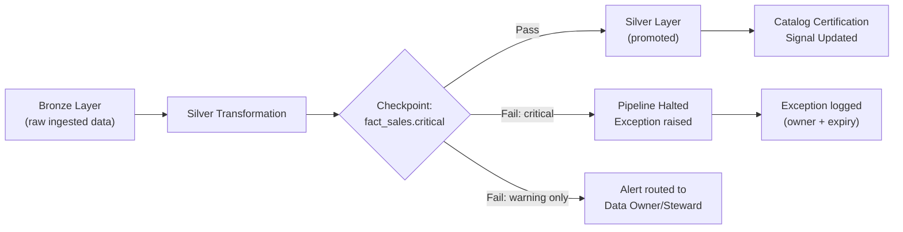
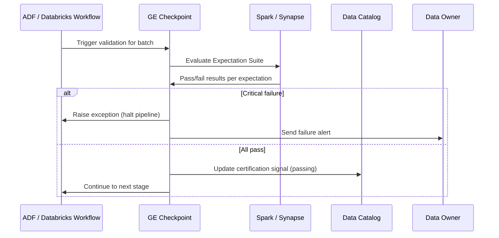
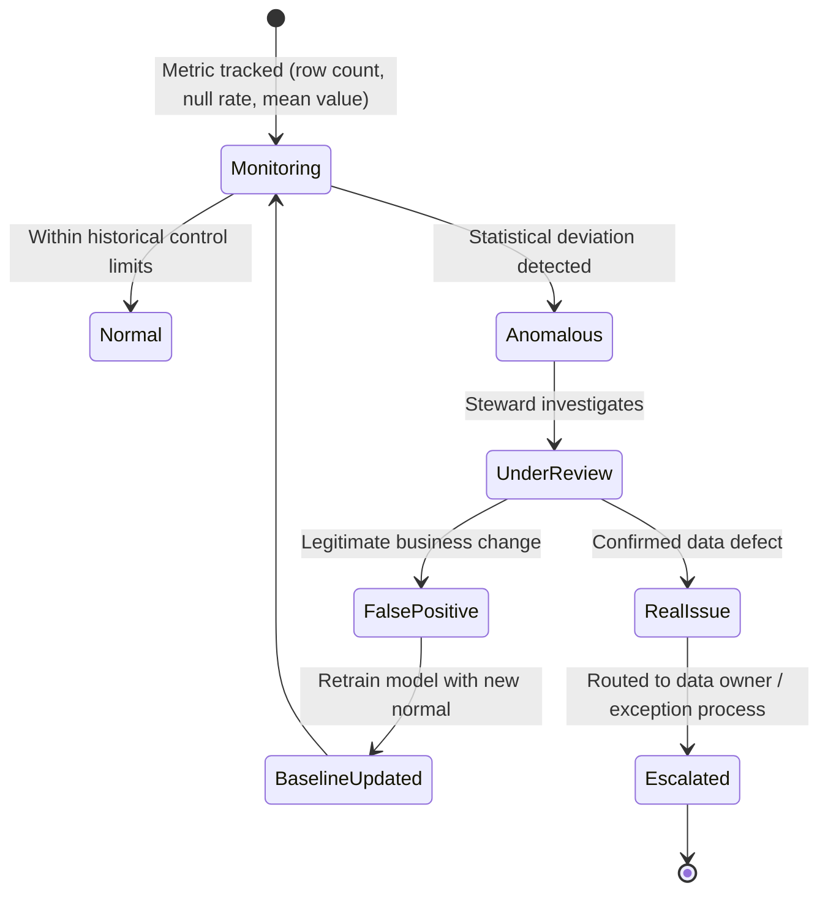

# Data Quality with Great Expectations

> Part of the **Enterprise Data & AI Architecture Handbook** · Phase-08 — Data Governance & Quality · Chapter 03.
> Estimated study time: **60 min reading + ~4h labs**.
> **Prerequisites:** read [Batch Pipeline Design](../Phase-05/09_Batch_Pipeline_Design.md) first.

---

## Executive Summary

[Batch Pipeline Design](../Phase-05/09_Batch_Pipeline_Design.md#executive-summary) established that a pipeline merely *succeeding* on the happy path is not the same as producing *correct* data — idempotent writes and deterministic watermarks make a pipeline reliable, but reliability says nothing about whether the values it produced are actually valid, complete, or consistent with business expectations. **Data quality testing** is the discipline that closes this gap: it treats data itself as a testable artifact, with explicit, versioned, machine-checkable expectations analogous to unit tests for code, run as a first-class stage in every pipeline rather than as an afterthought discovered when a dashboard looks wrong.

This chapter covers the concrete mechanics of automated data quality: the six classic **dimensions of data quality** (completeness, accuracy, consistency, timeliness, validity, uniqueness); **Great Expectations**' core abstractions — *Expectations* (a single, declarative assertion about data), *Suites* (a named collection of Expectations for a dataset), and *Checkpoints* (the executable unit that validates a suite against a batch of data and triggers actions); **Soda** as a lighter-weight, SQL-first alternative; **quality gates in CI/CD** that block bad data from being promoted between medallion layers or released to production, mirroring the same guardrail philosophy from [Architecture Governance](../Phase-01/02_Architecture_Governance.md#core-concepts) applied to data instead of infrastructure; and **anomaly detection** for the quality dimensions (like distributional drift) that a fixed rule cannot catch.

The governing insight: **a data quality check that only runs after data has already reached consumers is an incident report, not a quality gate.** The entire value of this chapter's practices — Expectations, Checkpoints, CI/CD-integrated quality gates — comes from running validation *before* data crosses a trust boundary (before promotion from Bronze to Silver, before a Silver table is marked certified in the catalog from [Data Catalog and Lineage](02_Data_Catalog_and_Lineage.md), before a nightly load completes and unblocks downstream jobs), not from a periodic quality report run against data consumers already saw. The [Data Governance Foundations](01_Data_Governance_Foundations.md#core-concepts) ownership model determines *who* is accountable when a check fails; this chapter provides the *mechanism* that makes a failure detectable and blockable in the first place.

The bias remains **Azure-primary (~60%)** — Azure Databricks and Synapse Spark as the compute layer running Great Expectations/Soda checks, Azure Data Factory and Azure DevOps/GitHub Actions pipelines enforcing quality gates between pipeline stages, and Azure Monitor/Log Analytics for quality-metric alerting — **~30% enterprise open source** (Great Expectations and Soda Core as the two leading open-source data quality frameworks, dbt tests as a lightweight complementary layer, Prometheus/Grafana for quality-metric dashboards) and **~10% AWS/GCP comparison-only** (AWS Glue Data Quality, GCP Dataplex Data Quality).

**Bottom line:** a data quality program succeeds when failing an Expectation actually blocks a pipeline stage or a data promotion, and fails when quality checks run only for reporting and nobody's pipeline stops when they fail. An architect who designs quality gates as *hard, blocking* checkpoints for high-severity expectations and *soft, alerting-only* checks for exploratory ones — and who resists the temptation to write hundreds of low-value expectations that erode trust in the gate through alert fatigue — builds a quality program engineers actually respect instead of routing around.

---

## Learning Objectives

By the end of this chapter you will be able to:

1. **Apply the six dimensions of data quality** (completeness, accuracy, consistency, timeliness, validity, uniqueness) to design a right-sized expectation suite for a real dataset.
2. **Build Great Expectations Suites and Checkpoints** and explain the distinction between an Expectation (assertion), a Suite (collection), and a Checkpoint (executable validation run with actions).
3. **Compare Great Expectations and Soda** on authoring model, compute integration, and operational overhead, and choose correctly for a given team's skill profile.
4. **Design CI/CD-integrated quality gates** that block medallion-layer promotion or deployment on Expectation failure, distinguishing hard-blocking from soft-alerting severity tiers.
5. **Implement statistical anomaly detection** for quality dimensions that fixed-threshold rules cannot catch (volume drift, distributional shift), and explain why it complements rather than replaces fixed expectations.
6. **Integrate quality results into the catalog and lineage graph** from [Data Catalog and Lineage](02_Data_Catalog_and_Lineage.md) so certification status reflects live quality state, not a stale one-time review.
7. **Identify data quality anti-patterns** — quality theatre (checks that never block anything), alert fatigue from over-specified suites, and quality debt accumulation — before they erode trust in the program.
8. **Map a target data quality architecture onto Azure Databricks/Synapse**, with an explicit, defensible comparison to AWS Glue Data Quality and GCP Dataplex Data Quality.

---

## Business Motivation

- **Bad data reaching production is measurably more expensive than bad data caught in a gate.** The well-established "1-10-100 rule" (roughly: $1 to prevent an error at entry, $10 to correct it in a pipeline, $100 to deal with its downstream consequences) applies directly to data — a null-key violation caught at Bronze-to-Silver promotion costs a pipeline re-run; the same violation discovered three dashboards downstream costs an executive-facing incident and a trust-repair conversation.
- **AI and ML model quality is bounded by training-data quality**, and silent data quality regressions (a source system schema change subtly corrupting a feature) are a leading cause of model performance degradation that goes undetected until business KPIs move — an outcome far more expensive to diagnose after the fact than a blocked pipeline run.
- **Regulatory reporting requires demonstrable data quality controls**, not just an assertion of correctness — financial (BCBS 239), healthcare, and increasingly AI-specific regulation expect evidence of systematic validation, which is exactly what a versioned Expectation Suite with a Checkpoint execution history provides.
- **Self-service analytics adoption depends on trust**, and trust depends on *known* quality state — the certification badge from [Data Catalog and Lineage](02_Data_Catalog_and_Lineage.md#core-concepts) is only meaningful if it is backed by continuously-passing, not one-time-reviewed, quality checks.
- **Manual data quality triage does not scale** with the number of pipelines an enterprise data platform runs — automated, versioned, CI/CD-integrated checks are the only way quality assurance keeps pace with pipeline count growth rather than becoming a permanently understaffed manual QA function.

---

## History and Evolution

- **1990s-2000s — Data quality as an ETL-tool feature.** Early enterprise ETL suites (Informatica, DataStage) bundled basic quality/cleansing transformations (deduplication, standardization) as pipeline steps, but validation logic was embedded in proprietary tool configuration rather than portable, testable code.
- **2000s — Statistical process control concepts borrowed from manufacturing** (Six Sigma-influenced data quality programs) introduced the idea of monitoring data metrics over time against control limits, an early precursor to today's anomaly-detection-based quality monitoring.
- **2017 — Great Expectations launches**, the first widely-adopted framework to treat data validation as declarative, versionable, human-readable assertions analogous to software unit tests — directly borrowing testing-discipline concepts from software engineering (assertions, test suites, CI integration) and applying them to data for the first time at scale.
- **2020 — Soda (Soda SQL, later Soda Core) launches** as a lighter-weight, SQL-first alternative, appealing to teams wanting quality checks expressible in familiar SQL rather than Great Expectations' Python-based expectation configuration.
- **2020-2021 — dbt tests popularize lightweight, inline quality assertions** co-located with transformation logic (`not_null`, `unique`, `relationships` tests defined in the same YAML as the model), making basic quality checking a near-zero-friction default for dbt-based transformation pipelines rather than a separate tool to adopt.
- **2022 — Great Expectations' Checkpoint abstraction matures**, formalizing the separation between defining what to check (Expectation Suites) and how/when to run it with what actions (Checkpoints), directly enabling CI/CD-integrated quality gates as a first-class pattern rather than an ad hoc scripting exercise.
- **2023-present — Cloud-native quality services emerge** (AWS Glue Data Quality, GCP Dataplex Data Quality, and Databricks' native Lakehouse Monitoring), reflecting the same trend already seen in cataloging (Purview) and governance: platform vendors absorbing what were previously exclusively open-source-framework responsibilities into managed services, while Great Expectations and Soda remain the dominant portable, cloud-agnostic options.
- **2023-present — AI-era data quality expands scope to training-data and RAG-corpus validation** (detecting duplicate or stale documents feeding a retrieval-augmented copilot), extending the discipline beyond structured tabular data into the semi-structured and unstructured data now feeding production AI systems.

---

## Why This Technology Exists

A pipeline can execute flawlessly — correct code, no errors, on schedule — and still produce wrong data, because reliability (did the code run correctly) and correctness (is the output actually valid) are orthogonal properties. Without an explicit, automated, versioned way to assert what "correct" means for a given dataset, correctness silently depends entirely on the absence of a code bug in every upstream system feeding the pipeline — an assumption that inevitably breaks the first time an upstream source system changes its schema, a data-entry process degrades, or an edge case (a null foreign key, a negative quantity) that "should never happen" happens anyway. Automated data quality frameworks exist to convert "correct" from an implicit assumption into an explicit, continuously-checked, blockable contract.

---

## Problems It Solves

- **Silent schema and semantic drift** — an upstream system quietly changing a field's meaning (e.g., a currency field switching from cents to dollars) is caught by a range-based Expectation before it corrupts downstream aggregates, rather than discovered when a finance report looks implausible.
- **Referential and structural integrity violations** — orphaned foreign keys, duplicate primary keys, and broken join cardinalities are caught mechanically rather than relying on a human noticing a row-count anomaly.
- **Late or missing data** — timeliness/freshness expectations catch a delayed upstream load before downstream consumers silently work with stale data, rather than after a stakeholder notices a dashboard hasn't updated.
- **Gradual distributional drift** — anomaly-detection-based checks catch a slow degradation (an increasing null rate, a shifting value distribution) that a single fixed-threshold rule set at pipeline launch would not flag until it crosses an extreme, already-damaging threshold.
- **Unaccountable, undocumented quality expectations** — a versioned Expectation Suite makes "what does correct mean for this dataset" an explicit, reviewable artifact instead of tribal knowledge held by whoever originally built the pipeline.

---

## Problems It Cannot Solve

- **It cannot fix data at the source.** A quality gate can block a bad batch from being promoted; it cannot correct the upstream system or process that produced bad data in the first place — that requires the ownership and remediation escalation from [Data Governance Foundations](01_Data_Governance_Foundations.md#internal-working).
- **It cannot substitute for good data modeling.** A well-validated dataset built on a poor grain or key design (see Phase-06) is still poorly modeled; quality checks confirm the data matches its (possibly flawed) contract, they don't improve the contract itself.
- **It cannot catch quality issues nobody thought to write an expectation for.** Fixed expectations only catch what they were explicitly written to catch — genuinely novel failure modes require either anomaly detection (which catches statistical surprise, not semantic correctness) or, ultimately, a human noticing something is wrong.
- **It cannot eliminate false positives entirely.** An overly strict or poorly-tuned expectation (e.g., a range check that doesn't account for a legitimate seasonal spike) will block valid data, and a poorly-tuned anomaly detector will alert on normal variance — both require ongoing tuning, not a "set once" configuration.
- **It cannot replace real-time observability for pipeline execution failures.** A quality gate tells you the data that arrived is wrong; it does not tell you a job silently stopped producing any data at all — that is the domain of the pipeline monitoring practices in [Batch Pipeline Design](../Phase-05/09_Batch_Pipeline_Design.md).

---

## Core Concepts

### 8.1 The Six Dimensions of Data Quality

- **Completeness** — are required fields populated (no unexpected nulls), and are all expected records present (no missing partitions or dropped rows)?
- **Accuracy** — do values correctly reflect the real-world fact they represent (a customer's address matches their actual address), typically the hardest dimension to check automatically without an external reference source.
- **Consistency** — do related fields and datasets agree with each other (an order's line-item total sums to its header total; the same customer ID resolves to the same customer across systems)?
- **Timeliness** — did data arrive within its expected freshness window (yesterday's sales data actually present before the 6am reporting SLA)?
- **Validity** — does data conform to its defined format, type, and domain constraints (a country code is one of ISO 3166's valid values, an email field matches a valid email pattern)?
- **Uniqueness** — are records that should be unique actually unique (no duplicate primary keys, no duplicate customer records not already reconciled by the MDM processes in [Master Data Management](05_Master_Data_Management.md))?

Each dimension maps to a different class of Expectation and, importantly, a different detection strategy — completeness and validity are usually checkable with fixed rules; accuracy often requires either an external reference or statistical plausibility checks; timeliness requires operational metadata (last-load timestamps) rather than the data's content itself.

### 8.2 Expectations, Suites, and Checkpoints (Great Expectations)

- **Expectation** — a single, declarative, human-readable assertion about data, e.g. `expect_column_values_to_not_be_null("customer_id")` or `expect_column_values_to_be_between("order_total", min_value=0)`. Expectations are the atomic unit and are individually versionable and reviewable, much like a single unit-test assertion.
- **Expectation Suite** — a named, ordered collection of Expectations scoped to one dataset (e.g., `fact_sales.warning` and `fact_sales.critical` might be two separate suites at different severity tiers for the same table). Suites are stored as version-controlled JSON/YAML, enabling pull-request review of quality-rule changes exactly as code changes are reviewed.
- **Checkpoint** — the executable unit that binds a Suite to a specific batch of data, runs the validation, and triggers **Actions** (store the validation result, send an alert, update a Data Docs report, or — critically for this chapter's quality-gate pattern — raise an exception that halts the calling pipeline). The Checkpoint is what actually gets scheduled/orchestrated as a pipeline stage; the Suite is the reusable definition it executes.

### 8.3 Severity Tiers: Hard Gates vs. Soft Alerts

Not every failed Expectation should have the same consequence. A right-sized program assigns each Expectation (or Suite) a severity: **critical** expectations (primary key uniqueness, referential integrity on a foreign key feeding financial reporting) should **hard-block** pipeline promotion — the checkpoint's failure halts the pipeline and prevents Bronze-to-Silver or Silver-to-Gold promotion; **warning**-tier expectations (a slightly elevated null rate on an optional field) should **soft-alert** — logged, surfaced on a dashboard, routed to the data owner, but not blocking. This mirrors precisely the guardrail-severity tiering already established for architecture governance in [Architecture Governance](../Phase-01/02_Architecture_Governance.md#core-concepts): the mechanism (a rule that can be evaluated automatically) is only valuable if paired with a deliberate decision about how much authority to give it.

### 8.4 Great Expectations vs. Soda

- **Great Expectations** — Python-native, with a rich library of 50+ built-in expectation types, a data-docs auto-generated HTML report, and deep integration with Spark, Pandas, and SQL-backed execution engines. Higher expressive power and ecosystem maturity, at the cost of a steeper authoring learning curve (expectations are Python objects/configuration, not raw SQL).
- **Soda (Soda Core / Soda Checks language)** — SQL-first, using a YAML-based "Checks Language" that reads close to plain English (`row_count > 0`, `missing_count(customer_id) = 0`) directly against a SQL-queryable warehouse. Lower barrier to entry for SQL-fluent analytics engineers, at the cost of less expressive power for complex, code-driven validation logic (e.g., cross-dataset statistical comparisons) compared to Great Expectations' Python API.
- **dbt tests** — the lightest-weight option, co-located with transformation models as YAML (`not_null`, `unique`, `accepted_values`, `relationships`), ideal as a first line of defense for basic structural checks directly in a dbt-based transformation layer, but not intended to replace a dedicated framework for complex, cross-dataset, or statistical checks.

The practical guidance: use dbt tests for basic, transformation-co-located structural checks; use Great Expectations for complex, high-value datasets requiring rich expressive power and auto-generated documentation; use Soda where the team's primary skill is SQL and a lighter operational footprint is preferred over Great Expectations' Python-centric authoring model.

### 8.5 Anomaly Detection for Data Quality

Fixed-threshold Expectations (e.g., "null rate must be under 1%") cannot catch a slow, gradual drift that never crosses the fixed threshold, or a distributional shift where all values remain individually valid but the aggregate pattern has changed (e.g., average order value quietly doubling due to an upstream currency bug that produces plausible-looking numbers). **Anomaly detection** — typically a statistical model (moving average with control limits, seasonal decomposition, or a lightweight ML model) trained on a metric's historical time series (row count, null rate, mean/median of a key column) — flags when a new observation is a statistical outlier relative to its own history, catching exactly this class of drift that a fixed rule misses. Anomaly detection complements, but does not replace, fixed Expectations: fixed rules catch known, well-understood failure modes precisely and immediately; anomaly detection catches unknown or gradual ones probabilistically and with some detection lag.

---

## Internal Working

A production quality-gated pipeline stage executes this sequence on every run:

1. **Batch identification** — the Checkpoint is configured (or parameterized at runtime) with the specific batch of data to validate — a partition, a date range, or an entire table snapshot.
2. **Expectation evaluation** — each Expectation in the bound Suite is evaluated against the batch, producing a pass/fail result plus supporting statistics (e.g., "expected null rate under 1%, observed 3.2%, 47 of 1,470 rows failing").
3. **Result aggregation** — individual Expectation results are aggregated into an overall Checkpoint result, respecting severity tiers (a single critical-tier failure fails the Checkpoint regardless of how many warning-tier expectations passed).
4. **Action execution** — configured Actions run: storing the validation result (for audit history and the Data Docs report), updating the catalog's quality signal (feeding the certification status in [Data Catalog and Lineage](02_Data_Catalog_and_Lineage.md#core-concepts)), and — for a failed critical-tier Checkpoint — raising an exception that the calling orchestrator (ADF, Airflow, Databricks Workflows) interprets as a pipeline failure, halting downstream promotion.
5. **Notification and triage** — failure notifications route to the dataset's data owner/steward (per the RACI in [Data Governance Foundations](01_Data_Governance_Foundations.md#internal-working)), not to a generic on-call queue disconnected from who actually understands the data's business context.
6. **Anomaly model update** — for metrics tracked via anomaly detection, the current run's observed value is fed back into the historical time series used to compute future control limits, so the model adapts to legitimate, sustained changes in the data's normal pattern (e.g., a genuine, permanent volume increase from business growth) rather than flagging it indefinitely as anomalous.

---

## Architecture

A production data quality architecture sits as an explicit stage between pipeline transformation steps, not as a disconnected, out-of-band audit job: **compute** (the Spark/warehouse engine running the actual Expectation evaluation, typically the same Databricks/Synapse cluster already running the transformation) evaluates Suites defined in a **Suite/Checkpoint definition repository** (version-controlled alongside pipeline code) against data at defined promotion boundaries (Bronze→Silver, Silver→Gold, or pre-serving); results flow to a **result store** (for audit history and trend analysis) and to the **catalog's quality signal** so certification status is always live rather than a stale, one-time review. The architectural property that most determines whether a quality program is respected or routed around: whether failing a critical-tier check actually halts the orchestrator (a real gate) or merely logs a result somewhere a human might eventually read (an audit report mistaken for a gate).

---

## Components

- **Expectation Suite repository** — version-controlled Suite definitions (JSON/YAML for Great Expectations, YAML Checks for Soda), reviewed via pull request like any other pipeline code.
- **Checkpoint/Check execution engine** — the runtime (Great Expectations Checkpoint runner, Soda Core CLI/library) executing Suites against a compute engine.
- **Compute layer** — Databricks/Synapse Spark clusters or serverless SQL pools providing the query execution backing Expectation evaluation.
- **Result store** — the historical record of validation runs, supporting both audit/compliance evidence and anomaly-detection time-series input.
- **Catalog quality-signal integration** — the connector feeding pass/fail and freshness state into the catalog's certification badge from [Data Catalog and Lineage](02_Data_Catalog_and_Lineage.md).
- **Alerting/notification layer** — routes failures to the correct data owner/steward, typically via Azure Monitor action groups or equivalent.
- **Anomaly detection service** — the statistical/ML component tracking metric time series and flagging deviations, separate from but complementary to fixed Expectation evaluation.

---

## Metadata

Data quality metadata spans all three categories established in [Data Catalog and Lineage](02_Data_Catalog_and_Lineage.md#metadata): the **Expectation Suite definition itself** is business/technical metadata describing what "correct" means for a dataset; **Checkpoint run results** (pass/fail, statistics, timestamp) are operational metadata that must flow back into the catalog to keep the certification signal live; and **anomaly-model state** (historical baselines, control limits) is a specialized operational metadata artifact that must itself be versioned and auditable, since a mis-tuned anomaly baseline silently changes what counts as "surprising" without an explicit, reviewable change.

---

## Storage

Expectation Suite and Checkpoint definitions are stored as version-controlled files in the same Git repository as pipeline code (Great Expectations' native JSON Suite format and Checkpoint YAML configuration are designed explicitly for this). Validation run results and Data Docs are typically persisted to cloud object storage (an ADLS Gen2 container dedicated to quality artifacts) rather than a database, since Great Expectations' native "Validation Result Store" and "Data Docs Store" backends are file-store-oriented by default; anomaly-detection time-series baselines are better suited to a lightweight time-series-capable store (a Delta table, or Azure Monitor Metrics) supporting efficient historical trend queries.

---

## Compute

Expectation evaluation runs on the same compute engine already processing the pipeline stage it validates — a Great Expectations Checkpoint configured against a Spark DataFrame executes as Spark jobs on the existing Databricks/Synapse cluster, adding incremental compute proportional to the complexity and row-count scanned by each Expectation (a full-table uniqueness check on a large fact table is meaningfully more expensive than a null-check on a small dimension table). Anomaly detection's compute footprint is comparatively minor — evaluating a lightweight statistical model against a small historical time series — but training/retraining more sophisticated ML-based anomaly detectors at scale can become a non-trivial batch job in its own right for a large number of tracked metrics.

---

## Networking

Quality-checking compute inherits the same network-isolation requirements as the pipeline stage it validates — a Databricks/Synapse cluster evaluating Expectations against ADLS Gen2 data should do so via **private endpoints** and managed identity, with no different network posture than the transformation job itself. Where quality results and Data Docs reports are published to a shared web-accessible location for stakeholder review, that endpoint should sit behind the organization's standard authentication (Entra ID) rather than being exposed anonymously, since a Data Docs report can itself reveal sensitive schema and sample-value detail.

---

## Security

Expectation Suites that include sample failing rows in their output (a common Great Expectations Data Docs feature, useful for debugging) must respect the same classification-driven access controls from [Data Governance Foundations](01_Data_Governance_Foundations.md#security) — a validation report showing 47 sample rows of a Restricted-tier dataset's failing records is itself a Restricted-tier artifact and must not be broadly readable simply because it was generated by a quality tool rather than a BI report. Service principals or managed identities executing Checkpoints should be scoped read-only against source data and write-only against the result store, following the same least-privilege principle applied throughout this handbook.

---

## Performance

Running an exhaustive Expectation Suite (every column, every possible check) against every batch on every pipeline run is rarely justified — full-table uniqueness and referential-integrity checks on large fact tables can add meaningful runtime to a pipeline, and should be scoped to run at a frequency and granularity proportional to the check's cost and the risk it mitigates (e.g., run expensive full-table checks on a sampled or incremental basis for very large tables, reserving full-table validation for lower-frequency, higher-stakes runs). Great Expectations supports sampling-based validation specifically to manage this cost/coverage trade-off for very large datasets.

---

## Scalability

A quality program's scalability bottleneck is rarely the validation engine itself (both Great Expectations and Soda scale with the underlying Spark/warehouse compute they delegate to) — it is almost always the **authoring and maintenance burden** of Suite definitions as the number of governed datasets grows. Reusable Expectation templates (parameterized suites applied consistently across similarly-shaped tables, such as every dimension table getting a standard primary-key-uniqueness and not-null-on-required-fields template) scale far better than hand-authoring a bespoke suite per table, mirroring the golden-path/template pattern from [Architecture Governance](../Phase-01/02_Architecture_Governance.md#design-patterns) applied to quality-rule authoring instead of infrastructure scaffolding.

---

## Fault Tolerance

A quality gate that itself fails to run (a Checkpoint execution error unrelated to the data's actual quality — a transient connectivity issue, a misconfigured credential) must **fail closed, not open**: an orchestrator should treat an inability to evaluate a critical-tier gate as equivalent to a failed gate (block promotion) rather than silently skipping validation and allowing data through unchecked — the latter is a common, dangerous misconfiguration that silently defeats the entire point of a hard-blocking gate. Result stores and Suite definition repositories should be backed up with the same discipline as any other production configuration and data asset.

---

## Cost Optimization

The dominant quality-checking cost is the incremental compute consumed by Expectation evaluation on top of existing pipeline compute, plus (for very large-scale programs) result-store storage and any dedicated anomaly-detection infrastructure. **Worked FinOps example:** running a full Expectation Suite (20 checks averaging 15 seconds of Databricks cluster time each, on a cluster costing roughly $0.35/DBU-hour with an effective blended rate of ~$4/cluster-hour) against 150 tables nightly costs roughly 150 × 20 × 15s ≈ 12.5 cluster-hours/night, or ≈ $50/night (~$1,500/month). Restricting full, exhaustive suites to the 30 highest-value, most-consumed tables (the ones prioritized in the governance program per [Data Governance Foundations](01_Data_Governance_Foundations.md#enterprise-recommendations)) while running only lightweight, sampled checks on the remaining 120 lower-priority tables (at roughly 20% of full-suite cost) reduces the estimate to (30 × 20 × 15s) + (120 × 20 × 15s × 0.2) ≈ 2.5 + 2.0 = 4.5 cluster-hours/night (~$540/month) — a roughly 64% reduction, illustrating that tiering check depth by dataset priority, not simply reducing check frequency uniformly, is the recommended first FinOps lever.

---

## Monitoring

Track: **Checkpoint pass/fail rate per dataset over time** (a rising failure rate on a previously stable dataset is itself a leading indicator worth investigating even before it triggers a hard gate); **mean time to triage a failed check** (are failures routed to and acted on by the correct owner promptly, or do they pile up unaddressed); **percentage of certified catalog assets with a currently-passing Checkpoint** (keeping the [Data Catalog and Lineage](02_Data_Catalog_and_Lineage.md#core-concepts) certification signal honest); and **anomaly-detection alert volume and false-positive rate**, since an under-tuned anomaly detector that fires constantly on normal variance trains stewards to ignore it, defeating its purpose.

---

## Observability

Observability for a quality program means being able to answer, without a manual investigation: *which datasets currently have a failing critical-tier check, since when, and is anyone actively working it?* Great Expectations' Data Docs (an auto-generated, human-readable HTML validation report per run) and its integration with the catalog's certification signal are the concrete mechanism; wiring Checkpoint pass/fail events into Azure Monitor/Log Analytics (or Prometheus for a self-hosted stack) alongside the pipeline's own execution telemetry gives a single, unified observability surface rather than a separate quality-specific dashboard nobody checks.

---

## Governance

Data quality governance is directly inherited from [Data Governance Foundations](01_Data_Governance_Foundations.md#governance): the data owner for a dataset is accountable for its Expectation Suite's completeness and accuracy, the business steward proposes and maintains the actual expectations (in collaboration with a technical steward who implements them), and severity-tier assignment (which failures hard-block versus soft-alert) should itself go through the same review discipline as any other control — a team unilaterally downgrading a critical-tier check to warning-tier to unblock a release is the data-quality equivalent of bypassing an architecture guardrail, and should require the same documented exception process from [Data Governance Foundations](01_Data_Governance_Foundations.md#governance) rather than a silent, undocumented change.

**ADR Example — Hard-Gating Bronze-to-Silver Promotion on Critical Expectations:**

> **Context:** A retail data platform's Silver-layer `fact_sales` table had suffered three separate incidents in one quarter where upstream schema changes (a currency-unit change, a new nullable discount field, a duplicated order-ID batch from a retry bug) silently corrupted downstream Gold-layer aggregates before anyone noticed, each requiring a multi-day backfill and stakeholder trust-repair conversation.
> **Decision:** Implement a Great Expectations Checkpoint at the Bronze-to-Silver promotion boundary with a critical-tier suite (primary-key uniqueness, non-null required fields, referential integrity against the customer dimension, and a range check on transaction amount) configured to **hard-fail the Databricks Workflow** on any critical-tier violation, blocking Silver promotion entirely until the data owner resolves or explicitly (and visibly) waives the specific failure via the documented exception process.
> **Consequences:** All three prior incident classes would have been caught before reaching Silver, at the cost of occasional false-positive blocks during legitimate upstream changes (e.g., a genuine new valid discount range) requiring a fast-turnaround Suite update process to avoid the gate itself becoming a delivery bottleneck; the team additionally committed to a same-day SLA for reviewing and updating Suite definitions in response to legitimate false positives, recognizing that a slow Suite-update process would create pressure to bypass the gate entirely.
> **Alternatives considered:** (1) Soft-alert only, notifying the data owner without blocking — rejected because all three prior incidents had gone unnoticed for days despite existing (unenforced) monitoring dashboards; (2) Manual review of every Bronze-to-Silver promotion — rejected as unsustainable at the pipeline's daily run frequency; (3) Wait for the upstream source teams to improve their own change-management process — rejected as outside the data platform team's control and no committed timeline existed.

---

## Trade-offs

- **Exhaustive vs. right-sized Expectation Suites**: exhaustive suites catch more but cost more compute and authoring time, and risk alert fatigue from low-value checks; right-sized suites (critical fields and relationships only) are cheaper to build and maintain but may miss lower-priority issues.
- **Hard-blocking vs. soft-alerting gates**: hard gates prevent bad data from propagating but risk becoming a delivery bottleneck if false-positive rates aren't managed; soft alerts never block delivery but, as the ADR example shows, can go unnoticed until real damage occurs.
- **Fixed Expectations vs. anomaly detection**: fixed rules are precise and immediately understandable but only catch known failure modes; anomaly detection catches unknown drift but with detection lag and a non-zero false-positive rate requiring ongoing tuning.

---

## Decision Matrix

| Criterion | Great Expectations | Soda Core | dbt tests |
|---|---|---|---|
| Authoring model | Python/JSON configuration | SQL-first YAML Checks Language | YAML, co-located with dbt models |
| Expressive power | High (50+ built-in expectation types, custom Python) | Moderate (SQL-expressible checks) | Basic (structural checks only) |
| Auto-generated documentation | Yes (Data Docs HTML) | Limited | No (relies on dbt docs generally) |
| Best fit | Complex, high-value datasets needing rich validation and audit documentation | SQL-fluent teams wanting lightweight, warehouse-native checks | Basic structural checks co-located with transformation logic |
| Operational overhead | Moderate (Python environment, Suite/Checkpoint config) | Low | Very low (already part of dbt run) |
| CI/CD gate integration | Strong (native Checkpoint Actions) | Strong (CLI exit codes) | Strong (dbt test exit codes) |

---

## Design Patterns

- **Severity-tiered Checkpoints** — separate critical (hard-blocking) and warning (soft-alerting) suites per dataset, rather than a single undifferentiated pass/fail.
- **Reusable Expectation templates** — parameterized suites applied consistently to similarly-shaped tables (every dimension table gets a standard key-uniqueness template), avoiding the authoring-burden scalability bottleneck.
- **Promotion-boundary gating** — placing Checkpoints precisely at medallion-layer promotion boundaries (Bronze→Silver, Silver→Gold), not scattered arbitrarily, so a failure has an unambiguous, well-understood consequence (this promotion does not happen).
- **Catalog-integrated certification** — feeding live Checkpoint pass/fail state into the catalog's certification signal from [Data Catalog and Lineage](02_Data_Catalog_and_Lineage.md#core-concepts), rather than maintaining quality status as a separate, disconnected system of record.
- **Fixed-rule-plus-anomaly-detection layering** — pairing precise fixed Expectations for known failure modes with anomaly detection for the residual, unknown-unknown class of drift, rather than choosing one exclusively.

---

## Anti-patterns

- **Quality theatre** — Checkpoints that run and log results but whose failures never actually block anything, giving a false sense of governed quality while providing no real protection (directly analogous to the "governance theatre" anti-pattern in [Data Governance Foundations](01_Data_Governance_Foundations.md#anti-patterns)).
- **Alert fatigue from over-specified suites** — writing hundreds of low-value expectations (checking every column's format regardless of actual business risk) trains stewards to ignore quality alerts entirely, burying the few that matter.
- **Fail-open on gate execution errors** — silently allowing data through when the Checkpoint itself errors out (rather than the data failing validation), defeating the entire purpose of a hard gate.
- **Quality debt accumulation** — repeatedly waiving or downgrading failing critical-tier checks without a tracked, expiring exception (mirroring the exception-register discipline required in [Data Governance Foundations](01_Data_Governance_Foundations.md#governance)) until the gate no longer reflects reality.
- **Anomaly detection without retraining** — deploying a statistical anomaly detector once and never updating its baseline as legitimate business patterns shift, producing permanently noisy, distrusted alerts.

---

## Common Mistakes

- Treating data quality as a one-time project (a big-bang suite-writing exercise) rather than an ongoing practice requiring the same continuous maintenance as pipeline code itself.
- Writing Expectation Suites without involving the business steward who actually understands what "correct" means for a dataset, producing technically-valid but business-irrelevant checks.
- Placing quality checks only at the very end of a pipeline (post-Gold) rather than at each promotion boundary, meaning a Bronze-layer defect isn't caught until it has already propagated through every downstream transformation.
- Ignoring the compute cost of exhaustive full-table checks on large fact tables until a cost review surfaces an unexpectedly large Databricks/Synapse bill attributable to quality-check overhead.
- Conflating anomaly-detection alerts with fixed-Expectation failures in a single, undifferentiated notification stream, making it hard for a steward to distinguish a definite rule violation from a probabilistic, lower-confidence anomaly signal.

---

## Best Practices

- Start critical-tier hard gates on the highest-value, highest-risk medallion promotion boundaries first (typically Bronze-to-Silver for the datasets already prioritized in the governance program), rather than attempting exhaustive coverage on day one.
- Co-locate basic structural checks (not-null, uniqueness, referential integrity) as dbt tests directly in transformation code, reserving Great Expectations/Soda for higher-value, more complex, or cross-dataset validation.
- Commit to a fast-turnaround Suite-update SLA (as in this chapter's ADR) so legitimate false positives don't create pressure to bypass the gate entirely — a slow update process is one of the most common root causes of a quality gate being disabled outright under delivery pressure.
- Feed live Checkpoint results into the catalog's certification signal so "certified" always reflects current, not historical, quality state.
- Layer anomaly detection on top of fixed Expectations for the small set of highest-value metrics (row count, key aggregate values) rather than attempting to apply it universally across every column.

---

## Enterprise Recommendations

- Sequence the rollout: instrument the highest-value pipelines (feeding regulatory reporting or executive dashboards) with hard-blocking critical suites first, then expand suite coverage and promotion-boundary gating outward as authoring templates and organizational trust in the gate mature.
- Budget explicit, ongoing time for Suite maintenance as a pipeline-ownership responsibility, not a one-time setup task — a Suite that isn't updated as the underlying data model evolves becomes either a source of false-positive noise or, worse, a silently stale check that no longer reflects real risk.
- Integrate quality-gate failure routing with the same escalation and exception process established in [Data Governance Foundations](01_Data_Governance_Foundations.md#governance), rather than building a parallel, quality-specific incident process.

---

## Azure Implementation

- **Azure Databricks** (or Synapse Spark pools) is the primary compute engine running Great Expectations or Soda Core Checkpoints against Delta tables at medallion promotion boundaries, typically as a dedicated task within a **Databricks Workflow** immediately following a transformation task and immediately preceding the next stage's task.
- **Azure Data Factory / Synapse Pipelines** orchestrate the overall pipeline and respect the quality-gate task's success/failure status to control downstream activity execution — a failed Checkpoint task fails the ADF pipeline run, which blocks any downstream activities depending on it via standard ADF dependency conditions.
- **GitHub Actions / Azure DevOps Pipelines** run Expectation Suite validation (linting, dry-run against a sample/test fixture) as part of the pull-request process for any change to a Suite definition, applying the same code-review discipline to quality-rule changes as to pipeline code changes.
- **Azure Monitor / Log Analytics** ingests Checkpoint run results and anomaly-detection alerts, providing the unified observability surface described in [Observability](#observability) alongside the pipeline's own execution telemetry.
- Example Great Expectations Checkpoint configuration gating Bronze-to-Silver promotion:

```yaml
name: fact_sales_bronze_to_silver_checkpoint
config_version: 1.0
class_name: Checkpoint
validations:
  - batch_request:
      datasource_name: databricks_delta
      data_asset_name: bronze.fact_sales
    expectation_suite_name: fact_sales.critical
action_list:
  - name: store_validation_result
    action:
      class_name: StoreValidationResultAction
  - name: update_data_docs
    action:
      class_name: UpdateDataDocsAction
  - name: fail_pipeline_on_critical_failure
    action:
      class_name: SlackNotificationAction
      slack_webhook: "${SLACK_QUALITY_ALERTS_WEBHOOK}"
```

- Sample Expectation Suite excerpt enforcing critical-tier structural integrity:

```python
suite = context.add_expectation_suite("fact_sales.critical")
validator.expect_column_values_to_not_be_null("order_id")
validator.expect_column_values_to_be_unique("order_id")
validator.expect_column_values_to_not_be_null("customer_id")
validator.expect_column_values_to_be_between("order_total", min_value=0, max_value=1_000_000)
validator.expect_column_pair_values_A_to_be_greater_than_B("gross_total", "discount_amount", or_equal=True)
```

---

## Open Source Implementation

- **Great Expectations** remains the leading open-source, cloud-agnostic framework for rich, versionable, auditable data validation, with native Spark, Pandas, and SQL execution engine support making it portable across Databricks, Synapse, or a self-hosted stack.
- **Soda Core** provides a lighter-weight, SQL-first alternative with strong CI/CD exit-code integration, well suited to teams whose primary authoring skill is SQL rather than Python.
- **dbt tests** provide the lowest-friction entry point for basic structural checks directly co-located with dbt transformation models, and are frequently used alongside (not instead of) Great Expectations or Soda for higher-value validation.
- **Prometheus and Grafana** can host the quality-metrics time series (Checkpoint pass rates, anomaly-detection alert counts) for organizations running a self-hosted observability stack rather than Azure Monitor.

---

## AWS Equivalent (comparison only)

AWS's equivalent is **AWS Glue Data Quality** (built on the open-source **Deequ** library originated at Amazon), providing rule-based data quality checks natively integrated into Glue ETL jobs, plus **AWS Glue Data Quality's** rule recommendation feature that suggests checks based on profiling. **Advantages:** tight native integration with Glue-based ETL pipelines requires minimal additional infrastructure. **Disadvantages:** Deequ/Glue Data Quality's rule expressiveness and community ecosystem are narrower than Great Expectations', and its auto-generated documentation/reporting is less mature than Great Expectations' Data Docs. **Migration strategy:** Deequ's underlying statistical/constraint-based approach maps conceptually well onto Great Expectations' Expectation model, but rule definitions require rewriting rather than direct import. **Selection criteria:** organizations already standardized on Glue ETL will find Glue Data Quality's native integration lower-friction; organizations needing richer expressiveness, portability across compute engines, and detailed audit documentation will find Great Expectations more complete.

---

## GCP Equivalent (comparison only)

GCP's equivalent is **Dataplex Data Quality** (built on the open-source **CloudDQ**/Dataplex quality task engine), providing declarative, rule-based quality checks natively integrated with BigQuery and Dataplex-managed lake assets, with results feeding directly into Dataplex's catalog and lineage views. **Advantages:** very strong native integration with BigQuery-centric analytics workloads, including automatic linkage of quality results to the same catalog entries covered by Dataplex's cataloging capability. **Disadvantages:** rule expressiveness and cross-platform (non-BigQuery) support are narrower than Great Expectations' general-purpose approach. **Migration strategy:** map Great Expectations Suites' SQL-expressible checks to Dataplex Data Quality's YAML rule specification; more complex Python-based custom Expectations require re-implementation. **Selection criteria:** BigQuery-centric organizations will find Dataplex Data Quality's native catalog integration compelling with minimal setup; multi-engine or Azure-primary organizations will find Great Expectations/Soda's portability a better long-term fit.

---

## Migration Considerations

- **From no quality checks to Great Expectations/Soda**: start with dbt tests for basic structural checks on all models (near-zero incremental effort) while building richer Great Expectations/Soda suites for the highest-priority datasets identified in the governance program, rather than attempting comprehensive Great Expectations coverage simultaneously.
- **From soft-alert-only to hard-blocking gates**: run new critical-tier checks in alert-only ("audit") mode first, review the false-positive rate over a full reporting cycle, and only promote to hard-blocking once confidence is established — directly mirroring the "audit before deny" staging discipline from [Architecture Governance](../Phase-01/02_Architecture_Governance.md#migration-considerations).
- **Between Great Expectations and Soda (or vice versa) during a platform consolidation**: expect a rule-rewriting exercise, not a direct import — the two frameworks' authoring models differ enough (Python configuration vs. SQL-first YAML) that translation, followed by validation against historical data, is the safest path.

---

## Mermaid Architecture Diagrams

**Quality-gated pipeline architecture:**



**Checkpoint execution and gating sequence:**



**Anomaly detection alert lifecycle:**



---

## End-to-End Data Flow

1. A nightly Databricks Workflow ingests raw sales events into the Bronze layer, then runs a Silver-layer transformation producing `fact_sales`.
2. Immediately following transformation, a Great Expectations Checkpoint bound to the `fact_sales.critical` suite evaluates the batch: primary-key uniqueness, non-null required fields, referential integrity against the customer dimension, and a plausible-range check on order totals.
3. All critical-tier expectations pass; a warning-tier expectation (discount-field null rate slightly elevated) fails, triggering a soft alert routed to the sales-domain data steward without blocking the pipeline.
4. The Checkpoint's passing critical-tier result updates the dataset's certification signal in the catalog from [Data Catalog and Lineage](02_Data_Catalog_and_Lineage.md), keeping the "certified" badge honest and current.
5. Simultaneously, an anomaly-detection job compares the night's total row count and average order value against their historical baselines; both fall within expected control limits, so no additional alert fires.
6. Three nights later, the same Checkpoint's critical-tier suite fails: a primary-key uniqueness violation caused by an upstream retry bug duplicating order IDs. The pipeline halts before Silver promotion, the data owner is notified, and the Gold-layer executive dashboard never sees the corrupted batch — the exact incident class the chapter's ADR was designed to prevent.

---

## Real-world Business Use Cases

- **A financial services firm's regulatory reporting pipeline**: hard-blocking Checkpoints on referential integrity and completeness for risk-aggregation datasets provided auditable, continuous evidence of data quality controls directly supporting BCBS 239 examination requirements, replacing a previously manual, spot-check-based quality review.
- **A retail company's promotion-boundary gating**: introducing critical-tier Checkpoints at Bronze-to-Silver eliminated three recurring classes of executive-dashboard-corrupting incidents within two quarters, each of which had previously required multi-day backfills and stakeholder trust-repair conversations.
- **A healthcare provider's anomaly-detection layer**: tracking daily patient-record volume against a seasonal baseline caught a silent upstream integration failure (a batch job quietly processing zero new records for three days while still reporting pipeline "success") that no fixed Expectation had been written to catch, since the pipeline was technically running correctly — it simply had no new data to validate.

---

## Industry Examples

- **Great Expectations** (the company and OSS project) publishes extensively on the "data quality as code" philosophy this chapter is built on, directly borrowing software-testing discipline and applying it to data validation.
- **Amazon** published the Deequ research and open-sourced library underlying AWS Glue Data Quality, an early large-scale production example of statistical constraint-based data validation at enterprise scale.
- **Netflix** and **Airbnb** both publish on internal data-quality-as-a-platform initiatives emphasizing automated, pipeline-integrated validation over manual, after-the-fact data audits — directly informing this chapter's promotion-boundary gating pattern.
- **Uber's** internal data quality tooling (documented alongside its Databook catalog work) emphasizes anomaly detection specifically for the "unknown unknown" drift class that fixed rules structurally cannot catch.

---

## Case Studies

**Case Study 1 — A Quality Dashboard That Never Blocked Anything.** A logistics company built an extensive Great Expectations Data Docs reporting dashboard covering 200+ tables, visually impressive and regularly reviewed in a weekly quality meeting — but no Checkpoint result was ever wired to actually halt a pipeline. When a critical join-key format change silently broke referential integrity across a dozen downstream reports, the failure had been visible on the dashboard for eleven days before anyone acted on it, because the dashboard was treated as a report to glance at, not an enforcement mechanism. The retro's conclusion, now this chapter's central thesis, was blunt: a quality check that does not block anything is documentation, not governance — the fix was converting the dozen highest-value tables' critical checks to hard-blocking Checkpoints, with the remaining 190 tables retained as dashboard-only, explicitly labeled as such so nobody mistook their status for an enforced gate.

**Case Study 2 — Alert Fatigue from an Over-Specified Suite.** A telecommunications data platform team, following initial enthusiasm for Great Expectations, wrote over 40 expectations per table across 60 tables, including many low-value format checks on rarely-used optional fields. Within two months, Checkpoint failure notifications numbered in the hundreds per week, and the on-call steward rotation began reflexively dismissing alerts without investigation, having learned that the overwhelming majority were low-consequence. A genuine critical-tier primary-key violation was missed for four days, buried in the noise. The remediation — reducing each table's suite to roughly 5-8 genuinely high-value expectations, explicitly tiered by severity, with the removed lower-value checks either deleted or converted to a separate, clearly-labeled "informational, not alerting" category — restored trust in the remaining alerts within one quarter, measured by a return to sub-hour triage times on critical-tier failures.

---

## Hands-on Labs

1. **Author a Great Expectations Suite** for a sample dataset covering at least one expectation from each of the six data quality dimensions.
2. **Build a Checkpoint** that binds your Suite to a sample batch and configure at least two Actions (store result, notify on failure).
3. **Implement severity tiering**: split your Suite into a critical sub-suite and a warning sub-suite, and configure the calling pipeline to hard-fail only on critical-tier violations.
4. **Author an equivalent Soda Check** for the same dataset and compare authoring effort, readability, and expressive power against your Great Expectations Suite.
5. **Implement a simple anomaly detector** (a moving-average-with-control-limits script is sufficient) tracking daily row count for a sample dataset, and simulate both a legitimate volume increase and a genuine anomaly to observe how each should be handled differently.
6. **Wire a Checkpoint into a CI/CD pipeline** (GitHub Actions or Azure DevOps) that runs on every pull request touching the Suite definition, failing the build if the Suite doesn't validate successfully against a test fixture.

---

## Exercises

1. A colleague argues "more expectations is always better data quality." Using Case Study 2, explain why an over-specified suite can produce worse real-world quality outcomes than a smaller, well-tiered one.
2. Design a severity-tiering scheme for a hypothetical `fact_orders` table, explicitly identifying which checks should hard-block and which should soft-alert, with justification for each.
3. Critique a quality program where every Checkpoint result is logged to a dashboard but no orchestrator ever checks the result. Identify the single highest-leverage fix.
4. Explain why anomaly detection and fixed Expectations are complementary rather than substitutes, using a concrete example each would catch that the other would miss.
5. Design a fast-turnaround Suite-update process (referencing this chapter's ADR) that balances catching legitimate false positives quickly against not making the gate trivially easy to bypass.

---

## Mini Projects

- **End-to-End Quality-Gated Pipeline**: build a small pipeline (a toy Spark or Python ETL job) with a Great Expectations Checkpoint at a promotion boundary that genuinely halts execution on a critical-tier failure, demonstrated with both a passing and a deliberately-broken input batch.
- **Quality Metrics Dashboard**: build a simple dashboard (Grafana, Power BI, or a script against mock data) tracking Checkpoint pass rate, mean time to triage, and anomaly-alert false-positive rate over a simulated multi-month period.
- **Suite Template Library**: design and implement a small library of parameterized, reusable Expectation Suite templates (e.g., a standard "dimension table" template, a standard "fact table" template) applicable across multiple tables with minimal per-table customization.

---

## Capstone Integration

This chapter's Expectation Suites, Checkpoints, and severity-tiered quality gates are the enforcement mechanism that makes the certification signal in [Data Catalog and Lineage](02_Data_Catalog_and_Lineage.md) trustworthy rather than a stale, one-time review, and that gives [Data Contracts](07_Data_Contracts.md) a concrete technical mechanism for detecting and blocking contract breaches automatically. The promotion-boundary gating pattern established here directly extends [Batch Pipeline Design](../Phase-05/09_Batch_Pipeline_Design.md)'s medallion architecture with an explicit correctness checkpoint at each layer transition. In the handbook's capstone (Phase-20), the quality-gating architecture built here is the mechanism the capstone reference platform uses to demonstrate that its data is not merely reliably delivered but demonstrably correct.

---

## Interview Questions

1. What is the difference between an Expectation, a Suite, and a Checkpoint in Great Expectations?
   **A:** An Expectation is a single declarative assertion about data (e.g., "column X is never null"); a Suite is a named, ordered collection of Expectations scoped to one dataset; a Checkpoint is the executable unit that binds a Suite to a specific batch of data, runs the validation, and triggers configured actions (store result, alert, or halt the pipeline).
2. Name the six classic dimensions of data quality.
   **A:** Completeness, accuracy, consistency, timeliness, validity, and uniqueness.
3. Why should not every failed data quality check have the same consequence?
   **A:** Treating every failure identically either makes the gate too permissive (critical violations don't block anything, as in Case Study 1) or too aggressive (low-value failures block delivery constantly, causing alert fatigue and gate bypass, as in Case Study 2) — severity tiering lets critical checks hard-block while lower-risk checks soft-alert.
4. What can anomaly detection catch that a fixed-threshold Expectation cannot?
   **A:** Gradual, unknown-unknown drift where individual values remain technically valid but the aggregate pattern has shifted (e.g., a slowly rising null rate that never crosses a fixed threshold, or a distributional shift in an otherwise "valid" value range) — fixed rules only catch violations of an explicitly-anticipated condition.
5. Why must a quality gate fail closed (block) rather than fail open (allow) when the Checkpoint itself errors out?
   **A:** If a gate silently allows data through whenever its own execution fails, it provides no real protection exactly when something has already gone wrong with the validation infrastructure itself — a hard gate's entire value depends on treating "couldn't validate" as equivalent to "failed validation."

---

## Staff Engineer Questions

1. Your team's quality gate has a rising false-positive rate on a previously stable dataset. How do you diagnose whether the issue is the Suite or the underlying data, and what's your immediate action?
   **A:** Compare the specific failing expectation's historical pass rate against a recent legitimate upstream change log; if a known, intentional change explains the shift, update the Suite promptly (per this chapter's fast-turnaround SLA practice); if no legitimate explanation exists, treat it as a genuine, newly-emerging data defect and escalate through the normal ownership process rather than assuming the Suite is simply miscalibrated.
2. How would you decide which of 200 tables get full Great Expectations suites versus lightweight dbt tests versus no checks at all?
   **A:** Prioritize by a combination of consumption volume (how many downstream consumers/reports depend on it) and business risk (regulatory, financial, or safety-critical) — tables scoring high on both get full, severity-tiered Great Expectations suites; moderate-risk tables get basic dbt structural tests; low-consumption, low-risk tables may reasonably have no dedicated checks initially.
3. A steward proposes converting a chronically-failing critical-tier check to warning-tier to unblock a release deadline. How do you respond?
   **A:** Route this through the documented exception process (owner, justification, expiry date) rather than allowing a silent, undocumented severity downgrade — if the check is genuinely miscalibrated, fix the Suite; if the underlying data defect is real, an expiring, tracked exception is appropriate, but a permanent silent downgrade reproduces the quality-theatre anti-pattern from Case Study 1.

---

## Architect Questions

1. Design a quality-gating rollout plan for an organization with 300 tables and no existing automated quality checks, given a 6-month timeline and limited authoring bandwidth.
   **A:** Sequence by priority: apply lightweight dbt structural tests broadly across all 300 tables in month 1 (low-cost, immediate baseline coverage); build full, severity-tiered Great Expectations suites with hard-blocking Checkpoints for the 20-30 highest-value tables (regulatory or executive-facing) by month 3, using reusable Suite templates to manage authoring cost; expand tiered coverage outward to the next priority tier by month 6, explicitly deferring the lowest-priority long tail rather than attempting uniform depth everywhere.
2. How would you design the boundary between fixed Expectations and anomaly detection so the two systems complement rather than duplicate or contradict each other?
   **A:** Use fixed Expectations for well-understood, explicitly-anticipated failure modes (structural integrity, known valid ranges) with clear pass/fail semantics; reserve anomaly detection for aggregate metrics (row count, mean values) where "correct" is defined relative to historical pattern rather than an absolute rule, and route anomaly alerts through a distinctly-labeled, lower-confidence notification channel so stewards don't conflate a probabilistic signal with a definite rule violation.
3. A newly acquired business unit has zero data quality tooling and a track record of undetected data incidents. Design an integration approach that avoids both an overwhelming big-bang rollout and indefinitely accepting the unit's current risk level.
   **A:** Start with lightweight, broad-coverage dbt tests across the unit's estate immediately to establish a baseline safety net, in parallel prioritize its 2-3 highest-risk datasets (typically customer or financial data) for full severity-tiered Great Expectations suites within the first quarter, and set an explicit, time-boxed roadmap for extending coverage further rather than treating "we added some tests" as sufficient long-term remediation.

---

## CTO Review Questions

1. Of our critical business datasets, what percentage have a hard-blocking quality gate versus only a dashboard or soft alert?
   **A:** This should be a tracked, reportable metric; a low percentage on regulatory or executive-facing datasets signals exactly the quality-theatre risk demonstrated in Case Study 1, and is the priority gap to close regardless of how comprehensive dashboard-only coverage otherwise appears.
2. How many quality-gate false positives did we have last quarter, and what was our median time to resolve them?
   **A:** A rising false-positive rate with a slow resolution time is the leading indicator of a gate at risk of being bypassed under delivery pressure (per this chapter's ADR); tracking and acting on this metric is what keeps a hard gate sustainable rather than becoming the next case study in gate erosion.
3. If a critical upstream data defect occurred today, how quickly would we detect it, and would it be caught before or after it reached an executive dashboard?
   **A:** This is the direct test of whether promotion-boundary gating is actually in place versus quality checks existing only as after-the-fact reporting; the honest answer to "before or after" is the single most important signal of whether the data quality program provides real protection or, as in Case Study 1, only visibility.

---

## References

- Great Expectations. *Great Expectations Documentation.* https://docs.greatexpectations.io/
- Soda. *Soda Core Documentation.* https://docs.soda.io/
- dbt Labs. *dbt Tests Documentation.* https://docs.getdbt.com/docs/build/data-tests
- Schelter, Sebastian, et al. *Automating Large-Scale Data Quality Verification* (Deequ paper), VLDB 2018.
- AWS. *AWS Glue Data Quality Documentation.* https://docs.aws.amazon.com/glue/latest/dg/glue-data-quality.html
- Google Cloud. *Dataplex Data Quality Documentation.* https://cloud.google.com/dataplex/docs/check-data-quality
- Basel Committee on Banking Supervision. *BCBS 239 — Principles for effective risk data aggregation and risk reporting.* https://www.bis.org/publ/bcbs239.htm
- Microsoft. *Data Quality in Azure Databricks and Synapse.* https://learn.microsoft.com/azure/databricks/

---

## Further Reading

- Redman, Thomas C. *Data Quality: The Field Guide.* Digital Press, 2001 (foundational treatment of the six data quality dimensions).
- Great Expectations. *Data Quality as Code* (blog and case-study series). https://greatexpectations.io/blog
- Netflix Technology Blog. *Data Quality at Netflix scale* series. https://netflixtechblog.com/
- Uber Engineering. *Monitoring Data Quality at Scale with Statistical Modeling.* https://www.uber.com/blog/monitoring-data-quality-at-scale/
- Microsoft Learn. *Databricks Lakehouse Monitoring.* https://learn.microsoft.com/azure/databricks/lakehouse-monitoring/
