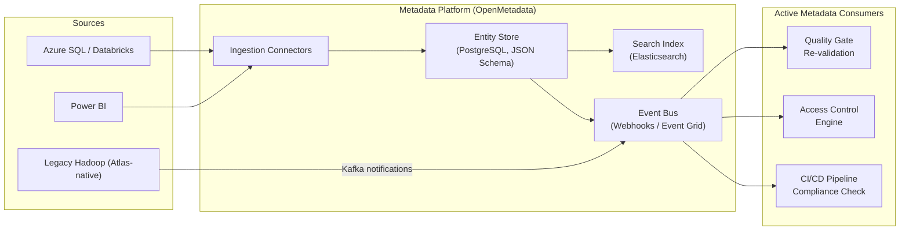
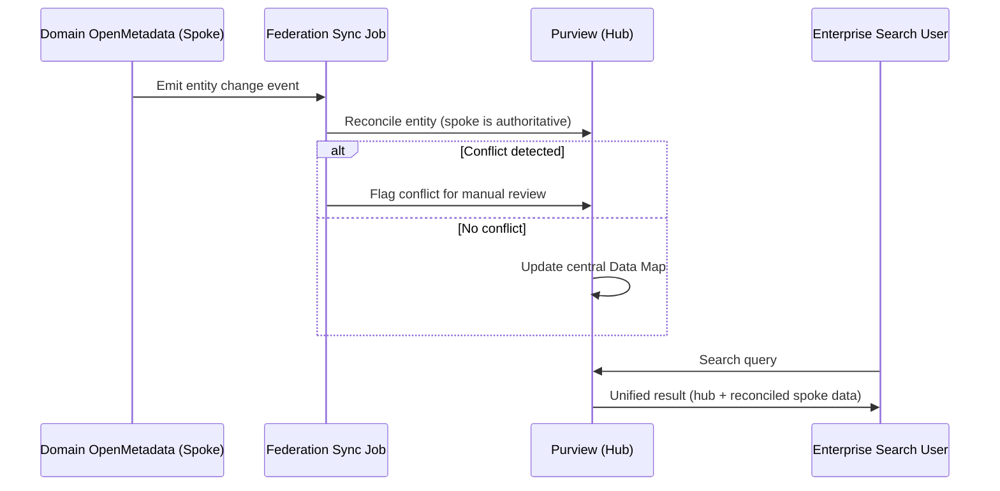
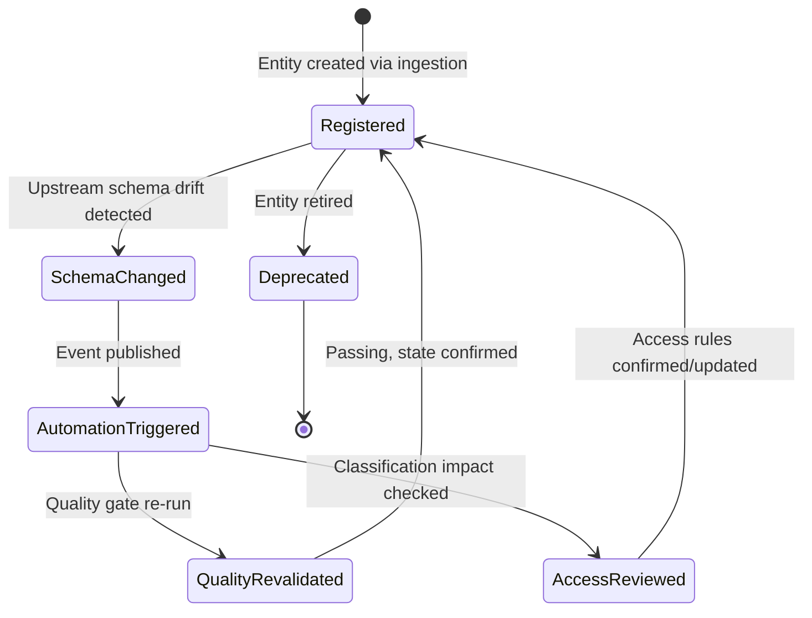

# Metadata Management: OpenMetadata and Atlas

> Part of the **Enterprise Data & AI Architecture Handbook** · Phase-08 — Data Governance & Quality · Chapter 04.
> Estimated study time: **60 min reading + ~3h labs**.
> **Prerequisites:** read [Data Catalog and Lineage](02_Data_Catalog_and_Lineage.md) first.

---

## Executive Summary

[Data Catalog and Lineage](02_Data_Catalog_and_Lineage.md#core-concepts) established *what* a catalog must capture (technical, business, operational metadata) and *why* column-level lineage matters. This chapter goes one level deeper into the **metadata platform** itself — the open-source engines, **OpenMetadata** and **Apache Atlas**, that many enterprises run alongside or underneath a managed catalog like Microsoft Purview, and the architectural shift from **passive metadata** (a static record, queried on demand, useful only when a human remembers to look) to **active metadata** (a live system that pushes events, triggers automation, and is embedded directly in the tools people already use). A catalog that only answers "what does this mean?" when someone opens a search UI is a reference document; a metadata platform that automatically alerts a Slack channel when a certified table's schema changes, or that blocks a CI/CD deployment because a downstream dependent lacks an approved data contract, is an operational control system — the difference between the two is this chapter's subject.

Concretely, this chapter covers: the standard **metadata models** underlying modern catalogs (Apache Atlas's type-system model, OpenMetadata's schema-first entity model, and the emerging **Open Data Discovery/OpenLineage-adjacent** standardization efforts); **OpenMetadata** and **Apache Atlas** in production depth — architecture, deployment topology, and when each is the right choice; the **active metadata** paradigm and the automation patterns it enables (auto-tagging, auto-alerting, policy-triggered workflows); **metadata APIs and events** (REST/GraphQL query interfaces plus event-streaming interfaces for push-based integration, mirroring the OpenLineage event model from [Data Catalog and Lineage](02_Data_Catalog_and_Lineage.md#core-concepts) but generalized to all metadata changes, not just lineage); and **federating metadata across tools** — the increasingly common enterprise reality of running Purview, a self-hosted OpenMetadata instance, and a data-mesh domain's own local catalog simultaneously, and how to keep them from becoming three disconnected, conflicting sources of truth.

The governing insight: **a metadata platform's value is proportional to how many systems actually consume its events, not how much metadata it stores.** A beautifully modeled metadata graph that only a human ever queries through a search UI captures a fraction of the value of the same graph wired into CI/CD gates, alerting systems, and access-control decisions — active metadata is what converts a catalog from a reference tool into an enforcement and automation substrate.

The bias remains **Azure-primary (~60%)** — Microsoft Purview's Atlas-API compatibility layer, self-hosted OpenMetadata/Atlas deployment on AKS with Azure Database for PostgreSQL and Azure-managed Elasticsearch/OpenSearch, Entra ID SSO integration, and Azure Event Grid/Event Hubs as the event-streaming backbone for active-metadata automation — **~30% enterprise open source** (OpenMetadata and Apache Atlas as the two subject platforms, Kafka as Atlas's native notification bus) and **~10% AWS/GCP comparison-only** (AWS DataZone's metadata event model, GCP Dataplex's metadata API).

**Bottom line:** a metadata management program succeeds when its metadata model is rich and standardized enough to federate across tools without translation loss, and when metadata changes trigger real automation rather than sitting inert until queried. An architect who designs the metadata API/event layer as a first-class integration surface — not an afterthought bolted onto a search UI — builds the substrate that every other Phase-08 chapter's automation (quality gates, MDM golden-record propagation, contract-breach detection) ultimately depends on.

---

## Learning Objectives

By the end of this chapter you will be able to:

1. **Explain the metadata model standards** underlying Apache Atlas (type system) and OpenMetadata (JSON Schema-based entity model), and why model compatibility determines federation feasibility.
2. **Deploy and operate OpenMetadata and Apache Atlas** in production, including their storage, indexing, and event-notification architecture.
3. **Distinguish passive from active metadata** and design at least three concrete automation patterns (auto-tagging, alerting, policy-triggered workflow) that active metadata enables.
4. **Design a metadata API/event integration** that lets external systems (CI/CD, access control, quality gates) consume metadata changes without polling.
5. **Design a metadata federation strategy** for an enterprise running more than one catalog/metadata platform simultaneously, avoiding the "three disconnected sources of truth" anti-pattern.
6. **Compare OpenMetadata, Apache Atlas, and Microsoft Purview** on model richness, event architecture, and operational overhead, and choose correctly for a given deployment context.
7. **Identify metadata management anti-patterns** — model drift across federated systems, event-less "dead" catalogs, and over-centralization of metadata write access.
8. **Map a target metadata architecture onto Azure**, with an explicit, defensible comparison to AWS DataZone and GCP Dataplex's metadata APIs.

---

## Business Motivation

- **Manual, human-triggered metadata lookups don't scale to automation-driven enterprises.** As more of the data estate is governed by automated quality gates, access-control policies, and AI copilot grounding checks (from [Data Quality with Great Expectations](03_Data_Quality_with_Great_Expectations.md) and [Data Catalog and Lineage](02_Data_Catalog_and_Lineage.md)), those systems need to *query and subscribe to* metadata programmatically — a catalog with only a human-facing search UI cannot serve as their backing store.
- **Multiple catalogs are an operational reality, not a design failure, in most enterprises past a certain scale** — an acquired business unit's existing Atlas deployment, a data-mesh domain's self-managed OpenMetadata instance, and a central Purview account routinely coexist; without a federation strategy, these diverge into contradictory sources of truth, directly undermining the trust [Data Governance Foundations](01_Data_Governance_Foundations.md#business-motivation) depends on.
- **Metadata that only updates when someone remembers to edit it is metadata that lies.** Active, event-driven metadata (schema-change notifications, automatic re-classification triggers) keeps the catalog synchronized with reality without depending on a human's diligence, directly reducing the staleness risk called out in [Data Catalog and Lineage](02_Data_Catalog_and_Lineage.md#anti-patterns).
- **AI copilots and agentic systems need machine-queryable metadata, not a search UI.** A retrieval-augmented enterprise assistant grounding its answers in "certified" data must call a metadata API programmatically at query time — this is only possible if the metadata platform exposes a real API/event surface, not just a browsable web page.

---

## History and Evolution

- **2015 — Apache Atlas originates at Hortonworks**, built around a flexible, extensible **type system** (define custom entity and relationship types) tightly coupled to the Hadoop ecosystem (Hive, HBase, Kafka, Storm), using **Kafka** itself as its notification/event bus from the outset — an early example of metadata-as-event-stream architecture, though scoped mainly to Hadoop-native sources.
- **2019 — OpenMetadata's predecessor efforts (and the broader "modern data catalog" wave)** begin addressing Atlas's Hadoop-centric limitations, aiming for a cloud-native, multi-source metadata model not tied to a single ecosystem.
- **2021 — OpenMetadata launches**, built around a **JSON Schema-first** entity model (making the metadata model itself machine-validated, versioned, and extensible without custom Java type definitions as Atlas requires), a **REST and GraphQL API** as first-class citizens, and native **webhook/event** support for external system integration from day one.
- **2021 — Prukalpa Sankar and the Atlan team popularize the term "active metadata"**, arguing (in widely-cited industry writing) that the next generation of metadata platforms must shift from passive, query-on-demand documentation toward metadata that actively triggers workflows, alerts, and automation — directly shaping this chapter's central framing.
- **2021 — Microsoft Purview (GA)** ships with an **Apache Atlas-compatible REST API**, deliberately choosing Atlas's type-system model as its compatibility layer specifically to ease migration and interoperability for enterprises with existing Atlas-based tooling and scripts.
- **2022-present — OpenLineage's success (covered in [Data Catalog and Lineage](02_Data_Catalog_and_Lineage.md#history-and-evolution)) demonstrates the value of standardized, vendor-neutral metadata event formats**, inspiring broader "open metadata standard" efforts (including proposals loosely under an "Open Data Discovery" umbrella) aiming to do for general metadata what OpenLineage did specifically for lineage events.
- **2023-present — Federated metadata becomes an explicit enterprise architecture concern**, driven by data mesh's federated-domain model (from [Data Governance Foundations](01_Data_Governance_Foundations.md#core-concepts)) and M&A activity routinely producing multi-catalog enterprises, pushing platform vendors (Purview, OpenMetadata, Atlan, Collibra) to invest in cross-catalog federation and metadata-exchange APIs rather than assuming a single, enterprise-wide catalog is realistic.

---

## Why This Technology Exists

A catalog's metadata is only as useful as the systems that can read and react to it; a metadata model that lives entirely inside one vendor's proprietary storage format, queryable only through that vendor's UI, cannot serve as the shared substrate for the quality gates, access-control decisions, and AI-grounding checks a modern data platform increasingly depends on. Metadata management platforms exist to make metadata a first-class, API-addressable, event-emitting system — not a documentation database — so that the rest of the data platform's automation can be built *on top of* metadata rather than requiring a human to manually translate catalog knowledge into each downstream system's configuration.

---

## Problems It Solves

- **Programmatic access to governance state** — CI/CD pipelines, quality gates, and access-control systems can query "is this dataset certified, and what is its classification?" via API rather than requiring a human to check a UI before every deployment decision.
- **Real-time reaction to metadata change** — a schema-change event can automatically trigger a re-classification scan, a quality-suite re-validation, or a notification to downstream consumers, rather than waiting for the next scheduled catalog refresh cycle.
- **Multi-catalog reconciliation** — a defined federation model (rather than an ad hoc, undocumented sync) lets an enterprise running Purview alongside a domain's self-hosted OpenMetadata instance maintain one authoritative answer per asset instead of three conflicting ones.
- **Extensible, custom metadata modeling** — Atlas's type system and OpenMetadata's JSON Schema entities let an organization model domain-specific concepts (e.g., a "ML Feature" or "Data Product" entity type) that a fixed, vendor-defined schema cannot accommodate.
- **Vendor lock-in mitigation** — an open, well-documented metadata API/event model makes it feasible to migrate between catalog platforms (or run more than one) without being trapped entirely inside a single vendor's proprietary integration surface.

---

## Problems It Cannot Solve

- **It cannot fix a poorly designed metadata model.** A rich, event-driven platform built on a metadata schema that doesn't actually reflect how the business thinks about its data domains is still unusable — model design quality matters more than platform choice.
- **It cannot substitute for the governance operating model.** Active metadata can *trigger* a notification when a classification changes; it cannot *decide* what the correct classification is — that remains the accountable owner's judgment from [Data Governance Foundations](01_Data_Governance_Foundations.md#internal-working).
- **It cannot automatically resolve semantic conflicts between federated systems.** If Purview and a domain's OpenMetadata instance disagree about a table's classification, the platform can surface the conflict; it cannot adjudicate which is correct without a human decision process.
- **It cannot eliminate the operational burden of running a self-hosted platform.** Apache Atlas and OpenMetadata both require meaningful infrastructure operation (storage, indexing, event-bus management) — "open source" does not mean "zero operational cost," a distinction this chapter returns to in [Cost Optimization](#cost-optimization).
- **It cannot make every source system emit rich, structured metadata by default.** A legacy, opaque source system with no metadata API still requires scanning-based inference (from [Data Catalog and Lineage](02_Data_Catalog_and_Lineage.md#core-concepts)), which is inherently lower-fidelity than a source that natively participates in the active-metadata model.

---

## Core Concepts

### 8.1 Metadata Models: Atlas Type System vs. OpenMetadata Schema Model

**Apache Atlas** models metadata using a **type system**: administrators define custom **entity types** (e.g., `hive_table`, or a custom `ml_feature` type) with typed attributes and **relationship types** connecting them, all defined and stored as Atlas type definitions (originally authored in Java, more recently via a JSON-based type-definition API). This is highly extensible but requires deliberate type-system design work before new kinds of metadata can be captured.

**OpenMetadata** models metadata using **JSON Schema-defined entities** from the outset — every entity (table, dashboard, pipeline, glossary term, ML model) has a versioned JSON Schema definition, and custom entity types can be added by defining new schemas without Java code. This schema-first approach makes the model itself more portable and easier to validate/version than Atlas's originally Java-centric type system, and is a major reason OpenMetadata has gained faster adoption among cloud-native teams.

Both models converge on the same underlying idea — a typed graph of entities and relationships — but the practical authoring experience differs enough that migrating a custom type/entity definition between the two requires deliberate re-modeling, not a mechanical translation.

### 8.2 Active Metadata

**Passive metadata** is stored, indexed, and queried on demand — valuable, but inert until a human decides to look. **Active metadata** is metadata that *triggers action*: a schema-change event automatically re-triggers a data-quality Checkpoint (from [Data Quality with Great Expectations](03_Data_Quality_with_Great_Expectations.md#internal-working)); a new PII classification automatically triggers an access-review workflow; a pipeline's OpenLineage event automatically updates the catalog's freshness signal without waiting for the next scheduled scan (from [Data Catalog and Lineage](02_Data_Catalog_and_Lineage.md#core-concepts)). The architectural requirement for active metadata is an **event bus** — every meaningful metadata state change must be published as an event that downstream systems can subscribe to, not just written to a queryable store.

### 8.3 Metadata APIs and Events

Both platforms expose a **query API** (Atlas: REST plus a Gremlin-like DSL for graph queries; OpenMetadata: REST and GraphQL) for synchronous, on-demand reads, and an **event/notification interface** for asynchronous, push-based integration:

- **Apache Atlas** publishes entity create/update/delete notifications to a **Kafka** topic (`ATLAS_ENTITIES`) natively — any system needing to react to metadata changes subscribes to this topic rather than polling the REST API.
- **OpenMetadata** exposes **webhooks** (configurable per event type — entity created, classification changed, glossary term updated) that POST to a subscriber's HTTP endpoint, plus native integration with messaging systems for higher-throughput event consumption.

The architectural pattern this enables — and the one this chapter recommends as default — is: external systems (CI/CD quality gates, access-control engines, alerting) **subscribe to metadata events** rather than **polling the metadata API on a schedule**, since polling introduces both unnecessary load and detection latency proportional to the poll interval.

### 8.4 Metadata Federation Across Tools

Federation addresses the reality that most enterprises past a certain size and history (M&A, data mesh domain autonomy, legacy tool investment) run more than one metadata platform. Three federation patterns, in increasing order of maturity:

1. **Hub-and-spoke synchronization** — a central platform (typically Purview) periodically pulls or receives pushed metadata from spoke systems (a domain's OpenMetadata instance, a legacy Atlas deployment) via API integration, becoming the enterprise-wide read path while spokes remain each system's authoritative write path for their own domain.
2. **Federated query** — rather than synchronizing copies, a federation layer queries each underlying system live at request time and merges results, avoiding synchronization lag at the cost of query-time latency and cross-system query complexity.
3. **Shared metadata standard with independent stores** — each platform stores its own metadata independently but emits and consumes events in a shared, vendor-neutral format (an OpenLineage-style standard, where one exists for the metadata type in question), allowing loose coupling without a single central store at all.

Hub-and-spoke is the most common pattern in practice today because it maps naturally onto the hybrid governance operating model (central policy function, federated domain ownership) already established in [Data Governance Foundations](01_Data_Governance_Foundations.md#core-concepts) — the central Purview hub becomes the enterprise's single authoritative read path even when write authority remains distributed.

---

## Internal Working

An active-metadata platform's steady-state operation, using OpenMetadata's architecture as the concrete illustration:

1. **Ingestion** — a scheduled connector (or a push from an instrumented pipeline) writes an entity update (new table, changed schema, updated classification) to OpenMetadata's REST API.
2. **Persistence** — the entity update is validated against its JSON Schema and persisted to the underlying relational store (MySQL/PostgreSQL), which holds entity data as versioned JSON documents alongside their relationships.
3. **Indexing** — the same update is propagated to the search index (Elasticsearch/OpenSearch), keeping the discovery/search experience from [Data Catalog and Lineage](02_Data_Catalog_and_Lineage.md#core-concepts) current.
4. **Event emission** — the entity change triggers configured webhooks (or, for Atlas, a Kafka notification) to any subscribed external system.
5. **Downstream reaction** — a subscribed CI/CD pipeline, upon receiving a "classification changed to Restricted" event for a table it depends on, automatically re-evaluates whether its current deployment configuration still complies (e.g., does it need additional masking now?), without a human needing to notice the classification change manually.
6. **Federation sync (if applicable)** — a hub-and-spoke integration job periodically reconciles the spoke system's entity state into the central hub (Purview), applying conflict-resolution rules (typically: the domain-owning spoke system wins for its own entities) where the two disagree.

---

## Architecture

A metadata management platform's architecture separates four concerns that must each scale independently: a **metadata store** (the entity-and-relationship graph, whether Atlas's JanusGraph-backed graph database or OpenMetadata's relational-plus-JSON-document store); a **search index** (Elasticsearch/OpenSearch in both Atlas and OpenMetadata, optimized for the discovery experience rather than graph traversal); an **event bus** (Kafka natively for Atlas; webhooks or a configurable messaging backend for OpenMetadata) that is the architectural enabler of active metadata; and an **ingestion framework** (connectors/scanners feeding the store, following the same automated-harvesting-first principle from [Data Catalog and Lineage](02_Data_Catalog_and_Lineage.md#core-concepts)). The critical architectural decision this chapter emphasizes: the event bus is not an optional add-on for notification purposes — it is the mechanism that determines whether the platform is active or merely passive metadata storage with a nice UI on top.

---

## Components

- **Metadata store** — Atlas's JanusGraph (backed by HBase/Cassandra plus Solr/Elasticsearch); OpenMetadata's relational database (MySQL/PostgreSQL) holding JSON Schema-validated entities.
- **Search index** — Elasticsearch/OpenSearch in both platforms, serving discovery queries.
- **Event bus** — Kafka (Atlas, native); webhook/messaging integration (OpenMetadata).
- **Ingestion framework** — connector/scanner plugins per source-system type (databases, BI tools, pipeline orchestrators, ML platforms).
- **Type/schema registry** — Atlas's type-definition store; OpenMetadata's JSON Schema definitions repository.
- **Federation/sync layer** — custom or platform-provided integration jobs reconciling entity state across multiple metadata platforms.
- **API gateway** — REST/GraphQL endpoints serving both human UI and machine-client queries.

---

## Metadata

This chapter is deliberately meta: the "metadata about metadata" worth calling out explicitly is the **schema/type-definition version history** itself — both Atlas and OpenMetadata version their type/schema definitions, and a change to a core entity type (e.g., adding a required field to the "table" entity type) is itself a metadata event with downstream consequences (existing entities may need backfilling, ingestion connectors may need updating) that should go through the same governance review as any other high-impact schema change, rather than being applied silently by whichever engineer happens to be extending the model that week.

---

## Storage

Apache Atlas's default storage stack is **JanusGraph** (a distributed graph database) backed by **HBase or Cassandra** for the graph data itself and **Solr or Elasticsearch** for full-text search — a genuinely graph-native storage model well suited to complex relationship traversal but with meaningful operational complexity (three distinct distributed systems to run and tune). OpenMetadata takes a simpler approach: entities are stored as JSON documents in a conventional relational database (**MySQL or PostgreSQL**), with relationships modeled as foreign-key-style references rather than a dedicated graph store, and a separate **Elasticsearch/OpenSearch** cluster purely for search indexing — a meaningfully lighter operational footprint, at some cost to deep multi-hop graph-traversal query performance compared to Atlas's purpose-built graph backend.

---

## Compute

Both platforms' steady-state compute cost is dominated by **ingestion connector runs** (scanning/harvesting jobs, typically run as scheduled batch jobs on the same compute as other pipeline workloads) and **search-index maintenance**. Atlas's JanusGraph/HBase stack has a materially higher baseline compute and memory footprint than OpenMetadata's relational-plus-search-index approach, which is one of the concrete reasons many new deployments choose OpenMetadata over Atlas today despite Atlas's more mature graph-traversal capability — the operational cost difference is real and should be weighed explicitly, not assumed away because both are "free" open source.

---

## Networking

Whether self-hosted on **AKS** or run as a managed service, metadata platforms should sit behind **private endpoints/private networking**, consistent with [Data Catalog and Lineage — Networking](02_Data_Catalog_and_Lineage.md#networking): ingestion connectors reaching into source systems should use private connectivity (VNet peering, private endpoints, or a self-hosted integration runtime equivalent), and the platform's own API/UI endpoints should be exposed only through an internal load balancer or Application Gateway with Entra ID-integrated authentication, never anonymously on the public internet — a metadata platform's API surface reveals the same sensitive schema and classification detail a catalog does.

---

## Security

Metadata write access (who can create/modify entity types, who can change a classification via the API) must be scoped as tightly as read access: both Atlas and OpenMetadata support role-based access control, and OpenMetadata additionally supports fine-grained, per-entity ownership-based permissions mapping directly onto the owner/steward roles from [Data Governance Foundations](01_Data_Governance_Foundations.md#core-concepts). Event-bus subscribers (systems consuming Kafka notifications or webhooks) must themselves be authenticated and authorized — an unauthenticated webhook endpoint accepting metadata-change payloads is a credible injection vector for a malicious actor to spoof classification changes or falsely mark a compromised dataset as "certified."

---

## Performance

Query performance differs meaningfully by access pattern: Atlas's graph-native storage generally outperforms OpenMetadata's relational-plus-foreign-key model for deep, multi-hop lineage/relationship traversal queries at very large entity counts, while OpenMetadata's simpler storage model is typically faster to operate and sufficient for the vast majority of enterprise catalog sizes and query patterns (most impact-analysis queries in practice are 2-4 hops, not deep graph traversal). Event-bus throughput (Kafka for Atlas) scales more predictably under high-frequency metadata-change workloads than webhook-based delivery (OpenMetadata's default), which becomes a real consideration for organizations with very high pipeline run frequency generating a correspondingly high volume of lineage/freshness events.

---

## Scalability

OpenMetadata's simpler, relational-database-backed architecture scales operationally more easily for most enterprises (standard database scaling and read replicas are well-understood), while Atlas's JanusGraph/HBase stack, though capable of very large scale, requires deeper distributed-systems operational expertise to scale and tune correctly — a material factor in total cost of ownership at scale, not just initial deployment simplicity. For federation architectures (hub-and-spoke), scalability additionally depends on the synchronization job's ability to keep pace with the combined rate of change across all spoke systems, mirroring the harvesting-pipeline scalability bottleneck already identified in [Data Catalog and Lineage](02_Data_Catalog_and_Lineage.md#scalability).

---

## Fault Tolerance

An event-bus outage (Kafka down for Atlas, webhook endpoint unreachable for OpenMetadata) should not silently drop metadata-change events — both platforms should be configured with durable, at-least-once event delivery (Kafka's log-based durability natively; OpenMetadata's webhook delivery should include retry-with-backoff and a dead-letter mechanism for persistently failing subscribers) so that a downstream automation system (a quality gate, an access-control engine) can trust it will eventually receive every relevant event rather than silently missing one during a transient outage. Federation sync jobs should be idempotent and resumable from a checkpoint, so a failed sync run can be safely retried without producing duplicate or conflicting entity updates.

---

## Cost Optimization

The dominant cost for self-hosted OpenMetadata or Atlas is **infrastructure**, not licensing (both are free, open-source software): Atlas's JanusGraph/HBase/Solr stack requires meaningfully more compute and operational engineering time than OpenMetadata's simpler MySQL/PostgreSQL-plus-Elasticsearch footprint. **Worked FinOps example:** running OpenMetadata on AKS with a modest node pool (3 nodes, Standard_D4s_v5 at roughly $0.19/hour each) plus an Azure Database for PostgreSQL Flexible Server (General Purpose, ~$0.25/hour) and a small managed Elasticsearch-compatible search tier (~$0.30/hour) costs roughly (3 × $0.19 + $0.25 + $0.30) × 730 hours ≈ $818/month in infrastructure — compare this to an equivalent Atlas deployment's typically 2-3x higher compute footprint (JanusGraph/HBase's distributed-storage overhead) at a similar entity/query scale, which is the concrete cost basis behind this chapter's general recommendation to default to OpenMetadata for new deployments unless Atlas's deeper graph-traversal capability or existing Hadoop-ecosystem integration is a specific, justified requirement.

---

## Monitoring

Track: **event-bus lag/backlog** (are subscribers keeping pace with the rate of metadata change, or accumulating a growing backlog that delays active-metadata automation); **ingestion connector success rate and staleness age** (shared with [Data Catalog and Lineage — Monitoring](02_Data_Catalog_and_Lineage.md#monitoring)); **webhook/notification delivery failure rate** (a persistently failing subscriber is a silent automation gap); and, for federated deployments, **cross-system reconciliation conflict rate** (how often the hub and a spoke disagree about an entity's state, a leading indicator of federation model breakdown).

---

## Observability

Observability here means answering, without manual investigation: *is the event bus healthy, is every subscriber receiving events promptly, and — for a federated deployment — do the hub and spoke systems currently agree on this entity's state?* Both Atlas (via Kafka consumer-group lag metrics) and OpenMetadata (via webhook delivery logs) expose the raw signals needed; wiring these into Azure Monitor/Log Analytics or a self-hosted Prometheus/Grafana stack alongside the platform's own operational metrics (query latency, ingestion job health) gives the unified view this chapter's active-metadata automation depends on being trustworthy.

---

## Governance

Metadata-platform governance extends [Data Governance Foundations](01_Data_Governance_Foundations.md#governance) and [Data Catalog and Lineage](02_Data_Catalog_and_Lineage.md#governance) with two platform-specific concerns: **type/schema evolution governance** (who can add or modify entity types, since a poorly-reviewed schema change can silently break every ingestion connector depending on the old shape) and **federation authority governance** (which system is authoritative for which entities, formally documented rather than left as an implicit assumption that breaks down the first time hub and spoke disagree).

**ADR Example — Choosing OpenMetadata Over Apache Atlas for a Greenfield Deployment:**

> **Context:** A retail enterprise with no existing metadata platform and a heterogeneous estate (Azure SQL, Databricks, Power BI, a legacy on-prem Hadoop cluster from a prior acquisition) needed to select a self-hosted metadata platform to run alongside a planned Microsoft Purview rollout, primarily to serve the acquired unit's Hadoop-ecosystem sources that Purview's connectors covered less completely.
> **Decision:** Deploy **OpenMetadata** on AKS rather than Apache Atlas, despite Atlas's more mature native Hadoop-ecosystem integration, because the organization's long-term source mix was overwhelmingly cloud-native (Azure SQL, Databricks, Power BI) with the legacy Hadoop cluster explicitly planned for decommission within 18 months — Atlas's Hadoop-specific strengths were a declining-value asset, while OpenMetadata's lower operational footprint and JSON Schema-first model better matched the target-state estate.
> **Consequences:** The legacy Hadoop cluster required a custom OpenMetadata ingestion connector (Atlas would have supported it natively), a one-time engineering cost accepted explicitly because the cluster's planned decommission made it a temporary, not permanent, integration burden; the organization avoided taking on Atlas's higher JanusGraph/HBase operational overhead for a source category being phased out.
> **Alternatives considered:** (1) Deploy Atlas for its native Hadoop support — rejected as optimizing for a declining-value, soon-to-be-decommissioned source category at the cost of higher ongoing operational overhead for the platform's long-term majority use case; (2) Skip a self-hosted platform entirely and rely solely on Purview — rejected because Purview's connector coverage for the legacy Hadoop cluster was, at the time, insufficiently mature for the 18-month transition window; (3) Run both Atlas and OpenMetadata in parallel — rejected as unnecessary operational complexity for a temporary integration need.

---

## Trade-offs

- **Atlas's mature graph-native lineage vs. OpenMetadata's simpler operational model**: Atlas performs better on deep, multi-hop graph queries and has stronger native Hadoop-ecosystem integration; OpenMetadata is materially cheaper and easier to operate for the majority of enterprise use cases that don't require Atlas's specific strengths.
- **Hub-and-spoke federation vs. federated live query**: hub-and-spoke is simpler to reason about and query (one authoritative read path) but introduces synchronization lag; federated live query avoids lag but adds cross-system query complexity and latency.
- **Kafka-native event bus (Atlas) vs. webhook-based events (OpenMetadata default)**: Kafka provides stronger delivery guarantees and throughput at high event volume; webhooks are simpler to integrate for a smaller number of subscribers but require more careful retry/dead-letter handling to match Kafka's durability guarantees.

---

## Decision Matrix

| Criterion | Apache Atlas | OpenMetadata | Microsoft Purview |
|---|---|---|---|
| Metadata model | Type-system (Java/JSON type defs) | JSON Schema-first | Atlas-compatible + proprietary extensions |
| Graph-native lineage performance | Strong (JanusGraph) | Moderate (relational + FK-style relationships) | Strong (managed) |
| Operational overhead (self-hosted) | High (JanusGraph/HBase/Solr) | Moderate (MySQL/PostgreSQL + Elasticsearch) | None (managed service) |
| Event architecture | Kafka-native | Webhooks (+ messaging integrations) | Managed eventing + Atlas-API compatibility |
| Best fit | Hadoop-ecosystem-heavy legacy environments | Cloud-native, heterogeneous, cost-sensitive deployments | Azure-primary enterprises wanting a managed service |

---

## Design Patterns

- **Event-subscription-first integration** — design every external system (quality gates, access control, CI/CD) to subscribe to metadata events rather than polling the API on a schedule.
- **Hub-and-spoke federation with explicit authority mapping** — document, per entity type or domain, exactly which system is authoritative, rather than leaving it as an implicit, eventually-contradicted assumption.
- **Schema/type-evolution review gate** — require the same pull-request-style review for entity type/schema changes as for the Expectation Suite changes in [Data Quality with Great Expectations](03_Data_Quality_with_Great_Expectations.md#design-patterns).
- **Dead-letter and retry for webhook delivery** — treat OpenMetadata's webhook-based events with the same durability discipline as Kafka's native guarantees, rather than assuming best-effort HTTP delivery is sufficient for active-metadata automation that other systems depend on.

---

## Anti-patterns

- **Metadata-as-documentation-only** — deploying a fully-featured metadata platform but never wiring its event bus to any downstream automation, capturing only a fraction of active metadata's value while paying its full operational cost.
- **Silent federation drift** — running Purview and a spoke OpenMetadata/Atlas instance without an explicit reconciliation job or authority mapping, letting the two silently diverge until a consumer discovers contradictory information.
- **Type-system sprawl** — allowing uncontrolled proliferation of custom entity types/schemas without governance review, producing a model too fragmented and inconsistent for federation or cross-domain querying to work reliably.
- **Choosing Atlas by default out of familiarity** rather than evaluating actual source-system mix and long-term operational cost, taking on JanusGraph/HBase's operational burden for an estate that doesn't need Atlas's specific Hadoop-ecosystem strengths.
- **Unauthenticated webhook endpoints** consuming metadata-change events, an overlooked but credible security gap given how much automation may trust those events.

---

## Common Mistakes

- Underestimating the operational cost difference between Atlas and OpenMetadata during platform selection, discovering only after deployment that JanusGraph/HBase requires meaningfully more specialized operational expertise than initially budgeted.
- Treating the event bus as an optional feature to "add later," resulting in a passive-only deployment that never delivers active metadata's automation value.
- Federating metadata across systems without ever formally documenting authority — leaving it to be discovered, painfully, the first time two systems disagree during an audit or incident.
- Allowing every team to define its own custom entity types without any central schema review, producing model fragmentation that defeats cross-domain metadata queries.
- Migrating from Atlas to OpenMetadata (or vice versa) assuming a mechanical, lossless conversion, when in practice the differing type-system/schema models require deliberate re-modeling and validation.

---

## Best Practices

- Default new metadata-platform deployments to OpenMetadata unless a specific, justified requirement (deep Hadoop-ecosystem integration, existing large Atlas investment) favors Atlas — the operational cost difference is real and compounds over the platform's lifetime.
- Design and prioritize the event-subscription integration (quality gates, access control, alerting) as part of the initial rollout, not a "phase 2" afterthought — this is where most of active metadata's actual value is realized.
- Document federation authority explicitly, per domain or entity type, as a reviewed governance artifact — not an implicit assumption — consistent with the exception-and-authority documentation discipline established in [Data Governance Foundations](01_Data_Governance_Foundations.md#governance).
- Route entity type/schema changes through the same pull-request review discipline as Expectation Suite changes in [Data Quality with Great Expectations](03_Data_Quality_with_Great_Expectations.md#design-patterns).

---

## Enterprise Recommendations

- For a greenfield, cloud-native, Azure-primary enterprise: adopt Microsoft Purview as the primary hub, using its Atlas-compatible API to integrate any legacy Atlas-based tooling rather than running a separate self-hosted Atlas instance long-term.
- For an enterprise needing a self-hosted, cost-sensitive supplementary catalog (e.g., for a data-mesh domain wanting its own local metadata store) alongside Purview: default to OpenMetadata, federated hub-and-spoke into Purview, with explicit authority documentation per domain.
- Retain Apache Atlas only where a genuine, justified Hadoop-ecosystem dependency exists, with an explicit decommissioning plan once that dependency is retired (as in this chapter's ADR).

---

## Azure Implementation

- **Microsoft Purview's Apache Atlas-compatible REST API** lets existing Atlas-based scripts, integrations, and even some third-party tooling built against the Atlas API interoperate with Purview's Data Map with minimal rework — a deliberate design choice easing migration from self-hosted Atlas deployments.
- **Self-hosted OpenMetadata or Apache Atlas on AKS** — a common pattern for enterprises needing a domain-local or specialized catalog alongside Purview — uses **Azure Database for PostgreSQL Flexible Server** (OpenMetadata's backing store), an Azure-managed **Elasticsearch-compatible search offering** (or self-managed OpenSearch on AKS), and **Entra ID** as the SSO/OIDC identity provider for both platform UIs.
- **Azure Event Grid or Event Hubs** commonly substitutes for or fronts OpenMetadata's webhook delivery in production, providing durable, replayable event delivery to multiple Azure-native subscribers (Azure Functions for lightweight automation, Logic Apps for workflow orchestration) rather than relying on OpenMetadata's default best-effort HTTP webhook retry alone.
- Example: a minimal AKS deployment manifest excerpt for OpenMetadata, backed by Azure Database for PostgreSQL:

```yaml
apiVersion: apps/v1
kind: Deployment
metadata:
  name: openmetadata-server
spec:
  replicas: 2
  template:
    spec:
      containers:
        - name: openmetadata
          image: docker.getcollate.io/openmetadata/server:latest
          env:
            - name: DB_HOST
              value: "contoso-openmetadata.postgres.database.azure.com"
            - name: DB_USER
              valueFrom:
                secretKeyRef: { name: openmetadata-db-secret, key: username }
            - name: ELASTICSEARCH_HOST
              value: "contoso-search.search.windows.net"
```

- Example: subscribing an Azure Function to OpenMetadata's webhook events to auto-trigger a quality re-validation on schema change:

```python
import azure.functions as func
import json

def main(req: func.HttpRequest) -> func.HttpResponse:
    event = req.get_json()
    if event.get("eventType") == "entityUpdated" and "schema" in event.get("changeDescription", {}):
        # Trigger a Great Expectations Checkpoint re-run for the affected table
        trigger_quality_checkpoint(event["entity"]["fullyQualifiedName"])
    return func.HttpResponse(status_code=200)
```

---

## Open Source Implementation

- **OpenMetadata** is the recommended default self-hosted platform per this chapter's Enterprise Recommendations, with native REST/GraphQL APIs, webhook events, and a JSON Schema-first model that eases both custom entity modeling and long-term maintainability.
- **Apache Atlas**, run with its native **Kafka** notification bus, remains the stronger choice specifically for Hadoop-ecosystem-heavy environments (Hive, HBase, Storm) or organizations with substantial existing investment in Atlas-based tooling.
- **Kafka** itself, beyond its role inside Atlas, is commonly used as the enterprise-wide event backbone when federating metadata events across multiple platforms (Purview, OpenMetadata, and domain-local catalogs) in a self-hosted or hybrid architecture.

---

## AWS Equivalent (comparison only)

AWS's closest equivalent to this chapter's active-metadata and federation concerns is **Amazon DataZone**, which provides a metadata-event model (data-product publishing/subscription events) and a governed-federation-like structure (each "domain" in DataZone owns its own data products, with a central DataZone portal serving as the discovery hub) — conceptually similar to this chapter's hub-and-spoke pattern. **Advantages:** DataZone's data-product-centric model maps naturally onto data-mesh-style domain ownership. **Disadvantages:** DataZone's underlying metadata model and event architecture are newer and less extensible than either Atlas's mature type system or OpenMetadata's JSON Schema model, and self-hosted OpenMetadata/Atlas alternatives on AWS (e.g., on EKS) require the same infrastructure investment as on Azure/AKS. **Migration strategy:** map OpenMetadata/Atlas entity types to DataZone's data-product and asset-type model; expect to rebuild custom event-subscription integrations against DataZone's event schema. **Selection criteria:** organizations fully standardized on AWS-native data-mesh tooling may find DataZone's native integration compelling; organizations wanting deeper model extensibility and platform-choice flexibility will find self-hosted OpenMetadata/Atlas (portable across clouds) or Purview's Atlas-compatible API a more open long-term foundation.

---

## GCP Equivalent (comparison only)

GCP's equivalent is **Dataplex's metadata API** (built on the underlying **Data Catalog** service), providing a REST API and Pub/Sub-based event notification for metadata changes across BigQuery and Dataplex-managed lake assets. **Advantages:** tight native integration with **Pub/Sub** gives a robust, durable event-delivery mechanism comparable in reliability to Atlas's Kafka-native approach. **Disadvantages:** the metadata model itself is less extensible for fully custom entity types than Atlas's type system or OpenMetadata's JSON Schema model, and cross-cloud/self-hosted portability is limited compared to running OpenMetadata or Atlas independently of any single cloud vendor. **Migration strategy:** map custom OpenMetadata/Atlas entity types to Dataplex's data attribute/aspect model, and re-implement event subscribers against Pub/Sub instead of Kafka/webhooks. **Selection criteria:** BigQuery-centric organizations will find Dataplex's native Pub/Sub event integration compelling; organizations prioritizing model extensibility and multi-cloud/self-hosted flexibility will find OpenMetadata or Purview's Atlas-compatible API a better fit.

---

## Migration Considerations

- **From Apache Atlas to OpenMetadata (or vice versa)**: treat this as a metadata re-modeling exercise, not a data migration — export existing type/entity definitions as a reference, but expect to re-author them against the target platform's model (JSON Schema vs. Java/JSON type definitions), and validate lineage/relationship fidelity post-migration since the underlying storage models (graph-native vs. relational) can produce subtly different query behavior for deep multi-hop traversals.
- **From a single central catalog to a federated hub-and-spoke model**: pilot federation with one willing domain first, formally documenting authority mapping before adding additional spokes, to avoid discovering conflicting-authority issues only after multiple systems are already federated.
- **From polling-based to event-subscription integration for existing downstream systems**: incrementally migrate consumers one at a time (starting with the highest-value automation, e.g., quality-gate re-validation) rather than a big-bang cutover, since event-driven integration requires each consumer to handle at-least-once delivery and potential event reordering correctly.

---

## Mermaid Architecture Diagrams

**Active metadata platform architecture:**



**Metadata federation (hub-and-spoke) sequence:**



**Metadata entity lifecycle (active metadata triggers):**



---

## End-to-End Data Flow

1. A Databricks pipeline modifies the schema of `fact_sales`, adding a new nullable `loyalty_discount` column, and this change is picked up by OpenMetadata's scheduled ingestion connector (or emitted directly via an instrumented push, if configured).
2. OpenMetadata persists the updated entity, re-indexes it for search, and publishes an `entityUpdated` event with a `schemaChanged` change description to its configured webhook subscribers.
3. An Azure Function subscribed to this webhook automatically triggers a Great Expectations Checkpoint re-run against the new schema (from [Data Quality with Great Expectations](03_Data_Quality_with_Great_Expectations.md#internal-working)), without a human needing to notice the schema change and manually kick off validation.
4. Separately, a classification-impact check (also subscribed to the same event) confirms the new nullable column contains no sensitive data pattern, requiring no classification change.
5. A federation sync job propagates the updated entity state from the domain's OpenMetadata (spoke) into the central Purview hub, where the domain team's OpenMetadata instance remains authoritative for this entity per the documented federation authority mapping.
6. An enterprise analyst searching Purview for "sales discount" finds the updated `fact_sales.loyalty_discount` column, its glossary linkage, and its current (passing) quality status — all reflecting the schema change within minutes of it occurring, not after the next weekly catalog refresh.

---

## Real-world Business Use Cases

- **A financial services enterprise's post-merger metadata consolidation**: an acquired unit's existing Apache Atlas deployment was federated into the parent's Microsoft Purview hub via Purview's Atlas-compatible API, avoiding a disruptive, all-at-once re-cataloging of the acquired unit's several-thousand-table Hadoop estate.
- **A retail company's automated schema-drift response**: wiring OpenMetadata's webhook events to an automated quality-gate re-validation eliminated a recurring class of incident where schema changes silently broke downstream reports before the next scheduled full re-scan caught them.
- **A healthcare provider's data-mesh domain federation**: each clinical domain ran its own lightweight OpenMetadata instance for local agility, federated hub-and-spoke into a central Purview instance for enterprise-wide compliance reporting, with explicit per-domain authority documentation preventing the conflicting-source-of-truth problem this chapter warns against.

---

## Industry Examples

- **Hortonworks/Cloudera** (Apache Atlas's origin) remains the reference example of Atlas's Hadoop-ecosystem-native design, still influential in legacy big-data environments.
- **Prukalpa Sankar / Atlan** popularized the "active metadata" framing this chapter builds on, in widely-cited industry essays arguing metadata's future lies in triggering automation, not merely storing documentation.
- **LinkedIn's DataHub** (covered in [Data Catalog and Lineage](02_Data_Catalog_and_Lineage.md#industry-examples)) is architecturally a strong example of a push-based, event-first metadata platform, philosophically aligned with this chapter's active-metadata emphasis even though it is a distinct project from OpenMetadata.
- **Microsoft's own Purview engineering blog** documents the deliberate design choice to expose an Atlas-compatible API specifically to ease migration and interoperability for enterprises with existing Atlas investment, directly informing this chapter's federation guidance.

---

## Case Studies

**Case Study 1 — A Passive OpenMetadata Deployment That Delivered a Fraction of Its Value.** A logistics enterprise deployed OpenMetadata comprehensively across 400+ tables, achieving strong search adoption among analysts, but never configured a single webhook subscriber in the eighteen months following launch. When asked to justify renewing the platform's infrastructure budget, the data platform team could point only to search-usage metrics — no quality gate, access-control system, or CI/CD pipeline consumed a single metadata event. A subsequent initiative wiring OpenMetadata's schema-change events to the team's existing Great Expectations Checkpoints (previously triggered only on a fixed schedule) cut the time-to-detect for schema-drift-caused quality incidents from an average of 18 hours (next scheduled Checkpoint run) to under 5 minutes — quantifiable, budget-justifying value the platform had been capable of delivering the entire time, simply unconfigured.

**Case Study 2 — Undocumented Federation Authority Producing a Compliance Incident.** A manufacturing enterprise ran both Microsoft Purview (central) and a domain's self-hosted Apache Atlas instance (acquired via a business-unit acquisition) with an informal, undocumented sync job keeping the two loosely aligned. During a regulatory audit, examiners found the two systems reported different classifications for the same customer-data table — Purview showed "Confidential," the domain's Atlas instance showed "Restricted" (reflecting a more recent, correct classification the domain had updated but which had not yet propagated through the undocumented, irregularly-run sync job). The audit finding was not the classification discrepancy itself but the absence of any documented authority — auditors could not determine which system's answer the organization actually considered correct. The remediation, now standard practice, was formalizing a hub-and-spoke federation with the domain's Atlas instance as explicitly authoritative for its own entities, a defined maximum sync lag SLA, and automated conflict alerting rather than silent, irregular reconciliation.

---

## Hands-on Labs

1. **Deploy OpenMetadata locally** (via its Docker Compose quickstart) and register a sample database source, observing the entity model in its UI and via its REST API.
2. **Configure a webhook subscriber** (a simple local HTTP listener) for entity-update events, and trigger a schema change to observe the event payload structure.
3. **Compare Atlas's type-definition API to OpenMetadata's JSON Schema model** by defining an equivalent custom entity type (e.g., an "ML Feature" entity) in both platforms, if a local Atlas sandbox is available, or by studying both platforms' documented schemas side by side.
4. **Design a federation authority document** for a hypothetical two-catalog enterprise (a central hub plus one domain spoke), specifying per-entity-type authority and a maximum sync-lag SLA.
5. **Build a simple event-driven automation**: wire an OpenMetadata webhook to a small script that logs a structured alert whenever a table's classification changes to a higher-sensitivity tier.

---

## Exercises

1. A colleague argues "OpenMetadata and Atlas are basically interchangeable since they're both open-source catalogs." Identify three concrete architectural differences that would change your platform recommendation for a given enterprise.
2. Using Case Study 1, explain why "we deployed the metadata platform" is an incomplete measure of program success, and propose two additional metrics that would have surfaced the missing automation gap earlier.
3. Design a conflict-resolution rule for a hub-and-spoke federation where the hub and a spoke disagree about a classification, specifying exactly which system wins and why.
4. Explain why an unauthenticated webhook endpoint consuming metadata-change events is a security risk, using a concrete attack scenario.
5. Compare Kafka-based event delivery (Atlas) and webhook-based event delivery (OpenMetadata default) on delivery guarantees, and identify what additional engineering effort would be needed to bring webhook-based delivery to parity with Kafka's durability guarantees.

---

## Mini Projects

- **Event-Driven Quality Automation**: build a small end-to-end example wiring a self-hosted OpenMetadata instance's webhook events to automatically trigger a Great Expectations Checkpoint re-run (a simplified version of this chapter's End-to-End Data Flow).
- **Federation Authority Registry**: design and implement a small structured document (or lightweight database) recording, per entity type/domain, which metadata platform is authoritative, with an automated check comparing actual entity state across two mock platforms and flagging discrepancies.
- **Metadata Model Comparison Report**: pick three real-world metadata concepts (a table, a business glossary term, an ML feature) and document how each would be modeled in Atlas's type system versus OpenMetadata's JSON Schema, highlighting where the two are not a 1:1 mapping.

---

## Capstone Integration

This chapter's active-metadata event architecture is the concrete mechanism that makes [Data Quality with Great Expectations](03_Data_Quality_with_Great_Expectations.md)' quality gates react to schema drift automatically, that [Master Data Management](05_Master_Data_Management.md) can use to propagate golden-record updates to subscribers, and that [Data Contracts](07_Data_Contracts.md) can use to detect and alert on contract-relevant metadata changes without polling. [Microsoft Purview](06_Microsoft_Purview.md) is the concrete managed-service Azure platform that federates with the self-hosted OpenMetadata/Atlas patterns established here. In the handbook's capstone (Phase-20), the federation and event-driven automation patterns built here demonstrate that the capstone reference platform's governance is not merely documented but actively enforced and synchronized across its full toolchain.

---

## Interview Questions

1. What is the core architectural difference between Apache Atlas and OpenMetadata's metadata models?
   **A:** Atlas uses an extensible, originally Java-centric type system with a graph-native (JanusGraph) storage backend; OpenMetadata uses a JSON Schema-first entity model with a simpler relational-plus-search-index storage backend — both model a typed graph conceptually, but their authoring and operational experience differ significantly.
2. What is "active metadata," and how does it differ from a traditional catalog?
   **A:** Active metadata is metadata that triggers automated action (alerts, re-validation, workflow triggers) via an event bus when it changes, rather than sitting inert until a human queries it — a traditional passive catalog only answers questions when asked; an active metadata platform proactively pushes relevant changes to subscribed systems.
3. Why should external systems subscribe to metadata events rather than poll the metadata API?
   **A:** Polling introduces both unnecessary load on the metadata platform and detection latency bounded by the poll interval; event subscription delivers changes as they happen, enabling near-real-time automation like immediate quality-gate re-validation on schema change.
4. What is hub-and-spoke metadata federation, and why is it commonly used?
   **A:** A pattern where a central platform (the hub) becomes the enterprise-wide read path while domain-specific systems (spokes) remain authoritative for their own entities, periodically synchronized into the hub; it's common because it maps naturally onto federated governance operating models where domain teams retain local ownership but the enterprise still needs one unified discovery surface.
5. Why must federation authority be explicitly documented rather than left implicit?
   **A:** Without documented authority, two federated systems that disagree about an entity's state (as in Case Study 2) have no clear resolution — an auditor or engineer cannot determine which answer is correct, turning a routine sync-lag discrepancy into a compliance and trust incident.

---

## Staff Engineer Questions

1. Your organization is choosing between Apache Atlas and OpenMetadata for a new deployment with no existing Hadoop investment. What would make you recommend Atlas anyway?
   **A:** Only a specific, justified need for its more mature deep-graph-traversal query performance at very large entity/relationship scale, or an unusual organizational preference for Kafka's stronger delivery guarantees over webhook-based events — absent either, OpenMetadata's lower operational overhead makes it the better default per this chapter's cost analysis.
2. A webhook subscriber has been silently failing for two weeks, and nobody noticed until a downstream quality incident revealed a schema change was never detected. How do you prevent this recurring?
   **A:** Monitor webhook delivery failure rate as a first-class operational metric (per this chapter's Monitoring guidance) with alerting on sustained failure, and implement dead-letter handling with retry-with-backoff so a persistently failing subscriber is surfaced proactively rather than silently dropping events indefinitely.
3. How would you design the migration path if your organization decided to consolidate two federated OpenMetadata instances (from two acquired business units) into one?
   **A:** Treat it as a re-modeling and reconciliation exercise, not a data merge: compare each unit's entity types/schemas for conflicts, establish authority for overlapping entities (customers/products that exist in both), and run the two in parallel with a conflict-alerting sync job during a transition period rather than a single big-bang cutover.

---

## Architect Questions

1. Design a metadata platform architecture for an enterprise running Purview centrally, with three data-mesh domains each wanting their own lightweight, self-hosted catalog. Specify the federation model and authority mapping.
   **A:** Deploy OpenMetadata per domain (lower operational overhead, JSON Schema model), federate hub-and-spoke into Purview with each domain explicitly authoritative for its own entities, document a maximum sync-lag SLA, and implement automated conflict alerting — avoiding both a single central bottleneck and the undocumented-authority failure mode from Case Study 2.
2. How would you design the event-bus architecture to support both Atlas's Kafka-native notification model and OpenMetadata's webhook model within the same federated enterprise?
   **A:** Introduce a shared event-normalization layer (e.g., Azure Event Grid or a lightweight bridge service) that ingests both Kafka notifications and webhook payloads, translates them to a common internal event schema, and republishes to all downstream consumers — avoiding requiring every consumer to natively understand both source platforms' distinct event formats.
3. A newly acquired business unit's Atlas deployment cannot be decommissioned for at least two years due to regulatory data-retention requirements tied to its current infrastructure. Design an integration approach that doesn't require running Atlas as a permanent, first-class platform.
   **A:** Federate the Atlas instance into Purview via Purview's Atlas-compatible API as a read-only spoke, treating it explicitly as a legacy, sunset-scheduled system rather than investing in deeper bidirectional integration, and plan the eventual entity migration into Purview's native model well ahead of the two-year retention deadline rather than starting that migration under time pressure.

---

## CTO Review Questions

1. Of our metadata platform's total configured automations, how many are actually active (event-subscribed) versus how many entities exist only for search/browsing?
   **A:** This is the direct test of whether the platform investment is delivering active-metadata value or, as in Case Study 1, comprehensive but under-leveraged passive storage; a low automation count relative to entity count signals unrealized budget-justifying value sitting unconfigured.
2. If two of our metadata systems disagreed about a customer data classification today, could we say definitively which one is correct, and how quickly?
   **A:** This should be answerable immediately from a documented federation authority mapping; if the honest answer requires investigation (as it did in Case Study 2's audit finding), the federation program has an unaddressed governance gap regardless of how technically sound the underlying sync mechanism is.
3. What is our current self-hosted metadata platform's total infrastructure cost, and have we validated it's the right platform choice (Atlas vs. OpenMetadata) for our actual source-system mix?
   **A:** This requires an explicit cost-versus-need comparison, not an assumption that "open source is free" — as this chapter's FinOps example shows, Atlas's operational footprint can run 2-3x OpenMetadata's for a comparable scale, and the choice should be revisited if the original justification (e.g., a legacy Hadoop dependency) has since changed.

---

## References

- Apache Software Foundation. *Apache Atlas Documentation.* https://atlas.apache.org/
- LF AI & Data / OpenMetadata. *OpenMetadata Documentation.* https://docs.open-metadata.org/
- Microsoft. *Microsoft Purview Atlas API Compatibility.* https://learn.microsoft.com/purview/
- Sankar, Prukalpa. *The Rise of Active Metadata.* Atlan Engineering Blog. https://atlan.com/
- LinkedIn Engineering. *DataHub: A Generalized Metadata Search & Discovery Tool.* https://engineering.linkedin.com/blog/2019/data-hub
- AWS. *Amazon DataZone Documentation.* https://aws.amazon.com/datazone/
- Google Cloud. *Dataplex and Data Catalog Metadata API Documentation.* https://cloud.google.com/dataplex/docs
- Apache Kafka. *Kafka Documentation* (notification bus underlying Apache Atlas). https://kafka.apache.org/documentation/

---

## Further Reading

- Atlan. *Active Metadata Management: The Definitive Guide.* https://atlan.com/active-metadata/
- LinkedIn Engineering. *WhereHows: A Data Discovery and Lineage Portal* (DataHub's predecessor). https://engineering.linkedin.com/blog
- OpenMetadata Project. *Architecture and Metadata Model documentation.* https://docs.open-metadata.org/latest/main-concepts
- Apache Atlas Project. *Type System documentation.* https://atlas.apache.org/#/TypeSystem
- Microsoft Learn. *Microsoft Purview architecture and best practices.* https://learn.microsoft.com/purview/
