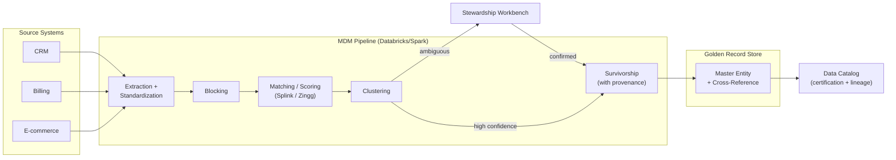
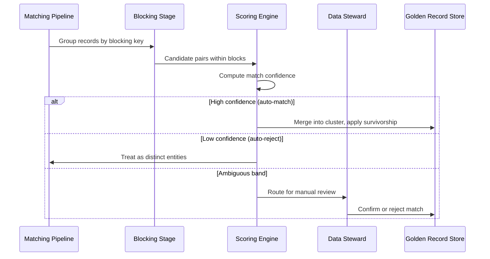
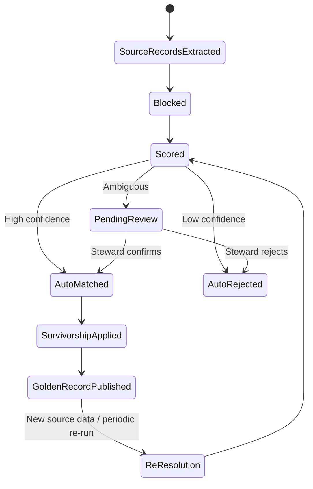

# Master Data Management

> Part of the **Enterprise Data & AI Architecture Handbook** · Phase-08 — Data Governance & Quality · Chapter 05.
> Estimated study time: **60 min reading + ~3h labs**.
> **Prerequisites:** read [Data Governance Foundations](01_Data_Governance_Foundations.md) first.

---

## Executive Summary

[Data Governance Foundations](01_Data_Governance_Foundations.md#core-concepts) established ownership, classification, and policy as the accountability layer for *any* dataset. **Master Data Management (MDM)** applies that accountability specifically to an organization's most duplicated, most disputed category of data: the core business entities — customers, products, suppliers, locations, employees — that nearly every system in the enterprise independently creates its own version of. Without MDM, "customer 47291" in the CRM, "cust-ACME-002" in the billing system, and "Acme Corp (dup)" in the support ticketing system are three different records for the same real-world entity, each partially correct, none authoritative, and no system able to answer "how many distinct customers do we actually have" without a manual reconciliation exercise.

This chapter covers MDM concretely: the three classic **MDM styles** (registry, consolidation, coexistence) and when each is appropriate; **entity resolution and matching** — the deterministic and probabilistic techniques that determine whether two records refer to the same real-world entity; **golden record survivorship** — the rule-based process that decides which of several conflicting attribute values (three different phone numbers for the same customer) becomes the trusted, published value; **reference data management** — the specific, simpler discipline of governing shared code lists and lookup values (country codes, currency codes, unit-of-measure tables) that every domain depends on; and the genuine, unresolved **tension between centralized MDM and federated data mesh** architectures, which pull toward opposite designs and require deliberate reconciliation rather than being treated as compatible by default.

The governing insight: **MDM is fundamentally an entity-resolution and conflict-resolution problem, and both are inherently probabilistic, not a solved, one-time technical task.** No matching algorithm achieves perfect precision and recall simultaneously, and no survivorship rule set resolves every conflict correctly on the first attempt — a production MDM program is a continuously tuned system with a human stewardship loop for low-confidence matches and disputed conflicts, not a "set once and forget" pipeline. Enterprises that treat MDM as a one-time data migration project rather than an ongoing operational capability inevitably regress to duplicate, drifting master data within a few years.

The bias remains **Azure-primary (~60%)** — Azure SQL/Purview Master Data Services patterns, Microsoft Purview's account-linking and Master Data Management-adjacent capabilities, and Azure Databricks/Synapse-hosted custom entity-resolution pipelines — **~30% enterprise open source** (Apache Spark-based matching pipelines, open-source entity-resolution libraries like Zingg and Splink, Neo4j for entity-relationship/golden-record graph modeling) and **~10% AWS/GCP comparison-only** (AWS Entity Resolution, GCP Dataplex/BigQuery-based matching approaches).

**Bottom line:** an MDM program succeeds when it produces a golden record more trustworthy than any single source system's version, and continuously incorporates new sources without a full re-architecture, and fails when it is deployed as a rigid, centralized bottleneck that domain teams route around by maintaining their own shadow master data — precisely the same failure mode identified for over-centralized governance in [Data Governance Foundations](01_Data_Governance_Foundations.md#case-studies). An architect who chooses the MDM style matched to the organization's actual entity-count, source-system-count, and domain-autonomy profile — and who designs survivorship and stewardship as an ongoing operational loop, not a migration checkbox — builds the shared entity foundation every downstream analytics and AI system depends on.

---

## Learning Objectives

By the end of this chapter you will be able to:

1. **Choose the correct MDM style** — registry, consolidation, or coexistence — matched to an organization's write-authority requirements and integration maturity.
2. **Design an entity resolution pipeline** using both deterministic (exact/rule-based) and probabilistic (fuzzy, ML-based) matching, and explain the precision/recall trade-off inherent in blocking and matching thresholds.
3. **Define golden record survivorship rules** that resolve attribute-level conflicts across source systems deterministically and auditably.
4. **Distinguish master data from reference data** and design a lighter-weight reference data management process appropriate to the latter's lower complexity.
5. **Reconcile the tension between centralized MDM and federated data mesh** architectures, choosing a hybrid pattern appropriate to the organization's governance operating model from [Data Governance Foundations](01_Data_Governance_Foundations.md#core-concepts).
6. **Design MDM change propagation** back to source systems and downstream consumers without violating each system's own write authority.
7. **Identify MDM anti-patterns** — treating MDM as a one-time migration, over-matching/under-matching, and golden records that silently go stale.
8. **Map a target MDM architecture onto Azure**, with an explicit, defensible comparison to AWS Entity Resolution and GCP's BigQuery-based matching approaches.

---

## Business Motivation

- **Duplicate customer/product records directly cost money.** Redundant marketing spend (mailing the same customer twice under two different IDs), inventory misstatement (the same product tracked under two SKUs across systems), and duplicated vendor payments (paying the same supplier twice because two vendor records weren't recognized as the same entity) are recurring, quantifiable losses that scale with an organization's number of source systems.
- **"How many customers do we have?" should have one answer, not five.** Divergent counts across CRM, billing, and support systems — each partially deduplicated, none authoritative — erode executive trust in reporting exactly as the divergent-metric-definition problem in [Data Governance Foundations](01_Data_Governance_Foundations.md#case-studies) does, but rooted in entity identity rather than metric definition.
- **Regulatory and risk-aggregation reporting requires a single, defensible customer/counterparty view.** Know Your Customer (KYC) and anti-money-laundering (AML) regulations specifically require financial institutions to resolve a customer's full relationship footprint across products and legal entities — a capability that is structurally impossible without entity resolution.
- **AI and ML systems trained on fragmented entity data inherit the fragmentation.** A churn-prediction model trained on customer data that treats one real customer as three separate, partial records will systematically under-count that customer's true engagement and value, directly degrading model accuracy in ways that are hard to diagnose without recognizing the entity-resolution root cause.
- **M&A integration speed depends directly on MDM maturity.** An acquiring organization's ability to merge an acquired company's customer/vendor/product master data into its own systems — rather than running duplicated, parallel master data indefinitely — is bounded by how mature its entity-resolution and survivorship processes already are.

---

## History and Evolution

- **1990s — Customer Data Integration (CDI) and Product Information Management (PIM) emerge as separate, domain-specific disciplines**, each addressing entity fragmentation for one specific master-data domain (customer, product) rather than a unified approach.
- **Early 2000s — "Master Data Management" is coined as the umbrella term** unifying CDI, PIM, and other domain-specific mastering efforts under one discipline, with vendors (IBM InfoSphere MDM, Informatica MDM, Oracle Customer Hub) building dedicated MDM platforms.
- **Mid-2000s — Registry, consolidation, and coexistence styles are formalized** (widely attributed to Gartner and vendor architecture patterns of the era) as the standard taxonomy for MDM architecture choices, a framework this chapter's Core Concepts still uses today because the underlying trade-offs haven't fundamentally changed.
- **2010s — Probabilistic and ML-based entity resolution matures**, moving beyond purely deterministic (exact-match, rule-based) matching toward statistical and later machine-learning-based similarity scoring, driven by the scale and messiness of big-data-era source systems that deterministic rules alone couldn't adequately match.
- **2010s — Microsoft's Master Data Services (MDS)** ships as part of SQL Server, bringing MDM capability into the mainstream enterprise data platform stack rather than requiring a dedicated, expensive standalone MDM suite.
- **2019-2020s — Data mesh's federated domain-ownership philosophy directly conflicts with classical, centralized MDM**, forcing the industry to confront (rather than ignore) the tension this chapter addresses explicitly in its own dedicated section — many organizations adopting data mesh discovered that entity mastering is one of the few capabilities that resists full decentralization.
- **2020s — Open-source entity-resolution tooling matures** (Zingg, Splink, and Spark-native matching libraries), making probabilistic entity resolution accessible without a proprietary MDM suite license, paralleling the broader shift toward open, composable data-platform tooling seen across this handbook.
- **2023-present — Cloud-native entity-resolution services emerge** (AWS Entity Resolution, launched 2023), reflecting the same platform-absorption trend already seen in cataloging and quality — though, notably, no fully equivalent fully-managed Azure service has emerged with the same dedicated positioning, making custom Databricks/Synapse-based pipelines (this chapter's Azure Implementation focus) the practical Azure-native pattern today.

---

## Why This Technology Exists

Every operational system in an enterprise independently creates its own record the first time it encounters a customer, product, or supplier, with no inherent mechanism to recognize that a *different* system already has a record for the same real-world entity — there is no universal, cross-system identifier for "this specific customer" the way there is, for example, a VIN for a specific vehicle. Left unaddressed, this produces an ever-growing number of partial, non-communicating representations of the same entities, each system's view slightly different and none complete. MDM exists to resolve this structural gap: to determine, across systems that were never designed to talk to each other, which records represent the same entity, and to produce one trusted, complete representation any system or analysis can rely on.

---

## Problems It Solves

- **"Is this the same customer?"** — entity resolution answers this across systems with no shared key, using name/address/attribute similarity rather than requiring a pre-existing common identifier.
- **"Which value is correct when three systems disagree?"** — golden record survivorship provides a deterministic, auditable rule (most recent, most trusted source, highest completeness) rather than an ad hoc, inconsistent choice made differently by every downstream consumer.
- **Duplicate spend and misstated inventory/counts** — a resolved, deduplicated master entity list directly eliminates the redundant marketing, duplicate payments, and inconsistent reporting counts described in this chapter's Business Motivation.
- **Regulatory KYC/AML entity resolution requirements** — a defensible, auditable entity-resolution and survivorship process is the concrete technical capability regulators expect to see demonstrated, not merely asserted.
- **A stable identifier for cross-system joins** — a published, resolved master entity ID gives every downstream system (analytics, ML feature pipelines, reporting) a stable join key that doesn't depend on any single source system's internal, potentially-changing identifier.

---

## Problems It Cannot Solve

- **It cannot resolve every match with certainty.** Entity resolution is fundamentally probabilistic for anything beyond exact-key matching; some fraction of matches will always require human review, and some fraction of true matches will always be missed (recall) while some false matches will always be incorrectly merged (precision) — no threshold tuning eliminates both simultaneously.
- **It cannot substitute for source-system data quality.** MDM resolves entities and reconciles conflicting attribute values across systems; it cannot fix a source system that captures fundamentally wrong data in the first place — that is the domain of [Data Quality with Great Expectations](03_Data_Quality_with_Great_Expectations.md) applied at the source.
- **It cannot fully decentralize without losing its core value proposition.** A "federated MDM" where every domain maintains its own independent golden record for the same entity type reproduces the exact fragmentation problem MDM exists to solve — some centralization of entity identity is structurally required, a tension this chapter addresses directly in [Governance](#governance).
- **It cannot stay accurate without ongoing stewardship.** A golden record's survivorship rules and match thresholds require continuous tuning as source systems and data patterns evolve; treating an initial MDM implementation as a completed, static project guarantees it drifts out of alignment with reality within a few years.
- **It cannot resolve organizational disputes about entity ownership by itself.** When two business units disagree about who "owns" the master definition of a shared customer, MDM tooling can surface the conflict; resolving it requires the escalation and governance authority from [Data Governance Foundations](01_Data_Governance_Foundations.md#governance).

---

## Core Concepts

### 8.1 MDM Styles: Registry, Consolidation, Coexistence

- **Registry style** — the MDM hub stores only a lightweight index (a cross-reference mapping each source system's local ID to a resolved master entity ID) without copying full attribute data into the hub itself; consuming systems query the registry to find related records but retrieve full data from the source systems directly. Lowest implementation cost and least disruptive to source systems, but does not provide a single queryable golden record with complete attributes — only a resolved identity mapping.
- **Consolidation style** — the MDM hub pulls full data from source systems, resolves entities, applies survivorship rules, and stores a complete golden record centrally, typically for analytical/reporting consumption. Source systems remain the systems of record for their own transactional data and are not required to write back to or read from the hub operationally, making this the least invasive style for source-system integration while still producing a genuine, queryable golden record.
- **Coexistence style** — the most invasive and highest-value style: the MDM hub becomes the authoritative system for master data, and source systems are updated to read (and sometimes write) master attributes from/to the hub directly, with changes propagated bidirectionally. This provides real-time, operationally-consumed golden records but requires meaningful integration work with every participating source system and the strongest governance authority to enforce.

The selection principle: **registry** for low-maturity organizations wanting a lightweight, fast-to-implement cross-reference; **consolidation** for organizations wanting a genuine golden record primarily for analytics/reporting without disrupting operational systems; **coexistence** only where the business value of real-time, operationally-authoritative master data justifies the substantially higher integration and governance investment.

### 8.2 Entity Resolution and Matching

Entity resolution determines whether two records from different (or the same) sources represent the same real-world entity, using a pipeline of stages:

- **Blocking** — reducing the astronomically large number of possible pairwise comparisons (comparing every record to every other record is O(n²) and infeasible at scale) by first grouping records into smaller "blocks" likely to contain true matches (e.g., same postal code, same first three letters of last name), then only comparing pairs within a block.
- **Matching** — comparing candidate pairs within each block using **deterministic rules** (exact match on a strong identifier like a tax ID or email, or an exact match on a normalized combination of fields) and/or **probabilistic/fuzzy matching** (similarity scoring across multiple weighted attributes — name similarity via edit distance or phonetic algorithms, address similarity, date-of-birth proximity — producing a composite match score).
- **Thresholding** — classifying each candidate pair's match score into **auto-match** (score high enough to merge automatically), **auto-non-match** (score low enough to confidently treat as distinct), and **manual review** (an ambiguous middle band routed to a human steward) — the size of this manual-review band is a direct, tunable trade-off between automation coverage and match accuracy.
- **Clustering** — grouping all records transitively matched to each other (A matches B, B matches C, therefore A/B/C form one cluster) into a single resolved entity, handling the common real-world case where no single pairwise comparison links every record in a cluster directly.

The precision/recall trade-off is unavoidable: loosening match thresholds increases recall (catching more true duplicates) at the cost of precision (incorrectly merging distinct entities — a materially worse failure mode in most enterprise contexts, since incorrectly merging two different customers' financial histories is harder to detect and unwind than failing to merge two records that should have been linked).

### 8.3 Golden Record Survivorship

Once records are resolved into a cluster, **survivorship rules** determine which value wins for each attribute when source records disagree — common strategies include:

- **Most recent** — the most recently updated source value wins, appropriate for volatile attributes like a phone number or address.
- **Most trusted source** — a pre-ranked hierarchy of source systems (e.g., the CRM is more trusted than a marketing list import for a customer's legal name) determines the winner regardless of recency.
- **Most complete/highest quality** — the value passing the most data-quality checks (per [Data Quality with Great Expectations](03_Data_Quality_with_Great_Expectations.md#core-concepts)) or with the fewest missing related fields wins.
- **Manual steward override** — for high-stakes or persistently disputed attributes, a human steward's explicit decision overrides any automated rule, recorded and auditable.

Survivorship must be **deterministic and auditable** — given the same set of conflicting source values, the same golden value must always result, and the golden record must retain provenance (which source and rule produced each surviving attribute value) so a downstream consumer or auditor can trace why a specific value was chosen.

### 8.4 Reference Data Management

**Reference data** — shared, relatively static code lists and lookup values (ISO country codes, currency codes, unit-of-measure tables, internal product-category taxonomies) — is a distinct, lighter-weight discipline from master data management proper. Reference data typically has far lower cardinality (hundreds or thousands of values, not millions of entity records), changes far less frequently, and rarely requires entity-resolution/matching at all — its governance challenge is instead **consistency and single-sourcing**: ensuring every system references the same authoritative code list version rather than maintaining independent, silently-diverging copies (a common failure mode: one system's currency-code table missing a newly-added currency that another system already supports). Reference data management is usually implemented as a simple, centrally-published, versioned lookup table distributed to consuming systems, rather than requiring an entity-resolution pipeline.

### 8.5 The MDM and Data Mesh Tension

Data mesh's federated domain-ownership model (from [Data Governance Foundations](01_Data_Governance_Foundations.md#core-concepts)) assigns each data domain autonomous ownership of its own data products — but a customer entity is, by definition, shared across many domains (sales, support, billing, marketing), none of which can unilaterally "own" the single true definition of that customer without recreating exactly the fragmentation MDM exists to prevent. The pragmatic reconciliation most mature data-mesh adopters converge on: treat **master data as its own first-class domain** (a "customer mastering" domain, a "product mastering" domain), owned by a dedicated cross-functional team accountable specifically for entity resolution and golden-record quality, publishing the resolved master entity as a well-defined data product other domains consume — rather than either (a) forcing every domain to independently re-resolve entities (reproducing fragmentation) or (b) reverting to a fully centralized, monolithic MDM team that becomes the same kind of bottleneck data mesh was adopted to eliminate. This is a genuine architectural compromise, not a fully resolved tension — the mastering domain still requires more centralized authority than a typical mesh domain, and organizations should explicitly acknowledge this rather than pretend MDM fits cleanly into a fully decentralized model.

---

## Internal Working

A production MDM pipeline (consolidation-style, the most common pattern) executes this sequence on each run:

1. **Source extraction** — records are extracted from participating source systems (CRM, ERP, billing), each retaining its source-system identifier and a reference to its originating system.
2. **Standardization/cleansing** — attributes are normalized (address standardization, name casing, phone-number formatting) before matching, since inconsistent formatting is one of the most common causes of missed matches that have nothing to do with the underlying entities actually being different.
3. **Blocking** — records are grouped into candidate blocks using a blocking key (e.g., normalized postal code plus first-letter-of-surname) to make pairwise comparison computationally tractable.
4. **Matching and scoring** — candidate pairs within each block are scored using deterministic and/or probabilistic rules, producing a match-confidence score per pair.
5. **Clustering and thresholding** — scored pairs are clustered into resolved entity groups, with high-confidence clusters auto-merged, low-confidence pairs auto-rejected, and ambiguous-band pairs routed to a **stewardship queue** for human review.
6. **Survivorship** — for each auto-merged or steward-confirmed cluster, survivorship rules resolve conflicting attribute values into a single golden record, retaining provenance metadata.
7. **Publication** — the golden record is published to consuming systems/analytics platforms, along with the cross-reference mapping back to each contributing source system's original identifier (the registry-style mapping is typically retained even in a consolidation-style implementation, since downstream systems often need to trace a golden record back to its sources).
8. **Feedback and re-tuning** — steward decisions on ambiguous matches feed back into match-threshold tuning over time (a steward consistently confirming matches just below the current auto-match threshold is a signal the threshold may be set too conservatively).

---

## Architecture

An MDM architecture separates four concerns: an **ingestion/standardization layer** pulling and cleansing data from source systems; a **matching engine** (the blocking/scoring/clustering pipeline, typically implemented on distributed compute like Spark for scale); a **survivorship and golden-record store** holding the resolved, published entity data with full provenance; and a **stewardship workbench** — the human-in-the-loop UI where stewards review ambiguous matches and disputed survivorship decisions, which is not an optional add-on but a first-class, permanently-staffed operational component, since (per [Core Concepts §8.2](#core-concepts)) some fraction of matches will always require human judgment. The architectural property that most determines long-term MDM success: whether the stewardship workbench is genuinely integrated into a team's ongoing operational workflow (with clear ownership and SLA for reviewing the queue) or bolted on as an afterthought that accumulates an ever-growing, ignored backlog — the latter is one of the most common reasons MDM programs quietly degrade after their initial launch.

---

## Components

- **Source connectors** — extraction from CRM, ERP, billing, and other systems contributing entity records.
- **Standardization/cleansing engine** — address, name, and phone normalization prior to matching.
- **Matching/entity-resolution engine** — blocking, scoring, and clustering logic (custom Spark pipeline, or a library like Splink/Zingg).
- **Survivorship rule engine** — deterministic conflict-resolution logic producing golden records with provenance.
- **Golden record store** — the published, queryable master entity repository.
- **Cross-reference/registry mapping** — the source-system-ID-to-master-ID index, retained regardless of MDM style.
- **Stewardship workbench** — the human-review UI for ambiguous matches and disputed attribute conflicts.
- **Change propagation/publication layer** — the mechanism (API, event stream, or scheduled export) delivering golden records and updates to consuming systems.

---

## Metadata

MDM's metadata requirements build directly on [Data Catalog and Lineage](02_Data_Catalog_and_Lineage.md#metadata): a golden record's **provenance metadata** (which source contributed each surviving attribute value, which survivorship rule applied) is a specialized, MDM-specific form of lineage — column-level lineage tracing not just "this value derives from that pipeline" but "this specific attribute value survived because source X was ranked more trusted than source Y for this attribute type." This provenance must be captured and queryable, not just the final golden value, since disputing or auditing a golden record's correctness requires being able to answer "why does this record say the customer's address is X" precisely.

---

## Storage

Golden records are typically stored in a queryable relational or document store (Azure SQL, Cosmos DB, or a Delta table for analytical consumption) indexed by the master entity ID, with the cross-reference/registry mapping stored either alongside or in a dedicated lightweight lookup table. Entity-relationship-heavy master data (e.g., organizational hierarchies, household/family relationships between customer entities) is sometimes additionally modeled in a graph database (**Neo4j**) where the relationship structure itself — not just individual entity attributes — is a first-class query concern, such as resolving "all entities related to this customer within two degrees" for a KYC/AML use case.

---

## Compute

Entity-resolution matching is the dominant MDM compute cost: blocking and pairwise scoring across large entity populations is naturally parallelizable and typically implemented on **Apache Spark** (via Databricks/Synapse), with compute cost scaling primarily with block size (poorly-chosen blocking keys that produce very large blocks defeat blocking's purpose and can make matching computationally prohibitive) rather than with total record count directly. Probabilistic/ML-based matching (training or scoring a similarity model) adds a further, generally smaller compute increment on top of rule-based deterministic matching.

---

## Networking

MDM pipelines connect to numerous source systems, several of which may hold sensitive customer/financial data — extraction connectivity should use **private endpoints** and managed identities consistent with the networking guidance in [Data Governance Foundations](01_Data_Governance_Foundations.md#networking) and [Data Catalog and Lineage](02_Data_Catalog_and_Lineage.md#networking), and the stewardship workbench (which surfaces sensitive customer PII for manual review) should be accessible only through the organization's standard internal, authenticated network path.

---

## Security

Golden records concentrate an unusually rich, cross-system view of a customer or entity's full attribute set in one place — a security compromise of the MDM golden-record store is potentially more damaging than a compromise of any single source system, since it aggregates data an attacker would otherwise need to breach multiple systems to assemble. Access to the golden-record store and the stewardship workbench must be scoped tightly (least privilege, per-attribute masking for highly sensitive fields where feasible) and audited, and the classification tier applied should reflect the *aggregated* sensitivity of the golden record, not merely the highest classification of any single contributing source.

---

## Performance

Real-time (coexistence-style) MDM lookups must meet the latency expectations of the operational systems consuming them (e.g., a call-center CRM screen-pop needing a resolved customer view in under a second) — a materially different performance requirement than a batch, analytics-oriented consolidation-style pipeline that can tolerate hours of processing latency. Blocking-key design is the primary lever for both correctness and performance: overly broad blocking keys produce large blocks that are both slow to process and prone to missed matches if the key is poorly chosen relative to actual data patterns.

---

## Scalability

Matching pipeline scalability is bounded primarily by blocking effectiveness, not raw record count — a well-designed blocking strategy keeps the pairwise-comparison workload roughly linear in total record count even as the entity population grows into the tens of millions, while a poor blocking strategy degrades toward the infeasible O(n²) worst case. Stewardship workbench scalability is a *human* capacity constraint, not a technical one: as source-system count and data volume grow, the ambiguous-match review queue grows proportionally unless match-threshold tuning and blocking precision improve correspondingly — a program that adds source systems faster than it invests in stewardship capacity accumulates a growing, unreviewed backlog exactly as an under-resourced governance council does (per [Data Governance Foundations](01_Data_Governance_Foundations.md#scalability)).

---

## Fault Tolerance

An MDM matching run that fails partway through should be resumable from a checkpoint rather than requiring a full re-run from scratch, particularly for large entity populations where a full matching pass can take hours. Golden record publication should be versioned (not simply overwritten) so a bad survivorship-rule change or a matching-pipeline defect that corrupts golden records can be identified and rolled back to the last-known-good version rather than propagating silently to every downstream consumer.

---

## Cost Optimization

The dominant MDM cost is the Spark/Databricks compute consumed by matching runs, scaling with source-record volume and blocking efficiency, plus the ongoing steward headcount required to work the ambiguous-match review queue. **Worked FinOps example:** a full nightly matching run across 5 million customer records using a Databricks job cluster (8 nodes, Standard_DS4_v2, roughly $0.60/node-hour blended) completing in 3 hours costs roughly 8 × 3 × $0.60 ≈ $14.40/night (~$430/month) — modest in isolation, but a poorly-designed blocking key inflating the effective comparison workload 10x (a common real-world failure mode when a blocking key like "same last name" is too broad for a common-surname population) can push the same job to 30+ hours and correspondingly ~10x the compute cost, illustrating that blocking-key design, not cluster sizing, is the primary FinOps lever for MDM matching workloads specifically.

---

## Monitoring

Track: **match precision/recall against a periodically-audited sample** (are auto-matches and auto-non-matches actually correct, verified by spot-checking a sample against manual review); **stewardship queue size and age** (a growing, aging queue signals under-resourced stewardship capacity or overly conservative thresholds pushing too many pairs into manual review); **golden record churn rate** (how often survived attribute values change, since an unexpectedly volatile golden record for an attribute that should be stable, like a legal entity name, may indicate a survivorship rule or source-data-quality problem); and **downstream consumer sync lag** (how current is each consuming system's copy of the golden record relative to the latest resolution run).

---

## Observability

Observability for an MDM program means being able to answer, for any given golden record, *which sources contributed, which survivorship rule won for each attribute, and when was this record last resolved or steward-reviewed* — without a manual investigation. This requires the provenance metadata from [Metadata](#metadata) to be genuinely queryable (not just logged and forgotten), and the stewardship workbench's decision history to be linked directly to the golden records it affected, so a dispute or audit can trace a specific value back to a specific human decision or automated rule.

---

## Governance

MDM governance directly extends [Data Governance Foundations](01_Data_Governance_Foundations.md#governance): a golden record needs an accountable **data owner** (typically the mastering domain team described in [Core Concepts §8.5](#core-concepts)) and **stewards** who work the ambiguous-match queue and adjudicate disputed survivorship decisions, following the same RACI discipline established in that chapter. MDM-specific governance additions: a **survivorship rule change-review process** (changing which source is "most trusted" for a given attribute is a high-impact decision affecting every downstream consumer, and should go through the same reviewed-change discipline as an Expectation Suite update in [Data Quality with Great Expectations](03_Data_Quality_with_Great_Expectations.md#design-patterns)), and an explicit **mastering-domain charter** documenting the negotiated authority boundary between the mastering team and the individual business domains it serves, directly addressing the data-mesh tension from [Core Concepts §8.5](#core-concepts).

**ADR Example — Consolidation Style Over Coexistence for Initial MDM Rollout:**

> **Context:** A retail enterprise with CRM, e-commerce, and billing systems each maintaining independent, partially-overlapping customer records needed to resolve a persistent "how many customers do we have" reporting discrepancy, but had no existing integration maturity or governance authority to mandate that operational systems change how they read/write customer data.
> **Decision:** Implement **consolidation-style** MDM: extract and resolve customer entities from all three source systems into a centrally-published golden record used for analytics, reporting, and marketing segmentation, explicitly deferring coexistence-style (bidirectional, operationally-authoritative) integration to a later phase contingent on demonstrated value and organizational readiness.
> **Consequences:** Reporting and marketing use cases gained a trustworthy, single customer view within the initial rollout timeline without requiring any changes to the CRM, e-commerce, or billing systems' own operational behavior; the three source systems remained independently authoritative for their own operational data, meaning a customer's address updated in the CRM would not automatically appear in the e-commerce system until a future coexistence-style phase — an explicitly accepted limitation given the initial use case (reporting) did not require real-time operational consistency.
> **Alternatives considered:** (1) Coexistence style from the outset — rejected as requiring integration work and governance authority across three independently-owned systems the organization was not yet positioned to mandate; (2) Registry style only — rejected as insufficient for the marketing segmentation use case, which required actual resolved attribute values (a genuine golden record), not merely a cross-reference index; (3) Do nothing and continue manual reconciliation — rejected given the recurring, quantified cost of the existing reporting discrepancy.

---

## Trade-offs

- **Registry vs. consolidation vs. coexistence**: registry is cheapest and least disruptive but provides no real golden record; consolidation provides a genuine golden record for analytics without disrupting operational systems; coexistence provides real-time operational value but at substantially higher integration and governance cost.
- **Deterministic vs. probabilistic matching**: deterministic rules are precise and explainable but miss matches lacking an exact shared key; probabilistic matching catches more true duplicates but introduces tunable, never-fully-eliminable false-positive/false-negative trade-offs.
- **Centralized MDM vs. federated data mesh**: centralized MDM produces the most consistent single golden record but risks becoming the same bottleneck any over-centralized function does; a fully federated approach preserves domain autonomy but reproduces the entity-fragmentation problem MDM exists to solve — the mastering-domain compromise in [Core Concepts §8.5](#core-concepts) is a deliberate middle ground, not a clean resolution.

---

## Decision Matrix

| Criterion | Registry | Consolidation | Coexistence |
|---|---|---|---|
| Implementation cost | Low | Moderate | High |
| Disruption to source systems | Minimal | Minimal (read-only extraction) | Significant (bidirectional integration) |
| Provides a queryable golden record | No (index only) | Yes | Yes |
| Real-time operational consistency | No | No (batch/periodic) | Yes |
| Governance authority required | Low | Moderate | High |
| Best fit | Early-maturity orgs wanting a lightweight cross-reference | Analytics/reporting-focused customer 360 initiatives | High-value, operationally-critical entities (e.g., regulated KYC customer view) |

---

## Design Patterns

- **Mastering-as-a-domain** — treating entity mastering as its own first-class data-mesh domain with a dedicated, accountable team, per [Core Concepts §8.5](#core-concepts), rather than either full centralization or full federation.
- **Tiered match confidence with stewardship queue** — auto-match/auto-reject/manual-review banding, ensuring human judgment is reserved for genuinely ambiguous cases rather than either fully automating (accepting more errors) or fully manual review (unsustainable at scale).
- **Survivorship with provenance** — every golden attribute value traceable to its source and rule, enabling audit and dispute resolution.
- **Registry mapping retained regardless of style** — even consolidation/coexistence implementations retain the source-to-master cross-reference index, since downstream systems routinely need to trace a golden record back to its contributing sources.
- **Incremental style progression** — starting with registry or consolidation and progressing to coexistence only for entities where the added value clearly justifies the added integration and governance cost (as in this chapter's ADR).

---

## Anti-patterns

- **Treating MDM as a one-time migration project** — implementing an initial matching and survivorship pass with no ongoing stewardship capacity or threshold-tuning process, guaranteeing the golden record drifts out of alignment with reality within a few years as source systems and data patterns evolve.
- **Over-matching (too aggressive thresholds)** — auto-merging records with insufficient confidence, incorrectly combining distinct entities' histories in a way that is difficult to detect and even more difficult to safely unwind after the fact.
- **Under-matching (too conservative thresholds)** — leaving too many true duplicates unresolved, providing only marginal improvement over the pre-MDM fragmented state while still incurring the full cost of running the program.
- **An ignored stewardship queue** — building a stewardship workbench but never staffing or SLA-ing its review process, producing an ever-growing backlog of unresolved ambiguous matches that undermines confidence in the golden record's completeness.
- **Fully centralizing MDM in an otherwise federated data-mesh organization** without an explicit mastering-domain charter, reproducing the over-centralization bottleneck pattern from [Data Governance Foundations](01_Data_Governance_Foundations.md#anti-patterns) specifically for entity mastering.

---

## Common Mistakes

- Choosing coexistence style for an initial rollout when the organization lacks the integration maturity or governance authority to execute it, resulting in a stalled, over-scoped program (the registry/consolidation-first progression in this chapter's ADR exists specifically to avoid this).
- Designing blocking keys without validating them against the actual data's distribution (e.g., a common-surname population defeating a "same surname" blocking key), producing either missed matches or prohibitively expensive matching runs.
- Failing to capture survivorship provenance, making it impossible to explain or dispute a golden record's specific attribute values after the fact.
- Ignoring reference data management as "too simple to bother governing," allowing silently diverging code-list copies across systems to produce subtle downstream join and reporting errors.
- Underinvesting in stewardship capacity relative to source-system growth, allowing the ambiguous-match queue to grow unboundedly.

---

## Best Practices

- Start with registry or consolidation style, progressing to coexistence only for the specific entities and use cases where operational, real-time consistency demonstrably justifies the added integration cost.
- Validate blocking-key choices against actual production data distributions before a full-scale matching run, not merely against a small test sample that may not reflect real-world skew (e.g., surname commonality).
- Capture and expose survivorship provenance as a first-class, queryable part of the golden record, not an internal implementation detail.
- Establish a mastering-domain charter explicitly negotiating authority boundaries with individual business domains, directly addressing the data-mesh tension rather than leaving it unresolved and prone to future conflict.
- Continuously monitor match precision/recall via periodic sampled audits and feed steward decisions back into threshold tuning, treating MDM as a continuously operated capability rather than a completed project.

---

## Enterprise Recommendations

- Sequence entity domains by business value and duplication severity — typically customer first (given the direct marketing/reporting cost of duplication), then product, then supplier/vendor — rather than attempting to master every entity domain simultaneously.
- Budget permanent stewardship headcount as part of the program's ongoing operating cost, not a one-time implementation line item, recognizing per [Core Concepts §8.2](#core-concepts) that some fraction of matches will permanently require human judgment.
- Formalize the mastering-domain charter and its relationship to the broader governance operating model from [Data Governance Foundations](01_Data_Governance_Foundations.md#enterprise-recommendations) as an explicit governance artifact, not an implicit assumption.

---

## Azure Implementation

- **Azure Databricks / Synapse Spark** is the primary compute engine for custom entity-resolution pipelines — implementing blocking, probabilistic matching (via libraries like Zingg or Splink, both Spark-native), and clustering at scale against source data landed in ADLS Gen2/Delta tables.
- **SQL Server / Azure SQL Master Data Services (MDS)** provides a mature, if dated, out-of-the-box MDM capability (hierarchies, business rules, a stewardship UI) for organizations wanting a lower-code, Microsoft-native MDM platform rather than a fully custom Spark pipeline — a reasonable choice for simpler, lower-entity-count master data domains.
- **Microsoft Purview** integrates with the golden record store to publish resolved master entities into the catalog (from [Data Catalog and Lineage](02_Data_Catalog_and_Lineage.md)), giving the golden record the same discoverability, classification, and certification treatment as any other governed dataset.
- **Azure Cosmos DB** is a common choice for the golden-record store itself when consuming applications need low-latency, globally-distributed lookups (a coexistence-style, operationally-consumed golden record), while a **Delta table** is more appropriate for a consolidation-style, analytics-oriented golden record.
- Example: a Spark-based blocking and matching step using Splink on Databricks:

```python
from splink import Linker, SparkAPI
import splink.comparison_library as cl

settings = {
    "link_type": "dedupe_only",
    "blocking_rules_to_generate_predictions": [
        "l.postal_code = r.postal_code",
        "l.dob = r.dob",
    ],
    "comparisons": [
        cl.jaro_winkler_at_thresholds("full_name", [0.9, 0.7]),
        cl.exact_match("email"),
        cl.levenshtein_at_thresholds("phone", 2),
    ],
}

linker = Linker(customer_df, settings, db_api=SparkAPI(spark_session=spark))
predictions = linker.predict(threshold_match_probability=0.85)
```

---

## Open Source Implementation

- **Splink** (originated at the UK Ministry of Justice, now widely adopted) provides Spark/DuckDB/SQLite-backed probabilistic record linkage with a well-documented, statistically-grounded matching model (Fellegi-Sunter), making it a strong choice for teams wanting rigorous, explainable probabilistic matching without a proprietary MDM suite.
- **Zingg** is a Spark-native, ML-assisted entity-resolution library specifically designed for enterprise-scale deduplication and matching, with an active-learning workflow that incorporates steward feedback to improve matching over time — directly implementing this chapter's feedback-loop recommendation from [Internal Working](#internal-working).
- **Neo4j** is commonly used as the golden-record store specifically for entity domains where relationship structure (household groupings, corporate hierarchies, KYC relationship networks) is itself a first-class query concern beyond individual entity attributes.
- **Apache Spark** underlies most custom, at-scale matching pipelines (whether built directly or via Splink/Zingg), given entity resolution's naturally parallelizable blocking-and-scoring workload.

---

## AWS Equivalent (comparison only)

AWS's direct equivalent is **AWS Entity Resolution** (launched 2023), a managed service providing rule-based and ML-based matching (including a pre-built ML matching workflow requiring no custom model training) directly integrated with data in S3/Glue. **Advantages:** a genuinely managed, lower-operational-overhead service purpose-built for entity resolution, notably more mature as a dedicated managed offering than anything currently available natively on Azure. **Disadvantages:** newer and less battle-tested at extreme scale than Spark-based custom pipelines (Splink/Zingg), and tightly coupled to the AWS data ecosystem (S3/Glue) rather than portable. **Migration strategy:** re-implement blocking/matching rules from a Splink/Zingg-based Azure pipeline into AWS Entity Resolution's rule/ML matching configuration; golden-record storage and survivorship logic typically require separate implementation regardless, since AWS Entity Resolution focuses specifically on the matching step, not full end-to-end golden-record management. **Selection criteria:** AWS-primary organizations wanting a managed, lower-maintenance matching service will find AWS Entity Resolution compelling and notably ahead of Azure's native managed-service offering in this specific space; Azure-primary or multi-cloud organizations will find a Databricks/Splink or Zingg-based custom pipeline the more practical, portable choice today.

---

## GCP Equivalent (comparison only)

GCP has no single dedicated, fully-managed entity-resolution service directly comparable to AWS Entity Resolution; the common pattern is a **BigQuery-based matching approach** using BigQuery ML's clustering/similarity functions or a custom Dataflow (Apache Beam)-based pipeline implementing blocking and scoring logic similar to a Spark-based approach. **Advantages:** tight native integration with BigQuery for organizations already centralizing analytical data there, and Dataflow's autoscaling handles variable matching workload volume well. **Disadvantages:** requires substantially more custom engineering than AWS's purpose-built managed service, comparable in effort to a custom Spark/Splink-based Azure pipeline rather than being meaningfully simpler. **Migration strategy:** port Spark-based blocking/matching logic to Dataflow/Beam or BigQuery ML equivalents; golden-record storage typically moves to BigQuery or a dedicated operational store depending on consumption pattern. **Selection criteria:** BigQuery-centric organizations may find a native BigQuery ML approach convenient for simpler matching needs; organizations with complex, large-scale matching requirements will likely still build a custom Dataflow/Beam pipeline comparable in effort to the Azure/Spark approach described in this chapter.

---

## Migration Considerations

- **From no MDM to registry style**: start by publishing a simple, low-risk cross-reference index for the highest-duplication entity domain (typically customer) before investing in full consolidation, validating matching accuracy on a smaller, lower-stakes use case first.
- **From consolidation to coexistence style**: treat this as a phased, per-source-system integration effort, prioritizing the source systems with the highest operational value from real-time master-data consistency, rather than attempting a simultaneous cutover across every participating system.
- **From a fully centralized MDM team to a mastering-domain model within a broader data mesh adoption**: formalize the mastering-domain charter explicitly before dissolving the prior centralized team's authority, to avoid a governance gap where entity mastering temporarily has no clear accountable owner during the transition.
- **Between matching libraries/platforms (e.g., a proprietary MDM suite to Splink/Zingg on Databricks)**: expect to re-tune match thresholds and re-validate precision/recall against a labeled sample post-migration, since different matching algorithms' score distributions are not directly comparable even when nominally targeting the same match confidence.

---

## Mermaid Architecture Diagrams

**Consolidation-style MDM architecture:**



**Entity resolution matching sequence:**



**Golden record lifecycle state diagram:**



---

## End-to-End Data Flow

1. Nightly extraction pulls customer records from the CRM, billing, and e-commerce systems, each retaining its source-system identifier.
2. Standardization normalizes name casing, address formatting, and phone-number formats across all three sources before matching begins.
3. Blocking groups records by normalized postal code and first-three-letters-of-surname, reducing the comparison workload from a theoretical several-trillion pairs (for a multi-million-record population) to a computationally tractable set.
4. Splink-based probabilistic matching scores candidate pairs within each block; a pair with matching email and 92% name similarity is auto-matched, while a pair with similar name but differing address is routed to the stewardship queue.
5. A data steward reviews the ambiguous pair, confirms it represents the same customer (a recent house move explains the address discrepancy), and the pipeline applies survivorship rules — the CRM's more-recently-updated address wins, while the billing system's verified tax ID (a stronger identifier) is retained regardless of recency.
6. The resulting golden record is published to the golden-record store with full provenance, registered in the catalog from [Data Catalog and Lineage](02_Data_Catalog_and_Lineage.md) with a certification signal reflecting the passing quality and match-confidence state, and made available to downstream marketing segmentation and reporting consumers with a stable master customer ID.

---

## Real-world Business Use Cases

- **A financial services firm's KYC/AML customer view**: coexistence-style MDM resolving customer identities across retail banking, wealth management, and commercial lending systems provided the unified relationship view required for regulatory AML monitoring, directly satisfying an examination requirement that had previously relied on slow, manual cross-system reconciliation.
- **A retail company's marketing deduplication**: consolidation-style customer mastering eliminated an estimated double-digit percentage of redundant marketing mailings previously sent to the same customer under multiple unresolved source-system identities, a directly quantifiable cost reduction.
- **A manufacturing enterprise's supplier consolidation post-acquisition**: registry-style MDM provided a fast, low-disruption cross-reference between the acquiring and acquired company's independently-maintained supplier master lists, enabling consolidated spend analysis within weeks rather than waiting for a full system consolidation.

---

## Industry Examples

- **Gartner's** registry/consolidation/coexistence taxonomy (formalized in the mid-2000s) remains the industry-standard framework for MDM architecture decisions, still directly referenced in this chapter's Core Concepts.
- **The UK Ministry of Justice's** development and open-sourcing of **Splink** brought rigorous, statistically-grounded (Fellegi-Sunter model) probabilistic record linkage to a wide industry audience beyond its original public-sector use case.
- **Major financial institutions'** KYC/AML entity-resolution programs are widely cited (in regulatory guidance and industry conference talks) as the most mature, highest-stakes production examples of coexistence-style MDM, given the direct regulatory consequence of an incomplete customer relationship view.
- **Amazon's** development of AWS Entity Resolution reflects the same broader industry trend already observed in cataloging and quality: cloud vendors absorbing previously bespoke, engineering-heavy capabilities into managed services.

---

## Case Studies

**Case Study 1 — Over-Aggressive Matching Merging Two Distinct Customers.** A telecommunications company's newly deployed MDM pipeline, tuned with an overly permissive match threshold to maximize apparent deduplication rates for an executive demo, incorrectly merged two different customers who happened to share a common name and live in the same apartment complex (a shared postal code, satisfying the blocking key, plus a moderate name-similarity score that crossed the auto-match threshold). The merge silently combined the two customers' billing histories, resulting in one customer receiving the other's overdue-payment collections notice — a customer-trust incident that took weeks to fully unwind because the erroneous merge had already propagated to the CRM and billing systems before being detected. The remediation tightened the auto-match threshold and added a mandatory manual-review step for any match relying primarily on name-plus-address similarity without a corroborating strong identifier (email or tax ID), explicitly trading a higher manual-review volume for a much lower false-merge rate given the demonstrated cost asymmetry.

**Case Study 2 — An Abandoned Stewardship Queue Undermining Program Credibility.** A healthcare provider's MDM program launched with an initial, well-tuned matching pipeline, but no dedicated steward headcount was allocated post-launch — the ambiguous-match review queue was assigned as an unofficial "extra duty" to an already-fully-loaded data analyst. Within six months, the queue had grown to over 10,000 unreviewed candidate matches, and the golden record's completeness (the percentage of true duplicates actually resolved) stagnated well below its initial post-launch level, since new ambiguous matches continued accumulating without review. Executive sponsors, reviewing the growing queue during a program review, concluded the initiative had failed — the actual root cause was a stewardship-capacity planning gap, not a matching-technology failure, and the eventual remediation (allocating two dedicated part-time steward roles with a queue-age SLA) restored confidence within one quarter.

---

## Hands-on Labs

1. **Implement a blocking strategy** for a sample customer dataset (postal code plus surname prefix), and measure the reduction in pairwise comparisons versus a naive all-pairs approach.
2. **Build a Splink-based matching pipeline** against a sample dataset with known duplicate pairs (a labeled test set), tuning thresholds and measuring precision/recall against the known-correct labels.
3. **Design a survivorship rule set** for a hypothetical customer entity with at least four attributes, specifying the rule (most recent / most trusted source / most complete) for each and justifying the choice.
4. **Build a stewardship queue simulation**: given a set of ambiguous-band match scores, design a review workflow and process a sample queue, measuring average time-to-review.
5. **Design a mastering-domain charter** for a hypothetical data-mesh organization, explicitly documenting the authority boundary between the mastering team and individual business domains.

---

## Exercises

1. A colleague argues "we should set match thresholds as loose as possible to maximize deduplication." Using Case Study 1, explain the specific business risk this creates and how you would push back.
2. Design a blocking key for a supplier/vendor entity domain, explaining why a naive "exact company name match" blocking key would likely produce poor results.
3. Critique an MDM program with a technically excellent matching pipeline but no allocated stewardship headcount, using Case Study 2 to explain the likely outcome.
4. Explain the specific compromise the "mastering-as-a-domain" pattern represents in a data mesh architecture, and why a fully federated approach to entity mastering doesn't work.
5. Design a golden-record provenance schema (what fields would you capture) sufficient to answer "why does this record say the customer's address is X" for any given attribute.

---

## Mini Projects

- **End-to-End Entity Resolution Pipeline**: build a small pipeline (using Splink or Zingg) against a synthetic dataset with known, labeled duplicates, including blocking, matching, clustering, and survivorship stages, measuring precision/recall against the ground truth.
- **Reference Data Consistency Checker**: build a small script that compares a shared reference data table (e.g., currency codes) across two mock "systems" and flags any divergence, illustrating the reference-data consistency risk from [Core Concepts §8.4](#core-concepts).
- **Stewardship Workbench Prototype**: design and build a minimal UI (even a simple web form or notebook widget) presenting ambiguous match candidates side-by-side for a steward decision, logging the decision with a timestamp and rationale.

---

## Capstone Integration

This chapter's entity-resolution and survivorship patterns produce the trusted, deduplicated master entities that [Data Catalog and Lineage](02_Data_Catalog_and_Lineage.md) catalogs and certifies, that [Data Quality with Great Expectations](03_Data_Quality_with_Great_Expectations.md) validates on an ongoing basis, and that [Data Contracts](07_Data_Contracts.md) can reference as a stable, contractually-guaranteed entity identifier for downstream consumers. The mastering-as-a-domain pattern directly resolves the data-mesh tension that recurs throughout this handbook's federated governance discussions. In the handbook's capstone (Phase-20), the MDM architecture built here demonstrates that the capstone reference platform can provide one trusted, auditable view of its core business entities even across a deliberately heterogeneous, multi-source reference architecture.

---

## Interview Questions

1. What are the three classic MDM styles, and what is the key difference between them?
   **A:** Registry (a lightweight cross-reference index only, no centralized golden record), consolidation (a genuine, centrally-stored golden record for analytics, without disrupting source systems' operational behavior), and coexistence (source systems read/write master data from a centrally-authoritative hub in real time) — they differ primarily in how much of the golden record is centrally stored and how tightly source systems are integrated.
2. Why is entity resolution inherently probabilistic rather than a solved, deterministic problem?
   **A:** Beyond exact-key matching, determining whether two records represent the same real-world entity requires comparing imperfect, differently-formatted attributes (names, addresses) with inherent ambiguity — no threshold can simultaneously achieve perfect precision (never merging distinct entities) and perfect recall (never missing a true duplicate), so some fraction of matches will always require human judgment.
3. What is golden record survivorship, and why must it be deterministic and auditable?
   **A:** Survivorship is the rule-based process of choosing which source's value wins when records disagree on an attribute; it must be deterministic (same inputs always produce the same output) and auditable (with retained provenance) so downstream consumers and auditors can trust and explain why a golden record contains a specific value.
4. How does master data differ from reference data?
   **A:** Master data (customers, products, suppliers) requires entity resolution/matching across systems with no shared key and typically has high cardinality; reference data (country codes, currency codes) is lower-cardinality, more static, and its governance challenge is mainly ensuring consistent, single-sourced distribution rather than matching/deduplication.
5. Why does data mesh's federated domain-ownership model create tension with traditional MDM?
   **A:** A shared entity like "customer" spans multiple domains, none of which can unilaterally own its single true definition without reproducing exactly the fragmentation MDM exists to prevent — some centralization of entity identity is structurally necessary, which conflicts with data mesh's preference for full domain autonomy.

---

## Staff Engineer Questions

1. Your MDM pipeline's blocking key is producing very large blocks for a subset of common surnames, making matching runs prohibitively slow. How do you diagnose and fix this?
   **A:** Analyze the actual data distribution to identify which blocking-key values produce oversized blocks, then introduce a composite or secondary blocking key (e.g., surname plus postal code plus date-of-birth range) specifically for the problematic high-frequency values, rather than loosening blocking globally, which would reintroduce the performance problem the blocking key exists to prevent.
2. A steward reports that roughly 40% of matches they review just below the current auto-match threshold turn out to be correct. What does this signal, and what would you do?
   **A:** This signals the auto-match threshold may be set too conservatively, unnecessarily routing likely-correct matches to manual review; feed this observation into a threshold-tuning review, ideally validated against a larger labeled sample before adjusting the production threshold, since a single steward's informal observation isn't sufficient statistical evidence on its own.
3. How would you design golden-record versioning so a bad survivorship-rule change can be safely rolled back without re-running the entire matching pipeline?
   **A:** Store golden records as immutable, timestamped versions (rather than overwriting in place) with the specific survivorship-rule version that produced each, so a rollback can revert to the prior golden-record version directly; a full re-match would only be needed if the underlying matching/clustering (not just survivorship) logic was what changed.

---

## Architect Questions

1. Design an MDM rollout for a newly-merged organization with two independent CRM systems, given a mandate to produce a unified customer view within one quarter while minimizing operational disruption.
   **A:** Start with registry-style MDM as an immediate, low-disruption cross-reference between the two CRMs, layering consolidation-style golden-record production for reporting/marketing use cases within the quarter, and explicitly defer coexistence-style bidirectional integration to a later phase — matching this chapter's ADR's incremental-style-progression pattern given the one-quarter timeline constraint.
2. How would you reconcile a data-mesh transformation initiative's push for full domain autonomy with the organization's existing centralized MDM team?
   **A:** Formalize the existing MDM team into an explicit "mastering domain" with a documented charter defining its authority boundary (it owns entity resolution/golden-record production for shared entities; individual domains retain autonomy over their own domain-specific data), avoiding both a disruptive full centralization rollback and an ungoverned full decentralization that would reproduce entity fragmentation.
3. A business unit insists their locally-maintained customer list is more accurate than the centrally-published golden record and wants to opt out of consuming it. How do you respond architecturally and governance-wise?
   **A:** Treat this as a legitimate signal to investigate — the business unit's list may reveal a genuine match-threshold or survivorship-rule gap (feed it into the stewardship/tuning loop) rather than dismissing it outright; however, permanently opting out reproduces exactly the fragmentation MDM exists to prevent, so the governance response should be a time-boxed investigation and correction, not an indefinite exception, consistent with the exception-with-expiry discipline from [Data Governance Foundations](01_Data_Governance_Foundations.md#governance).

---

## CTO Review Questions

1. How many "true" customers do we actually have, and can we defend that number to the board with an auditable methodology?
   **A:** This should be answerable directly from the MDM golden-record count with documented match precision/recall from periodic sampled audits — if the honest answer still requires manual reconciliation across systems, the MDM program has not yet delivered its core value proposition regardless of how much infrastructure has been built.
2. What is our current stewardship queue size and age, and is it growing or shrinking?
   **A:** A growing, aging queue (as in Case Study 2) is the leading indicator that the program is silently regressing in golden-record completeness even if the initial matching pipeline was well-built; this metric, not initial launch success, is what determines whether the program remains healthy over time.
3. If we complete our planned acquisition next year, how long would it take to integrate the acquired company's customer and vendor master data into ours?
   **A:** The honest answer depends directly on current MDM maturity — an organization with mature entity-resolution and survivorship processes can typically onboard a new source system's data into the existing golden-record pipeline in weeks; an organization without established MDM will face a bespoke, slower reconciliation effort each time, a cost that compounds with acquisition frequency.

---

## References

- Gartner. *Magic Quadrant and Market Guide for Master Data Management Solutions* (registry/consolidation/coexistence taxonomy origin).
- Fellegi, Ivan P., and Alan B. Sunter. *A Theory for Record Linkage.* Journal of the American Statistical Association, 1969 (foundational probabilistic matching theory underlying Splink and similar tools).
- UK Ministry of Justice / Moj-Analytical-Services. *Splink Documentation.* https://moj-analytical-services.github.io/splink/
- LinkedIn/Zingg Project. *Zingg: Entity Resolution at Scale.* https://www.zingg.ai/
- AWS. *AWS Entity Resolution Documentation.* https://aws.amazon.com/entity-resolution/
- Microsoft. *SQL Server Master Data Services (MDS) Documentation.* https://learn.microsoft.com/sql/master-data-services/
- Basel Committee on Banking Supervision / FATF. *Know Your Customer (KYC) and AML Guidance* (regulatory basis for coexistence-style customer mastering in financial services).

---

## Further Reading

- Talburt, John R. *Entity Resolution and Information Quality.* Morgan Kaufmann, 2011.
- Loshin, David. *Master Data Management.* Morgan Kaufmann, 2009.
- Dehghani, Zhamak. *Data Mesh: Delivering Data-Driven Value at Scale* (Chapter addressing shared/master data in a federated domain model). O'Reilly Media, 2022.
- Splink Project. *Fellegi-Sunter Model and Probabilistic Matching Theory.* https://moj-analytical-services.github.io/splink/topic_guides/theory/fellegi_sunter.html
- Microsoft Learn. *Master Data Services architecture and best practices.* https://learn.microsoft.com/sql/master-data-services/
