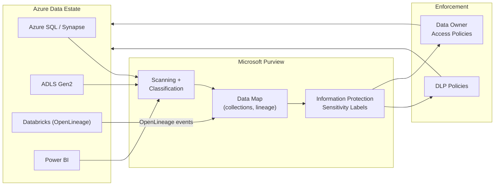
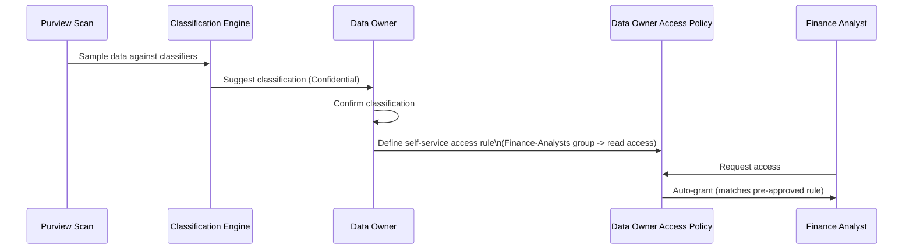
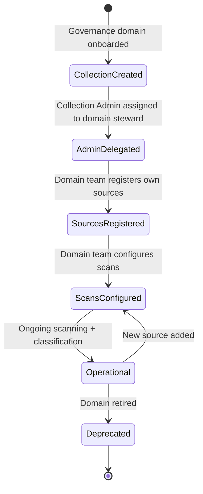

# Microsoft Purview

> Part of the **Enterprise Data & AI Architecture Handbook** · Phase-08 — Data Governance & Quality · Chapter 06.
> Estimated study time: **60 min reading + ~4h labs**.
> **Prerequisites:** read [Data Catalog and Lineage](02_Data_Catalog_and_Lineage.md) first.

---

## Executive Summary

The preceding Phase-08 chapters built the concepts — ownership and classification ([Data Governance Foundations](01_Data_Governance_Foundations.md)), column-level lineage and cataloging ([Data Catalog and Lineage](02_Data_Catalog_and_Lineage.md)), quality gates ([Data Quality with Great Expectations](03_Data_Quality_with_Great_Expectations.md)), active metadata ([Metadata Management](04_Metadata_Management_OpenMetadata_and_Atlas.md)), and entity mastering ([Master Data Management](05_Master_Data_Management.md)). **Microsoft Purview** is the concrete, managed Azure service that implements a substantial share of all five simultaneously — a unified Data Map, automated scanning and classification, column-level lineage across the Azure data estate, sensitivity labeling tied to Microsoft 365 and Azure data services, and data loss prevention (DLP) and access policies enforced directly against the classified data. This chapter goes deep on Purview itself: how its Data Map, collections, and scanning actually work; how classification and sensitivity labels integrate with Microsoft Purview Information Protection; how lineage is captured across Azure Data Factory, Synapse, Databricks, and Power BI specifically; how DLP policies and Data Owner access policies convert classification into enforced controls; and — critically — an honest comparison of when Purview is the right choice versus when an open-source catalog (OpenMetadata, Atlas) or a hybrid federated approach (per [Metadata Management](04_Metadata_Management_OpenMetadata_and_Atlas.md#core-concepts)) better fits an organization's requirements.

The governing insight: **Purview's core value is unification, not any single capability being individually best-in-class.** A specialist tool might out-perform Purview at lineage depth (DataHub), at classification precision for a narrow domain, or at operational cost (a lean OpenMetadata deployment) — but Purview's integration of cataloging, classification, lineage, and enforcement in one platform, tied natively into Entra ID and Microsoft 365's Information Protection labels, is what makes it the default choice for Azure-primary enterprises: the alternative is usually stitching together three or four specialist tools plus custom integration glue, which is a real, ongoing engineering cost most organizations should not take on without a specific reason.

This chapter is naturally **Azure-heavy (~70%+)** given its subject is an Azure-native service, with **enterprise open-source comparison (~20%)** (OpenMetadata/Atlas as the alternative or complementary self-hosted approach, per [Metadata Management](04_Metadata_Management_OpenMetadata_and_Atlas.md)) and **AWS/GCP comparison-only (~10%)** (AWS Glue Data Catalog/DataZone/Macie, GCP Dataplex/Data Catalog/Sensitive Data Protection).

**Bottom line:** Purview succeeds when an organization commits to it as the enterprise-wide Data Map — registering the majority of its Azure (and, via connectors, non-Azure) estate, keeping scans current, and actually wiring classification into DLP and access policies rather than treating classification as a passive label — and underdelivers when adopted as a checkbox catalog with shallow scanning coverage and no enforcement behind its labels. An architect who understands Purview's collection/scan/classification/policy pipeline precisely — and who can defend the choice between Purview, an open-source alternative, or a federated hybrid — makes Purview the operational backbone of Azure-primary governance rather than an expensive, underused catalog.

---

## Learning Objectives

By the end of this chapter you will be able to:

1. **Design a Purview Data Map collection hierarchy** that mirrors an organization's governance domain structure, with appropriate delegated administration.
2. **Configure automated scanning and classification** across Azure SQL, Synapse, ADLS Gen2, Cosmos DB, and Power BI, including custom classification rules for organization-specific sensitive data types.
3. **Integrate Purview classification with Microsoft Purview Information Protection sensitivity labels**, extending labeling consistently across Microsoft 365 and Azure data services.
4. **Trace lineage across Azure Data Factory, Synapse, Databricks, and Power BI** using Purview's native connectors and its OpenLineage-compatible ingestion API.
5. **Design and enforce DLP policies and Data Owner access policies** that convert Purview classification into automatically-enforced controls, not just catalog metadata.
6. **Compare Purview to OpenMetadata/Atlas and to a hybrid federated deployment**, and choose correctly based on organizational Azure-centricity and existing OSS investment.
7. **Identify Purview anti-patterns** — shallow scanning coverage, classification without enforcement, and collection sprawl without delegated ownership.
8. **Map a target Purview architecture onto an enterprise's actual data estate**, with an explicit, defensible comparison to AWS DataZone/Macie and GCP Dataplex/Sensitive Data Protection.

---

## Business Motivation

- **Azure-primary enterprises need one governance plane, not five.** An organization running Azure SQL, Synapse, ADLS Gen2, Databricks, Power BI, and Microsoft 365 simultaneously faces a genuine integration cost stitching together separate cataloging, classification, and DLP tools per service — Purview's native, Azure-and-Microsoft-365-wide integration directly addresses this without custom glue code.
- **Sensitivity labeling that stops at the document level misses the majority of an enterprise's regulated data.** Most enterprises' Information Protection labeling programs started in Microsoft 365 (documents, emails); Purview extends the same label taxonomy to structured Azure data services, closing a governance gap that previously required a separate labeling mechanism for databases and data lakes.
- **DLP that only covers email and documents leaves databases and data lakes unmonitored.** A classification program without enforcement — labels applied but no DLP policy acting on them — provides audit value but no actual prevention, exactly the "quality theatre" anti-pattern warned against in [Data Quality with Great Expectations](03_Data_Quality_with_Great_Expectations.md#anti-patterns) applied to access control instead of data quality.
- **Regulatory examinations increasingly expect evidence from a single, coherent governance platform**, not a narrative describing five disconnected tools — Purview's unified reporting across scanning coverage, classification, and lineage is directly usable as examination evidence.
- **Self-service data access requests without a governed approval workflow create either security risk (over-provisioned access) or delivery friction (slow, manual approval)** — Purview's Data Owner access policies (self-service, classification-driven approval workflows) directly address this tension.

---

## History and Evolution

- **2016 — Azure Data Catalog (v1)** launches as Microsoft's first cloud-native metadata discovery service — a lightweight, largely manual-annotation-driven catalog with limited automated scanning, reflecting the "documentation-first" era of cataloging described in [Data Catalog and Lineage](02_Data_Catalog_and_Lineage.md#history-and-evolution).
- **2020 (preview) / 2021 (GA) — Microsoft Purview launches**, a complete architectural rebuild rather than an incremental update to Azure Data Catalog, built around automated scanning, an Apache Atlas-compatible metadata model (deliberately chosen for interoperability, per [Metadata Management](04_Metadata_Management_OpenMetadata_and_Atlas.md#history-and-evolution)), and — critically — native integration with Microsoft's existing Information Protection labeling infrastructure already used across Microsoft 365.
- **2021-2022 — Purview's classification and DLP scope expands** from Microsoft 365-centric information protection into Azure-native structured data services (Azure SQL, Synapse, ADLS Gen2), unifying what had previously been two separate labeling ecosystems (Microsoft 365 Information Protection and ad hoc Azure-native classification approaches).
- **2023 — Microsoft rebrands its broader security/compliance/governance portfolio around "Microsoft Purview"** as an umbrella brand, consolidating Insider Risk Management, Compliance Manager, and Information Protection under the same product family as the Data Map/catalog capability this chapter focuses on — reflecting Microsoft's strategic bet that governance, security, and compliance are converging disciplines rather than separate products.
- **2023-2024 — Data Owner access policies (self-service, Purview-managed access grants directly against Azure SQL/ADLS Gen2 resources) mature**, moving Purview from a purely discovery/classification tool toward directly enforcing access decisions, a meaningful architectural expansion beyond its original cataloging scope.
- **2024-present — Unified Catalog / Data Products** (Purview's newer information-architecture layer, organizing assets into business-facing "data products" within governance domains) reflects the same data-mesh-influenced, domain-oriented organizing principle already discussed in [Data Governance Foundations](01_Data_Governance_Foundations.md#core-concepts), moving Purview's UX away from a purely technical-asset-centric view toward a business-domain-centric one.
- **2024-present — Purview's AI-era expansion** (data security posture management for AI, tracking what data feeds Copilot and other AI systems) extends its classification and DLP scope specifically to address the AI-copilot grounding risk raised throughout this handbook's Phase-08 chapters.

---

## Why This Technology Exists

An Azure-primary enterprise running data across Azure SQL, ADLS Gen2, Synapse, Databricks, Power BI, and Microsoft 365 faces exactly the fragmentation problem [Data Catalog and Lineage](02_Data_Catalog_and_Lineage.md#why-this-technology-exists) describes generally — but Microsoft is uniquely positioned to solve it end-to-end because it controls both the data-plane services (Azure SQL, ADLS) and the existing information-protection infrastructure (Microsoft 365 sensitivity labels) an enterprise likely already has in place. Purview exists specifically to extend that existing Microsoft 365 governance investment across the full Azure data estate — rather than requiring an enterprise to either build custom integration between Azure services and its existing Microsoft 365 governance tooling, or adopt an entirely separate, disconnected catalog/classification system for its structured data services.

---

## Problems It Solves

- **Fragmented classification across Microsoft 365 and Azure data services** — one sensitivity label taxonomy applies consistently to a SharePoint document, an email, an Azure SQL column, and an ADLS Gen2 file, rather than requiring separate labeling systems per service.
- **Manual, scan-less metadata discovery** — automated scanning across Azure SQL, Synapse, ADLS Gen2, Cosmos DB, and (via self-hosted integration runtime) on-premises and multi-cloud sources replaces the Azure Data Catalog v1-era manual annotation model.
- **Lineage gaps across the Azure data pipeline stack** — native connectors for Azure Data Factory, Synapse pipelines, and (via OpenLineage) Databricks/Spark give column-level lineage spanning the full transformation chain, not just individual tool-level views.
- **Classification without enforcement** — DLP policies and Data Owner access policies act directly on Purview's classification, converting a passive label into an enforced control (blocking a policy-violating email attachment, requiring approval for access to a Restricted-tier ADLS container).
- **Slow, ad hoc data access provisioning** — Data Owner access policies let a classified resource's owner define self-service, pre-approved access rules, replacing a manual, ticket-based provisioning process for the common case.

---

## Problems It Cannot Solve

- **It cannot classify data it hasn't scanned.** Purview's classification coverage is bounded entirely by scanning coverage — a source not registered and scanned (or not instrumented for lineage) is invisible to Purview regardless of how sensitive its actual contents are, exactly the harvesting-coverage dependency established in [Data Catalog and Lineage](02_Data_Catalog_and_Lineage.md#problems-it-cannot-solve).
- **It cannot substitute for the governance operating model.** Purview surfaces suggested classifications and enforces policies once configured; it cannot decide who the accountable data owner is or resolve a classification dispute — that remains [Data Governance Foundations](01_Data_Governance_Foundations.md#internal-working)'s responsibility.
- **It cannot achieve non-Azure/non-Microsoft-365 coverage as completely as Azure-native services.** Purview's connector ecosystem for AWS S3, GCP BigQuery, Snowflake, and SaaS sources continues to mature but is generally less deep (classification and lineage fidelity) than its native Azure service integration — a genuinely multi-cloud enterprise should expect meaningfully more configuration effort and lower initial fidelity for non-Azure sources.
- **It cannot make classification suggestions perfectly accurate.** Built-in and custom classifiers use pattern matching and sampling; they will produce false positives and false negatives requiring the same human owner/steward confirmation workflow established in [Data Governance Foundations](01_Data_Governance_Foundations.md#internal-working) — Purview does not eliminate the need for that human step.
- **It cannot replace a dedicated, deep-lineage-focused tool for extremely complex, non-Azure-native pipeline estates.** An organization with a large, heterogeneous Spark/Airflow pipeline estate spanning many non-Microsoft platforms may find a purpose-built, cloud-agnostic tool like DataHub (per [Data Catalog and Lineage](02_Data_Catalog_and_Lineage.md#decision-matrix)) provides deeper lineage fidelity for that specific estate than Purview's more Azure-centric connector depth.

---

## Core Concepts

### 8.1 Data Map, Collections, and Scanning

The **Data Map** is Purview's underlying metadata graph — the technical store of every registered asset, its classification, lineage, and glossary linkage. **Collections** are Purview's hierarchical organizational unit for the Data Map, typically mirroring an organization's business domain or governance structure (e.g., a "Finance" collection containing "Finance-Prod" and "Finance-Dev" sub-collections); collections support **delegated administration** — a collection admin can manage scanning and access for their own collection without requiring central Purview admin rights, directly implementing the federated stewardship pattern from [Data Governance Foundations](01_Data_Governance_Foundations.md#core-concepts) at the platform level. A **scan** is the actual harvesting job, configured against a **data source** (registered connection to Azure SQL, ADLS Gen2, etc.) using a **scan rule set** (which classification rules to apply) and a **trigger** (once, scheduled, or recurring), landing results into a specific collection.

### 8.2 Classification and Sensitivity Labels

Purview ships **100+ built-in system classifiers** (credit card numbers, US Social Security Numbers, various international ID formats, and more) applied automatically during scanning via pattern matching and statistical sampling of scanned data. Organizations extend this with **custom classifiers** (regex-pattern-based, or dictionary-based for organization-specific identifiers like an internal employee ID format) and **custom classification rules** combining multiple signals (column name pattern plus data pattern plus minimum match percentage) for higher precision than a naive column-name-only match. Classification results feed **sensitivity labels** — Purview integrates directly with **Microsoft Purview Information Protection**'s existing label taxonomy (the same Public/Internal/Confidential/Highly Confidential-style labels already used for Microsoft 365 documents), applying them to structured data assets so the *same* label taxonomy governs a SharePoint document and an Azure SQL column, directly extending the classification tier model from [Data Governance Foundations](01_Data_Governance_Foundations.md#core-concepts) across the full Microsoft ecosystem.

### 8.3 Lineage Across Azure Services

Purview captures lineage from Azure services through a combination of **native connectors** and its **Atlas-compatible/OpenLineage-compatible ingestion API**:

- **Azure Data Factory and Synapse Pipelines** — native, automatic lineage capture at the pipeline-activity level (Copy Activity, Data Flow), requiring no additional instrumentation.
- **Azure Databricks/Spark** — via the **OpenLineage** integration (per [Data Catalog and Lineage](02_Data_Catalog_and_Lineage.md#azure-implementation)), capturing column-level lineage at execution time from instrumented Spark jobs.
- **Power BI** — native scanning captures dataset-to-report lineage, extending the graph through the BI/reporting layer as recommended in [Data Catalog and Lineage](02_Data_Catalog_and_Lineage.md#best-practices).
- **Azure SQL / Synapse stored procedures and views** — lineage inferred via SQL parsing during scanning, subject to the same accuracy caveats (dynamic SQL, complex procedural logic) discussed generally in [Data Catalog and Lineage](02_Data_Catalog_and_Lineage.md#core-concepts).

The practical implication: Purview's lineage fidelity is highest for ADF/Synapse-orchestrated and OpenLineage-instrumented pipelines, and lower (scan-inferred) for legacy stored-procedure-heavy ETL — precisely mirroring this handbook's general instrumentation-over-scanning guidance.

### 8.4 DLP and Access Policies

Once classification is applied, two Purview policy types convert it into enforcement: **Data Loss Prevention (DLP) policies** (inherited from Microsoft Purview's compliance portfolio) detect and act on sensitive-labeled content in transit or at rest — blocking or warning on an email containing a Highly Confidential-labeled attachment, or flagging an inappropriate sharing action in Microsoft 365 — and **Data Owner access policies** (Purview-managed, directly enforced against Azure SQL and ADLS Gen2 resources) let a resource's designated owner define self-service access rules (e.g., "any user in the Finance-Analysts group gets automatic read access to Confidential-tier Finance data") that Purview provisions directly as the underlying Azure RBAC/SQL permission, without a manual ticket-based process. Both policy types are the concrete enforcement layer that the classification hierarchy in [Data Governance Foundations](01_Data_Governance_Foundations.md#core-concepts) depends on to have any real teeth.

### 8.5 Purview vs. Open-Source Catalogs

Purview trades some of OpenMetadata/Atlas's model flexibility and multi-cloud portability (per [Metadata Management](04_Metadata_Management_OpenMetadata_and_Atlas.md#decision-matrix)) for deep, low-configuration-effort native integration with the Azure and Microsoft 365 ecosystem and zero self-hosting operational burden (fully managed). The decision is not strictly either/or: many mature Azure-primary enterprises run Purview as the enterprise-wide hub while federating a self-hosted OpenMetadata instance for a specific domain needing model flexibility Purview doesn't natively support (per the hub-and-spoke pattern from [Metadata Management](04_Metadata_Management_OpenMetadata_and_Atlas.md#core-concepts)) — this chapter treats that hybrid as the mature end-state for most large, heterogeneous enterprises rather than a purely binary choice.

---

## Internal Working

Purview's scanning-to-enforcement pipeline executes this sequence:

1. **Data source registration** — an Azure SQL database, ADLS Gen2 account, or other source is registered under a specific collection, with a scan credential (managed identity preferred) granted read-only metadata access.
2. **Scan execution** — on a scheduled trigger, the scan connects to the source, extracts schema and statistics, and samples data against the configured scan rule set's classifiers.
3. **Classification and labeling** — classifier matches produce suggested classifications; if auto-labeling is configured (or a human confirms per the workflow from [Data Governance Foundations](01_Data_Governance_Foundations.md#internal-working)), a Microsoft Purview Information Protection sensitivity label is applied to the asset.
4. **Lineage stitching** — for sources with native lineage connectors (ADF, Synapse, Power BI) or OpenLineage-instrumented pipelines, lineage edges are captured and stitched into the Data Map's graph alongside the scanned technical metadata.
5. **Policy evaluation** — configured DLP policies continuously evaluate labeled content for policy violations (inappropriate sharing, external transmission); configured Data Owner access policies evaluate access requests against pre-defined self-service rules, provisioning access automatically for matching requests.
6. **Catalog serving** — the Unified Catalog UI/API serves search, browse, and lineage-traversal queries against the resulting Data Map, respecting the requesting user's own access permissions (a user cannot see lineage/schema detail for an asset they lack access to).
7. **Re-scan and drift detection** — subsequent scheduled scans detect schema drift and re-evaluate classification, feeding the same re-certification cycle established in [Data Governance Foundations](01_Data_Governance_Foundations.md#internal-working).

---

## Architecture

Purview's architecture separates a **management/control plane** (the Purview account itself, holding the Data Map, collections, scan configuration, and policy definitions) from **scanning compute** (managed scanning infrastructure, or a **self-hosted integration runtime** deployed inside an organization's network for on-premises or network-isolated sources) and the **enforcement plane** (DLP policy evaluation integrated into Microsoft 365/Exchange/SharePoint, and Data Owner access policy evaluation integrated directly into Azure SQL/ADLS Gen2's own access-control plane). This separation matters architecturally because it means Purview's classification and cataloging capability can be adopted independently of its enforcement capability — an organization can start with Data Map/scanning only and add DLP/access-policy enforcement later, a staged-adoption pattern this chapter's Enterprise Recommendations endorses.

---

## Components

- **Purview account** — the top-level resource holding the Data Map, collections, and configuration.
- **Collections** — the hierarchical, delegated-administration organizational structure for the Data Map.
- **Data sources and scans** — registered connections and their scanning configuration (rule sets, triggers, credentials).
- **Classification/scan rule sets** — the configured combination of built-in and custom classifiers applied during scanning.
- **Self-hosted integration runtime** — the on-premises/network-isolated scanning agent for sources not directly reachable from Azure's managed scanning infrastructure.
- **Microsoft Purview Information Protection** — the sensitivity label taxonomy and policy engine shared with Microsoft 365.
- **DLP policy engine** — the compliance-portfolio component evaluating labeled content for policy violations.
- **Data Owner access policies** — the self-service access-provisioning engine acting directly on Azure SQL/ADLS Gen2 permissions.
- **Unified Catalog / Data Products** — the business-facing organizational and discovery layer atop the technical Data Map.

---

## Metadata

Purview's metadata model is built on an **Apache Atlas-compatible type system** (per [Metadata Management](04_Metadata_Management_OpenMetadata_and_Atlas.md#core-concepts)), extended with Microsoft-specific entity types for its Azure and Microsoft 365-native sources. This deliberate compatibility choice means Purview's technical metadata (schema, lineage edges), sensitivity labels, and glossary terms can, in principle, interoperate with Atlas-based tooling and scripts via its Atlas-compatible REST API — the concrete mechanism underlying the hub-and-spoke federation pattern discussed in [Metadata Management](04_Metadata_Management_OpenMetadata_and_Atlas.md#governance).

---

## Storage

Purview's Data Map storage is a fully managed, internal service — Microsoft does not expose or document its underlying storage engine as a configurable component, unlike self-hosted OpenMetadata/Atlas where the operator explicitly provisions and tunes PostgreSQL/JanusGraph. This is a deliberate trade-off: an organization gains zero storage-operations burden at the cost of no ability to directly tune or inspect the underlying storage layer's performance characteristics — a relevant consideration when comparing total operational cost against a self-hosted alternative per [Metadata Management](04_Metadata_Management_OpenMetadata_and_Atlas.md#storage).

---

## Compute

Purview scanning is billed via **Capacity Units** — a consumption-based unit representing scanning vCore-hours, scaling with source size, object count, and whether classification (which requires data sampling, not just schema extraction) is enabled. Self-hosted integration runtime scanning additionally consumes the compute of whatever VM/infrastructure the organization provisions to host it, a cost outside Purview's own consumption billing. Classification-enabled scans are meaningfully more expensive than schema-only scans, since sampling and evaluating data against 100+ classifiers is far more compute-intensive than extracting schema metadata alone — a key lever in this chapter's [Cost Optimization](#cost-optimization).

---

## Networking

Purview accounts should be deployed with **managed private endpoints** disabling public network access entirely (per the networking guidance already established in [Data Governance Foundations](01_Data_Governance_Foundations.md#networking) and [Data Catalog and Lineage](02_Data_Catalog_and_Lineage.md#networking)), with scanning connectivity to Azure-native sources routed through **managed private endpoints** specific to each source type, and connectivity to on-premises or network-isolated sources routed through a **self-hosted integration runtime** deployed inside the source's own network boundary — never requiring a source to open public network access purely to permit a Purview scan.

---

## Security

Purview scan credentials should use **managed identities** scoped to read-only metadata access (schema and sampled data for classification, never write access), consistent with least-privilege principles established throughout this handbook. Access to view classified/lineage detail within Purview itself should respect the underlying resource's own access control — Purview does not grant a user visibility into a Restricted-tier table's schema or lineage simply because they can search the catalog, a critical design property preventing the catalog itself from becoming an information-disclosure vector (directly addressing the concern raised generally in [Data Catalog and Lineage](02_Data_Catalog_and_Lineage.md#security)). Elevated Purview roles (Collection Admin, Data Curator with write access to classification/glossary) should be gated behind **Microsoft Entra Privileged Identity Management (PIM)** for just-in-time elevation.

---

## Performance

Classification-enabled scans on very large sources (multi-terabyte ADLS Gen2 containers, wide Synapse tables) can take substantially longer than schema-only scans due to data-sampling overhead; Purview supports configuring **sampling percentage/depth** per scan to trade classification thoroughness against scan duration and cost — a direct, tunable lever analogous to the sampling trade-off discussed for Great Expectations in [Data Quality with Great Expectations](03_Data_Quality_with_Great_Expectations.md#performance). Incremental scanning (scanning only changed objects since the last run, supported for several source types) further reduces both scan duration and cost for large, slowly-changing sources.

---

## Scalability

Purview's Data Map itself scales as a managed service without customer-visible capacity planning, but the practical scalability bottleneck — as with any catalog per [Data Catalog and Lineage](02_Data_Catalog_and_Lineage.md#scalability) — is the organization's own scanning-coverage discipline keeping pace with a growing, changing data estate. Collection hierarchy design also has a scalability dimension: an overly flat collection structure (everything in one collection) prevents the delegated-administration benefit that lets domain teams manage their own scanning/access independently as the organization and its data estate grow, reproducing the central-bottleneck risk from [Data Governance Foundations](01_Data_Governance_Foundations.md#scalability) at the tooling-configuration level.

---

## Fault Tolerance

A failed scan should be clearly surfaced (scan run history shows failure status and error detail) so staleness is visible rather than silent, consistent with the staleness-transparency principle from [Data Catalog and Lineage](02_Data_Catalog_and_Lineage.md#fault-tolerance). DLP and access-policy enforcement should fail closed where feasible (e.g., an access-policy evaluation error should not silently grant access) — though the specific fail-open/fail-closed behavior for each Purview policy type should be explicitly verified during implementation, not assumed, since default behaviors can vary by policy category and Microsoft's own documentation should be consulted for the current guaranteed behavior at implementation time.

---

## Cost Optimization

Purview's dominant cost driver is scanning Capacity Units, heavily influenced by whether classification (data sampling) is enabled and at what sampling depth. **Worked FinOps example:** scanning 250 data sources weekly with classification enabled, averaging 2.5 vCore-hours per scan at an illustrative $0.60/vCore-hour rate, costs roughly 250 × 2.5 × $0.60 ≈ $375/week (~$1,625/month). Switching 150 of the lowest-priority, slowly-changing sources to **monthly** (rather than weekly) classification scans while retaining weekly schema-only (non-classification) scans for drift detection reduces the estimate to roughly (100 × 2.5 × $0.60 × 4 weeks) + (150 × 2.5 × 0.6 × $0.60 × 4 weeks / 4) ≈ $600 + $135 ≈ $735/month — a meaningful reduction achieved by tiering classification-scan *frequency* by source priority rather than uniformly scanning everything at maximum frequency, directly mirroring the tiered-scanning FinOps lever already established in [Data Catalog and Lineage](02_Data_Catalog_and_Lineage.md#cost-optimization).

---

## Monitoring

Track: **scan success rate and staleness age per collection** (shared with the general catalog monitoring guidance in [Data Catalog and Lineage](02_Data_Catalog_and_Lineage.md#monitoring)); **classification coverage percentage per collection** (what fraction of registered assets have a confirmed, non-default sensitivity label); **DLP policy match/action volume** (is the enforcement layer actually seeing and acting on real events, or configured but silent); and **Data Owner access policy grant volume and approval latency**, verifying the self-service access model is actually reducing manual provisioning burden as intended.

---

## Observability

Purview's own **Insights** reporting (built into the Purview portal) surfaces classification coverage, scan health, and sensitivity-label distribution across the registered estate, giving the "is our governance actually current" answer this handbook's Phase-08 chapters repeatedly emphasize as the real test of program health — not initial deployment completeness. Wiring Purview's diagnostic logs into **Azure Monitor/Log Analytics** extends this into the organization's broader unified observability surface alongside pipeline and quality-gate telemetry (per [Data Quality with Great Expectations](03_Data_Quality_with_Great_Expectations.md#observability)).

---

## Governance

Purview's collection hierarchy and delegated administration should map directly onto the operating model already designed in [Data Governance Foundations](01_Data_Governance_Foundations.md#core-concepts) — a Purview collection per governance domain, with Collection Admin rights granted to that domain's data owner/steward rather than centralized entirely with the Purview platform team. Classification-rule and DLP-policy changes should go through the same reviewed-change discipline established for Expectation Suites in [Data Quality with Great Expectations](03_Data_Quality_with_Great_Expectations.md#design-patterns), since a poorly-tuned custom classifier or an overly broad DLP policy can produce organization-wide false positives at meaningful operational cost.

**ADR Example — Purview as Central Hub with Federated OpenMetadata for a Data Mesh Domain:**

> **Context:** An Azure-primary retail enterprise adopted Microsoft Purview as its enterprise-wide catalog, but one data-mesh domain (a recently-formed ML platform team) needed to model custom entity types (feature store features, model training datasets, experiment lineage) that didn't map cleanly onto Purview's Atlas-compatible type system without extensive custom type-definition work.
> **Decision:** Deploy a domain-local **OpenMetadata** instance for the ML platform team's custom entity modeling needs, federated hub-and-spoke into the central Purview Data Map (per [Metadata Management](04_Metadata_Management_OpenMetadata_and_Atlas.md#core-concepts)) for enterprise-wide discoverability, with the ML platform team's OpenMetadata instance remaining authoritative for its own custom entity types while Purview remained authoritative for all standard Azure-native assets.
> **Consequences:** The ML platform team gained the modeling flexibility it needed without waiting on central Purview type-system extension work; the organization took on the federation-authority documentation and sync-job maintenance burden described in [Metadata Management](04_Metadata_Management_OpenMetadata_and_Atlas.md#case-studies) as an explicitly accepted, managed cost rather than an accident, having learned from that chapter's undocumented-federation-authority case study.
> **Alternatives considered:** (1) Force the ML platform team to model everything within Purview's existing type system — rejected as an unacceptable modeling constraint for genuinely novel ML-specific entity types; (2) Let the ML platform team run OpenMetadata fully independently with no federation into Purview — rejected as reproducing exactly the multi-catalog fragmentation this handbook's governance chapters warn against; (3) Extend Purview's own type system with custom ML entity types — considered but deferred, since Purview's custom-type extensibility for this level of domain-specific modeling was, at the time, less mature than OpenMetadata's JSON Schema-first approach.

---

## Trade-offs

- **Purview's managed convenience vs. OpenMetadata/Atlas's model flexibility**: Purview requires zero self-hosting operational effort and deep native Azure/Microsoft 365 integration, but its Atlas-compatible type system is less flexible for highly custom, domain-specific entity modeling than OpenMetadata's JSON Schema-first approach.
- **Classification thoroughness vs. scanning cost**: full-depth data sampling produces more accurate classification but costs meaningfully more Capacity Units than schema-only or reduced-sampling scans.
- **Centralizing everything in Purview vs. hybrid federation**: full centralization is simpler to govern and query but constrains domains needing modeling flexibility Purview doesn't natively support; hybrid federation (this chapter's ADR) preserves flexibility at the cost of federation-maintenance overhead.

---

## Decision Matrix

| Criterion | Microsoft Purview | OpenMetadata/Atlas (self-hosted) | Hybrid (Purview hub + federated spoke) |
|---|---|---|---|
| Operational overhead | None (managed) | Moderate-high (self-hosted infra) | Moderate (federation sync + Purview) |
| Azure/Microsoft 365-native integration | Excellent (DLP, Information Protection, Entra ID) | Requires custom integration | Excellent for Purview-owned assets |
| Custom entity-model flexibility | Moderate (Atlas-compatible type system) | High (especially OpenMetadata's JSON Schema model) | High for spoke-owned domains |
| Multi-cloud/non-Microsoft source depth | Growing, but generally shallower than Azure-native | Strong (broad OSS connector ecosystem) | Strong via spoke, unified via hub |
| Best fit | Azure-primary enterprises wanting one managed governance plane | Cost-sensitive or highly custom-modeling-needs deployments | Large, heterogeneous enterprises with both Azure-centricity and domain-specific modeling needs |

---

## Design Patterns

- **Collection hierarchy mirroring governance domains** — one collection per business/governance domain with delegated Collection Admin rights, directly implementing the federated operating model from [Data Governance Foundations](01_Data_Governance_Foundations.md#core-concepts).
- **Staged adoption: catalog-first, enforcement-second** — start with Data Map/scanning/classification, add DLP and Data Owner access policies once classification accuracy and coverage are established and trusted.
- **Tiered scanning frequency by source priority** — full classification scans on a shorter cycle for high-value sources, longer cycles or schema-only scans for lower-priority ones, per this chapter's FinOps guidance.
- **Hub-and-spoke federation for domains needing modeling flexibility** — as demonstrated in this chapter's ADR, rather than either forcing everything into Purview's model or fully abandoning central discoverability.
- **OpenLineage instrumentation for Databricks/Spark pipelines** — preferring push-based lineage over scan-based SQL parsing wherever the pipeline framework supports it, per [Data Catalog and Lineage](02_Data_Catalog_and_Lineage.md#design-patterns).

---

## Anti-patterns

- **Shallow scanning coverage mistaken for comprehensive governance** — registering sources in Purview without actually running classification-enabled scans regularly, producing a catalog that looks complete but is stale or has never actually classified the underlying data.
- **Classification without enforcement** — applying sensitivity labels but never configuring DLP or Data Owner access policies to act on them, providing audit-report value without any actual prevention capability.
- **A flat, single-collection Data Map** — losing the delegated-administration benefit of collections, forcing every scan/access change through a central Purview admin team and reproducing the over-centralization bottleneck from [Data Governance Foundations](01_Data_Governance_Foundations.md#anti-patterns).
- **Treating Purview adoption as a one-time migration project** rather than an ongoing operational capability requiring continued scanning-coverage expansion and classification-rule tuning as the data estate evolves.
- **Assuming Purview alone is sufficient for a genuinely multi-cloud, non-Microsoft-heavy estate** without evaluating whether a hybrid federation approach (this chapter's ADR) or a different primary platform better serves that portion of the estate.

---

## Common Mistakes

- Underestimating classification-scan Capacity Unit cost by enabling maximum-depth sampling uniformly across all sources regardless of priority, rather than tiering scan depth/frequency per this chapter's FinOps guidance.
- Granting broad Purview Data Curator/Collection Admin roles without PIM-gated elevation, expanding the blast radius of a compromised credential unnecessarily.
- Designing a collection hierarchy that doesn't map to actual organizational/governance domain boundaries, producing confusing delegated-administration assignments that don't match who is actually accountable for what.
- Configuring DLP policies or custom classifiers without piloting them in audit/simulation mode first, risking the same false-positive-driven trust erosion documented for architecture guardrails in [Architecture Governance](../Phase-01/02_Architecture_Governance.md#case-studies).
- Ignoring Power BI and BI-layer scanning, stopping the lineage graph at the warehouse level and missing the "which dashboards break" question that is frequently the most business-relevant lineage use case, per [Data Catalog and Lineage](02_Data_Catalog_and_Lineage.md#best-practices).

---

## Best Practices

- Design the collection hierarchy to mirror the governance operating model's domain structure before beginning source registration, not as an afterthought once scanning is already underway.
- Pilot new classification rules and DLP policies in audit/simulation mode before enforcing, mirroring the "audit before deny" staging discipline from [Architecture Governance](../Phase-01/02_Architecture_Governance.md#migration-considerations).
- Prioritize OpenLineage instrumentation for Databricks/Spark pipelines over relying solely on scan-based lineage inference, for the same accuracy reasons established in [Data Catalog and Lineage](02_Data_Catalog_and_Lineage.md#design-patterns).
- Extend scanning coverage through the Power BI/reporting layer, not just the warehouse, to support the business-relevant impact-analysis use case.
- Evaluate a hybrid Purview-hub-plus-federated-OpenMetadata-spoke architecture explicitly for any domain whose entity-modeling needs don't fit Purview's Atlas-compatible type system cleanly, rather than forcing an awkward fit or abandoning central discoverability.

---

## Enterprise Recommendations

- Sequence rollout by governance-program priority (per [Data Governance Foundations](01_Data_Governance_Foundations.md#enterprise-recommendations)'s 90-day bootstrap): register and scan the highest-value domains first, then expand coverage outward.
- Stage enforcement adoption deliberately — Data Map and classification first, DLP and Data Owner access policies once classification accuracy is validated — rather than attempting full enforcement from day one.
- Budget explicit Capacity Unit cost planning as part of the rollout, using this chapter's tiered-scanning-frequency FinOps pattern from the outset rather than discovering cost overruns after uniform maximum-depth scanning is already in production.

---

## Azure Implementation

- **Provisioning a Purview account with private network access** (Bicep):

```bicep
resource purview 'Microsoft.Purview/accounts@2021-12-01' = {
  name: 'contoso-purview'
  location: location
  identity: { type: 'SystemAssigned' }
  properties: {
    publicNetworkAccess: 'Disabled'
    managedResourceGroupName: 'contoso-purview-managed-rg'
  }
}
```

- **Registering an Azure SQL data source and scan** (CLI):

```bash
az purview scan create \
  --account-name contoso-purview \
  --data-source-name azuresql-finance-prod \
  --scan-name finance-weekly-classification-scan \
  --recurrence "Week" \
  --scan-ruleset "AzureSqlDatabase" \
  --credential-name finance-sql-scan-msi
```

- **A custom classification rule** (regex-based, for an internal employee ID format), defined via the Purview classification rule API/portal, combining a column-name pattern with a data-value pattern for higher precision than either signal alone:

```json
{
  "name": "ContosoEmployeeID",
  "kind": "Custom",
  "columnPatterns": ["employee_id", "emp_id", "staff_number"],
  "dataPatterns": ["^EMP-[0-9]{6}$"],
  "minimumMatchPercentage": 60
}
```

- **A Data Owner access policy** granting Finance-Analysts group self-service read access to Confidential-tier Finance data, configured via the Purview portal's policy authoring UI, provisions the underlying Azure SQL/ADLS Gen2 permission directly — no manual ticket or out-of-band RBAC assignment required.
- **Microsoft Purview Information Protection sensitivity labels** applied to Azure SQL columns or ADLS Gen2 paths use the same label taxonomy already configured for Microsoft 365, ensuring one consistent classification vocabulary organization-wide.

---

## Open Source Implementation

- **OpenMetadata and Apache Atlas** (covered in depth in [Metadata Management](04_Metadata_Management_OpenMetadata_and_Atlas.md)) remain the primary open-source alternative or complementary federated-spoke platform, particularly valuable where Purview's type system doesn't fit a domain's custom entity-modeling needs.
- **OpenLineage** is the vendor-neutral lineage-emission standard Purview's ingestion API accepts, decoupling Databricks/Spark/Airflow pipeline instrumentation from Purview specifically — the same instrumentation investment benefits Purview and any future/parallel catalog platform.
- **Open Policy Agent (OPA)** can complement Purview's Data Owner access policies for non-Azure-native resources (Kubernetes workloads, multi-cloud resources) where Purview's direct enforcement doesn't reach, providing a portable, cloud-agnostic policy-as-code layer for the remainder of the estate.

---

## AWS Equivalent (comparison only)

AWS's closest equivalents, combined, are **AWS Glue Data Catalog** plus **Amazon DataZone** (cataloging and data-product governance) and **Amazon Macie** (automated sensitive-data discovery, roughly analogous to Purview's classification scanning). **Advantages:** each component is individually mature and deeply integrated with its specific AWS service (Glue with S3/Athena, Macie with S3). **Disadvantages:** unlike Purview's single unified platform spanning cataloging, classification, DLP, and access policy, AWS's capability is split across at least three distinct services requiring separate configuration and integration effort, and there is no AWS-native equivalent to Purview's direct extension of an existing Microsoft 365 Information Protection label taxonomy. **Migration strategy:** map Purview classification labels to Macie custom data identifiers and DataZone data-product classifications; DLP-equivalent enforcement requires assembling AWS Config Rules, Macie findings, and IAM/Lake Formation policies rather than a single unified policy type. **Selection criteria:** AWS-primary organizations will find this multi-service approach natural within their existing AWS operational patterns; organizations with substantial existing Microsoft 365 investment will find Purview's unified label taxonomy and single-platform integration meaningfully lower friction.

---

## GCP Equivalent (comparison only)

GCP's closest equivalents are **Dataplex** and **Data Catalog** for cataloging and lineage, combined with **Sensitive Data Protection** (formerly Cloud DLP) for classification and data-loss-prevention scanning. **Advantages:** Sensitive Data Protection's classification engine is mature and deeply integrated with BigQuery and GCS. **Disadvantages:** similar to AWS, GCP's capability is split across multiple services rather than Purview's single unified platform, and there is no equivalent to Purview's native extension of an existing Microsoft 365-wide label taxonomy for organizations with that existing investment. **Migration strategy:** map Purview classifications to Sensitive Data Protection's infoType detectors and Dataplex data attributes; access-policy enforcement moves to IAM Conditions and Dataplex data attribute-based policies. **Selection criteria:** BigQuery-centric organizations will find Sensitive Data Protection and Dataplex's native integration compelling; Microsoft-365-heavy or Azure-primary organizations will find Purview's unified platform and existing label-taxonomy reuse a materially lower-friction starting point.

---

## Migration Considerations

- **From Azure Data Catalog (v1, retired) to Purview**: this is a full re-platforming, not an upgrade — Azure Data Catalog's manual-annotation-centric model has no direct migration path into Purview's automated-scanning model; treat it as a fresh Purview rollout following this chapter's staged-adoption recommendations.
- **From a self-hosted Apache Atlas deployment to Purview**: Purview's Atlas-compatible REST API significantly eases this migration — existing Atlas-based scripts and type definitions can often be adapted with less rework than migrating to a fundamentally different metadata model, though a full entity/classification re-validation pass post-migration remains prudent.
- **From Purview-only to a hybrid Purview-plus-federated-OpenMetadata architecture**: follow this chapter's ADR pattern — pilot federation with one domain needing genuine modeling flexibility, document authority mapping explicitly, and avoid the undocumented-federation-drift anti-pattern from [Metadata Management](04_Metadata_Management_OpenMetadata_and_Atlas.md#case-studies).

---

## Mermaid Architecture Diagrams

**Purview scanning-to-enforcement architecture:**



**Classification-to-access-grant sequence:**



**Collection and delegated administration state diagram:**



---

## End-to-End Data Flow

1. A Finance domain's Azure SQL database is registered under the "Finance" collection, with delegated Collection Admin rights granted to the Finance data steward per the governance operating model.
2. A weekly classification-enabled scan runs, sampling data and matching a `national_id` column against a built-in classifier, suggesting a "Highly Confidential" sensitivity label.
3. The Finance data owner confirms the classification via the workflow established in [Data Governance Foundations](01_Data_Governance_Foundations.md#internal-working), and the Microsoft Purview Information Protection label is applied.
4. A Databricks pipeline transforming this data emits OpenLineage events, extending the lineage graph from the source table through to a curated Gold-layer aggregate and its downstream Power BI report.
5. A DLP policy configured against "Highly Confidential" labeled content flags an attempt to email an export of this data externally, blocking the transmission and notifying the compliance team.
6. Separately, a Finance analyst requests access to the Confidential-tier (non-Highly-Confidential) aggregate table; a pre-configured Data Owner access policy matching the Finance-Analysts group auto-grants read access without a manual ticket, while the Highly Confidential source table remains outside any self-service rule, requiring explicit owner approval per its higher sensitivity tier.

---

## Real-world Business Use Cases

- **A financial services firm's unified Microsoft 365-to-Azure classification program**: extending existing Microsoft 365 Information Protection labels to Azure SQL and ADLS Gen2 via Purview closed a longstanding governance gap where structured data had no equivalent labeling to its document/email counterparts, directly supporting a regulatory examination requiring evidence of consistent data classification.
- **A retail company's self-service access provisioning**: Data Owner access policies reduced average time-to-access for common, pre-approved data requests from several days (manual ticket-based provisioning) to near-instant, while retaining manual approval specifically for higher-sensitivity-tier requests.
- **A healthcare provider's AI-copilot grounding safeguard**: configuring Purview to track which datasets feed an internal Copilot deployment, combined with classification-driven DLP policies, prevented Highly Confidential patient data from being surfaced through the AI assistant to users lacking the underlying data access.

---

## Industry Examples

- **Microsoft's own internal engineering teams** are frequently cited (in Microsoft's public Purview documentation and conference presentations) as an early, large-scale internal adopter of the unified classification-and-DLP model this chapter describes, validating the approach before broader external GA.
- Enterprises migrating from **Azure Data Catalog (v1)** to Purview are widely documented as a common Microsoft-ecosystem migration pattern, illustrating the scale of the architectural shift from manual-annotation to automated-scanning catalogs described in this chapter's History and Evolution.
- **Financial services and healthcare enterprises** are the most commonly cited Purview adopter profiles in Microsoft's published case studies, given the direct alignment between Purview's classification/DLP/access-policy capability and those sectors' regulatory requirements (BCBS 239, HIPAA).

---

## Case Studies

**Case Study 1 — Classification Deployed Without Enforcement, Discovered During an Incident.** A logistics enterprise completed a comprehensive Purview scanning and classification rollout across its Azure SQL and ADLS Gen2 estate, achieving high classification coverage within six months — but never configured a single DLP policy or Data Owner access policy acting on the resulting labels. When a departing employee exported a Highly Confidential customer dataset via email attachment prior to their last day, no DLP policy existed to detect or block it, despite the data being correctly labeled in Purview at the time. The post-incident review's core finding, now this chapter's central warning, was that classification without enforcement provides forensic evidence *after* an incident, not prevention — the remediation prioritized configuring DLP policies for the highest-sensitivity labels immediately, in audit mode first per this chapter's staged-adoption guidance, before expanding enforcement further.

**Case Study 2 — A Flat Collection Structure Creating a Central Bottleneck.** A manufacturing enterprise's initial Purview deployment placed every registered data source into a single, undifferentiated collection administered solely by the central data platform team. As business domains requested new source registrations and scan schedule changes, every request queued through the same small central team, producing a multi-week backlog strongly reminiscent of the over-centralized governance council failure mode documented in [Data Governance Foundations](01_Data_Governance_Foundations.md#case-studies). Redesigning the collection hierarchy around business domains, with Collection Admin rights delegated to each domain's data steward, let domain teams register and manage their own sources directly, reducing the backlog to near-zero within one quarter — the fix was a Purview configuration change reflecting the organization's actual governance operating model, not additional central headcount.

---

## Hands-on Labs

1. **Provision a Purview trial account** with a collection hierarchy mirroring at least two hypothetical business domains, with delegated Collection Admin roles assigned per domain.
2. **Register and scan a sample Azure SQL or ADLS Gen2 source**, review the automatically-suggested classifications, and confirm or override the top three results.
3. **Author a custom classification rule** combining a column-name pattern and a data-value pattern for a domain-specific identifier, and validate its precision against a labeled sample.
4. **Configure a DLP policy in audit-only mode** against a sensitivity label, and review its simulated match results before considering enforcement mode.
5. **Design a Data Owner access policy** granting self-service access to a specific group for a Confidential-tier (not higher) resource, and document the approval workflow for a hypothetical Highly Confidential resource requiring manual review instead.
6. **Trace lineage across a sample ADF/Synapse pipeline plus a Power BI report** consuming its output, verifying the lineage graph extends through the full chain.

---

## Exercises

1. A stakeholder argues "we've deployed Purview, so we're governed." Using Case Study 1, explain precisely what gap remains even after comprehensive classification is achieved.
2. Design a collection hierarchy for a hypothetical five-domain enterprise, specifying delegated Collection Admin assignments and justifying the structure against Case Study 2's failure mode.
3. Compare the cost and effort of extending Purview's type system for a custom ML entity type versus federating a domain-local OpenMetadata instance, referencing this chapter's ADR.
4. Explain why classification-enabled scans cost meaningfully more than schema-only scans, and design a tiered scanning-frequency plan for a hypothetical 200-source estate.
5. Critique a Purview lineage graph that stops at the data-warehouse layer and never extends through Power BI, using the business-impact-analysis argument from [Data Catalog and Lineage](02_Data_Catalog_and_Lineage.md#best-practices).

---

## Mini Projects

- **End-to-End Classification-to-Enforcement Pipeline**: in a Purview trial account, register a source, apply classification, configure a DLP policy in audit mode, and document the full chain from scan to (simulated) enforcement.
- **Collection Governance Redesign**: given a flat, single-collection hypothetical deployment (modeled on Case Study 2), redesign the collection hierarchy and delegated administration model, and document the expected reduction in central-team request volume.
- **Purview-OpenMetadata Federation Prototype**: design (and, if feasible, implement at small scale) a federation sync job reconciling a mock domain-local OpenMetadata instance's custom entity type into a central Purview Data Map, following this chapter's ADR pattern.

---

## Capstone Integration

This chapter's Purview architecture is the concrete, managed Azure implementation of the operating model from [Data Governance Foundations](01_Data_Governance_Foundations.md), the cataloging and lineage concepts from [Data Catalog and Lineage](02_Data_Catalog_and_Lineage.md), the active-metadata and federation patterns from [Metadata Management](04_Metadata_Management_OpenMetadata_and_Atlas.md), and provides the enforcement substrate (DLP, access policies) that [Data Contracts](07_Data_Contracts.md) can build breach-detection automation on top of. In the handbook's capstone (Phase-20), Purview is the reference platform's primary governance and classification backbone, with the hybrid federation pattern from this chapter's ADR available where the capstone's own domain-specific modeling needs exceed Purview's native type system.

---

## Interview Questions

1. What is the difference between Purview's Data Map and its Collections?
   **A:** The Data Map is the underlying technical metadata graph (all registered assets, classifications, lineage); Collections are the hierarchical organizational structure imposed on top of the Data Map, typically mirroring governance domains, and are what enables delegated administration.
2. Why does Purview integrate with Microsoft Purview Information Protection sensitivity labels rather than maintaining a separate classification taxonomy?
   **A:** Most enterprises with existing Microsoft 365 investment already have a sensitivity-label taxonomy governing documents and emails; extending the same taxonomy to Azure structured data services gives one consistent classification vocabulary organization-wide rather than requiring two separate, potentially inconsistent labeling systems.
3. What is the difference between a DLP policy and a Data Owner access policy in Purview?
   **A:** A DLP policy detects and blocks/warns on policy-violating actions involving classified content (e.g., emailing a Highly Confidential attachment externally); a Data Owner access policy proactively provisions self-service access grants directly against Azure SQL/ADLS Gen2 permissions based on pre-defined, owner-configured rules.
4. Why is classification without enforcement considered an incomplete governance program?
   **A:** As Case Study 1 demonstrates, a correctly-applied sensitivity label provides no actual prevention unless a DLP or access policy acts on it — without enforcement, classification only provides after-the-fact forensic evidence once an incident has already occurred.
5. When would you choose a hybrid Purview-plus-federated-OpenMetadata architecture over Purview alone?
   **A:** When a specific domain has custom entity-modeling needs (e.g., ML feature-store lineage) that don't map cleanly onto Purview's Atlas-compatible type system, federating a domain-local OpenMetadata instance provides the needed modeling flexibility while Purview remains the enterprise-wide discovery hub for standard assets.

---

## Staff Engineer Questions

1. Your organization's Purview Capacity Unit costs have grown 3x over six months without a corresponding increase in registered sources. What would you investigate first?
   **A:** Check whether classification sampling depth or scan frequency was increased uniformly (rather than tiered by source priority) and whether incremental scanning is enabled where supported — an unbounded, uniform maximum-depth scanning configuration is the most common cause of cost growth outpacing actual estate growth.
2. A domain team reports that Purview's lineage graph is missing dependencies for their Spark-based pipeline. How do you diagnose whether this is a scanning gap or an instrumentation gap?
   **A:** Check whether the pipeline is emitting OpenLineage events at all (an instrumentation gap, requiring the pipeline framework's OpenLineage listener to be configured) versus whether events are being emitted but not correctly ingested by Purview's OpenLineage endpoint (a configuration/ingestion gap) — these require entirely different fixes.
3. How would you design the migration of an existing self-hosted Apache Atlas deployment's custom type definitions into Purview, given Purview's Atlas-API compatibility?
   **A:** Use Purview's Atlas-compatible API to attempt a direct type-definition import first, since it is designed for this compatibility; however, validate every migrated type and its entities against Purview's actual behavior post-import (rather than assuming perfect fidelity), since API compatibility eases but does not guarantee an entirely lossless migration.

---

## Architect Questions

1. Design a Purview collection hierarchy and delegated administration model for a 10-domain enterprise transitioning from a single, central data platform team to a federated governance operating model.
   **A:** Create one collection per domain (mirroring the governance domains from [Data Governance Foundations](01_Data_Governance_Foundations.md#core-concepts)), delegate Collection Admin rights to each domain's data steward, retain a central "platform" collection for genuinely cross-cutting, shared infrastructure assets, and pilot the delegation model with 2-3 willing domains before rolling out organization-wide, directly avoiding Case Study 2's central-bottleneck failure mode.
2. How would you decide whether a specific domain's entity-modeling needs justify federating a domain-local OpenMetadata instance versus extending Purview's own type system?
   **A:** Extend Purview's type system first if the modeling need is relatively simple (a handful of additional attributes on an existing entity type); federate a domain-local OpenMetadata instance only when the domain's modeling needs are substantially different in kind (e.g., ML-specific lineage concepts Purview's type system doesn't naturally represent) and the domain has the engineering capacity to operate and maintain the federation, per this chapter's ADR.
3. A newly acquired business unit runs AWS with Glue Data Catalog and Macie; the parent organization runs Purview on Azure. Design an integration approach for the transition period before infrastructure consolidation.
   **A:** Register the acquired unit's AWS sources into Purview via its cross-cloud connector support as an interim measure (lower initial fidelity than Azure-native sources, but providing immediate enterprise-wide discoverability), while planning the underlying infrastructure consolidation on a defined timeline rather than either forcing an immediate, disruptive re-platforming or leaving the acquired unit's governance permanently disconnected from the parent's Purview hub.

---

## CTO Review Questions

1. What percentage of our classified, Highly-Confidential-labeled data currently has an active DLP or access policy enforcing it, versus classification alone with no enforcement?
   **A:** This is the direct test of whether the governance program provides real prevention or, as in Case Study 1, only forensic evidence after an incident; a low enforcement percentage on the highest-sensitivity tier is the priority gap to close regardless of how comprehensive classification coverage otherwise appears.
2. How long does it currently take a business domain to register a new data source and get it classified and access-provisioned in Purview?
   **A:** A multi-week answer signals a Case-Study-2-style central bottleneck requiring a collection-hierarchy and delegated-administration redesign; a well-federated Purview deployment should let domain teams largely self-serve this within their own collection.
3. If we needed to demonstrate to a regulator, within 48 hours, that all Highly Confidential customer data is correctly classified and access-controlled, could our current Purview deployment produce that evidence directly?
   **A:** This should be answerable directly from Purview's Insights reporting and DLP/access-policy audit logs without a manual investigation; if the honest answer requires assembling evidence from multiple disconnected sources, the deployment has not yet achieved the unified-governance-plane value proposition that justifies Purview's adoption in the first place.

---

## References

- Microsoft. *Microsoft Purview Documentation.* https://learn.microsoft.com/purview/
- Microsoft. *Microsoft Purview Information Protection.* https://learn.microsoft.com/purview/information-protection
- Microsoft. *Microsoft Purview Data Owner Policies.* https://learn.microsoft.com/purview/how-to-data-owner-policies-arc-sql-server
- Microsoft. *Microsoft Purview Data Loss Prevention.* https://learn.microsoft.com/purview/dlp-learn-about-dlp
- Basel Committee on Banking Supervision. *BCBS 239 — Principles for effective risk data aggregation and risk reporting.* https://www.bis.org/publ/bcbs239.htm
- AWS. *Amazon DataZone and Amazon Macie Documentation.* https://aws.amazon.com/datazone/ , https://aws.amazon.com/macie/
- Google Cloud. *Dataplex and Sensitive Data Protection Documentation.* https://cloud.google.com/dataplex/docs , https://cloud.google.com/sensitive-data-protection/docs

---

## Further Reading

- Microsoft Learn. *Microsoft Purview architecture and deployment best practices.* https://learn.microsoft.com/purview/deployment-best-practices
- Microsoft Tech Community. *Microsoft Purview Blog* (product updates, case studies). https://techcommunity.microsoft.com/category/microsoft-purview
- Microsoft Learn. *Microsoft Purview and OpenLineage integration guidance.* https://learn.microsoft.com/purview/
- Apache Atlas Project. *Atlas Type System and REST API compatibility notes.* https://atlas.apache.org/
- Microsoft Cloud Adoption Framework. *Govern methodology, data governance guidance.* https://learn.microsoft.com/azure/cloud-adoption-framework/govern/
