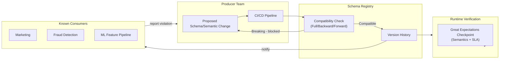
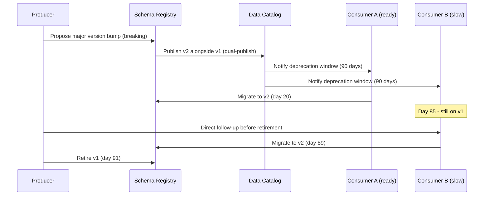
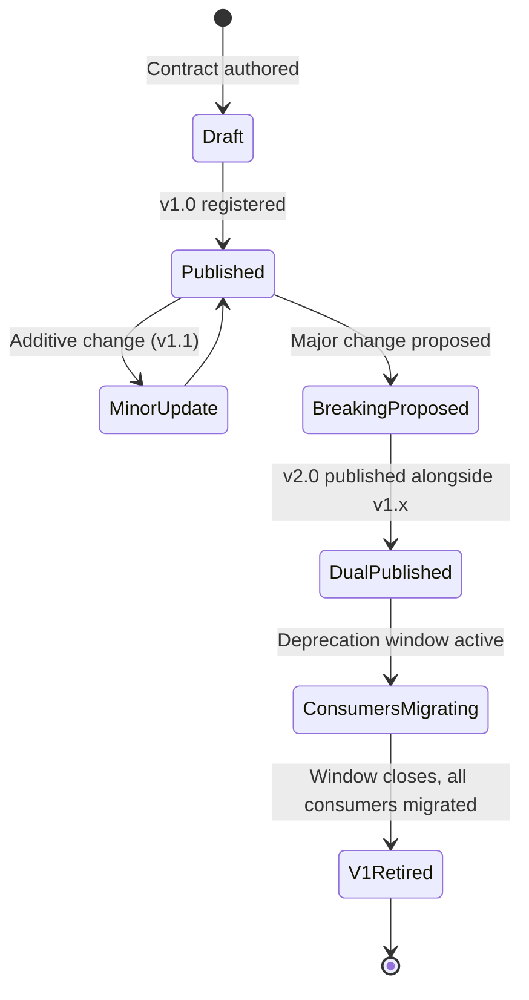

# Data Contracts

> Part of the **Enterprise Data & AI Architecture Handbook** · Phase-08 — Data Governance & Quality · Chapter 07.
> Estimated study time: **45 min reading + ~3h labs**.
> **Prerequisites:** read [Data Quality with Great Expectations](03_Data_Quality_with_Great_Expectations.md) first.

---

## Executive Summary

[Data Quality with Great Expectations](03_Data_Quality_with_Great_Expectations.md#core-concepts) gave a dataset's *consumers* a way to validate what a producer actually delivered. **Data contracts** flip the direction: they give a dataset's *producer* an explicit, machine-enforceable commitment about what they will deliver — schema, semantics, and service-level expectations — before a single consumer has to discover a breaking change the hard way. Every prior Phase-08 chapter assumed schemas and semantics were relatively stable inputs to govern; this chapter addresses what happens when the producer team ships a change, and how to make that change a negotiated, versioned event rather than a silent, downstream-breaking surprise.

This chapter covers the concrete mechanics: the **anatomy of a data contract** — schema, semantics (business meaning, valid ranges, units), and SLA (freshness, availability, support) as three distinct, independently-versioned commitment layers; explicit **producer and consumer responsibilities** under a contract model, inverting the traditional "consumer beware" data-pipeline relationship into a "producer commits" one; **Schema Registry enforcement** — the concrete technical mechanism (Confluent/Azure Schema Registry, or a contract-testing framework) that makes a contract's schema commitment machine-checkable rather than merely documented; **versioning and breaking-change management** — semantic versioning applied to data schemas, and the compatibility modes (backward, forward, full) that determine what counts as a safe, non-breaking change; and the specific role data contracts play as the technical enforcement mechanism for **data mesh's domain-product boundaries**, directly operationalizing the federated operating model from [Data Governance Foundations](01_Data_Governance_Foundations.md#core-concepts).

The governing insight: **a data contract's value comes entirely from being enforced at the point of production, not from being documented.** A schema description in a wiki page is not a contract — it is documentation a producer can silently violate with no immediate consequence. A contract enforced via a CI/CD-integrated schema-compatibility check that fails a producer's build the moment they attempt an incompatible change is what actually prevents the downstream breakage this chapter exists to solve. This is the same distinction [Data Quality with Great Expectations](03_Data_Quality_with_Great_Expectations.md#anti-patterns) drew between a hard-blocking Checkpoint and a "quality theatre" dashboard, applied to the producer side of the pipeline instead of the consumer side.

The bias remains **Azure-primary (~60%)** — Azure Event Hubs' Schema Registry, Microsoft Fabric/Synapse's contract-adjacent governance features, and Azure DevOps/GitHub Actions-integrated schema-compatibility CI gates — **~30% enterprise open source** (Confluent Schema Registry, the open-source Open Data Contract Standard (ODCS), dbt contracts, and Great Expectations for contract-level quality-SLA enforcement) and **~10% AWS/GCP comparison-only** (AWS Glue Schema Registry, GCP's Pub/Sub schema support and Dataplex data-product contracts).

**Bottom line:** a data contract program succeeds when a producer physically cannot ship a breaking schema change without the CI/CD pipeline blocking it, and when consumers can trust a contract's SLA enough to build production dependencies on it without independently re-verifying every field — and fails when contracts exist only as unenforced documentation that producers routinely violate under delivery pressure. An architect who treats data contracts as an API-design discipline applied to data — with the same semantic versioning rigor and compatibility-mode enforcement software APIs have used for decades — closes the last major gap this handbook's governance chapters leave open: consumers trusting data they don't own without depending on the producer's goodwill alone.

---

## Learning Objectives

By the end of this chapter you will be able to:

1. **Author a complete data contract** specifying schema, semantics, and SLA as three distinct, independently-versioned commitment layers.
2. **Define explicit producer and consumer responsibilities** under a contract model, and explain how this inverts the traditional pipeline trust relationship.
3. **Enforce schema contracts via a Schema Registry** with a defined compatibility mode (backward, forward, full), blocking incompatible changes at CI/CD time rather than at runtime.
4. **Apply semantic versioning to data schemas** and classify a proposed change as breaking, non-breaking additive, or non-breaking non-additive.
5. **Design a breaking-change migration process** (dual-publishing, deprecation windows, consumer notification) that lets producers evolve contracts without abrupt consumer breakage.
6. **Implement contracts as the technical enforcement mechanism for data mesh domain boundaries**, tying contract SLAs to the quality gates from [Data Quality with Great Expectations](03_Data_Quality_with_Great_Expectations.md).
7. **Identify data contract anti-patterns** — unenforced "paper" contracts, contracts with no SLA dimension, and versioning schemes that don't distinguish breaking from non-breaking changes.
8. **Map a target data contract architecture onto Azure Event Hubs/Schema Registry**, with an explicit, defensible comparison to AWS Glue Schema Registry and GCP Pub/Sub schema support.

---

## Business Motivation

- **Breaking schema changes are one of the most common, most preventable causes of production data incidents.** A producer team renaming a column, changing a type, or repurposing a field's meaning without warning routinely breaks downstream pipelines, dashboards, and ML models — an incident class this chapter exists specifically to eliminate through upfront, enforced commitment rather than after-the-fact quality gates alone.
- **Consumer teams currently bear the entire cost of producer instability.** Without a contract, every consumer must independently build defensive validation against a producer's schema (duplicating the effort [Data Quality with Great Expectations](03_Data_Quality_with_Great_Expectations.md) addresses per-consumer) rather than the producer bearing the cost of not breaking their own published commitment once.
- **Data mesh's domain-product model is unenforceable without contracts.** [Data Governance Foundations](01_Data_Governance_Foundations.md#core-concepts)' federated operating model gives domains autonomy over their own data, but autonomy without a contractual boundary just relocates the fragmentation risk — a domain can silently break every consumer depending on its "data product" with no accountability mechanism unless a contract exists and is enforced.
- **AI/ML systems are disproportionately fragile to silent schema and semantic drift.** A feature pipeline silently receiving a reinterpreted field (the same column name, now meaning something subtly different) can degrade model performance without triggering any obvious pipeline failure — a contract's semantic-layer commitment (not just schema) is specifically designed to catch this class of failure that a pure schema check misses.
- **Contract-driven development shortens integration time for new consumers.** A consumer building against a published, versioned, SLA-backed contract can build with confidence and less defensive code than one integrating against an undocumented, unstable pipeline output — directly reducing the discovery-and-defensive-coding cost highlighted in [Data Catalog and Lineage](02_Data_Catalog_and_Lineage.md#business-motivation).

---

## History and Evolution

- **2000s — API contracts (WSDL, later OpenAPI/Swagger) formalize service-to-service interface commitments**, establishing the pattern this chapter directly borrows: a machine-readable, versioned specification of what a service promises to provide, enforced by tooling rather than trusted by convention.
- **2010s — Schema Registry patterns emerge in the streaming ecosystem**, most notably **Confluent Schema Registry** (2015) for Kafka, formalizing schema versioning and compatibility-mode enforcement (backward/forward/full compatibility) specifically for event-streaming producers and consumers — the direct technical ancestor of this chapter's schema-enforcement mechanism.
- **2019-2021 — Data mesh's "data as a product" principle (Zhamak Dehghani) explicitly names contracts as a required characteristic of a well-formed data product** — a domain's data product must be discoverable, addressable, trustworthy, self-describing, interoperable, and secure, with an explicit contract underpinning several of these properties, directly motivating this chapter's [Core Concepts §8.5](#core-concepts).
- **2021-2022 — dbt introduces model contracts**, bringing schema-enforcement discipline directly into the transformation layer (a dbt model's contract defines and enforces its output column names, types, and constraints, failing the `dbt build` if the model's actual output violates them) — a significant step in normalizing contracts as a mainstream data-engineering practice rather than a niche streaming-specific pattern.
- **2022-2023 — The term "data contract" gains broad industry adoption** beyond streaming-specific schema registries, popularized through widely-cited practitioner writing (Chad Sanderson and others) framing data contracts explicitly as the producer-side discipline needed to make data mesh's domain autonomy sustainable rather than chaotic.
- **2023-2024 — The Open Data Contract Standard (ODCS)** and similar open specifications emerge, aiming to standardize data contract format (schema, semantics, SLA, quality rules) across tools the same way OpenAPI standardized REST API contracts, reducing the risk of every organization inventing an incompatible, bespoke contract format.
- **2024-present — Contract enforcement increasingly integrates directly with catalog and quality tooling**, with contract violations feeding the certification signal from [Data Catalog and Lineage](02_Data_Catalog_and_Lineage.md#core-concepts) and contract SLA checks implemented as Great Expectations Checkpoints, reflecting the broader Phase-08 theme of governance mechanisms converging into one integrated system rather than remaining disconnected tools.

---

## Why This Technology Exists

A data pipeline's output schema and semantics have historically been an implicit, undocumented byproduct of whatever the producer's code happens to do — discoverable only by inspecting the data itself or asking the producer team directly, and with no mechanism preventing the producer from changing that behavior at any time without notice. This works acceptably when a pipeline has one internal consumer maintained by the same team, but breaks down completely the moment a dataset has multiple independent downstream consumers (the normal state for any dataset valuable enough to be worth governing) — each consumer is exposed to unannounced changes with no recourse. Data contracts exist to convert this implicit, unstable relationship into an explicit, versioned, enforced commitment, borrowing directly from decades of software API contract discipline that data engineering was slow to adopt.

---

## Problems It Solves

- **Silent, unannounced breaking changes** — a Schema Registry-enforced compatibility check blocks a producer from shipping an incompatible schema change without an explicit version bump and migration process.
- **Ambiguous field semantics** — a contract's semantic layer (units, valid ranges, business meaning) catches the "same schema, different meaning" failure mode that a pure schema check misses (e.g., a `revenue` field silently switching from USD to local currency).
- **Undefined freshness/availability expectations** — an SLA layer gives consumers an explicit, agreed freshness and uptime commitment to build against, rather than an implicit assumption that may not match the producer's actual operational reality.
- **Fragmented, duplicated defensive validation** — consumers building against a trusted, enforced contract can reduce (though not eliminate) their own independent validation burden, since the producer bears responsibility for the commitment's accuracy.
- **Unenforceable data mesh domain boundaries** — a published, versioned data-product contract is the concrete mechanism that makes a domain's autonomy compatible with the rest of the organization's stability needs.

---

## Problems It Cannot Solve

- **It cannot make a producer team prioritize contract maintenance without organizational backing.** A contract that isn't tied to the producer team's own accountability and incentives (mirroring the ownership model from [Data Governance Foundations](01_Data_Governance_Foundations.md#core-concepts)) is easily deprioritized under delivery pressure — the enforcement mechanism only works if the organization actually holds producer teams to their published contracts.
- **It cannot substitute for the data quality checks that verify a contract is actually being met at runtime.** A contract defines the *commitment*; [Data Quality with Great Expectations](03_Data_Quality_with_Great_Expectations.md)'s Checkpoints are what actually *verify* the commitment is being honored on an ongoing basis — a contract without a corresponding quality check is an unverified promise.
- **It cannot prevent every category of breaking change through schema enforcement alone.** A schema-compatible change can still be semantically breaking (a field's meaning changes while its type and name stay identical) — schema-level Schema Registry enforcement alone does not catch this; it requires the semantic-layer commitment and quality checks working together.
- **It cannot eliminate the fundamental tension between producer velocity and consumer stability.** Contracts make trade-offs explicit and negotiated rather than eliminating them — a producer wanting to ship a breaking change quickly and consumers wanting stability will always have some tension; a contract's versioning and deprecation-window process manages this tension, it does not remove it.
- **It cannot retroactively fix an already-fragmented, contract-less data estate by itself.** Introducing contracts for new datasets is straightforward; retrofitting contracts onto a large existing estate of undocumented, unstable pipelines requires the same phased, priority-driven rollout discipline as any other Phase-08 governance capability.

---

## Core Concepts

### 8.1 Contract Anatomy: Schema, Semantics, SLA

A complete data contract specifies three distinct, independently-versioned layers:

- **Schema** — the structural contract: field names, types, nullability, and structural constraints (e.g., a `customer_id` field is a non-nullable string). This is the layer a Schema Registry mechanically enforces.
- **Semantics** — the business-meaning contract: what a field actually represents, its valid range or enumeration, its unit of measure, and any business rules relating fields to each other (e.g., `order_total` equals the sum of line items minus discounts, expressed in USD, always non-negative). This layer is not typically enforceable by a Schema Registry alone and usually requires a data-quality-check layer (per [Data Quality with Great Expectations](03_Data_Quality_with_Great_Expectations.md#core-concepts)) to verify.
- **SLA (Service Level Agreement)** — the operational commitment: freshness (data available by a specific time or within a specific lag), availability (uptime of the serving endpoint or pipeline), completeness (expected row-count tolerance), and support commitments (who to contact, response time for a reported contract violation).

Treating these as three separate, independently-versioned layers matters because they evolve at different rates and require different enforcement mechanisms — a schema can remain perfectly stable while an SLA commitment changes (a producer improving freshness from daily to hourly), and a schema change can be fully backward-compatible while still requiring a semantic-layer version bump (adding a new valid enum value that downstream logic wasn't written to handle).

### 8.2 Producer and Consumer Responsibilities

A contract model explicitly assigns responsibility, inverting the implicit "consumer must defensively validate everything" default:

- **Producer responsibilities**: publish and version the contract; run compatibility checks in CI/CD before any schema change ships; honor the published SLA; provide advance notice and a deprecation window for breaking changes; maintain backward compatibility within a major version.
- **Consumer responsibilities**: consume against a specific, pinned contract version (not an unversioned "latest" assumption); monitor for and respond to deprecation notices within the published migration window; report contract violations (data that doesn't match the published schema/semantics/SLA) back to the producer rather than silently working around them.

This explicit division is what converts data contracts from a nice-to-have documentation practice into an actual accountability mechanism — a consumer who was following their responsibilities (pinned to a specific version, monitoring deprecation notices) has a legitimate grievance if a producer breaks compatibility within that version; a consumer who ignored deprecation notices for six months does not.

### 8.3 Schema Registry Enforcement

A **Schema Registry** is the concrete technical mechanism making the schema layer of a contract machine-enforceable rather than merely documented: producers register their schema (typically Avro, Protobuf, or JSON Schema) with the registry, and every schema change is checked against a configured **compatibility mode** before being accepted:

- **Backward compatible** — new schema can read data written with the old schema (safe to add optional fields with defaults, unsafe to remove required fields or change types).
- **Forward compatible** — old schema can read data written with the new schema (safe to remove optional fields, unsafe to add new required fields without defaults).
- **Full compatible** — both backward and forward compatible simultaneously (the strictest, safest mode, typically the recommended default for any contract with multiple independent consumers who cannot all upgrade in lockstep).

The registry rejects any schema registration attempt violating the configured compatibility mode, which is what makes this enforcement rather than convention — a producer's CI/CD pipeline calling the registry's compatibility-check API before deployment is what actually blocks a breaking change from shipping, mirroring the hard-gate pattern from [Data Quality with Great Expectations](03_Data_Quality_with_Great_Expectations.md#core-concepts) applied to schema evolution specifically.

### 8.4 Versioning and Breaking Changes

Data contracts should apply **semantic versioning** (MAJOR.MINOR.PATCH) analogous to software APIs:

- **PATCH** — non-functional changes (documentation, description clarifications) with no schema or semantic impact.
- **MINOR** — backward-compatible additive changes (a new optional field, a new enum value consumers can safely ignore).
- **MAJOR** — breaking changes (removing or renaming a field, changing a type, tightening a previously-optional field to required, changing a field's semantic meaning) requiring consumer awareness and, typically, a **deprecation window** — the old (N-1) major version remains available and dual-published alongside the new version for an agreed period, giving consumers time to migrate before the old version is retired.

The critical discipline: a proposed change must be explicitly classified (breaking vs. non-breaking) *before* implementation, not discovered to be breaking only after a consumer's pipeline fails — this classification is exactly what the Schema Registry's compatibility-mode check automates for the schema layer, while semantic-layer breaking changes require a manual or Great Expectations-based review since they aren't always mechanically detectable from the schema alone.

### 8.5 Data Contracts in Data Mesh

Data mesh's domain-product model (from [Data Governance Foundations](01_Data_Governance_Foundations.md#core-concepts) and [Master Data Management](05_Master_Data_Management.md#core-concepts)) requires every domain's published data product to have an explicit contract as one of its defining properties (alongside discoverability via the catalog and trustworthiness via quality gates) — without a contract, a domain's autonomy to evolve its own data product independently would otherwise directly threaten every consumer depending on it, exactly the risk this chapter's Business Motivation identifies. The contract is what makes domain autonomy *safe*: a domain team can change their data product's internals freely, as long as the published contract's guarantees are honored (or evolved through the versioning/deprecation process), giving consumers stability without requiring the producing domain to ask permission for every internal change — the same "guardrails over gates" principle from [Architecture Governance](../Phase-01/02_Architecture_Governance.md#core-concepts) applied to data-product evolution.

---

## Internal Working

A contract-enforced pipeline's producer-side workflow, on every proposed change:

1. **Change proposal** — a producer engineer proposes a schema or semantic change (e.g., adding a field, changing a type) as a pull request modifying the contract definition (typically stored as a version-controlled schema file alongside pipeline code).
2. **Automated compatibility check** — CI/CD invokes the Schema Registry's (or equivalent contract-testing tool's) compatibility-check API against the currently-published contract version, classifying the proposed change as compatible or breaking under the configured compatibility mode.
3. **Gate decision** — a compatible change proceeds through normal code review and deployment; a breaking change is blocked from merging until the engineer either revises the change to be non-breaking or explicitly initiates the major-version bump and deprecation-window process.
4. **Version publication** — an accepted change (compatible, or a deliberately-versioned breaking change) is published to the registry, updating the contract's current version and, for a breaking change, beginning dual-publication of both the old and new major versions.
5. **Consumer notification** — for a breaking change, an automated notification (via the catalog's event system from [Metadata Management](04_Metadata_Management_OpenMetadata_and_Atlas.md#core-concepts), or a direct subscriber list) informs known consumers of the new version, the deprecation timeline for the old version, and the migration guide.
6. **Deprecation monitoring** — the producer monitors consumption of the deprecated (N-1) version, following up with consumers who haven't migrated as the deprecation deadline approaches, before finally retiring the old version.
7. **Runtime SLA and semantic verification** — independently of schema-registry enforcement, scheduled [Data Quality with Great Expectations](03_Data_Quality_with_Great_Expectations.md) Checkpoints continuously verify the contract's semantic and SLA commitments (value ranges, freshness) are actually being met in production, not just that the schema is technically compatible.

---

## Architecture

A contract-enforced data architecture separates the **contract definition and registry** (the version-controlled schema/semantic/SLA specification plus the Schema Registry service enforcing compatibility) from the **enforcement points**: a **CI/CD gate** (blocking incompatible schema changes before deployment) and a **runtime verification layer** (Great Expectations Checkpoints or equivalent, continuously verifying semantic and SLA commitments against actual production data, per [Data Quality with Great Expectations](03_Data_Quality_with_Great_Expectations.md#architecture)). The architectural property this chapter emphasizes most: schema enforcement (CI/CD-time, preventing bad changes from shipping) and quality verification (runtime, detecting when reality drifts from the contract despite a compatible schema) are complementary, not redundant — a mature contract program needs both, since neither alone catches every failure mode a contract is meant to prevent.

---

## Components

- **Contract definition repository** — version-controlled schema/semantic/SLA specifications (e.g., in Avro/Protobuf/JSON Schema plus a structured semantic/SLA annotation format like ODCS).
- **Schema Registry** — the service enforcing compatibility-mode checks on schema registration.
- **CI/CD compatibility gate** — the pipeline stage invoking the registry's compatibility check before deployment.
- **Consumer notification/subscription system** — the mechanism (often integrated with the catalog's event bus from [Metadata Management](04_Metadata_Management_OpenMetadata_and_Atlas.md#core-concepts)) informing consumers of new versions and deprecation timelines.
- **Runtime quality/SLA verification** — Great Expectations Checkpoints (or equivalent) continuously validating semantic and SLA commitments against production data.
- **Dual-publication infrastructure** — the mechanism (parallel topics/tables per major version) supporting simultaneous availability of the current and deprecated contract versions during a migration window.

---

## Metadata

A data contract is itself a rich, structured metadata artifact — and should be published into the catalog from [Data Catalog and Lineage](02_Data_Catalog_and_Lineage.md), not maintained as a separate, disconnected document. The contract's schema/semantic/SLA specification becomes queryable business and technical metadata (per the metadata taxonomy in [Data Catalog and Lineage](02_Data_Catalog_and_Lineage.md#core-concepts)), and contract-version history becomes operational metadata a consumer can query before building a new integration, directly reducing the discovery friction this chapter's Business Motivation identifies.

---

## Storage

Contract definitions are stored as version-controlled files (Avro/Protobuf schema files, or a structured YAML/JSON format like ODCS) in the same Git repository as the producing pipeline's code — consistent with this handbook's repeated pattern of storing governance artifacts (Expectation Suites in [Data Quality with Great Expectations](03_Data_Quality_with_Great_Expectations.md#storage), policy definitions in [Data Governance Foundations](01_Data_Governance_Foundations.md#storage)) as reviewable code rather than a disconnected document. The Schema Registry itself persists the registered schema history and compatibility-check state, typically backed by a durable store internal to the registry service (Kafka-topic-backed for Confluent Schema Registry, a managed store for Azure Event Hubs' Schema Registry).

---

## Compute

Schema compatibility checks are computationally lightweight (comparing schema definitions, not scanning data) and add negligible cost to CI/CD pipeline runtime. Runtime semantic/SLA verification inherits the compute cost profile already established for Great Expectations Checkpoints in [Data Quality with Great Expectations](03_Data_Quality_with_Great_Expectations.md#compute) — the incremental cost of adding contract-specific checks to an existing quality-gated pipeline stage, rather than a separate compute-intensive process.

---

## Networking

The Schema Registry and any contract-metadata catalog integration should sit behind private endpoints consistent with this handbook's standard networking guidance (per [Data Governance Foundations](01_Data_Governance_Foundations.md#networking)), with producer CI/CD pipelines and consumer applications reaching the registry over private connectivity rather than a public endpoint, since a contract's schema can itself reveal sensitive structural detail about an organization's data.

---

## Security

Schema Registry write access (who can register a new schema version) should be scoped to the producing team's service principal/managed identity only — a consumer or unrelated team should never be able to register a schema change on a contract they don't own, mirroring the ownership-based write-access principle established for metadata platforms in [Metadata Management](04_Metadata_Management_OpenMetadata_and_Atlas.md#security). Contract definitions that include sample data or example payloads for documentation purposes must respect the same classification-driven access controls as the underlying data itself (per [Data Governance Foundations](01_Data_Governance_Foundations.md#security)) — a contract's example payload for a Restricted-tier dataset is itself Restricted-tier content.

---

## Performance

Schema compatibility checks execute in milliseconds and impose no meaningful CI/CD latency; the primary performance consideration is ensuring the compatibility-check gate is invoked early in the CI/CD pipeline (ideally at pull-request time, before merge) rather than late (at deployment time), so a breaking change is caught with fast feedback rather than after a longer build/test cycle has already run.

---

## Scalability

Contract program scalability is bounded by the same authoring/maintenance-burden dynamic identified for Expectation Suites in [Data Quality with Great Expectations](03_Data_Quality_with_Great_Expectations.md#scalability) — hand-authoring a bespoke contract per dataset doesn't scale past a modest number of datasets without templates and tooling support (dbt's model-contract feature, generating much of the schema-layer contract directly from the model's own column definitions, is a concrete example of reducing this authoring burden). Dual-publication during deprecation windows adds a temporary, bounded storage/compute overhead proportional to the number of concurrently-supported major versions, which should be kept small (typically no more than two: current and immediately-prior) to avoid unbounded version proliferation.

---

## Fault Tolerance

A Schema Registry outage should fail closed for schema registration (blocking new schema changes from being registered, which is the safe default — better to delay a change than accept an unchecked one) but should not, ideally, block already-running production pipelines that only need to read the already-registered current schema, since those pipelines' compatibility was already validated at their last successful deployment. Dual-publication infrastructure should be resilient enough that a bug in the new (N) version's pipeline doesn't take down the still-supported (N-1) version consumers depend on during the migration window.

---

## Cost Optimization

Data contract enforcement is inexpensive relative to the incidents it prevents: Schema Registry compute/licensing cost (whether Confluent's managed offering, Azure Event Hubs' built-in Schema Registry, or a self-hosted alternative) and CI/CD compatibility-check runtime are both minor compared to the cost of a production incident from an unannounced breaking change. **Worked FinOps example:** Azure Event Hubs' Schema Registry is included at no additional cost beyond the Event Hubs namespace tier already provisioned (Standard tier or above) for an organization already using Event Hubs for streaming ingestion — meaning the primary "cost" of adopting contract enforcement for an Event-Hubs-based architecture is the engineering time to author contracts and wire CI/CD gates, not incremental infrastructure spend; compare this near-zero infrastructure cost against even a single avoided incident of the scale described in [Data Quality with Great Expectations](03_Data_Quality_with_Great_Expectations.md#cost-optimization)'s FinOps example (multi-day backfill plus stakeholder trust repair), which is the standard justification for prioritizing contract-authoring engineering time over treating it as a "nice to have."

---

## Monitoring

Track: **schema-compatibility-check pass/fail rate in CI/CD** (a rising rejection rate may indicate producers frequently attempting breaking changes without going through the proper versioning process, worth investigating for a process gap); **consumer migration progress during deprecation windows** (percentage of known consumers still on the deprecated version as the retirement deadline approaches); **contract-SLA Checkpoint pass rate** (is the producer actually meeting its published freshness/completeness commitments, tracked the same way as any other Great Expectations Checkpoint per [Data Quality with Great Expectations](03_Data_Quality_with_Great_Expectations.md#monitoring)); and **contract violation reports from consumers** (a direct signal of gaps in either the contract's completeness or its enforcement).

---

## Observability

Observability for a data contract program means being able to answer, without manual investigation: *what is the current contract version for this dataset, who are its known consumers, and is the producer currently meeting its schema, semantic, and SLA commitments?* This requires the contract's version history and current compliance state to be surfaced directly in the catalog (per [Data Catalog and Lineage](02_Data_Catalog_and_Lineage.md#observability)) alongside the dataset's certification badge, so a prospective new consumer can assess contract health before building a dependency, not discover it only after integrating.

---

## Governance

Data contract governance builds directly on [Data Governance Foundations](01_Data_Governance_Foundations.md#governance): the data owner is accountable for the contract's accuracy and the producer team's compliance with it, and a breaking-change proposal should go through the same reviewed-change discipline as an Expectation Suite update ([Data Quality with Great Expectations](03_Data_Quality_with_Great_Expectations.md#design-patterns)) or a classification-taxonomy change ([Data Governance Foundations](01_Data_Governance_Foundations.md#governance)) — with the specific addition that a breaking change's deprecation-window length should itself be a governed, negotiated parameter (not unilaterally set by the producer) reflecting the actual migration effort required of known consumers.

**ADR Example — Full Compatibility Mode for a Multi-Consumer Customer Events Contract:**

> **Context:** A retail enterprise's `customer_events` Kafka topic, published by the customer domain team, was consumed by six independent downstream teams (marketing, analytics, fraud detection, recommendation engine, support, and a newly-onboarded ML feature pipeline), each on their own independent deployment schedule. A prior undocumented, unenforced schema change (adding a required field with no default) had broken three of the six consumers simultaneously, each discovering the break independently over several days.
> **Decision:** Register the `customer_events` schema in **Azure Event Hubs' Schema Registry** with **Full compatibility mode** enforced (both backward and forward compatible), requiring every schema change to be safely readable by both older and newer consumer code, and integrate a compatibility-check CI/CD gate blocking any producer deployment that would violate this mode.
> **Consequences:** The customer domain team lost the ability to make certain classes of "convenient" changes (e.g., adding a new required field without a default) without an explicit major-version bump and dual-publication process, in exchange for a guarantee that the six independent consumer teams would never again be broken by an unannounced change; the domain team accepted a modest increase in change-management overhead (a documented deprecation-window process for any genuinely breaking change) as a worthwhile trade given the demonstrated cost of the prior incident.
> **Alternatives considered:** (1) Backward-compatible-only mode — rejected because it would still allow changes that break older consumers who haven't yet upgraded, insufficient given six independently-scheduled consumer teams; (2) No compatibility mode enforcement, relying only on team communication — rejected as the exact practice that had already failed; (3) Require all six consumers to upgrade in lockstep with every producer change — rejected as operationally infeasible given the teams' independent release schedules.

---

## Trade-offs

- **Full compatibility mode vs. backward-only**: Full compatibility maximizes consumer safety for organizations with many independently-scheduled consumers, at the cost of more constrained, sometimes slower producer evolution; backward-only is more permissive for producers but risks breaking consumers who haven't yet upgraded.
- **Schema-only contracts vs. full schema+semantics+SLA contracts**: schema-only contracts are cheaper to author and mechanically enforce but miss the "same schema, different meaning" and freshness/availability failure classes; full contracts provide more complete protection at higher authoring and verification cost.
- **Long deprecation windows vs. short ones**: longer windows give consumers more migration time but extend the dual-publication maintenance burden and delay the producer's ability to fully retire legacy behavior; shorter windows reduce that burden but risk rushing consumers.

---

## Decision Matrix

| Criterion | Schema-only contract (Registry enforcement only) | Full contract (schema + semantics + SLA) |
|---|---|---|
| Authoring effort | Low | Moderate-high |
| Catches structural breaking changes | Yes | Yes |
| Catches semantic drift (same schema, different meaning) | No | Yes (via quality-check verification) |
| Catches freshness/availability regressions | No | Yes (via SLA Checkpoints) |
| Best fit | High-velocity streaming topics with simple, stable semantics | High-value, multi-consumer datasets where semantic or SLA drift has caused prior incidents |

---

## Design Patterns

- **Full compatibility mode for multi-consumer, independently-scheduled topics** — as demonstrated in this chapter's ADR, the safest default when consumers cannot coordinate upgrade timing.
- **Dual-publication during deprecation windows** — maintaining both the current and immediately-prior major version simultaneously, bounded to a small number of concurrent versions.
- **Contract-as-code co-located with producer pipeline code** — version-controlled, pull-request-reviewed schema/semantic/SLA definitions, mirroring the Expectation-Suite-as-code pattern from [Data Quality with Great Expectations](03_Data_Quality_with_Great_Expectations.md#design-patterns).
- **Contract SLA verification via existing quality-gate infrastructure** — implementing SLA/semantic checks as Great Expectations Checkpoints rather than building a separate, parallel verification system.
- **Contract publication into the catalog** — surfacing contract version, compatibility mode, and current compliance state directly alongside a dataset's catalog entry and certification badge.

---

## Anti-patterns

- **Paper contracts** — a documented schema/SLA specification with no Schema Registry or CI/CD enforcement behind it, providing no actual protection against the exact breaking-change scenario the contract was meant to prevent.
- **Schema-only contracts mistaken for complete protection** — enforcing structural compatibility while ignoring the semantic and SLA layers, missing failure classes those layers specifically exist to catch.
- **Unbounded version proliferation** — never retiring old major versions after their deprecation window closes, accumulating an ever-growing dual-publication maintenance burden.
- **Unilateral producer-set deprecation windows** — a producer setting an unrealistically short migration window without negotiating with actual known consumers, effectively reproducing the unannounced-breaking-change problem contracts exist to prevent, just with slightly more notice.
- **Treating contract authoring as a one-time task** rather than an ongoing discipline requiring the same continuous maintenance as the pipeline code and Expectation Suites it accompanies.

---

## Common Mistakes

- Choosing backward-only compatibility mode by default without considering whether multiple, independently-scheduled consumers actually require the stricter full-compatibility guarantee.
- Failing to integrate the compatibility-check gate early enough in CI/CD (at deployment time rather than pull-request time), delaying feedback to the engineer proposing a change.
- Building a contract program that only addresses the schema layer, leaving semantic and SLA commitments as informal, unenforced assumptions.
- Not maintaining a known-consumers list per contract, making it impossible to notify affected teams proactively when a breaking change or deprecation is planned.
- Allowing a "temporary" dual-publication period to persist indefinitely because no one owns the responsibility of following through on the old version's actual retirement.

---

## Best Practices

- Default to full compatibility mode for any contract with more than one independently-scheduled consumer, following this chapter's ADR reasoning.
- Author contracts covering all three layers (schema, semantics, SLA) for high-value, multi-consumer datasets, reserving schema-only enforcement for lower-stakes, single-consumer, or purely internal topics.
- Integrate contract SLA/semantic verification directly into the existing Great Expectations Checkpoint infrastructure from [Data Quality with Great Expectations](03_Data_Quality_with_Great_Expectations.md) rather than building parallel tooling.
- Maintain an explicit, current known-consumers registry per contract (feeding from the lineage graph in [Data Catalog and Lineage](02_Data_Catalog_and_Lineage.md#core-concepts) where possible) so breaking-change notifications reach every affected team.
- Negotiate deprecation-window length with actual known consumers rather than setting it unilaterally, and track migration progress explicitly rather than assuming silence means readiness.

---

## Enterprise Recommendations

- Prioritize contract adoption for the highest-value, most multi-consumer, highest-prior-incident-rate data products first (following the same value-based sequencing recommended throughout this handbook's Phase-08 chapters), rather than attempting a uniform, all-at-once contract rollout.
- Fold contract SLA verification into existing quality-gate infrastructure and reporting rather than standing up a separate, disconnected contract-monitoring system.
- Formalize the producer/consumer responsibility split (per [Core Concepts §8.2](#core-concepts)) as an explicit, organization-wide policy, not a per-team informal agreement, so accountability is consistent regardless of which team is producing or consuming.

---

## Azure Implementation

- **Azure Event Hubs' built-in Schema Registry** provides Avro-based schema registration and compatibility-mode enforcement (backward, forward, full/both) directly integrated with Event Hubs' Kafka-compatible endpoint, at no additional cost beyond the Event Hubs namespace tier.
- **dbt contracts**, run against models materialized in Azure Synapse/Databricks-backed Delta tables, provide schema-layer contract enforcement directly at the transformation-model level, failing the `dbt build` if a model's actual output columns/types diverge from its declared contract.
- **Azure DevOps Pipelines / GitHub Actions** integrate the Schema Registry's compatibility-check API (or dbt's contract validation) as a required CI/CD gate on any pull request modifying a producer's schema, blocking merge on an incompatible change.
- Example: registering an Avro schema with the Event Hubs Schema Registry and setting Full compatibility mode via CLI:

```bash
az eventhubs schema-group create \
  --resource-group contoso-rg \
  --namespace-name contoso-eventhubs \
  --name customer-events-schema-group \
  --schema-compatibility Full \
  --schema-type Avro
```

- Example dbt model contract enforcing schema-layer commitments directly in the transformation layer:

```yaml
models:
  - name: fact_customer_events
    config:
      contract:
        enforced: true
    columns:
      - name: customer_id
        data_type: string
        constraints:
          - type: not_null
      - name: event_timestamp
        data_type: timestamp
        constraints:
          - type: not_null
      - name: event_type
        data_type: string
```

- Example Great Expectations Checkpoint enforcing the contract's semantic and SLA layers (order-total range and freshness), integrated into the same Checkpoint infrastructure from [Data Quality with Great Expectations](03_Data_Quality_with_Great_Expectations.md#azure-implementation):

```python
validator.expect_column_values_to_be_between("order_total", min_value=0)
validator.expect_table_row_count_to_be_between(min_value=1)  # completeness SLA
validator.expect_column_max_to_be_between(
    column="event_timestamp", min_value=freshness_sla_cutoff
)  # freshness SLA
```

---

## Open Source Implementation

- **Confluent Schema Registry** remains the most widely adopted open-source/commercial Schema Registry for Kafka-based architectures, with the same compatibility-mode enforcement model this chapter describes generally.
- **dbt contracts** (open-source dbt Core feature) bring schema-layer enforcement directly into the SQL transformation layer without requiring a separate streaming-oriented registry, well suited to batch/warehouse-centric architectures.
- **The Open Data Contract Standard (ODCS)** provides a vendor-neutral specification format for capturing schema, semantics, and SLA together in one structured document, aiming to do for data contracts what OpenAPI did for REST APIs — reducing the risk of every organization inventing an incompatible, bespoke format.
- **Great Expectations** (per [Data Quality with Great Expectations](03_Data_Quality_with_Great_Expectations.md)) is the recommended open-source mechanism for verifying a contract's semantic and SLA layers at runtime, complementing schema-layer enforcement rather than duplicating it.

---

## AWS Equivalent (comparison only)

AWS's equivalent is the **AWS Glue Schema Registry**, providing Avro/JSON Schema/Protobuf registration and compatibility-mode enforcement, natively integrated with Kinesis Data Streams and MSK (Managed Kafka). **Advantages:** tight native integration with AWS's streaming services and no additional cost beyond the underlying Kinesis/MSK usage. **Disadvantages:** semantic-layer and SLA-layer contract support is not natively built into Glue Schema Registry itself (comparable to Azure's position) — organizations must layer a separate quality-verification tool (Deequ/AWS Glue Data Quality, per [Data Quality with Great Expectations](03_Data_Quality_with_Great_Expectations.md#aws-equivalent-comparison-only)) on top, same as the Azure pattern. **Migration strategy:** map Azure Event Hubs Schema Registry schemas and compatibility modes directly to AWS Glue Schema Registry's equivalent configuration; CI/CD gate logic requires only an endpoint/SDK change, not a conceptual redesign. **Selection criteria:** AWS-primary organizations already using Kinesis/MSK will find Glue Schema Registry a natural, low-friction fit; Azure-primary organizations will find Event Hubs' Schema Registry equally capable and already included in their existing Event Hubs investment.

---

## GCP Equivalent (comparison only)

GCP's equivalent is **Pub/Sub schema support**, providing Avro/Protobuf schema registration and validation for Pub/Sub topics, with **Dataplex's data-product/aspect model** providing a complementary layer for documenting broader contract-like metadata (ownership, classification) beyond pure schema. **Advantages:** native, low-friction integration with Pub/Sub-based streaming architectures. **Disadvantages:** Pub/Sub's schema support is comparatively less mature in compatibility-mode granularity than Confluent/Azure Event Hubs' Schema Registry, and semantic/SLA-layer contract enforcement similarly requires a separate quality-verification layer (Dataplex Data Quality, per [Data Quality with Great Expectations](03_Data_Quality_with_Great_Expectations.md#gcp-equivalent-comparison-only)). **Migration strategy:** map Event Hubs schema definitions to Pub/Sub schema resources; semantic/SLA verification logic ports to Dataplex Data Quality rules with generally straightforward conceptual mapping. **Selection criteria:** GCP-primary, Pub/Sub-centric organizations will find native schema support sufficient for basic structural contracts; organizations needing rigorous, multi-consumer compatibility-mode enforcement may still find Confluent Schema Registry (portable across clouds) or Azure Event Hubs' more mature offering preferable even within a broader GCP architecture.

---

## Migration Considerations

- **From no contracts to schema-only enforcement**: start with dbt contracts or Schema Registry compatibility checks for the highest-value, most multi-consumer datasets, following the same value-prioritized sequencing recommended throughout this handbook.
- **From schema-only to full (schema+semantics+SLA) contracts**: layer Great Expectations Checkpoint-based semantic/SLA verification onto datasets already covered by schema-layer enforcement, rather than attempting to author all three layers simultaneously for every dataset.
- **From backward-only to full compatibility mode**: audit existing consumers' actual upgrade cadences first — if consumers are genuinely independently scheduled (as in this chapter's ADR), the stricter mode is warranted; if all consumers reliably upgrade in lockstep with the producer, backward-only may be a defensible, lower-friction choice.
- **Between Schema Registry platforms (e.g., Confluent to Azure Event Hubs' registry) during a cloud migration**: schema definitions and compatibility-mode configuration generally port with straightforward, mechanical translation, but re-validate the full compatibility-check behavior post-migration since subtle implementation differences between registry products can exist.

---

## Mermaid Architecture Diagrams

**Data contract enforcement architecture:**



**Breaking-change deprecation sequence:**



**Contract version lifecycle state diagram:**



---

## End-to-End Data Flow

1. The customer domain team proposes adding a new required `loyalty_tier` field to the `customer_events` contract — a breaking change under Full compatibility mode since older consumer code cannot handle a new required field without a default.
2. The CI/CD compatibility-check gate against Azure Event Hubs' Schema Registry rejects the direct merge, prompting the team to instead initiate a major-version bump (v1 to v2) with the new field, following the documented deprecation process.
3. The registry dual-publishes v1 and v2 simultaneously; the catalog's event system (per [Metadata Management](04_Metadata_Management_OpenMetadata_and_Atlas.md#core-concepts)) notifies all six known consumer teams of the new version and a negotiated 90-day deprecation window for v1.
4. Five consumer teams migrate to v2 within the first 30 days; the fraud-detection team, mid-way through an unrelated migration of their own, requests and is granted a 30-day extension, tracked explicitly rather than silently allowed to lapse.
5. Throughout the deprecation window, a Great Expectations Checkpoint continuously verifies both v1 and v2's semantic and SLA commitments (freshness, valid ranges) are being met for whichever version each consumer is currently reading.
6. At day 120 (after the extension), the fraud-detection team completes migration, and the customer domain team retires v1, closing the deprecation window with zero consumers broken — the direct outcome the contract program's enforcement and negotiated deprecation process were designed to produce.

---

## Real-world Business Use Cases

- **A retail enterprise's multi-consumer customer-events topic** (this chapter's ADR) eliminated a recurring class of simultaneous multi-team breakage by moving from undocumented, unenforced schema changes to Full-compatibility-mode Schema Registry enforcement.
- **A financial services firm's regulatory reporting data product** used full (schema+semantics+SLA) contracts to give its risk-aggregation consuming systems an auditable, enforced guarantee of both structural stability and freshness, directly supporting BCBS 239-style regulatory evidence requirements.
- **A SaaS company's internal data mesh rollout** used published data-product contracts as the concrete mechanism making domain teams' autonomy sustainable — each domain could evolve its own data product's internals freely as long as its contract's guarantees were honored, without requiring central-team sign-off for every internal change.

---

## Industry Examples

- **Confluent's Schema Registry** remains the reference implementation and origin of the compatibility-mode enforcement model this chapter builds on, widely adopted across the Kafka ecosystem well beyond Confluent's own commercial offering.
- **Chad Sanderson's** widely-cited industry writing and conference talks on data contracts directly popularized the "producer commits, consumer trusts" framing this chapter uses, and are commonly credited with mainstreaming the term "data contract" itself beyond its earlier, narrower streaming-schema-registry usage.
- **dbt Labs'** introduction of native model contracts brought contract-enforcement discipline into the batch/warehouse transformation layer specifically, extending a previously streaming-centric practice to the broader data-engineering mainstream.
- **Zhamak Dehghani's** data mesh writing explicitly names contracts as one of a well-formed data product's required characteristics, directly informing this chapter's [Core Concepts §8.5](#core-concepts).

---

## Case Studies

**Case Study 1 — A Paper Contract That Provided No Actual Protection.** A logistics enterprise's data platform team authored comprehensive, well-written schema and SLA documentation for its shipment-events dataset, publishing it to an internal wiki and communicating it broadly. Six months later, a producer engineer under deadline pressure changed a field's type (from string to integer) to fix an unrelated internal bug, without realizing the documented contract prohibited breaking changes — no Schema Registry or CI/CD gate existed to stop them, because the "contract" was purely descriptive documentation, never wired to any enforcement mechanism. Three downstream consumers broke simultaneously. The retro's conclusion, directly reinforcing this chapter's central thesis, was that a contract not backed by an actual Schema Registry compatibility check and CI/CD gate provides no more protection than no contract at all — the remediation implemented exactly the Schema Registry-plus-CI/CD-gate architecture described in this chapter, converting the wiki documentation from the contract itself into merely a human-readable summary of the now-enforced, machine-checked contract.

**Case Study 2 — An Unrealistic Deprecation Window Set Unilaterally by the Producer.** A manufacturing enterprise's inventory domain team announced a breaking schema change with a two-week deprecation window, set unilaterally without consulting any of the four known downstream consumers, several of which had existing release-freeze periods and multi-sprint migration backlogs that made a two-week turnaround infeasible. Two consumers missed the deadline, and the producer team, facing internal pressure to retire the old version on schedule, did so anyway — breaking both remaining consumers despite the existence of a formally-documented deprecation process. The remediation formalized deprecation-window length as a negotiated, not unilaterally producer-set, parameter — requiring the producer to poll known consumers' realistic migration timelines before finalizing a retirement date, and explicitly tracking migration progress (per this chapter's Monitoring guidance) rather than assuming silence meant readiness.

---

## Hands-on Labs

1. **Register a sample Avro schema with Azure Event Hubs' Schema Registry** (or Confluent Schema Registry locally), configure Full compatibility mode, and attempt both a compatible and a deliberately-breaking schema change to observe the enforcement behavior.
2. **Author a dbt model contract** for a sample transformation model, and deliberately introduce a column-type mismatch to observe `dbt build` fail the contract check.
3. **Design a complete contract** (schema, semantics, SLA) for a hypothetical `order_events` dataset, and implement its semantic/SLA layer as a Great Expectations Checkpoint.
4. **Simulate a breaking-change deprecation process**: draft a consumer-notification message, a migration guide, and a negotiated deprecation-window timeline for a hypothetical major-version bump.
5. **Build a known-consumers registry** for a sample dataset (even a simple structured document), and design an automated notification mechanism that would alert each listed consumer on a version-bump event.

---

## Exercises

1. A colleague argues "we don't need Full compatibility mode, backward-compatible is enough." Using this chapter's ADR, construct a scenario where backward-only compatibility still results in a broken consumer.
2. Using Case Study 1, explain precisely what distinguishes documented governance from enforced governance, and why the distinction matters practically, not just semantically.
3. Critique a contract that only specifies schema with no semantic or SLA layer. Construct a concrete example of a change that would pass schema-compatibility checks but still break a consumer.
4. Design a deprecation-window negotiation process that avoids the unilateral-timeline failure mode from Case Study 2, specifying exactly how consumer input is gathered and what happens if a consumer requests an unreasonably long extension.
5. Explain why dbt contracts and Schema Registry-based contracts are complementary rather than competing approaches, and identify which architecture (streaming vs. batch/warehouse) each is naturally suited to.

---

## Mini Projects

- **End-to-End Contract Enforcement Pipeline**: build a small pipeline with a registered schema (Confluent or Azure Event Hubs Schema Registry), a CI/CD compatibility gate, and a Great Expectations Checkpoint verifying a semantic/SLA rule, demonstrating both a passing compatible change and a blocked breaking change.
- **Deprecation Window Tracker**: build a small tool/script tracking known consumers' migration status during a simulated deprecation window, flagging consumers approaching the retirement deadline without having migrated.
- **Contract Catalog Integration**: design (and, if feasible, implement) a small integration publishing contract version and compliance state directly into a catalog entry (Purview, OpenMetadata, or a mock), extending the certification signal from [Data Catalog and Lineage](02_Data_Catalog_and_Lineage.md#core-concepts) to reflect contract health.

---

## Capstone Integration

This chapter's contract enforcement mechanism is the technical guarantee underpinning [Master Data Management](05_Master_Data_Management.md)'s golden-record consumers, the certification signal in [Data Catalog and Lineage](02_Data_Catalog_and_Lineage.md), and the domain-product boundaries that make [Data Governance Foundations](01_Data_Governance_Foundations.md)'s federated operating model sustainable at scale. Together with [Data Quality with Great Expectations](03_Data_Quality_with_Great_Expectations.md), it closes the producer-and-consumer accountability loop this entire phase has built toward. In the handbook's capstone (Phase-20), data contracts are the mechanism the capstone reference platform uses to demonstrate that its domain-oriented, federated data products can evolve independently without silently breaking each other — the concrete technical proof that the governance operating model established across this phase is more than a documented aspiration.

---

## Interview Questions

1. What are the three layers of a complete data contract?
   **A:** Schema (structural: field names, types, nullability), semantics (business meaning: units, valid ranges, business rules), and SLA (operational: freshness, availability, completeness, support commitments) — each independently versioned and requiring a different enforcement mechanism.
2. What is the difference between backward, forward, and full schema compatibility?
   **A:** Backward compatible means new schema can read old data; forward compatible means old schema can read new data; full compatible means both simultaneously — full is the strictest and safest mode for datasets with multiple independently-scheduled consumers who cannot all upgrade in lockstep.
3. Why is a documented contract with no Schema Registry enforcement not actually a contract?
   **A:** As Case Study 1 demonstrates, documentation alone provides no mechanism preventing a producer from violating it — a "contract" is only meaningfully different from ordinary documentation when a compatibility check actually blocks an incompatible change from shipping.
4. Why can a schema-compatible change still be a breaking change?
   **A:** Schema compatibility only checks structure (field names, types); it cannot detect a semantic change where a field's meaning shifts while its type and name remain identical (e.g., a currency field silently switching units) — this is why the semantic layer requires separate, typically quality-check-based verification.
5. How do data contracts relate to data mesh?
   **A:** Data mesh's federated domain-ownership model requires each domain's published data product to have an explicit, enforced contract — without one, a domain's autonomy to evolve its own product internally would silently threaten every downstream consumer, reproducing the fragmentation data mesh's governance model is meant to prevent.

---

## Staff Engineer Questions

1. Your team's Schema Registry compatibility-check rejection rate has been rising over the past quarter. What would you investigate?
   **A:** Determine whether producers are frequently attempting genuinely breaking changes without going through the proper major-version/deprecation process (a process-adherence gap) versus whether the configured compatibility mode is stricter than the team's actual multi-consumer needs require (a configuration-tuning question) — these point to different fixes.
2. How would you design the boundary between what a Schema Registry enforces and what a Great Expectations Checkpoint verifies for the same contract?
   **A:** The Schema Registry should own structural compatibility checks at CI/CD/deployment time (fast, mechanical, blocking); Great Expectations should own semantic and SLA verification at runtime against actual production data (since these require inspecting data values and timing, not just schema structure) — treating them as complementary layers, not a choice between them.
3. A known consumer requests an extension to a deprecation window that would push the old version's retirement well beyond your team's planned timeline. How do you handle it?
   **A:** Evaluate the request against the consumer's stated migration blocker (per Case Study 2's lesson that unilateral timelines cause breakage) — grant a reasonable, time-boxed extension with a firm new deadline and explicit tracking, rather than either unilaterally refusing (risking a Case-Study-2-style break) or granting an indefinite, untracked extension that never actually resolves.

---

## Architect Questions

1. Design a data contract adoption plan for an organization with 200 datasets and no existing contract discipline, given limited engineering bandwidth.
   **A:** Prioritize the highest-value, most multi-consumer, highest-prior-incident-rate datasets first for full (schema+semantics+SLA) contracts; apply lightweight, low-effort schema-only enforcement (dbt contracts, if warehouse-centric) broadly across the remaining datasets as a baseline safety net, mirroring the tiered-investment pattern already established for quality gates in [Data Quality with Great Expectations](03_Data_Quality_with_Great_Expectations.md#architect-questions).
2. How would you design the governance process for negotiating deprecation-window length across a large number of consumers with varying migration capacity?
   **A:** Require producers to formally poll known consumers (via the catalog's registered consumer list) for realistic migration timelines before finalizing a retirement date, set the window to accommodate the median-to-upper range of stated needs rather than the fastest consumer's capability, and track migration progress explicitly with a defined escalation path for consumers approaching the deadline without progress — directly addressing Case Study 2's unilateral-timeline failure.
3. A newly-formed data mesh domain wants full autonomy to evolve its data product with no external review of its contract changes. How do you reconcile domain autonomy with organization-wide stability?
   **A:** Grant the domain full autonomy over its data product's *internal* implementation, but require any *contract-visible* breaking change to go through the same reviewed major-version/deprecation-window process as any other domain — autonomy applies to internals, not to the published, externally-depended-upon contract surface, directly implementing the "guardrails over gates" philosophy from [Architecture Governance](../Phase-01/02_Architecture_Governance.md#core-concepts) applied to data-product evolution.

---

## CTO Review Questions

1. What percentage of our high-value, multi-consumer datasets currently have an enforced (not just documented) schema contract?
   **A:** This is the direct test of whether the organization has real contract enforcement or, as in Case Study 1, only unenforced documentation providing a false sense of protection — a low percentage on the highest-value datasets is the priority gap to close regardless of how much documentation otherwise exists.
2. How many production incidents in the last year were caused by an unannounced breaking schema or semantic change, and is that number trending down as contract adoption increases?
   **A:** This should be a tracked, reportable metric directly tied to contract program ROI; a persistently high incident rate despite claimed contract adoption suggests either insufficient enforcement (schema-only when semantic/SLA coverage was needed) or poor process adherence (producers bypassing the CI/CD gate), not a fundamental flaw in the contract approach itself.
3. If a major producer team wanted to ship a breaking change to a widely-consumed dataset tomorrow, does our process guarantee every known consumer is notified and given adequate migration time, or could this repeat a Case-Study-2-style unilateral deadline?
   **A:** This should be answerable by pointing to a documented, consistently-followed deprecation-negotiation process (per this chapter's Architect Questions guidance) rather than relying on individual producer teams' goodwill or communication diligence — if the honest answer depends on which team happens to be shipping the change, the governance process has a consistency gap regardless of how well contracts work when producers happen to follow best practice voluntarily.

---

## References

- Confluent. *Schema Registry and Compatibility Modes Documentation.* https://docs.confluent.io/platform/current/schema-registry/
- dbt Labs. *dbt Model Contracts Documentation.* https://docs.getdbt.com/docs/collaborate/govern/model-contracts
- Open Data Contract Standard (ODCS). *Specification.* https://bitol-io.github.io/open-data-contract-standard/
- Dehghani, Zhamak. *Data Mesh: Delivering Data-Driven Value at Scale* (Chapter on data product contracts). O'Reilly Media, 2022.
- Sanderson, Chad. *Data Contracts: The Definitive Guide* (industry writing on producer/consumer accountability). https://dataqualitycamp.substack.com/
- Microsoft. *Azure Event Hubs Schema Registry Documentation.* https://learn.microsoft.com/azure/event-hubs/schema-registry-overview
- AWS. *AWS Glue Schema Registry Documentation.* https://docs.aws.amazon.com/glue/latest/dg/schema-registry.html
- Google Cloud. *Pub/Sub Schemas Documentation.* https://cloud.google.com/pubsub/docs/schemas
- Basel Committee on Banking Supervision. *BCBS 239 — Principles for effective risk data aggregation and risk reporting.* https://www.bis.org/publ/bcbs239.htm

---

## Further Reading

- Sanderson, Chad. *Data Contracts and the Future of Data Engineering* (blog series). https://dataqualitycamp.substack.com/
- Confluent. *Schema Evolution and Compatibility.* https://docs.confluent.io/platform/current/schema-registry/avro.html
- dbt Labs. *Model Contracts and Versioning Guide.* https://docs.getdbt.com/docs/collaborate/govern/model-versions
- Fowler, Martin. *Consumer-Driven Contracts: A Service Evolution Pattern* (foundational API-contract concept this chapter's data-contract model borrows from). https://martinfowler.com/articles/consumerDrivenContracts.html
- Bitol.io. *Open Data Contract Standard GitHub repository and examples.* https://github.com/bitol-io/open-data-contract-standard
