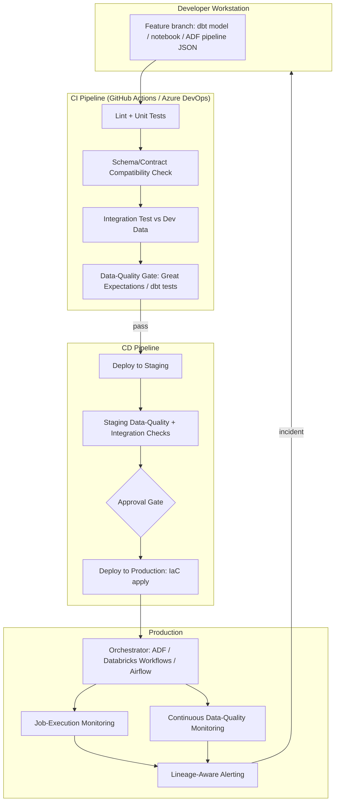
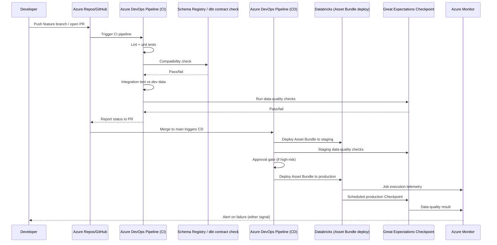
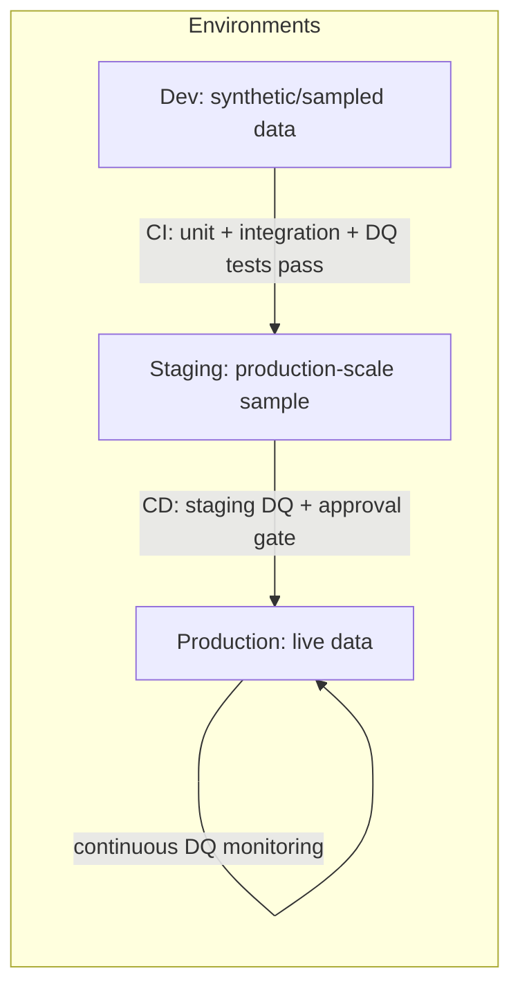
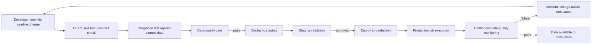

# DataOps Foundations

> Part of the **Enterprise Data & AI Architecture Handbook** · Phase-09 — DataOps, Platform Engineering & DevOps · Chapter 01.
> Estimated study time: **60 min reading + ~3h labs**.
> **Prerequisites:** read [Batch Pipeline Design](../Phase-05/09_Batch_Pipeline_Design.md) first.

---

## Executive Summary

[Batch Pipeline Design](../Phase-05/09_Batch_Pipeline_Design.md#core-concepts) established how to build a single pipeline that reruns safely, handles late data, and survives backfills. **DataOps** is the organizational and technical discipline that scales that reliability from one pipeline to hundreds, across dozens of engineers, without collapsing into ad hoc, tribal-knowledge operations. It borrows DevOps's core insight — that software delivery quality is a property of the *process*, not individual heroics — and applies it to the harder problem of data, where correctness depends not just on code but on the data itself, which is mutable, drifts, and cannot always be reproduced from source.

This chapter covers the concrete mechanics: the **DataOps lifecycle** (plan, develop, test, deploy, operate, observe, as applied specifically to data pipelines and models, not generic application code); **CI/CD for data**, where the deployable artifact is a mix of code (notebooks, SQL, pipeline definitions), configuration, and sometimes schema/data itself, and where "tests passing" must include data-quality assertions, not just unit tests; **environments and promotion**, the dev/test/prod separation problem as it uniquely applies to data platforms (shared data can't always be forked per-environment the way code can); **testing data pipelines**, spanning unit tests on transformation logic, integration tests against real or synthetic data, and continuous data-quality checks in production; and **observability and incident response**, extending traditional APM concepts to pipeline freshness, data drift, and lineage-aware root-cause analysis.

The governing insight: **a data pipeline that passes code review and unit tests can still ship silently wrong data**, because the code was never the only variable — the data flowing through it changes independently of any deployment. DataOps exists specifically to close this gap: a mature DataOps practice treats "did the deployment succeed" and "is the data correct" as two separate, both-mandatory questions, answered by two separate pipelines (CI/CD for code, continuous data-quality monitoring for data), converging in a single incident-response process when either one fails.

The bias remains **Azure-primary (~60%)** — Azure DevOps and GitHub Actions for CI/CD, Azure DevOps Pipelines/GitHub Environments for environment promotion, Databricks Repos and Asset Bundles for notebook-as-code workflows — **~30% enterprise open source** (Great Expectations, dbt, pytest, Terraform, Docker, GitHub Actions) and **~10% AWS/GCP comparison-only** (AWS CodePipeline/CodeBuild, GCP Cloud Build/Cloud Deploy).

**Bottom line:** DataOps succeeds when a pipeline change goes from a developer's laptop to production through an automated, tested, observable path where a bad change is caught before it reaches business consumers — and fails when "deployment" means someone manually copying a notebook to production and "testing" means eyeballing a dashboard after the fact. An architect who treats data pipelines as first-class software artifacts, subject to the same CI/CD, testing, and environment discipline software has used for decades, but who also adds the data-specific layer of continuous quality monitoring that software CI/CD does not need, closes the gap between a demo-quality pipeline and a genuinely production-grade one. This chapter is the entry point to Phase-09, which builds out platform engineering, IaC, containers, Kubernetes, orchestration, and GitOps as the concrete tooling that makes DataOps practice operational rather than aspirational.

---

## Learning Objectives

By the end of this chapter you will be able to:

1. **Explain the DataOps lifecycle** (plan, develop, test, deploy, operate, observe) and how it differs from generic application DevOps.
2. **Design a CI/CD pipeline for data workloads** covering notebooks, SQL, pipeline-as-code definitions, and schema migrations, not just application binaries.
3. **Architect environment promotion (dev/test/prod)** for data platforms, addressing the unique problem of not being able to fully fork production data per environment.
4. **Classify and implement the four layers of data pipeline testing**: unit tests on transformation logic, integration tests, data-quality/contract tests, and production monitoring.
5. **Distinguish deployment failure from data failure** as two separate incident classes requiring two separate detection and response mechanisms.
6. **Build lineage-aware observability** that lets an on-call engineer trace a bad output back to its root cause across a multi-hop pipeline.
7. **Apply DataOps practices on Azure** using Azure DevOps/GitHub Actions, Databricks Asset Bundles, and Azure Data Factory CI/CD.
8. **Identify DataOps anti-patterns** — manual production deployments, testing only in production, and treating data-quality checks as optional.
9. **Map a target DataOps architecture onto Azure**, with an explicit, defensible comparison to AWS CodePipeline and GCP Cloud Build/Cloud Deploy.
10. **Defend DataOps tooling and process decisions** in engineer, staff engineer, architect, and CTO review settings.

---

## Business Motivation

- **Manual, undocumented deployment processes do not scale past a handful of pipelines.** An enterprise running hundreds of pipelines across dozens of engineers cannot rely on any individual engineer remembering the correct manual deployment sequence — the same problem that motivated DevOps for application software, now applied to data.
- **A wrong number in a dashboard or a bad feature in a model is often more damaging than an application outage**, because it is silent — nothing crashes, nobody pages, and the business may make a decision on bad data for days or weeks before anyone notices, unlike an application outage that is immediately visible.
- **Regulatory and financial reporting pipelines require an auditable, repeatable deployment and testing trail.** "We tested this before shipping" needs to be a provable fact (CI logs, test reports, approval records), not an unverifiable claim.
- **Engineering velocity and data reliability are not actually in tension when the process is right.** Manual, ad hoc processes are simultaneously slower (no reuse, error-prone) and less safe (no consistent testing) than an automated CI/CD pipeline with proper data-quality gates.
- **Cross-team collaboration on shared data platforms breaks down without environment isolation.** Without clear dev/test/prod boundaries, one team's experimental change in a shared workspace can silently corrupt another team's production dependency.
- **FinOps and platform-scaling programs need DataOps maturity as a prerequisite.** [Platform Engineering](#hands-on-labs) (Phase-09 Chapter 02) and [Infrastructure as Code](#hands-on-labs) (Chapter 04) both assume a baseline of automated, testable deployment as the substrate they build self-service and IaC discipline on top of.

---

## History and Evolution

- **2000s-2010s — DevOps emerges** for application software: continuous integration (Jenkins, Travis CI), infrastructure as code (Chef, Puppet, later Terraform), and the cultural shift toward "you build it, you run it," collapsing the wall between development and operations teams.
- **Early 2010s — Data engineering largely misses the DevOps wave.** ETL pipelines were commonly deployed via manual SQL scripts or vendor-tool "promote to production" buttons, with minimal automated testing and no consistent CI/CD discipline, even as application teams adopted mature DevOps practice.
- **2017 — The term "DataOps" is popularized**, explicitly framing data pipeline delivery as needing the same discipline as software delivery, with an added emphasis on statistical process control and continuous data-quality monitoring that generic DevOps does not need.
- **2018-2020 — dbt popularizes "analytics engineering"**, bringing software-engineering practice (version control, code review, automated testing, CI) directly into the SQL transformation layer that had previously been the least disciplined part of the data stack.
- **2019-2021 — Databricks Repos and notebook-as-code workflows** close the gap between exploratory notebook development and production deployment, making notebooks first-class, version-controllable, testable artifacts rather than throwaway scratchpads promoted by copy-paste.
- **2021-2023 — Great Expectations and data-contract tooling mature**, giving DataOps practice a concrete mechanism for the data-quality-gate layer that traditional software CI/CD (unit tests, static analysis) does not natively provide.
- **2022-present — Databricks Asset Bundles, Azure Data Factory's Git integration, and Fabric's deployment pipelines** bring native CI/CD tooling directly into the primary Azure data-platform surfaces, reducing the need for bespoke deployment scripting.
- **2023-present — DataOps practice increasingly converges with platform engineering** (Phase-09 Chapter 02): self-service internal developer platforms increasingly bake DataOps CI/CD, testing, and promotion patterns into golden-path templates rather than leaving every team to reinvent them.

---

## Why This Technology Exists

Data pipelines were historically built and shipped with a fraction of the engineering discipline applied to application software, despite carrying comparable or greater business risk — a broken pipeline can silently corrupt a financial report or an ML feature store just as damagingly as a broken application can crash a checkout flow, but with far less visible signal that something went wrong. DataOps exists to close this discipline gap: to make data pipeline delivery as automated, tested, and observable as modern application delivery, while adding the data-specific practices (continuous data-quality monitoring, schema-contract enforcement, lineage-aware incident response) that pure application DevOps tooling does not provide out of the box.

---

## Problems It Solves

- **Inconsistent, error-prone manual deployments** — CI/CD automation removes the "did someone forget a step" risk inherent in manual promotion of notebooks, SQL, or pipeline definitions to production.
- **Silent data-quality regressions that pass code review** — a data-quality test gate (built on [Data Quality with Great Expectations](../Phase-08/03_Data_Quality_with_Great_Expectations.md#core-concepts)) catches failures that code review and unit tests structurally cannot, because the defect is in the data, not the code.
- **Slow, risky production promotion** — a well-defined dev/test/prod pipeline with automated gates lets teams ship changes frequently and safely instead of batching risky, infrequent "big bang" releases.
- **Undiagnosable production incidents** — lineage-aware observability turns "something downstream looks wrong" into a traceable root-cause investigation instead of an all-hands guessing exercise.
- **Cross-team interference on shared platforms** — environment isolation and promotion discipline let multiple teams develop independently without one team's in-progress work threatening another's production dependency.

---

## Problems It Cannot Solve

- **It cannot fix pipelines whose business logic is fundamentally wrong.** DataOps ensures a change is deployed and tested consistently; it does not verify the change implements the correct business requirement — that is still a design and requirements-gathering responsibility.
- **It cannot substitute for the governance and quality frameworks it builds on.** DataOps testing gates are only as good as the [Data Quality with Great Expectations](../Phase-08/03_Data_Quality_with_Great_Expectations.md#core-concepts) expectations and [Data Contracts](../Phase-08/07_Data_Contracts.md#core-concepts) they enforce — a CI/CD pipeline with no meaningful data-quality checks configured provides only the illusion of safety.
- **It cannot eliminate the fundamental irreproducibility of production data.** Unlike application code, data cannot always be perfectly forked into a test environment (volume, cost, privacy constraints) — DataOps practice mitigates this with synthetic/sampled data strategies, but never removes the residual risk that test data doesn't perfectly represent production.
- **It cannot replace organizational ownership and on-call accountability.** Automation reduces manual toil, but an incident still needs a human owner empowered to make judgment calls, especially for ambiguous data-quality failures that don't have an obvious automated remediation.
- **It cannot make an under-resourced platform team's backlog disappear.** DataOps tooling reduces the *cost* of reliable delivery; it does not remove the need to actually staff and prioritize platform reliability work.

---

## Core Concepts

### 1.1 The DataOps Lifecycle

DataOps adapts the classic DevOps loop (plan → code → build → test → release → deploy → operate → monitor) with data-specific emphasis at each stage:

- **Plan** — define the pipeline's purpose, SLAs, and data contract (per [Data Contracts](../Phase-08/07_Data_Contracts.md#core-concepts)) before writing code, not after.
- **Develop** — write transformation logic (SQL, PySpark, dbt models) in version control, using feature branches and pull requests, exactly as application code would be.
- **Test** — run four distinct test layers (see §1.4): unit, integration, data-quality/contract, and (in production) continuous monitoring.
- **Deploy** — promote code and configuration through environments via an automated CI/CD pipeline, never by manual copy.
- **Operate** — run the pipeline on a schedule or trigger, with defined SLAs, retry policy, and alerting (per [Batch Pipeline Design](../Phase-05/09_Batch_Pipeline_Design.md#core-concepts)).
- **Observe** — continuously monitor both deployment health (did the job run and succeed) and data health (is the output statistically and semantically correct), feeding both signals into a unified incident-response process.

The loop is continuous and short-cycled: mature DataOps teams ship small, frequent, well-tested changes rather than large, infrequent, high-risk releases — the same lesson DevOps taught application teams, now applied to pipelines.

### 1.2 CI/CD for Data — What's Actually Different

A data CI/CD pipeline superficially resembles an application CI/CD pipeline (lint → build → test → deploy) but has several structurally different concerns:

- **The deployable artifact is heterogeneous.** It may include SQL scripts, PySpark notebooks, dbt models, pipeline-orchestration JSON/YAML (ADF, Airflow DAGs), and schema-migration scripts — not a single compiled binary.
- **"Build" often means validating, not compiling.** For SQL/dbt, the equivalent of a build step is `dbt compile` or a dry-run query validation; for notebooks, it is often a syntax and lint check plus a smoke-test execution against sample data.
- **Tests must include data, not just code.** A transformation can be syntactically perfect and unit-test-passing while still producing wrong output against real-world data shapes it wasn't tested against — hence the mandatory data-quality test layer (§1.4).
- **Schema changes require compatibility checks**, not just code review — a CI/CD gate should call a Schema Registry or dbt contract check (per [Data Contracts](../Phase-08/07_Data_Contracts.md#core-concepts)) before allowing a schema-affecting change to merge.
- **Deployment is often idempotent-config application, not artifact replacement** — deploying an ADF pipeline or Databricks job means applying a JSON/Bicep/Terraform definition, closer to infrastructure-as-code deployment than to shipping a compiled binary.

### 1.3 Environments and Promotion

The dev → test/staging → production promotion model from application DevOps applies to data platforms with one major structural complication: **production data usually cannot be fully forked into lower environments** the way application state can be, due to volume, cost, and privacy/compliance constraints. Common patterns to address this:

- **Synthetic or sampled data** — generate representative synthetic data, or take a governed, PII-masked sample of production data, for dev/test environments.
- **Schema-only promotion with production-scale data reserved for a pre-production/staging tier** — dev uses small synthetic data for fast iteration; a staging environment closer to production scale (sometimes a read replica or a governed subset) catches performance and scale issues before prod.
- **Shadow/canary deployment against production data, read-only** — a new pipeline version runs alongside the existing one against real production input, with its output compared but not published, catching data-shape issues that synthetic data misses without risking a bad write.
- **Config-driven environment parity** — the same pipeline code runs unchanged across environments, with only environment-specific configuration (connection strings, resource sizing, feature flags) varying, exactly mirroring the twelve-factor-app principle from application DevOps.

### 1.4 The Four Layers of Data Pipeline Testing

- **Unit tests** — test transformation logic in isolation with small, hand-crafted input/output fixtures (e.g., a pytest test asserting a PySpark UDF or dbt macro produces the expected output for known edge cases: nulls, empty strings, boundary dates).
- **Integration tests** — run the full pipeline (or a meaningful slice of it) against a realistic dataset in a non-production environment, verifying that components (extraction, transformation, load, downstream consumption) work together correctly, not just in isolation.
- **Data-quality/contract tests** — the layer unique to data: assertions (via Great Expectations, dbt tests, or a Schema Registry check) that the *data itself*, not just the code, meets expected schema, range, and semantic constraints — run both in CI/CD (against test data) and continuously in production (against live data).
- **Production monitoring (continuous testing in production)** — the same or a subset of data-quality checks run on a schedule against live production data, because some defects (upstream schema drift, unexpected new categorical values, volume anomalies) only manifest once real-world data starts flowing, no matter how thorough pre-production testing was.

The critical discipline: these are **complementary, not substitutable** — a pipeline with excellent unit-test coverage but no production data-quality monitoring will still ship silent data regressions the moment upstream reality diverges from what was tested; teams that treat unit tests as "the testing done" are applying an application-software testing model to a problem that has an additional axis of risk (the data itself) that pure code testing cannot cover.

### 1.5 Deployment Failure vs. Data Failure

DataOps observability must distinguish **two structurally different failure classes** requiring different detection mechanisms and different response playbooks:

- **Deployment/execution failure** — the job didn't run, crashed, or timed out. Detected by orchestrator job-status monitoring (Databricks Jobs, ADF pipeline runs, Airflow task state) — this is the same signal generic application/infrastructure monitoring already provides.
- **Data failure** — the job ran and succeeded, but the output is wrong: a schema drifted, a null-rate spiked, a business rule (revenue non-negative, foreign-key referential integrity) was violated, or an upstream category set changed. Detected only by data-quality checks (Great Expectations Checkpoints, dbt tests) run against the actual output — no amount of job-success monitoring catches this class.

A mature DataOps incident-response process routes both signals into a single on-call rotation and runbook set, but keeps the detection mechanisms separate, because conflating them (assuming "the job succeeded" means "the data is correct") is the single most common blind spot in immature data platforms.

---

## Internal Working

A representative DataOps CI/CD flow, from a developer's pull request to a production deployment:

1. **Pull request opened** — an engineer proposes a change to a dbt model, PySpark notebook, or ADF pipeline definition, stored in version control alongside its tests and, where applicable, its data contract.
2. **CI trigger** — the pull request triggers a CI pipeline (GitHub Actions or Azure DevOps Pipelines) that lints the code, runs unit tests, and compiles/validates the change (e.g., `dbt compile`, a Databricks notebook syntax check).
3. **Schema/contract compatibility check** — if the change affects an output schema, a Schema Registry or dbt contract check runs, blocking the merge if the change is an unclassified breaking change (per [Data Contracts §8.3](../Phase-08/07_Data_Contracts.md#core-concepts)).
4. **Integration test run** — the pipeline executes end-to-end against a dev/test dataset (synthetic or sampled), verifying the full data flow, not just isolated units.
5. **Data-quality gate** — Great Expectations or dbt tests run against the integration-test output, blocking merge/deploy if a critical expectation fails.
6. **Code review and merge** — a human reviewer approves the pull request (required regardless of automated gates passing — automation reduces defects, it does not replace review judgment).
7. **CD trigger to staging/test environment** — merging to the main branch triggers deployment to a staging environment, running the same battery of checks against a larger, more production-like dataset.
8. **Manual or automated promotion gate to production** — depending on risk tolerance, promotion to production is either automatic (for low-risk changes with strong test coverage) or requires an explicit approval step (for high-risk changes: schema changes, changes to financial/regulatory pipelines).
9. **Production deployment** — the CD pipeline applies the change to production (deploying the ADF pipeline JSON, Databricks job definition, or dbt models), typically via infrastructure-as-code tooling (Phase-09 Chapter 04).
10. **Post-deployment monitoring** — job-execution monitoring and continuous data-quality checks run against the first production execution(s) of the new version, with an automated rollback or alert if either signal fails.

---

## Architecture

---

## Components

- **Version control (Git)** — the single source of truth for pipeline code, configuration, and (where feasible) data contracts; every change is a reviewable, revertible commit.
- **CI runner (GitHub Actions, Azure DevOps Pipelines)** — executes lint, unit test, compatibility-check, and integration-test stages on every pull request.
- **Schema Registry / contract-testing tool** — enforces schema and semantic compatibility (per [Data Contracts](../Phase-08/07_Data_Contracts.md#core-concepts)) before a change merges.
- **Data-quality framework (Great Expectations, dbt tests)** — runs the data-specific test layer both in CI and continuously in production.
- **Artifact/config repository (Databricks Asset Bundles, ADF Git integration, Terraform state)** — stores the deployable representation of pipelines, jobs, and infrastructure.
- **Orchestrator (ADF, Databricks Workflows, Airflow)** — executes deployed pipelines on schedule/trigger and exposes job-execution status.
- **Observability stack (Azure Monitor, Log Analytics, Grafana/Prometheus, OpenTelemetry)** — aggregates job-execution and data-quality signals into unified dashboards and alerts.
- **Lineage/catalog system (Microsoft Purview, OpenMetadata)** — provides the lineage graph that lets an on-call engineer trace a downstream data failure to its upstream root cause.
- **Approval/change-management layer (Azure DevOps environments with approvals, GitHub Environments)** — gates high-risk production promotions behind explicit human sign-off.

---

## Metadata

- **Pipeline version metadata** — every deployed pipeline artifact should carry its Git commit SHA, build number, and deployment timestamp, queryable from the orchestrator or a deployment-tracking table, so any production run can be tied back to the exact code that produced it.
- **Test-result metadata** — CI/CD test and data-quality-gate results should be persisted (not just shown as a pass/fail badge), enabling trend analysis of flaky tests, recurring data-quality failures, and mean-time-to-detect.
- **Contract-version metadata** — the currently-published data contract version for each dataset should be discoverable from the catalog, linking a production incident to the exact schema/SLA commitment in force at the time.
- **Deployment-approval metadata** — who approved a production promotion and when, required for audit trails in regulated environments.
- **Lineage metadata** — upstream/downstream dependency edges, maintained by the catalog/lineage system, are what make root-cause tracing possible rather than a manual archaeology exercise.

---

## Storage

- **Git repository** stores code, pipeline-as-code definitions (ADF ARM/Bicep templates, Databricks Asset Bundle YAML, Airflow DAG Python files), and versioned data-contract schema files.
- **Artifact storage** (Azure Artifacts, container registries for containerized jobs) stores built, versioned deployable packages.
- **Test-fixture storage** (ADLS Gen2 dev containers, or committed small fixture files in Git) holds synthetic/sampled datasets used by integration and data-quality tests.
- **Test-result and metrics storage** (Azure Log Analytics, a dedicated metadata database) retains historical CI/CD and data-quality-check outcomes for trend analysis and audit.
- **Terraform/Bicep state** (Azure Storage backend with state locking) tracks the deployed infrastructure that DataOps CI/CD provisions and updates (elaborated in Phase-09 Chapter 04).

---

## Compute

- **CI/CD runners** — Azure DevOps Microsoft-hosted or self-hosted agents, or GitHub Actions runners, execute lint/test/build stages; self-hosted agents are typically required when tests need private network access to a VNet-integrated data platform.
- **Ephemeral test compute** — integration and data-quality tests against Databricks or Synapse Spark typically run against small, ephemeral job clusters (auto-terminating) sized only for the test dataset, keeping CI cost low.
- **Data-quality check execution compute** — production Great Expectations Checkpoints or dbt test runs execute on the same compute engine as the pipeline itself (a Databricks job step, a Synapse Spark pool, or a warehouse query), not a separate system.
- **Deployment/orchestration compute** — the CD pipeline's deployment step typically runs lightweight (CLI/API calls to apply IaC or update job definitions), not requiring significant compute of its own.

---

## Networking

- **CI/CD runner network access** — self-hosted CI agents need network line-of-sight (via VNet integration or a private endpoint) to the data platform's control plane (Databricks workspace, ADF, Synapse) to deploy and run integration tests; Microsoft-hosted agents typically require an allow-listed public endpoint or a self-hosted agent when the platform is locked behind a private endpoint.
- **Environment network isolation** — dev, test/staging, and production should sit in separate VNets or subnets with explicit peering/firewall rules, preventing a misconfigured dev job from reaching production data stores.
- **Secrets and credential access** — CI/CD pipelines must retrieve deployment credentials (service principals, connection strings) from a managed secret store (Azure Key Vault) via workload identity or federated credentials, never from pipeline variables in plaintext.

---

## Security

- **Least-privilege service principals per environment** — the CI/CD pipeline's deployment identity for dev should not have production write access, and vice versa; use separate service principals or managed identities scoped per environment.
- **Secrets never in code or pipeline YAML** — all credentials, connection strings, and API keys must be retrieved at runtime from Azure Key Vault, not hardcoded or stored as plaintext pipeline variables.
- **Branch protection and mandatory review** — production-affecting branches (main/release) should require passing CI checks and at least one human approval before merge, enforced at the Git-platform level, not by convention.
- **Approval gates for high-risk promotions** — schema-breaking changes or changes to regulated pipelines should require an explicit named approver in the CD pipeline (Azure DevOps environment approvals, GitHub Environments protection rules).
- **Audit logging of every deployment** — every production deployment (who, what commit, when, approved by whom) should be logged immutably, satisfying compliance requirements for change-management traceability.
- **Data masking in lower environments** — synthetic or masked test data must not leak PII/PHI into dev/test environments with weaker access controls than production.

---

## Performance

- **CI pipeline duration is a velocity lever** — a CI pipeline that takes 45 minutes to run unit and integration tests discourages frequent small commits; keep the fast-feedback (lint, unit test) stage under a few minutes, and reserve slower integration/data-quality stages for a secondary, still-automated but less latency-sensitive stage.
- **Ephemeral test cluster startup time** dominates integration-test latency on Spark-based platforms; use pooled/warm clusters or smaller instance SKUs for test workloads to reduce feedback latency.
- **Data-quality check performance on large production tables** can itself become a bottleneck; use sampling-based or incremental (only-new-partition) Great Expectations Checkpoints rather than full-table scans on every run for large fact tables.
- **Parallelize independent CI stages** (lint, unit test, and static schema validation can typically run concurrently) rather than serially, when the CI platform supports parallel jobs.

---

## Scalability

- **Templated, reusable CI/CD pipeline definitions** (YAML pipeline templates, reusable GitHub Actions workflows) let a platform team scale DataOps practice across hundreds of pipelines and teams without every team writing bespoke CI/CD from scratch — a direct precursor to the golden-path templates covered in Phase-09 Chapter 02 (Platform Engineering).
- **Monorepo vs. polyrepo trade-offs at scale** — a monorepo for all dbt models/pipelines simplifies cross-pipeline dependency tracking and shared CI tooling, but requires careful path-based CI triggering to avoid every team's CI running on every commit; polyrepo isolates blast radius and CI runtime per team, at the cost of duplicated tooling and harder cross-repo dependency visibility.
- **Test-data management at scale** — as the number of pipelines grows, a shared, centrally-maintained synthetic/sampled test-data generation service scales better than every team building bespoke fixtures independently.
- **Self-service environment provisioning** (via IaC, Phase-09 Chapter 04) is what allows dev/test environment scaling to keep pace with team growth without a central platform team becoming a provisioning bottleneck.

---

## Fault Tolerance

- **CI/CD pipeline idempotency** — a re-run of a failed or partially-applied deployment stage should be safe (IaC's declarative apply model, per Phase-09 Chapter 04, is what makes this achievable for infrastructure and job definitions).
- **Rollback strategy for both code and data-quality failures** — a deployment rollback (redeploying the previous Git commit's artifact) handles a bad code change; a data-quality failure in production may additionally require a data-remediation runbook (quarantine bad records, reprocess from a known-good watermark, per [Batch Pipeline Design](../Phase-05/09_Batch_Pipeline_Design.md#core-concepts)) that a code rollback alone does not fix.
- **Blue/green or canary deployment for high-risk pipeline changes** — running the new pipeline version alongside the old one against the same input, comparing outputs before fully cutting over, catches regressions that pre-production testing missed.
- **CI/CD system availability itself is a dependency** — if the CI/CD platform (Azure DevOps, GitHub Actions) is down, manual emergency-deployment runbooks (documented, rehearsed, and gated behind extra approval) should exist as a fallback, never as the default path.

---

## Cost Optimization

- **Right-size CI/CD compute** — use the smallest viable Spark cluster/SKU for integration tests; auto-terminate test clusters immediately after test completion; avoid provisioning production-scale compute for CI.
- **Cache dependencies aggressively** — CI pipelines that reinstall Python/Java dependencies from scratch on every run waste both time and (for hosted runners) minutes-based billing; use dependency caching (pip cache, Maven/Ivy cache) supported by GitHub Actions/Azure DevOps.
- **Use path-based/selective CI triggering** in a monorepo — running the full test suite on every commit regardless of which files changed multiplies CI compute cost unnecessarily; trigger only the CI stages relevant to the changed pipeline/model.
- **Sample rather than full-scan for routine data-quality checks** on very large tables, reserving full-table validation for scheduled deeper audits, to control the compute cost of continuous production monitoring.
- **Worked FinOps example:** A team runs 40 dbt models' CI pipeline on every PR, each spinning up a Databricks all-purpose cluster (Standard_DS3_v2, ~$0.30/DBU-hr equivalent) taking 12 minutes to warm up and run tests, at roughly 15 PRs/day. Warm-up-dominated cost: 15 PRs × 12 min × ~$0.50/min effective (cluster + DBU) ≈ $90/day, ~$1,970/month. Switching to a shared, pre-warmed job-cluster pool (Databricks Pools) with a 2-node minimum idle instance reduces per-run startup to under 2 minutes: 15 × 3 min effective × $0.50 ≈ $22.50/day, ~$490/month — roughly a 75% reduction, paying only a small idle-pool cost (~$100/month for the minimum warm instances) against the eliminated repeated cold-start overhead, a net saving of roughly $1,380/month at this PR volume, with the break-even favoring the pool from day one at this commit frequency.

---

## Monitoring

- **CI/CD pipeline health dashboards** — track pass/fail rate, duration trend, and flaky-test rate per pipeline, surfaced in Azure DevOps Analytics or a GitHub Actions dashboard.
- **Deployment frequency and lead time** — classic DevOps (DORA) metrics — deployment frequency, lead time for changes, change failure rate, mean time to restore — apply directly to DataOps and are the right north-star metrics for a platform team's maturity.
- **Job-execution monitoring** — orchestrator-native dashboards (Databricks Jobs UI, ADF Monitor, Airflow UI) track run success/failure/duration per production pipeline.
- **Data-quality check pass/fail trend** — Great Expectations Data Docs or a dbt test results dashboard, tracked over time, surfaces recurring or worsening data-quality issues before they become customer-facing incidents.

---

## Observability

- **Unified signal correlation** — the goal is a single pane (Azure Monitor workbook, Grafana dashboard) correlating deployment events (what changed and when), job-execution status, and data-quality-check results, so an on-call engineer can immediately ask "did this start right after the last deployment?"
- **Lineage-aware root-cause tracing** — when a downstream data-quality check fails, the catalog/lineage graph ([Data Catalog and Lineage](../Phase-08/02_Data_Catalog_and_Lineage.md#core-concepts)) should let the on-call engineer walk upstream to identify which source or transformation actually introduced the defect, rather than manually inspecting every pipeline in the chain.
- **Structured, correlated logging** — pipeline runs should emit structured logs (JSON, with a consistent run ID/correlation ID) ingested into Log Analytics/OpenTelemetry, so a single run's logs across multiple pipeline stages can be queried together.
- **Alerting on both failure classes** — alert routing should distinguish "job failed to execute" (page the on-call engineer immediately, likely an infrastructure/code issue) from "job succeeded but data quality failed" (page the on-call data engineer or the producing team, likely a data or upstream issue), per §1.5.

### Operational Response Playbook

| Signal | Detection Query/Check | Remediation |
|---|---|---|
| CI/CD pipeline failure on merge to main | Azure DevOps/GitHub Actions build-status webhook alert | Block deployment (already enforced by the gate); notify the PR author; do not manually force-merge around a failing gate. |
| Production job execution failure | Orchestrator job-status API poll (Databricks Jobs, ADF Monitor) alerting on non-success terminal state | Page on-call engineer; check recent deployment history for a correlated change; roll back to last known-good artifact if the failure follows a recent deploy; otherwise treat as an infrastructure incident. |
| Data-quality Checkpoint failure in production | Great Expectations Checkpoint result / dbt test failure ingested into Log Analytics, alert on `success = false` for a `critical` severity expectation | Quarantine/halt downstream consumption of the affected partition; use lineage graph to trace to the upstream source or transformation; engage the producing team per the data contract's support SLA. |

---

## Governance

- **Change-management traceability** — every production deployment must be traceable to an approved pull request, a passing CI run, and (for high-risk changes) a named human approver, satisfying audit requirements without relying on tribal memory.
- **Ownership clarity** — each pipeline should have a documented owning team, discoverable via the catalog, so a data-quality incident has an unambiguous escalation path rather than a "whose pipeline is this" delay.
- **Policy-as-code enforcement** — security, tagging, and naming-convention policies should be enforced automatically in the CI/CD pipeline (via policy-as-code tools, elaborated in Phase-09 Chapter 04's Terraform/Sentinel/OPA coverage) rather than relying on manual review catching violations.
- **Contract governance integration** — the CI/CD schema-compatibility gate is the concrete enforcement mechanism for the data-contract governance model described in [Data Contracts](../Phase-08/07_Data_Contracts.md#core-concepts); a DataOps pipeline without this gate leaves contracts unenforced regardless of how well they are documented.

---

## Trade-offs

| Dimension | Heavier automation/gating | Lighter automation/gating |
|---|---|---|
| Deployment risk | Lower — consistent, tested path | Higher — relies on individual diligence |
| Engineering velocity (steady state) | Higher once built — fast, confident shipping | Feels faster initially, slows down as scale/incidents increase |
| Upfront investment | Higher — CI/CD, test-fixture, and gate-building cost | Lower — no upfront tooling investment |
| Suitability | Regulated, high-consumer-count, or high-blast-radius pipelines | Small, low-risk, single-team experimental pipelines |
| Failure mode if under-invested | N/A (this is the safer default) | Silent data incidents, slow manual recovery, tribal-knowledge dependency |

The general enterprise guidance: invest in full DataOps rigor for any pipeline with multiple consumers, regulatory relevance, or meaningful business impact; a lighter-weight process is acceptable for genuinely exploratory, single-owner, low-blast-radius work, provided it is explicitly labeled as such rather than silently under-governed.

---

## Decision Matrix

| Scenario | Recommended Approach |
|---|---|
| New enterprise data platform, multiple teams, regulatory reporting in scope | Full DataOps: CI/CD with mandatory data-quality gates, environment promotion with approval gates, unified observability |
| Small analytics team, few pipelines, low business risk | Lightweight CI/CD (lint + basic tests) with production data-quality monitoring as the primary safety net; skip heavyweight staging environments |
| Pipeline feeding a financial close or regulatory report | Full DataOps plus mandatory named-approver promotion gate and immutable audit logging |
| Rapidly-iterating ML feature pipeline | CI/CD with strong data-quality/contract gates (feature drift is a common silent-failure mode) but lighter change-approval friction to preserve iteration speed |
| Legacy pipeline being migrated, not yet under version control | Prioritize getting the pipeline into Git and a basic CI pipeline before adding advanced gates — partial DataOps adoption is better than waiting for a "perfect" rollout |

---

## Design Patterns

- **Golden-path CI/CD templates** — a platform team publishes reusable pipeline templates (Azure DevOps YAML templates, reusable GitHub Actions workflows) implementing lint/test/deploy/data-quality-gate stages, so individual teams configure rather than reinvent their CI/CD.
- **Shift-left data-quality testing** — running Great Expectations/dbt tests as early as the CI integration-test stage (not only in production) catches defects before they reach any live environment.
- **Trunk-based development with short-lived feature branches** — small, frequent merges to main reduce the risk and size of any single deployment, mirroring application-DevOps best practice.
- **Contract-first pipeline development** — defining the data contract (schema, semantics, SLA) before implementing a pipeline change, and generating the compatibility-check gate directly from that contract.
- **Progressive/canary rollout for pipeline logic changes** — running a new transformation version alongside the existing one on real data, comparing outputs, before a full cutover.

---

## Anti-patterns

- **"Deploy on Friday, hope over the weekend"** — shipping high-risk changes with no automated safety net right before a low-observability window, relying on luck rather than testing.
- **Testing only in production** — treating live dashboards as the QA environment, discovering defects only after business consumers notice.
- **Manual "copy the notebook to prod" deployment** — no version control link between what's running in production and what was reviewed, making incident root-causing and rollback unreliable.
- **CI that only lints, never runs data-quality checks** — a green CI badge that gives false confidence because it never actually validated the data, only the code's syntax.
- **One giant shared "test" environment with no isolation** — multiple teams' in-progress, half-broken changes interfering with each other, making test results unreliable and blame difficult to assign.
- **Schema changes shipped without a compatibility check** — relying on human review alone to catch breaking changes, the exact failure mode [Data Contracts](../Phase-08/07_Data_Contracts.md#problems-it-solves) exists to prevent.

---

## Common Mistakes

- Treating unit-test pass as sufficient proof the pipeline is production-ready, ignoring the need for data-quality validation against realistic data shapes.
- Building CI/CD automation for code deployment but never wiring data-quality-check failures into the same alerting/incident-response path, leaving a silent monitoring gap.
- Granting the CI/CD deployment identity broad, unscoped production access "to avoid permission issues," creating an outsized security blast radius.
- Skipping environment isolation for "just a quick" pipeline, which then quietly becomes a permanent, ungoverned production dependency.
- Under-investing in fast feedback (a 45-minute CI pipeline) which trains engineers to batch changes into large, riskier commits to avoid frequent waits.
- Confusing "the job succeeded" with "the data is correct" when triaging an incident, wasting time looking at infrastructure logs when the defect is actually a data-quality regression.

---

## Best Practices

- Put every pipeline artifact — code, pipeline-orchestration definitions, and data contracts — under version control from day one, even for exploratory work.
- Build the data-quality gate into CI before the first production deployment, not as a retrofit after the first incident.
- Keep the fast-feedback CI stage (lint, unit test) under a few minutes; push slower integration/data-quality validation to a secondary, still-automated stage.
- Use least-privilege, environment-scoped service principals for every CI/CD deployment identity.
- Route both deployment-failure and data-failure alerts into a single on-call rotation, but keep the detection mechanisms and runbooks distinct.
- Require an explicit, named approval gate for schema-breaking or high-blast-radius production changes.
- Treat DORA metrics (deployment frequency, lead time, change failure rate, MTTR) as the primary indicators of DataOps program health.

---

## Enterprise Recommendations

- Start DataOps adoption with the highest-blast-radius pipelines (regulatory reporting, executive dashboards, ML features feeding customer-facing decisions) rather than attempting a simultaneous big-bang rollout across every pipeline.
- Fund a central platform team to build and maintain golden-path CI/CD templates and shared test-data tooling, rather than expecting every data team to build DataOps tooling independently — this investment is the direct precursor to the platform-engineering model in Phase-09 Chapter 02.
- Mandate the data-quality gate (not just code tests) as a non-negotiable CI/CD stage for any pipeline feeding more than one consumer.
- Track DORA-style metrics per team and per pipeline tier, using them in architecture and platform reviews, not just as a vanity dashboard.
- Pair every DataOps rollout with the governance and contract work from Phase-08 — CI/CD gates are only as effective as the quality and contract definitions they enforce.

---

## Azure Implementation

- **Azure DevOps Pipelines** or **GitHub Actions** — YAML-defined CI/CD pipelines for dbt, PySpark, and ADF/Fabric pipeline artifacts; both support multi-stage pipelines with environment-scoped approvals.
- **Databricks Asset Bundles (DABs)** — declarative YAML defining Databricks jobs, notebooks, and workflows as deployable, version-controlled artifacts, with native CI/CD integration (`databricks bundle deploy` in a pipeline stage) across dev/staging/prod targets.
- **Azure Data Factory / Fabric Git integration and deployment pipelines** — ADF's native Git mode publishes an ARM template representing the pipeline definition; Fabric's deployment pipelines promote items (notebooks, pipelines, semantic models) across workspace-based dev/test/prod stages.
- **Azure Key Vault with workload identity federation** — CI/CD pipelines authenticate to Key Vault via federated credentials (no long-lived secrets stored in the pipeline), retrieving connection strings and service-principal credentials at deploy time.
- **Great Expectations on Databricks/Synapse** — Checkpoints run as a job step (a Databricks notebook or Python task) invoked both in CI (against test data) and on a schedule in production.
- **Azure Monitor / Log Analytics** — ingest structured logs and metrics from CI/CD pipelines, orchestrator job runs, and data-quality Checkpoints into a unified workspace, with Azure Monitor alert rules routing to on-call via Action Groups.
- **Microsoft Purview** — supplies the lineage graph used for root-cause tracing during data-quality incidents.

---

## Open Source Implementation

- **GitHub Actions** — self-hosted or cloud-hosted CI/CD runners, widely used for dbt, PySpark, and Airflow DAG CI/CD outside pure-Azure-DevOps shops.
- **dbt (dbt Core)** — `dbt build` combines model execution with dbt tests (schema tests, custom SQL tests) and dbt contracts, natively wiring transformation and data-quality validation into one CI step.
- **Great Expectations** — the open-source data-quality framework used for both CI-stage and production-continuous data-quality Checkpoints (elaborated in [Data Quality with Great Expectations](../Phase-08/03_Data_Quality_with_Great_Expectations.md)).
- **Apache Airflow** — DAG-as-Python-code orchestration; DAGs live in version control and deploy via a CI/CD pipeline that syncs DAG files to the Airflow environment (elaborated in Phase-09 Chapter 07).
- **pytest** — the standard unit/integration test runner for PySpark transformation logic and custom Python pipeline code.
- **Docker** — packages pipeline dependencies and custom code into reproducible, versioned images used consistently across CI, staging, and production (elaborated in Phase-09 Chapter 05).
- **Terraform** — declarative infrastructure-as-code used to provision and version the environments themselves (elaborated in Phase-09 Chapter 04).

---

## AWS Equivalent (comparison only)

| Capability | Azure | AWS |
|---|---|---|
| CI/CD orchestration | Azure DevOps Pipelines / GitHub Actions | AWS CodePipeline + CodeBuild |
| Managed notebook/job deployment | Databricks Asset Bundles, ADF Git integration | AWS Glue Studio + CodeDeploy, or Databricks on AWS Asset Bundles |
| Secrets management | Azure Key Vault + workload identity federation | AWS Secrets Manager + IAM roles |
| Data-quality framework | Great Expectations on Databricks/Synapse | Great Expectations on EMR/Glue, or AWS Glue Data Quality |
| Observability | Azure Monitor / Log Analytics | Amazon CloudWatch |

**Advantages of AWS:** CodePipeline integrates tightly with the broader AWS ecosystem (Lambda, Step Functions) for teams already standardized on AWS; Glue Data Quality provides a managed, Glue-native alternative to self-hosting Great Expectations. **Disadvantages:** CodePipeline's YAML/JSON pipeline definitions are generally considered less ergonomic than GitHub Actions/Azure DevOps YAML; AWS lacks a direct equivalent to Databricks Asset Bundles' tight notebook-to-job deployment integration unless using Databricks on AWS. **Migration strategy:** pipeline logic (dbt models, PySpark code, Great Expectations suites) is largely portable; the CI/CD orchestration layer and secrets-management integration require the most rework. **Selection criteria:** choose AWS-native tooling only when the broader compute/storage estate is already AWS-primary; choose Azure DevOps/GitHub Actions with Databricks Asset Bundles for Azure-primary or Databricks-centric estates.

---

## GCP Equivalent (comparison only)

| Capability | Azure | GCP |
|---|---|---|
| CI/CD orchestration | Azure DevOps Pipelines / GitHub Actions | Google Cloud Build + Cloud Deploy |
| Managed notebook/job deployment | Databricks Asset Bundles, ADF Git integration | Dataflow/Dataproc deployment via Cloud Build, or Databricks on GCP Asset Bundles |
| Secrets management | Azure Key Vault + workload identity federation | Google Secret Manager + Workload Identity Federation |
| Data-quality framework | Great Expectations on Databricks/Synapse | Great Expectations on Dataproc, or Dataplex Data Quality |
| Observability | Azure Monitor / Log Analytics | Google Cloud Operations Suite (formerly Stackdriver) |

**Advantages of GCP:** Cloud Build's container-native build model is a natural fit for teams already deploying containerized data workloads; Dataplex Data Quality provides a managed alternative for teams standardized on GCP's data-governance stack. **Disadvantages:** Cloud Deploy's progressive-delivery model is primarily built for Kubernetes/GKE workloads and is a less natural fit for notebook/SQL-centric data pipelines compared to Databricks Asset Bundles. **Migration strategy:** the same code-portability logic applies as with AWS — transformation and data-quality logic ports readily, CI/CD orchestration and IAM/secrets integration require rework. **Selection criteria:** choose GCP-native tooling primarily for GCP-primary estates or teams heavily invested in Dataplex/BigQuery; choose Azure/Databricks tooling for Azure-primary or Databricks-centric estates.

---

## Migration Considerations

- **Inventory existing manual-deployment pipelines first** — before building CI/CD, catalog which pipelines exist, who owns them, and their current deployment process, to prioritize migration by business risk rather than migrating alphabetically.
- **Get pipelines into version control before adding gates** — a pipeline not yet in Git cannot be meaningfully CI/CD-tested; the first migration milestone is always "this code lives in Git," even before any automated testing exists.
- **Introduce data-quality gates incrementally, starting non-blocking** — running new Great Expectations Checkpoints in "warn only" mode initially avoids blocking legitimate deployments on a newly-introduced check's false positives, before promoting critical expectations to hard-blocking status.
- **Migrate the highest-risk pipelines first**, not the easiest ones — regulatory, financial, and multi-consumer pipelines have the highest payoff for DataOps investment.
- **Expect a transitional period of dual-running** — legacy manual-deployment pipelines and newly-CI/CD-migrated ones will coexist; document clearly which pipelines are under which regime to avoid confusion during incidents.

---

## Mermaid Architecture Diagrams

---

## End-to-End Data Flow

---

## Real-world Business Use Cases

- A regional bank's regulatory-reporting pipeline moved from a manual, single-engineer-owned SQL-script deployment to a full DataOps CI/CD pipeline with mandatory Great Expectations gates after a schema-drift incident caused an incorrect regulatory submission; the new process caught three schema-drift issues in CI before production in the following year.
- A retailer's promotions-pricing pipeline adopted canary deployment (running new pricing logic alongside the existing pipeline, comparing outputs) after a prior "big bang" pipeline rewrite silently mispriced a subset of SKUs for several hours before detection.
- An insurance company's actuarial feature pipeline for a fraud-detection model added continuous production data-quality monitoring after discovering a categorical feature's upstream source had silently introduced a new category value, degrading model accuracy for weeks without any pipeline failure alert.

---

## Industry Examples

- **Netflix** popularized a "paved road" platform-engineering approach where DataOps CI/CD, testing, and deployment patterns are provided as opinionated defaults, directly foreshadowing the Phase-09 Chapter 02 platform-engineering discussion.
- **Airbnb's** analytics-engineering adoption of dbt is widely cited as a driver of the industry's broader shift toward SQL transformation logic living in version control with mandatory testing, rather than being maintained as untested, ungoverned warehouse views.
- **Uber's** internal data-quality-monitoring platform (Uber's own build, conceptually similar to Great Expectations) is frequently referenced as an early large-scale example of continuous production data-quality monitoring as a first-class platform capability, not an afterthought.

---

## Case Studies

**Case: Schema-drift regulatory-reporting incident.** A bank's monthly regulatory capital-adequacy report pipeline read from an upstream trading-system export. An upstream team silently renamed a column and changed a currency field's unit (from major to minor currency units) without notice. The consuming pipeline had a passing CI suite (unit tests on transformation logic, no data-quality checks against live data) and deployed without incident — the bug was purely in the data, invisible to code-level testing. The bad values fed the regulatory report undetected for one reporting cycle, triggering a regulator inquiry.

**Root cause:** No data contract existed between the trading-system team and the reporting team, and no continuous production data-quality monitoring existed to catch the currency-unit anomaly (values off by roughly 100x, which a simple range-based Great Expectations check would have caught immediately).

**Remediation:** the bank introduced a formal data contract (per [Data Contracts](../Phase-08/07_Data_Contracts.md#core-concepts)) between the two teams, added a Great Expectations Checkpoint with a `expect_column_values_to_be_between` range check on the currency field as a hard-blocking production gate, and added the check to CI as well so any future transformation-logic change would be validated against the same constraint before deployment.

---

## Hands-on Labs

1. **Lab 1 — Build a CI pipeline for a dbt project.** Create a GitHub Actions workflow that runs `dbt build` (models + tests) on every pull request against a small DuckDB or free-tier Azure SQL Database dev target; add a required-status-check branch protection rule so the PR cannot merge on failure.
2. **Lab 2 — Add a data-quality gate.** Integrate a Great Expectations suite into the same pipeline, with at least three expectations (not-null, range, and a custom business-rule expectation); configure the CI stage to fail the build on any critical expectation failure.
3. **Lab 3 — Environment promotion with Databricks Asset Bundles.** Define a Databricks job as a DAB (`databricks.yml` with dev/staging/prod targets); deploy to a dev target from a feature branch and to a staging target on merge to main, using different job cluster sizes per target.
4. **Lab 4 — Simulate a schema-breaking change.** Introduce a breaking schema change (rename a column) to a dbt model with a contract defined; observe the CI compatibility check blocking the merge; then correctly version-bump and document the change to pass the gate deliberately.
5. **Lab 5 — Incident-response drill.** Inject a synthetic data-quality regression (e.g., manually corrupt a dev-environment source table's values) into a scheduled Great Expectations Checkpoint; practice using lineage metadata to trace the failure to its (simulated) root cause and document the incident timeline.

---

## Exercises

1. Draw the CI/CD pipeline stages you would design for a dbt-based pipeline feeding both a regulatory report and an internal dashboard, with differing risk tolerance for each consumer.
2. List three data-quality checks you would add as hard-blocking production gates for a customer-revenue table, and justify each choice.
3. Explain, in your own words, why "the job succeeded" is an insufficient signal that a data pipeline is healthy.
4. Design an environment-promotion strategy for a pipeline whose production data cannot legally be copied (even masked) into a lower environment for compliance reasons.
5. Identify one anti-pattern from this chapter that most closely matches a real pipeline you have worked on, and describe the concrete remediation you would propose.

---

## Mini Projects

- Build an end-to-end CI/CD pipeline (GitHub Actions or Azure DevOps) for a small multi-model dbt project that includes lint, unit tests, a Great Expectations data-quality gate, and a two-environment (dev/prod) promotion flow with a manual approval gate before production.
- Implement a "canary" pattern: deploy a modified transformation alongside the existing one against the same input data, write a comparison script that diffs the two outputs, and alert if the diff exceeds a configured tolerance.
- Build a lightweight lineage-aware alerting script that, given a failed Great Expectations Checkpoint on a downstream table, queries a simple lineage metadata table to identify and report the immediate upstream dependency.

---

## Capstone Integration

Extend the batch pipeline built in [Batch Pipeline Design](../Phase-05/09_Batch_Pipeline_Design.md#hands-on-labs)'s capstone with a full DataOps wrapper: move the pipeline's code into version control, build a CI pipeline enforcing unit tests and a Great Expectations data-quality gate, define a dev/staging/production promotion flow (using Databricks Asset Bundles or ADF Git integration), and wire job-execution and data-quality monitoring into a single Azure Monitor dashboard with alerting. This becomes the operational foundation that Phase-09's subsequent chapters (Platform Engineering, IaC, Containers, Kubernetes, Orchestration, GitOps) build upon.

---

## Interview Questions

1. What is DataOps, and how does it differ from generic application DevOps?
2. Why can a pipeline pass all its unit tests and still ship incorrect data?
3. What are the four layers of data pipeline testing, and what does each catch that the others do not?
4. How would you design environment promotion for a platform where production data cannot be fully replicated into dev/test?

## Staff Engineer Questions

5. How would you design a CI/CD pipeline that enforces data-contract compatibility checks before allowing a schema-affecting merge?
6. Describe how you would distinguish a deployment failure from a data failure in your observability and alerting design.
7. What trade-offs would you weigh between a monorepo and polyrepo strategy for a 200-pipeline data platform's CI/CD?

## Architect Questions

8. How would you architect a DataOps platform to serve both a low-risk experimental analytics team and a high-risk regulatory-reporting team with appropriately different levels of process rigor?
9. What is your strategy for canary or shadow deployment of a pipeline-logic change against live production data without risking a bad write?
10. How does your DataOps CI/CD architecture integrate with the data governance and contract enforcement mechanisms from Phase-08?

## CTO Review Questions

11. What DORA-equivalent metrics would you present to demonstrate the DataOps program's business impact, and what would "good" look like for this organization?
12. If a regulator asked to prove that a specific historical production report was generated by reviewed, tested code, what evidence would your DataOps process produce?
13. What is the single highest-leverage DataOps investment you would prioritize this year, and how would you justify its cost against the incidents it prevents?

---

## References

- Kim, Humble, Debois, Willis. *The DevOps Handbook*. IT Revolution Press.
- DataKitchen. "The DataOps Manifesto." dataopsmanifesto.org.
- dbt Labs. "dbt Documentation — Tests and Contracts." docs.getdbt.com.
- Great Expectations. "Great Expectations Documentation." docs.greatexpectations.io.
- Microsoft Learn. "Azure DevOps Pipelines documentation."
- Microsoft Learn. "Databricks Asset Bundles documentation."
- Forsgren, Humble, Kim. *Accelerate: The Science of Lean Software and DevOps*. IT Revolution Press.

## Further Reading

- [Batch Pipeline Design](../Phase-05/09_Batch_Pipeline_Design.md) — the pipeline-reliability foundation this chapter's CI/CD and testing practices operationalize.
- [Data Quality with Great Expectations](../Phase-08/03_Data_Quality_with_Great_Expectations.md) — the data-quality-gate mechanism referenced throughout this chapter.
- [Data Contracts](../Phase-08/07_Data_Contracts.md) — the schema/semantic/SLA enforcement model integrated into the CI/CD compatibility-check gate.
- [Data Catalog and Lineage](../Phase-08/02_Data_Catalog_and_Lineage.md) — the lineage graph used for root-cause tracing in production incidents.

---

[Back to Phase-09 README](../../.github/prompts/Phase-09/README.md) - [Handbook README](../../README.md) - [Roadmap](../../ROADMAP.md)
