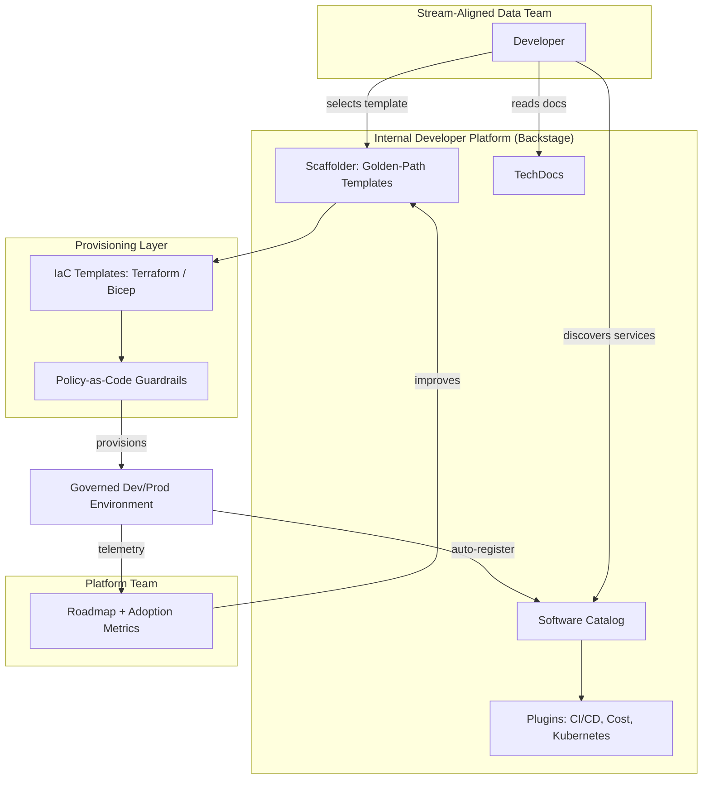
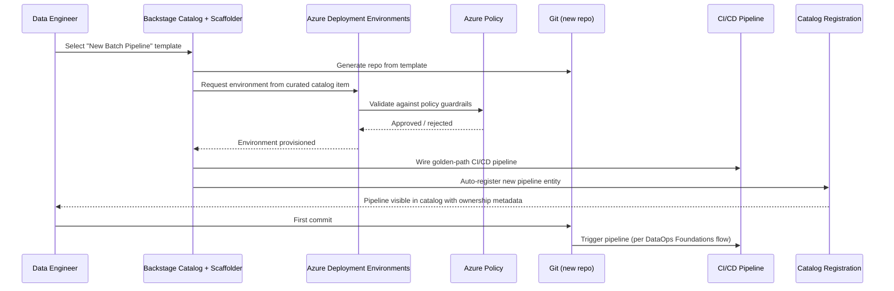
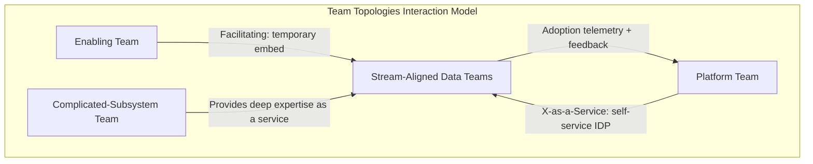
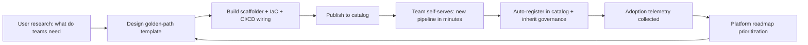

# Platform Engineering

> Part of the **Enterprise Data & AI Architecture Handbook** · Phase-09 — DataOps, Platform Engineering & DevOps · Chapter 02.
> Estimated study time: **60 min reading + ~3h labs**.
> **Prerequisites:** read [DataOps Foundations](01_DataOps_Foundations.md) first.

---

## Executive Summary

[DataOps Foundations](01_DataOps_Foundations.md#core-concepts) described the CI/CD, testing, and observability discipline a single data team needs to ship pipelines safely. **Platform engineering** is what happens when an enterprise has dozens of such teams: instead of every team independently reinventing CI/CD templates, environment provisioning, data-quality tooling, and observability wiring, a dedicated platform team builds and operates an **internal developer platform (IDP)** that provides these capabilities as a self-service product. The central reframe this chapter introduces is treating the platform itself as a product with its own customers (the enterprise's data and ML engineers), not as a shared-services cost center that hands out tickets.

This chapter covers the concrete mechanics: the **platform-as-product mindset**, which requires a platform team to do user research, measure adoption, and prioritize a roadmap exactly as an external-facing product team would; **golden paths and paved roads**, the opinionated, well-supported default way to build and ship a data pipeline or ML service, engineered to be easier to follow than to circumvent; **internal developer platforms**, with Backstage as the leading open-source reference implementation for a self-service catalog and golden-path scaffolding tool; **self-service provisioning**, letting a team stand up a new environment, pipeline, or data product without filing a ticket to a central team; and **platform team topologies**, borrowing directly from Team Topologies' "platform team" and "enabling team" archetypes to define how a platform team should be structured and how it should interact with the stream-aligned data teams it serves.

The governing insight: **a platform succeeds only when using it is easier than not using it.** A golden path that is well-documented but slower, more restrictive, or less flexible than a team going around it and building their own bespoke pipeline will simply be ignored — platform adoption is earned through genuine developer experience quality, not mandated through policy alone. Mandates without a genuinely better paved road produce shadow IT; a genuinely better paved road, even without a mandate, produces organic adoption.

The bias remains **Azure-primary (~60%)** — Azure Developer CLI (azd) templates, Azure Deployment Environments, Azure API Center, and Backstage integrations with Azure DevOps/Databricks — **~30% enterprise open source** (Backstage, Terraform modules, Kubernetes, Crossplane, GitHub Actions reusable workflows) and **~10% AWS/GCP comparison-only** (AWS Proton, Google Cloud's internal developer platform patterns).

**Bottom line:** platform engineering succeeds when a data engineer can self-service a new, fully-governed pipeline environment in minutes through a catalog entry, inheriting security, cost tagging, and CI/CD wiring for free — and fails when "platform" means a wiki page of instructions that nobody follows and a central team that remains the bottleneck for every new environment request. An architect who treats the platform as a product, measures its adoption and developer-experience metrics, and continuously narrows the gap between the golden path and what teams actually need turns platform engineering from an org chart line item into the connective tissue that makes DataOps practice (Chapter 01) scale across the whole enterprise.

---

## Learning Objectives

By the end of this chapter you will be able to:

1. **Explain the platform-as-product mindset** and how it differs from a traditional shared-services/ops model.
2. **Design a golden path** for a common data-engineering workflow (e.g., "new batch pipeline") that is both opinionated and genuinely easier than a bespoke alternative.
3. **Evaluate Backstage** as an internal developer platform, including its software catalog, scaffolder templates, and TechDocs.
4. **Architect self-service provisioning** for data platform environments using Azure Deployment Environments or a Backstage-integrated Terraform/Bicep scaffolder.
5. **Apply Team Topologies concepts** (platform team, enabling team, stream-aligned team) to structure a data platform organization.
6. **Measure platform adoption and developer experience** using concrete metrics, not anecdote.
7. **Apply platform-engineering practices on Azure** using Azure Developer CLI, Azure Deployment Environments, and Azure API Center.
8. **Identify platform-engineering anti-patterns** — building a platform nobody asked for, mandating adoption without genuine UX investment, and conflating "platform team" with "ticket-taking ops team."
9. **Map a target IDP architecture onto Azure**, with an explicit, defensible comparison to AWS Proton and GCP's equivalent patterns.
10. **Defend platform-engineering investment decisions** in engineer, staff engineer, architect, and CTO review settings.

---

## Business Motivation

- **Every data team independently rebuilding CI/CD, environment provisioning, and observability wiring is a massive, invisible duplication of effort** across a large enterprise — the same DataOps problem from Chapter 01 solved N times instead of once.
- **New data-team onboarding time is a direct measure of platform maturity.** An enterprise where a new team takes weeks to get a first pipeline into production is paying a hidden tax that a good platform collapses to days or hours.
- **Inconsistent, team-invented tooling increases security and compliance risk.** Without a golden path, each team's bespoke CI/CD and provisioning approach must be independently security-reviewed, multiplying audit effort and the chance a gap is missed.
- **Central platform teams that operate as ticket queues become organizational bottlenecks** as the number of data teams grows, throttling the entire enterprise's delivery velocity on a single team's ticket backlog.
- **FinOps visibility and governance enforcement are dramatically easier when provisioning goes through one paved road** with built-in tagging, budget, and policy defaults, versus auditing dozens of independently-built provisioning scripts after the fact.
- **Platform engineering is the organizational structure that makes [DataOps Foundations](01_DataOps_Foundations.md#enterprise-recommendations)' "fund a central platform team to build golden-path CI/CD templates" recommendation operational** rather than aspirational.

---

## History and Evolution

- **2000s-2010s — Centralized IT/ops teams provisioned infrastructure via tickets**, creating multi-week lead times for a new environment and pushing many teams toward informal "shadow IT" workarounds.
- **Early-to-mid 2010s — DevOps culture pushed "you build it, you run it,"** shifting operational ownership to product teams, but this alone did not solve the duplication problem: every team now built and ran its *own* bespoke tooling.
- **2014 — Netflix's "paved road" concept is publicized**, articulating the idea that a platform team's job is to make one well-supported path so much better than the alternatives that teams choose it voluntarily.
- **2019 — Spotify open-sources Backstage**, giving the industry a concrete, extensible reference implementation for a software catalog and self-service scaffolding tool, and popularizing the term "internal developer platform."
- **2019 — Team Topologies (Skelton and Pais) is published**, formalizing "platform team" as one of four fundamental team types, explicitly framing platform teams as existing to reduce cognitive load for stream-aligned teams via a self-service, product-like interface.
- **2020-2022 — The "platform engineering" term consolidates the practice** as its own discipline distinct from generic DevOps or SRE, with dedicated platform-engineering roles, conferences, and the "platform as a product" framing becoming mainstream.
- **2022-2023 — Backstage joins the CNCF**, accelerating enterprise adoption and plugin ecosystem growth (Kubernetes, CI/CD, cost, and cloud-provider plugins).
- **2023-present — Cloud providers ship native internal-platform primitives**, notably Azure Deployment Environments and Azure API Center, reducing the amount of bespoke tooling a platform team must build from scratch, and increasingly integrating directly with Backstage as a catalog front-end.
- **2024-present — AI/ML platform teams extend the same golden-path model** to LLM/agent workloads (model registries, prompt/eval pipelines, vector-store provisioning), applying identical platform-as-product discipline to a newer workload class.

---

## Why This Technology Exists

Platform engineering exists because two failure modes emerged as enterprises scaled the number of data and ML teams: either every team independently rebuilds infrastructure, CI/CD, and governance tooling (massive duplicated effort, inconsistent security posture), or a central team becomes a ticket-driven bottleneck that cannot keep pace with the number of teams depending on it. Platform engineering resolves this by having a dedicated team build a genuinely good, self-service product — a golden path — that teams adopt because it is faster and safer than the alternative, not because they are forced to.

---

## Problems It Solves

- **Duplicated infrastructure and CI/CD effort** — a golden-path template (per [DataOps Foundations §1.2](01_DataOps_Foundations.md#core-concepts)) built once by a platform team replaces N independent, inconsistent implementations.
- **Slow team onboarding** — self-service provisioning collapses "new environment" lead time from a multi-week ticket queue to a self-service catalog action.
- **Inconsistent security and governance posture** — a paved road with built-in policy-as-code, tagging, and access controls means every team inherits a baked-in compliant configuration rather than reinventing (and potentially under-securing) their own.
- **Central-team bottlenecks** — a self-service catalog removes the platform team from the critical path of every individual provisioning request, letting the platform team focus on improving the paved road itself.
- **Discoverability gaps** — a Backstage-style software catalog gives every team visibility into what services, pipelines, and data products already exist, reducing duplicate builds and unowned "mystery" pipelines.

---

## Problems It Cannot Solve

- **It cannot fix a golden path nobody wants to use.** If the paved road doesn't genuinely fit real team needs (too restrictive, missing a critical capability), teams will route around it regardless of how well it is built or marketed — platform engineering requires continuous user research, not a one-time build.
- **It cannot substitute for the underlying DataOps and governance disciplines it packages.** A golden-path CI/CD template with no data-quality gate (per [DataOps Foundations](01_DataOps_Foundations.md#problems-it-cannot-solve)) just scales a bad practice faster and more consistently.
- **It cannot eliminate the need for platform-team staffing and prioritization.** A platform is a product; products need product management, a roadmap, and sustained investment, not a one-time project that is then left to stagnate.
- **It cannot force adoption through documentation alone.** A wiki page describing a golden path is not the same as a scaffolder template that actually generates a working, deployable project in minutes — the difference between the two is usually the difference between low and high adoption.
- **It cannot resolve genuine organizational disagreement about ownership boundaries.** Platform/stream-aligned team interaction models (§2.5) clarify responsibility, but do not remove the need for leadership to actually enforce those boundaries when teams push back.

---

## Core Concepts

### 2.1 Platform-as-Product Mindset

Treating the internal platform as a product means the platform team:

- Identifies its **customers** explicitly (data engineers, ML engineers, analytics engineers) and does direct user research (interviews, surveys, usage analytics) rather than assuming what they need.
- Maintains a **product roadmap** prioritized by customer impact and adoption metrics, not solely by internal engineering preference.
- Measures **developer experience (DevEx)** quantitatively: time-to-first-deploy for a new team, self-service success rate, golden-path adoption percentage, support-ticket volume per active user.
- Practices **product marketing internally** — a great golden path that nobody knows exists will not be adopted; onboarding, documentation, and internal advocacy are part of the job, not an afterthought.
- Treats **backward compatibility and deprecation** for platform APIs/templates with the same discipline as an external API vendor would, since internal teams build production dependencies on the platform exactly as external customers would on a vendor's API.

### 2.2 Golden Paths and Paved Roads

A **golden path** (or "paved road") is the platform team's single, opinionated, well-supported way to accomplish a common task — for example, "provision a new batch pipeline environment" or "deploy a new dbt project to production." The design goal is that the golden path is simultaneously:

- **The easiest path** — faster to use than building a bespoke alternative from scratch.
- **The most compliant path** — automatically inherits security, tagging, cost-allocation, and governance defaults (integrating the CI/CD and data-quality gates from [DataOps Foundations](01_DataOps_Foundations.md#core-concepts)) so a team following it is compliant by default, not by extra effort.
- **Not mandatory, but strongly incentivized** — teams retain the ability to go off the paved road for genuine edge cases, but doing so should mean opting out of some of the automatic support (self-service scaffolding, automatic upgrades) the golden path provides, making the trade-off explicit rather than invisible.

A golden path is not a restriction on flexibility for its own sake — it is a deliberate trade of a small amount of flexibility for a large amount of reduced cognitive load, faster delivery, and consistent governance, and it should be revisited and widened when it demonstrably fails to fit a legitimate, recurring use case.

### 2.3 Internal Developer Platforms and Backstage

An **internal developer platform (IDP)** is the concrete tooling surface that makes golden paths self-service, typically comprising:

- **A software/data catalog** — a discoverable inventory of every service, pipeline, and data product, with clear ownership metadata, directly complementing the data catalog from [Data Catalog and Lineage](../Phase-08/02_Data_Catalog_and_Lineage.md#core-concepts) but scoped to code/infrastructure assets rather than data assets.
- **A scaffolding/templating tool** — lets a developer generate a new, fully-wired project (repo, CI/CD pipeline, environment, monitoring dashboards) from a template with a few form inputs, rather than copy-pasting from an existing project and hoping nothing was missed.
- **Documentation-as-code (TechDocs)** — golden-path documentation lives alongside the code it documents, versioned and reviewed the same way, avoiding the classic "wiki page nobody updates" problem.
- **Plugin-based extensibility** — an IDP framework should integrate with the enterprise's actual tools (Azure DevOps, Databricks, Kubernetes, cost-management APIs) rather than requiring teams to abandon existing investments.

**Backstage** (CNCF, originated at Spotify) is the leading open-source reference implementation of this model: its Software Catalog stores ownership and relationship metadata for every registered entity, its Scaffolder executes templated project generation, and its plugin ecosystem includes first-party and community integrations for CI/CD systems, Kubernetes, cost visibility, and cloud-provider resource management.

### 2.4 Self-Service Provisioning

Self-service provisioning replaces "file a ticket, wait for a central team" with "fill out a form or run a CLI command, get a working, governed environment in minutes." Concretely, this means:

- A developer requests a new environment (or pipeline, or data product) through the IDP catalog's scaffolder UI or a CLI (e.g., Azure Developer CLI, `azd up`).
- The request triggers infrastructure-as-code (Terraform/Bicep, per Phase-09 Chapter 04) execution against a pre-approved, policy-constrained template — the developer cannot provision an out-of-policy configuration because the template itself enforces the constraint, not because a human reviewer catches it after the fact.
- The resulting environment is automatically registered in the catalog with correct ownership, cost-center tags, and monitoring wired in, with zero additional manual setup.
- Guardrails (budget caps, network policy, allowed SKUs) are enforced by the platform (policy-as-code) rather than by a human approval step in the critical path, reserving human approval only for genuinely exceptional requests.

### 2.5 Platform Team Topologies

Team Topologies defines four fundamental team types relevant to structuring a data-platform organization:

- **Stream-aligned teams** — data/ML engineering teams aligned to a business domain or data product, who are the platform's primary customers.
- **Platform teams** — build and operate the self-service IDP (catalog, scaffolder, golden-path templates, shared CI/CD infrastructure) that reduces cognitive load for stream-aligned teams; interaction mode is **"X-as-a-Service"** (self-service, minimal synchronous coordination required).
- **Enabling teams** — temporarily embed with a stream-aligned team to help them adopt a new capability (e.g., helping a team migrate onto the new golden path) and then withdraw once the team is self-sufficient; interaction mode is **"facilitating."**
- **Complicated-subsystem teams** — own a piece of deep technical complexity requiring specialist knowledge (e.g., a shared feature-engineering runtime or a custom orchestration engine) that would be inefficient for every stream-aligned team to understand deeply themselves.

The key organizational discipline: a platform team's primary interaction mode with stream-aligned teams should be **X-as-a-Service (self-service)**, not constant synchronous collaboration — if a platform team spends most of its time in meetings unblocking individual teams rather than improving the self-service product, that is a signal the platform's self-service maturity is too low, not that the platform team needs more headcount to attend more meetings.

---

## Internal Working

A representative self-service golden-path flow, from a developer's request to a running, governed environment:

1. **Developer opens the IDP catalog** (Backstage) and selects a "New Batch Pipeline" scaffolder template.
2. **Developer fills a short form** — pipeline name, owning team, data domain, expected data volume tier — deliberately kept minimal; the template infers everything else from platform defaults.
3. **Scaffolder generates a new Git repository** from a template, pre-populated with the golden-path CI/CD pipeline (per [DataOps Foundations](01_DataOps_Foundations.md#internal-working)), a starter dbt/PySpark project skeleton, and a registered data-contract stub.
4. **Scaffolder triggers infrastructure-as-code provisioning** (Terraform/Bicep) for the pipeline's dev environment, applying pre-approved policy constraints (allowed SKUs, network configuration, tagging).
5. **New service/pipeline auto-registers in the Backstage catalog**, with ownership, cost-center, and dependency metadata populated from the scaffolder inputs.
6. **Developer receives a working repository and dev environment within minutes**, already wired with CI/CD, monitoring dashboards, and a data contract stub — the developer's first commit goes through the same automated pipeline every other golden-path project uses.
7. **Platform team observes adoption telemetry** (which templates are used, how often teams deviate, support-ticket volume) feeding back into the platform roadmap.

---

## Architecture

---

## Components

- **Software/data catalog (Backstage Software Catalog)** — the discoverable inventory of services, pipelines, and ownership metadata.
- **Scaffolder/templating engine (Backstage Scaffolder, Azure Developer CLI templates)** — generates new, fully-wired projects from opinionated templates.
- **Documentation-as-code (Backstage TechDocs)** — versioned, in-repo documentation rendered into the catalog.
- **IaC template library (Terraform modules, Bicep modules)** — the reusable, policy-constrained infrastructure definitions the scaffolder invokes.
- **Policy-as-code engine (Azure Policy, OPA/Sentinel)** — enforces guardrails (allowed SKUs, network rules, mandatory tags) at provisioning time.
- **Self-service provisioning API (Azure Deployment Environments, Azure Developer CLI)** — the Azure-native mechanism exposing curated, pre-approved environment templates to developers.
- **CI/CD template library** — the golden-path pipeline definitions from [DataOps Foundations](01_DataOps_Foundations.md#components) packaged for reuse across every scaffolded project.
- **Adoption/DevEx telemetry pipeline** — captures catalog usage, scaffolder completions, and support-ticket volume to drive the platform's own roadmap.

---

## Metadata

- **Catalog entity metadata** — every registered pipeline/service carries owning team, data domain, lifecycle stage (experimental, production, deprecated), and links to its source repository and on-call rotation.
- **Template version metadata** — each golden-path template is itself versioned; scaffolded projects record which template version they were generated from, enabling bulk-upgrade campaigns when the golden path improves.
- **Adoption metadata** — usage counts per template, deviation rate (teams who scaffold then heavily modify), and support-ticket volume per template, feeding the platform product roadmap.
- **Policy-compliance metadata** — which policy-as-code ruleset version a provisioned environment was validated against, needed for audit and for identifying environments needing a policy-update rollout.

---

## Storage

- **Backstage's catalog database** (PostgreSQL, typically Azure Database for PostgreSQL Flexible Server) stores catalog entities, relationships, and metadata.
- **Template/module repositories (Git)** store versioned scaffolder templates, Terraform/Bicep modules, and CI/CD pipeline templates as the platform's core reusable IP.
- **TechDocs storage** (Azure Blob Storage) stores the built static documentation sites generated from each project's in-repo docs.
- **Telemetry storage** (Azure Log Analytics, or a dedicated analytics store) retains catalog usage and adoption events for platform-roadmap analysis.

---

## Compute

- **Backstage application hosting** — typically run as a containerized service on Azure Kubernetes Service (AKS) or Azure Container Apps, since Backstage itself is a Node.js application with plugin-based extensibility.
- **Scaffolder execution compute** — template generation and initial IaC apply steps typically run as short-lived CI jobs (GitHub Actions/Azure DevOps agents) triggered by the scaffolder, not as long-running compute.
- **Policy-evaluation compute** — Azure Policy evaluation is a managed, serverless control-plane capability requiring no dedicated compute from the platform team; OPA/Sentinel evaluation for Terraform runs as a lightweight step within the CI/CD pipeline.

---

## Networking

- **Backstage ingress** — typically exposed via an internal-only endpoint (private AKS ingress or Azure Front Door with private origin) since it is an internal tool, not a public-facing product.
- **Scaffolder-to-provisioning-API network path** — the scaffolder's backend needs authenticated network access to Azure Resource Manager (via a managed identity) to trigger IaC deployments; this should be scoped through a dedicated automation service principal, not a developer's personal credentials.
- **Multi-environment network segmentation** — provisioned dev/test/prod environments should land in pre-defined, network-isolated landing zones (per [Azure Landing Zones](../Phase-03/03_Azure_Landing_Zones.md)) so self-service provisioning cannot accidentally create a networking or connectivity gap.

---

## Security

- **Scoped automation identities** — the scaffolder/provisioning pipeline's service principal should have only the narrow permissions needed to deploy pre-approved template resource types, not broad subscription Owner/Contributor access.
- **Policy-as-code as the actual enforcement mechanism** — self-service provisioning must be paired with Azure Policy or OPA/Sentinel guardrails that reject out-of-policy requests automatically; a scaffolder without enforced guardrails is just a faster way to create non-compliant resources.
- **RBAC on the catalog itself** — Backstage supports permission policies restricting which users can register, modify, or delete catalog entities and trigger which scaffolder templates, preventing an unauthorized user from self-service-provisioning into a sensitive environment.
- **Secrets never embedded in generated templates** — scaffolded projects should reference Azure Key Vault via managed identity, never generate a template containing a literal secret or connection string.
- **Audit logging of every self-service action** — every scaffolder execution and provisioning event should be logged immutably (who, what template, what parameters, what was provisioned) to satisfy the same change-management traceability requirement as [DataOps Foundations](01_DataOps_Foundations.md#governance).

---

## Performance

- **Golden-path time-to-first-deploy is the primary performance metric** — the time from "developer opens the scaffolder" to "first successful deployment to a working dev environment" should be measured in minutes, not days; anything slower undermines the platform's core value proposition.
- **Catalog query/search latency** — a Backstage catalog with thousands of entities needs adequate database indexing and, at scale, a search backend (e.g., Elasticsearch/OpenSearch integration) to keep discovery fast.
- **Scaffolder template execution time** — templates involving heavy IaC provisioning (full network + compute + storage stack) should favor asynchronous execution with progress feedback over a synchronous, blocking UI wait.

---

## Scalability

- **Template reuse is the core scaling lever** — a well-designed golden-path template serving 80% of common cases scales the platform team's leverage far more than manually supporting each new team individually.
- **Federated catalog ownership** — as the number of registered entities grows into the thousands, ownership of catalog metadata accuracy must be federated to the owning teams (self-service metadata updates) rather than centrally maintained by the platform team.
- **Plugin/template marketplace model** — mature platform organizations let other internal teams (not just the central platform team) contribute new scaffolder templates and Backstage plugins, scaling golden-path coverage beyond what the central team alone could build.
- **Multi-region/multi-subscription provisioning templates** — as the enterprise scales geographically, self-service templates need parameterized region/subscription selection built in, rather than being hardcoded to a single landing zone.

---

## Fault Tolerance

- **Idempotent scaffolder/IaC execution** — a retried or partially-failed scaffolding run should be safely re-runnable without creating duplicate or orphaned resources, relying on the same IaC idempotency principle covered in Phase-09 Chapter 04.
- **Catalog availability independence from provisioning availability** — the Backstage catalog (read path, discovery) should remain available even if the provisioning backend (IaC execution) is temporarily degraded, since catalog browsing is a far more frequent operation than new provisioning.
- **Graceful degradation to a documented manual fallback** — if the self-service platform itself is down, a documented (though slower) manual provisioning runbook should exist, mirroring the CI/CD-outage fallback principle from [DataOps Foundations](01_DataOps_Foundations.md#fault-tolerance).

---

## Cost Optimization

- **Built-in cost tagging by default** — every self-service-provisioned resource inherits a mandatory cost-center/owner tag from the scaffolder template, making chargeback and anomaly detection possible without after-the-fact tag remediation campaigns.
- **Budget guardrails enforced at provisioning time** — policy-as-code can reject a request that would exceed a team's or environment's pre-approved budget envelope, catching cost risk before provisioning rather than after the bill arrives.
- **Auto-expiring dev/sandbox environments** — golden-path templates for experimental/dev environments should default to a time-boxed lifetime (e.g., Azure Deployment Environments' expiration policies) to avoid the classic "forgotten dev resource running for a year" waste pattern.
- **Worked FinOps example:** Before adopting self-service provisioning, a data organization with 25 teams took an average 9 business days per new-environment ticket, with a central platform team of 4 engineers spending roughly 40% of their time (6.4 FTE-days/week) on manual ticket fulfillment — a fully-loaded cost of roughly $130/hr × 6.4 FTE-days × 8 hrs ≈ $6,650/week, ~$28,800/month, in pure manual-fulfillment labor, excluding the opportunity cost of delayed team delivery. After building a Backstage-based scaffolder with three golden-path templates covering 85% of requests, manual ticket time dropped to roughly 8% of the same team's capacity (~$5,800/month), a savings of roughly $23,000/month in direct labor, plus an estimated 7-day-per-request reduction in team onboarding lead time across ~10 new environment requests/month — the platform-build investment (roughly 1 senior engineer for a quarter, ~$45,000 fully loaded) paid back in under two months from labor savings alone, before counting the harder-to-quantify delivery-velocity gains.

---

## Monitoring

- **Golden-path adoption rate** — percentage of new pipelines/services created via the scaffolder versus built bespoke, tracked over time as the platform's primary north-star metric.
- **Time-to-first-deploy** — median and p90 time from scaffolder start to first successful deployment, tracked per template.
- **Support-ticket volume per active platform user** — a declining ratio indicates the self-service experience is genuinely reducing the need for human intervention.
- **Template deviation rate** — how often teams scaffold a project and then significantly diverge from the golden-path defaults, a leading indicator that the template no longer fits real needs.

---

## Observability

- **Catalog-driven service ownership visibility** — when a production incident occurs (per [DataOps Foundations §1.5](01_DataOps_Foundations.md#core-concepts)), the Backstage catalog should be the fastest way to identify the owning team and on-call rotation for any pipeline or service involved.
- **Platform health dashboards** — track scaffolder success/failure rate, catalog uptime, and provisioning-pipeline latency as the platform team's own SLOs, held to the same rigor as any production service.
- **Developer-experience survey telemetry** — periodic, lightweight in-product surveys (e.g., a satisfaction prompt after a scaffolder run) complement quantitative adoption metrics with qualitative signal on where the golden path is falling short.

### Operational Response Playbook

| Signal | Detection Query/Check | Remediation |
|---|---|---|
| Scaffolder/provisioning pipeline failure spike | CI/CD job-failure rate for scaffolder-triggered pipelines exceeds baseline in Azure Monitor | Page the platform on-call engineer; check for a recent template or shared-module change as the likely regression source; roll back the template version if correlated. |
| Golden-path adoption rate declining for a specific template | Weekly adoption-metrics dashboard shows a template's usage share dropping while bespoke builds rise | Platform team conducts user interviews with recently-opted-out teams; treat as a product-roadmap signal, not a compliance violation to police. |

---

## Governance

- **Policy-as-code as the actual governance enforcement mechanism** — golden-path templates should encode security, tagging, and architecture-standard requirements directly into the template and its guardrails, so compliance is a byproduct of using the platform, not a separately-audited afterthought.
- **Ownership accuracy in the catalog** — the catalog is only useful for incident response and audit if ownership metadata is kept current; platform teams should periodically validate stale entries rather than trusting one-time registration data indefinitely.
- **Template deprecation process** — like any product, golden-path templates need a defined deprecation and migration process (analogous to the [Data Contracts](../Phase-08/07_Data_Contracts.md#core-concepts) versioning model) when a template needs a breaking change, rather than silently breaking every project built from it.
- **Governance integration with Phase-08 practice** — a scaffolded new data pipeline should auto-register a data-contract stub and connect to the enterprise catalog/lineage system by default, directly operationalizing [Data Governance Foundations](../Phase-08/01_Data_Governance_Foundations.md#core-concepts)' federated ownership model at creation time rather than as a later retrofit.

---

## Trade-offs

| Dimension | Strong platform-as-product investment | Minimal/ad hoc platform investment |
|---|---|---|
| Team onboarding speed | Fast (minutes-to-hours via self-service) | Slow (days-to-weeks via manual setup or tickets) |
| Consistency/governance | High — compliance built into the golden path | Low — every team's approach differs |
| Upfront cost | Higher — requires dedicated platform team and product investment | Lower — no dedicated platform investment |
| Flexibility for edge cases | Requires deliberate "off-road" support | Naturally high, since every team builds bespoke |
| Risk at scale (many teams) | Low — golden path absorbs most growth | High — duplicated effort and inconsistent security compound |

The general enterprise guidance: platform-as-product investment pays off decisively once an organization has enough data/ML teams that the duplicated-effort and inconsistency costs exceed the cost of building and operating a dedicated platform team — typically once an enterprise has more than a handful of independent data-engineering teams.

---

## Decision Matrix

| Scenario | Recommended Approach |
|---|---|
| Large enterprise, 10+ independent data/ML teams | Full platform-as-product investment: dedicated platform team, Backstage IDP, golden-path templates, self-service provisioning |
| Small organization, 1-2 data teams | Lightweight shared CI/CD templates and IaC modules are sufficient; a dedicated platform team is premature |
| Highly regulated industry with strict provisioning controls | Self-service provisioning with strict policy-as-code guardrails and mandatory approval gates for exceptions, not unconstrained self-service |
| Rapid organic growth (many new teams onboarding quickly) | Prioritize the scaffolder/golden-path investment early — onboarding-speed payoff compounds with team count |
| Legacy estate with many existing, non-standardized pipelines | Introduce the golden path for *new* work first; migrate existing pipelines opportunistically rather than a forced rewrite |

---

## Design Patterns

- **Golden-path-first design** — build the opinionated default before building flexibility for every edge case; widen the path only when a genuine, recurring need is demonstrated.
- **Self-service with policy-as-code guardrails** — combine scaffolder convenience with automated policy enforcement, never relying on self-service alone without a compliance backstop.
- **Catalog-driven ownership** — every provisioned resource auto-registers in the catalog at creation time, avoiding the classic "orphaned resource with no known owner" problem.
- **Platform-team-as-X-as-a-Service** — structure the platform team's interaction model around self-service and documentation, reserving synchronous collaboration for genuine platform-roadmap discovery work, not routine provisioning requests.
- **Progressive template rollout** — pilot a new or updated golden-path template with a small number of early-adopter teams before promoting it as the default for all teams.

---

## Anti-patterns

- **Building a platform nobody asked for** — investing in an IDP without direct user research, producing a golden path that doesn't match real team workflows and is consequently ignored.
- **Mandating adoption without investing in genuine UX quality** — forcing teams onto a golden path that is slower or more restrictive than their current approach, breeding resentment and workaround behavior rather than genuine adoption.
- **Platform team as a synchronous bottleneck** — a "platform team" that actually operates as a ticket queue for every environment request, providing none of the self-service leverage platform engineering is supposed to deliver.
- **Self-service without policy enforcement** — a scaffolder that makes it fast to provision non-compliant resources, effectively speeding up governance violations rather than preventing them.
- **Catalog data rot** — registering services once and never validating ownership/metadata accuracy again, making the catalog progressively less trustworthy for incident response.
- **One golden path forced onto genuinely divergent workloads** — applying the same rigid template to both a lightweight analytics notebook and a mission-critical regulatory pipeline, producing either excessive friction for the former or insufficient rigor for the latter.

---

## Common Mistakes

- Measuring platform success by templates built rather than by actual adoption and time-to-first-deploy metrics.
- Neglecting template versioning, so a breaking change to a shared template silently breaks every project built from it with no migration path.
- Under-investing in TechDocs/documentation quality, leaving teams unable to self-serve troubleshooting and falling back on direct platform-team support requests.
- Treating the platform team's roadmap as fixed at initial launch rather than continuously reprioritized based on adoption telemetry and user feedback.
- Granting the scaffolder's automation identity overly broad permissions "to keep things simple," creating unnecessary security exposure.
- Conflating "we built Backstage" with "we have a platform" — the tooling is necessary but insufficient without genuine golden-path content and organizational buy-in.

---

## Best Practices

- Start with direct user research (interviews with 5-10 representative teams) before building the first golden-path template.
- Measure and publish adoption, time-to-first-deploy, and support-ticket-volume metrics regularly, treating the platform as accountable to the same rigor as any other production product.
- Version golden-path templates explicitly, with a documented migration path for breaking changes.
- Bake policy-as-code guardrails into every self-service template so compliance is automatic, not a separate audit step.
- Structure the platform team's default interaction mode as X-as-a-Service (self-service), reserving enabling-team-style embedded support for genuine onboarding or migration efforts.
- Keep at least one "off-road" path available and clearly documented for genuine edge cases, rather than forcing every workload through a golden path that doesn't fit.

---

## Enterprise Recommendations

- Stand up a dedicated platform team once the organization has enough independent data/ML teams that duplicated tooling effort is measurably costing more than a platform team's investment (a rough industry heuristic is single digits of independent stream-aligned teams as the inflection point).
- Adopt Backstage (or an equivalent IDP) as the catalog and scaffolder backbone rather than building a bespoke internal tool from scratch, leveraging its plugin ecosystem for Azure/Databricks/Kubernetes integration.
- Require every new golden-path template to include, by default, the CI/CD and data-quality gates from [DataOps Foundations](01_DataOps_Foundations.md#core-concepts) and a data-contract stub per [Data Contracts](../Phase-08/07_Data_Contracts.md#core-concepts), so governance is inherited automatically at creation time.
- Report platform adoption and DevEx metrics to engineering leadership on the same cadence and rigor as any other production service's SLOs.
- Fund the platform team as a durable, product-managed capability, not a one-time project that is expected to run itself after initial launch.

---

## Azure Implementation

- **Backstage on Azure** — deployed as a containerized application on Azure Kubernetes Service (AKS) or Azure Container Apps, backed by Azure Database for PostgreSQL Flexible Server for the catalog database, with the Azure Resources plugin surfacing live resource state in the catalog.
- **Azure Developer CLI (azd)** — provides `azd` templates that scaffold a full application/pipeline (code, IaC, CI/CD workflow) in one command, a lightweight complement or alternative to a full Backstage scaffolder for teams not yet ready for a full IDP.
- **Azure Deployment Environments (ADE)** — a native Azure service letting platform teams publish curated, policy-constrained environment templates (as Bicep/Terraform) to a developer-facing catalog, with built-in expiration policies for ephemeral dev/test environments and integration with Backstage via its ADE plugin.
- **Azure API Center** — a catalog specifically for API inventories, useful when a platform's golden paths include publishing internal data/ML service APIs that other teams consume.
- **Azure Policy** — the primary policy-as-code enforcement mechanism, evaluated automatically against every resource deployed through a self-service template, blocking or auditing non-compliant configurations.
- **Azure DevOps / GitHub Actions reusable pipeline templates** — the concrete CI/CD artifact every scaffolded project inherits, directly reusing the golden-path pipelines from [DataOps Foundations](01_DataOps_Foundations.md#azure-implementation).

---

## Open Source Implementation

- **Backstage (CNCF)** — the reference open-source IDP: Software Catalog, Scaffolder, TechDocs, and a large plugin ecosystem (Kubernetes, GitHub Actions, cost, cloud-provider plugins).
- **Terraform / Crossplane** — the IaC engines underlying most golden-path provisioning templates; Crossplane specifically enables a Kubernetes-native, self-service resource-provisioning API model.
- **GitHub Actions reusable workflows** — a lightweight, Git-native way to package and version golden-path CI/CD pipelines that any repository can adopt via a single `uses:` reference.
- **Kubernetes + Helm** — commonly the deployment target for scaffolded services, with Helm charts serving as the templated, versioned deployment artifact analogous to a Terraform module for infrastructure.
- **OPA (Open Policy Agent) / Conftest** — open-source policy-as-code engines used to validate Terraform plans or Kubernetes manifests against organizational guardrails before apply, complementing or substituting for Azure Policy in a multi-cloud or Kubernetes-centric platform.

---

## AWS Equivalent (comparison only)

| Capability | Azure | AWS |
|---|---|---|
| Self-service environment templates | Azure Deployment Environments | AWS Proton |
| API catalog | Azure API Center | AWS API Gateway + a custom/Backstage-based catalog |
| Policy-as-code enforcement | Azure Policy | AWS Config Rules / Service Control Policies |
| IDP hosting | Backstage on AKS/Container Apps | Backstage on Amazon EKS/ECS |

**Advantages of AWS:** AWS Proton provides a managed, first-party service-template and environment-template model conceptually similar to Azure Deployment Environments, integrating tightly with CodePipeline for teams already AWS-standardized. **Disadvantages:** AWS Proton is more narrowly scoped to containerized/serverless service templates than ADE's broader Bicep/Terraform-based environment model, and AWS's native catalog/discovery tooling is less mature than Azure API Center or a Backstage-based catalog for the broader data-pipeline use case this chapter emphasizes. **Migration strategy:** Backstage itself is cloud-agnostic and portable; the underlying IaC templates and policy-enforcement mechanism require the most rework when migrating between clouds. **Selection criteria:** choose AWS Proton for an AWS-primary estate standardized on containerized services; choose Azure Deployment Environments plus Backstage for an Azure-primary or Databricks-centric data platform estate, which is the majority case this handbook targets.

---

## GCP Equivalent (comparison only)

| Capability | Azure | GCP |
|---|---|---|
| Self-service environment templates | Azure Deployment Environments | Google Cloud Deployment Manager / Config Connector + internal platform patterns |
| API catalog | Azure API Center | Google Cloud API Gateway + Apigee catalog features |
| Policy-as-code enforcement | Azure Policy | Google Organization Policy Service / Policy Controller (Anthos) |
| IDP hosting | Backstage on AKS/Container Apps | Backstage on GKE |

**Advantages of GCP:** Google's Config Connector brings Kubernetes-native resource provisioning (similar in spirit to Crossplane) tightly integrated with GKE, appealing to Kubernetes-centric platform teams; Anthos Policy Controller offers a mature OPA-based policy-enforcement layer. **Disadvantages:** GCP lacks a single, unified first-party service directly equivalent to Azure Deployment Environments' curated environment-catalog model, typically requiring more custom integration work to achieve the same self-service experience. **Migration strategy:** as with AWS, Backstage and IaC template logic port with moderate effort; policy-enforcement and native environment-catalog integration require the most rework. **Selection criteria:** choose GCP-native tooling for a GCP-primary, Kubernetes-heavy estate; choose Azure Deployment Environments plus Backstage for an Azure-primary data platform estate.

---

## Migration Considerations

- **Start the IDP with a software catalog, even before building a scaffolder.** Simply cataloging existing services and ownership delivers immediate discoverability value and surfaces the true scope of duplicated tooling before any golden path is built.
- **Build the first golden-path template for the highest-volume, most-duplicated workflow** (typically "new batch pipeline" or "new dbt project"), not the most technically interesting one, to maximize early adoption and demonstrate value quickly.
- **Migrate opportunistically, not through a forced rewrite.** Existing pipelines should be onboarded onto the golden path when they need significant rework anyway, rather than a disruptive big-bang migration project.
- **Expect an adoption curve, not a mandate.** Early templates will have rough edges; treat early-adopter feedback as required input to the next template iteration, not as a sign the initiative failed.
- **Track deviation and opt-out reasons explicitly** during migration, since a high opt-out rate against a specific template segment is the platform team's clearest signal of where the golden path needs to change.

---

## Mermaid Architecture Diagrams

---

## End-to-End Data Flow

---

## Real-world Business Use Cases

- A global logistics company reduced new-data-team onboarding time from an average of three weeks (manual environment requests and bespoke CI/CD setup) to under one day after rolling out a Backstage-based scaffolder with three golden-path templates covering batch pipelines, streaming pipelines, and ML feature pipelines.
- A financial-services firm used policy-as-code guardrails embedded in its self-service provisioning templates to pass a regulatory infrastructure audit with zero manual remediation findings, since every provisioned resource was compliant by construction rather than by after-the-fact review.
- A retail enterprise's platform team used adoption telemetry to discover that 40% of teams were opting out of the default golden-path template specifically because it lacked support for a common streaming-ingestion pattern; adding that pattern as a first-class template option raised adoption from 60% to 92% within two quarters.

---

## Industry Examples

- **Spotify** originated Backstage internally to solve its own microservices-catalog sprawl problem before open-sourcing it, and remains a frequently cited reference for the "platform as a product" operating model.
- **Netflix's** "paved road" terminology and philosophy — that the platform team's job is to make the supported path the best path, not the only path — is one of the most widely cited articulations of the golden-path concept in the industry.
- **Spotify's** own internal application of Team Topologies principles (the book's authors drew partly on industry experience including Spotify-adjacent case studies) is frequently referenced for how platform and stream-aligned team interaction modes should be structured.

---

## Case Studies

**Case: A platform built without user research.** A large enterprise's central infrastructure team built a comprehensive Backstage deployment with a dozen scaffolder templates over six months, without first interviewing the data teams it was meant to serve. Post-launch adoption after three months was under 15%. Interviews revealed the templates enforced a networking topology that didn't match how two of the largest data teams' existing production pipelines were architected, making the "golden path" effectively a rewrite project rather than a genuine shortcut for those teams.

**Root cause:** the platform team optimized for technical completeness and internal engineering preference rather than validating fit against real, existing team workflows — the platform-as-product discipline (§2.1) was skipped in favor of a build-first approach.

**Remediation:** the platform team paused new-template development, ran structured interviews with the eight largest data teams, and rebuilt the two lowest-adoption templates around the actual networking and data-source patterns those teams needed, raising adoption to 68% within the following two quarters, alongside instituting a standing quarterly user-research cadence before any major template redesign.

---

## Hands-on Labs

1. **Lab 1 — Stand up Backstage locally.** Use the `@backstage/create-app` scaffolding CLI to stand up a local Backstage instance; register a sample data pipeline repository (e.g., the dbt project from [DataOps Foundations](01_DataOps_Foundations.md#hands-on-labs)'s Lab 1) as a catalog entity with ownership metadata.
2. **Lab 2 — Build a golden-path scaffolder template.** Create a Backstage Scaffolder template that generates a new dbt project pre-wired with the CI/CD pipeline from [DataOps Foundations](01_DataOps_Foundations.md#hands-on-labs)'s Lab 1, parameterized by pipeline name and owning team.
3. **Lab 3 — Add a self-service Azure environment via ADE.** Define an Azure Deployment Environments catalog item (Bicep template) for a small dev environment (storage account + a Databricks workspace or Azure SQL instance) with a mandatory cost-center tag and a 7-day expiration policy; provision it via the ADE developer portal or CLI.
4. **Lab 4 — Add a policy-as-code guardrail.** Write an Azure Policy definition (or an OPA/Conftest rule) that rejects any Terraform/Bicep deployment missing a required `cost-center` tag or exceeding an approved SKU list; test it against both a compliant and a non-compliant template.
5. **Lab 5 — Measure adoption.** Instrument the scaffolder template from Lab 2 to emit a usage event (template name, team, timestamp) to a simple log sink; build a small dashboard or query showing adoption count over a simulated multi-week period.

---

## Exercises

1. Design a golden-path template for "new ML feature pipeline" — list the concrete components (repo structure, CI/CD stages, provisioned resources, catalog metadata) it should generate by default.
2. Explain why a platform team's primary interaction mode with stream-aligned teams should be "X-as-a-Service" rather than constant synchronous collaboration, using Team Topologies terminology.
3. Propose three concrete DevEx metrics you would track for a newly-launched IDP, and explain what a healthy trend looks like for each.
4. Describe a scenario where mandating golden-path adoption without genuine UX investment would predictably fail, and what you would do differently.
5. Identify one duplicated-effort pattern from your own experience that a golden-path template could have eliminated, and sketch what that template would contain.

---

## Mini Projects

- Extend the Backstage instance from Lab 1 into a small working IDP: register at least three sample pipelines with ownership metadata, add TechDocs for each, and build a scaffolder template for a new pipeline that inherits CI/CD and a data-contract stub from [DataOps Foundations](01_DataOps_Foundations.md) and [Data Contracts](../Phase-08/07_Data_Contracts.md).
- Build a small adoption-metrics dashboard (Grafana or a notebook) that ingests scaffolder-usage telemetry and computes time-to-first-deploy, adoption rate by template, and a simple deviation-rate proxy (commits diverging significantly from the generated template's initial state).
- Write a one-page internal "platform product roadmap" document for a fictional data organization, prioritizing three golden-path templates based on a hypothetical set of user-research findings.

---

## Capstone Integration

Extend the DataOps-wrapped pipeline from [DataOps Foundations](01_DataOps_Foundations.md#capstone-integration)'s capstone into a reusable golden-path template: package its CI/CD pipeline, data-quality gate, and environment-promotion flow as a Backstage Scaffolder template (or an Azure Developer CLI template), parameterized so a new team can generate an equivalent, fully-governed pipeline in minutes. Register the result in a Backstage catalog with ownership and data-contract metadata, and instrument basic adoption telemetry — this becomes the reusable platform artifact that the rest of Phase-09 (IaC, containers, Kubernetes, orchestration, GitOps) will extend with deeper infrastructure and deployment automation.

---

## Interview Questions

1. What is the difference between a "platform team" and a traditional shared-services/ops team?
2. What is a golden path, and why must it be easier to use than to circumvent in order to succeed?
3. What is Backstage, and what are its three core capabilities (catalog, scaffolder, TechDocs)?
4. Why is self-service provisioning insufficient on its own without policy-as-code guardrails?

## Staff Engineer Questions

5. How would you design a golden-path template's guardrails so that compliance is automatic rather than dependent on manual review?
6. What metrics would you use to determine whether a platform-engineering investment is succeeding, and how would you present them to skeptical stakeholders?
7. How would you structure a platform team's roadmap process to genuinely reflect the needs of its internal customers rather than internal engineering preference?

## Architect Questions

8. How would you apply Team Topologies' four team types to structure a 100-engineer data organization, and what interaction modes would you define between them?
9. How do you decide when a team should be allowed to go "off the golden path," and what should that trade-off cost them in terms of platform support?
10. How does your IDP architecture integrate with the governance and data-contract enforcement mechanisms established in Phase-08 and Chapter 01?

## CTO Review Questions

11. What is your business case for funding a dedicated platform team, and what would you expect adoption and onboarding-time metrics to show after one year?
12. If a regulator or auditor asked how you ensure every newly-provisioned data environment is compliant by construction, what would your platform's guardrails demonstrate?
13. What is the single biggest risk to platform-engineering adoption at this organization, and what is your mitigation plan?

---

## References

- Skelton, Pais. *Team Topologies: Organizing Business and Technology Teams for Fast Flow*. IT Revolution Press.
- Backstage (CNCF). "Backstage Documentation." backstage.io/docs.
- Netflix Technology Blog. "The Paved Road at Netflix."
- Microsoft Learn. "Azure Deployment Environments documentation."
- Microsoft Learn. "Azure Developer CLI (azd) documentation."
- Humble, Kim, et al. platform-engineering.org. "What is Platform Engineering?"

## Further Reading

- [DataOps Foundations](01_DataOps_Foundations.md) — the CI/CD, testing, and observability discipline every golden-path template packages and scales.
- [Data Governance Foundations](../Phase-08/01_Data_Governance_Foundations.md) — the federated ownership model that catalog-driven ownership metadata operationalizes at provisioning time.
- [Data Contracts](../Phase-08/07_Data_Contracts.md) — the versioning and enforcement model that informs golden-path template deprecation practice.
- [Azure Landing Zones](../Phase-03/03_Azure_Landing_Zones.md) — the network and subscription topology that self-service environment provisioning must land into.

---

[Back to Phase-09 README](../../.github/prompts/Phase-09/README.md) - [Handbook README](../../README.md) - [Roadmap](../../ROADMAP.md)
