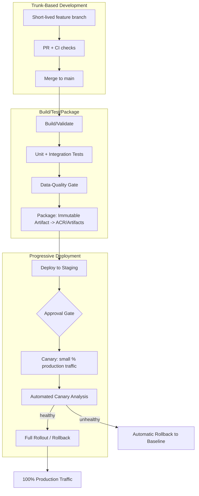
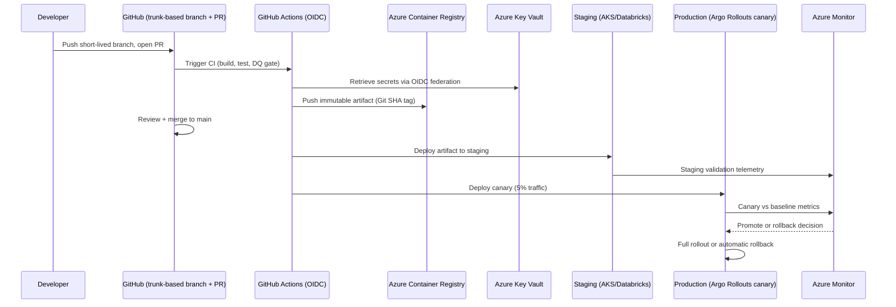
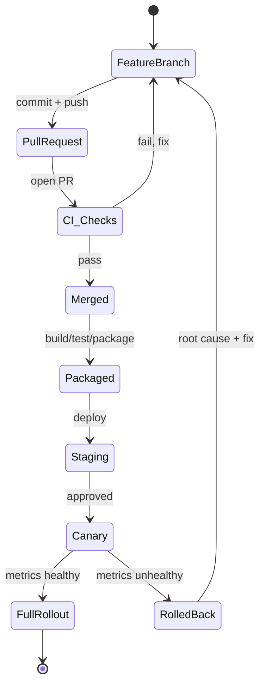
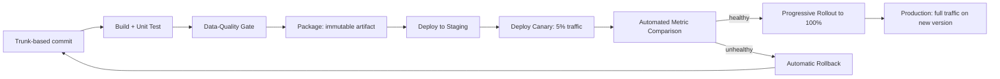

# DevOps and CI/CD

> Part of the **Enterprise Data & AI Architecture Handbook** · Phase-09 — DataOps, Platform Engineering & DevOps · Chapter 03.
> Estimated study time: **60 min reading + ~4h labs**.
> **Prerequisites:** read [DataOps Foundations](01_DataOps_Foundations.md) first.

---

## Executive Summary

[DataOps Foundations](01_DataOps_Foundations.md#core-concepts) established *why* data pipelines need the same delivery discipline as application software and introduced the four-layer testing model. This chapter goes one level deeper into the *mechanics* of that delivery pipeline: the concrete build, test, package, and deploy stages; the branching model (trunk-based development) that keeps changes small and mergeable; the release strategies (blue-green, canary) that let a risky change reach production safely; and the secrets/artifact management practices that keep the whole pipeline secure and reproducible. Where Chapter 01 answered "why does a data platform need CI/CD and testing gates," this chapter answers "concretely, what does a production-grade CI/CD pipeline for data and AI workloads look like, stage by stage."

This chapter covers: **CI/CD with GitHub Actions and Azure DevOps** as the two primary orchestration engines used across this handbook, including their YAML pipeline models, environment/approval gates, and reusable-template mechanisms; the **build, test, package, deploy** stage decomposition as it applies specifically to data/ML artifacts (dbt projects, PySpark jobs, Databricks Asset Bundles, containerized model-serving images) rather than compiled application binaries; **blue-green and canary release strategies** adapted to data and ML workloads, where "traffic" often means query routing or model-serving requests rather than HTTP load-balancer weight; **secrets and artifact management**, covering credential rotation, workload identity federation, and versioned, immutable artifact registries; and **trunk-based development**, the branching discipline that keeps the entire delivery pipeline in §1 fast and low-risk by keeping merges small and frequent.

The governing insight: **a CI/CD pipeline's safety comes from the size and reversibility of each individual change, not from the sophistication of any single stage.** Small, frequent, trunk-based merges with fast automated gates catch problems earlier and cheaper than large, infrequent releases with an elaborate but rarely-exercised release process. Blue-green and canary strategies exist specifically to make even a single merged change's production rollout reversible within minutes, extending the same "small, safe, reversible" principle from the code-merge stage all the way to the traffic-routing stage.

The bias remains **Azure-primary (~60%)** — Azure DevOps Pipelines, GitHub Actions (Microsoft-owned), Azure Artifacts, Azure Container Registry, and Azure Key Vault — **~30% enterprise open source** (Docker, Terraform, pytest, dbt, Great Expectations, GitHub Actions reusable workflows) and **~10% AWS/GCP comparison-only** (AWS CodePipeline/CodeArtifact, GCP Cloud Build/Artifact Registry).

**Bottom line:** a mature CI/CD practice for data and AI systems succeeds when every merge to trunk is small, independently tested, automatically deployed through a graduated environment path, and reversible within minutes if production signals turn bad — and fails when releases are large, infrequent, tested manually, and rely on a slow, blocking rollback process. An architect who designs the build/test/package/deploy pipeline around small-batch, trunk-based delivery, and pairs it with progressive release strategies (blue-green, canary) and disciplined secrets/artifact management, gives every subsequent Phase-09 chapter (IaC, containers, Kubernetes, orchestration, GitOps) a safe, fast substrate to deploy onto.

---

## Learning Objectives

By the end of this chapter you will be able to:

1. **Design a multi-stage CI/CD pipeline** (build, test, package, deploy) in GitHub Actions or Azure DevOps Pipelines for a data/ML workload.
2. **Explain trunk-based development** and why short-lived branches and frequent small merges reduce delivery risk compared to long-lived feature branches.
3. **Implement blue-green and canary release strategies** appropriate to data pipelines and model-serving endpoints, not just stateless web services.
4. **Architect secure secrets management** using Azure Key Vault and workload identity federation, eliminating long-lived credentials from CI/CD pipelines.
5. **Design an immutable, versioned artifact management strategy** using Azure Artifacts/Container Registry, with clear promotion semantics across environments.
6. **Distinguish build, test, package, and deploy stage responsibilities** for heterogeneous data/ML artifacts (SQL, notebooks, containers, IaC).
7. **Apply CI/CD practices on Azure** using GitHub Actions and Azure DevOps Pipelines end-to-end, including environment approvals.
8. **Identify CI/CD anti-patterns** — long-lived feature branches, mutable artifact tags, and manual secret handling.
9. **Map a target CI/CD architecture onto Azure**, with an explicit, defensible comparison to AWS CodePipeline/CodeArtifact and GCP Cloud Build/Artifact Registry.
10. **Defend CI/CD tooling and release-strategy decisions** in engineer, staff engineer, architect, and CTO review settings.

---

## Business Motivation

- **Large, infrequent releases are measurably riskier than small, frequent ones** — DORA research consistently correlates smaller batch size and higher deployment frequency with lower change-failure rate and faster recovery, a finding that applies as directly to data pipelines as to application services.
- **A release strategy that can't be safely reversed turns every deployment into a high-stress event.** Blue-green and canary strategies convert "hope this works" into "verify on a small slice, then promote or roll back in minutes," directly reducing the organizational cost of shipping frequently.
- **Leaked or long-lived credentials are one of the most common real-world data-breach vectors.** Enterprises need CI/CD secrets management that eliminates static, long-lived credentials from pipeline configuration entirely, not just "hides" them better.
- **Reproducibility is a compliance and debugging requirement.** An immutable artifact registry (never overwriting a version tag) is what lets an incident responder or auditor definitively answer "what exact code was running in production at time X."
- **Long-lived feature branches create integration risk that compounds with team size.** As a data organization scales (per [Platform Engineering](02_Platform_Engineering.md#business-motivation)'s growth motivation), merge conflicts and integration surprises from long-lived branches become a measurable tax on delivery velocity.

---

## History and Evolution

- **2000s — Centralized version control (SVN, ClearCase)** with long release-branch cycles was the norm; merges were infrequent and often painful, a direct ancestor of the long-lived-branch anti-pattern this chapter argues against.
- **2005 — Git's distributed model** made branching cheap, which paradoxically encouraged *more* long-lived feature branches in many organizations before trunk-based development re-established short-lived branching as best practice.
- **2010-2015 — Continuous delivery literature (Humble & Farley)** formalized build/test/package/deploy pipeline staging and the principle that any build capable of passing all stages is release-candidate quality — a direct precursor to this chapter's stage model.
- **2011 — Netflix popularizes canary releases** as a mechanism for validating a change against real production traffic on a small, controlled scale before full rollout, distinct from blue-green's all-or-nothing environment swap.
- **2015-2018 — Container registries and immutable image tagging (Docker Hub, later Azure Container Registry)** became the standard artifact-management model, replacing mutable file-share or FTP-based deployment artifacts.
- **2018-2020 — Trunk-based development is popularized as an explicit named practice** (Paul Hammant's trunkbaseddevelopment.com), pushing back against the by-then-common long-lived GitFlow-style branching model for high-velocity teams.
- **2019-present — Azure Key Vault and later workload identity federation** eliminate the need for CI/CD pipelines to store any long-lived cloud credential at all, authenticating via short-lived, federated OIDC tokens instead.
- **2020-present — GitHub Actions matures as a first-class CI/CD platform** (accelerated by Microsoft's ownership since 2018), converging much of the industry (including many Azure-primary shops) onto GitHub Actions rather than exclusively Azure DevOps Pipelines.
- **2022-present — Progressive delivery tooling (Argo Rollouts, Flagger)** brings canary and blue-green strategies natively into Kubernetes-based deployment, extending these patterns from application services to containerized data/ML serving workloads (elaborated in Phase-09 Chapter 06).

---

## Why This Technology Exists

CI/CD pipeline mechanics and release strategies exist because "does the code work" and "is it safe to expose this change to production traffic/data" are two separate questions requiring two separate mechanisms. Build/test/package/deploy staging answers the first question through progressively more realistic validation; blue-green and canary release strategies answer the second by controlling *how much* production exposure a change receives before it is fully trusted. Trunk-based development and disciplined secrets/artifact management exist to keep the pipeline delivering this validation quickly, securely, and reproducibly at scale, rather than slowly, insecurely, or with untraceable artifacts.

---

## Problems It Solves

- **Risky, infrequent "big bang" releases** — trunk-based development plus small, frequent, fully-tested merges reduces the blast radius of any single change.
- **All-or-nothing production exposure** — canary releases let a change be validated against a small percentage of real production traffic/data before full rollout, catching regressions that pre-production testing missed.
- **Slow, risky rollback** — blue-green deployment makes rollback a near-instant traffic/routing switch back to the previously-known-good environment, rather than a redeploy-and-hope operation.
- **Leaked or stale credentials** — workload identity federation and Key Vault-backed secret retrieval eliminate long-lived static credentials from pipeline configuration.
- **Unreproducible deployments** — immutable, versioned artifacts (container images, NuGet/npm/PyPI packages) guarantee that what was tested is exactly what gets deployed, with no "works on my machine" drift between stages.

---

## Problems It Cannot Solve

- **It cannot fix a badly-designed change just because it was deployed safely.** Canary and blue-green strategies reduce the *blast radius* of a bad change; they do not verify the change was the *right* change — that remains a design and code-review responsibility.
- **It cannot substitute for the data-quality testing layer.** A perfectly executed blue-green deployment of a pipeline with no data-quality gate (per [DataOps Foundations §1.4](01_DataOps_Foundations.md#core-concepts)) will deploy safely and still produce silently wrong data.
- **It cannot eliminate the need for meaningful code review.** Fast CI/CD and small batch sizes reduce risk, but a rubber-stamped pull-request review process undermines the safety net regardless of how fast or well-automated the pipeline is.
- **It cannot make an under-resourced team's release cadence sustainable by tooling alone.** Trunk-based development requires genuine discipline (feature flags for incomplete work, small commits) — the tooling supports the practice but does not enforce the engineering discipline behind it.
- **It cannot fully replace canary analysis with automated judgment for every workload.** Some canary decisions (does this recommendation-model output look qualitatively better) still require human judgment that automated metrics alone cannot fully capture.

---

## Core Concepts

### 3.1 Trunk-Based Development

Trunk-based development is a source-control workflow where all developers integrate their changes into a single shared branch (`main`/`trunk`) at least daily, using **short-lived feature branches** (typically living hours, not days or weeks) or, for advanced teams, committing directly to trunk behind **feature flags**. This contrasts with long-lived feature-branch or GitFlow-style models where a branch may live for weeks before merging.

- **Why it matters for data platforms specifically:** a long-lived feature branch modifying a shared dbt model or a shared PySpark transformation library compounds merge-conflict risk with every day it stays unmerged, and delays the moment the CI/CD data-quality gate (Chapter 01) actually validates the change against current reality.
- **Feature flags for incomplete work** — rather than keeping a half-finished pipeline change on a branch, trunk-based teams merge the (flagged-off) code to trunk immediately and control its activation via configuration, keeping the branch lifetime short regardless of feature completion time.
- **Release branches only for stabilization, not development** — if a release branch is used at all (common in regulated release-train models), it should be short-lived and used only to cherry-pick a final stabilization fix, not as the primary development branch.

### 3.2 Build, Test, Package, Deploy Stage Decomposition

- **Build** — for data workloads this is often "compile/validate" rather than traditional compilation: `dbt compile`, a Python syntax/type check (mypy), a Databricks notebook lint, or a Docker image build for a containerized model-serving service.
- **Test** — executes the four-layer testing model from [DataOps Foundations §1.4](01_DataOps_Foundations.md#core-concepts): unit tests (pytest), integration tests against sample data, and data-quality/contract tests (Great Expectations, dbt tests).
- **Package** — produces the immutable, versioned deployable artifact: a Docker image pushed to Azure Container Registry with a semantic-version or Git-SHA tag, a Databricks Asset Bundle archive, or a Python wheel published to Azure Artifacts.
- **Deploy** — applies the packaged artifact to a target environment: `databricks bundle deploy`, an ADF ARM template deployment, a Kubernetes rollout, or a Terraform apply for supporting infrastructure — always referencing the artifact by its immutable version, never by a mutable "latest" tag.

The critical discipline: **the artifact built once in the "package" stage is the exact same artifact promoted through every subsequent environment** — dev, staging, and production all deploy the identical container image or bundle, differing only in environment-specific configuration, never rebuilt per environment (which would reintroduce the "what actually got tested" reproducibility gap this model exists to close).

### 3.3 Blue-Green Deployment

Blue-green deployment maintains two complete, independent production environments ("blue" = currently live, "green" = newly deployed candidate). The new version is fully deployed and validated in the idle environment, then traffic (or, for a data pipeline, the active read/write target) is switched atomically from blue to green. Rollback is simply switching traffic back to blue.

- **For data pipelines:** blue-green often means writing a new pipeline version's output to a parallel table/path, validating it against data-quality checks, then atomically repointing a view or downstream consumer's read target — analogous to the "shadow" pattern from [DataOps Foundations §1.3](01_DataOps_Foundations.md#core-concepts) but applied to a full production cutover rather than a read-only comparison.
- **For model-serving endpoints:** blue-green means deploying a new model version to a fully separate serving deployment (e.g., a second Azure ML managed online endpoint deployment slot) and switching a load balancer/traffic-manager rule to route 100% of requests to it once validated.
- **Trade-off:** requires double the environment's resource footprint during the cutover window, but provides the fastest possible rollback (a routing change, not a redeploy).

### 3.4 Canary Deployment

Canary deployment gradually shifts a small, controlled percentage of production traffic (or a subset of data partitions) to the new version, monitoring key metrics before progressively increasing exposure to 100%.

- **For pipelines:** a canary might mean running the new transformation logic on one day's partition or one business unit's data slice while the rest of production continues on the previous version, comparing outputs and data-quality metrics before a full cutover.
- **For model-serving:** a canary routes a small percentage (e.g., 5%) of inference requests to the new model version, comparing latency, error rate, and business metrics (click-through, conversion) against the existing version before promoting to 100%.
- **Automated canary analysis** — mature implementations (Argo Rollouts, Flagger, elaborated in Phase-09 Chapter 06) automatically compare canary vs. baseline metrics against a defined threshold and automatically promote or roll back without requiring a human to watch a dashboard in real time.
- **Trade-off vs. blue-green:** canary provides finer-grained risk control and real production-traffic validation before full exposure, at the cost of a more complex routing/comparison mechanism and a longer full-rollout timeline than blue-green's instant cutover.

### 3.5 Secrets and Artifact Management

- **Workload identity federation** — CI/CD pipelines (GitHub Actions OIDC, Azure DevOps workload identity federation) authenticate to Azure using short-lived, federated tokens exchanged for an Azure AD token at runtime, eliminating the need to store any long-lived service-principal secret in pipeline configuration at all.
- **Azure Key Vault as the single secrets source of truth** — any secret a pipeline or deployed workload needs (connection strings, API keys) is retrieved at runtime from Key Vault via managed identity, never stored as a pipeline variable or environment variable in plaintext.
- **Immutable artifact versioning** — every build produces an artifact tagged with an immutable identifier (Git SHA or semantic version), never overwriting an existing tag; "latest" or "dev" mutable tags should never be deployed to production, since they break the reproducibility guarantee that "what was tested is what's deployed."
- **Artifact promotion, not rebuild** — the same immutable artifact is promoted (retagged as "approved for staging," "approved for production," or referenced directly by its immutable identifier) across environments rather than being rebuilt per environment.
- **Secret rotation and scanning** — CI/CD pipelines should include automated secret-scanning (e.g., GitHub secret scanning, `git-secrets`) on every commit, and Key Vault secrets should be rotated on a defined schedule with automatic pipeline/workload re-authentication, not manual intervention.

---

## Internal Working

A representative build-to-production flow incorporating trunk-based development, staged pipeline execution, and a canary release:

1. **Short-lived feature branch created**, changes committed, pull request opened against `main` within hours, not days.
2. **CI pipeline triggers**: build/validate stage, unit tests, data-quality/contract compatibility check (per [DataOps Foundations](01_DataOps_Foundations.md#internal-working)).
3. **Code review and merge to trunk** — small, reviewable diff merged same-day.
4. **Package stage**: a versioned, immutable artifact (container image tagged with Git SHA, or a Databricks Asset Bundle) is built and pushed to Azure Container Registry/Azure Artifacts.
5. **Deploy to staging**: the immutable artifact is deployed to staging using workload-identity-federated credentials; staging-level integration and data-quality tests run against the same artifact.
6. **Approval gate** (for high-risk changes): a named approver reviews staging results before authorizing production promotion.
7. **Canary deployment to production**: the artifact is deployed alongside the current production version, initially receiving a small percentage of traffic/data.
8. **Automated canary analysis**: latency, error rate, and data-quality metrics are compared between canary and baseline over a defined bake time.
9. **Promote or roll back**: if metrics are healthy, traffic is progressively shifted to 100%; if not, traffic is automatically routed back to the baseline version and the canary is torn down.
10. **Post-deployment monitoring** continues per [DataOps Foundations §1.5](01_DataOps_Foundations.md#core-concepts), watching both deployment-execution and data-quality signals.

---

## Architecture

---

## Components

- **Source control (GitHub, Azure Repos)** — hosts trunk-based branches, pull requests, and branch-protection policies.
- **CI/CD orchestrator (GitHub Actions, Azure DevOps Pipelines)** — executes build/test/package/deploy stages defined as YAML pipelines.
- **Artifact registry (Azure Container Registry, Azure Artifacts)** — stores immutable, versioned build outputs.
- **Secrets store (Azure Key Vault)** — the single source of truth for runtime secrets, accessed via managed identity/workload identity federation.
- **Environment/approval gates (Azure DevOps Environments, GitHub Environments)** — enforce named-approver sign-off before high-risk production promotions.
- **Traffic-routing/release-management layer (Azure Traffic Manager, Azure Front Door, Kubernetes Ingress/Argo Rollouts)** — implements blue-green cutover or canary traffic-splitting.
- **Observability stack (Azure Monitor, Application Insights)** — supplies the metrics automated canary analysis compares between baseline and canary.

---

## Metadata

- **Build provenance metadata** — every artifact should carry its source Git commit SHA, build pipeline run ID, and build timestamp, queryable for audit and incident investigation.
- **Deployment-history metadata** — a record of every environment promotion (artifact version, timestamp, approver, target environment) forms the audit trail required by [DataOps Foundations §1's governance](01_DataOps_Foundations.md#governance) discipline.
- **Canary-analysis metadata** — the specific metrics, thresholds, and bake-time duration used for a given canary decision should be recorded alongside the promote/rollback outcome, enabling retrospective tuning of canary criteria.
- **Secret-rotation metadata** — last-rotated timestamp and rotation schedule per secret, tracked in Key Vault, to catch overdue rotations before they become a compliance finding.

---

## Storage

- **Git repository** stores source code, pipeline YAML definitions, and IaC templates.
- **Azure Container Registry** stores immutable, versioned container images with geo-replication for multi-region deployment targets.
- **Azure Artifacts** stores versioned NuGet/npm/PyPI/Maven packages and Databricks Asset Bundle archives.
- **Azure Key Vault** stores secrets, keys, and certificates, with soft-delete and purge-protection enabled for production vaults.
- **Deployment-history/audit storage** (Azure Log Analytics or a dedicated metadata database) retains the promotion and canary-decision audit trail.

---

## Compute

- **CI/CD runners** — GitHub-hosted or Azure DevOps Microsoft-hosted agents for standard builds; self-hosted agents (on AKS or VM scale sets) when private network access to a VNet-integrated platform or specialized build hardware (GPU for ML training images) is required.
- **Canary/blue-green serving compute** — running two versions simultaneously (canary or blue-green) temporarily doubles serving compute footprint; right-size the canary's initial capacity to the smaller expected traffic percentage rather than provisioning full capacity from the start.
- **Ephemeral test compute** for the package stage's integration tests, matching the pattern from [DataOps Foundations](01_DataOps_Foundations.md#compute).

---

## Networking

- **Traffic-splitting infrastructure** — Azure Front Door, Application Gateway, or Kubernetes Ingress (with Argo Rollouts/Flagger) provide the weighted routing rules canary deployments depend on.
- **Private, VNet-integrated CI/CD runners** — self-hosted agents deploying into a VNet-integrated Databricks workspace or private AKS cluster need network line-of-sight via private endpoints, exactly as covered in [DataOps Foundations](01_DataOps_Foundations.md#networking).
- **Blue-green environment network parity** — both blue and green environments must have identical network configuration (subnets, NSGs, private endpoints) to guarantee the cutover is a pure traffic-routing change, not also a configuration change.

---

## Security

- **No long-lived credentials in pipeline configuration** — workload identity federation (GitHub Actions OIDC ↔ Azure AD federated credentials, or Azure DevOps workload identity federation) is the default; static service-principal secrets should be treated as a legacy fallback only.
- **Least-privilege, environment-scoped deployment identities** — the identity deploying to staging must not have production write access, mirroring [DataOps Foundations](01_DataOps_Foundations.md#security).
- **Branch protection with required status checks** — `main` should require passing CI and at least one review before merge, with no bypass for administrators in a well-governed repository.
- **Immutable artifact signing/attestation** — for regulated environments, sign container images (e.g., with Notation/cosign) and verify signatures at deploy time, preventing an unauthorized or tampered artifact from being deployed.
- **Automated secret scanning** on every commit and pull request, blocking merges that introduce a detected credential.
- **Approval gates as a security control, not just a process step** — a named-approver gate for production promotion is itself a control that should be included in security/compliance audit scope.

---

## Performance

- **Fast feedback loop is the primary performance metric** — the build/unit-test stage should complete in a few minutes; slower stages (integration test, canary bake time) should not block the fast-feedback loop that keeps trunk-based development practical.
- **Parallelized stage execution** — independent test suites (unit tests for different modules, lint, static analysis) should run concurrently rather than serially wherever the CI platform supports parallel jobs.
- **Canary bake-time tuning** — too short a bake time risks promoting a change before a slow-onset regression manifests; too long delays full rollout unnecessarily — tune bake time to the specific metric's typical detection latency (e.g., a data-quality check that only runs daily needs a longer bake than a latency metric sampled every minute).
- **Artifact registry pull performance** — use registry geo-replication (Azure Container Registry Premium tier) for multi-region deployments to avoid cross-region image-pull latency during deployment.

---

## Scalability

- **Reusable pipeline templates** (per [Platform Engineering](02_Platform_Engineering.md#core-concepts)) let the build/test/package/deploy pattern in this chapter scale across hundreds of pipelines without each team hand-rolling its own YAML.
- **Parallel canary/blue-green infrastructure scales with traffic, not with team count** — the resource overhead of running two versions simultaneously is proportional to workload traffic, not to the number of teams adopting the pattern, making it economically viable even for smaller teams once the routing infrastructure is shared/templated.
- **Artifact registry namespace/repository scaling** — as the number of pipelines grows into the hundreds, use a consistent repository-naming and retention-policy convention in Azure Container Registry/Artifacts to keep the registry manageable and cost-controlled.

---

## Fault Tolerance

- **Automatic rollback on failed canary analysis** — a canary deployment's routing layer should automatically shift traffic back to the baseline version without requiring human intervention when metrics breach a defined threshold.
- **Blue-green's near-instant rollback** — because the previous version remains fully running and idle-ready, blue-green rollback is a routing change measured in seconds, the fastest recovery mechanism available among release strategies.
- **Idempotent deploy stage** — a retried or partially-applied deployment (per the IaC idempotency principle in Phase-09 Chapter 04) should be safely re-runnable without manual cleanup.
- **CI/CD platform outage fallback** — as in [DataOps Foundations](01_DataOps_Foundations.md#fault-tolerance), a documented, rarely-used manual emergency-deployment runbook should exist, gated behind extra approval, for the rare case the CI/CD platform itself is unavailable.

---

## Cost Optimization

- **Right-size canary initial capacity** — provision only enough serving capacity for the canary's initial small traffic percentage, scaling up progressively as traffic shifts, rather than pre-provisioning full duplicate capacity upfront.
- **Cache dependencies and use incremental builds** — Docker layer caching and dependency caching (per [DataOps Foundations](01_DataOps_Foundations.md#cost-optimization)) apply directly to this chapter's build stage.
- **Artifact registry retention policies** — configure automatic cleanup of untagged or old artifact versions in Azure Container Registry/Artifacts to control storage cost, while retaining enough history for audit and rollback needs.
- **Worked FinOps example:** A team runs blue-green deployments for a Databricks-based feature-serving pipeline, provisioning a full duplicate "green" cluster (Standard_DS4_v2 x 4 nodes, ~$1.80/hr all-in) for a 30-minute validation window before every production deployment, at roughly 20 deployments/month: 20 × 0.5 hr × $1.80 × 4 nodes ≈ $72/month in duplicate-cluster overhead — a modest, easily justified cost for the instant-rollback safety it buys. Switching the same workload to a canary strategy on a shared Kubernetes cluster with Argo Rollouts instead requires no duplicate cluster, only marginal additional pod replicas sized to the canary traffic percentage (e.g., 5% of a 10-pod deployment ≈ 0.5 extra pod-equivalent), reducing the release-overhead cost to roughly $8-10/month — a meaningful saving at high deployment frequency, though blue-green's simplicity and truly instant full-cutover rollback may still justify its modestly higher cost for the highest-risk regulatory pipelines.

---

## Monitoring

- **DORA metrics** (deployment frequency, lead time for changes, change failure rate, mean time to restore) remain the primary north-star metrics for this chapter's practices, directly extending [DataOps Foundations](01_DataOps_Foundations.md#monitoring).
- **Canary analysis dashboards** — real-time comparison of baseline vs. canary latency, error rate, and business/data-quality metrics during the bake window.
- **Artifact promotion tracking** — a dashboard showing which artifact version is currently deployed in each environment, and how long it has been since the last production promotion.
- **Secret rotation compliance dashboard** — tracks which Key Vault secrets are overdue for rotation against policy.

---

## Observability

- **Correlate deployment events with both canary metrics and data-quality signals** in a single observability pane, extending the unified-signal-correlation principle from [DataOps Foundations §1](01_DataOps_Foundations.md#observability).
- **Structured, versioned logging** — every log line emitted by a deployed workload should be tagged with the artifact version/Git SHA that produced it, making it possible to filter logs by exactly the version under canary evaluation.
- **Automated canary judgment, with human override** — while automated analysis should handle the common promote/rollback decision, the on-call engineer should always retain the ability to manually force a rollback if a signal outside the automated metric set looks wrong.

### Operational Response Playbook

| Signal | Detection Query/Check | Remediation |
|---|---|---|
| Canary error-rate or latency regression during bake window | Automated canary analysis (Argo Rollouts/Flagger metric provider, or Azure Monitor alert on canary-tagged telemetry) exceeds threshold vs. baseline | Automatic traffic rollback to baseline; page the deploying engineer; treat as a blocked release requiring root-cause before retry, not an immediate re-attempt. |
| Overdue secret rotation | Azure Key Vault access-policy/rotation-tracking query flags a secret past its rotation SLA | Rotate the secret via the automated rotation pipeline; verify dependent workloads re-authenticate successfully via workload identity federation before considering the incident closed. |

---

## Governance

- **Every production deployment traceable to an approved PR, passing CI run, and artifact version** — the audit trail this chapter's practices produce directly satisfies the change-management traceability requirement from [DataOps Foundations](01_DataOps_Foundations.md#governance).
- **Approval-gate policy tied to risk tier** — regulated or high-blast-radius pipelines require a named-approver gate before production promotion; lower-risk pipelines may auto-promote on passing canary analysis alone.
- **Immutable artifact policy enforced by registry configuration**, not just convention — configure Azure Container Registry/Artifacts retention and immutability settings so a previously-published version tag genuinely cannot be overwritten.
- **Secrets-management policy** — mandate Key Vault-backed, workload-identity-federated secret access as an organization-wide standard, auditable via policy-as-code (per [Platform Engineering](02_Platform_Engineering.md#governance)).

---

## Trade-offs

| Dimension | Blue-Green | Canary |
|---|---|---|
| Rollback speed | Near-instant (routing switch) | Fast, but proportional to how far rollout had progressed |
| Infrastructure cost during cutover | Full duplicate environment | Marginal — only the canary's traffic-proportional capacity |
| Production-traffic validation | Limited (validated pre-cutover, then all-or-nothing) | Rich — validated against real traffic at increasing scale |
| Implementation complexity | Lower — mostly a routing/DNS/load-balancer concern | Higher — needs traffic-splitting and automated metric comparison |
| Best fit | High-risk, must-be-instantly-reversible changes (schema cutovers, regulatory pipelines) | Frequent, lower-risk changes where gradual, real-traffic validation is valuable |

---

## Decision Matrix

| Scenario | Recommended Approach |
|---|---|
| Schema or data-contract cutover requiring instant reversibility | Blue-green with a parallel table/view swap |
| Frequent model-serving updates with measurable business metrics | Canary with automated metric-based promotion |
| Small team, low deployment frequency, simple stateless service | Basic rolling deployment may suffice; blue-green/canary complexity may not be justified yet |
| Regulated, high-blast-radius pipeline | Blue-green plus a named-approver gate, never fully-automated promotion |
| High-velocity feature-flagged trunk-based team | Trunk-based development with feature flags plus canary for runtime validation |

---

## Design Patterns

- **Immutable artifact promotion** — build once, deploy the same artifact everywhere, varying only configuration per environment.
- **Progressive delivery with automated analysis** — canary rollout paired with automated metric comparison (Argo Rollouts/Flagger) rather than manual dashboard-watching.
- **Feature flags to decouple deploy from release** — merging incomplete work to trunk behind a flag, then "releasing" it via a configuration change independent of the next deployment.
- **Short-lived branch + fast CI feedback loop** — the foundational pattern that makes every other pattern in this chapter practical at a sustainable pace.

---

## Anti-patterns

- **Long-lived feature branches with infrequent, large merges** — the direct opposite of trunk-based development, compounding merge risk and delaying test feedback.
- **Mutable "latest" artifact tags deployed to production** — breaks the reproducibility guarantee that what was tested is what's deployed.
- **Manual secret handling** — copying credentials into pipeline variables or personal `.env` files instead of Key Vault-backed, identity-federated retrieval.
- **Canary deployments with no automated analysis, relying on someone remembering to check a dashboard** — defeats the purpose of progressive delivery if promotion happens on a timer regardless of actual canary health.
- **Rebuilding the artifact separately for each environment** — reintroduces "works in staging, breaks in prod" risk that immutable artifact promotion exists to eliminate.

---

## Common Mistakes

- Treating blue-green and canary as interchangeable without considering their very different cost, complexity, and validation-depth trade-offs.
- Configuring an approval gate but granting the same person auto-approval rights, defeating its purpose as an independent check.
- Not right-sizing canary initial capacity, either wasting cost on an over-provisioned canary or under-provisioning it so its own capacity constraints skew the metric comparison.
- Skipping automated secret scanning, relying solely on code review to catch accidentally-committed credentials.
- Allowing release branches to become long-lived development branches in practice, undermining the intended trunk-based model.

---

## Best Practices

- Merge to trunk at least daily; keep feature branches alive for hours, not days.
- Build the artifact once; promote the identical, immutable artifact through every environment.
- Default to workload identity federation for all CI/CD-to-Azure authentication; treat static service-principal secrets as a last resort.
- Pair every canary deployment with automated, threshold-based promote/rollback analysis, not manual observation alone.
- Reserve blue-green for changes needing instant, whole-environment reversibility; use canary for frequent, incremental, metric-validated releases.
- Tie approval-gate rigor to risk tier, not uniformly applied regardless of blast radius.

---

## Enterprise Recommendations

- Mandate trunk-based development (or a close approximation with very short-lived branches) as the default branching model across all data/ML teams, reserving long-lived branches only for documented, exceptional stabilization needs.
- Standardize on workload identity federation for every CI/CD pipeline's cloud authentication, retiring static service-principal secrets on a defined timeline.
- Require immutable artifact tagging and registry-enforced immutability settings as a non-negotiable platform standard.
- Adopt automated canary analysis tooling (Argo Rollouts/Flagger, or Azure-native equivalents) as the default for any workload with meaningful production traffic, rather than leaving canary judgment to manual dashboard-watching.
- Report DORA metrics at the organization level, using them to identify teams needing platform-engineering support (per [Platform Engineering](02_Platform_Engineering.md#enterprise-recommendations)) rather than as a punitive scorecard.

---

## Azure Implementation

- **GitHub Actions with OIDC federation to Azure AD** — the recommended default for new pipelines: a GitHub Actions workflow authenticates via a federated credential, eliminating any stored Azure secret.
- **Azure DevOps Pipelines with workload identity federation service connections** — the equivalent mechanism for teams standardized on Azure DevOps, replacing classic service-principal-secret service connections.
- **Azure Container Registry (Premium tier)** — geo-replicated, immutable, versioned container image storage with content-trust/signing support.
- **Azure Artifacts** — versioned package feeds for Python wheels, npm, NuGet, and Databricks Asset Bundle archives, integrated natively with Azure DevOps Pipelines.
- **Azure Key Vault** — the secrets store, accessed via managed identity from deployed workloads and via workload identity federation from CI/CD pipelines.
- **Azure Traffic Manager / Front Door** — implements blue-green cutover (DNS or edge-routing swap) or weighted canary traffic splitting for web-facing or API-based serving endpoints.
- **Azure ML managed online endpoints (deployment slots)** — native support for blue-green and traffic-percentage-based canary rollout for model-serving workloads.

---

## Open Source Implementation

- **GitHub Actions** — the primary open, widely-adopted CI/CD engine referenced throughout this chapter, with a large reusable-workflow ecosystem.
- **Argo Rollouts / Flagger** — Kubernetes-native progressive-delivery controllers implementing automated canary and blue-green strategies with metric-based promotion (elaborated further in Phase-09 Chapter 06).
- **Docker** — the standard artifact format for containerized data/ML services, packaged and versioned in this chapter's "package" stage.
- **Terraform** — provisions the supporting infrastructure (traffic-routing rules, environments) this chapter's deploy stage targets, elaborated in Phase-09 Chapter 04.
- **pytest / Great Expectations / dbt tests** — the concrete test-stage tooling, directly reused from [DataOps Foundations](01_DataOps_Foundations.md#open-source-implementation).
- **git-secrets / Gitleaks** — open-source secret-scanning tools integrated as a CI stage to catch accidentally-committed credentials.

---

## AWS Equivalent (comparison only)

| Capability | Azure | AWS |
|---|---|---|
| CI/CD orchestration | GitHub Actions / Azure DevOps Pipelines | AWS CodePipeline + CodeBuild |
| Artifact registry | Azure Container Registry / Azure Artifacts | Amazon ECR + AWS CodeArtifact |
| Secrets management | Azure Key Vault + workload identity federation | AWS Secrets Manager + IAM roles for service accounts (IRSA) |
| Progressive delivery | Argo Rollouts/Flagger on AKS, Azure ML endpoint traffic splitting | AWS CodeDeploy (blue-green, canary), Argo Rollouts on EKS |

**Advantages of AWS:** CodeDeploy has native, first-party blue-green and canary support integrated directly with Lambda/ECS/EC2 deployment targets, requiring less additional tooling than an Azure-native equivalent for those specific compute targets. **Disadvantages:** CodePipeline's authoring experience (JSON/console-driven) is generally considered less ergonomic than GitHub Actions/Azure DevOps YAML; achieving the same workload-identity-federation security model requires assembling IRSA plus OIDC configuration rather than a single native Azure feature. **Migration strategy:** pipeline logic and containerized artifacts port with moderate effort; the deployment-orchestration and secrets-federation layers require the most rework. **Selection criteria:** choose AWS CodeDeploy/CodePipeline for an AWS-primary estate already using Lambda/ECS; choose GitHub Actions/Azure DevOps with Argo Rollouts or Azure ML traffic splitting for an Azure-primary or Kubernetes-centric data/ML estate.

---

## GCP Equivalent (comparison only)

| Capability | Azure | GCP |
|---|---|---|
| CI/CD orchestration | GitHub Actions / Azure DevOps Pipelines | Google Cloud Build + Cloud Deploy |
| Artifact registry | Azure Container Registry / Azure Artifacts | Google Artifact Registry |
| Secrets management | Azure Key Vault + workload identity federation | Google Secret Manager + Workload Identity Federation |
| Progressive delivery | Argo Rollouts/Flagger on AKS, Azure ML endpoint traffic splitting | Cloud Deploy canary/blue-green on GKE, Argo Rollouts on GKE |

**Advantages of GCP:** Cloud Deploy has native, declarative canary and blue-green delivery pipelines purpose-built for GKE, with a clean progressive-delivery configuration model. **Disadvantages:** Cloud Deploy's progressive-delivery support is primarily GKE/Kubernetes-centric, offering less native support for non-containerized data-pipeline blue-green patterns (e.g., a Databricks-based pipeline cutover) compared to a general-purpose traffic-routing approach. **Migration strategy:** as with AWS, container-based artifacts and pipeline logic port readily; the deployment-orchestration and IAM/secrets-federation layers require the most rework. **Selection criteria:** choose GCP-native tooling for a GCP-primary, GKE-centric estate; choose Azure/GitHub Actions/Argo Rollouts for an Azure-primary or Databricks-centric data platform estate.

---

## Migration Considerations

- **Move to trunk-based development before investing heavily in progressive-delivery tooling** — the branching-discipline change is foundational and low-cost; canary/blue-green tooling investment delivers more value once small-batch delivery is already the norm.
- **Migrate secrets to Key Vault/workload identity federation incrementally, pipeline by pipeline**, prioritizing pipelines with the broadest current credential scope (highest risk) first.
- **Introduce immutable artifact tagging retroactively** by auditing existing registries for mutable-tag deployment patterns and migrating the highest-risk production pipelines first.
- **Pilot canary/blue-green on a single, well-understood workload** before rolling the pattern out broadly, since the automated-analysis thresholds need real-world tuning specific to each workload's metric behavior.

---

## Mermaid Architecture Diagrams

---

## End-to-End Data Flow

---

## Real-world Business Use Cases

- A payments company adopted canary releases for its fraud-scoring model-serving endpoint after a prior full-rollout deployment silently degraded fraud-catch rate for several hours before detection; canary analysis on precision/recall metrics now catches equivalent regressions within the first 5% traffic exposure.
- A retail analytics team moved a nightly pricing pipeline to a blue-green table-swap pattern after a bad transformation logic change corrupted the live pricing table directly; the parallel-table-then-swap pattern now allows validation before any consumer-visible cutover.
- A healthcare data platform migrated all CI/CD pipelines from static Azure service-principal secrets to workload identity federation after a credential-leakage near-miss, eliminating over 40 long-lived secrets from pipeline configuration across the organization.

---

## Case Studies

**Case: A canary deployment with no automated rollback.** An e-commerce company's recommendation-model canary deployment routed 10% of traffic to a new model version, with the plan to "check the dashboard after an hour and promote if it looks fine." The on-call engineer was pulled into an unrelated incident during the bake window; the canary silently remained at 10% traffic for six hours with a measurably worse click-through rate, before someone noticed and manually rolled it back.

**Root cause:** the canary process depended on a human remembering to check a dashboard at a specific time, with no automated metric threshold or rollback trigger — a process gap, not a tooling gap, since the metrics needed for an automated decision were already being collected.

**Remediation:** the team adopted Flagger on their existing AKS cluster, configuring an automated canary analysis with a defined click-through-rate threshold and a 30-minute bake window, after which the canary automatically promotes or rolls back without requiring a human to be watching in real time; the manual-check step is now a documented fallback only for canaries flagged as needing qualitative human review.

---

## Hands-on Labs

1. **Lab 1 — Convert a repository to trunk-based development.** Take an existing repository (e.g., the dbt project from [DataOps Foundations](01_DataOps_Foundations.md#hands-on-labs)) and configure branch protection requiring short-lived branches, required CI status checks, and at least one review before merge to `main`.
2. **Lab 2 — Build a package stage with immutable artifact tagging.** Extend the CI pipeline to build a Docker image tagged with the Git SHA and push it to an Azure Container Registry instance; verify the same tag cannot be overwritten (enable registry immutability).
3. **Lab 3 — Migrate a pipeline to workload identity federation.** Replace a static Azure service-principal-secret-based GitHub Actions authentication step with OIDC federation to Azure AD; verify the pipeline can still deploy without any stored secret.
4. **Lab 4 — Implement a canary deployment.** On a small AKS cluster, deploy Flagger (or Argo Rollouts) and configure a canary rollout for a simple containerized service, with an automated metric-based promotion rule.
5. **Lab 5 — Simulate a blue-green table cutover.** For a small data pipeline, write output to a parallel "green" table, run data-quality validation against it, then atomically swap a view definition to point consumers to the new table; document the rollback procedure (swap the view back).

---

## Exercises

1. Explain why trunk-based development reduces integration risk as team size grows, using a concrete merge-conflict scenario.
2. Compare blue-green and canary strategies for a scenario of your choosing, justifying which you would pick and why.
3. Describe the specific steps you would take to migrate a pipeline currently using a static, stored Azure credential to workload identity federation.
4. Design an automated canary-analysis rule (metric, threshold, bake time) for a hypothetical batch pipeline's data-quality output.
5. Identify a mutable-artifact-tag risk in a real or hypothetical pipeline you've worked with, and describe the concrete fix.

---

## Mini Projects

- Build a complete GitHub Actions pipeline implementing build, unit test, data-quality gate, immutable artifact packaging (Docker image to ACR), staging deployment, and a canary deployment to a small AKS cluster using Flagger, with automated promote/rollback based on a synthetic metric.
- Implement a secrets-management migration script that audits a set of pipeline YAML files for hardcoded or stored-secret patterns and reports which pipelines still need workload-identity-federation migration.
- Build a small dashboard (Grafana or a notebook) visualizing DORA metrics (deployment frequency, lead time, change failure rate, MTTR) computed from a sample set of simulated deployment events.

---

## Capstone Integration

Extend the golden-path template from [Platform Engineering](02_Platform_Engineering.md#capstone-integration)'s capstone with this chapter's concrete mechanics: add an immutable artifact-packaging stage (container image or Databricks Asset Bundle, versioned by Git SHA), migrate its CI/CD authentication to workload identity federation, and add a canary or blue-green release stage for its production promotion path. The result is a fully production-grade golden-path template that the rest of Phase-09 (Terraform/IaC, Docker, Kubernetes, Airflow, GitOps) will build deeper infrastructure and orchestration automation on top of.

---

## Interview Questions

1. What is trunk-based development, and why does it reduce delivery risk compared to long-lived feature branches?
2. What are the build, test, package, and deploy stages, and how does each apply differently to data/ML artifacts versus compiled application binaries?
3. What is the difference between blue-green and canary deployment, and when would you choose one over the other?
4. Why is workload identity federation preferred over static service-principal secrets in CI/CD pipelines?

## Staff Engineer Questions

5. How would you design an automated canary-analysis rule set for a workload whose key metric (e.g., data-quality pass rate) is only computed once per day rather than continuously?
6. What immutable-artifact-promotion strategy would you enforce across a 200-pipeline estate, and how would you audit compliance?
7. How would you migrate an organization's existing static-secret CI/CD pipelines to workload identity federation with minimal production risk?

## Architect Questions

8. How would you architect blue-green deployment for a stateful batch pipeline where "traffic" means a downstream consumer's read target rather than HTTP load-balancer weight?
9. What criteria would you use to decide whether a given workload needs canary analysis versus a simpler rolling deployment?
10. How does your CI/CD architecture's approval-gate policy differ across risk tiers, and how do you prevent it from becoming a rubber-stamp process?

## CTO Review Questions

11. What DORA metrics would you present to demonstrate this chapter's practices are improving delivery speed and safety, and what would "good" look like for this organization?
12. If an auditor asked to trace exactly which artifact version was running in production during a specific incident window, what evidence would your pipeline produce?
13. What is the single highest-risk CI/CD or release-strategy gap in this organization today, and what is your remediation plan and timeline?

---

## References

- Humble, Farley. *Continuous Delivery: Reliable Software Releases through Build, Test, and Deployment Automation*. Addison-Wesley.
- Forsgren, Humble, Kim. *Accelerate: The Science of Lean Software and DevOps*. IT Revolution Press.
- trunkbaseddevelopment.com. "Trunk Based Development."
- Netflix Technology Blog. "Automated Canary Analysis at Netflix with Kayenta."
- Microsoft Learn. "GitHub Actions OpenID Connect (OIDC) with Azure."
- Microsoft Learn. "Azure DevOps Pipelines — Workload identity federation for service connections."
- Flagger Documentation. "Progressive Delivery for Kubernetes."

## Further Reading

- [DataOps Foundations](01_DataOps_Foundations.md) — the lifecycle, testing model, and observability foundation this chapter's concrete mechanics implement.
- [Platform Engineering](02_Platform_Engineering.md) — the golden-path and self-service model that packages this chapter's CI/CD practices for reuse across teams.
- [Data Contracts](../Phase-08/07_Data_Contracts.md) — the schema/semantic versioning model enforced by this chapter's build-stage compatibility checks.

---

[Back to Phase-09 README](../../.github/prompts/Phase-09/README.md) - [Handbook README](../../README.md) - [Roadmap](../../ROADMAP.md)
