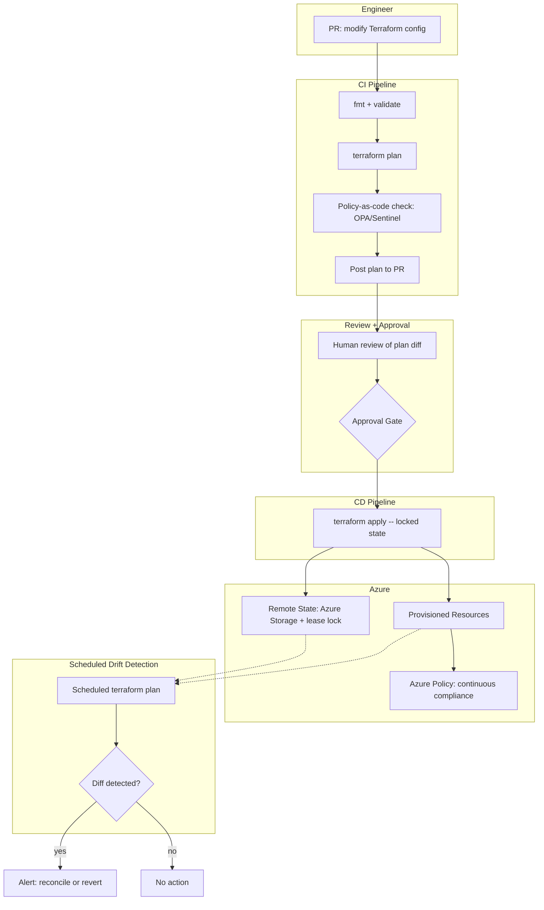
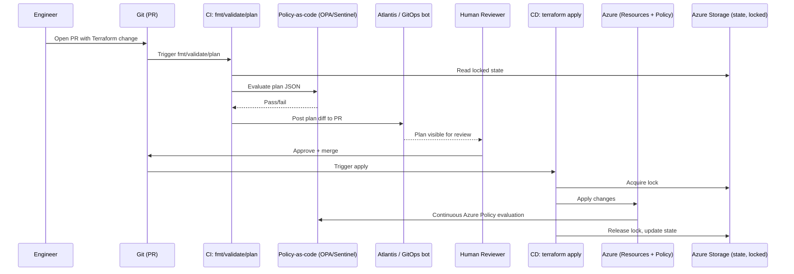
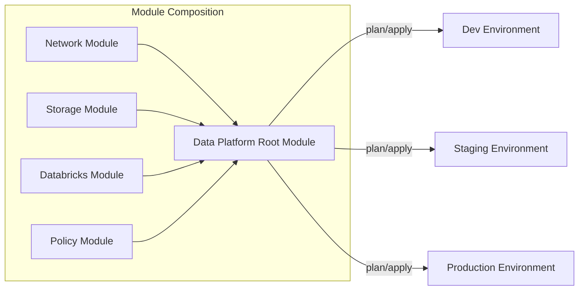
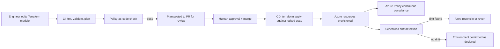

# Infrastructure as Code with Terraform

> Part of the **Enterprise Data & AI Architecture Handbook** · Phase-09 — DataOps, Platform Engineering & DevOps · Chapter 04.
> Estimated study time: **75 min reading + ~5h labs**.
> **Prerequisites:** read [Azure Landing Zones](../Phase-03/03_Azure_Landing_Zones.md) first.

---

## Executive Summary

[Azure Landing Zones](../Phase-03/03_Azure_Landing_Zones.md#core-concepts) defined *where* workloads should live: management groups, subscriptions, hub-and-spoke networking, and the platform/application landing-zone split. This chapter covers the tooling discipline that actually builds and maintains that structure repeatably: **Infrastructure as Code (IaC)**, with **Terraform** as the primary declarative engine, compared against Azure-native **Bicep/ARM**. Every self-service provisioning capability from [Platform Engineering](02_Platform_Engineering.md#core-concepts) and every CI/CD deploy stage from [DevOps and CI/CD](03_DevOps_and_CI_CD.md#core-concepts) ultimately depends on IaC to actually create and update the underlying Azure resources — this chapter is where that dependency becomes concrete.

This chapter covers: **Terraform state, modules, and workspaces** — the mechanics of how Terraform tracks what it manages, how reusable infrastructure is packaged, and how the same configuration serves multiple environments; **Bicep and ARM comparison** — Azure's native IaC alternative, its trade-offs against Terraform, and when each is the better choice; **provisioning Azure data platforms** — concrete Terraform/Bicep patterns for the data-platform resources this handbook has covered (ADLS Gen2, Databricks workspaces, Synapse, Azure Data Factory, networking); **policy as code and drift detection** — how organizations enforce compliance automatically at the IaC layer and detect when reality diverges from the declared configuration; and **GitOps for infrastructure** — extending the GitOps model (elaborated further in Phase-09 Chapter 08) specifically to infrastructure provisioning, where Git becomes the single source of truth reconciled continuously against live cloud state.

The governing insight: **infrastructure as code's value comes from making infrastructure changes reviewable, versioned, and reproducible — the same discipline [DevOps and CI/CD](03_DevOps_and_CI_CD.md#core-concepts) applies to application code, applied to the cloud resources underneath it.** A Terraform configuration that is rarely applied, drifts from reality via manual console changes, and has no state-locking discipline provides none of IaC's actual benefit and instead becomes a dangerous, misleading artifact that nobody trusts enough to touch — worse than having no IaC at all, because it creates false confidence.

The bias remains **Azure-primary (~60%)** — Azure's Terraform AzureRM/AzAPI providers, Bicep, Azure Policy, and Azure landing-zone Terraform/Bicep accelerators — **~30% enterprise open source** (Terraform Core, OPA/Conftest, Terragrunt, Atlantis) and **~10% AWS/GCP comparison-only** (AWS CloudFormation/CDK, GCP Deployment Manager/Config Connector).

**Bottom line:** IaC succeeds when every infrastructure change goes through the same reviewed, tested, versioned pipeline as application code, when state is securely locked and remotely stored, when policy-as-code prevents non-compliant resources from ever being created, and when drift is detected and reconciled automatically rather than discovered during an incident — and fails when infrastructure changes are made ad hoc through the Azure portal, when Terraform state is a local file on someone's laptop, and when "the IaC configuration" and "actual production infrastructure" have silently diverged. An architect who treats Terraform/Bicep configurations with the same rigor as production application code closes the last major operational gap between this handbook's architecture designs and their durable, reproducible implementation.

---

## Learning Objectives

By the end of this chapter you will be able to:

1. **Explain Terraform's state model** and why remote, locked state is mandatory for any team-shared configuration.
2. **Design reusable Terraform modules** for common Azure data-platform patterns (networking, storage, Databricks workspaces).
3. **Use Terraform workspaces (and workspace alternatives)** to manage multiple environments from a single configuration safely.
4. **Compare Terraform against Bicep/ARM** and choose the appropriate tool for a given Azure-centric or multi-cloud scenario.
5. **Provision a representative Azure data platform** (storage, networking, compute, Databricks) using Terraform, following landing-zone conventions from [Azure Landing Zones](../Phase-03/03_Azure_Landing_Zones.md).
6. **Implement policy as code** (Azure Policy, OPA/Sentinel) to enforce compliance automatically at plan/apply time.
7. **Detect and remediate infrastructure drift** between declared IaC configuration and actual cloud state.
8. **Apply GitOps principles to infrastructure**, using a pull-request-driven, continuously-reconciled provisioning model.
9. **Identify IaC anti-patterns** — local unlocked state, manual console changes alongside IaC, and monolithic un-modularized configurations.
10. **Defend IaC tooling and architecture decisions** in engineer, staff engineer, architect, and CTO review settings.

---

## Business Motivation

- **Manual, console-driven infrastructure provisioning does not scale and is not auditable.** An enterprise with dozens of environments and hundreds of resources cannot rely on tribal knowledge of "how this subscription was configured" — IaC makes the configuration an explicit, versioned artifact.
- **Infrastructure changes carry the same review and testing requirements as application code changes**, since a misconfigured network security group or an over-permissioned role assignment is at least as risky as a buggy application deployment.
- **Environment parity (dev/test/prod) is only achievable when environments are generated from the same parameterized configuration**, not hand-built independently — directly enabling the environment-promotion model from [DataOps Foundations](01_DataOps_Foundations.md#core-concepts).
- **Policy and compliance enforcement is dramatically cheaper at the IaC layer than after the fact.** Rejecting a non-compliant Terraform plan before `apply` costs nothing; remediating an already-provisioned non-compliant resource discovered during an audit costs significant engineering and compliance effort.
- **Self-service provisioning (per [Platform Engineering](02_Platform_Engineering.md#core-concepts)) is only possible because IaC makes infrastructure a parameterized, repeatable template** rather than a bespoke, manually-executed runbook.
- **Infrastructure drift is a silent, compounding risk.** A manually-modified production resource that no longer matches its IaC definition can cause an unexpected, destructive change the next time the configuration is applied — enterprises need drift detection to catch this before it becomes an incident.

---

## History and Evolution

- **2000s-early 2010s — Infrastructure was largely provisioned manually** via console/GUI or ad hoc shell scripts, with configuration management tools (Chef, Puppet, Ansible) addressing server configuration but not cloud-resource provisioning itself.
- **2011 — AWS CloudFormation launches**, establishing declarative, JSON-based infrastructure templates as a viable cloud-native provisioning model, though scoped to a single cloud provider.
- **2014 — HashiCorp releases Terraform**, introducing a cloud-agnostic, provider-based declarative model (HCL) capable of managing infrastructure across multiple clouds and SaaS providers from a single tool and workflow.
- **2017 — Microsoft releases Azure Resource Manager (ARM) templates** as the native Azure IaC mechanism, using verbose JSON, widely adopted for Azure-only estates but criticized for authoring ergonomics.
- **2020 — Microsoft releases Bicep**, a domain-specific language that transpiles to ARM JSON, dramatically improving Azure-native IaC authoring ergonomics while retaining ARM's native, day-one support for every Azure resource type and API version.
- **2019-2021 — Policy-as-code tooling matures**, with Open Policy Agent (OPA)/Conftest and HashiCorp Sentinel enabling automated, codified compliance checks against Terraform plans before apply.
- **2020-2022 — Azure landing-zone Terraform and Bicep accelerators** (Microsoft's official reference implementations) formalize reusable, enterprise-scale landing-zone modules, directly operationalizing the architecture from [Azure Landing Zones](../Phase-03/03_Azure_Landing_Zones.md).
- **2021-2023 — HashiCorp introduces Terraform Cloud/Enterprise's remote state and run-management features** as a managed alternative to self-hosted state backends, while open-source alternatives (Atlantis, Spacelift, env0) mature as GitOps-for-infrastructure orchestrators.
- **2023 — HashiCorp's Terraform license change (BUSL)** prompts the OpenTofu fork (Linux Foundation), giving enterprises a fully open-source Terraform-compatible alternative — a significant governance consideration for organizations standardizing IaC tooling.
- **2023-present — GitOps-for-infrastructure patterns converge with platform engineering** (Chapter 02), with self-service scaffolders increasingly generating and managing Terraform/Bicep configurations directly rather than requiring hand-authored infrastructure code per team.

---

## Why This Technology Exists

Infrastructure as code exists because cloud infrastructure at enterprise scale cannot be reliably, auditably, and repeatably managed through manual console changes or ad hoc scripting — the same problem CI/CD and version control solved for application code, applied one layer down to the cloud resources application code runs on. Terraform specifically exists to provide that discipline across a heterogeneous, potentially multi-provider estate through a single declarative language and consistent state-management model, while Bicep exists to provide the same discipline with deeper, more immediate native fidelity to the Azure Resource Manager API surface.

---

## Problems It Solves

- **Untracked, ad hoc infrastructure changes** — a declarative configuration in version control is the single source of truth for what infrastructure *should* look like, reviewable via pull request exactly like application code.
- **Environment inconsistency** — parameterized modules generate dev/test/prod environments from the same configuration, guaranteeing structural parity that manual provisioning cannot reliably achieve.
- **Slow, error-prone manual provisioning** — a `terraform apply` or Bicep deployment reliably reproduces a complex multi-resource environment in minutes, versus hours or days of manual console work.
- **Unenforceable compliance requirements** — policy-as-code (Azure Policy, OPA/Sentinel) evaluated against a Terraform plan rejects non-compliant infrastructure before it is ever created.
- **Undetected configuration drift** — `terraform plan` against live state, or drift-detection tooling, surfaces exactly what has diverged between the declared configuration and actual cloud resources.

---

## Problems It Cannot Solve

- **It cannot fix a fundamentally wrong architecture just because it's declared in code.** IaC makes an architecture repeatable and auditable; it does not validate that the architecture itself (network topology, resource sizing) is correct — that remains an architecture-review responsibility, informed by [Azure Landing Zones](../Phase-03/03_Azure_Landing_Zones.md) and [Well-Architected Framework](../Phase-03/07_Well_Architected_Framework.md).
- **It cannot fully prevent state-file corruption or loss without disciplined backend configuration.** Terraform's correctness depends entirely on accurate state; a lost or corrupted state file (from an unlocked, local, or unbacked-up backend) can cause the next apply to behave destructively or unpredictably.
- **It cannot eliminate the need for careful review of destructive changes.** `terraform plan` shows what will change, but a reviewer must still understand *why* a plan shows an unexpected destroy/recreate and not merely rubber-stamp it.
- **It cannot substitute for runtime observability and incident response.** IaC ensures infrastructure is provisioned correctly; it does not monitor whether a correctly-provisioned resource is behaving correctly at runtime — that remains the domain of [DataOps Foundations](01_DataOps_Foundations.md#observability) and application-level monitoring.
- **It cannot make policy enforcement retroactive for free.** Policy-as-code rules applied going forward do not automatically remediate already-existing non-compliant resources; a separate remediation campaign is needed for legacy infrastructure.

---

## Core Concepts

### 4.1 Terraform State

Terraform tracks the real-world resources it manages in a **state file** — a JSON representation mapping each configuration resource to its actual cloud resource ID and attributes. State is what allows Terraform to compute a diff (`plan`) between desired configuration and actual infrastructure.

- **Remote state backends are mandatory for any shared configuration.** A local state file (the default) is unsuitable for team use — it cannot be safely shared, is not backed up, and provides no locking. Azure Storage (`azurerm` backend) with blob leasing for state locking is the standard Azure-native choice.
- **State locking prevents concurrent, conflicting applies.** Without locking, two engineers running `terraform apply` simultaneously can corrupt state or apply conflicting changes; Azure Storage blob lease-based locking (or Terraform Cloud's native locking) prevents this.
- **State should never be manually edited directly** except via `terraform state` subcommands (`mv`, `rm`, `import`), which safely update state consistent with Terraform's internal model — direct JSON editing risks corrupting the file beyond Terraform's ability to reconcile it.
- **Sensitive values in state** — state files can contain sensitive attribute values (e.g., generated passwords) in plaintext; the backend storage must be encrypted at rest and access-controlled at least as strictly as the resources it describes, and remote backends supporting encryption (Azure Storage with Key Vault-backed encryption) are strongly preferred over any unencrypted local file.

### 4.2 Terraform Modules

A **module** is a reusable, parameterized package of Terraform configuration — the Terraform equivalent of a function or library. Enterprise Terraform practice organizes configuration into:

- **Root modules** — the top-level configuration for a specific environment/deployment, composing calls to reusable child modules.
- **Reusable child modules** — encapsulate a specific infrastructure pattern (e.g., "a landing-zone-compliant virtual network with standard NSGs and route tables," or "a Databricks workspace with VNet injection and private endpoints"), parameterized by inputs (variables) and exposing outputs for composition.
- **Module registries** (a private Terraform Registry, or a versioned Git repository referenced by tag) let a platform team publish and version these modules centrally, directly extending [Platform Engineering](02_Platform_Engineering.md#core-concepts)'s golden-path template concept down to the infrastructure layer — a scaffolder-generated project can reference a pinned, tested module version rather than every team writing raw resource blocks from scratch.
- **Module versioning discipline** — child modules should be explicitly version-pinned (`version = "~> 2.1"` for a registry module, or a Git tag reference) in every consuming configuration, so a module update does not silently propagate to every environment simultaneously.

### 4.3 Terraform Workspaces (and Alternatives)

Terraform **workspaces** allow a single configuration directory to manage multiple distinct state files (e.g., `dev`, `staging`, `prod`) via `terraform workspace select`. This is a lightweight mechanism, but has real limitations for enterprise use:

- **Workspaces share the same backend configuration and the same variable-resolution logic**, differing only by an interpolated `terraform.workspace` value — this works well for near-identical environments differing mainly by size/naming, but becomes awkward when environments need meaningfully different resource topology (e.g., prod has geo-redundancy that dev does not).
- **The common enterprise alternative is directory-per-environment** (separate `dev/`, `staging/`, `prod/` directories, each with its own `.tfvars` and backend configuration, referencing the same shared modules) — more explicit and less error-prone for meaningfully divergent environments, at the cost of some configuration duplication, often managed with **Terragrunt** to reduce that duplication via DRY wrapper configuration.
- **Recommendation:** use native workspaces for genuinely identical-topology environments differing only by scale/naming; use directory-per-environment (with shared modules) once environments diverge structurally, which is the common case for a dev environment using synthetic data at small scale versus a production environment with full landing-zone network controls.

### 4.4 Bicep and ARM Comparison

- **ARM templates** are Azure Resource Manager's native, JSON-based declarative format — every Azure resource type and API version is supported on day one, since ARM *is* the underlying control-plane API Azure itself uses, but raw ARM JSON is verbose and difficult to author and review at scale.
- **Bicep** is a domain-specific language that transpiles directly to ARM JSON, providing a dramatically more concise, readable syntax (types, modules, loops, conditionals) while retaining ARM's native, immediate support for new Azure features — there is no provider-update lag, since Bicep compiles straight to the ARM API Azure already understands.
- **Terraform's AzureRM provider** is a community/HashiCorp-maintained abstraction over ARM, which means genuinely new Azure features can lag behind their ARM/Bicep availability until the provider is updated, though in practice for mainstream data-platform resources this lag is usually short.
- **Choosing between them:** Bicep is the better default for an Azure-only estate wanting the tightest, most current fidelity to Azure APIs and simpler day-one adoption (no state-backend setup required, since Bicep deployments are tracked natively by Azure Resource Manager, not a separate state file). Terraform is the better default for a multi-cloud or hybrid estate, for organizations wanting a single IaC tool and workflow across cloud and non-cloud providers (Kubernetes, GitHub, Databricks-as-a-provider), or where the existing platform-engineering tooling (module registry, policy-as-code ecosystem) is already built around Terraform.
- **They are not mutually exclusive** — many Azure-primary enterprises use Bicep for pure-Azure-resource landing-zone scaffolding and Terraform for higher-level, cross-provider data-platform resources (e.g., a Databricks workspace plus its internal cluster policies and Unity Catalog objects, which Terraform's Databricks provider models more completely than Bicep can).

### 4.5 Provisioning Azure Data Platforms

A representative Terraform module set for an Azure data platform, following [Azure Landing Zones](../Phase-03/03_Azure_Landing_Zones.md#core-concepts) conventions:

```hcl
module "data_platform_network" {
  source              = "git::https://github.com/org/terraform-modules.git//network?ref=v3.2.0"
  resource_group_name = azurerm_resource_group.data_platform.name
  location            = var.location
  vnet_address_space  = ["10.20.0.0/16"]
  subnets = {
    databricks_public  = { address_prefix = "10.20.1.0/24" }
    databricks_private = { address_prefix = "10.20.2.0/24" }
    private_endpoints  = { address_prefix = "10.20.3.0/24" }
  }
  tags = local.mandatory_tags
}

module "adls_gen2" {
  source                   = "git::https://github.com/org/terraform-modules.git//storage-adls?ref=v3.2.0"
  resource_group_name      = azurerm_resource_group.data_platform.name
  storage_account_name     = "stdataplatformprod01"
  account_tier             = "Standard"
  account_replication_type = "ZRS"
  is_hns_enabled            = true
  private_endpoint_subnet_id = module.data_platform_network.subnet_ids["private_endpoints"]
  containers                = ["bronze", "silver", "gold"]
  tags                       = local.mandatory_tags
}

module "databricks_workspace" {
  source                     = "git::https://github.com/org/terraform-modules.git//databricks-workspace?ref=v3.2.0"
  resource_group_name        = azurerm_resource_group.data_platform.name
  workspace_name             = "dbw-data-platform-prod"
  vnet_id                    = module.data_platform_network.vnet_id
  public_subnet_name         = "databricks_public"
  private_subnet_name        = "databricks_private"
  sku                        = "premium"
  no_public_ip               = true
  tags                       = local.mandatory_tags
}
```

- Each module is version-pinned to a tagged release, composed in a root module per environment, and inherits mandatory tags/policy compliance from shared `local.mandatory_tags` — directly mirroring the golden-path template composition model from [Platform Engineering](02_Platform_Engineering.md#internal-working).

### 4.6 Policy as Code and Drift

- **Azure Policy** — evaluated natively by Azure at resource-creation and continuously thereafter; policies can be assigned at management-group, subscription, or resource-group scope and can *deny* non-compliant deployments outright, *audit* (log only), or *deployIfNotExists* (auto-remediate, e.g., attaching a missing diagnostic setting).
- **OPA/Conftest or Sentinel evaluated against a Terraform plan** — a CI/CD pipeline stage (per [DevOps and CI/CD](03_DevOps_and_CI_CD.md#internal-working)) runs a policy check against the generated `terraform plan` JSON output *before* `apply`, catching violations pre-provisioning rather than relying solely on Azure Policy's post-deployment enforcement.
- **Drift detection** — running `terraform plan` on a schedule (not just at deploy time) against the current configuration surfaces any manual, out-of-band changes to managed resources as a non-empty diff; mature platforms alert on unexpected drift and require either updating the configuration to match the intentional change or reverting the manual change to match the declared configuration.
- **The core discipline:** once a resource is under Terraform/Bicep management, **all changes must go through the IaC pipeline** — a single manual console "quick fix" breaks the reproducibility guarantee and is the most common real-world source of drift incidents.

### 4.7 GitOps for Infrastructure

GitOps applies the same pull-request-driven, continuously-reconciled model from application GitOps (elaborated in Phase-09 Chapter 08) specifically to infrastructure provisioning:

- **Git as the single source of truth** — the desired infrastructure state lives entirely in version-controlled Terraform/Bicep configuration; no infrastructure change is considered "real" until it is merged.
- **Pull-request-driven changes with an automated plan preview** — a CI bot (Atlantis, or a GitHub Actions/Azure DevOps pipeline) posts the `terraform plan` output directly on the pull request, so reviewers see exactly what will change before approving.
- **Continuous reconciliation** — a scheduled or event-triggered process re-applies (or at minimum re-plans and alerts on drift for) the current Git state against live infrastructure, closing the loop between "what Git says should exist" and "what actually exists," rather than treating `apply` as a one-time, fire-and-forget action.
- **This is the infrastructure-layer instance of the same golden-path, policy-as-code, and CI/CD discipline this handbook has built up through Chapters 01-03** — GitOps for infrastructure is what makes the entire self-service, policy-compliant provisioning model from [Platform Engineering](02_Platform_Engineering.md#core-concepts) durable over time rather than accurate only at the moment it was first provisioned.

---

## Internal Working

A representative Terraform GitOps-driven provisioning flow:

1. **Engineer proposes an infrastructure change** — a pull request modifying a Terraform root module or child module version pin.
2. **CI triggers `terraform fmt` and `terraform validate`** — syntax and formatting checks, analogous to the lint stage from [DevOps and CI/CD](03_DevOps_and_CI_CD.md#core-concepts).
3. **CI runs `terraform plan`** against the target environment's remote state, using a workload-identity-federated Azure credential (never a stored secret).
4. **Policy-as-code check (OPA/Conftest or Sentinel)** evaluates the plan's JSON output against organizational guardrails (allowed SKUs, mandatory tags, network rules), blocking the pull request on violation.
5. **Plan output is posted to the pull request** (via Atlantis or a custom CI step) for human review — reviewers examine exactly what will be created, changed, or destroyed.
6. **Human approval and merge** — a required reviewer approves; for production changes, a named-approver gate (per [DevOps and CI/CD](03_DevOps_and_CI_CD.md#security)) is typically required.
7. **CD triggers `terraform apply`** against the locked remote state, applying exactly the previously-reviewed plan (not a freshly re-computed one, to avoid a time-of-check/time-of-use mismatch).
8. **Scheduled drift-detection job** runs `terraform plan` periodically against production, alerting if any diff appears outside the normal change-managed pipeline.
9. **Azure Policy continuously evaluates deployed resources** independent of the Terraform pipeline, providing a second, always-on compliance backstop.

---

## Architecture



---

## Components

- **Terraform Core / OpenTofu** — the declarative execution engine interpreting HCL configuration and computing plan/apply operations.
- **Provider plugins (AzureRM, AzAPI, Databricks, Kubernetes)** — translate Terraform resource blocks into actual cloud/API calls.
- **Remote state backend (Azure Storage with blob lease locking, or Terraform Cloud)** — the durable, locked source of truth for what Terraform currently manages.
- **Module registry (private Terraform Registry or versioned Git repository)** — hosts reusable, versioned infrastructure modules.
- **Policy-as-code engine (OPA/Conftest, Sentinel, Azure Policy)** — evaluates plans and deployed resources against compliance rules.
- **GitOps-for-infrastructure orchestrator (Atlantis, or a custom CI/CD pipeline)** — automates the plan-preview-on-PR and apply-on-merge workflow.
- **Bicep CLI / Azure Resource Manager** — the Azure-native alternative deployment engine, with ARM itself serving as the native state-tracking mechanism (via deployment history) instead of a separate state file.

---

## Metadata

- **Module version metadata** — every consuming configuration should record which pinned module version it uses, enabling coordinated upgrade campaigns when a module changes.
- **State metadata** — Terraform state itself contains rich metadata (resource attributes, dependency graph) that tooling can query (`terraform show -json`) for inventory and compliance reporting.
- **Plan/apply audit metadata** — every plan and apply run (who, when, what changed, which pull request) should be retained for audit, satisfying the same change-management traceability requirement as [DataOps Foundations](01_DataOps_Foundations.md#governance).
- **Policy-evaluation metadata** — which policy ruleset version a given plan or deployed resource was evaluated against, needed to explain historical compliance decisions during an audit.
- **Drift-detection metadata** — timestamp and diff detail of the last drift check per environment, and a log of prior drift incidents and their resolution.

---

## Storage

- **Remote state backend (Azure Storage account with versioning and blob lease locking enabled)** — the durable store for Terraform state files, one per environment/workspace, encrypted at rest.
- **Module source repositories (Git)** — store versioned, tagged Terraform module source code.
- **ARM deployment history** — Azure natively retains deployment history for Bicep/ARM deployments at the resource-group scope, serving a role analogous to Terraform state for tracking what was deployed.
- **Policy-as-code rule repositories (Git)** — store versioned OPA/Rego or Sentinel policy definitions, tested and reviewed like any other code.

---

## Compute

- **CI/CD runners executing `plan`/`apply`** — typically lightweight (Terraform itself is not compute-intensive), but self-hosted agents are required when Terraform needs private network access (via VNet integration) to validate or provision resources behind private endpoints.
- **GitOps-for-infrastructure orchestrator hosting (Atlantis)** — commonly run as a small containerized service on AKS or Azure Container Apps, with a persistent volume or remote backend for its working directory.
- **No dedicated compute for Bicep/ARM deployment** — ARM deployments execute entirely within Azure's control plane; the CI/CD pipeline only needs to invoke the deployment API, not run a stateful local process.

---

## Networking

- **CI/CD runner network access to private resources** — self-hosted Terraform-executing agents need VNet integration or a private endpoint to validate/provision resources behind private networking, following the same pattern as [DataOps Foundations](01_DataOps_Foundations.md#networking).
- **State backend network restriction** — the Azure Storage account hosting Terraform state should itself be restricted to private endpoint access and a minimal set of authorized identities, since state can contain sensitive attribute values.
- **Landing-zone network provisioning is itself managed by IaC** — the hub-and-spoke or Virtual WAN topology from [Azure Landing Zones](../Phase-03/03_Azure_Landing_Zones.md#core-concepts) is typically the very first thing provisioned by a Terraform/Bicep pipeline in a new environment, before any workload-specific resources.

---

## Security

- **Workload identity federation for the plan/apply pipeline** — the CI/CD identity executing Terraform/Bicep should authenticate via OIDC federation (per [DevOps and CI/CD](03_DevOps_and_CI_CD.md#security)), never a stored static credential.
- **Least-privilege deployment identities scoped per environment** — the identity applying to a dev subscription must not have access to the production subscription.
- **State-file access control** — restrict read/write access to the remote state backend tightly, since state can contain sensitive values (generated secrets, connection strings) in plaintext.
- **Mandatory policy-as-code checks as a merge-blocking CI gate**, not an optional/advisory check, for any configuration affecting a production or regulated environment.
- **Human review required for destructive changes** — a plan showing an unexpected `-/+` (destroy and recreate) on a stateful resource (a database, a storage account) should require explicit, informed approval, never auto-applied without review.
- **Secrets never hardcoded in Terraform/Bicep configuration** — provision Azure Key Vault references and retrieve secret values at runtime by the workload, not embed literal secret values in IaC source.

---

## Performance

- **Plan/apply execution time scales with resource-graph size** — a monolithic configuration managing hundreds of resources can take many minutes to plan; modularizing configuration (per §4.2) and using targeted applies (`-target`, used sparingly) can reduce iteration latency during active development.
- **Parallel resource operations** — Terraform parallelizes independent resource operations by default (`-parallelism` flag tunes this); dependency-graph design (minimizing unnecessary `depends_on` chains) improves apply throughput.
- **Provider plugin caching** — cache Terraform provider plugin downloads in CI (a provider mirror or local plugin cache) to avoid repeated download latency on every pipeline run.

---

## Scalability

- **Module reuse is the primary scaling lever**, exactly as with CI/CD templates in [Platform Engineering](02_Platform_Engineering.md#scalability) — a well-designed, versioned module set lets dozens of teams provision compliant infrastructure without each team authoring raw resource blocks.
- **State-file scoping strategy** — very large, monolithic state files become slow to plan and increase blast radius on any single apply; splitting state by logical boundary (network, shared platform services, per-workload data platform) keeps individual applies fast and reduces the risk surface of any single operation.
- **Terragrunt or a similar DRY wrapper** — becomes valuable once the number of near-identical environment configurations grows large enough that copy-pasted root-module boilerplate becomes its own maintenance burden.
- **Self-service module catalog** — publishing modules to a private Terraform Registry (or Backstage-cataloged Git repository, per [Platform Engineering](02_Platform_Engineering.md#core-concepts)) lets the module catalog itself scale discoverability as the number of available modules grows.

---

## Fault Tolerance

- **State backup and versioning** — Azure Storage blob versioning on the state container provides a recovery path if a bad apply corrupts state or an accidental deletion occurs.
- **Idempotent apply** — Terraform's plan/apply model is inherently idempotent: re-running `apply` against an already-correct configuration produces no changes, making retries after a transient failure safe.
- **State locking prevents concurrent-apply corruption**, the primary state-related fault this chapter's practices exist to prevent.
- **Rollback via version control, not state manipulation** — the correct way to "roll back" an infrastructure change is reverting the Git commit and re-applying, not manually editing state to a prior condition, which risks further corruption.
- **Multi-region/DR considerations for stateful data-platform resources** — IaC should express DR topology (paired-region replication, geo-redundant storage) explicitly as part of the declared configuration, not as an undocumented manual runbook.

---

## Cost Optimization

- **Policy-as-code SKU/size guardrails prevent cost surprises at provisioning time** — rejecting an oversized SKU or missing auto-shutdown configuration before `apply`, rather than discovering it on the next bill.
- **Ephemeral environment auto-teardown** — pair Terraform/Bicep provisioning with a scheduled destroy job (or Azure Deployment Environments' expiration policy) for short-lived dev/test environments, directly extending the cost-control pattern from [Platform Engineering](02_Platform_Engineering.md#cost-optimization).
- **Mandatory tagging enforced in every module** — cost allocation and chargeback are only possible when every provisioned resource carries accurate cost-center/owner tags, enforced structurally by the module rather than left to individual discipline.
- **Worked FinOps example:** A platform team discovers, via a quarterly drift-detection audit, that 22 out of 140 managed dev/test resource groups contain resources manually resized or left running well beyond their intended dev-environment lifetime (an average of 3.2x the originally-provisioned SKU cost across those 22 groups), amounting to roughly $9,400/month in avoidable spend. Enforcing a mandatory auto-shutdown/expiration policy at the module level, plus a weekly automated drift-detection job that flags (and, for dev/test scope, auto-remediates by resetting to declared configuration) any manual resize, eliminates the recurring drift and reclaims essentially all of that $9,400/month, at the cost of roughly 3 engineer-days to build the drift-remediation automation — a payback period of under a week.

---

## Monitoring

- **Plan/apply success and failure rate**, tracked per environment, as a leading indicator of configuration or credential health.
- **Drift-detection dashboard** — count and severity of detected drift incidents per environment over time, ideally trending toward zero as GitOps-for-infrastructure discipline matures.
- **Policy-compliance dashboard (Azure Policy compliance state)** — percentage of resources compliant per policy initiative, tracked at management-group/subscription scope.
- **Module adoption/version-currency tracking** — how many consuming configurations are on the latest versus an outdated module version, informing upgrade-campaign prioritization.

---

## Observability

- **Correlate infrastructure changes with application/data-pipeline incidents** — when a production data-quality or deployment incident occurs (per [DataOps Foundations §1.5](01_DataOps_Foundations.md#core-concepts)), the infrastructure change history (Terraform apply log) should be one of the first places an on-call engineer checks for a correlated recent change.
- **Structured apply logging** — Terraform/Bicep apply logs should be ingested into Azure Monitor/Log Analytics with a consistent run-ID/correlation-ID, queryable alongside application and pipeline telemetry.
- **Real-time drift alerting** — a scheduled drift-detection job's findings should route to the same on-call alerting channel as other infrastructure incidents, not sit unread in a separate report.

### Operational Response Playbook

| Signal | Detection Query/Check | Remediation |
|---|---|---|
| Scheduled drift-detection job reports a non-empty plan diff in production | Scheduled `terraform plan` (or Azure Policy compliance scan) shows an unexpected change vs. declared configuration | Investigate whether the change was an authorized out-of-band emergency fix (update the Terraform configuration to match and re-apply cleanly) or an unauthorized manual change (revert via `terraform apply` to restore the declared state); document the incident regardless of outcome. |
| `terraform apply` fails mid-run in CD pipeline | CI/CD pipeline failure alert on the apply stage | Re-run `terraform plan` to assess current partial-apply state (Terraform's apply is resource-by-resource idempotent); do not manually modify resources to "fix" the failure — fix the configuration or transient error and re-apply. |

---

## Governance

- **Every infrastructure change traceable to an approved PR, a reviewed plan, and an apply log entry** — directly extending the change-management traceability model from [DataOps Foundations](01_DataOps_Foundations.md#governance) and [DevOps and CI/CD](03_DevOps_and_CI_CD.md#governance) down to the infrastructure layer.
- **Policy-as-code as the primary compliance-enforcement mechanism**, with Azure Policy as an always-on backstop catching anything that slips past the CI-time check (e.g., a manual console change).
- **Module governance** — a platform team should own and version the shared module catalog, with a defined review and deprecation process for module changes, mirroring [Data Contracts](../Phase-08/07_Data_Contracts.md#core-concepts)' versioning discipline applied to infrastructure modules instead of data schemas.
- **Landing-zone alignment enforcement** — policy-as-code should verify that new workload provisioning conforms to the [Azure Landing Zones](../Phase-03/03_Azure_Landing_Zones.md#core-concepts) subscription/management-group placement and network topology, not just individual resource-level rules.

---

## Trade-offs

| Dimension | Terraform | Bicep/ARM |
|---|---|---|
| Multi-cloud/multi-provider support | Strong — single tool across Azure, other clouds, SaaS providers (Databricks, Kubernetes) | Azure-only |
| Day-one Azure feature support | Slight lag possible (provider update dependent) | Immediate (compiles directly to ARM) |
| State management | Requires an explicit remote backend and locking strategy | Native — Azure tracks deployment history, no separate state file |
| Authoring ergonomics | Mature HCL, large module ecosystem | Concise, readable DSL, improving rapidly |
| Best fit | Multi-cloud, Databricks/Kubernetes-heavy, or organizations wanting one IaC tool everywhere | Azure-only estates wanting the simplest day-one adoption and tightest Azure fidelity |

---

## Decision Matrix

| Scenario | Recommended Approach |
|---|---|
| Azure-only estate, simple landing-zone and data-platform provisioning | Bicep — simpler adoption, no state-backend management |
| Multi-cloud or Databricks/Kubernetes-heavy estate | Terraform — single tool and workflow across providers |
| Enterprise wanting a rich third-party module ecosystem and multi-cloud policy tooling (OPA/Sentinel) | Terraform |
| Team needing to provision cutting-edge Azure preview features immediately | Bicep — no provider-update lag |
| Regulated environment requiring strict, codified pre-apply policy gating | Either, paired with OPA/Conftest (Terraform) or Azure Policy `deny` mode (both) |

---

## Design Patterns

- **Module-first design** — build and version a shared module library before letting individual teams write raw resource blocks, extending the golden-path pattern from [Platform Engineering](02_Platform_Engineering.md#design-patterns) to the infrastructure layer.
- **Plan-then-apply with mandatory human review** — never auto-apply an unreviewed plan to a production environment.
- **GitOps-for-infrastructure with scheduled reconciliation** — treat drift detection as a continuous, scheduled process, not a one-time check.
- **Policy-as-code as a pre-apply CI gate plus an always-on Azure Policy backstop** — layer both mechanisms rather than relying on either alone.
- **Environment-per-directory with shared modules** — for environments with meaningfully divergent topology, favoring explicitness over the more implicit native-workspace model.

---

## Anti-patterns

- **Local, unlocked Terraform state** — the single most common cause of state corruption and unsafe concurrent applies in immature IaC practice.
- **Manual console changes alongside IaC-managed resources** — the primary source of drift, silently invalidating the reproducibility guarantee IaC exists to provide.
- **Monolithic, un-modularized configuration** — a single giant root module managing an entire enterprise's infrastructure, making plans slow, blast radius large, and change review nearly impossible to reason about.
- **Auto-applying unreviewed plans to production** — removing the human review step that catches unexpected destructive changes before they execute.
- **Hardcoded secrets in Terraform/Bicep source** — committing a literal connection string or password into version-controlled configuration.
- **Unpinned module/provider versions** — a configuration referencing `latest` or an unconstrained version range risks an unexpected, unreviewed behavior change on the next `apply`.

---

## Common Mistakes

- Treating `terraform plan` output as optional reading rather than the primary artifact a reviewer should scrutinize before approval.
- Forgetting to enable state-file versioning/backup on the remote backend, leaving no recovery path if state is corrupted.
- Running policy-as-code checks only in CI without an Azure Policy backstop, missing drift introduced by manual changes outside the pipeline.
- Splitting state too finely without considering cross-module dependency management, creating fragile, hard-to-sequence multi-stage applies.
- Not testing module changes in a lower environment before rolling out a new module version broadly across production configurations.

---

## Best Practices

- Always use a remote, locked state backend for any shared configuration — never a local state file for team-used infrastructure.
- Modularize configuration around clear, versioned, reusable patterns rather than monolithic per-environment scripts.
- Require human review of every `terraform plan` diff before merge, with an explicit named-approver gate for production.
- Layer policy-as-code (CI-time OPA/Conftest or Sentinel checks) with an always-on Azure Policy backstop for defense in depth.
- Run scheduled drift detection on every managed production environment, alerting on any unexpected diff.
- Pin module and provider versions explicitly; upgrade deliberately through a reviewed pull request, never implicitly.

---

## Enterprise Recommendations

- Adopt the official Azure landing-zone Terraform or Bicep accelerator as the foundation for new environments rather than building the hub-and-spoke/management-group structure from scratch, directly operationalizing [Azure Landing Zones](../Phase-03/03_Azure_Landing_Zones.md#core-concepts).
- Fund a platform team (per [Platform Engineering](02_Platform_Engineering.md#enterprise-recommendations)) to own and version a shared Terraform/Bicep module catalog, rather than leaving every data team to author raw infrastructure code independently.
- Mandate policy-as-code enforcement (both CI-time and Azure Policy) as a non-negotiable standard for any production or regulated environment.
- Track drift-detection findings and policy-compliance percentage at the same executive-visible cadence as DORA metrics from [DevOps and CI/CD](03_DevOps_and_CI_CD.md#monitoring).
- Evaluate OpenTofu as a licensing/governance consideration alongside Terraform, particularly for organizations with strict open-source licensing policies.

---

## Azure Implementation

- **Azure landing-zone Terraform module** (Microsoft's official `terraform-azurerm-avm-*` accelerator modules) or the **Azure landing-zone Bicep accelerator** — the reference starting point for management-group, subscription, and hub-and-spoke provisioning.
- **`azurerm` Terraform backend** — Azure Storage account with blob versioning and native lease-based state locking, the standard Azure-native remote state backend.
- **Azure Policy** — assigned at management-group scope for organization-wide guardrails (allowed locations, mandatory tags, allowed resource types), with `deny`, `audit`, and `deployIfNotExists` effects.
- **Azure DevOps Pipelines / GitHub Actions with workload identity federation** — executes `terraform plan`/`apply` or `az deployment` (Bicep) using short-lived, federated credentials.
- **Azure Deployment Environments** — can front either Terraform or Bicep templates as the underlying engine for self-service catalog items, directly connecting this chapter to [Platform Engineering](02_Platform_Engineering.md#azure-implementation).
- **Databricks Terraform Provider** — provisions Databricks workspaces, clusters, Unity Catalog objects, and jobs, complementing the AzureRM provider for the data-platform-specific resources this handbook's earlier phases describe.



---

## Open Source Implementation

- **Terraform Core / OpenTofu** — the declarative IaC engine, with OpenTofu as the Linux Foundation-governed, fully open-source fork for organizations avoiding HashiCorp's BUSL license.
- **Terragrunt** — a thin DRY wrapper reducing configuration duplication across many near-identical environment directories.
- **Atlantis** — a self-hosted GitOps-for-Terraform orchestrator, automatically running and posting `plan` output on pull requests and applying on merge.
- **Open Policy Agent (OPA) / Conftest** — policy-as-code evaluation for Terraform plan JSON, using the Rego policy language.
- **Checkov / tfsec** — open-source static-analysis security scanners for Terraform configuration, catching common misconfiguration patterns (public storage accounts, overly permissive NSGs) before apply.
- **Kubernetes / Crossplane** — for teams provisioning infrastructure via Kubernetes-native custom resources rather than a standalone Terraform CLI workflow.

---

## AWS Equivalent (comparison only)

| Capability | Azure | AWS |
|---|---|---|
| Native declarative IaC | Bicep / ARM | AWS CloudFormation |
| Higher-level IaC authoring | Bicep, or Terraform | AWS CDK (compiles to CloudFormation) |
| Cross-cloud declarative IaC | Terraform | Terraform |
| Policy-as-code | Azure Policy | AWS Config Rules, Service Control Policies |
| GitOps-for-infrastructure orchestration | Atlantis / Azure DevOps + Terraform | Atlantis / AWS CodePipeline + Terraform or CDK Pipelines |

**Advantages of AWS:** CloudFormation and CDK provide the same native, no-separate-state-file model Bicep offers for Azure, with CDK's higher-level programming-language authoring (TypeScript/Python) appealing to teams preferring imperative-language ergonomics over HCL/Bicep's declarative DSL. **Disadvantages:** CloudFormation's native authoring ergonomics (raw YAML/JSON) are comparable to ARM's verbosity criticism, requiring CDK as a practical mitigation; achieving the same multi-cloud consistency AWS-only tooling provides requires Terraform regardless of primary cloud. **Migration strategy:** Terraform configuration is the most portable layer across clouds; CloudFormation/CDK-authored infrastructure requires a rewrite (not just a provider swap) to migrate to Azure. **Selection criteria:** choose CloudFormation/CDK for an AWS-primary estate; choose Bicep for an Azure-only estate; choose Terraform for any multi-cloud or Databricks/Kubernetes-heavy estate regardless of primary cloud.

---

## GCP Equivalent (comparison only)

| Capability | Azure | GCP |
|---|---|---|
| Native declarative IaC | Bicep / ARM | Google Cloud Deployment Manager (legacy), increasingly Config Connector |
| Kubernetes-native provisioning | Crossplane on AKS | Config Connector on GKE |
| Cross-cloud declarative IaC | Terraform | Terraform |
| Policy-as-code | Azure Policy | Google Organization Policy Service, Policy Controller (Anthos) |

**Advantages of GCP:** Config Connector's Kubernetes-native resource model integrates tightly with GKE-centric platform teams already managing application workloads via Kubernetes manifests, unifying the provisioning and application-deployment mental model. **Disadvantages:** Google Cloud Deployment Manager (the closest ARM/Bicep analog) is comparatively less actively developed and less commonly recommended by Google itself versus Terraform for new GCP IaC work, meaning GCP-native declarative tooling is less mature than Azure's Bicep. **Migration strategy:** Terraform configuration remains the most portable option; GCP-native Deployment Manager or Config Connector-authored infrastructure requires a rewrite to migrate to Azure. **Selection criteria:** choose Terraform as the default for GCP-primary estates given Deployment Manager's relatively weaker native tooling position; choose Bicep for Azure-only estates.

---

## Migration Considerations

- **Import existing manually-provisioned resources into Terraform state before making further changes** — use `terraform import` (or Bicep's what-if against existing resources) to bring legacy infrastructure under IaC management incrementally, rather than attempting a risky wholesale recreation.
- **Start with the highest-change-frequency, highest-risk resource groups first** — infrastructure that changes often benefits most immediately from IaC's review and repeatability; largely-static legacy infrastructure can be migrated opportunistically.
- **Migrate state backend from local/ad hoc to a proper remote backend as the very first step**, before any further IaC maturity work, since an unlocked or unbacked-up state file undermines every subsequent practice in this chapter.
- **Introduce policy-as-code checks in "audit only" mode initially**, mirroring the same non-blocking rollout pattern from [DataOps Foundations](01_DataOps_Foundations.md#migration-considerations), before promoting critical rules to hard-blocking status.
- **Expect a transitional period of mixed manual and IaC-managed resources** — document clearly which resource groups are under which regime to avoid confusion and accidental drift during the migration window.

---

## Mermaid Architecture Diagrams



---

## End-to-End Data Flow



---

## Real-world Business Use Cases

- A financial-services firm migrated its entire Azure landing zone from manually-configured subscriptions to the official Azure landing-zone Terraform accelerator, reducing new-subscription onboarding time from roughly three weeks to under two days while passing a subsequent compliance audit with zero manual-configuration findings.
- A retail data platform team introduced scheduled drift detection after a production Databricks workspace's network configuration was manually modified during an incident and never reverted, silently leaving a private-endpoint rule disabled for months; the new drift job now catches equivalent changes within 24 hours.
- A healthcare analytics company adopted OPA/Conftest policy checks in its Terraform CI pipeline after a near-miss where a public-facing storage account configuration nearly reached production; the policy gate now blocks any plan containing a public-network-access-enabled storage resource before merge.

---

## Case Studies

**Case: State-file loss from an unlocked local backend.** A data engineering team ran Terraform from individual laptops using the default local-state backend, sharing the state file informally via a shared drive. Two engineers applied changes within the same hour; the second apply overwrote the first engineer's state update, causing Terraform to believe several resources (created by the first engineer's apply) no longer existed. The next `apply` attempted to recreate those "missing" resources, colliding with existing Azure resource names and failing mid-run, leaving the environment in a partially-inconsistent state that took a full day to manually reconcile.

**Root cause:** no remote state backend, no locking mechanism, and no code-review gate on infrastructure changes — the exact anti-pattern this chapter identifies as the most common source of state corruption.

**Remediation:** the team migrated to an `azurerm` remote backend with blob lease locking, mandated all Terraform execution occur only through the CI/CD pipeline (never from a local workstation against shared state), and added a required pull-request review before any apply — eliminating the possibility of concurrent, un-reviewed applies going forward.

---

## Hands-on Labs

1. **Lab 1 — Set up a remote, locked Terraform backend.** Provision an Azure Storage account (with versioning enabled) via a bootstrap Terraform configuration, then reconfigure a second Terraform project to use it as its `azurerm` backend; verify state locking by attempting two concurrent applies.
2. **Lab 2 — Build a reusable network module.** Write a parameterized Terraform module provisioning a landing-zone-style VNet with subnets and NSGs; consume it from two separate root modules (dev and prod) with different address spaces.
3. **Lab 3 — Provision a small Azure data platform.** Using the module pattern from §4.5, provision an ADLS Gen2 storage account, a VNet, and (optionally) a Databricks workspace via Terraform, following landing-zone network conventions.
4. **Lab 4 — Add a policy-as-code gate.** Write an OPA/Rego policy (or Conftest test) that rejects any Terraform plan missing a mandatory `cost-center` tag or provisioning a storage account with public network access enabled; wire it into CI as a merge-blocking check.
5. **Lab 5 — Simulate and detect drift.** Manually modify a Terraform-managed resource via the Azure Portal (e.g., change a tag or NSG rule); run `terraform plan` and observe the detected diff; practice the reconciliation decision (update configuration to match, or revert the manual change).

---

## Exercises

1. Explain why a local, unlocked Terraform state file is unsuitable for any team-shared configuration, using a concrete concurrent-apply scenario.
2. Compare Terraform and Bicep for a hypothetical Azure-only data platform with no near-term multi-cloud requirement, and justify your recommendation.
3. Design a module boundary strategy (what goes in which module) for a landing-zone-compliant data platform consisting of networking, storage, Databricks, and monitoring resources.
4. Propose a policy-as-code rule set (at least three rules) you would enforce for any production data-platform Terraform configuration.
5. Describe how you would migrate an existing, manually-provisioned production resource group into Terraform management without causing a production incident.

---

## Mini Projects

- Build a small Terraform module library (network, storage, Databricks workspace) with semantic versioning, published to a private Git-based module source, and consume it from two environment root modules (dev, prod) with meaningfully different configuration (SKU size, replication type).
- Implement an Atlantis (or equivalent custom CI) workflow that automatically posts `terraform plan` output to a pull request and applies on merge, with a required human-approval step enforced by branch protection.
- Write a scheduled drift-detection script (a CI pipeline cron trigger running `terraform plan -detailed-exitcode`) that alerts (via a webhook or email) when drift is detected in a target environment.

---

## Capstone Integration

Extend the golden-path template from [Platform Engineering](02_Platform_Engineering.md#capstone-integration) and the CI/CD pipeline from [DevOps and CI/CD](03_DevOps_and_CI_CD.md#capstone-integration) with a complete Terraform module set provisioning the underlying data-platform infrastructure (network, storage, Databricks workspace) that the scaffolded pipeline deploys into. Wire policy-as-code checks into the golden path's CI pipeline, configure a remote, locked state backend per environment, and add a scheduled drift-detection job with alerting. This becomes the infrastructure foundation the remaining Phase-09 chapters (Docker, Kubernetes, Airflow, GitOps) will deploy containerized and orchestrated workloads onto.

---

## Interview Questions

1. What is Terraform state, and why is a remote, locked backend mandatory for team-shared configuration?
2. What is the difference between Terraform and Bicep, and when would you choose one over the other for an Azure data platform?
3. How does policy as code differ from manual code review as a compliance-enforcement mechanism?
4. What is infrastructure drift, and how would you detect it?

## Staff Engineer Questions

5. How would you design a module versioning and deprecation strategy for a shared Terraform module catalog used by 30+ teams?
6. What is your strategy for splitting a monolithic Terraform state file into smaller, safer-to-change units without breaking cross-resource dependencies?
7. How would you migrate a large, manually-provisioned legacy estate into Terraform management with minimal production risk?

## Architect Questions

8. How does your IaC architecture integrate with the Azure landing-zone management-group and subscription structure from Phase-03?
9. What is your policy for when a production infrastructure change requires a named-approver gate versus automated promotion on a passing plan/policy check?
10. How would you architect drift detection and remediation for a multi-hundred-resource-group enterprise estate without generating alert fatigue?

## CTO Review Questions

11. What evidence would your IaC pipeline produce to prove every production infrastructure change went through review and policy compliance checks?
12. What is your organization's current infrastructure-drift exposure, and what would it cost to close that gap?
13. What is your position on Terraform versus OpenTofu versus Bicep as the enterprise standard, and what factors drove that decision?

---

## References

- HashiCorp. "Terraform Documentation." developer.hashicorp.com/terraform.
- Microsoft Learn. "Bicep documentation."
- Microsoft. "Azure landing zones — Terraform and Bicep accelerators." Cloud Adoption Framework.
- Open Policy Agent. "OPA and Conftest Documentation." openpolicyagent.org.
- Runatlantis.io. "Atlantis Documentation."
- OpenTofu. "OpenTofu Documentation." opentofu.org.

## Further Reading

- [Azure Landing Zones](../Phase-03/03_Azure_Landing_Zones.md) — the target architecture this chapter's IaC modules provision and maintain.
- [Platform Engineering](02_Platform_Engineering.md) — the golden-path and self-service model this chapter's modules and templates feed into.
- [DevOps and CI/CD](03_DevOps_and_CI_CD.md) — the build/test/deploy pipeline mechanics this chapter's plan/apply workflow extends to infrastructure.
- [Data Contracts](../Phase-08/07_Data_Contracts.md) — the versioning and governance discipline mirrored in this chapter's module-versioning practice.

---

[Back to Phase-09 README](../../.github/prompts/Phase-09/README.md) - [Handbook README](../../README.md) - [Roadmap](../../ROADMAP.md)
