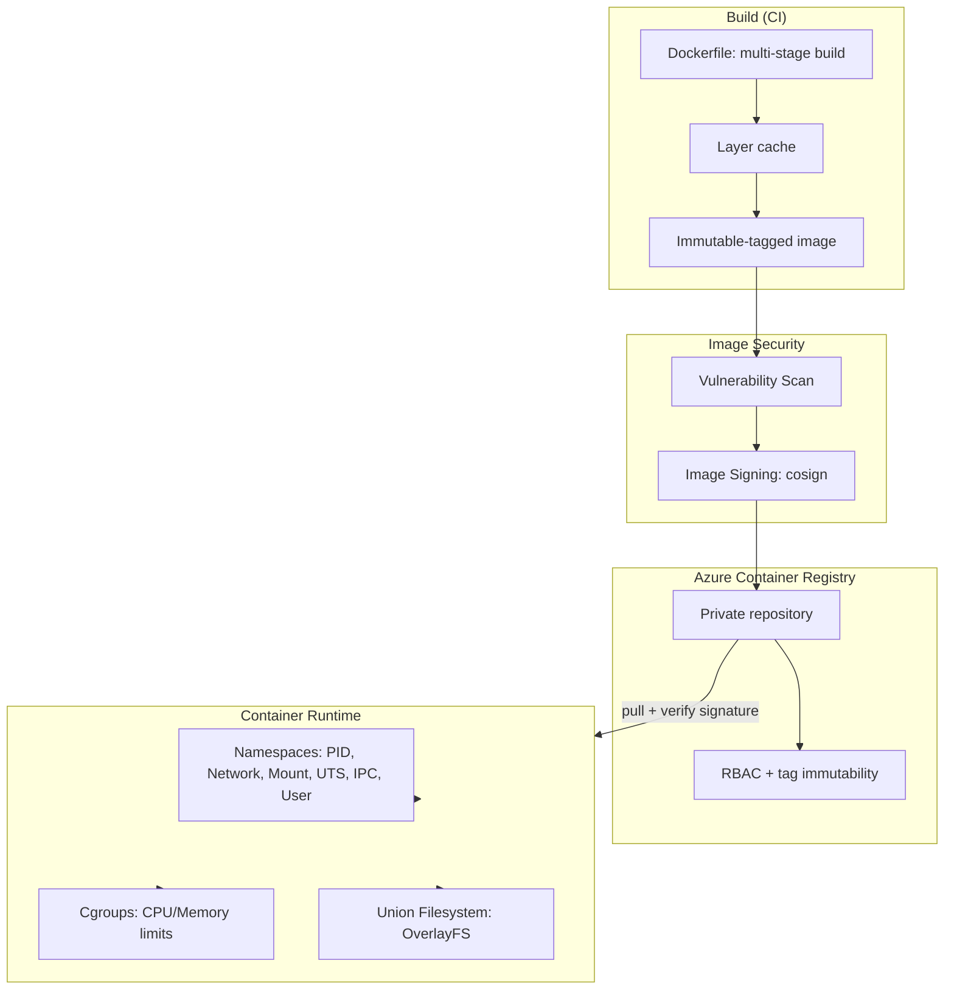
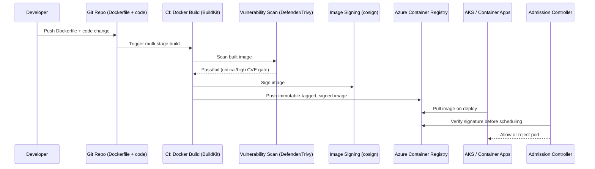
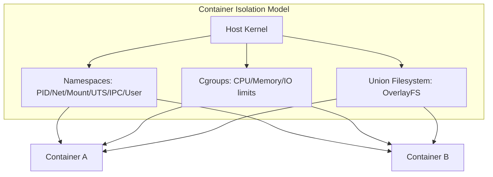
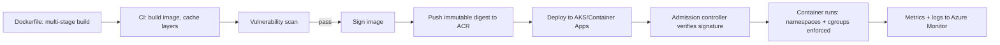

# Containers with Docker

> Part of the **Enterprise Data & AI Architecture Handbook** · Phase-09 — DataOps, Platform Engineering & DevOps · Chapter 05.
> Estimated study time: **60 min reading + ~4h labs**.
> **Prerequisites:** read [Operating Systems for Data Engineers](../Phase-00/03_Operating_Systems.md) first.

---

## Executive Summary

[Operating Systems for Data Engineers](../Phase-00/03_Operating_Systems.md#core-concepts) covered processes, isolation, and resource management at the kernel level. **Docker containers** are the practical, production-grade application of exactly those primitives — Linux namespaces, cgroups, and union filesystems — packaged into a portable, reproducible unit of software delivery. This chapter is where the OS theory from Phase-00 becomes the concrete packaging mechanism underlying every deployment target the rest of Phase-09 builds on: the immutable artifacts from [DevOps and CI/CD](03_DevOps_and_CI_CD.md#core-concepts) are, in practice, most often container images, and the infrastructure provisioned in [Infrastructure as Code with Terraform](04_Infrastructure_as_Code_with_Terraform.md#core-concepts) frequently exists specifically to host container workloads.

This chapter covers: **namespaces, cgroups, and union filesystems** — the three Linux kernel mechanisms (process/network/mount isolation, resource limiting, and layered filesystem composition) that together constitute what a "container" actually is, as distinct from a virtual machine; **Dockerfiles and multi-stage builds** — the declarative recipe for building a container image, and the multi-stage pattern that keeps production images minimal by discarding build-time dependencies; **image security and registries**, with Azure Container Registry (ACR) as the primary Azure-native artifact store, covering vulnerability scanning, image signing, and access control; **containerizing Spark/Python jobs** — the concrete, data-engineering-specific patterns for packaging PySpark and Python data-processing workloads into containers, including the particular challenges of JVM-based Spark containerization; and **OCI standards**, the vendor-neutral Open Container Initiative specifications that make container images and runtimes portable across Docker, containerd, Kubernetes, and multiple cloud providers.

The governing insight: **a container is not a lightweight virtual machine — it is an isolated, resource-bounded process (or process group) sharing the host kernel, and that distinction has direct, practical consequences for security, performance, and what can and cannot be containerized.** Namespaces provide the illusion of isolation (a container cannot see other containers' processes, network interfaces, or mounts), cgroups provide the resource-consumption limits, and union filesystems provide the efficient, layered image-distribution model — but the shared kernel means container isolation is fundamentally weaker than VM isolation, a fact every security and multi-tenancy decision in this chapter must account for.

The bias remains **Azure-primary (~60%)** — Azure Container Registry, Azure Container Apps, and Azure Kubernetes Service as the deployment targets — **~30% enterprise open source** (Docker/Moby, containerd, Buildpacks, Trivy) and **~10% AWS/GCP comparison-only** (Amazon ECR, Google Artifact Registry).

**Bottom line:** container adoption succeeds when images are built minimally (multi-stage builds, minimal base images), scanned for vulnerabilities before deployment, signed and pulled only from a trusted private registry, and understood as sharing the host kernel rather than providing VM-grade isolation — and fails when images are built as bloated, unscanned, mutable-tagged artifacts pulled from arbitrary public registries with root-privileged containers running in production. An architect who applies OS-level rigor (from Phase-00) to container image design, security scanning, and registry governance gives every subsequent Phase-09 chapter (Kubernetes, Airflow, GitOps) a secure, reproducible packaging format to orchestrate.

---

## Learning Objectives

By the end of this chapter you will be able to:

1. **Explain namespaces, cgroups, and union filesystems** and how together they implement container process isolation, resource limiting, and layered image storage.
2. **Write a production-grade, multi-stage Dockerfile** that minimizes final image size and attack surface.
3. **Architect image security practice** using Azure Container Registry vulnerability scanning, image signing, and RBAC-based access control.
4. **Containerize a PySpark or Python data-processing job**, addressing the specific challenges of packaging a JVM-based distributed engine.
5. **Explain OCI standards** (image spec, runtime spec, distribution spec) and why they matter for portability across container runtimes and orchestrators.
6. **Distinguish container isolation from VM isolation** and apply that distinction to multi-tenancy and security decisions.
7. **Apply containerization practices on Azure** using Azure Container Registry and Azure Container Apps/AKS as deployment targets.
8. **Identify container anti-patterns** — bloated images, root-privileged containers, and mutable `latest` tags in production.
9. **Map a target container registry/build architecture onto Azure**, with an explicit, defensible comparison to Amazon ECR and Google Artifact Registry.
10. **Defend containerization architecture and security decisions** in engineer, staff engineer, architect, and CTO review settings.

---

## Business Motivation

- **"Works on my machine" is an unacceptable, unauditable failure mode for production data pipelines.** Containers guarantee that the exact runtime environment (OS libraries, language runtime, dependencies) validated in CI is precisely what runs in production, directly reinforcing the immutable-artifact promotion principle from [DevOps and CI/CD](03_DevOps_and_CI_CD.md#core-concepts).
- **Heterogeneous data/ML tooling (different Python versions, conflicting library dependencies across teams) creates operational friction on shared infrastructure.** Containers isolate each workload's dependency graph, eliminating cross-team dependency conflicts on shared compute.
- **Regulatory and security requirements demand a known, scanned, signed software supply chain.** An unscanned container pulled from an arbitrary public registry is an unacceptable risk for any workload touching regulated data.
- **Container density and fast startup reduce infrastructure cost** compared to VM-per-workload isolation, directly supporting the cost-optimization goals threaded through every DataOps and platform-engineering chapter in this phase.
- **Container portability underwrites multi-environment and (where relevant) multi-cloud strategy** — an OCI-compliant image built once runs identically on a developer's laptop, in CI, on AKS, or on a competing cloud's Kubernetes service, directly supporting the environment-parity goal from [DataOps Foundations](01_DataOps_Foundations.md#core-concepts).

---

## History and Evolution

- **1979 — `chroot`** introduces filesystem-root isolation, the earliest ancestor of container filesystem isolation, though without process or resource isolation.
- **2000s — Linux namespaces (mount, PID, network, UTS, IPC, user) and cgroups** are progressively added to the Linux kernel, providing the actual isolation and resource-control primitives containers depend on, originally developed independently of any "container" product.
- **2008 — LXC (Linux Containers)** provides the first widely-used userspace tooling wrapping namespaces and cgroups into a coherent container abstraction.
- **2013 — Docker launches**, adding a crucial innovation beyond LXC: a standardized, layered image format (union filesystem-based) and a simple developer workflow (`Dockerfile`, `docker build`, `docker run`), which is what actually drove mainstream container adoption rather than the underlying kernel primitives alone.
- **2015 — The Open Container Initiative (OCI)** is founded (under the Linux Foundation) specifically to prevent container-format fragmentation, standardizing the image spec, runtime spec, and (later) distribution spec so no single vendor (including Docker) controls the format.
- **2016-2017 — containerd is spun out of Docker** as a standalone, OCI-compliant container runtime, later becoming the runtime underlying most Kubernetes deployments (including Docker's own later architecture).
- **2017-2020 — Multi-stage Dockerfile builds** (Docker 17.05+) become standard practice, directly addressing the bloated-image anti-pattern that plagued early Docker adoption.
- **2020 — Kubernetes deprecates direct Docker Engine support** in favor of any OCI-compliant runtime (containerd, CRI-O), formalizing that "Docker" (the company/product) and "containers" (the OCI-standardized technology) are no longer synonymous.
- **2021-present — Distroless and minimal base images (Google's distroless, Chainguard's Wolfi-based images)** gain adoption as the security-conscious evolution of multi-stage builds, minimizing attack surface even further than a slim Debian/Alpine base.
- **2023-present — Software supply-chain security (SBOM generation, image signing via Sigstore/cosign, admission-time signature verification)** becomes a mainstream enterprise requirement, extending image security practice well beyond vulnerability scanning alone.

---

## Why This Technology Exists

Containers exist because virtual machines, while providing strong isolation, are too heavyweight (full guest OS overhead, slow boot times) for the fine-grained, high-density, fast-iteration packaging that modern software delivery — including data and ML workloads — requires. Namespaces and cgroups already existed in the Linux kernel to provide isolation and resource control; Docker's contribution was making that kernel capability usable through a standardized image format and a simple developer workflow, turning "package this exact runtime environment and ship it anywhere" from a kernel-level capability into a mainstream engineering practice.

---

## Problems It Solves

- **Environment inconsistency between dev, CI, and production** — a container image is byte-for-byte identical wherever it runs, eliminating "works on my machine" class defects.
- **Dependency conflicts on shared infrastructure** — each container carries its own isolated dependency graph, letting different teams run incompatible library versions on the same host without interference.
- **Slow VM boot times and resource overhead for fine-grained workloads** — containers start in seconds (not minutes) and carry no guest-OS overhead, enabling much higher workload density per host.
- **Unreproducible or undocumented runtime environments** — a Dockerfile is an explicit, version-controlled, reviewable specification of exactly what a workload's runtime environment contains.
- **Portable, vendor-neutral packaging** — OCI-standardized images run identically across Docker, containerd, Kubernetes, and any compliant cloud container service, avoiding vendor lock-in at the packaging layer.

---

## Problems It Cannot Solve

- **It cannot provide VM-grade security isolation.** Containers share the host kernel; a kernel-level vulnerability or container escape can compromise co-located containers on the same host in ways a properly-configured VM hypervisor boundary generally prevents — this is the single most important limitation to understand before using containers for genuinely hostile multi-tenant isolation.
- **It cannot fix a fundamentally insecure application just by containerizing it.** A container image built from application code with a SQL-injection vulnerability is still vulnerable; containerization changes the packaging and deployment model, not the application's own security posture.
- **It cannot make a stateful workload stateless for free.** Databases and other genuinely stateful services can run in containers, but require careful persistent-volume and data-durability design (elaborated in Phase-09 Chapter 06) — containerizing a stateful workload without this design is a common source of data-loss incidents.
- **It cannot eliminate the need for image maintenance.** A container image frozen at build time will not automatically receive security patches; someone must rebuild and redeploy images as base-image and dependency vulnerabilities are disclosed, a recurring operational responsibility, not a one-time task.
- **It cannot substitute for the orchestration, scheduling, and networking layer that production container deployment at scale requires** — a raw `docker run` on a single host does not provide the scheduling, self-healing, and service-discovery capabilities production workloads need (the subject of Phase-09 Chapter 06).

---

## Core Concepts

### 5.1 Namespaces

Linux **namespaces** partition kernel resources so that one process (or process group) sees an isolated view of the system, distinct from other processes on the same host. The namespaces relevant to Docker containers:

- **PID namespace** — a containerized process sees itself as PID 1 (or a low PID) within its own isolated process tree, unable to see or signal processes outside its namespace.
- **Network namespace** — gives a container its own network stack (interfaces, routing table, ports), enabling multiple containers to bind to the same port number on the host without conflict.
- **Mount namespace** — gives a container its own filesystem view, the mechanism underlying the union-filesystem image model (§5.3).
- **UTS namespace** — isolates hostname and domain name, letting each container present its own hostname.
- **IPC namespace** — isolates System V IPC and POSIX message queues, preventing cross-container inter-process communication via shared memory.
- **User namespace** — maps container-internal UIDs/GIDs to a different (often unprivileged) range on the host, a critical security control preventing a process that is "root" inside a container from actually being root on the host.

### 5.2 Cgroups (Control Groups)

**cgroups** provide resource accounting and limiting for a process group: CPU shares/quotas, memory limits, block I/O throttling, and (via cgroup v2) unified resource control. Docker/Kubernetes resource requests and limits (`--memory`, `--cpus`, or a Kubernetes pod's `resources.limits`) are implemented directly via cgroups — a container that exceeds its memory cgroup limit is OOM-killed by the kernel, not merely "slowed down," a critical operational fact for right-sizing Spark executor containers (§5.6) where an under-provisioned memory limit causes abrupt kills rather than graceful degradation.

### 5.3 Union Filesystems and Image Layers

Docker images are built from **layers**, each representing a filesystem diff, stacked via a union filesystem (OverlayFS is the modern standard). This layered model provides two key benefits:

- **Layer caching and reuse** — layers are content-addressed; an unchanged layer (e.g., a base OS layer or an unchanged dependency-installation layer) is reused across builds and even across different images, dramatically speeding up builds and reducing registry storage/transfer.
- **Copy-on-write at runtime** — a running container adds a thin, writable layer on top of the image's read-only layers; changes are written only to this top layer, leaving the underlying image layers untouched and shareable across multiple running containers from the same image.

Layer ordering matters directly for build performance and cache efficiency: place infrequently-changing layers (base image, OS package installation) before frequently-changing layers (application code) in a Dockerfile, so a code-only change invalidates only the final layers, not the entire build cache.

### 5.4 Dockerfiles and Multi-Stage Builds

A **Dockerfile** is the declarative build recipe for an image. A **multi-stage build** uses multiple `FROM` statements within one Dockerfile, where an early stage contains build tools and intermediate artifacts, and only the specific files needed for runtime are copied into a final, minimal stage — discarding compilers, build caches, and intermediate dependencies from the shipped image entirely.

```dockerfile
# Stage 1: build dependencies and compile
FROM python:3.11-slim AS builder
WORKDIR /app
COPY requirements.txt .
RUN pip install --no-cache-dir --user -r requirements.txt

# Stage 2: minimal runtime image
FROM python:3.11-slim
WORKDIR /app
# Copy only the installed packages, not build tooling
COPY --from=builder /root/.local /root/.local
COPY src/ ./src/
ENV PATH=/root/.local/bin:$PATH
RUN useradd --create-home --uid 1001 appuser
USER appuser
ENTRYPOINT ["python", "-m", "src.main"]
```

Key production-hardening practices embedded above: a minimal base image (`-slim`, or a distroless/Chainguard base for even less attack surface), a non-root `USER` directive, `--no-cache-dir` to avoid bloating layers with package-manager caches, and copying only the specific artifacts needed rather than the entire build context.

### 5.5 Image Security and Registries

- **Azure Container Registry (ACR)** is the Azure-native, private image registry, supporting geo-replication (Premium tier), content-trust/signing, and vulnerability scanning (via Microsoft Defender for Containers integration).
- **Vulnerability scanning** (ACR + Microsoft Defender for Cloud, or open-source Trivy/Grype) should run automatically on every image push, as a CI gate before deployment, per the security-gate pattern from [DevOps and CI/CD](03_DevOps_and_CI_CD.md#security) — a critical or high-severity CVE finding should block promotion to production.
- **Image signing (Sigstore/cosign, or ACR content trust)** — cryptographically signs images at build time, with admission-time signature verification (in Kubernetes, via Azure Policy or a Kubernetes admission controller) rejecting any unsigned or tampered image from being deployed.
- **RBAC on the registry** — restrict push permissions to CI/CD service identities only, never allowing direct developer push to a production-tier repository, and restrict pull permissions to the specific identities/clusters that need them.
- **Immutable tags** — directly extending [DevOps and CI/CD](03_DevOps_and_CI_CD.md#core-concepts)'s artifact-immutability principle, ACR supports tag-immutability locking so a previously-pushed tag can never be overwritten.

### 5.6 Containerizing Spark/Python Jobs

- **Python/PySpark driver-only jobs** (e.g., a script using `pyspark` in local mode, or a lightweight data-processing script) containerize straightforwardly using the multi-stage pattern above, with the JVM and Spark distribution added as an additional base layer.
- **Distributed Spark-on-Kubernetes containerization** requires the container image to include a compatible JVM, the Spark distribution matching the cluster's Spark version, and any custom JARs/Python dependencies — Databricks and the open-source Spark Kubernetes Operator both provide reference Dockerfiles as a starting point rather than building the Spark runtime layer from scratch.
- **Resource-limit alignment with JVM heap settings** is a critical, frequently-mishandled detail: a Spark executor container's cgroup memory limit must account for both the JVM heap (`-Xmx`) *and* off-heap/overhead memory (Spark's `spark.executor.memoryOverhead`) — setting the cgroup limit equal to only the JVM heap size reliably causes OOM-kills under real workloads, since the JVM process consumes memory beyond its heap (thread stacks, native buffers, off-heap Spark memory).
- **Databricks Container Services** lets a Databricks cluster use a custom Docker image (built on Databricks' base image) for cases needing OS-level dependencies beyond what cluster-scoped libraries provide — used sparingly, since it adds an image-maintenance burden Databricks' native library management otherwise avoids.

### 5.7 OCI Standards

The **Open Container Initiative (OCI)** defines three vendor-neutral specifications:

- **Image Format Specification** — defines the structure of a container image (layers, manifest, config) so any OCI-compliant image can be built by one tool (Docker, Buildah, Kaniko) and run by any other compliant runtime.
- **Runtime Specification** — defines how a compliant runtime (runc, crun, gVisor) executes a container from an unpacked filesystem bundle, independent of any specific higher-level tool like Docker.
- **Distribution Specification** — defines the API contract for pushing/pulling images to/from a registry, which is what allows Docker CLI, `az acr` CLI, and Kubernetes to all interoperate with any OCI-compliant registry (ACR, ECR, Artifact Registry, Docker Hub) using a common protocol.

The practical significance: an image built with `docker build` today runs identically under containerd/CRI-O in Kubernetes, and can be pushed to ACR, ECR, or GCP Artifact Registry using the same standard protocol — no vendor lock-in exists at the image-format or registry-protocol layer, though registry-specific features (geo-replication, signing integration) do differ.

---

## Internal Working

A representative container image build-to-deploy flow:

1. **Developer writes a multi-stage Dockerfile** alongside application/pipeline code in version control.
2. **CI pipeline (per [DevOps and CI/CD](03_DevOps_and_CI_CD.md#internal-working)) builds the image**, tagging it with the Git SHA (immutable tag), using layer caching to speed up the build.
3. **Vulnerability scan runs against the built image** (ACR-integrated Defender scan, or Trivy in CI) before push, blocking on critical/high findings.
4. **Image is signed** (cosign) and pushed to Azure Container Registry.
5. **CD pipeline deploys the image reference (by digest or immutable tag) to the target environment** (Azure Container Apps, AKS), never re-building the image per environment.
6. **Admission-time verification (in Kubernetes) checks the image signature** before allowing the pod to schedule, rejecting unsigned or tampered images.
7. **Runtime resource limits (cgroups, via Kubernetes pod resource requests/limits) constrain the container's CPU/memory consumption**, with the orchestrator (Phase-09 Chapter 06) responsible for scheduling based on these declared limits.

---

## Architecture



---

## Components

- **Docker Engine / containerd** — the daemon or runtime responsible for building (Docker Engine, BuildKit) and running (containerd, runc) containers.
- **BuildKit** — Docker's modern build engine, providing improved caching, parallel multi-stage build execution, and build secrets handling (avoiding baking secrets into image layers).
- **Azure Container Registry** — the private, RBAC-controlled, geo-replicable image registry.
- **Microsoft Defender for Containers** — provides vulnerability scanning integrated with ACR and runtime threat detection for AKS.
- **Sigstore/cosign** — image signing and verification tooling, increasingly the open-source standard for supply-chain image integrity.
- **runc / crun / gVisor** — OCI-compliant low-level container runtimes; gVisor provides an additional user-space kernel-interception layer for stronger (though not VM-equivalent) isolation in higher-risk multi-tenancy scenarios.

---

## Metadata

- **Image manifest metadata** — layer digests, image configuration (entrypoint, environment variables, exposed ports), and OCI-standard labels (`org.opencontainers.image.*`) recording source repository, revision, and build date.
- **SBOM (Software Bill of Materials)** — an inventory of every package and library included in an image, generated at build time (via Syft or Docker's native SBOM support), critical for vulnerability-impact assessment when a new CVE is disclosed.
- **Signature and attestation metadata** — cosign signatures and in-toto/SLSA provenance attestations recording how and by which pipeline an image was built, supporting supply-chain audit requirements.
- **Registry-retention metadata** — tag/digest creation timestamps and pull-count statistics, informing retention-policy decisions (§5's cost optimization).

---

## Storage

- **Azure Container Registry** — stores image layers and manifests, with geo-replication (Premium tier) for multi-region deployment and reduced pull latency.
- **Local Docker layer cache (on CI runners)** — speeds up repeated builds; a shared, persistent build-cache (e.g., a registry-based cache via BuildKit's `--cache-to`/`--cache-from`) further improves cache-hit rates across ephemeral CI runners.
- **Container writable layer** — the thin, ephemeral, copy-on-write layer for a running container's filesystem changes; any data written here is lost when the container is removed unless explicitly persisted via a mounted volume.
- **Persistent volumes** for genuinely stateful containerized workloads — provisioned and managed at the orchestration layer (Kubernetes PersistentVolumes, covered in Phase-09 Chapter 06), not by Docker/the container runtime itself.

---

## Compute

- **Container density per host** — because containers share the host kernel and carry no guest-OS overhead, a single host can run substantially more containers than equivalent VMs at the same resource allocation, directly improving compute utilization and cost efficiency.
- **cgroup-enforced resource limits** — CPU and memory requests/limits (enforced via cgroups) are the mechanism by which an orchestrator schedules containers onto hosts without over-committing physical resources, elaborated further in Phase-09 Chapter 06.
- **Build compute** — multi-stage builds and BuildKit's parallel stage execution benefit from CI runners with adequate CPU/memory; large Spark-image builds in particular can be resource-intensive and benefit from build-cache reuse to avoid repeated full rebuilds.

---

## Networking

- **Container network namespaces** provide each container its own virtual network interface; Docker's default bridge network, or a Kubernetes CNI plugin (at the orchestration layer), handles inter-container and container-to-host connectivity.
- **ACR private endpoints** — restrict registry access to a VNet-integrated private endpoint, preventing image pull/push over the public internet for regulated workloads, consistent with the networking pattern from [DataOps Foundations](01_DataOps_Foundations.md#networking).
- **Egress control for build/runtime environments** — CI build stages and running containers should have explicitly scoped, minimal-necessary egress (e.g., only to the package registry and ACR), reducing the blast radius of a compromised build step or running container.

---

## Security

- **Never run containers as root** — set a non-root `USER` in the Dockerfile and, at the orchestration layer, enforce `runAsNonRoot` via a Kubernetes Pod Security Standard or admission policy.
- **Minimal base images reduce attack surface** — prefer `-slim`, Alpine, or distroless base images over full general-purpose distributions, and use multi-stage builds to exclude build tooling entirely from the final image.
- **Mandatory vulnerability scanning before deployment** — treat a critical/high CVE finding as a hard-blocking CI gate, not an advisory warning, mirroring the data-quality-gate discipline from [DataOps Foundations](01_DataOps_Foundations.md#core-concepts) applied to the software supply chain instead of data.
- **Image signing and admission-time verification** — deploy only signed images, verified at admission time, to prevent an unauthorized or tampered image from ever running in a production cluster.
- **Never bake secrets into image layers** — use BuildKit's `--secret` mount for build-time secrets (never persisted into a layer) and retrieve runtime secrets from Azure Key Vault via managed identity, never via `ENV` or `ARG` instructions, which persist in the image history/layers.
- **User-namespace remapping** — enable user-namespace remapping (or Kubernetes-equivalent controls) so a process that is "root" inside a container maps to an unprivileged UID on the host, limiting the impact of a container-escape vulnerability.
- **Read-only root filesystems where possible** — mounting a container's root filesystem as read-only (writable only via explicitly mounted volumes) further reduces the impact of a runtime compromise attempting to persist malicious code.

---

## Performance

- **Layer-cache-optimized Dockerfile ordering** — place rarely-changing instructions (base image, dependency installation) before frequently-changing instructions (application code copy) to maximize build-cache hit rate.
- **Minimal image size reduces pull latency and cold-start time** — a bloated image with unnecessary build tooling or unused dependencies slows every deployment and autoscaling event; multi-stage builds directly address this.
- **BuildKit parallel stage execution** — independent multi-stage build stages execute concurrently under BuildKit, reducing overall build time versus sequential legacy Docker builds.
- **Spark executor memory/cgroup alignment (§5.6)** is a direct performance (and stability) concern — misaligned limits cause OOM-kills that manifest as job failures rather than graceful backpressure.

---

## Scalability

- **Registry geo-replication (ACR Premium)** reduces cross-region image-pull latency as deployments scale across multiple Azure regions.
- **Shared, versioned base images** (a platform team-maintained "golden" base image per language/runtime, per [Platform Engineering](02_Platform_Engineering.md#core-concepts)) let container adoption scale across many teams without each team independently hardening and maintaining its own base image.
- **Registry cleanup/retention policies** become necessary at scale — without automated purging of untagged or old images, registry storage cost and inventory complexity grow unmanageably as the number of pipelines and build frequency increases.

---

## Fault Tolerance

- **Immutable, versioned images enable reliable rollback** — redeploying a previous image digest is a fast, safe way to recover from a bad deployment, directly reusing the rollback pattern from [DevOps and CI/CD](03_DevOps_and_CI_CD.md#fault-tolerance).
- **Health checks (`HEALTHCHECK` in Dockerfile, or orchestrator-level liveness/readiness probes)** let the runtime/orchestrator detect and restart an unhealthy container automatically rather than leaving a hung process running indefinitely.
- **Registry availability as a deployment dependency** — if ACR is unavailable, new deployments and autoscaling events relying on image pulls will stall; geo-replication and appropriate registry SLA tier selection mitigate this for production-critical workloads.

---

## Cost Optimization

- **Minimal image size reduces registry storage and network egress cost**, particularly at scale across many pipelines and frequent rebuilds.
- **Registry retention/cleanup policies** (ACR's built-in retention policies, or a scheduled purge task) prevent unbounded storage-cost growth from untagged or superseded image layers.
- **Higher container density per host** (versus VM-per-workload) directly reduces compute cost for equivalent workload capacity, a major driver of container adoption's cost case.
- **Worked FinOps example:** A data platform team's PySpark batch-job image was built from a full `openjdk:11` base image with build tooling left in the final stage, resulting in a 2.8 GB image pulled roughly 400 times/day across autoscaling executor pods (ACR egress and pull-latency cost, plus roughly 45 seconds of added cold-start time per pod pull). Rebuilding with a multi-stage pattern and a slim JRE-only final-stage base reduced the image to 480 MB, cutting registry egress-related cost by roughly 80% (an estimated $140/month reduction in ACR data-transfer and geo-replication cost at this pull volume) and reducing per-pod cold-start time from ~45 seconds to ~12 seconds — at 400 pulls/day, that is roughly 3.7 compute-hours/day of eliminated cold-start wait, translating to an additional ~$95/month in reclaimed compute time at typical executor-node pricing, for a combined saving of roughly $235/month from a one-time Dockerfile rework.

---

## Monitoring

- **Image vulnerability scan pass/fail trend** — tracked per repository, surfacing repositories with recurring critical-CVE findings needing base-image or dependency remediation.
- **Image size trend per repository** — a growing image-size trend over time is an early warning sign of dependency bloat or an accidental regression in multi-stage build discipline.
- **Registry pull latency and cold-start time** — tracked as part of overall deployment performance, directly informing image-size optimization priorities.
- **Container OOM-kill rate** — a rising rate of cgroup-triggered OOM kills for a specific workload (especially Spark executors) signals a resource-limit misconfiguration needing investigation.

---

## Observability

- **Correlate deployment events with container-level metrics** (CPU/memory utilization against cgroup limits, restart counts) in the same unified observability pane described in [DataOps Foundations §1](01_DataOps_Foundations.md#observability).
- **Structured container logs with image-version tagging** — every log line should be attributable to the specific image digest/version that produced it, supporting the version-correlated logging pattern from [DevOps and CI/CD](03_DevOps_and_CI_CD.md#observability).
- **Runtime threat detection** (Microsoft Defender for Containers) — monitors running containers for anomalous behavior (unexpected process execution, privilege escalation attempts) beyond static image scanning alone.

### Operational Response Playbook

| Signal | Detection Query/Check | Remediation |
|---|---|---|
| Critical/high CVE detected in a running production image | ACR/Microsoft Defender for Containers continuous scan flags a newly-disclosed CVE against an already-deployed image | Rebuild the image against a patched base/dependency version through the standard CI/CD pipeline; redeploy via the normal promotion path; do not patch a running container in place. |
| Repeated OOM-kills for a containerized workload | Kubernetes/orchestrator event log shows `OOMKilled` restarts exceeding a baseline rate for a specific deployment | Review the workload's actual memory usage (via metrics) against its declared cgroup limit; for Spark executors, verify the limit accounts for `memoryOverhead`, not just JVM heap; adjust limits and redeploy. |

---

## Governance

- **Only CI/CD service identities may push to production-tier registry repositories** — no direct developer push to a production image repository, enforced via ACR RBAC.
- **Mandatory scanning and signing policy enforced via Azure Policy** — a Kubernetes admission policy (or Azure Policy for AKS) should reject any pod referencing an unsigned image or an image from an unapproved registry.
- **Base-image standardization owned by the platform team** — a small set of platform-team-maintained, hardened base images (per language/runtime) should be the mandatory starting point for all Dockerfiles, directly extending the module-governance model from [Infrastructure as Code with Terraform §4.6](04_Infrastructure_as_Code_with_Terraform.md#core-concepts) to container base images.
- **SBOM and provenance attestation retained for audit** — regulated environments should retain SBOM and build-provenance records for every production image, supporting supply-chain audit requirements.

---

## Trade-offs

| Dimension | Containers | Virtual Machines |
|---|---|---|
| Isolation strength | Weaker — shared host kernel | Stronger — hypervisor-enforced boundary |
| Startup time | Seconds | Minutes |
| Density per host | High | Lower |
| Best fit | Stateless/ephemeral services, CI/CD, most data-processing workloads | Genuinely hostile multi-tenant isolation, legacy/OS-dependent workloads |
| Operational overhead | Lower once tooling matures | Higher (full OS patching per VM) |

---

## Decision Matrix

| Scenario | Recommended Approach |
|---|---|
| Stateless PySpark/Python batch job, internal multi-tenant cluster | Containerize with a minimal, multi-stage image; standard container isolation is sufficient |
| Genuinely untrusted, hostile multi-tenant workloads (e.g., running arbitrary customer-submitted code) | Add a stronger isolation layer (gVisor, Kata Containers, or a dedicated VM per tenant) beyond standard container isolation |
| Spark executor sizing | Container, with cgroup memory limit explicitly set above JVM heap + `memoryOverhead`, not equal to heap alone |
| Legacy application with deep OS-version dependencies not easily containerized | VM, at least until the application is modernized; do not force a container wrapper around an unmodifiable legacy OS dependency |

---

## Design Patterns

- **Multi-stage builds with minimal final-stage base images** — the foundational pattern for secure, small, fast-deploying images.
- **Non-root, read-only-filesystem containers** — reduces the practical impact of a container-escape or runtime-compromise scenario.
- **Golden base images maintained centrally** — a platform team publishes and patches a small set of standardized, hardened base images that all teams build from, rather than every team independently choosing and hardening its own base.
- **Build-time secret mounts, never baked-in secrets** — using BuildKit's `--secret` flag or equivalent, ensuring credentials never persist in an image layer.
- **Immutable image promotion by digest** — deploying by content-addressed digest (not just a tag) for the strongest possible guarantee that the exact tested artifact is what's running.

---

## Anti-patterns

- **Bloated images built from a full general-purpose OS with build tooling left in** — unnecessarily large attack surface and slow deployment.
- **Running containers as root** — the single most common, most easily avoidable container security misconfiguration.
- **Mutable `latest` tags deployed to production** — breaks the reproducibility guarantee this chapter and [DevOps and CI/CD](03_DevOps_and_CI_CD.md#anti-patterns) both emphasize.
- **Baking secrets into image layers via `ENV`/`ARG`** — persists credentials in image history, retrievable even after later layers appear to remove them.
- **Treating containers as VM-equivalent isolation for genuinely hostile multi-tenancy** — a real security-boundary misunderstanding that can lead to inappropriate risk acceptance.
- **Skipping vulnerability scanning "to save CI time"** — trades a small time saving for a materially larger security risk.

---

## Common Mistakes

- Setting a Spark executor container's memory limit equal to the JVM `-Xmx` heap size, ignoring off-heap and overhead memory, causing recurring OOM-kills.
- Not pinning base-image versions (using `python:3.11` instead of a specific patch-version or digest), causing unexpected behavior changes on image rebuild when the base image is updated upstream.
- Copying the entire build context (`COPY . .`) instead of only the files needed, bloating the image and invalidating build cache unnecessarily on unrelated file changes.
- Forgetting a `.dockerignore` file, accidentally including `.git`, local virtual environments, or credentials files in the build context and image.
- Treating an image that passed vulnerability scanning once as permanently safe, without a recurring rescan process for newly-disclosed CVEs against already-deployed images.

---

## Best Practices

- Always use multi-stage builds with a minimal final-stage base image, and default to a non-root user.
- Pin base-image versions explicitly (ideally by digest for maximum reproducibility) rather than a loose tag.
- Scan every image for vulnerabilities before deployment, treating critical/high findings as a hard-blocking gate.
- Sign every production image and enforce admission-time signature verification.
- Maintain a small set of platform-team-owned, centrally-patched golden base images rather than letting every team choose its own.
- Explicitly account for JVM off-heap/overhead memory when setting Spark container cgroup limits.

---

## Enterprise Recommendations

- Standardize on Azure Container Registry as the sole approved image source for production deployments, with Azure Policy blocking any pod referencing an image from an unapproved registry.
- Mandate vulnerability scanning and image signing as non-negotiable CI/CD gates for every containerized workload, extending the golden-path template model from [Platform Engineering](02_Platform_Engineering.md#enterprise-recommendations).
- Fund a platform team to maintain and patch a small library of golden base images (Python, PySpark/JVM, Node.js) rather than leaving base-image selection and hardening to individual teams.
- Establish a recurring (not just build-time) rescanning process for already-deployed production images, since new CVEs are disclosed continuously against previously-clean images.
- Require explicit memory-limit review for any Spark-on-Kubernetes or Databricks Container Services workload, given how commonly this specific misconfiguration causes production incidents.

---

## Azure Implementation

- **Azure Container Registry (Premium tier)** — private registry with geo-replication, content-trust, private endpoint support, and integrated Microsoft Defender vulnerability scanning.
- **Microsoft Defender for Containers** — continuous vulnerability scanning for images in ACR and runtime threat detection for AKS clusters.
- **Azure Container Apps** — a serverless container hosting platform suitable for stateless data-processing services and APIs not requiring full Kubernetes control, directly complementing AKS for lighter-weight workloads.
- **Azure Kubernetes Service (AKS)** — the primary orchestration target for containerized data/ML workloads at scale, elaborated in Phase-09 Chapter 06.
- **Databricks Container Services** — lets a Databricks cluster run from a custom Docker image built on Databricks' base images, for workloads needing OS-level customization beyond cluster-scoped library management.
- **Azure Policy for Kubernetes** — enforces admission-time policies (non-root containers, approved registries, signature verification) on AKS clusters.



---

## Open Source Implementation

- **Docker Engine / Moby / BuildKit** — the reference container build and run tooling.
- **containerd / runc / crun** — OCI-compliant low-level runtimes underlying most production Kubernetes deployments.
- **Trivy / Grype** — open-source vulnerability scanners for container images, usable as a CI gate independent of any cloud-provider-specific scanning service.
- **Sigstore / cosign** — open, keyless image signing and verification, increasingly the de facto open-source standard for supply-chain integrity.
- **Syft** — SBOM generation tooling, commonly paired with Trivy/Grype for vulnerability-impact assessment.
- **Distroless / Chainguard Wolfi-based images** — minimal, security-focused base images with drastically reduced attack surface compared to general-purpose distributions.

---

## AWS Equivalent (comparison only)

| Capability | Azure | AWS |
|---|---|---|
| Private image registry | Azure Container Registry | Amazon Elastic Container Registry (ECR) |
| Vulnerability scanning | Microsoft Defender for Containers | Amazon ECR image scanning (Inspector) |
| Serverless container hosting | Azure Container Apps | AWS Fargate (ECS/EKS) |
| Managed Kubernetes | Azure Kubernetes Service | Amazon Elastic Kubernetes Service (EKS) |

**Advantages of AWS:** ECR's native integration with Amazon Inspector provides comparably mature vulnerability scanning, and Fargate offers a well-established serverless container model. **Disadvantages:** ECR's geo-replication and content-trust feature set is broadly comparable to ACR Premium but requires more manual configuration for equivalent cross-region replication behavior. **Migration strategy:** OCI-compliant images are directly portable between ACR and ECR with no image-format changes required; only registry-specific configuration (replication, scanning policy, RBAC) needs re-implementation. **Selection criteria:** choose ECR/Fargate for an AWS-primary estate; choose ACR/Container Apps/AKS for an Azure-primary or Databricks-centric data platform estate.

---

## GCP Equivalent (comparison only)

| Capability | Azure | GCP |
|---|---|---|
| Private image registry | Azure Container Registry | Google Artifact Registry |
| Vulnerability scanning | Microsoft Defender for Containers | Artifact Registry + Container Analysis (vulnerability scanning) |
| Serverless container hosting | Azure Container Apps | Google Cloud Run |
| Managed Kubernetes | Azure Kubernetes Service | Google Kubernetes Engine (GKE) |

**Advantages of GCP:** Cloud Run provides a very mature, widely-adopted serverless container model, and Artifact Registry's Container Analysis vulnerability scanning is well-integrated with Google's broader security tooling. **Disadvantages:** achieving ACR-equivalent geo-replication and content-trust behavior on Artifact Registry requires assembling multiple GCP services rather than a single native feature set. **Migration strategy:** as with AWS, OCI-compliant images move between ACR and Artifact Registry without format changes; registry configuration and admission-policy tooling require re-implementation. **Selection criteria:** choose Artifact Registry/Cloud Run/GKE for a GCP-primary estate; choose ACR/Container Apps/AKS for an Azure-primary or Databricks-centric estate.

---

## Migration Considerations

- **Audit existing images for bloat and root-user execution first** — before broader container-security investment, a quick inventory of image sizes and `USER` directives across existing repositories usually surfaces the highest-impact, lowest-effort remediation targets.
- **Introduce vulnerability scanning in "audit only" mode initially**, mirroring the non-blocking rollout pattern from [DataOps Foundations](01_DataOps_Foundations.md#migration-considerations), before promoting to a hard-blocking gate once existing images have been remediated.
- **Migrate to golden base images incrementally**, starting with the highest-image-count or highest-risk repositories, rather than mandating an immediate, organization-wide switch.
- **Prioritize Spark/JVM container memory-limit review early** in any Spark-on-Kubernetes or Databricks Container Services migration, given how common and disruptive the heap-vs-cgroup-limit misconfiguration is in practice.

---

## Mermaid Architecture Diagrams



---

## End-to-End Data Flow



---

## Real-world Business Use Cases

- A financial-services data platform reduced its PySpark batch-job image size from 3.1 GB to 520 MB by adopting multi-stage builds and a slim JRE base, cutting average pod cold-start time by roughly 70% across a cluster autoscaling hundreds of executor pods daily.
- A healthcare analytics company adopted mandatory image signing and admission-time verification after a security audit flagged that any team member could previously push an unscanned image directly to a production-tier registry repository.
- A retail company's ML feature-serving containers were repeatedly OOM-killed under production load until an incident review revealed the container memory limit was set equal to the JVM heap size alone, omitting Spark's `memoryOverhead` — correcting the limit eliminated the recurring incident.

---

## Case Studies

**Case: Root-privileged container escape near-miss.** A data platform team ran a containerized ETL job as root (the Dockerfile's default, with no explicit `USER` directive) on a shared multi-tenant Kubernetes cluster. A security researcher's penetration test discovered a container-escape vulnerability in an outdated container-runtime component that, combined with the root-privileged container, would have allowed host-level compromise and lateral movement to other tenants' workloads on the same node.

**Root cause:** the combination of (a) an outdated, unpatched container runtime and (b) unnecessary root privilege inside the container meaningfully widened the impact of a runtime vulnerability that a non-root container configuration would have substantially contained.

**Remediation:** the platform team patched the runtime immediately, mandated non-root `USER` directives and `runAsNonRoot: true` Kubernetes admission policy enforcement across all workloads, and added automated image linting (checking for missing `USER` directives) as a CI gate — converting a previously undetected, org-wide misconfiguration into a systematically-prevented one.

---

## Hands-on Labs

1. **Lab 1 — Write a multi-stage Dockerfile.** Containerize a small Python data-processing script using a multi-stage build with a slim final-stage base image and a non-root user; compare the resulting image size against a naive single-stage equivalent.
2. **Lab 2 — Set up Azure Container Registry with scanning.** Provision an ACR instance (via the Terraform module pattern from [Infrastructure as Code with Terraform](04_Infrastructure_as_Code_with_Terraform.md#hands-on-labs)), push the image from Lab 1, and enable Microsoft Defender vulnerability scanning; review the scan results.
3. **Lab 3 — Sign and verify an image.** Use cosign to sign the image from Lab 2 and verify the signature locally before considering a (simulated) deployment.
4. **Lab 4 — Containerize a PySpark job with correct memory alignment.** Build a container image for a small PySpark script, explicitly calculating and setting a container memory limit that accounts for both `-Xmx` heap and estimated overhead; document the calculation.
5. **Lab 5 — Simulate a vulnerability-scan gate in CI.** Add a Trivy scan step to the CI pipeline from [DevOps and CI/CD](03_DevOps_and_CI_CD.md#hands-on-labs), configuring it to fail the build on any critical-severity finding; intentionally introduce a vulnerable dependency to observe the gate blocking the build.

---

## Exercises

1. Explain, using namespaces and cgroups specifically, why a container provides weaker isolation than a virtual machine.
2. Rewrite a naive single-stage Dockerfile as a multi-stage build, explaining each change's impact on final image size and security.
3. Calculate an appropriate Kubernetes/Databricks container memory limit for a Spark executor with a 4 GB JVM heap and a 20% `memoryOverhead` setting.
4. Design a golden-base-image strategy for an organization standardizing on Python and PySpark/JVM workloads.
5. Describe the specific CI/CD gate you would add to prevent an unsigned image from ever reaching production, and where in the pipeline it should run.

---

## Mini Projects

- Build a complete containerized data-processing pipeline: a multi-stage Dockerfile, an ACR repository with vulnerability scanning and tag immutability enabled, image signing via cosign, and a CI/CD pipeline (extending [DevOps and CI/CD](03_DevOps_and_CI_CD.md#mini-projects)) that builds, scans, signs, and pushes the image on every trunk merge.
- Containerize a small Spark job (local mode or against a lightweight Spark-on-Kubernetes setup) with correctly-calculated memory limits, and load-test it to confirm no OOM-kills occur under expected workload.
- Write a small image-linting script (using a Dockerfile parser) that checks for common anti-patterns from this chapter (missing `USER` directive, use of `latest` tag, missing `.dockerignore`) and reports violations.

---

## Capstone Integration

Extend the golden-path template and Terraform-provisioned infrastructure from [Platform Engineering](02_Platform_Engineering.md#capstone-integration) and [Infrastructure as Code with Terraform](04_Infrastructure_as_Code_with_Terraform.md#capstone-integration) with a fully containerized deployment artifact: a multi-stage Dockerfile for the pipeline's processing logic, an ACR repository with mandatory scanning and signing wired into the golden path's CI/CD pipeline, and correctly-calculated resource limits for any Spark-based component. This becomes the containerized, secure artifact that Phase-09 Chapter 06 (Kubernetes) will orchestrate at scale.

---

## Interview Questions

1. What are namespaces, cgroups, and union filesystems, and how do they together implement container isolation and resource control?
2. What is a multi-stage Docker build, and what specific problems does it solve compared to a single-stage build?
3. Why is a container's isolation weaker than a virtual machine's, and what practical security decisions follow from that distinction?
4. What are the three OCI specifications, and why do they matter for container portability?

## Staff Engineer Questions

5. How would you design a golden-base-image strategy and rollout plan for an organization with dozens of teams building containers independently today?
6. Walk through how you would calculate and validate a correct container memory limit for a Spark executor, including the specific failure mode of getting it wrong.
7. What is your strategy for enforcing mandatory vulnerability scanning and image signing without creating unacceptable CI/CD latency?

## Architect Questions

8. When would you require stronger-than-standard container isolation (gVisor, Kata Containers, or dedicated VMs), and what specific workload characteristics would trigger that decision?
9. How does your container security architecture integrate with the IaC policy-as-code model from Chapter 04 and the CI/CD security gates from Chapter 03?
10. How would you design registry governance (RBAC, retention, replication) for a multi-hundred-repository enterprise container estate?

## CTO Review Questions

11. What evidence would your organization's container pipeline produce to prove every production image was scanned, signed, and free of critical vulnerabilities at deploy time?
12. What is your current exposure to root-privileged or unscanned containers running in production, and what is your remediation timeline?
13. What is your position on containers versus VMs for the organization's highest-risk multi-tenant workloads, and what specific isolation requirements drove that decision?

---

## References

- Open Container Initiative. "OCI Specifications." opencontainers.org.
- Docker Inc. "Docker Documentation — Multi-stage builds." docs.docker.com.
- Microsoft Learn. "Azure Container Registry documentation."
- Microsoft Learn. "Microsoft Defender for Containers documentation."
- Sigstore. "cosign Documentation." sigstore.dev.
- Kerrisk, M. *The Linux Programming Interface* (namespaces and cgroups chapters). No Starch Press.

## Further Reading

- [Operating Systems for Data Engineers](../Phase-00/03_Operating_Systems.md) — the kernel-level process, memory, and isolation fundamentals this chapter's namespace/cgroup discussion builds on.
- [DevOps and CI/CD](03_DevOps_and_CI_CD.md) — the immutable-artifact and CI/CD gate model this chapter's image build/scan/sign pipeline implements concretely.
- [Infrastructure as Code with Terraform](04_Infrastructure_as_Code_with_Terraform.md) — the IaC provisioning this chapter's container hosting targets (ACR, AKS) depend on.

---

[Back to Phase-09 README](../../.github/prompts/Phase-09/README.md) - [Handbook README](../../README.md) - [Roadmap](../../ROADMAP.md)
