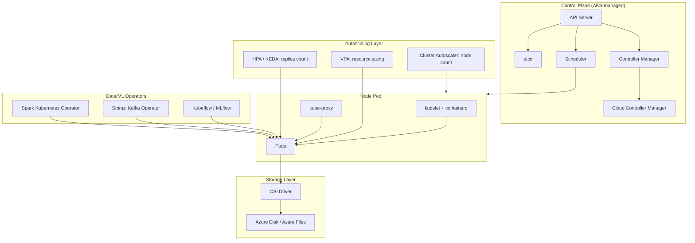
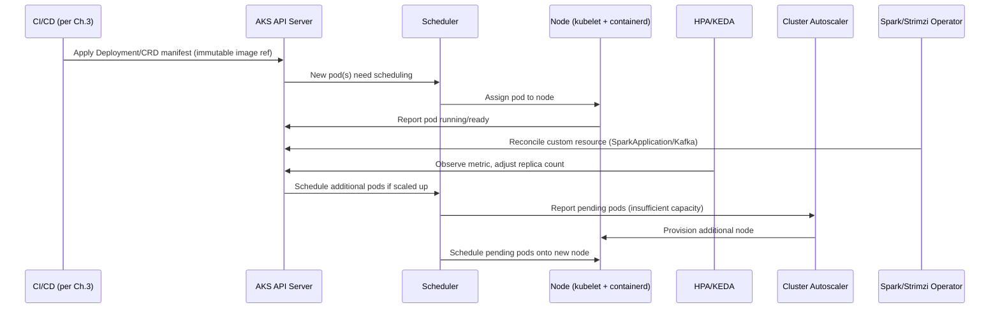
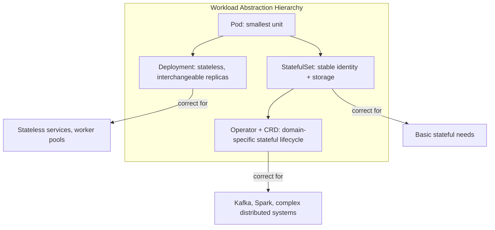

# Kubernetes

> Part of the **Enterprise Data & AI Architecture Handbook** · Phase-09 — DataOps, Platform Engineering & DevOps · Chapter 06.
> Estimated study time: **90 min reading + ~6h labs**.
> **Prerequisites:** read [Containers with Docker](05_Containers_with_Docker.md) first.

---

## Executive Summary

[Containers with Docker](05_Containers_with_Docker.md#core-concepts) established the packaging unit: an isolated, resource-bounded process built from an immutable, scanned, signed image. **Kubernetes** is the orchestration layer that takes that packaging unit and runs it reliably at scale — scheduling containers onto hosts, restarting them when they fail, scaling them with demand, routing traffic to them, and managing the stateful storage some of them need. Where Docker answers "how do I package and run one container," Kubernetes answers "how do I run thousands of containers, across hundreds of nodes, for dozens of teams, staying available and correctly resourced without constant human intervention."

This chapter covers: the **control plane and node components** that together implement Kubernetes' declarative, reconciliation-loop architecture; **Pods, Deployments, Services, and Ingress** — the core workload and networking abstractions; **StatefulSets, persistent storage, and the Operator pattern** for managing genuinely stateful workloads (databases, Kafka) that a stateless Deployment model cannot correctly express; **autoscaling** across four distinct mechanisms — Horizontal Pod Autoscaler (HPA), Vertical Pod Autoscaler (VPA), Cluster Autoscaler, and KEDA (event-driven autoscaling) — each solving a different scaling dimension; and **Spark, Kafka, and ML operators on AKS**, the concrete data-platform-specific patterns for running distributed data and ML infrastructure on Kubernetes rather than treating it as purely a stateless-microservice platform.

The governing insight: **Kubernetes' entire value proposition is the reconciliation loop — a controller continuously comparing declared desired state against observed actual state and taking action to close the gap — applied uniformly to compute, networking, and (via Operators) increasingly complex stateful and domain-specific resources.** This is the same declarative, drift-correcting principle from [Infrastructure as Code with Terraform](04_Infrastructure_as_Code_with_Terraform.md#core-concepts) applied continuously and automatically at the workload-orchestration layer, rather than on a scheduled or manually-triggered basis at the infrastructure-provisioning layer.

The bias remains **Azure-primary (~60%)** — Azure Kubernetes Service (AKS), AKS-managed autoscaling, and Azure-integrated storage/networking — **~30% enterprise open source** (Kubernetes itself, KEDA, the Spark Kubernetes Operator, Strimzi for Kafka, Kubeflow/MLflow) and **~10% AWS/GCP comparison-only** (Amazon EKS, Google GKE).

**Bottom line:** Kubernetes adoption succeeds when workloads are correctly modeled against the right abstraction (stateless Deployment vs. stateful StatefulSet vs. Operator-managed custom resource), autoscaling is layered correctly across all four mechanisms for the actual bottleneck each workload has, and stateful data infrastructure (Spark, Kafka) is run through a purpose-built Operator rather than hand-rolled StatefulSet manifests — and fails when every workload is forced into a generic Deployment regardless of its actual state and scaling needs, autoscaling is configured naively (HPA alone, with no cluster-level scaling), and stateful data services are run without the specialized lifecycle management an Operator provides. An architect who models workloads correctly against Kubernetes' abstraction hierarchy, and layers autoscaling and Operator-based lifecycle management appropriately, gives this handbook's data platform a scalable, self-healing runtime substrate for the orchestration needs Phase-09 Chapter 07 (Airflow) will build scheduling logic on top of.

---

## Learning Objectives

By the end of this chapter you will be able to:

1. **Explain the Kubernetes control plane and node architecture**, including the reconciliation-loop model that underlies every controller.
2. **Model workloads correctly** using Pods, Deployments, Services, and Ingress for stateless services, and StatefulSets for genuinely stateful ones.
3. **Explain the Operator pattern** and why it is the correct mechanism for managing complex, stateful, domain-specific infrastructure like Kafka and Spark on Kubernetes.
4. **Design a layered autoscaling strategy** combining HPA, VPA, Cluster Autoscaler, and KEDA for the specific bottleneck each addresses.
5. **Run Spark, Kafka, and ML workloads on AKS** using the Spark Kubernetes Operator, Strimzi, and Kubeflow/MLflow patterns.
6. **Architect persistent storage for Kubernetes-managed stateful workloads** using Azure Disks/Files and the Container Storage Interface (CSI).
7. **Apply Kubernetes practices on Azure** using AKS, its managed control plane, and Azure-integrated networking/storage/identity.
8. **Identify Kubernetes anti-patterns** — forcing stateful workloads into Deployments, naive single-mechanism autoscaling, and unbounded resource requests.
9. **Map a target AKS architecture onto Azure**, with an explicit, defensible comparison to Amazon EKS and Google GKE.
10. **Defend Kubernetes architecture and workload-modeling decisions** in engineer, staff engineer, architect, and CTO review settings.

---

## Business Motivation

- **Manually placing and restarting containers across a fleet of hosts does not scale past a handful of services.** Kubernetes' scheduler and reconciliation loops automate placement, health-checking, and self-healing that would otherwise require constant manual operator intervention.
- **Data and ML workloads have highly variable, often bursty resource demand** (a nightly Spark batch job, an ad hoc model-training run, a spiky inference-serving workload) — Kubernetes' autoscaling mechanisms let infrastructure cost track actual demand rather than being provisioned for peak load permanently.
- **Running Spark, Kafka, and ML infrastructure without purpose-built lifecycle management is operationally fragile.** A hand-rolled StatefulSet for Kafka, without an Operator's domain-specific reconciliation logic (rolling upgrades, broker rebalancing, partition-aware scaling), routinely mishandles failure and upgrade scenarios that the Operator pattern exists specifically to solve correctly.
- **Multi-tenant infrastructure consolidation reduces cost and operational overhead.** A single well-governed AKS cluster (or cluster fleet) hosting many teams' containerized workloads, with resource quotas and namespace isolation, is dramatically cheaper to operate than dozens of independently-managed, siloed compute environments.
- **Kubernetes is the substrate the rest of this phase's platform-engineering and GitOps practices (Chapters 02 and 08) assume** — self-service scaffolder templates and GitOps reconciliation both depend on a Kubernetes-native, declarative deployment target to be maximally effective.

---

## History and Evolution

- **2003-2004 — Google's internal Borg system** pioneers large-scale, declarative container/job scheduling internally, though never released publicly, directly informing Kubernetes' later design.
- **2014 — Google open-sources Kubernetes**, distilling Borg's lessons into a public, extensible, declarative container-orchestration system, explicitly designed around a reconciliation-loop control model rather than an imperative scripting model.
- **2015 — The Cloud Native Computing Foundation (CNCF)** is founded, with Kubernetes as its founding project, establishing vendor-neutral governance and accelerating ecosystem growth.
- **2016-2017 — StatefulSets and the Operator pattern emerge**, addressing Kubernetes' initial weakness in managing genuinely stateful workloads (the original ReplicaSet/Deployment model assumed fully interchangeable, stateless pod replicas).
- **2017-2018 — Managed Kubernetes services (AKS, EKS, GKE) launch**, removing the substantial operational burden of self-managing the control plane, dramatically accelerating enterprise adoption.
- **2018-2020 — Custom Resource Definitions (CRDs) and the broader Operator ecosystem mature**, enabling domain-specific operators (Strimzi for Kafka, the Spark Kubernetes Operator, Prometheus Operator) to extend Kubernetes' API with purpose-built, stateful-workload-aware controllers.
- **2020 — Kubernetes deprecates direct dockershim (Docker Engine) support**, formalizing the shift to any OCI/CRI-compliant runtime (containerd, CRI-O), directly connecting to the OCI standards discussion from [Containers with Docker §5.7](05_Containers_with_Docker.md#core-concepts).
- **2020-present — KEDA (Kubernetes Event-Driven Autoscaling)** emerges and joins the CNCF, extending Kubernetes autoscaling beyond CPU/memory metrics to arbitrary event sources (queue depth, Kafka lag, custom metrics) — directly relevant to bursty, event-driven data-pipeline workloads.
- **2021-present — Kubernetes becomes a mainstream platform for data and ML infrastructure specifically**, with the Spark Kubernetes Operator, Kubeflow, and Ray-on-Kubernetes maturing as production-grade alternatives to dedicated data-platform-specific cluster managers (YARN, standalone Spark clusters).

---

## Why This Technology Exists

Kubernetes exists because running containerized workloads reliably at scale — placing them on appropriate hosts, restarting them on failure, scaling them with demand, routing network traffic to them, and managing their storage — is a distributed-systems problem too complex and too error-prone to solve with manual operations or ad hoc scripting once an organization runs more than a handful of services. Kubernetes solves this with a declarative, reconciliation-loop model: engineers declare desired state (how many replicas, what resources, what storage), and a set of controllers continuously work to make observed reality match that declaration, extending exactly the same principle IaC applies to infrastructure provisioning (Chapter 04) to the continuously-running workload layer.

---

## Problems It Solves

- **Manual container placement and restart** — the scheduler automatically places pods onto suitable nodes, and the kubelet/controller-manager automatically restarts failed containers without human intervention.
- **Inflexible, static capacity provisioning** — layered autoscaling (§6.4) lets both pod replica count and underlying node count track actual, often bursty, demand.
- **Fragile, hand-rolled management of complex stateful infrastructure** — the Operator pattern encodes domain-specific operational knowledge (safe Kafka broker rolling upgrades, Spark driver/executor lifecycle) directly into a controller, rather than relying on a human runbook.
- **Inconsistent networking and service discovery across a large fleet** — Kubernetes Services and DNS-based service discovery provide a consistent, automatically-updated mechanism for one workload to reliably reach another regardless of which node it's currently scheduled on.
- **Siloed, underutilized infrastructure per team** — namespace-based multi-tenancy with resource quotas lets many teams share a single cluster's capacity efficiently, rather than each team provisioning independent, often underutilized infrastructure.

---

## Problems It Cannot Solve

- **It cannot make a genuinely stateful application stateless.** Kubernetes provides StatefulSets and persistent storage primitives, but the application itself must still correctly handle its own state, replication, and failover logic — Kubernetes does not add distributed-consistency guarantees an application doesn't already implement.
- **It cannot substitute for correct resource-request/limit tuning.** A poorly-sized pod (requesting far more or far less than it actually needs) will cause either wasted cluster capacity or scheduling failures/OOM-kills regardless of how sophisticated the autoscaling configuration is.
- **It cannot eliminate the operational complexity of running Kafka, Spark, or other complex distributed data infrastructure — it relocates that complexity into an Operator**, which still requires real expertise to operate correctly, particularly during version upgrades and failure scenarios.
- **It cannot provide network-level multi-tenant security isolation by default.** Namespace isolation alone does not prevent network-level cross-namespace traffic; genuine tenant isolation requires explicit NetworkPolicies (or a service mesh) layered on top.
- **It cannot make an application highly available just by running multiple replicas.** True high availability additionally requires the application to handle in-flight request loss gracefully during pod termination, correct readiness-probe design, and often multi-zone/multi-region topology awareness that Kubernetes exposes but does not automatically provide.

---

## Core Concepts

### 6.1 Control Plane and Node Components

- **API Server** — the single entry point for all cluster interaction (kubectl, controllers, kubelets); every read and write goes through it, backed by etcd.
- **etcd** — the distributed, consistent key-value store holding all cluster state (desired configuration and current status); etcd's availability and performance are foundational to overall cluster health.
- **Scheduler** — assigns newly-created pods to nodes based on resource requests, affinity/anti-affinity rules, taints/tolerations, and other constraints.
- **Controller Manager** — runs the core reconciliation-loop controllers (ReplicaSet controller, Node controller, etc.), each continuously comparing desired vs. actual state and acting to close any gap.
- **Cloud Controller Manager** — integrates cluster-lifecycle actions with the underlying cloud provider (e.g., provisioning an Azure Load Balancer when a `LoadBalancer`-type Service is created).
- **kubelet** — the per-node agent ensuring the containers described in assigned PodSpecs are actually running and healthy, reporting node/pod status back to the API server.
- **kube-proxy** — implements per-node network rules that realize Kubernetes Service abstractions (routing traffic to the correct backend pods).
- **Container runtime (containerd, per [Containers with Docker §5.7](05_Containers_with_Docker.md#core-concepts))** — the OCI-compliant runtime actually executing containers on each node.

In **Azure Kubernetes Service (AKS)**, Microsoft fully manages the control plane (API Server, etcd, scheduler, controller manager) at no direct compute cost to the customer; the customer manages only node pools (the worker nodes), dramatically reducing operational burden compared to self-managed Kubernetes.

### 6.2 Pods, Deployments, Services, and Ingress

- **Pod** — the smallest deployable unit: one or more tightly-coupled containers sharing network namespace and storage volumes, scheduled together as a single unit.
- **Deployment** — manages a set of identical, stateless Pod replicas via an underlying ReplicaSet, providing rolling updates, rollback, and self-healing (replacing failed pods automatically) — the correct abstraction for stateless services and most data-processing worker workloads.
- **Service** — a stable virtual IP and DNS name that load-balances traffic across a dynamic set of matching Pods, decoupling consumers from any individual pod's ephemeral IP address.
- **Ingress** (and the newer Gateway API) — manages external HTTP(S) routing into the cluster, typically backed by an ingress controller (NGINX Ingress, or Azure Application Gateway Ingress Controller) implementing host/path-based routing, TLS termination, and (combined with a service mesh or annotations) canary/blue-green traffic splitting, directly extending the release-strategy concepts from [DevOps and CI/CD §3.3-3.4](03_DevOps_and_CI_CD.md#core-concepts) to Kubernetes-native traffic control.

### 6.3 StatefulSets, Storage, and the Operator Pattern

- **StatefulSet** — manages Pods with stable, unique network identities (predictable hostnames) and stable, per-replica persistent storage that survives pod rescheduling — the correct abstraction for workloads (databases, Kafka brokers, ZooKeeper/etcd-style ensembles) where replica identity and storage continuity matter, unlike a Deployment's fully-interchangeable replica model.
- **Persistent Volumes (PV) and Persistent Volume Claims (PVC)** — the storage abstraction layer; a PVC requests storage with specific characteristics (size, access mode), dynamically provisioned by a StorageClass backed by the **Container Storage Interface (CSI)** driver for the underlying storage system (Azure Disk CSI driver for block storage, Azure Files CSI driver for shared file storage).
- **The Operator pattern** — a Custom Resource Definition (CRD) plus a custom controller that encodes domain-specific operational knowledge for managing a complex stateful system, going beyond what a generic StatefulSet can express: e.g., the Spark Kubernetes Operator understands Spark's driver/executor lifecycle and handles application submission as a native Kubernetes custom resource (`SparkApplication`); Strimzi understands Kafka's broker rebalancing and safe rolling-upgrade sequencing as a `Kafka` custom resource. Operators are the recommended default for any sufficiently complex stateful data-infrastructure workload, rather than hand-authoring bespoke StatefulSet manifests and manual runbooks for the same operational knowledge.

### 6.4 Autoscaling: HPA, VPA, Cluster Autoscaler, and KEDA

Four distinct, complementary autoscaling mechanisms, each solving a different dimension of the scaling problem:

- **Horizontal Pod Autoscaler (HPA)** — scales the *number of pod replicas* for a Deployment/StatefulSet based on observed CPU/memory utilization or custom metrics, addressing "I need more copies of this workload running."
- **Vertical Pod Autoscaler (VPA)** — adjusts a pod's *resource requests/limits* (CPU/memory) based on observed historical usage, addressing "each copy of this workload needs more or less resource than currently declared" — VPA and HPA generally should not be applied to the same metric on the same workload simultaneously, since they can conflict.
- **Cluster Autoscaler** — adjusts the *number of underlying nodes* in a node pool based on pending, unschedulable pods (too little cluster capacity) or underutilized nodes (too much), addressing "I need more or fewer machines to host the pods I already want scheduled."
- **KEDA (Kubernetes Event-Driven Autoscaling)** — extends HPA-style scaling to arbitrary *event-source metrics* beyond CPU/memory: Azure Service Bus queue depth, Kafka consumer-group lag, Azure Event Hubs throughput, or a custom Prometheus metric — critical for bursty, event-driven data-pipeline workloads (e.g., scaling a stream-processing consumer deployment based on Kafka lag rather than CPU utilization, which may lag behind the actual backlog).

A mature production configuration typically layers all four: KEDA or HPA scales pod replica count based on the workload's actual driving metric, VPA (often in recommendation-only mode) informs correct resource-request sizing, and Cluster Autoscaler ensures enough node capacity exists to schedule the resulting pod count.

### 6.5 Spark, Kafka, and ML Operators on AKS

- **Spark Kubernetes Operator** — submits and manages Spark applications as a native `SparkApplication` custom resource, handling driver/executor pod lifecycle, dynamic allocation, and integration with Kubernetes-native logging/monitoring, as an alternative to Databricks-managed Spark or standalone/YARN Spark clusters — appropriate when an organization specifically wants Spark running on its existing general-purpose Kubernetes/AKS estate rather than a dedicated managed Spark service.
- **Strimzi (Kafka Operator)** — manages Kafka broker StatefulSets, ZooKeeper (or KRaft mode) ensembles, topic and user management as Kubernetes custom resources, encoding safe rolling-upgrade and rebalancing operational logic that would otherwise require significant bespoke runbook expertise.
- **Kubeflow / MLflow on Kubernetes** — Kubeflow provides Kubernetes-native ML pipeline orchestration, training-job custom resources, and model-serving components; MLflow's tracking server and model registry can run as containerized services on AKS, complementing (or, for teams not on Databricks, substituting for) Databricks' native MLflow integration.
- **Resource-limit alignment carries directly forward from [Containers with Docker §5.6](05_Containers_with_Docker.md#core-concepts)** — a Spark executor pod's resource limits must still account for JVM heap plus overhead memory, whether running under the Spark Kubernetes Operator or Databricks Container Services; the underlying cgroup-enforcement mechanism is identical.

---

## Internal Working

A representative reconciliation-loop flow for a Deployment update, layered with autoscaling:

1. **A CI/CD pipeline (per [DevOps and CI/CD](03_DevOps_and_CI_CD.md#internal-working)) applies an updated Deployment manifest** (referencing a new, immutable container image digest from ACR).
2. **The API Server persists the new desired state** (replica count, image reference, resource requests) to etcd.
3. **The Deployment controller observes the difference** between desired and current ReplicaSet state, and creates a new ReplicaSet with the updated pod template, performing a rolling update (or, per [DevOps and CI/CD §3.4](03_DevOps_and_CI_CD.md#core-concepts), a canary rollout via Argo Rollouts sitting on top of this base mechanism).
4. **The Scheduler assigns new pods to nodes** with sufficient available resources, respecting any affinity/anti-affinity and taint/toleration rules.
5. **kubelet on each assigned node pulls the container image** (verified via admission-time signature check, per [Containers with Docker §5.5](05_Containers_with_Docker.md#core-concepts)) and starts the container, reporting readiness via liveness/readiness probes.
6. **kube-proxy updates Service routing rules** so traffic begins flowing to the new, ready pods and stops flowing to terminated old pods.
7. **HPA/KEDA continuously observes the workload's driving metric** (CPU, or an external event-source metric) and adjusts the Deployment's replica count as demand changes.
8. **If the resulting pod count exceeds available node capacity, the Cluster Autoscaler provisions additional nodes** (or removes them when utilization drops), completing the multi-layer scaling loop.

---

## Architecture

---

## Components

- **AKS control plane (managed)** — API Server, etcd, Scheduler, Controller Manager, fully operated by Microsoft.
- **Node pools** — customer-managed VM Scale Sets running kubelet, kube-proxy, and containerd; AKS supports multiple node pools (e.g., a system pool and separate workload-specific pools with different VM SKUs, including GPU pools for ML training).
- **CSI drivers (Azure Disk, Azure Files)** — provide dynamic persistent-volume provisioning backed by native Azure storage.
- **Ingress controller (NGINX Ingress, Azure Application Gateway Ingress Controller/AGIC)** — manages external HTTP(S) routing and TLS termination.
- **Autoscaling controllers (HPA, VPA, Cluster Autoscaler, KEDA)** — the four-layer scaling mechanism described in §6.4.
- **Operators (Spark Kubernetes Operator, Strimzi, Kubeflow)** — domain-specific controllers managing complex stateful data/ML infrastructure.
- **Azure Monitor for containers / Prometheus + Grafana** — the observability stack surfacing cluster, node, and workload-level metrics.

---

## Metadata

- **Pod/Deployment labels and annotations** — the primary mechanism for organizing, selecting, and routing to workloads (Service selectors, HPA targets, network policies all key off labels).
- **Owner references** — Kubernetes' internal metadata linking a Pod to its owning ReplicaSet/Deployment/StatefulSet, enabling garbage collection and correct reconciliation when a parent resource is deleted.
- **Custom Resource status subresources** — Operators (Spark, Strimzi) expose rich status metadata (application state, broker health) on their custom resources, queryable via `kubectl get` exactly like native Kubernetes objects.
- **Resource-quota and limit-range metadata per namespace** — governs how much of the cluster's capacity a given team/namespace can consume, directly supporting the multi-tenancy governance model (§6's Governance section).

---

## Storage

- **Azure Disk CSI driver** — provides block-storage-backed PersistentVolumes for single-pod-attached workloads (e.g., a Kafka broker's log storage), available in Standard/Premium SSD tiers.
- **Azure Files CSI driver** — provides SMB/NFS-backed PersistentVolumes supporting `ReadWriteMany` access, needed when multiple pods must concurrently read/write the same volume.
- **StorageClasses** — define the provisioning parameters (disk tier, replication, reclaim policy) a PVC references; a platform team should publish a small set of standardized StorageClasses rather than letting every team define ad hoc storage parameters.
- **Ephemeral (emptyDir) volumes** — pod-local, non-persistent scratch storage, appropriate for Spark shuffle spill or other genuinely transient intermediate data, not for anything requiring durability across pod rescheduling.

---

## Compute

- **Node pool sizing and VM SKU selection** — separate node pools by workload profile (e.g., memory-optimized SKUs for Spark executors, GPU-enabled SKUs for ML training, a smaller general-purpose system pool for cluster-critical components), directly reusing the compute-tiering considerations from [Containers with Docker §5's compute discussion](05_Containers_with_Docker.md#compute).
- **Spot node pools** — AKS supports Spot VM-backed node pools at substantial cost discount for interruption-tolerant workloads (batch Spark jobs, non-time-critical training runs), a direct FinOps lever for appropriate workloads.
- **Resource requests/limits as the scheduling contract** — the scheduler places pods based on declared requests, not actual usage; under-declaring requests risks node over-commitment and noisy-neighbor contention, while over-declaring wastes cluster capacity — VPA recommendation mode is the correct tool for right-sizing this over time.

---

## Networking

- **Azure CNI vs. kubenet** — AKS supports Azure CNI (pods receive routable IPs directly from the VNet, enabling direct VNet-level network policy and peering) or the simpler kubenet (pod IPs are cluster-internal only, NAT'd for external traffic) — Azure CNI is the recommended default for data platforms needing direct, policy-controlled connectivity to VNet-integrated services (Databricks, private-endpoint-secured storage).
- **NetworkPolicies** — Kubernetes-native (or Azure-specific, via Azure Network Policy Manager or Calico) rules restricting pod-to-pod traffic by namespace/label selector, the primary mechanism for genuine network-level multi-tenant isolation beyond namespace boundaries alone.
- **Private AKS clusters** — the API server itself can be exposed only via a private endpoint within the VNet, consistent with the private-networking pattern applied throughout this handbook's Azure implementations.
- **Ingress and service mesh traffic management** — Ingress controllers handle north-south (external-to-cluster) traffic; a service mesh (Istio, Linkerd) adds east-west (pod-to-pod) traffic control, mTLS, and fine-grained canary traffic splitting when Ingress-level routing alone is insufficient.

---

## Security

- **Azure AD-integrated RBAC** — AKS supports Azure AD-backed Kubernetes RBAC, letting cluster access control reuse the organization's existing identity and group management rather than a separate Kubernetes-only credential system.
- **Pod Security Standards / admission control** — enforce non-root execution, read-only root filesystems, and disallow privileged containers at admission time, directly extending the container-security practices from [Containers with Docker §5's security discussion](05_Containers_with_Docker.md#security) to cluster-wide policy.
- **Azure Policy for Kubernetes (via Gatekeeper/OPA)** — enforces organization-wide admission policies (approved registries only, mandatory resource limits, required labels) consistently across every AKS cluster, directly extending the policy-as-code model from [Infrastructure as Code with Terraform §4.6](04_Infrastructure_as_Code_with_Terraform.md#core-concepts) to the workload-orchestration layer.
- **Workload identity (Azure AD Workload Identity for Kubernetes)** — lets individual pods authenticate to Azure services (Key Vault, storage) via federated, short-lived tokens tied to a Kubernetes service account, eliminating the need for pods to hold long-lived Azure credentials.
- **Network segmentation via NetworkPolicies** — mandatory for genuine multi-tenant security isolation; namespace boundaries alone provide organizational, not network-level, separation.
- **Secrets management** — Kubernetes' native Secrets object base64-encodes but does not encrypt-at-rest by default without additional configuration (etcd encryption); prefer retrieving secrets from Azure Key Vault via the Secrets Store CSI Driver rather than relying on native Kubernetes Secrets alone for sensitive production values.

---

## Performance

- **Resource request/limit accuracy directly determines scheduling efficiency and workload performance** — under-provisioned requests cause noisy-neighbor CPU throttling or OOM-kills; over-provisioned requests waste cluster capacity and increase cost without benefit.
- **Node pool VM SKU selection matters for data-intensive workloads** — Spark executors benefit from memory-optimized SKUs with adequate local NVMe/temp disk for shuffle spill; ML training benefits from GPU-enabled SKUs matched to the specific framework's driver requirements.
- **KEDA's event-driven scaling reduces latency for bursty workloads** compared to CPU-based HPA alone, since scaling on the actual backlog metric (queue depth, consumer lag) reacts before CPU utilization would necessarily reflect the backlog.
- **Cluster Autoscaler node-provisioning latency** (the time to add a new node when pods are pending) is a real constraint for very bursty workloads; pre-warmed node pools or a minimum-node-count floor mitigate cold-start scaling latency for latency-sensitive scenarios.

---

## Scalability

- **Namespace-based multi-tenancy with resource quotas** lets a single cluster (or small cluster fleet) scale to support dozens of teams' workloads efficiently, directly extending the platform-consolidation motivation from [Platform Engineering](02_Platform_Engineering.md#business-motivation).
- **Multiple node pools scale independently by workload profile** — a Spark-heavy team's memory-optimized pool can scale separately from a lightweight API-serving team's general-purpose pool.
- **Cluster fleet management (Azure Kubernetes Fleet Manager)** becomes relevant once a single cluster's blast radius or regional-availability requirements exceed what one AKS cluster should reasonably host, enabling coordinated multi-cluster upgrade and configuration propagation.
- **Operator-managed stateful infrastructure (Strimzi, Spark Operator) scales more reliably than hand-rolled StatefulSets** because the Operator encodes the specific, tested scaling/rebalancing logic for that system, rather than relying on generic Kubernetes primitives alone.

---

## Fault Tolerance

- **Self-healing via the reconciliation loop** — a failed pod is automatically restarted (or rescheduled to a healthy node) by the ReplicaSet/StatefulSet controller without human intervention, the foundational fault-tolerance mechanism Kubernetes provides.
- **Pod Disruption Budgets (PDBs)** — constrain how many replicas of a workload can be simultaneously unavailable during voluntary disruptions (node draining, cluster upgrades), preventing an upgrade operation from accidentally taking an entire stateful service offline.
- **Multi-zone node pools** — spreading nodes across Azure Availability Zones, combined with pod anti-affinity rules, ensures a single zone failure does not take down every replica of a critical workload.
- **StatefulSet ordered, stable identity** ensures that when a stateful pod is rescheduled, it reattaches to its same persistent volume and retains its stable network identity, critical for correct recovery of stateful data infrastructure (Kafka brokers reclaiming their partition assignments, for example).
- **Operator-driven safe upgrades** (Strimzi's rolling Kafka broker upgrade sequencing, for example) prevent the data-loss or availability-gap risks of a naive, non-domain-aware rolling update applied to a stateful distributed system.

---

## Cost Optimization

- **Right-sized resource requests (informed by VPA recommendations)** directly reduce wasted cluster capacity, the single largest lever for Kubernetes cost efficiency.
- **Spot node pools for interruption-tolerant batch/training workloads** provide substantial discounts versus on-demand pricing, appropriate for Spark batch jobs and non-time-critical ML training.
- **Cluster Autoscaler scale-to-zero for optional node pools** (e.g., a GPU pool only provisioned when a training job is actually running) avoids paying for idle, specialized capacity.
- **Namespace-level resource quotas prevent runaway cost from a single misconfigured team/workload** consuming disproportionate cluster capacity.
- **Worked FinOps example:** A data platform team runs a Spark-on-Kubernetes batch workload on a dedicated, always-on node pool (4x Standard_D8s_v5, ~$1.50/hr/node all-in) sized for peak nightly load but idle roughly 20 hours/day: 4 × $1.50 × 24 hrs × 30 days ≈ $4,320/month. Reconfiguring the same workload onto a Cluster-Autoscaler-managed Spot node pool that scales from 0 to 4 nodes only during the ~4-hour nightly batch window, at a typical ~60% Spot discount, reduces cost to roughly 4 × $0.60 × 4 hrs × 30 days ≈ $288/month — a saving of over $4,000/month, with the trade-off of accepting occasional Spot-eviction retries, acceptable for this interruption-tolerant nightly batch use case but not for a latency-sensitive serving workload.

---

## Monitoring

- **Cluster-level metrics (node CPU/memory utilization, pod scheduling failures, pending-pod count)** via Azure Monitor for containers or a self-hosted Prometheus/Grafana stack.
- **Workload-level metrics (pod restart count, HPA/KEDA scaling events, resource-request vs. actual-usage ratio)** inform both reliability and cost-optimization decisions.
- **Operator/custom-resource status monitoring** — Spark Kubernetes Operator and Strimzi both expose rich status on their custom resources; dashboards should surface these alongside generic Kubernetes metrics, not just native pod/node metrics.
- **Autoscaling event auditing** — tracking HPA/VPA/Cluster Autoscaler/KEDA scaling decisions over time helps tune thresholds and diagnose unexpected scaling behavior (e.g., scaling flapping due to a poorly-tuned metric threshold).

---

## Observability

- **Unified cluster and application observability** — Azure Monitor for containers (or Prometheus/Grafana with OpenTelemetry instrumentation) should correlate cluster-level events (node pressure, pod evictions) with application-level metrics and logs, extending the unified-signal-correlation principle from [DataOps Foundations](01_DataOps_Foundations.md#observability) to the orchestration layer.
- **Distributed tracing** for multi-service data/ML pipelines running on Kubernetes benefits from OpenTelemetry instrumentation, correlating a single request/job's path across multiple pods and services.
- **Structured, centrally-aggregated logging** — pod logs should ship to a central sink (Azure Monitor Log Analytics, or a self-hosted ELK/Loki stack) rather than relying on ephemeral, per-pod `kubectl logs` access, since pod logs are lost when a pod is rescheduled or deleted.

### Operational Response Playbook

| Signal | Detection Query/Check | Remediation |
|---|---|---|
| Pods stuck in `Pending` state | `kubectl get pods --field-selector=status.phase=Pending` or an Azure Monitor alert on sustained pending-pod count | Check for insufficient node capacity (verify Cluster Autoscaler is enabled and not at its max-node limit) or an unsatisfiable scheduling constraint (affinity/taint mismatch, resource request exceeding any node's capacity); adjust node pool limits or pod spec accordingly. |
| Recurring `OOMKilled` restarts on a Spark executor or ML training pod | Kubernetes event log / Azure Monitor container insights shows repeated `OOMKilled` reason for a specific workload | Verify the resource memory limit accounts for JVM heap + overhead (per [Containers with Docker §5.6](05_Containers_with_Docker.md#core-concepts)) or the ML framework's actual peak memory profile; adjust limits and consider VPA recommendation mode to right-size going forward. |

---

## Governance

- **Namespace-per-team with enforced ResourceQuotas and LimitRanges** — the primary multi-tenancy governance mechanism, preventing one team's workload from starving another's on a shared cluster.
- **Azure Policy for Kubernetes (Gatekeeper) enforcing organization-wide admission rules** — approved registries only, mandatory resource limits, required labels/tags — directly extending [Infrastructure as Code with Terraform](04_Infrastructure_as_Code_with_Terraform.md#governance)'s policy-as-code model to the workload layer.
- **Cluster and Operator version-upgrade governance** — AKS control-plane and node-image upgrades, plus Operator (Strimzi, Spark Operator) version upgrades, should follow a tested, staged rollout process, not be applied directly to production without validation in a lower environment.
- **RBAC scoped to least privilege per team/namespace**, integrated with Azure AD group membership, avoiding cluster-admin-by-default access sprawl.

---

## Trade-offs

| Dimension | Kubernetes (AKS) | Managed platform-specific service (e.g., Databricks-managed Spark) |
|---|---|---|
| Flexibility | High — run any containerized workload, custom Operators | Lower — scoped to what the managed service natively supports |
| Operational burden | Higher — cluster, Operator, and node-pool lifecycle management | Lower — provider manages the underlying cluster lifecycle |
| Cost model | Granular, workload-level control (Spot, autoscaling) | Often simpler but less granular cost control |
| Best fit | Multi-workload platforms, custom/mixed data-infrastructure needs, portability requirements | Single-purpose managed workloads (e.g., Spark-only) where deep platform-native integration outweighs flexibility needs |

---

## Decision Matrix

| Scenario | Recommended Approach |
|---|---|
| Organization running a mix of stateless services, Spark, Kafka, and ML workloads on shared infrastructure | AKS with the Spark Kubernetes Operator, Strimzi, and Kubeflow/MLflow |
| Organization primarily needing managed Spark with minimal operational overhead | Databricks-managed Spark (per [Databricks Platform](../Phase-05/05_Databricks_Platform.md)) rather than self-managed Spark-on-Kubernetes |
| Bursty, event-driven stream-processing consumer workload | KEDA-based autoscaling on queue/consumer-lag metrics, not CPU-based HPA alone |
| Interruption-tolerant nightly batch workload | Spot-backed node pool with Cluster Autoscaler scale-to-zero |
| Genuinely stateful workload (database, Kafka) | StatefulSet with an appropriate Operator, never a Deployment |

---

## Design Patterns

- **Operator-managed stateful infrastructure** — always prefer a mature, purpose-built Operator (Strimzi, Spark Operator) over hand-authored StatefulSet manifests for complex stateful systems.
- **Layered autoscaling** — combine HPA/KEDA (replica count), VPA (resource sizing, often recommendation-only), and Cluster Autoscaler (node count) rather than relying on a single mechanism.
- **Namespace-per-team multi-tenancy with quotas** — the standard pattern for safely sharing a cluster across many teams.
- **Spot-backed node pools for interruption-tolerant batch workloads**, paired with appropriate Pod Disruption Budgets and retry logic.
- **GitOps-managed manifests** (elaborated in Phase-09 Chapter 08) — treating Kubernetes manifests with the same version-controlled, reconciled discipline as Terraform configuration in Chapter 04.

---

## Anti-patterns

- **Forcing a genuinely stateful workload into a Deployment** — loses stable identity and storage guarantees, risking data loss or corruption on rescheduling.
- **Running Kafka/Spark as hand-rolled StatefulSets without an Operator** — recreates fragile, error-prone operational logic that mature Operators already solve correctly.
- **Relying on CPU-based HPA alone for bursty, queue-driven workloads** — reacts too slowly compared to KEDA scaling directly on the actual backlog metric.
- **No resource requests/limits set at all** — allows a single misbehaving pod to consume unbounded node resources, starving co-located workloads.
- **Treating namespace boundaries as sufficient network isolation** without NetworkPolicies, leaving genuine cross-tenant network access open by default.
- **Manually editing live cluster resources (`kubectl edit`) instead of updating version-controlled manifests** — the Kubernetes-layer equivalent of the manual-console-change anti-pattern from [Infrastructure as Code with Terraform](04_Infrastructure_as_Code_with_Terraform.md#anti-patterns).

---

## Common Mistakes

- Applying VPA and HPA to the same resource metric on the same workload simultaneously, causing scaling conflicts.
- Underestimating Cluster Autoscaler node-provisioning latency for latency-sensitive, bursty workloads, causing user-visible delay during scale-up events.
- Not setting Pod Disruption Budgets, allowing a routine node upgrade or drain to take an entire stateful service offline simultaneously.
- Ignoring VPA's recommendation-mode output and leaving resource requests statically mis-sized indefinitely.
- Running the Kubernetes API server's Azure AD integration without properly scoping RBAC, defaulting many users to overly broad cluster access.

---

## Best Practices

- Model every workload against the correct Kubernetes abstraction: Deployment for stateless, StatefulSet plus an Operator for complex stateful infrastructure.
- Layer HPA/KEDA, VPA (recommendation mode), and Cluster Autoscaler together rather than relying on any single scaling mechanism.
- Set resource requests and limits for every pod, informed by observed usage (VPA) rather than guesswork.
- Use NetworkPolicies for genuine network-level multi-tenant isolation, not namespace boundaries alone.
- Prefer mature, well-adopted Operators (Strimzi, Spark Kubernetes Operator) over hand-rolled stateful-workload management.
- Manage all cluster manifests through version control and a GitOps reconciliation process (Phase-09 Chapter 08), never direct `kubectl edit` against production.

---

## Enterprise Recommendations

- Standardize on AKS as the default Kubernetes platform for Azure-primary estates, using Azure AD-integrated RBAC and Azure Policy for Kubernetes as the governance backbone.
- Adopt purpose-built Operators for any Kafka or Spark-on-Kubernetes workload rather than approving hand-rolled StatefulSet alternatives.
- Require explicit resource requests/limits and a defined autoscaling strategy (naming which of HPA/VPA/Cluster Autoscaler/KEDA applies) as part of any new workload's platform-onboarding checklist, per [Platform Engineering](02_Platform_Engineering.md#enterprise-recommendations)'s golden-path model.
- Evaluate Spot node pools for all interruption-tolerant batch and training workloads as a standing FinOps practice.
- Fund ongoing Operator and cluster version-upgrade testing in a staging environment as a recurring operational responsibility, not a one-time setup task.

---

## Azure Implementation

- **Azure Kubernetes Service (AKS)** — the managed control plane, with customer-managed node pools, supporting multiple node pools per cluster (system, user, Spot, GPU).
- **Azure CNI networking** — direct VNet-routable pod IPs, recommended for data platforms needing tight integration with VNet-integrated Databricks, private-endpoint-secured storage, and NetworkPolicy enforcement.
- **Azure Disk CSI / Azure Files CSI drivers** — the native persistent-storage provisioning mechanism for StatefulSet-backed workloads.
- **Azure AD Workload Identity** — federated, short-lived credential issuance for pods needing to authenticate to Azure Key Vault, storage, or other Azure services.
- **Azure Policy for Kubernetes (Gatekeeper-based)** — organization-wide admission-policy enforcement across AKS clusters.
- **Azure Monitor for containers** — native cluster and workload observability, integrated with Log Analytics and alerting.
- **KEDA (built into AKS as a managed add-on)** — Azure-supported event-driven autoscaling, natively integrated with Azure Service Bus, Event Hubs, and Kafka scalers.

---

## Open Source Implementation

- **Kubernetes** — the CNCF-governed orchestration engine itself, runnable via AKS (managed) or self-managed distributions (kubeadm, k3s for lightweight/edge scenarios).
- **KEDA** — CNCF event-driven autoscaling, extensible via a large library of "scalers" for different event sources.
- **Spark Kubernetes Operator** — the open-source Apache Spark community's native Kubernetes controller for submitting and managing Spark applications.
- **Strimzi** — CNCF-adjacent open-source Kafka Operator, managing broker StatefulSets, topics, users, and safe rolling upgrades as Kubernetes custom resources.
- **Kubeflow** — Kubernetes-native ML pipeline orchestration and training-job management.
- **Prometheus + Grafana** — the standard open-source observability stack for Kubernetes cluster and workload metrics.
- **Gatekeeper (OPA)** — the open-source policy-as-code admission controller underlying Azure Policy for Kubernetes.

---

## AWS Equivalent (comparison only)

| Capability | Azure | AWS |
|---|---|---|
| Managed Kubernetes | Azure Kubernetes Service (AKS) | Amazon Elastic Kubernetes Service (EKS) |
| CNI networking | Azure CNI | Amazon VPC CNI |
| Persistent storage CSI | Azure Disk/Files CSI | Amazon EBS/EFS CSI |
| Workload identity | Azure AD Workload Identity | IAM Roles for Service Accounts (IRSA) |
| Event-driven autoscaling | KEDA (AKS add-on) | KEDA (self-managed or via EKS add-on) |

**Advantages of AWS:** EKS's IRSA model is a mature, widely-adopted equivalent to Azure AD Workload Identity, and EKS integrates tightly with the broader AWS service ecosystem (SQS, Kinesis as native KEDA scalers). **Disadvantages:** EKS's control-plane cost model (a per-cluster hourly charge) differs from AKS's free control plane (customers pay only for node compute), a material cost consideration at scale. **Migration strategy:** Kubernetes manifests, Operators (Strimzi, Spark Operator), and KEDA scalers are largely portable between AKS and EKS with minimal changes; cloud-specific networking (CNI) and identity-federation configuration require the most rework. **Selection criteria:** choose EKS for an AWS-primary estate; choose AKS for an Azure-primary or Databricks-centric estate, and account for AKS's control-plane cost advantage in the overall FinOps comparison.

---

## GCP Equivalent (comparison only)

| Capability | Azure | GCP |
|---|---|---|
| Managed Kubernetes | Azure Kubernetes Service (AKS) | Google Kubernetes Engine (GKE) |
| CNI networking | Azure CNI | GKE VPC-native networking |
| Persistent storage CSI | Azure Disk/Files CSI | Google Persistent Disk/Filestore CSI |
| Workload identity | Azure AD Workload Identity | GKE Workload Identity |
| Event-driven autoscaling | KEDA (AKS add-on) | KEDA (self-managed or GKE integration) |

**Advantages of GCP:** GKE is widely regarded as the most mature and feature-complete managed Kubernetes offering (unsurprising given Google's origination of Kubernetes), with GKE Autopilot providing a fully-managed, node-less operational model as an alternative to standard node-pool management. **Disadvantages:** GKE's Autopilot mode trades some configuration flexibility (specific node SKU control, certain DaemonSet patterns) for its operational simplicity, a trade-off not always suitable for data-platform workloads with specific node-level requirements (e.g., GPU driver configuration for ML training). **Migration strategy:** as with AWS, Kubernetes-native manifests and Operators port with minimal change; identity federation and CNI configuration require the most rework. **Selection criteria:** choose GKE for a GCP-primary estate, particularly one comfortable with Autopilot's operational trade-offs; choose AKS for an Azure-primary or Databricks-centric estate.

---

## Migration Considerations

- **Start with stateless workloads first** — migrate services that fit cleanly into the Deployment model before tackling stateful Kafka/Spark workloads, which require significantly more validation (Operator selection, storage design, upgrade testing) before production migration.
- **Validate resource-request sizing in a staging cluster before production migration**, using VPA in recommendation mode against realistic load, rather than guessing initial resource requests for a newly-migrated workload.
- **Adopt Operators from day one for any new stateful data-infrastructure workload** rather than starting with hand-rolled StatefulSets and migrating to an Operator later, since the migration itself (adopting Strimzi for an already-running hand-managed Kafka cluster, for example) is nontrivial and best avoided if possible.
- **Pilot autoscaling configuration incrementally** — start with conservative HPA/KEDA thresholds and a generous Cluster Autoscaler max-node ceiling, tightening based on observed real-world scaling behavior rather than over-optimizing before production traffic patterns are known.
- **Plan Kubernetes and Operator version-upgrade cadence explicitly** as an ongoing migration/maintenance responsibility, not a one-time initial setup concern.

---

## Mermaid Architecture Diagrams

---

## End-to-End Data Flow

```mermaid
flowchart LR
    A[Immutable container image from ACR] --> B[Deployment/StatefulSet/CRD manifest applied]
    B --> C[Scheduler places pods on nodes]
    C --> D[kubelet starts containers]
    D --> E[Service routes traffic to ready pods]
    E --> F[HPA/KEDA scales replicas on demand metric]
    F --> G[Cluster Autoscaler adjusts node count]
    G --> H[Workload processes data / serves requests]
    H --> I[Metrics + logs to Azure Monitor / Prometheus]
```

---

## Real-world Business Use Cases

- A telecom company migrated its Kafka-based event-streaming platform from a manually-managed VM-based cluster to Strimzi on AKS, reducing broker-upgrade incident rate to near zero after adopting the Operator's automated, safe rolling-upgrade sequencing.
- A retail analytics team adopted the Spark Kubernetes Operator for ad hoc, bursty batch-analytics jobs running alongside existing microservices on a shared AKS cluster, using Spot node pools to cut batch-compute cost by over 60% versus a previously dedicated, always-on Spark cluster.
- A fintech company implemented KEDA-based autoscaling for its fraud-detection stream-processing consumers, scaling directly on Kafka consumer-group lag rather than CPU utilization, reducing detection latency during traffic spikes that previously outpaced CPU-based HPA's reaction time.

---

## Case Studies

**Case: A hand-rolled Kafka StatefulSet without an Operator.** A data platform team ran Kafka directly as a StatefulSet (no Strimzi or equivalent Operator), with broker configuration and upgrade procedures documented as a manual runbook. During a routine Kubernetes node-image upgrade, multiple Kafka broker pods were drained simultaneously (no Pod Disruption Budget was configured), causing a majority of partitions to briefly lose their in-sync replica quorum and triggering a partial availability outage for downstream consumers.

**Root cause:** the team's hand-rolled StatefulSet lacked both the Pod Disruption Budget needed to prevent simultaneous broker disruption and the Operator-level awareness of safe, one-broker-at-a-time rolling upgrade sequencing that Strimzi provides natively.

**Remediation:** the team migrated to Strimzi, which manages Kafka broker rolling upgrades one broker at a time by default (respecting in-sync-replica quorum), and additionally configured an explicit Pod Disruption Budget to protect against any future voluntary-disruption scenario — converting a previously manual, error-prone operational risk into an Operator-enforced safety guarantee.

---

## Hands-on Labs

1. **Lab 1 — Deploy a stateless workload to AKS.** Provision a small AKS cluster (via the Terraform module pattern from [Infrastructure as Code with Terraform](04_Infrastructure_as_Code_with_Terraform.md#hands-on-labs)), deploy the containerized image from [Containers with Docker](05_Containers_with_Docker.md#hands-on-labs) as a Deployment with a Service and Ingress.
2. **Lab 2 — Configure layered autoscaling.** Add an HPA scaling on CPU utilization and a KEDA ScaledObject scaling on a simulated queue-depth metric for the same or a companion workload; observe scaling behavior under synthetic load.
3. **Lab 3 — Deploy Strimzi and run a small Kafka cluster.** Install the Strimzi Operator, create a `Kafka` custom resource with three brokers, and verify a rolling upgrade (bump the Kafka version) completes without downtime.
4. **Lab 4 — Run a Spark job via the Spark Kubernetes Operator.** Install the Spark Kubernetes Operator and submit a small `SparkApplication` custom resource, correctly sizing executor memory limits per the JVM heap/overhead guidance from [Containers with Docker §5.6](05_Containers_with_Docker.md#core-concepts).
5. **Lab 5 — Configure a Spot-backed node pool.** Add a Spot VM node pool to the AKS cluster and reschedule the Spark job from Lab 4 onto it using a node selector/toleration, observing cost and interruption behavior.

---

## Exercises

1. Explain why a Kafka broker should be modeled as a StatefulSet managed by an Operator rather than a Deployment.
2. Design a layered autoscaling configuration (specifying which of HPA/VPA/Cluster Autoscaler/KEDA applies) for a bursty, Kafka-consuming stream-processing workload.
3. Calculate the cost difference between an always-on node pool and a Spot-backed, Cluster-Autoscaler-managed node pool for a workload running 4 hours/night.
4. Describe the specific NetworkPolicy rules you would apply to enforce genuine network isolation between two teams' namespaces on a shared AKS cluster.
5. Identify a scenario from your own experience (or a hypothetical one) where forcing a stateful workload into a Deployment caused or risked a data-integrity problem.

---

## Mini Projects

- Build a complete AKS-hosted data pipeline: a containerized PySpark job submitted via the Spark Kubernetes Operator, reading from a Strimzi-managed Kafka topic, with KEDA scaling the consumer deployment on Kafka lag and a Spot-backed node pool handling the batch-processing portion.
- Implement a NetworkPolicy and ResourceQuota configuration for a two-team, shared-cluster multi-tenancy scenario, and verify (via a test pod) that cross-namespace traffic is correctly blocked.
- Write a small script or dashboard querying HPA/KEDA/Cluster Autoscaler scaling events over a simulated period, visualizing how each layer responded to a synthetic load spike.

---

## Capstone Integration

Extend the containerized artifact and infrastructure from [Containers with Docker](05_Containers_with_Docker.md#capstone-integration) and [Infrastructure as Code with Terraform](04_Infrastructure_as_Code_with_Terraform.md#capstone-integration) onto an AKS cluster: deploy the pipeline's processing logic as a Deployment (or, if it consumes from Kafka, using KEDA-based scaling on consumer lag), provision any required stateful component (Kafka via Strimzi, or a Spark job via the Spark Kubernetes Operator) with correctly-configured resource limits and Pod Disruption Budgets, and layer HPA/VPA/Cluster Autoscaler appropriately. This becomes the orchestrated runtime that Phase-09 Chapter 07 (Airflow) will schedule and coordinate at a higher workflow level, and Chapter 08 (GitOps) will manage declaratively.

---

## Interview Questions

1. What are the core Kubernetes control-plane and node components, and what role does each play in the reconciliation loop?
2. When would you use a Deployment versus a StatefulSet versus an Operator-managed custom resource?
3. What are the four autoscaling mechanisms (HPA, VPA, Cluster Autoscaler, KEDA), and what distinct scaling dimension does each address?
4. Why is an Operator (e.g., Strimzi for Kafka) preferred over a hand-rolled StatefulSet for complex stateful data infrastructure?

## Staff Engineer Questions

5. How would you design a layered autoscaling strategy for a workload with both a CPU-intensive component and a queue-depth-driven component?
6. Walk through the specific risks of running Kafka as a hand-rolled StatefulSet without an Operator, and how Strimzi specifically mitigates each.
7. How would you right-size resource requests/limits for a newly-migrated workload using VPA, without disrupting production traffic during the tuning period?

## Architect Questions

8. How does your AKS multi-tenancy architecture (namespaces, quotas, NetworkPolicies, RBAC) prevent one team's workload from impacting another's on a shared cluster?
9. What criteria would you use to decide between self-managed Spark-on-Kubernetes (via the Spark Operator) versus a managed service like Databricks for a given workload?
10. How does your Kubernetes architecture integrate with the IaC (Terraform/Bicep) and container-image-security practices from Chapters 04-05?

## CTO Review Questions

11. What is your organization's current AKS cost efficiency (resource-request accuracy, Spot adoption for eligible workloads), and what is the improvement opportunity?
12. If a regulator asked how you ensure network-level isolation between regulated and non-regulated workloads on shared Kubernetes infrastructure, what would you demonstrate?
13. What is your position on running stateful data infrastructure (Kafka, Spark) on general-purpose Kubernetes versus dedicated managed services, and what factors drove that decision for this organization?

---

## References

- Kubernetes Documentation. "Concepts — Workloads, Storage, Autoscaling." kubernetes.io/docs.
- Microsoft Learn. "Azure Kubernetes Service (AKS) documentation."
- Strimzi Documentation. "Strimzi — Apache Kafka on Kubernetes." strimzi.io.
- Apache Spark. "Running Spark on Kubernetes." spark.apache.org/docs.
- KEDA Documentation. "Kubernetes Event-Driven Autoscaling." keda.sh.
- Burns, Beda, Hightower. *Kubernetes: Up and Running*. O'Reilly Media.

## Further Reading

- [Containers with Docker](05_Containers_with_Docker.md) — the packaging unit and image-security practices this chapter's orchestration model runs.
- [Infrastructure as Code with Terraform](04_Infrastructure_as_Code_with_Terraform.md) — the IaC discipline this chapter's cluster and node-pool provisioning extends.
- [DevOps and CI/CD](03_DevOps_and_CI_CD.md) — the release-strategy concepts (canary, blue-green) this chapter's Ingress/service-mesh traffic control implements at the Kubernetes layer.
- [Databricks Platform](../Phase-05/05_Databricks_Platform.md) — the managed-Spark alternative to self-managed Spark-on-Kubernetes discussed in this chapter's decision matrix.

---

[Back to Phase-09 README](../../.github/prompts/Phase-09/README.md) - [Handbook README](../../README.md) - [Roadmap](../../ROADMAP.md)
