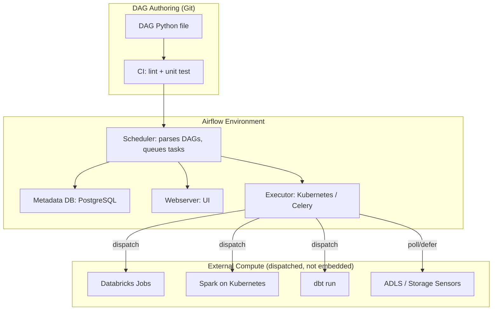
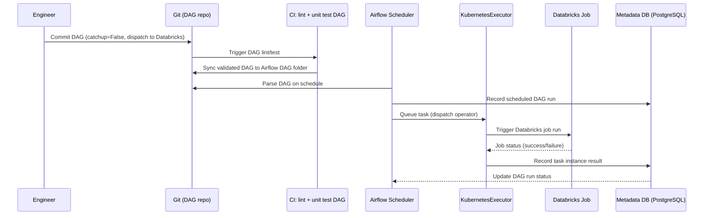
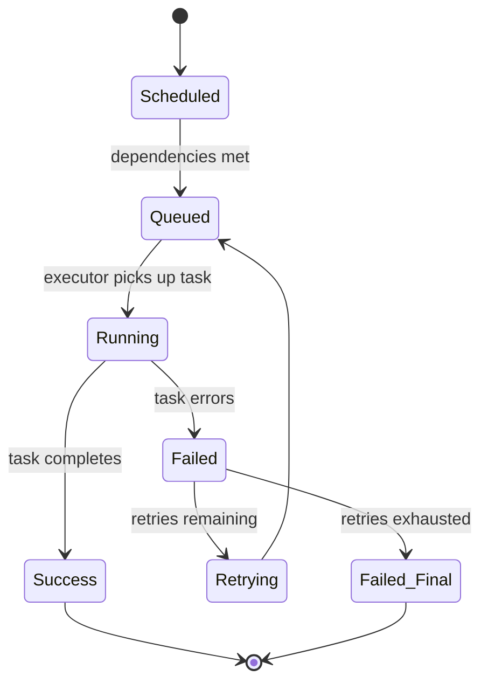

# Orchestration with Airflow

> Part of the **Enterprise Data & AI Architecture Handbook** · Phase-09 — DataOps, Platform Engineering & DevOps · Chapter 07.
> Estimated study time: **60 min reading + ~4h labs**.
> **Prerequisites:** read [Batch Pipeline Design](../Phase-05/09_Batch_Pipeline_Design.md) first.

---

## Executive Summary

[Batch Pipeline Design](../Phase-05/09_Batch_Pipeline_Design.md#core-concepts) established the design principles a reliable batch pipeline needs: idempotency, deterministic watermarks, bounded backfills, and SLA-aware scheduling. **Apache Airflow** is the leading open-source workflow orchestrator that operationalizes those principles as code — expressing a pipeline's task dependencies, schedule, and retry/backfill behavior as a Directed Acyclic Graph (DAG) defined in Python, executed and monitored by a distributed scheduler/worker architecture. Where [Kubernetes](06_Kubernetes.md#core-concepts) orchestrates *how containers run*, Airflow orchestrates *when and in what order pipeline tasks run* — a distinct, higher-level scheduling concern that frequently runs its own tasks as Kubernetes-scheduled pods via the KubernetesExecutor, directly connecting these two chapters.

This chapter covers: **DAGs, Operators, Sensors, and Hooks** — the core Airflow abstractions for defining pipeline structure, wrapping specific task types, waiting on external conditions, and connecting to external systems; **scheduling, backfills, and catchup** — Airflow's execution-date-based scheduling model and the operational discipline around historical reprocessing that directly extends [Batch Pipeline Design](../Phase-05/09_Batch_Pipeline_Design.md#core-concepts)'s backfill guidance; **executors and scaling** — the mechanisms (Local, Celery, Kubernetes) by which Airflow actually executes potentially thousands of concurrent tasks; **Airflow vs. ADF vs. Dagster vs. Prefect** — an honest, decision-relevant comparison of the leading orchestration options available to an Azure-primary enterprise; and **managed Airflow on Azure**, covering the concrete deployment options (Azure Data Factory's Managed Airflow, self-managed Airflow on AKS) available to Azure-primary teams.

The governing insight: **an orchestrator's job is to make dependency structure, retry behavior, and historical reprocessing explicit and auditable — not to perform the data transformation itself.** Airflow (and its DAG-as-code peers) are frequently misused as ad hoc compute engines running heavy business logic inline in task code; the durable, defensible pattern is Airflow orchestrating calls to purpose-built compute (Databricks jobs, Spark-on-Kubernetes, dbt runs) rather than performing that compute itself, keeping the orchestration layer thin, testable, and easy to reason about independent of the heavy lifting it coordinates.

The bias remains **Azure-primary (~60%)** — Azure Data Factory's Managed Airflow, self-managed Airflow on AKS, and Azure-native hooks/operators (ADLS, Databricks, Synapse) — **~30% enterprise open source** (Apache Airflow itself, the KubernetesExecutor, dbt-Airflow integration) and **~10% AWS/GCP comparison-only** (Amazon MWAA, Google Cloud Composer).

**Bottom line:** Airflow adoption succeeds when DAGs are thin orchestration wrappers around externally-executed compute, backfills are deliberate and bounded rather than accidental (via disciplined `catchup` and `start_date` configuration), and the executor is scaled appropriately (KubernetesExecutor for heterogeneous, bursty workloads) — and fails when DAGs embed heavy business logic directly in task code, `catchup=True` triggers an unbounded historical backfill by accident, or a single, undersized Celery worker pool becomes the bottleneck for the entire enterprise's pipeline throughput. An architect who treats Airflow as a thin, auditable coordination layer over the compute engines this handbook has already covered (Databricks, Spark-on-Kubernetes, dbt) gives the enterprise a single, coherent place to see and reason about cross-system pipeline dependencies — the capstone integration point for everything Phase-09 has built up to this chapter.

---

## Learning Objectives

By the end of this chapter you will be able to:

1. **Explain DAGs, Operators, Sensors, and Hooks** and design a well-structured Airflow DAG expressing real pipeline dependencies.
2. **Configure scheduling, backfills, and catchup behavior correctly**, avoiding the common accidental-mass-backfill failure mode.
3. **Choose and scale an appropriate executor** (Local, Celery, Kubernetes) for a given workload profile and team scale.
4. **Compare Airflow against Azure Data Factory, Dagster, and Prefect** and make a defensible orchestrator-selection decision for a given organizational context.
5. **Deploy managed or self-managed Airflow on Azure**, using Azure Data Factory's Managed Airflow or a self-hosted deployment on AKS.
6. **Design DAGs as thin orchestration wrappers** over externally-executed compute (Databricks jobs, Spark-on-Kubernetes, dbt), rather than embedding heavy logic in task code.
7. **Apply Airflow's testing and CI/CD practices**, extending the DataOps model from [DataOps Foundations](01_DataOps_Foundations.md#core-concepts) to DAG code specifically.
8. **Identify Airflow anti-patterns** — top-level DAG-file side effects, XCom misuse for large data, and unbounded accidental backfills.
9. **Map a target orchestration architecture onto Azure**, with an explicit, defensible comparison to Amazon MWAA and Google Cloud Composer.
10. **Defend orchestration tooling and DAG-design decisions** in engineer, staff engineer, architect, and CTO review settings.

---

## Business Motivation

- **Cross-system pipeline dependencies (ingest → transform → serve, spanning multiple tools and teams) need a single, visible coordination layer**, or dependency management degrades into a fragile web of ad hoc triggers and tribal knowledge about "which job needs to finish before this one starts."
- **Backfills and historical reprocessing are routine, not exceptional, in real enterprise pipelines** (per [Batch Pipeline Design](../Phase-05/09_Batch_Pipeline_Design.md#business-motivation)) — an orchestrator with first-class backfill semantics turns this into a safe, deliberate operation rather than an ad hoc, error-prone script.
- **SLA visibility and alerting need to span the whole pipeline, not just individual jobs.** A business consumer cares whether the end-to-end pipeline delivered data by the promised time, which requires an orchestration layer aware of the full task DAG's critical path, not just individual task success.
- **Retry, dependency, and failure-handling logic reimplemented ad hoc in every pipeline is a duplicated-effort and reliability risk**, directly analogous to the CI/CD template duplication problem from [Platform Engineering](02_Platform_Engineering.md#business-motivation) — an orchestrator centralizes this logic once, correctly.
- **Auditability of "what ran, when, with what parameters, and did it succeed" is a compliance and incident-response requirement** that ad hoc cron-based scheduling cannot reliably satisfy, but a DAG-based orchestrator with a persistent metadata database can.

---

## History and Evolution

- **2000s-early 2010s — Cron and bespoke scheduling scripts** were the norm for batch pipeline scheduling, providing no dependency-graph awareness, no built-in retry/backfill semantics, and poor visibility into cross-job dependencies.
- **2014 — Airbnb open-sources Airflow**, introducing DAG-as-Python-code pipeline definition with a rich web UI, built-in retry/backfill/scheduling semantics, and an extensible Operator/Hook plugin model — quickly becoming the dominant open-source workflow orchestrator.
- **2016 — Airflow joins the Apache Software Foundation** as an incubating project, later graduating to a top-level Apache project, cementing broad community governance and adoption.
- **2018-2020 — The KubernetesExecutor is introduced**, letting Airflow schedule each task as an isolated Kubernetes pod rather than a shared worker process, directly connecting Airflow to the container-orchestration model from [Kubernetes](06_Kubernetes.md#core-concepts).
- **2020 — Airflow 2.0 ships**, with a substantially rewritten, higher-availability scheduler, native TaskFlow API (Python-native DAG authoring via decorators), and significant UI/UX improvements addressing many operational pain points of Airflow 1.x.
- **2021-present — Newer, "DAG-as-code with stronger typing and testability" orchestrators (Dagster, Prefect) emerge**, explicitly positioning themselves against Airflow's perceived weaknesses (implicit typing between tasks, harder local testing, less software-engineering-native abstractions), giving the market genuine, well-differentiated alternatives.
- **2021-present — Cloud-managed Airflow offerings mature**: Amazon MWAA (2020), Google Cloud Composer (2018), and Azure Data Factory's Managed Airflow (2023) all reduce the substantial operational burden of self-hosting Airflow's scheduler, metadata database, and worker infrastructure.
- **2023-present — Airflow's ecosystem increasingly emphasizes "thin orchestration over external compute"** as the recommended pattern (via provider packages for Databricks, dbt Cloud, Spark-on-Kubernetes), reflecting industry consensus against embedding heavy computation directly in Airflow task code.

---

## Why This Technology Exists

Airflow (and workflow orchestrators generally) exist because scheduling a single job is trivial, but coordinating the dependencies, retries, backfills, and failure handling across dozens or hundreds of interdependent jobs spanning multiple systems is a distinct engineering problem that cron and ad hoc scripting handle poorly. Airflow specifically exists to make that coordination explicit, version-controlled, testable, and visible through a DAG-as-code model, rather than implicit in a scatter of cron entries and tribal knowledge about execution order.

---

## Problems It Solves

- **Implicit, undocumented cross-job dependencies** — a DAG makes task dependencies an explicit, version-controlled, visualized graph rather than a "job A must finish before job B, ask Dave" tribal-knowledge problem.
- **Ad hoc, error-prone backfill scripting** — Airflow's execution-date model and built-in backfill command provide a structured, auditable mechanism for reprocessing historical data ranges.
- **Fragmented failure handling and alerting** — centralized retry policy, SLA definitions, and failure-callback hooks give consistent, configurable failure handling across every pipeline rather than each pipeline reinventing its own.
- **Poor visibility into pipeline execution history** — the Airflow UI and metadata database provide a queryable record of every DAG run, task instance, and its outcome, directly supporting the audit and incident-response needs from [DataOps Foundations](01_DataOps_Foundations.md#governance).
- **Duplicated connection/credential management across pipelines** — Airflow's Connections and Hooks abstraction centralizes how pipelines authenticate to external systems, avoiding per-pipeline bespoke credential handling.

---

## Problems It Cannot Solve

- **It cannot make an individual task's business logic correct.** Airflow orchestrates *when* a task runs and *what* it depends on; the correctness of what the task actually computes remains the responsibility of the underlying code (Spark job, dbt model, Databricks notebook) it invokes.
- **It cannot substitute for the data-quality testing layer.** A DAG that runs successfully end-to-end tells you the tasks executed without error, not that the data they produced is correct — the four-layer testing model from [DataOps Foundations §1.4](01_DataOps_Foundations.md#core-concepts) still applies fully.
- **It cannot serve as a general-purpose distributed compute engine without becoming an operational liability.** Running heavy Python/Pandas transformations directly inside Airflow task code (rather than dispatching to Spark/Databricks) overloads the orchestrator's worker infrastructure and couples orchestration scaling to compute scaling in a way that is difficult to operate well at volume.
- **It cannot prevent an accidental mass backfill through configuration alone** — the `catchup`/`start_date` interaction is a well-known, easy-to-misconfigure source of real incidents; Airflow provides the mechanism, but disciplined configuration review remains a human responsibility.
- **It cannot eliminate the need for careful executor capacity planning.** A CeleryExecutor with an undersized worker pool, or a KubernetesExecutor pointed at a cluster with insufficient node capacity, will queue tasks indefinitely regardless of how well-designed the DAGs themselves are.

---

## Core Concepts

### 7.1 DAGs, Operators, Sensors, and Hooks

- **DAG (Directed Acyclic Graph)** — the top-level Python object defining a pipeline's schedule, default arguments (retries, retry delay, owner, SLA), and the set of tasks and their dependency edges; DAGs are defined as Python files, giving them full version-control, code-review, and testing discipline consistent with [DevOps and CI/CD](03_DevOps_and_CI_CD.md#core-concepts).
- **Operator** — a reusable, parameterized task template performing a specific unit of work (e.g., `BashOperator`, `PythonOperator`, or a provider-specific operator like `DatabricksRunNowOperator` or `KubernetesPodOperator`); the recommended pattern is using provider operators to *dispatch* work to an external system rather than performing heavy computation within the operator's own execution context.
- **Sensor** — a specialized operator that waits (polling or, more efficiently, via a deferrable/triggerer mechanism in Airflow 2.2+) for an external condition to become true — a file's arrival in ADLS, an upstream DAG's completion, a specific time window — before allowing downstream tasks to proceed.
- **Hook** — a reusable interface for connecting to an external system (an ADLS/Blob Storage Hook, a Databricks Hook, a Snowflake Hook), abstracting authentication and connection details behind Airflow's centrally-managed **Connections**, so individual DAGs don't hardcode credentials or connection strings.
- **TaskFlow API** — Airflow 2.0's decorator-based (`@task`) authoring style, making DAG code look and feel more like ordinary Python functions with implicit XCom-based data passing between tasks, improving authoring ergonomics over the older explicit-Operator-instantiation style.

### 7.2 Scheduling, Backfills, and Catchup

- **`schedule` (cron expression or preset)** defines how often a DAG should run; each scheduled run is associated with a **logical/execution date** representing the *start* of the interval being processed (a critical, frequently-misunderstood detail: a DAG scheduled `@daily` with logical date `2026-07-16` runs *after* that full day's data period has completed, at `2026-07-17T00:00`).
- **`catchup`** — when `True` (the historical default), Airflow automatically schedules and runs every missed interval between a DAG's `start_date` and the current date the first time it is enabled or after downtime; when `False`, Airflow only runs the most recent scheduled interval going forward, ignoring earlier missed intervals. **Setting `catchup=True` on a DAG with a `start_date` set far in the past is the single most common cause of an accidental, large-scale, resource-consuming backfill in production Airflow deployments** — new DAGs should default to `catchup=False` with an explicit, deliberate backfill triggered manually when historical reprocessing is genuinely needed.
- **Deliberate backfills** — Airflow's `airflow dags backfill` command (or a manually-triggered DAG run for a specific historical logical date range) is the correct, auditable mechanism for genuine historical reprocessing, directly implementing the bounded, deliberate backfill principle from [Batch Pipeline Design §9's core concepts](../Phase-05/09_Batch_Pipeline_Design.md#core-concepts) rather than an ad hoc script.
- **Idempotent task design remains the DAG author's responsibility** — Airflow's retry and backfill mechanisms only produce correct results if the underlying tasks are themselves idempotent (safe to re-run for the same logical date without duplicating or corrupting output), exactly the discipline [Batch Pipeline Design](../Phase-05/09_Batch_Pipeline_Design.md#core-concepts) established.

### 7.3 Executors and Scaling

- **LocalExecutor** — runs tasks as local subprocesses on the same machine as the scheduler; suitable only for small-scale or development use, since it does not scale beyond a single machine's capacity.
- **CeleryExecutor** — distributes task execution across a pool of Celery worker processes/machines, coordinated via a message broker (Redis or RabbitMQ); scales well for a large volume of relatively homogeneous, lightweight tasks, but the worker pool itself must be capacity-planned and scaled (manually or via autoscaling) independent of Airflow's own scheduling logic.
- **KubernetesExecutor** — schedules each task as an individual, ephemeral Kubernetes pod (directly building on [Kubernetes](06_Kubernetes.md#core-concepts)'s Pod and container-image model), providing per-task resource isolation, per-task custom container images, and natural integration with Kubernetes-native autoscaling (Cluster Autoscaler scaling nodes as task-pods are scheduled) — the recommended default for heterogeneous, bursty, or resource-diverse task workloads, at the cost of per-task pod-startup latency versus a warm Celery worker.
- **CeleryKubernetesExecutor** — a hybrid allowing a per-task choice between Celery (low-latency, for lightweight tasks) and Kubernetes (isolated, for heavyweight or heterogeneous tasks) within the same Airflow deployment.
- **Scheduler high availability** — Airflow 2.0+ supports running multiple scheduler replicas concurrently for high availability and increased DAG-parsing/scheduling throughput, a significant improvement over Airflow 1.x's single-scheduler limitation.

### 7.4 Airflow vs. ADF vs. Dagster vs. Prefect

| Dimension | Apache Airflow | Azure Data Factory | Dagster | Prefect |
|---|---|---|---|---|
| Authoring model | Python DAG-as-code | Low-code visual pipeline (with code-based options) | Python, with strong software-defined-assets/typed I/O model | Python, flow/task decorators, dynamic workflow-as-code |
| Best fit | Complex, heterogeneous, cross-system orchestration; large open-source ecosystem | Azure-native ETL/ELT with visual authoring, tight Azure service integration | Teams wanting strong data-asset lineage, typed contracts, and testability built into the orchestration layer | Teams wanting the most Python-native, dynamic, lightweight authoring experience |
| Local testability | Improved in 2.0 (TaskFlow), still requires more setup than newer alternatives | Limited — primarily authored/tested in the Azure portal or via ARM/Bicep deployment | Strong — designed explicitly for local unit testing of pipeline logic | Strong — flows are ordinary Python functions, easily unit-tested |
| Ecosystem maturity | Very large (broadest provider/operator ecosystem, widest enterprise adoption) | Native to Azure, tightly integrated with ADF/Synapse/Fabric | Growing, smaller than Airflow's | Growing, smaller than Airflow's |
| Managed-service options | Azure Data Factory Managed Airflow, Amazon MWAA, Google Cloud Composer | Native Azure PaaS | Dagster Cloud (managed) | Prefect Cloud (managed) |

**Selection guidance:** choose **Airflow** for complex, heterogeneous, cross-system orchestration needing the broadest ecosystem and enterprise track record; choose **ADF** when the primary need is Azure-native ETL/ELT with visual, low-code authoring and the team prefers staying within a single Azure-native tool rather than adopting a separate open-source orchestrator; choose **Dagster** when strong data-asset typing, lineage-aware software-defined assets, and testability are the primary design goals and the team is comfortable with a smaller (though rapidly growing) ecosystem; choose **Prefect** for teams wanting the most lightweight, dynamically-composable, Python-native authoring experience, particularly for less rigidly-structured or highly dynamic workflows.

### 7.5 Managed Airflow on Azure

- **Azure Data Factory Managed Airflow** — a fully-managed Airflow environment provisioned directly within ADF, eliminating the operational burden of managing the scheduler, metadata database, and worker infrastructure, while integrating with ADF's existing networking, monitoring, and Azure AD authentication — the recommended default for Azure-primary teams wanting Airflow's DAG-as-code flexibility without self-hosting operational overhead.
- **Self-managed Airflow on AKS** — deploying Airflow (via the official Helm chart) onto an AKS cluster provides maximum configuration flexibility (custom executor tuning, custom provider packages, specific Airflow version pinning) at the cost of the team owning scheduler/metadata-database/worker operational responsibility, appropriate for teams with specific customization needs the managed offering does not support or teams already deeply invested in Kubernetes-native operations from [Kubernetes](06_Kubernetes.md#core-concepts).
- **Metadata database** — both managed and self-managed Airflow deployments require a backing relational database (Azure Database for PostgreSQL Flexible Server is the standard Azure-native choice) storing DAG run history, task instance state, and connections.

---

## Internal Working

A representative DAG-authoring-to-execution flow:

1. **Engineer authors a DAG** (Python file) defining a schedule, `catchup=False` by default, task dependencies, and retry policy, using provider operators to dispatch work to Databricks/Spark-on-Kubernetes/dbt rather than embedding logic inline.
2. **CI pipeline (per [DevOps and CI/CD](03_DevOps_and_CI_CD.md#internal-working)) lints and unit-tests the DAG file** (validating DAG structure, checking for import errors, testing any custom Python callables in isolation) before deployment to the Airflow environment's DAG folder/Git-sync repository.
3. **The Airflow scheduler parses the DAG file** on its regular parsing interval, registering the DAG's structure and next scheduled run in the metadata database.
4. **At the scheduled time, the scheduler creates task instances** for the DAG run and queues them for execution according to task dependencies (a downstream task queues only once its upstream dependencies succeed).
5. **The configured executor (Kubernetes/Celery) picks up queued tasks and executes them** — for KubernetesExecutor, this means creating an ephemeral pod running the task; for CeleryExecutor, dispatching to an available worker process.
6. **Sensors poll or defer, waiting on external conditions** (e.g., an upstream file's arrival) before their downstream dependents are queued.
7. **Task success/failure is recorded in the metadata database**, triggering configured retry logic on failure, SLA-miss callbacks if the task exceeds its defined SLA, and updating the DAG run's overall status visible in the Airflow UI.
8. **On a genuine need for historical reprocessing**, an engineer explicitly triggers a backfill for a specific logical-date range, rather than relying on `catchup` to have handled it automatically.

---

## Architecture

---

## Components

- **Scheduler** — parses DAG files, determines when tasks should run, and queues task instances for the executor.
- **Webserver** — serves the Airflow UI, providing DAG visualization, run history, logs, and manual trigger/backfill controls.
- **Metadata database (PostgreSQL)** — stores DAG definitions' runtime state, task instance history, Connections, Variables, and XCom data.
- **Executor (KubernetesExecutor, CeleryExecutor)** — the pluggable mechanism actually running queued tasks.
- **Triggerer** — the Airflow 2.2+ component enabling deferrable operators/sensors to wait on external conditions asynchronously without occupying a worker slot the entire time.
- **Provider packages** — installable packages (`apache-airflow-providers-databricks`, `-cncf-kubernetes`, `-microsoft-azure`) supplying the Operators/Hooks/Sensors integrating Airflow with specific external systems.

---

## Metadata

- **DAG run and task instance metadata** — every run's logical date, start/end time, status, and retry count, stored in the metadata database and queryable for SLA and reliability reporting.
- **XCom (cross-communication) metadata** — small pieces of data (identifiers, status flags, file paths — not large datasets) passed between tasks via the metadata database; XCom is explicitly *not* designed for passing large data payloads, which should instead be written to durable storage (ADLS) with only a reference/path passed via XCom.
- **Connections and Variables** — centrally-managed metadata for external-system credentials (ideally backed by Azure Key Vault via Airflow's Secrets Backend integration, not stored in plaintext in the metadata database) and DAG-configurable parameters.
- **Lineage metadata (via OpenLineage integration)** — Airflow's OpenLineage provider can emit task-level lineage events, feeding a broader lineage/catalog system per [Data Catalog and Lineage](../Phase-08/02_Data_Catalog_and_Lineage.md#core-concepts).

---

## Storage

- **Metadata database (Azure Database for PostgreSQL Flexible Server)** — the durable store for all Airflow operational state.
- **DAG file storage** — DAGs are typically synced from a Git repository (via a Git-sync sidecar in Kubernetes deployments, or ADF Managed Airflow's native Git integration) rather than being manually uploaded, extending the version-control discipline from [DevOps and CI/CD](03_DevOps_and_CI_CD.md#core-concepts) to pipeline-orchestration code itself.
- **Log storage** — task logs are typically shipped to remote storage (Azure Blob Storage) for durability beyond an individual worker/pod's ephemeral lifetime, essential for KubernetesExecutor where each task's pod is torn down after completion.
- **Large data payloads never stored in the metadata database via XCom** — they should be written to ADLS Gen2 with only a path/reference passed between tasks.

---

## Compute

- **Scheduler and webserver compute** — typically modest, steady-state compute requirements, though scheduler performance can become a bottleneck at very high DAG/task counts, benefiting from Airflow 2.0+'s multi-scheduler HA support.
- **Executor compute scales with actual task workload** — KubernetesExecutor's per-task pod model directly leverages [Kubernetes](06_Kubernetes.md#core-concepts)'s Cluster Autoscaler to provision node capacity matching actual concurrent task demand, rather than a fixed, pre-provisioned Celery worker pool.
- **Heavy compute dispatched externally** — Databricks clusters, Spark-on-Kubernetes executors, and dbt runs execute on their own dedicated compute, not on Airflow's own scheduler/worker infrastructure, per the thin-orchestration design principle (§7's Executive Summary).

---

## Networking

- **Scheduler/webserver/worker network access to external systems** — Airflow's workers (or Kubernetes-executor pods) need network connectivity (via VNet integration/private endpoints) to whatever systems its DAGs dispatch to: Databricks workspaces, ADLS, Synapse, dbt Cloud.
- **Metadata database private connectivity** — the PostgreSQL metadata database should be accessible only via private endpoint, never exposed to the public internet.
- **Managed Airflow (ADF) VNet integration** — ADF's Managed Airflow supports VNet injection, letting Airflow reach VNet-integrated resources (private Databricks workspaces, private-endpoint storage) consistent with the networking patterns established throughout this handbook.

---

## Security

- **Airflow Connections backed by Azure Key Vault** (via the Airflow Azure Key Vault Secrets Backend), never storing credentials in plaintext in the metadata database or DAG code.
- **RBAC on the Airflow webserver UI** — Airflow's built-in role-based access control (or Azure AD-integrated authentication for Managed Airflow) should restrict who can trigger DAG runs, view logs, or modify Connections.
- **DAG code review as a security control, not just a correctness control** — since DAG Python files execute arbitrary code at parse time (not just at task-run time), a malicious or careless DAG file can itself be a security risk; DAG deployment should go through the same code-review gate as any other production code, per [DevOps and CI/CD](03_DevOps_and_CI_CD.md#security).
- **KubernetesExecutor pod security** — task pods should follow the same non-root, minimal-image, signed-image practices from [Containers with Docker](05_Containers_with_Docker.md#security) and [Kubernetes](06_Kubernetes.md#security).
- **Least-privilege service principals per Connection** — each Airflow Connection to an external Azure service should use a narrowly-scoped identity, not a broad, shared credential reused across every DAG.

---

## Performance

- **DAG-parsing performance matters at scale** — Airflow's scheduler must repeatedly parse every DAG file; DAGs with expensive top-level code (network calls, heavy imports executed at parse time rather than task-run time) slow scheduler throughput for the entire environment, a critical, frequently-violated design rule (§7's Anti-patterns).
- **Sensor efficiency** — using deferrable/async sensors (via the Triggerer) instead of classic poll-based sensors frees worker/pod capacity that would otherwise be consumed simply waiting, materially improving effective executor throughput for sensor-heavy DAGs.
- **KubernetesExecutor pod cold-start latency** — per-task pod creation adds startup overhead versus a warm Celery worker; for very high-frequency, lightweight tasks, CeleryExecutor or a CeleryKubernetesExecutor hybrid may outperform pure KubernetesExecutor.
- **Task concurrency and pool limits** — Airflow's `max_active_runs`, `max_active_tasks`, and custom Pools let an operator explicitly bound concurrency against a shared, capacity-constrained downstream resource (e.g., a database connection limit), preventing an otherwise well-designed DAG from overwhelming a downstream system.

---

## Scalability

- **KubernetesExecutor scales naturally with Cluster Autoscaler** (per [Kubernetes §6.4](06_Kubernetes.md#core-concepts)), matching executor capacity to actual, bursty task demand rather than a statically-sized worker pool.
- **Multi-scheduler HA (Airflow 2.0+)** scales DAG-parsing and task-scheduling throughput horizontally, addressing the single-scheduler bottleneck that limited Airflow 1.x at very large DAG counts.
- **DAG-folder-per-team or repository-per-team patterns**, combined with a shared, platform-team-maintained set of provider operators and DAG templates (extending the golden-path model from [Platform Engineering](02_Platform_Engineering.md#core-concepts)), let orchestration adoption scale across many teams without each team reinventing DAG boilerplate.
- **Federated/multiple Airflow environments** — very large enterprises sometimes run multiple independent Airflow environments (per business domain or team) rather than one shared environment, trading some cross-domain visibility for reduced blast radius and independent scaling/upgrade cadence.

---

## Fault Tolerance

- **Automatic task retry with configurable retry delay and exponential backoff** — Airflow's built-in retry mechanism handles transient failures without manual intervention, provided the underlying task is idempotent.
- **Scheduler HA (multiple scheduler replicas)** eliminates the single-point-of-failure risk of Airflow 1.x's single-scheduler architecture.
- **KubernetesExecutor's per-task pod isolation** means a single task's crash or resource exhaustion does not affect other concurrently-running tasks, unlike a shared Celery worker process potentially affected by a noisy-neighbor task.
- **SLA-miss alerting** — Airflow's SLA feature alerts when a task or DAG run exceeds a defined maximum duration, surfacing a developing reliability problem before it becomes a full failure.
- **Deliberate, bounded backfill procedures (§7.2)** prevent the fault-tolerance mechanism (retry/backfill) from itself becoming a source of incidents via unbounded, accidental reprocessing.

---

## Cost Optimization

- **KubernetesExecutor's on-demand, scale-to-zero task compute** avoids paying for idle Celery worker capacity during low-activity periods, directly leveraging the Cluster Autoscaler cost model from [Kubernetes §6's cost optimization](06_Kubernetes.md#cost-optimization).
- **Thin orchestration (dispatching to Databricks/Spark rather than running heavy compute in Airflow workers)** keeps Airflow's own infrastructure footprint small and predictable, isolating the (often larger and more variable) compute cost in the purpose-built engines actually doing the work.
- **Managed Airflow (ADF Managed Airflow) trades a service-management fee for eliminated self-hosting operational cost** — for most Azure-primary teams, the managed offering's cost is favorable versus the engineering time required to operate a self-managed scheduler/metadata-database/worker stack reliably.
- **Worked FinOps example:** A data platform team runs a self-managed Airflow deployment on AKS using CeleryExecutor with a statically-sized worker pool of 8 always-on nodes (sized for peak daily load), at roughly $0.35/hr/node all-in: 8 × $0.35 × 24 × 30 ≈ $2,016/month, with average daytime utilization around 35% and near-zero utilization overnight. Migrating to KubernetesExecutor with Cluster-Autoscaler-managed task pods (scaling from a 1-node floor up to 8 nodes only during actual task execution bursts) reduces the effective node-hours to roughly 40% of the always-on baseline, cutting compute cost to approximately $810/month — a saving of roughly $1,200/month, at the cost of a one-time migration effort (re-testing DAGs under the new executor, validating per-task pod resource requests) estimated at 2-3 engineer-weeks.

---

## Monitoring

- **DAG/task success and failure rate**, tracked per DAG, surfaced in the Airflow UI and exportable to Azure Monitor/Prometheus via Airflow's StatsD metrics integration.
- **SLA-miss rate** — tracks how often DAGs/tasks exceed their defined maximum duration, a leading indicator of developing capacity or upstream-dependency problems.
- **Scheduler heartbeat and DAG-parsing duration** — a rising DAG-parsing time is an early warning sign of DAG-file performance anti-patterns (expensive top-level code) accumulating across the environment.
- **Executor queue depth and worker/pod utilization** — informs whether the executor is appropriately capacity-planned for current task volume.

---

## Observability

- **Correlate DAG/task failures with dispatched-compute failures** (a Databricks job failure surfaced back through the dispatching operator's own status) so an on-call engineer sees a single, coherent failure signal rather than needing to separately check Airflow and Databricks.
- **Centralized, remote task-log storage** (Azure Blob Storage) is essential for KubernetesExecutor deployments, since a task's pod (and its local logs) is torn down immediately after completion.
- **OpenLineage integration** extends observability to data lineage — when a downstream data-quality check fails (per [DataOps Foundations §1.5](01_DataOps_Foundations.md#core-concepts)), Airflow-emitted lineage events help trace the failure to the specific upstream DAG/task that produced the bad data.

### Operational Response Playbook

| Signal | Detection Query/Check | Remediation |
|---|---|---|
| DAG run stuck / tasks queued but not executing | Executor queue-depth metric exceeds baseline with no corresponding increase in running tasks | Check executor capacity (Celery worker pool health, or Kubernetes Cluster Autoscaler max-node ceiling); check scheduler heartbeat/health; verify no Pool concurrency limit is unexpectedly saturated. |
| Unexpected large-scale backfill triggered | A DAG run history shows a sudden burst of many historical logical-date runs immediately after a deployment or DAG re-enable | Immediately pause the DAG; verify `catchup` setting and `start_date`; if an accidental backfill is confirmed, clear the erroneously-triggered task instances and correct the DAG configuration before re-enabling. |

---

## Governance

- **DAG code under the same version-control, review, and CI/CD discipline as any other production code**, per [DevOps and CI/CD](03_DevOps_and_CI_CD.md#governance) — no direct manual DAG-file edits on a production Airflow environment.
- **Connections and Variables governed through Azure Key Vault-backed secrets management**, auditable and rotatable centrally, rather than ad hoc per-DAG credential handling.
- **Ownership metadata per DAG** (the `owner` field, plus catalog registration per [Platform Engineering](02_Platform_Engineering.md#governance)) ensures every DAG has an unambiguous escalation path during an incident.
- **Backfill governance** — genuinely large or business-impactful backfills (e.g., reprocessing a full year of historical data feeding a regulatory report) should go through the same named-approval-gate discipline as a high-risk production deployment, per [DevOps and CI/CD §3's governance](03_DevOps_and_CI_CD.md#governance).

---

## Trade-offs

| Dimension | CeleryExecutor | KubernetesExecutor |
|---|---|---|
| Task startup latency | Low (warm workers) | Higher (per-task pod cold start) |
| Resource isolation per task | Weak (shared worker process) | Strong (dedicated pod per task) |
| Scaling model | Manual/autoscaled worker pool sizing | Native Kubernetes Cluster Autoscaler integration |
| Cost efficiency for bursty workloads | Lower (idle worker capacity) | Higher (scale-to-zero between bursts) |
| Best fit | High-frequency, lightweight, homogeneous tasks | Heterogeneous, resource-diverse, or bursty task workloads |

---

## Decision Matrix

| Scenario | Recommended Approach |
|---|---|
| Azure-primary team wanting Airflow without self-hosting operational burden | ADF Managed Airflow |
| Team needing deep executor/provider customization or already AKS-native | Self-managed Airflow on AKS with KubernetesExecutor |
| Primarily Azure-native ETL/ELT with visual authoring preference | Azure Data Factory (pipelines), not Airflow |
| Team prioritizing strong data-asset typing and local testability over ecosystem breadth | Dagster |
| Team wanting the most lightweight, dynamic, Python-native authoring | Prefect |
| High-frequency, lightweight, homogeneous task workload | CeleryExecutor |
| Heterogeneous, bursty, or resource-diverse task workload | KubernetesExecutor |

---

## Design Patterns

- **Thin orchestration over dispatched compute** — DAGs call out to Databricks/Spark/dbt rather than embedding heavy logic in task code.
- **`catchup=False` by default, deliberate manual backfill when needed** — the default-safe configuration preventing accidental mass reprocessing.
- **Sensor deferral via the Triggerer** rather than classic polling sensors, for efficient resource use while waiting on external conditions.
- **Golden-path DAG templates** (per [Platform Engineering](02_Platform_Engineering.md#design-patterns)) — a platform team publishes standardized DAG templates with correct default arguments (retries, SLA, `catchup=False`) that teams parameterize rather than hand-authoring boilerplate.
- **XCom for references only, never large payloads** — pass ADLS paths/identifiers between tasks, not the data itself.

---

## Anti-patterns

- **Embedding heavy business logic (large Pandas transformations, ML training) directly in Airflow task code** rather than dispatching to purpose-built compute.
- **`catchup=True` with a far-past `start_date`** — the classic accidental-mass-backfill trigger.
- **Expensive top-level code in DAG files** (network calls, heavy imports executed at every scheduler parse cycle) — degrades scheduler performance for the entire environment.
- **Using XCom to pass large datasets** between tasks, bloating the metadata database and risking performance degradation.
- **Manually editing DAGs directly on the production Airflow environment** rather than through version control and CI/CD.
- **Ignoring SLA and alerting configuration**, discovering a pipeline delay only when a business stakeholder complains rather than from an automated SLA-miss alert.

---

## Common Mistakes

- Not testing DAG files for import errors or structural correctness before deployment, discovering a broken DAG only after it fails to appear (or fails immediately) in production.
- Setting overly aggressive retry counts/delays for a task calling a rate-limited external API, inadvertently causing further throttling.
- Forgetting to bound concurrency (via Pools or `max_active_tasks`) against a shared, capacity-constrained downstream resource.
- Treating a DAG's "success" status as proof the underlying data is correct, without a separate data-quality gate.
- Underestimating KubernetesExecutor pod cold-start latency for very high-frequency, lightweight tasks, and being surprised by the resulting throughput ceiling.

---

## Best Practices

- Default every new DAG to `catchup=False`, triggering explicit, deliberate backfills only when genuinely needed.
- Keep DAG task code as thin dispatch wrappers over Databricks/Spark/dbt, never embedding heavy computation directly.
- Version-control, lint, and unit-test DAG files through the same CI/CD pipeline as any other production code.
- Use deferrable sensors (via the Triggerer) instead of classic polling sensors wherever available.
- Choose KubernetesExecutor as the default for heterogeneous or bursty workloads; reserve CeleryExecutor for genuinely homogeneous, high-frequency, lightweight task profiles.
- Define SLAs and failure-callback alerting for every business-critical DAG, not just relying on manual dashboard-watching.

---

## Enterprise Recommendations

- Standardize on ADF Managed Airflow as the default orchestration platform for Azure-primary teams, reserving self-managed Airflow on AKS for teams with specific customization needs the managed offering cannot meet.
- Publish golden-path DAG templates (correct default arguments, standard retry/SLA configuration) through the platform team's catalog, per [Platform Engineering](02_Platform_Engineering.md#enterprise-recommendations).
- Mandate DAG code review and CI/CD testing with the same rigor as application code, given that DAG files execute arbitrary Python at scheduler-parse time.
- Require explicit approval for any large-scale historical backfill affecting business-critical or regulatory pipelines.
- Periodically audit DAGs for the "heavy logic embedded in task code" anti-pattern, redirecting such workloads to Databricks/Spark-on-Kubernetes dispatch instead.

---

## Azure Implementation

- **Azure Data Factory Managed Airflow** — fully-managed Airflow environments provisioned within ADF, with native Git integration for DAG deployment, Azure AD authentication, and VNet integration for private connectivity.
- **Self-managed Airflow on AKS** — deployed via the official Apache Airflow Helm chart, using KubernetesExecutor, with Azure Database for PostgreSQL Flexible Server as the metadata database and Azure Blob Storage for remote task logging.
- **`apache-airflow-providers-microsoft-azure`** — the provider package supplying Azure-native Hooks/Operators (ADLS Gen2, Azure Data Factory, Azure Batch, Azure Container Instances).
- **`apache-airflow-providers-databricks`** — the provider package supplying operators (`DatabricksRunNowOperator`, `DatabricksSubmitRunOperator`) for dispatching work to Databricks jobs, the recommended thin-orchestration pattern for Spark-heavy transformation logic.
- **Azure Key Vault Secrets Backend** — lets Airflow retrieve Connections and Variables directly from Key Vault rather than storing them in the metadata database.

---

## Open Source Implementation

- **Apache Airflow** — the orchestration engine itself, with the broadest provider-package ecosystem of any open-source orchestrator.
- **KubernetesExecutor / CeleryExecutor** — the core scaling mechanisms, elaborated in §7.3.
- **dbt-Airflow integration (via Cosmos or the dbt Cloud provider)** — dispatches dbt runs from an Airflow DAG, directly extending the transformation-layer testing model from [DataOps Foundations](01_DataOps_Foundations.md#open-source-implementation).
- **OpenLineage** — an open standard for pipeline lineage event emission, with a native Airflow provider integration.
- **Dagster / Prefect** — the leading alternative open-source orchestrators, compared directly in §7.4.

---

## AWS Equivalent (comparison only)

| Capability | Azure | AWS |
|---|---|---|
| Managed Airflow | Azure Data Factory Managed Airflow | Amazon Managed Workflows for Apache Airflow (MWAA) |
| Native visual ETL orchestration | Azure Data Factory | AWS Glue Workflows / Step Functions |
| Self-managed Airflow compute | Airflow on AKS | Airflow on Amazon EKS |

**Advantages of AWS:** MWAA is a mature, widely-adopted managed Airflow offering with deep integration into the broader AWS ecosystem (S3, Glue, Redshift). **Disadvantages:** MWAA's environment-sizing model (fixed environment classes) is generally considered less granularly scalable than a KubernetesExecutor-based self-managed deployment, and ADF Managed Airflow's tighter integration with Databricks/Synapse is a meaningful advantage for Azure-primary data platforms specifically. **Migration strategy:** DAG code (Python, provider operators) is largely portable between MWAA and ADF Managed Airflow/self-managed AKS deployments; provider-specific operators (AWS vs. Azure service hooks) require the most rework. **Selection criteria:** choose MWAA for an AWS-primary estate; choose ADF Managed Airflow or self-managed AKS Airflow for an Azure-primary or Databricks-centric estate.

---

## GCP Equivalent (comparison only)

| Capability | Azure | GCP |
|---|---|---|
| Managed Airflow | Azure Data Factory Managed Airflow | Google Cloud Composer |
| Native visual ETL orchestration | Azure Data Factory | Google Cloud Dataflow / Workflows |
| Self-managed Airflow compute | Airflow on AKS | Airflow on GKE |

**Advantages of GCP:** Cloud Composer is one of the longest-established managed Airflow offerings (since 2018) with mature GKE-based underlying infrastructure and deep BigQuery/Dataflow integration. **Disadvantages:** Cloud Composer's environment provisioning and upgrade model has historically been considered slower and less flexible than a KubernetesExecutor-based self-managed deployment, though this has improved with Composer 2's more Kubernetes-native architecture. **Migration strategy:** as with AWS, DAG code and provider-agnostic logic port readily; GCP-specific service hooks require rework. **Selection criteria:** choose Cloud Composer for a GCP-primary, BigQuery-centric estate; choose ADF Managed Airflow or self-managed AKS Airflow for an Azure-primary or Databricks-centric estate.

---

## Migration Considerations

- **Audit existing ad hoc cron/scripted pipelines for hidden dependency assumptions before migrating them into Airflow DAGs** — many "works today" cron pipelines rely on implicit timing assumptions that need to become explicit DAG dependency edges.
- **Default every migrated DAG to `catchup=False`** regardless of the DAG's true historical `start_date`, then trigger any genuinely-needed historical backfill explicitly and deliberately as a separate, reviewed operation.
- **Migrate heavy-logic pipelines to a thin-orchestration pattern during the move**, not after — this is the ideal moment to extract embedded business logic into a Databricks job or dbt model that the new DAG merely dispatches to.
- **Start with CeleryExecutor if migrating from a simple cron setup with homogeneous, lightweight tasks**, and evaluate KubernetesExecutor once task heterogeneity or burstiness becomes apparent, rather than over-engineering the initial migration.
- **Validate SLA and alerting configuration explicitly during migration**, since ad hoc cron/scripted pipelines rarely had equivalent, well-defined SLA monitoring to carry forward automatically.

---

## Mermaid Architecture Diagrams

---

## End-to-End Data Flow

```mermaid
flowchart LR
    A[DAG defines schedule + dependencies] --> B[Scheduler creates DAG run for logical date]
    B --> C[Sensor waits for upstream data]
    C --> D[Dispatch task: Databricks/Spark/dbt run]
    D --> E[External compute processes data]
    E --> F[Task records success/failure]
    F --> G[Downstream tasks queued if dependencies met]
    G --> H[DAG run complete: SLA and status recorded]
    H --> I[Data-quality gate validates output separately]
```

---

## Real-world Business Use Cases

- A logistics company migrated dozens of cron-scheduled ETL scripts into Airflow DAGs on ADF Managed Airflow, converting previously-implicit sequencing assumptions into explicit DAG dependencies and reducing pipeline-related incident volume by roughly a third within two quarters.
- A media analytics company adopted KubernetesExecutor after its CeleryExecutor worker pool became a recurring bottleneck during month-end reporting bursts, cutting peak-period task queuing delay significantly while reducing average monthly compute cost via scale-to-zero between bursts.
- A financial-services firm implemented a mandatory backfill-approval process after an engineer's `catchup=True` misconfiguration triggered an unplanned two-year historical reprocessing job that consumed a full weekend's Databricks compute budget.

---

## Case Studies

**Case: An accidental multi-year backfill.** A data engineer migrated an existing pipeline into an Airflow DAG, setting `start_date` to the pipeline's original launch date (three years prior) for historical-reference purposes, without realizing `catchup` defaulted to `True`. Upon deploying and enabling the DAG, Airflow immediately scheduled and began executing over a thousand historical daily DAG runs in rapid succession, each dispatching a Databricks job run — consuming the team's entire monthly Databricks compute budget within hours and triggering unrelated downstream data-quality alerts as historical Databricks job runs unexpectedly overwrote already-correct historical output tables.

**Root cause:** the engineer was unaware of the `catchup`/`start_date` interaction's default behavior, and no CI/CD or code-review check existed to catch a DAG with `catchup` unset (defaulting to `True`) alongside a far-past `start_date`.

**Remediation:** the team immediately paused the DAG and cleared the erroneous task instances, corrected the DAG to `catchup=False`, and added a DAG-linting CI check specifically flagging any new DAG lacking an explicit `catchup=False` (or an explicit, reviewed justification for `catchup=True`) before merge — converting a previously silent misconfiguration risk into a systematically-caught one.

---

## Hands-on Labs

1. **Lab 1 — Author a thin-orchestration DAG.** Write an Airflow DAG with `catchup=False` that uses a Sensor to wait for a file's arrival in a storage location, then dispatches to a `DatabricksRunNowOperator` (or a `BashOperator` stand-in) rather than embedding transformation logic directly.
2. **Lab 2 — Configure and test a deliberate backfill.** Using the DAG from Lab 1, trigger a manual backfill for a specific historical logical-date range via `airflow dags backfill`, verifying the correct, bounded set of runs is created.
3. **Lab 3 — Deploy Airflow with KubernetesExecutor.** Deploy Airflow via the official Helm chart onto a small AKS cluster (from [Kubernetes](06_Kubernetes.md#hands-on-labs)), configuring KubernetesExecutor and observing per-task pod creation.
4. **Lab 4 — Add DAG CI validation.** Extend the CI pipeline from [DevOps and CI/CD](03_DevOps_and_CI_CD.md#hands-on-labs) with a DAG-linting step that fails the build if any DAG lacks an explicit `catchup` setting or has expensive top-level code.
5. **Lab 5 — Configure SLA alerting.** Add an SLA definition to a DAG's task, intentionally cause the task to exceed it (via a sleep/delay), and verify the SLA-miss alert/callback fires correctly.

---

## Exercises

1. Explain the `catchup`/`start_date` interaction and describe the specific configuration that would cause an accidental multi-year backfill.
2. Design a DAG structure (tasks and dependencies) for a pipeline extending [Batch Pipeline Design](../Phase-05/09_Batch_Pipeline_Design.md)'s capstone, using dispatch operators rather than embedded logic.
3. Compare CeleryExecutor and KubernetesExecutor for a workload with highly variable, bursty task resource requirements, and justify your recommendation.
4. Using the comparison table in §7.4, justify a choice between Airflow and Dagster for a hypothetical team prioritizing strong data-asset lineage and local testability.
5. Describe a CI/CD check you would add to prevent the "heavy logic embedded in task code" anti-pattern from reaching production.

---

## Mini Projects

- Build a complete thin-orchestration DAG pipeline: a Sensor waiting on ADLS file arrival, a dispatch to a Databricks job (or a Spark-on-Kubernetes `SparkApplication` via the KubernetesPodOperator), and a downstream data-quality-gate task, all deployed via CI/CD with DAG-linting validation.
- Implement OpenLineage integration for a sample DAG, and verify lineage events are emitted and queryable, connecting Airflow-level orchestration to catalog-level lineage per [Data Catalog and Lineage](../Phase-08/02_Data_Catalog_and_Lineage.md).
- Write a small DAG-linting script (parsing DAG files via Airflow's DAG-bag loading mechanism) that flags any DAG missing an explicit `catchup=False` setting or containing suspiciously expensive top-level imports/calls.

---

## Capstone Integration

Extend the containerized, Kubernetes-orchestrated pipeline from [Kubernetes](06_Kubernetes.md#capstone-integration) with an Airflow DAG (deployed via ADF Managed Airflow or self-managed on AKS with KubernetesExecutor) that schedules and coordinates it: a Sensor waiting on upstream data, a dispatch task triggering the Kubernetes-orchestrated Spark job or Databricks run, and a downstream data-quality-gate task, with `catchup=False`, defined SLAs, and DAG code passing through the CI/CD pipeline from [DevOps and CI/CD](03_DevOps_and_CI_CD.md). This becomes the coordinated, end-to-end orchestrated system that Phase-09 Chapter 08 (GitOps) will manage declaratively across environments.

---

## Interview Questions

1. What are DAGs, Operators, Sensors, and Hooks, and how do they compose to define an Airflow pipeline?
2. What is the `catchup`/`start_date` interaction, and what specific misconfiguration causes an accidental mass backfill?
3. What is the difference between CeleryExecutor and KubernetesExecutor, and when would you choose one over the other?
4. Why should heavy business logic be dispatched to external compute rather than embedded directly in Airflow task code?

## Staff Engineer Questions

5. How would you design a golden-path DAG template that defaults to safe `catchup`/SLA/retry configuration for every new pipeline in an organization?
6. What CI/CD checks would you implement to catch DAG-authoring anti-patterns (expensive top-level code, missing `catchup` setting, XCom misuse) before production deployment?
7. How would you decide between ADF Managed Airflow and self-managed Airflow on AKS for a given organization's needs?

## Architect Questions

8. How does your orchestration architecture integrate with the Kubernetes and container-security practices from Chapters 05-06?
9. What criteria would you use to choose between Airflow, ADF, Dagster, and Prefect for a given organization, beyond ecosystem size alone?
10. How would you architect a bounded, auditable backfill-approval process for a business-critical or regulatory pipeline?

## CTO Review Questions

11. What is your organization's current exposure to the accidental-backfill failure mode, and what governance controls mitigate it?
12. What evidence would your orchestration platform produce to prove a specific historical pipeline run's exact configuration and outcome, for audit purposes?
13. What is your position on Airflow versus newer alternatives (Dagster, Prefect) as the enterprise standard, and what factors drove that decision?

---

## References

- Apache Airflow Documentation. "Concepts — DAGs, Operators, Executors." airflow.apache.org/docs.
- Microsoft Learn. "Managed Airflow in Azure Data Factory documentation."
- OpenLineage. "OpenLineage Specification and Airflow Integration." openlineage.io.
- Dagster Documentation. "Dagster vs. Airflow." dagster.io/docs.
- Prefect Documentation. "Prefect Concepts." docs.prefect.io.

## Further Reading

- [Batch Pipeline Design](../Phase-05/09_Batch_Pipeline_Design.md) — the idempotency, watermark, and backfill design principles this chapter's Airflow-specific mechanics implement concretely.
- [Kubernetes](06_Kubernetes.md) — the container-orchestration substrate KubernetesExecutor and KubernetesPodOperator build directly on.
- [DevOps and CI/CD](03_DevOps_and_CI_CD.md) — the version-control, review, and CI/CD discipline this chapter applies to DAG code specifically.
- [Data Catalog and Lineage](../Phase-08/02_Data_Catalog_and_Lineage.md) — the lineage system Airflow's OpenLineage integration feeds.

---

[Back to Phase-09 README](../../.github/prompts/Phase-09/README.md) - [Handbook README](../../README.md) - [Roadmap](../../ROADMAP.md)
