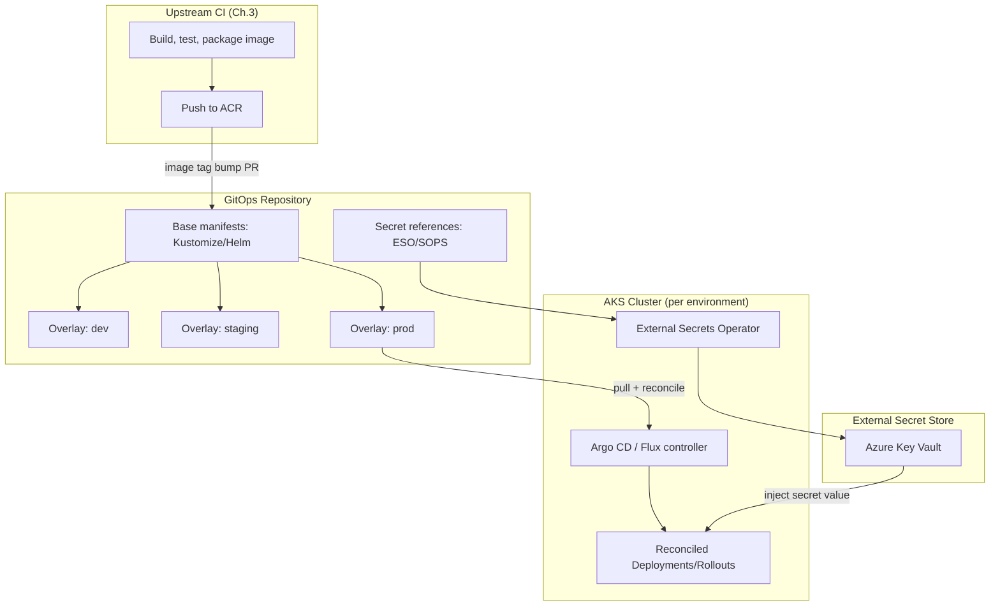
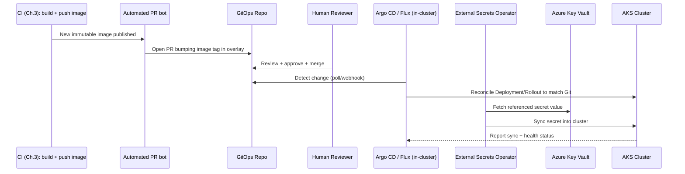
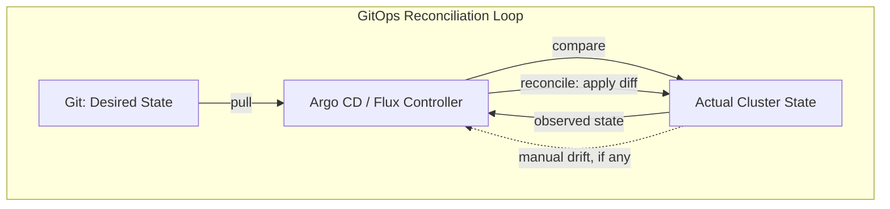
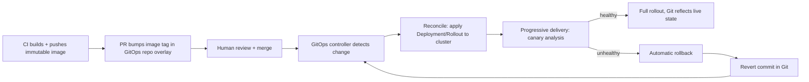

# GitOps and Environment Management

> Part of the **Enterprise Data & AI Architecture Handbook** · Phase-09 — DataOps, Platform Engineering & DevOps · Chapter 08.
> Estimated study time: **45 min reading + ~3h labs**.
> **Prerequisites:** read [Infrastructure as Code with Terraform](04_Infrastructure_as_Code_with_Terraform.md) and [Kubernetes](06_Kubernetes.md) first.

---

## Executive Summary

[Infrastructure as Code with Terraform §4.7](04_Infrastructure_as_Code_with_Terraform.md#core-concepts) introduced GitOps for infrastructure — Git as the source of truth, continuously reconciled against live cloud resources. This chapter completes that model for the workload layer running on the [Kubernetes](06_Kubernetes.md#core-concepts) clusters this phase has built: **GitOps for application and pipeline deployment**, using **Argo CD** or **Flux** as the continuous-reconciliation controller running *inside* the cluster itself, pulling from Git rather than being pushed to by an external CI/CD pipeline. This is the capstone chapter of Phase-09, drawing together immutable artifacts (Chapter 03/05), infrastructure provisioning (Chapter 04), and orchestration (Chapters 06-07) into a single, coherent, auditable deployment model.

This chapter covers: **GitOps principles and Argo CD/Flux** — the pull-based reconciliation model that distinguishes GitOps from traditional push-based CI/CD, and the two leading CNCF GitOps controllers; **environment promotion and configuration** — managing dev/staging/production Kubernetes manifest differences through overlays (Kustomize) or templating (Helm), directly extending the environment-promotion model from [DataOps Foundations](01_DataOps_Foundations.md#core-concepts); **secrets management** — the specific challenge of storing secret *references* (not values) in Git, using Azure Key Vault integration and SOPS (Secrets OPerationS) for encrypted-at-rest secret material when direct external-secret-store integration isn't available; **progressive delivery** — extending the canary/blue-green concepts from [DevOps and CI/CD §3.3-3.4](03_DevOps_and_CI_CD.md#core-concepts) into a GitOps-native, declarative form via Argo Rollouts or Flagger; and **auditability and rollback** — why Git's own commit history becomes the deployment audit log and rollback mechanism once GitOps is adopted.

The governing insight: **GitOps's core innovation is inverting who initiates a deployment — instead of a CI/CD pipeline pushing changes into a cluster (which requires giving external CI/CD systems broad, standing write-access to production), a controller running inside the cluster pulls and reconciles against Git, needing no external write-access at all.** This single architectural inversion simultaneously improves security (no external system holds cluster-admin credentials), reliability (continuous reconciliation self-heals any drift, exactly as covered for infrastructure in Chapter 04), and auditability (every change is a Git commit, with the full commit history serving as the deployment log).

The bias remains **Azure-primary (~60%)** — AKS-integrated Argo CD/Flux, Azure Key Vault CSI/External Secrets integration, and Azure DevOps/GitHub Actions as the upstream CI producing what GitOps deploys — **~30% enterprise open source** (Argo CD, Flux, Kustomize, Helm, SOPS, Argo Rollouts/Flagger) and **~10% AWS/GCP comparison-only** (Amazon EKS GitOps patterns via Argo CD/Flux, GKE Config Sync).

**Bottom line:** GitOps succeeds when Git is genuinely the single source of truth for what's running in every environment, when secrets are referenced (never stored in plaintext) in Git, when environment differences are expressed as explicit, reviewable overlays rather than manual per-environment `kubectl apply` variations, and when rollback means reverting a commit — and fails when a GitOps controller is bolted on top of a workflow where engineers still `kubectl apply` changes directly, secrets leak into Git in plaintext, or environment configuration drift accumulates outside what Git actually describes. An architect who completes this GitOps model closes the loop this entire Phase-09 has been building toward: every artifact (Chapter 03/05), every piece of infrastructure (Chapter 04), and every running workload (Chapters 06-07) traceable to, and reconciled against, a single, auditable, version-controlled source of truth.

---

## Learning Objectives

By the end of this chapter you will be able to:

1. **Explain GitOps principles** and the pull-based reconciliation model that distinguishes it from traditional push-based CI/CD.
2. **Deploy and operate Argo CD or Flux** as the in-cluster GitOps controller for a Kubernetes-based data/ML platform.
3. **Design environment promotion using Kustomize overlays or Helm value files**, avoiding manual per-environment manifest duplication.
4. **Architect GitOps-compatible secrets management** using Azure Key Vault integration (External Secrets Operator, CSI driver) and SOPS for encrypted-at-rest secret material committed to Git.
5. **Implement progressive delivery in a GitOps model** using Argo Rollouts or Flagger, declaratively expressing canary/blue-green strategies.
6. **Use Git's commit history as the deployment audit log and rollback mechanism.**
7. **Apply GitOps practices on Azure** using AKS-integrated Argo CD/Flux and Azure Key Vault secret integration.
8. **Identify GitOps anti-patterns** — direct `kubectl apply` alongside a GitOps controller, plaintext secrets in Git, and environment drift outside Git's model.
9. **Map a target GitOps architecture onto Azure**, with an explicit, defensible comparison to Amazon EKS GitOps patterns and Google Config Sync.
10. **Defend GitOps tooling and environment-management decisions** in engineer, staff engineer, architect, and CTO review settings.

---

## Business Motivation

- **Granting external CI/CD systems standing, broad write-access to production Kubernetes clusters is a significant, often underappreciated security exposure.** GitOps's pull-based model eliminates this by never giving any external system cluster-admin credentials at all.
- **Configuration drift between what's declared and what's actually running is a recurring, costly incident source**, directly extending the infrastructure-drift motivation from [Infrastructure as Code with Terraform](04_Infrastructure_as_Code_with_Terraform.md#business-motivation) to the workload layer — GitOps's continuous reconciliation loop closes this gap automatically rather than relying on scheduled drift-detection jobs alone.
- **Manual, ad hoc environment promotion (hand-editing YAML per environment) does not scale and reintroduces exactly the environment-inconsistency risk [DataOps Foundations](01_DataOps_Foundations.md#business-motivation) identifies for the broader pipeline-delivery problem.**
- **Auditors and incident responders need a definitive, tamper-evident record of what was deployed, when, and by whom** — Git's commit history, signed commits, and pull-request approval trail provide exactly this without a separate deployment-logging system to build and maintain.
- **Multi-cluster, multi-environment consistency is operationally expensive to maintain by hand** as an enterprise's Kubernetes footprint grows, directly motivating a declarative, Git-driven reconciliation model that scales the same way IaC scales infrastructure provisioning.

---

## History and Evolution

- **2017 — Weaveworks coins the term "GitOps"**, articulating the pull-based, Git-as-source-of-truth model as an explicit alternative to push-based CI/CD for Kubernetes deployments, and releasing an early GitOps operator (Flux's predecessor).
- **2018 — Flux (Weaveworks)** matures as one of the first widely-adopted, production-grade GitOps controllers for Kubernetes.
- **2018 — Argo CD (Intuit)** launches as a competing, UI-rich GitOps controller, quickly gaining broad enterprise adoption alongside Flux.
- **2020 — Both Argo CD and Flux join the CNCF**, with Flux eventually graduating as a CNCF graduated project, formalizing vendor-neutral governance for the GitOps ecosystem.
- **2019-2020 — Argo Rollouts and Flagger emerge**, extending the GitOps model specifically to progressive delivery (canary, blue-green), declaratively expressing the release strategies covered in [DevOps and CI/CD §3.3-3.4](03_DevOps_and_CI_CD.md#core-concepts) as native Kubernetes custom resources reconciled by a GitOps-compatible controller.
- **2020-2022 — Kustomize is merged into `kubectl`** as a native overlay-management tool, formalizing the "base plus environment-specific overlay" pattern as a first-class Kubernetes configuration-management approach without requiring a separate templating engine.
- **2021-present — External Secrets Operator and the Kubernetes Secrets Store CSI Driver mature**, solving GitOps's fundamental secrets-management tension (Git should not contain plaintext secrets) by syncing secret *references* from Git while retrieving actual secret values from Azure Key Vault (or equivalent) at runtime.
- **2023-present — GitOps principles increasingly extend beyond pure Kubernetes workloads**, with Terraform-focused GitOps controllers (Atlantis, per [Infrastructure as Code with Terraform §4.7](04_Infrastructure_as_Code_with_Terraform.md#core-concepts)) and platform-engineering tooling (Backstage, per [Platform Engineering](02_Platform_Engineering.md#core-concepts)) increasingly assuming a GitOps-native deployment model as the default rather than an advanced add-on.

---

## Why This Technology Exists

GitOps exists because the traditional push-based CI/CD model — where an external pipeline holds credentials to reach into a cluster and apply changes — creates an unnecessarily broad and persistent security exposure, and provides no continuous mechanism to detect or correct drift between what was deployed and what is actually running at any later point in time. GitOps solves both problems simultaneously with a single architectural inversion: a controller running inside the cluster, with no external system needing standing write-access, continuously pulls from Git and reconciles observed cluster state against it — the same reconciliation-loop principle Kubernetes itself uses internally (per [Kubernetes §6.1](06_Kubernetes.md#core-concepts)), now applied to the deployment process itself.

---

## Problems It Solves

- **Standing, broad external write-access to production clusters** — a GitOps controller pulls from Git; no external CI/CD system needs cluster-admin credentials at all, materially shrinking the attack surface identified in [DevOps and CI/CD](03_DevOps_and_CI_CD.md#security).
- **Undetected configuration drift** — continuous reconciliation (not a scheduled, periodic check) means a manual `kubectl edit` or out-of-band change is detected and, depending on configuration, automatically reverted within seconds to minutes.
- **Inconsistent, error-prone manual environment promotion** — Kustomize overlays or Helm value files make environment differences explicit, reviewable, and versioned, rather than manually re-authored per environment.
- **Opaque deployment history** — Git's commit log, combined with the GitOps controller's own sync history, provides a definitive, queryable record of exactly what was deployed, when, and (via PR approval trail) by whose authorization.
- **Slow, risky rollback** — reverting a Git commit and letting the GitOps controller reconcile is a fast, safe, and auditable rollback mechanism, directly extending the rollback discipline from [DevOps and CI/CD](03_DevOps_and_CI_CD.md#fault-tolerance).

---

## Problems It Cannot Solve

- **It cannot fix a fundamentally wrong deployed configuration just because it's declared in Git.** GitOps guarantees *what's running matches what's declared*; it does not validate that the declared configuration itself is architecturally correct — that remains a review and testing responsibility.
- **It cannot eliminate the need for careful secrets-management design.** GitOps makes the *problem* of "don't put plaintext secrets in Git" more visible and disciplined, but the actual solution (External Secrets Operator, SOPS) still requires deliberate architecture, not automatic protection from GitOps tooling alone.
- **It cannot substitute for the CI pipeline that builds, tests, and produces the artifacts GitOps deploys.** GitOps manages the *deployment* half of the pipeline; [DevOps and CI/CD](03_DevOps_and_CI_CD.md#core-concepts)'s build/test/package stages remain fully necessary upstream of any GitOps reconciliation.
- **It cannot make multi-cluster consistency free.** Even with GitOps, an enterprise running many clusters/environments still needs a deliberate strategy (a shared base plus per-cluster overlays, or an Argo CD ApplicationSet-style multi-cluster generator) to avoid each cluster's GitOps configuration diverging independently.
- **It cannot prevent a bad change from ever being *declared* correct.** If a reviewer approves a genuinely broken manifest change, GitOps will faithfully and continuously reconcile the cluster to that broken state — GitOps enforces consistency with Git, not correctness of Git's content.

---

## Core Concepts

### 8.1 GitOps Principles

The GitOps model rests on four widely-cited principles (formalized by the OpenGitOps project, a CNCF initiative):

1. **Declarative** — the entire system's desired state is expressed declaratively (Kubernetes manifests, Helm charts, Kustomize overlays), not as an imperative sequence of commands.
2. **Versioned and immutable** — the declarative desired state is stored in a version-control system (Git), providing a full, immutable history and an inherent audit trail.
3. **Pulled automatically** — software agents (Argo CD, Flux) running inside the target environment automatically pull the desired state from the Git source, rather than an external system pushing changes into the environment.
4. **Continuously reconciled** — the agent continuously compares actual system state against the declared desired state in Git and works to correct any divergence, exactly the reconciliation-loop principle from [Kubernetes §6.1](06_Kubernetes.md#core-concepts) and [Infrastructure as Code with Terraform §4.7](04_Infrastructure_as_Code_with_Terraform.md#core-concepts).

### 8.2 Argo CD and Flux

- **Argo CD** — a GitOps controller with a rich web UI visualizing application sync status and resource health, a first-class `Application` custom resource model, and native support for multiple config-management tools (raw manifests, Kustomize, Helm, Jsonnet). Argo CD's `ApplicationSet` controller generates many `Application` resources from a single template, addressing the multi-cluster/multi-environment scaling need from §8's Problems It Cannot Solve.
- **Flux** — a more modular, API-driven GitOps controller (no built-in UI by default, though the Weave GitOps UI or other tools can be layered on), built around a set of composable controllers (source-controller, kustomize-controller, helm-controller) each handling one concern, appealing to teams wanting a lighter-weight, more Unix-philosophy-aligned toolset.
- **Selection guidance:** choose **Argo CD** when a rich, visual UI for sync status/health across many applications and teams is valued, and when `ApplicationSet`-driven multi-cluster generation fits the organization's scaling model; choose **Flux** when a more modular, API-first, UI-optional toolset better fits an existing automation-heavy operational culture, or when tighter native integration with Flagger (Flux's own progressive-delivery companion project) is preferred.
- **Both are CNCF graduated/incubating projects** with broad enterprise adoption; the choice is more a matter of operational preference and ecosystem fit than a fundamental capability gap.

### 8.3 Environment Promotion and Configuration

- **Kustomize overlays** — a `base` directory contains the common manifest structure; per-environment `overlays/dev`, `overlays/staging`, `overlays/prod` directories apply targeted patches (replica count, resource limits, environment-specific ConfigMap values) without duplicating the entire manifest, directly mirroring the shared-module-with-environment-specific-variables pattern from [Infrastructure as Code with Terraform §4.2](04_Infrastructure_as_Code_with_Terraform.md#core-concepts).
- **Helm charts with per-environment values files** — an alternative (or complementary) templating approach, where a single parameterized chart is rendered differently per environment via `values-dev.yaml`, `values-prod.yaml`.
- **Promotion as a Git operation** — promoting a change from staging to production in a GitOps model means merging (or cherry-picking) a change from a staging-tracking branch/path to a production-tracking branch/path in Git, with the GitOps controller automatically reconciling the target environment once the merge completes — the human approval gate is the pull-request review, not a separate deployment-approval system.
- **Environment-specific repository structure** — common patterns include a single monorepo with per-environment overlay directories (simpler cross-environment diffing) or separate per-environment Git repositories/branches that the GitOps controller tracks independently (stronger isolation, at the cost of harder cross-environment diff visibility) — the same monorepo-vs-polyrepo trade-off from [DataOps Foundations §1's scalability discussion](01_DataOps_Foundations.md#scalability) applies directly here.

### 8.4 Secrets Management for GitOps

GitOps's core discipline — "everything desired is in Git" — creates an immediate tension with the equally firm requirement that secrets never be stored in plaintext in Git. Two complementary solutions:

- **External Secrets Operator (ESO) or the Kubernetes Secrets Store CSI Driver** — Git stores only a *reference* to a secret (e.g., "fetch `db-password` from this specific Azure Key Vault instance"), and a controller running in-cluster retrieves the actual secret value from Azure Key Vault at runtime, synchronizing it into a native Kubernetes Secret object or mounting it directly into a pod — the secret value itself never appears in Git at any point.
- **SOPS (Secrets OPerationS)** — for scenarios needing the secret *value itself* committed to Git (e.g., a small, self-contained GitOps repository without external secret-store integration), SOPS encrypts specific fields within a YAML/JSON file using a key managed by Azure Key Vault (or another KMS), so the committed file is safe to store in Git — encrypted at rest, decrypted only at the point of use by an authorized identity holding the corresponding key.
- **Recommendation:** prefer External Secrets Operator/CSI-driver integration with Azure Key Vault as the default for Azure-primary teams, since it keeps secret material out of Git entirely rather than merely encrypting it within Git; reserve SOPS for scenarios where a fully self-contained, single-repository GitOps model is specifically desired and external secret-store integration is impractical.

### 8.5 Progressive Delivery in a GitOps Model

- **Argo Rollouts** — replaces a standard Kubernetes Deployment with a `Rollout` custom resource, natively supporting canary and blue-green strategies with automated metric analysis (via `AnalysisTemplate` resources querying Prometheus, Azure Monitor, or other metric sources), directly implementing the canary/blue-green concepts from [DevOps and CI/CD §3.3-3.4](03_DevOps_and_CI_CD.md#core-concepts) as a declarative, GitOps-reconciled resource rather than an imperative deployment script.
- **Flagger** — Flux's companion progressive-delivery controller, similarly automating canary analysis and promotion/rollback decisions, integrating tightly with Flux's own reconciliation model.
- **The GitOps-native advantage:** because the `Rollout`/canary configuration itself lives in Git and is reconciled continuously, a canary rollout's *definition* (traffic-shifting steps, analysis thresholds) is as auditable and version-controlled as any other GitOps-managed resource — an incident review can inspect exactly what canary policy was in effect for a given release by looking at Git history, not a separate CI/CD pipeline configuration.

### 8.6 Auditability and Rollback

- **Git commit history as the deployment audit log** — every change to a GitOps-managed environment is a Git commit, with author, timestamp, and (via pull-request review) an approval trail, eliminating the need for a separate deployment-tracking system.
- **Signed commits** — for the strongest audit guarantee, requiring GPG or Sigstore-signed commits ensures the recorded author identity is cryptographically verifiable, not just a self-reported Git config value.
- **Rollback as a Git revert** — rolling back a bad change means reverting the offending commit (or promoting an earlier known-good commit) and letting the GitOps controller automatically reconcile the cluster back to that prior state — no separate rollback tooling or manual `kubectl` intervention needed.
- **Sync history and health status** — Argo CD/Flux both retain a history of reconciliation ("sync") events, independently corroborating Git's own commit history with the controller's actual observed reconciliation outcomes (useful when a sync partially fails or is delayed).

---

## Internal Working

A representative GitOps deployment-to-rollback flow:

1. **An upstream CI pipeline (per [DevOps and CI/CD](03_DevOps_and_CI_CD.md#internal-working)) builds, tests, and pushes an immutable, versioned artifact** (container image) to Azure Container Registry.
2. **A separate commit (often automated, e.g., via a bot updating an image-tag reference) updates the GitOps repository's manifest** to reference the new artifact version, opened as a pull request.
3. **A human reviewer approves the pull request**, examining the manifest diff (image version bump, any configuration change) before merge.
4. **The GitOps controller (Argo CD/Flux), running inside the target cluster, detects the Git change** on its next poll or webhook-triggered sync.
5. **The controller reconciles the cluster's actual state to match the newly-declared state** — applying the updated Deployment/Rollout manifest, which Kubernetes' own reconciliation loop (per [Kubernetes §6.1](06_Kubernetes.md#core-concepts)) then executes (rolling update, or an Argo Rollouts canary sequence).
6. **If progressive delivery is configured, Argo Rollouts/Flagger automatically analyzes canary metrics** and promotes or rolls back per §8.5, updating its own status (visible via `kubectl` or the Argo CD UI) without requiring a separate Git commit for the promotion decision itself.
7. **If a problem is discovered post-deployment, an engineer reverts the offending Git commit** (or merges a fix), and the GitOps controller automatically reconciles the cluster back to the known-good state within its next sync interval.
8. **The full history — CI build record, GitOps commit history, and controller sync history — together provide a complete, auditable record** of exactly what was deployed, when, by whom, and what happened during rollout.

---

## Architecture

---

## Components

- **GitOps controller (Argo CD or Flux)** — the in-cluster reconciliation engine pulling from Git and applying/correcting cluster state.
- **Git repository (or repositories)** — the single source of truth for declared desired state, structured via Kustomize overlays or Helm value files per environment.
- **External Secrets Operator / Secrets Store CSI Driver** — bridges Git-stored secret *references* to actual secret values retrieved from Azure Key Vault at runtime.
- **SOPS** — encrypts specific secret fields within a committed manifest file, for scenarios needing self-contained, Git-committed (but encrypted) secret material.
- **Argo Rollouts / Flagger** — the progressive-delivery controllers implementing GitOps-native canary/blue-green strategies.
- **`ApplicationSet` (Argo CD) or multi-cluster Kustomization generators (Flux)** — scale GitOps configuration across many clusters/environments from a shared template.

---

## Metadata

- **Git commit metadata** — author, timestamp, commit message, and (for signed commits) cryptographic signature, forming the core of the deployment audit trail.
- **GitOps controller sync-status metadata** — Argo CD/Flux track each `Application`/`Kustomization`'s current sync status (Synced/OutOfSync), health status, and last-reconciliation timestamp, queryable via `kubectl` or the controller's own API/UI.
- **Rollout/canary-analysis metadata** — Argo Rollouts/Flagger record each rollout step's timing, analyzed metric values, and promote/rollback decision, directly extending the canary-analysis metadata model from [DevOps and CI/CD §3's metadata section](03_DevOps_and_CI_CD.md#metadata) into a Kubernetes-native, GitOps-reconciled resource.
- **Image-reference metadata in manifests** — the specific immutable image tag/digest referenced in a Deployment/Rollout manifest at any point in Git history precisely identifies what was running in that environment at that time.

---

## Storage

- **Git repository storage** — the GitOps source-of-truth repository itself, typically hosted on the same platform (GitHub, Azure Repos) as application source code, sometimes as a dedicated "GitOps config repo" separate from application source repos to cleanly separate "what code does" from "what's currently deployed."
- **Azure Key Vault** — the durable, encrypted store for actual secret values referenced (never stored directly) from the GitOps repository.
- **Controller-internal cache/state** — Argo CD/Flux maintain their own internal state (cached manifests, sync history) typically backed by a small database or in-cluster storage, distinct from but derived entirely from the Git repository's content.

---

## Compute

- **GitOps controller compute footprint** — Argo CD/Flux run as relatively lightweight, always-on pods within the cluster they manage (or a dedicated management cluster overseeing multiple workload clusters), with modest CPU/memory requirements scaling primarily with the number of managed `Application`/`Kustomization` resources and reconciliation frequency.
- **No dedicated compute for the deployment process itself** — because GitOps eliminates the traditional CD pipeline's compute-per-deployment-run model (pushing changes via a CI/CD runner), deployment compute cost shifts entirely to the always-on but lightweight in-cluster controller.

---

## Networking

- **GitOps controller's outbound access to the Git repository** — the controller needs network access (often simply outbound HTTPS) to poll or receive webhooks from the Git hosting platform; no inbound access from the Git platform to the cluster is required, a meaningful security simplification versus push-based models.
- **GitOps controller's access to Azure Key Vault** (for External Secrets Operator) — requires appropriately-scoped network access (private endpoint where applicable) and an Azure AD Workload Identity binding, per [Kubernetes §6's security discussion](06_Kubernetes.md#security).
- **Multi-cluster GitOps topologies** — a "hub" management cluster running Argo CD/Flux, managing multiple "spoke" workload clusters, requires network connectivity from the hub to each spoke's API server, typically via private networking within the same Azure landing-zone topology from [Azure Landing Zones](../Phase-03/03_Azure_Landing_Zones.md#core-concepts).

---

## Security

- **No external CI/CD system holds cluster-admin credentials** — the single most significant security improvement GitOps provides, directly reducing the attack surface identified in [DevOps and CI/CD §3's security discussion](03_DevOps_and_CI_CD.md#security).
- **Git repository access control is now a critical security boundary** — since merging to the GitOps repository's tracked branch/path directly results in a cluster change, branch protection, mandatory review, and (for production) a named-approver gate are as security-critical as any cluster RBAC configuration.
- **Never commit plaintext secrets to Git** — enforce this via pre-commit/CI secret-scanning (per [DevOps and CI/CD §3's security discussion](03_DevOps_and_CI_CD.md#security)) specifically on the GitOps repository, not just application source repositories.
- **Scope the GitOps controller's own cluster RBAC narrowly** — the controller itself needs broad permissions to reconcile the resources it manages, but should be scoped to specific namespaces/resource types where multi-tenant isolation requires it, rather than blanket cluster-admin by default.
- **Signed commits for production-tracked branches/paths**, providing cryptographic (not just self-reported) authorship verification for the highest-audit-rigor environments.

---

## Performance

- **Reconciliation interval tuning** — Argo CD/Flux poll Git (or receive webhook triggers) on a configurable interval; shorter intervals detect drift faster but increase Git API load and controller overhead, while longer intervals delay both legitimate deployment propagation and drift correction — webhook-triggered reconciliation (rather than pure polling) provides the best of both when the Git hosting platform supports it.
- **Large monorepo GitOps configuration can slow controller reconciliation** — very large repositories with many tracked `Application`/`Kustomization` resources benefit from Argo CD's `ApplicationSet` sharding or Flux's source-controller caching to keep reconciliation latency manageable at scale.
- **Progressive-delivery analysis-interval tuning** directly reuses the canary bake-time tuning guidance from [DevOps and CI/CD §3's performance discussion](03_DevOps_and_CI_CD.md#performance).

---

## Scalability

- **`ApplicationSet` (Argo CD) or Flux's multi-cluster generators** scale GitOps configuration across dozens or hundreds of clusters/environments from a single templated source, directly extending the module-reuse scaling pattern from [Infrastructure as Code with Terraform §4's scalability discussion](04_Infrastructure_as_Code_with_Terraform.md#scalability) to the workload-deployment layer.
- **Hub-and-spoke multi-cluster GitOps topology** — a central management cluster running the GitOps controller, managing many workload clusters, scales operational oversight without requiring a separate controller instance per cluster.
- **Repository structure scaling** — as the number of applications/teams grows, a clear repository/directory convention (per-team directories, or per-team repositories referenced by a central `ApplicationSet`) prevents the GitOps repository itself from becoming an unmanageable monolith.

---

## Fault Tolerance

- **Continuous reconciliation is itself a fault-tolerance mechanism** — any drift or accidental manual change is automatically detected and corrected on the next reconciliation cycle, without requiring a human to notice and manually intervene.
- **GitOps controller high availability** — running Argo CD/Flux with multiple replicas (where the specific controller component supports it) avoids a single point of failure for the reconciliation process itself.
- **Rollback via Git revert is inherently safe and idempotent** — reverting to a previously-reconciled state is simply another reconciliation cycle, carrying the same idempotency guarantees as any other GitOps-managed change.
- **Progressive delivery's automated rollback (Argo Rollouts/Flagger)** provides a fault-tolerance layer specifically for bad releases, complementing (not replacing) the drift-correction fault tolerance GitOps provides for the underlying infrastructure/configuration.

---

## Cost Optimization

- **GitOps controllers themselves are lightweight and low-cost** relative to the broader cluster/workload compute they manage, making GitOps adoption a low-marginal-cost addition to an existing Kubernetes estate.
- **Reduced incident frequency from drift-related failures** (via continuous reconciliation) indirectly reduces the operational cost of incident response, extending the same FinOps logic from [Infrastructure as Code with Terraform §4's cost optimization](04_Infrastructure_as_Code_with_Terraform.md#cost-optimization) to the workload layer.
- **Worked FinOps example:** A data platform team previously relied on a CI/CD pipeline directly `kubectl apply`-ing changes to production, with periodic (weekly) manual audits to catch configuration drift, consuming roughly 4 engineer-hours/week (~$800/month at a blended rate) in manual drift-reconciliation effort, plus an estimated 1.5 incidents/quarter attributable to undetected drift at an average incident cost of roughly $3,000 in engineering time and business impact (~$1,125/month amortized). Adopting Argo CD with continuous reconciliation eliminated the manual drift-audit process entirely (reclaiming the ~$800/month) and reduced drift-related incidents to near zero (reclaiming most of the ~$1,125/month), for a combined savings of roughly $1,800-1,900/month, against a one-time Argo CD deployment and migration effort of approximately 2 engineer-weeks.

---

## Monitoring

- **Sync status and health across all managed `Application`/`Kustomization` resources**, visualized in the Argo CD UI or queryable via `kubectl` for Flux, as the primary GitOps-specific health signal.
- **Reconciliation latency** — time from a Git commit to the controller detecting and beginning reconciliation, and time to fully reconcile, tracked as a leading indicator of controller health/capacity.
- **Drift-detection event rate** — how often the controller detects and corrects out-of-band changes, a useful signal both for security monitoring (unauthorized direct cluster changes) and for identifying teams still bypassing the GitOps workflow.
- **Progressive-delivery rollout success/rollback rate**, extending the DORA-adjacent metrics from [DevOps and CI/CD §3's monitoring section](03_DevOps_and_CI_CD.md#monitoring) into the GitOps-native rollout resource.

---

## Observability

- **Correlate Git commit history with cluster-level incidents** — the same unified-signal-correlation principle from [DataOps Foundations §1](01_DataOps_Foundations.md#observability), now with Git commit metadata as one of the primary correlated signals for "what changed right before this incident."
- **Structured GitOps controller logging and events**, ingested into Azure Monitor/Log Analytics alongside application and cluster telemetry.
- **Visual sync/health dashboards (Argo CD's native UI)** provide an immediately actionable, low-friction observability surface for on-call engineers investigating a deployment-related question, without needing to separately correlate CI/CD pipeline logs and cluster state manually.

### Operational Response Playbook

| Signal | Detection Query/Check | Remediation |
|---|---|---|
| GitOps controller reports persistent `OutOfSync` status for a critical application | Argo CD/Flux sync-status alert (via its own notification integration or an Azure Monitor alert on exported metrics) | Investigate whether the drift is an authorized emergency change (update Git to match, then let reconciliation confirm) or unauthorized (the controller should auto-correct on next sync; verify it did, and investigate how the out-of-band change occurred). |
| A merged manifest change causes a progressive-delivery rollback | Argo Rollouts/Flagger automated analysis fails, rolling back to the prior version | Treat as a blocked release requiring root-cause investigation before retry; revert or fix the offending commit in Git rather than manually intervening in the cluster directly. |

---

## Governance

- **The GitOps repository's branch-protection and review policy is the primary deployment-governance control** — mandatory review, required status checks, and (for production-tracked paths) a named-approver gate, directly extending [DevOps and CI/CD §3's governance model](03_DevOps_and_CI_CD.md#governance) to the deployment repository specifically.
- **Signed commits and a documented chain of custody** for production-tracked GitOps changes, satisfying audit requirements without a separate deployment-tracking system.
- **Ownership metadata per `Application`/`Kustomization`**, integrated with the catalog model from [Platform Engineering](02_Platform_Engineering.md#governance), so every GitOps-managed workload has a clear owning team.
- **Policy-as-code enforcement extends to GitOps-managed manifests** — Azure Policy for Kubernetes (Gatekeeper) continues to serve as an always-on admission-time backstop regardless of whether a change arrived via GitOps reconciliation or (improperly) via direct `kubectl apply`, exactly mirroring the layered-enforcement model from [Infrastructure as Code with Terraform §4.6](04_Infrastructure_as_Code_with_Terraform.md#core-concepts).

---

## Trade-offs

| Dimension | GitOps (pull-based) | Traditional CI/CD (push-based) |
|---|---|---|
| External system cluster access | None required (controller pulls) | Requires broad, standing write credentials |
| Drift detection | Continuous, automatic | Only as good as scheduled checks or manual audits |
| Deployment audit trail | Git commit history (inherent) | Requires separate deployment-logging tooling |
| Rollback mechanism | Git revert (simple, consistent) | Varies by pipeline design |
| Initial setup complexity | Higher (controller deployment, repo structure design) | Lower (extends existing CI/CD pipeline) |
| Best fit | Kubernetes-native, multi-environment, security-conscious estates | Simpler, single-environment, or non-Kubernetes deployment targets |

---

## Decision Matrix

| Scenario | Recommended Approach |
|---|---|
| Kubernetes-native, multi-environment data/ML platform | GitOps via Argo CD or Flux |
| Team wanting a rich visual UI for sync/health status across many applications | Argo CD |
| Team preferring a modular, API-first, UI-optional toolset | Flux |
| Non-Kubernetes deployment target (e.g., Azure Functions, VM-based workloads) | GitOps principles still apply conceptually, but Argo CD/Flux themselves are Kubernetes-specific; use a push-based CI/CD pipeline with equivalent drift-detection discipline instead |
| Secrets needing to live in a fully self-contained Git repository | SOPS |
| Secrets where an external secret store is available and preferred | External Secrets Operator / Secrets Store CSI Driver with Azure Key Vault |

---

## Design Patterns

- **Pull-based reconciliation over push-based deployment** — the foundational GitOps pattern eliminating standing external cluster credentials.
- **Kustomize base-plus-overlay environment structure** — explicit, reviewable environment differences without manifest duplication.
- **Secret references in Git, secret values in Key Vault** — never the reverse.
- **Declarative progressive delivery (Argo Rollouts/Flagger)** — canary/blue-green policy itself version-controlled and auditable, not an imperative script.
- **Hub-and-spoke multi-cluster GitOps** — a central management cluster's controller governing many workload clusters via `ApplicationSet`/multi-cluster generators.

---

## Anti-patterns

- **Direct `kubectl apply` alongside a GitOps controller** — reintroduces exactly the drift and audit-trail gaps GitOps exists to eliminate; any manual change will simply be reverted by the controller on its next reconciliation, causing confusion if the team doesn't understand why.
- **Plaintext secrets committed to a GitOps repository** — the single most damaging GitOps-specific security failure.
- **Granting the GitOps controller unscoped cluster-admin RBAC by default** without considering namespace/resource-type scoping for multi-tenant environments.
- **A monolithic GitOps repository with no clear per-team/per-environment structure**, becoming unmanageable and hard to review as the number of applications grows.
- **Treating GitOps adoption as purely a tooling change** without also updating the organization's mental model — engineers who still think of deployment as "run this CI/CD job" rather than "merge this Git change" will bypass the model's actual benefits.

---

## Common Mistakes

- Forgetting to configure branch protection/review requirements on the GitOps repository itself, treating it as less security-critical than application source repositories.
- Not testing Kustomize overlays/Helm value files for correctness before merging, discovering an environment-specific configuration error only after the GitOps controller has already reconciled a broken state into production.
- Using SOPS for secrets when an External Secrets Operator integration with Azure Key Vault would have been the better default, unnecessarily keeping (encrypted) secret material in Git when it didn't need to be there at all.
- Under-scoping (or entirely skipping) automated secret-scanning specifically on the GitOps repository, assuming it receives less scrutiny than application code repositories.
- Not planning for multi-cluster scaling early enough, leading to painful retrofitting of `ApplicationSet`/multi-cluster generator patterns after dozens of clusters have already been manually configured.

---

## Best Practices

- Never `kubectl apply` directly to a GitOps-managed environment; all changes go through Git.
- Structure the GitOps repository with clear, explicit Kustomize overlays or Helm value files per environment, avoiding manifest duplication.
- Default to External Secrets Operator/Key Vault integration for secrets; reserve SOPS for scenarios specifically requiring a self-contained repository.
- Require mandatory review and (for production) a named-approver gate on the GitOps repository, exactly as rigorously as application source code.
- Use Argo Rollouts or Flagger for progressive delivery, keeping canary/blue-green policy itself in Git rather than as an imperative external script.
- Plan multi-cluster scaling (via `ApplicationSet` or Flux's equivalent) proactively, before the number of managed clusters/environments makes retrofitting painful.

---

## Enterprise Recommendations

- Standardize on either Argo CD or Flux as the enterprise-wide GitOps controller, avoiding a proliferation of inconsistent per-team tooling choices, directly extending the golden-path consistency principle from [Platform Engineering](02_Platform_Engineering.md#enterprise-recommendations).
- Mandate External Secrets Operator/Azure Key Vault integration as the default secrets-management pattern for GitOps-managed environments, reserving SOPS for explicitly justified exceptions.
- Require signed commits and named-approver review gates for any production-tracked GitOps repository path.
- Treat the GitOps repository's security posture (branch protection, secret scanning, RBAC on who can merge) with the same rigor as production application code, not as a lesser-scrutinized configuration repository.
- Fund a platform team to own the GitOps repository structure, `ApplicationSet`/multi-cluster template design, and controller operational health, directly extending the platform-team ownership model from [Platform Engineering](02_Platform_Engineering.md#enterprise-recommendations) to the deployment layer.

---

## Azure Implementation

- **AKS's native GitOps extension (Flux-based)** — AKS offers a first-party, managed Flux extension (`microsoft.flux`), simplifying Flux deployment and integrating with Azure Policy for centrally-managed GitOps configuration compliance across a fleet of clusters.
- **Argo CD on AKS** — commonly deployed via its official Helm chart onto an AKS cluster, with Azure AD integration for UI authentication and Azure Key Vault integration via the External Secrets Operator or the Azure Key Vault Provider for Secrets Store CSI Driver.
- **Azure Key Vault Provider for Secrets Store CSI Driver** — the Azure-native mechanism for mounting Key Vault secrets directly into pods, complementing or substituting for External Secrets Operator depending on team preference.
- **Azure DevOps/GitHub Actions as the upstream CI**, producing immutable, versioned artifacts and opening the GitOps repository pull request that ultimately triggers reconciliation — directly the same CI layer from [DevOps and CI/CD](03_DevOps_and_CI_CD.md#azure-implementation), now feeding a GitOps deployment model rather than a push-based one.
- **Azure Kubernetes Fleet Manager**, combined with Argo CD `ApplicationSet` or Flux's multi-cluster patterns, for coordinated GitOps configuration and rollout across many AKS clusters.

---

## Open Source Implementation

- **Argo CD** — the CNCF GitOps controller with a rich UI and `ApplicationSet` multi-cluster support.
- **Flux** — the CNCF graduated, modular, API-first GitOps controller.
- **Kustomize** — native `kubectl`-integrated overlay-based configuration management.
- **Helm** — the widely-adopted Kubernetes package/templating manager, usable standalone or as a GitOps-reconciled source (Argo CD/Flux both support Helm charts as a source type).
- **SOPS** — encrypted-secret-in-Git tooling, integrating with Azure Key Vault as a KMS backend.
- **External Secrets Operator** — syncs secret references from Git to actual values retrieved from Azure Key Vault (or other providers) at runtime.
- **Argo Rollouts / Flagger** — the progressive-delivery controllers extending GitOps to canary/blue-green strategies.

---

## AWS Equivalent (comparison only)

| Capability | Azure | AWS |
|---|---|---|
| Managed GitOps extension | AKS `microsoft.flux` extension | Amazon EKS GitOps patterns via self-managed Argo CD/Flux (no fully equivalent first-party managed extension) |
| Secrets integration | Azure Key Vault via ESO/CSI driver | AWS Secrets Manager via ESO/CSI driver |
| Progressive delivery | Argo Rollouts / Flagger on AKS | Argo Rollouts / Flagger on EKS |

**Advantages of AWS:** EKS has broad, mature community support for Argo CD/Flux, with well-documented reference architectures. **Disadvantages:** AWS lacks a fully equivalent first-party managed GitOps extension comparable to AKS's native Flux extension, generally requiring more manual controller deployment and lifecycle management. **Migration strategy:** GitOps repository structure, Kustomize/Helm manifests, and Argo Rollouts/Flagger configuration are highly portable between AKS and EKS; only cloud-specific secret-store integration (Key Vault vs. Secrets Manager) and networking/identity-federation configuration require rework. **Selection criteria:** choose self-managed Argo CD/Flux on EKS for an AWS-primary estate; choose AKS's native Flux extension or self-managed Argo CD on AKS for an Azure-primary or Databricks-centric estate.

---

## GCP Equivalent (comparison only)

| Capability | Azure | GCP |
|---|---|---|
| Managed GitOps extension | AKS `microsoft.flux` extension | Google Kubernetes Engine Config Sync (Anthos Config Management) |
| Secrets integration | Azure Key Vault via ESO/CSI driver | Google Secret Manager via ESO/CSI driver |
| Progressive delivery | Argo Rollouts / Flagger on AKS | Argo Rollouts / Flagger on GKE, or Cloud Deploy's native canary support |

**Advantages of GCP:** Config Sync (part of Anthos Config Management) is a mature, first-party managed GitOps offering directly comparable to AKS's native Flux extension, with strong multi-cluster policy-enforcement integration. **Disadvantages:** Config Sync's policy-and-configuration model is somewhat more opinionated/Anthos-specific than the more toolkit-like Argo CD/Flux approach, which may be less flexible for teams wanting fine-grained control over their GitOps controller choice. **Migration strategy:** GitOps repository content is largely portable; Config Sync's specific policy-controller integration and GCP-native secret-store integration require the most rework when migrating to/from GKE. **Selection criteria:** choose Config Sync for a GCP-primary, Anthos-standardized estate; choose AKS's native Flux extension or self-managed Argo CD for an Azure-primary or Databricks-centric estate.

---

## Migration Considerations

- **Start with a single, well-understood application before broad GitOps rollout** — pilot the full pattern (repository structure, secrets integration, reconciliation) on one workload, validating the operational model before mandating it organization-wide.
- **Migrate away from direct `kubectl apply`/push-based CI/CD deliberately, not gradually and informally** — a transitional period where both models coexist for the same workload reliably causes confusion (the GitOps controller reverting a manually-applied "fix"); clearly cut over each workload fully rather than leaving it ambiguous.
- **Migrate secrets to External Secrets Operator/Key Vault integration as part of the GitOps migration itself**, not as a follow-up project — introducing GitOps without also solving secrets management properly risks secrets ending up committed to Git under time pressure.
- **Plan multi-cluster/`ApplicationSet` structure before scaling beyond a handful of clusters**, since retrofitting a scalable multi-cluster GitOps pattern onto many independently-configured clusters is significantly more effort than designing for it from the outset.
- **Expect an adjustment period for the team's mental model** — engineers accustomed to "run this deploy pipeline" need to internalize "merge this Git change" as the actual deployment action, which is as much a process/training change as a tooling change.

---

## Mermaid Architecture Diagrams

---

## End-to-End Data Flow

---

## Real-world Business Use Cases

- A healthcare data platform adopted Argo CD specifically to eliminate a previously broad, standing Azure DevOps service-connection credential with cluster-admin access to production AKS, materially reducing its security audit findings related to external system access to regulated-data infrastructure.
- A retail company's multi-region data platform used Argo CD's `ApplicationSet` to manage GitOps configuration consistently across 12 regional AKS clusters from a single templated source, reducing configuration-drift-related incidents across the fleet by a significant margin within the first two quarters.
- A fintech company migrated its Kafka (Strimzi) and Spark (Spark Kubernetes Operator) configurations, from [Kubernetes §6.5](06_Kubernetes.md#core-concepts), into GitOps management via Flux, giving auditors a definitive, Git-based record of every historical Kafka broker and Spark configuration change for regulatory review.

---

## Case Studies

**Case: Manual `kubectl apply` fighting the GitOps controller.** After adopting Argo CD, a data platform team continued occasionally using direct `kubectl apply` for "quick" production fixes, unaware that Argo CD would automatically revert these changes on its next reconciliation cycle (by design, since Git — not the live cluster — was now the source of truth). An engineer applying an emergency configuration change during an incident was confused and alarmed when the fix appeared to "disappear" minutes later, escalating what should have been a routine fix into a longer, more confusing incident.

**Root cause:** the team adopted GitOps tooling without fully internalizing the corresponding process change — the organization's incident-response runbooks still described direct `kubectl` intervention as the expected emergency-fix procedure, contradicting the new GitOps model's actual operating principle.

**Remediation:** the team updated all incident-response runbooks to specify "emergency fixes go through an expedited, still-reviewed Git commit to the GitOps repository," established a fast-track (reduced-latency, but still-reviewed) approval path for genuine incidents, and ran a training session ensuring every on-call engineer understood that direct `kubectl apply` changes to GitOps-managed resources would be automatically reverted — converting a confusing tooling surprise into a well-understood, correctly-used operational model.

---

## Hands-on Labs

1. **Lab 1 — Deploy Argo CD to AKS.** Install Argo CD via its Helm chart (or AKS's native Flux extension as an alternative) onto the AKS cluster from [Kubernetes](06_Kubernetes.md#hands-on-labs); connect it to a sample Git repository containing a base Deployment manifest.
2. **Lab 2 — Structure environment promotion with Kustomize.** Create `base`, `overlays/dev`, and `overlays/prod` directories for the sample application, with environment-specific replica counts and resource limits; configure Argo CD `Application` resources tracking each overlay.
3. **Lab 3 — Integrate secrets via External Secrets Operator.** Install External Secrets Operator, configure it to retrieve a secret from Azure Key Vault, and verify the secret value never appears in the Git repository itself.
4. **Lab 4 — Implement a GitOps-native canary rollout.** Replace a Deployment with an Argo Rollouts `Rollout` resource, define a canary strategy with an `AnalysisTemplate`, and observe an automated promote/rollback decision after committing an image-tag change.
5. **Lab 5 — Practice a Git-revert rollback.** Intentionally commit a broken configuration change, observe Argo CD reconcile the broken state, then revert the commit and verify the controller automatically restores the previous known-good state.

---

## Exercises

1. Explain the security advantage of GitOps's pull-based model over a traditional push-based CI/CD pipeline with standing cluster credentials.
2. Design a Kustomize overlay structure for a three-environment (dev/staging/prod) data pipeline deployment, specifying what differs per overlay.
3. Compare External Secrets Operator and SOPS for a hypothetical scenario, justifying which you would choose and why.
4. Describe the specific runbook change an organization must make when adopting GitOps, using the case study's `kubectl apply` confusion as a concrete example.
5. Design a multi-cluster GitOps scaling strategy (using Argo CD `ApplicationSet` or Flux's equivalent) for an organization running 20 regional AKS clusters.

---

## Mini Projects

- Build a complete GitOps-managed deployment pipeline: an upstream CI pipeline (extending [DevOps and CI/CD](03_DevOps_and_CI_CD.md#mini-projects)) producing immutable images, a GitOps repository with Kustomize overlays for dev/staging/prod, Argo CD reconciling each environment, External Secrets Operator-based secret integration, and an Argo Rollouts canary strategy for production deployments.
- Implement an `ApplicationSet` (or Flux equivalent) generating GitOps `Application` resources for three simulated "regional clusters" from a single shared template, demonstrating multi-cluster scaling.
- Write a small audit script that queries Git commit history for a GitOps repository and cross-references it against Argo CD's sync history, producing a combined deployment-audit report for a specified time window.

---

## Capstone Integration

Bring together every artifact this Phase-09 capstone thread has built: the containerized, image-signed pipeline from [Containers with Docker](05_Containers_with_Docker.md#capstone-integration), the Terraform-provisioned AKS infrastructure from [Infrastructure as Code with Terraform](04_Infrastructure_as_Code_with_Terraform.md#capstone-integration), the Kubernetes-orchestrated workload with correctly-configured autoscaling from [Kubernetes](06_Kubernetes.md#capstone-integration), and the Airflow DAG coordinating it from [Orchestration with Airflow](07_Orchestration_with_Airflow.md#capstone-integration) — deploy the entire system through a GitOps repository managed by Argo CD or Flux, with Kustomize overlays for dev/staging/production, External Secrets Operator-based Key Vault integration, and an Argo Rollouts canary strategy for production promotion. This is the fully realized, end-to-end DataOps, platform-engineering, and DevOps capstone for Phase-09: a golden-path pipeline, provisioned by IaC, containerized, orchestrated on Kubernetes, scheduled by Airflow, and deployed entirely through an auditable, self-healing GitOps model.

---

## Interview Questions

1. What are the four core GitOps principles, and how does the pull-based reconciliation model differ from traditional push-based CI/CD?
2. What is the difference between Argo CD and Flux, and what factors would influence choosing one over the other?
3. How does GitOps solve the secrets-management tension between "everything should be in Git" and "secrets should never be in Git"?
4. Why does Git's commit history serve as an effective deployment audit log in a GitOps model?

## Staff Engineer Questions

5. How would you design a Kustomize-based environment-promotion structure for a data platform with dev, staging, and production environments across multiple regions?
6. What is your strategy for scaling GitOps configuration across dozens of Kubernetes clusters without each cluster's configuration diverging independently?
7. How would you migrate a team from a push-based CI/CD deployment model to GitOps with minimal production risk and confusion?

## Architect Questions

8. How does your GitOps architecture integrate with the progressive-delivery (canary/blue-green) practices from Chapter 03, and what changes when those practices become GitOps-native (Argo Rollouts/Flagger)?
9. What criteria would you use to decide between External Secrets Operator and SOPS for a given GitOps-managed environment?
10. How does your GitOps architecture's security model eliminate the standing-credential risk inherent in push-based CI/CD, and what new security considerations does it introduce (e.g., Git repository access control)?

## CTO Review Questions

11. What evidence would your GitOps deployment model produce to prove exactly what was running in production at a specific point in time, for audit purposes?
12. What is your organization's current exposure to configuration drift, and how would adopting continuous GitOps reconciliation change that exposure?
13. What is your position on Argo CD versus Flux as the enterprise standard, and what factors (UI needs, modularity preference, existing tooling investment) drove that decision?

---

## References

- OpenGitOps (CNCF). "GitOps Principles." opengitops.dev.
- Argo CD Documentation. "Argo CD — Declarative GitOps CD for Kubernetes." argo-cd.readthedocs.io.
- Flux Documentation. "Flux — GitOps Toolkit." fluxcd.io/docs.
- Mozilla. "SOPS — Secrets OPerationS." github.com/getsops/sops.
- Microsoft Learn. "GitOps for AKS using Flux v2 documentation."
- Argo Rollouts Documentation. "Argo Rollouts — Progressive Delivery for Kubernetes." argoproj.github.io/argo-rollouts.

## Further Reading

- [Infrastructure as Code with Terraform](04_Infrastructure_as_Code_with_Terraform.md) — the GitOps-for-infrastructure model this chapter extends to the workload/deployment layer.
- [Kubernetes](06_Kubernetes.md) — the reconciliation-loop architecture and cluster substrate this chapter's GitOps controllers operate against.
- [DevOps and CI/CD](03_DevOps_and_CI_CD.md) — the upstream build/test/package pipeline and progressive-delivery concepts this chapter's GitOps-native rollout model implements declaratively.
- [Platform Engineering](02_Platform_Engineering.md) — the golden-path and self-service model this chapter's GitOps repository structure and multi-cluster templates directly extend.

---

[Back to Phase-09 README](../../.github/prompts/Phase-09/README.md) - [Handbook README](../../README.md) - [Roadmap](../../ROADMAP.md)
