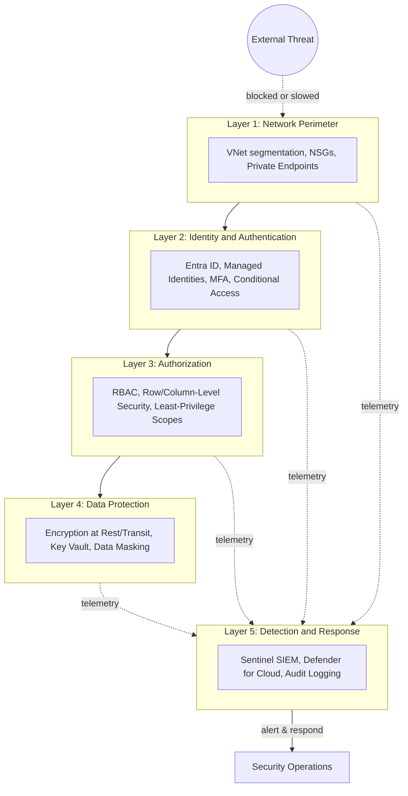
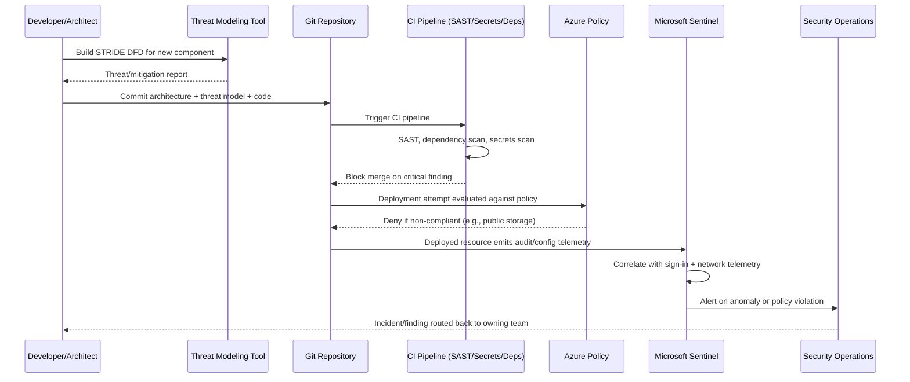
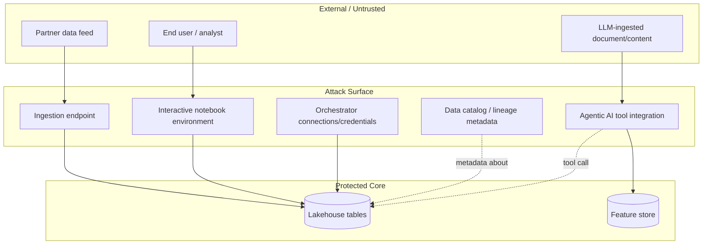
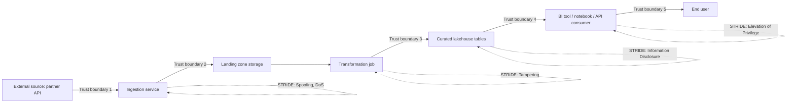

# Security Foundations

> Part of the **Enterprise Data & AI Architecture Handbook** · Phase-10 — Security, Identity & Compliance · Chapter 01.
> Estimated study time: **60 min reading + ~3h labs**.
> **Prerequisite:** read [Networking Fundamentals](../Phase-00/04_Networking_Fundamentals.md) first.

---

## Executive Summary

[Networking Fundamentals](../Phase-00/04_Networking_Fundamentals.md#security) established TLS, mTLS, and network segmentation as the wire-level mechanisms that make service-to-service trust possible. This chapter zooms out from those mechanisms to the discipline that decides *where* and *why* to apply them: security as a first-class architectural concern for data and AI platforms, not a bolt-on review gate before launch. It covers the **CIA triad** (Confidentiality, Integrity, Availability) as the vocabulary for reasoning about what "secure" even means for a given asset; **STRIDE threat modeling** as the concrete technique for systematically enumerating what can go wrong in a specific architecture rather than relying on generic checklists; **defense in depth and least privilege** as the structural principles that limit blast radius when — not if — any single control fails; the **OWASP Top 10**, reinterpreted for data platforms rather than web applications, since injection, broken access control, and insecure design manifest differently in a Spark job or a Databricks workspace than in a REST API; the **attack surface of data platforms** specifically — ingestion endpoints, notebook environments, orchestrators, service principals, and the metadata/catalog layer that most security reviews overlook; and **security in the SDLC**, the shift-left practice of treating security review, threat modeling, and automated scanning as pipeline gates rather than a pre-launch afterthought.

This is the entry-point chapter for **Phase-10 — Security, Identity & Compliance**, which continues with Identity and Access Management with Microsoft Entra ID (Phase-10 Chapter 02), Data Security and Encryption (Chapter 03), Network Security and Zero Trust (Chapter 04), Secrets and Key Management (Chapter 05), Compliance and Regulatory Frameworks (Chapter 06), and Data Privacy and PII Protection (Chapter 07). Every one of those chapters assumes the vocabulary and mental model built here: a reader who cannot explain STRIDE, articulate the difference between authentication and authorization failures, or reason about an attack surface diagram will struggle to evaluate whether a specific IAM policy or encryption scheme actually closes the gap it claims to close.

The bias remains **Azure-primary (~60%)** — Microsoft Defender for Cloud, Microsoft Sentinel, Azure Policy, Microsoft Threat Modeling Tool — **~30% enterprise open source** (OWASP Threat Dragon, OWASP ZAP, Trivy, Semgrep, OpenSSF Scorecard) and **~10% AWS/GCP comparison-only** (AWS Security Hub/GuardDuty, GCP Security Command Center).

**Bottom line:** security is not a feature you add to a finished data platform; it is a property that emerges from architectural decisions made at every layer — ingestion, storage, compute, orchestration, and the metadata fabric that ties them together. An architect who can threat-model a pipeline before it is built, who defaults to least privilege rather than "grant broad access and tighten later," and who treats a security scan failure with the same severity as a broken unit test, prevents the class of incident that a post-hoc penetration test can only ever discover after the damage is architecturally baked in. This chapter gives you the STRIDE-based reasoning tool and the defense-in-depth mental model that every subsequent Phase-10 chapter builds on.

---

## Learning Objectives

By the end of this chapter you will be able to:

1. **Apply the CIA triad** to classify a data asset's security requirements and distinguish confidentiality, integrity, and availability failures from one another.
2. **Run a STRIDE threat-modeling session** against a data pipeline or platform architecture, producing a prioritized list of concrete threats mapped to mitigations.
3. **Design defense-in-depth layering and least-privilege access** for a multi-tier data platform, explaining what each layer protects against and what happens when it alone fails.
4. **Map the OWASP Top 10 onto data-platform-specific failure modes** (notebook injection, over-permissioned service principals, insecure deserialization in custom connectors) rather than treating it as a web-app-only checklist.
5. **Diagram the attack surface of a representative data platform**, identifying ingestion, compute, orchestration, and metadata-layer entry points that generic network diagrams omit.
6. **Embed security gates into the SDLC** (threat-model review, SAST/DAST/dependency scanning, secrets scanning) as automated pipeline stages rather than a manual pre-launch checklist.
7. **Apply security practices on Azure** using Microsoft Defender for Cloud, Sentinel, and Azure Policy, with a defensible comparison to AWS and GCP equivalents.
8. **Defend security architecture decisions** in engineer, staff engineer, architect, and CTO review settings, including trade-offs between security rigor and delivery velocity.

---

## Business Motivation

- **A data breach is disproportionately expensive for data platforms specifically**, because the asset at risk (aggregated, joined, enriched data) is often more sensitive than any single source system — a lakehouse that joins CRM, transaction, and support data creates a richer, more damaging breach target than any one upstream system alone.
- **Regulatory exposure compounds technical risk.** [Compliance and Regulatory Frameworks](#further-reading) (Phase-10 Chapter 06) and [Data Privacy and PII Protection](#further-reading) (Chapter 07) both assume the threat-modeling and defense-in-depth foundation built here; a platform that has not threat-modeled its data flows cannot credibly attest to GDPR/HIPAA/PCI-DSS compliance regardless of paperwork.
- **Security incidents in AI/ML pipelines are a newly material risk class** — prompt injection against an LLM-backed agent with tool access, or a poisoned training dataset, are STRIDE-shaped threats (tampering, spoofing) against a component category that did not exist in the threat models most enterprises wrote five years ago.
- **The cost of fixing a security defect grows by roughly an order of magnitude at each SDLC stage it survives** — a threat-modeling finding caught at design time costs a diagram change; the same class of defect found in a penetration test after launch costs an incident response, a customer notification, and often a regulator conversation.
- **Over-permissioned service principals and shared credentials are the most common root cause of enterprise data breaches**, not zero-day exploits — least-privilege access design is a higher-leverage investment than most advanced detection tooling.
- **Security review that blocks delivery without offering a faster secure path erodes engineering trust and gets bypassed.** A mature security practice provides golden-path templates (pre-approved architecture patterns, pre-scanned base images) that are simultaneously the fastest and the most secure option, rather than security and velocity trading off against each other.

---

## History and Evolution

- **1970s — the Bell-LaPadula and Biba models** formalize confidentiality (no read-up, no write-down) and integrity (no read-down, no write-up) as mathematically precise access-control lattices, the theoretical ancestors of today's mandatory access control systems.
- **1988 — the Morris Worm** is the first large-scale demonstration that a single unpatched vulnerability (a buffer overflow in `fingerd`) can cascade across a shared network, catalyzing the first formal computer emergency response teams (CERT).
- **1999 — Microsoft's STRIDE model** (Spoofing, Tampering, Repudiation, Information Disclosure, Denial of Service, Elevation of Privilege) is developed internally at Microsoft, later published, giving threat modeling a systematic, repeatable taxonomy instead of ad hoc brainstorming.
- **2003 — the OWASP Top 10** is first published, giving web-application security a shared, ranked vocabulary for the most common and damaging vulnerability classes; it is revised roughly every 3-4 years (2007, 2010, 2013, 2017, 2021) as attack patterns evolve.
- **2004 — PCI-DSS** is introduced, the first major cross-industry regulatory standard to mandate specific technical security controls (network segmentation, encryption, access logging) rather than leaving implementation entirely to each organization.
- **2010s — DevSecOps emerges**, extending DevOps's "shift left" philosophy explicitly to security: SAST/DAST scanning, dependency vulnerability scanning, and threat modeling move from a pre-launch gate into the CI/CD pipeline itself.
- **2013-2018 — major breaches (Target 2013, Equifax 2017, Capital One 2019)** repeatedly trace back to the same root causes — unpatched known vulnerabilities, over-permissioned access, and inadequate network segmentation — cementing defense in depth and least privilege as non-negotiable architectural defaults rather than optional hardening.
- **2020 — the SolarWinds supply-chain attack** demonstrates that the build pipeline itself is part of the attack surface, elevating software supply-chain security (SBOMs, signed artifacts, OpenSSF Scorecard) to a first-class SDLC security concern.
- **2021-present — zero trust architecture (NIST SP 800-207) becomes the default enterprise reference model**, explicitly rejecting network-perimeter-based trust in favor of continuous, per-request verification — elaborated in [Network Security and Zero Trust](#further-reading) (Phase-10 Chapter 04).
- **2023-present — LLM and agentic-AI-specific threat classes** (prompt injection, training-data poisoning, excessive agency, insecure tool/plugin integration) enter the OWASP Top 10 for LLM Applications, extending decades-old STRIDE thinking to a genuinely new component category that data and AI platforms must now threat-model explicitly.

---

## Why This Technology Exists

Ad hoc, reactive security — patch after a vulnerability is disclosed, review after a system is built, respond after a breach is detected — does not scale to the complexity and blast radius of a modern enterprise data platform, where a single over-permissioned service principal or an unreviewed ingestion endpoint can expose every downstream consumer of a lakehouse simultaneously. Systematic security practice (threat modeling, defense in depth, least privilege, SDLC-embedded scanning) exists to make security a predictable, repeatable engineering discipline — one that finds and closes gaps *before* an architecture ships, not one that depends on an attacker or an auditor finding them first.

---

## Problems It Solves

- **Unknown, un-enumerated risk** — STRIDE threat modeling turns "we hope this is secure" into an explicit, reviewable list of specific threats and their mitigations, closing the gap between intuition and systematic analysis.
- **Single points of catastrophic failure** — defense in depth ensures that a single control's failure (a misconfigured firewall rule, a leaked credential) does not by itself grant an attacker full access, because subsequent layers still apply.
- **Blast-radius amplification from over-permissioned identities** — least privilege bounds what any single compromised identity (human or service principal) can actually do, directly limiting the damage of any given breach.
- **Late, expensive defect discovery** — SDLC-embedded security gates (threat model review, SAST/DAST, dependency and secrets scanning) catch defects at design and commit time, when they are cheapest to fix, instead of at penetration-test or incident time.
- **Checklist blindness for data-platform-specific risk** — reinterpreting OWASP Top 10 categories for notebooks, orchestrators, and service principals surfaces failure modes that a generic web-application security checklist misses entirely.

---

## Problems It Cannot Solve

- **It cannot make an insecure architectural decision secure after the fact.** Threat modeling and defense in depth are most effective applied at design time; retrofitting them onto a live, already-over-permissioned platform is possible but far more expensive and disruptive than getting the initial design right.
- **It cannot eliminate the human factor.** Phishing, social engineering, and insider risk are only partially mitigated by technical controls; they require complementary organizational measures (security awareness training, background checks, separation of duties) outside this chapter's scope.
- **It cannot guarantee zero vulnerabilities.** No amount of threat modeling or scanning proves the absence of unknown (zero-day) vulnerabilities; the goal is to reduce the *known, enumerable* risk surface and build detection/response capability for what inevitably gets through — not to claim perfect security.
- **It cannot substitute for the identity, encryption, network, and compliance mechanics covered in the rest of Phase-10.** This chapter provides the reasoning framework; [Identity and Access Management](#further-reading) (Chapter 02), [Data Security and Encryption](#further-reading) (Chapter 03), and [Network Security and Zero Trust](#further-reading) (Chapter 04) provide the concrete implementation mechanisms that the framework points to.
- **It cannot resolve the inherent tension between security rigor and delivery velocity by itself.** Governance (§ below) and organizational buy-in are required to make security gates fast enough that teams do not route around them.

---

## Core Concepts

### 1.1 The CIA Triad

The CIA triad is the foundational vocabulary for classifying *what kind* of security failure a given control protects against:

- **Confidentiality** — preventing unauthorized disclosure of data. A confidentiality failure is a breach: a customer PII table exposed to a party without a legitimate need to know, or a Databricks notebook that logs a raw secret to console output visible to a broader audience than intended.
- **Integrity** — preventing unauthorized or accidental modification of data or systems. An integrity failure is silent and often more damaging than a confidentiality failure: a tampered ETL job that silently corrupts financial figures, or a poisoned training dataset that biases a model's predictions without triggering any alert.
- **Availability** — ensuring authorized users can access data and systems when needed. An availability failure is a denial-of-service condition, whether malicious (a DDoS attack against an ingestion API) or accidental (a runaway query exhausting a shared warehouse's concurrency slots).

Every control in this chapter and the rest of Phase-10 maps to one or more of these three properties — and a mature architect explicitly states *which* property a proposed control protects, because a confidentiality control (encryption at rest) does nothing for an integrity threat (a compromised pipeline silently rewriting values), and vice versa.

### 1.2 STRIDE Threat Modeling

STRIDE decomposes "what can go wrong" into six concrete, enumerable threat categories, each mapped to the CIA property (and beyond) it violates:

| STRIDE category | Violates | Data-platform example |
|---|---|---|
| **S**poofing | Authentication | An attacker presents a stolen service-principal credential to impersonate a legitimate ETL job and read a restricted table. |
| **T**ampering | Integrity | A compromised CI/CD pipeline injects a malicious transformation step that silently corrupts a subset of records before they reach a downstream report. |
| **R**epudiation | Non-repudiation (auditability) | A shared service account performs a destructive `DROP TABLE`, and no per-user audit trail exists to attribute the action to a specific individual. |
| **I**nformation Disclosure | Confidentiality | An overly permissive catalog/lineage tool exposes column-level sample data (including PII) to any authenticated user, regardless of row-level entitlements on the underlying table. |
| **D**enial of Service | Availability | An unauthenticated ingestion endpoint accepts unbounded-size payloads, letting an attacker exhaust compute or storage quota and starve legitimate workloads. |
| **E**levation of Privilege | Authorization | A Databricks notebook running under a workspace-admin-scoped cluster policy lets any user with notebook access execute arbitrary code with admin-level permissions. |

The practical technique: draw a **data-flow diagram (DFD)** of the architecture (external entities, processes, data stores, trust boundaries), then systematically ask, for each element crossing a trust boundary, "which of the six STRIDE categories applies here, and what is the concrete mitigation?" This is covered as a worked example in **Internal Working** below and produces the artifact used in **End-to-End Data Flow**.

### 1.3 Defense in Depth and Least Privilege

**Defense in depth** is the principle that no single control should be the only thing standing between an attacker and a sensitive asset — security is layered (network, identity, application, data) so that any one layer's failure is contained rather than catastrophic. For a data platform this typically means: network segmentation (VNets, private endpoints) as the outer layer, identity and authentication (Entra ID, managed identities) as the next, authorization (RBAC, row/column-level security) as the next, and encryption plus audit logging as the innermost layer protecting the data itself even if every outer layer is bypassed.

**Least privilege** is the complementary principle governing what each layer's controls actually grant: every identity (human or service principal) should hold the minimum permissions required for its function, for the minimum duration necessary, and nothing more "just in case." In practice this means scoped, resource-level RBAC roles rather than subscription-wide Owner/Contributor grants; time-bound, just-in-time elevated access (Privileged Identity Management) rather than standing admin rights; and per-pipeline, per-environment service principals rather than one shared credential used everywhere.

The relationship between the two: defense in depth limits *how far* a single breach can spread; least privilege limits *how much damage* a single compromised identity can do at any one layer. Neither substitutes for the other — a platform with strong network segmentation but subscription-Owner-scoped service principals is not actually defended in depth, because the identity layer alone grants full blast radius.

### 1.4 OWASP Top 10 for Data Systems

The [OWASP Top 10](https://owasp.org/www-project-top-ten/) was written for web applications, but every category maps onto a concrete data-platform failure mode:

| OWASP category | Data-platform manifestation |
|---|---|
| Broken Access Control | Over-permissioned service principals; missing row/column-level security letting a user query beyond their entitlement; shared warehouse credentials with no per-user isolation. |
| Cryptographic Failures | Data at rest in ADLS Gen2 without customer-managed keys where regulation requires them; secrets embedded in notebook code or job configuration instead of Key Vault. |
| Injection | Untrusted user input concatenated into a dynamically-built SQL query in a self-service BI tool; unsanitized parameters passed into a Spark SQL string. |
| Insecure Design | A pipeline architecture with no threat model at all — the defect is not a coding bug but the absence of a security-aware design process. |
| Security Misconfiguration | A publicly-readable ADLS Gen2 container; a Databricks workspace with public IP access enabled when private endpoints were the intended architecture. |
| Vulnerable and Outdated Components | An unpatched CVE in a PySpark library or a Docker base image used across dozens of pipeline jobs, silently inherited by every downstream deployment. |
| Identification and Authentication Failures | Long-lived, unrotated service-principal secrets; lack of MFA on privileged human accounts with data-platform admin rights. |
| Software and Data Integrity Failures | An unsigned, unverified artifact pulled into a CI/CD pipeline from a public package registry; a training dataset ingested without provenance verification. |
| Security Logging and Monitoring Failures | No audit trail correlating a data-access event to a specific human identity, or logs retained for too short a window to support an incident investigation. |
| Server-Side Request Forgery (SSRF) | A custom data connector that fetches a URL supplied in pipeline configuration without validating it does not point at an internal metadata endpoint or private IP range. |

The takeaway for architects: OWASP is not "a web team's checklist" — every category has a direct, often under-recognized analogue in the ingestion, transformation, and orchestration layers of a data platform, and a security review that only checks the web-facing API misses most of the actual attack surface.

### 1.5 The Attack Surface of Data Platforms

A data platform's attack surface is broader than its network diagram suggests, because the surfaces most security reviews focus on (public endpoints, VNet boundaries) are only part of the story:

- **Ingestion endpoints** — event hubs, file-drop landing zones, and API-based ingestion accept data (and, if unvalidated, malicious payloads) from outside the platform's trust boundary.
- **Notebook and interactive compute environments** — a Databricks or Synapse notebook with broad cluster permissions is effectively a remote-code-execution surface for anyone who can attach to it, whether or not they have legitimate business need for that level of access.
- **Orchestrator credentials and connections** — an ADF linked service or Airflow connection storing a broadly-scoped credential is a high-value target: compromising the orchestrator's credential store can expose every system it connects to.
- **Service principals and managed identities** — the identity fabric binding pipelines to resources is frequently the least-audited part of a platform; a service principal created once and never reviewed accumulates permissions over time ("permission creep") well beyond its original need.
- **The metadata/catalog layer** — a data catalog or lineage tool (Microsoft Purview, OpenMetadata) that exposes column names, sample values, or business glossary terms without respecting the underlying table's entitlements is an information-disclosure surface that most network-level security reviews never examine.
- **CI/CD pipelines and build agents** — as the SolarWinds incident demonstrated, the build pipeline itself, including third-party actions/tasks and dependency registries, is part of the attack surface, not merely a delivery mechanism external to it.
- **LLM and agentic-AI components** — prompt injection via ingested documents, tool/plugin integrations with excessive agency, and vector-store poisoning are attack-surface categories specific to the AI-platform layer that this chapter's STRIDE technique must now explicitly include.

### 1.6 Security in the SDLC (Shift Left)

Embedding security into the software/data development lifecycle means treating it as a series of automated, continuous gates rather than a single pre-launch review:

- **Design phase** — a threat-modeling session (STRIDE against a DFD) is a required artifact before implementation begins for any new pipeline or platform component with a non-trivial trust boundary.
- **Commit/PR phase** — static application security testing (SAST, e.g., Semgrep, Bandit for Python) and secrets scanning (e.g., GitHub secret scanning, Gitleaks) run automatically on every pull request, blocking merge on critical findings.
- **Build phase** — dependency/software-composition-analysis scanning (e.g., Trivy, Dependabot, GitHub Advanced Security) checks for known CVEs in libraries and container base images before an artifact is published.
- **Pre-deployment** — dynamic application security testing (DAST, e.g., OWASP ZAP) against a staging environment catches runtime configuration issues that static analysis cannot see.
- **Post-deployment** — continuous posture management (Microsoft Defender for Cloud, Azure Policy compliance scanning) and SIEM-based detection (Microsoft Sentinel) provide ongoing verification that the deployed state has not drifted from the reviewed, secure design.

The governing discipline, directly analogous to [DataOps Foundations](../Phase-09/01_DataOps_Foundations.md#core-concepts)'s "deployment success is not data correctness" insight: **a pipeline that passes functional CI/CD tests can still ship an exploitable security defect**, because security gates test a structurally different property (the absence of specific threat classes) than functional tests do — and a mature SDLC treats a failed security gate with the same blocking severity as a failed unit test, not as an optional advisory.

---

## Internal Working

A representative STRIDE threat-modeling session, from architecture proposal to mitigation backlog:

1. **Draw the data-flow diagram (DFD)** — external entities (upstream source systems, end users), processes (ingestion service, transformation job, API), data stores (landing zone, lakehouse tables, feature store), and explicit trust boundaries (public internet ↔ VNet, VNet ↔ restricted subnet, application ↔ database).
2. **Enumerate every element crossing a trust boundary** — each arrow crossing a trust-boundary line is a candidate threat surface requiring analysis; elements entirely within one trust zone receive lighter scrutiny.
3. **Apply STRIDE systematically to each crossing element** — for each, ask which of the six STRIDE categories plausibly applies (not every category applies to every element; an internal batch job with no external input rarely has a meaningful Spoofing threat, for example).
4. **Rate each identified threat** by likelihood and impact (a simple High/Medium/Low matrix is sufficient for most sessions; a formal DREAD or CVSS score is used for higher-stakes reviews).
5. **Assign a concrete mitigation to each threat** — a specific control (e.g., "require managed identity authentication, disable shared key access on this storage account") rather than a vague aspiration ("improve security").
6. **Record the session as a living document**, versioned alongside the architecture it describes, updated whenever the architecture changes materially — a threat model written once and never revisited is stale within months.
7. **Feed unmitigated High-severity threats into the sprint backlog as blocking work**, not an optional backlog item competing indefinitely with feature work — this is the concrete mechanism that prevents threat modeling from becoming a documentation exercise with no enforcement.
8. **Re-run the relevant subset of the exercise on significant architecture changes** (a new ingestion source, a new trust boundary, a new external integration) rather than only at initial design time.

---

## Architecture

Each layer is designed to function even if the layer outside it is compromised: authorization (Layer 3) still applies if network segmentation (Layer 1) is bypassed via a legitimate but compromised credential; encryption (Layer 4) still protects data at rest even if authorization is misconfigured, provided key access is itself properly scoped. Detection (Layer 5) spans every layer, because a purely preventive architecture with no detection capability cannot answer "did anyone actually get through?"

---

## Components

- **Threat model repository** — a version-controlled store (alongside architecture diagrams, per [Architecture Decision Records](../Phase-01/03_Architecture_Decision_Records.md)) of STRIDE DFDs and their identified threats/mitigations, kept current as architecture evolves.
- **Identity provider (Microsoft Entra ID)** — the authentication foundation for every subsequent layer; elaborated in [Identity and Access Management](#further-reading) (Chapter 02).
- **Policy engine (Azure Policy, OPA)** — enforces security-configuration guardrails (mandatory encryption, disallowed public network access) automatically rather than relying on manual review.
- **SAST/DAST/dependency-scanning tooling (Semgrep, OWASP ZAP, Trivy, Dependabot)** — the automated SDLC gates described in §1.6.
- **Secrets management (Azure Key Vault)** — elaborated in [Secrets and Key Management](#further-reading) (Chapter 05); referenced here as the component that closes the "hardcoded credential" attack surface.
- **SIEM/XDR (Microsoft Sentinel, Microsoft Defender for Cloud)** — aggregates security telemetry across every layer for detection and incident response.
- **Cloud security posture management (CSPM)** — continuously assesses deployed configuration against security baselines (CIS benchmarks, Azure Security Benchmark), flagging drift from the reviewed, secure design.

---

## Metadata

- **Threat classification metadata** — each identified threat should be tagged with its STRIDE category, CIA property violated, severity, and mitigation status (open/mitigated/accepted-risk), enabling portfolio-level reporting across many pipelines' threat models.
- **Asset sensitivity classification** — every data asset (table, container, feature store) should carry a sensitivity label (public/internal/confidential/restricted) that downstream security controls (DLP, conditional access) key off of, rather than every control re-deriving sensitivity independently.
- **Ownership metadata** — every service principal, managed identity, and data asset should have a documented, discoverable owner, so a security review or incident has an unambiguous point of accountability.
- **Scan-result metadata** — SAST/DAST/dependency-scan findings should be persisted with severity, affected component, and remediation status, enabling trend analysis of the organization's security debt over time, not just a pass/fail badge per build.
- **Audit and access-review metadata** — periodic access reviews (who has access to what, and why) should be logged as a first-class metadata artifact supporting both incident investigation and compliance attestation.

---

## Storage

- **Threat model and security documentation** live in the same version-controlled repository as the architecture they describe, ensuring they are reviewed and updated as part of the same pull-request workflow as the code.
- **Scan-result and audit-log storage** (Azure Log Analytics, a dedicated security data lake) retains SAST/DAST findings, access logs, and Sentinel alerts for the duration required by the organization's incident-response and compliance retention policy — often 1-7 years depending on regulatory scope (elaborated in [Compliance and Regulatory Frameworks](#further-reading), Chapter 06).
- **Encrypted-at-rest data stores** (ADLS Gen2 with Microsoft-managed or customer-managed keys) are the innermost storage layer this chapter's defense-in-depth model protects; concrete encryption mechanics are covered in [Data Security and Encryption](#further-reading) (Chapter 03).
- **Secrets never live in the same storage as code or configuration** — Key Vault (or an equivalent managed secret store) is the only sanctioned location for credentials, connection strings, and API keys.

---

## Compute

- **Threat-modeling and security-review sessions** are a people/process activity requiring no dedicated compute, but the tooling that supports them (Microsoft Threat Modeling Tool, OWASP Threat Dragon) runs on standard developer workstations.
- **SAST/DAST scanning compute** typically runs within CI/CD runners (GitHub Actions, Azure DevOps agents); SAST is lightweight (static analysis of source), while DAST requires a running staging deployment to scan against, and is correspondingly more resource- and time-intensive.
- **SIEM/detection compute** (Microsoft Sentinel) is a managed, consumption-billed service ingesting and correlating telemetry at scale; cost scales with log-ingestion volume, motivating deliberate log-source and retention-tier decisions (see **Cost Optimization** below).
- **Privileged/administrative compute access** should route through just-in-time, time-bound elevation (Privileged Identity Management activating a role for a fixed window) rather than standing administrative sessions.

---

## Networking

- **Trust boundaries drawn in the threat model must correspond to actual network segmentation** — a DFD trust boundary that exists only on paper, with no matching VNet/subnet/NSG enforcement, provides no real protection; this chapter's DFDs are the design input that [Network Security and Zero Trust](#further-reading) (Chapter 04) implements concretely.
- **Private endpoints for PaaS data services** (ADLS Gen2, Key Vault, Azure SQL) remove the public-internet attack surface for those services entirely, forcing traffic through the VNet where NSG and firewall controls apply.
- **East-west (internal) traffic deserves the same scrutiny as north-south (external) traffic** — the [Networking Fundamentals](../Phase-00/04_Networking_Fundamentals.md#security) ADR on service-mesh mTLS is a direct example of applying zero-trust reasoning to traffic that a perimeter-only model would have implicitly trusted.
- **Ingestion endpoints exposed to external partners** require explicit rate limiting, payload-size validation, and authentication (API keys, mTLS, or OAuth) — an unauthenticated or unbounded ingestion endpoint is a Denial-of-Service and Tampering threat simultaneously.

---

## Security

Applying this chapter's own principles reflexively — securing the security tooling and process itself:

- **Access to the threat-model repository and scan-result data is itself access-controlled and audited** — a threat model is a reconnaissance map of the platform's weaknesses; it must not be broadly readable by anyone without a legitimate need.
- **The CI/CD pipeline's security-scanning stages must not be bypassable by the teams they check** — a developer with the ability to disable or skip a required SAST gate on their own pull request defeats the control's purpose; gate configuration should require a separate, security-team-owned approval to modify.
- **Security tooling supply chain matters** — a compromised or unverified SAST/DAST tool, or a malicious CI/CD marketplace action, is itself an attack vector (directly analogous to the SolarWinds incident); pin tool versions, verify signatures, and prefer vetted, first-party or well-audited third-party integrations.
- **Separation of duties for security exceptions** — a request to accept a known vulnerability as residual risk should require sign-off from someone other than the engineer who introduced it, avoiding a conflict of interest in the risk-acceptance decision.
- **The threat-modeling facilitator role should rotate or include a security-team member**, not always be run by the same engineer proposing the architecture, to avoid the natural bias of self-reviewing one's own design.

---

## Performance

- **Threat modeling has negligible runtime performance cost** — it is a design-time activity; its "cost" is calendar time in the design phase, which is recovered many times over by defects avoided later.
- **SAST scanning should complete in the fast-feedback CI stage** (typically under a few minutes for most codebases), mirroring the [DataOps Foundations](../Phase-09/01_DataOps_Foundations.md#performance) principle that slow feedback trains engineers to batch risky changes; incremental/differential scanning (only changed files) keeps this fast as the codebase grows.
- **DAST scans are inherently slower** (they exercise a running application) and are typically run against a staging environment on a schedule or pre-release gate rather than on every commit, to avoid becoming a CI bottleneck.
- **Encryption and TLS overhead is generally negligible on modern hardware** with AES-NI and hardware-accelerated TLS; the historical "encryption is slow" objection to encrypting more data by default rarely holds up under actual measurement today.

---

## Scalability

- **Threat-model templates for common architecture patterns** (a standard ingestion-to-lakehouse pipeline, a standard REST API pattern) let a security team scale threat-modeling coverage across dozens of teams without a bespoke session for every single pipeline — analogous to the golden-path CI/CD templates in [DataOps Foundations](../Phase-09/01_DataOps_Foundations.md#design-patterns).
- **Centralized policy-as-code enforcement (Azure Policy)** scales security-configuration guardrails across an entire tenant without relying on every team remembering every rule manually.
- **A tiered security-review model** — lightweight self-service checklists for low-risk projects, full facilitated STRIDE sessions for high-risk/high-blast-radius projects — lets a security team's limited headcount scale across a growing number of platform teams without becoming a bottleneck.
- **SIEM ingestion and detection scale by design in a managed service (Sentinel)**, but cost scales with log volume, requiring deliberate log-source prioritization as the platform and its telemetry volume grow (see **Cost Optimization**).

---

## Fault Tolerance

- **Assume any single control will eventually fail** — defense in depth exists precisely because no single layer (a firewall rule, an access-control list, a scanning tool) is assumed to be infallible; the architecture's safety property depends on the layers collectively, not any one of them individually.
- **Detection must not depend on the same control that might fail** — logging and SIEM alerting should be independent of the systems they monitor, so a compromised system cannot simply disable its own audit trail.
- **Incident-response runbooks must be rehearsed, not just documented** — a security incident is the wrong time to discover that the documented runbook is stale or that key personnel do not know their role; periodic tabletop exercises validate the plan before it is needed for real.
- **Break-glass access procedures** (a rarely-used, heavily-audited emergency access path) provide fault tolerance for the access-control system itself — if the normal privileged-access workflow (PIM, approval chains) is unavailable during an incident, a documented, logged break-glass path prevents "we followed the process correctly" from becoming "and therefore nobody could respond to the outage."

---

## Cost Optimization

- **Prioritize threat-modeling effort by blast radius, not uniformly** — a full facilitated STRIDE session for every low-risk internal tool is not a good use of a security team's limited time; reserve deep sessions for high-consumer-count, regulated, or high-sensitivity systems, and use lightweight self-service checklists elsewhere.
- **Tune SIEM log-ingestion sources deliberately** — ingesting every possible log source at full verbosity into Microsoft Sentinel is the single most common driver of unexpectedly large security-tooling bills; prioritize sources that feed actual detection rules over "ingest everything just in case."
- **Use free/open-source tooling (OWASP ZAP, OWASP Threat Dragon, Semgrep community rules, Trivy) for baseline coverage**, reserving paid/premium tooling for capabilities (advanced threat intelligence, managed detection and response) that genuinely require it.
- **Automate what is repetitive, reserve human review for what requires judgment** — SAST/dependency scanning is cheap to run on every commit; facilitated threat-modeling sessions are expensive in senior engineer time and should be reserved for architecturally significant changes.
- **Worked FinOps example:** An organization ingests verbose diagnostic logs from every Azure resource (network flow logs, full DNS query logs, verbose application logs) into Microsoft Sentinel at a blended rate of roughly $2.50/GB analyzed, generating approximately 800 GB/day (≈24 TB/month) at full verbosity, for a bill of roughly **$60,000/month**. An audit finds that fewer than 15% of ingested log volume ever contributes to a firing detection rule or an investigation. Re-scoping ingestion to prioritized, detection-relevant sources (identity sign-in logs, resource-management audit logs, key security-relevant subnets' flow logs) and routing the remaining high-volume, low-signal sources (verbose DNS, full network flow logs) to a cheaper long-term-retention basic tier (~$0.10-0.50/GB, queryable but not analyzed by default) instead of full analytics ingestion reduces the analytics-tier volume to roughly 4 TB/month: 4,000 GB × $2.50 ≈ **$10,000/month** in analytics ingestion, plus roughly 20 TB × $0.30 ≈ $6,000/month in basic-tier storage, for a total of approximately **$16,000/month** — a reduction of roughly $44,000/month (~73%), while *improving* detection quality because analysts are no longer sifting low-signal volume for the alerts that matter.

---

## Monitoring

- **Security-scan pass/fail rate and finding trend** — track SAST/DAST/dependency-scan findings over time per team and per severity, the security equivalent of the DORA-style metrics used in [DataOps Foundations](../Phase-09/01_DataOps_Foundations.md#monitoring).
- **Mean time to remediate (MTTR) for security findings**, tiered by severity — critical findings should have a defined, enforced remediation SLA (e.g., 24-72 hours), not an indefinite backlog entry.
- **Threat-model coverage** — what percentage of production pipelines/services have a current (not stale) threat model, tracked as a portfolio-level security-maturity metric.
- **Sign-in and access-anomaly monitoring** (Entra ID sign-in logs, Conditional Access reports) — impossible-travel sign-ins, unusual access-pattern anomalies, and repeated failed authentication attempts, all correlated in Sentinel.

---

## Observability

- **Unified security telemetry correlation** — the goal is a single pane (Microsoft Sentinel, or an equivalent SIEM) correlating identity sign-in events, network flow logs, resource-configuration changes, and application-level audit logs, so an analyst can answer "what happened, in what order, across every layer" for a single incident.
- **Structured, correlated audit logging** — every privileged action (a role assignment change, a Key Vault access, a schema-altering DDL statement) should emit a structured log entry with a consistent identity and correlation ID, enabling a single query to reconstruct an incident timeline.
- **Detection rules mapped explicitly to STRIDE/threat-model findings** — each identified threat from the threat-modeling process (§1.2) should ideally have a corresponding detection rule verifying the mitigation is actually working in production, not just documented as implemented.
- **Alert fatigue is itself a security risk** — an analyst desensitized by high false-positive volume will eventually miss a genuine alert; tuning detection rules for precision is as important as tuning them for recall.

### Operational Response Playbook

| Signal | Detection Query/Check | Remediation |
|---|---|---|
| Impossible-travel or anomalous sign-in | Entra ID Identity Protection risk-detection alert ingested into Sentinel | Trigger automated Conditional Access response (require MFA re-verification or block session); notify the user and their manager; if confirmed malicious, force password/credential reset and review the account's recent activity for unauthorized actions. |
| Critical SAST/dependency-scan finding merged to main | CI/CD security-gate alert (Semgrep/Dependabot critical severity on a merged commit, indicating the gate was bypassed or misconfigured) | Immediately open a P1 remediation ticket; audit why the gate did not block the merge (misconfiguration vs. approved exception); patch or roll back the affected component; review branch-protection settings. |
| Publicly-exposed storage account or over-permissioned service principal detected | Microsoft Defender for Cloud / Azure Policy compliance scan flagging a non-compliant resource against the security baseline | Immediately restrict public network access or scope down the identity's role assignment; determine how the misconfiguration occurred (manual change vs. IaC drift) and add a preventive Azure Policy `deny` assignment to stop recurrence. |

---

## Governance

- **Security review as a mandatory, not optional, gate for new architecture** — a defined threshold (new external integration, new trust boundary, handling of regulated data) should require a documented threat model before production deployment, enforced by architecture review board process, not left to individual team discretion.
- **A central security team owns baseline policy; individual teams own implementation within it** — mirroring the platform-engineering golden-path model, security policy-as-code (Azure Policy, OPA) should be centrally authored and automatically enforced, while teams retain ownership of how their specific pipeline meets the baseline.
- **Risk-acceptance decisions are explicit, time-bound, and reviewed** — an identified threat that will not be immediately mitigated should be formally accepted (by someone with the authority to accept that risk, not the engineer who found it convenient to defer), documented, and revisited on a defined schedule rather than silently forgotten.
- **Security metrics are reported at the same cadence and forum as reliability/delivery metrics** — treating security posture as a standing agenda item in architecture and platform reviews (not a once-a-year audit topic) keeps it a continuously prioritized concern.

---

## Trade-offs

| Dimension | Heavier security rigor (full STRIDE sessions, strict gates) | Lighter security rigor (lightweight checklists) |
|---|---|---|
| Risk exposure | Lower — systematically enumerated and mitigated | Higher — relies on ad hoc judgment |
| Delivery velocity (steady state) | Slower per-change upfront, but fewer late-stage security-driven rework cycles | Feels faster initially, risk of costly late discovery or incident-driven rework |
| Senior security staff time required | Higher — facilitated sessions need experienced facilitators | Lower — self-service checklists scale without expert bottleneck |
| Suitability | Regulated, high-blast-radius, or externally-facing systems | Low-risk, internal-only, low-blast-radius experimental systems |
| Failure mode if under-invested | N/A (safer default) | Unmitigated threats surface as real incidents or audit findings |

The general enterprise guidance: reserve full-rigor STRIDE sessions and strict multi-gate SDLC enforcement for systems handling regulated data, external integrations, or significant blast radius; apply lightweight, templated checklists elsewhere, provided the lighter tier is an explicit, governed decision rather than a default born of simply never getting around to a proper review.

---

## Decision Matrix

| Scenario | Recommended Approach |
|---|---|
| New platform component handling regulated (PII/PCI/PHI) data or with external network exposure | Full facilitated STRIDE session before implementation; mandatory SAST/DAST/dependency gates; security-team sign-off required before production deployment |
| Internal-only analytics tool, low sensitivity, single team | Lightweight self-service threat-modeling checklist; automated SAST/dependency scanning only; no mandatory facilitated session |
| New AI/agentic component with tool-calling or external-content ingestion | STRIDE session explicitly extended to prompt-injection and excessive-agency threat classes; treat as high-blast-radius by default until proven otherwise |
| Legacy system with no existing threat model, not scheduled for near-term rework | Prioritize a lightweight retrofit threat model over waiting for a full rewrite; document known-accepted risks explicitly rather than leaving them undocumented |
| Third-party/vendor data connector or CI/CD marketplace action | Require SBOM/provenance verification and a dedicated supply-chain risk review before adoption, regardless of the connector's own perceived sensitivity |

---

## Design Patterns

- **Threat-model-as-code artifact** — store the STRIDE DFD and findings as a structured, version-controlled file (not only a slide deck), reviewable in the same pull request as the architecture change it describes.
- **Golden-path secure architecture templates** — pre-approved, pre-threat-modeled reference architectures (a standard private-endpoint-only ingestion pattern, a standard least-privilege service-principal template) that teams adopt rather than re-deriving security posture from scratch each time.
- **Policy-as-code guardrails (preventive controls)** — Azure Policy `deny` assignments that make an insecure configuration (public storage, unencrypted resources) structurally impossible to deploy, rather than relying on review to catch it after the fact.
- **Defense-in-depth by default in reference architectures** — every golden-path template should span at least network, identity, authorization, and data-protection layers, not rely on any single layer.
- **Just-in-time privileged access (PIM)** — standing administrative rights are the exception requiring explicit justification, not the default state of any account.

---

## Anti-patterns

- **"We'll do the security review before launch"** — treating threat modeling as a pre-launch gate rather than a design-time input means findings surface too late to influence architecture cheaply, and under deadline pressure the review gets skipped or rubber-stamped.
- **Shared, broadly-scoped service principals reused across many pipelines** — a single compromised credential then grants access far beyond what any individual pipeline actually needs.
- **Security scanning configured to warn but never block** — a SAST/dependency gate that only produces an ignorable warning provides the illusion of a control without the actual enforcement.
- **Threat models written once and never updated** — an architecture diagram and its threat model drift apart as the system evolves, until the documented "trust boundaries" no longer match the deployed reality.
- **Treating the OWASP Top 10 as a web-application-only concern** — skipping data-platform-specific attack-surface analysis (notebooks, orchestrator credentials, catalog metadata) because "we don't have a public web app."
- **Security team as sole gatekeeper for every change, with no self-service tier** — creates a bottleneck that incentivizes teams to route around security review entirely for anything perceived as low-risk (correctly or not).

---

## Common Mistakes

- Conflating authentication (who are you) with authorization (what are you allowed to do), leading to designs that verify identity correctly but still grant excessive access.
- Assuming network segmentation alone (a VNet, an NSG) is sufficient defense, without an identity and authorization layer behind it — the "hard shell, soft center" architecture that fails completely once the perimeter is breached.
- Running SAST/DAST scans without ever triaging or fixing the findings, producing a large, ignored backlog that erodes the tool's credibility as a real control.
- Granting broad permissions "temporarily" during initial development and never revisiting them once the pipeline reaches production.
- Threat-modeling the application layer while ignoring the CI/CD pipeline and its third-party dependencies, missing the supply-chain attack surface entirely.
- Treating a clean penetration-test report as proof of security, rather than as a snapshot of what a specific tester found in a specific time window using a specific methodology.

---

## Best Practices

- Run a STRIDE threat-modeling session at design time for every new component with a non-trivial trust boundary, and revisit it on significant architecture changes.
- Default every new identity (human or service principal) to the minimum viable permission scope, expanding only with documented justification, never the reverse.
- Make security-gate failures (critical SAST/dependency findings, secrets-scanning hits) block merge/deploy by default, with an explicit, reviewed exception process for accepted risk.
- Instrument detection for every mitigation your threat model claims exists — an undetected control failure is indistinguishable from no control at all.
- Extend the OWASP Top 10 and STRIDE analysis explicitly to the data platform's own specific components (notebooks, orchestrators, catalogs, AI agents), not only its externally-facing APIs.
- Provide a fast, self-service, lightweight review tier for low-risk changes so teams are not incentivized to bypass security process for the majority of lower-stakes work.

---

## Enterprise Recommendations

- Establish a central security architecture function that owns golden-path secure reference architectures and policy-as-code guardrails, freeing individual platform teams to build on a pre-hardened foundation rather than re-deriving security posture independently.
- Mandate SDLC-embedded security gates (SAST, dependency scanning, secrets scanning) as a non-negotiable CI/CD stage across the enterprise, with a defined, tiered exception-approval process for genuinely blocked edge cases.
- Fund a tiered threat-modeling practice: full facilitated sessions for high-blast-radius systems, templated self-service checklists for the long tail of lower-risk internal tools.
- Track security posture with the same executive visibility as reliability and delivery metrics — a quarterly security-maturity scorecard (threat-model coverage, MTTR by severity, policy-compliance percentage) alongside DORA metrics.
- Explicitly extend security governance to AI/agentic components now, rather than waiting for an incident to force the issue — prompt injection and excessive-agency threats are a present, not future, risk category for any platform integrating LLM-based tools.

---

## Azure Implementation

- **Microsoft Threat Modeling Tool** — a free, structured tool for building STRIDE-based data-flow diagrams and generating a threat/mitigation report, integrable into architecture documentation workflows.
- **Microsoft Defender for Cloud** — continuous cloud security posture management (CSPM) and workload protection, surfacing misconfigurations (public storage, missing encryption, excessive permissions) against the Azure Security Benchmark, with a Secure Score tracking overall posture over time.
- **Microsoft Sentinel** — cloud-native SIEM/SOAR, ingesting sign-in logs, resource-audit logs, network flow logs, and application telemetry into a unified workspace with built-in and custom detection analytics rules, and automated response playbooks (Logic Apps-based).
- **Azure Policy** — policy-as-code enforcement of security baselines (deny public network access, require encryption, require specific tags/owners) at subscription or management-group scope, preventing non-compliant resources from being deployed rather than only flagging them after the fact.
- **GitHub Advanced Security / Azure DevOps security scanning** — SAST (CodeQL), dependency scanning (Dependabot), and secrets scanning integrated directly into the pull-request workflow, blocking merge on critical findings.
- **Microsoft Entra ID Privileged Identity Management (PIM)** — just-in-time, time-bound activation of privileged roles, eliminating standing administrative access as the default state.

---

## Open Source Implementation

- **OWASP Threat Dragon** — a free, open-source STRIDE threat-modeling tool with diagramming and a structured threat/mitigation report, a direct alternative to Microsoft Threat Modeling Tool for teams standardized on open tooling.
- **OWASP ZAP** — the leading open-source DAST tool, scanning running web applications and APIs for common vulnerability classes as a pre-release pipeline stage.
- **Semgrep** — open-source SAST with a large community rule set, integrable directly into CI as a fast, incremental static-analysis gate.
- **Trivy** — open-source vulnerability scanner for container images, filesystems, and IaC configuration (Terraform, Kubernetes manifests), commonly used as the container/dependency-scanning stage in CI/CD (elaborated in [Containers with Docker](../Phase-09/05_Containers_with_Docker.md#security)).
- **Gitleaks / TruffleHog** — open-source secrets-scanning tools detecting committed credentials in source history, run both in CI and as a periodic full-repository audit.
- **OpenSSF Scorecard** — an automated, open-source supply-chain risk score for open-source dependencies, quantifying practices like signed releases, branch protection, and vulnerability-disclosure process for a given upstream project.

---

## AWS Equivalent (comparison only)

| Capability | Azure | AWS |
|---|---|---|
| Cloud security posture management | Microsoft Defender for Cloud | AWS Security Hub |
| SIEM/detection | Microsoft Sentinel | Amazon GuardDuty + Security Lake |
| Policy-as-code enforcement | Azure Policy | AWS Config Rules / Service Control Policies |
| Privileged/just-in-time access | Entra ID PIM | AWS IAM Identity Center + temporary session credentials |
| Threat modeling tooling | Microsoft Threat Modeling Tool | No first-party equivalent; teams typically use OWASP Threat Dragon on AWS too |

**Advantages of AWS:** GuardDuty's ML-based anomaly detection is tightly integrated with native AWS telemetry (CloudTrail, VPC Flow Logs) with minimal configuration; Security Hub aggregates findings from a broad first-party and partner ecosystem. **Disadvantages:** AWS lacks a first-party STRIDE-specific threat-modeling tool comparable to Microsoft's; achieving Sentinel-equivalent cross-cloud/cross-SaaS correlation typically requires more manual log-source integration work in AWS-native tooling. **Migration strategy:** the STRIDE methodology, threat-model artifacts, and SDLC gate design are fully portable; the specific detection-rule and policy-as-code implementations require rework against AWS-native APIs and log formats. **Selection criteria:** choose AWS-native security tooling only when the broader compute/storage estate is AWS-primary; choose Defender for Cloud/Sentinel for Azure-primary or hybrid estates where unified cross-Microsoft-365/Azure telemetry is valuable.

---

## GCP Equivalent (comparison only)

| Capability | Azure | GCP |
|---|---|---|
| Cloud security posture management | Microsoft Defender for Cloud | Google Security Command Center |
| SIEM/detection | Microsoft Sentinel | Google Chronicle / Security Operations |
| Policy-as-code enforcement | Azure Policy | Organization Policy Service + Config Validator |
| Privileged/just-in-time access | Entra ID PIM | Identity-Aware Proxy + temporary elevated access via IAM Conditions |
| Threat modeling tooling | Microsoft Threat Modeling Tool | No first-party equivalent; OWASP Threat Dragon commonly used |

**Advantages of GCP:** Chronicle's petabyte-scale, flat-pricing log-retention model can be materially cheaper than consumption-based SIEM pricing at very high log volumes; Security Command Center's asset-inventory-centric model gives strong visibility into GCP-native resource sprawl. **Disadvantages:** GCP's security tooling ecosystem has fewer third-party integrations than Sentinel's, and, like AWS, lacks a first-party STRIDE threat-modeling tool. **Migration strategy:** methodology and process are portable; detection-rule logic, log schemas, and policy-as-code definitions require GCP-specific rework. **Selection criteria:** choose GCP-native tooling for GCP-primary estates, particularly where Chronicle's flat-rate retention economics matter at very high log volume; choose Defender for Cloud/Sentinel for Azure-primary or Microsoft-365-integrated estates.

---

## Migration Considerations

- **Inventory existing identities and permissions before migrating enforcement** — introducing strict least-privilege policy enforcement onto an existing platform without first auditing current (often over-broad) permissions risks breaking legitimate workflows; audit first, then tighten incrementally.
- **Run new security gates in warn-only/audit mode before hard-blocking** — exactly as with data-quality gates in [DataOps Foundations](../Phase-09/01_DataOps_Foundations.md#migration-considerations), introduce SAST/DAST/policy enforcement in a non-blocking, reporting-only mode first, to size the existing findings backlog before flipping to a hard gate that could halt all deployment activity.
- **Prioritize threat-modeling retrofits by blast radius** — when adopting formal threat modeling on an existing estate, start with externally-facing, regulated-data, or high-consumer-count systems rather than working through the inventory alphabetically.
- **Migrate credentials to managed identities before revoking legacy shared-key access** — a phased cutover (dual-support period, monitoring for lingering shared-key usage, then disablement) avoids an abrupt migration that breaks pipelines still depending on the old credential path.
- **Expect a transitional period of mixed maturity** — some pipelines will be threat-modeled and gated, others not yet; track and report this explicitly as a security-maturity roadmap rather than presenting a false picture of uniform coverage.

---

## Mermaid Architecture Diagrams

This diagram makes explicit what a network-only diagram omits: the notebook environment, orchestrator credentials, catalog metadata layer, and agentic-AI tool integration are each independent entry points into the protected core, each requiring its own STRIDE analysis rather than being covered implicitly by "the platform is inside the VNet."

---

## End-to-End Data Flow

Each numbered trust boundary in this flow is a candidate for a distinct STRIDE analysis pass, per the **Internal Working** methodology: boundary 1 (external partner to ingestion) is dominated by Spoofing and Denial-of-Service concerns; boundary 3 (transformation to curated tables) is dominated by Tampering (a compromised job silently altering values); boundary 4 (curated tables to consumer) is dominated by Information Disclosure (does the consumer's entitlement match what the tool actually returns) and Elevation of Privilege (can a low-privilege user reach admin-level actions through the consuming tool).

---

## Real-world Business Use Cases

- A healthcare data platform threat-modeled its ingestion pipeline before onboarding a new partner lab-results feed, discovering the partner's API had no payload-size limit; adding one closed a Denial-of-Service threat before the integration went live, rather than discovering it during a production incident during peak lab-result volume.
- A retail analytics team discovered, via a routine least-privilege access review, that a service principal created for a one-time historical data backfill three years earlier still held broad Storage Blob Data Contributor access across the entire storage account; revoking it closed a long-standing, unnoticed over-permissioned identity.
- A financial services firm's SDLC security gate caught a critical dependency vulnerability (a widely-publicized deserialization CVE) in a shared internal library the week the CVE was disclosed, because dependency scanning was already wired into every consuming pipeline's CI — teams without that gate patched reactively, weeks later, after manual audit.

---

## Industry Examples

- **Microsoft** originated STRIDE internally in the late 1990s specifically because ad hoc security review did not scale across its product portfolio, and has since open-sourced the underlying tooling (Microsoft Threat Modeling Tool) for broader industry use.
- **Netflix's** internal security-engineering practice popularized "paved road" secure-by-default infrastructure templates, directly analogous to this chapter's golden-path design pattern, explicitly to make the secure option also the fastest option for product teams.
- **The SolarWinds Orion breach (2020)** is widely referenced across the industry as the case that permanently elevated software-supply-chain security (signed builds, SBOM, dependency provenance) from a niche concern to a mandatory SDLC security gate at most large enterprises.

---

## Case Studies

**Case: Over-permissioned service principal enables lateral movement.** A retailer's data platform used a single service principal, originally scoped for a one-off migration project, for dozens of subsequent ETL pipelines "because it already had the access needed." When a CI/CD pipeline's build log inadvertently exposed the service principal's credential in a debug log accessible to a broader internal audience than intended, the credential's accumulated broad Contributor-level access across multiple resource groups allowed lateral movement well beyond the original pipeline's legitimate scope.

**Root cause:** absence of least-privilege identity design (one shared, ever-expanding-scope credential instead of per-pipeline, narrowly-scoped identities) combined with a secrets-scanning gap (the CI log output was not scanned for credential patterns before being retained).

**Remediation:** the organization migrated to per-pipeline managed identities scoped to only the specific resources each pipeline required, added log-output secrets scanning (Gitleaks-style pattern matching) as a mandatory CI stage, and instituted a quarterly access review specifically targeting service principals older than six months with no documented owner or renewed justification.

---

## Hands-on Labs

1. **Lab 1 — Build a STRIDE threat model.** Using OWASP Threat Dragon or Microsoft Threat Modeling Tool, diagram a simple three-tier data pipeline (external source → ingestion → lakehouse → BI consumer) and identify at least two threats per STRIDE category, with a concrete mitigation for each.
2. **Lab 2 — Add SAST and secrets scanning to a CI pipeline.** Integrate Semgrep and Gitleaks into a GitHub Actions workflow for a sample Python/PySpark repository; configure the pipeline to fail the build on any critical finding, and intentionally introduce a vulnerable pattern (e.g., a hardcoded credential) to verify the gate catches it.
3. **Lab 3 — Least-privilege service principal design.** Provision two Azure service principals for a sample two-stage pipeline (ingest, transform), each scoped via RBAC to only its required resource, and verify (by attempting an out-of-scope operation) that each is correctly denied access outside its scope.
4. **Lab 4 — Container image vulnerability scanning.** Run Trivy against a sample Docker image used for a data-processing job, identify at least one known CVE in a base image or dependency, and remediate by upgrading the base image or pinned dependency version.
5. **Lab 5 — Configure Defender for Cloud Secure Score improvement.** In an Azure sandbox subscription, review the Microsoft Defender for Cloud Secure Score recommendations for a sample storage account and Databricks workspace, and remediate at least two flagged misconfigurations (e.g., enabling private endpoints, disabling public blob access).

---

## Exercises

1. Draw a STRIDE threat model for an ingestion API that accepts file uploads from an external partner, and identify which category (Spoofing, Tampering, DoS) is the highest-priority threat and why.
2. Explain, in your own words, why defense in depth and least privilege are complementary rather than substitutable principles.
3. Pick three OWASP Top 10 categories and describe a concrete data-platform-specific (not web-application) failure mode for each.
4. List the attack-surface elements of a data platform that a typical network security diagram omits, and explain why each matters.
5. Design a tiered SDLC security-gate strategy (design/commit/build/pre-deploy/post-deploy) for a team currently doing no automated security scanning at all, sequencing which gate to add first and why.

---

## Mini Projects

- Build a small internal "threat model template library": create reusable STRIDE DFD templates (as diagrams-as-code, e.g., Mermaid or a structured YAML) for three common architecture patterns (ingestion API, batch ETL pipeline, interactive notebook environment), each with a pre-populated set of common threats and mitigations that teams can adapt rather than starting from a blank page.
- Implement a lightweight CI/CD security-gate pipeline (GitHub Actions) combining Semgrep (SAST), Trivy (container/dependency scanning), and Gitleaks (secrets scanning) against a sample repository, with a summary report artifact and a hard-fail on critical findings.
- Build a simple least-privilege access-review script that queries Azure RBAC role assignments for service principals older than a configurable age with no activity in the last N days, flagging them as candidates for review or revocation.

---

## Capstone Integration

Take the DataOps CI/CD pipeline built in [DataOps Foundations](../Phase-09/01_DataOps_Foundations.md#capstone-integration)'s capstone and extend it with a full security layer: add a STRIDE threat model for the pipeline's ingestion and transformation stages as a versioned artifact alongside its code; wire SAST, dependency, and secrets scanning into the existing CI pipeline as additional mandatory gates; replace any shared or broadly-scoped credentials with per-stage, least-privilege managed identities; and configure Microsoft Defender for Cloud and a basic Sentinel workspace to surface configuration drift and anomalous access against the pipeline's resources. This becomes the security foundation that the rest of Phase-10 (identity, encryption, network zero trust, secrets management, compliance, privacy) builds upon.

---

## Interview Questions

1. Explain the CIA triad and give a concrete example of a failure in each category for a data platform.
2. What is STRIDE, and how would you use it to threat-model a new data ingestion pipeline?
3. What is the difference between defense in depth and least privilege, and why do you need both?
4. Pick two OWASP Top 10 categories and explain how they manifest differently in a data platform versus a typical web application.

## Staff Engineer Questions

5. How would you design an SDLC security-gate strategy that catches critical vulnerabilities early without materially slowing down a team's delivery velocity?
6. Describe how you would identify and remediate an over-permissioned, long-lived service principal in a production data platform.
7. How would you extend STRIDE threat modeling to cover an agentic AI component with external tool-calling capability?

## Architect Questions

8. How would you architect a tiered threat-modeling and security-review process that scales across dozens of teams without making a central security team a bottleneck?
9. What is your strategy for retrofitting least-privilege access controls onto an existing platform that currently uses broad, shared service-principal credentials, without breaking production pipelines?
10. How does your security architecture ensure that a threat model's claimed mitigations are actually verified as working in production, not merely documented as implemented?

## CTO Review Questions

11. What security-maturity metrics would you present to the board to demonstrate the organization's actual risk posture, beyond "we passed our last audit"?
12. If a regulator or customer asked to prove that a specific production system was threat-modeled and its critical findings mitigated before launch, what evidence would your process produce?
13. What is the single highest-leverage security investment you would prioritize this year, and how would you justify its cost against the incidents and regulatory exposure it prevents?

---

### Architecture Decision Record (ADR-0141): Mandatory STRIDE Threat Modeling Gate for New Data Platform Components

- **Context.** The data platform's architecture review process included an informal, inconsistent security review — some teams engaged security early, others only after implementation, and at least one production incident (an over-permissioned service principal, see **Case Studies** above) traced directly to the absence of a systematic threat-modeling step before launch.
- **Decision.** Require a documented STRIDE threat model (using a standard DFD template) as a mandatory artifact in the architecture review process for any new component that introduces a new trust boundary, external integration, or handles regulated data; lighter-weight self-service checklists are permitted for low-risk, internal-only components below a defined blast-radius threshold.
- **Consequences.** *Positive:* systematic, comparable security review coverage across teams; earlier, cheaper defect discovery at design time; an auditable trail of security review for regulatory and customer due-diligence requests. *Negative:* added calendar time to the design phase for in-scope components; requires a trained facilitator pool (an initial investment in the security team's capacity), risking a bottleneck if not paired with the tiered self-service model. *Neutral:* some existing (already-shipped) components lack a retrofit threat model; these are prioritized by blast radius for retroactive coverage rather than blocked from operating.
- **Alternatives considered.** *No formal requirement, security review at team discretion* (rejected: the status quo that produced the over-permissioned service-principal incident); *mandatory full STRIDE session for every component regardless of size* (rejected: does not scale against a limited security-facilitator pool and would create exactly the bottleneck that drives teams to bypass review); *post-launch penetration testing only, no design-time review* (rejected: defects found at that stage are materially more expensive to fix and have already had a launch window of exposure).

---

## References

- Shostack, Adam. *Threat Modeling: Designing for Security*. Wiley.
- Microsoft Learn. "STRIDE threat model" and "Microsoft Threat Modeling Tool documentation."
- OWASP Foundation. "OWASP Top 10 (2021)." owasp.org.
- OWASP Foundation. "OWASP Top 10 for Large Language Model Applications." owasp.org.
- NIST SP 800-207. "Zero Trust Architecture."
- Anderson, Ross. *Security Engineering: A Guide to Building Dependable Distributed Systems*. Wiley.
- Microsoft Learn. "Microsoft Defender for Cloud documentation" and "Microsoft Sentinel documentation."

## Further Reading

- [Networking Fundamentals](../Phase-00/04_Networking_Fundamentals.md) — the TLS/mTLS and network-segmentation mechanics this chapter's defense-in-depth model builds on.
- [DataOps Foundations](../Phase-09/01_DataOps_Foundations.md) — the SDLC and CI/CD gate model that this chapter's security gates extend with security-specific checks.
- [Architecture Decision Records](../Phase-01/03_Architecture_Decision_Records.md) — the documentation discipline used to record threat models and security decisions.
- Phase-10 Chapter 02 (Identity and Access Management with Entra) — the concrete IAM implementation of this chapter's least-privilege principle.
- Phase-10 Chapter 03 (Data Security and Encryption) — the concrete encryption mechanics referenced throughout this chapter's data-protection layer.
- Phase-10 Chapter 04 (Network Security and Zero Trust) — the concrete network implementation of this chapter's trust-boundary model.
- Phase-10 Chapter 06 (Compliance and Regulatory Frameworks) — how this chapter's threat-modeling and governance practices satisfy specific regulatory attestations.

---

[Back to Phase-10 README](../../.github/prompts/Phase-10/README.md) - [Handbook README](../../README.md) - [Roadmap](../../ROADMAP.md)
