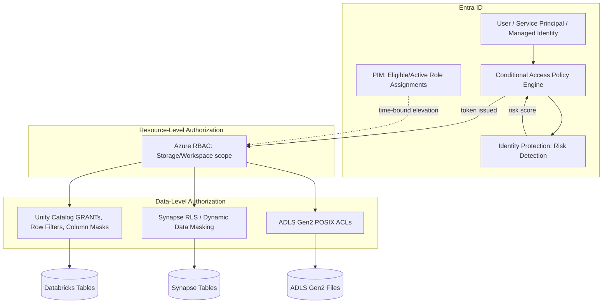
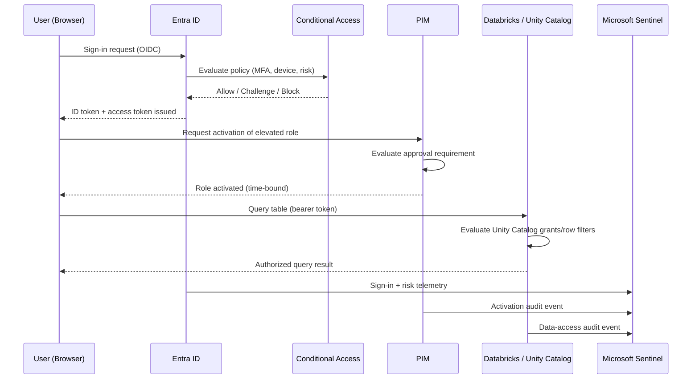
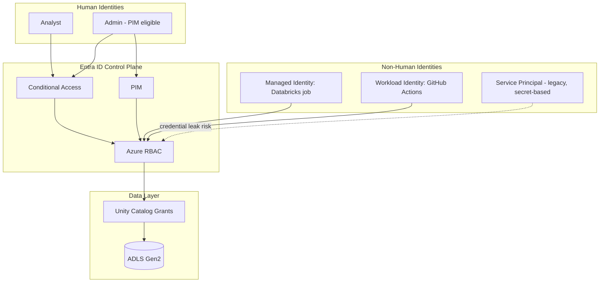
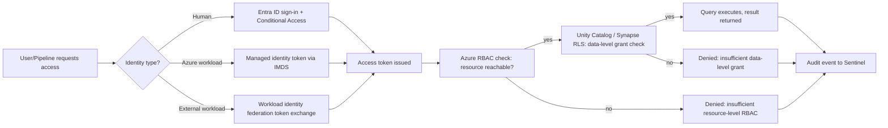

# Identity and Access Management with Entra

> Part of the **Enterprise Data & AI Architecture Handbook** · Phase-10 — Security, Identity & Compliance · Chapter 02.
> Estimated study time: **75 min reading + ~5h labs**.
> **Prerequisite:** read [Security Foundations](01_Security_Foundations.md) first.

---

## Executive Summary

[Security Foundations](01_Security_Foundations.md#core-concepts) established least privilege and defense in depth as principles and STRIDE as the reasoning tool for finding gaps in an architecture. This chapter is where those principles stop being aspirational and become enforceable: **Microsoft Entra ID** (formerly Azure Active Directory) is the identity control plane that every subsequent Phase-10 chapter — encryption key access, network zero trust, secrets management, compliance attestation — assumes is correctly configured. Get identity wrong, and every other control in the stack inherits that weakness; a perfectly encrypted table behind a flawlessly segmented network is still fully exposed to anyone holding an over-permissioned, unrotated credential.

This chapter covers the protocol foundations (**OAuth 2.0**, **OIDC**, **SAML**) that every modern authentication flow builds on and why they solve different problems; **RBAC vs. ABAC** as two structurally different authorization models and when each is the right tool; **Privileged Identity Management (PIM)** as the mechanism that turns "least privilege" from a policy statement into an enforced, time-bound reality; **Conditional Access** as the policy engine that makes authentication context-aware (device compliance, location, risk signal) rather than a single static password check; **managed identities and workload identity federation** as the concrete replacement for the long-lived, leak-prone service-principal secrets that caused the over-permissioned-credential incident in [Security Foundations' Case Study](01_Security_Foundations.md#case-studies); and the specific, concrete mechanics of wiring all of this into **Storage, Databricks, and Synapse** access control — the exact systems a data platform actually needs to secure.

The bias remains **Azure-primary (~60%)** — Entra ID, Entra ID PIM, Conditional Access, managed identities, workload identity federation — **~30% enterprise open source** (Keycloak, HashiCorp Vault identity brokering, OPA for ABAC policy evaluation) and **~10% AWS/GCP comparison-only** (AWS IAM/IAM Identity Center, GCP Cloud Identity/Workload Identity Federation).

**Bottom line:** identity is the perimeter that actually matters in a cloud-native, zero-trust data platform — not the network boundary, which [Network Security and Zero Trust](#further-reading) (Phase-10 Chapter 04) will show is now assumed breached by design. An architect who can explain precisely why a managed identity eliminates an entire CVE class that a stored service-principal secret cannot, who defaults new access grants to time-bound PIM activation rather than standing role assignment, and who can trace exactly which Conditional Access policy would (or would not) have stopped a given anomalous sign-in, is the one who actually closes the access-control gaps that [Security Foundations](01_Security_Foundations.md#case-studies)'s STRIDE exercise identifies on paper.

---

## Learning Objectives

By the end of this chapter you will be able to:

1. **Explain OAuth 2.0, OIDC, and SAML** and correctly choose between them for a given authentication integration.
2. **Design RBAC and ABAC authorization models** for a data platform, and articulate when attribute-based policies are necessary versus when role-based assignment suffices.
3. **Configure Privileged Identity Management (PIM)** to convert standing administrative access into just-in-time, time-bound, approval-gated activation.
4. **Design Conditional Access policies** that incorporate device compliance, location, and sign-in risk signals into authentication decisions.
5. **Replace service-principal secrets with managed identities and workload identity federation**, eliminating an entire class of credential-leak risk.
6. **Configure fine-grained access control on ADLS Gen2, Databricks (Unity Catalog), and Synapse**, including RBAC, ACLs, and row/column-level security where each applies.
7. **Apply IAM practices on Azure** using Entra ID, PIM, and Conditional Access, with a defensible comparison to AWS IAM and GCP Cloud Identity.
8. **Defend identity architecture decisions** in engineer, staff engineer, architect, and CTO review settings, including the trade-offs between access friction and operational agility.

---

## Business Motivation

- **Compromised credentials remain the single most common initial-access vector in enterprise breaches**, ahead of software exploits — the [Security Foundations](01_Security_Foundations.md#case-studies) case study (a leaked, over-permissioned service-principal credential) is not an edge case; it is the modal incident, and IAM investment is the highest-leverage mitigation available.
- **Standing administrative access is a standing liability**, not a convenience — every account with permanent elevated rights is a permanent target whether or not it is ever misused, and its mere existence expands audit scope and breach blast radius.
- **Regulatory frameworks explicitly mandate access governance controls.** [Compliance and Regulatory Frameworks](#further-reading) (Phase-10 Chapter 06) requires demonstrable least-privilege enforcement, periodic access reviews, and segregation of duties — controls that are implemented, not merely described, through Entra ID RBAC, PIM, and access reviews.
- **Credential-management overhead is a direct, quantifiable operational cost.** Manually rotating service-principal secrets across dozens of pipelines, and the incident response required when one leaks, is measurably more expensive than the one-time engineering cost of migrating to managed identities.
- **Federated identity is what makes multi-cloud and hybrid estates governable at all** — without workload identity federation, every cross-cloud integration (a GitHub Actions pipeline deploying to Azure, an AWS workload calling an Azure API) either duplicates credential-management risk or requires a bespoke, unaudited trust relationship.
- **AI agents with tool-calling access are a new, high-velocity identity-management surface.** An agentic pipeline that authenticates to a data platform needs the exact same least-privilege, time-bound, auditable identity model as a human user — arguably more urgently, since an agent can execute actions faster than a human can review them.

---

## History and Evolution

- **1990s-2000s — LDAP and on-premises Active Directory** establish centralized, hierarchical directory services as the enterprise identity standard, but are fundamentally designed for a perimeter-bound, domain-joined-machine world.
- **2005 — SAML 2.0** is ratified, giving enterprises a mature, XML-based standard for browser-based single sign-on (SSO) across organizational boundaries, still widely used for enterprise SaaS federation today.
- **2007-2012 — OAuth 1.0, then OAuth 2.0 (RFC 6749, 2012)** emerge from the API-economy need for delegated authorization (a third-party app accessing a user's data without holding the user's password), decoupling *authorization* from *authentication* for the first time as a distinct concern.
- **2014 — OpenID Connect (OIDC)** is published as a thin identity layer on top of OAuth 2.0, adding a standardized, JWT-based identity token (the piece OAuth 2.0 alone never defined), becoming the dominant modern federated-authentication protocol.
- **2013-2017 — Azure Active Directory (Azure AD)** matures from a directory-sync companion product into Microsoft's primary cloud identity platform, adding conditional access, identity protection, and B2B/B2C capabilities well beyond on-premises AD's scope.
- **2018 — Zero Trust Architecture principles** (later formalized in NIST SP 800-207, 2020) explicitly reposition identity as the primary security perimeter, directly motivating Conditional Access and continuous verification as first-class controls rather than a one-time login gate.
- **2019-2021 — Managed identities and workload identity federation mature** on Azure, AWS (IRSA), and GCP, closing the long-standing gap where every cloud workload needed a manually managed, rotatable credential simply to call another cloud service.
- **2022-2023 — Azure AD is rebranded Microsoft Entra ID**, part of a broader Microsoft Entra product family (Entra Permissions Management, Entra Verified ID, Entra Workload ID) explicitly framing identity as its own governed product surface spanning human, workload, and (increasingly) machine/agent identities.
- **2023-present — Privileged Identity Management and Conditional Access adoption accelerates** as regulatory and cyber-insurance requirements increasingly mandate demonstrable just-in-time privileged access and phishing-resistant MFA as baseline controls, not optional hardening.
- **2024-present — Entra Agent ID and workload identity for AI agents** emerge as Microsoft's answer to the identity-management gap for autonomous, tool-calling AI agents — extending decades of human/service identity practice to a genuinely new principal type.

---

## Why This Technology Exists

An enterprise data platform cannot rely on network location or a single shared password to decide who can read a customer table, run a Databricks job as a privileged identity, or call a downstream API — the actors involved (human analysts, CI/CD pipelines, orchestrators, AI agents) are numerous, distributed, and increasingly non-human, and a compromised credential for any one of them can expose everything that credential can reach. Identity and Access Management exists to make "who is this, and precisely what are they allowed to do, right now, under these conditions" a centrally governed, auditable, and enforceable question — answered the same way whether the requester is a human in a browser, a service principal in a pipeline, or an autonomous agent invoking a tool — rather than a patchwork of per-system passwords and ungoverned trust.

---

## Problems It Solves

- **Credential sprawl and leak risk** — managed identities and workload identity federation eliminate the need to generate, store, and rotate long-lived secrets for the majority of service-to-service authentication scenarios.
- **Standing privileged access** — PIM converts permanent admin rights into justified, time-bound, approval-gated activations, closing the [Security Foundations](01_Security_Foundations.md#core-concepts) least-privilege gap at the identity layer specifically.
- **Static, context-blind authentication** — Conditional Access makes sign-in decisions context-aware (device compliance, network location, real-time risk score), catching threats a static password check cannot.
- **Inconsistent authorization logic duplicated per application** — centralizing RBAC/ABAC policy in Entra ID and downstream systems (Unity Catalog, Synapse) avoids every application team re-implementing (and inevitably getting subtly wrong) its own access-control logic.
- **Federation and single sign-on complexity** — OIDC/SAML give a standardized, interoperable way to extend enterprise identity to SaaS applications and partner organizations without bespoke per-integration authentication code.

---

## Problems It Cannot Solve

- **It cannot substitute for correct authorization policy design.** Entra ID and PIM enforce whatever roles and scopes are assigned; if a role itself is defined too broadly, the identity platform will faithfully enforce an overly permissive policy — the discipline of least-privilege *role design* remains a human responsibility.
- **It cannot fully prevent social engineering or phishing**, though phishing-resistant authentication methods (FIDO2 security keys, Windows Hello for Business) substantially raise the bar; user security awareness remains a necessary complementary control.
- **It cannot retroactively fix a system that does not integrate with it.** A legacy application authenticating against a local, unfederated user store gains none of Entra ID's benefits until it is actually integrated (via OIDC/SAML or an application proxy).
- **It cannot eliminate the need for periodic access reviews.** Even a well-designed RBAC model accumulates unused, stale, or overly broad grants over time ("permission creep"); IAM tooling supports access reviews but does not perform the human judgment of deciding what to revoke.
- **It cannot replace the encryption, network, and compliance controls covered elsewhere in Phase-10.** IAM answers "who can request this"; it does not itself protect data at rest ([Data Security and Encryption](#further-reading), Chapter 03) or in transit ([Network Security and Zero Trust](#further-reading), Chapter 04).

---

## Core Concepts

### 2.1 OAuth 2.0, OIDC, and SAML — Three Protocols, Three Different Jobs

These three protocols are frequently confused because they overlap in usage but solve genuinely different problems:

- **OAuth 2.0** is an **authorization** delegation framework: it lets a user grant a third-party application scoped access to a resource (e.g., "this app can read my calendar") without sharing the user's actual credential, via access tokens issued by an authorization server. OAuth 2.0 by itself says nothing about *who the user is* — it only governs what a token bearer is allowed to do.
- **OpenID Connect (OIDC)** is a thin **authentication** layer built on top of OAuth 2.0, adding a standardized **ID token** (a signed JWT containing verified identity claims: subject, issuer, expiry). OIDC is what lets an application answer "who logged in" reliably, which OAuth 2.0 alone does not provide.
- **SAML 2.0** is an older, XML-based protocol that bundles both authentication and authorization-relevant attribute assertions into a single signed XML document, historically dominant for enterprise browser-based SSO to SaaS applications and still required by many legacy enterprise SaaS integrations.

**Practical rule of thumb:** use OIDC for new application authentication (it is simpler, JSON/JWT-based, and has first-class mobile/SPA support); use OAuth 2.0 scopes for API authorization; use SAML only where an existing enterprise SaaS integration requires it. Entra ID supports all three as an identity provider, but new internal application development should default to OIDC + OAuth 2.0.

### 2.2 RBAC vs. ABAC

- **Role-Based Access Control (RBAC)** grants permissions via role assignment: a principal (user, group, service principal) is assigned a role (e.g., *Storage Blob Data Reader*) scoped to a resource (a specific storage account, resource group, or subscription). RBAC is simple to reason about and audit, and is the correct default for the majority of access-control scenarios.
- **Attribute-Based Access Control (ABAC)** extends RBAC with conditions evaluated against resource or request attributes at access-check time (e.g., "grant Blob Reader access, but only to blobs tagged `classification=internal`, and only between 06:00-20:00 UTC"). ABAC is strictly more expressive than RBAC but harder to audit, since the effective permission set is only knowable by evaluating the condition against a specific request rather than reading a static role assignment list.
- **When to use which:** default to RBAC for resource-level access (a pipeline's managed identity needs *Storage Blob Data Contributor* on a specific container — a role assignment fully expresses this). Reserve ABAC conditions for genuinely attribute-dependent requirements that RBAC's resource-scoping cannot express (blob-tag-based conditional access, time-of-day restrictions) — Azure RBAC conditions (a constrained form of ABAC) support exactly this on Storage.
- For **table/row/column-level authorization inside a data platform** (as opposed to resource-level access to the storage account itself), the appropriate mechanism is usually the data platform's native fine-grained access control (Unity Catalog grants, Synapse row-level security), not Entra ID ABAC — see §2.5.

### 2.3 Privileged Identity Management (PIM)

PIM converts a standing role assignment into an **eligible** assignment that must be actively activated, for a limited duration, before it grants any actual access:

- **Eligible vs. active assignment** — a user is *eligible* for a role (e.g., Storage Account Contributor) but holds no active permission until they explicitly activate it, typically requiring a business justification and, for higher-risk roles, multi-factor re-authentication or a named approver's sign-off.
- **Time-bound activation** — an activated role expires automatically after a configured window (commonly 1-8 hours), after which the principal reverts to holding no elevated access, eliminating the "forgot to revoke" failure mode of manual privilege grants.
- **Approval workflows** — high-risk roles (Global Administrator, Owner on production subscriptions) can require a named approver to review and approve each activation request, creating an auditable, per-use justification trail.
- **Access reviews** — PIM includes scheduled, recurring access reviews requiring role assignees (or their manager) to explicitly reconfirm continued need, automatically flagging or removing assignments that go unconfirmed — the concrete mechanism that prevents the permission creep described in [Security Foundations](01_Security_Foundations.md#governance).

PIM should apply to **every** privileged role in a production data platform — Global Administrator, Owner/Contributor on production resource groups, Databricks workspace admin, and Unity Catalog metastore admin — not only Entra ID directory roles.

### 2.4 Conditional Access

Conditional Access is Entra ID's policy engine for making authentication and session decisions based on real-time context rather than a static password check alone:

- **Signals evaluated:** user/group membership, device compliance state (managed and healthy vs. unmanaged), network location (trusted named location vs. anonymous/unfamiliar), application being accessed, and real-time sign-in risk (from Entra ID Protection's ML-based risk detection: impossible travel, leaked-credential match, anomalous token use).
- **Controls enforced:** require MFA, require a compliant/hybrid-joined device, block access entirely, require a password change, or restrict session behavior (block download, require app-enforced restrictions) via Conditional Access session controls.
- **Policy composition:** policies are combined (implicit AND across all matching policies), so a single sign-in attempt can be simultaneously subject to a "require MFA for all admin roles" policy and a "block legacy authentication protocols" policy — architects must reason about the *combined* effect, not any single policy in isolation.
- **Common baseline policies for a data platform:** require MFA for all users; require MFA and a compliant device for any Global Administrator or Privileged Role activation; block legacy (non-modern) authentication protocols entirely (a common bypass vector for MFA); require a compliant device for direct access to the Databricks/Synapse control plane from outside the corporate network.

### 2.5 Managed Identities, Workload Identity Federation, and Service Principals

- **Service principal** — the generic Entra ID representation of a non-human identity (an application registration's identity within a specific tenant), traditionally authenticated via a client secret or certificate that must be manually created, stored securely, and rotated — the exact long-lived-credential risk that the [Security Foundations](01_Security_Foundations.md#case-studies) case study illustrates.
- **Managed identity** — an Entra ID identity automatically created and lifecycle-managed by Azure for a specific resource (a Databricks workspace, an Azure Function, a VM). A **system-assigned** managed identity is tied 1:1 to its resource's lifecycle (deleted when the resource is deleted); a **user-assigned** managed identity is a standalone resource that can be attached to multiple compute resources, useful when several resources need the exact same permission set. Critically, **Azure manages the credential entirely** — no secret is ever visible to or stored by the application, eliminating the leak vector by construction.
- **Workload identity federation** — extends the managed-identity model to workloads *outside* Azure (a GitHub Actions pipeline, an AWS Lambda function, a Kubernetes pod) by establishing a trust relationship between an external OIDC-issuing identity provider and an Entra ID application, letting the external workload exchange its own short-lived OIDC token for an Entra ID access token — with no secret ever stored in either system.
- **Practical rule:** any Azure-hosted compute resource should use a managed identity by default; any external CI/CD platform or non-Azure workload should use workload identity federation; a service-principal client secret should be the last resort, reserved only for the narrow set of scenarios where neither option is technically supported, and even then rotated on a strict, automated schedule via Key Vault.

### 2.6 Access to Storage, Databricks, and Synapse — Concrete Mechanics

- **ADLS Gen2 (Storage)** — access is governed by a layered combination of Azure RBAC (coarse-grained, container/account-level: *Storage Blob Data Reader/Contributor/Owner*) and POSIX-style **ACLs** (fine-grained, directory/file-level, required for scenarios needing different permissions on subfolders within the same container, such as per-department landing zones in a shared data lake).
- **Databricks (Unity Catalog)** — Unity Catalog provides a three-level namespace (catalog.schema.table) with SQL-standard `GRANT`/`REVOKE` semantics at every level, plus row filters and column masks for fine-grained data-level security; Unity Catalog identities federate directly from Entra ID (via SCIM provisioning), so a Databricks group membership change in Entra ID propagates automatically without a separate Databricks-native user-management step.
- **Synapse Analytics** — dedicated SQL pools and serverless SQL support native T-SQL `GRANT`/`DENY` plus **row-level security (RLS)** predicates and **dynamic data masking**, layered on top of Entra ID authentication for the connection itself; Synapse workspace-level access (who can create/manage pipelines and pools) is governed separately via Azure RBAC on the Synapse workspace resource.
- **The common pattern across all three:** Entra ID governs *authentication* (who is this) and *coarse-grained resource access* (can this identity reach the storage account/workspace at all) uniformly; each data platform then layers its own *fine-grained, data-level* authorization (ACLs, Unity Catalog grants, RLS) on top — an architect must configure both layers, since a correct Entra ID role assignment alone does not imply correct row/column-level entitlements within the data platform itself.

---

## Internal Working

A representative Entra ID authentication and authorization flow for a user querying a Unity-Catalog-governed Databricks table:

1. **User authenticates to Entra ID** via a browser SSO flow (OIDC authorization code flow), presenting credentials evaluated against any applicable Conditional Access policies (MFA requirement, device compliance check).
2. **Entra ID evaluates sign-in risk** (via Identity Protection) and Conditional Access policy conditions; if risk is elevated or a policy condition fails, the flow is blocked or challenged (step-up MFA) before a token is issued.
3. **Entra ID issues an ID token and access token** to the Databricks workspace, asserting the user's verified identity and any relevant group memberships as token claims.
4. **Databricks/Unity Catalog resolves the user's effective grants** by combining their Entra ID group memberships (synced via SCIM) with Unity Catalog's own `GRANT` statements at the catalog/schema/table level, plus any row filter or column mask policies applicable to that table.
5. **The user's query is authorized (or denied) at the table/row/column level** based on the resolved Unity Catalog permissions — a step entirely independent of, and layered on top of, the Entra ID authentication that already succeeded in steps 1-3.
6. **If the query requires access to underlying ADLS Gen2 storage**, Unity Catalog's storage credential (itself a managed identity, not a user credential) performs the actual storage-layer read, meaning the querying user never directly holds or needs storage-account-level RBAC permissions — Unity Catalog mediates and audits the access.
7. **The full chain is logged** — Entra ID sign-in logs, Databricks/Unity Catalog audit logs, and (if configured) Azure Storage diagnostic logs — enabling an end-to-end audit trail from "who signed in" to "which specific row/column did they read," ingestible into Microsoft Sentinel per [Security Foundations](01_Security_Foundations.md#observability).

---

## Architecture

Authentication (top layer) and Conditional Access risk evaluation happen once per session; resource-level RBAC (middle layer) gates whether the identity can reach the platform at all; data-level authorization (bottom layer) is evaluated per query/request and is where row/column-level entitlements actually live — a correctly configured top layer with a misconfigured bottom layer still leaks data, and vice versa.

---

## Components

- **Microsoft Entra ID tenant** — the central identity store for users, groups, service principals, and managed identities across the organization.
- **Conditional Access policies** — the context-aware authentication policy engine described in §2.4.
- **Entra ID Identity Protection** — ML-based sign-in and user risk detection feeding Conditional Access risk-based policies.
- **Privileged Identity Management (PIM)** — just-in-time role activation and access-review engine described in §2.3.
- **Managed identities / workload identity federation** — the credential-free authentication mechanism described in §2.5.
- **Unity Catalog** — Databricks' unified governance layer providing fine-grained, cross-workspace data access control.
- **Azure RBAC** — the resource-scope authorization layer applied uniformly across Storage, Databricks workspaces, and Synapse.
- **SCIM provisioning** — the protocol synchronizing Entra ID group membership into Databricks/Unity Catalog and other downstream SaaS/PaaS identity stores.

---

## Metadata

- **Role-assignment metadata** — every RBAC role assignment should be traceable to a request/justification and an approver, not just a raw "who has what" list, supporting both incident investigation and access-review efficiency.
- **PIM activation history** — every privileged-role activation (who, when, why, approved by whom, duration) is retained as an auditable metadata trail, directly satisfying the audit evidence Governance requires.
- **Sign-in and risk-detection metadata** — Entra ID sign-in logs (location, device, risk score, applied Conditional Access policies) are the raw metadata feeding both real-time policy decisions and post-hoc investigation.
- **Group and application-registration ownership metadata** — every security group and app registration used for access control should have a documented owner, avoiding orphaned groups whose membership nobody is actively reviewing.
- **Unity Catalog/Synapse grant metadata** — the effective grant set (who can access which catalog/schema/table, and under which row filter/mask) should be queryable as a first-class metadata artifact for access reviews, not reconstructed manually from scattered `GRANT` statements.

---

## Storage

- **Entra ID directory data** (users, groups, app registrations, role assignments) is stored and replicated within Microsoft's multi-tenant directory service; no customer action is required to provision or scale this store.
- **Sign-in and audit logs** are retained in Entra ID for a default window (30 days for most tenants, extendable via Entra ID P1/P2 licensing or export) and should be exported to Log Analytics/Sentinel for longer retention aligned with the organization's compliance requirements ([Compliance and Regulatory Frameworks](#further-reading), Chapter 06).
- **Conditional Access and PIM policy configuration** is stored as tenant-level configuration, ideally managed as code (via Microsoft Graph API/Terraform `azuread` provider) and version-controlled rather than configured only through the portal, so policy changes are reviewable the same way infrastructure changes are.
- **No credential material is stored anywhere** for managed-identity and workload-identity-federation scenarios — this is the specific storage-risk elimination that differentiates this pattern from service-principal secrets, which must be stored in Key Vault (elaborated in [Secrets and Key Management](#further-reading), Chapter 05).

---

## Compute

- **Entra ID authentication and Conditional Access evaluation** is a fully managed service; there is no customer-operated compute to size or scale for the identity plane itself.
- **PIM activation and approval workflows** involve negligible compute, but do add human-in-the-loop latency (approval wait time) that should be factored into incident-response runbooks requiring emergency privileged access.
- **Managed identity token acquisition** happens transparently via the Azure Instance Metadata Service (IMDS) endpoint on the hosting compute resource, with negligible latency overhead compared to a manually-managed credential lookup.
- **Unity Catalog/Synapse authorization evaluation** executes as part of the query-planning phase on the Databricks/Synapse compute engine itself, meaning row-filter and column-mask logic consumes a small but non-zero share of query-execution compute, worth accounting for on very high-QPS interactive workloads.

---

## Networking

- **Entra ID authentication endpoints are public internet-facing by design** (as a globally available identity service), but access to the *resources* an authenticated identity can then reach should still be constrained via private endpoints and VNet integration per [Networking Fundamentals](../Phase-00/04_Networking_Fundamentals.md#security).
- **Conditional Access named locations** let policy explicitly distinguish "sign-in from a corporate network egress IP range" from "sign-in from an arbitrary location," a network-context signal feeding an identity-layer decision.
- **Workload identity federation requires outbound connectivity to the external OIDC issuer** (e.g., GitHub's OIDC token endpoint) from the federated workload, and inbound connectivity from Azure AD to validate the federated token — both need to be explicitly allowed if the workload runs in a network with restrictive egress rules.
- **Private Link for Entra ID authentication (Conditional Access "Global Secure Access"/private access scenarios)** is an emerging pattern for organizations wanting to further restrict which network paths can even attempt authentication, layering network controls on top of identity controls rather than treating them as alternatives.

---

## Security

- **MFA is a non-negotiable baseline for every account**, and phishing-resistant methods (FIDO2 security keys, certificate-based authentication, Windows Hello for Business) should be required for any privileged role, since SMS/voice MFA is measurably vulnerable to SIM-swapping and real-time phishing proxies.
- **Legacy authentication protocols (Basic Auth, POP/IMAP without modern auth) must be blocked entirely** via Conditional Access — these protocols cannot enforce MFA and are a well-documented, still-common bypass vector for otherwise strong Conditional Access policies.
- **Break-glass emergency-access accounts** — at least two cloud-only, highly-monitored accounts excluded from Conditional Access policies (with extremely strong, physically secured credentials) must exist so a Conditional Access misconfiguration cannot lock the organization out of its own tenant; their use should trigger an immediate high-priority alert.
- **Application registration credential hygiene** — client secrets and certificates on app registrations should have short expiries, automated rotation via Key Vault, and monitored expiry alerts, since an expired credential causing an outage is nearly as common an incident class as a leaked one causing a breach.
- **Guest/B2B access review** — external guest accounts (common in multi-organization data-sharing scenarios) should be subject to more frequent, stricter access reviews than internal employee accounts, since they represent identity managed by a process the organization does not fully control end-to-end.

---

## Performance

- **Token caching reduces authentication overhead** — client libraries (MSAL) cache access tokens for their validity window (typically ~60-90 minutes), so per-request authentication overhead in a well-implemented client is negligible; a common performance anti-pattern is disabling or bypassing token caching and re-authenticating on every request.
- **Conditional Access policy evaluation adds a small, fixed latency** to the initial sign-in but not to subsequent token refreshes within a session, making the performance cost of adding more policies negligible relative to its security value.
- **Managed identity token acquisition via IMDS is local and fast** (typically single-digit milliseconds), materially faster than round-tripping to Key Vault for a stored secret on every authentication, an underappreciated performance benefit alongside the security one.
- **Unity Catalog/Synapse row-filter and column-mask evaluation** should be indexed/optimized the same as any other predicate in the query plan; a poorly written row-filter UDF can become a measurable query-performance bottleneck at scale, not just a security control.

---

## Scalability

- **Group-based role assignment, not per-user assignment, is what makes RBAC scale** — assigning roles to Entra ID security groups (synced from HR/identity-lifecycle systems) rather than individually to hundreds of users keeps the access model manageable as headcount grows.
- **Dynamic groups** (Entra ID groups whose membership is computed automatically from user attributes, e.g., department = "Data Engineering") reduce manual group-membership maintenance overhead at scale.
- **PIM and Conditional Access policy templates**, applied consistently via infrastructure-as-code (Terraform `azuread` provider, Microsoft Graph API), let a security team roll out a consistent policy baseline across many subscriptions/workspaces without manual per-resource configuration.
- **Federated identity for partner/multi-tenant scenarios** (Entra ID B2B) scales external collaboration without provisioning and manually managing a full duplicate identity for every external collaborator.

---

## Fault Tolerance

- **Break-glass accounts (see Security above) are the fault-tolerance mechanism for the identity plane itself** — without them, a Conditional Access misconfiguration or an Identity Protection false-positive risk determination can lock out the entire organization, including the administrators who would fix it.
- **Managed identity token acquisition failures should trigger automatic retry with backoff**, not a hard failure, since transient IMDS or Entra ID token-service issues are rare but not impossible, and a well-behaved client should tolerate brief unavailability.
- **PIM approval-workflow availability during an incident** — if an approver is unreachable during a genuine emergency, a documented, heavily-audited emergency-activation path (distinct from routine PIM activation) should exist, rather than the approval requirement itself becoming an availability risk during incident response.
- **Federation trust relationship monitoring** — a workload identity federation trust (e.g., to a GitHub Actions OIDC issuer) should be monitored for unexpected changes or expiry, since a silently broken federation trust manifests as a confusing authentication failure in a production deployment pipeline.

---

## Cost Optimization

- **Entra ID P1/P2 licensing is required for Conditional Access, PIM, and Identity Protection** — these are not included in the free tier; the licensing cost should be weighed against the incident cost it prevents, and is almost always justified for any organization running a regulated or business-critical data platform.
- **Eliminate service-principal-secret rotation operational overhead** by migrating to managed identities/workload identity federation wherever technically feasible — this removes both the Key Vault storage cost and, more significantly, the engineering time spent on manual/scripted secret rotation and incident response for leaked secrets.
- **Right-size PIM approval friction** — requiring an approval workflow for every single low-risk role activation (rather than only genuinely high-risk roles) creates an operational drag cost (delayed work, approver fatigue) disproportionate to the security benefit; reserve mandatory approval for roles with real blast radius.
- **Worked FinOps example:** An organization manages 60 service principals across its data platform, each with a client secret manually rotated every 90 days by a platform engineer, at an average of 25 minutes per rotation (locate the secret, update Key Vault, update dependent pipeline configuration, verify). At a fully loaded engineer cost of ~$85/hour, this is 60 × (365/90) × 25 min ≈ 6,090 minutes/year ≈ 101.5 hours/year ≈ **$8,630/year** in pure rotation labor — before counting the cost of the roughly 2-3 leaked-secret incidents per year this population historically produced, each averaging ~20 hours of incident response at the same rate (~$1,700/incident, ~$4,250/year). Migrating the ~45 of these 60 service principals that run on Azure-hosted compute to system- or user-assigned managed identities (eliminating secret rotation for those entirely) and the remaining ~15 external CI/CD-triggered ones to workload identity federation reduces ongoing rotation labor to near zero and eliminates the leaked-secret incident class for the migrated population, recovering the full ~$12,880/year at a one-time migration engineering cost estimated at ~40 hours (~$3,400) — a payback period under four months.

---

## Monitoring

- **Sign-in log analytics** — track authentication success/failure rate, MFA challenge rate, and Conditional Access policy match/block counts, surfaced in Entra ID's built-in sign-in log reports or exported to Log Analytics.
- **PIM activation volume and approval latency** — track how often each privileged role is activated, by whom, and how long approval takes, both as a security signal (unusual activation-volume spikes) and an operational-friction signal (approval taking too long to be usable in a genuine emergency).
- **Risky sign-in and risky user detection trend** — Identity Protection's risk-detection dashboard, tracked over time, surfaces whether the organization's exposure to credential-stuffing/leaked-credential risk is trending up or down.
- **Stale/unused role-assignment detection** — Entra ID access reviews and Azure AD Identity Governance reports flag role assignments unused for a configurable window, the concrete metric behind permission-creep remediation.

---

## Observability

- **Unified identity-telemetry correlation** — Entra ID sign-in and audit logs, PIM activation logs, and downstream Unity Catalog/Synapse audit logs should all flow into Microsoft Sentinel (per [Security Foundations](01_Security_Foundations.md#observability)) so an analyst can correlate "who signed in, from where, with what risk score" directly with "what they subsequently accessed at the data layer."
- **Structured, correlated audit logging** — every privileged action (a PIM activation, a role assignment change, a Conditional Access policy edit) should carry a consistent actor identity and timestamp, enabling a single query to reconstruct a full access-change timeline.
- **Detection rules mapped to identity-specific threat scenarios** — impossible travel, atypical sign-in location, a sudden spike in failed authentication attempts (credential-stuffing pattern), and unexpected PIM activation of a rarely-used privileged role should each have a corresponding Sentinel analytics rule, not just be theoretically visible in raw logs.
- **Alert on Conditional Access policy exclusions and break-glass account usage** — any sign-in via a break-glass account, or any change to a Conditional Access policy's exclusion list, is inherently high-signal and should page a human immediately rather than sitting in a dashboard.

### Operational Response Playbook

| Signal | Detection Query/Check | Remediation |
|---|---|---|
| Break-glass account sign-in | Entra ID sign-in log filtered to designated break-glass account UPNs, alerted via Sentinel analytics rule on any match | Immediately page the security on-call lead; verify the sign-in was an authorized, documented emergency use; if unauthorized, treat as a confirmed incident and rotate the break-glass account's credential immediately after use regardless of outcome. |
| Sustained credential-stuffing pattern (high failed sign-in volume against many accounts from a common IP range/ASN) | Entra ID sign-in logs aggregated by source IP/ASN with failure-rate threshold alerting in Sentinel | Block the offending IP range/ASN via Conditional Access named-location block or Microsoft Defender for Cloud Apps; force password reset for any targeted accounts showing eventual success; review whether legacy authentication protocols were the entry point and block them if not already blocked. |
| Unexpected activation of a high-privilege PIM role outside business hours with no matching approved change ticket | PIM activation audit log correlated against the change-management ticket system, alerting on activation with no linked ticket | Page the security on-call lead; contact the activating user directly to verify legitimacy; if unconfirmed or suspicious, immediately deactivate the role and treat as a credential-compromise incident, following the same investigation path as a risky sign-in. |

---

## Governance

- **Every privileged role must be under PIM, with no standing (permanently active) assignment for Global Administrator, Owner, or workspace-admin-equivalent roles**, enforced as an organization-wide policy, not a per-team option.
- **Access reviews are scheduled, not ad hoc** — a recurring (quarterly, at minimum for privileged roles) access-review cycle, with unconfirmed access automatically flagged or revoked, is the concrete mechanism satisfying the "demonstrable least privilege" requirement in [Compliance and Regulatory Frameworks](#further-reading) (Chapter 06).
- **Identity and Conditional Access policy changes go through the same change-management process as infrastructure changes** — policy-as-code (Terraform `azuread` provider) with pull-request review is the recommended pattern, avoiding undocumented, un-reviewed portal-based policy edits.
- **Segregation of duties is enforced structurally, not by convention** — the person who can approve a PIM activation for a role should generally not be the same person routinely requesting activation of that role, and this should be checked periodically, not merely stated as policy.
- **Ownership of every app registration, service principal, and security group used for access control is documented and reviewed**, closing the "orphaned identity nobody remembers creating" gap that [Security Foundations](01_Security_Foundations.md#governance) identifies as a common root cause.

---

## Trade-offs

| Dimension | Strict IAM (PIM everywhere, strict Conditional Access, mandatory approvals) | Loose IAM (standing roles, minimal Conditional Access) |
|---|---|---|
| Breach blast radius | Lower — time-bound, auditable, context-checked access | Higher — standing, broadly-scoped, context-blind access |
| Operational friction | Higher — activation/approval latency for privileged work | Lower — immediate access, no activation step |
| Audit/compliance readiness | Strong — activation history and access reviews provide direct evidence | Weak — "who has access and why" requires manual reconstruction |
| Emergency-response speed | Requires a deliberate break-glass path to avoid becoming a bottleneck | Faster by default, at the cost of standing exposure the rest of the year |
| Suitability | Regulated, high-blast-radius, or externally-facing platforms | Small, low-risk, single-team internal tooling only, and even then not recommended as a permanent state |

The general enterprise guidance: strict IAM controls are the correct default for any production data platform; the loose end of this spectrum should be treated as a temporary, explicitly time-boxed state during early prototyping, not a steady-state architecture.

---

## Decision Matrix

| Scenario | Recommended Approach |
|---|---|
| Azure-hosted compute needing to call another Azure service (Databricks job reading from ADLS Gen2) | System- or user-assigned managed identity; no stored secret |
| External CI/CD pipeline (GitHub Actions, Azure DevOps hosted) deploying to Azure | Workload identity federation via OIDC; no stored secret |
| Legacy on-premises application that cannot support managed identity or federation | Service principal with certificate-based authentication (preferred over client secret), rotated automatically via Key Vault, with a migration plan to eliminate it |
| Human access to production data requiring elevated permissions | PIM-eligible role assignment, time-bound activation, Conditional Access requiring MFA and compliant device |
| Fine-grained, per-row or per-column data access within a Databricks lakehouse | Unity Catalog grants, row filters, and column masks — not Entra ID ABAC, which operates at the resource scope, not the data-row scope |
| Multi-organization data-sharing collaboration | Entra ID B2B guest access with a stricter, more frequent access-review cadence than internal accounts |

---

## Design Patterns

- **Zero standing privilege** — every privileged role is PIM-eligible only; no human or service identity holds a permanently active high-risk role.
- **Managed-identity-first architecture** — every new Azure-hosted service defaults to a managed identity for its outbound authentication needs; a service-principal secret requires an explicit, documented exception.
- **Group-based, not user-based, role assignment** — RBAC and Unity Catalog grants target Entra ID security groups (ideally dynamic groups keyed to HR attributes), never individual users directly, so access follows organizational role changes automatically.
- **Policy-as-code for identity configuration** — Conditional Access policies, PIM role settings, and RBAC assignments defined in Terraform (the `azuread`/`azurerm` providers) and deployed through the same reviewed CI/CD pipeline as infrastructure, per [Infrastructure as Code with Terraform](../Phase-09/04_Infrastructure_as_Code_with_Terraform.md#design-patterns).
- **Layered authorization** — Entra ID/RBAC governs coarse-grained resource reachability; Unity Catalog/Synapse RLS governs fine-grained data-level entitlement; neither layer is treated as a substitute for the other.

---

## Anti-patterns

- **Shared or "break-glass-in-name-only" accounts used for routine work** — an account intended as an emergency-only fallback that quietly becomes someone's daily-driver admin account defeats its entire purpose and usually escapes Conditional Access policy by design.
- **Service-principal secrets checked into source control or pipeline YAML** — the exact failure mode the [Security Foundations](01_Security_Foundations.md#case-studies) case study describes; a solved problem once managed identity/workload identity federation is adopted, but still common where migration has not happened.
- **Granting "Owner" or "Contributor" at the subscription scope "to avoid permission issues"** — a massive, unaudited over-grant that RBAC's resource-scoping exists specifically to prevent.
- **PIM roles configured with no maximum activation duration or no access review** — technically using PIM while defeating its actual risk-reduction purpose by leaving activations effectively standing.
- **MFA required for regular users but not for admin/privileged roles** — backwards prioritization; privileged accounts are the higher-value target and should have the strictest authentication requirements, not the loosest.
- **Treating Entra ID RBAC as sufficient for data-level security** — assuming that because a user can reach a Databricks workspace, all necessary access control is complete, without configuring Unity Catalog grants, row filters, or column masks at all.

---

## Common Mistakes

- Confusing OAuth 2.0 (authorization) with authentication, and building custom "authentication" logic on raw OAuth 2.0 access tokens instead of using OIDC ID tokens, which are specifically designed and signed for identity assertions.
- Assuming a Conditional Access policy applies to a sign-in scenario it does not actually cover (e.g., forgetting that legacy authentication protocols bypass most modern Conditional Access controls unless explicitly blocked).
- Over-scoping a managed identity's role assignment to a resource group or subscription when it only ever needs access to one specific storage container or Key Vault.
- Failing to monitor app-registration credential expiry, causing an unplanned production outage when a certificate or secret silently expires rather than being proactively rotated.
- Treating an Entra ID security group as access-control-complete without auditing its membership periodically, allowing stale members to retain access long after their role changed.
- Configuring Unity Catalog/Synapse-level fine-grained access control inconsistently across environments (strict in production, permissive in dev), then accidentally promoting a dev-configured, overly permissive grant to production.

---

## Best Practices

- Default every new Azure-hosted workload to a managed identity; require an explicit, documented exception and Key Vault-backed rotation for any service-principal secret that cannot be avoided.
- Put every privileged role under PIM with a bounded activation window and a scheduled access review; treat "PIM configured but with no maximum duration" as equivalent to not using PIM at all.
- Require MFA (phishing-resistant where possible) for all users, with stricter enforcement (compliant device, shorter session lifetime) for any privileged-role activation.
- Manage Conditional Access policies, PIM settings, and RBAC/Unity Catalog grants as code, reviewed through the same pull-request process as application code and infrastructure.
- Layer resource-level (Entra ID RBAC) and data-level (Unity Catalog, Synapse RLS) authorization deliberately, verifying both are correctly configured rather than assuming one implies the other.
- Maintain at least two monitored, tightly controlled break-glass accounts excluded from Conditional Access, and alert immediately on any use.

---

## Enterprise Recommendations

- Mandate a "managed identity or workload identity federation first" policy enterprise-wide, with service-principal secrets requiring a time-bound, documented exception subject to periodic re-justification.
- Require every privileged Entra ID and data-platform role to be PIM-eligible-only, enforced via policy-as-code and validated by a recurring compliance scan, not left to individual team discretion.
- Fund a centralized identity-governance function that owns Conditional Access baseline policy, access-review cadence, and app-registration credential-hygiene monitoring across the enterprise.
- Track identity-specific security metrics (percentage of privileged roles under PIM, MFA coverage, stale-access-review completion rate, managed-identity adoption rate) as standing items in quarterly security-posture reviews, alongside the broader metrics from [Security Foundations](01_Security_Foundations.md#enterprise-recommendations).
- Extend identity governance explicitly to AI agent identities now (Entra Agent ID or an equivalent workload-identity model for autonomous agents), applying the same least-privilege, time-bound, auditable model before agentic tooling scales past the point where retrofitting governance is disruptive.

---

## Azure Implementation

- **Microsoft Entra ID** — the tenant-wide identity provider for users, groups, service principals, and managed identities; supports OIDC, OAuth 2.0, and SAML as an identity provider for both first- and third-party applications.
- **Microsoft Entra ID P2 (Conditional Access, PIM, Identity Protection)** — the licensing tier required for the just-in-time privileged-access and risk-based authentication controls central to this chapter.
- **Managed identities (system-assigned and user-assigned)** — configured natively on Azure Databricks, Azure Functions, ADF, and VMs; Bicep/Terraform (`azurerm_user_assigned_identity`, `identity` blocks on compute resources) provisions these declaratively.
- **Workload identity federation** — configured via a federated credential on an app registration (`azuread_application_federated_identity_credential` in Terraform), trusting a specific external OIDC issuer (GitHub Actions, another cloud's workload identity) for a specific subject claim.
- **Unity Catalog on Azure Databricks** — SCIM-provisioned from Entra ID, with catalog/schema/table-level `GRANT` statements, row filters, and column masks configured via SQL or Databricks Terraform provider (`databricks_grants`, `databricks_permissions`).
- **Azure RBAC** — role assignments on Storage accounts, Databricks workspaces, and Synapse workspaces, ideally targeting Entra ID groups and managed via the `azurerm_role_assignment` Terraform resource.
- **Microsoft Sentinel** — ingests Entra ID sign-in/audit logs and PIM activation logs for the correlated detection described in **Observability**.

---

## Open Source Implementation

- **Keycloak** — the leading open-source identity and access management platform, supporting OIDC/SAML/OAuth 2.0, commonly used where an organization needs a self-hosted identity provider (e.g., on-premises or non-Azure environments) rather than a cloud-native tenant.
- **HashiCorp Vault (Identity secrets engine)** — provides dynamic, short-lived credential issuance and identity brokering for workloads, a common complement to (or, in non-Azure estates, an alternative to) managed identity for credential-free service authentication.
- **Open Policy Agent (OPA)** — a general-purpose policy engine commonly used to implement ABAC-style fine-grained authorization decisions in custom applications or API gateways, independent of any single cloud provider's native RBAC.
- **SPIFFE/SPIRE** — an open standard and implementation for workload identity issuance in Kubernetes and multi-cloud environments, conceptually parallel to Azure workload identity federation but cloud-agnostic.
- **OpenLDAP** — still relevant for legacy application integration in hybrid estates that have not fully migrated off directory-based authentication.

---

## AWS Equivalent (comparison only)

| Capability | Azure | AWS |
|---|---|---|
| Directory/identity provider | Microsoft Entra ID | AWS IAM Identity Center (successor to AWS SSO) |
| Non-human workload identity | Managed identities / workload identity federation | IAM roles + IAM Roles for Service Accounts (IRSA) / OIDC federation |
| Just-in-time privileged access | Entra ID PIM | AWS IAM Identity Center permission sets + temporary session credentials, or third-party PAM tooling |
| Context-aware authentication policy | Conditional Access | IAM Condition keys + AWS Verified Access |
| Fine-grained data authorization | Unity Catalog / Synapse RLS | AWS Lake Formation permissions, Redshift RLS |

**Advantages of AWS:** IAM's policy-as-JSON model is highly expressive and deeply integrated across every AWS service; Lake Formation provides comparable fine-grained, centrally-managed data-lake permissions. **Disadvantages:** AWS lacks a single, PIM-equivalent, first-party just-in-time elevation product as tightly integrated as Entra ID PIM — most organizations assemble equivalent behavior from IAM Identity Center session policies or third-party PAM tools. **Migration strategy:** the underlying principles (managed/federated non-human identity, time-bound elevation, context-aware policy) transfer directly; concrete role/policy definitions require full rework in AWS's IAM policy language. **Selection criteria:** choose AWS-native IAM for AWS-primary estates; choose Entra ID for Azure-primary or Microsoft-365-integrated estates, particularly where PIM's integrated approval workflow is valued.

---

## GCP Equivalent (comparison only)

| Capability | Azure | GCP |
|---|---|---|
| Directory/identity provider | Microsoft Entra ID | Google Cloud Identity |
| Non-human workload identity | Managed identities / workload identity federation | GCP Workload Identity Federation / service account impersonation |
| Just-in-time privileged access | Entra ID PIM | IAM Conditions with time-bound bindings, or third-party PAM tooling |
| Context-aware authentication policy | Conditional Access | Context-Aware Access (part of BeyondCorp Enterprise) |
| Fine-grained data authorization | Unity Catalog / Synapse RLS | BigQuery column/row-level security, Dataplex fine-grained access |

**Advantages of GCP:** GCP's Workload Identity Federation was an early, well-regarded implementation of the credential-free federated-workload pattern; BeyondCorp Context-Aware Access directly operationalizes zero-trust, device/context-aware policy as a mature, purpose-built product. **Disadvantages:** GCP, like AWS, lacks a single first-party PIM-equivalent product as integrated as Entra ID PIM's approval-workflow model. **Migration strategy:** federated-identity and context-aware-policy concepts transfer directly; concrete IAM binding and Context-Aware Access policy definitions require GCP-specific rework. **Selection criteria:** choose GCP-native IAM for GCP-primary estates; choose Entra ID for Azure-primary or hybrid Microsoft-365 estates.

---

## Migration Considerations

- **Inventory every service-principal secret before beginning managed-identity migration** — a full audit of existing app registrations, their credentials' expiry dates, and their actual usage is the necessary first step; migrating blind risks missing an in-use credential and causing an outage.
- **Migrate incrementally, service by service, verifying access still works before revoking the old credential** — a phased, dual-support cutover (both the old secret and the new managed identity valid simultaneously for a verification window) avoids a hard, risky flag-day migration.
- **Introduce PIM and Conditional Access policies in report-only/audit mode first** — exactly as with the SDLC security gates in [Security Foundations](01_Security_Foundations.md#migration-considerations), roll out new Conditional Access policies in report-only mode to observe impact before switching to enforce mode, avoiding an unexpected lockout of legitimate users.
- **Prioritize migrating the highest-privilege, highest-blast-radius identities first** — Global Administrator-equivalent and production-data-plane-admin roles should move to PIM-eligible-only status before lower-risk roles.
- **Expect a transitional period of mixed identity models** — some workloads on managed identity, others still on service-principal secrets pending migration; track this explicitly as a security-debt burndown list with an owner and target date per remaining secret.

---

## Mermaid Architecture Diagrams

---

## End-to-End Data Flow

---

## Real-world Business Use Cases

- A global manufacturer migrated 200+ Databricks job service principals from client-secret authentication to managed identities over two quarters, eliminating a recurring quarterly incident class (jobs failing silently after secret expiry) and closing the credential-leak exposure a prior internal audit had flagged as the platform's top identity risk.
- A financial services firm implemented PIM for all Azure subscription Owner and Databricks workspace-admin roles after a compliance audit found 40% of assigned Owner roles had not been used in over six months; the subsequent access review reclaimed the majority of those as unneeded standing access.
- A healthcare data platform configured Conditional Access to require a compliant, corporate-managed device for any direct access to its Synapse workspace containing PHI, blocking a since-confirmed phishing attempt where a stolen password alone was insufficient to complete sign-in from an unmanaged device.

---

## Industry Examples

- **Microsoft** operates one of the largest Entra ID deployments in the world internally, and its own zero-trust transformation (published as case studies) is frequently cited as the reference implementation for PIM and Conditional Access at enterprise scale.
- **GitHub's** adoption of OIDC-based workload identity federation for Actions-to-cloud-provider authentication (supporting Azure, AWS, and GCP) is widely credited with materially reducing the historical practice of storing long-lived cloud credentials as CI/CD secrets across the industry.
- **Uber's** internal identity-and-access platform work (published in engineering blogs) documents the same zero-standing-privilege and workload-identity direction described in this chapter, applied at a scale spanning thousands of internal services.

---

## Case Studies

**Case: Conditional Access misconfiguration causes a near-lockout incident.** A platform team rolled out a new Conditional Access policy requiring a compliant device for all Databricks workspace access, intending it to apply only to a specific pilot group. A scoping error in the policy's group assignment applied it tenant-wide instead, and simultaneously, an unrelated device-compliance policy update caused a large fraction of otherwise-legitimate devices to report as non-compliant. Within an hour, most of the data engineering team was locked out of the Databricks workspace.

**Root cause:** the Conditional Access policy change was made directly in the portal by an individual engineer, without policy-as-code review, a staged rollout, or a report-only verification period — exactly the migration discipline recommended in this chapter's **Migration Considerations**.

**Remediation:** the team used a break-glass account to access the tenant, corrected the group scoping, and restored access within 20 minutes. Following the incident, the organization mandated that all Conditional Access policy changes be made via Terraform (`azuread_conditional_access_policy`) through a reviewed pull request, with new or materially changed policies required to run in report-only mode for a minimum one-week observation period before enforcement — directly adopting this chapter's recommended migration practice as a permanent governance requirement.

---

## Hands-on Labs

1. **Lab 1 — Configure a managed identity for a Databricks-to-Storage connection.** Provision a system-assigned managed identity for an Azure Databricks workspace or job cluster, grant it *Storage Blob Data Reader* on a specific ADLS Gen2 container via Azure RBAC, and verify it can read data with no stored credential anywhere in the notebook or job configuration.
2. **Lab 2 — Set up PIM for a privileged role.** In an Azure sandbox tenant, configure a role (e.g., Contributor on a resource group) as PIM-eligible with a maximum 4-hour activation window and a required justification; activate it, verify access, and confirm it automatically expires.
3. **Lab 3 — Build a Conditional Access policy in report-only mode.** Create a policy requiring MFA for all users in a test group, deploy it in report-only mode, review the sign-in logs for what it *would* have blocked, then switch it to enforced and verify the behavior change.
4. **Lab 4 — Configure Unity Catalog grants with a row filter.** Create a Unity Catalog table, grant `SELECT` to a test group, and add a row filter function restricting visible rows based on the querying user's group membership; verify two different users see different row subsets.
5. **Lab 5 — Set up workload identity federation for a CI/CD pipeline.** Configure a GitHub Actions workflow to authenticate to Azure via OIDC federated credential (no stored secret), deploying a resource via Terraform, and verify the federation trust in the app registration's federated credentials configuration.

---

## Exercises

1. Explain the difference between OAuth 2.0 and OIDC, and describe a scenario where you would need both simultaneously.
2. Design a PIM configuration (eligible roles, activation duration, approval requirement) for a team of 10 data engineers who occasionally need Databricks workspace-admin access.
3. Compare RBAC and ABAC for a scenario requiring different data access based on both the user's department and the current time of day; justify which mechanism (or combination) you would use and where.
4. Identify three service principals in a hypothetical data platform that could be migrated to managed identities, and describe the migration verification steps you would take before revoking each old credential.
5. Design a Conditional Access baseline policy set (at least four policies) for a data platform handling regulated PII, and justify each policy's inclusion.

---

## Mini Projects

- Build a Terraform module that provisions a user-assigned managed identity, assigns it least-privilege RBAC roles on a storage account and Databricks workspace, and attaches it to a sample compute resource — fully replacing a manually-created service principal.
- Implement a small access-review automation script (using Microsoft Graph API) that queries all Entra ID role assignments unused in the last 90 days and generates a report flagging them for review.
- Build an end-to-end Unity Catalog governance example: a catalog with two schemas, group-based grants, a row filter, and a column mask, demonstrating layered fine-grained access control for two different simulated user roles.

---

## Capstone Integration

Extend the security-hardened DataOps pipeline from [Security Foundations](01_Security_Foundations.md#capstone-integration)'s capstone with concrete identity controls: replace every remaining service-principal secret with a managed identity or workload identity federation credential; put every privileged role used by the pipeline's operators under PIM with a bounded activation window; configure a baseline Conditional Access policy set requiring MFA and compliant devices for any human access to the pipeline's production resources; and add Unity Catalog grants and a row filter to the pipeline's output table demonstrating layered, data-level authorization on top of the resource-level access already secured. This becomes the identity foundation that [Data Security and Encryption](#further-reading) (Chapter 03) and [Network Security and Zero Trust](#further-reading) (Chapter 04) build upon.

---

## Interview Questions

1. Explain the difference between OAuth 2.0, OIDC, and SAML, and when you would use each.
2. What is a managed identity, and why does it eliminate a class of security risk that a service-principal secret cannot?
3. What does Privileged Identity Management (PIM) actually enforce, and how does it differ from simply assigning a role?
4. What signals does Conditional Access evaluate, and how do they combine to produce an access decision?

## Staff Engineer Questions

5. How would you design a migration plan to move 60 existing service principals with client secrets to managed identities and workload identity federation, without causing a production outage?
6. Describe how you would architect layered authorization (Entra ID RBAC plus Unity Catalog grants) so that neither layer alone is sufficient to expose sensitive data if misconfigured.
7. What is your strategy for balancing PIM approval-workflow friction against the need for fast emergency access during an incident?

## Architect Questions

8. How would you design an enterprise-wide Conditional Access and PIM baseline that a central security team owns, while allowing individual data-platform teams to operate within it without becoming bottlenecked on the security team?
9. What identity model would you propose for autonomous AI agents with tool-calling access to production data, and how does it differ from your model for human users and traditional service principals?
10. How does your identity architecture provide auditable evidence of least-privilege enforcement for a regulatory attestation, without manual reconstruction of "who had access when"?

## CTO Review Questions

11. What percentage of privileged roles in our environment currently have standing (non-PIM) access, and what is the plan and timeline to close that gap?
12. If we suffered a leaked-credential incident tomorrow, what would our managed-identity and workload-identity-federation adoption rate mean for the actual blast radius, compared to three years ago?
13. What is the single highest-leverage identity investment you would prioritize this year, and how would you quantify the incident and audit-finding risk it removes?

---

### Architecture Decision Record (ADR-0142): Adopt Managed Identities and Workload Identity Federation as the Default Non-Human Authentication Pattern

- **Context.** The data platform's 60+ service principals authenticated via manually-rotated client secrets, a pattern directly implicated in a prior credential-leak incident (see [Security Foundations' Case Study](01_Security_Foundations.md#case-studies)) and responsible for recurring rotation labor and periodic silent outages from expired credentials.
- **Decision.** Adopt managed identities as the default authentication mechanism for any Azure-hosted compute resource, and workload identity federation for any external CI/CD or non-Azure workload; a service-principal client secret is permitted only as a documented, time-bound exception where neither option is technically supported, subject to mandatory automated rotation via Key Vault and quarterly re-justification.
- **Consequences.** *Positive:* eliminates stored-credential leak risk for the migrated population; removes recurring manual rotation labor; removes the expired-secret outage failure mode. *Negative:* migration requires per-service verification effort and a temporary dual-support period increasing short-term operational complexity; a small number of legacy/third-party integrations may remain on the exception path indefinitely. *Neutral:* workload identity federation requires establishing and maintaining a trust relationship with each external OIDC issuer, a new (if lightweight) piece of configuration to govern.
- **Alternatives considered.** *Continue with service-principal secrets, improve rotation automation only* (rejected: reduces but does not eliminate the leak-risk window inherent to any stored secret, and does not address the credential-sprawl audit burden); *third-party secrets-management/PAM platform as the primary mechanism* (rejected as the default: adds a new dependency and cost where a first-party, credential-free mechanism already solves the majority of in-scope scenarios; retained as a complementary tool for the narrow exception cases, elaborated in [Secrets and Key Management](#further-reading), Chapter 05).

---

## References

- Microsoft Learn. "Microsoft Entra ID documentation," "Conditional Access documentation," "Privileged Identity Management documentation."
- Hardt, D., ed. RFC 6749 — *The OAuth 2.0 Authorization Framework*.
- OpenID Foundation. "OpenID Connect Core 1.0 specification."
- OASIS. "Security Assertion Markup Language (SAML) V2.0 Technical Overview."
- NIST SP 800-207. "Zero Trust Architecture."
- Databricks Documentation. "Unity Catalog — Manage privileges, row filters, and column masks."
- Microsoft Learn. "Workload identity federation documentation."

## Further Reading

- [Security Foundations](01_Security_Foundations.md) — the STRIDE threat-modeling and defense-in-depth framework this chapter's identity controls implement concretely.
- [Networking Fundamentals](../Phase-00/04_Networking_Fundamentals.md) — the network-layer controls that complement, but do not substitute for, identity-based access control.
- [Infrastructure as Code with Terraform](../Phase-09/04_Infrastructure_as_Code_with_Terraform.md) — the policy-as-code discipline recommended for managing Conditional Access, PIM, and RBAC configuration.
- Phase-10 Chapter 03 (Data Security and Encryption) — the data-protection layer that operates beneath the identity and authorization controls covered here.
- Phase-10 Chapter 04 (Network Security and Zero Trust) — the network-layer zero-trust controls that combine with this chapter's identity-centric model.
- Phase-10 Chapter 05 (Secrets and Key Management) — the concrete mechanics for the narrow set of scenarios still requiring stored credentials.
- Phase-10 Chapter 06 (Compliance and Regulatory Frameworks) — how PIM access reviews and Conditional Access policy evidence satisfy specific regulatory attestations.

---

[Back to Phase-10 README](../../.github/prompts/Phase-10/README.md) - [Handbook README](../../README.md) - [Roadmap](../../ROADMAP.md)
