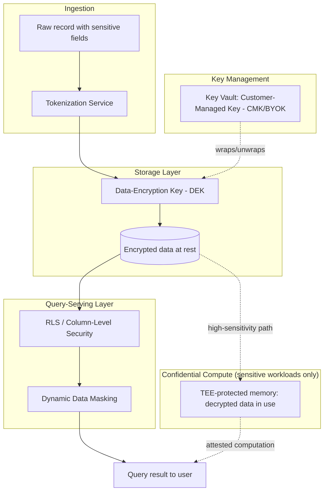
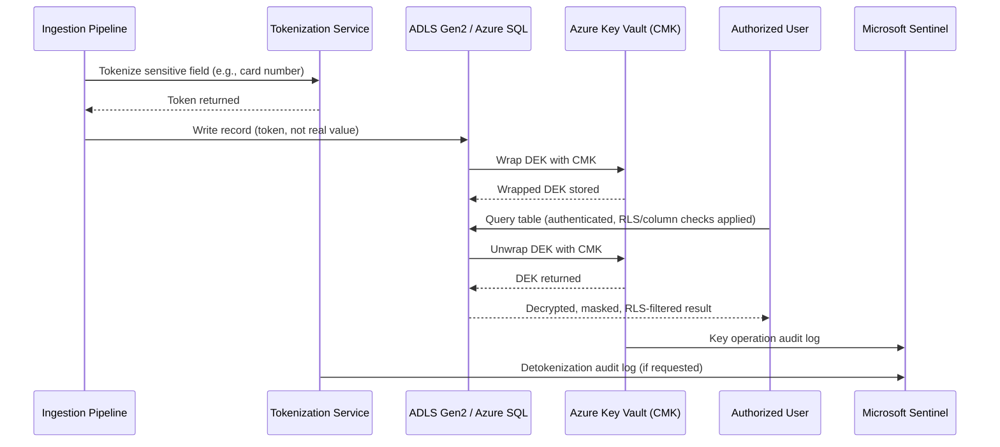
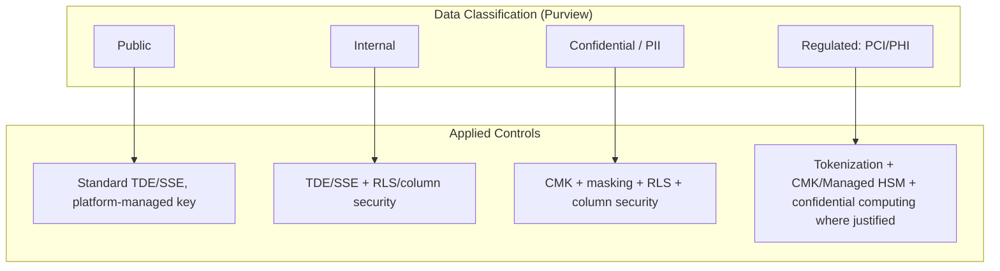
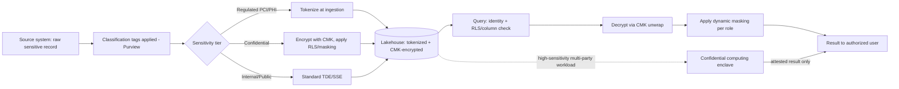

# Data Security and Encryption

> Part of the **Enterprise Data & AI Architecture Handbook** · Phase-10 — Security, Identity & Compliance · Chapter 03.
> Estimated study time: **60 min reading + ~4h labs**.
> **Prerequisite:** read [Identity and Access Management with Entra](02_Identity_and_Access_Management_with_Entra.md) first.

---

## Executive Summary

[Identity and Access Management with Entra](02_Identity_and_Access_Management_with_Entra.md#core-concepts) answered "who can request this data, and under what conditions." This chapter answers the question that remains even when that answer is a correctly-scoped "yes": **what actually protects the data itself if every access-control layer above it is bypassed** — a stolen disk, a misconfigured public container, a compromised but technically-authorized query, or a subpoena that legally compels disclosure but should still not hand over usable cleartext. Encryption and data-centric protection are the innermost layer of the defense-in-depth model from [Security Foundations](01_Security_Foundations.md#architecture): the layer that must hold even when network segmentation, identity, and authorization have all already failed.

This chapter covers **encryption at rest and in transit** as the baseline every enterprise data platform requires; **customer-managed keys (CMK), bring-your-own-key (BYOK), and key rotation** as the mechanisms that move key ownership and revocation authority from the cloud provider to the enterprise, a frequently misunderstood but legally consequential distinction; **tokenization and format-preserving encryption (FPE)** as data-centric techniques that protect sensitive values (a credit card number, a national ID) while preserving downstream system compatibility that full encryption would break; **row-level and column-level security and dynamic data masking** as the mechanisms that let the same physical table serve different, appropriately-redacted views to different consumers without duplicating data; and **confidential computing** as the emerging capability that protects data even *while it is being processed in memory* — closing the last gap in the "encrypted at rest, encrypted in transit, but plaintext in RAM during compute" model that has been the implicit assumption of nearly every data platform built to date.

The bias remains **Azure-primary (~60%)** — Azure Key Vault (Managed HSM), Storage Service Encryption with CMK, Always Encrypted, Azure confidential computing (DCsv3/DCasv5 VMs, Azure confidential ledger) — **~30% enterprise open source** (HashiCorp Vault Transit engine, Apache Ranger masking policies, Presidio for PII detection/de-identification) and **~10% AWS/GCP comparison-only** (AWS KMS/CloudHSM/Nitro Enclaves, GCP Cloud KMS/Confidential VMs).

**Bottom line:** encryption is necessary but not sufficient, and it is frequently implemented as a checkbox ("encryption at rest: enabled") without the architect asking the harder follow-up questions this chapter answers: who actually holds the key, can the enterprise revoke access independent of the cloud provider, does the encryption survive a query that legitimately needs to read the data, and what happens to the plaintext the moment it is loaded into a Spark executor's memory. An architect who can answer all four for a specific data asset has actually implemented data-centric protection; one who can only answer the first has implemented a compliance checkbox that provides materially less real protection than it appears to.

---

## Learning Objectives

By the end of this chapter you will be able to:

1. **Explain encryption at rest and in transit mechanics** (AES-256, TLS 1.3) and identify the specific gaps each does and does not close.
2. **Distinguish platform-managed keys, customer-managed keys (CMK), and BYOK**, and articulate the concrete governance and revocation-authority difference between them.
3. **Design a key-rotation strategy** for data-at-rest encryption keys, balancing security posture against operational and re-encryption cost.
4. **Apply tokenization and format-preserving encryption** to protect sensitive fields while preserving downstream system and analytics compatibility.
5. **Implement row-level security, column-level security, and dynamic data masking** to serve differentiated, appropriately-redacted views of the same underlying data.
6. **Explain confidential computing** and identify the specific scenarios (regulated multi-party computation, untrusted cloud operator threat models) where it is justified over standard encryption.
7. **Apply data-security practices on Azure** using Key Vault, Always Encrypted, and confidential computing, with a defensible comparison to AWS and GCP equivalents.
8. **Defend data-security architecture decisions** in engineer, staff engineer, architect, and CTO review settings, including the trade-offs between protection strength, performance, and operational complexity.

---

## Business Motivation

- **Encryption is the last line of defense when every access-control layer fails**, and regulators and cyber-insurers increasingly treat "was the data encrypted, and who held the key" as the determining factor in whether a breach is a reportable incident with material fines or a contained non-event — [Compliance and Regulatory Frameworks](#further-reading) (Phase-10 Chapter 06) builds directly on the CMK/BYOK distinction this chapter establishes.
- **CMK and BYOK are frequently the specific, named requirement in regulated-industry contracts** (financial services, healthcare, government) — a vendor's answer of "yes, data is encrypted" is contractually insufficient if the customer's own compliance team requires demonstrable, independent key-revocation authority.
- **Tokenization and masking materially reduce compliance scope** — a system that never stores or processes real card numbers, only tokens, is largely out of PCI-DSS scope for that data flow, a direct, quantifiable cost reduction versus securing the full cardholder-data environment.
- **A single shared table serving multiple audiences without row/column-level security multiplies breach exposure and audit complexity** — every consumer of an unmasked, ungoverned table is a potential disclosure path, whereas dynamic masking and RLS let one physical table safely serve many audiences.
- **Confidential computing unlocks multi-party and highly-regulated data collaboration that was previously legally or contractually blocked** — two competing organizations, or a bank and a regulator, can jointly compute over data neither is willing to expose in cleartext to the other or to the cloud provider itself.
- **The cost of over-encrypting everything uniformly, with no data classification, is a real, quantifiable performance and operational tax** — data security architecture is about applying the *right* level of protection to the *right* asset, not maximal protection applied uniformly regardless of sensitivity or cost.

---

## History and Evolution

- **1970s — DES (Data Encryption Standard)** is adopted as the first US federal symmetric-encryption standard; its 56-bit key length becomes practically breakable by the late 1990s, motivating its replacement.
- **2001 — AES (Advanced Encryption Standard)** is selected by NIST after a public competition (Rijndael), becoming the near-universal symmetric-encryption standard still in use today (AES-128/256) for data at rest.
- **1999-2008 — SSL evolves into TLS**, with TLS 1.0 (1999) through TLS 1.2 (2008) becoming the dominant encryption-in-transit standard, elaborated in [Networking Fundamentals](../Phase-00/04_Networking_Fundamentals.md#core-concepts).
- **2004 — PCI-DSS formalizes tokenization's compliance value**, explicitly recognizing tokenized cardholder data as reducing audit scope, catalyzing widespread commercial tokenization-vendor adoption in payments.
- **2010s — Cloud KMS services mature** (AWS KMS 2014, Azure Key Vault 2015, GCP Cloud KMS 2015), formalizing platform-managed and customer-managed key models as a standard cloud capability rather than a bespoke HSM deployment.
- **2015-2018 — GDPR (2016, enforced 2018) and expanding global privacy law** make pseudonymization and encryption explicit, named risk-mitigation techniques in the regulatory text itself, elevating tokenization/FPE from a payments-industry niche to a general enterprise data-protection requirement.
- **2016 — SQL Server/Azure SQL "Always Encrypted"** introduces client-side encryption where even a database administrator with full server access cannot see plaintext values, a structurally different threat model than server-side transparent data encryption.
- **2018-2020 — Confidential computing consortiums form** (the Confidential Computing Consortium under the Linux Foundation, 2019), and hardware trusted execution environments (Intel SGX, AMD SEV) become available as managed cloud VM SKUs, closing the "encrypted at rest and in transit but plaintext in memory" gap.
- **2020-2013 — TLS 1.3 (2018) becomes the default**, removing legacy weak cipher suites and reducing handshake round-trips, and format-preserving encryption (NIST SP 800-38G, finalized 2016) matures into production tokenization-vendor and open-source libraries.
- **2023-present — Confidential computing expands to GPU-accelerated confidential AI workloads**, extending the trusted-execution-environment model to protect model weights and training data during GPU-based inference/training, directly relevant to enterprise AI platforms processing sensitive data through LLMs.

---

## Why This Technology Exists

Access control alone assumes every layer above the data — network, identity, authorization — is correctly configured and remains uncompromised; encryption and data-centric protection exist because that assumption is not a safe one to bet an enterprise's most sensitive data on. A stolen backup tape, a misconfigured public storage container, a compromised but nominally-authorized administrator account, or a legal compulsion to disclose data should each still fail to yield usable cleartext to the party that should not have it. Data-centric protection techniques — encryption, tokenization, masking, and confidential computing — exist to make the data itself resistant to disclosure independent of whether every upstream control worked correctly, and independent of who technically holds infrastructure-level access to the storage or compute layer.

---

## Problems It Solves

- **Disclosure from stolen or improperly-decommissioned storage media** — encryption at rest renders a stolen disk or improperly wiped drive unreadable without the key.
- **Interception of data in transit** — TLS prevents a network-level eavesdropper (even one with legitimate access to intermediate network infrastructure) from reading data in flight.
- **Cloud-provider or insider access to sensitive data independent of legitimate customer authorization** — CMK/BYOK gives the enterprise independent revocation authority, and confidential computing extends this to the compute layer, so even a cloud-provider employee with infrastructure access cannot read customer plaintext.
- **Overexposure of full sensitive values to systems and users that only need a masked or tokenized representation** — tokenization, FPE, and dynamic masking let downstream systems (analytics, testing, third-party integrations) function correctly without ever handling the real sensitive value.
- **A single table's data being uniformly exposed to every consumer regardless of their actual entitlement** — row-level and column-level security let one physical table safely serve many different audiences with different visibility.

---

## Problems It Cannot Solve

- **It cannot protect data once it is legitimately decrypted and displayed to an authorized, but subsequently compromised, user session** — encryption protects data at rest/in transit/in confidential-compute memory; it does not prevent an authorized user's own compromised endpoint from capturing what they were legitimately shown.
- **It cannot substitute for correct identity and authorization design.** Encryption controls *whether the data is readable at all*; it does not decide *who* should be allowed to request the decryption key or the masked/unmasked view — that remains [Identity and Access Management](02_Identity_and_Access_Management_with_Entra.md#core-concepts)'s responsibility, and the two must be designed together.
- **It cannot make a fundamentally weak key-management practice secure.** Encrypting data with a key that is itself poorly protected (embedded in application code, never rotated, broadly accessible) provides only the appearance of protection — this is precisely why CMK governance and rotation discipline matter as much as the encryption algorithm choice.
- **It cannot fully eliminate performance and operational cost.** Confidential computing, client-side encryption (Always Encrypted), and full-table encryption all carry measurable compute or query-capability overhead; applying maximal protection uniformly regardless of actual data sensitivity is a real, avoidable cost.
- **It cannot replace a proper data classification program.** Deciding *which* fields need tokenization, which need only column masking, and which need confidential computing depends on an accurate sensitivity classification — encryption technology applies whatever policy classification tells it to, it does not derive that policy itself.

---

## Core Concepts

### 3.1 Encryption at Rest and in Transit

- **Encryption at rest** protects data stored on physical media (disk, SSD, tape) so that access to the storage medium itself, without the corresponding key, yields unreadable ciphertext. Azure Storage Service Encryption (SSE) and Transparent Data Encryption (TDE) for databases apply AES-256 encryption automatically and transparently to applications — the encryption/decryption happens at the storage or database engine layer, invisible to the querying application.
- **Encryption in transit** protects data moving across a network from interception, via TLS (elaborated mechanically in [Networking Fundamentals](../Phase-00/04_Networking_Fundamentals.md#core-concepts)); every connection between a client and an Azure data service, and between services themselves, should enforce TLS 1.2 minimum (TLS 1.3 preferred where supported).
- **The critical gap both leave open: data in use.** Once data is read from encrypted storage and decrypted for processing, it exists as plaintext in the compute layer's memory (a Spark executor's JVM heap, a SQL engine's buffer pool) — readable by anyone with sufficient access to that compute layer, including, in principle, a cloud-provider operator with hypervisor-level access. This is the gap **confidential computing** (§3.6) specifically closes.
- **Transparent vs. application-level encryption:** transparent encryption (SSE, TDE) requires zero application changes but protects only against storage-media-level threats; application-level or client-side encryption (Always Encrypted, client-side field encryption before writing to any store) protects against a broader threat model (including a compromised database engine or administrator) at the cost of losing native query capability over the encrypted fields unless the engine specifically supports encrypted computation.

### 3.2 Customer-Managed Keys (CMK), BYOK, and Key Rotation

- **Platform-managed keys (PMK)** — the cloud provider generates, stores, and manages the encryption key entirely; the customer has no direct control over the key's lifecycle. This is the default, zero-configuration option and is adequate for the majority of non-regulated data.
- **Customer-managed keys (CMK)** — the customer generates (or has the provider generate on their behalf) and stores the key in their own Key Vault instance, retaining explicit control over the key's lifecycle, including the ability to **revoke or disable the key independent of the cloud provider**, immediately rendering all data encrypted with it unreadable, even to the cloud provider itself. This is the concrete mechanism that answers "can we revoke the provider's access to our data" — a frequent, specific regulatory and contractual requirement.
- **Bring-your-own-key (BYOK)** — a specific CMK variant where the customer generates the key material *outside* Azure (in an on-premises HSM or another key-management system) and imports it into Azure Key Vault, ensuring the cloud provider never had the opportunity to generate or see the key material at any point, the strongest available assurance for organizations with strict key-provenance requirements.
- **Key rotation** — periodically replacing the active encryption key (commonly every 90-365 days for CMK, shorter for high-sensitivity data) limits the blast radius of a compromised key to only the data encrypted since the last rotation, provided the platform re-encrypts (or re-wraps the data-encryption key under a new key-encryption key) rather than merely marking the old key inactive. Azure Key Vault supports automated rotation policies; a rotation without a corresponding re-encryption or key-wrapping strategy provides only partial protection.
- **The key hierarchy matters:** most platforms use envelope encryption — a data-encryption key (DEK) encrypts the actual data, and a key-encryption key (KEK), held in Key Vault, encrypts the DEK. Rotating the KEK (the CMK) is fast (only the small DEK needs re-wrapping); a policy that requires rotating the DEK itself (re-encrypting the full dataset) is far more expensive and should be reserved for confirmed-compromise scenarios, not routine rotation.

### 3.3 Tokenization and Format-Preserving Encryption

- **Tokenization** replaces a sensitive value with a non-sensitive, randomly-generated substitute (a "token") that has no mathematical relationship to the original value, with the mapping stored securely in a separate, tightly-access-controlled token vault. Tokenization is not encryption — there is no key that mathematically derives the original from the token; the *only* way to reverse it is a lookup against the vault, making it exceptionally resistant to cryptanalytic attack and, because the token has no mathematical link to the sensitive value, frequently placing systems that only handle tokens outside strict compliance scope entirely.
- **Format-preserving encryption (FPE)** encrypts a value while preserving its original format (a 16-digit credit card number encrypts to another valid-looking 16-digit number; a date encrypts to another valid date), unlike standard AES output which is unstructured binary. FPE is genuine, reversible encryption (via a key, per NIST SP 800-38G's FF1/FF3-1 modes), unlike tokenization's non-mathematical vault lookup — meaning FPE requires the same key-management rigor as any other encryption, while tokenization's security depends instead on the vault's access controls.
- **When to use which:** tokenization is generally preferred when the sensitive value never needs to be mathematically derived by downstream systems and centralizing the sensitive-value store in a single, hardened vault is acceptable; FPE is preferred when the value must be decryptable in a distributed fashion without a centralized lookup service, or where the tokenization vault itself would become an unacceptable operational dependency/bottleneck.
- **Why format preservation matters practically:** legacy downstream systems, validation logic, and analytics pipelines are frequently built assuming a specific data format (a 16-digit card number, a valid-looking SSN); replacing a field with standard AES ciphertext breaks every downstream format assumption, while tokenization or FPE lets those systems continue functioning unmodified.

### 3.4 Row-Level Security and Column-Level Security

- **Row-level security (RLS)** restricts which *rows* of a table a given query returns, transparently, based on the querying identity's attributes (department, region, clearance level) — implemented via a security predicate function evaluated as part of the query plan (Synapse/SQL Server `CREATE SECURITY POLICY`, Databricks Unity Catalog row filters per [Identity and Access Management](02_Identity_and_Access_Management_with_Entra.md#core-concepts)).
- **Column-level security** restricts which *columns* a given query can see entirely (a column simply does not appear, or access to it is denied outright), distinct from masking (below), which returns the column but with its value obscured.
- **The combination is what makes one physical table safely multi-tenant across audiences** — a single `customers` table can simultaneously show a regional sales team only their region's rows (RLS), hide the `ssn` column entirely from that team (column-level security), and show a fraud-analytics team every row but with the `email` column masked (dynamic data masking, below) — all from one physical table, with no data duplication.

### 3.5 Dynamic Data Masking

Dynamic data masking obscures a column's value at query time for users without explicit unmask permission, without altering the underlying stored data — a `customer_email` column might be stored as `jane.doe@contoso.com` but returned as `jXXX@XXXXX.com` to a masked user and the full value to an authorized one. Unlike tokenization (which replaces the stored value) or encryption (which requires a key to reverse), masking is applied at the query-serving layer and requires no changes to how the data is stored — making it fast to apply broadly across many columns as a baseline, non-disruptive protection layer, while being explicitly **not** a substitute for encryption or access control: masking prevents *casual* exposure to a authorized-but-shouldn't-see-everything user, not a determined attacker with direct storage access, which is why it is layered on top of, not instead of, encryption and RLS/column security.

### 3.6 Confidential Computing

Confidential computing uses hardware-based **trusted execution environments (TEEs)** — Intel SGX, AMD SEV-SNP, or Azure's confidential VM SKUs (DCsv3/DCasv5) — to keep data encrypted **even while being actively processed in memory**, closing the "data in use" gap identified in §3.1. The mechanism: the CPU maintains a hardware-enforced, encrypted memory enclave that even a compromised or malicious hypervisor/host operating system cannot read, with cryptographic **attestation** allowing a data owner to verify, before releasing any sensitive data or key, that the code running inside the enclave is exactly the expected, unmodified code. This enables genuinely new collaboration patterns: two mutually distrusting parties (or a customer and a cloud provider under a "zero trust in the operator" threat model) can jointly compute over data neither is willing to expose in cleartext to the other, with cryptographic proof that only the agreed computation ran and no party — including the cloud operator — could observe the intermediate plaintext. Confidential computing is not a default-everywhere technology; it carries real performance overhead and operational complexity, and is justified specifically for regulated multi-party computation, highly sensitive workloads under an explicit untrusted-operator threat model, or protecting proprietary model weights during inference — not as a blanket replacement for standard encryption at rest and in transit.

---

## Internal Working

A representative encrypted write-then-read flow for a customer table using CMK, tokenized card numbers, and RLS:

1. **Write path — tokenization first.** An ingestion pipeline receives a record containing a credit card number; before it ever reaches durable storage, a tokenization service call replaces the card number with a token, with the real value stored only in the tokenization vault's separately-encrypted, tightly-access-controlled store.
2. **Write path — envelope encryption.** The record (now containing the token, not the real card number) is written to ADLS Gen2/a database; the storage engine generates a data-encryption key (DEK), encrypts the record with it, and wraps the DEK using the customer-managed key (CMK) held in Azure Key Vault — the CMK itself never leaves Key Vault; only the small wrapped DEK is stored alongside the data.
3. **Read path — authentication and authorization first.** A user authenticates (per [Identity and Access Management](02_Identity_and_Access_Management_with_Entra.md#internal-working)) and their query is evaluated against Unity Catalog/Synapse RLS and column-level grants — this happens *before* any decryption occurs; a user without a matching row-level entitlement never triggers a decryption call for rows they cannot see.
4. **Read path — key unwrap and decrypt.** For rows the user is authorized to see, the storage/database engine calls Key Vault to unwrap the DEK using the CMK (an operation itself logged and auditable), decrypts the record, and applies any configured dynamic masking to columns the user lacks unmask permission for.
5. **Result returned** — the user sees their row-level-filtered, column-masked, decrypted result set, with the tokenized card-number field remaining a token unless the user's role specifically has detokenization permission (a separate, more tightly scoped grant than general table read access).
6. **Every key-access, detokenization, and row-filter evaluation is logged**, feeding the same Sentinel-based observability pipeline described in [Security Foundations](01_Security_Foundations.md#observability), so an anomalous spike in Key Vault unwrap calls or detokenization requests is independently detectable regardless of whether the requesting identity was technically authorized.

---

## Architecture

The CMK never leaves Key Vault (only wrap/unwrap calls cross the boundary); RLS/column security is evaluated *before* decryption is even attempted for excluded rows; masking is the outermost, non-disruptive layer applied at result-serving time; confidential computing is an optional, higher-cost path reserved for specifically high-sensitivity or multi-party workloads, not the default path for every query.

---

## Components

- **Azure Key Vault (Standard/Premium/Managed HSM)** — stores and manages CMK/BYOK key material, providing wrap/unwrap, sign, and rotation operations without ever exposing raw key material outside the HSM boundary.
- **Storage/database encryption engine** — Storage Service Encryption (ADLS Gen2), Transparent Data Encryption (Azure SQL/Synapse), or Delta Lake's underlying Parquet-level encryption support, performing envelope encryption transparently.
- **Tokenization service** — a dedicated component (commercial vendor, or a custom service backed by a hardened vault database) issuing and resolving tokens, kept as a narrowly-scoped, independently-audited component.
- **Always Encrypted (client-side encryption) driver** — for Azure SQL/Synapse scenarios requiring that even the database engine/administrator never sees plaintext, encryption/decryption happens client-side using keys the database server never holds.
- **Row-level security policies / Unity Catalog row filters and column masks** — the query-time authorization mechanisms described in [Identity and Access Management](02_Identity_and_Access_Management_with_Entra.md#core-concepts) §2.6, reused here as the enforcement point for data-centric protection.
- **Confidential VM SKUs (DCsv3/DCasv5) and attestation service (Microsoft Azure Attestation)** — the hardware TEE and verification mechanism underlying confidential computing.
- **PII detection/classification tooling (Microsoft Purview classification, Presidio)** — identifies which fields require tokenization, masking, or CMK protection in the first place, feeding the data-classification-driven policy this chapter's mechanisms enforce.

---

## Metadata

- **Encryption-key metadata** — which CMK protects which resource, its rotation schedule, and its current version, should be discoverable centrally (Key Vault's own metadata plus a governance-owned inventory), not tracked ad hoc per team.
- **Data-classification metadata** — every column's sensitivity classification (public/internal/confidential/restricted, and specific regulated categories like PCI/PHI/PII) should be tagged in the data catalog (Microsoft Purview), directly driving which columns require tokenization, masking, or RLS.
- **Tokenization mapping metadata** — the token-to-real-value mapping lives exclusively in the tokenization vault's own storage, never replicated elsewhere, with strict access-control metadata on who can request detokenization.
- **Key-rotation and re-encryption audit metadata** — every rotation event, and whether it triggered a full re-encryption or only a DEK re-wrap, should be logged as an auditable event supporting both incident response and compliance evidence.
- **Masking-policy metadata** — which columns have masking policies applied, and which roles hold unmask permission, should be centrally queryable rather than scattered across per-database `CREATE MASKING POLICY` statements with no aggregated view.

---

## Storage

- **Encrypted data at rest** (ADLS Gen2 with SSE, Azure SQL/Synapse with TDE) is the default for all Azure storage services; CMK-protected storage additionally references an external Key Vault key rather than a Microsoft-managed key.
- **Key Vault (Standard, Premium with HSM-backed keys, or Managed HSM)** stores CMK/BYOK material; Managed HSM provides a dedicated, single-tenant HSM pool for the highest-assurance key-provenance and compliance requirements (e.g., FIPS 140-2 Level 3).
- **Tokenization vault storage** is architecturally isolated from the primary data platform's storage — a compromise of the main lakehouse's storage account should not, by itself, expose the token-to-value mapping, which is why the vault is typically a separate, more tightly access-controlled data store.
- **Confidential VM local/temp storage** used during a confidential-compute workload should itself be encrypted with a VM-specific, TEE-managed key, ensuring the "in use" protection extends to any spill-to-disk that occurs during processing (e.g., a Spark shuffle spill).

---

## Compute

- **Standard encryption/decryption overhead is negligible on modern hardware** with AES-NI hardware acceleration; the historical performance objection to encrypting more data by default rarely holds up under actual measurement.
- **Confidential computing (TEE-based) carries measurable overhead** — typically single-digit-to-low-double-digit percentage CPU overhead depending on workload memory-access patterns, plus the requirement to use specific confidential VM SKUs, both real costs that justify reserving it for genuinely high-sensitivity workloads rather than applying it universally.
- **Always Encrypted's client-side encryption moves decryption compute to the client**, meaning the database engine cannot perform most query optimizations (indexing, range scans) on encrypted columns without additional configuration (deterministic encryption enables equality searches; randomized encryption, stronger but not searchable, does not) — a direct performance/security trade-off architects must make deliberately per column.
- **Tokenization service calls add network round-trip latency** to the ingestion and detokenization path; high-throughput pipelines should batch tokenization requests rather than calling per-record, and should evaluate whether a co-located or embedded tokenization library reduces round-trip overhead versus a remote service call.

---

## Networking

- **Key Vault access should occur over private endpoints**, not the public Key Vault data-plane endpoint, closing the network-level exposure of key-management operations per [Networking Fundamentals](../Phase-00/04_Networking_Fundamentals.md#security).
- **Tokenization service calls, if to an external vendor, require careful network-boundary review** — the tokenization vault is a high-value target, and network access to it should be as tightly scoped as access to the sensitive data it protects, arguably more so.
- **Confidential computing attestation calls to Microsoft Azure Attestation** occur over TLS and should be validated as part of the workload's startup sequence before any sensitive data or key is released into the enclave, not merely logged after the fact.
- **All key-management and detokenization traffic must enforce TLS 1.2+ minimum**, consistent with the transport-security baseline established in [Networking Fundamentals](../Phase-00/04_Networking_Fundamentals.md#core-concepts).

---

## Security

- **CMK access itself must be least-privilege and PIM-governed** ([Identity and Access Management](02_Identity_and_Access_Management_with_Entra.md#core-concepts)) — the ability to manage (not merely use) a CMK, including disabling or deleting it, is itself a highly privileged operation that should require PIM activation and be tightly audited, since it is effectively a data-destruction capability.
- **Key Vault soft-delete and purge protection must be enabled** on every vault holding CMK material, preventing accidental or malicious permanent key deletion from becoming an unrecoverable data-loss event.
- **Detokenization permission must be scoped far more tightly than general table read access** — a role that can read a tokenized table should not automatically be able to detokenize; treat detokenization as its own privileged operation subject to its own PIM/approval requirement for high-sensitivity data categories.
- **Attestation must be verified, not assumed, for every confidential-computing workload** — releasing a key or sensitive dataset into an enclave without validating the attestation report defeats the entire threat-model benefit of confidential computing.
- **Masking is not a substitute for RLS/column-level security or encryption** — treat it as an additional, non-load-bearing convenience layer; a security review that finds "the column is masked" and stops there without checking the underlying access-control and encryption posture has not actually verified the data is protected.

---

## Performance

- **Baseline encryption at rest/in transit has negligible measurable overhead** on Azure's managed services with hardware-accelerated cryptography; do not treat this as a meaningful cost trade-off when deciding whether to encrypt.
- **CMK adds a small, per-operation latency for key wrap/unwrap calls to Key Vault**, mitigated by envelope encryption's design (only the small DEK, not the full dataset, requires a Key Vault round trip per operation) and by client-side caching of unwrapped DEKs within a session's validity window.
- **Deterministic vs. randomized Always Encrypted column configuration is a direct performance/security trade-off** — deterministic encryption enables equality-based query predicates and joins on the encrypted column at the cost of leaking whether two encrypted values are equal (a measurable information leak for low-cardinality columns); randomized encryption closes that leak but disables equality search entirely.
- **Confidential computing overhead is workload-dependent** — memory-access-pattern-heavy workloads (large in-memory joins, wide shuffles) see more overhead than compute-bound workloads; benchmark the specific workload rather than assuming a fixed percentage tax before committing to a confidential-VM-based architecture at scale.

---

## Scalability

- **Envelope encryption's key hierarchy is what makes key rotation scale** — rotating a CMK only requires re-wrapping the (small) DEKs it protects, not re-encrypting the full underlying dataset, keeping rotation operationally feasible even for petabyte-scale lakehouses.
- **Centralized, catalog-driven data classification** (Microsoft Purview auto-classification) is what makes applying tokenization/masking/RLS policy scale across thousands of tables — a manual, per-table sensitivity review does not scale past a modest table count.
- **Tokenization services must be designed for the platform's actual ingestion throughput** — a tokenization vault sized for a pilot's data volume becomes a bottleneck at production scale; load-test the vault's throughput explicitly before committing to it as the platform's sole tokenization path.
- **Policy-as-code for masking/RLS definitions** (Terraform Databricks provider, or version-controlled SQL migration scripts for RLS predicates) lets a platform team roll out consistent data-protection policy across many tables and environments without manual per-table configuration drift.

---

## Fault Tolerance

- **Key Vault soft-delete and purge protection, combined with a documented key-recovery runbook**, are the fault-tolerance mechanism against accidental key loss — without them, an accidentally deleted CMK renders its protected data permanently unrecoverable, a uniquely unforgiving failure mode compared to most other platform failures.
- **Tokenization vault availability is a hard dependency for any detokenization-requiring read path** — if the vault is unavailable, reads requiring the real value fail even though the underlying data store itself is healthy; architect the vault for high availability commensurate with the platform's overall SLA, or design read paths to gracefully degrade to the tokenized (masked) view when detokenization is unavailable.
- **Confidential computing attestation-service unavailability should fail closed, not open** — a workload unable to verify attestation should refuse to release sensitive data into the enclave rather than proceeding on an unverified assumption, even if this reduces short-term availability.
- **Key-rotation automation should include rollback/verification steps** — an automated rotation that succeeds in Key Vault but fails to propagate to a dependent service's cached key reference can cause a confusing decryption-failure outage; verify successful decryption post-rotation as part of the automated rotation pipeline, not as a manual afterthought.

---

## Cost Optimization

- **Do not apply CMK, tokenization, and confidential computing uniformly to all data** — reserve them for data classified as genuinely requiring that level of protection (per Purview classification), applying platform-managed keys and standard encryption elsewhere; uniform maximal protection is a real, avoidable cost with no proportional security benefit for low-sensitivity data.
- **Managed HSM is materially more expensive than Key Vault Premium (HSM-backed keys)** and should be reserved for workloads with an explicit FIPS 140-2 Level 3 or dedicated-tenancy HSM requirement, not adopted by default.
- **Confidential VM SKUs carry a price premium over standard equivalents** — budget for this explicitly and scope confidential computing to the specific high-sensitivity workloads that justify it, rather than migrating an entire cluster to confidential VMs uniformly.
- **Tokenization-as-a-service vendor pricing is frequently volume-based** — for very high-throughput ingestion, evaluate the cost of a vendor tokenization service against a self-hosted, open-source-based tokenization vault (e.g., built on HashiCorp Vault's Transform secrets engine) at the platform's actual scale.
- **Worked FinOps example:** A retailer initially enabled Managed HSM-backed CMK uniformly across all 40 of its ADLS Gen2 storage accounts "to be safe," at roughly $3.50/hour per Managed HSM instance (~$2,550/month) plus per-key and per-operation charges, totaling roughly **$3,200/month**, even though a data-classification audit found only 6 of the 40 storage accounts actually held regulated (PCI/PHI) data requiring HSM-backed CMK; the remaining 34 held internal analytics data adequately served by standard Key Vault Premium CMK (HSM-backed keys without dedicated Managed HSM tenancy) at roughly $1/key/month plus minimal per-operation cost, well under $200/month combined. Rescoping Managed HSM to only the 6 regulated storage accounts and moving the other 34 to standard Key Vault Premium CMK reduces the monthly cost from ~$3,200 to roughly **$500 + $200 ≈ $700/month**, a reduction of about **78%**, while maintaining the *stronger* protection specifically where regulation actually requires it.

---

## Monitoring

- **Key Vault access and operation logs** — track every key wrap/unwrap, rotation, and administrative operation (create, delete, disable), surfaced via Key Vault diagnostic logs into Log Analytics.
- **Detokenization request volume and rate** — an unexpected spike in detokenization calls for a given identity or table is a high-signal indicator worth its own alert threshold, independent of whether the requests were technically authorized.
- **Masking-bypass/unmask-permission usage tracking** — track which identities exercise unmask permission on masked columns, and how frequently, as a baseline for detecting anomalous broad access.
- **Confidential-computing attestation success/failure rate** — a rising attestation-failure rate may indicate a misconfigured enclave deployment or, more concerningly, a genuine attempted tampering, and should be monitored as its own dedicated signal.

---

## Observability

- **Unified data-protection telemetry correlation** — Key Vault logs, tokenization-service audit logs, RLS/masking policy evaluation logs, and confidential-computing attestation logs should all flow into the same Sentinel workspace established in [Security Foundations](01_Security_Foundations.md#observability), correlated with the identity telemetry from [Identity and Access Management](02_Identity_and_Access_Management_with_Entra.md#observability).
- **Structured, correlated audit logging for every decryption/detokenization/unmask event** — each such event should carry the requesting identity, the specific key/token/column involved, and a timestamp, enabling a single query to answer "who has actually seen unmasked/detokenized/decrypted values for this specific sensitive field, and when."
- **Detection rules mapped to data-protection-specific threat scenarios** — a sudden spike in Key Vault unwrap operations, a detokenization request from an identity with no prior detokenization history, or repeated attestation failures should each have a corresponding Sentinel analytics rule.
- **Key-rotation and re-encryption completion tracking** — observability should confirm not just that a rotation *was scheduled* but that it *completed successfully and was verified* against a post-rotation decryption test, closing the loop on the Fault Tolerance concern above.

### Operational Response Playbook

| Signal | Detection Query/Check | Remediation |
|---|---|---|
| Anomalous spike in Key Vault key-unwrap operations for a specific CMK | Key Vault diagnostic logs aggregated by key and identity, alerting on volume exceeding a rolling baseline in Sentinel | Page the security on-call lead; correlate with recent identity sign-in and RBAC-change telemetry to determine if the spike is legitimate (e.g., a new batch job) or anomalous; if unconfirmed, disable the key version immediately and investigate before re-enabling. |
| Detokenization request from an identity with no prior detokenization history for that data category | Tokenization service audit log correlated against a rolling per-identity detokenization-history baseline in Sentinel | Immediately verify the request against a known, approved business justification; if unconfirmed, suspend the identity's detokenization permission pending investigation; review whether the role granting detokenization access was scoped too broadly. |
| Confidential-computing attestation failure on a workload expected to pass | Azure confidential VM / Microsoft Azure Attestation failure logs alerting on any failed attestation for a production workload | Immediately halt release of any sensitive data or key into the affected enclave (fail closed); investigate whether the failure is a benign configuration/version mismatch or evidence of tampering; do not override a failed attestation manually to "unblock" the workload. |

---

## Governance

- **Data classification is the upstream input every control in this chapter depends on** — without an accurate, maintained classification (Microsoft Purview or equivalent) of which fields are PCI/PHI/PII/confidential, decisions about which columns need tokenization, CMK, or masking are guesswork; governance must own and periodically audit this classification.
- **CMK ownership and rotation policy are documented, auditable, and reviewed** — who can manage each CMK, its rotation cadence, and evidence of successful rotation should be a standing governance artifact, directly feeding [Compliance and Regulatory Frameworks](#further-reading) (Chapter 06) attestations.
- **Detokenization and unmask permissions are governed with the same rigor as privileged-role access** ([Identity and Access Management](02_Identity_and_Access_Management_with_Entra.md#governance)) — subject to periodic access review, not granted once and forgotten.
- **Confidential computing adoption decisions are documented (via ADR)**, given their cost and complexity, so the specific regulatory or multi-party-trust justification for each confidential-computing workload is traceable rather than an ad hoc, unexplained architectural choice.
- **Data-protection policy changes (new masking rules, new RLS predicates, CMK rotation policy changes) go through the same reviewed, version-controlled process as any other governed infrastructure change**, per [Infrastructure as Code with Terraform](../Phase-09/04_Infrastructure_as_Code_with_Terraform.md#governance).

---

## Trade-offs

| Dimension | Maximal protection (CMK+tokenization+confidential computing everywhere) | Baseline protection (platform-managed keys, no tokenization/masking) |
|---|---|---|
| Disclosure risk if a control above fails | Lowest — data remains protected even under storage/insider/operator compromise | Highest — data fully exposed once any single upstream control fails |
| Performance | Measurable overhead, especially confidential computing and client-side encryption | Negligible overhead |
| Operational complexity | Higher — key rotation, tokenization vault operations, attestation verification | Lower — fully managed, no additional operational surface |
| Cost | Meaningfully higher (Managed HSM, confidential VM premiums, tokenization service) | Lowest |
| Suitability | Regulated (PCI/PHI/PII), multi-party, or high-blast-radius data | Low-sensitivity internal/public data |

The general enterprise guidance: apply the strongest protections (CMK, tokenization, confidential computing) specifically to data classified as requiring them, and rely on strong-but-standard platform-managed encryption elsewhere — uniform maximal protection is both unnecessarily expensive and, by consuming budget and operational attention broadly, can paradoxically leave less capacity to properly govern the genuinely sensitive subset that needs it most.

---

## Decision Matrix

| Scenario | Recommended Approach |
|---|---|
| Standard internal analytics data, no regulatory sensitivity | Platform-managed keys, standard TDE/SSE, no tokenization or masking required |
| Payment card data (PCI-DSS scope) | Tokenization at ingestion, CMK (Managed HSM if contractually required) for any residual stored data, strict detokenization access governance |
| Healthcare/PHI data shared across departments with different entitlements | Column-level security plus dynamic masking plus RLS by department/role, CMK for the underlying storage |
| Multi-party collaborative analytics between mutually distrusting organizations | Confidential computing with attestation, likely combined with CMK held independently by each party for their contributed data |
| Legacy system requiring exact original data format for compatibility | Format-preserving encryption rather than tokenization or standard AES, to preserve downstream format assumptions |
| Regulatory requirement for demonstrable, independent key-revocation authority | CMK at minimum; BYOK if the requirement specifies the cloud provider must never have generated the key material |

---

## Design Patterns

- **Classify first, protect second** — never decide encryption/tokenization/masking strategy per table ad hoc; drive it from a maintained, catalog-integrated data classification.
- **Envelope encryption with CMK as the standard pattern** — DEK-per-object encrypted data, KEK (CMK) held in Key Vault, enabling fast key rotation without full dataset re-encryption.
- **Tokenize at the earliest possible point in the data flow** — tokenizing at ingestion (before the sensitive value ever reaches the broader lakehouse) minimizes the number of systems that ever handle the real value, directly reducing compliance scope.
- **Layer masking, RLS, and column security on top of encryption, never as a substitute for it** — each layer addresses a different threat (masking: casual over-exposure to authorized-but-limited users; encryption: storage/media-level compromise); combine them deliberately.
- **Reserve confidential computing for named, justified use cases with an ADR**, not as a default architecture choice, given its cost and complexity.

---

## Anti-patterns

- **"Encryption at rest: enabled" treated as a complete answer to a security review question** — without knowing who holds the key (platform-managed vs. CMK vs. BYOK), this statement provides far less assurance than it appears to.
- **Uniform CMK/Managed HSM applied to every storage account regardless of actual data sensitivity** — a real, avoidable cost with no corresponding security benefit for low-sensitivity data, and a distraction from properly governing the subset that actually needs it.
- **Masking treated as sufficient protection on its own**, with no underlying encryption or RLS — masking prevents casual over-exposure but does nothing against a user or attacker with direct storage-level access.
- **Key rotation policy that rotates the CMK but never verifies successful re-wrap/decryption afterward** — a rotation that silently breaks a dependent service's cached key reference produces a confusing outage rather than a clean, verified security improvement.
- **Tokenization vault treated as a lower-priority system than the primary data platform** — in practice it is often the single highest-value target in the entire architecture, since compromising it directly yields every sensitive value the platform ever tokenized.
- **Deploying confidential computing broadly "because it sounds more secure" without a specific threat model or ADR justification** — incurring real cost and complexity without a defined problem it is solving.

---

## Common Mistakes

- Confusing tokenization with encryption, and assuming a token can be "decrypted" — it cannot; only a vault lookup (governed entirely by the vault's own access control) reverses it, a materially different security and operational model.
- Applying deterministic Always Encrypted to a low-cardinality column (e.g., a boolean or a small enum) without recognizing that deterministic encryption leaks value-equality patterns that can make the encrypted values statistically inferable.
- Granting broad table-read access and assuming masking alone prevents sensitive-data exposure, without checking who additionally holds unmask permission.
- Rotating a CMK without verifying the rotation actually took effect across every dependent service, discovering the gap only when an old key is later deleted and a forgotten dependency breaks.
- Building a custom tokenization solution without hardening the vault to at least the same standard as the primary data platform, inadvertently creating a softer, higher-value target than the system it was meant to protect.
- Assuming confidential computing eliminates the need for encryption at rest and in transit, rather than understanding it addresses a specific, additional gap (data in use) that the other two do not cover.

---

## Best Practices

- Drive every encryption/tokenization/masking decision from an accurate, maintained data classification, not per-table improvisation.
- Default to CMK (not platform-managed keys) for any data subject to regulatory or contractual key-revocation requirements, and to BYOK specifically where key-provenance must be independently verifiable.
- Tokenize sensitive fields as early as possible in the data flow, minimizing the number of systems that ever handle real values.
- Layer RLS, column-level security, and dynamic masking together rather than relying on any single mechanism, and verify their combined effect for representative test identities.
- Treat detokenization and unmask permissions as privileged operations subject to PIM and periodic access review, not implied by general table-read access.
- Reserve confidential computing for specifically justified, ADR-documented use cases, and always verify attestation before releasing sensitive data or keys into an enclave.

---

## Enterprise Recommendations

- Mandate CMK as the default for any data store classified as confidential or higher, with platform-managed keys as the explicit, documented exception for genuinely low-sensitivity data rather than the reverse.
- Fund a centralized tokenization/vault service (or a vetted commercial platform) rather than allowing individual teams to build ad hoc, inconsistently hardened tokenization solutions independently.
- Require an ADR for any confidential-computing adoption, explicitly naming the threat model (untrusted operator, multi-party collaboration, proprietary-model protection) it addresses, to prevent cost/complexity creep without a defined justification.
- Integrate data classification, encryption/tokenization status, and masking-policy coverage into the same quarterly security-posture reporting cadence established in [Security Foundations](01_Security_Foundations.md#enterprise-recommendations) and [Identity and Access Management](02_Identity_and_Access_Management_with_Entra.md#enterprise-recommendations).
- Explicitly plan for confidential-computing coverage of AI/agentic workloads processing sensitive data or proprietary model weights, ahead of scale, rather than retrofitting it after an incident or a customer contractual requirement forces the issue.

---

## Azure Implementation

- **Azure Key Vault (Standard, Premium, Managed HSM)** — CMK/BYOK storage, wrap/unwrap operations, and automated rotation policies; Managed HSM for FIPS 140-2 Level 3, single-tenant HSM requirements.
- **Storage Service Encryption (SSE) with customer-managed keys** — configured on ADLS Gen2 storage accounts via the Azure portal, CLI, or Terraform (`customer_managed_key` block on `azurerm_storage_account`).
- **Transparent Data Encryption (TDE) with CMK** — Azure SQL Database and Synapse dedicated SQL pools, configurable to use a Key Vault-held key instead of the Microsoft-managed default.
- **Always Encrypted** — SQL Server/Azure SQL client-side encryption, with deterministic or randomized encryption configured per column depending on whether equality-search capability is required.
- **Azure confidential computing (DCsv3/DCasv5 VM SKUs, Azure Kubernetes Service confidential nodes)** — hardware TEE-backed compute, paired with **Microsoft Azure Attestation** for verifying enclave integrity before releasing sensitive data.
- **Microsoft Purview** — data classification and sensitivity labeling, driving which columns require tokenization/masking/CMK protection.
- **Dynamic Data Masking (Azure SQL/Synapse) and Unity Catalog row filters/column masks (Databricks)** — the concrete masking/RLS mechanisms described in §3.4-3.5.

---

## Open Source Implementation

- **HashiCorp Vault (Transit and Transform secrets engines)** — the leading open-source alternative for envelope encryption (Transit engine, "encryption as a service" without exposing raw keys to applications) and format-preserving encryption/tokenization (Transform engine), commonly used in multi-cloud or non-Azure-primary estates.
- **Microsoft Presidio** — an open-source PII detection and de-identification toolkit (NER-based detection plus configurable anonymization/masking operators), commonly used to drive automated data classification and de-identification pipelines ahead of ingestion.
- **Apache Ranger** — provides centralized, policy-based row/column-level security and dynamic masking across the open-source big-data stack (Hive, Spark, Kafka), a common choice in non-Databricks, self-managed Hadoop/Spark-on-Kubernetes environments.
- **Let's Encrypt / cert-manager** — open-source, automated TLS certificate issuance and rotation, commonly used for encryption-in-transit within Kubernetes-hosted data platform components (elaborated in [Kubernetes](../Phase-09/06_Kubernetes.md#security)).
- **Open Enclave SDK / Confidential Containers (Kata Containers)** — open-source frameworks for building and deploying confidential-computing workloads in a cloud-agnostic way, relevant for organizations wanting portability across TEE implementations.

---

## AWS Equivalent (comparison only)

| Capability | Azure | AWS |
|---|---|---|
| Key management (CMK/BYOK) | Azure Key Vault (Standard/Premium/Managed HSM) | AWS KMS, CloudHSM for dedicated single-tenant HSM |
| Client-side/column encryption | Always Encrypted | DynamoDB Client-Side Encryption, RDS/Aurora column-level encryption libraries |
| Tokenization | Custom/vendor + Key Vault, or Presidio/Vault Transform | AWS-native tokenization typically via partner/marketplace solutions or custom Lambda + KMS |
| Row/column security and masking | Dynamic Data Masking, Unity Catalog row filters/column masks | Redshift RLS/column masking, Lake Formation fine-grained access with masking |
| Confidential computing | Azure confidential VMs (DCsv3/DCasv5) + Azure Attestation | AWS Nitro Enclaves |

**Advantages of AWS:** Nitro Enclaves are deeply integrated with the broader EC2/Nitro hypervisor architecture, giving a strong default confidential-computing story across much of the EC2 fleet; CloudHSM offers comparable dedicated-tenancy HSM assurance to Azure Managed HSM. **Disadvantages:** AWS lacks a first-party, broadly adopted equivalent to Always Encrypted's client-side, server-blind encryption model for relational workloads; tokenization is less of a first-party managed capability than a partner-ecosystem solution. **Migration strategy:** envelope-encryption concepts and key hierarchies transfer directly; concrete KMS key policies, CloudHSM cluster configuration, and Nitro Enclave attestation flows require AWS-specific rework. **Selection criteria:** choose AWS-native tooling for AWS-primary estates, particularly where Nitro Enclaves' EC2-wide availability is valuable; choose Azure Key Vault/confidential VMs for Azure-primary or Databricks-centric estates.

---

## GCP Equivalent (comparison only)

| Capability | Azure | GCP |
|---|---|---|
| Key management (CMK/BYOK) | Azure Key Vault (Standard/Premium/Managed HSM) | Google Cloud KMS, Cloud HSM |
| Client-side/column encryption | Always Encrypted | BigQuery column-level encryption via AEAD functions |
| Tokenization | Custom/vendor + Key Vault, or Presidio/Vault Transform | Google Cloud DLP API (tokenization and format-preserving encryption transformations) |
| Row/column security and masking | Dynamic Data Masking, Unity Catalog row filters/column masks | BigQuery row-level/column-level security and data masking |
| Confidential computing | Azure confidential VMs (DCsv3/DCasv5) + Azure Attestation | GCP Confidential VMs (built on AMD SEV) |

**Advantages of GCP:** the Cloud DLP API provides a strong first-party, managed tokenization and format-preserving-encryption capability directly integrated with BigQuery, arguably ahead of Azure's comparatively more assembled tokenization story; GCP Confidential VMs were an early, well-regarded confidential-computing offering. **Disadvantages:** GCP's Always-Encrypted-equivalent client-side encryption story for relational workloads is less mature than Azure SQL's. **Migration strategy:** classification-driven policy and envelope-encryption concepts transfer directly; concrete KMS key-ring structures and DLP de-identification templates require GCP-specific rework. **Selection criteria:** choose GCP-native tooling for GCP-primary or BigQuery-centric estates, particularly where Cloud DLP's managed tokenization is valuable; choose Azure Key Vault/Always Encrypted for Azure-primary or SQL Server/Synapse-centric estates.

---

## Migration Considerations

- **Inventory current key-management state before migrating to CMK** — determine which data stores currently use platform-managed keys, prioritize migration by data-classification sensitivity rather than migrating uniformly or alphabetically.
- **Migrate to CMK using dual-key support where the platform allows it**, verifying successful wrap/unwrap under the new CMK before removing reliance on the platform-managed key, avoiding a hard cutover that risks an unrecoverable misconfiguration.
- **Introduce tokenization incrementally at the ingestion boundary for new data flows first**, then backfill existing stored sensitive values via a batch tokenization/detokenization migration job, rather than attempting a simultaneous flag-day cutover across every existing table.
- **Pilot confidential computing on a single, well-justified workload before broader adoption**, given its cost and operational novelty; validate the attestation and performance-overhead assumptions concretely before committing to it as a standard pattern.
- **Expect a transitional period of mixed protection maturity** — some tables fully tokenized/CMK-protected, others pending migration; track this explicitly as a security-debt burndown list tied to the data-classification program's rollout, consistent with the migration-tracking practice established in [Security Foundations](01_Security_Foundations.md#migration-considerations) and [Identity and Access Management](02_Identity_and_Access_Management_with_Entra.md#migration-considerations).

---

## Mermaid Architecture Diagrams

---

## End-to-End Data Flow

---

## Real-world Business Use Cases

- A payments processor tokenized card numbers at the point-of-sale integration layer, before they ever reached its analytics lakehouse, removing the entire analytics environment from PCI-DSS scope and reducing its annual compliance audit cost and duration by a documented, material margin.
- A multinational bank adopted BYOK specifically for a regulator-mandated workload after its compliance team determined CMK alone (with Microsoft-generated key material) did not satisfy a specific national key-provenance requirement; BYOK's externally-generated-and-imported key model closed that specific gap.
- A healthcare data-sharing consortium used confidential computing with attestation to let three competing hospital systems jointly train a diagnostic model on pooled patient data without any participant ever exposing its raw patient records to the others or to the cloud provider, unlocking a collaboration that had been legally blocked for years under a cleartext-sharing model.

---

## Industry Examples

- **Visa and Mastercard's** tokenization network standards are widely credited with driving the payments industry's broad tokenization adoption, directly reducing systemic cardholder-data exposure across the ecosystem.
- **Microsoft's** own Always Encrypted feature is frequently cited in the database-security community as the reference implementation for a "database administrator cannot see the data" threat model, distinct from and complementary to standard TDE.
- **Signal and other end-to-end-encrypted messaging platforms** popularized the general public's understanding of "the provider cannot read your data even if compelled," a threat model directly analogous to CMK/BYOK's provider-independent revocation guarantee in the enterprise data context.

---

## Case Studies

**Case: CMK rotation breaks a dependent pipeline silently.** A financial-services data platform rotated a CMK protecting a Synapse dedicated SQL pool's TDE as part of a routine 180-day rotation policy. The rotation succeeded in Key Vault, but a downstream reporting service's connection configuration cached the prior key version's identifier rather than dynamically resolving the current version, and began failing decryption on its next scheduled run six hours later — during an overnight batch window with minimal on-call coverage, delaying a regulatory reporting deadline.

**Root cause:** the rotation pipeline verified the Key Vault-side rotation succeeded but did not include a post-rotation verification step confirming every dependent service could still successfully decrypt using the new key version — exactly the fault-tolerance gap flagged in this chapter's **Fault Tolerance** section.

**Remediation:** the platform team added a mandatory post-rotation smoke test (a scripted decryption round-trip against every registered dependent service) to the automated rotation pipeline, failing the rotation (and alerting) if any dependent service could not successfully decrypt within a defined window after rotation, rather than discovering the gap via a production failure.

---

## Hands-on Labs

1. **Lab 1 — Configure CMK for an ADLS Gen2 storage account.** Create a Key Vault, generate a key, enable purge protection and soft-delete, and configure a storage account to use it as a customer-managed key; verify data remains accessible, then disable the key and confirm the storage account becomes inaccessible.
2. **Lab 2 — Implement column-level tokenization.** Using HashiCorp Vault's Transform engine (or a simple custom tokenization function), tokenize a sample "credit card number" field on ingestion into a sample table, and verify the stored value is a non-reversible token requiring a separate detokenization call.
3. **Lab 3 — Configure Dynamic Data Masking and RLS on Azure SQL/Synapse.** Apply a masking function to an email column and a row-level security predicate filtering by a `region` claim, and verify two different simulated users see appropriately different results from the same table.
4. **Lab 4 — Compare deterministic vs. randomized Always Encrypted.** Configure both encryption types on two copies of the same column, and observe the difference in query capability (equality search works on deterministic, fails on randomized) and reason about the corresponding information-leak trade-off.
5. **Lab 5 — Deploy a confidential VM and verify attestation.** Provision an Azure DCasv5 confidential VM, run a sample workload, and use Microsoft Azure Attestation to verify and interpret an attestation report before and after intentionally modifying the expected workload configuration.

---

## Exercises

1. Explain the difference between CMK and BYOK, and describe a specific regulatory scenario where only BYOK, not CMK, would satisfy the requirement.
2. Design a key hierarchy (DEK/KEK) for a multi-tenant lakehouse, and explain how your design keeps key rotation operationally feasible at scale.
3. Compare tokenization and format-preserving encryption for protecting a national ID number field used by both an internal analytics system and a legacy external partner integration; justify your choice.
4. Design a combined RLS, column-level security, and masking policy for a single `employees` table serving HR, a employee's own manager, and a company-wide directory lookup, each with different visibility requirements.
5. Identify a specific business scenario where confidential computing is justified over standard encryption, and one where it would be an unjustified cost; explain the distinguishing factor.

---

## Mini Projects

- Build a small envelope-encryption demonstration: generate a DEK, encrypt a sample dataset with it, wrap the DEK with a Key Vault-held CMK, and implement a rotation script that re-wraps the DEK under a new CMK version without re-encrypting the underlying data.
- Implement a lightweight tokenization service (using a simple database-backed vault) with a REST API for tokenize/detokenize operations, and wire it into a sample ingestion script that tokenizes a card-number field before writing to storage.
- Build a Purview (or a custom classification script) integration that scans a sample set of tables, tags columns matching common PII patterns (email, SSN, card number), and generates a report recommending which protection mechanism (tokenization, masking, CMK) applies to each.

---

## Capstone Integration

Extend the identity-hardened pipeline from [Identity and Access Management with Entra](02_Identity_and_Access_Management_with_Entra.md#capstone-integration)'s capstone with concrete data-centric protection: classify the pipeline's output table's columns by sensitivity; tokenize any regulated field (e.g., a simulated card or ID number) at ingestion; configure the underlying storage with a customer-managed key in Key Vault, including a verified rotation runbook; and add a row filter, a column-level restriction, and a dynamic masking policy demonstrating three different authorized views of the same physical table for three simulated roles. This becomes the data-protection foundation that [Network Security and Zero Trust](#further-reading) (Chapter 04) and [Secrets and Key Management](#further-reading) (Chapter 05) build upon.

---

## Interview Questions

1. What is the practical difference between platform-managed keys, CMK, and BYOK, and why does it matter for regulatory compliance?
2. Explain tokenization and format-preserving encryption, and describe a scenario where you would choose one over the other.
3. What is the difference between row-level security, column-level security, and dynamic data masking, and how do they work together?
4. What specific gap does confidential computing close that encryption at rest and in transit do not?

## Staff Engineer Questions

5. How would you design a key-rotation pipeline that verifies successful rotation across every dependent service, avoiding a silent post-rotation outage?
6. Describe how you would design a data-classification-driven policy that automatically determines which protection mechanism (tokenization, CMK, masking) applies to a newly ingested table's columns.
7. What is your strategy for evaluating whether a specific workload justifies the cost and complexity of confidential computing, versus standard encryption?

## Architect Questions

8. How would you architect a multi-party confidential-computing collaboration between two organizations that do not trust each other or the cloud provider with their raw data?
9. What is your enterprise-wide strategy for balancing uniform baseline encryption against the cost of applying maximal protection (CMK, tokenization, confidential computing) to every dataset regardless of sensitivity?
10. How does your data-protection architecture provide auditable evidence, independent of access-control logs alone, that a specific sensitive field was never exposed in cleartext to an unauthorized party?

## CTO Review Questions

11. What percentage of our regulated data currently uses CMK versus platform-managed keys, and what is the plan and timeline to close that gap where required?
12. If a regulator or auditor asked us to prove we can independently revoke a cloud provider's access to a specific dataset, what evidence would our key-management architecture produce today?
13. What is the single highest-leverage data-protection investment you would prioritize this year, and how would you quantify the compliance and breach-impact risk it removes?

---

### Architecture Decision Record (ADR-0143): Adopt Envelope Encryption with Customer-Managed Keys as the Default for Confidential-and-Above Data

- **Context.** The data platform's storage accounts and databases used Microsoft-managed encryption keys uniformly, providing no independent key-revocation authority; a regulatory review of a planned financial-services expansion flagged this as insufficient for data classified confidential or above, and a separate CMK rotation incident (see **Case Studies**) revealed the platform had no verified post-rotation validation process.
- **Decision.** Adopt customer-managed keys (CMK) held in Azure Key Vault as the default encryption-key model for any data store holding data classified confidential or above, using envelope encryption (Key Vault-held KEK wrapping a per-object DEK) to keep rotation operationally cheap; require BYOK specifically where a named regulatory requirement mandates externally-generated key material; mandate a post-rotation verification step in the automated rotation pipeline for every CMK-protected resource.
- **Consequences.** *Positive:* independent key-revocation authority satisfying regulatory and contractual requirements; fast, low-cost key rotation via envelope encryption's DEK/KEK hierarchy; the post-rotation verification step closes the silent-outage failure mode observed in the case study. *Negative:* added Key Vault operational dependency and cost across every in-scope storage resource; CMK management (PIM-gated, tightly access-controlled) adds a small but real administrative overhead compared to platform-managed keys. *Neutral:* lower-sensitivity data explicitly remains on platform-managed keys, an intentional scope boundary to avoid uniform-maximal-protection cost creep.
- **Alternatives considered.** *Continue with platform-managed keys, rely on access control alone* (rejected: does not satisfy the specific regulatory key-revocation-authority requirement driving this decision); *BYOK universally, not just where mandated* (rejected: BYOK's externally-generated-key operational overhead is not justified for the majority of confidential-tier data where standard CMK already satisfies the requirement); *full-dataset re-encryption on every rotation instead of envelope encryption's DEK re-wrap* (rejected: does not scale operationally at the platform's data volume and provides no additional security benefit over correctly-implemented envelope encryption).

---

## References

- NIST FIPS 197. "Advanced Encryption Standard (AES)."
- NIST SP 800-38G. "Recommendation for Block Cipher Modes of Operation: Methods for Format-Preserving Encryption."
- Microsoft Learn. "Azure Key Vault documentation," "Always Encrypted documentation," "Azure confidential computing documentation."
- PCI Security Standards Council. "Tokenization Product Security Guidelines."
- Confidential Computing Consortium. "A Technical Analysis of Confidential Computing." Linux Foundation.
- Microsoft Learn. "Dynamic Data Masking," "Row-Level Security" (Azure SQL/Synapse documentation).
- Databricks Documentation. "Unity Catalog row filters and column masks."

## Further Reading

- [Identity and Access Management with Entra](02_Identity_and_Access_Management_with_Entra.md) — the authentication/authorization layer this chapter's encryption and masking controls are layered on top of.
- [Security Foundations](01_Security_Foundations.md) — the defense-in-depth model positioning encryption as the innermost protection layer.
- [Networking Fundamentals](../Phase-00/04_Networking_Fundamentals.md) — the TLS mechanics underlying encryption in transit.
- Phase-10 Chapter 04 (Network Security and Zero Trust) — the network-layer controls complementing this chapter's data-layer protection.
- Phase-10 Chapter 05 (Secrets and Key Management) — the concrete operational mechanics of managing keys, certificates, and secrets referenced throughout this chapter.
- Phase-10 Chapter 06 (Compliance and Regulatory Frameworks) — how CMK/BYOK and tokenization evidence satisfies specific regulatory attestations.
- Phase-10 Chapter 07 (Data Privacy and PII Protection) — the privacy-specific application of the classification, tokenization, and masking techniques introduced here.

---

[Back to Phase-10 README](../../.github/prompts/Phase-10/README.md) - [Handbook README](../../README.md) - [Roadmap](../../ROADMAP.md)
