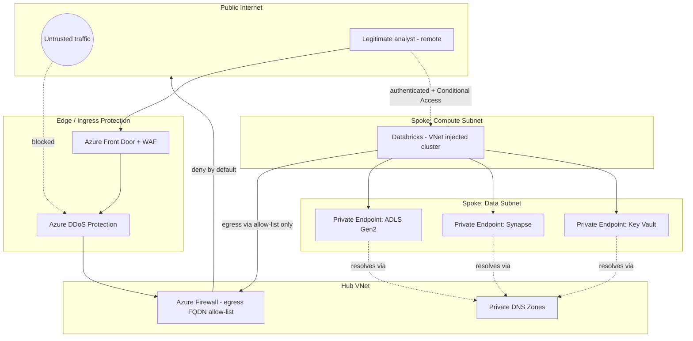
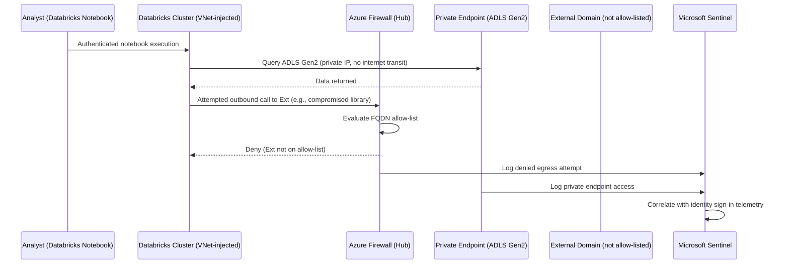
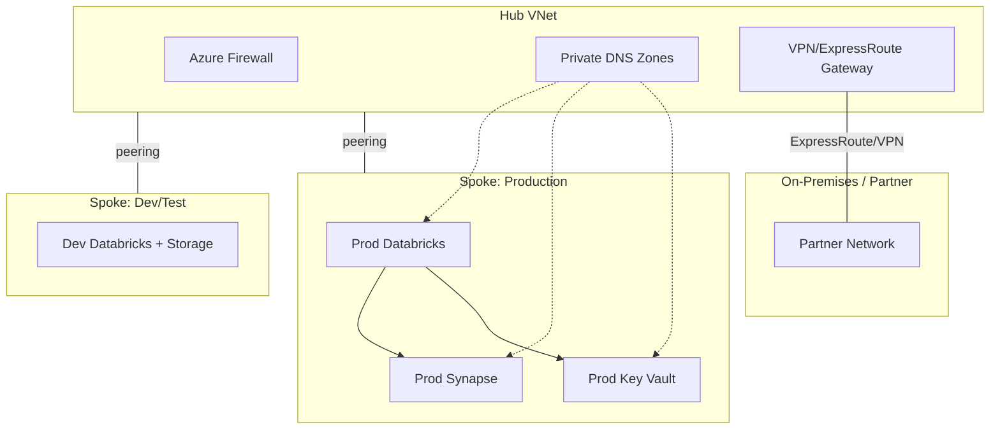
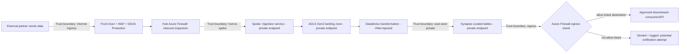

# Network Security and Zero Trust

> Part of the **Enterprise Data & AI Architecture Handbook** · Phase-10 — Security, Identity & Compliance · Chapter 04.
> Estimated study time: **60 min reading + ~4h labs**.
> **Prerequisite:** read [Azure Networking](../Phase-03/04_Azure_Networking.md) first.

---

## Executive Summary

[Azure Networking](../Phase-03/04_Azure_Networking.md#executive-summary) established the primitives — VNets, subnets, NSGs, Private Link, ExpressRoute — and argued for "private-by-default" as the defensible enterprise stance. This chapter takes that stance and gives it a name and a rigorous model: **zero trust**, the architecture that explicitly assumes the network perimeter is already compromised or was never trustworthy to begin with, and re-derives every access decision from identity and context rather than network location. This is the concrete network-layer implementation of the trust-boundary model [Security Foundations](01_Security_Foundations.md#core-concepts) drew on paper and the identity-centric verification [Identity and Access Management with Entra](02_Identity_and_Access_Management_with_Entra.md#core-concepts) established as the real perimeter — this chapter is where "identity is the new perimeter" becomes an actual, enforced network design, not a slogan.

This chapter covers the **zero-trust principles** (verify explicitly, use least-privilege access, assume breach) and how they invert the classical "trusted internal network, untrusted internet" model; **micro-segmentation and private endpoints** as the mechanism that shrinks the blast radius of any single compromised workload to the smallest reasonable network segment, and Private Link's specific role in removing PaaS services from the public internet's attack surface entirely; **egress control and data exfiltration prevention**, the frequently under-invested half of network security — most enterprise network security programs obsess over what comes in and neglect what can silently leave; **firewalls, WAF, and DDoS protection** as the concrete perimeter and application-layer controls that remain necessary even in a zero-trust model (zero trust does not mean "no firewalls," it means "don't rely on the firewall alone"); and **securing lakehouse networking specifically** — the dense, multi-service east-west traffic pattern between Databricks, Synapse, Storage, and orchestrators that [Azure Networking](../Phase-03/04_Azure_Networking.md#executive-summary) flagged as especially high-leverage and easy to get wrong.

The bias remains **Azure-primary (~60%)** — Azure Firewall Premium, Private Link/Private Endpoints, Azure DDoS Protection, Web Application Firewall on Application Gateway/Front Door, Network Security Perimeter — **~30% enterprise open source** (Istio/Linkerd service mesh for micro-segmentation, Cilium/eBPF network policy, Suricata/Zeek for network intrusion detection) and **~10% AWS/GCP comparison-only** (AWS Network Firewall/Shield, GCP Cloud Armor/BeyondCorp).

**Bottom line:** the network perimeter is dead as a primary trust boundary — not because firewalls stopped working, but because the modern data platform's actual attack surface (SaaS integrations, remote work, multi-cloud, partner APIs, AI agents calling external tools) routinely bypasses any single network boundary an architect could draw. An architect who still reasons "it's inside the VNet, so it's trusted" is defending against yesterday's threat model. Zero trust replaces that assumption with continuous, per-request verification — and this chapter shows exactly how to build that into a lakehouse's actual network topology: private endpoints closing public exposure, micro-segmentation containing lateral movement, egress control catching exfiltration, and WAF/DDoS protection holding the outer perimeter that, while no longer sufficient alone, remains a necessary layer in the defense-in-depth model from [Security Foundations](01_Security_Foundations.md#architecture).

---

## Learning Objectives

By the end of this chapter you will be able to:

1. **Explain the zero-trust principles** (verify explicitly, least-privilege access, assume breach) and articulate precisely how they differ from perimeter-based network trust.
2. **Design micro-segmentation** for a data platform's VNet topology, containing lateral movement between compute, storage, and orchestration tiers.
3. **Configure private endpoints for PaaS data services** (Storage, Databricks, Synapse, Key Vault) and explain the specific attack surface each closes.
4. **Design egress control policies** that detect and prevent data exfiltration, not only inbound threats.
5. **Configure Azure Firewall, WAF, and DDoS Protection** and explain what each protects against and what it does not.
6. **Architect secure lakehouse networking** end to end, addressing the dense east-west traffic pattern between Databricks, Synapse, Storage, and orchestrators.
7. **Apply zero-trust network practices on Azure** using Private Link, Azure Firewall Premium, and Network Security Perimeter, with a defensible comparison to AWS and GCP equivalents.
8. **Defend network-security architecture decisions** in engineer, staff engineer, architect, and CTO review settings, including trade-offs between segmentation rigor and operational complexity.

---

## Business Motivation

- **Perimeter-only security fails against the actual modern attack path** — credential theft, insider threat, and compromised third-party SaaS integrations routinely originate from inside or beyond any single network boundary; a firewall at the edge does nothing against an attacker already holding a valid, stolen credential.
- **Data exfiltration is frequently the actual business-damaging event, not the initial compromise** — an attacker gaining access to one compute node is a contained incident if egress is tightly controlled; the same access becomes a breach the moment gigabytes of customer data silently leave via an uncontrolled outbound path.
- **Public endpoints on PaaS data services are a persistent, quantifiable audit finding** — [Security Foundations](01_Security_Foundations.md#core-concepts)'s OWASP-for-data-platforms mapping specifically calls out publicly-readable storage as a recurring, damaging misconfiguration; private endpoints close this exposure by construction rather than relying on access-policy review to catch every instance.
- **Regulatory frameworks increasingly reference zero-trust architecture explicitly** (NIST SP 800-207 is directly cited in US federal procurement requirements and increasingly in enterprise vendor-risk assessments), making zero-trust adoption a contractual and compliance necessity, not only a technical best practice — feeding directly into [Compliance and Regulatory Frameworks](#further-reading) (Phase-10 Chapter 06).
- **Lakehouse architectures have an unusually dense, high-value east-west traffic pattern** — Databricks-to-Storage, Databricks-to-Synapse, orchestrator-to-everything — that a network diagram drawn only for north-south (internet-facing) traffic completely misses, leaving the actual highest-volume, highest-value traffic ungoverned.
- **DDoS and volumetric attacks against customer-facing data APIs carry direct revenue and SLA cost** — every minute of a data-serving API's unavailability during a DDoS event is measurable against contractual SLAs and customer trust, justifying DDoS Protection and WAF investment as a direct business continuity control, not just a security nicety.

---

## History and Evolution

- **1990s-2000s — the castle-and-moat model dominates**: a hardened network perimeter (firewalls, DMZs) protects an implicitly trusted internal network, the assumption [Azure Networking](../Phase-03/04_Azure_Networking.md#core-concepts)'s VNet/NSG primitives were originally designed to extend into the cloud.
- **2004 — the Jericho Forum** publishes early "de-perimeterization" principles, among the first formal industry articulations that the hardening perimeter model was breaking down as organizations adopted SaaS, remote access, and partner integrations that could not be cleanly walled off.
- **2009 — Google's BeyondCorp initiative** (publicly documented from 2014 onward) is triggered directly by the Operation Aurora breach, in which attackers who compromised endpoints inside Google's network moved laterally with the implicit trust the perimeter model granted; BeyondCorp becomes the widely-cited reference implementation of "no more VPN, no more implicit network trust."
- **2010 — Forrester analyst John Kindervag coins "zero trust"** as a formal, named architecture pattern, explicitly reframing "trust" as a vulnerability to be eliminated from network design rather than a convenience to be granted by default.
- **2013-2018 — Micro-segmentation matures** as a commercial and cloud-native capability (NSX, and cloud-native NSGs/security groups), moving segmentation granularity from "the network perimeter" down to "the individual workload or subnet."
- **2018-2020 — Azure Private Link (2019) and equivalent hyperscaler private-connectivity services mature**, giving cloud-native PaaS services a mechanism to be reached entirely over private IP space, closing the public-endpoint exposure that had been an implicit, largely unaddressed risk of the "everything is a managed API on the public internet" cloud-native default.
- **2020 — NIST SP 800-207** formally standardizes zero-trust architecture, giving the industry (and, significantly, US federal procurement policy) a common reference model beyond individual vendors' marketing terminology.
- **2021 — US Executive Order 14028** mandates federal agencies adopt zero-trust architecture on a defined timeline, catalyzing broad private-sector adoption as government contractors and regulated industries followed suit.
- **2022-present — service mesh-based micro-segmentation (Istio, Linkerd) and eBPF-based network policy (Cilium) mature** as the Kubernetes-native implementation of zero-trust micro-segmentation, directly extending the principles into containerized data-platform workloads (elaborated in [Kubernetes](../Phase-09/06_Kubernetes.md#security)).
- **2023-present — Microsoft Entra Private Access and Network Security Perimeter** extend zero-trust network principles specifically to PaaS-to-PaaS traffic governance at the Azure platform level, addressing the lakehouse-specific east-west traffic pattern this chapter emphasizes.

---

## Why This Technology Exists

The classical network-perimeter security model assumed a stable, drawable boundary between "trusted inside" and "untrusted outside" — an assumption that has not matched reality for over a decade, once SaaS, remote work, partner integrations, multi-cloud estates, and (now) autonomous AI agents calling external tools made "inside the network" a poor proxy for "safe to trust." Zero-trust network architecture exists to replace a single, brittle location-based trust decision with continuous, per-request verification grounded in identity and context — the same shift [Identity and Access Management with Entra](02_Identity_and_Access_Management_with_Entra.md#why-this-technology-exists) made at the identity layer, applied now to the network layer that has to actually carry every one of those verified requests.

---

## Problems It Solves

- **Lateral movement after an initial compromise** — micro-segmentation contains a compromised workload to its own segment, preventing it from freely reaching every other system on a flat network.
- **Public exposure of PaaS data services** — private endpoints remove Storage, Databricks, Key Vault, and Synapse control-plane/data-plane traffic from the public internet's reachable surface entirely.
- **Silent data exfiltration** — egress control (explicit allow-listing, DLP-aware egress filtering) turns an unbounded, implicitly-trusted outbound path into a governed, monitored one.
- **Volumetric and application-layer attacks against customer-facing endpoints** — DDoS Protection and WAF absorb and filter attack traffic before it reaches application/data infrastructure.
- **Ungoverned east-west traffic between lakehouse components** — explicit network policy between Databricks, Synapse, Storage, and orchestrators closes the gap left by network diagrams that only model north-south, internet-facing traffic.

---

## Problems It Cannot Solve

- **It cannot substitute for identity and authorization controls.** Zero-trust networking verifies *where a request is coming from and whether the network path is appropriately restricted*; it does not itself decide whether the requesting identity should be authorized for the specific data — that remains [Identity and Access Management with Entra](02_Identity_and_Access_Management_with_Entra.md#core-concepts)'s responsibility, and the two are complementary, not substitutable.
- **It cannot fully eliminate the risk of a compromised, legitimately-authorized identity.** Zero trust reduces the blast radius and adds continuous verification, but a stolen, valid session token used from an allowed network path within its normal risk profile can still succeed — this is why Conditional Access risk signals ([Identity and Access Management with Entra](02_Identity_and_Access_Management_with_Entra.md#core-concepts) §2.4) must operate alongside network-layer zero trust, not instead of it.
- **It cannot make a poorly-segmented application architecture secure through network controls alone.** If every microservice in a platform legitimately needs to talk to every other microservice with no meaningful data-sensitivity boundary between them, network micro-segmentation has little blast-radius-reduction value to offer — segmentation benefits from an application architecture that has actual trust boundaries to enforce.
- **It cannot prevent every DDoS attack regardless of scale**, though modern cloud DDoS Protection services absorb the overwhelming majority of real-world volumetric attacks; a sufficiently resourced, sophisticated, application-layer-aware attack can still require active incident response, not purely automated mitigation.
- **It cannot replace the encryption and data-centric protection covered in [Data Security and Encryption](03_Data_Security_and_Encryption.md#core-concepts).** Network controls decide *whether traffic can reach a system at all*; they do not protect the data once a request legitimately arrives — both layers are required.

---

## Core Concepts

### 4.1 Zero-Trust Principles

NIST SP 800-207 formalizes three core tenets that this chapter's every subsequent control implements:

- **Verify explicitly** — every access request is authenticated and authorized based on all available signals (identity, device health, service/workload health, data classification, network location as one signal among several, not the sole determinant), for every request, not once at network-perimeter entry.
- **Use least-privilege access** — network access, like identity access ([Identity and Access Management with Entra](02_Identity_and_Access_Management_with_Entra.md#core-concepts) §2.3), is scoped to the minimum required, for the minimum necessary duration, applied at the resource or even request level rather than granting broad network reachability by default.
- **Assume breach** — design as though an attacker is already present somewhere in the environment; minimize blast radius, segment aggressively, encrypt everywhere (including internal east-west traffic, per [Networking Fundamentals](../Phase-00/04_Networking_Fundamentals.md#security)'s service-mesh mTLS ADR), and verify continuously rather than trusting a single perimeter check to have been sufficient.

The practical inversion from the classical model: instead of asking "is this traffic coming from inside the trusted network," zero trust asks "does this specific request, from this specific verified identity and device, to this specific resource, satisfy this resource's specific access policy, right now" — a per-request, per-resource evaluation rather than a one-time, location-based trust grant.

### 4.2 Micro-Segmentation

Micro-segmentation divides a network into small, independently-secured zones — down to the individual subnet, workload, or even container — so that a compromise in one segment does not grant reachability to every other segment by default:

- **Coarse segmentation (VNet/subnet-level)** — separating dev/test/prod, and separating compute tiers (orchestration, processing, storage-facing) into distinct subnets with NSGs enforcing explicit allow-lists between them, per [Azure Networking](../Phase-03/04_Azure_Networking.md#core-concepts)'s subnet-as-policy-boundary model.
- **Fine-grained segmentation (workload/pod-level)** — within a Kubernetes cluster hosting data-processing workloads, Kubernetes Network Policies or a service mesh (Istio, Linkerd, or Cilium's eBPF-based enforcement) restrict which pods can communicate with which others, independent of the coarser VNet/subnet boundary, elaborated in [Kubernetes](../Phase-09/06_Kubernetes.md#security).
- **The blast-radius math:** on a flat, unsegmented network, compromising any single workload grants an attacker reachability to every other workload on that network; with N independently-enforced segments, a compromise is contained to roughly 1/N of the environment (in practice, considerably better, since segments are drawn around actual trust boundaries, not merely N equal-sized buckets) — the single highest-leverage architectural lever against lateral movement.
- **Segmentation must be drawn around actual data-sensitivity and blast-radius boundaries**, not organizational convenience — a segment boundary between "the ingestion tier" and "the tier holding regulated PII" is meaningful; a segment boundary that splits an application in half for no security-relevant reason adds operational friction without a corresponding security benefit.

### 4.3 Private Endpoints and Private Link

**Azure Private Link** provisions a **private endpoint** — a network interface with a private IP address from the customer's own VNet address space — for a PaaS service (Storage, Key Vault, Databricks control plane, Synapse, SQL Database), so that traffic to that service never traverses the public internet at all, even though the service itself is multi-tenant and managed by Microsoft:

- **What it closes:** without a private endpoint, a PaaS service's public endpoint is reachable from the internet (even if access-key- or RBAC-protected), meaning a misconfigured access policy, a leaked key, or a future platform vulnerability is exploitable from anywhere; with a private endpoint (and public network access disabled on the resource), the service is unreachable except from within the specific VNets granted private connectivity, removing an entire class of exposure regardless of access-policy correctness.
- **DNS is the operational complexity private endpoints introduce** — a private endpoint requires a matching **Private DNS zone** entry so that the service's standard hostname (`mystorageaccount.blob.core.windows.net`) resolves to the private IP rather than the public one; getting this wrong (or omitting it) is the most common private-endpoint misconfiguration, silently leaving clients still resolving to and reaching the public endpoint.
- **Private endpoints do not replace identity/RBAC controls** — they close the network-reachability gap; a private endpoint with an overly permissive RBAC role assignment is still overly permissive, just no longer reachable from the public internet — both controls are required, matching this chapter's "network controls complement, not substitute for, identity controls" theme.
- **Service endpoints (an older, coarser mechanism)** route traffic to a PaaS service over the Azure backbone rather than the public internet, but the service still has a publicly-routable IP and firewall-rule-based access control (restricting to specific VNet/subnet source) rather than a true private IP — private endpoints are the stronger, currently-recommended pattern for new architecture; service endpoints remain relevant primarily for legacy configurations.

### 4.4 Egress Control and Data Exfiltration Prevention

Most enterprise network security investment historically concentrated on inbound (north-south, internet-to-datacenter) protection, leaving outbound traffic comparatively ungoverned — a gap directly exploitable for data exfiltration:

- **Default-deny egress, explicit allow-list** — rather than allowing all outbound traffic by default and trying to detect bad actors within it, a zero-trust posture defaults outbound network access to deny, explicitly allow-listing only the specific external endpoints (package registries, approved SaaS APIs, specific partner endpoints) a workload legitimately needs.
- **Azure Firewall / NAT Gateway as the egress control point** — routing all outbound traffic through a centralized firewall (rather than direct-to-internet from every subnet) creates a single point where FQDN-based allow-listing, threat intelligence-based filtering, and traffic logging can all be applied consistently.
- **DLP-aware egress inspection** — for the highest-sensitivity data flows, egress traffic can be inspected (where architecturally feasible, respecting TLS-inspection trade-offs) for patterns matching classified data (per [Data Security and Encryption](03_Data_Security_and_Encryption.md#core-concepts)'s classification model) attempting to leave via an unexpected channel.
- **The insider/compromised-credential threat model egress control specifically addresses:** an attacker (external or a malicious/compromised insider) who has legitimately reached a system via a correctly-authenticated session can still be stopped at the egress boundary if the destination they are attempting to exfiltrate data to is not on the allow-list — egress control is a control that operates even when every upstream identity control has already been satisfied by the attacker.

### 4.5 Firewalls, WAF, and DDoS Protection

Zero trust does not mean "delete the firewall" — perimeter and application-layer controls remain a necessary layer in defense in depth, specifically against threats that precede or bypass identity verification entirely:

- **Azure Firewall (Standard/Premium)** — a stateful, centralized network firewall providing FQDN filtering, threat intelligence-based filtering, and (Premium tier) TLS inspection and IDPS (intrusion detection and prevention), typically deployed as the central egress/ingress inspection point in a hub-spoke topology.
- **Web Application Firewall (WAF)** — deployed on Azure Application Gateway or Azure Front Door, protects HTTP/S-facing applications and APIs against the OWASP Top 10 web-application attack patterns (SQL injection, cross-site scripting) at the application layer, a distinct concern from network-layer filtering.
- **Azure DDoS Protection (Basic, included by default, and Standard, paid)** — mitigates volumetric and protocol-level denial-of-service attacks against public IP resources; DDoS Protection Standard adds adaptive tuning, attack analytics, and cost protection (crediting scale-out costs incurred during a mitigated attack) beyond the always-on Basic tier.
- **Why these remain necessary under zero trust:** a DDoS attack or an unauthenticated exploit attempt against a public endpoint occurs *before* any identity-verification step has a chance to run; perimeter controls (firewall, WAF, DDoS protection) are what stop or absorb that class of threat, while zero-trust identity/segmentation controls handle everything downstream of an established, authenticated connection.

### 4.6 Securing Lakehouse Networking

Applying the preceding principles concretely to a lakehouse's actual traffic pattern — the dense east-west flow [Azure Networking](../Phase-03/04_Azure_Networking.md#executive-summary) specifically flagged:

- **Databricks control plane vs. data plane** — Databricks' control plane (job scheduling, notebook UI) is managed by Databricks in a Microsoft/Databricks-managed subscription; the data plane (the actual cluster VMs processing data) runs in the customer's VNet ("VNet injection" / secure cluster connectivity). Network security must address both: private endpoints for control-plane communication, and NSG/UDR-governed data-plane VNet placement.
- **Databricks-to-Storage traffic** — should traverse private endpoints to ADLS Gen2, never the public blob endpoint, with the storage account's public network access disabled entirely once private connectivity is verified working.
- **Databricks/Synapse-to-orchestrator traffic** — an orchestrator (ADF, Airflow on AKS) triggering jobs and retrieving status should communicate over private endpoints/VNet peering, not public control-plane APIs, especially where the orchestrator itself sits in a separate, more tightly locked-down management subnet.
- **Cross-workspace/cross-region lakehouse traffic** — a multi-workspace or multi-region lakehouse (e.g., disaster-recovery replication, or a hub-and-spoke pattern serving multiple business units) should use VNet peering or ExpressRoute/VPN gateway transit rather than routing inter-region lakehouse traffic over the public internet.
- **The concrete architecture pattern:** a hub VNet hosting Azure Firewall (egress inspection and FQDN allow-listing) and shared private DNS zones, with spoke VNets per environment/workload hosting Databricks (VNet-injected), Synapse, and their private endpoints — a direct application of [Azure Networking](../Phase-03/04_Azure_Networking.md#architecture)'s hub-spoke topology specifically hardened with zero-trust segmentation and private connectivity.

---

## Internal Working

A representative zero-trust-governed request from an analyst's Databricks notebook to a Synapse-held table, traversing the lakehouse network topology:

1. **Analyst authenticates** to the Databricks workspace via Entra ID SSO, subject to Conditional Access evaluation (device compliance, MFA) per [Identity and Access Management with Entra](02_Identity_and_Access_Management_with_Entra.md#internal-working) — this happens over the Databricks control-plane's private endpoint, not a public URL.
2. **Notebook execution launches on a cluster** provisioned in the customer's VNet-injected Databricks subnet; the cluster's NSG permits only the specific outbound flows required (to the Databricks control plane, to ADLS Gen2 via private endpoint, to Synapse via private endpoint) — all other outbound traffic is denied by the subnet's default-deny egress posture.
3. **The notebook queries Synapse** over a private endpoint connection; the traffic never leaves the VNet/peered-VNet boundary, traversing only private IP space.
4. **Synapse evaluates the query's authorization** (Entra ID authentication, RLS/column-level checks per [Data Security and Encryption](03_Data_Security_and_Encryption.md#core-concepts)) — the network layer has already ensured only an appropriately-segmented, privately-connected caller could even reach this point; the data layer now performs its own, independent authorization check.
5. **If the notebook attempts an unexpected outbound call** (e.g., a compromised or malicious library attempting to POST data to an external, non-allow-listed domain), the cluster subnet's egress control (routed through the hub's Azure Firewall FQDN allow-list) blocks the connection and logs the attempted destination.
6. **All traffic — allowed and denied — is logged** via NSG flow logs and Azure Firewall logs, ingested into the same Sentinel workspace established in [Security Foundations](01_Security_Foundations.md#observability), correlated with the identity-layer telemetry from [Identity and Access Management with Entra](02_Identity_and_Access_Management_with_Entra.md#observability) to give a full request-to-response, identity-to-network audit trail.

---

## Architecture

Every arrow crossing a subgraph boundary is a candidate for its own STRIDE analysis per [Security Foundations](01_Security_Foundations.md#internal-working)'s methodology; the diagram makes explicit that legitimate east-west traffic (Databricks to its private endpoints) never traverses the public internet or even the hub firewall, while all egress to external destinations is forced through the hub's allow-list.

---

## Components

- **Azure Firewall (Standard/Premium)** — the centralized egress/ingress inspection point in the hub VNet, providing FQDN filtering, threat intelligence, and (Premium) TLS inspection/IDPS.
- **Private endpoints and Private DNS zones** — the mechanism closing public PaaS exposure and correctly resolving service hostnames to private IPs, per §4.3.
- **Network Security Groups (NSGs) and Application Security Groups (ASGs)** — subnet- and workload-level stateful traffic filtering implementing micro-segmentation.
- **Azure DDoS Protection (Standard)** — volumetric and protocol-level attack mitigation for public-facing IP resources.
- **Web Application Firewall (on Application Gateway or Front Door)** — application-layer (OWASP Top 10) protection for HTTP/S-facing services.
- **Network Security Perimeter** — a newer Azure capability explicitly governing PaaS-to-PaaS traffic (e.g., which storage accounts a specific Key Vault may communicate with), addressing east-west PaaS traffic that traditional VNet-based controls do not directly reach.
- **Service mesh (Istio/Linkerd) or Cilium network policy** — fine-grained, workload-level micro-segmentation and mTLS enforcement within Kubernetes-hosted data-processing workloads.

---

## Metadata

- **Network topology and segmentation-policy documentation** — the hub-spoke layout, subnet purpose, and NSG rule intent should be documented and version-controlled (Terraform/Bicep as the source of truth), not reconstructed by reading raw NSG rules during an incident.
- **Private endpoint and DNS zone inventory** — a central, queryable inventory of which resources have private endpoints, which VNets are linked to which private DNS zones, and whether public network access has actually been disabled (not merely "private endpoint added, public access left enabled by oversight") is essential audit metadata.
- **Egress allow-list metadata** — the Azure Firewall's FQDN allow-list rules should be documented with the business justification and owning team for each entry, avoiding an ever-growing, unreviewed allow-list that defeats the purpose of default-deny egress.
- **Flow-log and firewall-log retention metadata** — NSG flow logs and Azure Firewall logs should be retained per the organization's incident-investigation and compliance requirements, with clear metadata on retention duration and the specific log-analytics workspace they feed.
- **Segmentation-boundary rationale** — each micro-segmentation boundary should have a documented rationale (what data sensitivity or blast-radius concern it addresses) tying network design back to the data-classification model from [Data Security and Encryption](03_Data_Security_and_Encryption.md#governance).

---

## Storage

- **NSG flow logs and Azure Firewall logs** are stored in Azure Storage and/or Log Analytics, with retention configured to match compliance requirements (elaborated in [Compliance and Regulatory Frameworks](#further-reading), Chapter 06).
- **Private DNS zone records** are stored as Azure-managed DNS zone data, linked to specific VNets; this configuration should be managed as code (Terraform `azurerm_private_dns_zone` and `azurerm_private_dns_zone_virtual_network_link`) rather than manually configured per environment.
- **Firewall rule collections and NSG rule sets** are themselves configuration artifacts that should live in version control, deployed via the same CI/CD pipeline discipline as any other infrastructure ([Infrastructure as Code with Terraform](../Phase-09/04_Infrastructure_as_Code_with_Terraform.md#storage)), not edited ad hoc in the portal.
- **No sensitive data traverses or is stored at the network-control layer itself** — firewalls, NSGs, and private endpoints route and filter traffic; the data protection covered in [Data Security and Encryption](03_Data_Security_and_Encryption.md#storage) governs what happens to the data these controls carry.

---

## Compute

- **Azure Firewall is a managed, auto-scaling service** — customers do not size or patch the underlying compute, but should size the SKU/tier (Standard vs. Premium) and plan for the firewall's own throughput limits under peak egress/ingress load.
- **WAF and DDoS Protection compute is fully managed** as part of Application Gateway/Front Door and the DDoS Protection service respectively; customer responsibility is configuration (WAF rule sets, custom rules) rather than capacity planning.
- **Service mesh sidecar proxies (Istio/Linkerd) consume measurable per-pod CPU/memory overhead** — factor this into Kubernetes cluster capacity planning per [Kubernetes](../Phase-09/06_Kubernetes.md#compute), directly analogous to the sidecar overhead noted in the [Networking Fundamentals](../Phase-00/04_Networking_Fundamentals.md) service-mesh ADR.
- **TLS inspection (Azure Firewall Premium) adds measurable compute and latency overhead** to inspected flows, a deliberate trade-off between deep content inspection and throughput/latency that should be scoped to the traffic that genuinely needs it (e.g., egress from a high-sensitivity subnet) rather than applied uniformly to all traffic.

---

## Networking

*(This chapter's entire scope is networking; this section covers meta-level networking design discipline specific to zero-trust rollout.)*

- **Design the hub-spoke topology before implementing individual controls** — Azure Firewall, private endpoints, and NSGs are most effective when deployed against a coherent topology (per [Azure Networking](../Phase-03/04_Azure_Networking.md#architecture)), not retrofitted piecemeal onto an ad hoc network layout.
- **DNS design is the most common source of private-endpoint rollout failure** — verify private DNS zone links are correctly associated with every VNet that needs to resolve a given private endpoint, including spoke VNets that only peer with, rather than directly host, the resource.
- **Plan subnet sizing for private endpoints explicitly** — private endpoints consume IP addresses from the subnet they are deployed into; under-sized subnets are a common, avoidable operational blocker discovered only during rollout.
- **Transit and peering topology must avoid creating unintended trust bridges** — a spoke VNet peered to the hub for firewall egress should not thereby gain unintended reachability to an unrelated spoke's private endpoints unless that traffic is explicitly intended and reviewed.

---

## Security

- **NSG and firewall rules must be reviewed for the "any-any" anti-pattern** — an NSG rule permitting any source/any destination/any port, even temporarily "to get things working," is a common, dangerous drift from the intended segmentation model and should be flagged by automated policy scanning (Azure Policy) rather than relying on manual review to catch it.
- **Private endpoint deployment must be paired with disabling the resource's public network access** — deploying a private endpoint while leaving public access enabled provides no actual security benefit, since the public path remains fully reachable; this is among the single most common private-endpoint misconfigurations found in security reviews.
- **Egress allow-lists must be reviewed periodically for stale entries**, exactly as access-control lists are reviewed under [Identity and Access Management with Entra](02_Identity_and_Access_Management_with_Entra.md#governance)'s access-review discipline — an unreviewed, ever-growing FQDN allow-list becomes an unmanaged exfiltration path in its own right.
- **TLS everywhere, including internal east-west traffic** — per the [Networking Fundamentals](../Phase-00/04_Networking_Fundamentals.md) service-mesh mTLS ADR, zero trust's "assume breach" tenet specifically implies internal traffic should not be assumed safe merely because it stays within the VNet.
- **DDoS and WAF protection must be enabled on every internet-facing IP, not only the "obviously important" ones** — an overlooked, unprotected public IP (a forgotten test endpoint, a debug port) is a common, avoidable gap that undermines an otherwise well-protected architecture.

---

## Performance

- **Private endpoints add negligible latency** compared to public endpoint access — traffic stays on the Azure backbone and typically within the same region, often *reducing* latency versus a public-internet round trip.
- **Azure Firewall throughput and connection limits must be sized for the platform's actual egress volume** — a high-throughput batch ingestion pipeline routed through an undersized firewall SKU can become an unexpected bottleneck; benchmark actual egress volume against the chosen SKU's documented throughput limits.
- **TLS inspection (Firewall Premium) meaningfully increases per-connection latency and reduces throughput** compared to non-inspected passthrough; scope it to flows that specifically need content inspection rather than applying it universally.
- **Service mesh mTLS sidecar overhead** adds a small, generally sub-millisecond per-hop latency in well-tuned deployments, a cost the [Networking Fundamentals](../Phase-00/04_Networking_Fundamentals.md) ADR judged acceptable in exchange for consistent zero-trust posture and observability.

---

## Scalability

- **Hub-spoke topology scales by adding spokes, not by growing a single flat network** — new business units, environments, or regions add a new spoke VNet peered to the shared hub, each with its own segmentation rather than being folded into an ever-larger single network.
- **Private DNS zone and private endpoint provisioning should be templated/automated (Terraform modules)** as the number of PaaS resources needing private connectivity grows into the hundreds, avoiding manual, error-prone per-resource configuration.
- **Centralized egress inspection (hub Azure Firewall) scales better than per-spoke firewalls** for consistent policy enforcement and audit, at the cost of the hub becoming a shared-fate throughput dependency — size and monitor it accordingly as spoke count and traffic volume grow.
- **Network Security Perimeter and policy-as-code enforcement (Azure Policy denying public network access on new resources) are what let zero-trust network posture scale across an entire tenant** without relying on every team remembering to configure private endpoints correctly on every new resource.

---

## Fault Tolerance

- **Azure Firewall and DDoS Protection are zone-redundant managed services**, but architects should still design for the hub's availability being a shared dependency — a hub outage affecting egress inspection can impact every spoke simultaneously; consider whether specific high-availability workloads need a documented, tested fallback path.
- **Private DNS zone misconfiguration is a common, self-inflicted "fault"** — a missing or incorrect VNet link silently breaks name resolution for a private endpoint, manifesting as a confusing connectivity failure rather than an obvious DNS error; include private-endpoint DNS resolution checks in platform health monitoring.
- **NSG/firewall rule changes should be tested in a non-production environment or via a change-simulation tool (Azure Network Watcher's IP flow verify) before production application**, since an overly restrictive rule change can silently break a legitimate production data flow with symptoms that look like an application bug rather than a network change.
- **DDoS Protection Standard's cost-protection guarantee** (crediting customer costs from attack-driven auto-scaling) is itself a fault-tolerance/business-continuity feature worth factoring into the Standard-vs-Basic tier decision for business-critical public endpoints.

---

## Cost Optimization

- **Azure Firewall Premium's TLS inspection and IDPS carry a real cost premium over Standard** — reserve Premium for the subset of traffic/subnets that genuinely need deep inspection, rather than upgrading the entire hub uniformly.
- **DDoS Protection Standard is billed per protected virtual network plus a per-public-IP-resource charge** — apply it deliberately to public IPs actually facing meaningful attack risk (customer-facing APIs, high-profile endpoints) rather than reflexively to every public IP in the estate, while still ensuring nothing business-critical is left on Basic-only protection by oversight.
- **Private endpoints carry a modest per-endpoint-hour charge plus data-processing charges** — at very large numbers of PaaS resources, this is a real, if usually modest, line item worth tracking, though it is rarely a reason to avoid private endpoints given the security benefit.
- **NAT Gateway vs. Azure Firewall for simple, non-inspected egress scenarios** — for workloads needing only outbound SNAT without FQDN filtering or threat intelligence, a NAT Gateway is materially cheaper than routing that traffic through Azure Firewall; reserve the firewall for traffic that actually needs its inspection capability.
- **Worked FinOps example:** A platform team initially routed all 30 of its subnets' egress traffic through a single Azure Firewall Premium instance (~$1.25/hour base + throughput unit charges, plus TLS inspection processing), for roughly **$1,800/month** in base + inspection charges, even though an audit found only 4 of the 30 subnets (those handling regulated data egress or requiring FQDN-based SaaS allow-listing) actually needed firewall-level inspection; the remaining 26 subnets needed only basic outbound SNAT for package-registry and Azure-service access with no inspection requirement. Moving those 26 subnets to NAT Gateway (~$0.045/hour + data processing, roughly $35/month per gateway shared appropriately across subnets, ≈$300/month total) while keeping Firewall Premium scoped only to the 4 regulated subnets (reducing throughput-unit provisioning accordingly, ≈$900/month) reduces total egress-control cost from ~$1,800/month to roughly **$1,200/month**, a ~33% reduction, while *improving* the security posture on the 4 subnets that matter most by allowing a more generously provisioned, better-tuned firewall configuration for that smaller, higher-value scope.

---

## Monitoring

- **NSG flow log analytics** — track allowed/denied flow volume by subnet and rule, surfaced via Traffic Analytics (built on NSG flow logs) to visualize actual traffic patterns against the intended segmentation design.
- **Azure Firewall log analytics** — track denied egress attempts (potential exfiltration attempts or misconfigured application dependencies), FQDN rule hit/miss rates, and threat-intelligence-based blocks.
- **Private endpoint connection state monitoring** — alert on a private endpoint entering a "disconnected" or "rejected" state, which silently breaks application connectivity without an obvious application-layer error.
- **DDoS Protection attack analytics and mitigation reports** — review post-attack mitigation reports to understand attack characteristics and validate that mitigation engaged as expected, feeding continuous tuning of protection policies.

---

## Observability

- **Unified network-security telemetry correlation** — NSG flow logs, Azure Firewall logs, WAF logs, and DDoS mitigation events should all flow into the same Sentinel workspace established in [Security Foundations](01_Security_Foundations.md#observability), correlated with identity telemetry from [Identity and Access Management with Entra](02_Identity_and_Access_Management_with_Entra.md#observability) so an analyst can answer "who, from where, attempted what network path, and was it allowed or denied."
- **Structured, correlated logging for every denied egress/ingress attempt** — a denied flow should carry enough context (source workload, destination FQDN/IP, rule that denied it) to distinguish a benign misconfiguration (a legitimate new dependency not yet allow-listed) from a genuine exfiltration or intrusion attempt.
- **Detection rules mapped to network-specific threat scenarios** — an unexpected spike in denied egress attempts from a single workload, traffic to a newly-registered or known-malicious domain (via threat-intelligence feed correlation), or an unexpected lateral-movement-pattern flow between segments that should not communicate, should each have a corresponding Sentinel analytics rule.
- **Private endpoint and DNS resolution health as an observability signal**, not only a security signal — a private endpoint silently failing DNS resolution is as much a reliability concern as a security one, and should be visible on the same dashboards.

### Operational Response Playbook

| Signal | Detection Query/Check | Remediation |
|---|---|---|
| Sustained spike in denied egress attempts from a single workload to an unrecognized external FQDN | Azure Firewall deny-log aggregation by source/destination in Sentinel, alerting on volume/novelty threshold | Page the security on-call lead; determine if the destination is a legitimate new dependency (add to allow-list via reviewed change) or a suspected compromise indicator (isolate the workload's subnet via NSG, investigate before restoring egress). |
| Private endpoint connection state changes to "Disconnected" or "Rejected" for a production resource | Azure Monitor alert on private endpoint connection-state metric/diagnostic log | Page the platform on-call engineer; verify whether the change was an intentional configuration update or unexpected; restore the approved private endpoint connection and verify DNS resolution before considering the incident closed. |
| DDoS Protection mitigation engages against a public-facing production IP | Azure DDoS Protection attack-mitigation alert via Azure Monitor/Sentinel integration | Notify the incident-response and customer-communications teams if customer-facing impact is possible; review the post-attack mitigation report; assess whether WAF/rate-limiting rules need tuning based on the attack's specific characteristics. |

---

## Governance

- **Public network access on PaaS resources is denied by default via Azure Policy**, with private-endpoint connectivity as the only sanctioned path, enforced tenant-wide rather than left to per-team discretion — a direct extension of [Security Foundations](01_Security_Foundations.md#governance)'s policy-as-code guardrail pattern.
- **Network topology, NSG rules, and firewall configuration are managed as code and reviewed through the same change-management process as any other infrastructure**, per [Infrastructure as Code with Terraform](../Phase-09/04_Infrastructure_as_Code_with_Terraform.md#governance) — no ad hoc portal-based rule changes in production.
- **Egress allow-list entries require a documented business justification and owning team**, reviewed periodically (quarterly at minimum) to prune stale or unused entries.
- **Segmentation boundaries are reviewed against the data-classification model** ([Data Security and Encryption](03_Data_Security_and_Encryption.md#governance)) at least annually or upon significant architecture change, ensuring network design continues to reflect actual data-sensitivity boundaries as the platform evolves.
- **Network security posture is reported alongside identity and data-protection metrics** in the same quarterly security-posture review established in [Security Foundations](01_Security_Foundations.md#enterprise-recommendations), not siloed as a separate, less-visible network-team-only concern.

---

## Trade-offs

| Dimension | Strict zero trust (default-deny egress, full micro-segmentation, private endpoints everywhere) | Loose network posture (broad egress, flat network, public endpoints) |
|---|---|---|
| Lateral-movement/exfiltration risk | Lower — contained blast radius, monitored egress | Higher — unrestricted lateral movement and exfiltration paths |
| Operational complexity | Higher — DNS, allow-list maintenance, segmentation design effort | Lower — fewer moving parts to configure and maintain |
| Initial rollout effort | Significant — topology redesign, private endpoint migration | Minimal — default cloud-native configuration |
| Debuggability | Denied-by-default can obscure legitimate new dependencies until explicitly allow-listed | Fewer "why is this blocked" incidents, at the cost of weaker security |
| Suitability | Regulated, high-sensitivity, or externally-facing data platforms | Acceptable only for genuinely low-risk, isolated experimentation, and even then not recommended as permanent |

The general enterprise guidance: strict zero-trust network posture is the correct default for any production data platform; the operational complexity it introduces (DNS, allow-list maintenance) is a one-time and ongoing but bounded cost, materially smaller than the cost of a single serious exfiltration or lateral-movement incident it prevents.

---

## Decision Matrix

| Scenario | Recommended Approach |
|---|---|
| Any production PaaS data service (Storage, Databricks, Synapse, Key Vault) | Private endpoint with public network access disabled; Private DNS zone correctly linked |
| High-throughput batch egress with no content-inspection requirement | NAT Gateway rather than Azure Firewall, for cost efficiency |
| Regulated or high-sensitivity data egress requiring FQDN allow-listing and inspection | Azure Firewall (Premium if TLS inspection/IDPS is required) |
| Customer-facing HTTP/S API or web application | WAF on Application Gateway/Front Door plus DDoS Protection Standard |
| Multi-workspace/multi-region lakehouse | VNet peering or ExpressRoute/VPN gateway transit, never public-internet inter-region traffic |
| Kubernetes-hosted data-processing workloads needing pod-level segmentation | Service mesh (Istio/Linkerd) or Cilium network policy, layered on top of VNet/subnet-level NSGs |

---

## Design Patterns

- **Hub-spoke with centralized egress inspection** — a shared hub VNet hosting Azure Firewall and Private DNS zones, with spoke VNets per environment/workload, extending [Azure Networking](../Phase-03/04_Azure_Networking.md#architecture)'s topology with zero-trust segmentation.
- **Private-by-default, public-by-exception** — every new PaaS resource defaults to private-endpoint-only connectivity, enforced by Azure Policy; a public endpoint requires an explicit, documented, time-bound exception.
- **Default-deny egress with allow-list-as-code** — Azure Firewall FQDN rules managed in Terraform, reviewed via pull request, rather than ad hoc portal additions.
- **Layered segmentation** — VNet/subnet-level NSGs for coarse isolation, service mesh/Cilium network policy for fine-grained workload-level segmentation within Kubernetes, neither treated as sufficient alone.
- **Golden-path network modules** — a platform team publishes reusable Terraform modules for "a correctly private-endpointed Databricks-and-Storage pair" so individual teams provision compliant network architecture by default rather than reconstructing it per project.

---

## Anti-patterns

- **Private endpoint added without disabling public network access** — the single most common, security-value-negating private-endpoint misconfiguration; verify both steps are completed together.
- **"Any-any" NSG or firewall rules left in place "temporarily" during initial development** — a common, dangerous drift that frequently survives into production because nobody circles back to tighten it.
- **Flat, unsegmented network shared across dev/test/prod and multiple business units** — maximizes lateral-movement blast radius and makes any single compromise a tenant-wide incident.
- **Broad, unreviewed egress allow-lists that grow indefinitely** — defeats the purpose of default-deny egress, becoming an unmanaged exfiltration path in its own right.
- **DDoS Protection and WAF enabled only on the "obviously important" public endpoint**, leaving a forgotten test/debug endpoint unprotected and exploitable.
- **Treating zero trust as purely a network-team initiative**, implemented without coordinating with identity ([Identity and Access Management with Entra](02_Identity_and_Access_Management_with_Entra.md)) and data-protection ([Data Security and Encryption](03_Data_Security_and_Encryption.md)) teams, producing a network layer that verifies location but not the identity or data-sensitivity context zero trust actually requires.

---

## Common Mistakes

- Forgetting to link a spoke VNet to the shared Private DNS zone, causing private-endpoint hostname resolution to silently fall back to (or fail to resolve at all versus) the public endpoint.
- Sizing a subnet too small to accommodate the number of private endpoints eventually needed, discovered only when provisioning fails mid-rollout.
- Assuming "the traffic stays inside the VNet" is sufficient justification to skip TLS/mTLS on internal east-west traffic, contradicting zero trust's "assume breach" tenet.
- Routing all egress traffic through Azure Firewall Premium uniformly, incurring unnecessary TLS-inspection cost and latency for traffic that never needed content inspection.
- Treating a WAF's default rule set as sufficient without tuning for the specific application's false-positive/false-negative profile, either blocking legitimate traffic or missing application-specific attack patterns.
- Designing network segmentation around organizational team boundaries rather than actual data-sensitivity and blast-radius boundaries, producing security theater without a corresponding risk-reduction benefit.

---

## Best Practices

- Default every new PaaS resource to private-endpoint-only connectivity with public network access disabled, enforced by Azure Policy, not left to individual team discretion.
- Manage NSG rules, firewall FQDN allow-lists, and private DNS zone configuration as code, reviewed through the same pull-request process as any other infrastructure change.
- Apply default-deny egress with an explicitly justified, periodically-reviewed allow-list, rather than permissive-by-default outbound access.
- Layer coarse (VNet/NSG) and fine-grained (service mesh/Cilium) segmentation deliberately, especially for Kubernetes-hosted data-processing workloads.
- Enable WAF and DDoS Protection Standard on every genuinely internet-facing production endpoint, not only the most visible ones.
- Correlate network-security telemetry (NSG flow logs, firewall logs) with identity telemetry in a single Sentinel workspace, closing the "network said allowed, but was the identity actually legitimate" gap.

---

## Enterprise Recommendations

- Mandate zero-trust network architecture (private-by-default, default-deny egress, micro-segmentation) as the enterprise baseline for any new data platform, with legacy platforms migrated on a prioritized, risk-ranked schedule rather than left indefinitely on the old model.
- Fund a centralized platform-networking function owning the hub VNet, golden-path Terraform modules for private connectivity, and the egress allow-list review process, rather than expecting every data-platform team to design network security independently.
- Require an Azure Policy-enforced guardrail denying public network access on new PaaS resources tenant-wide, with a tightly governed, time-bound exception process for the rare cases that genuinely need one.
- Track network-security posture (percentage of PaaS resources on private endpoints, egress-allow-list review currency, DDoS/WAF coverage of internet-facing IPs) as a standing metric in the same quarterly security review established in [Security Foundations](01_Security_Foundations.md#enterprise-recommendations).
- Extend zero-trust network principles explicitly to AI agent workloads calling external tools/APIs now — an agent's outbound tool-calling traffic should be subject to the same default-deny, allow-listed egress model as any other workload, not treated as an implicitly trusted exception because it originates from "the AI system."

---

## Azure Implementation

- **Azure Firewall (Standard/Premium)** — centralized egress/ingress inspection, FQDN filtering, threat intelligence, and (Premium) TLS inspection/IDPS, typically deployed in the hub VNet of a hub-spoke topology.
- **Private Link and Private Endpoints** — private connectivity for Storage, Databricks, Synapse, Key Vault, and most other Azure PaaS data services, paired with Private DNS zones for correct name resolution.
- **Azure DDoS Protection (Standard)** — volumetric/protocol-level DDoS mitigation with adaptive tuning, attack analytics, and cost protection for public IP resources.
- **Web Application Firewall on Application Gateway or Azure Front Door** — OWASP Top 10 application-layer protection for customer-facing HTTP/S endpoints.
- **Network Security Perimeter** — governs PaaS-to-PaaS network access explicitly (e.g., restricting which resources a Key Vault or Storage account will accept traffic from), addressing east-west PaaS traffic that VNet-based NSGs do not directly reach.
- **Azure Policy** — enforces "deny public network access" and "require private endpoint" guardrails tenant-wide, preventing non-compliant resource deployment rather than only flagging it after the fact.
- **Network Watcher (Traffic Analytics, IP Flow Verify, Connection Monitor)** — diagnostic and observability tooling validating actual traffic patterns against intended segmentation design.

---

## Open Source Implementation

- **Istio / Linkerd (service mesh)** — mTLS, fine-grained traffic policy, and per-hop observability for Kubernetes-hosted data-processing workloads, the open-source implementation of workload-level zero-trust segmentation referenced in the [Networking Fundamentals](../Phase-00/04_Networking_Fundamentals.md) ADR.
- **Cilium (eBPF-based network policy)** — high-performance, kernel-level network policy enforcement and observability for Kubernetes, an increasingly popular alternative to sidecar-based service mesh for teams prioritizing lower per-pod overhead.
- **Suricata / Zeek** — open-source network intrusion detection/prevention and traffic-analysis tools, commonly deployed for deep traffic inspection in self-managed or hybrid network architectures outside Azure Firewall's managed scope.
- **HashiCorp Consul** — service mesh and service-discovery tooling with mTLS and intention-based (zero-trust) traffic authorization, a common alternative in multi-cloud or non-Kubernetes-centric estates.
- **pfSense / OPNsense** — open-source firewall platforms occasionally used for on-premises or edge-network egress control in hybrid architectures connecting to Azure via ExpressRoute/VPN.

---

## AWS Equivalent (comparison only)

| Capability | Azure | AWS |
|---|---|---|
| Private PaaS connectivity | Private Link / Private Endpoints | AWS PrivateLink / VPC Endpoints |
| Centralized egress firewall | Azure Firewall | AWS Network Firewall |
| DDoS protection | Azure DDoS Protection Standard | AWS Shield Advanced |
| Web application firewall | WAF on Application Gateway/Front Door | AWS WAF on CloudFront/ALB |
| PaaS-to-PaaS traffic governance | Network Security Perimeter | VPC endpoint policies + resource-based policies |

**Advantages of AWS:** AWS PrivateLink was an early, mature implementation of the private-PaaS-connectivity pattern with broad service coverage; Shield Advanced integrates tightly with AWS's own cost-protection and 24/7 DDoS Response Team support. **Disadvantages:** AWS Network Firewall's FQDN-filtering and threat-intelligence feature set has historically been less feature-rich than Azure Firewall Premium's out-of-the-box IDPS; achieving Network-Security-Perimeter-equivalent centralized PaaS-to-PaaS governance typically requires assembling several separate AWS features. **Migration strategy:** the hub-spoke and private-connectivity concepts transfer directly; concrete VPC endpoint policies, security group rules, and Network Firewall rule groups require full AWS-specific rework. **Selection criteria:** choose AWS-native tooling for AWS-primary estates; choose Azure Firewall/Private Link for Azure-primary or Databricks-centric estates, particularly given Databricks' mature Azure VNet-injection support.

---

## GCP Equivalent (comparison only)

| Capability | Azure | GCP |
|---|---|---|
| Private PaaS connectivity | Private Link / Private Endpoints | Private Service Connect |
| Centralized egress firewall | Azure Firewall | Cloud NGFW (Next Generation Firewall) / Cloud Armor for L7 |
| DDoS protection | Azure DDoS Protection Standard | Google Cloud Armor (with Advanced tier for DDoS) |
| Web application firewall | WAF on Application Gateway/Front Door | Cloud Armor WAF rules |
| Zero-trust context-aware access | Conditional Access + Network Security Perimeter | BeyondCorp Enterprise (the original zero-trust reference implementation) |

**Advantages of GCP:** GCP's BeyondCorp Enterprise is the original, most mature reference implementation of zero-trust context-aware access in the industry, directly informing this chapter's principles; Private Service Connect provides a clean, well-regarded private-PaaS-connectivity model. **Disadvantages:** GCP's centralized egress-firewall tooling (Cloud NGFW) is comparatively newer and less feature-rich than Azure Firewall Premium's established IDPS/TLS-inspection capability. **Migration strategy:** zero-trust principles and hub-spoke topology concepts transfer directly; concrete VPC Service Controls, firewall rules, and Cloud Armor policies require GCP-specific rework. **Selection criteria:** choose GCP-native tooling for GCP-primary estates, particularly where BeyondCorp Enterprise's context-aware access maturity is valuable; choose Azure Firewall/Private Link for Azure-primary or Databricks-centric estates.

---

## Migration Considerations

- **Inventory every PaaS resource's current network exposure before migrating to private-endpoint-only** — determine which resources currently rely on public endpoints, prioritize migration by data sensitivity, and verify no legitimate dependency will break before disabling public access.
- **Migrate with dual connectivity during a verification window** — deploy the private endpoint and verify it works correctly (including DNS resolution from every dependent VNet) before disabling public network access, avoiding a hard cutover that risks an outage.
- **Roll out default-deny egress incrementally, starting in audit/log-only mode** — deploy the firewall/NSG rules in a logging-only configuration first, review what traffic *would* have been denied, build the allow-list from observed legitimate traffic, then switch to enforce mode — directly mirroring the migration discipline established in [Security Foundations](01_Security_Foundations.md#migration-considerations) and [Identity and Access Management with Entra](02_Identity_and_Access_Management_with_Entra.md#migration-considerations).
- **Prioritize migrating the highest-sensitivity data flows to full zero-trust segmentation first**, not the easiest ones — regulated-data-handling subnets and internet-facing production APIs should move ahead of low-risk internal tooling.
- **Expect a transitional period of mixed network maturity** — some resources fully private-endpointed and segmented, others still pending migration; track this explicitly as a security-debt burndown list, consistent with the tracking practice established across this Phase-10 chapter series.

---

## Mermaid Architecture Diagrams

---

## End-to-End Data Flow

---

## Real-world Business Use Cases

- A financial-services firm migrated its Databricks-based lakehouse from public-endpoint Storage access to a fully private-endpointed, default-deny-egress architecture after a security audit flagged the public storage endpoint as a critical finding; the migration eliminated the finding and, as a side effect, reduced data-egress latency slightly due to traffic staying on the Azure backbone.
- A healthcare data platform implemented Network Security Perimeter to explicitly govern which specific storage accounts a shared Key Vault instance would accept traffic from, closing a previously ungoverned PaaS-to-PaaS trust relationship that a traditional VNet/NSG-only design had not addressed.
- A retailer's customer-facing product-recommendation API, backed by a feature store, survived a large-scale volumetric DDoS attack during a peak sales event with zero customer-visible downtime, attributed directly to DDoS Protection Standard's adaptive tuning and a properly-configured WAF rule set that had been load-tested ahead of the event.

---

## Industry Examples

- **Google's BeyondCorp** remains the most widely cited reference implementation of zero-trust network architecture, directly triggered by a real lateral-movement breach (Operation Aurora) and publicly documented in detail, making it a common case study across the industry for "why zero trust" arguments.
- **Netflix's** open-sourced network-security tooling and public engineering blog posts on micro-segmentation at massive scale are frequently referenced as a model for applying zero-trust segmentation without sacrificing the operational agility a high-velocity engineering organization requires.
- **Capital One's 2019 breach** (traced to a misconfigured WAF and overly broad IAM role on a cloud storage bucket) is widely cited industry-wide as a cautionary case for exactly the combined network-misconfiguration-plus-over-permissioned-identity failure mode this chapter and [Identity and Access Management with Entra](02_Identity_and_Access_Management_with_Entra.md) jointly address.

---

## Case Studies

**Case: Private endpoint rollout leaves public access enabled.** A data platform team added private endpoints for their Databricks workspace's underlying ADLS Gen2 storage account as part of a security-hardening initiative, verified connectivity worked from the Databricks VNet, and marked the migration complete. Six months later, a routine external penetration test found the storage account was still reachable via its public blob endpoint using a leaked SAS token from an unrelated incident — the team had added the private endpoint but never disabled public network access on the storage account itself.

**Root cause:** the migration was tracked as "private endpoint added" rather than "private endpoint added AND public access disabled AND verified," missing the second, equally necessary step — exactly the common misconfiguration flagged in this chapter's **Security** and **Common Mistakes** sections.

**Remediation:** the team disabled public network access on the storage account, rotated the leaked SAS token, and — more durably — added an Azure Policy assignment denying storage account creation/update with public network access enabled tenant-wide, converting a one-time manual fix into a structural, self-enforcing guardrail that prevents recurrence across every current and future storage account, not just the one found during the penetration test.

---

## Hands-on Labs

1. **Lab 1 — Deploy a private endpoint and verify DNS resolution.** Provision a Storage account, deploy a private endpoint for it in a test VNet, configure the matching Private DNS zone and VNet link, and verify (via `nslookup`/`dig` from a VM in the VNet) that the storage account's standard hostname resolves to the private IP; then disable public network access and confirm public access fails.
2. **Lab 2 — Configure default-deny egress with Azure Firewall.** Deploy an Azure Firewall in a hub VNet, route a spoke subnet's default route through it, and configure an FQDN allow-list rule permitting only a specific package registry and Azure service endpoints; verify an unlisted destination is blocked and logged.
3. **Lab 3 — Build a micro-segmented NSG topology.** Design and deploy NSGs for a three-tier subnet layout (ingestion, processing, data), permitting only the specific required flows between tiers, and use Network Watcher's IP Flow Verify to confirm both allowed and denied flows behave as intended.
4. **Lab 4 — Configure WAF and DDoS Protection for a public endpoint.** Deploy Application Gateway with WAF enabled in Prevention mode for a sample web application, and enable DDoS Protection Standard on its public IP; review the WAF's logged detections against a simulated SQL-injection test request.
5. **Lab 5 — Investigate a simulated exfiltration attempt.** Using Azure Firewall deny logs ingested into Log Analytics, write a KQL query identifying which workload attempted the highest volume of denied outbound connections to non-allow-listed destinations over a given period, simulating the detection query from this chapter's Operational Response Playbook.

---

## Exercises

1. Explain the three NIST SP 800-207 zero-trust tenets, and give a concrete example of a network control implementing each.
2. Design a hub-spoke VNet topology for a lakehouse spanning dev/test/prod environments and two business units, justifying your segmentation boundaries against the data-classification model from [Data Security and Encryption](03_Data_Security_and_Encryption.md).
3. Explain why "the traffic never leaves the VNet" is an insufficient justification for skipping encryption on internal east-west traffic under a zero-trust model.
4. Design a default-deny egress rollout plan for an existing platform currently running fully open outbound access, sequencing the audit, allow-list-building, and enforcement phases.
5. Identify one anti-pattern from this chapter that most closely matches a real network architecture you have worked on, and describe the concrete remediation you would propose.

---

## Mini Projects

- Build a Terraform module provisioning a complete hub-spoke topology (hub with Azure Firewall and Private DNS zones, one spoke with a private-endpointed Storage account and Databricks workspace), demonstrating the full zero-trust pattern end to end.
- Implement a KQL-based Sentinel analytics rule that correlates Azure Firewall deny logs with Entra ID sign-in logs, flagging any workload identity that both signed in with an elevated risk score and subsequently attempted a denied outbound connection within the same session window.
- Build a small network-policy-as-code example for a Kubernetes cluster (using Cilium or native NetworkPolicy resources) implementing pod-level micro-segmentation between a simulated ingestion service and a simulated processing service, verifying unauthorized pod-to-pod traffic is blocked.

---

## Capstone Integration

Extend the data-protection-hardened pipeline from [Data Security and Encryption](03_Data_Security_and_Encryption.md#capstone-integration)'s capstone with a complete zero-trust network layer: deploy the pipeline's storage and compute resources behind private endpoints with public network access disabled; place the pipeline's compute in a properly segmented spoke VNet with default-deny egress enforced through a hub Azure Firewall, allow-listing only its genuinely required external dependencies; and add WAF and DDoS Protection if any component of the pipeline exposes a customer-facing endpoint. This becomes the network-security foundation that [Secrets and Key Management](#further-reading) (Chapter 05) and [Compliance and Regulatory Frameworks](#further-reading) (Chapter 06) build upon.

---

## Interview Questions

1. Explain the three core zero-trust principles from NIST SP 800-207, and how they differ from the classical perimeter-based security model.
2. What is a private endpoint, and what specific attack surface does it close that RBAC/access-policy controls alone do not?
3. Why is egress control as important as ingress control, and what business risk does it specifically address?
4. What is the difference between a firewall, a WAF, and DDoS Protection, and when would you deploy each?

## Staff Engineer Questions

5. How would you design a migration plan moving an existing platform from public PaaS endpoints to a fully private-endpointed, default-deny-egress architecture without causing a production outage?
6. Describe how you would design layered micro-segmentation (VNet/NSG plus Kubernetes-level network policy) for a data platform with both VM-based and containerized workloads.
7. What is your strategy for balancing the operational cost of maintaining an egress allow-list against the security benefit of default-deny egress?

## Architect Questions

8. How would you architect a hub-spoke network topology for a multi-business-unit lakehouse spanning multiple regions, balancing centralized egress governance against per-business-unit operational autonomy?
9. What is your approach to extending zero-trust network principles to autonomous AI agents making outbound tool-calling requests to external APIs?
10. How does your network-security architecture provide auditable evidence, independent of firewall configuration alone, that a specific sensitive data flow never had a viable public-internet exfiltration path?

## CTO Review Questions

11. What percentage of our PaaS data services currently rely on public endpoints versus private endpoints, and what is the plan and timeline to close that gap?
12. If we suffered a data-exfiltration attempt tomorrow via a compromised but legitimately-authenticated workload, what would our current egress-control posture actually stop, and what would it miss?
13. What is the single highest-leverage network-security investment you would prioritize this year, and how would you quantify the breach and compliance risk it removes?

---

### Architecture Decision Record (ADR-0144): Adopt Private-Endpoint-Only Connectivity with Default-Deny Egress as the Platform-Wide Network Baseline

- **Context.** The data platform's PaaS resources (Storage, Databricks, Synapse, Key Vault) were reachable via public endpoints protected only by access-key/RBAC controls, and outbound network egress from compute subnets was unrestricted by default; a penetration test found a storage account still publicly reachable via a leaked SAS token despite a prior partial private-endpoint rollout (see **Case Studies**), and a separate audit flagged unrestricted egress as an unaddressed exfiltration risk.
- **Decision.** Adopt private-endpoint-only connectivity as the platform-wide default for all PaaS data services, enforced via an Azure Policy `deny` assignment blocking public-network-access-enabled resource deployment; adopt default-deny egress via a centralized hub Azure Firewall with an explicitly justified, periodically-reviewed FQDN allow-list for all compute subnets.
- **Consequences.** *Positive:* closes the public-endpoint exposure class entirely (by policy, not by relying on manual review); contains lateral movement and gives egress-based exfiltration attempts a concrete detection and blocking point; provides auditable evidence for regulatory attestations. *Negative:* meaningful one-time migration effort across existing resources; ongoing operational overhead maintaining the egress allow-list and private DNS zone configuration; a misconfigured allow-list can initially cause legitimate-traffic breakage during rollout, requiring the audit-mode rollout discipline described in **Migration Considerations**. *Neutral:* the hub Azure Firewall becomes a shared-fate dependency for egress across all spokes, requiring deliberate capacity planning and availability design.
- **Alternatives considered.** *Continue with public endpoints protected by strong access-key rotation alone* (rejected: does not close the network-reachability exposure itself, only mitigates one specific leak vector, as directly demonstrated by the case study); *permissive egress with detection-only monitoring, no blocking* (rejected: detection without prevention still allows the exfiltration to complete before a human can respond, an unacceptable risk for regulated data); *per-spoke individual firewalls instead of a centralized hub* (rejected: harder to maintain consistent policy and audit posture across spokes, and does not meaningfully reduce cost given Azure Firewall's per-instance base charge).

---

## References

- NIST SP 800-207. "Zero Trust Architecture."
- Google. "BeyondCorp: A New Approach to Enterprise Security" (research paper series).
- Kindervag, John. "No More Chewy Centers: Introducing the Zero Trust Model of Information Security." Forrester Research.
- Microsoft Learn. "Azure Firewall documentation," "Azure Private Link documentation," "Azure DDoS Protection documentation," "Network Security Perimeter documentation."
- OWASP Foundation. "OWASP Top 10" (Web Application Firewall rule-set reference).
- Executive Order 14028. "Improving the Nation's Cybersecurity" (US Federal zero-trust mandate).

## Further Reading

- [Azure Networking](../Phase-03/04_Azure_Networking.md) — the VNet/subnet/NSG/Private Link primitives this chapter's zero-trust architecture is built on.
- [Security Foundations](01_Security_Foundations.md) — the defense-in-depth and STRIDE threat-modeling framework this chapter's network controls implement concretely.
- [Identity and Access Management with Entra](02_Identity_and_Access_Management_with_Entra.md) — the identity-centric verification that zero-trust networking complements, not substitutes for.
- [Data Security and Encryption](03_Data_Security_and_Encryption.md) — the data-layer protection operating beneath the network controls covered here.
- [Kubernetes](../Phase-09/06_Kubernetes.md) — the container-orchestration platform whose pod-level micro-segmentation extends this chapter's principles.
- Phase-10 Chapter 05 (Secrets and Key Management) — the credential-protection mechanics for the private endpoints and firewall configurations referenced in this chapter.
- Phase-10 Chapter 06 (Compliance and Regulatory Frameworks) — how private-endpoint and egress-control evidence satisfies specific regulatory attestations.

---

[Back to Phase-10 README](../../.github/prompts/Phase-10/README.md) - [Handbook README](../../README.md) - [Roadmap](../../ROADMAP.md)
