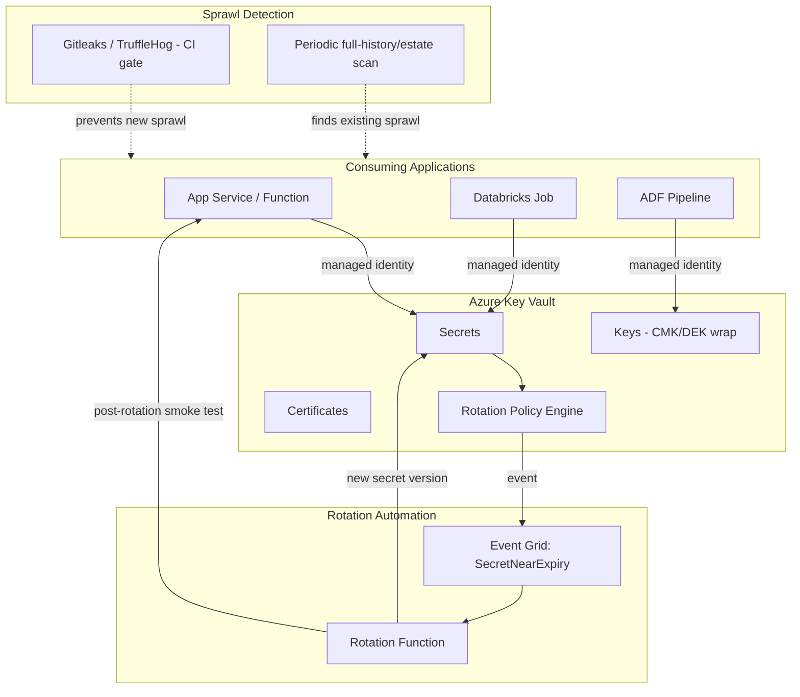
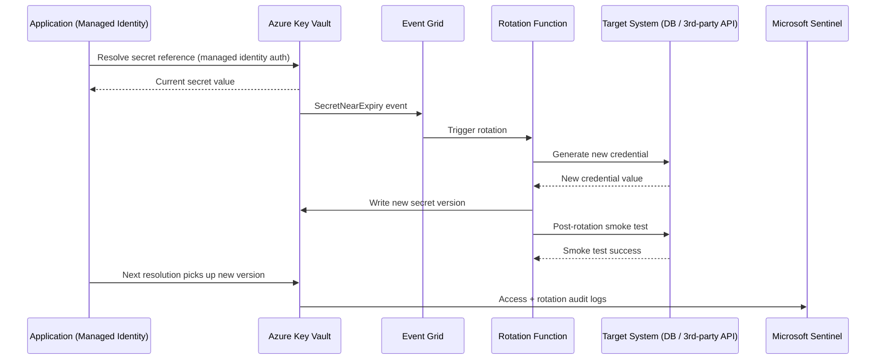
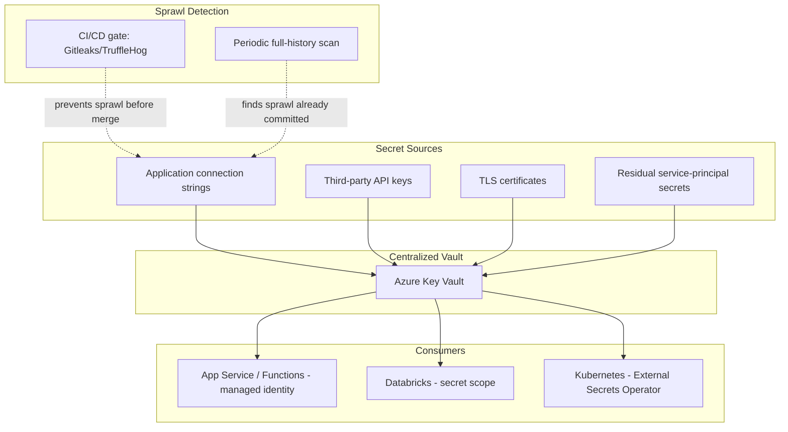
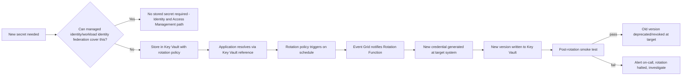

# Secrets and Key Management

> Part of the **Enterprise Data & AI Architecture Handbook** · Phase-10 — Security, Identity & Compliance · Chapter 05.
> Estimated study time: **45 min reading + ~3h labs**.
> **Prerequisite:** read [Data Security and Encryption](03_Data_Security_and_Encryption.md) first.

---

## Executive Summary

[Data Security and Encryption](03_Data_Security_and_Encryption.md#core-concepts) established CMK, envelope encryption, and tokenization as the mechanisms that protect data — but every one of those mechanisms is itself only as strong as the credential, key, or certificate that controls access to it. This chapter is about that remaining, narrower, but disproportionately consequential surface: the secrets, keys, and certificates that [Identity and Access Management with Entra](02_Identity_and_Access_Management_with_Entra.md#core-concepts) worked hard to *eliminate the need for* (via managed identities and workload identity federation) but that never fully disappear — database connection strings, third-party API keys, TLS certificates, and the small residual population of service-principal credentials that genuinely cannot avoid a stored secret. Secrets and key management is where the "it's just one hardcoded credential" incident either gets caught by a scanning gate or ships to production and becomes [Security Foundations](01_Security_Foundations.md#case-studies)'s recurring case study.

This chapter covers **Azure Key Vault and Managed HSM** as the concrete storage and cryptographic-operation infrastructure; **secret rotation and secret references** as the mechanism that keeps a stored secret's exposure window bounded and lets application code retrieve current secret values without ever hardcoding them; **certificates and mTLS** as the identity-and-encryption mechanism underlying the service-mesh and workload-to-workload trust models introduced in [Networking Fundamentals](../Phase-00/04_Networking_Fundamentals.md#security) and [Network Security and Zero Trust](04_Network_Security_and_Zero_Trust.md#core-concepts); a rigorous **HashiCorp Vault comparison**, since Vault is the dominant multi-cloud/open-source alternative to Key Vault and the two are frequently run side by side in hybrid enterprises; and **secret sprawl and detection** — the concrete, unglamorous discipline of finding the secrets that already leaked into source control, config files, and container images before this chapter's controls were in place, because no architecture is complete until the legacy sprawl is found and closed.

The bias remains **Azure-primary (~60%)** — Azure Key Vault (Standard/Premium/Managed HSM), Key Vault references in App Service/Azure Functions/ADF, Azure Key Vault's certificate-management and Event Grid-based rotation-notification capability — **~30% enterprise open source** (HashiCorp Vault, Gitleaks/TruffleHog for secret detection, cert-manager for Kubernetes certificate automation, SOPS for encrypted secrets-in-Git) and **~10% AWS/GCP comparison-only** (AWS Secrets Manager/CloudHSM, GCP Secret Manager/Cloud KMS).

**Bottom line:** [Identity and Access Management with Entra](02_Identity_and_Access_Management_with_Entra.md#core-concepts) correctly argues that the best secret is the one that never has to exist — a managed identity requires no stored credential at all. This chapter is for the secrets that remain despite that effort: third-party API keys, database connection strings for systems that cannot support managed identity, and TLS certificates for every service that terminates traffic. An architect who treats these residual secrets with the same rigor as the eliminated ones — centralized storage, automated rotation, reference-not-hardcode retrieval, and continuous sprawl detection — closes the gap that a "we mostly use managed identities now" posture leaves open; one who treats them as an afterthought because "we solved secrets with managed identity" has left exactly the residual surface that produces [Security Foundations](01_Security_Foundations.md#case-studies)'s incident.

---

## Learning Objectives

By the end of this chapter you will be able to:

1. **Configure Azure Key Vault (Standard/Premium/Managed HSM)** for storing secrets, keys, and certificates, choosing the correct tier for a given sensitivity and compliance requirement.
2. **Design an automated secret-rotation strategy** using rotation policies and Event Grid notifications, and configure applications to retrieve secrets by reference rather than hardcoding values.
3. **Manage certificates and mTLS** end to end, including issuance, renewal automation, and revocation.
4. **Compare Azure Key Vault and HashiCorp Vault** architecturally, and make a defensible choice for a given multi-cloud or hybrid scenario.
5. **Detect and remediate secret sprawl** — credentials already leaked into source control, configuration files, or container images.
6. **Apply secrets-management practices on Azure** using Key Vault references, managed identities, and rotation automation, with a defensible comparison to AWS and GCP equivalents.
7. **Design fault-tolerant secret retrieval** that degrades gracefully rather than causing a cascading outage when Key Vault is temporarily unavailable.
8. **Defend secrets-management architecture decisions** in engineer, staff engineer, architect, and CTO review settings, including trade-offs between rotation frequency, operational overhead, and blast-radius reduction.

---

## Business Motivation

- **A single leaked secret is still one of the most common, most damaging, and most preventable breach root causes** — the [Security Foundations](01_Security_Foundations.md#case-studies) case study (a leaked service-principal credential in a CI log) is representative of an incident class that centralized, rotated, reference-based secret management directly prevents.
- **Secret sprawl accumulates invisibly and compounds over time** — every hardcoded connection string, every `.env` file committed "just for local testing," and every forgotten API key in an old script is a live liability until specifically found and remediated; the longer a platform operates without systematic detection, the larger and more expensive this hidden backlog becomes.
- **Certificate expiry causes a materially common class of *availability* incident**, distinct from but as damaging as a breach — an expired TLS certificate silently breaking a production service is one of the most common, entirely preventable outages in enterprise platforms, directly addressed by this chapter's rotation-automation discipline.
- **Multi-cloud and hybrid enterprises frequently must operate both Azure Key Vault and HashiCorp Vault simultaneously** — understanding the architectural and operational differences is a practical, not academic, requirement for any organization with workloads outside a single cloud.
- **Regulatory and audit frameworks increasingly require demonstrable secret-lifecycle governance** — [Compliance and Regulatory Frameworks](#further-reading) (Phase-10 Chapter 06) treats rotation evidence, access logs, and sprawl-remediation records as concrete audit artifacts, not paperwork assertions.
- **The cost of *not* automating rotation compounds as the platform scales** — manual secret rotation across dozens or hundreds of applications is a recurring, expensive, and error-prone operational tax that automation eliminates almost entirely once built.

---

## History and Evolution

- **2000s-2010s — secrets managed as plaintext configuration files or environment variables**, frequently committed to source control or shared via insecure channels (email, chat), the default and largely ungoverned practice across most of the industry.
- **2013 — HashiCorp Vault emerges** from the DevOps/infrastructure-as-code community specifically to address secrets sprawl in dynamic, cloud-native, multi-cloud infrastructure, introducing dynamic secrets (short-lived, generated-on-demand credentials) as a structurally different model from static, long-lived stored secrets.
- **2015 — Azure Key Vault launches**, giving Azure-native applications a managed, HSM-backed secret and key store integrated directly with Azure RBAC and (later) managed identities.
- **2016 — Let's Encrypt** launches free, automated TLS certificate issuance, catalyzing industrywide adoption of automated certificate renewal (ACME protocol) and directly reducing the "someone forgot to renew the cert" outage class, at least for the public-internet-facing case.
- **2017-2019 — GitHub secret scanning and open-source tools (Gitleaks, TruffleHog, git-secrets) mature**, formalizing "detect secrets already committed to source control" as a distinct, necessary discipline separate from "prevent new secrets from being committed."
- **2019 — cert-manager** becomes the dominant Kubernetes-native certificate-automation controller, extending ACME-based automated renewal into the container-orchestration layer.
- **2019-2021 — managed identities and workload identity federation mature** (elaborated in [Identity and Access Management with Entra](02_Identity_and_Access_Management_with_Entra.md#core-concepts) §2.5), materially shrinking — but not eliminating — the population of secrets requiring this chapter's management discipline.
- **2020-present — Azure Key Vault Managed HSM (2020) and event-driven rotation via Event Grid mature**, giving enterprises dedicated single-tenant HSM assurance and automated rotation-notification pipelines without bespoke tooling.
- **2023-present — secret detection increasingly shifts into the SDLC as a mandatory, blocking CI/CD gate** (per [Security Foundations](01_Security_Foundations.md#core-concepts) §1.6), rather than a periodic, after-the-fact audit exercise, closing the gap between "a secret was leaked" and "a secret was leaked and caught before merge."

---

## Why This Technology Exists

Applications, pipelines, and services frequently need to authenticate to something that cannot yet (or will never) support a fully credential-free identity model — a third-party SaaS API, a legacy on-premises database, a partner integration — and every one of those authentication mechanisms is, at bottom, a secret that must be stored somewhere, retrieved by something, and eventually rotated. Secrets and key management exists because "store it in a config file" and "hardcode it in the application" are both catastrophically fragile answers to that unavoidable requirement — fragile to leakage, fragile to rotation, and fragile to audit — and because even after [Identity and Access Management with Entra](02_Identity_and_Access_Management_with_Entra.md#core-concepts)'s managed-identity-first strategy eliminates the majority of secrets, the residual population still needs a rigorous, centralized, automatable home.

---

## Problems It Solves

- **Hardcoded, unrotated credentials in source code and configuration** — centralized secret storage with reference-based retrieval means application code never contains the actual secret value, only a pointer to it.
- **Slow, manual, error-prone credential rotation** — automated rotation policies and Event Grid-driven rotation pipelines turn a quarterly manual fire-drill into a routine, unattended operation.
- **Silent certificate expiry causing production outages** — automated certificate issuance and renewal (Key Vault, cert-manager/ACME) removes the "someone forgot" failure mode entirely for the majority of certificates.
- **Undetected, already-leaked secrets in source history, config files, and container images** — dedicated secret-scanning tooling (Gitleaks, TruffleHog, GitHub Advanced Security) finds sprawl that would otherwise remain invisible indefinitely.
- **Inconsistent, per-team secret-management practices** — a centralized Key Vault/Vault platform with enforced access policy and audit logging replaces ad hoc, per-application secret handling with a single, governable pattern.

---

## Problems It Cannot Solve

- **It cannot eliminate the need for a secret entirely for every scenario** — some third-party integrations and legacy systems genuinely require a stored credential; secrets management makes that residual population safe to operate, it does not make it disappear (that is [Identity and Access Management with Entra](02_Identity_and_Access_Management_with_Entra.md#core-concepts)'s job, and it only gets so far).
- **It cannot substitute for least-privilege access design.** A Key Vault holding every secret with an overly broad access policy granting every application read access to every secret is centralized but not secure — the access-control discipline from [Identity and Access Management with Entra](02_Identity_and_Access_Management_with_Entra.md#core-concepts) must be applied to the vault itself.
- **It cannot retroactively un-leak a secret that has already been exposed.** Detection tooling finds already-leaked secrets, but the remediation is still a manual, sometimes urgent rotation-and-investigation exercise; detection shortens the exposure window, it does not erase that the exposure happened.
- **It cannot make application code correct if that code caches a secret indefinitely without honoring rotation.** Automated rotation only closes the exposure window if every consuming application actually re-fetches the current secret value on a reasonable cadence — this chapter's Fault Tolerance section addresses exactly this gap.
- **It cannot replace the network and identity controls covered elsewhere in Phase-10.** A perfectly managed secret retrieved over an unencrypted, unauthenticated channel, or retrievable by an over-permissioned identity, is not actually protected — secrets management is one necessary layer among several, not a standalone solution.

---

## Core Concepts

### 5.1 Azure Key Vault and Managed HSM

Azure Key Vault stores three distinct object types, each with its own access-control and lifecycle semantics:

- **Secrets** — arbitrary string values (connection strings, API keys, passwords), stored encrypted at rest, retrieved via a simple get/set API.
- **Keys** — cryptographic key material (the CMK/DEK-KEK material from [Data Security and Encryption](03_Data_Security_and_Encryption.md#core-concepts) §3.2) used for wrap/unwrap, sign/verify, and encrypt/decrypt operations performed *inside* the vault boundary — the raw key material is never returned to the caller for HSM-protected keys, only the operation's result.
- **Certificates** — a managed object type combining a private key and its public certificate, with Key Vault handling issuance-request submission, storage, and (critically) automated renewal orchestration.
- **Tiers:** **Standard** (software-protected keys, suitable for most secrets and non-HSM-mandated keys), **Premium** (HSM-protected keys, FIPS 140-2 Level 2 validated), and **Managed HSM** (a dedicated, single-tenant HSM pool, FIPS 140-2 Level 3, required for the strictest regulatory/compliance mandates and for BYOK scenarios requiring guaranteed single-tenancy) — the tier decision should be driven by the same data-classification-driven logic established in [Data Security and Encryption](03_Data_Security_and_Encryption.md#cost-optimization), not applied uniformly.

### 5.2 Secret Rotation and Secret References

- **Rotation policy** — Key Vault supports configuring an automatic rotation policy on a secret (a defined lifetime and a rotation trigger before expiry), paired with an **Event Grid** notification (`SecretNearExpiry`, `SecretExpired`) that triggers an Azure Function or Logic App to actually generate and store the new secret value — Key Vault itself does not generate arbitrary rotated values (it cannot, for instance, reset a third-party API key), so rotation automation is a partnership between Key Vault's scheduling/notification and a small piece of custom rotation logic specific to the secret's owning system.
- **Secret references, not secret values, in application configuration** — the correct pattern is for application configuration to hold a *reference* to a Key Vault secret (e.g., an App Service "Key Vault reference" app setting, or a Databricks secret scope backed by Key Vault) rather than the resolved value itself; the application (via its managed identity) resolves the reference to the current value at runtime, meaning a rotation is transparent to the application with no redeployment required.
- **Versioning** — every secret update in Key Vault creates a new version rather than overwriting the old one; referencing a specific version pins an application to that value (useful for controlled rollout), while referencing without a version always resolves to the current version (the common default for automated rotation to be transparent).
- **The rotation-verification gap** — exactly as with the CMK rotation case study in [Data Security and Encryption](03_Data_Security_and_Encryption.md#case-studies), a rotation that succeeds in Key Vault but is not verified against every dependent consuming application risks a silent, delayed failure; rotation automation should include a post-rotation smoke test, not merely a successful Key Vault write.

### 5.3 Certificates and mTLS

- **Certificate lifecycle in Key Vault** — Key Vault can generate a key pair, submit a certificate signing request (CSR) to an integrated Certificate Authority (DigiCert, GlobalSign, or an internal enterprise CA), retrieve and store the issued certificate, and automatically renew it ahead of expiry — a fully managed lifecycle requiring no manual CSR handling for supported CA integrations.
- **mTLS (mutual TLS)** requires both parties in a connection to present and validate a certificate, establishing bidirectional identity verification rather than the one-way (server-only) authentication of standard TLS — the mechanism underlying the service-mesh trust model referenced in the [Networking Fundamentals](../Phase-00/04_Networking_Fundamentals.md) ADR and the zero-trust "assume breach, verify explicitly" principle from [Network Security and Zero Trust](04_Network_Security_and_Zero_Trust.md#core-concepts) §4.1.
- **Certificate-based service identity vs. secret-based authentication** — a certificate can serve as a stronger authentication mechanism than a shared secret (client secret) for a service principal, since the private key never needs to be transmitted or shared, only proven possession of; where technically supported, prefer certificate-based service-principal authentication over client secrets for the same reason managed identities are preferred over both.
- **Kubernetes-native certificate automation (cert-manager)** — for containerized workloads, `cert-manager` integrates with ACME-based CAs (including Let's Encrypt) or an internal CA to automate certificate issuance and renewal for Kubernetes Ingress and service-mesh mTLS, the container-native equivalent of Key Vault's certificate lifecycle management.

### 5.4 HashiCorp Vault Comparison

HashiCorp Vault is the dominant open-source/commercial alternative to cloud-native key-management services, architecturally distinct in ways that matter for a real selection decision:

- **Dynamic secrets** — Vault's most architecturally distinctive capability: rather than storing a static, long-lived credential, Vault can generate a short-lived, unique credential *on demand* for a specific request (e.g., a database username/password valid for 15 minutes, automatically revoked after use) via its database, cloud-provider, and PKI secrets engines — a structurally different, stronger security model than any static-secret store (including Key Vault's default mode) provides, since there is no long-lived credential to leak in the first place.
- **Multi-cloud and hybrid neutrality** — Vault runs identically on-premises, in Azure, AWS, or GCP, making it the practical choice for an enterprise that must manage secrets consistently across a genuinely multi-cloud or hybrid estate, where a single cloud-native KMS would require per-cloud bespoke integration.
- **Operational ownership trade-off** — Key Vault is a fully managed PaaS service requiring no infrastructure operation from the customer; Vault (self-hosted, even as HCP Vault's managed offering) requires the customer to operate, scale, and secure the Vault cluster itself (unseal-key management, storage backend, high availability) — a genuine operational-burden difference that should factor into the decision as heavily as feature comparison.
- **Practical selection guidance:** choose Azure Key Vault as the default for an Azure-primary estate needing standard secret/key/certificate management with minimal operational overhead; choose HashiCorp Vault specifically when dynamic secrets are a hard requirement (e.g., short-lived database credentials for a high-security workload) or when genuine multi-cloud/hybrid consistency outweighs the operational cost of running Vault yourself.

### 5.5 Secret Sprawl and Detection

Secret sprawl is the accumulation of credentials outside centralized, governed storage — committed to source control history, embedded in configuration files, baked into container images, or pasted into chat/ticketing systems — and it accumulates specifically because it is invisible until actively searched for:

- **Detection tooling and scope** — Gitleaks, TruffleHog, and GitHub Advanced Security secret scanning use regex and entropy-based pattern matching to find credential-shaped strings across source code, commit history (not just the current HEAD, since a secret removed in a later commit remains in Git history indefinitely), and, with container-image scanning (Trivy), inside built image layers.
- **Full history scanning matters as much as new-commit scanning** — a secret committed and later "removed" in a subsequent commit remains fully recoverable from Git history unless the history itself is rewritten (a disruptive, rarely-justified operation) or the secret is treated as permanently compromised and rotated — the correct remediation for a historically-committed secret is always rotation, never reliance on the commit having been superseded.
- **Sprawl remediation is a triage exercise, not a one-time cleanup** — an initial full-history/full-estate scan typically surfaces a large backlog; prioritize by secret type and blast radius (a production database credential outranks a long-expired test API key), rotate the highest-priority findings immediately, and track the remainder as a managed burndown list rather than either ignoring it or attempting to fix everything simultaneously.
- **Prevention (CI/CD-gated scanning, per [Security Foundations](01_Security_Foundations.md#core-concepts) §1.6) and detection (periodic full-estate/full-history scanning) are complementary, not substitutable** — prevention stops new sprawl from being introduced; periodic detection is still required to find sprawl that predates the prevention gate, or that entered through a path (a manually uploaded config file, a container image) the CI/CD gate does not cover.

---

## Internal Working

A representative secret-retrieval and rotation flow for an application using a Key Vault reference:

1. **Application startup** — a service (e.g., an Azure Function or Databricks job) authenticates to Key Vault using its managed identity ([Identity and Access Management with Entra](02_Identity_and_Access_Management_with_Entra.md#core-concepts) §2.5), with no credential stored in the application's own configuration.
2. **Secret reference resolution** — the application's configuration holds a Key Vault reference (e.g., `@Microsoft.KeyVault(SecretUri=...)` in App Service, or a Databricks secret scope lookup); at startup (and, for supported hosting platforms, transparently on a refresh interval), the platform resolves the reference to the current secret version's value.
3. **Rotation trigger fires** — Key Vault's configured rotation policy determines the secret is approaching its defined expiry and publishes a `SecretNearExpiry` event to Event Grid.
4. **Rotation function executes** — an Azure Function subscribed to the event calls the owning system's API (e.g., a database's credential-rotation endpoint, or a third-party SaaS's key-rotation API) to generate a new credential, then writes it to Key Vault as a new secret version.
5. **Post-rotation verification** — the rotation function (or a follow-up step) performs a smoke test using the new secret value against the target system, confirming the new credential actually works before considering rotation complete — closing the verification gap described in §5.2.
6. **Dependent applications transparently pick up the new version** on their next reference resolution (immediately for platforms that resolve on every request, or on their next scheduled refresh/restart for platforms that cache), without any code change or redeployment.
7. **Every retrieval, rotation, and administrative operation is logged** to Key Vault diagnostic logs, ingested into the same Sentinel workspace established in [Security Foundations](01_Security_Foundations.md#observability), enabling detection of anomalous access patterns independent of whether the requesting identity was technically authorized.

---

## Architecture

Consuming applications never hold secret values in their own configuration, only managed-identity-authenticated references; rotation is a closed automated loop (policy → event → function → new version → verified); sprawl detection operates as two complementary controls — CI-gated prevention and periodic estate-wide detection — neither sufficient alone.

---

## Components

- **Azure Key Vault (Standard/Premium/Managed HSM)** — the central secret, key, and certificate store, described in §5.1.
- **Event Grid** — the event-notification backbone triggering rotation automation on `SecretNearExpiry`/`SecretExpired` and similar lifecycle events.
- **Rotation Function (Azure Function/Logic App)** — the custom logic that actually generates a new credential value against the owning system's API and writes it back to Key Vault.
- **Key Vault references (App Service, Azure Functions, ADF linked services, Databricks secret scopes)** — the platform-native mechanisms letting applications resolve a secret reference to its current value without embedding it in configuration.
- **cert-manager** — the Kubernetes-native certificate-lifecycle controller for containerized workloads, complementing Key Vault's certificate management for VM/PaaS-hosted services.
- **Secret-scanning tooling (Gitleaks, TruffleHog, GitHub Advanced Security)** — the detection layer described in §5.5, run both as a CI/CD gate and as periodic full-estate scans.
- **HashiCorp Vault (where adopted)** — an alternative or complementary secret store, particularly for dynamic-secret and multi-cloud scenarios per §5.4.

---

## Metadata

- **Secret/key/certificate inventory metadata** — a central, queryable inventory of every Key Vault instance, its contents' types, sensitivity classification, rotation policy, and expiry, is essential audit and operational metadata, not something reconstructed ad hoc during an incident.
- **Rotation-history metadata** — every rotation event (when, triggered by what, verified successfully or not) should be retained as an auditable trail, directly feeding the compliance evidence [Compliance and Regulatory Frameworks](#further-reading) (Chapter 06) requires.
- **Ownership metadata** — every secret, key, and certificate should have a documented owning team, avoiding the "orphaned credential nobody remembers the purpose of" gap flagged in [Security Foundations](01_Security_Foundations.md#governance).
- **Sprawl-finding metadata** — every secret-scanning finding (location, secret type, remediation status: rotated/false-positive/accepted-risk) should be tracked centrally as a burndown list, not left as an unowned scan-report artifact.
- **Consumer/dependency metadata** — which applications/pipelines consume which secret should be discoverable, directly enabling the post-rotation verification step described in §5.2 to know which systems to smoke-test.

---

## Storage

- **Key Vault's underlying storage is fully managed and encrypted at rest by Microsoft**, with Managed HSM providing dedicated, single-tenant HSM-backed storage for the highest-assurance requirements.
- **No secret value should ever be stored in source control, container images, CI/CD pipeline variables (as plaintext), or configuration files checked into a repository** — the entire point of centralizing secrets in Key Vault/Vault is that these other locations should categorically not hold real secret values.
- **Backup and recovery** — Key Vault supports soft-delete and purge protection (per [Data Security and Encryption](03_Data_Security_and_Encryption.md#security) for the CMK-specific case), and a documented backup/recovery runbook for the vault itself should exist, since an unrecoverable Key Vault is equivalent to an unrecoverable loss of every credential it held.
- **HashiCorp Vault's storage backend** (Consul, integrated Raft storage, or a cloud object store) is a customer-operated dependency requiring its own backup, replication, and disaster-recovery design — a direct operational-burden consequence of the self-hosted model discussed in §5.4.

---

## Compute

- **Key Vault operations (get/set secret, wrap/unwrap key, certificate operations) are lightweight and fully managed**, with negligible customer-side compute required beyond the calling application's own runtime.
- **Rotation Functions are typically small, infrequently-triggered Azure Functions**, consuming minimal compute — the cost driver is the (usually modest) number of rotation events per period, not sustained compute.
- **Self-hosted HashiCorp Vault requires dedicated compute for the Vault cluster itself** (typically 3+ nodes for HA, per the Raft consensus requirement), a direct, ongoing compute cost absent from the fully-managed Key Vault model.
- **Secret-scanning compute runs within CI/CD runners** for the prevention gate, and as periodic (often nightly/weekly) batch jobs for full-history/full-estate detection scans, sized to the repository/estate volume being scanned.

---

## Networking

- **Key Vault access should occur over private endpoints** (per [Network Security and Zero Trust](04_Network_Security_and_Zero_Trust.md#core-concepts) §4.3), not the public Key Vault data-plane endpoint, closing network-level exposure of secret-retrieval operations.
- **Rotation Functions require network line-of-sight to both Key Vault and the target system whose credential is being rotated** (a database, a third-party API) — ensure the Function's VNet integration and any required outbound allow-list entries (per [Network Security and Zero Trust](04_Network_Security_and_Zero_Trust.md#core-concepts) §4.4) are correctly configured, or rotation will silently fail at the network layer.
- **HashiCorp Vault deployments require careful network exposure design** — Vault's API should never be exposed directly to the public internet; place it behind a private network boundary with TLS (ideally mTLS per §5.3) enforced for all client communication.
- **cert-manager's ACME HTTP-01/DNS-01 challenge mechanisms** require specific, deliberate network/DNS configuration (a reachable HTTP endpoint or DNS TXT record update capability) to complete certificate issuance — a common source of automation failures if the challenge path is not correctly reachable.

---

## Security

- **Key Vault access policy/RBAC must itself be least-privilege** — a vault granting broad read access to every secret for every application defeats the purpose of centralization; scope access per-secret or per-vault as granularly as the platform allows, following the same discipline as [Identity and Access Management with Entra](02_Identity_and_Access_Management_with_Entra.md#core-concepts).
- **Purge protection and soft-delete must be enabled on every production vault** — an accidentally or maliciously deleted vault (and every secret it held) is an unrecoverable, catastrophic event without these protections.
- **Rotation Function identities must themselves be least-privilege and PIM-governed** for any operation requiring elevated access to the target system, applying [Identity and Access Management with Entra](02_Identity_and_Access_Management_with_Entra.md#core-concepts) §2.3's PIM discipline to the automation itself, not only to human operators.
- **Never log secret values, even at debug verbosity** — the [Security Foundations](01_Security_Foundations.md#case-studies) case study specifically originated from a secret leaking into a CI log; application and rotation-function logging must be explicitly designed to never emit secret values, and log-output should itself be subject to secret-scanning per §5.5.
- **A rotated-out (previous-version) secret should be revoked/disabled at the target system where technically feasible**, not merely superseded in Key Vault — an old database password left valid indefinitely at the database itself, even after Key Vault has "rotated," provides no actual security improvement.

---

## Performance

- **Key Vault retrieval latency is low but non-zero (typically tens of milliseconds)** — applications should cache resolved secret values for a reasonable interval (minutes, not indefinitely) rather than calling Key Vault on every single request, balancing freshness (for rotation transparency) against retrieval overhead and Key Vault throttling limits.
- **Key Vault has documented throughput limits per vault (requests per 10 seconds, tiered by operation type)** — a very high-request-volume application retrieving secrets on every request risks throttling; architect for appropriate caching rather than treating Key Vault as a per-request lookup service.
- **Vault's dynamic-secrets model trades a small per-request credential-generation latency for eliminating long-lived-credential risk** — an acceptable trade-off for most workloads, but worth benchmarking for extremely latency-sensitive, high-frequency database-connection scenarios.
- **Certificate operations (issuance, renewal) are infrequent and not latency-sensitive** in normal operation; the performance concern is ensuring renewal completes well ahead of expiry, not the speed of any individual operation.

---

## Scalability

- **A single Key Vault instance has documented object-count and throughput limits** — very large estates should plan a multi-vault strategy (e.g., one vault per environment/business unit, or per data-sensitivity tier) rather than assuming unlimited scale from a single vault.
- **Rotation automation (Event Grid + Functions) scales natively with Azure's serverless model**, handling an increasing number of rotation events without dedicated capacity planning.
- **Self-hosted HashiCorp Vault requires deliberate horizontal scaling and HA design** (Raft-based clustering, performance replicas for read scaling across regions) as request volume and geographic footprint grow — a genuine additional operational planning burden versus Key Vault's fully-managed scaling.
- **Centralized secret-scanning tooling must scale to the organization's full repository and container-registry estate** — a scanning solution piloted on one repository needs deliberate extension (via a platform-wide GitHub Advanced Security rollout or a centrally-run Gitleaks scan across every repository) to provide real, estate-wide sprawl-detection coverage.

---

## Fault Tolerance

- **Applications must handle Key Vault transient unavailability gracefully** — a brief Key Vault outage should not cascade into every dependent application failing simultaneously; cache the last successfully-resolved secret value with a reasonable staleness tolerance, and retry with backoff rather than failing hard on the first failed call.
- **Rotation-automation failures must alert, not fail silently** — if a rotation function fails to generate or verify a new credential, this must page an on-call engineer before the old credential's actual expiry, not be discovered only when the expired credential starts failing production requests.
- **Vault/Key Vault's own high-availability design is largely a non-issue for the managed Key Vault service** (Microsoft operates the redundancy), but is a first-class design responsibility for self-hosted HashiCorp Vault, including unseal-key management processes that must themselves be resilient to a single point of failure (Shamir's Secret Sharing across multiple key-holders, or auto-unseal via a cloud KMS).
- **Certificate-renewal failure must be caught well ahead of expiry**, not discovered at the moment of expiry — monitor renewal success explicitly (§ below) with alerting thresholds set days-to-weeks ahead of actual expiry, giving time for manual intervention if automation fails.

---

## Cost Optimization

- **Do not provision Managed HSM by default** — its dedicated single-tenant HSM cost is substantially higher than Key Vault Premium's shared HSM-backed keys; reserve it specifically for the subset of keys with a genuine FIPS 140-2 Level 3 or dedicated-tenancy requirement, mirroring the classification-driven approach from [Data Security and Encryption](03_Data_Security_and_Encryption.md#cost-optimization).
- **Right-size rotation frequency** — rotating every secret on the shortest technically-possible interval maximizes rotation-automation operational load (and, for systems with rate-limited credential-rotation APIs, may itself introduce reliability risk) without a proportional security benefit for low-sensitivity secrets; tier rotation frequency by data/secret sensitivity.
- **Evaluate self-hosted HashiCorp Vault's total cost of ownership honestly** — the compute, storage, and (most significantly) the ongoing operational engineering time to run Vault reliably at production HA standards frequently exceeds the apparent "it's free open source" savings versus Key Vault's fully-managed pricing, unless dynamic secrets or multi-cloud neutrality is a genuine, load-bearing requirement.
- **Consolidate secret-scanning tooling rather than running multiple overlapping scanners** — running Gitleaks, TruffleHog, and GitHub Advanced Security simultaneously across the same repositories triples scanning compute and triage overhead for largely redundant coverage; standardize on one primary tool per scanning surface (CI-gate vs. full-history scan).
- **Worked FinOps example:** An organization runs a 5-node self-hosted HashiCorp Vault HA cluster (Standard_D4s_v3 VMs, ~$0.19/hour each) purely for standard static-secret storage — no dynamic secrets, no genuine multi-cloud requirement — at roughly 5 × $0.19 × 730 hours ≈ **$693/month** in compute alone, plus an estimated 15 hours/month of platform-engineer time (~$85/hour) maintaining upgrades, unseal-key rotation drills, and backup verification, ≈ **$1,275/month**, for a total of roughly **$1,970/month**. Migrating to Azure Key Vault Premium (HSM-backed keys) for the same secret volume costs approximately $1/key/month plus per-operation charges, well under **$200/month**, with zero infrastructure-operation burden since it is fully managed. Absent a genuine dynamic-secrets or multi-cloud requirement, this migration saves roughly **$1,770/month (~90%)** while also removing the self-hosted cluster's own availability and unseal-key-management risk from the platform's operational burden entirely.

---

## Monitoring

- **Key Vault access and operation logs** — track every get/set/delete operation, by identity, surfaced via Key Vault diagnostic logs into Log Analytics, directly extending the monitoring established in [Data Security and Encryption](03_Data_Security_and_Encryption.md#monitoring) for key-specific operations.
- **Rotation success/failure rate and latency** — track whether scheduled rotations complete successfully and within their expected window, alerting on any failure well ahead of the underlying secret's actual expiry.
- **Certificate expiry countdown monitoring** — a dedicated dashboard/alert tracking days-until-expiry for every managed certificate, with escalating alert thresholds (30/14/7/1 days) ahead of expiry, independent of whether automated renewal is expected to handle it.
- **Secret-scanning finding trend** — track new sprawl findings over time (ideally trending toward zero for the CI-gate prevention path) and burndown progress on the historical/full-estate detection backlog.

---

## Observability

- **Unified secrets-telemetry correlation** — Key Vault access logs, rotation-function execution logs, certificate-expiry status, and secret-scanning findings should all flow into the same Sentinel workspace established in [Security Foundations](01_Security_Foundations.md#observability), correlated with the identity telemetry from [Identity and Access Management with Entra](02_Identity_and_Access_Management_with_Entra.md#observability).
- **Structured, correlated logging for every secret retrieval and rotation event** — each event should carry the requesting/triggering identity, the specific secret/key/certificate involved, and a timestamp, enabling a single query to answer "who or what has accessed this specific secret, and when."
- **Detection rules mapped to secrets-specific threat scenarios** — an unexpected spike in retrieval volume for a specific secret, a retrieval from an identity with no prior access history, or a rotation-function failure should each have a corresponding Sentinel analytics rule.
- **Sprawl-detection results treated as a security-observability signal**, not merely a one-time cleanup report — a recurring increase in new CI-gate secret-detection hits from a specific team may indicate a training gap or a systemic process issue worth addressing beyond the individual finding.

### Operational Response Playbook

| Signal | Detection Query/Check | Remediation |
|---|---|---|
| Automated secret rotation fails or post-rotation smoke test fails | Rotation Function execution/failure log alerting in Sentinel, correlated against the secret's actual expiry countdown | Page the owning team immediately if expiry is within the alert-threshold window; investigate whether the target system's credential-rotation API changed or failed; manually rotate if automation cannot be fixed before expiry, and fix the automation afterward. |
| Certificate approaching expiry with no successful renewal recorded | Key Vault certificate-expiry diagnostic alert at 14/7/1-day thresholds with no matching renewal event | Page the owning team; manually trigger or troubleshoot the ACME/CA renewal process; if a production outage is imminent, treat as a P1 and engage an emergency manual certificate reissuance path. |
| Secret-scanning tool detects a live, high-sensitivity credential (e.g., a production database password) in source control | CI/CD secret-scanning gate finding classified as critical severity, or a periodic full-history scan hit matching a known-sensitive pattern | Immediately rotate the exposed credential at its source system (do not wait for a scheduled rotation); revoke the old value; investigate exposure scope (was the repository/branch private, who had access, was it ever pulled by an untrusted party) and document per [Security Foundations](01_Security_Foundations.md#observability)'s incident-response process. |

---

## Governance

- **Every secret, key, and certificate has a documented owner and a defined rotation policy**, tracked centrally rather than left to per-team discretion — this is the concrete evidence [Compliance and Regulatory Frameworks](#further-reading) (Chapter 06) requires for demonstrable credential-lifecycle governance.
- **Key Vault access is PIM-governed and periodically reviewed** ([Identity and Access Management with Entra](02_Identity_and_Access_Management_with_Entra.md#governance)), with vault-management operations (creating/deleting a vault, changing access policy) treated as a privileged operation subject to its own approval and audit trail.
- **A tiered rotation-frequency policy is documented and enforced**, driven by secret/data sensitivity classification, not left to ad hoc per-team choice.
- **Secret-sprawl remediation is tracked as a managed, owned burndown list** with defined SLAs by severity (a live production credential found in source control should have an immediate, same-day rotation SLA; a long-expired test credential can be lower priority), reported alongside other security-debt metrics in the quarterly review established in [Security Foundations](01_Security_Foundations.md#enterprise-recommendations).
- **HashiCorp Vault adoption decisions are documented via ADR**, given the genuine operational-ownership trade-off versus Key Vault, so the specific justification (dynamic secrets, multi-cloud requirement) is traceable rather than an unexplained tooling divergence.

---

## Trade-offs

| Dimension | Fully-managed Key Vault | Self-hosted HashiCorp Vault |
|---|---|---|
| Operational burden | Minimal — fully managed by Microsoft | Significant — customer operates HA cluster, unseal keys, backups |
| Feature set for standard static secrets | Complete — secrets, keys, certificates | Complete, plus dynamic secrets |
| Multi-cloud/hybrid consistency | Azure-native only | Cloud-agnostic, consistent across providers |
| Cost | Predictable, usage-based, no infrastructure cost | Infrastructure cost plus significant ongoing engineering time |
| Best fit | Azure-primary estates needing standard secret/key/cert management | Multi-cloud estates or workloads requiring dynamic, short-lived credentials |

The general enterprise guidance: default to Azure Key Vault for an Azure-primary data platform; adopt HashiCorp Vault deliberately and only where dynamic secrets or genuine multi-cloud consistency provide a load-bearing benefit that justifies its operational cost, documented via ADR rather than adopted by default or by individual team preference.

---

## Decision Matrix

| Scenario | Recommended Approach |
|---|---|
| Standard application secrets, keys, and certificates on Azure | Azure Key Vault Standard/Premium, accessed via managed identity and Key Vault references |
| FIPS 140-2 Level 3 or dedicated-tenancy HSM requirement | Azure Key Vault Managed HSM |
| Short-lived, dynamically-generated database credentials for a high-security workload | HashiCorp Vault's database secrets engine |
| Genuinely multi-cloud/hybrid estate requiring one consistent secrets platform | HashiCorp Vault (self-hosted or HCP Vault managed) |
| Kubernetes-hosted workload needing automated TLS certificate issuance | cert-manager with an ACME-integrated CA |
| Suspected or confirmed secret leaked into source control | Immediate rotation at the source system, followed by root-cause remediation of the leak path (CI gate, training) |

---

## Design Patterns

- **Reference, never hardcode** — every application configuration holds a Key Vault (or Vault) reference, never a resolved secret value, as a strict, enforced pattern.
- **Automated rotation with post-rotation verification** — every rotation policy pairs a scheduling/notification mechanism with a smoke test confirming the new credential actually works before considering rotation complete.
- **Managed-identity-first, stored-secret-as-exception** — apply [Identity and Access Management with Entra](02_Identity_and_Access_Management_with_Entra.md#design-patterns)'s managed-identity-first pattern; a stored secret in Key Vault is itself the fallback for the narrow set of cases managed identity cannot cover, not the default.
- **Layered secret-sprawl defense** — CI/CD-gated prevention plus periodic full-history/full-estate detection scanning, treated as complementary, both mandatory.
- **Dynamic secrets for the highest-security workloads** — where Vault is already adopted, prefer its dynamic-secrets engines over static secret storage for database and cloud-provider credentials, eliminating the long-lived-credential risk entirely for that subset.

---

## Anti-patterns

- **Secret values embedded directly in application configuration or CI/CD pipeline YAML** — the exact pattern this entire chapter exists to eliminate, and the direct cause of the [Security Foundations](01_Security_Foundations.md#case-studies) case study.
- **Rotation policy configured but never actually verified against dependent consumers** — technically "automated" rotation that silently breaks a downstream application on the next cycle, discovered only via production failure.
- **A single, broadly-accessible Key Vault instance with no per-secret access scoping** — centralization without least-privilege access control merely consolidates the blast radius rather than reducing it.
- **Adopting HashiCorp Vault "because it's more powerful" without a load-bearing dynamic-secrets or multi-cloud requirement** — incurring the full self-hosted operational cost for a feature set Key Vault's fully-managed service already covers adequately.
- **Treating a secret-scanning tool's first full scan as a one-time cleanup rather than an ongoing burndown and prevention program** — sprawl reaccumulates continuously; a single remediation pass without an ongoing prevention gate is a temporary fix, not a durable one.
- **Manually renewing certificates via a calendar reminder** instead of automated ACME/Key-Vault-integrated renewal — a fragile, human-memory-dependent process that reliably fails eventually.

---

## Common Mistakes

- Caching a resolved secret value indefinitely in application memory with no refresh, meaning a rotation never actually takes effect until the application is restarted, defeating the transparency rotation automation is meant to provide.
- Logging a secret value at debug or error verbosity "temporarily to troubleshoot," inadvertently creating exactly the kind of leak the [Security Foundations](01_Security_Foundations.md#case-studies) case study describes.
- Granting an application's managed identity broad Key Vault read access to every secret in the vault, rather than scoping it to only the specific secrets that application actually needs.
- Assuming Key Vault's rotation policy alone rotates a third-party API key, without realizing custom rotation-function logic specific to that third party's API is required.
- Running secret-scanning only on the current HEAD of a repository, missing secrets that remain fully recoverable from Git history despite having been "removed" in a later commit.
- Choosing HashiCorp Vault by default for a purely Azure-primary estate without a genuine dynamic-secrets or multi-cloud requirement, incurring unnecessary operational overhead.

---

## Best Practices

- Store every secret, key, and certificate in a centrally governed vault (Key Vault or Vault), never in source control, configuration files, or CI/CD pipeline variables as plaintext.
- Configure automated rotation with a mandatory post-rotation smoke test for every secret with an available rotation mechanism.
- Use managed identities and Key Vault references so application code never handles a resolved secret value directly in its own configuration.
- Automate certificate issuance and renewal (Key Vault-integrated CA or cert-manager/ACME) rather than relying on manual calendar-based renewal.
- Run secret-scanning both as a mandatory CI/CD gate (preventing new sprawl) and as a periodic full-history/full-estate scan (finding existing sprawl), treating both as required, not optional.
- Document an ADR before adopting HashiCorp Vault, explicitly naming the dynamic-secrets or multi-cloud requirement driving the decision.

---

## Enterprise Recommendations

- Mandate centralized Key Vault (or, where justified, Vault) usage as the only sanctioned secret-storage location enterprise-wide, enforced via secret-scanning CI gates and periodic estate-wide audits, not left to individual team discretion.
- Fund a centralized rotation-automation platform (reusable Event Grid + Function patterns per secret type) rather than expecting every team to build bespoke rotation logic independently.
- Require certificate-expiry monitoring with escalating alert thresholds as a standing operational dashboard, given how common and how avoidable expiry-driven outages are.
- Track secret-sprawl burndown progress and rotation-automation coverage as standing metrics in the same quarterly security-posture review established in [Security Foundations](01_Security_Foundations.md#enterprise-recommendations).
- Extend this chapter's discipline explicitly to AI agent and tool-integration credentials now — an agent's API keys for external tools deserve the same centralized storage, rotation, and sprawl-detection rigor as any human-facing application's secrets, not an implicit exception because the consumer is an AI system.

---

## Azure Implementation

- **Azure Key Vault (Standard/Premium/Managed HSM)** — the central secret, key, and certificate store described throughout this chapter.
- **Key Vault references** — in App Service/Azure Functions application settings, ADF linked services, and Databricks secret scopes, resolving secret references at runtime without embedding values in configuration.
- **Event Grid** — publishes `SecretNearExpiry`/`SecretExpired`/`CertificateNearExpiry` events, triggering Azure Functions or Logic Apps for automated rotation.
- **Azure Key Vault certificate integration** — automated CSR generation, issuance (via integrated CAs like DigiCert/GlobalSign), and renewal for TLS certificates.
- **GitHub Advanced Security / Azure DevOps secret scanning** — the CI/CD-gated secret-detection mechanism described in §5.5, extending [Security Foundations](01_Security_Foundations.md#core-concepts) §1.6's SDLC gates.
- **Managed identities and workload identity federation** ([Identity and Access Management with Entra](02_Identity_and_Access_Management_with_Entra.md#core-concepts) §2.5) — the mechanism that lets applications authenticate to Key Vault without their own stored credential.

---

## Open Source Implementation

- **HashiCorp Vault** — the leading open-source/commercial secrets-management platform, with dynamic secrets, PKI, and transit-encryption engines, described comparatively in §5.4.
- **cert-manager** — Kubernetes-native automated certificate issuance and renewal via ACME-integrated or internal CAs.
- **Gitleaks / TruffleHog / git-secrets** — open-source secret-detection tools for both CI-gate prevention and periodic full-history scanning.
- **SOPS (Secrets OPerationS)** — an open-source tool for encrypting secret values that must be committed to Git (e.g., for GitOps-managed Kubernetes secrets per [GitOps and Environment Management](../Phase-09/08_GitOps_and_Environment_Management.md#core-concepts)), keeping the repository itself free of plaintext secrets even when secret *references* or encrypted blobs live in version control.
- **External Secrets Operator** — a Kubernetes controller syncing secrets from Key Vault, Vault, or other external secret stores into native Kubernetes Secret objects, avoiding secrets being manually or insecurely provisioned into a cluster.

---

## AWS Equivalent (comparison only)

| Capability | Azure | AWS |
|---|---|---|
| Secret/key/certificate storage | Azure Key Vault (Standard/Premium/Managed HSM) | AWS Secrets Manager (secrets) + AWS KMS (keys) + AWS Certificate Manager (certificates) |
| Automated rotation | Event Grid + Azure Function | Secrets Manager native rotation Lambda templates |
| Dedicated single-tenant HSM | Azure Managed HSM | AWS CloudHSM |
| Secret references in compute | App Service/Functions Key Vault references | Secrets Manager references in ECS task definitions, Lambda environment variables via SDK |

**Advantages of AWS:** Secrets Manager's native rotation-Lambda templates for common data stores (RDS, DocumentDB) are more turnkey out of the box than Azure's Event Grid + custom Function pattern for the equivalent scenario; AWS Certificate Manager's tight integration with ALB/CloudFront covers the majority of public-certificate scenarios with minimal configuration. **Disadvantages:** AWS splits secret, key, and certificate management across three distinct services (Secrets Manager, KMS, ACM) rather than Key Vault's single unified service, adding integration surface area. **Migration strategy:** the reference-not-hardcode and automated-rotation principles transfer directly; concrete Lambda rotation functions, IAM policies, and Secrets Manager resource ARNs require AWS-specific rework. **Selection criteria:** choose AWS-native tooling for AWS-primary estates, particularly where Secrets Manager's turnkey RDS rotation templates are valuable; choose Azure Key Vault for Azure-primary or Databricks-centric estates.

---

## GCP Equivalent (comparison only)

| Capability | Azure | GCP |
|---|---|---|
| Secret/key/certificate storage | Azure Key Vault (Standard/Premium/Managed HSM) | Google Secret Manager (secrets) + Cloud KMS (keys) + Certificate Manager (certificates) |
| Automated rotation | Event Grid + Azure Function | Secret Manager rotation notifications via Pub/Sub + Cloud Function |
| Dedicated single-tenant HSM | Azure Managed HSM | Cloud HSM |
| Secret references in compute | App Service/Functions Key Vault references | Secret Manager references in Cloud Run/Cloud Functions environment variables |

**Advantages of GCP:** Secret Manager's Pub/Sub-based rotation-notification model is architecturally very similar to Azure's Event Grid pattern, making cross-cloud rotation-automation logic conceptually portable; Google Cloud KMS's envelope-encryption API is straightforward and well-documented. **Disadvantages:** GCP, like AWS, splits secrets, keys, and certificates across separate services rather than Key Vault's unified model. **Migration strategy:** rotation-automation architecture (event-driven trigger plus custom function) transfers conceptually with minimal redesign; concrete Pub/Sub topic and Cloud Function configuration requires GCP-specific rework. **Selection criteria:** choose GCP-native tooling for GCP-primary estates; choose Azure Key Vault for Azure-primary or hybrid Microsoft-ecosystem estates.

---

## Migration Considerations

- **Inventory every existing secret location before migrating to centralized Key Vault/Vault** — configuration files, environment variables, CI/CD pipeline variables, and any bespoke per-application secret stores should be enumerated, prioritized by sensitivity, and migrated deliberately rather than assumed complete after a partial effort.
- **Migrate application-by-application with dual-support during a verification window** — update an application to resolve secrets via Key Vault reference, verify it works correctly, then remove the old hardcoded/environment-variable value, rather than a risky simultaneous flag-day cutover across every application.
- **Run new secret-scanning gates in report-only mode first** — exactly as with other SDLC security gates in [Security Foundations](01_Security_Foundations.md#migration-considerations), introduce scanning in a non-blocking mode to size the existing findings backlog before switching to a hard-blocking gate.
- **Prioritize migrating the highest-sensitivity, highest-blast-radius secrets first** — production database credentials and payment-related API keys should move to centralized management ahead of low-risk internal-tool credentials.
- **Expect a transitional period of mixed maturity** — some applications fully migrated to Key Vault references with automated rotation, others still pending; track this explicitly as a security-debt burndown list, consistent with the tracking practice established across this Phase-10 chapter series.

---

## Mermaid Architecture Diagrams

---

## End-to-End Data Flow

---

## Real-world Business Use Cases

- A retailer's e-commerce platform automated TLS certificate renewal via Key Vault-integrated CA issuance after a prior manual-renewal process caused a checkout-page outage during a peak sales weekend when a certificate expired unnoticed; zero certificate-expiry outages occurred in the following two years post-automation.
- A financial-services firm adopted HashiCorp Vault's dynamic database-secrets engine specifically for its highest-security trading-data database, issuing 15-minute-lived credentials per connection, eliminating the standing-credential risk that a static, long-lived database password would have represented for that specific high-value system.
- A healthcare SaaS company ran a full-history secret-scanning audit across its entire GitHub organization as part of a SOC 2 readiness effort, discovering and rotating 40+ previously-undetected leaked credentials (mostly test API keys, but including two production database passwords), closing a sprawl backlog that had accumulated over several years before the audit.

---

## Industry Examples

- **Uber's 2016 breach** (a leaked AWS credential found in a private GitHub repository) is one of the most widely cited industry case studies motivating both secret-scanning tooling adoption and the broader shift toward managed-identity/credential-free authentication wherever possible.
- **HashiCorp's** own public case studies of Vault's dynamic-secrets adoption at scale (commonly cited from financial-services and technology-sector customers) are frequently referenced as the reference argument for dynamic secrets' security benefit over static credential storage.
- **Let's Encrypt's** free, automated certificate issuance is widely credited with normalizing automated certificate renewal industry-wide, directly reducing the "expired certificate outage" incident class across the broader internet, not just within any single enterprise.

---

## Case Studies

**Case: A rotation-automation gap causes a partial outage.** A retailer's payment-processing integration used a Key Vault-stored API key for a third-party fraud-detection service, with a rotation policy configured to trigger every 90 days. The rotation Function successfully generated and stored a new key in Key Vault on schedule, but the fraud-detection vendor's API required a separate manual activation step for new keys that the rotation automation did not account for — the new key was written to Key Vault but was not yet active at the vendor. The consuming application, resolving the reference on its next restart, picked up the inactive new key and began failing fraud-detection calls, degrading (though not fully blocking, due to a fail-open design) checkout processing for several hours before the on-call team traced the failure to the unactivated key.

**Root cause:** the rotation automation's "success" criterion was "new key written to Key Vault," not "new key verified functional against the target system" — exactly the post-rotation verification gap flagged in this chapter's **Internal Working** and **Fault Tolerance** sections, and directly analogous to the CMK rotation case study in [Data Security and Encryption](03_Data_Security_and_Encryption.md#case-studies).

**Remediation:** the team added a mandatory post-rotation smoke test (a real fraud-check API call using the new key) to the rotation Function, failing the rotation (and alerting, while leaving the prior working key version active) if the smoke test did not succeed, rather than considering rotation complete the moment Key Vault accepted the write.

---

## Hands-on Labs

1. **Lab 1 — Store and reference a secret via managed identity.** Create a Key Vault, store a sample connection-string secret, provision an App Service or Azure Function with a system-assigned managed identity granted `get` access to that secret, and configure a Key Vault reference in its application settings; verify the resolved value with no secret embedded in configuration.
2. **Lab 2 — Build a rotation automation pipeline.** Configure a rotation policy on a sample secret, subscribe an Azure Function to the `SecretNearExpiry` Event Grid event, and implement a rotation function that generates a new value, writes a new Key Vault secret version, and performs a simple smoke test before considering rotation complete.
3. **Lab 3 — Automate certificate issuance and renewal.** Using Key Vault's certificate creation capability (or a self-signed certificate for lab purposes), configure automated renewal, and observe the certificate lifecycle events in Key Vault diagnostic logs.
4. **Lab 4 — Run a secret-sprawl detection scan.** Run Gitleaks or TruffleHog against a sample repository (including one with an intentionally-committed-then-removed test secret in its history) and verify the tool finds the historical secret despite it no longer being present in the current HEAD.
5. **Lab 5 — Deploy a minimal HashiCorp Vault instance and issue a dynamic secret.** Stand up a development-mode Vault instance, configure the database secrets engine against a sample PostgreSQL database, and request a dynamically-generated, short-lived credential, observing its automatic expiry/revocation.

---

## Exercises

1. Explain why "we use managed identities" does not fully eliminate the need for the secrets-management discipline covered in this chapter.
2. Design a rotation-automation pipeline for a third-party API key, including how you would verify the new key is actually functional before considering rotation complete.
3. Compare Azure Key Vault and HashiCorp Vault for a hypothetical enterprise with workloads split across Azure and an on-premises data center; justify your recommendation.
4. Design a secret-sprawl remediation program for an organization that has never previously run secret scanning, including how you would prioritize the likely large initial findings backlog.
5. Identify a specific scenario where a certificate-expiry outage would occur despite an organization believing it had "automated" certificate renewal, and describe the monitoring gap that would let it happen.

---

## Mini Projects

- Build a small end-to-end rotation-automation example: a Key Vault secret, an Event Grid subscription, and an Azure Function that rotates a sample credential against a mock target API, including a post-rotation smoke test and failure alerting.
- Implement a CI/CD pipeline stage combining Gitleaks (current-commit scanning) with a separate scheduled full-history scan job, producing a consolidated findings report distinguishing "new" from "historical" secret exposure.
- Build a simple secret-inventory dashboard (a script querying Key Vault's list-secrets/list-certificates APIs across multiple vaults) reporting rotation-policy coverage and days-until-expiry for every certificate, as a lightweight version of the monitoring described in this chapter's **Monitoring** section.

---

## Capstone Integration

Extend the zero-trust-network-hardened pipeline from [Network Security and Zero Trust](04_Network_Security_and_Zero_Trust.md#capstone-integration)'s capstone with complete secrets-management coverage: audit the pipeline for any remaining stored secrets not covered by managed identity, migrate them to Key Vault references with automated rotation and post-rotation verification; configure automated certificate management for any TLS endpoint the pipeline exposes; and run a secret-scanning pass (current-commit and full-history) against the pipeline's repository, remediating any findings. This becomes the secrets-management foundation that [Compliance and Regulatory Frameworks](#further-reading) (Chapter 06) and [Data Privacy and PII Protection](#further-reading) (Chapter 07) build upon.

---

## Interview Questions

1. Why does secrets management remain necessary even after adopting managed identities broadly?
2. What is the difference between Azure Key Vault Standard, Premium, and Managed HSM, and when would you choose each?
3. Explain the difference between static secrets and HashiCorp Vault's dynamic secrets, and the security benefit of the latter.
4. Why is scanning only the current commit insufficient for detecting secret sprawl in a Git repository?

## Staff Engineer Questions

5. How would you design a rotation-automation pipeline that avoids the "rotation succeeded in the vault but broke the consuming application" failure mode?
6. Describe your strategy for prioritizing remediation of a large secret-sprawl findings backlog discovered during a first-time full-history scan.
7. What is your decision framework for choosing between Azure Key Vault and HashiCorp Vault for a given workload?

## Architect Questions

8. How would you architect a multi-vault strategy for a large enterprise with distinct environments, business units, and data-sensitivity tiers?
9. What is your approach to extending secrets-management discipline to AI agent credentials for external tool integrations?
10. How does your secrets-management architecture provide auditable evidence, independent of access-control logs alone, of which identities have accessed a specific sensitive credential?

## CTO Review Questions

11. What percentage of our applications currently retrieve secrets via centralized vault reference versus hardcoded/environment-variable configuration, and what is the plan to close that gap?
12. If we ran a full-history secret-scan across our entire codebase today, what is our current best estimate of the undiscovered sprawl backlog, and what would remediating it cost versus the risk it represents?
13. What is the single highest-leverage secrets-management investment you would prioritize this year, and how would you quantify the incident risk it removes?

---

### Architecture Decision Record (ADR-0145): Mandate Post-Rotation Verification for All Automated Secret and Key Rotation

- **Context.** The platform's rotation automation (Key Vault rotation policies plus Event Grid-triggered Functions) treated a successful write of a new secret/key version to Key Vault as sufficient evidence rotation had succeeded; two separate incidents — the CMK rotation case study in [Data Security and Encryption](03_Data_Security_and_Encryption.md#case-studies) and this chapter's fraud-detection API key case study — demonstrated that a Key-Vault-side write success does not guarantee the new credential is actually functional at the target system.
- **Decision.** Require every automated rotation pipeline (secrets, keys, and certificates) to include a mandatory post-rotation smoke test verifying the new credential is functional against its target system before the rotation is considered complete; on smoke-test failure, the pipeline must alert on-call and leave the prior credential version active rather than silently completing.
- **Consequences.** *Positive:* eliminates the specific silent-failure mode observed in both prior incidents; provides genuine confidence that "rotation succeeded" means the credential actually works, not merely that Key Vault accepted a write. *Negative:* adds implementation complexity to every rotation pipeline (a target-system-specific smoke test must be designed and maintained per secret type); slightly increases rotation pipeline execution time. *Neutral:* some third-party systems' APIs make a clean, side-effect-free smoke test difficult to construct, requiring case-by-case engineering judgment for those specific integrations.
- **Alternatives considered.** *Rely on production traffic to surface a failed rotation* (rejected: this is precisely the failure mode that caused both incidents, discovered only via a customer/business-facing outage rather than proactively); *manual verification after every rotation* (rejected: does not scale as rotation frequency and secret count grow, and reintroduces the human-reliability risk automation was meant to remove); *rotate less frequently to reduce the number of opportunities for this failure* (rejected: reduces rotation frequency's security benefit without addressing the actual root cause, which is the missing verification step, not the rotation cadence).

---

## References

- HashiCorp. "Vault Documentation — Dynamic Secrets, PKI, and Transit Secrets Engines."
- Microsoft Learn. "Azure Key Vault documentation," "Key Vault references for App Service and Azure Functions," "Azure Key Vault Managed HSM documentation."
- NIST SP 800-57. "Recommendation for Key Management."
- Let's Encrypt / Internet Security Research Group. "ACME Protocol (RFC 8555)."
- OWASP Foundation. "OWASP Secrets Management Cheat Sheet."
- cert-manager Project Documentation. "Certificate Lifecycle Management for Kubernetes."
- Gitleaks / TruffleHog Documentation. "Secret Detection Methodology."

## Further Reading

- [Data Security and Encryption](03_Data_Security_and_Encryption.md) — the CMK/envelope-encryption model this chapter's key-management mechanics extend operationally.
- [Identity and Access Management with Entra](02_Identity_and_Access_Management_with_Entra.md) — the managed-identity-first strategy that minimizes, but does not eliminate, the population of secrets this chapter manages.
- [Security Foundations](01_Security_Foundations.md) — the SDLC secret-scanning gate and the leaked-credential case study this chapter builds directly on.
- [Network Security and Zero Trust](04_Network_Security_and_Zero_Trust.md) — the private-endpoint and mTLS network controls this chapter's certificate and Key Vault access patterns depend on.
- Phase-10 Chapter 06 (Compliance and Regulatory Frameworks) — how rotation evidence and sprawl-remediation records satisfy specific regulatory attestations.
- Phase-10 Chapter 07 (Data Privacy and PII Protection) — the privacy-specific credential and consent-token management scenarios this chapter's patterns extend to.

---

[Back to Phase-10 README](../../.github/prompts/Phase-10/README.md) - [Handbook README](../../README.md) - [Roadmap](../../ROADMAP.md)
