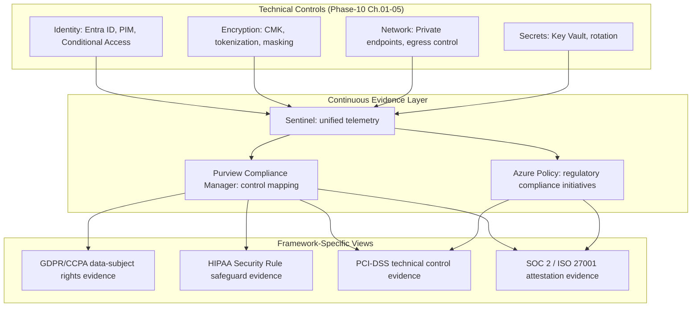
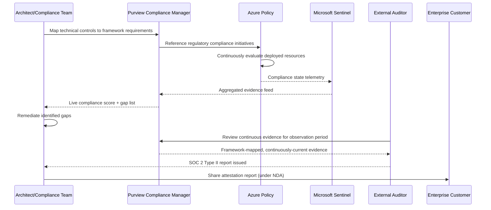
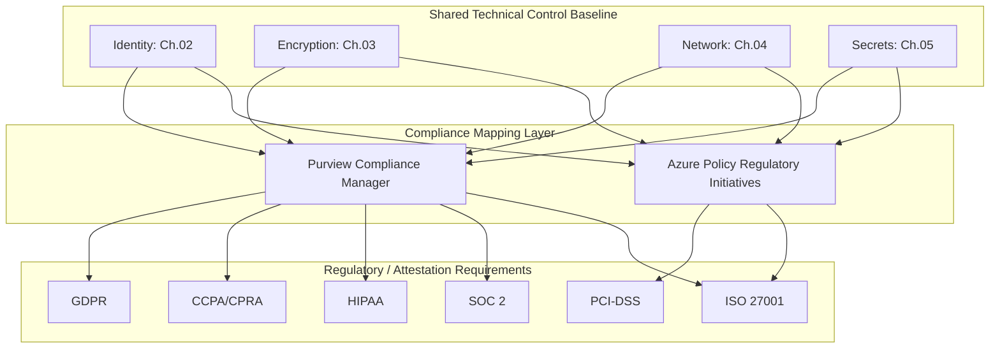
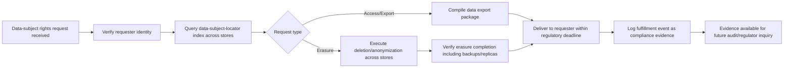

# Compliance and Regulatory Frameworks

> Part of the **Enterprise Data & AI Architecture Handbook** · Phase-10 — Security, Identity & Compliance · Chapter 06.
> Estimated study time: **45 min reading + ~2h labs**.
> **Prerequisite:** read [Data Governance Foundations](../Phase-08/01_Data_Governance_Foundations.md) first.

---

## Executive Summary

[Data Governance Foundations](../Phase-08/01_Data_Governance_Foundations.md#core-concepts) established that "data governance is an accountability problem before it is a tooling problem" — a named owner, a documented classification, an enforced policy. This chapter is where that accountability model meets external legal obligation: **compliance** is what happens when governance's internal policy requirements ("who owns this dataset, what classification does it carry") are joined by an external party — a regulator, an auditor, a customer's legal team — who requires *proof*, not assertion, that the requirement was actually met. Every technical control built across this Phase-10 series — STRIDE threat models ([Security Foundations](01_Security_Foundations.md)), PIM access reviews ([Identity and Access Management with Entra](02_Identity_and_Access_Management_with_Entra.md)), CMK rotation evidence ([Data Security and Encryption](03_Data_Security_and_Encryption.md)), private-endpoint configuration ([Network Security and Zero Trust](04_Network_Security_and_Zero_Trust.md)), and rotation audit trails ([Secrets and Key Management](05_Secrets_and_Key_Management.md)) — exists partly for its own security value and partly as the raw evidentiary material this chapter shows you how to assemble into a defensible compliance posture.

This chapter covers the major regulatory frameworks a data platform architect must actually reason about: **GDPR, CCPA, HIPAA, and PCI-DSS** as representative, materially different regulatory regimes (privacy-rights-based, healthcare-specific, and payment-card-specific respectively) rather than a single undifferentiated "compliance" blob; **SOC 2 and ISO 27001** as the two dominant *attestation frameworks* that translate an enterprise's internal controls into a credible, externally-verifiable statement trusted by customers and partners; **audit trails and evidence** as the concrete, continuously-generated artifact every one of the preceding technical chapters' logging and observability sections was quietly building toward; **data residency and sovereignty** as the increasingly consequential constraint on *where* data may physically live and be processed, not just who may access it; and **compliance as code** as the practice that turns "we believe we are compliant" into "our pipeline continuously and automatically verifies we are compliant," directly extending the policy-as-code discipline from [Security Foundations](01_Security_Foundations.md#core-concepts) and [Network Security and Zero Trust](04_Network_Security_and_Zero_Trust.md#governance).

The bias remains **Azure-primary (~60%)** — Microsoft Purview Compliance Manager, Azure Policy regulatory compliance initiatives, Microsoft 365/Azure data residency commitments, Azure Government/sovereign clouds — **~30% enterprise open source** (Open Policy Agent for compliance-as-code, InSpec/Chef Compliance for automated control verification, OpenSCAP) and **~10% AWS/GCP comparison-only** (AWS Artifact/Audit Manager, GCP Compliance Reports Manager/Assured Workloads).

**Bottom line:** compliance is not a separate activity bolted onto a finished, secure architecture — it is the same technical controls built across this Phase-10 series, with one additional requirement layered on top: **provable, continuously-current evidence**, assembled and presented in the specific structure a given framework's auditor expects. An architect who has built strong identity, encryption, network, and secrets controls but never mapped them to a specific framework's control catalog, and never automated evidence collection, will still fail an audit — not because the technical controls are inadequate, but because "trust us, we did the right thing" is never sufficient proof for a regulator or a SOC 2 auditor. This chapter closes that gap: it shows exactly how the preceding five chapters' logs, policies, and access reviews become a defensible, continuously-verified compliance posture rather than a plausible but unproven claim.

---

## Learning Objectives

By the end of this chapter you will be able to:

1. **Distinguish GDPR, CCPA, HIPAA, and PCI-DSS** by their core legal mechanism, scope, and the specific technical controls each mandates for a data platform.
2. **Explain SOC 2 and ISO 27001** as attestation frameworks, and articulate the difference between a framework that mandates specific controls and one that certifies a control-management *process*.
3. **Design an audit-trail architecture** that produces continuously-available, tamper-evident evidence for a specific regulatory or attestation requirement.
4. **Architect for data residency and sovereignty**, including regional data-processing boundaries and sovereign-cloud considerations.
5. **Implement compliance as code**, translating a specific regulatory control into an automated, continuously-evaluated policy check.
6. **Map Phase-10's preceding technical controls** (identity, encryption, network, secrets) to specific compliance-framework control catalogs.
7. **Apply compliance practices on Azure** using Microsoft Purview Compliance Manager and Azure Policy regulatory initiatives, with a defensible comparison to AWS and GCP equivalents.
8. **Defend compliance architecture decisions** in engineer, staff engineer, architect, and CTO review settings, including the trade-offs between compliance rigor and delivery velocity.

---

## Business Motivation

- **Non-compliance carries direct, quantifiable financial and legal exposure** — GDPR fines reach up to 4% of global annual revenue or €20 million (whichever is greater); PCI-DSS non-compliance can result in card-network fines and loss of payment-processing capability entirely; HIPAA violations carry both civil and, in cases of willful neglect, criminal penalties.
- **SOC 2 and ISO 27001 attestations are frequently a hard contractual gate for enterprise sales** — a B2B SaaS or data-platform vendor without a current SOC 2 Type II report is commonly disqualified from enterprise procurement before technical evaluation even begins, making compliance attestation a revenue-enabling capability, not merely a risk-avoidance one.
- **Data residency requirements increasingly determine *where* an enterprise may even operate** — a data platform architecture that cannot demonstrate EU customer data stays within the EU, or that health data stays within a specific jurisdiction, can be a binary disqualifier for entire market segments, independent of the platform's technical quality.
- **Manual, point-in-time compliance evidence gathering is enormously expensive and stale the moment it's collected** — an annual manual audit-evidence-collection exercise (screenshots, spreadsheets, email confirmations) consumes weeks of senior engineering time and produces evidence that is already outdated by the time the audit concludes; compliance-as-code directly addresses this recurring cost.
- **Regulatory frameworks increasingly reference each other and the underlying technical control set overlaps substantially** — an architecture built to satisfy [Security Foundations](01_Security_Foundations.md) through [Secrets and Key Management](05_Secrets_and_Key_Management.md)'s technical controls is already most of the way to satisfying multiple frameworks simultaneously; the incremental cost of formal compliance is primarily in evidence mapping and gap closure, not building entirely new controls from scratch.
- **AI-specific regulation is a fast-emerging, material compliance surface** — the EU AI Act and sector-specific AI governance requirements are beginning to impose documentation, risk-classification, and audit obligations on AI systems processing enterprise data, a compliance dimension architects must now factor in alongside traditional data-privacy law.

---

## History and Evolution

- **1996 — HIPAA** is enacted in the US, initially focused on health insurance portability, with its Privacy and Security Rules (finalized 2000s, updated by HITECH in 2009) becoming the foundational US healthcare-data-protection regulatory regime.
- **2004 — PCI-DSS** is created by the major card networks (Visa, Mastercard, Amex, Discover) as an industry-mandated (not government-legislated) standard, giving payment-card data protection a globally consistent technical control baseline enforced contractually rather than by statute.
- **2002 — SOC (Service Organization Control) reports**, evolving from the earlier SAS 70 standard, are formalized by the AICPA, with SOC 2 specifically addressing security, availability, processing integrity, confidentiality, and privacy trust-service criteria for service organizations.
- **2005 — ISO/IEC 27001** is published, establishing an internationally recognized standard for information security management systems (ISMS), certifiable by accredited third-party bodies, giving global enterprises a common security-management-process attestation independent of any single national regulatory regime.
- **2016 (enacted) / 2018 (enforced) — GDPR** transforms EU data-privacy law from a patchwork of national implementations into a single, directly-applicable regulation with extraterritorial reach (applying to any organization processing EU residents' data regardless of where the organization is based), introducing the "privacy by design" principle as a binding legal requirement, not merely a best practice.
- **2018 (enacted) / 2020 (enforced) — CCPA** (later expanded by CPRA, 2023) brings GDPR-influenced consumer privacy rights to California, becoming the template several other US states have since followed, creating a genuinely fragmented US state-level privacy compliance landscape distinct from the EU's single-regulation model.
- **2019-2020 — Compliance-as-code tooling matures** (Open Policy Agent's Rego-based policy evaluation, AWS/Azure/GCP native compliance-scanning services), shifting compliance evidence from periodic manual collection toward continuous, automated verification.
- **2020-present — Cloud-provider sovereign and government cloud offerings mature** (Azure Government, Azure China operated by 21Vianet, EU data-boundary commitments), directly addressing the data-residency and sovereignty requirements this chapter covers as an increasingly distinct architectural concern from general security.
- **2024 — the EU AI Act** is adopted, introducing risk-based classification and documentation obligations for AI systems, the first comprehensive AI-specific regulatory regime with direct implications for any enterprise data platform feeding or hosting AI/ML systems.

---

## Why This Technology Exists

Building strong technical security controls — the identity, encryption, network, and secrets management covered across this Phase-10 series — is necessary but insufficient for an enterprise operating under legal and contractual obligation, because a regulator, auditor, or enterprise customer's procurement team does not take an architecture's word for its own security posture; they require independently verifiable, continuously current evidence mapped to a specific, named framework's control catalog. Compliance and regulatory-framework practice exists to close that specific gap: translating "we built good controls" into "here is the auditable, framework-mapped evidence that these specific controls were operating effectively over this specific period," which is a distinct engineering and process discipline from building the controls themselves.

---

## Problems It Solves

- **Unquantified legal and financial exposure from regulatory non-compliance** — mapping technical controls explicitly to GDPR/CCPA/HIPAA/PCI-DSS requirements turns an ambiguous risk into a concretely assessed, addressable gap list.
- **Enterprise sales blocked by missing attestations** — a current SOC 2 Type II report or ISO 27001 certification directly unblocks procurement processes that would otherwise reject the vendor before technical evaluation.
- **Expensive, stale, manually-collected audit evidence** — compliance-as-code and automated evidence pipelines (Microsoft Purview Compliance Manager, Azure Policy compliance dashboards) replace a periodic scramble with continuous, always-current evidence.
- **Ambiguity about where regulated data may legally reside or be processed** — explicit data-residency and sovereignty architecture (regional deployment boundaries, sovereign cloud usage) closes a gap that generic security architecture does not address at all.
- **Disconnected, siloed compliance efforts across multiple frameworks** — recognizing the substantial control overlap between GDPR, SOC 2, ISO 27001, and HIPAA lets a single well-designed control set satisfy multiple frameworks' evidence requirements simultaneously, rather than building bespoke, redundant compliance programs per framework.

---

## Problems It Cannot Solve

- **It cannot substitute for the underlying technical controls it evidences.** Compliance frameworks require that specific controls (encryption, access management, network segmentation) actually exist and function correctly — this chapter assumes [Identity and Access Management with Entra](02_Identity_and_Access_Management_with_Entra.md), [Data Security and Encryption](03_Data_Security_and_Encryption.md), [Network Security and Zero Trust](04_Network_Security_and_Zero_Trust.md), and [Secrets and Key Management](05_Secrets_and_Key_Management.md) are already correctly implemented; compliance mapping does not create security where none exists.
- **It cannot make an organization legally compliant through documentation alone.** A framework mapping that lists a control as "implemented" when it is not merely creates fraudulent evidence, exposing the organization to greater legal risk than an honestly-documented gap.
- **It cannot resolve genuine conflicts between different regulatory regimes' requirements.** A scenario where one jurisdiction's data-localization mandate conflicts with another's data-portability or law-enforcement-access requirement is a genuine legal and architectural tension requiring specific legal counsel and often a bespoke regional-deployment architecture, not a technical shortcut.
- **It cannot eliminate the need for actual legal expertise.** This chapter equips an architect to reason about and implement the *technical* controls regulatory frameworks require; final determination of legal applicability and interpretation remains the responsibility of qualified legal counsel and compliance officers, not the architecture team alone.
- **It cannot make compliance a one-time project.** Every framework covered here requires continuous, ongoing evidence of control operation (not a single point-in-time snapshot); an architecture that treats "we passed the audit" as a completed, permanent state will fail the next audit cycle.

---

## Core Concepts

### 6.1 GDPR, CCPA, HIPAA, and PCI-DSS — Four Different Regulatory Mechanisms

These four frameworks are frequently grouped together as "compliance" but operate on structurally different legal mechanisms and scopes:

- **GDPR (General Data Protection Regulation, EU)** — a comprehensive, rights-based privacy regulation applying to any organization processing EU residents' personal data, regardless of the organization's location. Its core mechanism is **individual data-subject rights** (access, rectification, erasure/"right to be forgotten," portability, objection) that the platform must be technically capable of fulfilling, plus **lawful-basis-for-processing** requirements (consent, contract, legitimate interest) that must be tracked per data element, plus **privacy by design and by default** as a binding architectural obligation, not a best-practice suggestion.
- **CCPA/CPRA (California Consumer Privacy Act / California Privacy Rights Act, US)** — a similar rights-based model to GDPR but narrower in scope (California residents specifically) and with some distinct mechanics (an opt-out-of-sale/sharing right rather than GDPR's opt-in-consent-by-default emphasis for certain processing); represents the broader, still-fragmenting landscape of US state-level privacy law that a US-operating platform must navigate state by state, unlike the EU's single regulation.
- **HIPAA (Health Insurance Portability and Accountability Act, US)** — a sector-specific (healthcare) regulation applying to "covered entities" and "business associates" handling Protected Health Information (PHI). Its core mechanism is the **Security Rule** (mandating specific administrative, physical, and technical safeguards) and the **Privacy Rule** (governing permitted uses/disclosures of PHI), enforced via required **Business Associate Agreements (BAAs)** between covered entities and any vendor/platform processing PHI on their behalf.
- **PCI-DSS (Payment Card Industry Data Security Standard)** — an industry-mandated (not government-legislated) technical control standard for any organization storing, processing, or transmitting cardholder data, enforced contractually by the card networks and acquiring banks rather than by government regulator; its core mechanism is a **defined, prescriptive technical control checklist** (network segmentation, encryption, access logging, vulnerability management) validated via annual assessment (Self-Assessment Questionnaire or a Qualified Security Assessor audit, depending on transaction volume) — notably the *most technically prescriptive* of the four, directly explaining why [Data Security and Encryption](03_Data_Security_and_Encryption.md#business-motivation)'s tokenization discussion specifically referenced PCI-DSS scope reduction.
- **The practical architectural takeaway:** GDPR/CCPA drive data-subject-rights *capability* (can the platform actually find, export, and delete a specific individual's data on request), HIPAA drives *contractual and safeguard* requirements specific to health data, and PCI-DSS drives *prescriptive technical control* implementation — a platform handling all four data types must satisfy all four mechanisms simultaneously, often via the same underlying technical controls (encryption, access logging, tokenization) mapped to each framework's specific evidence requirements.

### 6.2 SOC 2 and ISO 27001 — Attestation Frameworks, Not Regulations

Unlike GDPR/CCPA/HIPAA/PCI-DSS (which are legal or contractual mandates with specific, prescribed requirements), SOC 2 and ISO 27001 are **attestation frameworks** — voluntary but commercially essential certifications that an independent third party verifies an organization's control environment against:

- **SOC 2** evaluates an organization's controls against five **Trust Services Criteria**: Security (mandatory baseline), Availability, Processing Integrity, Confidentiality, and Privacy (the latter four selected based on relevance to the service being assessed). A **Type I** report attests controls are suitably designed at a single point in time; a **Type II** report (materially more valuable to customers) attests controls operated effectively over an observation period (typically 6-12 months) — the distinction between "we designed good controls" and "we can prove these controls actually worked continuously," directly motivating this chapter's emphasis on continuous, not point-in-time, evidence.
- **ISO/IEC 27001** certifies that an organization operates a conformant **Information Security Management System (ISMS)** — a systematic, risk-based *process* for identifying, treating, and continuously improving information-security risk (per the ISO 27001 Annex A control set and the PDCA — Plan-Do-Check-Act — improvement cycle), rather than certifying any specific fixed technical control set; two ISO 27001-certified organizations can have meaningfully different specific technical controls, provided both operate a conformant risk-management process.
- **The practical distinction:** SOC 2 Type II answers "did these specific controls operate effectively over this period" (control-outcome-focused); ISO 27001 answers "does this organization operate a systematic, continuously-improving risk-management process" (process-focused) — many enterprises pursue both, since they serve overlapping but distinct audiences (SOC 2 is dominant for US/SaaS enterprise procurement; ISO 27001 carries more weight in international and government procurement contexts).

### 6.3 Audit Trails and Evidence

Every technical control across this Phase-10 series generates telemetry; compliance work is the discipline of ensuring that telemetry is structured, retained, and presented as **evidence** meeting a specific framework's requirements:

- **Immutability and tamper-evidence** — audit logs (Entra ID sign-in logs, Key Vault access logs, NSG flow logs, Sentinel-ingested telemetry from every prior Phase-10 chapter) must be protected from post-hoc modification; write-once storage tiers or cryptographically-chained logging provide the tamper-evidence auditors specifically look for.
- **Retention aligned to the specific framework's requirement, not a generic default** — PCI-DSS mandates a minimum one-year audit-trail retention (with three months immediately available); HIPAA generally requires six years for certain documentation; GDPR does not itself specify a fixed retention period but requires retention proportionate to purpose — a single, framework-agnostic retention policy risks either non-compliance (too short) or unnecessary cost and privacy exposure (too long, holding data longer than any framework requires).
- **Evidence must be mapped to specific control statements, not merely exist** — a SOC 2 auditor does not review raw log files; they review evidence explicitly mapped to a specific Trust Services Criteria control ("Control CC6.1: logical access is restricted via [Identity and Access Management with Entra](02_Identity_and_Access_Management_with_Entra.md#core-concepts)'s RBAC and PIM, evidenced by these specific access-review reports covering this specific period") — the mapping exercise, not merely log retention, is the actual compliance-engineering work.
- **Continuous evidence collection beats point-in-time collection** — automated evidence pipelines (Microsoft Purview Compliance Manager's control-mapping and continuous assessment, or a custom Azure Policy compliance-dashboard export) that generate current evidence on an ongoing basis materially reduce both audit-preparation cost and the risk of a control silently drifting out of compliance between manual review cycles.

### 6.4 Data Residency and Sovereignty

Data residency and sovereignty add a *geographic* dimension to compliance that pure security architecture does not otherwise need to consider:

- **Data residency** — a requirement (contractual or regulatory) that data be *stored* within a specific geographic/jurisdictional boundary; Azure's regional architecture (choosing specific Azure regions for storage and processing) and Azure's published data-residency commitments for specific services directly address this.
- **Data sovereignty** — a broader requirement that data be subject to *the laws of a specific jurisdiction*, including who can be legally compelled to grant access (a US-based cloud provider's data, even if physically stored in the EU, may still be subject to US legal-process requests under laws like the US CLOUD Act — a nuance residency alone does not resolve, and a common point of regulatory and customer concern for EU-sovereignty-sensitive workloads).
- **Sovereign cloud offerings** — Azure Government (for US federal/state/local government workloads, operated with US-persons-only access and additional compliance certifications), and the broader industry trend toward EU-operated sovereign cloud commitments, exist specifically to address sovereignty concerns residency-alone architectures cannot fully satisfy.
- **Practical architecture implications:** a genuinely residency/sovereignty-sensitive workload requires explicit regional deployment boundaries enforced by Azure Policy (denying resource creation outside approved regions), careful review of which specific Azure services and support operations may involve out-of-region data transit (e.g., certain support/diagnostic scenarios), and, for the strictest requirements, evaluation of sovereign cloud offerings rather than assuming standard commercial-cloud regional deployment is automatically sufficient.

### 6.5 Compliance as Code

Compliance as code applies the same policy-as-code discipline established in [Security Foundations](01_Security_Foundations.md#core-concepts) and [Network Security and Zero Trust](04_Network_Security_and_Zero_Trust.md#governance) specifically to regulatory and attestation-framework control verification:

- **Azure Policy regulatory compliance initiatives** — built-in policy initiatives mapping directly to specific frameworks (e.g., "PCI DSS 3.2.1," "ISO 27001:2013," "NIST SP 800-53") that continuously evaluate deployed Azure resources against each framework's specific technical requirements, surfacing a live compliance percentage and specific non-compliant resources, rather than a periodic manual checklist review.
- **Microsoft Purview Compliance Manager** — provides pre-built control mappings (called "assessments") for major frameworks, tracking implementation status, assigning actions to owners, and calculating a compliance score, directly extending the ownership/accountability model from [Data Governance Foundations](../Phase-08/01_Data_Governance_Foundations.md#core-concepts).
- **Open Policy Agent (OPA)/Rego-based compliance checks** — for custom or open-source-stack components not covered by native cloud-provider compliance tooling, OPA policies can encode a specific control requirement (e.g., "every Kubernetes namespace handling regulated data must have network policies defined") and evaluate infrastructure-as-code or runtime state against it automatically in CI/CD.
- **The concrete benefit:** compliance-as-code converts an annual, expensive, stale manual-evidence-gathering exercise into a continuously-current, automatically-generated compliance posture — an auditor asking "show me evidence this control was operating on this specific date six months ago" can be answered from a continuous compliance dashboard's historical record, rather than requiring a scramble to reconstruct point-in-time evidence after the fact.

---

## Internal Working

A representative compliance-evidence assembly flow for a SOC 2 Type II audit covering the Security and Confidentiality Trust Services Criteria:

1. **Control mapping** — the compliance team (working with the architecture team) maps each in-scope Trust Services Criteria control (e.g., "CC6.1: the entity implements logical access security measures") to the specific technical implementation satisfying it (Entra ID Conditional Access and PIM per [Identity and Access Management with Entra](02_Identity_and_Access_Management_with_Entra.md#core-concepts)).
2. **Evidence source identification** — for each mapped control, the team identifies the specific, already-existing telemetry source that evidences it operating (PIM activation logs, Conditional Access sign-in reports, Key Vault access logs) — critically, this is evidence the technical controls in Chapters 01-05 were already generating for their own security purposes, not new instrumentation built solely for the audit.
3. **Continuous evidence pipeline configuration** — rather than a one-time export, an automated pipeline (Microsoft Purview Compliance Manager, or a custom Azure Policy compliance-dashboard export scheduled to a governed evidence repository) captures this evidence on an ongoing basis throughout the observation period.
4. **Gap identification and remediation** — the mapping exercise surfaces controls with no clean evidence source (e.g., a manual, undocumented process for a specific access-approval step); these gaps are remediated (automating the process, or at minimum documenting it consistently) before or during the observation period, not discovered for the first time when the auditor asks.
5. **Auditor fieldwork** — the external auditor samples evidence across the observation period (not merely reviewing a single point-in-time snapshot), verifying the mapped controls actually operated as described for the sampled dates.
6. **Report issuance** — the auditor issues the SOC 2 Type II report, which the organization can then share (typically under NDA) with prospective customers' security/procurement teams as attestation evidence.
7. **Continuous operation, not a one-time event** — the evidence pipeline continues operating after report issuance, both because the *next* audit cycle will require the same evidence and because continuous compliance monitoring itself has independent security value (catching control drift between formal audit cycles).

---

## Architecture

The same underlying technical-control telemetry feeds every framework-specific evidence view — the architecture is "instrument once, map to many frameworks," not a separate, siloed evidence-collection pipeline per regulatory requirement.

---

## Components

- **Microsoft Purview Compliance Manager** — the central control-mapping, assessment, and compliance-scoring tool bridging technical controls to specific framework requirements.
- **Azure Policy regulatory compliance initiatives** — built-in policy sets continuously evaluating deployed resources against specific framework technical requirements (PCI-DSS, ISO 27001, NIST, HIPAA HITRUST).
- **Microsoft Sentinel** — the unified telemetry and evidence-retention layer already established across [Security Foundations](01_Security_Foundations.md#observability) through [Secrets and Key Management](05_Secrets_and_Key_Management.md#observability).
- **Data Subject Rights fulfillment tooling** — a mechanism (custom-built or via a dedicated privacy-management platform) to locate, export, and delete a specific individual's data across the platform's data stores in response to a GDPR/CCPA rights request.
- **Business Associate Agreement (BAA) tracking** — for HIPAA-scope platforms, a governance artifact (not purely technical) tracking which vendors/sub-processors have executed BAAs, directly connected to the vendor-risk-management aspect of [Data Governance Foundations](../Phase-08/01_Data_Governance_Foundations.md#governance).
- **Open Policy Agent (OPA)** — for compliance-as-code checks against custom infrastructure/application configuration not covered by native Azure compliance tooling.

---

## Metadata

- **Control-to-evidence mapping metadata** — the explicit link between a specific framework's control statement and the technical system/log source evidencing it should be documented and version-controlled, not maintained only in an auditor's working papers.
- **Data classification and processing-purpose metadata** — GDPR's lawful-basis-for-processing requirement and HIPAA's minimum-necessary-use principle both depend on accurate metadata about *why* a given data element is processed, extending the classification metadata from [Data Security and Encryption](03_Data_Security_and_Encryption.md#metadata) with a compliance-purpose dimension.
- **Data-subject and consent metadata** — for GDPR/CCPA compliance, the platform must track which lawful basis (consent, contract, legitimate interest) applies to each processing activity, and, where consent is the basis, the specific consent record and its scope/expiry.
- **Residency/sovereignty tagging** — resources and datasets should carry metadata indicating their required residency/sovereignty boundary, feeding the Azure Policy regional-restriction enforcement described in §6.4.
- **Attestation and certification status metadata** — current SOC 2/ISO 27001 certification status, scope, and expiry should be centrally tracked and discoverable, not left to institutional memory of when the last audit concluded.

---

## Storage

- **Audit-log and evidence storage retention is framework-driven**, not a single default — PCI-DSS's one-year minimum, HIPAA's six-year documentation retention, and any GDPR-proportionate retention period must each be explicitly configured rather than assumed to align with a generic platform-wide log-retention setting.
- **Evidence storage should be tamper-evident** — immutable/WORM (write-once-read-many) storage tiers (Azure Storage immutability policies) for the highest-assurance evidence categories, ensuring an auditor's trust in the evidence is not undermined by the possibility of post-hoc modification.
- **Data-subject rights fulfillment requires a mechanism to locate an individual's data across every store it may reside in** — this is a genuine architectural challenge for a data platform with data spread across a lakehouse, operational databases, and downstream analytics marts, often requiring a purpose-built data-subject-locator index rather than an ad hoc per-request manual search.
- **Regional data-residency storage boundaries** are enforced by choosing specific Azure regions for storage accounts/databases and using Azure Policy to deny resource creation outside the approved region set, directly extending [Network Security and Zero Trust](04_Network_Security_and_Zero_Trust.md#governance)'s policy-as-code guardrail pattern to a geographic dimension.

---

## Compute

- **Compliance-evidence generation itself requires negligible dedicated compute** — it is primarily a mapping, aggregation, and reporting exercise over telemetry the platform's existing security controls already generate.
- **Data-subject rights fulfillment (locating and exporting/deleting an individual's data) can be compute-intensive** for a large, multi-store platform, particularly for the "right to erasure" against append-only or immutable analytical stores (e.g., Delta Lake), where deletion may require a rewrite/compaction operation rather than a simple row delete — architect for this cost explicitly rather than assuming erasure requests are trivially cheap.
- **Data residency requirements may constrain which compute regions can process specific data**, meaning a workload's compute placement must sometimes be co-located with its data-residency boundary even where a different region would otherwise be more cost-effective or lower-latency.
- **Compliance-as-code policy evaluation (Azure Policy, OPA)** runs as lightweight, typically event-driven or scheduled evaluation, not a sustained compute workload.

---

## Networking

- **Data residency/sovereignty requirements directly constrain network architecture** — cross-region replication or disaster-recovery failover for a residency-bound dataset must itself stay within the approved jurisdictional boundary, meaning a standard multi-region DR architecture may need explicit redesign for residency-sensitive workloads.
- **PCI-DSS's network-segmentation requirements** (isolating the cardholder-data environment from the broader network) are a direct, specific application of the micro-segmentation principles from [Network Security and Zero Trust](04_Network_Security_and_Zero_Trust.md#core-concepts) §4.2, with PCI-DSS additionally mandating specific validation (segmentation penetration testing) beyond general security best practice.
- **Cross-border data-transfer mechanisms** (EU Standard Contractual Clauses, adequacy decisions) govern *legal* data-transfer permissibility distinct from the *technical* network path — an architect must ensure both the legal transfer mechanism is in place and the technical network architecture (private endpoints, ExpressRoute) matches the approved data-flow design.

---

## Security

- **Compliance requirements do not introduce new security controls beyond those covered in Chapters 01-05** — they specify which existing controls are mandatory for a given data type/scope and what evidence must be produced; treat compliance mapping as a lens on existing security architecture, not a parallel security program.
- **PCI-DSS's cardholder-data-environment (CDE) scope minimization** (via tokenization, per [Data Security and Encryption](03_Data_Security_and_Encryption.md#core-concepts) §3.3) is itself a security-architecture decision with direct compliance-cost benefit — a smaller CDE scope means a smaller, cheaper annual assessment.
- **HIPAA's "minimum necessary" principle** should directly inform RBAC/ABAC design ([Identity and Access Management with Entra](02_Identity_and_Access_Management_with_Entra.md#core-concepts) §2.2) for any system handling PHI — access grants should reflect the specific, documented minimum necessary for a role's function, not a broader convenience grant.
- **BAA and sub-processor security review** — any third-party vendor or sub-processor handling regulated data on the platform's behalf must itself meet the applicable framework's security requirements (a HIPAA BAA, a GDPR data-processing agreement), extending security due diligence beyond the platform's own boundary.

---

## Performance

- **Compliance-as-code evaluation (Azure Policy, OPA) adds negligible performance overhead** to normal platform operation, running as asynchronous evaluation against deployed resource state rather than in the critical path of application requests.
- **Data-subject rights fulfillment performance is a genuine architectural concern** — a "right to erasure" request against a petabyte-scale lakehouse with append-only table formats may require a background compaction/rewrite job rather than an instantaneous operation; framework requirements (GDPR's "undue delay," generally interpreted as within one month) should inform the SLA this background process is architected to meet.
- **Audit-log ingestion volume for compliance evidence** should be sized and budgeted as part of the platform's overall observability cost ([Security Foundations](01_Security_Foundations.md#cost-optimization)'s worked FinOps example), since compliance-driven retention requirements can meaningfully extend the volume and duration of logs that must remain queryable, not merely archived.

---

## Scalability

- **A single, well-mapped control set scales across multiple frameworks** — the "instrument once, map to many" architecture from this chapter's **Architecture** diagram is what makes pursuing GDPR, SOC 2, ISO 27001, and PCI-DSS simultaneously tractable rather than requiring four independent compliance programs.
- **Compliance Manager assessment templates and Azure Policy initiatives scale centrally-authored control mappings across an entire tenant**, avoiding a bespoke, per-business-unit compliance-mapping exercise.
- **Data-subject rights fulfillment tooling must scale with request volume** — a manual, engineer-executed process for locating and exporting an individual's data does not scale past a handful of requests per month; a platform subject to consumer-facing GDPR/CCPA obligations at meaningful scale needs a semi-automated or fully-automated fulfillment pipeline.
- **Multi-framework evidence retention at scale** requires deliberate data lifecycle management (tiered storage, per [Data Security and Encryption](03_Data_Security_and_Encryption.md#cost-optimization)'s classification-driven cost model) so retention requirements for the longest-retention framework (e.g., HIPAA's six years) do not force uniformly expensive hot-tier storage for evidence categories with shorter requirements.

---

## Fault Tolerance

- **Evidence-collection pipeline failures must be caught and remediated before they create an audit gap** — if the automated evidence pipeline (Compliance Manager, Azure Policy export) silently fails for a period, the resulting evidence gap may not be discoverable until an auditor asks for that specific period's data; monitor evidence-pipeline health as its own first-class signal, not merely assume it is working.
- **A compliance program must have a documented incident-notification process** ready before an incident occurs — GDPR's 72-hour breach-notification requirement, and similar notification obligations under other frameworks, are time-bound legal obligations that cannot be met by an ad hoc, first-time-improvised process during an actual incident.
- **Data-residency architecture must include a compliant disaster-recovery design** — a DR failover that replicates residency-bound data to an out-of-jurisdiction region to satisfy availability requirements creates a *new* compliance gap while solving an availability one; DR architecture for residency-sensitive workloads must be designed within the approved jurisdictional boundary from the outset.
- **Certification/attestation lapse must be tracked and prevented proactively** — SOC 2 and ISO 27001 certifications have defined validity periods and require renewal audits; a lapsed certification discovered only when a customer asks for a current report is a preventable, embarrassing, and potentially contract-breaching gap.

---

## Cost Optimization

- **Reuse the same technical-control evidence across multiple frameworks** rather than building bespoke, duplicate evidence-collection pipelines per framework — the single largest compliance-cost optimization available, directly enabled by this chapter's "instrument once, map to many" architecture.
- **Automate evidence collection to eliminate recurring manual audit-preparation labor** — the FinOps case for compliance-as-code is primarily an avoided-labor-cost argument (eliminating weeks of senior engineer/compliance-officer time per audit cycle), not a direct infrastructure-cost saving.
- **Right-size evidence retention per framework's actual requirement**, not a uniform maximal retention applied to every evidence category — mirroring [Data Security and Encryption](03_Data_Security_and_Encryption.md#cost-optimization)'s classification-driven cost discipline applied specifically to audit-log/evidence storage tiering.
- **Scope PCI-DSS assessment cost down via tokenization-driven CDE minimization** ([Data Security and Encryption](03_Data_Security_and_Encryption.md#core-concepts) §3.3) — a smaller cardholder-data environment directly reduces the annual assessment's scope, cost, and duration.
- **Worked FinOps example:** An organization's compliance team spent approximately 6 weeks of combined effort (2 compliance officers plus 3 engineers, at a blended ~$90/hour) manually gathering evidence for its annual SOC 2 Type II audit — screenshotting Entra ID role assignments, manually exporting Key Vault access logs, and compiling spreadsheets — totaling roughly 5 people × 6 weeks × 40 hours × $90/hour ≈ **$108,000** in labor cost per audit cycle, plus a materially higher external-auditor fee due to the auditor's own additional time spent verifying manually-assembled, inconsistently-formatted evidence. Implementing Microsoft Purview Compliance Manager with automated control mapping and a continuous Azure Policy compliance-dashboard export reduces the annual evidence-gathering effort to an estimated 1 week of 2 people's time (~$7,200) plus modest ongoing Compliance Manager licensing, and additionally reduces external audit fieldwork time (auditors reviewing continuously-generated, consistently-formatted evidence work materially faster than reviewing ad hoc manual compilations) by an estimated 20-30%. The direct internal labor saving alone — roughly **$100,000/year** — pays back the automation investment within the first audit cycle, before even counting the reduced external audit fee or the risk-reduction value of continuous rather than point-in-time evidence.

---

## Monitoring

- **Compliance-score trend tracking** — Microsoft Purview Compliance Manager and Azure Policy regulatory compliance dashboards both surface a live compliance percentage per framework; track this trend over time, not only at audit time, catching drift early.
- **Evidence-pipeline health monitoring** — confirm the automated evidence-collection pipelines (Compliance Manager sync, Azure Policy export, Sentinel log ingestion) are themselves operating correctly, per the Fault Tolerance concern above.
- **Data-subject rights request volume and fulfillment-time tracking** — monitor request volume trend and time-to-fulfillment against the applicable framework's required timeline (GDPR's one-month default), alerting if fulfillment is trending toward breaching that timeline.
- **Certification/attestation expiry tracking** — a dedicated dashboard tracking days-until-renewal-audit-due for every current certification/attestation, analogous to the certificate-expiry monitoring pattern from [Secrets and Key Management](05_Secrets_and_Key_Management.md#monitoring).

---

## Observability

- **Unified compliance-evidence correlation** — the same Sentinel workspace aggregating identity, encryption, network, and secrets telemetry across Chapters 01-05 serves as the observability substrate for compliance evidence, avoiding a separate, siloed compliance-specific logging pipeline.
- **Framework-specific evidence views/dashboards**, built on top of the shared telemetry, let a compliance officer or auditor query "show me evidence for control X over period Y" without needing to understand the underlying technical telemetry schema directly.
- **Detection rules for compliance-relevant anomalies** — an access pattern violating HIPAA's minimum-necessary principle, a data flow crossing an unapproved residency boundary, or a PCI-DSS cardholder-data-environment scope violation should each have a corresponding Sentinel analytics rule, extending the security-detection model to compliance-specific violations.
- **Continuous compliance posture, not point-in-time audit snapshots**, as the observability goal — the same principle motivating SOC 2 Type II's preference for continuous-operation evidence over Type I's point-in-time design attestation.

### Operational Response Playbook

| Signal | Detection Query/Check | Remediation |
|---|---|---|
| Automated evidence-collection pipeline (Compliance Manager sync or Azure Policy export) fails or stops updating | Scheduled health-check alert on evidence-pipeline last-successful-run timestamp | Page the compliance/platform on-call; investigate and restore the pipeline; back-fill the evidence gap manually if the pipeline was down during an active audit observation period, documenting the gap and remediation for the auditor. |
| A resource is deployed outside the approved data-residency region boundary | Azure Policy compliance scan flagging a non-compliant resource against the region-restriction initiative | Immediately quarantine/restrict the resource; determine whether any regulated data was actually written to it before remediation; migrate or delete the resource per the residency policy; add a preventive Azure Policy `deny` assignment if one was not already blocking this resource type. |
| A data-subject rights request (access/erasure) approaches its regulatory fulfillment deadline unresolved | Rights-fulfillment tracking system alert at a configurable threshold before the framework's required deadline (e.g., GDPR's one month) | Escalate to the data governance/privacy team immediately; prioritize completion within the legal deadline; if genuinely at risk of breaching the deadline, document the reason and any communicated extension per the applicable framework's allowance (GDPR permits a documented two-month extension for complex requests). |

---

## Governance

- **A named compliance owner (often a Data Protection Officer for GDPR-scope organizations, or a compliance/privacy officer more broadly) is accountable for each framework's ongoing posture**, directly extending the ownership/accountability model from [Data Governance Foundations](../Phase-08/01_Data_Governance_Foundations.md#core-concepts).
- **Control-to-framework mapping documentation is version-controlled and reviewed on architecture change** — a new component or a modified data flow should trigger a review of whether it affects any existing framework's control mapping, not be assumed automatically compliant.
- **Data Protection Impact Assessments (DPIAs)**, required under GDPR for high-risk processing activities, should be a standard, triggered step in the architecture-review process for any new system processing personal data at scale or using novel technology (including AI/ML systems), extending [Architecture Governance](../Phase-01/02_Architecture_Governance.md#core-concepts)'s review-gate model.
- **Vendor/sub-processor compliance is governed with the same rigor as internal controls** — BAAs, data-processing agreements, and sub-processor SOC 2/ISO 27001 attestations should be tracked and periodically reviewed as part of the platform's own compliance posture, not treated as someone else's problem once a contract is signed.
- **Compliance posture is reported alongside security posture** in the same quarterly review cadence established in [Security Foundations](01_Security_Foundations.md#enterprise-recommendations), not siloed into a separate, less-visible annual audit-cycle-only conversation.

---

## Trade-offs

| Dimension | Comprehensive multi-framework compliance program | Minimal, single-framework compliance |
|---|---|---|
| Audit/evidence overhead | Higher upfront mapping effort, but amortized across frameworks via shared control set | Lower upfront effort, but redundant effort if a second framework is later required |
| Market/procurement access | Broadest — satisfies most enterprise/regulated-industry customer requirements | Narrower — may block procurement with customers requiring a framework not covered |
| Ongoing operational cost | Amortized via compliance-as-code automation | Lower nominal cost, but manual evidence-gathering cost recurs per framework if scope grows |
| Risk coverage | Comprehensive across privacy, security-process, and sector-specific requirements | Gaps for any regulatory dimension not covered by the chosen single framework |
| Suitability | Enterprises serving regulated industries, multiple geographies, or enterprise B2B customers | Early-stage companies or narrowly-scoped platforms with a clearly bounded single-framework requirement |

The general enterprise guidance: design the underlying technical control set once, to a comprehensive standard, and treat individual framework certification/attestation as a mapping and evidence exercise layered on top — the marginal cost of adding a second or third framework's attestation is materially lower than building it as an independent program, provided the first framework's technical controls were built to a genuinely strong baseline rather than narrowly scoped to just barely satisfy that framework's minimum requirement.

---

## Decision Matrix

| Scenario | Recommended Approach |
|---|---|
| B2B SaaS/data-platform vendor selling to enterprise customers | SOC 2 Type II as the baseline expectation; ISO 27001 additionally for international/government customers |
| Platform processing EU residents' personal data | GDPR compliance mandatory regardless of the organization's own location, including data-subject-rights fulfillment capability |
| Platform handling US health data on behalf of a covered entity | HIPAA compliance mandatory, including an executed BAA and Security Rule safeguard implementation |
| Platform storing/processing payment card data | PCI-DSS compliance mandatory; prioritize tokenization to minimize CDE scope and assessment cost |
| Multi-jurisdictional platform with strict data-localization customer requirements | Explicit regional deployment architecture with Azure Policy-enforced residency boundaries; evaluate sovereign cloud offerings for the strictest requirements |
| Rapidly scaling platform anticipating multiple future framework requirements | Build a comprehensive technical control baseline and compliance-as-code evidence pipeline early, even before the first formal audit, to avoid costly retrofitting |

---

## Design Patterns

- **Instrument once, map to many frameworks** — a single, comprehensive technical control set with telemetry mapped to multiple frameworks' evidence requirements, avoiding redundant, siloed per-framework compliance programs.
- **Compliance-as-code as the default evidence-generation mechanism** — automated, continuous control evaluation (Azure Policy, Compliance Manager, OPA) rather than periodic manual evidence gathering.
- **Classification-driven residency and retention** — data classification metadata (from [Data Security and Encryption](03_Data_Security_and_Encryption.md#governance)) directly drives both the encryption/masking decision and the residency/retention policy applied to a given dataset, treated as one unified classification-driven policy engine rather than separate systems.
- **Rights-fulfillment as a designed platform capability, not an ad hoc process** — a purpose-built data-subject-locator and export/erasure pipeline, tested and ready before the first real request arrives, rather than improvised under a regulatory deadline.
- **Gap-driven remediation before audit, not during** — the control-mapping exercise proactively surfaces gaps well ahead of the audit observation period, giving time for genuine remediation rather than last-minute scrambling.

---

## Anti-patterns

- **Treating compliance as an annual, point-in-time project** rather than a continuous operating discipline — a "we passed the audit, we're done" mindset that guarantees drift and a harder next audit cycle.
- **Building a bespoke, siloed evidence-collection process per framework** rather than reusing a shared technical-control telemetry base, multiplying both cost and inconsistency risk.
- **Marking a control "implemented" in a compliance-mapping tool without genuine, verifiable evidence** — creating documentation that misrepresents the actual control state, a materially worse position than an honestly-documented gap.
- **Assuming a specific Azure region choice alone satisfies data sovereignty**, without considering the legal-jurisdiction and support-access nuances a strict sovereignty requirement may actually demand.
- **No tested, ready process for data-subject rights fulfillment**, discovering only when the first real request arrives that locating and exporting an individual's data across a sprawling platform is a multi-week manual undertaking incompatible with the regulatory deadline.
- **Letting a certification/attestation lapse unnoticed**, discovered only when a customer's procurement team asks for a current report that the organization can no longer produce.

---

## Common Mistakes

- Confusing "we have security controls" with "we are compliant with framework X," without ever performing the explicit control-to-framework mapping exercise a specific audit actually requires.
- Assuming SOC 2 Type I is equivalent to Type II for customer trust purposes, when most sophisticated enterprise buyers specifically require Type II's continuous-operation evidence.
- Applying a single, generic log-retention policy across every compliance-relevant evidence category, rather than tuning retention per framework's actual, differing requirement.
- Treating GDPR/CCPA as satisfied by a privacy policy document alone, without the underlying technical capability to actually locate, export, and delete a specific individual's data on request.
- Failing to account for data-residency implications of cross-region disaster-recovery replication, inadvertently creating a residency violation while solving an availability requirement.
- Not tracking sub-processor/vendor compliance status, discovering during an audit or incident that a critical third-party vendor never executed a required BAA or data-processing agreement.

---

## Best Practices

- Build a comprehensive technical control baseline (per Chapters 01-05) first, and treat individual framework attestation as a mapping and gap-closure exercise on top of it, not a from-scratch program per framework.
- Automate evidence collection via compliance-as-code (Purview Compliance Manager, Azure Policy regulatory initiatives) as the default, replacing periodic manual evidence gathering entirely where possible.
- Design and test data-subject rights fulfillment capability before the first real request arrives, not reactively under regulatory deadline pressure.
- Tier evidence and audit-log retention per each applicable framework's actual requirement, avoiding both under-retention risk and unnecessary over-retention cost.
- Track certification/attestation validity and renewal timelines proactively, with the same rigor applied to certificate-expiry monitoring in [Secrets and Key Management](05_Secrets_and_Key_Management.md#monitoring).
- Extend vendor/sub-processor due diligence to compliance status (BAAs, SOC 2/ISO 27001 attestations, data-processing agreements), not only technical security review.

---

## Enterprise Recommendations

- Mandate a named compliance owner (DPO or equivalent) accountable for each in-scope regulatory framework's ongoing posture, with clear escalation authority for gap remediation.
- Fund compliance-as-code tooling (Purview Compliance Manager, Azure Policy regulatory initiatives) as a standing platform investment rather than a project-based, per-audit-cycle expense.
- Require a Data Protection Impact Assessment for any new system processing personal data at scale, including AI/ML systems, as a standard, non-optional architecture-review gate.
- Track compliance posture (control-mapping completeness, evidence-pipeline health, certification validity, rights-fulfillment SLA performance) as a standing metric in the same quarterly review established across this Phase-10 series.
- Proactively assess EU AI Act and emerging AI-specific regulatory obligations now for any AI/agentic system processing enterprise or personal data, given the fast-moving and increasingly consequential nature of AI-specific compliance requirements.

---

## Azure Implementation

- **Microsoft Purview Compliance Manager** — pre-built assessment templates mapping technical controls to GDPR, HIPAA, ISO 27001, SOC 2, PCI-DSS, and other frameworks, with continuous compliance scoring and action assignment.
- **Azure Policy regulatory compliance initiatives** — built-in policy sets (e.g., "PCI DSS 3.2.1," "ISO 27001:2013," "HIPAA HITRUST") continuously evaluating deployed resources, surfacing live compliance dashboards.
- **Azure Government** — a sovereign, US-persons-operated cloud environment for US federal/state/local government workloads with additional compliance certifications (FedRAMP, DoD IL, CJIS).
- **Microsoft Priva** — Microsoft's dedicated privacy-management product, supporting data-subject rights request tracking, risk assessment, and consent management for GDPR/CCPA-scope organizations.
- **Azure resource region restriction via Azure Policy** — enforces data-residency boundaries by denying resource deployment outside an approved region set.
- **Azure Storage immutability policies** — WORM storage configuration for tamper-evident audit-log and evidence retention.

---

## Open Source Implementation

- **Open Policy Agent (OPA) / Rego** — encodes custom compliance-control checks (e.g., Kubernetes namespace network-policy requirements, infrastructure-as-code configuration checks) evaluated automatically in CI/CD, extending compliance-as-code to components not covered by native cloud-provider compliance tooling.
- **InSpec (Chef Compliance)** — an open-source, human-and-machine-readable language for defining and automatically verifying infrastructure and application compliance controls against a target system's actual configuration.
- **OpenSCAP** — an open-source implementation of the Security Content Automation Protocol (SCAP), commonly used for automated compliance scanning of operating-system-level configuration against standard benchmarks (CIS Benchmarks, DISA STIGs).
- **OpenTelemetry** — the vendor-neutral observability instrumentation standard underlying much of the evidence telemetry this chapter depends on, ensuring evidence generation is not locked to a single proprietary logging format.

---

## AWS Equivalent (comparison only)

| Capability | Azure | AWS |
|---|---|---|
| Compliance control mapping and scoring | Microsoft Purview Compliance Manager | AWS Audit Manager |
| Regulatory compliance policy evaluation | Azure Policy regulatory compliance initiatives | AWS Config Conformance Packs |
| Attestation/certification evidence repository | Compliance Manager + Azure trust documentation | AWS Artifact |
| Sovereign/government cloud | Azure Government | AWS GovCloud (US) |
| Privacy/data-subject-rights management | Microsoft Priva | Custom-built, or AWS partner/marketplace privacy-management solutions |

**Advantages of AWS:** AWS Artifact provides a well-established, self-service repository for downloading AWS's own compliance reports (SOC 2, ISO 27001, PCI-DSS Attestation of Compliance) directly, streamlining the "prove the underlying cloud platform is compliant" sub-question; AWS Config Conformance Packs offer broad, mature built-in rule coverage. **Disadvantages:** AWS lacks a first-party, dedicated privacy-management product as directly comparable to Microsoft Priva for data-subject-rights workflow management. **Migration strategy:** control-mapping methodology and the "instrument once, map to many frameworks" architecture transfer directly; concrete AWS Config rule definitions and Audit Manager assessment templates require AWS-specific rework. **Selection criteria:** choose AWS-native tooling for AWS-primary estates; choose Purview Compliance Manager/Azure Policy for Azure-primary or Microsoft-365-integrated estates, particularly where Priva's privacy-workflow integration is valuable.

---

## GCP Equivalent (comparison only)

| Capability | Azure | GCP |
|---|---|---|
| Compliance control mapping and scoring | Microsoft Purview Compliance Manager | GCP Compliance Reports Manager |
| Regulatory compliance policy evaluation | Azure Policy regulatory compliance initiatives | Security Command Center compliance dashboards + Organization Policy Service |
| Attestation/certification evidence repository | Compliance Manager + Azure trust documentation | GCP Compliance Reports Manager (self-service report downloads) |
| Sovereign/restricted-region cloud | Azure Government | GCP Assured Workloads (sovereign controls within standard regions) |
| Privacy/data-subject-rights management | Microsoft Priva | Custom-built, or Google Cloud DLP-assisted discovery workflows |

**Advantages of GCP:** Assured Workloads provides a notably flexible model for applying sovereign/compliance controls (data residency, personnel access restrictions, support-access controls) to workloads within standard commercial regions, without requiring a fully separate sovereign cloud environment as Azure Government does. **Disadvantages:** GCP, like AWS, lacks a first-party privacy-management product directly comparable to Microsoft Priva. **Migration strategy:** the underlying compliance-as-code and evidence-mapping approach transfers directly; concrete Organization Policy constraints and Security Command Center configurations require GCP-specific rework. **Selection criteria:** choose GCP-native tooling for GCP-primary estates, particularly where Assured Workloads' flexible sovereignty-within-standard-regions model is valuable; choose Purview/Azure Policy for Azure-primary or Microsoft-365-integrated estates.

---

## Migration Considerations

- **Perform a control-mapping gap analysis before committing to a formal audit engagement** — map existing technical controls (per Chapters 01-05) against the target framework's control catalog first, identifying genuine gaps, before scheduling an expensive formal audit that would simply surface those same gaps at a higher cost and with reputational risk.
- **Introduce compliance-as-code monitoring in report-only mode before treating any control as "compliant"** — exactly as with the SDLC and network security gates established earlier in this Phase-10 series, roll out new Azure Policy regulatory initiatives in audit mode first, review actual findings, remediate, then treat the dashboard's compliance score as trustworthy.
- **Prioritize closing gaps affecting the highest-consequence framework requirements first** — a missing data-subject-rights fulfillment capability (a hard GDPR requirement with direct enforcement risk) should be prioritized ahead of a lower-risk documentation gap.
- **Migrate legacy, manually-managed compliance evidence to the automated pipeline incrementally**, verifying the automated evidence genuinely satisfies what the manual process previously produced before fully retiring the manual process.
- **Expect a transitional period where some frameworks have mature, automated evidence and others are still manually managed** — track this explicitly as a compliance-maturity roadmap, consistent with the migration-tracking discipline established across this Phase-10 chapter series.

---

## Mermaid Architecture Diagrams

---

## End-to-End Data Flow

---

## Real-world Business Use Cases

- A SaaS data-analytics vendor's SOC 2 Type II report, produced via an automated Purview Compliance Manager and Azure Policy evidence pipeline, directly unblocked a multi-million-dollar enterprise contract whose procurement process had a hard requirement for current Type II attestation, closing the deal roughly two months faster than the vendor's prior manual-evidence audit cycle would have allowed.
- A healthcare technology company built a purpose-designed data-subject and PHI-access-rights fulfillment pipeline ahead of a HIPAA compliance audit, reducing average patient-record-access-request fulfillment time from several weeks (manual, ad hoc search across systems) to under 48 hours.
- A European retailer redesigned its disaster-recovery architecture after discovering its existing cross-region failover plan would have replicated EU customer data to a non-EU region during a failover event, closing a residency gap before it was ever triggered by an actual outage, rather than discovering it during a real incident.

---

## Industry Examples

- **Meta's 2023 GDPR fine (€1.2 billion)**, the largest issued to date at time of writing, is widely cited across the industry as the starkest illustration of GDPR's extraterritorial reach and the severity of its cross-border-data-transfer enforcement, directly motivating renewed enterprise attention to the data-residency and transfer-mechanism considerations covered in this chapter.
- **Target's 2013 breach**, which exposed cardholder data despite the company's PCI-DSS compliance at the time, is frequently cited as the canonical illustration that a point-in-time compliance certification does not guarantee continuous security — directly reinforcing this chapter's emphasis on continuous, not point-in-time, evidence and posture.
- **Major cloud providers' own SOC 2/ISO 27001/FedRAMP attestations** (Microsoft, AWS, Google all publish these) are the industry-standard mechanism by which enterprise customers gain assurance about the underlying cloud platform's own compliance posture — a direct, practical example of the attestation-report-sharing pattern this chapter describes, at the hyperscaler level.

---

## Case Studies

**Case: A compliance-evidence gap discovered mid-audit.** A data platform undergoing its first SOC 2 Type II audit had mapped its Entra ID Conditional Access and PIM controls to the relevant access-control criteria, and configured Sentinel to retain the relevant sign-in and PIM activation logs. Partway through the six-month observation period, the auditor requested evidence for a specific control (periodic access reviews) for a month early in the period — before the organization had actually operationalized its access-review process, which had only been fully automated two months into the observation window.

**Root cause:** the control-mapping exercise identified the *target* control design correctly but did not verify the control was *already operating* from the very start of the intended observation period — a Type II audit specifically requires evidence the control operated throughout the full period, not merely that it exists at the time of the audit.

**Remediation:** the organization worked with the auditor to either narrow the observation period to start from when the control was genuinely operational, or (for a subsequent audit cycle) ensured every in-scope control was verified operational from day one of the planned observation window before formally engaging the auditor — a direct lesson in the difference between "we have this control" and "we can prove this control operated for the full period an auditor will examine," which became a standing pre-engagement checklist item for all subsequent audit cycles.

---

## Hands-on Labs

1. **Lab 1 — Configure Microsoft Purview Compliance Manager for a sample framework.** In a sandbox tenant, add a Compliance Manager assessment for a framework (e.g., ISO 27001), review the pre-built control mappings, and mark a subset as implemented with a linked evidence source.
2. **Lab 2 — Deploy an Azure Policy regulatory compliance initiative.** Assign a built-in regulatory compliance initiative (e.g., PCI DSS) to a sandbox subscription, review the resulting compliance dashboard, and remediate at least one flagged non-compliant resource.
3. **Lab 3 — Build a data-subject-locator index.** Given a small sample dataset spread across two simulated stores (e.g., a relational table and a Delta Lake table), build a script that, given an identifier, locates and exports all records associated with that individual across both stores.
4. **Lab 4 — Configure region-restricted deployment via Azure Policy.** Create an Azure Policy assignment denying resource creation outside a specific approved region, and verify a deployment attempt to a non-approved region is blocked.
5. **Lab 5 — Write an OPA/Rego compliance-as-code policy.** Write a Rego policy verifying a sample Kubernetes namespace manifest includes a required NetworkPolicy resource, and integrate it as a CI/CD gate against sample manifests, one compliant and one non-compliant.

---

## Exercises

1. Explain the key structural difference between GDPR/CCPA, HIPAA, and PCI-DSS as regulatory mechanisms, and give one technical control each specifically mandates.
2. Explain the difference between SOC 2 Type I and Type II, and why enterprise customers typically require Type II specifically.
3. Design a data-residency architecture for a platform required to keep EU customer data within the EU while still providing disaster recovery; explain how you would avoid inadvertently violating residency during failover.
4. Design a control-mapping approach that lets a single technical control set satisfy both SOC 2 and ISO 27001 simultaneously, identifying where the two frameworks' evidence requirements overlap and where they diverge.
5. Identify a specific gap a "we passed last year's audit" mindset would miss, and describe how continuous compliance-as-code monitoring would catch it instead.

---

## Mini Projects

- Build a small compliance-mapping spreadsheet or lightweight tool that maps a sample set of technical controls (from Chapters 01-05's concepts) to specific control statements from two different frameworks (e.g., SOC 2 CC criteria and a PCI-DSS requirement number), identifying overlap and gaps.
- Implement a simple automated evidence-export script that queries Key Vault access logs, Entra ID PIM activation history, and Azure Policy compliance state, and compiles them into a single, dated evidence package for a hypothetical audit request.
- Build a minimal data-subject rights-request tracking system (a simple database/ticketing schema) that logs request receipt date, type, verification status, fulfillment date, and calculates days-remaining against a configurable regulatory deadline, alerting when a request approaches its deadline.

---

## Capstone Integration

Extend the secrets-hardened pipeline from [Secrets and Key Management](05_Secrets_and_Key_Management.md#capstone-integration)'s capstone with a complete compliance layer: perform a control-mapping exercise against one representative framework (e.g., SOC 2's Security criteria) for every technical control built across this pipeline's Phase-10 capstone iterations; configure Purview Compliance Manager or an Azure Policy regulatory initiative to continuously evaluate the pipeline's resources; add a region-restriction policy enforcing a specific data-residency boundary; and build a minimal data-subject-locator capability against the pipeline's output table. This becomes the compliance foundation that [Data Privacy and PII Protection](#further-reading) (Chapter 07) builds upon as the final chapter of Phase-10.

---

## Interview Questions

1. Explain the key structural differences between GDPR, CCPA, HIPAA, and PCI-DSS as regulatory frameworks.
2. What is the difference between SOC 2 and ISO 27001, and why might an organization pursue both?
3. Why is continuous, automated evidence collection preferable to periodic manual evidence gathering for compliance purposes?
4. What is the difference between data residency and data sovereignty, and why does the distinction matter architecturally?

## Staff Engineer Questions

5. How would you design a control-mapping architecture that lets a single technical control set satisfy multiple regulatory frameworks simultaneously without duplicating evidence-collection effort?
6. Describe how you would build a data-subject rights fulfillment pipeline capable of locating and erasing an individual's data across a multi-store lakehouse architecture, including handling append-only/immutable table formats.
7. What is your strategy for verifying a control has been operating for the full duration an auditor will examine, not merely that it exists at audit time?

## Architect Questions

8. How would you architect a disaster-recovery design for a data-residency-bound workload that maintains both availability requirements and residency compliance during a regional failover?
9. What is your approach to assessing and closing compliance gaps for emerging AI-specific regulation (e.g., the EU AI Act) for an existing data and AI platform?
10. How does your compliance architecture provide continuously-current, auditor-ready evidence without a costly, disruptive annual evidence-gathering exercise?

## CTO Review Questions

11. What is our current compliance posture across every framework our business requires, and where are the highest-risk gaps?
12. If a regulator requested evidence that a specific control was operating on a specific date one year ago, could we produce it today, and how quickly?
13. What is the single highest-leverage compliance investment you would prioritize this year, and how would you quantify the regulatory, financial, and market-access risk it addresses?

---

### Architecture Decision Record (ADR-0146): Adopt Compliance-as-Code with Continuous Evidence Collection as the Default Compliance Operating Model

- **Context.** The organization's compliance evidence-gathering process was entirely manual and performed once annually ahead of each audit engagement, consuming roughly six weeks of combined compliance-officer and engineering time per cycle (see **Cost Optimization**), and a mid-audit gap was discovered (see **Case Studies**) where a control's operational start date did not actually cover the full observation period the auditor examined.
- **Decision.** Adopt Microsoft Purview Compliance Manager and Azure Policy regulatory compliance initiatives as the default, continuously-operating evidence-collection mechanism for every framework the organization pursues, replacing periodic manual evidence gathering; require every new or materially-changed control to be verified operational and evidenced from the start of any relevant future observation period, not only confirmed present at audit time.
- **Consequences.** *Positive:* eliminates the majority of recurring manual audit-preparation labor; provides continuously-current evidence reducing both audit risk and auditor fieldwork time; catches control drift between formal audit cycles rather than only at audit time. *Negative:* upfront investment to build the control-mapping and automated evidence pipeline; requires disciplined change-management to ensure new controls are evidenced from their actual operational start date, not retrofitted. *Neutral:* some evidence categories (e.g., certain manual approval workflows) may still require a documented manual-evidence process where full automation is not yet feasible, tracked explicitly as a gap rather than silently accepted as automated.
- **Alternatives considered.** *Continue with annual manual evidence gathering* (rejected: the case study directly demonstrates its fragility, and the FinOps analysis quantifies its recurring cost as substantially higher than automation); *build a fully bespoke, in-house compliance-evidence platform* (rejected: duplicates capability Purview Compliance Manager and Azure Policy already provide natively, at higher build and maintenance cost with no clear differentiated benefit for the organization's specific needs).

---

## References

- Regulation (EU) 2016/679 (General Data Protection Regulation).
- California Consumer Privacy Act (CCPA) and California Privacy Rights Act (CPRA).
- HHS.gov. "HIPAA Security Rule and Privacy Rule Summary."
- PCI Security Standards Council. "Payment Card Industry Data Security Standard (PCI-DSS) v4.0."
- AICPA. "SOC 2 Trust Services Criteria."
- ISO/IEC 27001:2022. "Information security, cybersecurity and privacy protection — Information security management systems."
- Microsoft Learn. "Microsoft Purview Compliance Manager documentation," "Azure Policy regulatory compliance documentation," "Azure Government documentation."
- European Union. "Regulation (EU) 2024/1689 (EU AI Act)."

## Further Reading

- [Data Governance Foundations](../Phase-08/01_Data_Governance_Foundations.md) — the accountability and ownership model this chapter's compliance controls are layered on top of.
- [Security Foundations](01_Security_Foundations.md) — the STRIDE threat-modeling and SDLC security-gate discipline this chapter's compliance mapping builds directly on.
- [Identity and Access Management with Entra](02_Identity_and_Access_Management_with_Entra.md), [Data Security and Encryption](03_Data_Security_and_Encryption.md), [Network Security and Zero Trust](04_Network_Security_and_Zero_Trust.md), [Secrets and Key Management](05_Secrets_and_Key_Management.md) — the technical control baseline this chapter maps to specific regulatory and attestation-framework evidence requirements.
- Phase-10 Chapter 07 (Data Privacy and PII Protection) — the privacy-specific technical implementation of the GDPR/CCPA data-subject-rights and classification concepts introduced here.

---

[Back to Phase-10 README](../../.github/prompts/Phase-10/README.md) - [Handbook README](../../README.md) - [Roadmap](../../ROADMAP.md)
