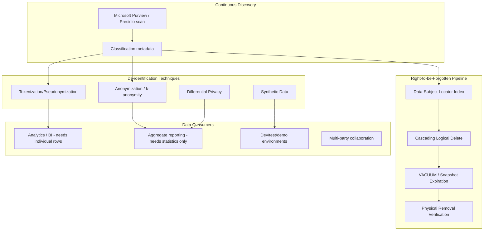
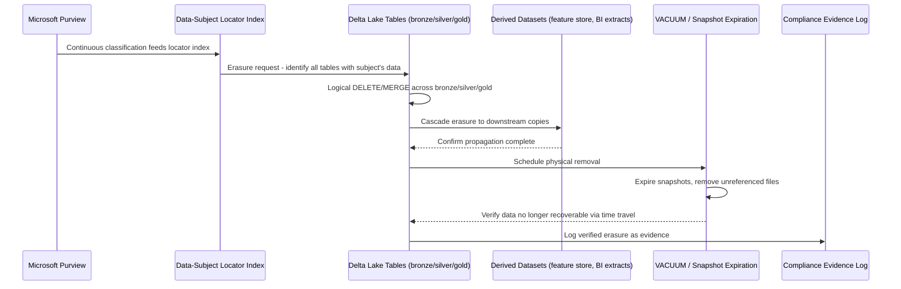
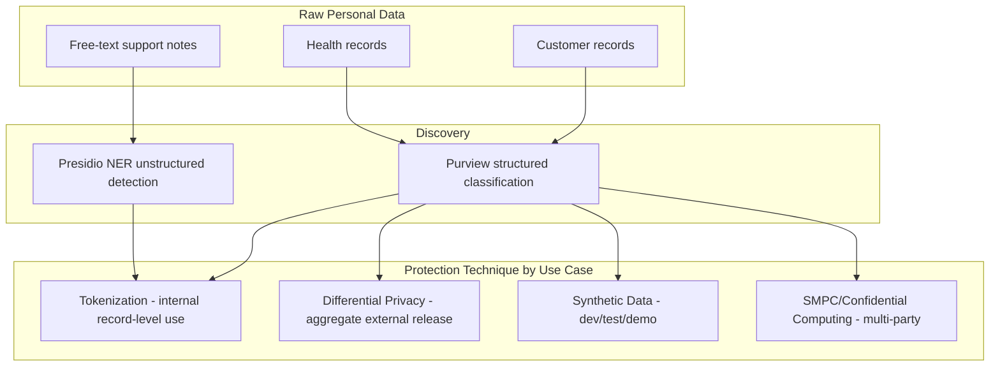
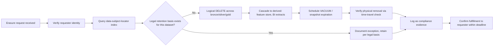

# Data Privacy and PII Protection

> Part of the **Enterprise Data & AI Architecture Handbook** · Phase-10 — Security, Identity & Compliance · Chapter 07.
> Estimated study time: **60 min reading + ~3h labs**.
> **Prerequisite:** read [Compliance and Regulatory Frameworks](06_Compliance_and_Regulatory_Frameworks.md) first.

---

## Executive Summary

[Compliance and Regulatory Frameworks](06_Compliance_and_Regulatory_Frameworks.md#core-concepts) established *what* GDPR and CCPA legally require — data-subject rights, lawful basis for processing, a fulfillment capability — and left the concrete engineering of that capability as forward pointers to this final Phase-10 chapter. **Privacy engineering** is where those legal requirements become architecture: the discovery pipeline that finds every PII/PHI field across a sprawling lakehouse, the anonymization and pseudonymization techniques that let data remain analytically useful while reducing identifiability, differential privacy's mathematically rigorous alternative to "we removed the obvious identifiers and called it anonymous," and — the specific, hard, frequently-underestimated engineering problem — actually executing a "right to be forgotten" erasure against an append-only, time-travel-enabled, multi-copy lakehouse table format that was explicitly designed to never lose historical state.

This chapter covers **PII/PHI discovery and classification** as the foundational, continuously-running capability every other privacy control depends on — you cannot protect what you have not found; **anonymization vs. pseudonymization** as a distinction with real legal consequence (GDPR treats them completely differently) that is routinely conflated in practice; **differential privacy** as the technique that provides a mathematical, provable privacy guarantee rather than an ad hoc de-identification heuristic; **right to be forgotten in lakehouses** as the concrete confrontation between Delta Lake/Iceberg's time-travel and audit-history design goals and GDPR Article 17's erasure requirement; and **privacy-enhancing technologies (PETs)** more broadly — synthetic data generation, secure multi-party computation, and the confidential computing foundation [Data Security and Encryption](03_Data_Security_and_Encryption.md#core-concepts) §3.6 already introduced — as the emerging toolkit that lets data remain useful for analytics and AI while measurably reducing privacy risk, rather than treating "useful" and "private" as strictly opposed.

The bias remains **Azure-primary (~60%)** — Microsoft Purview Information Protection and unified data classification, Microsoft Priva for privacy-risk management and subject-rights workflows, Azure confidential computing (from [Data Security and Encryption](03_Data_Security_and_Encryption.md#core-concepts) §3.6), Delta Lake `DELETE`/`VACUUM` on Azure Databricks — **~30% enterprise open source** (Microsoft Presidio for PII detection and de-identification, SmartNoise/OpenDP for differential privacy, Delta Lake's open-source deletion-vector and time-travel-retention mechanics) and **~10% AWS/GCP comparison-only** (AWS Macie/Glue DataBrew PII detection, GCP Sensitive Data Protection/Cloud DLP).

**Bottom line:** privacy is not satisfied by a privacy policy document or a checkbox stating "PII is protected" — it requires an architecture that can find every instance of regulated personal data across a sprawling, growing platform, correctly apply the specific de-identification technique each use case actually needs (not reflexively the strongest available one, which frequently destroys analytical value the business needs), and genuinely execute an erasure request against storage formats explicitly engineered to preserve immutable history. This chapter closes Phase-10 by making the data-subject-rights promise from [Compliance and Regulatory Frameworks](06_Compliance_and_Regulatory_Frameworks.md#core-concepts) §6.1 concretely buildable rather than a compliance-team aspiration the engineering organization has not yet figured out how to fulfill.

---

## Learning Objectives

By the end of this chapter you will be able to:

1. **Design a continuous PII/PHI discovery and classification pipeline** across a lakehouse, using automated pattern- and ML-based detection.
2. **Distinguish anonymization from pseudonymization** with legal precision, and choose the correct technique for a given regulatory and analytical-utility requirement.
3. **Apply differential privacy** to a query or dataset-release scenario, explaining its formal privacy-budget guarantee versus ad hoc de-identification.
4. **Architect a "right to be forgotten" erasure capability** against Delta Lake/Iceberg table formats, correctly handling time travel, deletion vectors, and physical data removal.
5. **Evaluate privacy-enhancing technologies** (synthetic data, secure multi-party computation, confidential computing) and select the appropriate one for a specific multi-party or high-sensitivity analytics scenario.
6. **Apply privacy engineering practices on Azure** using Purview, Presidio, and Databricks/Delta Lake, with a defensible comparison to AWS and GCP equivalents.
7. **Design privacy controls that preserve analytical and AI/ML utility**, rather than defaulting to maximal de-identification that destroys the data's business value.
8. **Defend privacy-engineering architecture decisions** in engineer, staff engineer, architect, and CTO review settings, including trade-offs between privacy guarantee strength, data utility, and engineering cost.

---

## Business Motivation

- **[Compliance and Regulatory Frameworks](06_Compliance_and_Regulatory_Frameworks.md#business-motivation)'s legal exposure is only closed by an actual, working privacy-engineering capability** — a GDPR fine is not avoided by having a privacy policy; it is avoided by demonstrably being able to locate, correctly de-identify, and (on request) erase an individual's data.
- **Anonymization vs. pseudonymization confusion carries direct legal consequence** — GDPR-compliant *anonymized* data falls entirely outside the regulation's scope, while *pseudonymized* data remains fully in scope (it is still "personal data" under GDPR's definition); an architecture that mislabels pseudonymized data as anonymized creates a false sense of reduced compliance obligation with real regulatory exposure.
- **AI/ML training on insufficiently de-identified data creates a compounding privacy risk** — a model trained on raw or weakly-pseudonymized personal data can, in some circumstances, be induced to leak memorized training examples (a documented, real risk class for large models), extending privacy risk into an artifact (the trained model) that is much harder to "erase" a specific individual's contribution from after the fact.
- **The right-to-be-forgotten engineering problem is a genuinely hard, expensive-if-unplanned-for cost** — a lakehouse architecture that has not designed for erasure from the outset can face a materially expensive retrofit (full table rewrites, VACUUM operations at scale, cascading erasure across every derived/copied dataset) when the first real erasure request under legal deadline arrives.
- **Privacy-preserving analytics unlocks data use cases that raw-data sharing legally or contractually cannot** — differential privacy and synthetic data specifically enable statistical research, cross-organizational benchmarking, and model training on sensitive data that would otherwise be blocked entirely by privacy risk or contractual restriction.
- **Customer and market trust increasingly depends on demonstrable privacy engineering, not just legal minimum compliance** — enterprise customers and consumers alike increasingly evaluate a vendor's privacy posture as a differentiator, not merely a pass/fail regulatory gate.

---

## History and Evolution

- **1970s — Fair Information Practice Principles (FIPPs)** emerge as the earliest formal articulation of data-privacy principles (notice, choice, access, security), directly influencing every subsequent privacy law including GDPR and CCPA.
- **1995 — the EU Data Protection Directive** (GDPR's predecessor) establishes the EU's early comprehensive personal-data-protection legal framework, later superseded by GDPR's directly-applicable regulation model.
- **2000s — k-anonymity (Sweeney, 2002)** formalizes an early, influential anonymization model (ensuring each record is indistinguishable from at least k-1 others on quasi-identifying attributes), later shown to have significant re-identification vulnerabilities (notably via linkage attacks combining "anonymized" datasets with external data) that motivated stronger subsequent models.
- **2006 — Netflix Prize dataset re-identification (Narayanan and Shmatikov, 2008)** demonstrates that a published, supposedly-anonymized movie-ratings dataset could be re-identified by cross-referencing with public IMDb data, becoming the canonical cautionary case study for weak anonymization's re-identification risk.
- **2006 — Differential privacy (Dwork et al.)** is formally introduced, providing the first mathematically rigorous, provable privacy guarantee independent of any specific external-dataset linkage attack, a structurally stronger model than k-anonymity's heuristic approach.
- **2016/2018 — GDPR** formally codifies the anonymization/pseudonymization distinction in law (Recital 26 and Article 4(5)), giving this chapter's core distinction direct legal weight rather than leaving it as a purely technical convention.
- **2017-2019 — Microsoft Presidio and comparable open-source PII-detection tooling mature**, giving enterprises automated, ML-assisted PII/PHI discovery at a scale manual data-cataloging review cannot match.
- **2020 — Apple and Google both deploy differential privacy at consumer scale** (Apple's on-device usage analytics, Google's RAPPOR), demonstrating differential privacy's production viability beyond academic research.
- **2021-present — synthetic data generation matures as a commercial and open-source capability**, driven partly by generative-AI advances, giving enterprises a practical alternative to real-data sharing for model development and testing.
- **2022-present — Delta Lake and Apache Iceberg both mature dedicated GDPR-erasure support** (deletion vectors, `DELETE`/merge-based row removal, and documented `VACUUM`/snapshot-expiration processes), directly addressing the lakehouse/GDPR-Article-17 tension this chapter's §7.4 covers, though the underlying tension between immutable-history-by-design formats and legally-mandated erasure remains an active architectural concern.
- **2023-present — LLM training-data memorization and privacy leakage** becomes an active research and regulatory concern, extending privacy-engineering practice explicitly into AI/ML pipeline design, not only traditional data-warehouse/lakehouse table management.

---

## Why This Technology Exists

Legal privacy rights (GDPR's access, rectification, erasure, and portability rights; CCPA's comparable rights) create a binding obligation that a data platform must be *technically capable* of fulfilling — and a platform built without deliberate privacy engineering typically discovers, only when the first real regulatory request arrives, that it cannot actually locate every instance of a specific individual's data, cannot cleanly distinguish which of its "de-identified" datasets are legally anonymous versus still-regulated pseudonymized data, and cannot erase a record from a lakehouse table format explicitly designed to retain full historical state for audit and time-travel purposes. Privacy engineering exists to close this gap deliberately and in advance: building discovery, de-identification, and erasure as first-class, tested platform capabilities before a regulatory deadline forces an expensive, risky improvisation.

---

## Problems It Solves

- **Unknown scope of personal data across a sprawling platform** — continuous PII/PHI discovery and classification turns "we're not entirely sure where all our PII lives" into an accurate, maintained inventory.
- **Legal misclassification of pseudonymized data as anonymized** — a precise, enforced distinction between the two techniques prevents an organization from understating its actual regulatory scope.
- **Weak, re-identifiable "anonymization"** — differential privacy and rigorously-applied k-anonymity/l-diversity models close the re-identification risk that ad hoc field-removal-based "anonymization" (as in the Netflix Prize case study) does not.
- **Inability to fulfill erasure requests against modern lakehouse formats** — a deliberately designed erasure architecture (deletion vectors, VACUUM scheduling, cascading derived-dataset erasure) makes GDPR Article 17 compliance technically achievable against Delta Lake/Iceberg tables rather than a documented but unfulfillable promise.
- **Analytics and AI/ML use cases blocked entirely by privacy risk or contractual restriction** — privacy-enhancing technologies (synthetic data, secure multi-party computation, differential privacy) unlock analysis that raw-data access could not legally or contractually support.

---

## Problems It Cannot Solve

- **It cannot make every dataset simultaneously maximally private and maximally useful.** Every anonymization/de-identification technique trades some analytical utility for privacy protection; this chapter equips you to make that trade-off deliberately per use case, not to eliminate the trade-off itself.
- **It cannot substitute for the legal and compliance framework covered in [Compliance and Regulatory Frameworks](06_Compliance_and_Regulatory_Frameworks.md#core-concepts).** Privacy engineering implements the technical capability; determining which specific legal rights apply to which specific data and jurisdiction remains a legal/compliance-officer responsibility.
- **It cannot guarantee perfect anonymization against all possible future re-identification attacks.** The Netflix Prize case study demonstrates that a technique considered adequate at one point in time can later be shown vulnerable as new auxiliary data sources and re-identification techniques emerge; anonymization should be treated as a risk-reduction spectrum, not an absolute, permanent guarantee.
- **It cannot retroactively erase an individual's influence from an already-trained ML model** with the same completeness as deleting a database row — "machine unlearning" is an active, still-maturing research area, not yet a mature, universally-applicable production capability; this is a genuine, currently-unresolved limitation architects must communicate honestly rather than overpromise.
- **It cannot eliminate the fundamental tension between immutable audit/lineage requirements** (elaborated in [Data Governance Foundations](../Phase-08/01_Data_Governance_Foundations.md#core-concepts) and [Data Catalog and Lineage](../Phase-08/02_Data_Catalog_and_Lineage.md#core-concepts)) **and erasure requirements** — a platform must make a deliberate, documented architectural choice about how these two legitimate but conflicting goals are reconciled for each dataset, not assume one automatically takes precedence.

---

## Core Concepts

### 7.1 PII/PHI Discovery and Classification

Every subsequent technique in this chapter depends on first knowing *where* regulated personal/health data actually lives:

- **Pattern-based detection** — regex and structured-format matching (national ID formats, credit card numbers, email addresses) catches well-structured PII reliably and cheaply, but misses unstructured or context-dependent personal data (a free-text customer-service note mentioning a name and a medical condition).
- **ML-based/NER (Named Entity Recognition) detection** — tools like Microsoft Presidio use trained NER models to detect PII/PHI in unstructured text (names, locations, medical terms) that pattern matching alone cannot reliably find, at the cost of higher false-positive/false-negative rates than exact pattern matching for well-structured fields.
- **Continuous, not one-time, discovery** — new tables, new columns, and new unstructured content are added to a data platform constantly; discovery must run as an ongoing, automated classification pipeline (Microsoft Purview's automated classification, or a scheduled Presidio scan) integrated with the data catalog, not a one-time audit that goes stale immediately.
- **Classification feeds every downstream control** — the sensitivity/PII classification established here is the direct input driving which columns receive tokenization or masking ([Data Security and Encryption](03_Data_Security_and_Encryption.md#core-concepts)), which datasets are in scope for data-subject-rights fulfillment ([Compliance and Regulatory Frameworks](06_Compliance_and_Regulatory_Frameworks.md#core-concepts) §6.1), and which require the erasure architecture described in §7.4.

### 7.2 Anonymization vs. Pseudonymization

This distinction is frequently conflated in casual usage but carries precise, materially different legal weight under GDPR:

- **Pseudonymization** (GDPR Article 4(5)) replaces identifying information with an artificial identifier (a token, a pseudonym) such that the data can no longer be attributed to a specific individual *without additional information held separately* — critically, pseudonymized data **remains personal data fully in scope of GDPR**, because re-identification remains possible given the separately-held mapping (directly analogous to [Data Security and Encryption](03_Data_Security_and_Encryption.md#core-concepts) §3.3's tokenization, which is a pseudonymization technique, not an anonymization one).
- **Anonymization** removes or transforms data such that re-identification is **no longer reasonably possible by any party, using any reasonably available means** — genuinely anonymized data falls entirely **outside GDPR's scope** (Recital 26), because it is, by definition, no longer "personal data" at all.
- **The re-identification bar for true anonymization is high and context-dependent** — it must account for reasonably foreseeable future re-identification techniques and reasonably available auxiliary data sources (exactly the failure mode the Netflix Prize case study demonstrates), not merely whether *currently known* re-identification methods succeed against the *currently available* auxiliary data.
- **Practical consequence for architecture:** a dataset labeled "anonymized" but which is, on rigorous analysis, actually only pseudonymized (a common, legally consequential mistake) remains fully subject to GDPR's data-subject-rights and lawful-basis requirements — architects and compliance teams must apply this distinction rigorously, not as a matter of convenient labeling, since a regulator will apply the strict legal test regardless of what an internal system calls the data.

### 7.3 Differential Privacy

Differential privacy provides a formal, mathematically provable guarantee that is structurally stronger than heuristic anonymization models like k-anonymity:

- **The core guarantee:** a mechanism is differentially private if the presence or absence of any single individual's record in the dataset changes the probability of any given query output by at most a bounded factor (controlled by a parameter, epsilon/ε, the "privacy budget") — meaning an observer of the query's output cannot confidently determine whether any specific individual's data was included, regardless of what auxiliary information they hold.
- **Mechanism: calibrated noise injection** — differential privacy is typically implemented by adding carefully calibrated statistical noise (e.g., via the Laplace or Gaussian mechanism) to query results, with the noise magnitude tuned to the query's sensitivity and the desired epsilon value.
- **The epsilon trade-off** — a smaller epsilon provides a stronger privacy guarantee but requires more noise, reducing result accuracy/utility; a larger epsilon preserves more utility but weakens the privacy guarantee — this is an explicit, quantified dial architects tune per use case, unlike anonymization's more binary "is it safe or not" framing.
- **Privacy budget management** — because differential privacy's guarantee degrades with repeated queries against the same dataset (each query "spends" some of the privacy budget), a production differential-privacy system must track cumulative epsilon expenditure across all queries against a given protected dataset and enforce a budget ceiling, a genuine operational discipline beyond simply adding noise to a single query.
- **Where it fits:** differential privacy is best suited for **aggregate statistical release** (population-level statistics, dashboard metrics, published research datasets) where individual-record-level data is not required by the consumer; it is a poor fit for use cases genuinely requiring individual-record-level analysis, where tokenization/masking ([Data Security and Encryption](03_Data_Security_and_Encryption.md#core-concepts)) or row-level access control ([Identity and Access Management with Entra](02_Identity_and_Access_Management_with_Entra.md#core-concepts)) remain the correct tools.

### 7.4 Right to Be Forgotten in Lakehouses

GDPR Article 17's erasure right creates a direct, structural tension with lakehouse table formats (Delta Lake, Apache Iceberg) explicitly engineered around immutability, time travel, and full historical auditability:

- **The core tension:** Delta Lake/Iceberg time travel exists specifically to let you query "what did this table look like at version N" — a deliberate design goal directly opposed to "permanently and irrecoverably remove this individual's data from every historical version."
- **`DELETE`/`MERGE` alone is insufficient** — issuing a `DELETE` statement against a Delta table removes the row from the *current* version, but the data remains fully recoverable via time travel to any prior version until those prior versions are explicitly expired.
- **`VACUUM` is the actual physical-removal mechanism** — Delta Lake's `VACUUM` command physically removes data files no longer referenced by the table's retained history, and only after `VACUUM` runs (with a retention period shorter than the data's continued presence would imply) is the deleted data genuinely, physically unrecoverable — meaning a compliant erasure architecture must explicitly schedule and verify `VACUUM` execution as part of the erasure workflow, not treat the `DELETE` statement alone as fulfilling the request.
- **Deletion vectors (Delta Lake) / row-level deletes (Iceberg)** provide a more efficient mechanism for marking rows deleted without an immediate full-file rewrite, but the same underlying principle applies: the row is *logically* deleted immediately, but *physically* removed only once the referencing data files are actually rewritten/compacted and old versions expired.
- **Cascading erasure across derived and copied datasets** — a lakehouse's medallion architecture ([Medallion Architecture](../Phase-05/03_Medallion_Architecture.md#core-concepts)) typically copies and transforms data across bronze/silver/gold layers, and further downstream into feature stores, extracts, and BI semantic models; a genuine erasure must propagate to every one of these derived copies, not merely the original source table — this is frequently the single most underestimated part of lakehouse erasure architecture, and is why the data-subject-locator index from [Compliance and Regulatory Frameworks](06_Compliance_and_Regulatory_Frameworks.md#storage) must track every derived location a given individual's data flows to, not only its original ingestion point.
- **Documented retention-vs-erasure policy per dataset** — for datasets where a legitimate legal-retention requirement (e.g., a financial transaction record subject to a multi-year regulatory retention mandate) conflicts with an erasure request, GDPR itself provides for this (erasure is not absolute where processing is necessary for legal-obligation compliance) — the architecture must document, per dataset, which specific legal basis justifies retention despite an erasure request, rather than either blindly erasing everything or blindly refusing every erasure request.

### 7.5 Privacy-Enhancing Technologies (PETs)

Beyond anonymization/pseudonymization and differential privacy, a broader toolkit of privacy-enhancing technologies unlocks specific high-value, otherwise-blocked data use cases:

- **Synthetic data generation** — statistical or generative-model-based (including GAN- and diffusion-model-based) generation of artificial data that preserves the statistical properties and structure of real data without corresponding to any real individual, enabling model development, testing, and demo environments without exposing real personal data (directly extending the dev/test synthetic-data pattern from [DataOps Foundations](../Phase-09/01_DataOps_Foundations.md#core-concepts) §1.3 with a privacy-engineering rigor requirement — synthetic data intended for privacy purposes must itself be evaluated for whether it inadvertently leaks memorized real-record patterns, not merely assumed safe because it is "generated").
- **Secure multi-party computation (SMPC)** — cryptographic protocols allowing multiple parties to jointly compute a function over their combined private inputs without any party revealing its own input to the others, enabling cross-organizational analytics (e.g., two competing retailers jointly computing aggregate market-basket statistics) without either party ever seeing the other's raw data.
- **Confidential computing** — the hardware trusted-execution-environment technology introduced in [Data Security and Encryption](03_Data_Security_and_Encryption.md#core-concepts) §3.6, reused here specifically as a privacy-enhancing technology for the multi-party collaboration scenario, an alternative or complement to SMPC's purely cryptographic approach.
- **Federated learning** — training an ML model across multiple decentralized data sources (e.g., multiple hospitals' patient data) without the raw data ever leaving its original location, only model updates/gradients are shared and aggregated, directly relevant to enterprise AI platforms needing to train on sensitive, siloed data.
- **Selection guidance:** synthetic data is the right default for dev/test/demo environments and for democratizing broad internal data access; SMPC and confidential computing are justified specifically for genuine multi-party, mutually-distrusting collaboration; federated learning is justified specifically when data cannot legally or practically be centralized for model training — none of these should be adopted as a default "more privacy is always better" choice without a specific use case justifying the added engineering complexity, mirroring the same discipline established for confidential computing adoption in [Data Security and Encryption](03_Data_Security_and_Encryption.md#trade-offs).

---

## Internal Working

A representative erasure-request fulfillment flow against a lakehouse, combining discovery, cascading erasure, and physical removal:

1. **Request received and identity verified** — a data-subject erasure request is received and the requester's identity is verified per [Compliance and Regulatory Frameworks](06_Compliance_and_Regulatory_Frameworks.md#internal-working)'s rights-fulfillment process.
2. **Data-subject-locator query** — the platform's locator index (built on the classification metadata from §7.1) identifies every table, including derived bronze/silver/gold copies and downstream feature-store/extract copies, containing records associated with the individual.
3. **Legal-basis check per dataset** — for each located dataset, the platform checks whether a documented legal-retention basis (per §7.4) overrides the erasure request for that specific dataset; datasets without an overriding basis proceed to erasure, others are flagged for documented exception.
4. **Logical deletion executed** — a `DELETE`/`MERGE` statement (or Delta Lake deletion-vector-based delete) removes the individual's rows from the current version of each in-scope table.
5. **Cascading propagation** — the erasure is propagated to every downstream derived dataset identified by the locator index (silver/gold transformations, feature-store entries, BI extracts), not only the originally-queried source table.
6. **Physical removal scheduled and verified** — a `VACUUM` operation (or equivalent Iceberg snapshot-expiration process) is scheduled with a retention period appropriate to the erasure deadline, and its completion is explicitly verified (querying time-travel history after the retention window to confirm the individual's data is genuinely no longer recoverable), closing the "logical delete only" gap described in §7.4.
7. **Fulfillment logged as compliance evidence** — the completed erasure (including verification of physical removal) is logged, feeding the audit-trail evidence architecture established in [Compliance and Regulatory Frameworks](06_Compliance_and_Regulatory_Frameworks.md#observability).
8. **Backup and replica handling** — the platform's backup/disaster-recovery copies (which may retain the data until their own retention cycle expires) are handled per a documented policy — GDPR guidance generally accepts that backups may retain erased data until their normal, bounded expiration cycle, provided the data is not restored to active use and the retention period is reasonable and documented, rather than requiring instantaneous backup-level erasure.

---

## Architecture

Classification (top) drives both which de-identification technique applies to which consumer's use case (middle-to-right) and which datasets the erasure pipeline (bottom) must track — a single classification exercise feeding multiple, deliberately-chosen downstream controls rather than one uniform "protect everything maximally" policy.

---

## Components

- **Microsoft Purview (Information Protection, Data Map)** — automated PII/PHI classification and sensitivity labeling across the data estate, the primary discovery mechanism described in §7.1.
- **Microsoft Presidio** — open-source PII detection (NER-based) and de-identification (anonymization/pseudonymization operators), commonly used for unstructured-text PII discovery Purview's structured-data classification does not fully cover.
- **Differential-privacy libraries (SmartNoise/OpenDP)** — implement the Laplace/Gaussian noise mechanisms and privacy-budget tracking described in §7.3.
- **Delta Lake `DELETE`/`MERGE`/deletion vectors and `VACUUM`** — the logical and physical erasure mechanisms described in §7.4.
- **Data-subject-locator index** — the cross-store identifier-to-location mapping (introduced in [Compliance and Regulatory Frameworks](06_Compliance_and_Regulatory_Frameworks.md#storage)) that makes cascading erasure across derived datasets tractable.
- **Synthetic-data generation tooling** (commercial platforms, or open-source libraries like SDV) — statistical/generative synthetic-dataset creation for dev/test/demo use cases.
- **Confidential computing (Azure confidential VMs, per [Data Security and Encryption](03_Data_Security_and_Encryption.md#core-concepts) §3.6)** — reused here as the hardware-based PET for multi-party collaboration scenarios.

---

## Metadata

- **PII/PHI classification metadata**, maintained continuously in Microsoft Purview's Data Map, is the foundational metadata every other control in this chapter reads — a classification that goes stale (a new column added without triggering re-classification) is a direct, silent gap in every downstream privacy control.
- **Legal-basis-for-processing and consent metadata**, extending [Compliance and Regulatory Frameworks](06_Compliance_and_Regulatory_Frameworks.md#metadata)'s tracking, is what determines whether a given individual's data is even subject to erasure on request versus retained under a documented legal-obligation basis (§7.4).
- **Anonymization-vs-pseudonymization labeling metadata** — every de-identified dataset should carry an explicit, defensible label (anonymized or pseudonymized), not an ambiguous "de-identified" label that elides the legally consequential distinction from §7.2.
- **Differential-privacy budget-expenditure metadata** — cumulative epsilon spend per protected dataset must be tracked as first-class metadata, since it directly determines how many more queries can be answered before the privacy guarantee is exhausted for that dataset.
- **Data-subject-locator index metadata** — the cross-table, cross-layer mapping of "which datasets contain this individual's data" is the single most operationally critical metadata artifact for erasure fulfillment, and must be kept current as new derived datasets are created.

---

## Storage

- **Classification and locator-index metadata** is stored in Microsoft Purview's Data Map and/or a custom-built locator index, queried at erasure-request time per the Internal Working flow above.
- **De-identified (tokenized/pseudonymized/anonymized) copies of sensitive datasets** may be stored alongside or instead of raw data for lower-sensitivity consumption tiers, directly extending [Data Security and Encryption](03_Data_Security_and_Encryption.md#storage)'s classification-driven storage model.
- **Synthetic-data stores** for dev/test/demo environments should be clearly, structurally separated from production data stores, preventing accidental promotion of synthetic data into production or vice versa.
- **Delta Lake/Iceberg table history and `VACUUM` retention configuration** must be deliberately tuned per dataset's erasure-deadline requirements — a table's default (often 7-30 day) `VACUUM` retention window must be short enough to meet the applicable regulatory erasure deadline (GDPR's one-month default) once a `DELETE` has been issued.

---

## Compute

- **PII/PHI discovery scanning (Purview classification scans, Presidio NER inference) consumes meaningful compute proportional to the data volume scanned** — schedule full-estate scans thoughtfully (incremental/new-data-only scans for routine operation, periodic full re-scans for drift detection) rather than continuously re-scanning the entire estate at full cost.
- **Differential-privacy noise injection and privacy-budget tracking add modest, per-query compute overhead**, generally negligible compared to the underlying query's own execution cost.
- **`VACUUM` operations on large Delta tables can be compute- and I/O-intensive**, particularly for tables with a long accumulated history being compacted for the first time; schedule large `VACUUM` operations during low-contention windows and monitor their resource consumption.
- **Synthetic-data generation (particularly generative-model-based approaches) can be meaningfully compute-intensive**, especially for high-fidelity, large-volume synthetic datasets — budget this as a distinct workload rather than assuming it is a lightweight, incidental step.

---

## Networking

- **Cross-organizational SMPC and federated-learning scenarios require careful network design** for the specific protocol's communication pattern (SMPC's multi-round cryptographic exchange, federated learning's model-update aggregation), typically requiring dedicated, well-defined network paths between participating organizations, per [Network Security and Zero Trust](04_Network_Security_and_Zero_Trust.md#core-concepts)'s segmentation principles applied to a multi-party trust boundary.
- **Confidential-computing-based multi-party collaboration** requires the attestation network flows described in [Data Security and Encryption](03_Data_Security_and_Encryption.md#networking) to be reachable by every participating party, not only the platform's own operator.
- **Data-subject-locator index queries and cascading-erasure execution** should occur over the same private-endpoint-protected network paths established in [Network Security and Zero Trust](04_Network_Security_and_Zero_Trust.md#core-concepts) for any other sensitive-data access pattern — erasure operations are themselves sensitive-data operations requiring the same network protection.

---

## Security

- **Access to the PII/PHI classification catalog and locator index is itself a sensitive-data-adjacent capability** — knowing "which tables contain this specific individual's data" is valuable reconnaissance information and should be access-controlled and audited with the same rigor as access to the data itself.
- **Differential-privacy budget-enforcement must be tamper-resistant** — an attacker able to reset or bypass the cumulative epsilon tracking could effectively defeat the privacy guarantee through repeated queries; the budget-tracking mechanism itself needs the integrity protections described in [Data Security and Encryption](03_Data_Security_and_Encryption.md#security).
- **Synthetic-data generation pipelines must themselves be evaluated for privacy leakage** — a poorly-tuned generative model can memorize and reproduce near-verbatim real records from its training data, meaning the "synthetic" data is not actually meaningfully de-identified; validate synthetic data against membership-inference and memorization tests before treating it as safe for broader distribution.
- **Erasure-verification evidence must itself be tamper-evident**, per [Compliance and Regulatory Frameworks](06_Compliance_and_Regulatory_Frameworks.md#security)'s evidence-integrity requirements — the log proving a specific individual's data was physically removed is itself important compliance evidence that must not be alterable after the fact.

---

## Performance

- **Continuous PII/PHI classification scanning should be incremental where possible** (scanning only new/changed data since the last scan) to keep ongoing discovery cost and latency manageable at scale, reserving full re-scans for periodic drift-detection purposes.
- **Differential-privacy noise injection has negligible per-query performance overhead**; the meaningful cost is the privacy-budget-tracking bookkeeping, not the noise computation itself.
- **`VACUUM` and cascading-erasure operations can be genuinely slow at large table/estate scale** — architect erasure-request fulfillment SLAs (per the regulatory deadline from [Compliance and Regulatory Frameworks](06_Compliance_and_Regulatory_Frameworks.md#performance)) with this realistic latency in mind, potentially requiring erasure requests to be queued and processed as a scheduled background workflow rather than an instantaneous operation.
- **Synthetic-data generation performance varies enormously by technique** — simple statistical resampling is fast; high-fidelity generative-model-based synthesis can take substantially longer per dataset, a trade-off to weigh against the fidelity the downstream use case actually requires.

---

## Scalability

- **Automated, catalog-integrated classification (Purview) is what makes PII/PHI discovery scale across thousands of tables** — a manual, per-table classification review does not scale past a modest table count, mirroring the classification-scaling argument from [Data Security and Encryption](03_Data_Security_and_Encryption.md#scalability).
- **The data-subject-locator index must scale with both data volume and the platform's growing number of derived/downstream datasets** — a locator index architecture that requires a full-estate scan per erasure request does not scale; a maintained, incrementally-updated index is required at meaningful platform scale.
- **Differential-privacy-as-a-service (a centralized query gateway enforcing privacy budgets)** scales privacy-preserving aggregate-query access across many internal consumers without each team implementing its own noise-injection logic independently.
- **Erasure-request volume at consumer scale** (a large B2C platform receiving many erasure requests) requires the semi-automated or fully-automated fulfillment pipeline described in [Compliance and Regulatory Frameworks](06_Compliance_and_Regulatory_Frameworks.md#scalability), not a manually-executed process per request.

---

## Fault Tolerance

- **Erasure-verification failure must be caught, not assumed** — if a scheduled `VACUUM` operation fails silently, the platform may incorrectly believe an individual's data has been physically removed when it remains recoverable; explicit post-`VACUUM` verification (querying time-travel history to confirm data is genuinely gone) is required, not optional, per §7.4/Internal Working.
- **Cascading-erasure propagation must be tracked to completion across every derived dataset**, with a clear failure-and-retry mechanism if any single downstream erasure step fails, rather than considering the overall request "fulfilled" if only the primary source table was successfully erased.
- **Classification-pipeline failures create a silent, compounding gap** — if the continuous PII/PHI discovery scan stops running (an outage, a misconfiguration) without alerting, newly-added sensitive data may go unclassified and unprotected for an extended period before anyone notices; monitor classification-pipeline health explicitly, per the evidence-pipeline-health pattern from [Compliance and Regulatory Frameworks](06_Compliance_and_Regulatory_Frameworks.md#fault-tolerance).
- **Differential-privacy budget exhaustion must fail safely** — once a dataset's privacy budget is exhausted, the system must refuse further queries against it (or apply increasingly conservative noise) rather than silently continuing to answer queries with a degraded, unquantified privacy guarantee.

---

## Cost Optimization

- **Scope differential privacy and synthetic-data generation to genuinely justified use cases** — both carry real implementation and compute cost; applying them reflexively "to be safe" everywhere, rather than to the specific aggregate-release or dev/test scenarios that actually need them, is an avoidable cost with no proportional benefit over simpler tokenization/masking for individual-record-level use cases.
- **Tune classification-scan frequency and scope to actual data-change velocity** — scanning a slowly-changing archival dataset as frequently as a high-velocity operational table wastes scanning compute disproportionate to the actual drift risk.
- **Batch and schedule `VACUUM`/cascading-erasure operations efficiently** rather than executing each erasure request as an isolated, immediate operation, where the regulatory deadline (typically one month) allows batching without breaching the timeline.
- **Reuse the tokenization/CMK investment from [Data Security and Encryption](03_Data_Security_and_Encryption.md#cost-optimization)** rather than building a separate, redundant pseudonymization mechanism specifically for privacy-engineering purposes — the same tokenization infrastructure typically satisfies both the security and privacy-engineering use case simultaneously.
- **Worked FinOps example:** A retailer initially planned to apply differential privacy to every analytics dashboard across the organization "for maximum privacy protection," estimating the engineering cost of building and maintaining privacy-budget-tracking infrastructure, noise-calibration tuning per query type, and the ongoing utility-loss cost of noisier dashboards at roughly **$180,000** in first-year engineering and opportunity cost. A review found only 3 of the organization's 40 dashboards were genuinely intended for external/aggregate publication (the scenario differential privacy specifically addresses); the remaining 37 were internal, individual-record-level operational dashboards already properly access-controlled and row-level-secured, for which differential privacy would have added cost and reduced utility with no corresponding privacy benefit beyond what RBAC/RLS already provided. Scoping differential-privacy investment to only the 3 genuinely external-publication dashboards reduces the effort to an estimated **$25,000**, redirecting the remaining budget toward completing the classification-and-tokenization coverage (per [Data Security and Encryption](03_Data_Security_and_Encryption.md)) that the other 37 dashboards' individual-record-level use cases actually required — a **~86% reduction** in this specific initiative's cost while more precisely targeting the technique that actually fit each use case.

---

## Monitoring

- **Classification coverage and drift monitoring** — track the percentage of the data estate with current (not stale) PII/PHI classification, and alert on newly-added, unclassified tables/columns exceeding a defined grace period.
- **Erasure-request fulfillment SLA tracking**, extending [Compliance and Regulatory Frameworks](06_Compliance_and_Regulatory_Frameworks.md#monitoring)'s rights-fulfillment tracking with lakehouse-specific stages (logical delete completion, cascading propagation completion, `VACUUM`/physical-removal verification completion) as distinct, individually-monitored milestones.
- **Differential-privacy budget consumption tracking** — monitor cumulative epsilon expenditure per protected dataset against its configured ceiling, alerting well before exhaustion so query access can be planned rather than abruptly cut off.
- **Synthetic-data validation results** — track membership-inference/memorization test results for synthetic datasets over time, as an ongoing quality/safety signal rather than a one-time pre-release check.

---

## Observability

- **Unified privacy-engineering telemetry correlation** — classification-pipeline health, erasure-workflow stage completion, and differential-privacy budget state should all be visible in the same governance/compliance dashboards established in [Compliance and Regulatory Frameworks](06_Compliance_and_Regulatory_Frameworks.md#observability), not siloed as a separate privacy-team-only view.
- **Structured, correlated logging for every de-identification and erasure operation** — each event (a tokenization, a differential-privacy query, an erasure-cascade step) should carry enough context to reconstruct, on demand, exactly what protection was applied to a specific individual's data and when.
- **Detection rules for privacy-specific anomalies** — an unexpected classification-pipeline gap, an anomalous spike in differential-privacy budget consumption from a single consumer, or a cascading-erasure step that fails and does not retry, should each have a corresponding alert, extending the Sentinel-based detection model from earlier Phase-10 chapters into this chapter's specific failure modes.
- **Continuous, demonstrable privacy posture** — the same "continuous, not point-in-time" principle from [Compliance and Regulatory Frameworks](06_Compliance_and_Regulatory_Frameworks.md#observability) applies here: a regulator or auditor should be answerable with current, ongoing evidence of classification coverage and erasure-fulfillment performance, not a stale annual snapshot.

### Operational Response Playbook

| Signal | Detection Query/Check | Remediation |
|---|---|---|
| Newly-created table/column remains unclassified beyond the defined grace period | Purview Data Map scan comparing new schema objects against classification coverage, alerting on unclassified objects older than the grace period | Trigger an on-demand classification scan of the specific object; assign a data steward to manually review and classify if automated classification is inconclusive; block downstream consumption of the object until classified if it is in a high-risk data domain. |
| A cascading-erasure workflow step fails partway through propagation to a derived dataset | Erasure-workflow orchestration log showing a failed or stalled propagation step beyond a defined retry threshold | Page the data-governance/platform on-call; manually verify and complete the erasure for the affected derived dataset; do not mark the overall erasure request as fulfilled until every tracked derived dataset confirms completion. |
| A protected dataset's differential-privacy budget approaches exhaustion | Cumulative epsilon-expenditure tracking alert at a configurable threshold (e.g., 80% of ceiling) | Notify the dataset owner and consuming teams; evaluate whether the budget ceiling should be reset (with a new observation period) or whether query access should be curtailed; do not silently allow queries to continue past the configured ceiling. |

---

## Governance

- **A named privacy owner (Data Protection Officer or equivalent, per [Compliance and Regulatory Frameworks](06_Compliance_and_Regulatory_Frameworks.md#governance)) is accountable for classification coverage, erasure-fulfillment performance, and PET-adoption decisions.**
- **Every de-identified dataset's anonymization-vs-pseudonymization status is documented and legally defensible**, not asserted casually — this documentation should be reviewable by legal/compliance counsel, not solely an engineering artifact.
- **Erasure-vs-retention conflicts are resolved via a documented, per-dataset policy decision**, referencing the specific legal basis justifying retention where applicable, reviewed periodically as retention requirements and data uses evolve.
- **PET adoption (differential privacy, SMPC, synthetic data, federated learning) requires an explicit use-case justification**, mirroring [Data Security and Encryption](03_Data_Security_and_Encryption.md#governance)'s ADR-driven confidential-computing adoption discipline — avoiding cost/complexity creep from applying strong privacy techniques where simpler ones (tokenization, RLS) already suffice.
- **Privacy-impact assessment (the DPIA introduced in [Compliance and Regulatory Frameworks](06_Compliance_and_Regulatory_Frameworks.md#governance)) is the standard, triggered mechanism for evaluating any new AI/ML system's training-data privacy risk**, including the memorization/machine-unlearning limitations flagged in this chapter's **Problems It Cannot Solve**.

---

## Trade-offs

| Dimension | Strong de-identification (differential privacy, full anonymization) | Lighter de-identification (pseudonymization/tokenization only) |
|---|---|---|
| Regulatory scope | Anonymized data can fall entirely outside GDPR scope | Remains fully in GDPR scope (pseudonymized data is still personal data) |
| Analytical utility | Reduced — noise or generalization degrades individual-record precision | Preserved — individual-record-level analysis remains possible |
| Engineering complexity | Higher — privacy-budget tracking, noise calibration, re-identification-risk assessment | Lower — token/detoken mapping and access control |
| Suitability | Aggregate statistical release, published research datasets, cross-organizational benchmarking | Internal analytics, operational reporting, ML training requiring individual-record features |
| Failure mode if misapplied | Unnecessary utility loss for use cases that didn't need it | False sense of "anonymized" compliance scope reduction that a regulator would reject |

The general enterprise guidance: default to pseudonymization/tokenization (already built per [Data Security and Encryption](03_Data_Security_and_Encryption.md)) for individual-record-level internal use cases, reserving differential privacy and genuine anonymization specifically for aggregate external/published-statistics use cases — matching technique to use case deliberately rather than defaulting to either extreme uniformly.

---

## Decision Matrix

| Scenario | Recommended Approach |
|---|---|
| Internal analytics dashboard needing individual customer-level drill-down | Tokenization/masking + RBAC/RLS (per [Data Security and Encryption](03_Data_Security_and_Encryption.md) and [Identity and Access Management with Entra](02_Identity_and_Access_Management_with_Entra.md)), not differential privacy |
| Published external research dataset or public aggregate statistics | Differential privacy or rigorous k-anonymity/generalization-based anonymization |
| Dev/test/demo environment needing realistic but non-real data | Synthetic data generation |
| Cross-organization joint analytics between mutually distrusting parties | Secure multi-party computation or confidential computing |
| Training an ML model on data siloed across multiple organizations that cannot be centralized | Federated learning |
| GDPR/CCPA erasure request against a Delta Lake/Iceberg lakehouse | Cascading logical delete across all derived datasets, followed by verified `VACUUM`/snapshot-expiration physical removal within the regulatory deadline |

---

## Design Patterns

- **Classify continuously, protect deliberately** — automated, ongoing PII/PHI discovery feeding a deliberate, per-use-case choice of protection technique, never a uniform default applied without considering the actual consumer's need.
- **Erasure-by-design from the outset** — build the data-subject-locator index and cascading-erasure workflow as the lakehouse is designed, not retrofitted after the first real erasure request arrives under deadline pressure.
- **Technique-matched-to-purpose** — pseudonymization for individual-record-level internal use, anonymization/differential privacy for aggregate external release, synthetic data for dev/test, SMPC/confidential computing for genuine multi-party collaboration.
- **Privacy budget as a managed, finite resource** — treat differential-privacy epsilon expenditure with the same deliberate resource-management discipline as any other constrained platform resource, not an unlimited, unmonitored capability.
- **Documented retention-vs-erasure exception, never silent default** — every dataset where legal retention overrides an erasure request has an explicit, reviewed justification on file, not an assumed default in either direction.

---

## Anti-patterns

- **Labeling pseudonymized (tokenized) data as "anonymized"** to (incorrectly) claim it is outside GDPR scope — a legally indefensible mislabeling that increases, not decreases, regulatory risk when discovered.
- **Treating a `DELETE` statement against a Delta/Iceberg table as fulfilling an erasure request** without scheduling and verifying the subsequent `VACUUM`/physical-removal step — the data remains fully recoverable via time travel until that step genuinely completes.
- **Building erasure capability only after the first real regulatory request arrives**, discovering under legal-deadline pressure that cascading propagation across derived datasets is a much larger undertaking than anticipated.
- **Applying differential privacy or full anonymization uniformly across every dataset "to maximize privacy"**, destroying analytical utility for internal individual-record-level use cases that never needed it and did not require GDPR-scope reduction in the first place.
- **Treating synthetic data as automatically, unconditionally safe** without validating it against membership-inference/memorization risks, potentially shipping data that leaks real records nearly verbatim.
- **Running PII/PHI discovery as a one-time audit** rather than a continuous pipeline, leaving every subsequently-added table or column unclassified and unprotected by default.

---

## Common Mistakes

- Confusing tokenization (a pseudonymization technique, still in GDPR scope) with anonymization (out of scope), leading to an incorrect compliance-scope determination.
- Assuming a Delta Lake `DELETE` alone satisfies an erasure request without accounting for time-travel recoverability until `VACUUM` actually runs.
- Forgetting to propagate an erasure request to downstream feature stores, BI extracts, and other derived/copied datasets beyond the original source table.
- Applying a single differential-privacy epsilon value across every query type without considering that different query sensitivities require different noise calibration.
- Treating a k-anonymity-based anonymization as permanently sufficient without periodically reassessing re-identification risk as new auxiliary data sources and techniques emerge (the exact lesson of the Netflix Prize case study).
- Building synthetic data or federated learning capability without a specific, justified use case, incurring meaningful engineering cost for a PET the organization did not actually need yet.

---

## Best Practices

- Run PII/PHI classification continuously and automatically (Purview, Presidio), integrated with the data catalog, not as a periodic manual audit.
- Rigorously distinguish and correctly label anonymized versus pseudonymized data, with legal/compliance review of the distinction for any dataset whose classification affects regulatory scope determination.
- Build and test the data-subject-locator index and cascading-erasure workflow before the first real erasure request arrives, including verified physical removal via `VACUUM`/snapshot expiration.
- Match de-identification technique to actual use case — tokenization for individual-record-level internal use, differential privacy/anonymization for aggregate external release, synthetic data for dev/test.
- Track differential-privacy budget expenditure as a managed, monitored resource with an enforced ceiling per protected dataset.
- Validate synthetic data against membership-inference and memorization risks before treating it as safe for broader distribution.

---

## Enterprise Recommendations

- Mandate continuous, catalog-integrated PII/PHI classification as a non-negotiable platform capability, with classification-coverage percentage tracked as a standing governance metric.
- Require erasure-capability testing (a documented, rehearsed erasure drill against a real derived-dataset chain) before treating GDPR/CCPA erasure-fulfillment capability as production-ready, not merely designed on paper.
- Establish a clear, use-case-driven decision framework for PET adoption (differential privacy, SMPC, synthetic data, federated learning), requiring explicit justification rather than defaulting to the strongest available technique universally.
- Fund a centralized privacy-engineering platform team owning the locator index, classification pipeline, and erasure workflow as shared infrastructure, rather than expecting every data-product team to build this independently.
- Proactively assess machine-unlearning and training-data-memorization risk for every AI/ML system processing personal data, communicating the current, genuine limitations honestly to legal/compliance stakeholders rather than overpromising a mature "we can erase an individual's influence from any trained model" capability that does not yet reliably exist.

---

## Azure Implementation

- **Microsoft Purview (Information Protection, Data Map, automated classification)** — the primary continuous PII/PHI discovery and classification mechanism across the data estate.
- **Microsoft Presidio** — open-source (Microsoft-maintained) NER-based PII detection and de-identification for unstructured text, commonly deployed alongside Purview for coverage Purview's structured-data classifiers do not fully address.
- **Microsoft Priva** — privacy-risk assessment and data-subject-rights-request workflow management, directly extending [Compliance and Regulatory Frameworks](06_Compliance_and_Regulatory_Frameworks.md#azure-implementation)'s coverage.
- **Azure Databricks (Delta Lake `DELETE`/`MERGE`/deletion vectors/`VACUUM`)** — the concrete lakehouse erasure mechanics described in §7.4.
- **SmartNoise/OpenDP on Azure** — differential-privacy libraries integrable into Azure Databricks or Synapse notebooks for aggregate-query privacy protection.
- **Azure confidential computing (DCsv3/DCasv5)** — reused from [Data Security and Encryption](03_Data_Security_and_Encryption.md#azure-implementation) as the PET for multi-party collaboration scenarios.

---

## Open Source Implementation

- **Microsoft Presidio** — open-source PII/PHI detection and de-identification (anonymization and pseudonymization operators) for structured and unstructured data.
- **SmartNoise / OpenDP** — open-source differential-privacy libraries providing calibrated noise mechanisms and privacy-budget accounting, usable independent of any specific cloud provider.
- **Delta Lake (open-source)** — the deletion-vector, `VACUUM`, and time-travel mechanics described in §7.4 are core open-source Delta Lake capabilities, usable on any Delta Lake deployment, not only Azure Databricks.
- **Apache Iceberg** — provides comparable row-level delete and snapshot-expiration mechanics as an open table-format alternative to Delta Lake, with its own equivalent right-to-be-forgotten architecture considerations.
- **SDV (Synthetic Data Vault)** — an open-source library for statistical and generative synthetic-data generation across relational and time-series data structures.

---

## AWS Equivalent (comparison only)

| Capability | Azure | AWS |
|---|---|---|
| PII/PHI discovery and classification | Microsoft Purview + Presidio | Amazon Macie |
| Differential privacy | SmartNoise/OpenDP on Azure Databricks/Synapse | OpenDP/SmartNoise on AWS Glue/EMR (same open-source libraries, different compute host) |
| Lakehouse erasure mechanics | Delta Lake DELETE/VACUUM on Azure Databricks | Delta Lake or Apache Iceberg DELETE/VACUUM/snapshot expiration on AWS EMR/Glue/Databricks-on-AWS |
| Privacy-rights workflow management | Microsoft Priva | Custom-built, or AWS partner/marketplace privacy-management solutions |

**Advantages of AWS:** Amazon Macie provides a mature, natively-integrated PII-detection service specifically tuned for S3-resident data with minimal setup. **Disadvantages:** AWS lacks a first-party privacy-rights-workflow product directly comparable to Microsoft Priva; open-source differential-privacy and synthetic-data tooling is largely identical across clouds since it is not cloud-specific. **Migration strategy:** the discovery-classification-erasure architecture and open-source PET libraries transfer directly; concrete Macie configuration and AWS-native workflow integration require AWS-specific rework. **Selection criteria:** choose AWS-native tooling for AWS-primary, S3-centric estates; choose Purview/Presidio for Azure-primary or Databricks-centric estates.

---

## GCP Equivalent (comparison only)

| Capability | Azure | GCP |
|---|---|---|
| PII/PHI discovery and classification | Microsoft Purview + Presidio | Google Cloud Sensitive Data Protection (Cloud DLP) |
| Differential privacy | SmartNoise/OpenDP on Azure Databricks/Synapse | Google's own differential-privacy library, or SmartNoise/OpenDP on Dataproc |
| Lakehouse erasure mechanics | Delta Lake DELETE/VACUUM on Azure Databricks | BigQuery native row-level DELETE, or Delta Lake/Iceberg on Dataproc |
| Privacy-rights workflow management | Microsoft Priva | Custom-built, or Cloud DLP-assisted discovery workflows |

**Advantages of GCP:** Cloud DLP (Sensitive Data Protection) provides a mature, well-integrated PII-detection and de-identification service (including built-in tokenization and format-preserving-encryption transformations, directly overlapping with [Data Security and Encryption](03_Data_Security_and_Encryption.md#core-concepts) §3.3's techniques) tightly integrated with BigQuery; Google's own published differential-privacy library has strong production-scale provenance (used internally at Google). **Disadvantages:** GCP, like AWS, lacks a first-party privacy-rights-workflow product comparable to Microsoft Priva; BigQuery's native erasure mechanics differ structurally from Delta Lake/Iceberg's time-travel-based erasure architecture. **Migration strategy:** classification methodology and PET selection logic transfer directly; concrete Cloud DLP de-identification templates and BigQuery-specific erasure mechanics require GCP-specific rework. **Selection criteria:** choose GCP-native tooling for GCP-primary or BigQuery-centric estates; choose Purview/Presidio for Azure-primary or Databricks-centric estates.

---

## Migration Considerations

- **Run a full-estate PII/PHI classification scan before building any erasure capability** — you cannot design an accurate data-subject-locator index without first knowing the actual scope and location of regulated personal data across the platform.
- **Audit existing "anonymized" datasets for correct classification** — a migration/remediation program should specifically re-evaluate any dataset currently labeled anonymized to confirm it meets the genuine, rigorous re-identification-risk bar from §7.2, not merely inherited an optimistic label from an earlier, less rigorous review.
- **Build and rehearse the erasure workflow against a non-production environment before the first real regulatory request** — exactly as with other SDLC and security-gate rollouts across this Phase-10 series, test the cascading-erasure and `VACUUM`-verification workflow deliberately rather than discovering gaps under a live regulatory deadline.
- **Tune `VACUUM`/snapshot-retention windows to align with regulatory deadlines** for every table newly brought into erasure scope, rather than assuming the platform's default retention setting happens to be compliant.
- **Prioritize PET adoption (differential privacy, SMPC, synthetic data) by genuine use-case demand**, not a uniform rollout — introduce each technique for the specific, justified scenario driving its need, expanding scope only as further justified use cases emerge.

---

## Mermaid Architecture Diagrams

---

## End-to-End Data Flow

---

## Real-world Business Use Cases

- A telecom operator built a continuous Purview-and-Presidio-based classification pipeline after discovering, during a compliance readiness review, that roughly 15% of its lakehouse tables contained unclassified free-text fields with embedded customer PII that its structured-data-only classification approach had never detected.
- A hospital network's research-data-sharing program adopted differential privacy specifically for its externally-published aggregate patient-outcome statistics, enabling academic research collaboration that direct patient-record sharing could never have legally supported, while its internal clinical-operations dashboards continued using tokenization and RLS for individual-patient-level access.
- A retailer's first real GDPR erasure request, received before it had built dedicated erasure tooling, took an estimated six weeks of manual, cross-team effort to trace and remove a single customer's data across a sprawling set of derived datasets — directly motivating the subsequent investment in the automated data-subject-locator and cascading-erasure pipeline this chapter describes, reducing later requests' fulfillment time to under two days.

---

## Industry Examples

- **The Netflix Prize dataset re-identification (2008)** remains the canonical, most widely cited industry case study demonstrating that field-removal-based "anonymization" without rigorous re-identification-risk analysis is not a durable privacy guarantee.
- **Apple's differential-privacy deployment** for iOS usage analytics is frequently cited as the most prominent large-scale, consumer-facing production application of formal differential privacy, demonstrating its practical viability well beyond academic research.
- **Delta Lake and Apache Iceberg's respective GDPR-erasure feature development** (deletion vectors, row-level deletes, snapshot expiration) are directly attributable to enterprise customer pressure for a workable technical answer to the lakehouse/right-to-be-forgotten tension this chapter's §7.4 addresses, illustrating how a genuine regulatory requirement directly shaped open-source table-format engineering priorities industry-wide.

---

## Case Studies

**Case: An erasure request recoverable via time travel despite a completed `DELETE`.** A media company fulfilled a customer's GDPR erasure request by issuing a `DELETE` statement against the relevant Delta Lake table and reporting the request fulfilled. Several months later, a routine internal data-recovery drill (unrelated to the original erasure request) used Delta Lake's time-travel feature to restore an earlier table version for a different, legitimate operational purpose — and inadvertently restored the "erased" customer's data along with it, because the table's `VACUUM` retention window (set to the platform default of several months) had not yet expired the version containing the deleted rows.

**Root cause:** the team treated a logical `DELETE` as equivalent to genuine erasure, without scheduling or verifying the subsequent `VACUUM` operation that actually removes the data physically — exactly the gap this chapter's §7.4 and Internal Working section describe, and a direct illustration of why "erasure fulfilled" must mean "verified physically unrecoverable," not merely "a DELETE statement was executed."

**Remediation:** the organization implemented a mandatory two-stage erasure workflow (logical delete followed by a scheduled, verified `VACUUM` with an explicit post-removal time-travel check), shortened the default `VACUUM` retention window specifically for tables in erasure scope to align with the regulatory deadline, and added an automated check preventing data-recovery drills from restoring versions predating a confirmed erasure without an explicit, reviewed override.

---

## Hands-on Labs

1. **Lab 1 — Run automated PII detection with Presidio.** Run Microsoft Presidio against a sample dataset containing both structured fields (names, emails) and unstructured free text (customer-service notes), and compare detected entities against a manually-reviewed ground truth to assess precision/recall.
2. **Lab 2 — Implement a differential-privacy query.** Using SmartNoise/OpenDP, implement a noised aggregate query (e.g., average transaction value) against a sample dataset at two different epsilon values, and compare the accuracy/privacy trade-off empirically.
3. **Lab 3 — Execute and verify a Delta Lake erasure.** Delete a sample individual's records from a Delta Lake table, run `VACUUM` with a short retention period, and verify via time travel (attempting to query a pre-deletion version after the retention window) that the data is genuinely no longer recoverable.
4. **Lab 4 — Build a cascading erasure across derived tables.** Create a simple bronze/silver/gold pipeline where a sample individual's data flows through all three layers, then implement and test an erasure workflow that propagates deletion across all three, verifying no derived copy retains the individual's data.
5. **Lab 5 — Generate and validate synthetic data.** Use SDV (Synthetic Data Vault) or a comparable tool to generate a synthetic version of a sample dataset, then run a basic membership-inference check comparing synthetic records against the original data to assess whether any synthetic record is suspiciously close to a real one.

---

## Exercises

1. Explain the legal difference between anonymization and pseudonymization under GDPR, and give an example of a technique for each.
2. Design a data-subject-locator index architecture for a lakehouse with bronze/silver/gold layers plus a downstream feature store, ensuring an erasure request correctly cascades to every layer.
3. Explain why a Delta Lake `DELETE` statement alone does not satisfy a GDPR erasure request, and describe the additional steps required.
4. Compare differential privacy and k-anonymity as anonymization techniques, and explain why differential privacy provides a stronger formal guarantee.
5. Design a decision framework for when to use tokenization, differential privacy, synthetic data, or SMPC for a set of five different hypothetical data-use scenarios.

---

## Mini Projects

- Build a small end-to-end privacy pipeline: run PII detection (Presidio) against a sample dataset, tokenize the detected fields, and separately generate an aggregate differentially-private summary statistic from the same dataset, demonstrating both techniques applied to their appropriate use case from the same source data.
- Implement a data-subject-locator index (a simple lookup table mapping an identifier to every table/location containing that identifier's data) and a script that, given an identifier, executes a cascading logical delete across three simulated tables representing bronze/silver/gold layers.
- Build a minimal differential-privacy budget tracker that logs cumulative epsilon expenditure per dataset across multiple simulated queries and refuses further queries once a configured ceiling is reached.

---

## Capstone Integration

Complete the Phase-10 capstone pipeline (extending [Compliance and Regulatory Frameworks](06_Compliance_and_Regulatory_Frameworks.md#capstone-integration)'s compliance-mapped, secrets-managed, network-secured, encrypted, and identity-governed pipeline) with a full privacy-engineering layer: run continuous PII/PHI classification against the pipeline's tables; correctly label every de-identified field as anonymized or pseudonymized with a defensible justification; build and test a cascading erasure workflow (logical delete, `VACUUM`, verified physical removal) against the pipeline's bronze/silver/gold layers; and add a differentially-private aggregate view for any output intended for external or broad internal publication. This completes Phase-10's full security, identity, encryption, network, secrets, compliance, and privacy stack as a single, integrated, defensible enterprise data-platform security architecture.

---

## Interview Questions

1. Explain the legal and technical difference between anonymization and pseudonymization.
2. What is differential privacy, and what specific guarantee does it provide that ad hoc anonymization does not?
3. Why doesn't a `DELETE` statement alone satisfy a GDPR erasure request against a Delta Lake table?
4. What is the difference between synthetic data, secure multi-party computation, and federated learning, and when would you use each?

## Staff Engineer Questions

5. How would you design a cascading erasure workflow that correctly propagates a deletion request across a multi-layer lakehouse and downstream feature stores?
6. Describe how you would build and maintain a data-subject-locator index that scales as new derived datasets are continuously added to a growing platform.
7. What is your strategy for validating that a synthetic dataset does not inadvertently leak memorized real records from its training data?

## Architect Questions

8. How would you architect a decision framework that matches the correct privacy-enhancing technology to a range of different business use cases, avoiding both under-protection and unnecessary utility-destroying over-protection?
9. What is your approach to reconciling a legitimate audit/lineage retention requirement with a GDPR erasure request for the same dataset?
10. How would you assess and communicate the current limitations of machine unlearning for a production ML system trained on personal data, to a legal/compliance stakeholder who assumes erasure is always fully achievable?

## CTO Review Questions

11. What percentage of our data estate currently has current, accurate PII/PHI classification, and what is our plan to close any remaining gap?
12. If we received a GDPR erasure request today, how confident are we that we could fulfill it completely, including all derived and downstream copies, within the regulatory deadline?
13. What is the single highest-leverage privacy-engineering investment you would prioritize this year, and how would you quantify the regulatory and reputational risk it addresses?

---

### Architecture Decision Record (ADR-0147): Build a Dedicated Data-Subject-Locator Index and Two-Stage Erasure Workflow Before the Next Regulatory Deadline

- **Context.** The organization's only prior GDPR erasure request had been fulfilled manually, taking approximately six weeks of cross-team effort to trace a single customer's data across derived datasets (see **Real-world Business Use Cases**), and a subsequent internal audit found a separate "fulfilled" erasure was actually still recoverable via Delta Lake time travel because `VACUUM` had never been scheduled (see **Case Studies**) — together demonstrating the platform had no reliable, repeatable erasure capability despite a real and recurring regulatory obligation.
- **Decision.** Build and maintain a dedicated data-subject-locator index, fed continuously by Microsoft Purview classification, covering every table across bronze/silver/gold layers and known derived datasets (feature store, BI extracts); implement erasure as a mandatory two-stage workflow (logical delete across all located tables, followed by a scheduled and independently verified `VACUUM`/snapshot-expiration physical-removal step); require every erasure request to pass both stages, with verification evidence, before being marked fulfilled.
- **Consequences.** *Positive:* erasure requests become a tested, repeatable, SLA-bound workflow rather than an ad hoc manual undertaking; the verification step eliminates the specific silent-recoverability failure mode observed in the case study; the locator index becomes reusable infrastructure for the broader data-subject-rights fulfillment (access/portability) obligations from [Compliance and Regulatory Frameworks](06_Compliance_and_Regulatory_Frameworks.md#core-concepts). *Negative:* meaningful upfront engineering investment to build and maintain the locator index as new derived datasets are continuously created; `VACUUM` retention windows must be tuned per-table, adding operational configuration overhead. *Neutral:* some legacy datasets predating the locator index's rollout require a one-time backfill classification pass before they are fully covered.
- **Alternatives considered.** *Continue handling erasure requests manually on an ad hoc basis* (rejected: both prior incidents directly demonstrate this does not reliably work, and does not scale as request volume grows); *rely on `DELETE` statements alone without a physical-removal verification step* (rejected: this is precisely the failure mode the case study demonstrates, and does not constitute genuine GDPR Article 17 compliance); *purchase a third-party privacy-management platform to fully outsource this capability* (considered but deferred: evaluated as a possible future complement to Microsoft Priva rather than a replacement for the platform-specific locator-index and lakehouse-erasure engineering this decision addresses, which no external tool can perform without deep integration into the platform's own table structures regardless).

---

## References

- Dwork, Cynthia, and Aaron Roth. *The Algorithmic Foundations of Differential Privacy*. Foundations and Trends in Theoretical Computer Science.
- Sweeney, Latanya. "k-Anonymity: A Model for Protecting Privacy." International Journal of Uncertainty, Fuzziness and Knowledge-Based Systems.
- Narayanan, Arvind, and Vitaly Shmatikov. "Robust De-anonymization of Large Sparse Datasets" (the Netflix Prize re-identification paper).
- Regulation (EU) 2016/679 (GDPR), Article 4(5), Article 17, and Recital 26.
- Microsoft Learn. "Microsoft Purview Information Protection documentation," "Microsoft Presidio documentation," "Microsoft Priva documentation."
- Delta Lake Documentation. "Delta Lake DELETE, VACUUM, and Deletion Vectors."
- OpenDP / SmartNoise Documentation. "Differential Privacy Library Reference."

## Further Reading

- [Compliance and Regulatory Frameworks](06_Compliance_and_Regulatory_Frameworks.md) — the legal data-subject-rights obligations this chapter's discovery, de-identification, and erasure architecture technically fulfills.
- [Data Security and Encryption](03_Data_Security_and_Encryption.md) — the tokenization and confidential-computing mechanisms this chapter reuses as pseudonymization and multi-party PET foundations.
- [Data Governance Foundations](../Phase-08/01_Data_Governance_Foundations.md) and [Data Catalog and Lineage](../Phase-08/02_Data_Catalog_and_Lineage.md) — the ownership and lineage model underpinning the classification and data-subject-locator index built in this chapter.
- [Medallion Architecture](../Phase-05/03_Medallion_Architecture.md) — the bronze/silver/gold lakehouse structure whose derived-dataset propagation this chapter's cascading-erasure workflow must traverse.
- [Identity and Access Management with Entra](02_Identity_and_Access_Management_with_Entra.md) — the RBAC/RLS access-control layer that remains the correct tool for individual-record-level protection, complementing rather than being replaced by this chapter's anonymization techniques.

---

[Back to Phase-10 README](../../.github/prompts/Phase-10/README.md) - [Handbook README](../../README.md) - [Roadmap](../../ROADMAP.md)
