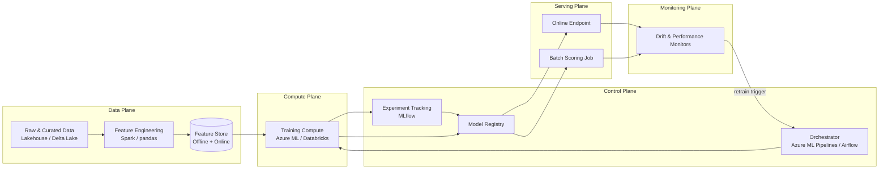
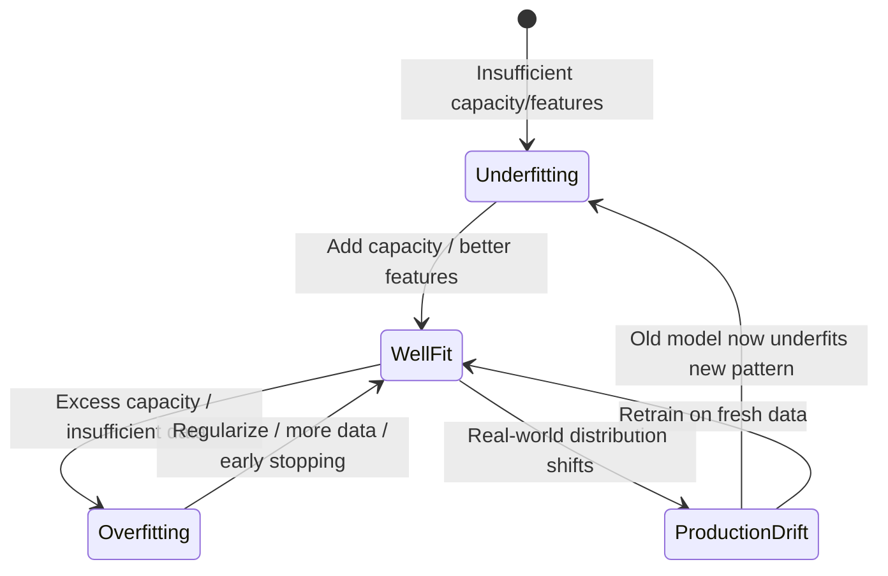

# Machine Learning Foundations

> Part of the **Enterprise Data & AI Architecture Handbook** · Phase-11 — AI Platform Engineering & MLOps · Chapter 01.
> Estimated study time: **60 min reading + ~4h labs**.
> **Prerequisite:** read [Data Structures and Algorithms](../Phase-00/07_Data_Structures_and_Algorithms.md) first.

---

## Executive Summary

Every subsequent chapter in Phase-11 — feature stores, MLOps and MLflow, model serving, Azure Machine Learning, ML pipeline architecture, and Responsible AI — assumes a working, precise vocabulary for how machine learning models are actually trained, validated, and industrialized. This chapter builds that vocabulary from first principles and immediately ties it to enterprise architecture concerns: not "what is a neural network" in the abstract, but *why an architect who has never trained a model still needs to understand bias-variance tradeoffs to review a capacity plan, why a target-leakage bug is a data-engineering failure as much as a data-science one, and why "the ML lifecycle" is really a distributed systems and data-platform problem wearing a statistics costume.*

This chapter covers the **three canonical learning paradigms** (supervised, unsupervised, reinforcement learning) as a decision framework for matching a business problem to an approach; **training, validation, and evaluation methodology** as the discipline that determines whether a reported accuracy number means anything at all; the **bias-variance tradeoff and generalization** as the single most important mental model for diagnosing why a model that scored well offline fails in production; **feature engineering fundamentals** as the layer where most of an ML system's actual engineering effort and production-incident risk lives, directly setting up Feature Stores with Feast (Phase-11 Chapter 02); and the **end-to-end ML lifecycle** as the reference architecture — data → features → training → evaluation → registry → serving → monitoring → retraining — that every later Phase-11 chapter deepens one stage at a time.

The bias remains **Azure-primary (~60%)** — Azure Machine Learning workspaces, compute clusters and compute instances, the AzureML model registry, and Azure Databricks' ML runtime with MLflow autologging — **~30% enterprise open source** (scikit-learn, XGBoost/LightGBM, PyTorch, MLflow tracking as introduced here and deepened in Phase-11 Chapter 03, and pandas/Spark for feature engineering) and **~10% AWS/GCP comparison-only** (Amazon SageMaker, Google Vertex AI Training).

**Bottom line:** an architect who cannot read a learning curve, cannot explain why cross-validation exists, and cannot name at least three ways feature engineering silently leaks the label into the training set is not equipped to review an ML system design — regardless of how fluent they are in Kubernetes or Delta Lake. This chapter is the shared foundation the rest of Phase-11 is built on, and the return-on-investment case for treating ML platform engineering as a first-class enterprise architecture discipline rather than a data-science side project.

---

## Learning Objectives

By the end of this chapter you will be able to:

1. **Classify a business problem** into supervised, unsupervised, or reinforcement learning, and justify the classification to a non-technical stakeholder.
2. **Design a correct train/validation/test split strategy** (including time-series and grouped variants) and explain why an incorrect split silently invalidates every metric downstream.
3. **Diagnose overfitting and underfitting** using learning curves and the bias-variance decomposition, and prescribe the correct remediation for each.
4. **Select and defend evaluation metrics** (accuracy, precision/recall, F1, ROC-AUC, PR-AUC, RMSE/MAE, calibration) appropriate to a specific business cost asymmetry.
5. **Identify and prevent feature engineering failure modes**, especially target leakage and train/serve skew, before they reach production.
6. **Describe the end-to-end ML lifecycle** as an architecture (data, features, training, evaluation, registry, serving, monitoring, retraining) and map each stage to a concrete Azure and open-source implementation.
7. **Apply ML foundations on Azure Machine Learning and Azure Databricks**, with a defensible comparison to AWS SageMaker and GCP Vertex AI.
8. **Defend ML-foundations architecture decisions** in engineer, staff engineer, architect, and CTO review settings, including the trade-off between model complexity, interpretability, and operational cost.

---

## Business Motivation

- **ML initiatives fail predominantly for engineering and data reasons, not algorithm-selection reasons.** Industry surveys consistently show the majority of ML projects that fail to reach production do so because of data quality, feature-pipeline, or organizational issues — not because the wrong algorithm was chosen — making this chapter's data/feature/lifecycle content the highest-leverage material in the phase.
- **A misdiagnosed bias-variance problem is a direct cost multiplier.** Teams that respond to poor validation performance by reflexively adding model complexity (when the actual problem is high variance/overfitting) burn compute budget and calendar time without improving business outcomes; the correct diagnosis in §1.3 is a cheap, high-leverage architectural review skill.
- **Target leakage produces catastrophically overstated offline metrics that erode trust in the ML program.** A model that reports 98% offline accuracy because a leaked feature effectively encodes the label, then performs near-randomly in production, is a recurring, expensive, and entirely preventable failure mode this chapter addresses directly in §1.4.
- **The choice of evaluation metric is a business-cost decision, not a data-science preference.** Optimizing a fraud model for accuracy when fraud is 0.1% of transactions produces a model that is "99.9% accurate" by predicting "not fraud" for everything — a business-cost-blind metric choice that this chapter's §1.2 treats as an architecture review checkpoint, not a footnote.
- **A shared lifecycle vocabulary reduces cross-functional friction and rework.** When data engineers, ML engineers, and platform architects use the same reference model (§1.5) for where a "feature," a "model version," or a "training run" lives, hand-offs across Feature Stores, MLOps and MLflow, and Model Serving (Phase-11 Chapters 02-04) stop re-litigating terminology and start on shared ground.
- **Enterprises that industrialize the ML lifecycle materially shorten time-to-production for new models.** Organizations with a mature, repeatable lifecycle (registry, automated retraining, monitoring) deploy new models in a fraction of the calendar time of organizations still treating each model as a bespoke notebook exercise — a direct argument for treating ML platform engineering as infrastructure investment, not a per-project cost.

---

## History and Evolution

- **1950s-1960s — the perceptron and early statistical learning theory** establish the foundational supervised-learning idea (adjust weights to reduce error on labeled examples), though limited compute and the perceptron's known linear-separability limits stall progress for over a decade.
- **1980s-1990s — decision trees, support vector machines, and the formalization of bias-variance and generalization theory** (VC dimension, cross-validation) give the field the statistical rigor this chapter's §1.2-1.3 still rely on today.
- **1990s-2000s — ensemble methods (bagging, boosting, random forests)** demonstrate that combining many weak, high-variance models systematically reduces variance without proportionally increasing bias, a direct, practical application of the bias-variance framework.
- **2001 — Random Forests (Breiman)** and **2001-2016 — gradient boosting's rise (GBM, then XGBoost 2014, LightGBM 2016)** establish tree ensembles as the dominant, production-proven approach for structured/tabular enterprise data — still the default first choice for most enterprise tabular ML problems today, ahead of deep learning.
- **2012 — AlexNet's ImageNet win** triggers the deep-learning resurgence, shifting unstructured-data problems (vision, language, speech) decisively toward neural architectures, while leaving structured/tabular problems (the majority of enterprise data) largely served by tree ensembles.
- **2015-2018 — reinforcement learning's mainstream breakthrough** (DeepMind's Atari and AlphaGo results) demonstrates RL's power for sequential-decision problems, though production RL adoption in enterprise settings remains narrow and specialized (recommendation ranking, resource allocation, some robotics) compared to supervised learning's ubiquity.
- **2015 — MLflow's precursors and the "reproducibility crisis" in ML** (papers and models that cannot be reproduced because of undocumented data, hyperparameters, or environment) motivate the experiment-tracking discipline this chapter's §1.5 introduces and MLOps and MLflow (Chapter 03) formalizes.
- **2018-present — "MLOps" emerges as a named discipline**, explicitly borrowing DevOps/DataOps principles (see [DataOps Foundations](../Phase-09/01_DataOps_Foundations.md)) to industrialize the lifecycle this chapter's §1.5 describes, moving ML from artisanal notebooks toward repeatable, governed pipelines.
- **2020-present — foundation models and transfer learning** shift a meaningful share of enterprise ML work from training-from-scratch toward fine-tuning and prompting pre-trained models, though the underlying training/validation/evaluation discipline this chapter covers remains equally applicable to fine-tuning workflows.

---

## Why This Technology Exists

Machine learning exists because a large and growing class of business problems — fraud scoring, demand forecasting, churn prediction, recommendation ranking, defect detection — cannot be solved by hand-written rules at the required scale, accuracy, or adaptation speed, but *can* be solved by algorithms that learn the mapping from historical, labeled (or unlabeled, or reward-signaled) data. The specific disciplines this chapter teaches — rigorous train/validation/test methodology, bias-variance diagnosis, careful feature engineering, and a defined lifecycle — exist because machine learning's central risk is not "the model doesn't work," it is "the model appears to work, by every offline measurement available, and then fails in production" — silently, expensively, and often undetected until real business harm has occurred. Every technique in this chapter is a specific, historically-motivated defense against a specific way that silent failure has previously occurred at scale.

---

## Problems It Solves

- **Pattern discovery beyond hand-written rule capacity** — supervised and unsupervised learning find predictive structure in high-dimensional data (thousands of features, millions of records) at a scale and subtlety manual rule-authoring cannot match.
- **Adaptive decision-making under changing conditions** — models retrained on fresh data adapt to shifting patterns (seasonal demand, evolving fraud tactics) that static rule systems require constant manual maintenance to track.
- **Sequential decision optimization** — reinforcement learning solves problems where the optimal action depends on long-run cumulative reward rather than a single-step prediction (dynamic pricing, resource allocation, recommendation sequencing).
- **Quantified, comparable model quality** — the training/validation/evaluation discipline in §1.2 gives organizations an honest, comparable answer to "is this model actually better than the last one," rather than relying on anecdote or cherry-picked examples.
- **Root-cause diagnosis of poor model performance** — the bias-variance framework in §1.3 turns "the model isn't good enough" from a vague complaint into a specific, actionable diagnosis (more data vs. more capacity vs. better features vs. regularization).

---

## Problems It Cannot Solve

- **It cannot manufacture signal that does not exist in the available data.** No amount of algorithmic sophistication recovers a predictive relationship that simply is not present in the features you have; the correct response is better data/feature engineering, not a more complex model.
- **It cannot substitute for correct causal reasoning.** A supervised model finds correlational patterns; using it to infer causal effects (e.g., "will lowering price cause more purchases") without a causal-inference framework or a controlled experiment produces confidently wrong conclusions.
- **It cannot guarantee fairness or the absence of harmful bias by default.** A model trained on historically biased data reproduces and can amplify that bias unless deliberately audited and mitigated — the full treatment of this is deferred to Responsible AI (Phase-11 Chapter 07); this chapter only establishes that the risk originates in the training data and feature choices covered here.
- **It cannot make an underspecified business problem well-posed.** If stakeholders cannot agree on what "churn" means or what the acceptable false-positive cost is, no evaluation metric in §1.2 resolves that ambiguity — it must be resolved before modeling begins.
- **It cannot eliminate the need for ongoing operational investment.** A trained model is not a one-time deliverable; without the lifecycle, monitoring, and retraining discipline in §1.5 (deepened across the rest of Phase-11), model quality silently degrades as the real world drifts away from the training distribution.

---

## Core Concepts

### 1.1 Supervised, Unsupervised, and Reinforcement Learning

- **Supervised learning** learns a mapping from input features to a known, labeled target — **classification** (discrete labels: fraud/not-fraud, churn/retain) or **regression** (continuous targets: demand quantity, price). It is the dominant paradigm in enterprise settings because labeled historical outcomes (did the transaction turn out to be fraud, did the customer actually churn) are frequently already recorded as a byproduct of normal business operations.
- **Unsupervised learning** finds structure in data without labeled outcomes — **clustering** (customer segmentation, anomaly grouping), **dimensionality reduction** (PCA, embeddings for downstream models), and **anomaly detection** (unsupervised outlier scoring where labeled fraud examples are scarce or delayed). It is the correct choice when labels do not exist or are too expensive/slow to obtain at the volume needed.
- **Reinforcement learning (RL)** learns a policy that maximizes cumulative reward through interaction with an environment (or a simulated/logged proxy of one) — appropriate for sequential decision problems (recommendation ranking, dynamic pricing, resource scheduling) where the "label" is a delayed, cumulative signal rather than an immediate, per-example ground truth. RL's production footprint in enterprise settings is narrower than supervised learning's, largely because it requires either a safe simulation environment or careful off-policy/offline RL techniques to avoid costly live exploration.
- **Semi-supervised and self-supervised learning** sit between these paradigms — using a small labeled set alongside a much larger unlabeled set (semi-supervised), or constructing labels automatically from the data's own structure (self-supervised, the technique underlying most modern foundation-model pretraining) — increasingly relevant as enterprises have abundant unlabeled operational data but scarce, expensive labels.
- **Choosing the right paradigm is itself an architecture decision**: it depends on label availability, the cost of being wrong, whether the problem is genuinely sequential, and whether a simulation environment exists — a decision that belongs in the same design-review conversation as storage and compute choices, not left solely to a data scientist working in isolation.

### 1.2 Training, Validation, and Evaluation Metrics

- **The train/validation/test split exists to produce an honest estimate of generalization.** Training data teaches the model; validation data tunes hyperparameters and selects between candidate models; test data — touched exactly once, at the end — produces the final, unbiased performance estimate. Using test data more than once, or letting validation performance influence choices made *after* the final test evaluation, silently reintroduces the same overfitting risk the split was designed to prevent.
- **k-fold cross-validation** trains and validates k times on different data partitions, averaging results, giving a more robust performance estimate than a single train/validation split, at the cost of k times the training compute — a direct, explicit trade-off between statistical robustness and compute budget the architect should be able to quantify.
- **Time-series and grouped splits prevent a specific, common leakage bug**: a random shuffle-based split on time-ordered data lets the model "see the future" (train on data chronologically after the validation set), producing an inflated validation score that will not hold in production; the correct split respects chronological order (train on the past, validate on the future) or groups by entity (e.g., all of one customer's records in the same fold) when records are not independent.
- **Classification metrics carry different business meanings**: **accuracy** is misleading under class imbalance (see the fraud example in Business Motivation); **precision** answers "of what we flagged, how much was actually positive"; **recall** answers "of all actual positives, how much did we catch"; **F1** balances the two; **ROC-AUC** measures ranking quality across all thresholds but can be optimistic under severe imbalance, where **PR-AUC** (precision-recall AUC) is the more honest metric.
- **Regression metrics carry different sensitivity to outliers**: **RMSE** penalizes large errors quadratically (appropriate when large misses are disproportionately costly); **MAE** penalizes linearly (appropriate when all errors matter proportionally); **calibration** (do predicted probabilities match observed frequencies) matters specifically when downstream decisions consume the predicted probability directly (e.g., risk-based pricing), not just the ranking.
- **The metric must be chosen to reflect the actual business cost asymmetry** — a fraud model's false negative (missed fraud) and false positive (blocked legitimate transaction) costs are rarely equal, and the evaluation metric (and the classification threshold chosen from it) should be selected to reflect that asymmetry explicitly, not defaulted to a generic 0.5 threshold or accuracy-maximizing choice.

### 1.3 Bias-Variance Tradeoff and Generalization

- **The bias-variance decomposition explains prediction error as three additive components**: *bias* (error from overly simplistic assumptions — the model cannot capture the true pattern even with unlimited data), *variance* (error from excessive sensitivity to the specific training sample — the model captures noise as if it were signal), and *irreducible error* (inherent randomness no model can eliminate).
- **High bias (underfitting)** shows as poor performance on *both* training and validation data — the model is too simple to capture the pattern; the fix is more model capacity, better/more features, or reduced regularization, **not** more training data (more data does not help a model that is fundamentally too simple to represent the pattern).
- **High variance (overfitting)** shows as strong training performance but materially worse validation performance — the model has memorized training-set noise; the fix is more training data, stronger regularization, reduced model capacity, or ensembling, **not** a more complex model (which typically worsens variance further).
- **Learning curves are the primary diagnostic tool**: plotting training and validation error against training-set size reveals which regime a model is in — converging curves that plateau at a high error together indicate high bias; a persistent, large gap between low training error and higher validation error indicates high variance.
- **Generalization is the entire point of the exercise** — a model's value is its performance on data it has not seen, not the data it was trained on; every technique in §1.2 (the train/validation/test discipline) and this section exists specifically to produce an honest estimate of, and control over, generalization performance.
- **Regularization (L1/L2, dropout, early stopping, tree-depth limits) is the primary lever for trading a small amount of bias for a larger reduction in variance** — the mechanism underlying most "the model is overfitting, add regularization" guidance, and directly relevant to the hyperparameter-tuning workflows MLOps and MLflow (Chapter 03) automates.

### 1.4 Feature Engineering Fundamentals

- **Feature engineering is where most real-world ML engineering effort and production-incident risk actually lives** — transforming raw operational data (transaction logs, clickstreams, sensor readings) into the numeric/categorical representations a model consumes, frequently accounts for the majority of an ML project's total engineering time, ahead of model selection or hyperparameter tuning.
- **Core techniques**: encoding categorical variables (one-hot, target/label encoding, embeddings for high-cardinality categories), scaling/normalizing numeric features (standardization, min-max scaling — required for distance-based and gradient-descent-based algorithms, less critical for tree ensembles), handling missing values (imputation strategies, or explicit "missingness" indicator features when absence itself is predictive), and constructing derived/aggregate features (rolling windows, ratios, time-since-last-event) that frequently carry more predictive power than raw fields.
- **Target leakage is the single most damaging and most common feature engineering failure mode**: a feature that is only available *because* the outcome already occurred (e.g., a "days until account closed" feature when predicting churn, or an aggregate computed *after* the prediction timestamp using a naive global `GROUP BY` rather than a point-in-time-correct join) inflates offline metrics dramatically while providing zero real predictive value at serving time, since that feature will not exist (or will be null/zero) when the model must actually predict *before* the outcome is known.
- **Train/serve skew is the second major failure mode**: computing a feature one way in the offline training pipeline (e.g., a Python/pandas rolling average) and a subtly different way in the online serving path (e.g., a different window boundary or null-handling rule) produces a model that performs well in offline evaluation but poorly in production, because the features it sees at serving time do not match the statistical distribution it was trained on — the exact problem Feature Stores with Feast (Phase-11 Chapter 02) is architected to solve by centralizing feature computation logic for both training and serving.
- **Point-in-time correctness is the disciplined defense against both failure modes**: every feature used to train a model for a given historical prediction must be computed using *only* data that would have actually been available at that historical prediction's timestamp — a constraint that is straightforward to state and surprisingly easy to violate with an innocent-looking join or aggregation, making it the single most important feature-engineering review question for an architect.

### 1.5 The End-to-End ML Lifecycle

- **The reference lifecycle** this chapter establishes, and the rest of Phase-11 deepens stage by stage: **(1) data acquisition and validation** (governed by [Data Quality with Great Expectations](../Phase-08/03_Data_Quality_with_Great_Expectations.md)) → **(2) feature engineering and storage** (Phase-11 Chapter 02) → **(3) training and experimentation** (tracked via MLflow, deepened in Phase-11 Chapter 03) → **(4) evaluation and validation gates** (the metrics of §1.2, enforced before promotion) → **(5) model registry and versioning** → **(6) deployment and serving** (Phase-11 Chapter 04) → **(7) monitoring, drift detection, and retraining triggers**, which feeds back into stage (1).
- **The lifecycle is a closed loop, not a linear pipeline** — production monitoring (stage 7) is what detects data drift, concept drift, or degraded performance and triggers a new iteration of the loop; a lifecycle architecture without a monitoring-to-retraining feedback path is incomplete regardless of how sophisticated stages 1-6 are.
- **Experiment tracking (MLflow's core capability, introduced here and formalized in Phase-11 Chapter 03) is what makes stages 3-5 reproducible and auditable** — recording the exact code version, data version, hyperparameters, and resulting metrics for every training run, so "which model is in production and why was it chosen" always has a traceable, non-anecdotal answer.
- **The model registry is the lifecycle's governance checkpoint** — a versioned, stage-tagged (e.g., staging/production/archived) catalog of trained model artifacts with their associated metadata and evaluation results, functioning for models the way a data catalog ([Data Catalog and Lineage](../Phase-08/02_Data_Catalog_and_Lineage.md)) functions for datasets.
- **Every lifecycle stage has an associated failure mode this chapter has already introduced**: stage 1 fails via data quality issues, stage 2 fails via target leakage or train/serve skew (§1.4), stages 3-4 fail via undiagnosed bias-variance problems (§1.3) or an incorrectly chosen evaluation metric (§1.2) — meaning this section is not a new topic, but the assembly of §1.1-1.4 into one coherent, end-to-end architecture.

---

## Internal Working

**How gradient-based training actually proceeds** (the mechanism underlying most supervised learning, from linear/logistic regression through gradient-boosted trees and neural networks):

1. **Forward pass** — the current model parameters produce predictions for a batch of training examples.
2. **Loss computation** — a loss function (cross-entropy for classification, squared error for regression) quantifies how wrong those predictions are relative to the known labels.
3. **Gradient computation** — the derivative of the loss with respect to each model parameter is computed (via backpropagation for neural networks, or via the specific split/leaf-weight update rule for gradient-boosted trees), indicating the direction that would reduce loss.
4. **Parameter update** — parameters are adjusted a small step (the learning rate) in the loss-reducing direction; too large a learning rate overshoots and fails to converge, too small wastes compute converging slowly — a hyperparameter MLOps and MLflow (Chapter 03)'s automated tuning workflows search systematically rather than by manual trial and error.
5. **Iteration over epochs** — steps 1-4 repeat over the full training dataset (or, for tree ensembles, over successive trees added to the ensemble) until validation performance stops improving, at which point **early stopping** halts training — itself a regularization technique from §1.3, directly preventing the variance increase that continuing to train on a fixed dataset would otherwise cause.
6. **Checkpointing** — for long-running training jobs, periodic checkpoints of model state are persisted (to Azure ML's default datastore or ADLS Gen2) so a preemptible/spot-compute interruption (§1.16 Cost Optimization) does not lose all training progress, resuming from the last checkpoint instead of restarting from scratch.

This mechanism is identical in spirit whether the underlying algorithm is logistic regression, XGBoost, or a deep neural network — only the specifics of the gradient computation and the parameter-update rule differ, which is why the training/validation/evaluation and bias-variance frameworks in §1.2-1.3 apply uniformly across algorithm families.

---

## Architecture

A production ML system's architecture is the physical realization of the §1.5 lifecycle, spanning distinct data-plane, control-plane, and serving-plane concerns:

- **Data plane**: raw and curated data in the lakehouse (governed by [Lakehouse Architecture](../Phase-05/02_Lakehouse_Architecture.md) and [Medallion Architecture](../Phase-05/03_Medallion_Architecture.md)), feature computation jobs, and a feature store serving both batch training reads and low-latency online reads (Phase-11 Chapter 02).
- **Control plane**: the experiment-tracking server (MLflow tracking server, hosted as an Azure ML workspace capability or self-managed), the model registry, and the orchestrator (Azure ML pipelines, or Airflow — see [Orchestration with Airflow](../Phase-09/07_Orchestration_with_Airflow.md)) that sequences data validation → feature computation → training → evaluation → registration.
- **Compute plane**: ephemeral training compute (Azure ML compute clusters with auto-scale-to-zero, or Databricks job clusters), sized and selected (CPU vs. GPU, single-node vs. distributed) based on algorithm family and data volume.
- **Serving plane**: the deployed model endpoint (Azure ML managed online endpoint, AKS-hosted, or batch scoring job), deepened fully in Model Serving and Ray (Phase-11 Chapter 04).
- **Monitoring plane**: data-drift and model-performance monitors that close the loop back to the data plane, triggering retraining pipelines when degradation is detected.

---

## Components

- **Data validation component** — schema and statistical-distribution checks (Great Expectations, see [Data Quality with Great Expectations](../Phase-08/03_Data_Quality_with_Great_Expectations.md)) gating entry into the training pipeline.
- **Feature computation and feature store** — batch and streaming feature pipelines plus an online/offline store, fully covered in Phase-11 Chapter 02.
- **Experiment tracking server** — MLflow (or Azure ML's built-in tracking), recording parameters, metrics, artifacts, and code/data versions per run.
- **Training compute** — Azure ML compute clusters, Databricks clusters with the ML runtime, or Ray clusters (Phase-11 Chapter 04) for distributed training.
- **Model registry** — a versioned catalog of trained models with lineage back to the training run, dataset version, and code commit that produced them.
- **Evaluation/validation gate** — an automated check (in CI or the orchestrator) comparing a candidate model's metrics against the current production model's, blocking promotion if the candidate does not clear a defined threshold.
- **Serving endpoint** — real-time (low-latency online endpoint) or batch (scheduled scoring job) inference infrastructure, deepened in Phase-11 Chapter 04.
- **Monitoring and alerting component** — data-drift detectors, model-performance dashboards, and alerting integrated with the platform's broader observability stack ([DataOps Foundations](../Phase-09/01_DataOps_Foundations.md)-style tooling: Azure Monitor, Prometheus/Grafana).

---

## Metadata

- **Experiment metadata**: run ID, parent experiment, hyperparameters, code commit hash, environment/container image digest, start/end time, and compute target — the full provenance MLflow's tracking API captures automatically.
- **Dataset metadata**: dataset version/snapshot identifier (Delta Lake version number or a data-catalog-registered dataset version — see [Data Catalog and Lineage](../Phase-08/02_Data_Catalog_and_Lineage.md)), row count, schema hash, and the point-in-time cutoff used for point-in-time-correct feature joins (§1.4).
- **Model metadata**: model version, training run lineage, evaluation metrics at each candidate stage, approval/promotion history, and the specific feature list/schema the model expects at inference time — critical for detecting train/serve skew (§1.4) automatically rather than by incident.
- **Feature metadata**: feature name, computation logic reference, freshness/staleness SLA, and owning team — deepened as a first-class capability in Phase-11 Chapter 02's feature-store architecture.

---

## Storage

- **Raw and curated training data**: Delta Lake tables on ADLS Gen2 (see [Delta Lake](../Phase-04/04_Delta_Lake.md)), providing the versioned, time-travel-queryable snapshots that point-in-time-correct feature joins (§1.4) depend on.
- **Feature data**: an offline store (Delta Lake/Parquet on ADLS Gen2, optimized for large batch reads during training) and an online store (a low-latency key-value store — Azure Cache for Redis or Cosmos DB — for point-lookup reads during serving), the dual-store pattern Phase-11 Chapter 02 covers in depth.
- **Model artifacts**: serialized model files (pickle, ONNX, or framework-native formats) stored in the Azure ML workspace's default blob datastore or MLflow's artifact store, versioned alongside their registry entry.
- **Experiment metadata store**: the MLflow tracking server's backend store (typically a managed PostgreSQL/Azure SQL database) holding run metadata, separate from the artifact blob store holding the actual model files.

---

## Compute

- **CPU compute** remains the correct default for the majority of enterprise tabular ML (tree ensembles, linear models) — Azure ML CPU compute clusters or Databricks CPU clusters, scaled by data volume rather than requiring specialized hardware.
- **GPU compute** is required for deep learning workloads (computer vision, NLP, large embedding models) — Azure ML GPU compute (NC/ND-series VMs) or Databricks GPU clusters, a materially more expensive resource class that should be provisioned deliberately, not by default (§1.16 Cost Optimization).
- **Distributed training** (data-parallel or model-parallel, via Horovod, PyTorch Distributed, or Ray Train — Phase-11 Chapter 04) becomes necessary when a single node's memory or throughput cannot handle the dataset or model size, at the cost of materially more complex failure-handling and coordination overhead.
- **Auto-scale-to-zero compute clusters** are the standard cost-control pattern for training workloads: Azure ML compute clusters and Databricks job clusters both support scaling to zero nodes when idle, ensuring training compute cost is incurred only during actual training runs, not continuously.

---

## Networking

- **Private endpoints for the Azure ML workspace and its default storage account** keep training data and model artifacts off the public internet, consistent with the zero-trust baseline established in [Network Security and Zero Trust](../Phase-10/04_Network_Security_and_Zero_Trust.md).
- **VNet-injected compute clusters** ensure training compute nodes communicate with data sources (ADLS Gen2, feature store) over private network paths rather than public endpoints.
- **Data egress minimization** matters materially for large training datasets — co-locating compute and storage in the same Azure region avoids both latency and cross-region data-transfer cost during training.
- **Online serving endpoints require different networking posture than training compute** — typically requiring a private endpoint plus, depending on the consuming application, API Management fronting for authentication, rate limiting, and observability, fully covered in Phase-11 Chapter 04.

---

## Security

- **Data access control for training data** follows the same RBAC/ABAC, Unity Catalog grant, or ADLS Gen2 ACL model established in [Identity and Access Management with Entra](../Phase-10/02_Identity_and_Access_Management_with_Entra.md) — a data scientist's ability to train a model on sensitive data must be governed identically to any other consumer of that data.
- **PII and sensitive data in training sets** must be classified and, where required, tokenized or masked ([Data Security and Encryption](../Phase-10/03_Data_Security_and_Encryption.md)) *before* feature engineering, not treated as an afterthought once a model is already trained on raw sensitive fields.
- **Model artifacts themselves can leak sensitive information** — a model trained on insufficiently de-identified data can, in some circumstances, memorize and later expose training examples, a risk this chapter flags and [Data Privacy and PII Protection](../Phase-10/07_Data_Privacy_and_PII_Protection.md) treats in depth.
- **Managed identities and workload identity federation** (not embedded secrets) should authenticate training jobs and serving endpoints to data sources and the model registry, consistent with the Phase-10 Chapter 02 default.
- **Experiment tracking and model registry access must itself be access-controlled** — an unrestricted MLflow tracking server can leak proprietary model architectures, hyperparameters, or evaluation results to anyone with network access, a frequently under-scoped risk.

---

## Performance

- **Training throughput** is bound by data-loading I/O, compute (CPU/GPU) utilization, and — for distributed training — inter-node communication overhead; profiling should identify which of these is the actual bottleneck before assuming "more GPUs" is the fix.
- **Data loading is a common, underestimated bottleneck**: reading training data from remote storage without adequate caching, prefetching, or an efficient columnar format (Parquet, as covered in [Columnar Storage Internals](../Phase-04/02_Columnar_Storage_Internals.md)) can leave expensive GPU compute idle waiting for data.
- **Batch size directly trades off training throughput against gradient-estimate noise and memory footprint** — larger batches better utilize GPU parallelism but require more memory and can (without learning-rate adjustment) degrade final model quality.
- **Inference latency** (the performance dimension that matters most for online serving) is a distinct concern from training throughput and is the primary focus of Model Serving and Ray (Phase-11 Chapter 04).

---

## Scalability

- **Horizontal scaling of training** via distributed data-parallel training (each worker trains on a data shard, gradients are synchronized) scales training throughput roughly linearly up to the point where communication overhead dominates — the classic distributed-systems trade-off also seen in [Distributed Transactions](../Phase-02/05_Distributed_Transactions.md)-style coordination costs.
- **Hyperparameter tuning at scale** (grid search, random search, or Bayesian optimization across dozens-to-hundreds of candidate configurations) is itself an embarrassingly parallel workload well suited to elastic, auto-scaling compute clusters, run and tracked via MLflow (Phase-11 Chapter 03).
- **Feature computation must scale independently of training** — a feature pipeline computing features over billions of rows (via Spark, see [Apache Spark Internals](../Phase-05/04_Apache_Spark_Internals.md)) has entirely different scaling characteristics than the (often much smaller, sampled) training dataset it feeds.
- **Serving-side scalability** (horizontal replica scaling of inference endpoints, or batch-scoring parallelism) is a distinct scaling problem from training, fully addressed in Phase-11 Chapter 04.

---

## Fault Tolerance

- **Checkpointing** (Internal Working, step 6) is the primary defense against losing long-running training progress to a node failure or preemptible/spot-instance reclaim — a training job without checkpointing on spot compute is a fault-tolerance gap, not a cost-optimization win.
- **Idempotent, retryable pipeline stages**: each stage of the §1.5 lifecycle (data validation, feature computation, training, evaluation, registration) should be safely re-runnable without side effects on partial failure, the same idempotency discipline covered in [DataOps Foundations](../Phase-09/01_DataOps_Foundations.md).
- **Graceful degradation for serving failures** (falling back to a previous model version, a simpler rule-based fallback, or a cached prediction) prevents a model-serving outage from becoming a full business-process outage — deepened in Phase-11 Chapter 04.
- **Data validation gates as an upstream fault-tolerance mechanism** — catching a corrupted or schema-drifted upstream dataset *before* it silently trains a degraded model, rather than discovering the failure only after a bad model is already promoted.

---

## Cost Optimization (FinOps)

- **Spot/low-priority compute for training** — Azure ML supports low-priority compute nodes at a substantial discount versus dedicated compute, appropriate for fault-tolerant (checkpointed) training jobs that can tolerate preemption.
- **Auto-scale-to-zero compute clusters** ensure training compute cost is incurred only during active training, not idle between runs.
- **Right-sizing GPU allocation** — provisioning a multi-GPU node for a workload that does not actually parallelize across GPUs (or that is data-loading-bound, not compute-bound) wastes the materially higher GPU cost premium without a corresponding throughput gain.
- **Experiment sprawl control** — without governance, exploratory notebook-based training can silently accumulate large, forgotten compute costs (idle compute instances left running); tagging, budget alerts, and scheduled auto-shutdown of idle compute instances are standard FinOps controls.
- **Feature store reuse** — computing a feature once and serving it to multiple models (Phase-11 Chapter 02) avoids the redundant compute cost of each model team recomputing the same aggregation independently.

**Worked FinOps example**: A team trains a gradient-boosted model daily on a 50M-row dataset. On a dedicated Standard_DS4_v2 compute cluster (4 nodes, running continuously to avoid cold-start), the monthly compute cost is roughly 4 nodes × ~730 hours × ~$0.29/hour ≈ **$847/month**. Switching to an auto-scale-to-zero cluster that only spins up for the ~45-minute daily training run reduces active compute to roughly 4 nodes × 0.75 hours × 30 days × $0.29/hour ≈ **$26/month** in compute, plus a small number of cold-start minutes — a greater than 95% reduction, with the only trade-off being a few minutes of cluster startup latency once per day, which is immaterial for a daily batch training job. The break-even point for keeping a cluster "always warm" instead of auto-scaling only makes sense if training runs occur more often than roughly every 30-45 minutes continuously — a threshold this daily-batch use case comes nowhere near.

---

## Monitoring

- **Training-job monitoring**: run status, duration, resource utilization (GPU/CPU utilization percentage — a low utilization number indicates a data-loading or I/O bottleneck per §1.13 Performance), and failure alerts, surfaced via Azure ML's job monitoring or MLflow's run-tracking UI.
- **Model-quality monitoring in production**: tracking live prediction distributions, and — where delayed ground truth eventually arrives (e.g., actual fraud confirmed weeks later) — live accuracy/precision/recall against that ground truth, compared against the offline evaluation metrics from §1.2.
- **Data and concept drift monitoring**: statistical comparison (population stability index, KL divergence, or simpler summary-statistic drift checks) between the training data distribution and the live serving-data distribution, the primary signal that triggers the retraining loop in §1.5.
- **Feature freshness monitoring**: alerting when a feature pipeline's output is stale beyond its defined SLA, since stale features silently degrade model quality without an explicit training or serving failure — a monitoring concern Phase-11 Chapter 02 covers as a feature-store-native capability.

---

## Observability

- **End-to-end lineage from prediction back to training run**: given a specific production prediction, an observable ML platform can trace back to the exact model version, the training run that produced it, the dataset version and feature computation logic used, and the code commit — the ML-specific extension of the lineage discipline in [Data Catalog and Lineage](../Phase-08/02_Data_Catalog_and_Lineage.md).
- **Structured logging of prediction requests and responses** (with correlation IDs tying a prediction back to the request that triggered it) enables root-cause analysis when a specific downstream business decision is questioned.
- **Dashboards unifying infrastructure and ML-specific signals**: GPU/CPU utilization and job duration (infrastructure) alongside drift scores and live accuracy (ML-specific) in a single Grafana/Azure Monitor workbook, so an on-call engineer diagnosing a degraded model is not forced to correlate two entirely separate tooling systems manually.

### Operational Response Playbook

| Signal | Detection Query/Check | Remediation |
|---|---|---|
| **Training job GPU utilization consistently below ~30%** while job duration is longer than the historical baseline | Azure ML job metrics dashboard or `nvidia-smi`-based utilization logging compared against the job's rolling 30-day median duration | Profile the data-loading path first (per §1.13 Performance) before adding GPUs; add prefetching/caching or switch to a more efficient columnar read path; only scale GPU count after confirming the bottleneck is compute-bound, not I/O-bound |
| **Live model precision/recall (once delayed ground truth arrives) diverges from the offline evaluation metric by more than an agreed threshold** (e.g., >5 percentage points) | Scheduled batch job joining production predictions to eventually-arriving ground truth, compared against the registered model's offline evaluation metrics in the registry | Open a drift investigation: check the data/concept drift monitors (§1.16 Monitoring) first; if drift is confirmed, trigger the retraining pipeline (§1.5); if no drift is found, treat it as a possible train/serve skew bug (§1.4) and audit the online vs. offline feature computation paths for divergence |

---

## Governance

- **Model risk governance**: every promoted model should have a documented owner, an approved evaluation report (metrics per §1.2, evaluated against a defined threshold), and an audit trail of who approved production promotion — the model-registry-level analog of the data-contract governance in [Data Contracts](../Phase-08/07_Data_Contracts.md).
- **Data lineage for regulatory and audit purposes**: being able to answer "what data trained the model that made this specific decision" is both good engineering practice and, in regulated industries, frequently a legal requirement — directly connecting to [Compliance and Regulatory Frameworks](../Phase-10/06_Compliance_and_Regulatory_Frameworks.md).
- **Fairness and bias review as a governance gate**, not an optional add-on — the full mechanics are deferred to Responsible AI (Phase-11 Chapter 07), but this chapter establishes that the review must happen *before* production promotion, using the same registry-based promotion gate as the evaluation-metric check in §1.5.
- **Change management for retraining**: an automatically retrained model that silently replaces the production model without a human-reviewable diff of its evaluation metrics against the prior version removes an essential governance checkpoint — automated retraining should still pass through the same promotion gate as a manually trained candidate.

---

## Trade-offs

- **Model complexity vs. interpretability**: tree ensembles and neural networks typically outperform linear models on raw predictive accuracy for complex patterns, but sacrifice the direct coefficient-based interpretability that regulated use cases (credit decisioning, for example) frequently require — a trade-off resolvable with post-hoc explainability tooling (SHAP, LIME) covered further in Phase-11 Chapter 07, but one that should be named explicitly at model-selection time, not discovered during a compliance review.
- **Batch vs. real-time feature computation**: batch-computed features are simpler and cheaper but introduce staleness; real-time-computed features are fresher but materially more complex and expensive to build and operate — the central trade-off Phase-11 Chapter 02's feature-store architecture is built to manage explicitly.
- **More data vs. better features vs. more model capacity**: given a fixed budget of engineering time, the bias-variance framework (§1.3) gives a principled way to decide which of these three levers actually addresses the observed error, rather than defaulting to "try a bigger model" as a first instinct.
- **Managed platform (Azure ML) vs. self-managed open-source stack**: Azure ML's managed compute, registry, and endpoint infrastructure trades some flexibility and potential lock-in for materially reduced operational burden versus self-hosting MLflow, Ray, and Kubernetes-based serving — the specific comparison Phase-11 Chapters 03-05 return to repeatedly.

---

## Decision Matrix

| Scenario | Recommended Approach | Rationale |
|---|---|---|
| Structured/tabular enterprise data, labeled outcomes available | Supervised learning with gradient-boosted trees (XGBoost/LightGBM) as the first baseline | Tree ensembles remain the empirically dominant choice for tabular data; deep learning rarely outperforms them here and costs materially more to train and operate |
| Unstructured data (images, text, audio) | Supervised or self-supervised deep learning, frequently fine-tuning a pre-trained foundation model rather than training from scratch | Pre-trained models capture transferable representations that a from-scratch model on limited enterprise data cannot match |
| No labeled outcomes, need to find structure/segments | Unsupervised learning (clustering, dimensionality reduction) | Directly matches the absence of a labeled target; forcing a supervised framing without labels is not viable |
| Sequential decision problem with a safe simulation environment | Reinforcement learning | RL's cumulative-reward framing directly matches the problem; supervised learning's single-step framing does not capture long-run optimality |
| Severe class imbalance (e.g., fraud, rare defects) | Supervised learning evaluated on PR-AUC/precision-recall/F1, not accuracy | Accuracy is structurally misleading under imbalance (§1.2); PR-AUC reflects the actual minority-class detection quality that matters |
| Regulated, high-stakes decisioning requiring explainability | Simpler, inherently interpretable models (regularized linear/logistic regression, shallow trees) or a complex model paired with rigorous post-hoc explainability | Interpretability requirements can outweigh a marginal accuracy gain from a more complex, opaque model |

---

## Design Patterns

- **Baseline-first modeling**: always establish a simple baseline (a naive rule, or a basic linear/logistic model) before investing in complex approaches, so any additional model complexity is justified by a measured, not assumed, improvement.
- **Point-in-time-correct feature joins** (§1.4): a standing engineering pattern — every feature-generation query must filter to data available as-of the historical prediction timestamp, enforced structurally (via a feature store's point-in-time join capability, Phase-11 Chapter 02) rather than relying on each data scientist to remember it manually.
- **Champion/challenger evaluation**: a new candidate model ("challenger") is evaluated against the current production model ("champion") on the same held-out data before promotion, formalizing the registry-based promotion gate from §1.5.
- **Shadow deployment**: a new model runs in parallel with the production model on live traffic, with its predictions logged but not acted upon, validating real-world behavior before it is promoted to actually make decisions — deepened in Phase-11 Chapter 04.

---

## Anti-patterns

- **Optimizing solely for offline accuracy without regard to the business cost asymmetry** — building a model that maximizes a generic metric while ignoring that a false negative costs the business ten times what a false positive costs.
- **Random train/test splits on time-ordered or grouped data** — silently invalidating every subsequent metric via the leakage mechanism §1.2 describes.
- **Treating feature engineering as a one-time notebook exercise** rather than a versioned, tested, point-in-time-correct pipeline — the direct precursor to the train/serve skew failure in §1.4.
- **"Bigger model" as the default response to poor validation performance** without first running the bias-variance diagnosis in §1.3 — frequently the wrong fix, and an expensive one in compute terms.
- **Deploying a model with no monitoring or retraining trigger**, treating training as a one-time deliverable rather than the first iteration of the closed-loop lifecycle in §1.5.

---

## Common Mistakes

- Evaluating a model only on the metric that is easiest to compute (accuracy) rather than the metric that reflects actual business cost (§1.2).
- Forgetting to freeze and version the exact feature computation logic used for a promoted model, making later train/serve skew debugging (§1.4) far harder than it needs to be.
- Confusing correlation-based feature importance with causal influence, and making a business decision (e.g., a pricing change) based on a purely correlational model.
- Not re-running the full evaluation suite after even a "minor" feature-pipeline change, silently letting a regression through the promotion gate.
- Assuming a model's offline performance will remain constant indefinitely without any drift monitoring (§1.16 Monitoring) in place.

---

## Best Practices

- Always start with a simple, explainable baseline model and a clearly business-justified evaluation metric before iterating toward complexity.
- Enforce point-in-time-correct feature computation structurally (via a feature store or an equivalent enforced pipeline pattern), not via developer discipline alone.
- Track every training run's data version, code version, and hyperparameters via MLflow (or equivalent) from day one, not retrofitted after the first "which model is this" incident.
- Gate every model promotion through an automated champion/challenger evaluation against defined thresholds, with a documented human sign-off for regulated or high-stakes use cases.
- Build drift monitoring and a retraining trigger *before* a model reaches production, not after the first silent degradation incident.

---

## Enterprise Recommendations

- Establish a shared feature store (Phase-11 Chapter 02) and MLflow tracking server (Phase-11 Chapter 03) as platform-level, centrally-operated capabilities before individual project teams build bespoke, duplicated equivalents.
- Mandate a standard evaluation-and-promotion gate (champion/challenger against agreed metric thresholds) across all production ML models, regardless of which team built them.
- Require every production model to have a named accountable owner, a documented evaluation report, and a monitored drift/retraining trigger as a condition of production deployment — a governance requirement, not a suggestion.
- Default to Azure ML managed compute and endpoints for new projects to minimize operational burden, reserving self-managed Kubernetes/Ray-based serving (Phase-11 Chapter 04) for workloads with specific requirements the managed platform cannot meet.

---

## Azure Implementation

- **Azure Machine Learning workspace** as the central control plane: managing compute clusters/instances, the model registry, MLflow-compatible experiment tracking (Azure ML's tracking is MLflow-API-compatible), and managed online/batch endpoints.
- **Azure ML compute clusters** (CPU and GPU, auto-scale-to-zero) for training jobs, and **compute instances** for interactive development notebooks.
- **Azure Databricks with the ML runtime** as an alternative/complementary training environment, with MLflow autologging built in, particularly well suited when training data already lives in Delta Lake tables and Spark-scale feature engineering is required.
- **Azure ML pipelines** (or Azure Databricks Workflows) to orchestrate the §1.5 lifecycle stages as a versioned, reproducible pipeline definition, integrable with [Azure Data Factory and Synapse](../Phase-05/06_Azure_Data_Factory_and_Synapse.md) for upstream data orchestration.
- **Azure ML managed online endpoints and batch endpoints** for serving, deepened alongside AKS-based alternatives in Phase-11 Chapter 04.

---

## Open Source Implementation

- **scikit-learn** for classical ML algorithms (linear/logistic regression, tree ensembles' scikit-learn-compatible wrappers, clustering) and its train/validation utilities (`train_test_split`, `cross_val_score`) implementing the §1.2 discipline directly.
- **XGBoost / LightGBM** as the production-standard gradient-boosted tree implementations for tabular data, both natively supporting the regularization and early-stopping techniques from §1.3.
- **PyTorch** for deep learning workloads, integrated with Azure ML's GPU compute and distributed-training support.
- **MLflow** (open-source, self-hostable, or consumed via Azure ML's compatible tracking API) for experiment tracking and the model registry, formalized in MLOps and MLflow (Phase-11 Chapter 03).
- **pandas and Apache Spark** for feature engineering at, respectively, single-node and distributed scale, feeding the feature store architecture in Phase-11 Chapter 02.

---

## AWS Equivalent (comparison only)

- **Amazon SageMaker** provides the direct equivalent of Azure ML's workspace, compute, training, registry, and endpoint capabilities, with SageMaker Experiments as its MLflow-comparable tracking capability (SageMaker also supports MLflow-compatible tracking natively).
- **Advantages**: deep integration with the broader AWS ecosystem (S3, Step Functions) for teams already standardized on AWS; SageMaker Autopilot provides a strong automated-ML/baseline capability.
- **Disadvantages**: a materially different service-naming and workspace model than Azure ML, meaning migration is a genuine re-platforming effort, not a drop-in swap; teams already invested in Azure's broader data platform (Synapse, Fabric, Databricks-on-Azure) gain less integration benefit from SageMaker.
- **Migration strategy**: model artifacts in framework-native formats (ONNX, pickle) generally port with minimal change; the larger migration cost is in re-implementing pipeline orchestration and registry-promotion logic against SageMaker's APIs.
- **Selection criteria**: choose SageMaker when the organization's broader data and compute estate is already AWS-centric; choose Azure ML when the estate is Azure/Databricks-centric, per the [Cloud Architecture Fundamentals](../Phase-03/01_Cloud_Architecture_Fundamentals.md) platform-selection framework.

---

## GCP Equivalent (comparison only)

- **Google Vertex AI** provides the equivalent workspace, managed training, model registry, and endpoint capabilities, with Vertex AI Experiments as its tracking capability and strong native integration with BigQuery for feature engineering at scale.
- **Advantages**: particularly strong for teams already standardized on BigQuery/GCP for their data warehouse, and for TensorFlow-centric deep-learning workloads given Google's TensorFlow origins.
- **Disadvantages**: like SageMaker, a distinct API and workspace model requiring genuine re-platforming effort, not a drop-in migration from Azure ML.
- **Migration strategy**: identical principle to the AWS case — portable model artifact formats reduce model-level migration cost, while pipeline/registry logic requires re-implementation against Vertex AI's APIs.
- **Selection criteria**: choose Vertex AI when the organization's data estate is BigQuery/GCP-centric; otherwise, the Azure-primary recommendation in this chapter's Enterprise Recommendations applies.

---

## Migration Considerations

- **Model artifact portability**: prefer framework-native or ONNX-exported model formats over platform-proprietary serialization where feasible, to reduce the cost of a future platform migration.
- **Experiment metadata migration**: MLflow's open, self-hostable tracking format (versus a fully proprietary tracking system) reduces lock-in risk, since Azure ML's tracking API is MLflow-compatible and the same tracking data model applies whether hosted on Azure ML, Databricks, or self-managed infrastructure.
- **Feature computation logic portability**: feature logic implemented in portable Spark/pandas code migrates more readily across cloud training platforms than logic tightly coupled to a single vendor's proprietary feature-engineering DSL.
- **Retraining and re-validation on the target platform** should be budgeted as a mandatory migration step, not assumed to be a pure infrastructure lift-and-shift — subtle differences in library versions or default hyperparameters between platforms can shift model behavior in ways that must be re-validated against the same evaluation gate from §1.5.

---

## Mermaid Architecture Diagrams



```mermaid
sequenceDiagram
    participant Data as Data Validation
    participant Feat as Feature Pipeline
    participant Train as Training Job
    participant Eval as Evaluation Gate
    participant Reg as Model Registry
    participant Serve as Serving Endpoint

    Data->>Feat: Validated dataset (point-in-time correct)
    Feat->>Train: Training features + labels
    Train->>Train: Forward pass -> loss -> gradient -> update (per epoch)
    Train->>Eval: Trained candidate model
    Eval->>Eval: Compute metrics vs. champion (precision/recall/PR-AUC)
    alt Candidate clears threshold
        Eval->>Reg: Register & promote to production
        Reg->>Serve: Deploy new model version
    else Candidate does not clear threshold
        Eval-->>Train: Reject; log result; no promotion
    end
```



---

## End-to-End Data Flow

1. **Ingestion and validation**: raw operational data lands in the bronze layer (see [Medallion Architecture](../Phase-05/03_Medallion_Architecture.md)) and passes schema/quality checks before promotion.
2. **Feature computation**: silver/gold-layer transformations compute point-in-time-correct features, writing to both the offline feature store (for training) and the online feature store (for serving), per Phase-11 Chapter 02.
3. **Training data assembly**: the training pipeline joins historical labels to point-in-time-correct feature snapshots, producing a leakage-free training/validation/test split (§1.2).
4. **Training and experiment logging**: the training job runs on Azure ML/Databricks compute, logging every run's parameters, metrics, and artifacts to MLflow.
5. **Evaluation and promotion gate**: the trained candidate is evaluated against the current production champion; only a candidate clearing the defined threshold is registered and promoted.
6. **Serving**: the promoted model serves predictions via an online endpoint (feature-store online lookups feeding real-time requests) or a batch scoring job.
7. **Monitoring and feedback**: live predictions and (eventually) ground truth outcomes feed drift and performance monitors, which trigger a new iteration of steps 1-6 when degradation is detected.

---

## Real-world Business Use Cases

- **Fraud detection**: supervised classification on transaction features, evaluated on PR-AUC given severe class imbalance, with a retraining cadence driven by evolving fraud tactics (concept drift).
- **Demand forecasting**: supervised regression on historical sales, seasonality, and promotional features, evaluated on RMSE/MAE with business-cost-weighted variants (overforecasting inventory cost vs. underforecasting stockout cost).
- **Customer churn prediction**: supervised classification requiring careful point-in-time feature construction (§1.4) to avoid leaking post-churn signals into pre-churn training examples.
- **Customer segmentation**: unsupervised clustering on behavioral and transactional features, feeding downstream targeted-marketing and personalization systems.
- **Dynamic pricing / recommendation ranking**: reinforcement learning or contextual-bandit approaches optimizing cumulative long-run business metrics rather than a single-step prediction.

---

## Industry Examples

- **Financial services**: credit-risk scoring models balancing predictive accuracy against strict interpretability and fair-lending regulatory requirements (§1.trade-offs' interpretability discussion), directly connecting to [Compliance and Regulatory Frameworks](../Phase-10/06_Compliance_and_Regulatory_Frameworks.md).
- **Retail and e-commerce**: large-scale recommendation systems combining supervised ranking models with online feature stores for real-time personalization at the latency budgets Phase-11 Chapter 04 covers.
- **Manufacturing**: predictive-maintenance models (supervised regression/classification on sensor time-series features) where target leakage (§1.4) via post-failure sensor readings is a recurring, well-documented pitfall.
- **Healthcare**: diagnostic-support models where evaluation-metric choice (§1.2, favoring recall for high-cost-of-miss conditions) and rigorous bias auditing (Responsible AI, Phase-11 Chapter 07) are both regulatory and ethical requirements, not optional refinements.

---

## Case Studies

**Case Study 1 — The "98% accurate" churn model that was actually leaking the label.** A retail analytics team built a churn-prediction model reporting 98% offline accuracy, driven by a feature computed as "number of transactions in the 30 days before the record's snapshot date" — but the snapshot date used for *churned* customers was their actual churn date, not a comparable pre-churn observation date, meaning the "recent transaction count" feature was trivially near-zero for churned customers *because they had already churned* by the time the snapshot was taken. The model had learned to detect churn that had already happened, not predict churn before it happened. The fix (per §1.4) was enforcing a strict point-in-time cutoff — the same, fixed number of days *before* an equivalent reference date for both churned and retained customers — after which true offline accuracy dropped to a far less impressive, but now honest and production-viable, 71%. The lesson generalized into a mandatory review checklist item: every snapshot-date-dependent feature must use an identically-defined reference point across positive and negative classes.

**Case Study 2 — Overfitting mistaken for a data problem.** A demand-forecasting team observed poor validation RMSE and concluded they needed more historical data, delaying a model refresh by several weeks to backfill additional years of sales history. A learning-curve analysis (§1.3) run only after that delay revealed a large, persistent gap between low training error and high validation error *even at the original data volume* — the textbook signature of high variance/overfitting, not insufficient data (which would show convergent, high error on both curves). The actual fix — stronger regularization and reduced tree depth — resolved the validation-performance problem in under a day once correctly diagnosed, at zero additional data-collection cost. The organizational lesson: mandate a learning-curve diagnosis (§1.3) *before* committing to a "get more data" remediation plan, since the two failure modes require opposite fixes and are easy to conflate under time pressure.

---

## Hands-on Labs

1. **Lab 1 — Correct vs. incorrect train/test splitting.** Using a time-ordered dataset (e.g., historical transactions), build two models: one using a random shuffle-based split, one using a chronological split. Compare validation metrics and demonstrate the inflated, misleading performance of the random-split model when both are evaluated against a genuinely future holdout set.
2. **Lab 2 — Diagnosing bias vs. variance with learning curves.** Train a linear model and a deep decision tree on the same dataset, plot learning curves for each (using scikit-learn's `learning_curve` utility), and classify each into the high-bias or high-variance regime; apply the corresponding fix from §1.3 and confirm the diagnosis was correct via the resulting metric change.
3. **Lab 3 — Reproducing and fixing a target-leakage bug.** Given a provided churn dataset with an intentionally-planted leaky feature, train a baseline model, observe the suspiciously high accuracy, use feature-importance analysis to identify the leaking feature, remove/correct it, and re-evaluate.
4. **Lab 4 — End-to-end lifecycle on Azure ML.** Provision an Azure ML workspace and auto-scale compute cluster, run a training job with MLflow autologging enabled, register the resulting model, and deploy it to a managed online endpoint, completing one full iteration of the §1.5 lifecycle.

---

## Exercises

1. Given a business scenario (e.g., predicting equipment failure where a missed failure costs 50x more than a false alarm), select and justify an evaluation metric and classification threshold.
2. Given a learning curve plot, classify the regime (high bias, high variance, well-fit) and prescribe the specific remediation.
3. Identify three potential target-leakage risks in a described (but not yet implemented) churn-feature pipeline, before any code is written.
4. Design a train/validation/test split strategy for a grouped dataset (e.g., multiple transactions per customer) and explain why a naive random row-level split would be incorrect.

---

## Mini Projects

1. **Build a fraud-detection baseline and challenger.** Train a logistic-regression baseline and an XGBoost challenger on a public, imbalanced fraud dataset; evaluate both on PR-AUC and F1; implement a champion/challenger promotion gate that only promotes the challenger if it improves PR-AUC by a defined margin.
2. **Build a point-in-time-correct feature pipeline.** Given raw event-level data, implement a feature-computation pipeline in PySpark that enforces point-in-time correctness for a rolling-aggregate feature, and write a test that specifically detects a reintroduced leakage bug.

---

## Capstone Integration

This chapter's five Core Concepts areas are the foundation every later Phase-11 chapter builds directly on top of: the feature-engineering discipline in §1.4 is formalized into a governed platform capability in Feature Stores with Feast (Phase-11 Chapter 02); the experiment-tracking and lifecycle vocabulary in §1.5 becomes the concrete MLflow-based implementation in MLOps and MLflow (Phase-11 Chapter 03); the serving-plane architecture sketched here is deepened into full latency, scaling, and reliability treatment in Model Serving and Ray (Phase-11 Chapter 04); the Azure Implementation section's workspace/compute/registry overview becomes a full platform deep-dive in Azure Machine Learning (Phase-11 Chapter 05); the end-to-end lifecycle diagrammed in this chapter's Mermaid diagrams is formalized as a production pipeline architecture in ML Pipeline Architecture (Phase-11 Chapter 06); and the fairness/bias risk flagged repeatedly but deferred throughout this chapter (Problems It Cannot Solve, Security, Trade-offs) is given full treatment in Responsible AI (Phase-11 Chapter 07). An architect who has internalized this chapter's bias-variance, evaluation-metric, and leakage-prevention discipline is equipped to review every one of those later, more platform-specific chapters critically rather than accepting tooling claims at face value.

---

## Interview Questions

1. What is the difference between supervised, unsupervised, and reinforcement learning, and how would you decide which applies to a given business problem?
2. Why is a random train/test split on time-series data problematic, and what is the correct alternative?
3. Explain the bias-variance tradeoff in your own words, using a concrete example.
4. Why can accuracy be a misleading metric, and what would you use instead for a highly imbalanced classification problem?
5. What is target leakage, and can you describe an example you have seen or could imagine in a real dataset?

## Staff Engineer Questions

1. A model's offline evaluation metrics look excellent, but production performance is poor. Walk through your systematic diagnostic process to find the root cause.
2. How would you design a feature pipeline architecture that structurally prevents point-in-time leakage, rather than relying on code review alone?
3. When would you recommend reinforcement learning over supervised learning for a sequential decision problem, and what are the operational risks of that choice?
4. How do you decide between adding model complexity versus investing in additional feature engineering, given a fixed engineering budget?

## Architect Questions

1. Design the end-to-end ML lifecycle architecture for a new fraud-detection capability, specifying every component from data ingestion through monitoring and retraining triggers.
2. How would you structure a model promotion/governance gate that satisfies both engineering velocity needs and regulatory audit requirements?
3. What is your reference architecture for supporting both batch and real-time feature computation without duplicating business logic, and what are its cost and complexity trade-offs?
4. How would you evaluate whether a workload justifies self-managed open-source ML infrastructure versus a managed platform like Azure ML?

## CTO Review Questions

1. What is our current time-to-production for a new ML model, and what specific lifecycle or governance gaps are the largest contributors to that timeline?
2. How do we know, with evidence rather than assurance, that our production models are not silently degrading between scheduled reviews?
3. What is our exposure if a production model is later found to have been trained on leaked or biased data, and what governance controls currently exist to catch that before promotion?
4. What is the actual compute cost of our ML platform today, and what specific FinOps controls (per this chapter's Cost Optimization section) are we enforcing versus merely recommending?

---

### Architecture Decision Record (ADR-0148): Mandate a Champion/Challenger Evaluation Gate for All Production Model Promotions

**Context:** Multiple teams were promoting newly trained models directly to production based on an individual data scientist's judgment that a candidate "looked better," without a consistent, automated comparison against the currently deployed model on a shared, agreed evaluation metric. This had already produced at least one incident where a retrained model with a subtly worse precision/recall balance was promoted because its accuracy (an inappropriate metric for the imbalanced use case) looked marginally higher than the prior model's.

**Decision:** All production model promotions must pass through an automated champion/challenger evaluation gate: the candidate model is evaluated on the same held-out data as the current production model, using the metric explicitly agreed for that use case (never a default/generic metric substituted without justification), and is blocked from promotion unless it improves on the champion by a pre-agreed minimum margin. The evaluation result, and the human approval for regulated or high-stakes use cases, must be recorded in the model registry alongside the promoted model version.

**Consequences:**
- *Positive:* eliminates promotion decisions based on an individual's informal judgment; creates a consistent, auditable record of why each production model was promoted; catches metric-mismatch mistakes (like the accuracy-vs-PR-AUC case) automatically rather than by incident.
- *Negative:* adds a mandatory evaluation step to every promotion, incrementally slowing the fastest possible time-to-production for a new model version; requires every use case to have an explicitly agreed evaluation metric and promotion threshold defined *before* the gate can be enforced, which is up-front work some teams will initially resist.
- *Alternatives considered:* continuing informal, judgment-based promotion (rejected — the precise failure mode that motivated this decision); a purely manual sign-off process without an automated metric comparison (rejected — does not scale and reintroduces the same inconsistency risk in a slower, still-error-prone form).

---

## References

- Hastie, T., Tibshirani, R., Friedman, J. — *The Elements of Statistical Learning* (bias-variance decomposition, cross-validation theory).
- Breiman, L. (2001) — "Random Forests," *Machine Learning*.
- Chen, T., Guestrin, C. (2016) — "XGBoost: A Scalable Tree Boosting System," *KDD*.
- Dwork, C. et al. — foundational differential privacy work (referenced for the data-privacy connections in Phase-10 Chapter 07).
- Narayanan, A., Shmatikov, V. (2008) — "Robust De-anonymization of Large Sparse Datasets" (the Netflix Prize re-identification study, cross-referenced from Phase-10 Chapter 07).
- Microsoft Learn — Azure Machine Learning documentation (workspaces, compute, MLflow-compatible tracking, managed endpoints).
- scikit-learn documentation — `train_test_split`, `cross_val_score`, `learning_curve` utilities.
- MLflow documentation — tracking, model registry, and deployment concepts.

---

## Further Reading

- Feature Stores with Feast — Phase-11 Chapter 02 (not yet published).
- MLOps and MLflow — Phase-11 Chapter 03 (not yet published).
- Model Serving and Ray — Phase-11 Chapter 04 (not yet published).
- Azure Machine Learning — Phase-11 Chapter 05 (not yet published).
- ML Pipeline Architecture — Phase-11 Chapter 06 (not yet published).
- Responsible AI — Phase-11 Chapter 07 (not yet published).
- [Data Quality with Great Expectations](../Phase-08/03_Data_Quality_with_Great_Expectations.md) — upstream data validation this chapter's lifecycle depends on.
- [Apache Spark Internals](../Phase-05/04_Apache_Spark_Internals.md) — the distributed compute engine underlying large-scale feature engineering.

---

[Back to Phase-11 README](../../.github/prompts/Phase-11/README.md) · [Handbook README](../../README.md) · [Roadmap](../../ROADMAP.md) · [Dependency graph](../../DEPENDENCY_GRAPH.md)
