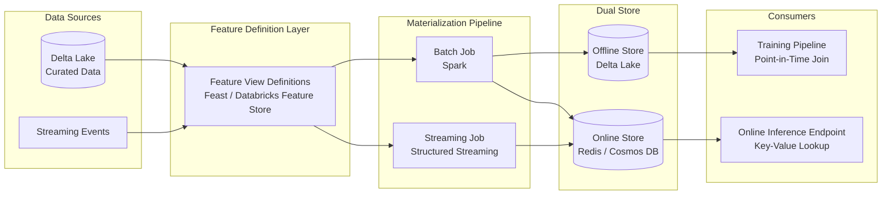
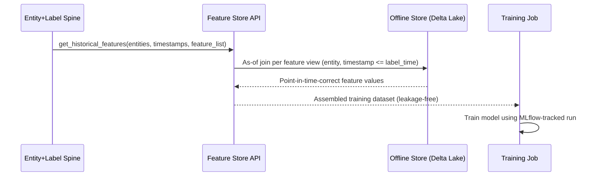
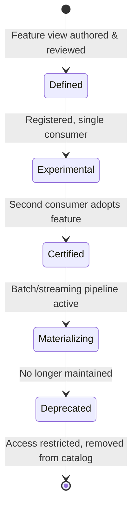

# Feature Stores with Feast

> Part of the **Enterprise Data & AI Architecture Handbook** · Phase-11 — AI Platform Engineering & MLOps · Chapter 02.
> Estimated study time: **60 min reading + ~4h labs**.
> **Prerequisite:** read [Machine Learning Foundations](01_Machine_Learning_Foundations.md) first.

---

## Executive Summary

[Machine Learning Foundations](01_Machine_Learning_Foundations.md#14-feature-engineering-fundamentals) §1.4 named two failure modes — target leakage and train/serve skew — and one defense — point-in-time correctness — but left them as engineering discipline a data scientist must remember to apply correctly on every project. A **feature store** turns that discipline into a governed, shared platform capability: a system of record for feature definitions, computation logic, and values that serves both the large-batch, historical reads training needs and the single-row, sub-10-millisecond reads online serving needs, from **one** authoritative computation path rather than two independently maintained ones.

This chapter covers **online vs. offline feature stores** as two structurally different storage and access-pattern problems solved by one logical feature definition; **training-serving skew** as the specific, recurring production-incident class a feature store is architected to eliminate; **point-in-time correctness** as the formal, enforced version of the discipline [Machine Learning Foundations](01_Machine_Learning_Foundations.md#14-feature-engineering-fundamentals) §1.4 introduced informally; **Feast and Databricks Feature Store** as the two concrete implementations this chapter builds against — one a vendor-neutral open-source project, one a Databricks/Unity-Catalog-native managed capability; and **feature governance and reuse** as the organizational payoff that justifies building a shared platform capability at all, rather than letting every model team compute its own redundant, subtly-inconsistent version of "customer 30-day transaction count."

The bias remains **Azure-primary (~60%)** — Azure Databricks Feature Store (Unity Catalog-integrated), Azure Cache for Redis and Cosmos DB as online-store backends, and Azure Machine Learning's managed feature store capability — **~30% enterprise open source** (Feast as the vendor-neutral reference implementation, Delta Lake as the offline store, Spark for batch feature computation) and **~10% AWS/GCP comparison-only** (Amazon SageMaker Feature Store, Google Vertex AI Feature Store).

**Bottom line:** a feature store is not a caching layer bolted onto a model-serving system — it is the single point of truth that makes "the feature the model saw in training" and "the feature the model sees in production" the same computation, run once, and it is the concrete platform investment that converts [Machine Learning Foundations](01_Machine_Learning_Foundations.md#15-the-end-to-end-ml-lifecycle) §1.5's lifecycle diagram from an aspirational architecture into an operable one.

---

## Learning Objectives

By the end of this chapter you will be able to:

1. **Distinguish the offline and online feature store roles** and justify why both are required rather than either alone.
2. **Diagnose and prevent training-serving skew** by identifying where a dual-implementation feature pipeline diverges.
3. **Implement point-in-time-correct feature joins**, explaining the "as-of" join mechanics that make historical training data leakage-free.
4. **Design a feature store architecture using Feast or Databricks Feature Store**, choosing correctly between them for a given platform context.
5. **Establish feature governance** (ownership, discovery, versioning, reuse) as a platform capability, not an informal team convention.
6. **Apply feature-store patterns on Azure** (Databricks Feature Store, Azure Cache for Redis, Cosmos DB) with a defensible comparison to AWS SageMaker Feature Store and GCP Vertex AI Feature Store.
7. **Defend feature-store architecture decisions** in engineer, staff engineer, architect, and CTO review settings, including the build-vs-adopt and reuse-vs-redundant-computation trade-offs.

---

## Business Motivation

- **Every model team independently reimplementing the same features is a direct, recurring engineering cost.** Without a shared feature store, "customer lifetime value," "30-day transaction count," and similar broadly-useful features are recomputed — often with small, undetected differences — by every team that needs them, multiplying both compute cost and the risk of subtly inconsistent definitions.
- **Training-serving skew is not a hypothetical risk — it is a leading, well-documented cause of ML systems that pass offline evaluation and then underperform in production**, exactly the failure mode [Machine Learning Foundations](01_Machine_Learning_Foundations.md#14-feature-engineering-fundamentals) §1.4 introduced; a feature store is the concrete architecture that closes this gap rather than merely warning about it.
- **Feature reuse compounds as an organization's model portfolio grows.** The first model to need "recent purchase velocity" pays the full engineering cost of building it correctly; the tenth model needing the same feature should pay near-zero incremental cost — a payoff only realized if the feature is stored, documented, and discoverable rather than reimplemented.
- **Real-time personalization and fraud-detection use cases have hard latency budgets** (often single-digit milliseconds) that a general-purpose data warehouse or lakehouse query cannot meet, requiring a purpose-built online store — a capital investment that is only justified once several use cases share it.
- **Feature governance failures carry direct regulatory exposure** — a feature computed from data an individual has since exercised a right-to-be-forgotten claim against (see [Data Privacy and PII Protection](../Phase-10/07_Data_Privacy_and_PII_Protection.md)) must be discoverable and purgeable, which is only tractable when features are centrally cataloged rather than scattered across ad hoc notebooks.

---

## History and Evolution

- **2010s — internal, bespoke feature platforms** (Uber's Michelangelo Palette, well before any open-source equivalent existed) demonstrate the pattern's value at hyperscale, motivated by exactly the redundant-computation and training-serving-skew problems this chapter addresses, years before "feature store" was an industry-standard term.
- **2018-2019 — Uber publishes Michelangelo and the "feature store" term enters common industry vocabulary**, crystallizing the dual online/offline architecture pattern as a named, reproducible design rather than a proprietary internal secret.
- **2019 — Feast (Feature Store) is released as an open-source project** (originally a Google/Gojek collaboration), giving the industry its first vendor-neutral, self-hostable reference implementation of the pattern.
- **2020-2021 — Feast is donated to the Linux Foundation AI & Data Foundation**, broadening its governance beyond a single vendor and accelerating adoption as a genuinely neutral standard rather than one company's product.
- **2021-2022 — managed feature-store offerings mature across major cloud/platform vendors**: Amazon SageMaker Feature Store (2020), Databricks Feature Store (2021, later Unity-Catalog-integrated), Google Vertex AI Feature Store, and Azure Machine Learning's managed feature store capability all launch within a similar window, signaling the pattern's transition from "advanced practice" to "expected platform capability."
- **2022-present — feature stores integrate directly with catalogs and governance layers** (Unity Catalog, Microsoft Purview) rather than existing as a standalone silo, directly connecting feature governance (§2.5) to the broader data governance practice in [Data Governance Foundations](../Phase-08/01_Data_Governance_Foundations.md).
- **2023-present — streaming feature computation matures** (Feast's push-based streaming ingestion, Databricks' streaming tables feeding the online store), narrowing the freshness gap between batch-only feature stores and genuinely real-time personalization/fraud use cases.

---

## Why This Technology Exists

A feature store exists because serving a machine learning model in production requires the *same* feature computation logic to run correctly in two structurally incompatible execution contexts: a batch job computing features over millions of historical rows for training, and a low-latency lookup computing (or retrieving a precomputed) feature for one entity in milliseconds at serving time. Building these as two independent implementations — the default outcome without a feature store — reliably drifts them apart over time as one is updated and the other is not, producing the training-serving skew failure this chapter is centrally organized around preventing. The feature store exists to make "compute the feature once, serve it both ways" an enforced architectural property rather than a hoped-for coding discipline.

---

## Problems It Solves

- **Training-serving skew** — a single feature definition and computation pipeline feeding both the offline store (training) and online store (serving) structurally prevents the two paths from silently diverging.
- **Point-in-time leakage** — a feature store's point-in-time join API (§2.3) enforces the as-of-timestamp correctness [Machine Learning Foundations](01_Machine_Learning_Foundations.md#14-feature-engineering-fundamentals) §1.4 described as a manual discipline, removing it as a source of human error.
- **Redundant feature computation across teams** — a shared, discoverable feature catalog lets a second model reuse an already-computed, already-validated feature instead of reimplementing it.
- **Low-latency serving of precomputed features** — the online store provides the sub-10ms point lookups real-time inference (Phase-11 Chapter 04) requires, which a batch-oriented lakehouse query cannot.
- **Feature lineage and governance gaps** — a centrally cataloged feature store gives every feature a documented owner, computation definition, and consuming-model list, closing the same kind of visibility gap [Data Catalog and Lineage](../Phase-08/02_Data_Catalog_and_Lineage.md) closes for raw datasets.

---

## Problems It Cannot Solve

- **It cannot fix a poorly designed feature itself.** A feature store guarantees *consistent* computation of a feature across training and serving; it does not guarantee the feature is predictive or well-engineered — that remains the modeling discipline from [Machine Learning Foundations](01_Machine_Learning_Foundations.md#14-feature-engineering-fundamentals) §1.4.
- **It cannot eliminate feature freshness trade-offs.** Batch-computed features in the offline/online store still lag real-time truth by the pipeline's refresh interval; a feature store manages this trade-off explicitly (§2.1) but cannot make a batch-computed feature instantaneously fresh without adopting streaming ingestion, which carries its own materially higher operational cost.
- **It cannot substitute for a data catalog's broader governance scope.** A feature store governs feature-specific metadata (definitions, freshness SLAs, consuming models); it is a complement to, not a replacement for, the dataset-level lineage and classification covered in [Data Catalog and Lineage](../Phase-08/02_Data_Catalog_and_Lineage.md).
- **It cannot make the underlying raw data correct.** A feature store computes features from source data; if that source data is itself of poor quality, per [Data Quality with Great Expectations](../Phase-08/03_Data_Quality_with_Great_Expectations.md), the resulting features inherit that quality problem regardless of how correctly the feature store computes and serves them.
- **It cannot eliminate the cost of operating two storage systems.** The dual online/offline architecture (§2.1) is inherently more operationally complex and costly than a single store, a trade-off that must be justified by genuine low-latency serving requirements, not adopted reflexively for every project.

---

## Core Concepts

### 2.1 Online vs. Offline Feature Stores

- **The offline store** holds the full historical record of feature values, optimized for large, columnar, point-in-time batch reads during training — typically implemented as Delta Lake/Parquet tables (see [Delta Lake](../Phase-04/04_Delta_Lake.md)) on ADLS Gen2, queried via Spark.
- **The online store** holds only the *latest* value of each feature per entity, optimized for single-key, sub-10-millisecond lookups during real-time inference — typically implemented as a low-latency key-value store (Azure Cache for Redis, or Cosmos DB for higher-durability requirements).
- **Both stores are populated from the same feature definition and computation pipeline** — the architectural property that makes the dual-store split safe rather than a duplicated-and-therefore-divergent-risk design: a batch or streaming materialization job computes feature values once and writes to both stores, rather than two separate pipelines independently computing the "same" feature.
- **Freshness expectations differ structurally between the two stores**: the offline store's full history supports arbitrary historical point-in-time queries (§2.3); the online store deliberately retains only the current value per entity, trading history for lookup speed, and its acceptable staleness (minutes, hours, or near-real-time via streaming) is a per-feature SLA decision, not a platform-wide constant.
- **Not every feature needs an online store entry.** Features used only in batch scoring (e.g., a monthly churn-risk report) need only the offline store; provisioning online-store capacity for features that are never read at serving time is a common, avoidable cost (§2.16 Cost Optimization).

### 2.2 Training-Serving Skew

- **Training-serving skew is the observable symptom; a dual, independently-maintained feature computation path is the root cause.** [Machine Learning Foundations](01_Machine_Learning_Foundations.md#14-feature-engineering-fundamentals) §1.4 described this as computing a feature "one way" in an offline pandas/Spark job and a "subtly different way" in an online serving path — a feature store's core architectural contribution is making that divergence structurally impossible rather than merely discouraged.
- **Common concrete divergence sources this chapter's architecture eliminates**: different null-handling logic between a batch aggregation and a real-time lookup; a rolling-window boundary computed inclusively in one path and exclusively in the other; a feature computed in Python at training time and reimplemented in a different language or framework for a low-latency serving path.
- **Skew detection as a safety net, not the primary defense**: even with a feature store, monitoring the statistical distribution of features observed at serving time against the distribution seen in training (a specific instance of the drift monitoring in [Machine Learning Foundations](01_Machine_Learning_Foundations.md#16-monitoring) §1's Monitoring section) remains valuable — a feature store reduces the *likelihood* of skew, it does not make skew monitoring unnecessary.
- **Feast's and Databricks Feature Store's shared design answer**: both define a feature transformation once (a feature view / feature table definition) and generate both the offline (batch, point-in-time-correct) and online (materialized, latest-value) representations from that single definition, rather than requiring the platform team to hand-write and separately maintain two implementations.

### 2.3 Point-in-Time Correctness

- **The as-of join is the formal mechanism enforcing point-in-time correctness**: for each row in a training-label dataset carrying an entity ID and a timestamp, the feature store retrieves the feature value that was valid *as of* that exact timestamp — never a value computed from data that would not yet have existed at that point in real history.
- **This directly operationalizes [Machine Learning Foundations](01_Machine_Learning_Foundations.md#14-feature-engineering-fundamentals) §1.4's manual point-in-time-correctness discipline**: instead of a data scientist hand-writing a careful, easy-to-get-wrong `WHERE event_time <= label_time` filter for every feature in every training-set-construction query, the feature store's `get_historical_features` (Feast) or point-in-time lookup (Databricks Feature Store) API performs this join correctly, consistently, and automatically for every feature in a feature view.
- **The as-of join's implementation is a specialized, non-trivial distributed join** — for each label row, finding the single feature record with the latest timestamp not exceeding the label timestamp (per entity) is not a simple equi-join; Feast and Databricks Feature Store both implement optimized versions of this (Feast via Spark/BigQuery-native point-in-time join offline stores; Databricks via native Delta Lake time-travel and `AS OF` semantics) specifically because a naive implementation is both easy to get wrong and expensive to run at scale.
- **Entity timestamps and feature timestamps are distinct, both-required concepts**: the *label/event timestamp* (when the prediction is being made, historically) drives the as-of cutoff; the *feature timestamp* (when each feature value was computed/observed) is what gets compared against that cutoff — conflating the two is a common, subtle bug that produces exactly the leakage this mechanism exists to prevent.

### 2.4 Feast and Databricks Feature Store

- **Feast** is a vendor-neutral, open-source feature store providing a Python SDK/CLI-defined feature repository (feature views, entities, data sources), a pluggable offline store (Spark, BigQuery, Snowflake, or a file-based store for smaller deployments), a pluggable online store (Redis, DynamoDB, or Azure Cache for Redis via community/custom providers), and a registry (metadata store) tracking feature definitions — well suited to organizations wanting cloud-neutrality or a self-hosted, framework-agnostic feature platform.
- **Databricks Feature Store** (now Unity Catalog-integrated as "Feature Engineering in Unity Catalog") stores feature tables as first-class Delta Lake tables directly in Unity Catalog, inheriting Unity Catalog's access control, lineage, and discovery for free — well suited to organizations already standardized on Azure Databricks, since it requires no separate registry or metadata system to operate and integrate.
- **The core capability is functionally equivalent between the two**: both provide feature definition, point-in-time-correct historical retrieval for training, online materialization for serving, and a discovery/catalog layer — the choice between them (§2.25 Decision Matrix) is primarily a platform-fit decision (already-on-Databricks vs. wanting open-source portability), not a capability gap.
- **Databricks Feature Store's tighter integration is also a lock-in trade-off**: its feature tables being Unity-Catalog-native Delta tables means feature governance and lineage come "for free," but migrating away from Databricks later requires re-platforming the feature store alongside everything else, whereas Feast's pluggable-backend design is explicitly built to reduce that specific migration cost (§2.35 Migration Considerations).
- **Both integrate with MLflow for training-time feature retrieval**: a model's training run can log which feature view version and timestamp it was trained against, extending the experiment-tracking provenance from [Machine Learning Foundations](01_Machine_Learning_Foundations.md#15-the-end-to-end-ml-lifecycle) §1.5 to cover feature lineage specifically, not just code/data/hyperparameter lineage.

### 2.5 Feature Governance and Reuse

- **A feature registry is the discovery mechanism that makes reuse possible at all** — without a searchable catalog of existing feature definitions (owner, computation logic, freshness SLA, consuming models), a second team has no practical way to discover that a needed feature already exists, and will simply reimplement it.
- **Feature ownership must be explicit**, not implicit — every feature view/table should have a named owning team accountable for its correctness, freshness SLA, and any breaking-change communication, the feature-level analog of the data-contract ownership model in [Data Contracts](../Phase-08/07_Data_Contracts.md).
- **Versioning feature definitions is required to support safe evolution** — changing a feature's computation logic in place silently invalidates every model trained against the old definition; a new feature version (not an in-place mutation) preserves reproducibility for existing production models while allowing new models to adopt the improved definition.
- **Feature reuse has a real, quantifiable cost-avoidance payoff** — the more models that consume a shared, correctly-computed feature instead of independently recomputing an equivalent one, the more the platform investment in building the feature store amortizes, directly connecting to the FinOps case in §2.16.
- **Governance must also cover PII/sensitive features explicitly** — a feature derived from personal data (e.g., an income estimate) carries the same classification and access-control obligations as the source data it was derived from, per [Data Security and Encryption](../Phase-10/03_Data_Security_and_Encryption.md) and [Data Privacy and PII Protection](../Phase-10/07_Data_Privacy_and_PII_Protection.md) — a feature catalog that does not propagate source-data sensitivity labels to derived features creates a governance blind spot.

---

## Internal Working

**How a point-in-time-correct training dataset is actually assembled** (the mechanics underlying Feast's `get_historical_features` and Databricks Feature Store's training-set creation API):

1. **Entity-and-label spine**: the caller provides an "entity dataframe" — one row per training example, containing the entity ID(s) (e.g., `customer_id`) and the event/label timestamp for that example.
2. **Feature view resolution**: for each requested feature, the feature store resolves which feature view/table holds it, and where that feature view's underlying data source (an offline store Delta table, for example) lives.
3. **As-of join execution**: for every entity-timestamp row in the spine, the engine finds, per requested feature, the single row in that feature's source table with the entity match and the latest feature timestamp not exceeding the spine's event timestamp — implemented as a distributed sort-merge or window-function-based join (Spark's `asofjoin`-style pattern, or Databricks' native `AS OF` time-travel join), not a naive nested loop.
4. **Point-in-time-correct assembly**: the resolved feature values are joined back onto the original entity-and-label spine, producing one training row per original spine row with every requested feature populated as of its correct historical timestamp.
5. **Materialization for online serving (a separate, parallel path)**: on a schedule (or continuously for streaming sources), the feature store's materialization job writes the *latest* value of each feature per entity into the online store, overwriting the previous value — this path does not perform an as-of join (there is only "now"), it simply keeps the online store's current-value table up to date.
6. **Online retrieval at inference time**: the serving path performs a simple key-value lookup (entity ID → current feature values) against the online store, an O(1)-style operation by design, deliberately avoiding any join or aggregation at request time.

The critical architectural insight is that steps 3-4 (training-time, point-in-time-correct, batch-oriented) and step 6 (serving-time, current-value, single-key-latency-oriented) are both derived from the *same* feature view definition and the *same* upstream computation logic — the property that directly eliminates the training-serving skew in §2.2.

---

## Architecture

- **Feature definition layer**: a version-controlled repository of feature view/table definitions (entities, data sources, transformation logic, freshness/TTL policy) — Feast's Python-defined feature repository, or Databricks Feature Store's table definitions registered in Unity Catalog.
- **Offline store**: Delta Lake tables on ADLS Gen2, holding the full historical feature record, queried via Spark for training-set assembly (§2.3's as-of joins) and via batch scoring jobs.
- **Online store**: Azure Cache for Redis (lowest-latency, cache-semantics) or Cosmos DB (when durability/multi-region requirements outweigh the small added latency), holding only current feature values per entity.
- **Materialization pipeline**: a scheduled (or streaming) job — an Azure Databricks job, or Feast's `materialize`/`materialize-incremental` commands run via an orchestrator (see [Orchestration with Airflow](../Phase-09/07_Orchestration_with_Airflow.md)) — that computes feature values from source data and writes them to both stores.
- **Registry/catalog**: Feast's metadata registry, or Databricks Feature Store's Unity Catalog integration, providing the discovery and governance layer from §2.5.
- **Serving-time client**: an SDK call embedded in the online inference path (Phase-11 Chapter 04) that performs the low-latency online-store lookup, typically alongside request-time features that cannot be precomputed (e.g., values only known at request time).

---

## Components

- **Entity** — the object a feature describes (customer, product, transaction), the join key across which point-in-time and online lookups both operate.
- **Feature view / feature table** — the versioned definition of a set of related features, their source data, their transformation logic, and their TTL/freshness policy.
- **Data source connector** — the definition of where raw data feeding a feature view lives (a Delta table, a streaming topic), decoupling the feature view's logic from the physical storage detail.
- **Offline store connector** — the pluggable interface to the historical store (Delta Lake/Spark for the Azure-primary path).
- **Online store connector** — the pluggable interface to the low-latency store (Azure Cache for Redis / Cosmos DB).
- **Materialization engine** — the batch or streaming job execution layer that populates both stores from source data.
- **Registry** — the metadata store tracking every feature view's definition, version, and ownership.
- **Client SDK** — the library used both offline (training-set assembly) and online (serving-time lookup) to interact with the feature store consistently.

---

## Metadata

- **Feature-level metadata**: name, data type, owning team, description, freshness/TTL SLA, and the specific feature view version — the unit of information a consumer needs to decide whether an existing feature meets their use case before building a new one.
- **Feature view metadata**: source data reference, transformation logic reference (or literal SQL/PySpark definition), entity join keys, and materialization schedule.
- **Lineage metadata**: which upstream datasets feed a feature view, and which downstream models/experiments (tracked via MLflow, per [Machine Learning Foundations](01_Machine_Learning_Foundations.md#15-the-end-to-end-ml-lifecycle) §1.5) consume it — the feature-specific extension of the lineage practice in [Data Catalog and Lineage](../Phase-08/02_Data_Catalog_and_Lineage.md).
- **Sensitivity/classification metadata**: propagated from the source dataset's classification (per [Data Governance Foundations](../Phase-08/01_Data_Governance_Foundations.md)), so a feature derived from PII is discoverable as such without requiring a separate manual review of its derivation logic.

---

## Storage

- **Offline store**: Delta Lake/Parquet on ADLS Gen2 — chosen specifically because its versioned, time-travel-queryable snapshots (see [Delta Lake](../Phase-04/04_Delta_Lake.md)) are a natural physical substrate for the as-of joins in §2.3, and because it is already the platform's primary lakehouse storage format, avoiding a separate data-movement step.
- **Online store**: Azure Cache for Redis (in-memory, lowest latency, appropriate when brief data loss on a cache restart is tolerable because the online store can be re-materialized from the offline store) or Cosmos DB (persistent, higher durability, appropriate when the online store must survive a restart without re-materialization, at a higher latency and cost than Redis).
- **Registry storage**: Feast's registry can be backed by a simple object-storage file (smaller deployments) or a SQL-backed registry (PostgreSQL/Azure SQL, for concurrent-write, multi-team production use); Databricks Feature Store's registry is simply Unity Catalog's existing metastore, requiring no separate provisioning.

---

## Compute

- **Batch materialization compute**: Azure Databricks job clusters (or Feast's Spark-based materialization), sized by the volume of entities and features being recomputed on each scheduled run, following the same auto-scale-to-zero pattern recommended in [Machine Learning Foundations](01_Machine_Learning_Foundations.md#compute) for training compute.
- **Streaming materialization compute** (for near-real-time freshness requirements): a continuously running structured-streaming job (Databricks) or Feast's streaming ingestion path, a materially different, always-on compute cost profile than scheduled batch materialization.
- **As-of join compute at training time**: a Spark job (Feast's offline-store-as-Spark path, or a Databricks notebook using Feature Store's training-set API), typically run once per training iteration rather than continuously, and usually a smaller compute footprint than the materialization pipeline itself.
- **Online-store compute**: Azure Cache for Redis/Cosmos DB's own provisioned throughput (Redis: node size/tier; Cosmos DB: provisioned or serverless RU/s), sized to the serving path's peak queries-per-second, not the batch pipeline's volume.

---

## Networking

- **Private endpoints for the online store** (Azure Cache for Redis Premium tier's VNet injection, or Cosmos DB private endpoints) keep the serving-time lookup path off the public internet, consistent with the zero-trust baseline in [Network Security and Zero Trust](../Phase-10/04_Network_Security_and_Zero_Trust.md).
- **Co-locating the online store and the serving compute** (the same Azure region, ideally the same VNet) is a direct latency-budget requirement — a cross-region round trip can consume a meaningful fraction of a single-digit-millisecond feature-lookup budget on its own.
- **The offline store's networking requirements are the same as the rest of the lakehouse's** (private endpoints to ADLS Gen2), since it is simply Delta Lake tables in the existing data estate, not a separate network zone.

---

## Security

- **Access control for feature views** should follow the same Unity Catalog grants or ADLS Gen2 ACL model as any other data asset (per [Identity and Access Management with Entra](../Phase-10/02_Identity_and_Access_Management_with_Entra.md)) — a feature derived from restricted data must remain restricted, not implicitly become more broadly accessible because it now lives in a "feature store."
- **Online store credentials** should be delivered via managed identity/workload identity federation to the serving application, not embedded connection strings, consistent with the Phase-10 Chapter 02 default.
- **PII propagation through feature derivation** (§2.5) is a specific, easy-to-miss risk: a feature engineered from a sensitive field (e.g., a risk score derived from health data) inherits that sensitivity and must be classified and access-controlled accordingly, per [Data Privacy and PII Protection](../Phase-10/07_Data_Privacy_and_PII_Protection.md).
- **The feature registry itself is a sensitive metadata surface** — it can reveal proprietary feature engineering logic and which models consume which signals; registry access should be scoped, not left open to every platform user by default.

---

## Performance

- **Online-store lookup latency** is the primary, hard-budgeted performance metric — typically targeting single-digit-to-low-double-digit milliseconds per entity, dominated by network round-trip and the online store's own read latency rather than any computation (since online reads are simple key-value lookups, per §2.1).
- **Materialization job throughput** is the primary batch-side performance concern — how quickly the pipeline can recompute and write feature values for the full (or incrementally changed) entity population, following the same data-loading and compute-utilization profiling guidance as [Machine Learning Foundations](01_Machine_Learning_Foundations.md#performance).
- **As-of join performance at training time** depends heavily on the offline store's ability to push down the timestamp filter efficiently — Delta Lake's file-level statistics and Z-ordering (see [Columnar Storage Internals](../Phase-04/02_Columnar_Storage_Internals.md)) materially reduce the data scanned for a given as-of join compared to an unoptimized table layout.
- **Batching online-store reads** (retrieving all features for a batch of entities in one round trip, rather than one request per entity) is a standard optimization for serving paths that score multiple entities together (e.g., ranking a list of candidates).

---

## Scalability

- **Online store scaling** follows the underlying store's own scaling model — Azure Cache for Redis scales via tier/node size and clustering; Cosmos DB scales via partition key design and provisioned/autoscale RU/s, requiring the same partition-key design discipline covered generally in data-platform scaling guidance.
- **Materialization pipeline scaling** is a standard Spark horizontal-scaling problem (more executors, per [Apache Spark Internals](../Phase-05/04_Apache_Spark_Internals.md)), bound by the entity population size and feature computation complexity.
- **Feature view proliferation at scale** — as an organization's model portfolio grows, the number of feature views can grow into the hundreds or thousands; the registry/catalog (§2.5) is what keeps this scale navigable rather than becoming an unmanageable sprawl.
- **Multi-team, multi-workspace feature sharing** — Databricks Feature Store's Unity Catalog integration supports cross-workspace feature sharing within a metastore; Feast's registry can similarly be shared across teams' deployments, both directly enabling the reuse payoff from §2.5 at organizational scale.

---

## Fault Tolerance

- **Online store failure fallback**: a serving path should have a defined behavior (return a default/cached value, or fail the request gracefully) when the online store is unavailable, rather than allowing an online-store outage to become a full inference-serving outage — connecting to the graceful-degradation pattern in [Machine Learning Foundations](01_Machine_Learning_Foundations.md#fault-tolerance).
- **Materialization job idempotency**: a re-run of a materialization job (after a transient failure) should safely overwrite the same feature values without producing duplicate or inconsistent state, the same idempotency discipline as any other pipeline stage.
- **Online store rebuildability from the offline store**: since the online store holds only current values, it can in principle be fully rebuilt via a materialization run from the offline store's history — a valuable disaster-recovery property specifically enabled by the dual-store architecture, provided the materialization job itself is documented and rehearsed, not merely theoretically possible.

---

## Cost Optimization (FinOps)

- **Avoid provisioning an online store for features that are never read at serving time** — a common, avoidable cost when a feature intended only for batch scoring is materialized to the online store "just in case."
- **Right-size the online store tier to actual queries-per-second**, not peak-training-time load — Redis/Cosmos DB provisioning should track serving-time traffic, which is often much lower and more predictable than batch materialization's periodic burst load.
- **Incremental materialization over full re-materialization**: recomputing only changed entities/features on each run (Feast's `materialize-incremental`, or Databricks' incremental streaming tables) avoids the full-recompute cost of reprocessing the entire entity population on every refresh cycle.
- **Feature reuse as a direct cost-avoidance lever** — every model that consumes an existing, shared feature instead of computing an equivalent one independently avoids that team's own compute cost for the redundant computation, the concrete financial expression of the reuse case from §2.5.

**Worked FinOps example**: An organization's fraud, churn, and recommendation teams each independently compute a variant of "customer 30-day transaction velocity," at an estimated $180/month in redundant Spark compute per team (3 teams × ~$180 ≈ **$540/month**, plus the ongoing engineering time to maintain three slightly different implementations). Consolidating this into one shared feature view, materialized once via a single scheduled job, reduces the compute cost to roughly **$190/month** (one computation instead of three, plus a modest online-store storage/throughput cost of ~$25/month for the shared feature) — a **~60% direct compute cost reduction**, before even counting the harder-to-quantify but real engineering-time savings from not maintaining three divergent implementations and the risk reduction from eliminating the training-serving-skew exposure each independent implementation carried.

---

## Monitoring

- **Materialization job monitoring**: run status, duration, and row counts written to each store, following the same job-monitoring pattern as [Machine Learning Foundations](01_Machine_Learning_Foundations.md#monitoring)'s training-job monitoring.
- **Online-store latency and error-rate monitoring**: p50/p95/p99 lookup latency and error rate against the serving path's latency budget, the feature-store-specific extension of standard service-level monitoring.
- **Feature freshness monitoring**: alerting when a feature's actual last-materialized timestamp exceeds its declared freshness SLA, directly closing the "stale features silently degrade model quality" gap flagged in [Machine Learning Foundations](01_Machine_Learning_Foundations.md#16-monitoring) §1's Monitoring section.
- **Feature-value distribution monitoring**: tracking the statistical distribution of each feature's served values over time, both as a skew-detection safety net (§2.2) and as an early drift signal feeding the retraining trigger from [Machine Learning Foundations](01_Machine_Learning_Foundations.md#15-the-end-to-end-ml-lifecycle) §1.5.

---

## Observability

- **End-to-end feature lineage from a specific serving-time prediction back to the exact feature view version, materialization run, and source data snapshot** that produced the value the model consumed — the feature-specific extension of the model-to-training-run lineage described in [Machine Learning Foundations](01_Machine_Learning_Foundations.md#observability).
- **Correlating online-store lookup latency with downstream inference latency** in a unified dashboard, so a feature-store-caused latency regression is distinguishable from a model-inference-caused one during incident triage.
- **Feature-view-level dashboards** (materialization freshness, consuming-model count, lookup volume) give platform teams visibility into which features are heavily reused (validating the governance investment) versus rarely used (candidates for deprecation).

### Operational Response Playbook

| Signal | Detection Query/Check | Remediation |
|---|---|---|
| **Online-store p99 lookup latency exceeds the serving path's latency budget** | Azure Cache for Redis / Cosmos DB metrics dashboard, correlated with request volume to rule out a simple capacity issue | Check for a "hot key" (a single heavily-requested entity skewing latency) or undersized tier/RU allocation first; scale the online store tier or add read replicas before assuming a code-level fix is needed; if load-independent, check for a recent schema/feature-view change that increased payload size per lookup |
| **A feature's actual last-materialized timestamp exceeds its declared freshness SLA** | Scheduled freshness-check job comparing each feature view's latest materialization timestamp against its registered SLA in the registry/catalog | Check the materialization job's run history for failures first (a silently failing scheduled job is the most common cause); if the job is succeeding but running less frequently than the SLA requires, correct the schedule; if source data itself is delayed, escalate to the upstream data pipeline owner rather than treating it as a feature-store-layer defect |

---

## Governance

- **Every feature view must have a documented, discoverable owner** (per §2.5), the feature-level analog of the dataset ownership model in [Data Governance Foundations](../Phase-08/01_Data_Governance_Foundations.md).
- **Feature definitions should be version-controlled and reviewed** (a pull-request-based change process for Feast's Python-defined feature repository, or Databricks Feature Store table schema changes) rather than mutated ad hoc, preserving the reproducibility guarantee that makes point-in-time training-set assembly (§2.3) trustworthy.
- **Sensitivity classification must propagate from source data to derived features automatically wherever feasible**, not rely on each feature author to remember to reclassify manually — closing the governance blind spot flagged in §2.5.
- **Feature deprecation needs an explicit process**: a feature view no longer maintained but still silently available for a new model to (incorrectly) start depending on is a governance risk; deprecated feature views should be clearly marked and, ideally, access-restricted to prevent new, undesired dependencies.

---

## Trade-offs

- **Feast (open-source, pluggable) vs. Databricks Feature Store (integrated, Unity-Catalog-native)**: Feast trades some out-of-the-box integration convenience for cloud/platform neutrality and reduced lock-in; Databricks Feature Store trades some of that neutrality for governance and lineage that come "for free" from Unity Catalog — the central decision in §2.25's Decision Matrix.
- **Batch vs. streaming materialization**: streaming materialization narrows the online store's freshness gap but is a materially more complex, always-on, more expensive compute commitment than scheduled batch materialization — most enterprise use cases should default to batch and adopt streaming only where a demonstrated business need (e.g., fraud detection) justifies the added cost and complexity.
- **Redis vs. Cosmos DB as the online store**: Redis offers lower latency at the cost of weaker durability guarantees (appropriate when the online store is rebuildable from the offline store, per §2.19); Cosmos DB offers stronger durability and multi-region capability at somewhat higher latency and cost.
- **Centralizing feature governance vs. team autonomy**: a strongly enforced central feature catalog maximizes reuse and consistency but can slow an individual team's ability to iterate quickly on an experimental, not-yet-proven feature — many organizations resolve this with a lighter-weight "experimental" feature-view tier that graduates to the governed catalog only once adopted by a second consumer.

---

## Decision Matrix

| Scenario | Recommended Approach | Rationale |
|---|---|---|
| Organization already standardized on Azure Databricks + Unity Catalog | Databricks Feature Store (Feature Engineering in Unity Catalog) | Governance, lineage, and access control are inherited for free; no separate registry to operate |
| Organization requires cloud/platform neutrality or multi-cloud portability | Feast | Vendor-neutral, pluggable offline/online store backends explicitly designed to reduce platform lock-in |
| Use case is purely batch scoring, no real-time inference | Offline store only, skip online-store provisioning | Avoids the direct, avoidable online-store cost flagged in §2.16 |
| Use case requires sub-10ms serving latency at high query volume | Azure Cache for Redis as the online store | Lowest achievable latency; acceptable given the online store's rebuildability from the offline store |
| Use case requires online-store durability across restarts without re-materialization | Cosmos DB as the online store | Persistent, multi-region-capable, at a modest latency/cost premium over Redis |
| A feature is genuinely needed by only one model and unlikely to be reused | A simpler, locally-scoped feature pipeline (not registered in the shared feature store) may be justified | Avoids over-engineering governance overhead for a single-consumer feature; promote to the shared store only if a second consumer emerges |

---

## Design Patterns

- **Single source of truth per feature**: exactly one feature view definition and computation pipeline feeds both stores — the pattern this entire chapter is organized around, directly eliminating training-serving skew (§2.2).
- **Point-in-time-correct training-set assembly as a mandatory step**, never a manual, ad hoc join — enforced via the feature store's API rather than trusted to individual data scientist discipline.
- **Feature versioning with additive, non-breaking evolution**: introduce a new feature-view version rather than mutating an existing one in place, preserving reproducibility for models already trained against the prior version.
- **Tiered governance (experimental vs. certified features)**: a lighter-weight path for early experimentation that graduates into the fully governed catalog once a feature proves reusable, balancing the central-governance-vs-team-autonomy trade-off from §2.24.

---

## Anti-patterns

- **Maintaining two independent implementations of "the same" feature for training and serving** — the direct architectural mistake a feature store exists to eliminate; if a project still has separate training-time and serving-time feature code paths after adopting a feature store, the feature store has been adopted in name only.
- **Materializing every feature to the online store "just in case"** — an unnecessary, ongoing cost for features that are never actually read at serving time (§2.16).
- **Treating the feature store as a data catalog substitute** — a feature store's metadata scope is feature-specific; it does not replace the broader dataset governance in [Data Catalog and Lineage](../Phase-08/02_Data_Catalog_and_Lineage.md).
- **Skipping point-in-time correctness "because it's slower"** — using a simpler, non-as-of join for convenience reintroduces the exact leakage risk (§2.3) the feature store's API was built to prevent.
- **Building a feature store before there are at least two consumers who would benefit from shared features** — the governance and dual-store operational overhead is not justified for a single model's single-use feature set; introduce the shared platform capability once genuine reuse demand exists.

---

## Common Mistakes

- Conflating the label/event timestamp with the feature timestamp in an as-of join, silently reintroducing leakage despite using a feature store's API (§2.3).
- Forgetting to set a freshness/TTL policy on a feature view, leaving the online store to serve an arbitrarily stale value with no alerting when it exceeds an implicit (undeclared) staleness tolerance.
- Not propagating source-data sensitivity classification to derived features, creating an unmonitored PII exposure surface (§2.5, §2.23).
- Provisioning the online store's throughput/tier based on training-time or batch-materialization load rather than actual serving-time query volume, leading to either overprovisioning cost or underprovisioned serving-time latency.
- Choosing Databricks Feature Store for a genuinely multi-cloud or cloud-migration-sensitive organization without weighing the lock-in trade-off explicitly (§2.24, §2.35).

---

## Best Practices

- Define every feature exactly once, in a version-controlled feature repository, and derive both the offline and online representations from that single definition.
- Enforce point-in-time-correct training-set assembly via the feature store's API for every model, with no exceptions for "just this one quick experiment."
- Set and monitor an explicit freshness SLA for every feature view, alerting when materialization falls behind that SLA.
- Propagate sensitivity classification from source data to derived features automatically as part of the feature-view registration process, not as a manual afterthought.
- Require a minimum of two prospective consumers (or a clearly foreseeable second consumer) before promoting an experimental feature into the fully governed shared catalog.

---

## Enterprise Recommendations

- Standardize on Databricks Feature Store for new Azure-Databricks-centric projects to minimize operational overhead, reserving Feast for genuinely multi-cloud or platform-neutrality-sensitive contexts.
- Mandate that every production model's training pipeline uses the feature store's point-in-time-correct historical-retrieval API — no direct, hand-written joins against raw source tables for training-set assembly.
- Require every feature view to declare an owning team, a freshness SLA, and a sensitivity classification as a condition of being published to the shared, governed catalog.
- Track feature reuse (number of distinct consuming models per feature view) as a platform KPI, using it both to justify the feature-store investment and to identify high-value features warranting additional freshness/quality investment.

---

## Azure Implementation

- **Azure Databricks Feature Store (Feature Engineering in Unity Catalog)** as the primary recommended implementation: feature tables as Delta Lake tables registered in Unity Catalog, inheriting Unity Catalog's access grants, lineage, and search/discovery.
- **Azure Cache for Redis (Premium tier, VNet-injected)** as the default online store for lowest-latency serving; **Cosmos DB** as the alternative online store when durability/multi-region requirements outweigh Redis's latency advantage.
- **Azure ML managed feature store** as an alternative for organizations centered on Azure ML rather than Databricks, providing comparable feature-registration and online/offline serving capability integrated with Azure ML's training and endpoint infrastructure (Phase-11 Chapter 05).
- **Azure Databricks Workflows** (or Airflow, per [Orchestration with Airflow](../Phase-09/07_Orchestration_with_Airflow.md)) to schedule batch materialization jobs, and Databricks Structured Streaming for near-real-time materialization where required.

---

## Open Source Implementation

- **Feast** as the vendor-neutral reference implementation: Python-defined feature repository, pluggable offline store (Spark against Delta Lake being the Azure-primary choice here), pluggable online store (a self-hosted Redis, or a custom Azure Cache for Redis provider), and its own lightweight registry.
- **Delta Lake** as the offline store's physical format, chosen for its point-in-time query support via time travel and its role as the platform's existing lakehouse standard (see [Delta Lake](../Phase-04/04_Delta_Lake.md)).
- **Apache Spark** as the batch materialization and as-of-join compute engine underlying both Feast's Spark offline store and Databricks Feature Store's training-set assembly.
- **Redis** (self-hosted or Azure Cache for Redis) as the most common open-source-aligned online store choice across both Feast and Databricks Feature Store deployments.

---

## AWS Equivalent (comparison only)

- **Amazon SageMaker Feature Store** provides the direct equivalent: an offline store (backed by S3/Parquet, queryable via Athena/Spark), an online store (a managed low-latency store), and a feature registry integrated with SageMaker's broader ML platform.
- **Advantages**: tight integration with the rest of the SageMaker training/serving ecosystem for AWS-centric teams; managed operational overhead comparable to Databricks Feature Store's Azure-native convenience.
- **Disadvantages**: like the broader SageMaker comparison in [Machine Learning Foundations](01_Machine_Learning_Foundations.md#aws-equivalent-comparison-only), a materially different API and integration model than Azure Databricks Feature Store, meaning a genuine re-platforming effort rather than a drop-in swap.
- **Migration strategy**: feature definitions expressed in Feast's cloud-neutral repository format migrate with the least friction; feature tables tightly coupled to SageMaker's or Databricks' proprietary registry format require the most rework.
- **Selection criteria**: choose SageMaker Feature Store when the broader ML estate is already AWS/SageMaker-centric; otherwise this chapter's Azure-primary recommendation applies.

---

## GCP Equivalent (comparison only)

- **Google Vertex AI Feature Store** provides the equivalent offline/online store and registry capability, with particularly strong integration for organizations already using BigQuery as their offline feature source.
- **Advantages**: strong fit for BigQuery-centric data estates, and tight integration with Vertex AI's broader training/serving platform (see the parallel comparison in [Machine Learning Foundations](01_Machine_Learning_Foundations.md#gcp-equivalent-comparison-only)).
- **Disadvantages**: the same re-platforming cost pattern as the AWS case — a distinct API and data-source model relative to Azure Databricks Feature Store or Feast.
- **Migration strategy**: identical principle — cloud-neutral Feast-defined features port more readily than platform-proprietary feature-table definitions.
- **Selection criteria**: choose Vertex AI Feature Store when the data estate is BigQuery/GCP-centric; otherwise default to the Azure-primary recommendation.

---

## Migration Considerations

- **Feast's pluggable-backend design is the lowest-lock-in migration path** — moving offline stores (e.g., from BigQuery to Delta Lake/Spark) or online stores (e.g., from DynamoDB to Azure Cache for Redis) requires reconfiguring the backend connector, not rewriting feature definitions.
- **Databricks Feature Store migration requires re-platforming feature tables as part of any broader Databricks migration** — since feature tables are Unity-Catalog-native Delta tables, migrating away from Databricks means migrating the feature store alongside the rest of the lakehouse, not as an independent, isolated effort.
- **Re-validate point-in-time join correctness after any offline-store migration** — subtle differences in how a new backend implements as-of semantics (§2.3) must be verified against the same training-set output as the prior backend before trusting the migrated pipeline's results.
- **Feature definitions in version control (not only in a vendor's UI/registry) reduce migration risk generally** — a feature repository expressed as reviewable, portable code (Feast's model) survives a platform migration far more cleanly than definitions that exist only inside a specific vendor's managed registry.

---

## Mermaid Architecture Diagrams

---

## End-to-End Data Flow

1. **Source ingestion**: curated data lands in Delta Lake (per [Medallion Architecture](../Phase-05/03_Medallion_Architecture.md)), the raw substrate feature views are defined against.
2. **Feature definition**: a data scientist or ML engineer defines a feature view (entity, transformation logic, source, freshness policy) in the version-controlled feature repository.
3. **Materialization**: a scheduled batch job (or streaming job) computes feature values and writes them to both the offline store (full history) and the online store (latest value only).
4. **Training-set assembly**: a training pipeline calls the feature store's point-in-time-correct historical retrieval API against an entity-and-label spine, producing a leakage-free training dataset.
5. **Model training and registration**: the resulting model is trained and registered per the lifecycle in [Machine Learning Foundations](01_Machine_Learning_Foundations.md#15-the-end-to-end-ml-lifecycle) §1.5, with the specific feature view version used recorded in MLflow.
6. **Online serving**: at inference time, the serving endpoint performs a low-latency online-store lookup for the entity's current feature values, combined with any request-time-only features, and returns a prediction.
7. **Monitoring and feedback**: feature freshness, lookup latency, and feature-value distribution are monitored, feeding both feature-store-specific alerting and the broader model-drift monitoring loop.

---

## Real-world Business Use Cases

- **Real-time fraud scoring**: online-store lookups of recent transaction-velocity and device-reputation features feed a sub-50ms fraud-scoring decision at checkout.
- **Product recommendation ranking**: shared "customer affinity" and "product popularity" features, reused across multiple ranking models (search, homepage, email), amortizing the feature-engineering investment across use cases.
- **Credit risk scoring**: point-in-time-correct historical features (e.g., "payment history as of application date") are essential for both regulatory defensibility and leakage-free model training.
- **Churn prediction**: features like "engagement trend over the last 90 days," computed once and shared across a churn model and a customer-health-score dashboard, avoiding duplicated computation for closely related use cases.

---

## Industry Examples

- **Ride-sharing and delivery platforms** (the domain that produced Michelangelo, the pattern's original reference architecture) rely on shared driver/rider/order features across pricing, matching, and fraud models simultaneously.
- **Retail and e-commerce** platforms share customer and product features across search ranking, recommendation, and marketing-attribution models, directly realizing the reuse payoff from §2.5.
- **Financial services** rely heavily on point-in-time correctness (§2.3) for regulatory model validation — being able to prove a credit model was trained only on data that would have been available as of each historical decision date is often an audit requirement, not merely good practice.

---

## Case Studies

**Case Study 1 — A silent training-serving skew from a timezone mismatch.** A recommendation team's offline feature pipeline computed "hours since last purchase" using UTC timestamps consistently throughout, while the online serving path — a separately maintained microservice built before the feature store was adopted — computed the same feature using the customer's local timezone, converted from a different upstream timestamp field. Offline evaluation showed strong performance; production click-through rate was measurably lower than expected. The root cause, found only after a multi-week investigation comparing training-time and serving-time feature snapshots for the same customers, was the timezone inconsistency, shifting the feature's value by several hours in a way that changed model behavior around time-sensitive recommendation windows. After migrating both paths onto a single feature-store-defined feature view (eliminating the separately maintained serving microservice's own computation), the discrepancy became structurally impossible to reintroduce. The organizational lesson: any lingering, separately maintained serving-time feature computation path — even one that predates the feature store and "still works fine" — is a latent training-serving-skew risk that should be migrated onto the shared feature view, not left in place because it has not yet caused a visible incident.

**Case Study 2 — Feature reuse cutting a new model's time-to-production dramatically.** A newly formed team building a customer-lifetime-value model discovered, via the feature catalog, that a "12-month purchase frequency and recency" feature set already existed, built and validated by the churn team six months earlier. Instead of the several weeks typically required to design, validate, and pipeline a comparable feature set from scratch, the new team's model was in a training-ready state within days, consuming the existing feature view directly. The broader lesson generalized into a platform-team practice: proactively surfacing "this feature already exists" during new-project kickoff (rather than waiting for teams to discover the catalog on their own) materially increases realized reuse, since teams under delivery pressure default to building rather than searching unless actively prompted otherwise.

---

## Hands-on Labs

1. **Lab 1 — Define and materialize a Feast feature view.** Install Feast locally, define a feature view against a sample Delta/Parquet dataset, run `feast apply` and `feast materialize`, and verify both the offline retrieval and online lookup return consistent values for the same entity.
2. **Lab 2 — Reproduce and fix a point-in-time leakage bug.** Given a provided entity-and-label spine and a feature source table, first assemble a training set using a naive (non-as-of) join and observe the resulting leakage; then use Feast's `get_historical_features` API to assemble the same dataset correctly and compare the two resulting training sets.
3. **Lab 3 — Databricks Feature Store end-to-end.** Create a feature table in Azure Databricks registered in Unity Catalog, write a training-set-creation notebook using the Feature Store client, train a model, and log the feature table version used to MLflow.
4. **Lab 4 — Online-store latency benchmarking.** Provision an Azure Cache for Redis instance as a Feast online store, materialize a feature view, and benchmark p50/p95/p99 lookup latency under increasing concurrent request load.

---

## Exercises

1. Given a described feature ("total spend in the last 7 days"), identify what would constitute a training-serving skew bug if the offline and online computation paths were implemented independently, and describe how a feature store's architecture prevents it.
2. Design a feature view definition (entity, source, transformation, freshness policy) for a fraud-detection use case requiring near-real-time features.
3. Explain, in your own words, why an as-of join is more complex than a standard equi-join, and what specifically would go wrong if a naive equi-join were substituted.
4. Given two candidate online stores (Redis and Cosmos DB) and a described latency/durability requirement, justify a selection.

---

## Mini Projects

1. **Build a shared feature view consumed by two models.** Implement one feature view (e.g., "customer engagement score") and build two independent training pipelines (e.g., a churn model and an upsell-propensity model) that both consume it via the feature store's point-in-time API, demonstrating the reuse pattern from §2.5 concretely.
2. **Implement feature freshness monitoring and alerting.** Build a scheduled check comparing each feature view's actual last-materialized timestamp against its declared SLA, raising an alert (per the Operational Response Playbook) when it is exceeded.

---

## Capstone Integration

This chapter formalizes [Machine Learning Foundations](01_Machine_Learning_Foundations.md#14-feature-engineering-fundamentals) §1.4's feature-engineering discipline into a governed platform capability, and every later Phase-11 chapter assumes this feature store as the platform's feature source of truth: MLOps and MLflow (Phase-11 Chapter 03) extends this chapter's feature-view-version tracking into full experiment and model lineage; Model Serving and Ray (Phase-11 Chapter 04) consumes this chapter's online store as the serving path's low-latency feature source; Azure Machine Learning (Phase-11 Chapter 05) covers Azure ML's own managed feature store as an alternative to the Databricks Feature Store path detailed here; ML Pipeline Architecture (Phase-11 Chapter 06) incorporates the materialization pipeline from §2.Architecture as one stage of the full production pipeline; and Responsible AI (Phase-11 Chapter 07) revisits this chapter's PII-propagation governance gap (§2.5, §2.23) as part of its fuller fairness and privacy treatment. An architect who has internalized this chapter's point-in-time-correctness and dual-store architecture is equipped to evaluate whether any later Phase-11 platform choice actually preserves those two guarantees, rather than merely assuming a vendor's "feature store" label guarantees it.

---

## Interview Questions

1. What is the difference between an offline and an online feature store, and why are both needed?
2. What is training-serving skew, and how does a feature store's architecture prevent it structurally rather than just by convention?
3. Explain what an as-of join is and why it is more complex than a standard join.
4. When would you choose Feast over Databricks Feature Store, or vice versa?

## Staff Engineer Questions

1. A model's production feature values are drifting from its training-time feature distribution despite using a feature store. Walk through your diagnostic process.
2. How would you design a feature-view versioning strategy that allows safe evolution without breaking existing production models?
3. What criteria would you use to decide whether a feature needs streaming (vs. batch) materialization?
4. How would you structure feature governance to balance central consistency against individual team velocity?

## Architect Questions

1. Design the feature store architecture for a multi-team organization with both real-time fraud detection and batch-scoring churn models, specifying store choices and materialization strategy for each.
2. How would you evaluate whether to adopt Feast or Databricks Feature Store given an organization already partially standardized on Databricks but with an active multi-cloud strategy?
3. What governance model would you propose to ensure PII sensitivity classification propagates correctly from source data through to derived features?
4. How would you design for disaster recovery of the online store, given its rebuildability from the offline store?

## CTO Review Questions

1. How much redundant feature-computation cost exists today across our model portfolio, and what would a shared feature store realistically save?
2. What is our current exposure to training-serving skew, and do we have any evidence (not just assurance) that our production models see the same features they were trained on?
3. What governance controls exist today to prevent a feature derived from PII from becoming an ungoverned, undiscoverable compliance risk?
4. What would migrating our feature store to a different cloud or platform actually cost today, given our current implementation choice?

---

### Architecture Decision Record (ADR-0149): Adopt a Shared Feature Store as the Single Source of Truth for Training and Serving Features

**Context:** Multiple model teams (fraud, churn, recommendation) were independently computing overlapping features using separate offline (batch notebook) and online (bespoke microservice) implementations. This had already produced one confirmed training-serving skew incident (Case Study 1, the timezone-mismatch bug) and an estimated significant amount of redundant compute cost and engineering time across teams computing near-identical features independently.

**Decision:** Adopt Databricks Feature Store (Feature Engineering in Unity Catalog) as the organization's default feature store for Azure-Databricks-centric model teams, requiring all new production models to source features via the feature store's point-in-time-correct historical API for training and its online store for serving, rather than hand-written joins or bespoke serving microservices. Feast is approved as an alternative only for teams with a documented multi-cloud or platform-neutrality requirement.

**Consequences:**
- *Positive:* structurally eliminates the training-serving skew failure mode for any model built on the shared feature store; unlocks feature reuse across teams (Case Study 2); inherits Unity Catalog governance, lineage, and access control without a separate registry to operate.
- *Negative:* introduces a migration cost for existing models still using bespoke pipelines (the legacy recommendation microservice from Case Study 1 requires a deliberate migration project, not an instant cutover); creates a Databricks-specific dependency for the default path, accepted as a deliberate trade-off given the organization's existing Databricks investment, with Feast retained as the documented exception path for genuine multi-cloud needs.
- *Alternatives considered:* continuing with team-by-team bespoke feature pipelines (rejected — the precise failure mode that motivated this decision); adopting Feast as the default even for Databricks-centric teams (rejected as the default, since it would forgo the "governance for free" benefit of Unity Catalog integration without a corresponding portability need for most teams, though it remains available as an exception).

---

## References

- Uber Engineering — "Michelangelo: Uber's Machine Learning Platform" (the original feature-store reference architecture).
- Feast documentation — feature repository, offline/online store configuration, point-in-time join semantics.
- Databricks documentation — Feature Engineering in Unity Catalog, training-set creation API.
- Microsoft Learn — Azure Cache for Redis and Cosmos DB latency/throughput sizing guidance.
- Linux Foundation AI & Data — Feast project governance and community documentation.

---

## Further Reading

- [Machine Learning Foundations](01_Machine_Learning_Foundations.md) — Phase-11 Chapter 01, the feature-engineering and lifecycle foundation this chapter formalizes.
- MLOps and MLflow — Phase-11 Chapter 03 (not yet published).
- Model Serving and Ray — Phase-11 Chapter 04 (not yet published).
- Azure Machine Learning — Phase-11 Chapter 05 (not yet published).
- [Delta Lake](../Phase-04/04_Delta_Lake.md) — the offline store's physical storage format.
- [Data Catalog and Lineage](../Phase-08/02_Data_Catalog_and_Lineage.md) — the broader governance practice feature-level metadata extends.
- [Data Privacy and PII Protection](../Phase-10/07_Data_Privacy_and_PII_Protection.md) — the sensitivity-propagation governance requirement referenced throughout this chapter.

---

[Back to Phase-11 README](../../.github/prompts/Phase-11/README.md) · [Handbook README](../../README.md) · [Roadmap](../../ROADMAP.md) · [Dependency graph](../../DEPENDENCY_GRAPH.md)
