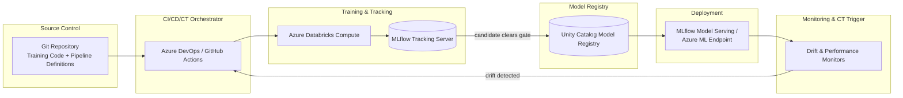
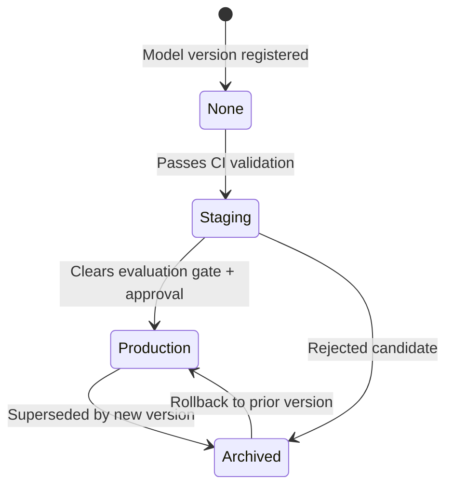

# MLOps and MLflow

> Part of the **Enterprise Data & AI Architecture Handbook** · Phase-11 — AI Platform Engineering & MLOps · Chapter 03.
> Estimated study time: **75 min reading + ~5h labs**.
> **Prerequisites:** read [DevOps and CI/CD](../Phase-09/03_DevOps_and_CI_CD.md) and [Machine Learning Foundations](01_Machine_Learning_Foundations.md) first.

---

## Executive Summary

[Machine Learning Foundations](01_Machine_Learning_Foundations.md#15-the-end-to-end-ml-lifecycle) §1.5 sketched the ML lifecycle as a closed loop — data, features, training, evaluation, registry, serving, monitoring, retraining — and named experiment tracking and the model registry as the capabilities that make stages 3-5 reproducible and auditable. [Feature Stores with Feast](02_Feature_Stores_with_Feast.md) then industrialized the feature layer. This chapter industrializes everything downstream of it: **MLOps** is [DevOps and CI/CD](../Phase-09/03_DevOps_and_CI_CD.md)'s build/test/deploy discipline extended with two concerns DevOps was never designed for — data and model versioning alongside code, and **continuous training (CT)**, the automated retraining trigger that has no equivalent in conventional software delivery.

This chapter covers **experiment tracking and reproducibility** as the mechanism that answers "which exact code, data, and hyperparameters produced this model" without ambiguity; the **model registry and stage transitions** as the governance checkpoint that turns a trained artifact into a deployable, auditable, versioned asset; **CI/CD/CT for models** as the extension of [DevOps and CI/CD](../Phase-09/03_DevOps_and_CI_CD.md)'s pipeline discipline to cover model validation gates and automated retraining triggers; **MLflow on Azure Databricks** as this chapter's primary concrete implementation; and **model lineage and governance** as the audit trail connecting a production prediction back through its model version, training run, dataset version, and code commit.

The bias remains **Azure-primary (~60%)** — Azure Databricks' managed MLflow tracking server and Unity Catalog model registry, Azure DevOps/GitHub Actions pipelines orchestrating model CI/CD — **~30% enterprise open source** (MLflow as the tracking/registry/deployment standard, Git for code versioning, Delta Lake for data versioning) and **~10% AWS/GCP comparison-only** (SageMaker Experiments/Model Registry, Vertex AI Experiments/Model Registry).

**Bottom line:** MLOps is not "DevOps with a model file instead of a binary" — it is DevOps plus two entirely new versioning axes (data and model) plus a feedback loop (continuous training) that conventional software delivery has no analog for, and MLflow is the de facto open standard that gives an organization a vendor-neutral way to implement all three axes consistently across every model team.

---

## Learning Objectives

By the end of this chapter you will be able to:

1. **Design an experiment-tracking strategy** using MLflow that captures code, data, hyperparameter, and metric provenance for every training run.
2. **Architect a model registry workflow** with defined stage transitions (staging/production/archived) and promotion gates.
3. **Extend a CI/CD pipeline into CI/CD/CT for models**, adding model-specific validation gates and automated retraining triggers.
4. **Implement MLflow on Azure Databricks**, using managed tracking, the Unity Catalog model registry, and MLflow Model Serving/deployment.
5. **Establish model lineage and governance** sufficient to answer an audit question about any production prediction's provenance.
6. **Apply MLOps practices on Azure** with a defensible comparison to AWS SageMaker and GCP Vertex AI equivalents.
7. **Defend MLOps architecture decisions** in engineer, staff engineer, architect, and CTO review settings, including the trade-off between deployment velocity and governance rigor.

---

## Business Motivation

- **Reproducibility failures are a direct, recurring cost.** Without experiment tracking, "which model is actually in production, and what exactly produced it" frequently has no confident answer — a state that turns every production incident investigation and every regulatory audit request into slow, manual archaeology instead of a lookup.
- **Untracked experimentation wastes compute and calendar time.** Teams without a tracking server routinely retrain configurations they have already tried (because no record of the prior attempt survives past someone's local notebook), directly compounding the training-compute cost discussed in [Machine Learning Foundations](01_Machine_Learning_Foundations.md#cost-optimization-finops).
- **Manual model promotion is slow and inconsistent.** Without a registry-based stage-transition workflow, promoting a model to production depends on ad hoc file copying and tribal knowledge of "which one is the real one," directly increasing both time-to-production and the risk of the wrong artifact reaching production.
- **Model quality silently degrades without continuous training.** A model trained once and never revisited drifts away from a changing world exactly as [Machine Learning Foundations](01_Machine_Learning_Foundations.md#16-monitoring) §1's Monitoring section warned; CI/CD/CT closes this by making retraining a scheduled, automated, gated pipeline stage rather than a manually-remembered chore.
- **Regulatory and audit exposure compounds without model lineage.** Being able to answer "what data and code produced the model that made this specific decision" is, in regulated industries, frequently a hard audit requirement, directly connecting to [Compliance and Regulatory Frameworks](../Phase-10/06_Compliance_and_Regulatory_Frameworks.md) — and is entirely infeasible without the tracking and registry discipline this chapter formalizes.

---

## History and Evolution

- **2015-2017 — the "reproducibility crisis" in applied ML** (unreproducible notebooks, undocumented hyperparameters, silently different data snapshots) becomes a widely recognized, named problem across both academic and industry ML practice, directly motivating the tooling this chapter covers.
- **2018 — MLflow is released by Databricks** as an open-source project explicitly designed to solve tracking, packaging, and registry problems in a framework-agnostic way (not tied to any specific ML library), rapidly becoming the de facto open standard rather than one vendor's proprietary tool.
- **2019 — the MLflow Model Registry is added**, introducing formal stage transitions (staging/production/archived) and giving teams their first open-source, vendor-neutral model-governance workflow.
- **2018-2020 — "MLOps" is coined and popularized** as a deliberate DevOps/[DataOps](../Phase-09/01_DataOps_Foundations.md) analogy, formalizing the idea that ML delivery deserves the same CI/CD rigor as conventional software, plus the data/model-versioning and continuous-training extensions conventional DevOps never needed.
- **2020-2021 — managed MLflow offerings launch across major platforms**: Azure Databricks' managed MLflow tracking server and, later, Unity Catalog-integrated model registry; AWS SageMaker's MLflow-compatible tracking; and comparable capabilities across GCP Vertex AI — signaling MLOps' transition from "advanced practice" to "expected platform capability," mirroring the same maturity curve [Machine Learning Foundations](01_Machine_Learning_Foundations.md#history-and-evolution) described for the broader ML lifecycle.
- **2022-present — continuous training (CT) matures as a distinct pipeline discipline**, moving retraining from a manually-triggered notebook re-run to an automated, drift-triggered pipeline stage, directly closing the feedback loop [Machine Learning Foundations](01_Machine_Learning_Foundations.md#15-the-end-to-end-ml-lifecycle) §1.5 described as the lifecycle's defining property.
- **2023-present — Unity Catalog absorbs the MLflow Model Registry** on Azure Databricks, unifying data, feature (per [Feature Stores with Feast](02_Feature_Stores_with_Feast.md)), and model governance under one catalog and access-control surface rather than three separate systems.

---

## Why This Technology Exists

MLOps exists because a trained model is not a static software artifact the way a compiled binary is — it is the joint product of code, a specific dataset snapshot, and a set of hyperparameters, and its correctness cannot be verified by code review alone the way a conventional software change can. [DevOps and CI/CD](../Phase-09/03_DevOps_and_CI_CD.md)'s build/test/deploy pipeline is necessary but insufficient for this: it has no native concept of "which dataset version," no native concept of "did this model's offline evaluation actually improve," and no native concept of "the world changed, so this model needs to be retrained even though no code changed." MLOps and MLflow exist specifically to extend the CI/CD discipline with these three ML-specific dimensions — data/model versioning, evaluation-gated promotion, and continuous training — that conventional software delivery tooling was never built to handle.

---

## Problems It Solves

- **"Which exact run produced this model" ambiguity** — experiment tracking (§3.1) records code version, data version, hyperparameters, and metrics for every run, giving a definitive, non-anecdotal answer.
- **Slow, inconsistent, and error-prone model promotion** — a registry-based stage-transition workflow (§3.2) replaces ad hoc file copying with a versioned, auditable, gate-enforced promotion process, directly implementing the champion/challenger gate from [Machine Learning Foundations](01_Machine_Learning_Foundations.md#interview-questions) ADR-0148.
- **Manual, easily-forgotten retraining** — CI/CD/CT (§3.3) automates the retraining trigger, closing the monitoring-to-retraining feedback loop [Machine Learning Foundations](01_Machine_Learning_Foundations.md#15-the-end-to-end-ml-lifecycle) §1.5 described as the lifecycle's defining closed-loop property.
- **Fragmented, tool-specific tracking across teams** — MLflow's framework-agnostic design (§3.4) gives every team (scikit-learn, XGBoost, PyTorch, Spark ML) a single, consistent tracking and registry interface regardless of the underlying training library.
- **Audit and regulatory lineage gaps** — model lineage and governance (§3.5) gives every production prediction a traceable path back to its originating run, dataset, and code commit.

---

## Problems It Cannot Solve

- **It cannot make a poorly designed model good.** MLOps guarantees that whatever model was trained is reproducible and traceable; it does not improve the underlying modeling quality covered in [Machine Learning Foundations](01_Machine_Learning_Foundations.md#core-concepts).
- **It cannot substitute for the evaluation-metric rigor from [Machine Learning Foundations](01_Machine_Learning_Foundations.md#12-training-validation-and-evaluation-metrics) §1.2.** A registry promotion gate is only as good as the metric and threshold it enforces; MLOps provides the *mechanism* for gating, not the judgment of *what* to gate on.
- **It cannot eliminate the operational cost of running a tracking server and registry.** Someone must operate (or consume a managed version of) the MLflow tracking backend, and this is a genuine, ongoing platform cost, not a one-time setup.
- **It cannot fully automate continuous training's safety.** An automated retraining pipeline that runs without a human-reviewable promotion gate (§3.2's champion/challenger check) removes an essential safety net — CI/CD/CT automates the *mechanics* of retraining, it does not remove the need for the evaluation gate that decides whether the retrained model is actually better.
- **It cannot resolve organizational process gaps on its own.** A tracking server and registry that exist but are inconsistently used across teams (some teams still training in untracked notebooks) deliver only a fraction of their intended governance value — tooling adoption still requires an enforced organizational practice, covered in §3.Enterprise Recommendations.

---

## Core Concepts

### 3.1 Experiment Tracking and Reproducibility

- **An MLflow run captures four categories of provenance for a single training execution**: parameters (hyperparameters, algorithm configuration), metrics (the evaluation results from [Machine Learning Foundations](01_Machine_Learning_Foundations.md#12-training-validation-and-evaluation-metrics) §1.2, logged per step or as final values), artifacts (the serialized model, plots, and any other output files), and tags/metadata (code version/Git commit hash, the executing user, the compute environment).
- **Autologging removes the burden of manually instrumenting every training script**: MLflow's autologging integrations (for scikit-learn, XGBoost, LightGBM, PyTorch, and Spark MLlib) automatically capture standard parameters and metrics with a single enabling call, reducing the "I forgot to log this run properly" failure mode to near zero for supported frameworks.
- **Reproducibility requires code, data, and environment versioning together, not any one alone**: a run's logged Git commit hash addresses code versioning; a logged reference to the specific Delta Lake table version or [Feature Stores with Feast](02_Feature_Stores_with_Feast.md) feature-view version addresses data versioning; and a logged, pinned dependency environment (a conda/pip environment specification captured alongside the run) addresses the "it worked on my machine" environment-drift failure mode — omitting any one of these three leaves a run only partially reproducible.
- **Nested runs and parent/child run hierarchies** organize a hyperparameter sweep (many child runs) under one parent experiment, giving a structured way to compare dozens-to-hundreds of configurations without losing the overview a flat list of runs would obscure.
- **The tracking server is the backing store, not merely a UI**: MLflow's tracking server persists run metadata to a backend store (a database) and artifacts to an artifact store (object storage), meaning tracking data survives independently of any individual data scientist's notebook session or local machine.

### 3.2 Model Registry and Stage Transitions

- **The model registry is a versioned catalog of registered models**, distinct from the raw experiment-tracking run history — a model is explicitly *registered* (promoted from "a training run happened" to "this is a named, versioned, deployable model") as a deliberate step, not an automatic side effect of every run.
- **Stage transitions formalize the promotion lifecycle**: a newly registered model version typically starts in a "None" or "Staging" stage, moves to "Production" only after clearing the evaluation gate (the champion/challenger check from [Machine Learning Foundations](01_Machine_Learning_Foundations.md#interview-questions) ADR-0148), and moves to "Archived" when superseded — giving every model version an explicit, auditable current status rather than an implicit "whatever file is deployed right now."
- **Each registered model version retains a link back to the training run that produced it**, meaning the registry is not a disconnected artifact store — from any registered version, an engineer can trace back to the exact parameters, metrics, and data/code versions from §3.1.
- **Unity Catalog's model registry (the Azure Databricks-native evolution of the original MLflow Model Registry) unifies model governance with data and feature governance** under one access-control and catalog surface, meaning a model's registry entry inherits the same grant-based access control as the Delta tables and feature views ([Feature Stores with Feast](02_Feature_Stores_with_Feast.md)) it was trained from.
- **Promotion should be gated by an automated check, not a manual "this looks good" judgment**: the registry stage-transition step is the mechanical enforcement point for the champion/challenger evaluation gate — a stage transition to "Production" should be blocked programmatically, not merely discouraged by convention, if the candidate does not clear the agreed metric threshold.

### 3.3 CI/CD/CT for Models

- **CI (Continuous Integration) for models** extends [DevOps and CI/CD](../Phase-09/03_DevOps_and_CI_CD.md)'s build/test stages with ML-specific checks: unit tests for feature transformation logic, data-schema validation against the expected training-data contract, and a smoke-test training run on a small data sample to catch broken training code before a full-scale run is attempted.
- **CD (Continuous Delivery/Deployment) for models** extends the same pipeline's deploy stage with model-specific promotion: a registered model version passing its evaluation gate (§3.2) triggers a deployment to a serving endpoint (Phase-11 Chapter 04), following the same blue-green/canary release patterns [DevOps and CI/CD](../Phase-09/03_DevOps_and_CI_CD.md) established for conventional services.
- **CT (Continuous Training) is the capability with no direct conventional-DevOps analog**: a scheduled or drift-triggered pipeline run that re-executes the training stage automatically — triggered either on a fixed schedule (e.g., weekly retraining) or by the drift-detection signal from [Machine Learning Foundations](01_Machine_Learning_Foundations.md#16-monitoring) §1's Monitoring section — closing the feedback loop from monitoring back to retraining that §1.5's lifecycle diagram depends on.
- **Every CT-triggered retraining run must still pass through the same CI validation and CD promotion gate as a manually-initiated run** — automating the *trigger* for retraining must not bypass the evaluation gate that decides whether the newly retrained model actually deserves promotion; an automated pipeline that promotes every retrained model unconditionally reintroduces exactly the ungated-promotion risk [Machine Learning Foundations](01_Machine_Learning_Foundations.md#interview-questions) ADR-0148 was designed to close.
- **Pipeline-as-code for the full CI/CD/CT sequence** (an Azure DevOps YAML pipeline or GitHub Actions workflow orchestrating data validation → training → evaluation → registration → deployment, potentially calling out to Azure Databricks Workflows or Airflow for the compute-heavy training stage) gives the same reviewable, versioned pipeline-definition discipline [Infrastructure as Code with Terraform](../Phase-09/04_Infrastructure_as_Code_with_Terraform.md) established for infrastructure, now applied to the model lifecycle itself.

### 3.4 MLflow on Azure Databricks

- **Azure Databricks provides a fully managed MLflow tracking server** as a workspace-native capability — no separate tracking-server infrastructure to provision or operate, with runs automatically visible in the Databricks workspace UI alongside the notebooks and jobs that produced them.
- **The managed tracking server's backend store and artifact store are both handled by the platform**: run metadata is stored in Databricks-managed infrastructure, and artifacts are stored in the workspace's default DBFS/ADLS Gen2-backed location (or a customer-managed location for stricter data-residency control), removing the operational burden of standing up and maintaining a self-hosted PostgreSQL backend and object-storage artifact store.
- **Unity Catalog-integrated model registry** replaces the original standalone MLflow Model Registry on Azure Databricks, giving registered models the same three-level (catalog.schema.model) namespacing, grant-based access control, and lineage graph as tables and feature views ([Feature Stores with Feast](02_Feature_Stores_with_Feast.md)) — a model registered here is a first-class Unity Catalog object, not a separately governed artifact.
- **MLflow Model Serving (Databricks-managed real-time endpoints)** deploys a registered model version directly to a scalable, managed serving endpoint from the registry UI/API, the Databricks-native on-ramp into the fuller serving architecture Phase-11 Chapter 04 covers.
- **Databricks Workflows (or an external orchestrator, see [Orchestration with Airflow](../Phase-09/07_Orchestration_with_Airflow.md)) drive the CT trigger** (§3.3), scheduling or event-triggering the notebook/job that re-executes training, logs a new MLflow run, and (if it clears the evaluation gate) transitions a new model version to Production.

### 3.5 Model Lineage and Governance

- **End-to-end lineage connects five artifacts**: the code commit (Git), the dataset/feature version ([Feature Stores with Feast](02_Feature_Stores_with_Feast.md)), the training run (MLflow tracking, §3.1), the registered model version (§3.2), and the deployed serving endpoint (Phase-11 Chapter 04) — an audit-ready platform can traverse this chain in either direction for any production prediction.
- **Model governance requires an explicit, accountable owner per registered model**, the model-specific instance of the ownership discipline [Machine Learning Foundations](01_Machine_Learning_Foundations.md#governance) established generally, with a documented evaluation report and promotion approval trail attached to every Production-stage transition.
- **Regulatory and audit defensibility depends on this lineage being queryable, not merely theoretically reconstructable** — being able to answer "what data and code trained the model that made this specific decision" within minutes, not days of manual log archaeology, is what actually satisfies an audit request, directly connecting to [Compliance and Regulatory Frameworks](../Phase-10/06_Compliance_and_Regulatory_Frameworks.md).
- **Fairness and bias review gates attach to this same lineage chain**: the Responsible AI review (Phase-11 Chapter 07) that must occur before production promotion is itself recorded against the specific registered model version it evaluated, not left as a disconnected, hard-to-locate compliance document.
- **Model lineage must also cover deprecation and rollback**: knowing which model version preceded the current production version (and being able to roll back to it cleanly via the registry's stage-transition history) is as much a governance requirement as promotion itself, directly supporting the graceful-degradation fault-tolerance pattern from [Machine Learning Foundations](01_Machine_Learning_Foundations.md#fault-tolerance).

---

## Internal Working

**How a CI/CD/CT pipeline run actually executes end to end** (the mechanics tying together §3.1-3.3):

1. **Trigger**: a code commit (CI), a schedule, or a drift-detection alert (CT) initiates the pipeline.
2. **Data and feature validation**: the pipeline first validates the training dataset against its expected schema/quality contract ([Data Quality with Great Expectations](../Phase-08/03_Data_Quality_with_Great_Expectations.md)) and resolves the feature views to use ([Feature Stores with Feast](02_Feature_Stores_with_Feast.md)), failing fast if either check does not pass.
3. **Training execution with autologging enabled**: the training job runs on Azure Databricks compute, with MLflow autologging capturing parameters, metrics, and artifacts for the resulting run automatically.
4. **Evaluation against the current production champion**: the newly trained candidate is evaluated on the same held-out data as the current Production-stage model, using the metric and threshold agreed for that use case (per [Machine Learning Foundations](01_Machine_Learning_Foundations.md#12-training-validation-and-evaluation-metrics) §1.2).
5. **Conditional registration and stage transition**: if the candidate clears the threshold, it is registered as a new model version and transitioned to "Staging" (and, depending on the organization's approval process, either automatically or after human sign-off, to "Production"); if it does not clear the threshold, the run's results are logged and no promotion occurs.
6. **Deployment**: a Production-stage transition triggers (via a webhook or a subsequent pipeline stage) deployment to the serving endpoint, following the blue-green/canary patterns from [DevOps and CI/CD](../Phase-09/03_DevOps_and_CI_CD.md).
7. **Monitoring feeds the next trigger**: the deployed model's live performance and drift signals (per [Machine Learning Foundations](01_Machine_Learning_Foundations.md#16-monitoring) §1's Monitoring section) are what eventually re-trigger step 1 via the CT path, closing the loop.

This sequence is identical in structure to a conventional CI/CD pipeline with two ML-specific insertions: the data/feature validation step (step 2, with no analog in conventional software CI) and the evaluation-gated conditional promotion (steps 4-5, materially different from a conventional pipeline's pass/fail unit-test gate because it compares against a *moving target* — the current production champion — rather than a fixed specification.

---

## Architecture

- **Source control layer**: Git repository holding training code, feature-transformation logic, and pipeline-as-code definitions, following the same trunk-based/branching conventions as [DevOps and CI/CD](../Phase-09/03_DevOps_and_CI_CD.md).
- **Orchestration layer**: Azure DevOps Pipelines or GitHub Actions, driving the overall CI/CD/CT sequence and invoking Azure Databricks Workflows (or Airflow, per [Orchestration with Airflow](../Phase-09/07_Orchestration_with_Airflow.md)) for the compute-heavy training stage.
- **Experiment tracking layer**: Azure Databricks' managed MLflow tracking server, recording every run's parameters, metrics, artifacts, and provenance tags.
- **Model registry layer**: Unity Catalog's model registry, holding versioned, stage-tagged, access-controlled registered models.
- **Deployment layer**: MLflow Model Serving (Databricks-managed) or a custom AKS/Azure ML endpoint (Phase-11 Chapter 04), receiving Production-stage model versions.
- **Monitoring and feedback layer**: drift and performance monitors feeding the CT trigger back into the orchestration layer.

---

## Components

- **Tracking server** — the MLflow backend recording run metadata (parameters, metrics, tags) and coordinating artifact storage.
- **Artifact store** — object storage (ADLS Gen2/DBFS) holding serialized model files, plots, and other run outputs.
- **Backend store** — the database (managed by Databricks, or self-hosted PostgreSQL/Azure SQL for a self-managed MLflow deployment) persisting run and registry metadata.
- **Model registry** — the versioned, stage-tagged catalog of registered models, Unity Catalog-integrated on Azure Databricks.
- **CI/CD orchestrator** — Azure DevOps/GitHub Actions, sequencing validation, training, evaluation, registration, and deployment stages.
- **Evaluation/promotion gate** — the automated champion/challenger check (§3.2) blocking or allowing a stage transition to Production.
- **CT trigger** — the scheduler or drift-alert consumer initiating a new pipeline run without a code change.
- **Serving endpoint** — the deployment target receiving Production-stage models, deepened in Phase-11 Chapter 04.

---

## Metadata

- **Run metadata**: parameters, metrics, tags (Git commit, user, environment), start/end time, and parent/child run relationships — the full experiment-tracking provenance from §3.1.
- **Model version metadata**: registered model name, version number, current stage, source run ID, and a human-readable description/changelog entry for what changed relative to the prior version.
- **Deployment metadata**: which model version is currently serving each named endpoint, the deployment timestamp, and the deployment approval record (who/what approved the Production transition).
- **Lineage metadata**: the full chain from serving endpoint back through model version, run, dataset/feature version, and code commit — the queryable structure §3.5's governance requirement depends on.

---

## Storage

- **Tracking backend store**: a managed database (Databricks-operated on Azure Databricks; PostgreSQL/Azure SQL for a self-managed MLflow deployment) holding run and registry relational metadata.
- **Artifact store**: ADLS Gen2 (via DBFS on Azure Databricks, or direct ADLS Gen2 access for a self-managed MLflow deployment), holding the actual serialized model files and other run artifacts — the same storage substrate as the offline feature store from [Feature Stores with Feast](02_Feature_Stores_with_Feast.md), simplifying the platform's overall storage footprint.
- **Model artifact versioning**: each registered model version's artifact is immutably stored and referenced by its run ID, ensuring a rollback to a prior model version retrieves the exact artifact that was previously in production, not a re-derived approximation.

---

## Compute

- **Training compute**: Azure Databricks job clusters (auto-scale-to-zero), the same compute profile discussed in [Machine Learning Foundations](01_Machine_Learning_Foundations.md#compute).
- **CI/CD pipeline agent compute**: Azure DevOps/GitHub Actions runners executing the orchestration logic itself (lightweight, since the heavy training compute is delegated to Databricks) — these do not need GPU/high-memory provisioning, only enough to invoke and monitor the Databricks job.
- **Tracking server compute**: fully managed and abstracted away on Azure Databricks; a self-managed MLflow tracking server requires its own always-on (though typically modest) compute to serve the tracking API continuously.
- **Serving compute**: provisioned separately per Phase-11 Chapter 04's serving architecture, decoupled from training/tracking compute entirely.

---

## Networking

- **Private endpoints for the tracking server and artifact store** keep experiment data and model artifacts off the public internet, consistent with [Network Security and Zero Trust](../Phase-10/04_Network_Security_and_Zero_Trust.md).
- **CI/CD orchestrator connectivity to Azure Databricks** should use a private service connection (Azure DevOps service endpoint or GitHub Actions OIDC-federated identity) rather than a broadly-scoped personal access token embedded in pipeline configuration.
- **Registry-to-serving-endpoint connectivity** for automated deployment (§3.3's CD stage) should traverse the same private network path as any other production deployment, per [DevOps and CI/CD](../Phase-09/03_DevOps_and_CI_CD.md)'s deployment networking conventions.

---

## Security

- **Pipeline authentication should use managed identities or workload identity federation** (Azure DevOps service connections, GitHub Actions OIDC) rather than embedded secrets, consistent with [Identity and Access Management with Entra](../Phase-10/02_Identity_and_Access_Management_with_Entra.md).
- **Registry access control via Unity Catalog grants** ensures only authorized principals can register new model versions or transition a model to Production — a registry that any workspace user can freely promote to is a governance and security gap, not merely an inconvenience.
- **Artifact store access should be scoped to the tracking server's service identity**, not broadly granted to every data scientist's individual account, limiting the blast radius if an individual credential is compromised.
- **Secrets required during training or deployment (API keys, database connection strings) should be sourced from Key Vault** (per [Secrets and Key Management](../Phase-10/05_Secrets_and_Key_Management.md)) via Databricks secret scopes, never hardcoded into a notebook or pipeline definition.

---

## Performance

- **Tracking overhead should be negligible relative to training time** — logging parameters and metrics via autologging adds a small, constant overhead per run, not a scaling concern even for long-running training jobs.
- **Artifact upload time for large models** (particularly large deep-learning checkpoints) can become a meaningful fraction of a training job's wall-clock time if the artifact store connection is not co-located with the training compute — the same region/network co-location guidance from [Machine Learning Foundations](01_Machine_Learning_Foundations.md#networking) applies here.
- **Registry query performance** (listing versions, resolving the current Production model) is typically not a bottleneck at normal enterprise scale, but a registry with many thousands of unpruned experimental runs can slow UI/API responsiveness, motivating the run-retention hygiene covered in §3.16 Cost Optimization.
- **CI/CD pipeline latency** (time from commit/trigger to a deployed, promoted model) is the end-to-end metric that matters most to the business — profiling should identify whether training compute, evaluation, or the orchestration/approval overhead itself dominates that latency before optimizing the wrong stage.

---

## Scalability

- **The tracking server must scale with the number of concurrent training runs across the organization**, not just one team's usage — a shared, managed tracking server (Azure Databricks' offering) scales this concern away from individual teams; a self-managed MLflow deployment must be sized and load-tested for organization-wide concurrent run volume.
- **The registry must scale with the number of registered models across teams**, requiring the same namespacing and discovery discipline (Unity Catalog's catalog.schema.model hierarchy) that [Feature Stores with Feast](02_Feature_Stores_with_Feast.md) applied to feature views.
- **CI/CD pipeline concurrency**: many teams triggering training pipelines simultaneously requires the orchestrator (Azure DevOps/GitHub Actions) and the underlying Databricks Workflows capacity to support genuine parallel execution, not a queued, serialized bottleneck.
- **CT trigger fan-out**: as the number of models under continuous training grows, the scheduling/drift-monitoring infrastructure driving CT triggers must scale accordingly — a single, unscaled cron-like scheduler checking hundreds of models sequentially can itself become the bottleneck limiting how quickly the organization can react to drift.

---

## Fault Tolerance

- **A failed training run should not leave the registry or tracking server in an inconsistent state** — MLflow's run-lifecycle model (a run is explicitly marked FAILED, not left silently incomplete) supports building pipeline logic that correctly detects and handles a failed run rather than mistakenly promoting a partial result.
- **Pipeline retry logic should be idempotent**, following the same idempotency discipline as any other pipeline stage covered in [DataOps Foundations](../Phase-09/01_DataOps_Foundations.md) — a retried training run should not create duplicate registry entries or corrupt tracking metadata.
- **Registry rollback is the primary fault-tolerance mechanism for a bad production promotion**: because every prior model version remains in the registry (Archived, not deleted), rolling back to the previous Production version is a fast, well-understood registry stage-transition operation, not an emergency re-training exercise.
- **Tracking server and artifact store availability directly gates the ability to train new models at all** — an outage in either blocks the entire CI/CD/CT pipeline's training stage, making the managed, Databricks-operated tracking server's own SLA a meaningful platform dependency to understand and plan around.

---

## Cost Optimization (FinOps)

- **Experiment run retention policy**: unbounded retention of every exploratory run (including abandoned hyperparameter-sweep attempts) accumulates artifact storage cost indefinitely; a retention policy that archives or deletes low-value experimental runs after a defined period, while permanently retaining runs tied to any Production-stage registered model, controls this cost without losing governance-critical history.
- **CT trigger frequency tuning**: retraining on an aggressive fixed schedule (e.g., hourly) when the underlying data/concept drift actually occurs on a much slower cadence wastes training compute; tuning the CT schedule (or, better, triggering purely on a detected drift signal rather than a fixed calendar schedule) directly reduces unnecessary retraining cost.
- **Managed vs. self-hosted tracking server cost trade-off**: Azure Databricks' managed MLflow tracking removes the operational cost of running a dedicated tracking-server compute/database continuously, a direct FinOps and operational-burden win for most organizations relative to self-hosting.
- **Artifact storage tiering**: older, non-Production, non-recently-accessed model artifacts can move to a cooler ADLS Gen2 storage tier, reducing storage cost for the long tail of archived experimental history without deleting it outright.

**Worked FinOps example**: An organization's fraud-detection model is retrained on a fixed hourly CT schedule "to be safe," even though the underlying transaction-pattern drift the model is sensitive to meaningfully shifts only over a period of roughly one to two weeks. At an estimated $12 in compute cost per retraining run (data validation + training + evaluation), hourly retraining costs roughly 24 × 30 × $12 ≈ **$8,640/month**. Switching to a drift-triggered CT schedule (retraining only when the feature-distribution drift monitor from [Machine Learning Foundations](01_Machine_Learning_Foundations.md#16-monitoring) actually fires, observed to occur roughly 3-4 times per month for this use case) reduces retraining cost to roughly 4 × $12 ≈ **$48/month** — a greater than 99% reduction in retraining compute cost, with no measurable increase in the time between a real drift event occurring and the model being retrained to address it, since the trigger is now the actual drift signal rather than an arbitrary fixed interval.

---

## Monitoring

- **Pipeline run monitoring**: CI/CD/CT pipeline success/failure rate, stage duration, and failure-reason breakdown, surfaced via Azure DevOps/GitHub Actions' native run history alongside Databricks job monitoring.
- **Registry promotion monitoring**: rate of candidate models clearing vs. failing the evaluation gate, a useful signal for whether the gate's threshold is well-calibrated (a gate that almost nothing ever fails may be too lenient; a gate that almost nothing ever clears may be miscalibrated or reflect a genuinely difficult modeling problem worth escalating).
- **CT trigger monitoring**: frequency and cause (scheduled vs. drift-triggered) of retraining runs, tracked against the FinOps tuning consideration in §3.16.
- **End-to-end lead-time monitoring**: time from a code commit or a detected drift signal to a deployed, promoted model — the single metric that most directly reflects the CI/CD/CT pipeline's business value.

---

## Observability

- **Unified dashboards correlating pipeline stage duration, evaluation-gate outcomes, and downstream model-serving performance** in one view, so a platform engineer diagnosing a slow or failing pipeline is not forced to cross-reference three separate tools.
- **Structured, queryable lineage** (§3.5) is itself an observability capability — being able to trace a production incident back through the deployment → model version → run → dataset chain in minutes is what makes root-cause analysis for an ML-driven incident tractable at all.
- **Alerting on pipeline-stage anomalies** (an unusually long training duration, an evaluation-gate pass rate dropping sharply) surfaces emerging problems before they manifest as a production incident.

### Operational Response Playbook

| Signal | Detection Query/Check | Remediation |
|---|---|---|
| **A CT-triggered retraining run repeatedly fails to clear the evaluation gate** (candidate never beats the champion across several consecutive scheduled/drift-triggered attempts) | Registry promotion-history query filtered to the affected model, reviewed against the drift-monitor signal history from [Machine Learning Foundations](01_Machine_Learning_Foundations.md#16-monitoring) | Do not lower the evaluation threshold to force a promotion; instead treat repeated gate failures as a signal that the feature set or modeling approach itself needs revisiting — escalate to the owning model team as a modeling investigation, not a pipeline configuration issue |
| **Pipeline lead time (commit/trigger to deployed model) increases sharply relative to its historical baseline** | CI/CD orchestrator run-duration history, broken down by stage (data validation, training, evaluation, registration, deployment) | Identify the specific stage responsible before broadly adding compute; a data-validation-stage slowdown often traces to an upstream data-quality issue ([Data Quality with Great Expectations](../Phase-08/03_Data_Quality_with_Great_Expectations.md)), not a pipeline infrastructure problem |

---

## Governance

- **Every registered model requires a documented owner and an approved evaluation report** as a condition of a Production-stage transition, the model-registry-level enforcement of the governance principle established in [Machine Learning Foundations](01_Machine_Learning_Foundations.md#governance).
- **Promotion approval trails must be retained and queryable**, satisfying both internal change-management review and external regulatory audit (per [Compliance and Regulatory Frameworks](../Phase-10/06_Compliance_and_Regulatory_Frameworks.md)) without requiring a bespoke reconstruction effort for each audit request.
- **Fairness/bias review must be attached to the specific model version it evaluated** (Phase-11 Chapter 07), not maintained as a disconnected compliance artifact that could plausibly apply to any version of the model.
- **CT must not bypass governance**: an automated retraining pipeline that skips the same promotion-approval and evaluation-gate requirements a manually-triggered training run would face reintroduces exactly the ungated-promotion risk this chapter's ADR addresses.

---

## Trade-offs

- **Fully automated CT-to-Production promotion vs. human-in-the-loop approval**: full automation minimizes time-to-production for a legitimately improved model but removes a human safety check for high-stakes or regulated use cases; many organizations resolve this by automating CI/CD/CT fully up through Staging, while requiring explicit human sign-off only for the final Staging-to-Production transition.
- **Managed (Azure Databricks) vs. self-hosted MLflow**: the managed offering trades some configuration flexibility for materially reduced operational burden, mirroring the same managed-vs-self-hosted trade-off [Machine Learning Foundations](01_Machine_Learning_Foundations.md#trade-offs) described for the broader ML platform.
- **Aggressive CT scheduling vs. drift-triggered CT**: a fixed aggressive schedule guarantees the model is never far out of date at the cost of significant unnecessary retraining compute (§3.16's worked example); drift-triggered CT is more cost-efficient but requires a well-tuned, trustworthy drift-detection signal to avoid missing a real degradation between checks.
- **Strict registry governance vs. team velocity**: a heavily gated, approval-required promotion process maximizes auditability and safety but can slow an individual team's iteration speed on a low-stakes, non-regulated model — the same governance-vs-autonomy tension [Feature Stores with Feast](02_Feature_Stores_with_Feast.md) §2.24 raised for feature governance, resolvable with a similarly tiered approach (lighter gates for experimental/low-stakes models, full gates for regulated/high-stakes ones).

---

## Decision Matrix

| Scenario | Recommended Approach | Rationale |
|---|---|---|
| Organization already standardized on Azure Databricks | Managed MLflow tracking + Unity Catalog model registry | Zero tracking-server operational burden; unified governance with data/feature assets |
| Multi-cloud or platform-neutral requirement | Self-hosted MLflow (PostgreSQL backend, ADLS/S3/GCS artifact store) | Framework- and cloud-agnostic; avoids managed-service lock-in |
| High-stakes/regulated model (credit, healthcare) | CI/CD automated through Staging; mandatory human sign-off for Production transition | Preserves an accountable human decision point for the highest-consequence promotions |
| Low-stakes, fast-iterating experimental model | Fully automated CI/CD/CT through Production, lightweight governance tier | Maximizes iteration velocity where the cost of an occasional suboptimal promotion is low |
| Fixed, well-understood drift cadence (e.g., seasonal retail demand) | Scheduled CT | Predictable, well-understood cadence makes a fixed schedule cost-efficient and simple |
| Volatile, hard-to-predict drift (e.g., fraud pattern shifts) | Drift-triggered CT | Fixed-schedule retraining would either retrain too often (wasteful) or too rarely (risky) relative to actual, irregular drift timing |

---

## Design Patterns

- **Autologging-first instrumentation**: enable framework-native MLflow autologging by default for every training script, adding custom logging only for values autologging does not capture, minimizing the "forgot to log this" failure mode.
- **Registry as the single promotion gate**: every path to production (manual or CT-triggered) passes through the same registry stage-transition mechanism — no "back door" deployment path that bypasses the evaluation gate.
- **Drift-triggered CT with a scheduled fallback ceiling**: trigger retraining primarily on a detected drift signal, but also enforce a maximum time-since-last-retraining ceiling (e.g., "retrain at least quarterly regardless of drift signal") as a safety net against a silently failing or miscalibrated drift monitor.
- **Tiered governance gates by model risk class**: apply lighter-weight (fully automated) gates to low-stakes models and heavier (human-approval-required) gates to high-stakes/regulated ones, rather than a single uniform policy that either over-constrains low-risk work or under-constrains high-risk work.

---

## Anti-patterns

- **Training in untracked, ad hoc notebooks** even after a tracking server is available — the tooling investment delivers zero value if teams do not consistently use it.
- **Promoting a model to Production via manual file copy or a direct API call that bypasses the registry's stage-transition and evaluation-gate mechanism** — reintroduces exactly the ungated-promotion risk MLOps exists to eliminate.
- **CT pipelines that automatically promote every retrained model unconditionally**, without re-running the evaluation gate — silently degrades the production model whenever a retraining run happens to perform worse (e.g., due to a transient data-quality issue) rather than better.
- **Aggressive fixed-schedule CT with no drift-signal justification**, wasting compute budget on retraining that does not correspond to any actual underlying change (§3.16).
- **Deleting or failing to retain experimental run history for models that are later registered to Production** — losing the specific run's provenance right when it becomes governance-critical is a common, avoidable retention-policy mistake.

---

## Common Mistakes

- Forgetting to log the dataset/feature version alongside code and hyperparameters, leaving a run only partially reproducible despite appearing fully tracked.
- Treating the model registry as just an artifact store, without actually enforcing stage-transition gates in the CI/CD pipeline.
- Allowing CT retraining runs a different (looser) evaluation standard than manually-triggered runs, on the assumption that "it's automated, so it's fine."
- Not retaining a rollback path (the previous Production model version) readily available, turning a bad promotion into an emergency retraining exercise instead of a fast registry rollback.
- Under-provisioning the CI/CD orchestrator's connectivity/authentication setup, leading to brittle, manually-patched pipeline credentials instead of a managed-identity-based integration.

---

## Best Practices

- Enable MLflow autologging by default for every training script across every team, with custom logging added only where autologging is insufficient.
- Enforce the evaluation gate as an automated, non-bypassable step in the registry promotion pipeline, applied identically to manual and CT-triggered runs.
- Tune CT trigger strategy (drift-based vs. scheduled) to each model's actual drift characteristics rather than defaulting to a uniform, possibly wasteful fixed schedule.
- Maintain a retention policy that prunes low-value experimental runs while permanently preserving any run tied to a currently or previously Production-stage model version.
- Require an explicit, queryable promotion-approval trail for every Production-stage transition, especially for regulated or high-stakes models.

---

## Enterprise Recommendations

- Standardize on Azure Databricks' managed MLflow tracking and Unity Catalog model registry as the default platform for new Azure-Databricks-centric model teams, reserving self-hosted MLflow for genuine multi-cloud requirements.
- Mandate that every production model's CI/CD/CT pipeline enforces the same evaluation gate regardless of trigger source (manual commit vs. scheduled vs. drift-triggered).
- Establish a tiered governance policy (lightweight for experimental/low-stakes models, full human-approval-gated for regulated/high-stakes ones) rather than a single uniform promotion policy across the entire model portfolio.
- Track CT trigger frequency and evaluation-gate pass/fail rate as platform-level KPIs, using them to continuously tune retraining schedules and validate that gate thresholds remain well-calibrated.

---

## Azure Implementation

- **Azure Databricks managed MLflow tracking server** as the default experiment-tracking backend, requiring no separate infrastructure provisioning.
- **Unity Catalog model registry** for versioned, access-controlled, stage-tagged model governance, unified with the data and feature governance from [Feature Stores with Feast](02_Feature_Stores_with_Feast.md).
- **Azure DevOps Pipelines or GitHub Actions** orchestrating the CI/CD/CT sequence, invoking Azure Databricks Workflows for training and evaluation stages.
- **MLflow Model Serving on Azure Databricks** (or Azure ML managed online endpoints, Phase-11 Chapter 05) as the deployment target for Production-stage models.
- **Azure Key Vault-backed Databricks secret scopes** for any credentials the pipeline requires, per [Secrets and Key Management](../Phase-10/05_Secrets_and_Key_Management.md).

---

## Open Source Implementation

- **MLflow** as the framework-agnostic, vendor-neutral tracking, registry, and deployment-packaging standard underlying both the Azure-managed and self-hosted paths.
- **Git** for code versioning, integrated into MLflow's run tags for full code-provenance capture.
- **Delta Lake** for data/feature versioning (via Delta's native time-travel version numbers), referenced from MLflow run tags to close the data-versioning gap in reproducibility (§3.1).
- **Airflow or Databricks Workflows** for orchestrating the compute-heavy training and evaluation stages within the broader CI/CD/CT pipeline.

---

## AWS Equivalent (comparison only)

- **Amazon SageMaker Experiments and SageMaker Model Registry** provide the direct equivalents of MLflow tracking and the model registry, with SageMaker Pipelines providing the CI/CD/CT orchestration layer; SageMaker also supports MLflow-compatible tracking natively for teams wanting to retain MLflow's API surface.
- **Advantages**: deep integration with the broader SageMaker training/serving ecosystem for AWS-centric teams.
- **Disadvantages**: a materially different registry and pipeline-definition model than Unity Catalog's model registry, meaning genuine re-platforming effort for a migration, consistent with the broader SageMaker comparison in [Machine Learning Foundations](01_Machine_Learning_Foundations.md#aws-equivalent-comparison-only).
- **Migration strategy**: MLflow-tracked run history and MLflow-format model artifacts (a portable, open packaging format) migrate with the least friction; SageMaker-registry-native promotion workflows require rebuilding against SageMaker Pipelines' APIs.
- **Selection criteria**: choose SageMaker when the broader ML estate is AWS-centric; otherwise this chapter's Azure-primary recommendation applies.

---

## GCP Equivalent (comparison only)

- **Google Vertex AI Experiments and Vertex AI Model Registry** provide the equivalent tracking and registry capability, with Vertex AI Pipelines (built on Kubeflow Pipelines) providing CI/CD/CT orchestration.
- **Advantages**: strong fit for BigQuery/GCP-centric data estates, consistent with the parallel comparison in [Machine Learning Foundations](01_Machine_Learning_Foundations.md#gcp-equivalent-comparison-only).
- **Disadvantages**: the same re-platforming cost pattern as the AWS case relative to Unity Catalog's integrated registry.
- **Migration strategy**: as with AWS, MLflow-format artifacts port more readily than Vertex-AI-registry-native definitions.
- **Selection criteria**: choose Vertex AI when the data estate is BigQuery/GCP-centric; otherwise default to the Azure-primary recommendation.

---

## Migration Considerations

- **MLflow's open, portable model format (MLflow Model flavors) reduces artifact-level lock-in** regardless of which managed tracking/registry backend is used, since the underlying serialized model and its metadata schema remain consistent across Azure Databricks, self-hosted MLflow, and (to a large extent) SageMaker's MLflow-compatible tracking.
- **Registry-native metadata (stage-transition history, approval trails) is the harder-to-migrate part** — Unity Catalog's model-registry-specific metadata and access-control model does not port automatically to another platform's registry, requiring a deliberate re-creation of governance history (or an accepted loss of historical promotion-approval records) during a platform migration.
- **CI/CD pipeline definitions in Azure DevOps YAML or GitHub Actions workflows are themselves code-versioned and relatively portable in structure**, though the specific task/action references to Azure-specific services (Databricks Workflows triggers, Unity Catalog registry APIs) require rewriting against the target platform's equivalent APIs.
- **Re-validate the evaluation gate's behavior after any migration** — ensure the migrated pipeline still correctly retrieves the "current champion" model version and applies the same threshold logic before trusting it in production, the same re-validation discipline [Machine Learning Foundations](01_Machine_Learning_Foundations.md#migration-considerations) recommended for the broader platform.

---

## Mermaid Architecture Diagrams



```mermaid
sequenceDiagram
    participant Trigger as Commit / Schedule / Drift Alert
    participant Pipeline as CI/CD/CT Pipeline
    participant MLflow as MLflow Tracking
    participant Registry as Model Registry
    participant Endpoint as Serving Endpoint

    Trigger->>Pipeline: Initiate run
    Pipeline->>Pipeline: Validate data & features
    Pipeline->>MLflow: Log run (params, metrics, artifacts)
    MLflow-->>Pipeline: Run recorded
    Pipeline->>Registry: Evaluate candidate vs. current Production
    alt Candidate clears threshold
        Registry->>Registry: Register version, transition to Staging/Production
        Registry->>Endpoint: Deploy new model version
    else Candidate does not clear threshold
        Registry-->>Pipeline: Reject; no promotion
    end
```



---

## End-to-End Data Flow

1. **Commit or trigger**: a code change, a scheduled interval, or a drift-detection alert initiates the pipeline.
2. **Validation**: data/feature schema and quality checks run before any compute-intensive training begins.
3. **Training with autologging**: the model trains on Azure Databricks compute, with MLflow capturing full run provenance automatically.
4. **Evaluation**: the candidate is scored against the current Production champion using the agreed metric from [Machine Learning Foundations](01_Machine_Learning_Foundations.md#12-training-validation-and-evaluation-metrics) §1.2.
5. **Conditional registration and promotion**: a passing candidate is registered and stage-transitioned; a failing one is logged and discarded from the promotion path.
6. **Deployment**: the newly Production-stage model is deployed to its serving endpoint.
7. **Monitoring feeds back**: live performance and drift signals determine the next CT trigger, restarting the loop.

---

## Real-world Business Use Cases

- **Fraud detection with drift-triggered CT**: retraining is triggered specifically when the feature-distribution drift monitor fires, rather than on a fixed calendar schedule, directly reflecting the volatile-drift decision-matrix row (§3.Decision Matrix).
- **Regulated credit-risk scoring**: full CI/CD automation through Staging, with a mandatory human sign-off and documented evaluation report before any Production transition, satisfying both velocity and audit-defensibility needs simultaneously.
- **Retail demand forecasting on a scheduled CT cadence**: weekly retraining aligned to the well-understood, relatively predictable seasonal/promotional drift cadence for this use case.
- **Cross-team model registry as an organizational asset**: multiple teams querying the Unity Catalog registry to discover which models exist, their current stage, and their owning team before starting a new, potentially redundant modeling effort.

---

## Industry Examples

- **Financial services** rely heavily on the promotion-approval trail (§3.5) as a first-class audit artifact, frequently required to demonstrate to a regulator exactly which data and code produced a specific credit or fraud decision.
- **E-commerce and retail** platforms with large, fast-iterating model portfolios lean on fully automated CI/CD/CT for lower-stakes models (recommendation ranking variants) while reserving human-gated promotion for higher-stakes ones (pricing, fraud).
- **Healthcare** diagnostic-support models combine this chapter's evaluation-gate discipline with the fairness-review requirement from Responsible AI (Phase-11 Chapter 07), attaching both to the same registered model version for a single, coherent audit record.

---

## Case Studies

**Case Study 1 — An ungated CT pipeline silently degraded a production model.** A team automated retraining for a demand-forecasting model on a weekly schedule, but the initial CI/CD/CT pipeline implementation registered and promoted every retrained model unconditionally, on the assumption that "retraining on fresh data is always an improvement." A week in which an upstream data-quality issue (a partial data-feed outage covered in [Data Quality with Great Expectations](../Phase-08/03_Data_Quality_with_Great_Expectations.md)) corrupted a portion of the training data went undetected by the pipeline, and the resulting degraded model was automatically promoted to Production, measurably worsening forecast accuracy for several days before the regression was noticed through downstream business metrics rather than the pipeline itself. The fix — adding the mandatory evaluation gate (champion/challenger comparison against the current Production model) to the CT path, identical to the manual-trigger path — caused the next similarly corrupted retraining attempt to correctly fail the gate and skip promotion automatically. The organizational lesson, formalized in this chapter's ADR: automation of the retraining *trigger* must never be conflated with automation of the promotion *decision* — the two require entirely separate safeguards.

**Case Study 2 — Reproducibility gap discovered during a customer audit.** A financial services client's compliance audit asked which exact dataset snapshot and code version had trained the currently deployed credit-risk model, six months after its original training. Because the team had been using MLflow autologging for parameters and metrics but had not been logging the specific Delta Lake table version used for training, the dataset itself had since been modified by ongoing ETL updates, and the team could not reconstruct the exact historical training data with full confidence. The remediation — retrofitting every training script to explicitly log the Delta Lake table version number (using Delta's time-travel version identifiers) as an MLflow run tag — closed the gap going forward, but the historical model's data provenance remained only approximately reconstructable. The lesson: reproducibility requires code, data, *and* environment versioning together from day one (§3.1); a tracking setup that captures only two of the three creates a governance gap that may not surface until an audit specifically probes for it, often long after the affected training run occurred.

---

## Hands-on Labs

1. **Lab 1 — Instrument a training script with MLflow autologging.** Take an existing scikit-learn or XGBoost training script, enable MLflow autologging, run it on Azure Databricks, and verify the resulting run captures parameters, metrics, and the serialized model artifact automatically.
2. **Lab 2 — Register a model and implement a champion/challenger gate.** Register a trained model version in the Unity Catalog model registry, write an evaluation script that compares a new candidate against the current Production version, and gate the stage transition on the comparison result.
3. **Lab 3 — Build a CI/CD/CT pipeline.** Implement an Azure DevOps or GitHub Actions pipeline that validates data, triggers training on Azure Databricks, evaluates the result, and conditionally promotes and deploys the model — then trigger it both manually (CI/CD) and via a simulated drift alert (CT).
4. **Lab 4 — Reproduce a historical run's exact training data.** Given an MLflow run tagged with a Delta Lake table version, use Delta time travel to retrieve the exact historical dataset used, demonstrating the data-versioning half of reproducibility (§3.1).

---

## Exercises

1. Design an experiment-tracking tagging scheme that captures code, data, and environment version for a team currently only logging parameters and metrics.
2. Given a described model portfolio (some regulated, some experimental), design a tiered governance policy specifying which models require human-gated Production promotion.
3. Propose a CT trigger strategy (scheduled vs. drift-triggered vs. hybrid) for a described use case, justifying the choice against the decision matrix in §3.25.
4. Identify the specific governance gap in Case Study 2 and describe the concrete logging change that would have prevented it.

---

## Mini Projects

1. **Build a full CI/CD/CT loop for a single model**, from a Git commit trigger through MLflow tracking, registry promotion gated on a champion/challenger comparison, and deployment to a serving endpoint, then simulate a drift alert to trigger the CT path end to end.
2. **Build a model-lineage query tool** that, given a serving endpoint name, traces back through the registry to the source MLflow run, and from there to the dataset/feature version and code commit — demonstrating the queryable lineage chain from §3.5.

---

## Capstone Integration

This chapter operationalizes the experiment-tracking and registry vocabulary [Machine Learning Foundations](01_Machine_Learning_Foundations.md#15-the-end-to-end-ml-lifecycle) §1.5 introduced, and sits directly between [Feature Stores with Feast](02_Feature_Stores_with_Feast.md)'s feature-layer governance and the serving-layer architecture Model Serving and Ray (Phase-11 Chapter 04) covers next: the CD stage's deployment target is exactly the serving endpoint Chapter 04 details; Azure Machine Learning (Phase-11 Chapter 05) covers Azure ML's alternative tracking/registry path for teams not centered on Databricks; ML Pipeline Architecture (Phase-11 Chapter 06) assembles this chapter's CI/CD/CT pipeline as one integrated stage within the full production pipeline; and Responsible AI (Phase-11 Chapter 07) attaches its fairness/bias review directly to the registered model versions this chapter's registry manages. An architect who has internalized this chapter's evaluation-gate and lineage discipline is equipped to verify that any later Phase-11 platform choice actually preserves — rather than silently bypasses — the governance guarantees this chapter establishes.

---

## Interview Questions

1. What does MLflow's tracking capability capture, and why is autologging valuable?
2. What is a model registry, and what problem does a stage-transition workflow (staging/production/archived) solve?
3. What is continuous training (CT), and how is it different from continuous deployment (CD)?
4. Why is reproducibility not achieved by code versioning alone?

## Staff Engineer Questions

1. How would you design a CI/CD/CT pipeline that supports both fully automated promotion for low-stakes models and human-gated promotion for regulated ones?
2. A production model was recently found to have degraded silently. Walk through how you would use experiment tracking and registry lineage to diagnose the root cause.
3. How would you tune CT trigger strategy differently for a volatile-drift use case versus a stable, seasonal one?
4. What specific risks does an ungated, fully automated CT pipeline introduce, and how would you mitigate them?

## Architect Questions

1. Design the end-to-end MLOps architecture for a multi-team organization with both regulated and experimental model portfolios, specifying governance tiers.
2. How would you evaluate whether to adopt Azure Databricks' managed MLflow versus a self-hosted MLflow deployment for a specific organization's context?
3. What is your reference architecture for ensuring full lineage traceability from a production prediction back to its training run and source data?
4. How would you design a migration plan to move an MLflow-based MLOps platform from one cloud to another with minimal governance-history loss?

## CTO Review Questions

1. Can we currently answer, within minutes, what data and code produced any specific production model's decision — with evidence, not just assurance?
2. What is our current retraining compute spend, and how much of it is driven by a fixed schedule versus an actual detected need?
3. What governance controls currently prevent an automated retraining pipeline from silently degrading a production model?
4. What would it cost, in calendar time and engineering effort, to migrate our MLOps platform to a different cloud today?

---

### Architecture Decision Record (ADR-0150): Mandate the Same Evaluation Gate for Both Manually-Triggered and CT-Triggered Model Promotions

**Context:** A demand-forecasting team's CT pipeline (Case Study 1) initially promoted every retrained model unconditionally, on the assumption that retraining on fresher data is inherently an improvement. This assumption failed when an upstream data-quality incident corrupted a week's training data, and the resulting degraded model was automatically promoted to Production without any evaluation check, causing a multi-day undetected accuracy regression.

**Decision:** Every path to a Production-stage model promotion — whether triggered by a manual commit, a fixed schedule, or a drift-detection alert — must pass through the identical automated champion/challenger evaluation gate established in [Machine Learning Foundations](01_Machine_Learning_Foundations.md#interview-questions) ADR-0148. No pipeline configuration is permitted to bypass this gate for CT-triggered runs, regardless of retraining frequency or perceived urgency.

**Consequences:**
- *Positive:* eliminates the specific silent-degradation failure mode from Case Study 1; ensures automation of the retraining *trigger* never implicitly automates away the promotion *decision*'s safety check; keeps CT and manual promotion equally auditable and governed.
- *Negative:* adds a mandatory evaluation step to every CT cycle, meaning a CT pipeline cannot promote a model faster than the evaluation stage's own runtime allows; requires every CT-enabled model to have a well-defined, already-agreed evaluation metric and threshold in place before CT can be safely enabled at all.
- *Alternatives considered:* trusting CT pipelines to promote unconditionally on the assumption that fresh-data retraining is inherently safe (rejected — the precise failure mode that motivated this decision); requiring human sign-off for every single CT cycle regardless of model risk tier (rejected as unnecessarily heavy for low-stakes models — the tiered governance model in §3.Decision Matrix reserves mandatory human sign-off specifically for regulated/high-stakes use cases, while still requiring the automated gate universally).

---

## References

- MLflow documentation — tracking, model registry, autologging, and Model Serving concepts.
- Databricks documentation — managed MLflow tracking, Unity Catalog model registry, MLflow Model Serving.
- Google (Sculley et al., 2015) — "Hidden Technical Debt in Machine Learning Systems" (the foundational paper on ML-system-specific engineering risk, motivating the MLOps discipline broadly).
- Microsoft Learn — Azure DevOps Pipelines and GitHub Actions documentation for CI/CD orchestration.

---

## Further Reading

- [Machine Learning Foundations](01_Machine_Learning_Foundations.md) — Phase-11 Chapter 01, the lifecycle and evaluation-gate foundation this chapter operationalizes.
- [Feature Stores with Feast](02_Feature_Stores_with_Feast.md) — Phase-11 Chapter 02, the feature-layer governance this chapter's registry unifies with.
- Model Serving and Ray — Phase-11 Chapter 04 (not yet published).
- Azure Machine Learning — Phase-11 Chapter 05 (not yet published).
- ML Pipeline Architecture — Phase-11 Chapter 06 (not yet published).
- Responsible AI — Phase-11 Chapter 07 (not yet published).
- [DevOps and CI/CD](../Phase-09/03_DevOps_and_CI_CD.md) — the conventional CI/CD discipline this chapter extends with model-specific concerns.

---

[Back to Phase-11 README](../../.github/prompts/Phase-11/README.md) · [Handbook README](../../README.md) · [Roadmap](../../ROADMAP.md) · [Dependency graph](../../DEPENDENCY_GRAPH.md)
