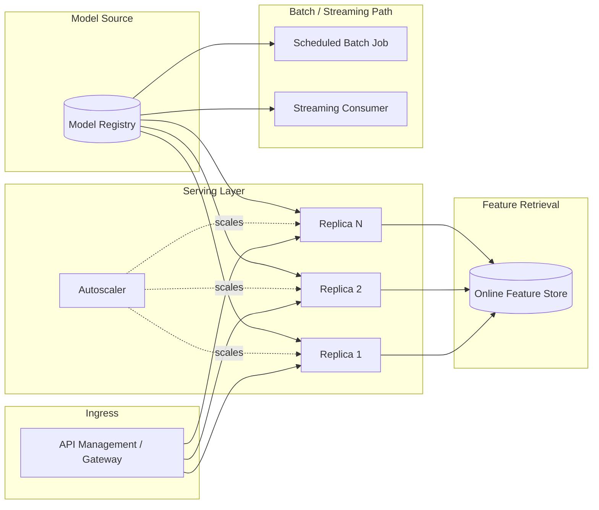
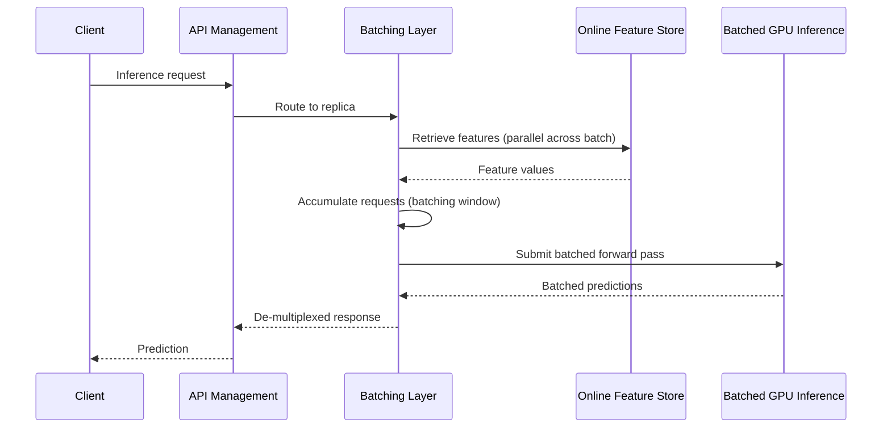
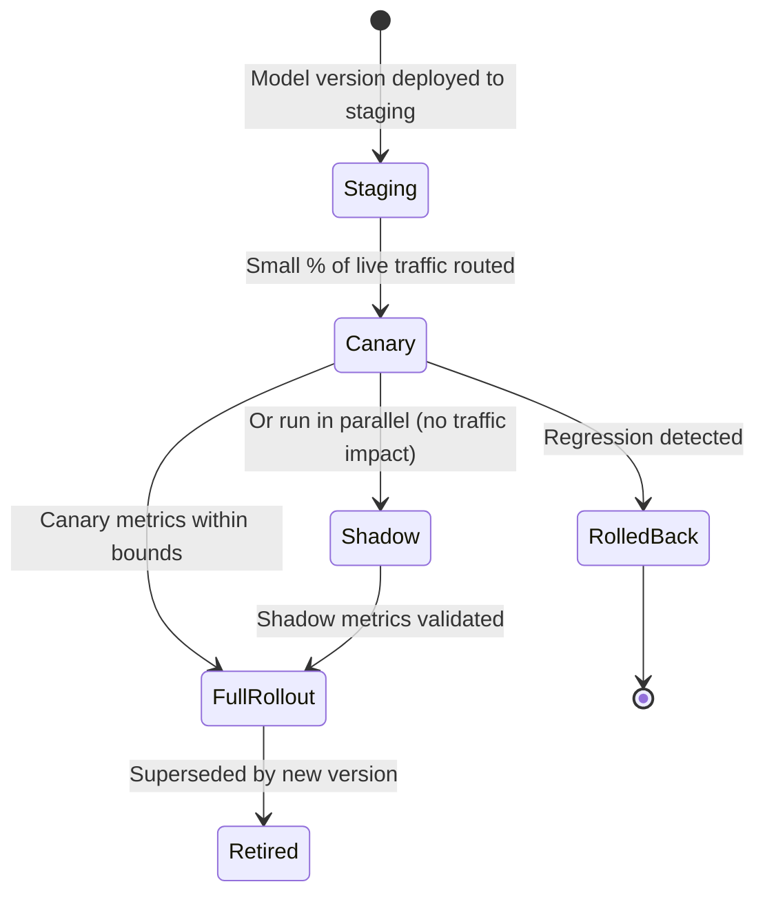

# Model Serving and Ray

> Part of the **Enterprise Data & AI Architecture Handbook** · Phase-11 — AI Platform Engineering & MLOps · Chapter 04.
> Estimated study time: **60 min reading + ~4h labs**.
> **Prerequisite:** read [MLOps and MLflow](03_MLOps_and_MLflow.md) first.

---

## Executive Summary

[MLOps and MLflow](03_MLOps_and_MLflow.md#internal-working) formalized the path from a trained, evaluated, registered model to a "Production" stage transition, and every step of that chapter's CI/CD/CT pipeline pointed at one final, deliberately deferred destination: a serving endpoint. This chapter is that destination. Serving is where all of Phase-11's prior investment — [Machine Learning Foundations](01_Machine_Learning_Foundations.md)'s evaluation rigor, [Feature Stores with Feast](02_Feature_Stores_with_Feast.md)'s online-store low-latency lookups, and [MLOps and MLflow](03_MLOps_and_MLflow.md)'s registry — either pays off as a fast, reliable, cost-efficient production capability, or is squandered by a naively built inference path that cannot meet its latency, throughput, or cost budget.

This chapter covers **batch vs. online vs. streaming inference** as three structurally different serving problems with different latency budgets and cost profiles, requiring a deliberate, per-use-case choice rather than a single default; **serving patterns and autoscaling** as the architecture that keeps a serving endpoint both responsive under peak load and cost-efficient under normal load; **Ray Serve, Ray Data, and Ray Train** as the open-source distributed-compute framework this chapter builds its scaling story on, particularly for GPU-bound and high-throughput serving workloads that a simple single-node endpoint cannot handle; **GPU utilization and batching** as the specific, high-leverage performance lever for deep-learning inference workloads; and **latency and throughput tuning** as the systematic profiling discipline that replaces guesswork with evidence when a serving path does not meet its performance budget.

The bias remains **Azure-primary (~60%)** — Azure Machine Learning managed online/batch endpoints, Azure Kubernetes Service (AKS) for custom serving workloads, and Azure Databricks Model Serving — **~30% enterprise open source** (Ray Serve/Ray Data/Ray Train as the distributed-serving and -training framework, Kubernetes as the underlying orchestration substrate, MLflow's deployment integration from [MLOps and MLflow](03_MLOps_and_MLflow.md)) and **~10% AWS/GCP comparison-only** (Amazon SageMaker endpoints, Google Vertex AI Prediction).

**Bottom line:** model serving is a distributed-systems and performance-engineering problem wearing a machine-learning costume — the specific technique (batching, autoscaling, GPU packing) matters less than the discipline of first identifying, per use case, which of batch/online/streaming inference the business problem actually requires, and then profiling the resulting serving path against its real latency and throughput budget rather than assuming a default architecture will meet it.

---

## Learning Objectives

By the end of this chapter you will be able to:

1. **Classify a use case's inference requirements** into batch, online, or streaming, and justify the classification against its latency and freshness needs.
2. **Design an autoscaling serving architecture** that balances latency SLAs against cost efficiency under variable load.
3. **Implement distributed serving and training with Ray Serve, Ray Data, and Ray Train**, and explain when Ray's distributed model is warranted over a simpler single-node deployment.
4. **Optimize GPU utilization** through request batching, model quantization, and multi-model packing.
5. **Systematically profile and tune latency and throughput** for a serving path, distinguishing network, queuing, and compute-bound bottlenecks.
6. **Apply model-serving patterns on Azure** (Azure ML managed endpoints, AKS, Databricks Model Serving) with a defensible comparison to AWS SageMaker and GCP Vertex AI equivalents.
7. **Defend model-serving architecture decisions** in engineer, staff engineer, architect, and CTO review settings, including the trade-off between latency, throughput, and cost.

---

## Business Motivation

- **The wrong inference pattern for a use case is a direct, structural cost or latency failure.** Building a real-time online endpoint for a use case that only ever needs a nightly batch score wastes ongoing serving-infrastructure cost; conversely, attempting to serve a genuinely real-time fraud-scoring use case via a batch job simply fails the business requirement outright.
- **Under-provisioned serving capacity directly costs revenue.** A recommendation or fraud-scoring endpoint that cannot sustain peak Black-Friday-style query volume either drops requests or degrades latency past its SLA at exactly the moment business value is highest.
- **Over-provisioned serving capacity is a silent, ongoing FinOps cost.** A serving endpoint sized for peak load but running at that size continuously — rather than autoscaling down during off-peak hours — is one of the most common, easily corrected sources of ML platform overspend.
- **GPU-backed serving is expensive enough that utilization efficiency has a direct, material cost impact.** A poorly batched inference path that leaves a provisioned GPU idle a large fraction of the time is paying for compute capacity it is not using, a cost multiplier that compounds across every GPU-backed model in the portfolio.
- **Latency directly gates which business use cases are even feasible.** A fraud-scoring decision that must complete within a checkout flow's latency budget, or a real-time bidding decision with a single-digit-millisecond window, simply cannot be built at all without the specific serving-architecture and tuning discipline this chapter covers — for these use cases, serving architecture is not an implementation detail, it is the product requirement.

---

## History and Evolution

- **2015-2017 — TensorFlow Serving and early model-serving frameworks** emerge as the first purpose-built (rather than general-purpose web-framework-based) inference-serving tools, recognizing that serving a model has different performance characteristics than serving a typical web request.
- **2018 — Ray is released by UC Berkeley's RISELab**, initially as a general-purpose distributed Python framework for reinforcement learning research, but rapidly generalizing into a broader distributed-compute substrate for Python-native ML workloads.
- **2019-2020 — Ray Serve is introduced** as Ray's dedicated model-serving library, bringing Ray's distributed-actor model specifically to bear on the batching, autoscaling, and multi-model-composition problems this chapter covers.
- **2020-2021 — managed cloud model-serving offerings mature broadly**: Azure Machine Learning managed online endpoints, AWS SageMaker endpoints, and Google Vertex AI Prediction all reach general availability within a similar window, mirroring the same platform-maturity curve [Machine Learning Foundations](01_Machine_Learning_Foundations.md#history-and-evolution) described for the broader ML lifecycle.
- **2021-2022 — Ray Train and Ray Data mature as companion libraries**, extending Ray's distributed-actor model to distributed training (data-parallel and model-parallel) and distributed data loading/preprocessing, giving Ray a coherent, single-framework story across the training-to-serving pipeline rather than requiring a separate framework for each stage.
- **2022-present — large-model serving drives batching and GPU-packing innovation**, as the compute cost of serving large deep-learning and foundation models makes naive one-request-at-a-time GPU inference prohibitively expensive, directly motivating the batching and GPU-utilization techniques in §4.4.
- **2023-present — Ray adoption accelerates for LLM/foundation-model serving specifically**, as Ray Serve's model-composition and autoscaling capabilities prove particularly well suited to the multi-model, variable-load-pattern serving topologies foundation-model applications require.

---

## Why This Technology Exists

Model serving exists as a distinct engineering discipline because running inference in production has performance and reliability requirements that neither a general-purpose web framework nor the training infrastructure from [Machine Learning Foundations](01_Machine_Learning_Foundations.md#internal-working) was built to meet: a serving path must sustain a latency budget under variable, sometimes bursty load, make efficient use of expensive GPU compute across many small, individual requests rather than one large batch job, and scale capacity up and down automatically as demand fluctuates — none of which a training pipeline's batch-oriented, throughput-optimized design naturally provides. Ray Serve and the managed cloud endpoint offerings this chapter covers exist specifically to close that gap: to take a model artifact from [MLOps and MLflow](03_MLOps_and_MLflow.md)'s registry and wrap it in the request-batching, autoscaling, and load-balancing infrastructure that production-grade inference actually requires.

---

## Problems It Solves

- **Mismatched inference pattern to business requirement** — the batch/online/streaming taxonomy (§4.1) gives architects a structured decision framework rather than defaulting to "always build a real-time endpoint."
- **Latency SLA violations under variable load** — autoscaling serving patterns (§4.2) add capacity ahead of demand spikes and release it during troughs, keeping latency within budget without permanently over-provisioning.
- **Inefficient, expensive GPU utilization** — request batching and multi-model packing (§4.4) materially increase the useful work extracted from a given GPU allocation, directly reducing the cost-per-inference for GPU-backed models.
- **Difficulty scaling Python-native ML serving workloads across many nodes** — Ray Serve's distributed-actor model (§4.3) gives a serving path horizontal scalability without requiring a rewrite into a different language or framework.
- **Guesswork-driven performance tuning** — the systematic latency/throughput profiling discipline in §4.5 replaces "let's just add more replicas and see" with an evidence-based diagnosis of the actual bottleneck.

---

## Problems It Cannot Solve

- **It cannot fix a model that is fundamentally too slow for its latency budget regardless of serving infrastructure.** A very large, computationally heavy model may not be servable within a single-digit-millisecond budget no matter how well the serving path is engineered; in that case, model compression/distillation or a smaller model architecture — a modeling decision from [Machine Learning Foundations](01_Machine_Learning_Foundations.md#core-concepts), not a serving-infrastructure decision — is the actual fix.
- **It cannot substitute for correct feature retrieval.** A serving path's latency budget includes the online feature-store lookup from [Feature Stores with Feast](02_Feature_Stores_with_Feast.md); no amount of model-serving-layer optimization compensates for a slow or poorly designed feature-retrieval path feeding it.
- **It cannot guarantee cost efficiency without deliberate right-sizing.** Autoscaling and batching reduce waste, but they do not automatically choose the correct instance type, GPU class, or scaling bounds — that remains an explicit architecture decision requiring the workload's actual latency and throughput profile.
- **It cannot eliminate the operational complexity of running distributed serving infrastructure.** Ray Serve, AKS, or a managed endpoint all still require genuine operational investment (monitoring, capacity planning, upgrade management) — serving infrastructure reduces engineering burden relative to a hand-built solution, it does not eliminate operational responsibility entirely.
- **It cannot make a model's predictions more accurate.** Serving is exclusively concerned with delivering a model's existing predictions efficiently and reliably; prediction quality remains entirely a function of the modeling and feature-engineering work from [Machine Learning Foundations](01_Machine_Learning_Foundations.md) and [Feature Stores with Feast](02_Feature_Stores_with_Feast.md).

---

## Core Concepts

### 4.1 Batch vs. Online vs. Streaming Inference

- **Batch inference** scores a large set of entities on a schedule (nightly, weekly), writing results to a table for later consumption — appropriate when a prediction does not need to reflect the most recent few minutes of data and there is no interactive, request-driven consumer waiting on the result (e.g., a monthly churn-risk report, or precomputing recommendation candidates for the next day's homepage).
- **Online (real-time) inference** serves a single prediction per request within a hard, typically sub-second (often sub-100-millisecond, sometimes single-digit-millisecond) latency budget, in direct response to a live user action or business event — required whenever a human or automated decision process is waiting synchronously on the result (fraud scoring at checkout, real-time bidding, live personalization).
- **Streaming inference** scores each event as it arrives from a continuous stream (Kafka/Event Hubs), without a per-request round-trip latency budget in the online-inference sense, but with a freshness requirement (results must be available within seconds-to-minutes of the triggering event) that batch inference's scheduled cadence cannot meet — appropriate for use cases like real-time anomaly monitoring across a continuous sensor feed, where no single caller is blocked waiting for one specific response, but the overall pipeline must keep pace with the incoming event rate.
- **The three patterns carry structurally different cost and complexity profiles**: batch inference is the cheapest and simplest (no standing serving infrastructure, just a scheduled job); online inference requires standing, always-or-mostly-available serving infrastructure sized for peak concurrent load; streaming inference requires a continuously running, throughput-scaled consumer pipeline distinct from both.
- **Choosing incorrectly in either direction has a real cost**: over-provisioning online serving infrastructure for a use case that only needed batch scoring wastes ongoing infrastructure spend (§4.16); under-provisioning by attempting to serve a genuinely latency-sensitive use case via batch or a naively built online path fails the business requirement outright — this is a business-requirements decision to be made explicitly per use case, not a default architectural choice.

### 4.2 Serving Patterns and Autoscaling

- **Horizontal replica autoscaling** adds or removes serving-endpoint replicas based on real-time load (queries-per-second, queue depth, or CPU/GPU utilization), the standard pattern for absorbing variable online-inference traffic without either over-provisioning for peak load continuously or under-provisioning and violating latency SLAs during a spike.
- **Scale-to-zero for infrequently used models** — Azure ML managed online endpoints and AKS-hosted deployments can both support scaling a low-traffic model's replica count to zero during idle periods, trading a cold-start latency penalty on the next request for eliminating standing compute cost entirely, appropriate for models with genuinely sporadic, non-latency-critical traffic.
- **Canary and blue-green deployment for serving endpoints** extend [DevOps and CI/CD](../Phase-09/03_DevOps_and_CI_CD.md)'s release-strategy discipline to model deployment specifically: a canary deployment routes a small percentage of live traffic to a newly promoted model version (per [MLOps and MLflow](03_MLOps_and_MLflow.md#32-model-registry-and-stage-transitions) §3.2's registry promotion) before a full cutover, catching a serving-time regression that offline evaluation might have missed.
- **Shadow deployment** runs a new model version in parallel with the current production model on live traffic, logging its predictions without acting on them — validating real-time behavior (latency, error rate, prediction distribution) under genuine production load before the model is trusted to actually influence a decision.
- **Multi-model and model-composition serving patterns** (e.g., an ensemble, or a pipeline of a retrieval model feeding a ranking model) require the serving layer to orchestrate multiple model invocations per request — a capability Ray Serve's composable "deployment graph" model (§4.3) handles natively, where a simpler single-model endpoint would require custom orchestration code.

### 4.3 Ray Serve, Ray Data, and Ray Train

- **Ray's core abstraction is the distributed actor/task model**: Python functions and classes can be transparently distributed across a cluster's nodes, giving Ray-based tools a genuinely Python-native distributed-computing story rather than requiring a JVM-based framework (as Spark does) or a bespoke distributed-serving protocol.
- **Ray Serve** is Ray's model-serving library, providing HTTP/gRPC endpoint hosting, automatic request batching, replica-level autoscaling, and — its most architecturally distinctive capability — **composable deployment graphs**, where multiple models/business-logic steps can be chained and independently scaled within a single serving application (directly supporting the multi-model composition pattern from §4.2).
- **Ray Data** provides distributed data loading and preprocessing specifically optimized for ML workloads (streaming, memory-efficient batch iteration over large datasets), commonly used to feed both Ray Train's distributed training jobs and Ray Serve's batch-inference pipelines without requiring a separate Spark job for data preparation.
- **Ray Train** provides distributed training orchestration (data-parallel and model-parallel, integrating with PyTorch, TensorFlow, and XGBoost) — the distributed-training counterpart to [Machine Learning Foundations](01_Machine_Learning_Foundations.md#scalability)'s horizontal-scaling discussion, giving Ray a coherent story across training (Ray Train) and serving (Ray Serve) within one framework.
- **Ray on Azure runs atop AKS** (via KubeRay, the Kubernetes operator for Ray clusters) or Azure Databricks (which has native Ray integration for running Ray workloads within a Databricks cluster) — meaning adopting Ray does not require abandoning the Azure-primary infrastructure choices established elsewhere in this handbook, it runs as a workload on top of them.
- **When Ray is (and is not) the right choice**: Ray Serve is particularly well justified for GPU-heavy, high-throughput, or multi-model-composition serving workloads where a managed single-model endpoint's simpler abstraction becomes limiting; for a straightforward single-model, moderate-traffic online endpoint, a managed Azure ML endpoint is usually simpler to operate and should be preferred unless Ray's specific capabilities (composition, fine-grained batching control, unified training+serving) are genuinely needed (§4.25 Decision Matrix).

### 4.4 GPU Utilization and Batching

- **Naive one-request-at-a-time GPU inference is typically severely underutilized** — a GPU's parallel compute capacity is designed for processing many examples simultaneously; serving one request at a time leaves the large majority of that capacity idle, directly wasting the GPU-backed serving cost flagged in this chapter's Business Motivation.
- **Dynamic request batching** accumulates multiple incoming requests over a short time window (a few milliseconds to tens of milliseconds) into a single batched GPU inference call, dramatically increasing throughput per GPU at the cost of a small, bounded added latency per request — the central, highest-leverage GPU-serving optimization this chapter covers, natively supported by Ray Serve's batching decorator and by Azure ML/Databricks Model Serving's batching configuration.
- **The batching window is a direct latency-vs-throughput trade-off**: a longer batching window accumulates larger, more GPU-efficient batches but adds more per-request latency; the correct window size is set by the use case's actual latency budget, not maximized for throughput alone.
- **Model quantization and compilation** (reducing numerical precision from FP32 to FP16/INT8, or compiling a model via ONNX Runtime/TensorRT) reduce both GPU memory footprint and per-inference compute time, often enabling either larger effective batch sizes or a smaller/cheaper GPU SKU for the same throughput target — a complementary, not alternative, technique to request batching.
- **Multi-model GPU packing** — serving multiple smaller models on a single GPU (via NVIDIA MIG partitioning, or simply co-locating multiple lightweight model replicas as separate processes on one GPU) improves utilization further for models individually too small to saturate a full GPU's capacity on their own.

### 4.5 Latency and Throughput Tuning

- **Every serving-path latency budget decomposes into distinct, separately-diagnosable segments**: network round-trip, feature retrieval ([Feature Stores with Feast](02_Feature_Stores_with_Feast.md)'s online-store lookup), model inference compute, and any request-time feature computation or post-processing — profiling must identify which segment actually dominates before optimizing, the serving-path analog of [Machine Learning Foundations](01_Machine_Learning_Foundations.md#performance)'s training-throughput profiling discipline.
- **p50/p95/p99 latency, not average latency, is the metric that actually matters for an SLA** — a low average latency can coexist with an unacceptable tail latency (p99) that a meaningful fraction of real users or downstream systems experience; serving-path tuning should target the tail percentile the SLA is actually defined against.
- **Throughput (queries-per-second sustained) and latency (time per individual request) are related but distinct, sometimes competing metrics** — a larger batching window (§4.4) can increase sustained throughput while increasing per-request latency, meaning "optimize performance" is not a single-dimensional goal; the correct target is the specific latency/throughput point the use case's SLA requires, not the theoretical maximum of either dimension alone.
- **Load testing against realistic traffic patterns (not just steady-state average load) is required to validate autoscaling behavior** — a serving path that performs well under a smooth, gradually increasing synthetic load test can still fail under a genuinely bursty real-world traffic pattern if the autoscaler's reaction time lags the burst's actual arrival rate.
- **Systematic bottleneck isolation** (disabling or mocking one segment at a time — e.g., measuring inference-only latency with a stubbed feature lookup) is the concrete technique for turning "the endpoint is slow" into a specific, fixable diagnosis, rather than applying a generic optimization (more replicas, bigger GPU) that may not address the actual bottleneck.

---

## Internal Working

**How a single online-inference request actually flows through a batched, autoscaled Ray Serve deployment** (the mechanics underlying §4.2-4.5):

1. **Request arrival**: an HTTP/gRPC request reaches the serving endpoint's ingress (a load balancer distributing across available replicas).
2. **Feature retrieval**: the serving handler retrieves any precomputed features from the online feature store ([Feature Stores with Feast](02_Feature_Stores_with_Feast.md)) and combines them with any request-time-only features supplied in the request payload.
3. **Batch accumulation**: Ray Serve's batching layer holds the request briefly (within the configured batching window from §4.4), accumulating it alongside other concurrently arriving requests up to a maximum batch size or the window's time limit, whichever is reached first.
4. **Batched GPU inference**: the accumulated batch is submitted to the model as a single forward pass, making efficient use of the GPU's parallel compute capacity rather than processing each request individually.
5. **Result de-multiplexing**: the batched inference output is split back into individual per-request responses, each routed back to its originating request context.
6. **Response return and autoscaler signal**: the response is returned to the caller, and the replica's current load (queue depth, utilization) feeds the autoscaler's decision about whether to add or remove replicas.
7. **Autoscaler reaction**: if sustained load exceeds the current replica count's capacity (per the configured target utilization/queue-depth threshold), the autoscaler provisions additional replicas — a process that itself takes non-zero time (container/model-loading startup latency), which is why load testing (§4.5) must validate the autoscaler's reaction time against real burst patterns, not just steady-state load.

The key architectural insight is that step 3 (batching) trades a small, bounded amount of added latency for a large gain in GPU throughput efficiency, while steps 6-7 (autoscaling) operate on a slower timescale to keep aggregate capacity matched to aggregate demand — the two mechanisms address different problems (per-request GPU efficiency vs. aggregate capacity) and both are typically needed together for a cost-efficient, latency-compliant GPU-backed serving path.

---

## Architecture

- **Ingress/load-balancing layer**: an API Management gateway or AKS ingress controller routing requests to available serving replicas, providing authentication, rate limiting, and request logging ahead of the serving layer itself.
- **Serving layer**: Azure ML managed online endpoints, AKS-hosted Ray Serve deployments, or Azure Databricks Model Serving, hosting the model(s) and handling batching/autoscaling per §4.2-4.4.
- **Feature-retrieval layer**: the online feature store from [Feature Stores with Feast](02_Feature_Stores_with_Feast.md), queried synchronously within the request path's latency budget.
- **Model artifact source**: the model registry from [MLOps and MLflow](03_MLOps_and_MLflow.md#32-model-registry-and-stage-transitions) §3.2, the origin of every deployed model version.
- **Batch/streaming inference layer** (for non-online use cases): scheduled Azure Databricks/Azure ML batch jobs, or a Kafka/Event Hubs-consuming streaming job, running independently of the online serving layer's infrastructure.
- **Monitoring and feedback layer**: latency/throughput/error-rate monitoring feeding both operational alerting and the drift-detection loop back to [MLOps and MLflow](03_MLOps_and_MLflow.md#33-cicd-ct-for-models) §3.3's continuous-training trigger.

---

## Components

- **Serving replica** — an individual instance of a deployed model, the unit that autoscaling adds or removes.
- **Batching layer** — the request-accumulation mechanism (Ray Serve's `@serve.batch`, or a managed endpoint's native batching configuration) sitting between request ingress and model inference.
- **Autoscaler** — the controller monitoring load and adjusting replica count within configured minimum/maximum bounds.
- **Model server process** — the runtime hosting the loaded model artifact and executing inference (a Ray Serve deployment, a Triton Inference Server process, or a managed endpoint's internal serving runtime).
- **Ingress/gateway** — the API Management instance or ingress controller providing authentication, rate limiting, and routing ahead of the serving layer.
- **Online feature-store client** — the SDK call retrieving precomputed features within the request path.
- **Batch/streaming job runner** — the scheduled job or streaming consumer handling non-online inference patterns independently of the serving layer.

---

## Metadata

- **Deployment metadata**: which model version (from the [MLOps and MLflow](03_MLOps_and_MLflow.md#32-model-registry-and-stage-transitions) §3.2 registry) is currently serving each endpoint, its deployment timestamp, and its canary/full-traffic rollout percentage.
- **Scaling configuration metadata**: minimum/maximum replica bounds, target utilization threshold, and batching window/max-batch-size configuration per deployment.
- **Request-level metadata**: a correlation ID tying a specific inference request to its originating caller, the feature values retrieved, and the resulting prediction — the serving-time extension of the lineage chain from [MLOps and MLflow](03_MLOps_and_MLflow.md#35-model-lineage-and-governance) §3.5.
- **Performance-baseline metadata**: the endpoint's historical p50/p95/p99 latency and sustained-throughput baselines, used both for anomaly detection (§4.21 Monitoring) and for validating that a new model version has not introduced a performance regression relative to its predecessor.

---

## Storage

- **Model artifacts**: retrieved from the [MLOps and MLflow](03_MLOps_and_MLflow.md#storage) registry's artifact store (ADLS Gen2-backed) at deployment time, typically cached locally on the serving replica after the initial load to avoid repeated retrieval latency on every request.
- **Batch inference output**: written to Delta Lake tables (see [Delta Lake](../Phase-04/04_Delta_Lake.md)), consistent with the platform's broader lakehouse storage convention, for downstream consumption by reports or other pipelines.
- **Streaming inference output**: written either to a Delta Lake table (for later analytical consumption) or published back to a message stream (Kafka/Event Hubs) for immediate downstream consumption by another real-time system.
- **Request/response logging storage**: a sampled or full log of requests and predictions, stored for monitoring, debugging, and — subject to the PII-handling requirements from [Data Privacy and PII Protection](../Phase-10/07_Data_Privacy_and_PII_Protection.md) — audit purposes.

---

## Compute

- **CPU-backed serving compute** remains appropriate for the majority of enterprise tabular models (tree ensembles, linear models), consistent with [Machine Learning Foundations](01_Machine_Learning_Foundations.md#compute)'s guidance that CPU is the correct default absent a specific deep-learning requirement.
- **GPU-backed serving compute** (Azure ML GPU-enabled online endpoints, AKS GPU node pools) is required for deep-learning and large-model inference, and is where the batching and utilization techniques from §4.4 have the most direct cost impact.
- **Ray cluster compute** (via KubeRay on AKS) provisions a pool of nodes (CPU and/or GPU) that Ray Serve, Ray Data, and Ray Train jobs share, with Ray's own internal scheduler distributing work across that pool — a materially different compute-provisioning model than per-endpoint autoscaling, since capacity is pooled across all Ray workloads on the cluster rather than dedicated per model.
- **Batch/streaming inference compute** is provisioned and scaled independently of online serving compute — a scheduled Azure Databricks job cluster (auto-scale-to-zero between runs) for batch, and a continuously running (though horizontally scalable) streaming consumer cluster for streaming inference.

---

## Networking

- **Private endpoints for serving endpoints** (Azure ML managed online endpoints' private endpoint support, or AKS ingress restricted to a private VNet) keep inference traffic off the public internet, consistent with [Network Security and Zero Trust](../Phase-10/04_Network_Security_and_Zero_Trust.md).
- **Co-locating the serving layer, the online feature store, and the calling application within the same region/VNet** is a direct latency-budget requirement, extending the same co-location guidance [Feature Stores with Feast](02_Feature_Stores_with_Feast.md#networking) established for online feature-store access specifically to the full serving request path.
- **API Management as the ingress layer** provides a stable, versioned public or private API surface in front of potentially frequently-changing underlying serving infrastructure (replica counts, even underlying compute platform), decoupling API consumers from serving-implementation churn.
- **Ray cluster inter-node networking** (for distributed Ray Train jobs, or Ray Serve deployment graphs spanning multiple nodes) requires low-latency, high-bandwidth connectivity within the cluster — typically satisfied by co-locating all Ray cluster nodes within a single AKS node pool in one availability zone/region for latency-sensitive workloads, accepting a resilience trade-off against multi-zone spread.

---

## Security

- **Authentication and rate limiting at the ingress/gateway layer** (API Management policies, or AKS ingress-level authentication) prevent unauthorized or abusive request volume from reaching the serving layer directly, consistent with [Identity and Access Management with Entra](../Phase-10/02_Identity_and_Access_Management_with_Entra.md).
- **Managed identities for the serving layer's access to the feature store and model registry** (not embedded credentials), following the same default established throughout this handbook's security chapters.
- **Request/response logging must respect PII handling requirements** — if inference requests or predictions contain personal data, logged records require the same classification and access control as any other PII-containing dataset, per [Data Privacy and PII Protection](../Phase-10/07_Data_Privacy_and_PII_Protection.md).
- **Model artifact integrity** — verifying that the model artifact loaded onto a serving replica is exactly the registry-approved version (not a tampered or substituted file) is a supply-chain-security concern for serving infrastructure, addressable via artifact checksums/signing tied back to the registry's recorded artifact hash.

---

## Performance

- **The batching-window/latency trade-off (§4.4)** is the single highest-leverage performance lever for GPU-backed serving; tuning it correctly requires knowing the use case's actual latency budget, not simply maximizing throughput.
- **Cold-start latency** (the time to load a model onto a newly provisioned replica, particularly significant for large deep-learning models) directly affects both scale-to-zero viability (§4.2) and autoscaling reaction time (§4.5) — a model with a multi-second cold-start time is a poor fit for scale-to-zero if its traffic pattern includes latency-sensitive bursts immediately after an idle period.
- **Feature-retrieval latency** from the online store is frequently the dominant, non-model-compute segment of total request latency for tabular models with lightweight inference compute — profiling (§4.5) should not assume the model itself is the bottleneck without measuring.
- **Serialization/deserialization overhead** (converting a request payload to model input tensors and back) is a frequently underestimated latency contributor for high-throughput endpoints, addressable via efficient binary serialization formats (protobuf/Arrow) rather than verbose JSON for high-volume internal service-to-service calls.

---

## Scalability

- **Horizontal replica scaling** is the primary scalability mechanism for online serving, bound ultimately by the ingress/load-balancing layer's own capacity and the online feature store's read-throughput ceiling (per [Feature Stores with Feast](02_Feature_Stores_with_Feast.md#scalability)).
- **Ray cluster scaling** adds or removes nodes from the underlying Ray cluster (via KubeRay's integration with AKS cluster autoscaling), a coarser-grained scaling mechanism than per-endpoint replica autoscaling, appropriate when multiple Ray Serve deployments and Ray Train jobs share one pooled cluster.
- **Batch inference scaling** is a standard Spark/distributed-compute horizontal-scaling problem, bound by the entity population size being scored, following the same scaling guidance as [Machine Learning Foundations](01_Machine_Learning_Foundations.md#scalability)'s training-compute scaling discussion.
- **Streaming inference scaling** is bound by the input stream's partition count and the consumer group's parallelism, requiring the streaming consumer's scaling to track the incoming event rate, not a fixed provisioned capacity.

---

## Fault Tolerance

- **Replica-level health checks and automatic restart** ensure a crashed or unresponsive serving replica is detected and replaced without manual intervention, a standard Kubernetes/managed-endpoint capability that Ray Serve, AKS, and Azure ML endpoints all provide natively.
- **Graceful degradation on feature-store or dependency failure** — a serving path should have a defined fallback behavior (a cached/default feature value, or a simpler fallback model) when the online feature store or another dependency is unavailable, rather than allowing that dependency's outage to become a full serving outage, directly extending the fault-tolerance pattern from [Machine Learning Foundations](01_Machine_Learning_Foundations.md#fault-tolerance).
- **Canary and shadow deployment (§4.2) as fault-tolerance mechanisms, not just release-strategy tools** — catching a newly deployed model version's latent failure mode (a crash on a specific input pattern, a latency regression) against a small fraction of live traffic before a full rollout limits the blast radius of a bad deployment.
- **Multi-zone/multi-region serving redundancy** for the highest-availability use cases, at the added cost and complexity of keeping model versions and feature-store replicas consistent across zones/regions — a deliberate trade-off (§4.24 Trade-offs) justified only for use cases whose availability requirement genuinely demands it.

---

## Cost Optimization (FinOps)

- **Scale-to-zero for low-traffic models** eliminates standing compute cost for infrequently used endpoints, at the cost of cold-start latency on the next request — appropriate per the decision matrix in §4.25.
- **Right-sizing GPU SKU to actual batch-achievable throughput** — provisioning a larger/more expensive GPU than the workload's achievable batch size can actually utilize wastes the GPU cost premium without a corresponding throughput gain; quantization and batching tuning (§4.4) should be exhausted before defaulting to a larger GPU.
- **Separating batch/streaming compute from online serving compute** ensures each is right-sized to its own load pattern rather than one workload's provisioning inadvertently over- or under-sizing another's.
- **Autoscaling minimum-replica-count discipline**: setting a minimum replica count above what baseline (non-peak) traffic actually requires is a common, avoidable standing cost — the minimum should reflect genuine baseline load and cold-start-latency tolerance, not a defensive "just in case" buffer.

**Worked FinOps example**: A fraud-scoring GPU-backed endpoint is provisioned with 4 always-on GPU replicas (an NC-series VM class) to handle peak transaction volume, at roughly $1.20/GPU-hour × 4 replicas × 730 hours ≈ **$3,504/month**, even though actual traffic follows a clear daily pattern peaking during business hours and dropping to roughly 20% of peak overnight. Introducing autoscaling (minimum 1 replica overnight, scaling up to 4 during business hours, informed by a load test validating the autoscaler's reaction time against the actual demand ramp) reduces the effective average replica count to roughly 2, cutting cost to approximately **$1,752/month** — a 50% reduction — while separately, enabling dynamic request batching (a 20ms batching window, chosen because the use case's actual latency budget is 150ms and can absorb it) roughly triples achievable throughput per replica, allowing the same peak traffic to be served by 2 peak replicas instead of 4, at a further reduced peak-hour cost. Combined, these two independent optimizations (autoscaling for the daily load curve, batching for GPU efficiency) can realistically cut this endpoint's total monthly cost by 60-70% with no change to the model itself and no latency-SLA violation, since the 20ms batching delay remains well within the 150ms budget.

---

## Monitoring

- **Latency monitoring at p50/p95/p99**, tracked continuously against the SLA threshold, per the tail-latency emphasis from §4.5.
- **Throughput and error-rate monitoring**, correlated with autoscaler replica-count changes to validate that scaling decisions are actually keeping pace with demand.
- **GPU utilization monitoring** (via `nvidia-smi`-based metrics or the managed endpoint's native GPU utilization dashboard), the direct signal for whether batching configuration is actually achieving its intended efficiency gain.
- **Feature-store lookup latency monitoring** within the serving path specifically (not just the feature store's own standalone metrics, per [Feature Stores with Feast](02_Feature_Stores_with_Feast.md#monitoring)), to distinguish a serving-layer regression from an upstream feature-store regression during incident triage.
- **Prediction-distribution and drift monitoring**, feeding the same monitoring loop [Machine Learning Foundations](01_Machine_Learning_Foundations.md#16-monitoring) §1's Monitoring section and [MLOps and MLflow](03_MLOps_and_MLflow.md#33-cicd-ct-for-models) §3.3's continuous-training trigger depend on.

---

## Observability

- **End-to-end request tracing** (via a correlation ID spanning ingress, feature retrieval, model inference, and response) lets an on-call engineer decompose exactly where latency was spent for any individual slow request, operationalizing the bottleneck-isolation discipline from §4.5.
- **Unified dashboards correlating serving-layer metrics (latency, throughput, GPU utilization) with upstream feature-store metrics and downstream model-quality metrics**, avoiding the need to manually cross-reference three separate tools during an incident.
- **Deployment-version-tagged metrics**, so a performance regression can be immediately attributed to a specific model version's rollout (correlating with the canary/shadow deployment history from §4.2) rather than requiring a separate investigation to determine when the regression began.

### Operational Response Playbook

| Signal | Detection Query/Check | Remediation |
|---|---|---|
| **Serving-endpoint p99 latency exceeds its SLA while GPU utilization remains low** (below ~40%) | Endpoint latency dashboard cross-referenced with GPU utilization metrics for the same time window | Check the batching configuration first — a too-small batching window or max-batch-size is a common cause of low GPU utilization alongside latency headroom; increase the batching window incrementally (within the SLA's remaining budget) before adding replicas or a larger GPU |
| **Autoscaler repeatedly fails to keep pace with a recurring traffic burst** (latency spikes correlate with rapid demand ramps, even though steady-state load is handled fine) | Autoscaler event history compared against traffic-volume time series around the latency-spike windows | Check whether cold-start latency for new replicas is the bottleneck; if so, either raise the minimum replica count to better cover the burst's typical onset, or pre-warm additional replicas ahead of a predictable burst window (e.g., a known daily traffic pattern) rather than relying purely on reactive autoscaling |

---

## Governance

- **Every production serving endpoint must have a documented owner and a defined SLA (latency, throughput, availability)**, the serving-layer instance of the ownership discipline established throughout [Machine Learning Foundations](01_Machine_Learning_Foundations.md#governance) and [MLOps and MLflow](03_MLOps_and_MLflow.md#governance).
- **Deployment changes (new model version rollouts) must be traceable back to the specific registry promotion that authorized them** (per [MLOps and MLflow](03_MLOps_and_MLflow.md#35-model-lineage-and-governance) §3.5), closing the lineage chain all the way from source data through to a specific serving-endpoint deployment event.
- **Canary/shadow rollout results should be reviewed and recorded before a full-traffic cutover**, not treated as an optional, skippable step for a "confident" deployment — the review record itself is part of the governance trail.
- **Serving-path PII handling must be explicitly governed** (§4.23 Security), with logging and retention policies reviewed against [Data Privacy and PII Protection](../Phase-10/07_Data_Privacy_and_PII_Protection.md) requirements specifically for the serving layer, not assumed to be automatically covered by upstream data-governance policy.

---

## Trade-offs

- **Managed endpoint (Azure ML/Databricks Model Serving) vs. self-managed Ray Serve on AKS**: managed endpoints trade some flexibility (custom batching logic, multi-model composition graphs) for materially reduced operational burden; Ray Serve trades that operational simplicity for finer-grained control and the specific composition/batching capabilities §4.3 described — most single-model, moderate-complexity use cases should default to managed, reserving Ray Serve for workloads that genuinely need its specific capabilities.
- **Batching window length**: a longer window improves GPU throughput efficiency at the direct cost of added per-request latency — this is a explicit, tunable trade-off against the use case's actual SLA, not a "bigger is always better" or "smaller is always safer" choice.
- **Scale-to-zero vs. always-warm minimum replicas**: scale-to-zero minimizes cost for low-traffic endpoints at the cost of cold-start latency on the first request after idle; an always-warm minimum eliminates that cold-start penalty at the cost of continuous standing compute spend — the correct choice depends on whether the use case can tolerate occasional cold-start latency.
- **Multi-zone/region serving redundancy vs. single-zone simplicity**: higher availability at materially higher cost and cross-zone consistency complexity — justified only for use cases whose availability SLA genuinely requires it, not adopted reflexively as a "best practice" for every model.

---

## Decision Matrix

| Scenario | Recommended Approach | Rationale |
|---|---|---|
| Prediction consumed by a downstream report, no live caller waiting | Batch inference | Avoids the cost and complexity of standing online serving infrastructure entirely |
| Single-digit-to-low-double-digit millisecond latency requirement, live caller waiting | Online inference with request batching tuned to the SLA | Meets the hard latency requirement while still capturing GPU-efficiency gains where the budget allows |
| Continuous event stream requiring near-real-time scoring, no per-request caller | Streaming inference | Matches the continuous, no-single-caller nature of the workload; avoids forcing it into an online-endpoint request/response model it doesn't need |
| Simple, single-model, moderate-traffic online use case | Azure ML managed online endpoint or Databricks Model Serving | Lowest operational overhead; Ray Serve's added capabilities are not needed |
| GPU-heavy, high-throughput, or multi-model-composition serving workload | Ray Serve on AKS (via KubeRay) | Justifies Ray's operational complexity with capabilities (fine-grained batching, deployment graphs) a managed endpoint does not provide |
| Low, sporadic traffic with latency-tolerant use case | Scale-to-zero managed endpoint | Eliminates standing cost; cold-start latency is acceptable given the use case's tolerance |

---

## Design Patterns

- **Latency-budget-driven batching configuration**: set the batching window as the largest value that still comfortably fits within the use case's SLA, rather than defaulting to either "no batching" or an arbitrarily large window.
- **Canary-then-full-cutover deployment**, always routing a small percentage of live traffic to a newly promoted model version before a complete rollout, catching serving-time regressions offline evaluation could not have surfaced.
- **Decoupled batch/streaming/online infrastructure**: provision and scale each inference pattern's compute independently, even for the same underlying model, rather than forcing one infrastructure footprint to serve all three patterns.
- **Graceful degradation with a defined fallback**: every serving path with an external dependency (feature store, a downstream model in a composition graph) should have an explicit fallback behavior for that dependency's failure, not an implicit assumption that it will always be available.

---

## Anti-patterns

- **Building a real-time online endpoint by default for every use case**, even ones with no live caller waiting on the result — unnecessary standing infrastructure cost for a batch-appropriate workload.
- **Serving GPU-backed models one request at a time without batching**, leaving the large majority of provisioned GPU capacity idle and directly inflating cost-per-inference.
- **Provisioning autoscaling minimum replicas defensively high "just in case"**, without reference to actual baseline traffic, a common and avoidable standing-cost anti-pattern.
- **Deploying a newly promoted model version directly to 100% of production traffic** without a canary or shadow phase, forgoing the early-warning capability that phase provides for serving-time-only regressions.
- **Assuming the model's inference compute is always the latency bottleneck** without profiling — frequently the feature-retrieval or serialization overhead dominates, and optimizing model compute alone in that case yields no measurable improvement.

---

## Common Mistakes

- Choosing an online endpoint for a use case that only ever needed batch scoring, then discovering the ongoing infrastructure cost only during a later cost review.
- Tuning batching window purely for maximum throughput without checking it against the use case's actual latency SLA, silently violating the SLA.
- Not load-testing against realistic bursty traffic patterns, only against smooth steady-state load, and being surprised when the autoscaler cannot keep pace with a real burst.
- Forgetting to account for cold-start latency when evaluating scale-to-zero for a use case with latency-sensitive traffic immediately following idle periods.
- Not tagging serving metrics with the deployed model version, making it hard to attribute a performance regression to a specific rollout during incident investigation.

---

## Best Practices

- Classify every new model's inference requirement (batch/online/streaming) explicitly and deliberately before choosing a serving architecture, rather than defaulting to online.
- Tune batching configuration against the use case's actual SLA, validated via load testing against realistic (not just steady-state) traffic patterns.
- Require a canary or shadow deployment phase before every full-traffic model version cutover, without exception for "confident" deployments.
- Monitor GPU utilization alongside latency for every GPU-backed endpoint, treating low utilization with latency headroom as an actionable batching-configuration signal.
- Tag every serving metric with the deployed model version to make performance-regression attribution immediate during incident response.

---

## Enterprise Recommendations

- Default to managed serving platforms (Azure ML managed endpoints, Databricks Model Serving) for new single-model, moderate-traffic use cases, reserving Ray Serve on AKS for workloads with a demonstrated need for its composition or fine-grained batching capabilities.
- Mandate a canary/shadow deployment phase as a non-optional step in every production model rollout, integrated directly into the CI/CD/CT pipeline from [MLOps and MLflow](03_MLOps_and_MLflow.md#33-cicd-ct-for-models) §3.3.
- Require every new serving endpoint's minimum/maximum replica bounds and batching configuration to be justified against a documented latency SLA and load-test result, not set by default or convention alone.
- Track GPU utilization and cost-per-inference as platform-level FinOps KPIs across the model portfolio, using them to prioritize batching/quantization optimization investment toward the highest-cost endpoints first.

---

## Azure Implementation

- **Azure Machine Learning managed online endpoints** as the default for single-model online serving, with native autoscaling, GPU support, canary/blue-green traffic-splitting, and managed-identity-based security.
- **Azure Machine Learning batch endpoints** for scheduled batch inference, integrated with the same model registry as online endpoints.
- **Azure Databricks Model Serving** as an alternative for teams centered on Databricks, with tight Unity Catalog model-registry integration from [MLOps and MLflow](03_MLOps_and_MLflow.md#34-mlflow-on-azure-databricks) §3.4.
- **AKS with KubeRay** for Ray Serve/Ray Data/Ray Train workloads requiring Ray's specific composition and distributed-compute capabilities, running atop the same Azure Kubernetes infrastructure as the rest of the platform's container workloads (see [Kubernetes](../Phase-09/06_Kubernetes.md)).
- **Azure API Management** as the ingress/gateway layer providing authentication, rate limiting, and a stable API surface in front of the serving layer.

---

## Open Source Implementation

- **Ray Serve** as the distributed model-serving library for GPU-heavy, high-throughput, or multi-model-composition workloads, with Ray Data and Ray Train as its companion data-loading and distributed-training libraries.
- **Kubernetes** (via AKS) as the underlying orchestration substrate for self-managed serving deployments, following the same container-orchestration patterns established in [Kubernetes](../Phase-09/06_Kubernetes.md).
- **ONNX Runtime and NVIDIA TensorRT** for model compilation/quantization, reducing inference compute cost and enabling more efficient batching (§4.4).
- **MLflow's deployment integration** (`mlflow deployments`) for packaging a registered model artifact into a servable container image, bridging directly from [MLOps and MLflow](03_MLOps_and_MLflow.md)'s registry to any of the serving targets in this chapter.

---

## AWS Equivalent (comparison only)

- **Amazon SageMaker endpoints** (real-time, batch transform, and asynchronous inference) provide the direct equivalent of Azure ML's online/batch endpoint split, with SageMaker's own autoscaling and multi-model-endpoint capabilities.
- **Advantages**: tight integration with the broader SageMaker training/registry ecosystem for AWS-centric teams, consistent with the parallel comparisons in [Machine Learning Foundations](01_Machine_Learning_Foundations.md#aws-equivalent-comparison-only) and [MLOps and MLflow](03_MLOps_and_MLflow.md#aws-equivalent-comparison-only).
- **Disadvantages**: a materially different endpoint-configuration and autoscaling API than Azure ML's, meaning a genuine re-platforming effort for migration, not a drop-in swap.
- **Migration strategy**: models packaged in portable formats (ONNX, MLflow's model flavors) migrate with the least friction; endpoint-configuration and autoscaling-policy definitions require rework against SageMaker's APIs.
- **Selection criteria**: choose SageMaker endpoints when the broader ML estate is AWS-centric; otherwise this chapter's Azure-primary recommendation applies.

---

## GCP Equivalent (comparison only)

- **Google Vertex AI Prediction** provides the equivalent online/batch endpoint capability, with strong integration for models already trained via Vertex AI Training.
- **Advantages**: tight integration with the broader Vertex AI ecosystem for GCP-centric teams, per the parallel comparison in [Machine Learning Foundations](01_Machine_Learning_Foundations.md#gcp-equivalent-comparison-only).
- **Disadvantages**: the same re-platforming cost pattern as the AWS case relative to Azure ML's endpoint model.
- **Migration strategy**: as with AWS, portable model packaging formats reduce artifact-level migration cost; endpoint/autoscaling configuration requires rework.
- **Selection criteria**: choose Vertex AI Prediction when the data/ML estate is GCP-centric; otherwise default to the Azure-primary recommendation.

---

## Migration Considerations

- **Ray Serve's portability is a genuine advantage for migration-sensitive organizations**: since Ray runs atop Kubernetes on any cloud (AKS, EKS, GKE), a Ray Serve-based serving architecture migrates with materially less rework than a cloud-proprietary managed endpoint, at the cost of the added operational burden of self-managing Ray/Kubernetes in the first place (§4.24's trade-off).
- **Models packaged via MLflow's portable model flavors or ONNX migrate most readily** across managed endpoint platforms (Azure ML, SageMaker, Vertex AI), since the model artifact format itself is not cloud-proprietary even when the surrounding endpoint infrastructure is.
- **Autoscaling and batching configuration must be re-validated (not merely copied) after any platform migration** — different platforms' autoscaling signal sources (queue depth vs. CPU/GPU utilization vs. requests-per-second) and batching implementations behave differently enough that a configuration tuned for one platform's specific behavior may not transfer its intended effect directly to another.
- **Load-test the migrated serving path against the same SLA before cutover**, following the same re-validation discipline [Machine Learning Foundations](01_Machine_Learning_Foundations.md#migration-considerations) and [MLOps and MLflow](03_MLOps_and_MLflow.md#migration-considerations) both recommended for their respective migration scenarios.

---

## Mermaid Architecture Diagrams

---

## End-to-End Data Flow

1. **Model promotion**: a model version clears the evaluation gate in [MLOps and MLflow](03_MLOps_and_MLflow.md#32-model-registry-and-stage-transitions) §3.2 and is transitioned to Production in the registry.
2. **Deployment**: the CI/CD/CT pipeline's deployment stage (per [MLOps and MLflow](03_MLOps_and_MLflow.md#33-cicd-ct-for-models) §3.3) deploys the model to a canary slice of the serving endpoint.
3. **Canary validation**: live traffic latency, error rate, and prediction distribution are monitored against the current production baseline before a full cutover.
4. **Full rollout**: traffic is shifted to the new model version across all replicas.
5. **Online inference request handling**: incoming requests are batched, features retrieved from the online store, inference executed, and responses returned within the SLA.
6. **Monitoring and feedback**: latency, throughput, GPU utilization, and prediction drift are monitored continuously, feeding both operational alerting and the retraining trigger back to [MLOps and MLflow](03_MLOps_and_MLflow.md#33-cicd-ct-for-models) §3.3's CT path.
7. **Batch/streaming paths run in parallel**, independently scheduled or continuously consuming, writing results to Delta Lake or back to a message stream for non-online consumers.

---

## Real-world Business Use Cases

- **Real-time fraud scoring**: a GPU- or CPU-backed online endpoint with an aggressive latency SLA (often under 100ms), tuned batching, and canary-gated deployments given the high cost of a serving-time regression.
- **Nightly churn-risk batch scoring**: a scheduled Azure Databricks batch job requiring no standing online infrastructure at all, per the batch-vs-online decision framework in §4.1.
- **Real-time recommendation ranking**: an online endpoint composing a retrieval model and a ranking model via Ray Serve's deployment-graph capability, justified by the multi-model composition requirement.
- **Streaming anomaly detection on IoT sensor data**: a Kafka/Event Hubs-consuming streaming inference pipeline, scoring each incoming event with near-real-time freshness but no single blocking caller.

---

## Industry Examples

- **Ride-sharing and delivery platforms** rely heavily on low-latency online inference for pricing and matching decisions, with aggressive autoscaling to absorb highly variable, geography-and-time-of-day-driven demand.
- **Financial services** combine strict latency SLAs for fraud/transaction scoring with equally strict canary/shadow-deployment governance, given the regulatory and financial cost of a serving-time regression.
- **Retail and e-commerce** platforms serving large-scale recommendation and search-ranking models are frequent adopters of Ray Serve specifically, given the multi-model composition and high-throughput GPU-batching requirements typical of these workloads.

---

## Case Studies

**Case Study 1 — A batching-window misconfiguration silently violating an SLA.** A recommendation-ranking team, migrating from a naive one-request-at-a-time GPU endpoint to a batched Ray Serve deployment, configured an aggressive 200ms batching window to maximize measured throughput in a load test, without cross-checking it against the endpoint's actual downstream consumer SLA of 150ms end-to-end. The change passed load testing (which measured throughput, not the actual caller's timeout behavior) and was deployed to production, where the downstream service's 150ms timeout began silently dropping a meaningful fraction of ranking requests, degrading the recommendation experience for affected users without triggering any error-rate alert on the serving endpoint itself (from the endpoint's perspective, it was successfully serving every request — just too slowly for its actual caller). The root cause was found only when the downstream team's own timeout-rate metrics were cross-referenced against the ranking endpoint's deployment history. The fix — reducing the batching window to 40ms, comfortably within the 150ms budget after accounting for feature-retrieval and network overhead — resolved the issue immediately. The organizational lesson: batching-window tuning must be validated against the *actual downstream caller's* SLA, not merely against a throughput-maximizing load test that has no awareness of that external constraint.

**Case Study 2 — A GPU cost reduction through batching and quantization, discovered during a routine FinOps review.** A fraud-detection team's GPU-backed endpoint had been running unmodified since its initial deployment eighteen months earlier, serving one request at a time with FP32 precision. A routine cost review flagged this endpoint as one of the platform's highest per-inference costs. A subsequent investigation found GPU utilization averaging under 15%, far below the 60-70% typical of well-batched GPU-serving workloads. Introducing dynamic batching (a 25ms window, comfortably within the use case's 100ms SLA) combined with FP16 quantization increased effective throughput per replica by roughly 4x, allowing the endpoint's replica count to be reduced from 6 to 2 for the same peak load, cutting monthly GPU cost by over 65% with no measurable change in fraud-detection accuracy or latency-SLA compliance. The lesson generalized into a recurring platform practice: periodically auditing GPU utilization across the serving portfolio (§4.21 Monitoring) specifically to catch endpoints, like this one, that were deployed correctly at the time but never revisited as batching and quantization best practices matured.

---

## Hands-on Labs

1. **Lab 1 — Deploy a model to an Azure ML managed online endpoint with autoscaling.** Register a model from the [MLOps and MLflow](03_MLOps_and_MLflow.md) registry, deploy it to an Azure ML managed online endpoint with autoscaling configured (min/max replicas, target utilization), and load-test it against both steady-state and bursty synthetic traffic.
2. **Lab 2 — Implement dynamic batching with Ray Serve.** Deploy a model using Ray Serve's `@serve.batch` decorator, benchmark throughput and latency at several batching-window settings, and identify the window that maximizes throughput while remaining within a specified SLA.
3. **Lab 3 — Canary deployment and rollback.** Deploy a new model version to a small percentage of traffic on an Azure ML endpoint, monitor canary metrics against the current production baseline, and practice both a successful full-rollout promotion and a rollback triggered by a simulated regression.
4. **Lab 4 — GPU utilization profiling.** Deploy a GPU-backed model both unbatched and batched, measure GPU utilization and cost-per-inference for each configuration, and quantify the efficiency gain.

---

## Exercises

1. Given a described use case (a monthly report, a checkout-time fraud check, a continuous sensor stream), classify it as batch, online, or streaming and justify the choice.
2. Given a use case's 150ms SLA and a described feature-retrieval/network-overhead budget, calculate the maximum defensible batching window.
3. Design an autoscaling configuration (min/max replicas, scaling signal) for a use case with a known, predictable daily traffic pattern versus one with unpredictable, bursty traffic.
4. Identify the specific mistake in Case Study 1 and describe the concrete validation step that would have caught it before production deployment.

---

## Mini Projects

1. **Build a batch-vs-online cost comparison.** For a described use case, implement both a batch-scoring pipeline and an online endpoint, and quantify the cost difference between the two approaches at a stated traffic/freshness requirement.
2. **Build an end-to-end canary deployment pipeline.** Extend the CI/CD/CT pipeline from [MLOps and MLflow](03_MLOps_and_MLflow.md) Mini Projects with a canary-deployment stage that automatically monitors canary-traffic latency/error-rate and either promotes to full rollout or triggers an automated rollback.

---

## Capstone Integration

This chapter is where every prior Phase-11 investment becomes an operating production capability: [Machine Learning Foundations](01_Machine_Learning_Foundations.md)'s evaluation-gate discipline determines which model version reaches this chapter's deployment pipeline at all; [Feature Stores with Feast](02_Feature_Stores_with_Feast.md)'s online store is the feature-retrieval dependency this chapter's latency budget must account for; and [MLOps and MLflow](03_MLOps_and_MLflow.md)'s registry and CI/CD/CT pipeline is the direct source of every model version this chapter deploys, canary-validates, and monitors. Azure Machine Learning (Phase-11 Chapter 05) covers Azure ML's platform capabilities (including its managed endpoints introduced here) in fuller depth; ML Pipeline Architecture (Phase-11 Chapter 06) assembles this chapter's serving layer as the final stage of the fully integrated production pipeline; and Responsible AI (Phase-11 Chapter 07) revisits this chapter's monitoring and governance sections through a fairness and safety lens. An architect who has internalized this chapter's batch/online/streaming taxonomy and latency/throughput tuning discipline is equipped to evaluate whether any later Phase-11 platform choice actually meets a use case's real production performance requirement, rather than assuming a default serving architecture is sufficient.

---

## Interview Questions

1. What is the difference between batch, online, and streaming inference, and how would you decide which a given use case needs?
2. What is dynamic request batching, and why does it improve GPU-backed serving efficiency?
3. Why is p99 latency a more meaningful metric than average latency for a serving SLA?
4. What is a canary deployment, and what specific risk does it mitigate that offline evaluation cannot catch?

## Staff Engineer Questions

1. A serving endpoint's p99 latency is violating its SLA. Walk through your systematic diagnostic process to isolate the bottleneck.
2. When would you justify adopting Ray Serve over a managed cloud endpoint, and what operational costs does that decision introduce?
3. How would you design a batching configuration that balances GPU efficiency against a strict downstream latency requirement?
4. How would you validate that an autoscaling configuration actually handles a real-world bursty traffic pattern, not just steady-state load?

## Architect Questions

1. Design the serving architecture for an organization with three distinct use cases: a nightly batch report, a real-time fraud check, and a continuous IoT anomaly stream.
2. How would you evaluate whether a given model-serving workload justifies Ray's operational complexity versus a simpler managed endpoint?
3. What is your reference architecture for canary and shadow deployment across a large portfolio of production models?
4. How would you design for multi-region serving redundancy, and what specific use cases would justify its added cost and complexity?

## CTO Review Questions

1. What is our current cost-per-inference across our GPU-backed serving portfolio, and how much of that cost is attributable to poor batching/utilization?
2. Do we have evidence, not just assurance, that our serving endpoints meet their latency SLAs under realistic bursty traffic, not just steady-state load?
3. What governance controls ensure every new model version passes through a canary or shadow validation phase before full production traffic?
4. What would it cost, in engineering time, to migrate our current serving architecture to a different cloud platform if required?

---

### Architecture Decision Record (ADR-0151): Mandate Canary Deployment Validated Against Downstream Consumer SLAs Before Full-Traffic Model Rollout

**Context:** A recommendation-ranking team's batching-window misconfiguration (Case Study 1) passed internal load testing — which measured only the serving endpoint's own throughput — but violated an external downstream consumer's 150ms timeout SLA, silently dropping a meaningful fraction of requests in production for a period before detection. The existing canary-deployment practice validated the endpoint's own latency and error-rate metrics, but had no explicit step validating those metrics against the *actual SLA of the specific downstream consumer(s)* calling the endpoint.

**Decision:** Every production model-serving canary deployment must explicitly validate observed canary-traffic latency (p95/p99) against the documented SLA of each known downstream consumer, not merely against the serving endpoint's own internal throughput/latency targets, before a full-traffic rollout is authorized. Endpoint owners must maintain a current record of each consumer's SLA as part of the endpoint's governance metadata (§4.23 Governance).

**Consequences:**
- *Positive:* directly prevents recurrence of the Case Study 1 failure mode; forces explicit, documented tracking of downstream consumer SLAs rather than an implicit assumption that "our endpoint's own targets are sufficient"; extends canary validation's value beyond catching the endpoint's own regressions to catching cross-service contract violations.
- *Negative:* requires endpoint owners to actively track and maintain downstream consumer SLA documentation, an ongoing metadata-maintenance burden; can slow a rollout if a downstream consumer's SLA is undocumented or unclear, forcing that gap to be resolved before deployment can proceed.
- *Alternatives considered:* relying solely on the endpoint's own internal latency/throughput targets during canary validation (rejected — the precise gap that caused the Case Study 1 incident); requiring downstream consumers to implement their own defensive timeout-and-retry handling instead of upstream SLA validation (rejected as a sole mitigation — a reasonable complementary practice, but one that treats the symptom rather than preventing the root misconfiguration from reaching production in the first place).

---

## References

- Ray documentation — Ray Serve, Ray Data, and Ray Train architecture and API reference.
- NVIDIA — TensorRT and Triton Inference Server documentation on batching and GPU utilization optimization.
- Microsoft Learn — Azure Machine Learning managed online/batch endpoints, autoscaling configuration.
- Google (Crankshaw et al., 2017) — "Clipper: A Low-Latency Online Prediction Serving System" (an early influential academic treatment of model-serving-specific performance engineering).

---

## Further Reading

- [Machine Learning Foundations](01_Machine_Learning_Foundations.md) — Phase-11 Chapter 01.
- [Feature Stores with Feast](02_Feature_Stores_with_Feast.md) — Phase-11 Chapter 02, the online-store dependency this chapter's latency budget accounts for.
- [MLOps and MLflow](03_MLOps_and_MLflow.md) — Phase-11 Chapter 03, the registry and CI/CD/CT pipeline feeding this chapter's deployment stage.
- Azure Machine Learning — Phase-11 Chapter 05 (not yet published).
- ML Pipeline Architecture — Phase-11 Chapter 06 (not yet published).
- Responsible AI — Phase-11 Chapter 07 (not yet published).
- [Kubernetes](../Phase-09/06_Kubernetes.md) — the orchestration substrate underlying AKS-hosted Ray Serve deployments.

---

[Back to Phase-11 README](../../.github/prompts/Phase-11/README.md) · [Handbook README](../../README.md) · [Roadmap](../../ROADMAP.md) · [Dependency graph](../../DEPENDENCY_GRAPH.md)
