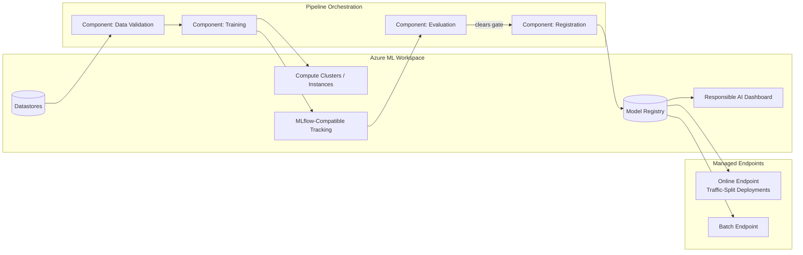
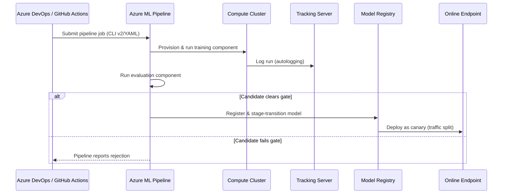
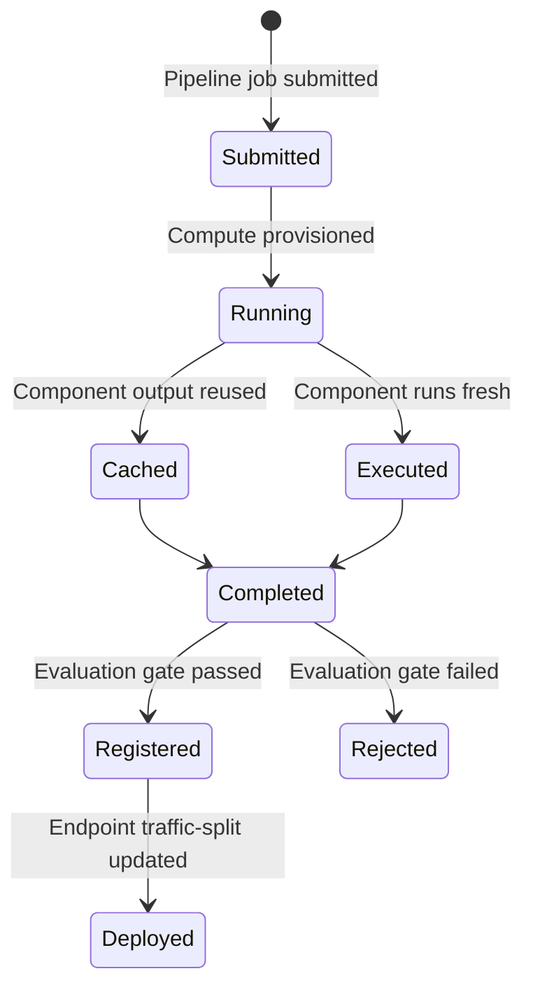

# Azure Machine Learning

> Part of the **Enterprise Data & AI Architecture Handbook** · Phase-11 — AI Platform Engineering & MLOps · Chapter 05.
> Estimated study time: **60 min reading + ~4h labs**.
> **Prerequisite:** read [MLOps and MLflow](03_MLOps_and_MLflow.md) first.

---

## Executive Summary

Every prior Phase-11 chapter has referenced Azure Machine Learning as one of two Azure-native platform paths (alongside Azure Databricks) for training compute, MLflow tracking, the model registry, and managed serving endpoints, without treating the platform itself as the primary subject. This chapter closes that gap: it is the concrete, single-platform deep dive into **Azure Machine Learning (Azure ML)** as a complete, opinionated implementation of the lifecycle [Machine Learning Foundations](01_Machine_Learning_Foundations.md#15-the-end-to-end-ml-lifecycle) §1.5 described abstractly — workspace, compute, datastores, pipelines, endpoints, registry, and governance, unified under one control plane.

This chapter covers **workspaces, compute, and datastores** as Azure ML's foundational resource model; **Azure ML pipelines and components** as its native orchestration mechanism for the multi-stage lifecycle that ML Pipeline Architecture (Phase-11 Chapter 06) generalizes further; **managed online/batch endpoints** as the concrete Azure implementation of the serving patterns from [Model Serving and Ray](04_Model_Serving_and_Ray.md); **the Azure ML model registry and its MLflow integration** as an alternative to (and, for many organizations, a complement of) the Unity Catalog-based registry covered in [MLOps and MLflow](03_MLOps_and_MLflow.md); and **the Responsible AI dashboard** as Azure ML's built-in fairness, explainability, and error-analysis tooling, previewing the fuller treatment in Responsible AI (Phase-11 Chapter 07).

The bias here is necessarily higher than this handbook's usual ~60% Azure ratio, since Azure ML *is* the subject — but the chapter still situates every Azure ML capability against its open-source (MLflow, Kubernetes/AKS via Azure ML's Kubernetes compute target) and AWS/GCP (SageMaker, Vertex AI) equivalents, preserving the comparative decision-making rigor established throughout Phase-11.

**Bottom line:** Azure ML is not "one more tool" alongside Databricks in this handbook's toolkit — it is a complete, vertically integrated alternative implementation of the entire ML lifecycle, and the central architectural decision this chapter equips you to make is not "should we use Azure ML" in isolation, but "given our existing data platform investment (Databricks-centric vs. not), which of Azure ML's or Databricks' overlapping capabilities should be the system of record for training, tracking, registry, and serving" — a decision with real consequences for governance unification and operational complexity either way.

---

## Learning Objectives

By the end of this chapter you will be able to:

1. **Design an Azure ML workspace architecture**, including compute cluster/instance sizing, datastore configuration, and networking (private endpoints, managed VNet).
2. **Build and orchestrate a multi-stage Azure ML pipeline** using reusable components, connecting data validation, training, evaluation, and registration.
3. **Deploy models to Azure ML managed online and batch endpoints**, applying the autoscaling and traffic-splitting patterns from [Model Serving and Ray](04_Model_Serving_and_Ray.md).
4. **Use the Azure ML model registry with its MLflow-compatible tracking**, and decide when it is preferable to a Databricks/Unity Catalog-centric registry.
5. **Apply the Responsible AI dashboard** to generate fairness, explainability, and error-analysis reports for a registered model.
6. **Compare Azure ML against Databricks-centric MLOps** for a given organizational context, and against AWS SageMaker and GCP Vertex AI as external alternatives.
7. **Defend Azure ML architecture decisions** in engineer, staff engineer, architect, and CTO review settings, including the trade-off between platform consolidation and best-of-breed tool selection.

---

## Business Motivation

- **Organizations without an existing Databricks investment need a first-class, fully-managed ML platform**, and Azure ML provides one without requiring the broader Databricks lakehouse commitment — directly relevant for teams whose data estate is Synapse/Fabric-centric rather than Databricks-centric.
- **Fragmented tooling across teams (some using Databricks, some using raw Azure ML, some using neither consistently) creates duplicated platform investment and inconsistent governance** — a deliberate, organization-wide decision about which platform is the system of record for tracking/registry/serving avoids this fragmentation.
- **Responsible AI review is increasingly a regulatory and reputational necessity, not an optional add-on** — Azure ML's built-in Responsible AI dashboard lowers the engineering barrier to producing a fairness/explainability report, directly supporting the governance requirement [Machine Learning Foundations](01_Machine_Learning_Foundations.md#problems-it-cannot-solve) flagged and deferred to Phase-11 Chapter 07.
- **Managed pipeline orchestration reduces the engineering cost of building and maintaining a reliable, reproducible CI/CD/CT pipeline** relative to hand-rolling equivalent orchestration logic, directly extending the CI/CD/CT case from [MLOps and MLflow](03_MLOps_and_MLflow.md) §3.3 with a concrete, Azure-native implementation.
- **A unified workspace/compute/registry surface reduces the operational overhead of managing separate tracking servers, registries, and endpoint infrastructure** that a fully self-assembled open-source stack would otherwise require the platform team to operate independently.

---

## History and Evolution

- **2018 — Azure Machine Learning service launches** (distinct from the earlier Azure ML Studio "classic" drag-and-drop tool), introducing the workspace-centric, code-first model this chapter is built around.
- **2019-2020 — Azure ML pipelines and the SDK v1 mature**, giving teams a first-class way to define reusable, versioned multi-stage ML workflows rather than monolithic training scripts.
- **2021 — Azure ML managed online endpoints launch**, replacing the earlier, more manual Azure Container Instances/AKS-based deployment model with a purpose-built, autoscaling-native serving capability directly comparable to the managed-endpoint patterns [Model Serving and Ray](04_Model_Serving_and_Ray.md) covers generally.
- **2022 — Azure ML SDK v2 and the CLI v2 (YAML-based pipeline/job definitions)** replace the original SDK v1's object-oriented pipeline-construction API with a declarative, version-controllable YAML format, aligning Azure ML's pipeline definitions with the same infrastructure-as-code discipline covered in [Infrastructure as Code with Terraform](../Phase-09/04_Infrastructure_as_Code_with_Terraform.md).
- **2022-2023 — the Responsible AI dashboard is introduced**, consolidating fairness assessment, model interpretability, error analysis, and counterfactual/what-if analysis into a single, integrated tool attached directly to a registered model — a direct, concrete response to the growing regulatory and reputational pressure for demonstrable, not merely asserted, model fairness review.
- **2023-present — MLflow-native tracking and registry compatibility matures**, allowing Azure ML to serve as a drop-in MLflow tracking server and registry target, giving teams already using open-source MLflow (per [MLOps and MLflow](03_MLOps_and_MLflow.md)) a managed backend option without changing their client-side tracking code.
- **2023-present — Azure ML and Azure Databricks converge on shared underlying capability while remaining separate products**, with growing (though not complete) interoperability — a registered MLflow model can often be evaluated or deployed across either platform's compatible endpoints, softening but not eliminating the platform-choice decision this chapter's Decision Matrix addresses.

---

## Why This Technology Exists

Azure ML exists to give an organization a single, vertically integrated, fully-managed control plane for the entire ML lifecycle — compute provisioning, data access, pipeline orchestration, experiment tracking, model registry, deployment, and responsible-AI review — without requiring that organization to assemble and operate each of those capabilities as a separate open-source or bespoke system. For an organization not already centered on Azure Databricks, self-assembling equivalent capability (a self-hosted MLflow tracking server, a hand-built pipeline orchestrator, a custom-built serving layer with autoscaling) is both a significant upfront engineering investment and an ongoing operational burden; Azure ML exists specifically to remove that burden for teams willing to accept its opinionated, Azure-native resource and workflow model in exchange.

---

## Problems It Solves

- **The operational burden of assembling a full ML platform from separate open-source components** — Azure ML provides workspace, compute, tracking, registry, pipelines, and serving as one managed, integrated surface.
- **Inconsistent, ad hoc training-compute provisioning** — Azure ML compute clusters and instances give a standardized, auto-scaling, cost-tracked compute resource model, directly addressing the compute-provisioning discipline from [Machine Learning Foundations](01_Machine_Learning_Foundations.md#compute).
- **Fragile, hand-rolled pipeline orchestration** — Azure ML's component-based pipeline model gives reusable, versioned, testable pipeline stages, reducing the custom-glue-code burden a hand-built orchestration layer would otherwise require.
- **Slow, ad hoc Responsible AI review** — the built-in Responsible AI dashboard (§5.5) generates fairness, explainability, and error-analysis artifacts directly from a registered model without requiring a bespoke analysis pipeline to be built from scratch.
- **Deployment infrastructure complexity** — managed online/batch endpoints (§5.3) remove the burden of hand-building autoscaling, traffic-splitting, and health-check infrastructure that a fully self-managed Kubernetes-based serving layer would require.

---

## Problems It Cannot Solve

- **It cannot make Azure ML the correct choice for every organization.** For teams already deeply centered on Azure Databricks and Unity Catalog, adopting Azure ML as a second, parallel registry/tracking system can fragment governance rather than unify it — the Decision Matrix (§5.25) treats this as a genuine, context-dependent trade-off, not a foregone conclusion.
- **It cannot substitute for the modeling and feature-engineering rigor from [Machine Learning Foundations](01_Machine_Learning_Foundations.md) and [Feature Stores with Feast](02_Feature_Stores_with_Feast.md).** Azure ML provides the platform; it does not provide correct evaluation-metric selection, leakage-free feature engineering, or model quality.
- **It cannot eliminate lock-in entirely.** Azure ML pipelines, components, and its specific YAML job-definition schema are Azure-proprietary; while underlying model artifacts (MLflow flavors, ONNX) remain portable, the orchestration and workspace configuration layer does not migrate to another platform without rework (§5.35 Migration Considerations).
- **It cannot guarantee Responsible AI compliance by generating a dashboard report alone.** The Responsible AI dashboard produces analysis artifacts; a human reviewer must still interpret them and make (and document) the actual go/no-go fairness decision — the tool automates analysis generation, not judgment.
- **It cannot replace the broader data-platform capabilities** ([Delta Lake](../Phase-04/04_Delta_Lake.md), [Feature Stores with Feast](02_Feature_Stores_with_Feast.md)) it consumes as inputs — Azure ML datastores reference underlying data in ADLS Gen2/Delta Lake; it is a lifecycle-management layer atop the data platform, not a replacement for it.

---

## Core Concepts

### 5.1 Workspaces, Compute, and Datastores

- **The Azure ML workspace is the top-level resource boundary** — containing (or referencing) compute, datastores, experiments/runs, registered models, endpoints, and role-based access control, functioning as the single administrative and billing unit for a team's or project's ML work, analogous in scope to a Databricks workspace but with Azure ML's own distinct resource model.
- **Compute clusters** are ephemeral, auto-scale-to-zero multi-node compute pools for training and batch scoring jobs, billed only while actively running — the direct Azure ML implementation of the auto-scale-to-zero training-compute pattern established in [Machine Learning Foundations](01_Machine_Learning_Foundations.md#compute).
- **Compute instances** are persistent, single-user, single-node development VMs (pre-configured with common ML tooling: Jupyter, VS Code integration, common frameworks) intended for interactive notebook development, distinct from compute clusters' job-execution role — an instance left running continuously is a common, avoidable cost (§5.16 Cost Optimization).
- **Datastores** are registered, credential-abstracted references to underlying data locations (ADLS Gen2 being the primary Azure-native target) — a datastore lets a pipeline or training script reference data by a logical name rather than embedding storage account keys or connection strings directly, both a security improvement (per [Identity and Access Management with Entra](../Phase-10/02_Identity_and_Access_Management_with_Entra.md)) and a portability improvement (the underlying storage location can change without every consuming script needing an update).
- **Managed VNet and private endpoints** for the workspace, its compute, and its default storage account keep the entire workspace's data and compute traffic off the public internet, consistent with [Network Security and Zero Trust](../Phase-10/04_Network_Security_and_Zero_Trust.md), and are a standard production-hardening requirement rather than an optional configuration for enterprise deployments.

### 5.2 Azure ML Pipelines and Components

- **A component is a self-contained, versioned, reusable unit of pipeline logic** (a Python script or command with a defined input/output interface and environment specification) — the Azure ML analog of a well-factored function, but at the granularity of an entire pipeline stage (data validation, training, evaluation) rather than a single function call.
- **A pipeline is a directed acyclic graph (DAG) of components**, with Azure ML automatically managing data-dependency resolution between stages, parallel execution of independent components, and caching of unchanged component outputs across re-runs — directly reducing wasted re-computation when only a downstream stage's logic has changed.
- **The CLI v2/YAML pipeline definition format** makes a pipeline's structure fully version-controllable and code-reviewable, aligning with the same infrastructure-as-code and pipeline-as-code discipline established in [Infrastructure as Code with Terraform](../Phase-09/04_Infrastructure_as_Code_with_Terraform.md) and [DevOps and CI/CD](../Phase-09/03_DevOps_and_CI_CD.md).
- **Pipelines are the concrete Azure ML mechanism for implementing the CI/CD/CT sequence from [MLOps and MLflow](03_MLOps_and_MLflow.md#33-cicd-ct-for-models) §3.3**: a data-validation component, a training component, an evaluation component (comparing against the current registered champion), and a conditional registration component chained together as one pipeline, triggered by an Azure DevOps/GitHub Actions pipeline on a commit, schedule, or drift alert.
- **Component reuse across pipelines and teams** mirrors the feature-reuse governance case from [Feature Stores with Feast](02_Feature_Stores_with_Feast.md) §2.5 — a well-authored, versioned data-validation or evaluation component can be shared across multiple teams' pipelines rather than each team reimplementing equivalent logic independently.

### 5.3 Managed Online/Batch Endpoints

- **Managed online endpoints** provide the Azure ML-native implementation of the online-serving patterns from [Model Serving and Ray](04_Model_Serving_and_Ray.md#42-serving-patterns-and-autoscaling) §4.2: autoscaling, traffic-splitting for canary/blue-green deployments, and managed-identity-based access to dependencies, without requiring the team to provision or manage the underlying compute infrastructure directly.
- **Managed batch endpoints** provide the equivalent for the batch-inference pattern from [Model Serving and Ray](04_Model_Serving_and_Ray.md#41-batch-vs-online-vs-streaming-inference) §4.1: a scheduled or on-demand job scoring a large dataset, auto-scaling compute for the duration of the batch run and releasing it afterward.
- **Deployments within an endpoint** are the mechanism for traffic-splitting: a single endpoint (a stable, versioned API surface) can host multiple deployments (specific model version + compute configuration combinations), with traffic percentages assigned per deployment — directly implementing the canary-deployment pattern from [Model Serving and Ray](04_Model_Serving_and_Ray.md#42-serving-patterns-and-autoscaling) §4.2.
- **GPU-enabled online endpoints** support the same dynamic-batching configuration principles covered generally in [Model Serving and Ray](04_Model_Serving_and_Ray.md#44-gpu-utilization-and-batching) §4.4, tunable per-deployment to balance latency against GPU throughput efficiency.
- **Endpoint authentication** defaults to key-based or Azure AD token-based access, with managed identity integration for the endpoint's own outbound calls (e.g., to a datastore or another service), consistent with the managed-identity default established throughout this handbook's security chapters.

### 5.4 Model Registry and MLflow Integration

- **The Azure ML model registry is natively MLflow-compatible**: models logged via standard MLflow tracking APIs (from any Azure ML training job, or even external MLflow-instrumented training) can be registered directly into the Azure ML registry without a separate export/import step, giving teams already using MLflow's client API (per [MLOps and MLflow](03_MLOps_and_MLflow.md#31-experiment-tracking-and-reproducibility)) a managed backend option with no client-side code change.
- **Azure ML's registry supports the same stage-transition and versioning concepts** ([MLOps and MLflow](03_MLOps_and_MLflow.md#32-model-registry-and-stage-transitions) §3.2) as the Unity Catalog model registry, though its specific access-control and namespacing model (workspace-scoped, with an optional cross-workspace "registry" resource for sharing models across workspaces) differs from Unity Catalog's catalog.schema.model hierarchy.
- **Azure ML registries (the cross-workspace sharing resource, distinct from a single workspace's local model registry) enable sharing a registered model across multiple workspaces/environments** (dev/test/production workspaces, for example), a capability directly analogous to Unity Catalog's cross-workspace model sharing within one metastore.
- **The choice between Azure ML's registry and Databricks/Unity Catalog's registry (§5.25 Decision Matrix) is primarily a platform-fit and governance-consolidation decision**, not a capability gap — both provide versioned, stage-tagged, access-controlled model governance; the deciding factor is typically which platform already holds the organization's broader data/feature governance investment.
- **MLflow's portable model format means a model trained and tracked via open-source MLflow elsewhere can be registered into Azure ML's registry**, and conversely an Azure-ML-trained model's MLflow-format artifact can be deployed via other MLflow-compatible serving targets — the portability property [MLOps and MLflow](03_MLOps_and_MLflow.md#migration-considerations) highlighted as reducing artifact-level lock-in applies identically here.

### 5.5 Responsible AI Dashboard

- **The Responsible AI dashboard is a single, integrated tool combining four analysis capabilities**: model interpretability (feature-importance and SHAP-based explanations), fairness assessment (disaggregated performance metrics across sensitive/protected attribute groups), error analysis (identifying specific data cohorts where the model underperforms), and counterfactual/what-if analysis (exploring how a prediction would change under different input values) — attached directly to a registered model version rather than existing as a disconnected, separately-maintained analysis notebook.
- **Fairness assessment requires the analyst to specify sensitive attributes explicitly** (e.g., a demographic attribute relevant to a fair-lending or hiring use case) — the dashboard computes disaggregated metrics across the specified groups, but *which* attributes are relevant and what constitutes an acceptable disparity remains a domain and legal judgment call, not something the tool determines automatically.
- **Error analysis surfaces underperforming cohorts systematically** (via a decision-tree-based cohort-discovery algorithm), often revealing a specific data segment (e.g., a particular customer segment or transaction type) where the model's error rate is materially higher than its aggregate metric would suggest — directly extending the class-imbalance and cost-asymmetry evaluation discipline from [Machine Learning Foundations](01_Machine_Learning_Foundations.md#12-training-validation-and-evaluation-metrics) §1.2 to a sub-population level.
- **The dashboard's outputs are analysis artifacts, not a pass/fail gate by themselves** — attaching a Responsible AI report to a registered model version documents the analysis that was performed and its findings; the actual go/no-go promotion decision (integrated into the registry stage-transition gate from [MLOps and MLflow](03_MLOps_and_MLflow.md#32-model-registry-and-stage-transitions) §3.2) still requires a human reviewer's judgment against the organization's fairness policy.
- **This section is a deliberate preview, not the full treatment**: Responsible AI (Phase-11 Chapter 07) covers the broader discipline (fairness metrics selection, mitigation techniques, regulatory context) this dashboard operationalizes; this chapter's scope is specifically the Azure ML tool itself and how it attaches to the registry/pipeline architecture already established.

---

## Internal Working

**How an Azure ML pipeline job actually executes** (the mechanics tying together §5.1-5.2):

1. **Submission**: the CLI v2/YAML pipeline definition is submitted (via `az ml job create` or the Azure DevOps/GitHub Actions pipeline invoking it), referencing each component's environment (a Docker image or Conda specification) and compute target.
2. **Dependency resolution**: Azure ML parses the pipeline's DAG, determining which components can run in parallel (no data dependency between them) and which must run sequentially.
3. **Compute provisioning**: for each component ready to execute, Azure ML provisions (or reuses, if already warm) the specified compute cluster node(s), pulling the component's environment image.
4. **Component execution with input/output resolution**: each component executes with its declared inputs resolved from either a datastore reference or a prior component's output, and writes its declared outputs to a managed, versioned output location.
5. **Caching**: if a component's inputs and code have not changed since a prior run, Azure ML can reuse the cached output rather than re-executing it, directly reducing redundant compute cost for pipeline re-runs where only a downstream stage changed.
6. **MLflow autologging within a training component**: if the training component's script uses MLflow's tracking API (natively or via autologging), run metadata is logged to the workspace's built-in MLflow-compatible tracking server automatically, without any additional Azure ML-specific instrumentation.
7. **Conditional registration**: an evaluation component's output (a pass/fail signal against the current registered champion, per [MLOps and MLflow](03_MLOps_and_MLflow.md#32-model-registry-and-stage-transitions) §3.2's promotion gate) determines whether a subsequent registration component actually registers and stage-transitions the new model version.

This sequence is architecturally identical to the CI/CD/CT mechanics [MLOps and MLflow](03_MLOps_and_MLflow.md#internal-working) described generally — Azure ML pipelines are simply the concrete Azure-native implementation of that same orchestration logic, with dependency resolution, compute provisioning, and caching handled natively by the platform rather than requiring bespoke orchestration code.

---

## Architecture

- **Workspace layer**: the Azure ML workspace, holding compute, datastore references, RBAC, and linking to the workspace's built-in Application Insights, Key Vault, and storage account.
- **Compute layer**: compute clusters (training/batch) and compute instances (development), both provisioned within the workspace's managed VNet.
- **Orchestration layer**: Azure ML pipelines, invoked directly or via an external Azure DevOps/GitHub Actions CI/CD/CT pipeline.
- **Tracking and registry layer**: the workspace's built-in MLflow-compatible tracking server and model registry.
- **Deployment layer**: managed online/batch endpoints, each hosting one or more traffic-split deployments.
- **Governance layer**: the Responsible AI dashboard, attached to specific registered model versions, plus RBAC and Azure Policy governing workspace-level access and configuration.

---

## Components

- **Workspace** — the top-level resource boundary for compute, data, experiments, models, and endpoints.
- **Compute cluster/instance** — the ephemeral (cluster) or persistent (instance) compute resource executing training, batch scoring, or interactive development.
- **Datastore** — the credential-abstracted reference to underlying data storage (ADLS Gen2).
- **Environment** — the versioned Docker image/Conda specification defining a component's or job's runtime dependencies.
- **Component** — a versioned, reusable pipeline stage with a defined input/output interface.
- **Pipeline (job)** — a DAG of components, submitted and tracked as a single orchestrated execution.
- **Registered model** — a versioned model artifact in the workspace (or cross-workspace) registry, MLflow-compatible.
- **Online/batch endpoint and deployment** — the serving-layer resources hosting one or more model versions with traffic-splitting.
- **Responsible AI dashboard** — the fairness/explainability/error-analysis artifact attached to a registered model.

---

## Metadata

- **Workspace metadata**: region, associated Key Vault/Application Insights/storage account, RBAC assignments, and managed VNet configuration.
- **Run/job metadata**: parameters, metrics, logs, and code snapshot — the Azure ML-native equivalent of the MLflow run metadata from [MLOps and MLflow](03_MLOps_and_MLflow.md#31-experiment-tracking-and-reproducibility) §3.1, since Azure ML's tracking is MLflow-compatible.
- **Component metadata**: version, input/output schema, and environment reference, enabling discovery and reuse across pipelines.
- **Registered model metadata**: version, source run ID, stage tag, and (where generated) a linked Responsible AI dashboard report reference.
- **Endpoint/deployment metadata**: current traffic-split percentages per deployment, compute SKU, and autoscaling configuration.

---

## Storage

- **Default workspace storage account (ADLS Gen2-backed)**: holds job outputs, logs, and, unless overridden, model artifacts by default.
- **Registered datastores**: references to additional ADLS Gen2 containers, Blob Storage accounts, or (via appropriate connectors) other data sources such as Azure SQL, decoupling pipeline/training code from hardcoded storage locations.
- **Model artifact storage**: registered model files, versioned and immutable per registered version, mirroring the artifact-versioning discipline from [MLOps and MLflow](03_MLOps_and_MLflow.md#storage).
- **Pipeline output caching storage**: intermediate component outputs, retained to support the caching behavior described in Internal Working step 5.

---

## Compute

- **Compute clusters**: auto-scale-to-zero, multi-node pools for training and batch-scoring jobs, sized (CPU/GPU, node count) per the workload's requirements, following the same compute-sizing guidance from [Machine Learning Foundations](01_Machine_Learning_Foundations.md#compute).
- **Compute instances**: single-node, persistent development VMs; because they are not auto-scale-to-zero by default, an idle instance left running is a direct, avoidable cost (§5.16).
- **Serverless compute (Azure ML's "serverless" job compute option)**: removes the need to pre-provision a named compute cluster at all for simple jobs, with Azure ML managing compute allocation transparently per job — a lower-friction option for teams not needing fine-grained cluster configuration control.
- **Kubernetes compute target (Azure ML on AKS)**: an option for teams wanting to run Azure ML training/inference workloads on a self-managed AKS cluster (e.g., to share GPU capacity with non-ML workloads, or to integrate with an existing Kubernetes-centric platform), bridging Azure ML's managed abstractions with the Kubernetes-native infrastructure covered in [Kubernetes](../Phase-09/06_Kubernetes.md).

---

## Networking

- **Managed VNet** provides Azure ML-managed network isolation for the workspace's compute and its outbound dependencies, reducing the manual VNet configuration burden relative to a fully customer-managed VNet setup.
- **Private endpoints** for the workspace, its default storage account, Key Vault, and container registry keep all workspace traffic off the public internet, consistent with [Network Security and Zero Trust](../Phase-10/04_Network_Security_and_Zero_Trust.md).
- **Private endpoints for managed online endpoints** restrict inference traffic to the private network, following the same networking posture as [Model Serving and Ray](04_Model_Serving_and_Ray.md#networking).
- **Outbound rules for managed VNet** allow explicit, auditable allow-listing of the specific external endpoints (e.g., a package repository, a specific external API) a training job legitimately needs to reach, consistent with the default-deny egress baseline from [Network Security and Zero Trust](../Phase-10/04_Network_Security_and_Zero_Trust.md).

---

## Security

- **Azure RBAC governs workspace-level access** (who can create compute, submit jobs, register models, deploy endpoints), following the standard Azure role-assignment model from [Identity and Access Management with Entra](../Phase-10/02_Identity_and_Access_Management_with_Entra.md).
- **Managed identities for compute and endpoints** authenticate to datastores, Key Vault, and other Azure resources without embedded credentials, the same default established throughout this handbook.
- **Workspace-integrated Key Vault** stores secrets (API keys, connection strings) referenced by training scripts and pipelines via Azure ML's secret-retrieval API, per [Secrets and Key Management](../Phase-10/05_Secrets_and_Key_Management.md).
- **Customer-managed keys (CMK)** can encrypt workspace data (per [Data Security and Encryption](../Phase-10/03_Data_Security_and_Encryption.md)) for organizations with stricter key-ownership requirements, at the operational cost of managing key rotation and the post-rotation verification discipline from [Secrets and Key Management](../Phase-10/05_Secrets_and_Key_Management.md) ADR-0145.

---

## Performance

- **Compute cluster cold-start latency** (provisioning a new node from zero) affects both pipeline job start time and, for online endpoints, autoscaling reaction time — the same cold-start consideration [Model Serving and Ray](04_Model_Serving_and_Ray.md#performance) raised for scale-to-zero endpoints.
- **Pipeline component caching (§5.2, Internal Working step 5)** is the primary performance lever for reducing iterative pipeline development and re-run time, avoiding redundant re-execution of unchanged upstream stages.
- **Datastore read throughput** for large training datasets benefits from the same columnar-format and file-layout optimization guidance ([Columnar Storage Internals](../Phase-04/02_Columnar_Storage_Internals.md)) as any other Spark/Python-based data-loading path.
- **Managed online endpoint latency and batching tuning** follow the identical principles established in [Model Serving and Ray](04_Model_Serving_and_Ray.md#45-latency-and-throughput-tuning) §4.5, since Azure ML's managed endpoints are one of that chapter's primary implementation targets.

---

## Scalability

- **Compute cluster horizontal scaling** (adding nodes up to a configured maximum) handles larger training/batch-scoring workloads, following the same distributed-training scaling guidance from [Machine Learning Foundations](01_Machine_Learning_Foundations.md#scalability).
- **Pipeline parallelism** — independent components within a pipeline's DAG execute concurrently across separate compute allocations, scaling a multi-stage pipeline's wall-clock time down relative to a fully sequential execution.
- **Managed endpoint autoscaling** scales serving replica count with load, per [Model Serving and Ray](04_Model_Serving_and_Ray.md#42-serving-patterns-and-autoscaling) §4.2's autoscaling patterns.
- **Cross-workspace registry sharing** scales model governance across many workspaces (dev/test/prod, or per-team workspaces) from a single shared registry resource, avoiding the need to re-register or manually copy a model into every workspace that needs to consume it.

---

## Fault Tolerance

- **Pipeline job retry policies** allow a transient component failure (a network blip, a transient compute provisioning failure) to be retried automatically without failing the entire pipeline run, following the same idempotent-retry discipline from [DataOps Foundations](../Phase-09/01_DataOps_Foundations.md).
- **Endpoint deployment health probes** automatically detect and replace an unhealthy serving instance, the Azure ML-managed equivalent of the replica health-check pattern from [Model Serving and Ray](04_Model_Serving_and_Ray.md#fault-tolerance).
- **Traffic-split rollback**: because a managed online endpoint can host multiple deployments simultaneously, rolling back a bad deployment is a fast traffic-percentage adjustment (shifting traffic back to the prior deployment) rather than a full redeployment, directly implementing the fast-rollback fault-tolerance pattern from [MLOps and MLflow](03_MLOps_and_MLflow.md#fault-tolerance).
- **Cross-region workspace redundancy** (a secondary workspace in a paired region) is available for the highest-availability requirements, at the added cost and complexity of keeping registered models, pipelines, and endpoint configuration synchronized across workspaces — a deliberate trade-off, not a default recommendation for every workload.

---

## Cost Optimization (FinOps)

- **Auto-scale-to-zero compute clusters** for training/batch workloads, and **scheduled shutdown for compute instances** (or converting exploratory work to serverless compute where fine-grained cluster control is unnecessary), directly addressing the idle-compute-instance cost risk flagged in §5.6.
- **Pipeline output caching** avoids redundant compute cost for unchanged upstream pipeline stages, a direct, automatic cost saving requiring no additional configuration once components are properly authored with clear input/output boundaries.
- **Low-priority/spot compute nodes** for fault-tolerant, checkpointed training jobs, following the same discount-vs-preemption trade-off from [Machine Learning Foundations](01_Machine_Learning_Foundations.md#cost-optimization-finops).
- **Right-sizing managed endpoint autoscaling bounds** to actual serving traffic (not training-time or peak-estimate load), per the FinOps guidance in [Model Serving and Ray](04_Model_Serving_and_Ray.md#cost-optimization-finops).

**Worked FinOps example**: A data science team of six maintains individual compute instances (Standard_DS3_v2) left running continuously "in case they need them," at roughly $0.19/hour × 24 × 30 × 6 ≈ **$821/month**. Enforcing a scheduled auto-shutdown policy (instances stop automatically after 60 minutes of inactivity, a native Azure ML compute-instance setting) reduces actual running time to an estimated 4 hours/day of genuine active use per person, cutting cost to roughly $0.19 × 4 × 30 × 6 ≈ **$137/month** — an 83% reduction — with the only trade-off being a brief instance-restart delay (typically 2-3 minutes) the next time a team member resumes work after a period of inactivity, a modest inconvenience relative to the recurring monthly savings.

---

## Monitoring

- **Job/pipeline run monitoring**: status, duration, and resource utilization per component, surfaced in the Azure ML Studio UI and exportable to Azure Monitor.
- **Endpoint monitoring**: request volume, latency percentiles, and error rate, natively integrated with Application Insights for the workspace, extending the latency/throughput monitoring discipline from [Model Serving and Ray](04_Model_Serving_and_Ray.md#monitoring).
- **Data drift monitoring**: Azure ML's built-in data-drift detection compares a deployed model's serving-time input distribution against its training-time distribution, directly implementing the drift-monitoring capability [Machine Learning Foundations](01_Machine_Learning_Foundations.md#16-monitoring) §1's Monitoring section described generally, and feeding the same CT-trigger pattern from [MLOps and MLflow](03_MLOps_and_MLflow.md#33-cicd-ct-for-models) §3.3.
- **Cost monitoring**: Azure Cost Management integration at the workspace/resource-group level, tagged by compute resource, directly supporting the FinOps tracking recommended in §5.16.

---

## Observability

- **Application Insights integration** gives the workspace's endpoints and pipeline jobs unified, queryable telemetry alongside any other Azure-hosted application component the organization already monitors, avoiding a separate, disconnected ML-specific observability stack.
- **End-to-end lineage from a deployed endpoint back through its registered model, source run, and pipeline definition** is natively queryable within the Azure ML Studio UI and API, directly implementing the lineage chain [MLOps and MLflow](03_MLOps_and_MLflow.md#35-model-lineage-and-governance) §3.5 described generally.
- **Responsible AI dashboard artifacts** (§5.5) attached to a model version are themselves a queryable observability surface for fairness/explainability review history, not merely a one-time report generated and then disconnected from the model's ongoing record.

### Operational Response Playbook

| Signal | Detection Query/Check | Remediation |
|---|---|---|
| **Data-drift monitor flags a deployed endpoint's input distribution diverging from training data** | Azure ML data-drift dashboard, cross-referenced with the endpoint's live performance metrics (per [Machine Learning Foundations](01_Machine_Learning_Foundations.md#16-monitoring)) | Trigger the CT pipeline (per [MLOps and MLflow](03_MLOps_and_MLflow.md#33-cicd-ct-for-models) §3.3) to retrain; do not treat the drift alert alone as sufficient justification to promote a retrained model — still require it to clear the evaluation gate before promotion |
| **Compute instance costs unexpectedly high in a monthly cost review** | Azure Cost Management, filtered to compute-instance resource type, cross-referenced against each instance's configured auto-shutdown policy | Verify auto-shutdown is enabled and correctly configured on every compute instance; a disabled or misconfigured shutdown policy is the most common root cause of this specific cost anomaly |

---

## Governance

- **RBAC and Azure Policy govern workspace creation, configuration, and access**, extending the organization's broader Azure governance model (per [Well-Architected Framework](../Phase-03/07_Well_Architected_Framework.md)) to the ML platform specifically.
- **Every registered model should carry a linked Responsible AI dashboard report for regulated or high-stakes use cases**, as a condition of Production-stage promotion, consistent with the fairness-review governance gate from [Machine Learning Foundations](01_Machine_Learning_Foundations.md#governance) and [MLOps and MLflow](03_MLOps_and_MLflow.md#governance).
- **Cross-workspace registry sharing must itself be access-controlled**, since a shared registry resource extends a model's visibility beyond a single workspace's RBAC boundary.
- **Pipeline and component definitions should be version-controlled and code-reviewed** (the CLI v2/YAML format's key governance benefit), preserving the same change-management discipline [Infrastructure as Code with Terraform](../Phase-09/04_Infrastructure_as_Code_with_Terraform.md) established for infrastructure changes generally.

---

## Trade-offs

- **Azure ML vs. Azure Databricks as the MLOps system of record**: Azure ML offers a lighter-weight, more narrowly ML-focused platform without requiring the broader Databricks lakehouse commitment; Databricks offers tighter integration with an existing Databricks-centric data estate (Unity Catalog governance unifying data, feature, and model assets) — the central decision this chapter's Decision Matrix addresses.
- **Managed VNet vs. fully customer-managed VNet**: managed VNet reduces networking configuration burden at the cost of some configuration flexibility; a fully customer-managed VNet offers maximum control at higher setup and maintenance complexity.
- **Compute clusters vs. serverless compute**: serverless compute reduces configuration burden for simple jobs at the cost of some fine-grained control over cluster sizing/behavior that a named compute cluster provides.
- **Responsible AI dashboard's built-in analysis vs. a custom fairness-analysis pipeline**: the built-in dashboard is faster to adopt and consistently structured across teams, at the cost of some flexibility relative to a fully custom analysis pipeline built for a highly specific regulatory requirement.

---

## Decision Matrix

| Scenario | Recommended Approach | Rationale |
|---|---|---|
| Organization already deeply centered on Azure Databricks + Unity Catalog | Databricks-native MLflow tracking + Unity Catalog registry as system of record; Azure ML optional for specific endpoint/Responsible-AI needs | Avoids fragmenting governance across two parallel registries |
| Organization centered on Synapse/Fabric or without a Databricks investment | Azure ML as the primary MLOps platform | Provides a complete, managed lifecycle platform without requiring a separate lakehouse commitment |
| Need for built-in, low-effort Responsible AI/fairness reporting | Azure ML Responsible AI dashboard, regardless of primary tracking/registry platform | Purpose-built tool lowers the barrier to consistent fairness review across teams |
| Need for fine-grained Kubernetes-native control over training/serving infrastructure | Azure ML with Kubernetes compute target (AKS), or Ray Serve per [Model Serving and Ray](04_Model_Serving_and_Ray.md) | Bridges Azure ML's managed abstractions with existing Kubernetes-centric platform investment |
| Multi-cloud/platform-neutral requirement | Self-hosted MLflow + Kubernetes-based serving, avoiding either Azure ML's or Databricks' proprietary registry/pipeline lock-in | Matches the same multi-cloud principle established in [Feature Stores with Feast](02_Feature_Stores_with_Feast.md) and [MLOps and MLflow](03_MLOps_and_MLflow.md) |

---

## Design Patterns

- **Component-based pipeline authoring with clear input/output contracts**, enabling both caching (§5.9) and cross-team component reuse (§5.2).
- **CLI v2/YAML pipeline definitions checked into source control**, reviewed via pull request like any other infrastructure-as-code artifact.
- **Responsible AI dashboard generation as a mandatory pipeline stage for regulated models**, attaching the resulting report directly to the registered model version rather than maintaining it as a separate, disconnected document.
- **Traffic-split canary deployment via managed online endpoint deployments**, directly implementing the canary pattern from [Model Serving and Ray](04_Model_Serving_and_Ray.md#42-serving-patterns-and-autoscaling) §4.2 using Azure ML's native deployment/traffic-split primitives.

---

## Anti-patterns

- **Running Azure ML as a second, parallel registry alongside an existing Databricks/Unity Catalog registry without a clear system-of-record decision**, fragmenting model governance across two systems.
- **Leaving compute instances running continuously "just in case"**, a direct, avoidable cost (§5.16).
- **Treating the Responsible AI dashboard's generated report as a self-certifying pass**, without an actual human review and documented go/no-go decision against the organization's fairness policy.
- **Building pipeline components without clear, minimal input/output contracts**, defeating the caching mechanism (§5.9) and making component reuse across pipelines impractical.
- **Deploying directly to 100% traffic without using the deployment/traffic-split mechanism for a canary phase**, forgoing the fast-rollback and early-warning benefits that mechanism provides.

---

## Common Mistakes

- Choosing Azure ML as a second, uncoordinated MLOps platform in a Databricks-centric organization without first deciding which system is authoritative for tracking/registry.
- Forgetting to configure auto-shutdown on compute instances, leading to the avoidable cost pattern in the worked FinOps example.
- Authoring pipeline components with overly broad input dependencies (e.g., depending on an entire dataset rather than the specific slice needed), unnecessarily invalidating the caching mechanism on unrelated upstream changes.
- Generating a Responsible AI report once at initial model registration and never regenerating it for subsequent retrained versions, leaving fairness review stale relative to the currently deployed model.
- Not using the traffic-split deployment mechanism for canary validation, discovering a serving-time regression only after a full-traffic cutover.

---

## Best Practices

- Make an explicit, documented decision about which platform (Azure ML or Databricks/Unity Catalog) is the system of record for tracking and registry before adopting both in parallel.
- Enforce compute-instance auto-shutdown policies organization-wide as a default, not an opt-in.
- Author pipeline components with minimal, well-defined input/output contracts to maximize caching effectiveness and cross-team reusability.
- Require a current Responsible AI dashboard report as a condition of Production-stage promotion for every regulated or high-stakes model, regenerated for each new model version.
- Use the traffic-split deployment mechanism for every production model rollout, without exception, mirroring the canary-deployment mandate from [Model Serving and Ray](04_Model_Serving_and_Ray.md) ADR-0151.

---

## Enterprise Recommendations

- Standardize on Azure ML as the primary MLOps platform for teams not already centered on Azure Databricks, and standardize on Databricks/Unity Catalog for teams that are — avoiding a default of adopting both without a clear governance-ownership decision.
- Mandate Responsible AI dashboard generation and human sign-off as a non-optional pipeline stage for every regulated or high-stakes model, regardless of which platform is the primary MLOps system of record.
- Track compute-instance utilization and enforce auto-shutdown policies as a standing platform-level FinOps control, not a per-team responsibility.
- Require every production pipeline definition to be version-controlled, code-reviewed CLI v2/YAML, never manually constructed and run ad hoc through the Studio UI for production workloads.

---

## Azure Implementation

- **Azure Machine Learning workspace** as the central resource, with managed VNet, private endpoints, and Key Vault/Application Insights integration.
- **Compute clusters, compute instances, and serverless compute** for training, batch scoring, and interactive development respectively.
- **Azure ML pipelines (CLI v2/YAML)** for the full CI/CD/CT orchestration sequence, invoked from Azure DevOps or GitHub Actions.
- **Managed online and batch endpoints** with traffic-split deployments for serving.
- **The Responsible AI dashboard**, integrated directly with the registered model.

---

## Open Source Implementation

- **MLflow** as the tracking/registry API surface Azure ML natively implements compatibility with, allowing MLflow-instrumented training code to run unmodified against Azure ML's backend.
- **Kubernetes (AKS)** as an alternative compute target for teams needing Kubernetes-native control over training/serving infrastructure.
- **ONNX** as a portable model format for models registered in Azure ML that may need to be served or migrated across other MLflow/ONNX-compatible platforms.
- **Fairlearn and InterpretML** as the open-source libraries underlying much of the Responsible AI dashboard's fairness and interpretability analysis, usable independently outside Azure ML for teams wanting the same analysis capability without the managed dashboard.

---

## AWS Equivalent (comparison only)

- **Amazon SageMaker** provides the direct workspace/compute/pipeline/registry/endpoint equivalent, with SageMaker Clarify providing comparable fairness/explainability analysis to Azure ML's Responsible AI dashboard.
- **Advantages**: deep integration with the broader AWS ecosystem for AWS-centric teams, consistent with the parallel comparisons throughout this handbook's Phase-11 chapters.
- **Disadvantages**: a materially different workspace/pipeline/registry model and API surface, meaning genuine re-platforming effort for migration.
- **Migration strategy**: MLflow-format model artifacts and ONNX-exported models migrate with the least friction; Azure ML pipeline (YAML) definitions and SageMaker Pipeline definitions require independent rework against each platform's respective schema.
- **Selection criteria**: choose SageMaker when the broader ML/data estate is AWS-centric; otherwise this chapter's Azure-primary recommendation applies.

---

## GCP Equivalent (comparison only)

- **Google Vertex AI** provides the equivalent workspace/pipeline (Vertex AI Pipelines, built on Kubeflow)/registry/endpoint capability, with Vertex AI's Explainable AI providing comparable interpretability analysis.
- **Advantages**: strong fit for BigQuery/GCP-centric data estates, consistent with the parallel GCP comparisons throughout Phase-11.
- **Disadvantages**: the same re-platforming cost pattern as the AWS case relative to Azure ML's specific pipeline/registry model.
- **Migration strategy**: as with AWS, portable model artifact formats reduce artifact-level migration cost; pipeline and registry-native configuration require rework.
- **Selection criteria**: choose Vertex AI when the data estate is BigQuery/GCP-centric; otherwise default to the Azure-primary recommendation.

---

## Migration Considerations

- **MLflow-compatible tracking and registry data migrate with the least friction** between Azure ML and any other MLflow-compatible backend (self-hosted MLflow, Databricks), since the underlying tracking API and model artifact format are shared.
- **Azure ML pipeline (CLI v2/YAML) definitions are Azure-proprietary** and require rewriting against the target platform's equivalent orchestration schema (Databricks Workflows, SageMaker Pipelines, Kubeflow/Vertex AI Pipelines) during a migration — the same pipeline-definition portability gap [MLOps and MLflow](03_MLOps_and_MLflow.md#migration-considerations) noted for CI/CD pipeline definitions generally.
- **Managed online/batch endpoint configuration (autoscaling rules, traffic splits) must be re-validated, not merely copied**, following the same re-validation discipline [Model Serving and Ray](04_Model_Serving_and_Ray.md#migration-considerations) recommended for serving-platform migrations generally.
- **Responsible AI dashboard reports are Azure ML-specific artifacts** — migrating to another platform requires either regenerating equivalent fairness/explainability analysis using that platform's tooling (SageMaker Clarify, Vertex AI Explainable AI) or a standalone open-source equivalent (Fairlearn/InterpretML, used directly), since the dashboard's specific report format does not transfer as-is.

---

## Mermaid Architecture Diagrams

---

## End-to-End Data Flow

1. **Data reference**: a pipeline's data-validation component reads from a registered datastore referencing curated data in ADLS Gen2.
2. **Training**: a training component executes on a compute cluster, with MLflow autologging capturing run provenance to the workspace's tracking server.
3. **Evaluation**: an evaluation component compares the new candidate against the current registered Production model using the agreed metric from [Machine Learning Foundations](01_Machine_Learning_Foundations.md#12-training-validation-and-evaluation-metrics) §1.2.
4. **Conditional registration**: a passing candidate is registered and stage-transitioned; a Responsible AI dashboard report is generated and attached for regulated models.
5. **Deployment**: the newly registered model is deployed as a canary (traffic-split) deployment on a managed online endpoint.
6. **Monitoring and CT feedback**: endpoint latency, drift, and performance monitors feed the same CT-trigger loop established in [MLOps and MLflow](03_MLOps_and_MLflow.md#33-cicd-ct-for-models) §3.3, restarting the pipeline on the next trigger.

---

## Real-world Business Use Cases

- **An insurance company standardizing on Azure ML** (not previously Databricks-centric) for underwriting-risk models, using the Responsible AI dashboard to satisfy fair-lending-adjacent regulatory review requirements.
- **A retailer using Azure ML batch endpoints** for nightly demand-forecast scoring across thousands of SKU/store combinations, with training orchestrated via versioned CLI v2/YAML pipelines.
- **A healthcare provider using Azure ML managed online endpoints with strict private-endpoint networking** for a diagnostic-support model, combining the platform's built-in governance with the broader compliance requirements from [Compliance and Regulatory Frameworks](../Phase-10/06_Compliance_and_Regulatory_Frameworks.md).

---

## Industry Examples

- **Financial services** organizations frequently choose Azure ML specifically for its integrated Responsible AI dashboard, given the fair-lending and model-risk-management regulatory pressure discussed in [Compliance and Regulatory Frameworks](../Phase-10/06_Compliance_and_Regulatory_Frameworks.md).
- **Manufacturing and industrial** organizations use Azure ML's Kubernetes compute target integration to run training and inference on existing on-premises-connected AKS infrastructure, bridging cloud-managed orchestration with edge/on-prem compute requirements.
- **Retail and consumer organizations without a Databricks investment** adopt Azure ML as their complete MLOps platform, paired with Synapse or Fabric for the broader data warehouse/lakehouse layer.

---

## Case Studies

**Case Study 1 — Governance fragmentation from adopting Azure ML without a system-of-record decision.** An organization already using Azure Databricks and Unity Catalog for its data and feature governance began a new initiative using Azure ML directly (without an explicit decision about which platform would be authoritative), because the team building it was more familiar with Azure ML's SDK. Within several months, the organization had two parallel, uncoordinated model registries — some models registered in Unity Catalog, others in Azure ML — with no single place to answer "what models does this organization have in production." A subsequent platform-consolidation effort required manually auditing both registries, and the organization ultimately standardized on Unity Catalog as the system of record (given its unification with the broader Databricks-centric data/feature governance), migrating the Azure-ML-registered models' MLflow-format artifacts into Unity Catalog with a modest, one-time re-registration effort. The lesson, reflected in this chapter's ADR: the choice of MLOps platform must be made deliberately and organization-wide, not left to individual project teams' tooling familiarity, precisely because MLflow's artifact-level portability makes it easy (and tempting) to start using a second platform without recognizing the governance-fragmentation cost until it has already accumulated.

**Case Study 2 — A Responsible AI report generated once and never regenerated.** A credit-scoring model's initial version underwent Responsible AI dashboard review and fairness sign-off before its first production deployment. Over the following year, three retrained versions were promoted via the CI/CD/CT pipeline's automated evaluation gate (per [MLOps and MLflow](03_MLOps_and_MLflow.md) ADR-0150), each correctly clearing the accuracy-based promotion threshold — but no Responsible AI report was regenerated for any of the three retrained versions, since the automated pipeline's evaluation gate checked only the accuracy-based metric, not fairness. An external audit eighteen months later specifically requested the fairness-analysis report for the *currently deployed* model version, and the team discovered the only report on file was for a model version retired over a year earlier. The remediation — adding Responsible AI dashboard generation as a mandatory pipeline stage attached to every registration event, not just the initial one — closed the gap going forward. The lesson: an automated promotion gate that only checks one dimension (accuracy) of a model's acceptability creates exactly this kind of governance staleness on every other dimension (fairness) that is not equally automated and enforced.

---

## Hands-on Labs

1. **Lab 1 — Provision an Azure ML workspace with private networking.** Create a workspace with a managed VNet, private endpoints for its storage account and Key Vault, and a compute cluster, using the Azure CLI/Bicep.
2. **Lab 2 — Build a multi-component pipeline.** Author a data-validation component, a training component (with MLflow autologging), and an evaluation component, and assemble them into a CLI v2/YAML pipeline; run it and verify caching behavior on a re-run with no upstream changes.
3. **Lab 3 — Deploy with traffic-split canary.** Deploy a registered model to a managed online endpoint at 100% traffic, then deploy a second model version as a 10% canary, and practice both promoting to full traffic and rolling back.
4. **Lab 4 — Generate a Responsible AI dashboard report.** For a classification model with a specified sensitive attribute, generate a Responsible AI dashboard report and interpret its fairness and error-analysis findings.

---

## Exercises

1. Given an organization's described data-platform investment (Databricks-centric vs. not), recommend and justify a primary MLOps platform choice (Azure ML vs. Databricks/Unity Catalog).
2. Design a pipeline component boundary for a described training workflow that maximizes caching effectiveness across iterative re-runs.
3. Identify the specific governance gap in Case Study 2 and describe the pipeline change that would have prevented it.
4. Given a described regulated use case, specify which sensitive attributes should be evaluated in a Responsible AI fairness assessment and justify the choice.

---

## Mini Projects

1. **Build a full Azure ML CI/CD/CT pipeline** from an Azure DevOps trigger through data validation, training, evaluation-gated registration, Responsible AI report generation, and canary deployment to a managed online endpoint.
2. **Build a cross-platform model-portability test**: train and register a model in Azure ML via MLflow, export its artifact, and demonstrate it can be loaded and served independently outside Azure ML (e.g., via a plain MLflow model-serving command), validating the portability claims in §5.35.

---

## Capstone Integration

This chapter is the concrete, single-platform assembly of every capability the preceding Phase-11 chapters described abstractly: [Machine Learning Foundations](01_Machine_Learning_Foundations.md)'s lifecycle stages map directly onto Azure ML's pipeline components; [Feature Stores with Feast](02_Feature_Stores_with_Feast.md)'s dual-store architecture is referenced from Azure ML training jobs via datastores and, where used, Azure ML's own managed feature store; [MLOps and MLflow](03_MLOps_and_MLflow.md)'s tracking, registry, and CI/CD/CT discipline is implemented natively via Azure ML's MLflow-compatible backend and pipeline orchestration; and [Model Serving and Ray](04_Model_Serving_and_Ray.md)'s batch/online serving patterns are implemented directly via Azure ML's managed endpoints. ML Pipeline Architecture (Phase-11 Chapter 06) generalizes this chapter's pipeline architecture into a platform-agnostic reference model applicable beyond Azure ML specifically; Responsible AI (Phase-11 Chapter 07) returns to this chapter's dashboard preview (§5.5) with the full fairness-metric, mitigation-technique, and regulatory treatment. An architect who has internalized this chapter's workspace/pipeline/registry/endpoint architecture is equipped to make a genuinely informed Azure-ML-vs-Databricks platform decision, rather than defaulting to whichever platform a given project team happens to be more familiar with — precisely the mistake Case Study 1 illustrates.

---

## Interview Questions

1. What is the difference between an Azure ML compute cluster and a compute instance, and when would you use each?
2. What is an Azure ML pipeline component, and why does component granularity matter for caching and reuse?
3. How does Azure ML's model registry relate to MLflow, and what does "MLflow-compatible" mean in practice?
4. What does the Responsible AI dashboard produce, and what does it not automatically determine?

## Staff Engineer Questions

1. How would you decide whether Azure ML or Databricks/Unity Catalog should be an organization's system of record for model governance?
2. A pipeline's caching behavior isn't working as expected across re-runs. What would you check first?
3. How would you design a mandatory Responsible AI review process that doesn't get silently skipped for automatically retrained model versions, as in Case Study 2?
4. What is your approach to migrating an Azure ML pipeline-based CI/CD/CT system to a different platform with minimal governance-history loss?

## Architect Questions

1. Design the Azure ML workspace and networking architecture for a multi-team organization with strict private-networking and regulatory requirements.
2. How would you architect model governance across an organization using both Azure ML and Databricks simultaneously, avoiding the fragmentation from Case Study 1?
3. What is your reference architecture for ensuring every regulated model's Responsible AI review stays current across every retrained version, not just its initial deployment?
4. When would you justify using Azure ML's Kubernetes compute target over its default managed compute clusters?

## CTO Review Questions

1. Do we have one clear, organization-wide decision about which platform is our MLOps system of record, or has it fragmented across teams by convenience?
2. Can we demonstrate that every regulated model currently in production has a current, not stale, Responsible AI/fairness review on file?
3. What is our current compute-instance idle-cost exposure, and what FinOps controls are actually enforced versus merely recommended?
4. What would migrating our Azure ML-based MLOps platform to a different cloud cost us today, in engineering time and governance-history continuity?

---

### Architecture Decision Record (ADR-0152): Designate a Single Organization-Wide MLOps System of Record Before Adopting a Second Platform

**Context:** An organization already standardized on Azure Databricks and Unity Catalog for data, feature, and model governance found a new project team independently adopting Azure ML directly, without an explicit organizational decision, based on that team's tooling familiarity rather than a deliberate governance choice (Case Study 1). This produced two parallel, uncoordinated model registries and a governance visibility gap that required a costly manual audit and consolidation effort to resolve.

**Decision:** The organization designates exactly one platform (Databricks/Unity Catalog, given the existing broader data-platform investment) as the system of record for model tracking, registry, and stage-transition governance. Any team wishing to use Azure ML for a specific capability it uniquely provides (e.g., the Responsible AI dashboard, or a Kubernetes-compute-target requirement) must still register the resulting model into the designated system-of-record registry, using MLflow's portable artifact format to bridge between the two platforms rather than maintaining two independent registries.

**Consequences:**
- *Positive:* eliminates the governance-visibility gap and duplicated-registry risk illustrated in Case Study 1; preserves the ability to use Azure-ML-specific capabilities (Responsible AI dashboard) without fragmenting the overall model inventory; gives every team, regardless of which specific tool they use day to day, one authoritative answer to "what models are in production."
- *Negative:* adds a bridging step (registering into the system-of-record registry) for teams whose day-to-day workflow is Azure-ML-centric, a modest but real ongoing process overhead; requires the organization to make and communicate this decision proactively, rather than allowing it to emerge implicitly from whichever tool a given project happens to start with.
- *Alternatives considered:* allowing each project team to choose its own MLOps platform independently (rejected — the precise cause of the Case Study 1 fragmentation); mandating a single platform exclusively with no exceptions for capability-specific tooling like the Responsible AI dashboard (rejected as unnecessarily rigid — it would either forgo a genuinely valuable Azure ML capability or force a full re-platforming of governance to gain access to it, when a bridging approach captures the benefit at lower cost).

---

## References

- Microsoft Learn — Azure Machine Learning documentation (workspaces, compute, CLI v2/YAML pipelines, managed endpoints, model registry).
- Microsoft Learn — Responsible AI dashboard documentation and the underlying Fairlearn/InterpretML open-source libraries.
- MLflow documentation — tracking and registry API compatibility with Azure ML.
- Microsoft — Azure Well-Architected Framework, ML workload guidance (cross-referenced from [Well-Architected Framework](../Phase-03/07_Well_Architected_Framework.md)).

---

## Further Reading

- [MLOps and MLflow](03_MLOps_and_MLflow.md) — Phase-11 Chapter 03, the tracking/registry/CI/CD/CT concepts this chapter implements concretely on Azure ML.
- [Model Serving and Ray](04_Model_Serving_and_Ray.md) — Phase-11 Chapter 04, the serving patterns Azure ML's managed endpoints implement.
- ML Pipeline Architecture — Phase-11 Chapter 06 (not yet published).
- Responsible AI — Phase-11 Chapter 07 (not yet published).
- [Feature Stores with Feast](02_Feature_Stores_with_Feast.md) — Phase-11 Chapter 02, referenced via Azure ML datastores and feature integration.
- [Infrastructure as Code with Terraform](../Phase-09/04_Infrastructure_as_Code_with_Terraform.md) — the broader IaC discipline Azure ML's CLI v2/YAML pipeline definitions extend to the ML lifecycle.

---

[Back to Phase-11 README](../../.github/prompts/Phase-11/README.md) · [Handbook README](../../README.md) · [Roadmap](../../ROADMAP.md) · [Dependency graph](../../DEPENDENCY_GRAPH.md)
