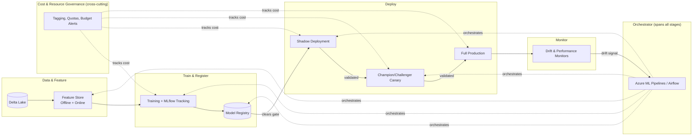
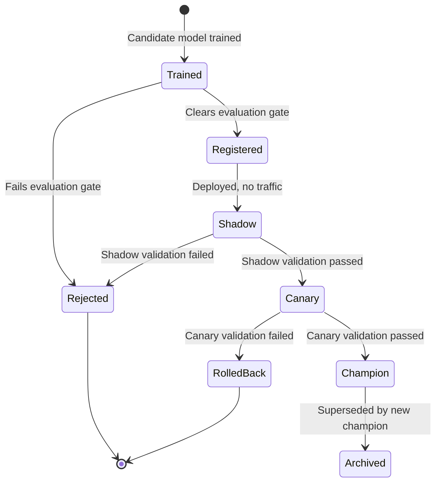

# ML Pipeline Architecture

> Part of the **Enterprise Data & AI Architecture Handbook** · Phase-11 — AI Platform Engineering & MLOps · Chapter 06.
> Estimated study time: **60 min reading + ~4h labs**.
> **Prerequisites:** read [Feature Stores with Feast](02_Feature_Stores_with_Feast.md) and [MLOps and MLflow](03_MLOps_and_MLflow.md) first.

---

## Executive Summary

The previous five Phase-11 chapters each deepened one stage of the ML lifecycle in isolation: [Machine Learning Foundations](01_Machine_Learning_Foundations.md) defined the lifecycle's stages abstractly; [Feature Stores with Feast](02_Feature_Stores_with_Feast.md) industrialized the feature layer; [MLOps and MLflow](03_MLOps_and_MLflow.md) industrialized tracking, registry, and CI/CD/CT; [Model Serving and Ray](04_Model_Serving_and_Ray.md) industrialized the serving layer; and [Azure Machine Learning](05_Azure_Machine_Learning.md) showed one concrete, vertically integrated platform implementing all of it. This chapter is the assembly step: it takes those five independently-deepened stages and connects them into one coherent, end-to-end, platform-agnostic reference architecture — the thing a staff or principal engineer actually draws on a whiteboard when asked "what does our ML platform look like."

This chapter covers the **data → feature → train → deploy → monitor** pipeline as a single connected architecture rather than five separate topics; **orchestration and triggers** as the mechanism binding every stage together and deciding when each one runs; **drift detection and retraining** as the closed-loop feedback path that distinguishes a genuine ML platform from a one-time model deployment; **champion/challenger and shadow deployment** as the two complementary, non-interchangeable techniques for safely validating a new model version against a live production baseline; and **cost and resource governance** as the cross-cutting discipline that keeps a multi-stage, multi-team pipeline architecture from becoming an unaccountable, runaway platform cost.

The bias remains **Azure-primary (~60%)** — Azure ML pipelines or Azure Databricks Workflows as the orchestration layer, Azure Monitor/Application Insights for cross-stage observability — **~30% enterprise open source** (Airflow as the general-purpose orchestration alternative, MLflow for tracking/registry, Ray for distributed serving) and **~10% AWS/GCP comparison-only** (SageMaker Pipelines, Vertex AI Pipelines).

**Bottom line:** an ML pipeline architecture is not a diagram of five boxes connected by arrows — it is a closed feedback loop where monitoring output becomes the next iteration's trigger input, and the specific engineering discipline this chapter adds beyond the prior five chapters' individual depth is exactly that closure: making sure the loop actually closes, safely, and at a cost the organization can defend.

---

## Learning Objectives

By the end of this chapter you will be able to:

1. **Design a complete, end-to-end ML pipeline architecture** spanning data ingestion through monitoring, correctly sequencing every stage from [Machine Learning Foundations](01_Machine_Learning_Foundations.md#15-the-end-to-end-ml-lifecycle) §1.5.
2. **Select and implement an orchestration strategy** with appropriate triggers (event-driven, scheduled, and drift-based) for each pipeline stage.
3. **Architect a drift-detection-to-retraining feedback loop** that closes the lifecycle without bypassing the evaluation-gate discipline from [MLOps and MLflow](03_MLOps_and_MLflow.md#32-model-registry-and-stage-transitions) §3.2.
4. **Differentiate champion/challenger from shadow deployment** and select the correct technique (or combination) for a given risk profile.
5. **Design cost and resource governance controls** that scale with a multi-team, multi-pipeline ML platform without requiring per-team manual oversight.
6. **Apply this reference architecture on Azure** with a defensible comparison to AWS SageMaker Pipelines and GCP Vertex AI Pipelines.
7. **Defend a complete ML pipeline architecture** in engineer, staff engineer, architect, and CTO review settings, including the trade-off between architectural completeness and delivery speed for a new model.

---

## Business Motivation

- **A pipeline that is well-engineered stage by stage but poorly connected end to end still fails.** An organization can have excellent feature engineering ([Feature Stores with Feast](02_Feature_Stores_with_Feast.md)), excellent tracking ([MLOps and MLflow](03_MLOps_and_MLflow.md)), and excellent serving ([Model Serving and Ray](04_Model_Serving_and_Ray.md)) individually, and still suffer production incidents if the hand-offs and triggers *between* those stages are ad hoc or manual.
- **Manually triggered retraining does not scale past a handful of models.** An organization with dozens or hundreds of production models cannot rely on an engineer remembering to check each model's drift status and manually kick off retraining — the orchestration and trigger architecture (§6.2) is what makes drift-responsive retraining (§6.3) operationally tractable at scale.
- **Champion/challenger and shadow deployment reduce the business cost of a bad model rollout materially**, and choosing the wrong one (or neither) for a given use case's risk profile either slows delivery unnecessarily or exposes the business to an avoidable regression, directly connecting to the case studies in [Model Serving and Ray](04_Model_Serving_and_Ray.md#case-studies).
- **Unmanaged, pipeline-wide resource consumption is a direct, compounding FinOps risk.** As the number of pipelines, models, and retraining cycles grows across an organization, the absence of cross-cutting cost governance (§6.5) turns many individually-reasonable per-model costs into an aggregate platform spend that no single team is accountable for.
- **A coherent, documented reference architecture is what makes onboarding a new model team fast.** Without one, every new model effort re-derives its own pipeline structure from scratch, reproducing avoidable inconsistencies (and avoidable failure modes) that a shared reference architecture would have prevented from the outset.

---

## History and Evolution

- **2015-2017 — "Hidden Technical Debt in Machine Learning Systems" (Sculley et al.)** is published, the paper most credited with establishing that ML systems accumulate a distinct category of technical debt at the *boundaries* between pipeline stages (data dependencies, configuration debt, pipeline jungles) — not merely within any single stage's modeling code, directly motivating this chapter's end-to-end, connective focus.
- **2018-2020 — the individual MLOps component tools mature independently** (feature stores, MLflow, serving frameworks, per the History and Evolution sections of Phase-11 Chapters 02-04), but organizations frequently adopt them piecemeal, without a unifying reference architecture connecting them — the "five well-built stages, poorly connected" failure mode this chapter addresses.
- **2020-2021 — "continuous training" and closed-loop MLOps reference architectures are formalized** by major cloud vendors (Google's MLOps maturity model, Microsoft's Azure ML pipeline reference architectures) as explicit, named end-to-end patterns, rather than leaving pipeline assembly as an implicit, per-organization exercise.
- **2021-2022 — champion/challenger and shadow-deployment patterns, long used in quantitative finance and search ranking, become standard MLOps vocabulary** more broadly, as more industries adopted the safe-rollout discipline these techniques provide.
- **2022-present — drift-detection tooling matures as a first-class pipeline component** (Azure ML's native data-drift monitors, open-source alternatives like Evidently and NannyML), moving drift detection from a manually-run analysis notebook into an automated, orchestrated pipeline stage.
- **2023-present — cost governance for ML platforms becomes an explicit FinOps discipline** (rather than an afterthought), as GPU-backed training and serving costs (per [Machine Learning Foundations](01_Machine_Learning_Foundations.md#cost-optimization-finops) and [Model Serving and Ray](04_Model_Serving_and_Ray.md#cost-optimization-finops)) grew large enough at scale to warrant dedicated cross-pipeline tracking and accountability mechanisms.

---

## Why This Technology Exists

An end-to-end ML pipeline architecture exists because the individual capabilities covered in Phase-11 Chapters 02-05 — feature stores, experiment tracking, model registries, serving infrastructure — do not automatically compose into a working, safe, cost-accountable production system merely by being adopted independently. Sculley et al.'s foundational observation was that ML systems' hardest engineering problems live specifically at the *seams* between components: a feature store and a training pipeline that do not agree on point-in-time semantics, a registry promotion gate that is bypassed by an automated retraining trigger, a drift monitor that fires with no defined downstream action, a serving rollout with no safety net before full-traffic cutover. This chapter's reference architecture exists to make those seams explicit, deliberately designed connection points, rather than left as implicit assumptions that only surface as production incidents.

---

## Problems It Solves

- **Ad hoc, undocumented connections between individually well-built pipeline stages** — a single, coherent reference architecture (§6.Architecture) gives every team building on it the same, well-understood seams rather than reinventing (and potentially misconnecting) them per project.
- **Manual, non-scalable retraining triggers** — orchestrated, drift-based CT triggers (§6.2-6.3) make retraining tractable across a large model portfolio without requiring per-model manual monitoring.
- **Unsafe full-traffic model rollouts** — the champion/challenger and shadow-deployment patterns (§6.4) give a structured choice between two distinct, complementary safe-rollout mechanisms rather than a single-size-fits-all approach.
- **Unaccountable, aggregate platform cost growth** — cross-cutting cost governance (§6.5) gives the organization visibility and control over total pipeline spend, not just each individual pipeline's own local cost optimization.
- **Slow onboarding for new model teams** — a documented, reusable reference architecture (this chapter itself) becomes the onboarding artifact new teams build against, rather than each team independently re-deriving pipeline structure.

---

## Problems It Cannot Solve

- **It cannot make any individual pipeline stage's implementation correct.** This chapter assumes the quality bars established in [Machine Learning Foundations](01_Machine_Learning_Foundations.md), [Feature Stores with Feast](02_Feature_Stores_with_Feast.md), [MLOps and MLflow](03_MLOps_and_MLflow.md), and [Model Serving and Ray](04_Model_Serving_and_Ray.md); a well-connected pipeline built from a poorly designed model or a leaky feature pipeline still produces poor business outcomes.
- **It cannot eliminate the genuine engineering cost of building and maintaining orchestration.** A fully connected, drift-responsive, cost-governed pipeline is a larger upfront and ongoing engineering investment than a simpler, manually-operated one — justified for production-critical models, not necessarily for every experimental or low-stakes one (§6.24 Trade-offs).
- **It cannot substitute for organizational discipline in actually using the architecture consistently.** A documented reference architecture that individual teams do not actually follow delivers none of its intended consistency benefit — adoption is an organizational, not merely technical, challenge.
- **It cannot make champion/challenger or shadow deployment risk-free.** Both techniques reduce, but do not eliminate, rollout risk; a sufficiently severe or subtle regression can still slip past a canary/shadow validation window if that window or its monitored metrics are insufficiently comprehensive.
- **It cannot resolve a genuine disagreement about what "cost-effective" means for a given model's business value.** Cost governance (§6.5) provides visibility and controls; deciding whether a given model's business value justifies its cost remains a business judgment this chapter's tooling informs but does not make automatically.

---

## Core Concepts

### 6.1 Data → Feature → Train → Deploy → Monitor as One Connected Pipeline

- **Each arrow between stages is itself a designed interface, not an implicit hand-off.** The data-to-feature arrow is the point-in-time-correct feature computation contract from [Feature Stores with Feast](02_Feature_Stores_with_Feast.md#23-point-in-time-correctness) §2.3; the feature-to-train arrow is the training-set assembly API; the train-to-deploy arrow is the evaluation-gated registry promotion from [MLOps and MLflow](03_MLOps_and_MLflow.md#32-model-registry-and-stage-transitions) §3.2; the deploy-to-monitor arrow is the serving-telemetry pipeline from [Model Serving and Ray](04_Model_Serving_and_Ray.md#monitoring); and the monitor-to-data/train arrow (closing the loop) is the drift-triggered CT path (§6.3).
- **A pipeline architecture diagram is only useful if every arrow specifies its contract**: what data format crosses it, what triggers it, and what happens on failure — a diagram with unlabeled arrows is not actually an architecture, it is an aspiration.
- **Stage boundaries are also team-ownership boundaries in most organizations** — data engineering typically owns the data stage, ML engineering the feature/train stages, platform engineering the deploy/monitor stages — meaning the interface contracts at each arrow are frequently also the cross-team API contracts that must be explicit and stable for multiple teams to collaborate without constant renegotiation.
- **The pipeline is a directed graph, but the feedback arrow (monitor back to data/train) is what makes it a genuine lifecycle rather than a one-way pipeline** — [Machine Learning Foundations](01_Machine_Learning_Foundations.md#15-the-end-to-end-ml-lifecycle) §1.5 named this the lifecycle's defining property; this chapter is where that feedback arrow becomes a concretely engineered, not merely conceptual, connection.
- **Every stage's SLA constrains every other stage's design**: a serving endpoint's latency budget constrains the feature store's online-store lookup latency ([Feature Stores with Feast](02_Feature_Stores_with_Feast.md#performance)); a CT trigger's required reaction time constrains how quickly the data-validation and training stages must complete — the pipeline's end-to-end performance is a property of the whole chain, not any single stage in isolation.

### 6.2 Orchestration and Triggers

- **Three trigger types drive pipeline execution, each suited to a different stage**: **event-driven** (a code commit triggers CI, a new data partition landing triggers a feature-computation job), **scheduled** (a nightly batch-scoring job, a weekly retraining cadence for stable-drift use cases per [MLOps and MLflow](03_MLOps_and_MLflow.md#33-cicd-ct-for-models) §3.3), and **signal-driven** (a drift-detection alert triggers retraining, a canary-metric threshold breach triggers automated rollback).
- **The orchestrator (Azure ML pipelines, Azure Databricks Workflows, or Airflow per [Orchestration with Airflow](../Phase-09/07_Orchestration_with_Airflow.md)) is the component responsible for translating a trigger into the correct sequence of stage executions**, including respecting inter-stage dependencies (features must be materialized before training can read them) and handling partial-failure retry logic (per [DataOps Foundations](../Phase-09/01_DataOps_Foundations.md)'s idempotency discipline).
- **Cross-stage orchestration frequently spans multiple underlying execution engines** — a single logical pipeline run might invoke a Spark job for feature materialization, an Azure ML/Databricks training job for model training, and a separate deployment API call for serving — the orchestrator's job is coordinating across these heterogeneous execution engines, not executing the work itself.
- **Trigger-to-stage latency matters for signal-driven triggers specifically**: a drift alert that takes hours to actually initiate a retraining run (due to a slow-polling orchestrator or a queued scheduling backlog) undermines the responsiveness benefit drift-based CT was adopted for in the first place.
- **Orchestration configuration itself should be version-controlled and code-reviewed** (per [Infrastructure as Code with Terraform](../Phase-09/04_Infrastructure_as_Code_with_Terraform.md)'s pipeline-as-code discipline and [Azure Machine Learning](05_Azure_Machine_Learning.md#52-azure-ml-pipelines-and-components) §5.2's CLI v2/YAML pattern), so a change to trigger conditions or stage sequencing is auditable, not a manually-clicked configuration change.

### 6.3 Drift Detection and Retraining

- **Data drift (a shift in feature-value distributions) and concept drift (a shift in the actual relationship between features and the target) are distinct phenomena requiring the same detection infrastructure but implying different remediation**: data drift often means the input population has genuinely changed (which retraining on fresh data addresses); concept drift can mean the underlying business relationship has changed in a way that may require new features or even a different modeling approach, not merely fresher data on the same features.
- **Statistical drift-detection methods** (population stability index, KL divergence, or simpler summary-statistic comparisons, per [Machine Learning Foundations](01_Machine_Learning_Foundations.md#16-monitoring) §1's Monitoring section) compare live serving-time feature/prediction distributions against the training-time baseline, run as a scheduled or continuous monitoring job feeding the orchestrator's signal-driven trigger.
- **A drift alert must trigger retraining, not automatic promotion** — this is the single most important rule this chapter reinforces from [MLOps and MLflow](03_MLOps_and_MLflow.md) ADR-0150: the drift signal justifies *initiating* a new training run, but the resulting candidate model must still clear the same evaluation gate as any other candidate before being promoted to Production.
- **Retraining cadence should match the use case's actual drift characteristics** (per [MLOps and MLflow](03_MLOps_and_MLflow.md#decision-matrix)'s decision matrix: drift-triggered for volatile use cases like fraud, scheduled for stable, predictable-cadence use cases like seasonal retail demand), not defaulted uniformly across the whole model portfolio.
- **Persistent drift alerts with repeatedly failing evaluation gates are an escalation signal, not a retraining-configuration problem** — per the Operational Response Playbook established in [MLOps and MLflow](03_MLOps_and_MLflow.md#operational-response-playbook), a model that cannot be retrained back to acceptable performance despite multiple attempts likely needs a modeling or feature-engineering investigation, not merely more frequent retraining attempts.

### 6.4 Champion/Challenger and Shadow Deployment

- **Champion/challenger** designates the current production model as the "champion" and evaluates a new candidate ("challenger") against it on held-out historical data (offline, per [Machine Learning Foundations](01_Machine_Learning_Foundations.md#interview-questions) ADR-0148) and/or on a live traffic split (online, via the canary-deployment mechanism from [Model Serving and Ray](04_Model_Serving_and_Ray.md#42-serving-patterns-and-autoscaling) §4.2) — the challenger only becomes the new champion after clearing the agreed comparison threshold.
- **Shadow deployment** runs a candidate model in parallel with the current production model on live traffic, logging the candidate's predictions without acting on them at all — unlike champion/challenger's traffic-split approach (where the challenger's predictions *do* affect a fraction of real decisions), shadow deployment carries zero direct business risk from the candidate's predictions, at the cost of not validating how the candidate's predictions would have actually influenced downstream business outcomes if acted upon.
- **The two techniques are complementary, not interchangeable, and are frequently used together in sequence**: a new candidate typically runs in shadow mode first (validating its behavior, latency, and prediction distribution against live traffic with zero risk), and only after that validation passes does it graduate to a champion/challenger traffic-split rollout (validating its actual causal effect on business outcomes with a small, contained risk exposure).
- **Shadow deployment cannot fully validate outcome-dependent effects** — because a shadow model's predictions are never acted upon, any business outcome that depends on the *action taken* in response to a prediction (e.g., whether blocking a transaction actually reduces fraud losses) cannot be fully validated in shadow mode alone; some minimal traffic-split exposure via champion/challenger is eventually required for outcome-dependent use cases.
- **The choice between shadow-only, champion/challenger-only, or both in sequence** should be driven by the use case's risk tolerance and whether its business outcome is fundamentally action-dependent — a low-risk, easily-reversible use case might skip straight to a champion/challenger traffic split; a high-stakes, hard-to-reverse use case (per the regulated-model governance tier from [MLOps and MLflow](03_MLOps_and_MLflow.md#trade-offs)) should default to the full shadow-then-champion/challenger sequence.

### 6.5 Cost and Resource Governance

- **Every pipeline stage has its own cost profile** (training compute per [Machine Learning Foundations](01_Machine_Learning_Foundations.md#cost-optimization-finops), feature materialization per [Feature Stores with Feast](02_Feature_Stores_with_Feast.md#cost-optimization-finops), serving compute per [Model Serving and Ray](04_Model_Serving_and_Ray.md#cost-optimization-finops)) — pipeline-level cost governance is the aggregation and cross-cutting accountability layer sitting above each stage's individual optimization.
- **Resource quotas and budget alerts per team/pipeline** prevent any single team's runaway retraining frequency or oversized compute allocation from silently consuming a disproportionate share of the platform's total ML compute budget, a governance mechanism distinct from (and complementary to) each stage's own local cost-optimization techniques.
- **Retraining-frequency governance** connects directly to §6.3's drift-vs-schedule trigger decision: a platform-level policy capping maximum retraining frequency per model (absent an explicit, reviewed exception) prevents the FinOps waste case documented in [MLOps and MLflow](03_MLOps_and_MLflow.md#cost-optimization-finops)'s worked example from recurring across the broader model portfolio, not just the one model that example addressed.
- **Cost attribution by pipeline stage and by model** (via resource tagging across compute clusters, storage, and serving endpoints) is what makes the aggregate cost governance actionable — without per-model, per-stage cost attribution, a rising total ML platform bill cannot be traced back to its actual driver.
- **Governance must balance central cost control against team velocity**, mirroring the same tiered-governance tension raised in [Feature Stores with Feast](02_Feature_Stores_with_Feast.md#trade-offs) and [MLOps and MLflow](03_MLOps_and_MLflow.md#trade-offs) — a lightweight, higher-quota tier for experimental work and a more tightly governed tier for production-critical pipelines, rather than one uniform, maximally restrictive policy applied to every pipeline regardless of its actual risk or cost profile.

---

## Internal Working

**How a complete pipeline execution actually flows end to end, tying together §6.1-6.4**:

1. **Trigger evaluation**: the orchestrator evaluates whether any configured trigger condition (event, schedule, or drift signal) has fired for a given pipeline.
2. **Data and feature stage execution**: on a fired trigger, the pipeline validates upstream data quality ([Data Quality with Great Expectations](../Phase-08/03_Data_Quality_with_Great_Expectations.md)) and resolves/materializes the required feature views ([Feature Stores with Feast](02_Feature_Stores_with_Feast.md)).
3. **Training stage execution with tracking**: the training component runs on provisioned compute, with MLflow autologging (per [MLOps and MLflow](03_MLOps_and_MLflow.md#31-experiment-tracking-and-reproducibility) §3.1) capturing full run provenance.
4. **Evaluation against the current champion**: the resulting candidate is compared against the current production champion using the agreed metric (per [Machine Learning Foundations](01_Machine_Learning_Foundations.md#12-training-validation-and-evaluation-metrics) §1.2); a failing candidate's run is logged and the pipeline terminates without promotion.
5. **Conditional registration and shadow rollout**: a passing candidate is registered and first deployed in shadow mode (§6.4), running in parallel with the current production endpoint on live traffic without influencing any real decision.
6. **Shadow validation and champion/challenger promotion**: after a defined shadow-validation window with acceptable observed behavior, the candidate is promoted to a champion/challenger traffic-split canary deployment (per [Model Serving and Ray](04_Model_Serving_and_Ray.md#42-serving-patterns-and-autoscaling) §4.2), and — after clearing that live-traffic validation too — to full production traffic, becoming the new champion.
7. **Monitoring feeds the next trigger**: the newly deployed champion's live performance and drift signals (§6.3) are continuously monitored, and a subsequent drift alert or scheduled interval re-initiates this entire sequence from step 1, closing the loop.

This sequence is the concrete synthesis of every mechanism the prior five chapters described individually — no single step here is new; the contribution of this chapter is specifying the complete, correctly-ordered sequence and the exact conditions (evaluation gate, shadow validation, canary validation) that gate transition from one step to the next.

---

## Architecture

- **Data layer**: curated Delta Lake tables ([Delta Lake](../Phase-04/04_Delta_Lake.md)), validated by data-quality checks before entering the feature layer.
- **Feature layer**: the dual online/offline feature store from [Feature Stores with Feast](02_Feature_Stores_with_Feast.md), materialized on a schedule or streaming basis.
- **Training and tracking layer**: training compute (Azure ML/Databricks) with MLflow tracking, per [MLOps and MLflow](03_MLOps_and_MLflow.md).
- **Registry and governance layer**: the model registry (Unity Catalog or Azure ML) enforcing the evaluation-gated promotion workflow.
- **Serving layer**: managed online/batch endpoints or Ray Serve, per [Model Serving and Ray](04_Model_Serving_and_Ray.md), hosting shadow and champion/challenger deployments simultaneously during a rollout.
- **Monitoring and feedback layer**: drift detectors and performance monitors feeding both alerting and the orchestrator's signal-driven CT trigger, closing the loop back to the data/feature layer.
- **Orchestration layer (spanning all of the above)**: Azure ML pipelines, Azure Databricks Workflows, or Airflow, sequencing every stage transition and enforcing every gate.
- **Cost governance layer (cross-cutting)**: resource tagging, quotas, and budget alerting spanning every layer above.

---

## Components

- **Orchestrator** — the engine sequencing pipeline stage execution based on triggers and inter-stage dependencies.
- **Data-validation component** — schema/quality gating before feature computation.
- **Feature materialization job** — populating the offline/online feature store.
- **Training job with autologging** — producing a tracked, reproducible candidate model.
- **Evaluation component** — the champion/challenger comparison logic gating registry promotion.
- **Registry** — the versioned, stage-tagged model catalog.
- **Shadow deployment** — a non-traffic-affecting parallel serving instance for pre-rollout validation.
- **Canary/traffic-split deployment** — the live-traffic-affecting rollout mechanism for final validation before full promotion.
- **Drift detector** — the statistical monitoring component generating the signal-driven CT trigger.
- **Cost governance dashboard/policy engine** — the cross-cutting resource-tagging, quota, and budget-alerting layer.

---

## Metadata

- **Pipeline-run metadata**: which trigger initiated a given run (event/schedule/drift-signal), and the full sequence of stage executions and their individual statuses.
- **Cross-stage lineage metadata**: the complete chain from data version → feature view version ([Feature Stores with Feast](02_Feature_Stores_with_Feast.md#metadata)) → training run ([MLOps and MLflow](03_MLOps_and_MLflow.md#metadata)) → registered model version → deployment (shadow, canary, full) — the fully assembled version of the lineage chain each prior chapter built one segment of.
- **Trigger-configuration metadata**: the current trigger type and threshold/schedule per pipeline, version-controlled per §6.2's code-review discipline.
- **Cost-attribution metadata**: resource tags mapping compute, storage, and serving cost back to the specific pipeline, model, and owning team that incurred it.

---

## Storage

- **Delta Lake** as the consistent storage substrate spanning the data layer, the feature store's offline component, and batch-inference output, minimizing the number of distinct storage technologies the end-to-end pipeline depends on.
- **The tracking/registry backend and artifact store** from [MLOps and MLflow](03_MLOps_and_MLflow.md#storage), holding run metadata and model artifacts.
- **Online feature store and any request/response logging store** from [Feature Stores with Feast](02_Feature_Stores_with_Feast.md#storage) and [Model Serving and Ray](04_Model_Serving_and_Ray.md#storage) respectively, supporting the serving and monitoring layers.

---

## Compute

- **Feature materialization compute** (Spark/Databricks), **training compute** (Azure ML/Databricks clusters), and **serving compute** (managed endpoints or Ray clusters) are each provisioned and scaled independently, per the decoupled-compute-per-stage principle established across Chapters 02-04, avoiding one stage's load pattern inadvertently over- or under-provisioning another's.
- **Orchestrator compute** itself (the Azure ML pipeline control plane, or an Airflow scheduler's own infrastructure) is typically lightweight relative to the compute-intensive stages it coordinates, but its availability is a single point of failure for the entire pipeline's ability to execute at all (§6.19 Fault Tolerance).
- **Drift-detection compute** runs as its own scheduled or continuous job, typically far lighter-weight than training or serving compute, but still requiring its own provisioning and monitoring as a distinct pipeline component.

---

## Networking

- **Private endpoints spanning every layer** (data, feature store, training compute, registry, serving endpoints), consistent with the zero-trust baseline established in [Network Security and Zero Trust](../Phase-10/04_Network_Security_and_Zero_Trust.md) and reiterated in every prior Phase-11 chapter's Networking section.
- **The orchestrator's cross-stage invocations** (calling out to a Spark job, then a training job, then a deployment API) should traverse the same private network paths as any other production data-plane traffic, not a separate, less-governed network path.
- **Shadow and canary deployments share the same networking posture as the full-production deployment they are validating** — a shadow deployment that is somehow more permissively networked than production would invalidate its own purpose as a production-representative validation environment.

---

## Security

- **Managed identities/workload identity federation for the orchestrator's cross-stage service-to-service calls**, consistent with the default established throughout this handbook's security chapters, avoiding embedded credentials at any pipeline stage transition.
- **RBAC governing who can modify trigger configuration, promotion thresholds, and cost-governance policy**, since these configuration surfaces directly control production model behavior and spend — access to modify them should be as tightly scoped as access to the underlying data itself.
- **Shadow deployment logging must respect the same PII handling requirements** as production request/response logging ([Data Privacy and PII Protection](../Phase-10/07_Data_Privacy_and_PII_Protection.md)), since shadow-mode predictions are still computed against real production data and requests.
- **Audit trail for every gate transition** (evaluation-gate pass/fail, shadow-to-canary promotion, canary-to-full-production cutover) supporting the regulatory defensibility requirement from [Compliance and Regulatory Frameworks](../Phase-10/06_Compliance_and_Regulatory_Frameworks.md).

---

## Performance

- **End-to-end pipeline lead time** (from trigger to fully-promoted production model) is the aggregate metric this chapter's architecture is ultimately optimizing, decomposed into each stage's individual duration plus the orchestrator's own scheduling/hand-off overhead.
- **Shadow and canary validation windows add deliberate, bounded latency to the overall promotion timeline** — a longer validation window increases confidence before full rollout at the direct cost of slower time-to-production, an explicit trade-off (§6.24) that should be sized to the use case's risk profile, not left arbitrarily long or short by default.
- **Drift-detection latency** (the time between an actual distributional shift occurring and the monitoring job detecting and firing a retraining trigger) directly determines how quickly the closed loop can respond to real-world change — a batch drift check run only nightly introduces up to a day of detection lag relative to a continuously-evaluated streaming drift check.
- **Orchestrator scheduling overhead** (queueing delay before a triggered pipeline actually begins executing) becomes a meaningful contributor to end-to-end lead time at high pipeline-execution concurrency across a large model portfolio, motivating the orchestrator-scaling considerations in §6.18.

---

## Scalability

- **Orchestrator concurrency** must scale with the number of simultaneously-executing pipelines across an organization's full model portfolio, not just one team's pipeline — the same orchestrator-concurrency concern [MLOps and MLflow](03_MLOps_and_MLflow.md#scalability) raised for CI/CD/CT specifically now applies at the full-portfolio level this chapter's architecture spans.
- **Each stage's own scalability characteristics** (feature materialization per [Feature Stores with Feast](02_Feature_Stores_with_Feast.md#scalability), training per [Machine Learning Foundations](01_Machine_Learning_Foundations.md#scalability), serving per [Model Serving and Ray](04_Model_Serving_and_Ray.md#scalability)) compose into the end-to-end pipeline's overall scalability, but the orchestrator's own capacity to coordinate many concurrent pipeline executions is an additional, distinct scaling dimension this chapter adds.
- **Cost-governance tooling must scale with pipeline count**, since per-model, per-stage cost attribution (§6.5) becomes computationally and organizationally harder to maintain accurately as the number of distinct pipelines grows into the hundreds.
- **Shadow and canary deployment infrastructure scales independently of the primary production serving infrastructure**, requiring its own capacity planning rather than assuming it is a negligible add-on to the existing serving footprint.

---

## Fault Tolerance

- **Orchestrator availability is a single point of failure for the entire pipeline's ability to execute** — a highly-available, ideally managed orchestrator (Azure ML pipelines' managed control plane, or a properly redundant self-managed Airflow deployment) is a foundational reliability requirement for this chapter's architecture, not an afterthought.
- **Each stage's own fault-tolerance mechanisms** (checkpointing per [Machine Learning Foundations](01_Machine_Learning_Foundations.md#fault-tolerance), idempotent retries per [DataOps Foundations](../Phase-09/01_DataOps_Foundations.md), replica health checks per [Model Serving and Ray](04_Model_Serving_and_Ray.md#fault-tolerance)) compose into the end-to-end pipeline's resilience, but the orchestrator must also correctly propagate a stage failure (not silently proceed past it) to avoid promoting a model trained on partially-failed upstream data.
- **Shadow deployment as a fault-tolerance validation mechanism**: catching a candidate model's crash-on-specific-input behavior in shadow mode (zero business risk) rather than discovering it only after a canary or full rollout is itself a fault-tolerance benefit this chapter's architecture is specifically designed to realize.
- **Rollback via registry stage-transition and traffic-split reversion** (per [MLOps and MLflow](03_MLOps_and_MLflow.md#fault-tolerance) and [Model Serving and Ray](04_Model_Serving_and_Ray.md#fault-tolerance)) remains the primary recovery mechanism for a regression discovered even after full rollout, underscoring why every promotion step in §6.4's sequence should retain the prior champion available for fast reversion.

---

## Cost Optimization (FinOps)

- **Per-stage cost optimization techniques from Chapters 02-04 remain fully applicable** (auto-scale-to-zero compute, batching, incremental feature materialization) — this chapter's contribution is the cross-cutting aggregation and accountability layer (§6.5), not a replacement for those stage-level techniques.
- **Retraining-frequency governance as a portfolio-wide control**: a platform-level policy requiring justification for any model retraining more frequently than a defined baseline (absent a demonstrated drift-driven need) directly prevents the aggregate-scale version of the wasteful fixed-schedule-CT pattern documented in [MLOps and MLflow](03_MLOps_and_MLflow.md#cost-optimization-finops)'s worked example.
- **Shadow and canary deployment resource overhead** (running a candidate model in parallel with production, even at reduced/sampled traffic) is a real, deliberate cost that should be sized proportionally to the model's risk profile — a low-stakes model does not need an extended, resource-heavy shadow validation window.
- **Cost dashboards attributing spend to specific pipelines/teams** (§6.5) turn aggregate ML platform cost from an opaque total into an actionable, team-accountable metric, directly enabling the FinOps prioritization recommended in [Machine Learning Foundations](01_Machine_Learning_Foundations.md#enterprise-recommendations) and the parallel recommendations in every subsequent Phase-11 chapter.

**Worked FinOps example**: An organization's ML platform cost review reveals that of 40 production models, 6 are configured with aggressive fixed-schedule (hourly or more frequent) CT, collectively consuming an estimated $14,000/month in retraining compute, while post-hoc analysis shows only 2 of those 6 actually exhibit drift patterns fast enough to justify anything more frequent than daily retraining. Introducing a platform-wide policy requiring a documented drift-pattern justification for any retraining cadence more frequent than daily (with the 2 genuinely-justified models retained on their aggressive schedule and the other 4 moved to daily or drift-triggered cadences) reduces the collective retraining cost of those 6 models to roughly $2,800/month — an approximately 80% reduction for the affected subset — while the 2 genuinely high-drift models retain their responsive retraining cadence with no compromise to their actual business need.

---

## Monitoring

- **Pipeline-level monitoring** (per-stage duration, success/failure rate, end-to-end lead time) aggregated across the full pipeline, not just any single stage in isolation, per the aggregate-lead-time metric emphasized in §6.14.
- **Drift monitoring** (§6.3), feeding both alerting and the orchestrator's signal-driven trigger.
- **Shadow and canary deployment monitoring**, comparing candidate-model behavior against the current champion's baseline before each promotion gate.
- **Cost monitoring** attributed per pipeline/model/team (§6.5), reviewed on a recurring cadence (not only during ad hoc cost-review incidents like the worked FinOps example above) to catch cost drift proactively.

---

## Observability

- **A single, unified view of the entire pipeline's current state** — which models are in shadow, which are in canary, which are fully promoted, and each stage's recent execution history — is the practical realization of the fully-assembled lineage metadata from §6.Metadata, and is what actually lets a platform engineer answer "what is happening across our ML platform right now" without manually querying five separate systems.
- **Correlating drift signals, evaluation-gate outcomes, and deployment-stage transitions in one timeline per model** makes it possible to reconstruct, for any given model, the complete causal chain from "drift was detected" to "a new champion was promoted" (or "the candidate was rejected and why") without cross-referencing disconnected tools.
- **Cross-team dashboards surfacing cost, reliability, and governance-compliance metrics simultaneously** give both individual model owners and platform-level stakeholders (per the CTO Review Questions below) the same shared, authoritative view of platform health.

### Operational Response Playbook

| Signal | Detection Query/Check | Remediation |
|---|---|---|
| **A model has been stuck in shadow deployment far longer than its defined validation window without a promotion decision** | Pipeline-state dashboard filtered to shadow-stage deployments, cross-referenced against each deployment's configured validation-window duration | Escalate to the owning team; an indefinitely "parked" shadow deployment either indicates an unresolved concern that should be explicitly documented and decided, or an abandoned rollout that should be formally retired rather than left silently consuming shadow-serving resources |
| **Aggregate ML platform cost trend rises without a corresponding increase in production model count or business volume** | Cross-pipeline cost-attribution dashboard (§6.5), broken down by pipeline/model/team, compared against the prior period | Identify the specific pipeline(s) driving the increase first; check retraining frequency and shadow/canary resource allocation before assuming a broad, platform-wide capacity increase is needed |

---

## Governance

- **Every pipeline must have a documented owner and a defined risk tier** (regulated/high-stakes vs. experimental/low-stakes, per the tiered-governance pattern established across Chapters 02-03), determining which of the shadow/champion-challenger sequence and which cost-governance quota tier applies.
- **Every gate transition (evaluation pass, shadow validation, canary validation, full promotion) must be recorded and queryable**, extending the audit-trail requirement from [MLOps and MLflow](03_MLOps_and_MLflow.md#governance) and [Model Serving and Ray](04_Model_Serving_and_Ray.md#governance) across the fully assembled pipeline.
- **Trigger and threshold configuration changes require the same code-review discipline as any other production configuration change** (§6.2), not an informally-communicated or undocumented adjustment.
- **Cost governance policy itself must be documented, reviewed, and exception-approved transparently** — a retraining-frequency cap with silent, undocumented exceptions undermines the accountability the policy exists to provide.

---

## Trade-offs

- **Architectural completeness vs. delivery speed for a new model**: building out the full data→feature→train→deploy→monitor pipeline with drift detection, shadow validation, and cost governance for every new model, regardless of its risk profile, slows initial delivery; a tiered approach (full architecture for production-critical models, a lighter-weight path for experimental ones) resolves this the same way [Feature Stores with Feast](02_Feature_Stores_with_Feast.md#trade-offs) and [MLOps and MLflow](03_MLOps_and_MLflow.md#trade-offs) resolved their own governance-vs-velocity tensions.
- **Shadow-then-canary sequencing vs. canary-only**: the full sequence maximizes safety at the cost of a longer time-to-production; skipping shadow validation for a well-understood, low-risk model class is a defensible, deliberate trade-off, not a shortcut that should be applied universally without justification.
- **Centralized orchestration vs. per-team orchestration**: a single, shared orchestrator instance maximizes consistency and cross-pipeline visibility at the cost of being a more consequential single point of failure and a potential scaling/contention bottleneck; per-team orchestration instances trade that consolidated visibility for isolation and independent scaling.
- **Aggressive cost governance vs. team autonomy**: tight, centrally-enforced retraining-frequency and resource quotas prevent the aggregate-cost-growth failure mode (§6.16's worked example) but can slow an individual team's ability to respond quickly to a genuinely urgent, high-drift situation if the governance process itself is slow to grant an exception.

---

## Decision Matrix

| Scenario | Recommended Approach | Rationale |
|---|---|---|
| New production-critical, regulated model | Full architecture: shadow → champion/challenger canary → full promotion, drift-triggered CT, full cost/governance tracking | Risk profile justifies the complete safety and governance investment |
| New experimental, low-stakes model | Lightweight path: direct champion/challenger canary (skip extended shadow), scheduled (not drift-triggered) retraining, lighter cost-quota tier | Full architectural investment is not justified at this risk/cost level; promote to the full tier if the model matures into production-critical status |
| Organization with a large (100+), fast-growing model portfolio | Centralized orchestrator with strict cost-governance quotas and mandatory drift-pattern justification for aggressive CT schedules | Prevents the aggregate cost-growth failure mode this chapter's worked FinOps example illustrates at scale |
| Use case with fundamentally action-dependent outcomes (e.g., fraud blocking) | Shadow validation first, followed by a meaningful (not minimal) champion/challenger traffic-split before full promotion | Shadow mode alone cannot validate the actual causal effect of the action taken on the predicted outcome |
| Use case with easily-reversible, low-consequence outcomes (e.g., a non-critical UI personalization) | Champion/challenger canary only, no extended shadow phase | The cost of a brief, contained regression is low enough that the extra shadow-validation step's time cost is not justified |

---

## Design Patterns

- **Explicit, documented interface contracts at every pipeline-stage boundary** (§6.1), reviewed and versioned like any other API contract.
- **Shadow-then-canary-then-full-promotion as the default sequence for production-critical models**, with an explicitly justified, documented exception process for skipping a stage.
- **Drift-triggered CT with a scheduled fallback ceiling** (carried forward from [Machine Learning Foundations](01_Machine_Learning_Foundations.md#design-patterns)), now applied portfolio-wide via the cost-governance policy in §6.5.
- **Tiered pipeline architecture (full vs. lightweight) keyed to a documented risk tier**, rather than a single uniform architecture applied regardless of a given model's actual risk and cost profile.

---

## Anti-patterns

- **Building each pipeline stage well but leaving the connections between them informal or undocumented** — the precise failure mode this chapter's Executive Summary opened with.
- **Allowing a drift alert to trigger automatic promotion without the evaluation gate**, reintroducing exactly the ungated-CT risk [MLOps and MLflow](03_MLOps_and_MLflow.md) ADR-0150 was designed to close, now at the level of this chapter's fully assembled architecture.
- **Treating shadow deployment as sufficient validation on its own for action-dependent use cases**, silently skipping the champion/challenger phase that actually tests the causal effect of acting on the model's predictions.
- **Applying the full, heavyweight architecture uniformly to every model regardless of risk tier**, unnecessarily slowing delivery for genuinely low-stakes, experimental work.
- **Operating cost governance reactively (only during periodic cost-review incidents) rather than via continuously monitored, proactive dashboards and quotas** (§6.21 Monitoring).

---

## Common Mistakes

- Documenting a pipeline architecture diagram with unlabeled arrows between stages, leaving the actual trigger conditions and data contracts implicit and undiscoverable.
- Allowing a model to sit indefinitely in shadow deployment with no defined validation window or promotion decision deadline.
- Forgetting to version-control trigger and threshold configuration changes, losing the audit trail for why a retraining cadence or promotion criterion changed.
- Not attributing cost per pipeline/model/team, discovering aggregate platform cost growth only during an ad hoc review rather than via continuous monitoring.
- Assuming the orchestrator itself is inherently reliable without explicitly designing for its own availability as a single point of failure.

---

## Best Practices

- Document every pipeline-stage interface contract explicitly (data format, trigger condition, failure behavior), reviewed and version-controlled like any other production API.
- Default new production-critical models to the full shadow-then-canary-then-full-promotion sequence, with any skipped stage requiring an explicit, documented justification.
- Enforce the same evaluation gate for drift-triggered, scheduled, and manually-initiated retraining runs universally, with no configuration path that bypasses it.
- Implement continuous, proactive cost-attribution dashboards per pipeline/model/team rather than relying on periodic ad hoc cost reviews to catch spend growth.
- Tier pipeline architecture rigor (full vs. lightweight) explicitly by documented model risk classification, rather than applying one uniform policy to every model.

---

## Enterprise Recommendations

- Publish and maintain one canonical, versioned reference architecture diagram (this chapter's Architecture and Mermaid diagrams) that every new model team is onboarded against, rather than allowing each project to independently re-derive pipeline structure.
- Mandate the shadow-then-canary sequence as the default for production-critical models, with a documented, reviewable exception process for lower-risk tiers.
- Establish a platform-wide retraining-frequency governance policy requiring drift-pattern justification for any cadence more aggressive than a defined baseline.
- Operate continuous, cross-pipeline cost and reliability dashboards as a standing platform capability, reviewed on a regular cadence by both engineering and FinOps stakeholders, not only during incident-driven cost reviews.

---

## Azure Implementation

- **Azure ML pipelines or Azure Databricks Workflows** as the orchestration layer sequencing data validation, feature materialization, training, evaluation, registration, and deployment.
- **Azure ML's native data-drift monitoring** or a custom drift-detection job feeding the CT trigger, per [Machine Learning Foundations](01_Machine_Learning_Foundations.md#16-monitoring) and [Azure Machine Learning](05_Azure_Machine_Learning.md#monitoring).
- **Azure ML managed online endpoints' traffic-split deployments** implementing both the shadow (near-zero traffic percentage, predictions logged not acted upon) and champion/challenger (a meaningful, monitored traffic percentage) patterns from §6.4.
- **Azure Cost Management with resource tagging** across compute clusters, storage accounts, and endpoints, implementing the cost-attribution capability from §6.5.
- **Azure Monitor/Application Insights** providing the unified, cross-stage observability dashboard from §6.22.

---

## Open Source Implementation

- **Apache Airflow** as the general-purpose orchestration alternative to a cloud-native pipeline orchestrator, particularly suited to organizations with existing Airflow investment (per [Orchestration with Airflow](../Phase-09/07_Orchestration_with_Airflow.md)) spanning both data-engineering and ML pipelines under one orchestration tool.
- **MLflow** as the tracking/registry backbone underlying the training-to-registration stage regardless of which orchestrator or cloud platform is used.
- **Evidently or NannyML** as open-source drift-detection libraries, usable as a custom orchestrated pipeline stage independent of any specific cloud vendor's native drift-monitoring feature.
- **Ray Serve** for shadow and canary deployment implementations requiring fine-grained traffic-splitting control beyond a managed endpoint's native capability, per [Model Serving and Ray](04_Model_Serving_and_Ray.md#43-ray-serve-ray-data-and-ray-train).

---

## AWS Equivalent (comparison only)

- **Amazon SageMaker Pipelines** provides the direct orchestration equivalent, with SageMaker Model Monitor providing drift detection and SageMaker endpoints supporting traffic-split canary deployments.
- **Advantages**: tight integration with the broader SageMaker ecosystem for AWS-centric teams, consistent with the parallel comparisons throughout Phase-11.
- **Disadvantages**: a materially different pipeline-definition and monitoring-configuration model than Azure ML/Databricks, requiring genuine re-platforming effort for migration.
- **Migration strategy**: MLflow-tracked provenance and portable model artifacts migrate with the least friction; SageMaker Pipeline-native DAG definitions and Model Monitor configuration require independent rework.
- **Selection criteria**: choose SageMaker Pipelines when the broader ML/data estate is AWS-centric; otherwise this chapter's Azure-primary recommendation applies.

---

## GCP Equivalent (comparison only)

- **Google Vertex AI Pipelines** (built on Kubeflow Pipelines) provides the equivalent orchestration capability, with Vertex AI Model Monitoring providing drift detection.
- **Advantages**: strong fit for BigQuery/GCP-centric data estates and Kubeflow-familiar teams, per the parallel GCP comparisons throughout Phase-11.
- **Disadvantages**: the same re-platforming cost pattern as the AWS case relative to Azure's pipeline/monitoring model.
- **Migration strategy**: as with AWS, portable artifacts and tracking data migrate more readily than pipeline-native DAG definitions.
- **Selection criteria**: choose Vertex AI Pipelines when the data/ML estate is BigQuery/GCP-centric; otherwise default to the Azure-primary recommendation.

---

## Migration Considerations

- **The reference architecture (data→feature→train→deploy→monitor with a closed feedback loop) is platform-agnostic by design** — migrating between Azure ML, Databricks, SageMaker, or Vertex AI Pipelines requires re-implementing the orchestration-layer specifics, but the underlying architectural sequence and gating logic (§6.Internal Working) transfers conceptually without needing to be redesigned from scratch.
- **Trigger and threshold configuration is the highest-friction migration element**, since drift-detection thresholds, retraining schedules, and promotion-gate criteria are frequently encoded in platform-specific configuration formats that must be manually translated (not automatically ported) to a new orchestrator's equivalent configuration schema.
- **Cost-attribution tagging schemes must be re-established on the target platform**, since resource-tagging conventions (and the cost-management tooling reading them) are platform-specific, following the same re-establishment requirement noted for cost governance in each individual chapter's own Migration Considerations section.
- **Re-validate the complete closed loop end to end after migration**, not just each individual stage — confirming that a simulated drift signal on the new platform correctly triggers retraining, correctly gates promotion, and correctly deploys through the shadow/canary sequence, before trusting the migrated architecture in production.

---

## Mermaid Architecture Diagrams



```mermaid
sequenceDiagram
    participant Monitor as Drift Monitor
    participant Orch as Orchestrator
    participant Train as Training + Eval
    participant Registry as Model Registry
    participant Shadow as Shadow Deployment
    participant Canary as Champion/Challenger

    Monitor->>Orch: Drift signal detected
    Orch->>Train: Trigger retraining pipeline
    Train->>Train: Train candidate, evaluate vs. champion
    alt Candidate clears gate
        Train->>Registry: Register new version
        Registry->>Shadow: Deploy in shadow mode
        Shadow->>Shadow: Validate (no traffic impact)
        Shadow->>Canary: Promote to traffic-split canary
        Canary->>Canary: Validate live-traffic behavior
        Canary->>Registry: Promote to full production (new champion)
    else Candidate fails gate
        Train-->>Orch: Reject; log result; no promotion
    end
```



---

## End-to-End Data Flow

1. **Trigger**: an event, schedule, or drift signal initiates the pipeline via the orchestrator.
2. **Data and feature validation**: upstream data quality is checked, and required feature views are resolved/materialized.
3. **Training and tracking**: a candidate model is trained with full MLflow provenance capture.
4. **Evaluation gate**: the candidate is compared against the current champion; failing candidates are logged and discarded.
5. **Registration**: a passing candidate is registered and stage-tagged.
6. **Shadow deployment**: the registered candidate runs in parallel with production, validated against live traffic with zero business risk.
7. **Champion/challenger canary**: after shadow validation, the candidate receives a small, monitored live-traffic percentage.
8. **Full promotion**: after canary validation, the candidate becomes the new champion at full traffic.
9. **Monitoring and feedback**: drift and performance signals from the new champion feed the next iteration's trigger, closing the loop back to step 1.

---

## Real-world Business Use Cases

- **A fraud-detection platform** using the full shadow-then-canary sequence with drift-triggered retraining, given the action-dependent, high-stakes nature of fraud-blocking decisions.
- **A retail demand-forecasting platform** using a lighter-weight, scheduled-retraining pipeline (skipping extended shadow validation) for a large catalog of individually low-stakes SKU-level forecasts, with cost governance capping the aggregate retraining compute across the full SKU portfolio.
- **A credit-risk scoring platform** combining the full architecture with the regulatory audit-trail requirements from [Compliance and Regulatory Frameworks](../Phase-10/06_Compliance_and_Regulatory_Frameworks.md), where every gate transition's documentation is itself a compliance artifact.

---

## Industry Examples

- **Search and recommendation platforms** (the domains that originated champion/challenger and shadow-deployment practice) run this full pipeline architecture at very high model-iteration frequency, making orchestrator scalability (§6.18) and cost governance (§6.5) particularly critical at their scale.
- **Financial services** organizations lean heavily on the complete audit trail this chapter's architecture produces, frequently required to demonstrate not just what data trained a model but the complete gate-transition history that led to its production deployment.
- **Large e-commerce and ride-sharing platforms** with hundreds of production models are the clearest illustration of why portfolio-wide cost and retraining-frequency governance (§6.5) is a necessary, not optional, addition once a single organization's model count grows past what individual per-model oversight can track.

---

## Case Studies

**Case Study 1 — A pipeline that worked perfectly stage-by-stage but failed at an undocumented seam.** An organization's feature store, training pipeline, and serving infrastructure had each individually passed their own team's review and testing. When assembled into one production pipeline, however, the feature store's materialization job and the training pipeline's data-validation stage were triggered independently, each on its own schedule, with no explicit dependency between them — meaning the training stage could (and once did) begin before that day's feature materialization had completed, silently training on the *previous* day's feature snapshot despite appearing to reference "today's" data. The resulting model was not incorrect in any way a champion/challenger evaluation gate would catch (its accuracy was unaffected, since it was simply trained on slightly stale, but still internally consistent, data) — the actual harm was a silent, unnoticed one-day data-freshness regression that only surfaced when a downstream analyst noticed a report reflecting stale figures. The fix — making the training stage's trigger an explicit, orchestrator-enforced dependency on the feature-materialization stage's completion, rather than two independently scheduled jobs assumed to align — closed the gap. The organizational lesson, directly motivating this chapter's Executive Summary: individually excellent pipeline stages do not guarantee a correct end-to-end pipeline; the *connections* between stages require the same explicit design and review rigor as the stages themselves.

**Case Study 2 — Skipping shadow validation for an action-dependent use case.** A team building a dynamic-pricing model, under delivery-schedule pressure, elected to skip shadow deployment and go directly to a champion/challenger canary at 20% live traffic, reasoning that the canary phase itself provided sufficient safety. The candidate model's pricing recommendations, when actually acted upon for that 20% of traffic, triggered a meaningfully different customer price-sensitivity response than the offline evaluation had predicted — a behavior that only manifests when customers actually *see and react to* the different prices, an effect no amount of offline evaluation or shadow-mode logging (which never presents prices to real customers) could have surfaced regardless. The canary phase caught the problem (that is precisely what it is for), but at the cost of a real, if contained, revenue impact across that 20% of live traffic during the detection window. The lesson generalized into this chapter's decision-matrix guidance: for genuinely action-dependent use cases, shadow deployment does not substitute for eventual live-traffic validation — but conversely, an extended shadow phase (validating the model's prediction distribution and latency behavior first) before any live-traffic exposure would have caught certain classes of problems (a broken feature computation, an unexpectedly skewed price distribution) at zero cost, narrowing what the canary phase's real, non-zero-cost validation window needed to catch.

---

## Hands-on Labs

1. **Lab 1 — Build the complete pipeline end to end.** Assemble a data-validation, feature-materialization, training, evaluation, registration, shadow-deployment, and canary-deployment sequence into one orchestrated pipeline (Azure ML pipelines or Airflow), triggered by a simulated drift signal.
2. **Lab 2 — Implement and test the evaluation gate against drift-triggered retraining.** Simulate a drift alert, confirm it correctly triggers retraining, and confirm a deliberately degraded candidate model is correctly rejected by the evaluation gate rather than promoted.
3. **Lab 3 — Implement shadow-then-canary deployment.** Deploy a candidate model in shadow mode, validate its behavior against production traffic without traffic impact, then promote it to a traffic-split canary and practice a full promotion.
4. **Lab 4 — Build a cost-attribution dashboard.** Tag compute, storage, and serving resources by pipeline/model/team, and build a dashboard surfacing cost by that attribution, identifying any pipeline whose retraining frequency is disproportionate to its demonstrated drift pattern.

---

## Exercises

1. Diagram the complete data→feature→train→deploy→monitor pipeline for a described use case, labeling every arrow's trigger condition and data contract explicitly.
2. Given a described use case's risk profile, decide whether it warrants the full shadow-then-canary sequence or a lighter-weight canary-only path, and justify the decision.
3. Identify the specific seam-level failure in Case Study 1 and describe the orchestrator configuration change that would have prevented it.
4. Design a cost-governance policy (retraining-frequency cap, quota tier) for an organization with a mix of production-critical and experimental models.

---

## Mini Projects

1. **Build a fully closed-loop pipeline** with a real (not simulated) drift detector monitoring a deployed model's live prediction distribution, automatically triggering retraining, gating promotion, and executing the shadow-then-canary rollout sequence without manual intervention at any step.
2. **Build a portfolio-wide cost and governance dashboard** across multiple example pipelines, demonstrating per-pipeline cost attribution, retraining-frequency tracking, and an alert for any pipeline exceeding its configured governance tier's thresholds.

---

## Capstone Integration

This chapter is the deliberate synthesis point for the entire Phase-11 sequence: [Machine Learning Foundations](01_Machine_Learning_Foundations.md)'s lifecycle vocabulary, [Feature Stores with Feast](02_Feature_Stores_with_Feast.md)'s feature-layer governance, [MLOps and MLflow](03_MLOps_and_MLflow.md)'s tracking/registry/CI/CD/CT discipline, [Model Serving and Ray](04_Model_Serving_and_Ray.md)'s serving architecture, and [Azure Machine Learning](05_Azure_Machine_Learning.md)'s concrete platform implementation are all assembled here into the one connected, closed-loop reference architecture a staff or principal engineer would actually present in a design review. Responsible AI (Phase-11 Chapter 07) is the final chapter, revisiting this assembled pipeline's evaluation gates, shadow/canary validation, and monitoring specifically through a fairness and safety lens — meaning every gate this chapter established (evaluation, shadow, canary) is exactly where Chapter 07's fairness review will attach. An architect who has internalized this chapter's end-to-end architecture, orchestration/trigger design, and champion/challenger-vs-shadow decision framework is equipped to design, review, and defend a genuinely production-grade ML platform, not merely a collection of individually well-built components.

---

## Interview Questions

1. Walk through the data→feature→train→deploy→monitor pipeline stages and what connects each one to the next.
2. What is the difference between shadow deployment and champion/challenger, and why are they often used in sequence rather than as alternatives?
3. Why must a drift-triggered retraining run still pass through the same evaluation gate as a manually-triggered one?
4. What is the difference between a scheduled trigger, an event-driven trigger, and a signal-driven trigger?

## Staff Engineer Questions

1. A pipeline's individual stages all pass their own team's tests, but a production incident traces back to an inter-stage assumption that didn't hold. How would you audit a pipeline architecture for this class of risk before it causes an incident, per Case Study 1?
2. How would you decide, for a specific use case, whether it needs the full shadow-then-canary sequence or can safely use a lighter-weight validation path?
3. How would you design cost-governance quotas that prevent runaway aggregate retraining cost without unduly slowing a team with a genuinely urgent, high-drift need?
4. What specific risk does skipping shadow validation introduce for an action-dependent use case, per Case Study 2?

## Architect Questions

1. Design the complete end-to-end ML pipeline reference architecture for an organization with both regulated and experimental model portfolios, specifying tiered governance.
2. How would you architect an orchestration layer that scales to hundreds of concurrent pipelines without becoming a bottleneck or a fragile single point of failure?
3. What is your reference architecture for cost attribution and governance across a large, multi-team ML platform?
4. How would you design the migration of a complete pipeline architecture from one cloud platform to another with minimal risk to the closed feedback loop's correctness?

## CTO Review Questions

1. Do we have one canonical, documented reference architecture every model team builds against, or has pipeline structure fragmented informally across teams?
2. Can we demonstrate that every production model's promotion path went through the correct evaluation, shadow, and canary gates, with a complete audit trail?
3. What is our current aggregate ML platform cost, broken down by pipeline/team, and do we have governance controls actually enforcing accountability for it?
4. What would a significant drift event across a large fraction of our model portfolio simultaneously do to our platform's ability to respond, given our current orchestrator capacity?

---

### Architecture Decision Record (ADR-0153): Mandate Explicit, Version-Controlled Trigger Dependencies Between Every Adjacent Pipeline Stage

**Context:** An organization's feature-materialization job and training pipeline were each independently well-built and independently scheduled, with no explicit dependency between them (Case Study 1). This produced a silent, undetected one-day data-freshness regression when the training stage began before that day's feature materialization had completed — a failure that no single stage's own testing or review could have caught, because each stage behaved correctly in isolation.

**Decision:** Every pair of adjacent pipeline stages must have an explicit, orchestrator-enforced dependency (not two independently scheduled jobs assumed to align), version-controlled and code-reviewed as part of the pipeline's orchestration definition (per [Azure Machine Learning](05_Azure_Machine_Learning.md#52-azure-ml-pipelines-and-components) §5.2's CLI v2/YAML pattern or equivalent). A pipeline architecture review must explicitly verify and document every inter-stage dependency before a new pipeline is approved for production.

**Consequences:**
- *Positive:* directly prevents recurrence of the Case Study 1 failure mode; makes every inter-stage contract an explicit, reviewable artifact rather than an implicit assumption; extends the same rigor this handbook already applies to intra-stage engineering (evaluation gates, point-in-time correctness, batching configuration) to the connections *between* stages specifically.
- *Negative:* requires additional upfront pipeline-design effort to make every dependency explicit, and a mandatory architecture-review step that can slow initial pipeline approval; existing pipelines built before this decision require a retrofit audit to identify and correct any similarly implicit, unenforced dependencies.
- *Alternatives considered:* relying on each stage's own testing and review to catch cross-stage issues (rejected — the precise reason Case Study 1's regression went undetected, since each stage behaved correctly on its own terms); adding only monitoring/alerting for data-freshness anomalies without fixing the underlying scheduling gap (rejected as an insufficient, symptom-treating mitigation rather than a structural fix — it would catch the regression after the fact rather than preventing it from occurring).

---

## References

- Sculley, D. et al. (2015) — "Hidden Technical Debt in Machine Learning Systems," NeurIPS (the foundational paper on ML-system boundary/seam risk motivating this chapter).
- Google Cloud — MLOps: Continuous delivery and automation pipelines in machine learning (the widely-referenced MLOps maturity-level reference architecture).
- Microsoft Learn — Azure Machine Learning pipeline and monitoring reference architectures.
- Evidently AI / NannyML documentation — open-source drift-detection methodology.

---

## Further Reading

- [Machine Learning Foundations](01_Machine_Learning_Foundations.md) — Phase-11 Chapter 01.
- [Feature Stores with Feast](02_Feature_Stores_with_Feast.md) — Phase-11 Chapter 02.
- [MLOps and MLflow](03_MLOps_and_MLflow.md) — Phase-11 Chapter 03.
- [Model Serving and Ray](04_Model_Serving_and_Ray.md) — Phase-11 Chapter 04.
- [Azure Machine Learning](05_Azure_Machine_Learning.md) — Phase-11 Chapter 05.
- Responsible AI — Phase-11 Chapter 07 (not yet published).
- [Orchestration with Airflow](../Phase-09/07_Orchestration_with_Airflow.md) — the general-purpose orchestration discipline this chapter's orchestration layer builds on.

---

[Back to Phase-11 README](../../.github/prompts/Phase-11/README.md) · [Handbook README](../../README.md) · [Roadmap](../../ROADMAP.md) · [Dependency graph](../../DEPENDENCY_GRAPH.md)
