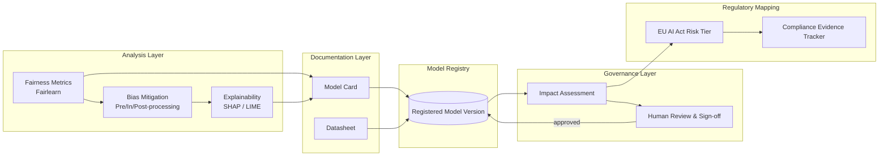
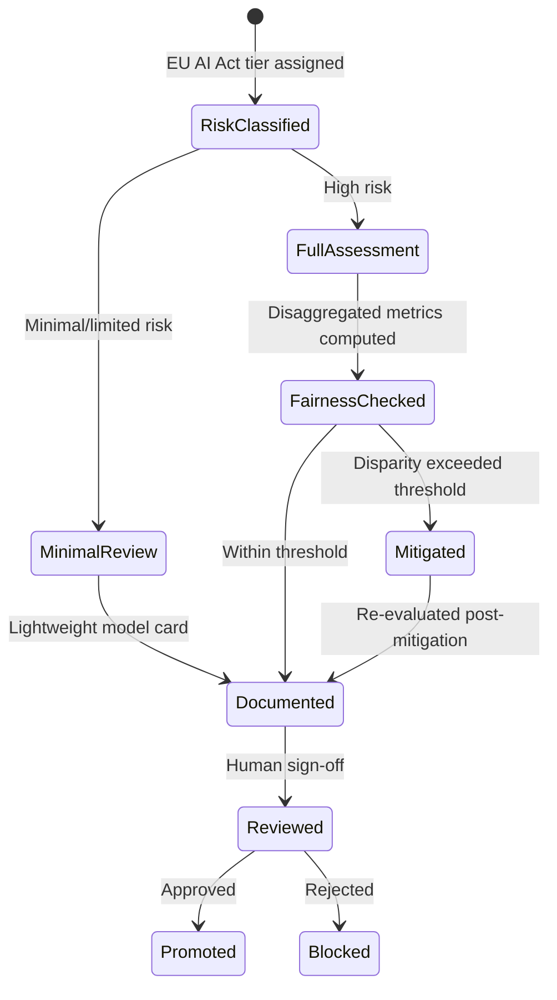

# Responsible AI

> Part of the **Enterprise Data & AI Architecture Handbook** · Phase-11 — AI Platform Engineering & MLOps · Chapter 07.
> Estimated study time: **45 min reading + ~2h labs**.
> **Prerequisite:** read [Azure Machine Learning](05_Azure_Machine_Learning.md) first.

---

## Executive Summary

Every prior Phase-11 chapter deferred a specific fairness or safety concern to this final chapter: [Machine Learning Foundations](01_Machine_Learning_Foundations.md#problems-it-cannot-solve) flagged that a model trained on historically biased data reproduces that bias by default; [MLOps and MLflow](03_MLOps_and_MLflow.md#governance) and [ML Pipeline Architecture](06_ML_Pipeline_Architecture.md#governance) both established a governance gate for fairness review without specifying its content; and [Azure Machine Learning](05_Azure_Machine_Learning.md#55-responsible-ai-dashboard) §5.5 previewed the Responsible AI dashboard's four analysis capabilities without covering the underlying discipline they operationalize. This chapter is that deferred content: the fairness metrics, explainability techniques, documentation practices, and regulatory context that turn "we ran a Responsible AI review" from a checkbox into a defensible, evidence-based practice.

This chapter covers **fairness and bias mitigation** as a technical and organizational discipline for detecting and reducing disparate model impact across protected or sensitive groups; **explainability (SHAP, LIME)** as the two dominant model-agnostic techniques for answering "why did the model produce this specific prediction"; **model cards and datasheets** as the standardized documentation formats that make a model's intended use, limitations, and evaluation results legible to reviewers who did not build it; **AI risk and regulation**, centered on the EU AI Act's risk-tiered regulatory framework, as the concrete legal context increasingly shaping what "responsible" is required to mean, not merely encouraged to mean; and the **Microsoft Responsible AI Standard** as a concrete, publicly documented example of an enterprise operationalizing these principles into an enforceable internal governance process.

The bias remains **Azure-primary (~60%)** — the Azure ML Responsible AI dashboard (from [Azure Machine Learning](05_Azure_Machine_Learning.md#55-responsible-ai-dashboard) §5.5) and Microsoft's own published Responsible AI Standard as the concrete enterprise reference — **~30% enterprise open source** (Fairlearn and InterpretML as the libraries underlying much of that dashboard, SHAP and LIME as the explainability techniques directly) and **~10% AWS/GCP comparison-only** (SageMaker Clarify, Vertex AI's Explainable AI and fairness indicators).

**Bottom line:** Responsible AI is not a separate compliance program bolted onto an otherwise-complete ML platform — it is the same evaluation-gate, registry-promotion, and governance discipline this entire handbook phase has built, applied to a dimension (fairness, explainability, documented limitation) that a pure accuracy/latency-focused evaluation gate does not capture on its own, and this chapter is where that gap finally gets closed with concrete technique, not just a named intention.

---

## Learning Objectives

By the end of this chapter you will be able to:

1. **Select and apply fairness metrics** appropriate to a specific use case, and distinguish disparate treatment from disparate impact.
2. **Apply bias mitigation techniques** at the pre-processing, in-processing, and post-processing stages of the ML lifecycle.
3. **Generate and interpret SHAP and LIME explanations** for both global (model-level) and local (individual-prediction-level) interpretability.
4. **Author a model card and datasheet** documenting a model's intended use, limitations, training data provenance, and evaluation results.
5. **Classify an AI system's risk tier under the EU AI Act** and identify the corresponding compliance obligations.
6. **Apply the Microsoft Responsible AI Standard's governance structure** as a template for an internal enterprise Responsible AI review process.
7. **Defend Responsible AI architecture decisions** in engineer, staff engineer, architect, and CTO review settings, including the trade-off between model accuracy and fairness/interpretability constraints.

---

## Business Motivation

- **Regulatory exposure for AI systems is now a binding legal requirement, not merely a reputational consideration.** The EU AI Act's risk-tiered obligations (§7.4) impose specific, enforceable requirements on high-risk AI systems, with penalties comparable in scale to GDPR's, directly extending the compliance-as-code discipline from [Compliance and Regulatory Frameworks](../Phase-10/06_Compliance_and_Regulatory_Frameworks.md) into the AI-specific domain.
- **Undetected bias creates direct legal and reputational exposure.** A credit, hiring, or insurance model exhibiting disparate impact across a protected attribute can trigger discrimination liability regardless of whether the bias was intentional — the fairness assessment discipline in §7.1 is a risk-mitigation practice with direct legal consequence, not merely an ethical aspiration.
- **Unexplainable model decisions are increasingly commercially and legally untenable for consequential decisions.** A customer or regulator challenging a loan denial or an insurance premium increase increasingly expects (and in some jurisdictions is legally entitled to) a specific, individualized explanation — a capability explainability techniques (§7.2) are what actually provide.
- **Undocumented models create organizational risk that compounds over time.** Without a model card (§7.3), institutional knowledge about a model's known limitations, appropriate use cases, and evaluation caveats is lost as the original team moves on, and a new team inheriting the model can unknowingly deploy it outside its validated scope.
- **Being unprepared for AI regulation creates a competitive and operational disadvantage relative to organizations that have already operationalized Responsible AI as a standing practice** (per Microsoft's own published Responsible AI Standard, §7.5) — retrofitting fairness and documentation practices onto an already-large model portfolio under looming regulatory deadlines is measurably more expensive than building the practice in from the start.

---

## History and Evolution

- **2016 — ProPublica's COMPAS investigation** publicly demonstrates racial disparity in a widely-used criminal-risk-assessment algorithm, becoming one of the most-cited case studies establishing that algorithmic fairness is a concrete, measurable, and consequential engineering concern, not an abstract ethical debate.
- **2016 — "Datasheets for Datasets" (Gebru et al.) and, shortly after, "Model Cards for Model Reporting" (Mitchell et al., 2018)** formalize the standardized documentation practices this chapter's §7.3 covers, directly responding to the accountability gap the COMPAS case exposed.
- **2017 — LIME (Ribeiro et al., 2016) and SHAP (Lundberg and Lee, 2017)** are published in close succession, establishing the two dominant model-agnostic local-explanation techniques this chapter's §7.2 covers in depth.
- **2018-2019 — Fairlearn and IBM's AI Fairness 360 are released as open-source fairness-assessment toolkits**, giving practitioners their first widely-adopted, standardized libraries for computing disparate-impact and disparate-treatment metrics rather than each team implementing ad hoc fairness calculations.
- **2018-2022 — major technology companies publish their own Responsible AI principles and standards** (Microsoft's Responsible AI Standard, Google's AI Principles), moving Responsible AI from an academic and civil-society concern into a named, internally-enforced enterprise governance practice.
- **2021 — the European Commission proposes the EU AI Act**, the first comprehensive, risk-tiered AI-specific regulatory framework, moving well beyond GDPR's general data-protection scope into AI-system-specific obligations.
- **2024 — the EU AI Act is formally adopted**, entering a phased implementation timeline with specific compliance deadlines by risk tier, giving §7.4's regulatory content concrete legal force rather than remaining a proposed framework.
- **2023-present — generative AI and foundation models introduce new Responsible AI challenges** (hallucination, training-data provenance at a scale that makes datasheets far harder to fully enumerate, emergent capabilities not present in narrower predictive models), extending — but not replacing — the fairness, explainability, and documentation disciplines this chapter covers for the classical predictive-ML use cases that remain this handbook's primary focus.

---

## Why This Technology Exists

Responsible AI practice exists because a model that is accurate, well-engineered, and correctly deployed by every technical measure this handbook has covered so far can still cause serious, foreseeable harm if it exhibits disparate impact across a protected group, cannot explain a consequential individual decision to the person it affects, or is deployed by a downstream team outside the scope its original evaluation actually validated. The specific techniques this chapter covers — fairness metrics, SHAP/LIME explanations, model cards, and risk-tiered regulatory compliance — exist because "the evaluation gate from [Machine Learning Foundations](01_Machine_Learning_Foundations.md#12-training-validation-and-evaluation-metrics) §1.2 passed" answers only the accuracy dimension of "is this model acceptable to deploy," and an increasing body of legal requirement, documented harm (the COMPAS case being the canonical example), and enterprise governance practice has established that accuracy alone is an insufficient acceptance criterion for consequential AI decisions.

---

## Problems It Solves

- **Undetected disparate impact across protected groups** — systematic fairness assessment (§7.1) surfaces performance disparities an aggregate accuracy metric alone would hide, directly extending the sub-population error-analysis discipline [Azure Machine Learning](05_Azure_Machine_Learning.md#55-responsible-ai-dashboard) §5.5 previewed.
- **Unexplainable, opaque model decisions** — SHAP and LIME (§7.2) give a concrete, technical answer to "why did the model predict this," both for debugging and for individual-decision accountability.
- **Institutional knowledge loss about a model's intended use and limitations** — model cards and datasheets (§7.3) make this information a durable, discoverable artifact rather than tribal knowledge that departs with the original team.
- **Regulatory non-compliance under emerging AI-specific law** — the EU AI Act risk-tiering framework (§7.4) gives a concrete classification and obligation checklist rather than leaving "are we compliant" as an open question.
- **Inconsistent, ad hoc internal Responsible AI review across teams** — a published, enforced standard like Microsoft's (§7.5) gives every team the same governance process and bar, rather than each team informally deciding what "responsible enough" means for their own model.

---

## Problems It Cannot Solve

- **It cannot make a fundamentally biased business decision fair by adjusting the model alone.** If a business process itself encodes a discriminatory policy (e.g., a lending criterion designed to exclude a protected group), no model-level fairness mitigation technique fixes that — the technical fairness assessment in §7.1 detects and quantifies disparate impact; resolving a discriminatory underlying policy is an organizational and legal decision beyond the model.
- **It cannot fully explain the internal mechanics of every model type with equal fidelity.** SHAP and LIME (§7.2) provide model-agnostic, approximate local explanations; neither provides a perfectly faithful mechanistic account of a very large or highly non-linear model's internal computation — explainability techniques trade some fidelity for broad applicability, a trade-off this chapter is explicit about rather than overselling.
- **It cannot eliminate the fundamental tension between fairness and accuracy in every case.** Some fairness-mitigation techniques measurably reduce aggregate accuracy as a direct cost of reducing disparate impact — this is a real, quantifiable trade-off (§7.24) this chapter equips you to navigate deliberately, not a tension that disappears with the right tooling.
- **It cannot substitute legal judgment with a technical checklist.** EU AI Act risk classification (§7.4) and the specific obligations attached to each tier require legal review for a given real-world deployment, not solely an engineering self-assessment — this chapter equips engineers to have that conversation informedly, not to replace legal counsel.
- **It cannot guarantee an organization avoids all future reputational or regulatory harm.** Responsible AI practice materially reduces risk; it does not provide an absolute guarantee against a novel harm a current fairness metric or explainability technique does not yet capture — new failure modes (particularly around generative AI) continue to emerge, requiring the practice itself to keep evolving.

---

## Core Concepts

### 7.1 Fairness and Bias Mitigation

- **Disparate treatment vs. disparate impact** are the two legally and technically distinct fairness concerns: disparate treatment is a model explicitly using a protected attribute (or a close proxy) as an input feature; disparate impact is a model that, without using a protected attribute directly, still produces materially different outcomes across groups defined by that attribute — the more common, more subtle, and legally significant failure mode, since a model can exhibit disparate impact even when a protected attribute was deliberately excluded from its features.
- **Fairness metrics quantify disparate impact along different, sometimes mutually incompatible definitions**: demographic parity (equal positive-prediction rate across groups), equalized odds (equal true-positive and false-positive rates across groups), and predictive parity (equal precision across groups) each capture a different notion of "fair," and a well-documented impossibility result establishes that these definitions cannot all be simultaneously satisfied except in trivial cases — meaning selecting a fairness metric is itself a deliberate, use-case-specific, and defensible judgment call, not a default choice.
- **Bias mitigation techniques apply at three distinct pipeline stages**: **pre-processing** (re-weighting or resampling training data to reduce group imbalance before training, connecting directly to the feature-engineering discipline in [Machine Learning Foundations](01_Machine_Learning_Foundations.md#14-feature-engineering-fundamentals) §1.4), **in-processing** (adding a fairness constraint directly into the model's training objective, e.g., Fairlearn's `ExponentiatedGradient` reduction technique), and **post-processing** (adjusting a trained model's decision thresholds per group to equalize a chosen fairness metric after training is complete, without retraining).
- **Mitigation is a trade-off, not a free correction**: applying a fairness constraint typically reduces the model's aggregate accuracy to some degree, since the unconstrained optimum was, by definition, the accuracy-maximizing solution before the fairness constraint was imposed — the magnitude of this trade-off, and whether it is acceptable, is a decision that belongs in the same evaluation-gate and human-review process established in [MLOps and MLflow](03_MLOps_and_MLflow.md#32-model-registry-and-stage-transitions) §3.2, extended to include a fairness threshold alongside the accuracy threshold.
- **Fairness assessment must be continuous, not a one-time pre-deployment check** — the same governance gap [Azure Machine Learning](05_Azure_Machine_Learning.md#case-studies) Case Study 2 illustrated (a Responsible AI report generated once and never regenerated across retrained versions) applies specifically to fairness metrics: a model retrained on fresh data can drift in its fairness characteristics exactly as it can drift in its accuracy, requiring fairness re-assessment as a mandatory stage in every retraining cycle, not only the model's initial deployment.

### 7.2 Explainability (SHAP, LIME)

- **SHAP (SHapley Additive exPlanations)** is grounded in cooperative game theory's Shapley value concept, attributing each feature's specific, additive contribution to a given prediction relative to a baseline (expected) prediction — its key theoretical property is that feature attributions sum exactly to the difference between the prediction and the baseline, giving SHAP values a mathematically consistent, not merely heuristic, interpretation.
- **LIME (Local Interpretable Model-agnostic Explanations)** explains an individual prediction by fitting a simple, interpretable surrogate model (typically a sparse linear model) to a local neighborhood of perturbed inputs around the specific prediction being explained — it is faster to compute per-explanation than SHAP for some model types, at the cost of the surrogate model's local approximation being less theoretically grounded than SHAP's exact additive decomposition.
- **Global vs. local interpretability serve different purposes**: a global explanation (aggregate feature importance across many predictions) answers "what does this model generally rely on," useful for model debugging and high-level stakeholder communication; a local explanation (SHAP/LIME applied to one specific prediction) answers "why did the model make this specific decision for this specific individual," the capability required for individualized decision accountability (e.g., explaining a specific loan denial to the affected applicant).
- **Explainability techniques are model-agnostic but not free of computational cost** — computing exact SHAP values is computationally expensive for models with many features (mitigated in practice by approximation methods like TreeSHAP for tree ensembles, which computes exact Shapley values far more efficiently than the general-purpose algorithm), a cost trade-off relevant when deciding whether to generate explanations for every production prediction or only on-demand for specific, flagged decisions.
- **Explanations must be interpreted cautiously, not treated as a literal causal account** — a SHAP or LIME explanation describes the trained model's learned association between a feature and its output, not necessarily the true real-world causal mechanism; conflating "this feature's SHAP value was high" with "this feature causally drove the outcome" is a common, subtle misinterpretation this chapter flags explicitly, directly connecting to the correlation-vs-causation caution from [Machine Learning Foundations](01_Machine_Learning_Foundations.md#problems-it-cannot-solve).

### 7.3 Model Cards and Datasheets

- **A model card documents a trained model's intended use, performance characteristics, and known limitations** in a standardized format: intended use cases and explicitly out-of-scope use cases, the evaluation data and metrics used (including any disaggregated fairness metrics from §7.1), known limitations and failure modes, and ethical considerations — the durable documentation artifact that prevents the institutional-knowledge loss flagged in this chapter's Business Motivation.
- **A datasheet documents a dataset's provenance, collection methodology, and known biases or limitations** — separate from, but complementary to, a model card, since a dataset can be reused across multiple models and its own documented limitations (how it was collected, what population it represents, what it does not represent) are relevant to every model trained from it.
- **Both artifacts should be attached directly to the model registry entry** (per [MLOps and MLflow](03_MLOps_and_MLflow.md#32-model-registry-and-stage-transitions) §3.2's registered model metadata), not maintained as a separate, disconnected document that can drift out of sync with the actual deployed model version — the same lineage-attachment principle established for the Responsible AI dashboard report in [Azure Machine Learning](05_Azure_Machine_Learning.md#55-responsible-ai-dashboard) §5.5.
- **Model cards must be regenerated (or explicitly re-reviewed) for every new model version**, not authored once at initial deployment and left stale — directly extending the lesson from [Azure Machine Learning](05_Azure_Machine_Learning.md#case-studies) Case Study 2, where a Responsible AI report's staleness across retrained versions was discovered only during an external audit.
- **A well-authored model card is what allows a *different* team than the one that built the model** — a downstream consuming team, an auditor, or a new engineer inheriting ownership — **to correctly judge whether a given deployment context is within the model's validated scope**, without needing to reconstruct that judgment from scratch or, worse, without realizing they needed to make that judgment at all.

### 7.4 AI Risk and Regulation (EU AI Act)

- **The EU AI Act establishes a risk-tiered regulatory framework**, classifying AI systems into four tiers: **unacceptable risk** (prohibited outright, e.g., social scoring by public authorities), **high risk** (subject to extensive obligations: risk management systems, data governance, technical documentation, human oversight, and conformity assessment — the tier most enterprise data-platform-relevant use cases like credit scoring and employment screening fall into), **limited risk** (subject to transparency obligations, e.g., disclosing that a user is interacting with an AI system), and **minimal risk** (largely unregulated, e.g., a spam filter).
- **High-risk classification triggers concrete, specific technical obligations** directly implementable via this handbook's existing practices: a risk-management system (extending the governance gates from [ML Pipeline Architecture](06_ML_Pipeline_Architecture.md#governance)), data governance requirements (extending [Data Governance Foundations](../Phase-08/01_Data_Governance_Foundations.md)), technical documentation (the model cards/datasheets from §7.3), human oversight (the human-in-the-loop promotion gate from [MLOps and MLflow](03_MLOps_and_MLflow.md#trade-offs)), and accuracy/robustness/cybersecurity requirements (extending the evaluation-gate and security practices from [Machine Learning Foundations](01_Machine_Learning_Foundations.md) and [Network Security and Zero Trust](../Phase-10/04_Network_Security_and_Zero_Trust.md)).
- **The EU AI Act's extraterritorial reach mirrors GDPR's**: it applies to AI systems whose *output* is used within the EU, regardless of where the provider is headquartered or where the model was trained — directly relevant for any global enterprise's data platform, not only organizations with an EU legal entity, the same extraterritorial-scope lesson [Compliance and Regulatory Frameworks](../Phase-10/06_Compliance_and_Regulatory_Frameworks.md) established for GDPR specifically.
- **Compliance-as-code extends naturally from data/security compliance to AI-specific compliance**: the same Purview Compliance Manager and Azure Policy regulatory-initiative pattern [Compliance and Regulatory Frameworks](../Phase-10/06_Compliance_and_Regulatory_Frameworks.md) established for GDPR/HIPAA/PCI-DSS applies to tracking EU AI Act obligations per deployed high-risk AI system, rather than treating AI Act compliance as an entirely separate, parallel program.
- **Risk classification must happen *before* a system is built, not retrofitted after deployment** — the EU AI Act's conformity-assessment and documentation obligations are far cheaper to satisfy when designed in from the start (using this handbook's existing evaluation-gate, model-card, and governance practices) than retrofitted onto an already-deployed high-risk system under regulatory deadline pressure, directly paralleling the same "instrument once, comply continuously" lesson [Compliance and Regulatory Frameworks](../Phase-10/06_Compliance_and_Regulatory_Frameworks.md) established generally.

### 7.5 Microsoft Responsible AI Standard

- **Microsoft's publicly documented Responsible AI Standard** operationalizes six principles (fairness, reliability and safety, privacy and security, inclusiveness, transparency, and accountability) into a concrete, enforceable internal review process — a real-world example of exactly the kind of organization-wide, non-optional governance gate this handbook's Phase-11 chapters have each independently recommended, now shown as a published, production-proven reference.
- **The Standard requires impact assessments for AI systems above a defined sensitivity/scale threshold**, a formalized version of the risk-tiering concept from §7.4, requiring documented consideration of stakeholder impact, fairness, and potential misuse *before* a system proceeds to broader deployment — directly mirroring this handbook's own evaluation-gate philosophy (assess before promoting), applied to a fairness/safety dimension rather than an accuracy dimension.
- **The Standard mandates specific accountability structures** (a designated responsible owner per system, similar to the model-ownership requirement established throughout [Machine Learning Foundations](01_Machine_Learning_Foundations.md#governance) and every subsequent Phase-11 chapter's Governance section) and sensitive-use case review processes for particularly high-stakes applications.
- **This is offered as a template, not a mandate to adopt verbatim** — an organization building its own internal Responsible AI governance process can use the Standard's publicly documented structure (impact assessment, accountability ownership, sensitive-use review) as a proven starting template, adapting the specific thresholds and review processes to its own risk tolerance and regulatory context (including, per §7.4, its own EU AI Act exposure).
- **The Standard demonstrates that Responsible AI governance and delivery velocity are not inherently opposed** at the scale of a large, fast-moving technology organization — a well-designed impact-assessment and review process, correctly tiered by risk (mirroring the tiered-governance pattern established repeatedly across [Feature Stores with Feast](02_Feature_Stores_with_Feast.md#trade-offs), [MLOps and MLflow](03_MLOps_and_MLflow.md#trade-offs), and [ML Pipeline Architecture](06_ML_Pipeline_Architecture.md#trade-offs)), can be operated as a standing, scalable practice rather than an ad hoc, delivery-blocking bottleneck.

---

## Internal Working

**How a fairness assessment and explainability report are actually generated for a registered model** (the mechanics underlying §7.1-7.2, and the technical process behind the Responsible AI dashboard from [Azure Machine Learning](05_Azure_Machine_Learning.md#55-responsible-ai-dashboard) §5.5):

1. **Sensitive attribute specification**: an analyst specifies which attribute(s) (e.g., a demographic group relevant to the use case's legal and ethical context) the fairness assessment should disaggregate performance across — a domain and legal judgment call, not an automatically inferred choice.
2. **Disaggregated metric computation**: the model's chosen evaluation metric (from [Machine Learning Foundations](01_Machine_Learning_Foundations.md#12-training-validation-and-evaluation-metrics) §1.2) is computed separately for each group defined by the sensitive attribute, alongside the fairness metrics from §7.1 (demographic parity difference, equalized odds difference) quantifying the disparity between groups.
3. **Mitigation (if disparity exceeds an acceptable threshold)**: a pre-processing, in-processing, or post-processing technique (§7.1) is applied, and the model is re-evaluated to confirm the mitigation actually reduced the measured disparity without an unacceptable accuracy cost.
4. **Global explanation generation**: SHAP or LIME is run against a representative sample of the evaluation dataset to produce aggregate feature-importance rankings, giving reviewers a model-level understanding of what the model relies on most heavily.
5. **Local explanation generation for flagged or representative individual predictions**: SHAP/LIME is run against specific individual predictions — either a representative sample for the model card, or on-demand for a specific contested decision requiring individualized explanation.
6. **Documentation assembly**: the fairness metrics, mitigation actions taken, and explanation artifacts are assembled into the model card (§7.3), attached to the registered model version.
7. **Human review and sign-off**: a designated reviewer (per the accountability structure in §7.5) examines the assembled evidence and makes the actual go/no-go fairness decision, which is recorded as part of the registry's promotion-approval trail (per [MLOps and MLflow](03_MLOps_and_MLflow.md#35-model-lineage-and-governance) §3.5).

This sequence is the concrete mechanics behind what [Azure Machine Learning](05_Azure_Machine_Learning.md#55-responsible-ai-dashboard) §5.5 described at a higher level as "the dashboard produces analysis artifacts, not a pass/fail gate by itself" — steps 1-6 are the artifact-generation process; step 7 is the human judgment step no tool automates.

---

## Architecture

- **Analysis layer**: fairness-metric computation (Fairlearn) and explainability generation (SHAP/LIME), run either as a dedicated pipeline stage or via the integrated Azure ML Responsible AI dashboard.
- **Documentation layer**: model cards and datasheets, generated from the analysis layer's outputs and attached to the registered model version.
- **Governance layer**: the human-review and sign-off process, recorded in the model registry's promotion-approval trail, extending the evaluation gate from [MLOps and MLflow](03_MLOps_and_MLflow.md#32-model-registry-and-stage-transitions) §3.2 to include a fairness dimension.
- **Regulatory-mapping layer**: a compliance-as-code mapping (per [Compliance and Regulatory Frameworks](../Phase-10/06_Compliance_and_Regulatory_Frameworks.md)'s pattern) from each deployed high-risk AI system to its specific EU AI Act obligations and evidence.
- **Pipeline integration**: this entire analysis-documentation-governance sequence is inserted as a mandatory stage within the CI/CD/CT pipeline from [MLOps and MLflow](03_MLOps_and_MLflow.md#33-cicd-ct-for-models) §3.3 and the assembled reference architecture from [ML Pipeline Architecture](06_ML_Pipeline_Architecture.md), not operated as a separate, disconnected compliance process.

---

## Components

- **Fairness-metric library** — Fairlearn (or the Azure ML Responsible AI dashboard's integrated equivalent), computing disaggregated performance and disparity metrics.
- **Bias-mitigation module** — pre-processing (re-weighting), in-processing (constrained optimization), or post-processing (threshold adjustment) technique implementation.
- **Explainability engine** — SHAP or LIME, generating global and local explanations.
- **Model card/datasheet generator** — the documentation-assembly tooling producing the standardized artifact attached to the registry.
- **Impact-assessment workflow** — the accountability and sensitive-use review process (per §7.5), typically a structured internal review tool or process, not merely a technical artifact.
- **Regulatory-obligation tracker** — the compliance-as-code mapping from deployed system to its applicable EU AI Act (or other jurisdiction-specific) obligations.

---

## Metadata

- **Fairness-assessment metadata**: the specific sensitive attribute(s) evaluated, the fairness metric(s) computed, the measured disparity, and any mitigation technique applied — attached to the registered model version, extending the metadata schema from [MLOps and MLflow](03_MLOps_and_MLflow.md#metadata).
- **Explanation metadata**: which explainability technique (SHAP/LIME) was used, on what sample or specific prediction, and the resulting feature-attribution values.
- **Model card metadata**: intended use, out-of-scope use, known limitations, and the specific model version the card documents — versioned identically to the model itself.
- **Risk-classification metadata**: the EU AI Act (or other applicable regulatory framework) risk tier assigned to the deployed system, and the specific evidentiary artifacts satisfying that tier's obligations.

---

## Storage

- **Fairness and explainability analysis artifacts** stored alongside the model's other MLflow-tracked artifacts (per [MLOps and MLflow](03_MLOps_and_MLflow.md#storage)), in the same ADLS Gen2-backed artifact store.
- **Model cards and datasheets** stored as versioned documents attached to the registry entry, queryable alongside the model's other metadata rather than as a separately-managed document repository disconnected from the model version they describe.
- **Regulatory-obligation evidence** stored in a manner consistent with the compliance-evidence retention practices established in [Compliance and Regulatory Frameworks](../Phase-10/06_Compliance_and_Regulatory_Frameworks.md), since this evidence must be retrievable for an audit potentially long after the model version's original deployment.

---

## Compute

- **Fairness-metric computation** is typically lightweight relative to training compute, running as a fast, batch evaluation pass over a held-out or disaggregated dataset.
- **SHAP computation cost varies significantly by technique and model type** — TreeSHAP (for tree ensembles) is efficient enough to run over a full evaluation dataset routinely; general model-agnostic SHAP (KernelSHAP) is materially more expensive per explanation, often reserved for a representative sample rather than every prediction.
- **This analysis compute is typically provisioned as an additional pipeline stage** within the existing training/evaluation compute allocation from [Machine Learning Foundations](01_Machine_Learning_Foundations.md#compute) and [Azure Machine Learning](05_Azure_Machine_Learning.md#compute), not a separate, independently-provisioned infrastructure track.

---

## Networking

- **No materially distinct networking requirements beyond the existing training/evaluation pipeline's networking posture** — fairness and explainability analysis runs within the same private-networked compute and data-access boundaries established throughout [Network Security and Zero Trust](../Phase-10/04_Network_Security_and_Zero_Trust.md) and every prior Phase-11 chapter.
- **Sensitive-attribute data used for fairness assessment requires the same access-control rigor as any other PII-adjacent data**, meaning the fairness-analysis compute's access to sensitive-attribute datastores must be as tightly scoped and audited as any other consumer of that data.

---

## Security

- **Access to sensitive-attribute data used for fairness assessment must be tightly scoped** (per [Identity and Access Management with Entra](../Phase-10/02_Identity_and_Access_Management_with_Entra.md)), since this data is, by definition, often protected-class information requiring the strictest handling under [Data Privacy and PII Protection](../Phase-10/07_Data_Privacy_and_PII_Protection.md).
- **Model cards and fairness reports themselves can be sensitive artifacts** — a model card documenting a known fairness limitation is valuable internal risk information that should be access-controlled appropriately, not published without consideration of its own sensitivity.
- **Explanation outputs (SHAP/LIME values for a specific individual's prediction) can themselves reveal sensitive information about that individual** (e.g., a specific feature's outsized contribution potentially inferring a sensitive attribute indirectly) — explanation-serving infrastructure for individualized explanations should apply the same access-control discipline as the prediction it explains.

---

## Performance

- **Fairness-metric computation performance** is rarely a bottleneck relative to training/evaluation time, typically adding a modest, fixed overhead to the evaluation stage.
- **On-demand local explanation latency** (generating a SHAP/LIME explanation for a single live prediction, e.g., to explain a specific loan denial to the affected applicant in near-real-time) is a distinct performance requirement from batch explanation generation for a model card, requiring the same latency-budgeting discipline as any other online-serving-path addition (per [Model Serving and Ray](04_Model_Serving_and_Ray.md#performance)) if explanations must be generated synchronously within a request path.
- **TreeSHAP's algorithmic efficiency advantage over general-purpose SHAP** is the primary performance lever for making routine, full-dataset explanation generation practical for tree-ensemble models specifically, directly relevant given tree ensembles' dominance for enterprise tabular ML per [Machine Learning Foundations](01_Machine_Learning_Foundations.md#core-concepts).

---

## Scalability

- **Fairness and explainability analysis must scale with the size of the model portfolio**, not just any single model — the same portfolio-wide governance scaling concern [ML Pipeline Architecture](06_ML_Pipeline_Architecture.md#scalability) raised for cost governance applies equally to Responsible AI review capacity.
- **Impact-assessment and human-review capacity is a genuine organizational scaling constraint** — unlike automated metric computation, the human-judgment step (Internal Working step 7) does not scale simply by adding compute; it requires the tiered-governance approach (§7.Trade-offs) to allocate scarce reviewer attention to the highest-risk systems first.
- **Explanation-serving infrastructure for on-demand, individualized explanations** must scale with the volume of consequential decisions requiring individual explanation (e.g., every declined loan application), a distinct scaling requirement from the model's own core prediction-serving throughput.

---

## Fault Tolerance

- **A fairness-assessment pipeline stage failure should block promotion, not silently skip the check** — the same fail-closed principle [MLOps and MLflow](03_MLOps_and_MLflow.md) ADR-0150 established for the accuracy evaluation gate applies equally to a fairness gate: a failed or skipped fairness check should never be treated as an implicit pass.
- **Explanation-generation failures for an on-demand individualized explanation request** should have a defined fallback behavior (e.g., a delayed, asynchronously-generated explanation rather than a hard failure), since the underlying prediction-serving path should not be blocked by an explanation-generation dependency's transient unavailability.
- **Stale model cards represent a documentation "failure" that requires the same operational vigilance as a stale monitoring dashboard** — per the lesson from [Azure Machine Learning](05_Azure_Machine_Learning.md#case-studies) Case Study 2, an automated check verifying model-card currency against the latest registered model version is a reasonable operational safeguard against this specific staleness failure mode.

---

## Cost Optimization (FinOps)

- **Tiered fairness/explainability rigor by model risk classification** (mirroring the governance tiering established throughout Phase-11): a full fairness assessment, mitigation, and detailed model card for high-risk/regulated models, a lighter-weight check for low-stakes experimental ones, avoiding the cost of applying maximal Responsible AI rigor uniformly regardless of actual risk.
- **TreeSHAP and other efficient explanation algorithms** over general-purpose, more computationally expensive alternatives wherever the model type permits, directly reducing the compute cost of routine explanation generation.
- **Reusing a fairness/explainability analysis across model versions where the underlying data and feature set have not materially changed** (analogous to the pipeline-caching pattern from [Azure Machine Learning](05_Azure_Machine_Learning.md#52-azure-ml-pipelines-and-components) §5.2), avoiding redundant, expensive re-computation where a genuinely unchanged input would produce an unchanged result — while still regenerating the assessment whenever the model or its training data has actually changed, per the anti-staleness principle above.
- **Investing in reviewer training and a well-designed impact-assessment process** (§7.5) is a far cheaper long-run cost than the retrofit cost of building Responsible AI documentation and fairness evidence under regulatory deadline pressure for an already-large, undocumented model portfolio.

---

## Monitoring

- **Fairness-metric drift monitoring**: tracking a deployed model's disaggregated performance metrics over time (not just its aggregate accuracy), detecting if fairness characteristics degrade even while aggregate accuracy remains stable — a genuinely distinct monitoring signal from the aggregate drift monitoring covered in [Machine Learning Foundations](01_Machine_Learning_Foundations.md#16-monitoring) §1's Monitoring section.
- **Model-card currency monitoring**: an automated check comparing each production model's model-card version against its actual currently-deployed model version, flagging staleness (per the Fault Tolerance section above).
- **Explanation-serving latency and error-rate monitoring**, for any use case generating on-demand individualized explanations within a live request path.

---

## Observability

- **A unified view of every production model's current fairness-assessment status, model-card currency, and applicable regulatory-obligation evidence** gives both engineering and compliance stakeholders one authoritative source for "is this specific model's Responsible AI posture current and defensible," rather than requiring a manual reconstruction effort during an audit.
- **Correlating fairness-metric drift with the broader accuracy/data-drift monitoring** from [ML Pipeline Architecture](06_ML_Pipeline_Architecture.md#monitoring) in one dashboard, so a retraining decision (drift-triggered per §6.3) considers both dimensions together rather than fairness drift being a separate, easily-overlooked signal.

### Operational Response Playbook

| Signal | Detection Query/Check | Remediation |
|---|---|---|
| **A deployed model's disaggregated fairness metric drifts beyond an acceptable threshold, even though aggregate accuracy remains within its own acceptable range** | Fairness-metric monitoring dashboard, disaggregated by the model's specified sensitive attribute(s), compared against its documented acceptable-disparity threshold | Trigger a fairness-focused retraining/mitigation review, not merely the standard accuracy-driven CT retraining path (per [ML Pipeline Architecture](06_ML_Pipeline_Architecture.md#63-drift-detection-and-retraining) §6.3) — a fairness-specific drift may require a different mitigation (re-weighting, a post-processing threshold adjustment) than an accuracy-driven retrain would apply on its own |
| **A production model's model card is found to be out of date relative to its currently deployed version** | Automated model-card-version-vs-deployed-version reconciliation check, run on a recurring schedule | Regenerate and re-review the model card before the next scheduled audit or regulatory review, treating this as equivalent in urgency to a stale monitoring dashboard, not a low-priority documentation backlog item |

---

## Governance

- **Every high-risk or regulated model must have a current fairness assessment, explainability documentation, and model card as a condition of Production-stage promotion** — the concrete, technical content behind the fairness-review governance gate every prior Phase-11 chapter referenced but deferred.
- **A designated accountable owner per model** (per §7.5's Microsoft Responsible AI Standard reference) is responsible for ensuring this documentation remains current across every retrained version, not only the model's initial deployment.
- **Impact assessments, tiered by risk classification** (§7.4's EU AI Act tiers, or an organization's own internal risk classification per §7.5), determine the depth of review required before deployment — a lightweight review for minimal-risk systems, a full impact assessment and human sign-off for high-risk ones.
- **The full promotion-approval trail** (fairness assessment result, explainability artifacts, model card, and human reviewer sign-off) must be retained and queryable, extending the audit-defensibility requirement established throughout [MLOps and MLflow](03_MLOps_and_MLflow.md#governance) and [ML Pipeline Architecture](06_ML_Pipeline_Architecture.md#governance) to specifically cover this chapter's fairness/explainability dimension.

---

## Trade-offs

- **Fairness constraint strength vs. aggregate accuracy**: a stronger fairness-mitigation constraint reduces measured disparity at some accuracy cost — this trade-off should be made deliberately and documented, not treated as a free correction or, conversely, avoided entirely out of an unexamined assumption that any accuracy cost is unacceptable.
- **Explanation fidelity vs. computational cost**: SHAP's theoretically grounded, exact (for tree models via TreeSHAP) attributions cost more to compute than LIME's faster, more approximate local surrogate models — the correct choice depends on whether the use case needs the strongest possible theoretical guarantee or simply a fast, reasonably interpretable explanation.
- **Uniform maximal Responsible AI rigor vs. risk-tiered proportional rigor**: applying the full fairness-assessment, explainability, and documentation burden uniformly to every model regardless of actual risk slows delivery for low-stakes work without a corresponding risk-reduction benefit — the tiered approach (§7.16, §7.23) resolves this the same way every other Phase-11 chapter's governance-vs-velocity tension was resolved.
- **Full model-agnostic explainability vs. restricting to inherently interpretable models**: a simpler, inherently interpretable model (a regularized linear model, a shallow decision tree) avoids needing post-hoc explanation techniques at all, at the cost of the accuracy such simpler models often sacrifice relative to more complex alternatives — the interpretability-vs-complexity trade-off [Machine Learning Foundations](01_Machine_Learning_Foundations.md#trade-offs) first raised, now fully resolved with the concrete post-hoc-explainability alternative this chapter provides.

---

## Decision Matrix

| Scenario | Recommended Approach | Rationale |
|---|---|---|
| High-risk/regulated use case (credit, hiring, insurance) | Full fairness assessment + mitigation + SHAP-based explainability + model card + human sign-off, mapped explicitly to EU AI Act high-risk obligations | Regulatory and legal exposure demands the complete, defensible evidence trail |
| Low-stakes, experimental, internal-only model | Lightweight fairness check (basic disparate-impact screen) and a minimal model card, no mandatory mitigation unless a disparity is actually found | Full rigor is not proportionate to the risk; escalate to full review only if the model progresses toward a higher-stakes deployment |
| Need for individualized, on-demand decision explanations (e.g., explaining a specific loan denial) | SHAP (or TreeSHAP for tree ensembles) generated synchronously or near-real-time within the decision-serving path | Provides the theoretically grounded, additive explanation needed for defensible individualized accountability |
| Need for fast, aggregate model-behavior understanding during development/debugging | LIME or a quick SHAP sample-based global explanation | Faster to compute than a full, exact SHAP pass; sufficient for developer-facing debugging rather than external accountability |
| Organization operating across multiple jurisdictions with varying AI regulation | Compliance-as-code regulatory-obligation tracker mapping each deployed system to its applicable jurisdiction's specific tier and obligations | Avoids treating "AI compliance" as a single undifferentiated requirement when obligations genuinely vary by jurisdiction |

---

## Design Patterns

- **Fairness and explainability as a mandatory pipeline stage**, not a separate, manually-run side process — inserted directly into the CI/CD/CT sequence from [MLOps and MLflow](03_MLOps_and_MLflow.md#33-cicd-ct-for-models) §3.3 and the assembled architecture from [ML Pipeline Architecture](06_ML_Pipeline_Architecture.md).
- **Risk-tiered rigor**, applying the full fairness/explainability/documentation burden proportionally to a model's actual risk classification (§7.4), not uniformly.
- **Documentation-attached-to-registry**, keeping model cards and fairness reports as first-class, versioned registry metadata rather than a separately-maintained, driftable document repository.
- **Continuous re-assessment on every retraining cycle**, closing the specific staleness gap [Azure Machine Learning](05_Azure_Machine_Learning.md#case-studies) Case Study 2 illustrated.

---

## Anti-patterns

- **Generating a fairness/explainability report once at initial deployment and never regenerating it for subsequent retrained versions** — the precise, recurring failure mode this chapter (following directly from [Azure Machine Learning](05_Azure_Machine_Learning.md) Case Study 2) repeatedly warns against.
- **Treating a Responsible AI dashboard's or fairness library's output as a self-certifying pass** without an actual documented human review and go/no-go decision.
- **Applying uniform, maximal Responsible AI rigor to every model regardless of risk**, slowing delivery for low-stakes work without a commensurate risk-reduction benefit.
- **Selecting a fairness metric arbitrarily or by default**, without documenting why that specific definition of fairness (demographic parity, equalized odds, predictive parity) is the correct one for the use case's actual legal and ethical context.
- **Conflating a SHAP/LIME feature attribution with a causal explanation**, drawing an unjustified causal conclusion from what is actually a correlational, model-learned association.

---

## Common Mistakes

- Choosing a fairness-mitigation technique and threshold without documenting the specific accuracy trade-off it introduces, leaving a later reviewer unable to assess whether the trade-off was reasonable.
- Storing model cards in a disconnected document repository rather than attaching them to the model registry, allowing them to silently drift out of sync with the actual deployed model.
- Assuming an EU AI Act risk-tier classification made once at a system's initial design remains valid indefinitely, without reassessing as the system's actual use expands or changes.
- Generating explanations only in aggregate (global) form and never validating that individual (local) explanations remain sensible for edge-case or minority-group predictions specifically.
- Treating "we used SHAP" as sufficient evidence of interpretability without actually reviewing whether the resulting explanations were clear, correct, and useful to their intended audience.

---

## Best Practices

- Mandate fairness assessment, explainability documentation, and a current model card as non-optional conditions of Production-stage promotion for every high-risk or regulated model.
- Select and document the specific fairness metric(s) appropriate to each use case's legal and ethical context explicitly, rather than defaulting to whichever metric a library computes first.
- Regenerate fairness assessments and model cards on every retraining cycle, integrated as a mandatory pipeline stage, not a manually-remembered afterthought.
- Apply risk-tiered rigor, reserving the full assessment/documentation/review burden for high-risk systems and a lighter-weight check for genuinely low-stakes ones.
- Maintain a compliance-as-code mapping from every deployed AI system to its applicable jurisdiction-specific regulatory obligations, reviewed and updated as regulation evolves.

---

## Enterprise Recommendations

- Adopt a published, proven governance template (such as Microsoft's Responsible AI Standard) as the organization's own internal Responsible AI review process structure, adapted to its specific risk tolerance and regulatory exposure, rather than building a bespoke process from scratch.
- Integrate fairness/explainability/documentation generation directly into the existing CI/CD/CT pipeline (per [MLOps and MLflow](03_MLOps_and_MLflow.md) and [ML Pipeline Architecture](06_ML_Pipeline_Architecture.md)) as a mandatory stage, rather than operating Responsible AI review as a separate, disconnected compliance process.
- Establish and staff a designated Responsible AI review capacity (per §7.5's accountability-structure recommendation), tiered to prioritize scarce reviewer attention toward the highest-risk systems first.
- Track model-card and fairness-assessment currency as a standing platform KPI (per §7.21 Monitoring), catching staleness proactively rather than only during an external audit, directly preventing a recurrence of the [Azure Machine Learning](05_Azure_Machine_Learning.md) Case Study 2 failure mode.

---

## Azure Implementation

- **The Azure ML Responsible AI dashboard** (from [Azure Machine Learning](05_Azure_Machine_Learning.md#55-responsible-ai-dashboard) §5.5) as the integrated tool generating fairness, explainability (SHAP-based), error-analysis, and counterfactual artifacts directly against a registered model.
- **Azure ML model registry metadata** for attaching model cards, datasheets, and fairness-assessment results directly to a registered model version.
- **Microsoft Purview Compliance Manager and Azure Policy regulatory initiatives** (per [Compliance and Regulatory Frameworks](../Phase-10/06_Compliance_and_Regulatory_Frameworks.md)) extended to track EU AI Act-specific obligations per deployed high-risk AI system.
- **Microsoft's published Responsible AI Standard** as the reference governance-process template for structuring an organization's own internal impact-assessment and sensitive-use review process.

---

## Open Source Implementation

- **Fairlearn** for fairness-metric computation (demographic parity, equalized odds, predictive parity) and in-processing/post-processing bias mitigation.
- **SHAP** (including TreeSHAP for efficient tree-ensemble explanations) and **LIME** as the two dominant open-source explainability libraries.
- **InterpretML** as a broader open-source interpretability toolkit, including both post-hoc explanation methods and inherently interpretable model families (e.g., Explainable Boosting Machines).
- **AI Fairness 360 (IBM)** as an alternative, broader fairness-toolkit option covering additional metrics and mitigation algorithms beyond Fairlearn's scope, for teams wanting a wider technique library.

---

## AWS Equivalent (comparison only)

- **Amazon SageMaker Clarify** provides the direct equivalent fairness-metric and SHAP-based explainability capability, integrated with SageMaker's broader training/registry ecosystem.
- **Advantages**: tight integration for AWS-centric teams, consistent with the parallel comparisons throughout Phase-11.
- **Disadvantages**: a distinct API and reporting format relative to Azure ML's Responsible AI dashboard, requiring rework to migrate existing fairness/explainability pipeline integration.
- **Migration strategy**: the underlying open-source libraries (Fairlearn, SHAP) that both platforms' native tools are often built on or comparable to port with the least friction; platform-native report formats and dashboard integrations require rework.
- **Selection criteria**: choose SageMaker Clarify when the broader ML estate is AWS-centric; otherwise this chapter's Azure-primary recommendation applies.

---

## GCP Equivalent (comparison only)

- **Google Vertex AI's Explainable AI and fairness indicators** provide the equivalent capability, with strong integration for GCP/BigQuery-centric teams.
- **Advantages**: consistent with the parallel GCP comparisons throughout Phase-11, particularly strong for TensorFlow-centric workflows.
- **Disadvantages**: the same re-platforming cost pattern as the AWS case relative to Azure ML's Responsible AI dashboard.
- **Migration strategy**: as with AWS, open-source library-based implementations (Fairlearn, SHAP) port more readily than platform-native dashboard integrations.
- **Selection criteria**: choose Vertex AI's tooling when the data/ML estate is GCP-centric; otherwise default to the Azure-primary recommendation.

---

## Migration Considerations

- **Fairlearn, SHAP, and LIME are open-source and cloud-agnostic**, meaning fairness-assessment and explainability logic implemented using these libraries directly (rather than solely through a platform-native dashboard) migrates with minimal friction across Azure ML, SageMaker, or Vertex AI.
- **Platform-native Responsible AI dashboard reports and their specific formats do not transfer as-is** between platforms, requiring either regeneration using the target platform's native tooling or reliance on the underlying open-source library outputs directly, which remain platform-independent.
- **Model cards and datasheets, being plain, standardized documentation formats**, are inherently the most portable artifact this chapter covers, transferring across any platform migration without rework, provided they were authored in a standard (not platform-proprietary) format from the start.
- **Regulatory-obligation tracking must be re-validated, not merely copied, after a platform migration** — confirming that the compliance-as-code mapping from deployed system to EU AI Act (or other jurisdiction) obligation still correctly reflects the system's actual post-migration deployment configuration and evidence-generation pipeline.

---

## Mermaid Architecture Diagrams



```mermaid
sequenceDiagram
    participant Pipeline as CI/CD/CT Pipeline
    participant Fairness as Fairness Assessment
    participant Explain as Explainability
    participant Card as Model Card Generator
    participant Reviewer as Human Reviewer
    participant Registry as Model Registry

    Pipeline->>Fairness: Compute disaggregated metrics
    Fairness->>Fairness: Apply mitigation if disparity exceeds threshold
    Fairness->>Explain: Pass evaluated model
    Explain->>Explain: Generate global + local explanations
    Explain->>Card: Assemble documentation
    Card->>Reviewer: Submit for review
    alt Reviewer approves
        Reviewer->>Registry: Sign off; attach model card
        Registry->>Registry: Promote to Production
    else Reviewer rejects
        Reviewer-->>Pipeline: Reject; require rework
    end
```



---

## End-to-End Data Flow

1. **Risk classification**: a new or retrained model is classified against the EU AI Act (or an internal equivalent) risk tier, determining the required depth of review.
2. **Fairness assessment**: disaggregated performance metrics are computed across specified sensitive attributes; mitigation is applied if disparity exceeds an agreed threshold.
3. **Explainability generation**: global and (where needed) local SHAP/LIME explanations are generated.
4. **Documentation assembly**: a model card and, where relevant, a datasheet are generated or updated, attached to the registered model version.
5. **Human review**: a designated reviewer examines the assembled evidence and makes the go/no-go fairness/Responsible-AI decision.
6. **Registry promotion**: an approved model is promoted per the standard registry stage-transition workflow from [MLOps and MLflow](03_MLOps_and_MLflow.md#32-model-registry-and-stage-transitions) §3.2, now gated on both accuracy and Responsible AI evidence.
7. **Ongoing monitoring**: fairness-metric drift and model-card currency are monitored continuously, triggering a re-assessment cycle on the next retraining event (per [ML Pipeline Architecture](06_ML_Pipeline_Architecture.md#63-drift-detection-and-retraining) §6.3).

---

## Real-world Business Use Cases

- **Credit-risk scoring**, applying the full fairness assessment, SHAP-based individualized explanation (for adverse-action notices), and EU AI Act high-risk-tier documentation.
- **Employment screening/candidate ranking**, a canonical high-risk EU AI Act use case requiring disaggregated fairness assessment across protected characteristics and documented human oversight.
- **Insurance underwriting and pricing**, combining fairness assessment with the explainability needed to justify a specific premium or denial to a regulator or the affected customer.
- **Content moderation/recommendation systems**, typically limited-risk under the EU AI Act's tiering (transparency obligations) rather than high-risk, illustrating that not every AI use case requires the full high-risk assessment burden.

---

## Industry Examples

- **Financial services** organizations are among the most mature adopters of formal fairness assessment and explainability practice, driven directly by fair-lending regulation predating the EU AI Act and reinforced by it.
- **Human-resources technology vendors** building candidate-screening tools face direct EU AI Act high-risk classification and increasingly build fairness assessment and model cards into their product development lifecycle by default, not as an afterthought.
- **Large technology companies' published Responsible AI standards** (Microsoft's, and comparable frameworks at other major AI providers) demonstrate that this governance discipline scales to an enterprise operating hundreds or thousands of AI systems, not only a single flagship model.

---

## Case Studies

**Case Study 1 — The COMPAS disparate-impact finding as the canonical cautionary case.** ProPublica's 2016 investigation of the COMPAS criminal-risk-assessment algorithm found that the tool was substantially more likely to falsely flag Black defendants as high-risk for reoffending compared to white defendants, despite the tool not using race as an explicit input feature — a textbook illustration of disparate impact (§7.1) occurring without disparate treatment. The tool's vendor countered that COMPAS satisfied predictive parity (roughly equal accuracy of risk predictions within each racial group), while ProPublica's analysis focused on equalized odds (false-positive-rate disparity) — both parties were technically correct about their respective metrics, and the case became the most-cited real-world demonstration of this chapter's §7.1 point that different fairness definitions are not simultaneously satisfiable and that the *choice* of which fairness metric to prioritize is itself a consequential, defensible decision, not a neutral technical detail. The organizational lesson: an organization deploying a consequential risk-scoring model must explicitly document which fairness metric it is optimizing for and why, anticipating that a different, equally valid metric might tell a different story — silence on this choice, as in the original COMPAS case, invites exactly the kind of adversarial reinterpretation ProPublica's investigation produced.

**Case Study 2 — A model card that would have prevented an out-of-scope deployment.** A fraud-detection model, originally trained and validated specifically for e-commerce credit-card transactions, was later adopted by a different internal team building a peer-to-peer payment fraud product, on the assumption that "fraud detection is fraud detection." The model performed materially worse on the new use case — its training data and feature set had never been validated against peer-to-peer payment patterns, a genuinely different fraud typology than e-commerce card fraud. Had the original model shipped with a model card explicitly documenting its intended use case (e-commerce credit-card transactions) and explicitly out-of-scope uses (any use case not represented in its training data), the second team would have had a clear, documented signal to seek a properly validated model or retrain for their specific use case, rather than discovering the mismatch only after a materially degraded fraud-catch rate in production. The lesson: a model card's "intended use" and "out-of-scope use" sections are not boilerplate — they are the specific artifact that prevents exactly this class of well-intentioned, reasonable-seeming misapplication by a team with no visibility into the model's actual validated scope.

---

## Hands-on Labs

1. **Lab 1 — Compute and compare fairness metrics.** Using a provided dataset with a specified sensitive attribute, compute demographic parity, equalized odds, and predictive parity for a trained classifier using Fairlearn, and identify where these metrics disagree (mirroring the COMPAS case study's dynamic).
2. **Lab 2 — Apply a bias-mitigation technique.** Apply a post-processing threshold-adjustment mitigation (Fairlearn's `ThresholdOptimizer`) to reduce a measured disparity, and quantify the resulting accuracy trade-off.
3. **Lab 3 — Generate SHAP and LIME explanations.** For a trained tree-ensemble model, generate TreeSHAP global feature-importance and a local explanation for a specific individual prediction; compare against a LIME explanation for the same prediction.
4. **Lab 4 — Author a model card.** Given a trained model's evaluation results, fairness assessment, and known limitations, author a complete model card following the standardized format from §7.3.

---

## Exercises

1. Given a described use case, select and justify a specific fairness metric (demographic parity, equalized odds, or predictive parity), explaining why the alternatives would be less appropriate.
2. Given the COMPAS case study, explain in your own words why the vendor and ProPublica's disagreement was not actually a factual dispute but a disagreement about which fairness definition to prioritize.
3. Classify a described AI system's EU AI Act risk tier and enumerate the specific obligations that classification would trigger.
4. Identify the specific documentation gap in Case Study 2 and describe the model-card content that would have prevented the out-of-scope deployment.

---

## Mini Projects

1. **Build a fairness-gated promotion pipeline**: extend a champion/challenger evaluation gate (per [MLOps and MLflow](03_MLOps_and_MLflow.md) ADR-0148/ADR-0150) to also require a fairness-metric check within an agreed threshold, blocking promotion if either the accuracy or the fairness gate fails.
2. **Build an automated model-card-currency checker**: implement a scheduled job comparing every production model's model-card version against its currently deployed registered version, alerting on any mismatch, directly preventing a recurrence of the staleness pattern from [Azure Machine Learning](05_Azure_Machine_Learning.md) Case Study 2.

---

## Capstone Integration

This chapter is the deliberate close of Phase-11: it returns to and finally resolves the fairness and safety concerns [Machine Learning Foundations](01_Machine_Learning_Foundations.md), [MLOps and MLflow](03_MLOps_and_MLflow.md), [Model Serving and Ray](04_Model_Serving_and_Ray.md), [Azure Machine Learning](05_Azure_Machine_Learning.md), and [ML Pipeline Architecture](06_ML_Pipeline_Architecture.md) each independently deferred to it. The fairness-assessment and explainability discipline here attaches directly to the evaluation gate from Chapter 03, the registry promotion workflow from Chapter 03 and Chapter 06, and the Responsible AI dashboard previewed in Chapter 05 — meaning every gate the rest of Phase-11 built now has its fairness dimension fully specified, not merely gestured at. **PHASE-11 IS NOW COMPLETE** (all 7 chapters, 01-07, generated): an architect who has worked through Chapters 01-07 in sequence has a complete, coherent reference for the entire modern ML platform-engineering discipline — from the statistical foundations of model training, through feature governance, experiment tracking and CI/CD/CT, distributed serving, a concrete Azure-native platform implementation, the fully assembled end-to-end pipeline architecture, and finally the fairness, explainability, and regulatory discipline that makes the whole platform genuinely responsible to deploy at enterprise scale.

---

## Interview Questions

1. What is the difference between disparate treatment and disparate impact, and why is disparate impact the more common, subtler concern?
2. What is the difference between SHAP and LIME, and when would you choose one over the other?
3. What is a model card, and what specific problem does it solve that an accuracy metric alone does not?
4. What are the EU AI Act's risk tiers, and what obligations does a "high-risk" classification trigger?

## Staff Engineer Questions

1. How would you design a fairness-gated promotion pipeline that integrates with an existing accuracy-based evaluation gate, per [MLOps and MLflow](03_MLOps_and_MLflow.md) ADR-0150?
2. A model exhibits a real, measured fairness disparity, but mitigating it materially reduces accuracy. How would you frame this trade-off decision for stakeholders?
3. How would you prevent the model-card-staleness failure mode from [Azure Machine Learning](05_Azure_Machine_Learning.md) Case Study 2 from recurring across a large model portfolio?
4. What is your approach to choosing between SHAP and LIME for a specific production explanation-serving requirement, considering both fidelity and computational cost?

## Architect Questions

1. Design a risk-tiered Responsible AI governance process for an organization with both high-risk regulated models and low-stakes experimental ones.
2. How would you architect a compliance-as-code system mapping every deployed AI system to its applicable jurisdiction-specific regulatory obligations (EU AI Act and beyond)?
3. What is your reference architecture for ensuring fairness assessment and model-card documentation stay current across every retraining cycle, not only initial deployment?
4. How would you structure an internal Responsible AI Standard, using Microsoft's published Standard as a reference template, adapted to your organization's specific risk tolerance?

## CTO Review Questions

1. Can we demonstrate, with current evidence, that every high-risk AI system in production has a current fairness assessment, explainability documentation, and human sign-off on file?
2. What is our EU AI Act exposure across our current AI system portfolio, and do we have a compliance-as-code mechanism tracking it, or is it currently informally tracked?
3. What would a COMPAS-style public disparate-impact finding cost us today, in remediation effort and reputational damage, for our highest-risk deployed models?
4. Do we have a designated accountability structure (per the Microsoft Responsible AI Standard template) for Responsible AI review, or does this responsibility currently fall ambiguously across teams?

---

### Architecture Decision Record (ADR-0154): Mandate Fairness Re-Assessment and Model Card Regeneration on Every Retraining Cycle, Gated Identically to the Accuracy Evaluation Gate

**Context:** [Azure Machine Learning](05_Azure_Machine_Learning.md) Case Study 2 documented a credit-scoring model whose Responsible AI report was generated once at initial deployment and never regenerated across three subsequent CT-promoted retrained versions, because the automated evaluation gate checked only accuracy, not fairness — a gap discovered only during an external audit requesting the fairness report for the currently deployed model version, eighteen months after the original assessment.

**Decision:** Every CI/CD/CT pipeline for a high-risk or regulated model must include a mandatory fairness-assessment and model-card-regeneration stage, gated with the same non-bypassable enforcement as the accuracy evaluation gate established in [MLOps and MLflow](03_MLOps_and_MLflow.md) ADR-0150. A model version cannot be promoted to Production without both a passing accuracy evaluation *and* a current, reviewed fairness assessment and model card attached to that specific version.

**Consequences:**
- *Positive:* directly closes the staleness gap from the Case Study 2 incident; ensures fairness review scales automatically with retraining frequency rather than depending on a team remembering to manually re-run it; gives every audit request a current, not stale, artifact to reference.
- *Negative:* adds a mandatory pipeline stage and human-review step to every retraining cycle for regulated models, extending the CI/CD/CT pipeline's end-to-end lead time; requires reviewer capacity to scale with retraining frequency, which for a high-drift, frequently-retrained model may require either automating more of the fairness-check itself or accepting a slower promotion cadence for that specific model.
- *Alternatives considered:* relying on periodic (e.g., quarterly) manual fairness-review audits independent of the retraining cycle (rejected — this is closer to what already failed in Case Study 2, since it depends on remembering to run an out-of-band process rather than gating promotion directly); requiring fairness re-assessment only when a drift monitor specifically flags fairness-metric drift rather than on every retraining (rejected as the sole mechanism — a reasonable complementary signal, but insufficient alone, since a newly retrained model's fairness characteristics should be verified before promotion regardless of whether a drift monitor happened to flag a concern in advance).

---

## References

- Mitchell, M. et al. (2018) — "Model Cards for Model Reporting," FAT* (the foundational model card format this chapter's §7.3 is based on).
- Gebru, T. et al. (2018) — "Datasheets for Datasets," (the foundational datasheet format).
- Lundberg, S., Lee, S. (2017) — "A Unified Approach to Interpreting Model Predictions" (the SHAP paper).
- Ribeiro, M. et al. (2016) — "Why Should I Trust You? Explaining the Predictions of Any Classifier" (the LIME paper).
- Angwin, J. et al. (2016) — "Machine Bias," ProPublica (the original COMPAS investigation, this chapter's Case Study 1).
- European Commission — the EU Artificial Intelligence Act, official text and risk-tiering framework.
- Microsoft — the Microsoft Responsible AI Standard (publicly published governance framework).
- Fairlearn and SHAP documentation — fairness-metric and explainability library reference.

---

## Further Reading

- [Machine Learning Foundations](01_Machine_Learning_Foundations.md) — Phase-11 Chapter 01.
- [Feature Stores with Feast](02_Feature_Stores_with_Feast.md) — Phase-11 Chapter 02.
- [MLOps and MLflow](03_MLOps_and_MLflow.md) — Phase-11 Chapter 03.
- [Model Serving and Ray](04_Model_Serving_and_Ray.md) — Phase-11 Chapter 04.
- [Azure Machine Learning](05_Azure_Machine_Learning.md) — Phase-11 Chapter 05.
- [ML Pipeline Architecture](06_ML_Pipeline_Architecture.md) — Phase-11 Chapter 06.
- [Compliance and Regulatory Frameworks](../Phase-10/06_Compliance_and_Regulatory_Frameworks.md) — the broader compliance-as-code discipline this chapter's EU AI Act coverage extends.
- [Data Privacy and PII Protection](../Phase-10/07_Data_Privacy_and_PII_Protection.md) — the sensitive-attribute handling requirements underlying fairness assessment.

---

[Back to Phase-11 README](../../.github/prompts/Phase-11/README.md) · [Handbook README](../../README.md) · [Roadmap](../../ROADMAP.md) · [Dependency graph](../../DEPENDENCY_GRAPH.md)
