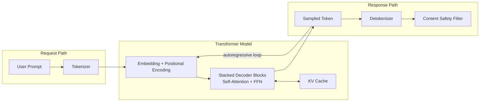
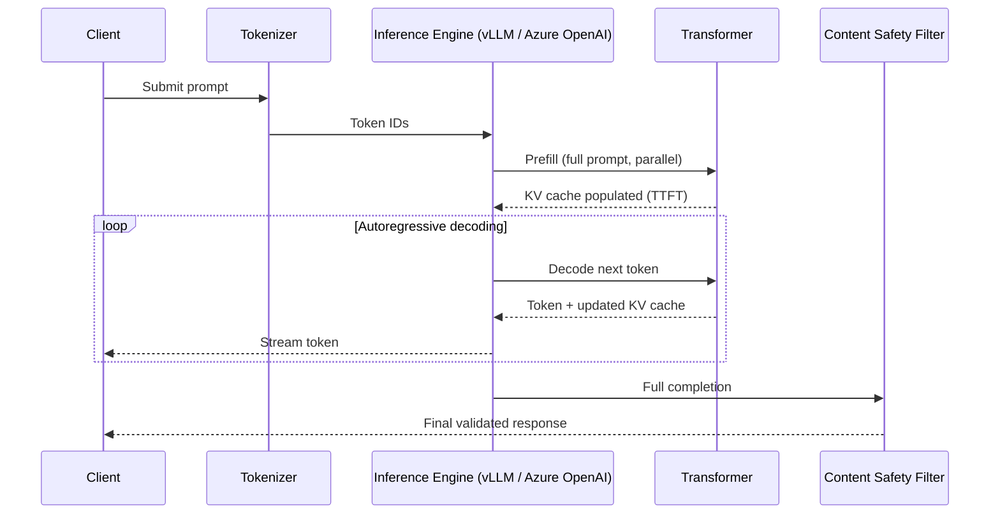
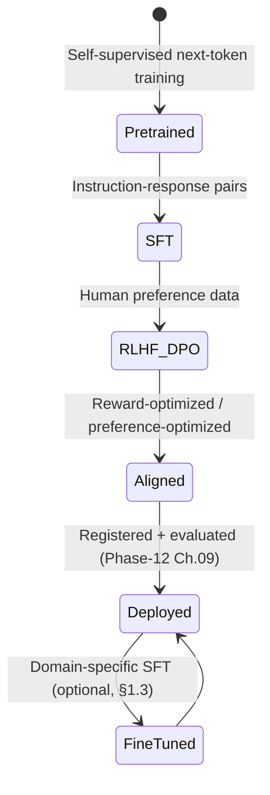

# Large Language Model Foundations

> Part of the **Enterprise Data & AI Architecture Handbook** · Phase-12 — LLMOps & Agentic AI · Chapter 01.
> Estimated study time: **75 min reading + ~4h labs**.
> **Prerequisite:** read [Machine Learning Foundations](../Phase-11/01_Machine_Learning_Foundations.md) first.

---

## Executive Summary

Every architectural decision the rest of Phase-12 makes — how to design a prompt (Chapter 02), how to ground a model in enterprise data via retrieval (Chapter 03), how to operate a model in production (Chapter 04), how to build multi-step agents (Chapter 05), how to integrate tools via a standard protocol (Chapter 06), which platform to run it on (Chapter 07), which framework to orchestrate it with (Chapter 08), and how to evaluate and guardrail it (Chapter 09) — rests on a small number of structural facts about how a large language model (LLM) actually works. This chapter establishes those facts: the transformer architecture and the self-attention mechanism that made today's LLMs possible; tokenization and the context window as the concrete unit-economics and capability boundary every later chapter's cost and design decisions trace back to; the three-stage pretraining → fine-tuning → RLHF pipeline that turns a raw next-token predictor into an instruction-following assistant; the inference cost, latency, and quantization levers that determine whether a given LLM use case is economically viable at production scale; and the open-weight vs. proprietary-API decision that shapes nearly every subsequent build-vs-buy choice in this phase.

This chapter deliberately treats the LLM as a system with the same architectural rigor [Machine Learning Foundations](../Phase-11/01_Machine_Learning_Foundations.md) applied to classical ML: it has a training lifecycle, a serving-time cost and latency profile, failure modes, and governance obligations — an LLM is not a magic black box exempt from the engineering discipline the rest of this handbook has built, it is a particular (very large, very expensive, probabilistically-token-generating) kind of model, and every lesson about evaluation gates, drift, cost governance, and fault tolerance from [Machine Learning Foundations](../Phase-11/01_Machine_Learning_Foundations.md) and [MLOps and MLflow](../Phase-11/03_MLOps_and_MLflow.md) still applies, extended with LLM-specific vocabulary and failure modes this chapter introduces.

The platform bias is **Azure-primary (~60%)** — Azure OpenAI Service and Azure AI Foundry as the primary managed proprietary-model platform, and Azure Machine Learning's GPU compute (NDv5/NCv4-series) as the fine-tuning and self-hosting substrate — **~30% enterprise open source** (Hugging Face Transformers and Tokenizers as the reference implementation of the concepts in this chapter, PyTorch as the underlying training framework, vLLM and llama.cpp as the two dominant open-source high-throughput and edge inference engines, DeepSpeed and bitsandbytes for distributed training and quantization, and Ray Train/Ray Serve — carried forward from [Model Serving and Ray](../Phase-11/04_Model_Serving_and_Ray.md) — as the distributed fine-tuning and serving substrate for self-hosted open-weight models) — **~10% AWS/GCP comparison-only** (Amazon Bedrock and SageMaker JumpStart; Google Vertex AI Model Garden and Gemini).

**Bottom line:** an LLM's business value, cost, and risk profile are all downstream of the four structural facts this chapter covers — how attention lets a model relate every token to every other token (at a computational cost that scales quadratically with context length), how tokenization determines what a model can and cannot "see" or "count," how RLHF is what actually makes a base model useful and safe rather than merely fluent, and how quantization is the single highest-leverage lever for making inference economically viable — and every later Phase-12 chapter assumes you can reason fluently about all four.

---

## Learning Objectives

By the end of this chapter you will be able to:

1. **Explain the transformer architecture and self-attention mechanism** well enough to reason about why context length drives both capability and cost.
2. **Explain tokenization** (subword algorithms, vocabulary size, context windows) and predict how a given input will be tokenized and what that implies for cost and truncation risk.
3. **Distinguish pretraining, supervised fine-tuning, and RLHF/DPO** as three structurally different stages of the LLM training lifecycle, and identify which stage a given customization technique (prompting, fine-tuning, RLHF) actually modifies.
4. **Quantify inference cost and latency** for a given model, sequence length, and hardware configuration, and apply quantization to reduce cost with a defensible accuracy trade-off.
5. **Evaluate the open-weight vs. proprietary-model decision** for a specific enterprise use case, considering cost, data governance, customization, and operational ownership.
6. **Apply Azure-native tooling** (Azure OpenAI Service, Azure AI Foundry, Azure Machine Learning GPU compute) to run, fine-tune, and self-host LLMs in an enterprise setting.
7. **Defend LLM platform and model-selection decisions** in engineer, staff engineer, architect, and CTO review settings, including the trade-off between capability, cost, latency, and data-governance exposure.

---

## Business Motivation

- **LLM inference cost is now a material, recurring line item, not a one-time engineering cost.** A production LLM feature's per-request token cost compounds across millions of requests; understanding tokenization (§1.2) and the inference-cost/quantization levers (§1.4) is what separates a financially sustainable LLM feature from one that silently erodes unit economics as usage scales.
- **The open-weight vs. proprietary decision (§1.5) has direct data-governance and cost consequences.** Sending regulated or confidential data to a third-party proprietary API has different data-residency and compliance implications (extending [Data Privacy and PII Protection](../Phase-10/07_Data_Privacy_and_PII_Protection.md)) than self-hosting an open-weight model inside the enterprise's own network boundary — this is a governance decision as much as a technical one.
- **Fine-tuning and RLHF are expensive, specialized capabilities that must be deployed selectively.** Understanding what pretraining, fine-tuning, and RLHF each actually change (§1.3) prevents the common and costly mistake of fine-tuning a model to solve a problem that a well-designed prompt (Phase-12 Chapter 02) or retrieval pipeline (Phase-12 Chapter 03) would have solved far more cheaply.
- **Context-window limits directly bound what business problems an LLM can solve unaided.** A use case requiring reasoning over more information than fits in a model's context window requires retrieval augmentation (Phase-12 Chapter 03) or a different architectural approach entirely — a limit that is invisible until you understand tokenization and context windows concretely (§1.2).
- **Latency and throughput requirements determine which model and hosting choice is commercially viable for a given product surface.** A real-time customer-facing chat assistant has a fundamentally different latency budget than an overnight batch-summarization job, and the inference-economics discipline in §1.4 is what lets an architect make that call with numbers, not intuition.

---

## History and Evolution

- **2017 — "Attention Is All You Need" (Vaswani et al.)** introduces the transformer architecture, replacing recurrent and convolutional sequence models with a purely attention-based architecture that parallelizes far better on GPU hardware — the single paper this entire chapter, and arguably this entire handbook phase, traces back to.
- **2018 — BERT (Devlin et al.)** demonstrates that a transformer pretrained on a masked-language-modeling objective and then fine-tuned produces state-of-the-art results across a wide range of NLP tasks, establishing the pretrain-then-fine-tune paradigm this chapter's §1.3 formalizes.
- **2018-2020 — the GPT series (Radford et al., OpenAI)** demonstrates that a purely autoregressive (next-token-prediction) decoder-only transformer, scaled up in parameters and training data, exhibits increasingly capable few-shot and zero-shot behavior without task-specific fine-tuning — the scaling trend that motivates §1.4's inference-cost discussion, since larger models cost proportionally more to serve.
- **2020 — scaling laws (Kaplan et al.)** establish an empirical, predictable relationship between model size, dataset size, compute budget, and resulting model loss, giving the industry a quantitative basis for deciding how large a model to train for a given compute budget — directly informing the compute-provisioning decisions in this chapter's Compute section.
- **2022 — InstructGPT and RLHF (Ouyang et al.)** demonstrate that reinforcement learning from human feedback, applied on top of a pretrained and instruction-fine-tuned base model, is what actually makes a model follow instructions helpfully and safely, rather than merely completing text fluently — the third stage this chapter's §1.3 covers, and the capability gap between a "base model" and an "assistant model" that motivates its own dedicated coverage.
- **2022 — ChatGPT's public release** moves LLMs from a research and API-integration concern into a mainstream enterprise product-strategy conversation virtually overnight, sharply accelerating enterprise investment in the platform, governance, and operational disciplines the rest of this Phase-12 handbook phase covers.
- **2023 — the open-weight model ecosystem accelerates** (Meta's Llama 2, Mistral, and others), giving enterprises a credible self-hosting alternative to proprietary APIs for the first time at near-frontier quality — the concrete second option in this chapter's §1.5 decision.
- **2023-2024 — quantization and efficient-inference techniques mature** (GPTQ, AWQ, GGUF-format models, vLLM's PagedAttention), making self-hosted open-weight inference economically practical on commodity or moderately-provisioned GPU hardware rather than requiring frontier-scale infrastructure — directly enabling the cost-optimization techniques in §1.4.
- **2024-present — Mixture-of-Experts (MoE) architectures, longer context windows (100K-1M+ tokens), and multimodal LLMs** extend the base transformer architecture from §1.1 in ways that materially change the inference-cost and context-window calculus this chapter establishes, a trend every subsequent Phase-12 chapter's Azure and open-source tooling sections continue to track.

---

## Why This Technology Exists

Large language models exist because a sufficiently large transformer, trained on a sufficiently large and diverse text corpus with a simple next-token-prediction objective, learns a broad, general-purpose, and transferable representation of language, knowledge, and reasoning patterns — a capability no amount of hand-engineered, task-specific NLP pipeline (of the kind that preceded transformers) could match in generality or maintenance cost. Attention (§1.1) exists specifically because prior recurrent architectures (RNNs, LSTMs) could not parallelize across sequence positions during training and struggled to retain information across long sequences; the transformer's attention mechanism solves both problems by letting every token attend directly to every other token in a single parallelizable operation. RLHF (§1.3) exists because a purely next-token-trained base model is fluent but not reliably helpful, honest, or safe — it will complete a prompt in whatever direction is statistically likely, which is not the same as answering the user's actual intent — and RLHF is the technique that closes that gap by directly optimizing for human-judged response quality.

---

## Problems It Solves

- **Brittle, hand-engineered, task-specific NLP pipelines** — a single pretrained transformer, adapted via prompting or lightweight fine-tuning, now handles a broad range of language tasks (summarization, classification, extraction, generation) that previously each required a separately engineered and maintained model.
- **The cold-start problem for new NLP tasks** — a pretrained LLM already encodes broad world knowledge and language competence, meaning a new task often requires only a well-designed prompt (Phase-12 Chapter 02) or a small fine-tuning dataset, rather than training a task-specific model from scratch on a large labeled dataset per [Machine Learning Foundations](../Phase-11/01_Machine_Learning_Foundations.md#12-training-validation-and-evaluation-metrics) §1.2's supervised-learning data requirements.
- **Long-range dependency modeling in text** — self-attention (§1.1) directly connects any two tokens in a sequence regardless of their distance apart, solving the long-range-dependency degradation that limited recurrent architectures.
- **Unhelpful or unsafe base-model completions** — RLHF (§1.3) directly optimizes a model to produce responses humans actually judge as helpful, honest, and safe, rather than merely statistically likely continuations of a prompt.
- **The need for both frontier capability and enterprise data-governance control** — the open-weight ecosystem (§1.5) gives enterprises a self-hostable, network-boundary-contained alternative to a proprietary API for use cases where data governance requirements make sending data to a third party unacceptable.

---

## Problems It Cannot Solve

- **It cannot guarantee factual accuracy.** An LLM generates statistically plausible token sequences; it has no built-in fact-verification mechanism and will produce fluent, confident, and factually wrong output ("hallucination") with no structural signal distinguishing it from a correct answer — a limitation retrieval augmentation (Phase-12 Chapter 03) mitigates but does not eliminate entirely.
- **It cannot reason reliably over information outside its context window or training data.** A model cannot answer questions about information it was never trained on and that is not supplied in its context window at inference time (§1.2) — this is a hard architectural boundary, not a prompting problem, and is the specific gap retrieval-augmented generation exists to close.
- **It cannot perform precise, deterministic computation reliably.** LLMs are probabilistic next-token predictors, not calculators; multi-step arithmetic, exact counting, and similarly precise deterministic tasks are a known, structural weakness best delegated to a tool call (Phase-12 Chapter 05's agentic tool-use pattern, Phase-12 Chapter 06's Model Context Protocol) rather than solved by prompting alone.
- **It cannot be fully explained or audited at the level classical ML models can be** (per [Responsible AI](../Phase-11/07_Responsible_AI.md)'s SHAP/LIME techniques) — a transformer with billions of parameters does not admit the same feature-attribution analysis a tabular gradient-boosted model does, an open research problem this chapter flags but does not resolve; Phase-12 Chapter 09 (Evaluation and Guardrails) covers the practical, output-level mitigations available today.
- **It cannot eliminate the fundamental accuracy/latency/cost three-way trade-off.** A larger model with a longer context window is generally more capable but is also slower and more expensive to serve (§1.4) — no architectural trick removes this trade-off entirely, it can only be navigated deliberately.

---

## Core Concepts

### 1.1 Transformer Architecture and Attention

- **The transformer is built from stacked encoder and/or decoder blocks**, each combining a self-attention sub-layer and a position-wise feed-forward sub-layer, with residual connections and layer normalization around each — most modern LLMs (GPT-family, Llama, Mistral) use a **decoder-only** architecture, since autoregressive next-token generation is the training objective these models are built around.
- **Self-attention computes, for every token, a weighted combination of every other token's representation**, where the weights (attention scores) are derived from learned Query, Key, and Value projections of each token: $\text{Attention}(Q, K, V) = \text{softmax}\left(\frac{QK^T}{\sqrt{d_k}}\right)V$ — this is the mechanism that lets a model relate "it" in a sentence to the correct noun it refers to several tokens earlier, regardless of the distance between them.
- **Multi-head attention runs several attention computations in parallel with different learned projections**, letting the model attend to different types of relationships (syntactic, semantic, positional) simultaneously, then concatenates and projects the results back to the model's hidden dimension.
- **Attention's computational and memory cost scales quadratically with sequence length** ($O(n^2)$ for a sequence of length $n$), the single most important cost driver this chapter establishes: doubling a model's context window roughly quadruples the attention computation's cost for a full-context request, directly explaining why very-long-context models are materially more expensive to serve and why techniques like PagedAttention (used by vLLM, covered in Open Source Implementation) and sparse/sliding-window attention variants exist specifically to blunt this scaling cost.
- **Positional encoding injects sequence-order information** (since attention itself is permutation-invariant and has no inherent notion of token order) — via fixed sinusoidal encodings in the original transformer, or via more modern relative/rotary position embeddings (RoPE, used by Llama and Mistral) that generalize better to sequence lengths longer than those seen during training, a property directly relevant to a model's practical maximum usable context window (§1.2).

### 1.2 Tokenization and Context Windows

- **Tokenization converts raw text into the discrete integer tokens a transformer actually operates on**, typically via a subword algorithm (Byte-Pair Encoding, WordPiece, or SentencePiece/Unigram) that balances vocabulary size against sequence length: common words become a single token, rare or unfamiliar words are split into multiple subword tokens — meaning the same sentence can tokenize to a noticeably different number of tokens depending on the model's specific tokenizer and vocabulary.
- **A token is not a word, a fact with direct cost and capability consequences**: a rough rule of thumb for English text is ~4 characters or ~0.75 words per token, but this varies significantly by language (non-English and non-Latin-script languages routinely tokenize far less efficiently, directly increasing their effective cost and consuming more of a fixed context window for the same semantic content — an equity and cost consideration worth surfacing explicitly in a multilingual enterprise deployment).
- **The context window is the maximum number of tokens (input plus generated output combined) a model can process in a single request**, a hard architectural limit set at training time (and bounded in practice by the positional-encoding scheme from §1.1) — content beyond this limit is either truncated or must be handled via retrieval augmentation (Phase-12 Chapter 03) rather than stuffed directly into the prompt.
- **Both input (prompt) and output (completion) tokens count against the context window and against billed cost** — and because attention cost scales quadratically with total sequence length (§1.1), a request using a large fraction of a long context window is both a cost and a latency concern (§1.4), not merely a token-count bookkeeping detail.
- **Tokenization determines what a model can and cannot reliably "see" at a granular level** — a well-documented practical consequence is that LLMs are unreliable at character-level tasks (e.g., counting letters within a word) precisely because the tokenizer has already collapsed that word into one or a few subword tokens before the model ever "sees" its individual characters, a structural (not a prompting) limitation directly traceable to this section.

### 1.3 Pretraining, Fine-tuning, and RLHF

- **Pretraining** trains a transformer from randomly initialized weights on a very large, broad text corpus using a self-supervised next-token-prediction (or, for encoder models, masked-token-prediction) objective — requiring no human-labeled data, since the "label" for each position is simply the next token in the existing corpus, and it is this stage that consumes the overwhelming majority of an LLM's total training compute and cost.
- **Supervised fine-tuning (SFT)** continues training a pretrained base model on a smaller, curated dataset of (instruction, desired-response) pairs, teaching the model to follow instructions and adopt a specific response format or domain — orders of magnitude cheaper than pretraining, since it starts from an already-competent base model and requires far less data and compute.
- **RLHF (Reinforcement Learning from Human Feedback)** further refines an SFT model using human preference data: human annotators rank multiple candidate responses to the same prompt, a reward model is trained to predict those preference rankings, and the LLM is then fine-tuned (typically via PPO) to maximize the reward model's score — this is the stage that most directly improves helpfulness, honesty, and safety, as opposed to fluency or instruction-following format alone (which SFT already provides reasonably well).
- **DPO (Direct Preference Optimization)** is a more recent, simpler alternative to full RLHF that directly optimizes the model against preference pairs without training a separate reward model or running full reinforcement learning — achieving comparable alignment quality with meaningfully less training infrastructure complexity, and increasingly the default choice for enterprise teams doing their own preference-tuning rather than relying solely on a frontier lab's RLHF.
- **Each stage modifies a structurally different thing, and confusing them is a common and costly enterprise mistake**: pretraining teaches broad language and world knowledge; SFT teaches instruction-following format and domain vocabulary; RLHF/DPO teaches response *quality and alignment* as judged by humans; and none of the three is what a well-designed prompt or a retrieval pipeline accomplishes — a team reaching for fine-tuning to fix a factual-accuracy or up-to-date-information problem is very often solving the wrong problem, since that gap is what retrieval augmentation (Phase-12 Chapter 03), not further training, is designed to close.

### 1.4 Inference Cost, Latency, and Quantization

- **Inference cost is dominated by two components**: the compute cost of the forward pass (scaling with model size and, per §1.1, quadratically with sequence length for the attention computation) and the memory-bandwidth cost of loading model weights and the KV cache for each generated token — for autoregressive generation, the **KV cache** (cached Key/Value projections from all previous tokens, avoiding recomputing attention over the full sequence at every new token) is often the dominant memory consumer at serving time, directly limiting how many concurrent requests a given GPU can serve.
- **Latency has two distinct phases with different bottlenecks**: **time-to-first-token (TTFT)**, dominated by the compute-bound "prefill" pass over the full input prompt, and **inter-token latency** (time-per-output-token, TPOT), dominated by the memory-bandwidth-bound autoregressive decoding loop — a real-time chat use case is typically most sensitive to TTFT, while a long-form-generation use case's overall completion time is dominated by TPOT accumulated over many output tokens.
- **Quantization reduces the numeric precision of model weights (and sometimes activations)** — from the FP16/BF16 typically used for training down to INT8 or INT4 — cutting memory footprint and often improving throughput substantially, at a typically small (but not zero) accuracy cost that must be evaluated for the specific use case rather than assumed negligible; GPTQ and AWQ are the two dominant post-training quantization techniques for this, and the GGUF format (used by llama.cpp, see Open Source Implementation) is the standard packaging format for quantized open-weight models intended for efficient CPU/edge inference.
- **Batching multiple requests together is the highest-leverage throughput lever for a self-hosted deployment**, directly analogous to the dynamic-batching lever [Model Serving and Ray](../Phase-11/04_Model_Serving_and_Ray.md#core-concepts) established for classical ML serving — continuous batching (dynamically admitting new requests into an in-flight batch rather than waiting for a fixed batch to complete) is the specific technique vLLM and similar modern LLM-serving engines use to maximize GPU utilization without materially harming individual-request latency.
- **Managed proprietary-API pricing (typically per-input-token and per-output-token) abstracts away the underlying compute/memory trade-offs above**, but does not eliminate them from the cost calculus — the same tokenization, context-length, and output-length levers that drive self-hosted compute cost drive per-request API cost identically, meaning the cost-optimization discipline in this chapter's Cost Optimization section applies whether or not the enterprise ever provisions a single GPU itself.

### 1.5 Open vs. Proprietary Models

- **Proprietary API models** (Azure OpenAI Service's GPT-family models, Anthropic's Claude, Google's Gemini) are accessed via a managed API, offering frontier-tier capability with zero infrastructure-management burden, at the cost of per-token usage pricing, dependency on the provider's availability and versioning cadence, and (unless a specific enterprise data-processing agreement and network configuration is in place) data leaving the enterprise's own infrastructure boundary for inference.
- **Open-weight models** (Meta's Llama family, Mistral, and others) can be self-hosted entirely within the enterprise's own network boundary (on Azure Machine Learning GPU compute, or via Azure AI Foundry's model catalog deployment), giving full control over data residency, customization (fine-tuning per §1.3), and cost structure (fixed infrastructure cost rather than per-token billing) — at the cost of the enterprise now owning the operational burden (capacity planning, scaling, patching, and the serving-infrastructure discipline from §1.4) that a managed API abstracts away.
- **"Open-weight" is a more precise and more common term than "open-source" for most of these models**: the model's trained weights are published and can be downloaded, fine-tuned, and self-hosted freely (subject to the specific license's terms), but the full pretraining dataset, training code, and compute recipe used to produce those weights are typically not published — a materially different, narrower openness than a fully open-source software project, worth naming precisely in an enterprise licensing review.
- **The selection decision is rarely capability-only** — for most enterprise use cases at the time of writing, frontier proprietary models retain a real capability edge on the hardest reasoning tasks, while open-weight models have closed much of the gap for well-scoped, fine-tuned, or retrieval-augmented use cases; the deciding factors in practice are usually data-governance requirements, total cost of ownership at the enterprise's actual usage volume, need for fine-tuning/customization, and latency/availability requirements the enterprise cannot outsource to a third party's SLA.
- **A hybrid portfolio, not a single enterprise-wide choice, is the common production pattern**: a proprietary frontier model for the highest-stakes or highest-capability-requiring use cases, and a self-hosted, fine-tuned open-weight model for high-volume, well-scoped, cost-sensitive use cases — a decision this chapter's Decision Matrix formalizes and Phase-12 Chapter 07 (Azure OpenAI and AI Foundry) and Chapter 04 (LLMOps) build concrete platform tooling around.

---

## Internal Working

**How a decoder-only transformer actually generates a response, token by token** (the mechanics underlying §1.1-§1.2, and the process every later Phase-12 chapter's latency and cost discussion assumes):

1. **Tokenization**: the input prompt is tokenized (§1.2) into a sequence of integer token IDs using the model's specific tokenizer and vocabulary.
2. **Embedding and positional encoding**: each token ID is mapped to a learned embedding vector, combined with a positional encoding (§1.1) so the model can distinguish token order.
3. **Prefill (the compute-bound phase determining time-to-first-token)**: the full input sequence is passed through every transformer block in a single parallel forward pass, computing self-attention (§1.1) across all input tokens simultaneously and populating the KV cache (§1.4) for every input token.
4. **Autoregressive decoding (the memory-bandwidth-bound phase determining inter-token latency)**: the model computes a probability distribution over the vocabulary for the next token, a token is sampled (via a decoding strategy — greedy, temperature-based sampling, top-k, or nucleus/top-p sampling, each trading determinism against diversity), and that new token's Key/Value projections are appended to the KV cache — this step repeats once per output token, each repetition attending over the entire cached sequence so far.
5. **Stopping condition**: generation continues until an end-of-sequence token is produced, a configured maximum-token limit is reached, or a configured stop sequence is matched.
6. **Detokenization**: the generated sequence of token IDs is converted back into human-readable text using the same tokenizer from step 1.

This sequence is why TTFT and TPOT (§1.4) are governed by different bottlenecks: step 3 is a single large, parallelizable, compute-bound matrix operation over the whole prompt; steps 4 repeat sequentially, each pass bottlenecked primarily by how quickly the (increasingly large) KV cache can be read from GPU memory, not by raw compute throughput.

---

## Architecture

- **Model layer**: the transformer itself (decoder-only for most current LLMs), either accessed via a managed API (Azure OpenAI Service) or self-hosted on provisioned GPU compute (Azure Machine Learning compute clusters, or an inference engine like vLLM running on AKS).
- **Serving layer**: the inference engine responsible for batching, KV-cache management, and request scheduling — Azure OpenAI Service's managed backend for proprietary models, or vLLM/Ray Serve (carried forward from [Model Serving and Ray](../Phase-11/04_Model_Serving_and_Ray.md)) for self-hosted open-weight models.
- **Tokenization layer**: the model-specific tokenizer, invoked identically at request time (encoding the prompt) and response time (decoding the output), and the layer every cost-estimation and context-window-management concern (§1.2, §1.4) is ultimately computed against.
- **Fine-tuning/customization layer** (optional, per §1.3): a training pipeline (Azure Machine Learning jobs, or Azure OpenAI Service's managed fine-tuning) that produces a customized model artifact from a base model plus a curated dataset, registered and versioned using the same MLflow-based registry discipline established in [MLOps and MLflow](../Phase-11/03_MLOps_and_MLflow.md#32-model-registry-and-stage-transitions) §3.2.
- **Governance and safety layer**: content-safety filtering (Azure AI Content Safety) and the evaluation/guardrail practices Phase-12 Chapter 09 covers in depth, applied at both the input and output boundary of the model layer.

---

## Components

- **Base or fine-tuned model weights** — the trained transformer parameters, either accessed via API or held as a downloadable artifact (for open-weight models).
- **Tokenizer** — the model-paired subword vocabulary and encoding/decoding logic, versioned identically to the model itself since tokenizer and model weights are not interchangeable across model families.
- **Inference engine** — vLLM, llama.cpp, or a managed platform's internal serving backend, responsible for batching, KV-cache management, and quantized-weight execution.
- **GPU compute** — Azure NDv5 (H100) or NCv4 (A100)-series VMs for training/fine-tuning and self-hosted serving, provisioned via Azure Machine Learning compute clusters (per [Machine Learning Foundations](../Phase-11/01_Machine_Learning_Foundations.md#compute) §1's Compute section) or AKS-hosted GPU node pools (per [Kubernetes](../Phase-09/06_Kubernetes.md)).
- **Content-safety filter** — Azure AI Content Safety (or an open-source equivalent guardrail), inspecting both prompts and completions for policy-violating content.
- **Model registry entry** — an MLflow-tracked (per [MLOps and MLflow](../Phase-11/03_MLOps_and_MLflow.md#32-model-registry-and-stage-transitions) §3.2) record of any fine-tuned model variant, including its base model, fine-tuning dataset version, and evaluation results.

---

## Metadata

- **Model card metadata** (per [Responsible AI](../Phase-11/07_Responsible_AI.md#73-model-cards-and-datasheets) §7.3, extended for LLMs): base model version, context-window size, tokenizer identity, training/fine-tuning data provenance, and known limitations.
- **Tokenization metadata**: vocabulary size and tokenizer algorithm (BPE/WordPiece/SentencePiece), directly relevant to cost-estimation tooling and any multilingual-fairness review (§1.2).
- **Fine-tuning lineage metadata**: base model version, fine-tuning dataset version, and hyperparameters — extending the experiment-tracking metadata schema from [MLOps and MLflow](../Phase-11/03_MLOps_and_MLflow.md#metadata) to LLM-specific fine-tuning runs.
- **Per-request usage metadata**: input-token count, output-token count, latency (TTFT and total), and model/deployment version — the concrete, request-level data this chapter's Cost Optimization and Monitoring sections are built on.

---

## Storage

- **Model weights** for a self-hosted open-weight model are large binary artifacts (tens to hundreds of gigabytes), stored in Azure Blob Storage/ADLS Gen2 (per [Azure Storage Services](../Phase-03/06_Azure_Storage_Services.md)) or the Azure Machine Learning model registry, and loaded onto GPU memory at serving-container startup.
- **Fine-tuning datasets** follow the same governed, versioned storage discipline as any other training dataset (per [Machine Learning Foundations](../Phase-11/01_Machine_Learning_Foundations.md#storage) §1's Storage section and [Data Contracts](../Phase-08/07_Data_Contracts.md) for any dataset sourced from an upstream team).
- **Prompt/completion logs**, retained for evaluation, debugging, and audit (per Phase-12 Chapter 09's evaluation practice), must be stored with the same access-control and PII-handling rigor as any other data containing potentially sensitive user input (per [Data Privacy and PII Protection](../Phase-10/07_Data_Privacy_and_PII_Protection.md)), since a prompt or completion can itself contain regulated personal data.
- **The KV cache (§1.4) is an ephemeral, in-GPU-memory artifact**, not persisted storage — it exists only for the duration of an in-flight request (or, for some advanced serving engines, briefly cached across requests sharing a common prompt prefix) and is discarded once generation completes.

---

## Compute

- **Pretraining compute is the single largest compute investment in the entire LLM lifecycle**, requiring large clusters of high-end GPUs (or specialized AI accelerators) running for weeks to months — a scale of investment realistically undertaken only by frontier model providers, not an individual enterprise, which is precisely why most enterprises consume pretrained models (proprietary or open-weight) rather than pretraining their own.
- **Fine-tuning compute is dramatically smaller**, typically a single multi-GPU node (Azure NDv5/NCv4-series) running for hours to a few days, especially when using parameter-efficient fine-tuning techniques (LoRA/QLoRA, which fine-tune a small number of additional low-rank adapter parameters rather than the full model, substantially reducing both compute and memory requirements relative to full fine-tuning).
- **Self-hosted serving compute must be sized against the KV-cache memory requirement (§1.4), not just raw model-weight size** — the number of concurrent requests a given GPU can serve is frequently limited by available memory for the KV cache across all in-flight requests, not by remaining compute headroom, a sizing consideration distinct from classical ML serving's typically compute-bound profile.
- **Managed API compute is entirely abstracted away** from the consuming enterprise, provisioned and scaled by the platform provider (Azure OpenAI Service) — the enterprise's only visible compute-adjacent lever is the deployment's provisioned-throughput or pay-as-you-go tier selection, a cost-and-availability trade-off covered in Cost Optimization.

---

## Networking

- **Proprietary API access requires only standard outbound HTTPS connectivity**, though enterprises with strict data-governance requirements should route this traffic through a private endpoint (Azure Private Link for Azure OpenAI Service), extending the private-endpoint-only baseline established in [Network Security and Zero Trust](../Phase-10/04_Network_Security_and_Zero_Trust.md) ADR-0144 to LLM API traffic specifically.
- **Self-hosted model serving requires the same VNet-injected, private-networked posture** as any other production inference workload (per [Model Serving and Ray](../Phase-11/04_Model_Serving_and_Ray.md#networking) and [Network Security and Zero Trust](../Phase-10/04_Network_Security_and_Zero_Trust.md)), with particular attention to network bandwidth between GPU nodes for any distributed (multi-GPU, multi-node) fine-tuning job, since gradient/activation synchronization traffic can itself become a training-throughput bottleneck at scale.
- **Streaming responses (token-by-token, via server-sent events or a WebSocket)**, the standard low-perceived-latency pattern for interactive LLM applications, require networking infrastructure (load balancers, API gateways) that correctly supports long-lived streaming connections rather than assuming a simple request/response round trip.

---

## Security

- **Prompt injection is the LLM-specific analog of classical injection attacks** (per the OWASP Top 10 reinterpretation in [Security Foundations](../Phase-10/01_Security_Foundations.md)) — untrusted input (from a user, or from retrieved/tool-returned content in an agentic system, per Phase-12 Chapter 05) can attempt to override the model's original instructions; this chapter flags the risk structurally, and Phase-12 Chapter 09 (Evaluation and Guardrails) covers concrete mitigation.
- **Data sent to a proprietary API leaves the enterprise's own infrastructure boundary** unless routed through a private endpoint and covered by an appropriate data-processing agreement — a direct extension of the data-residency and third-party-processor considerations in [Compliance and Regulatory Frameworks](../Phase-10/06_Compliance_and_Regulatory_Frameworks.md), now specifically applicable to every prompt and completion, not only structured data.
- **Self-hosted model weights and fine-tuning datasets require the same access-control rigor as any other sensitive model artifact** (per [Identity and Access Management with Entra](../Phase-10/02_Identity_and_Access_Management_with_Entra.md)) — a fine-tuned model can memorize and regurgitate details from its fine-tuning data, meaning a model fine-tuned on confidential data is itself a potential data-exfiltration vector requiring the same governance as the source data.
- **Content-safety filtering at both the input and output boundary** (Azure AI Content Safety, or an equivalent open-source guardrail) is a baseline security and reputational-risk control, not an optional add-on, for any enterprise-facing LLM deployment.

---

## Performance

- **Time-to-first-token (TTFT) and inter-token latency (TPOT)** (§1.4) are the two metrics that actually matter for user-perceived responsiveness, and they respond to different optimization levers — reducing prompt length (or offloading long context to retrieval, Phase-12 Chapter 03) improves TTFT; quantization and better KV-cache management (§1.4) improve TPOT and overall throughput.
- **Streaming the response token-by-token** rather than waiting for the full completion improves *perceived* latency substantially even when total generation time is unchanged, the same perceived-vs-actual-latency distinction that matters in any user-facing system design.
- **Context length is a direct, quadratic performance cost** (§1.1) — a request using a large fraction of the available context window is measurably slower and more expensive than a short one, a cost every retrieval-augmented design (Phase-12 Chapter 03) must budget for explicitly rather than assuming "more context is free."

---

## Scalability

- **Managed API scalability is the provider's responsibility**, subject to the enterprise's selected throughput tier (pay-as-you-go, subject to rate limits, vs. provisioned throughput units for guaranteed capacity) — a scaling model fundamentally different from classical infrastructure autoscaling, since capacity is purchased in discrete provisioned-throughput increments rather than elastically scaled per request.
- **Self-hosted serving scales via the same horizontal-scaling and autoscaling patterns established in [Model Serving and Ray](../Phase-11/04_Model_Serving_and_Ray.md#42-serving-patterns-and-autoscaling) §4.2**, with the added constraint that GPU node cold-start time (loading multi-gigabyte model weights onto GPU memory) is materially slower than a typical CPU-based service's cold start, making scale-to-zero a more consequential latency trade-off for LLM serving specifically than for lighter classical-ML endpoints.
- **Continuous batching (§1.4) is the primary lever for scaling request throughput on a fixed GPU fleet**, since it maximizes utilization of the (expensive, often supply-constrained) GPU compute rather than requiring proportionally more GPUs for proportionally more traffic.

---

## Fault Tolerance

- **Proprietary API rate limits and transient errors require the same retry-with-backoff and circuit-breaker discipline** as any external dependency (per [Fault Tolerance and Resilience](../Phase-02/07_Fault_Tolerance_and_Resilience.md)), with the added nuance that a naive immediate retry on a rate-limited request can itself worsen a rate-limiting situation — exponential backoff with jitter is the standard mitigation.
- **A multi-model or multi-provider fallback strategy** (e.g., falling back from a primary proprietary model to a secondary self-hosted open-weight model on sustained provider outage or rate-limiting) is an increasingly common resilience pattern for high-availability enterprise LLM features, directly analogous to the multi-region/multi-provider resilience patterns in [Fault Tolerance and Resilience](../Phase-02/07_Fault_Tolerance_and_Resilience.md).
- **Output-validation failures (a malformed structured output, a guardrail-triggered refusal) require a defined fallback behavior**, not a hard user-facing failure — Phase-12 Chapter 09 covers this in depth, but the structural principle (fail gracefully, never silently return an unvalidated or unsafe response) applies from this foundational chapter forward.

---

## Cost Optimization (FinOps)

- **Right-sizing the model to the task is the single highest-leverage cost lever**: using a smaller, cheaper model for a well-scoped, lower-complexity task (classification, extraction, simple summarization) and reserving a larger, more expensive frontier model only for tasks that genuinely require its additional capability — mirroring the tiered-rigor cost pattern established throughout [ML Pipeline Architecture](../Phase-11/06_ML_Pipeline_Architecture.md#cost-optimization-finops).
- **Minimizing prompt and output length directly reduces cost**, given per-token pricing and the quadratic attention cost (§1.1, §1.4) — trimming unnecessary context, using retrieval (Phase-12 Chapter 03) to supply only the most relevant passages rather than an entire document, and capping maximum output length are all concrete, immediately actionable levers.
- **Quantization (§1.4) for self-hosted models** reduces both memory footprint and often serving cost per request substantially, at a typically small accuracy cost that should be validated against the specific use case's evaluation suite (Phase-12 Chapter 09) rather than assumed acceptable by default.
- **Prompt-response caching** for frequently repeated or near-identical requests (a common pattern for FAQ-style or templated use cases) avoids paying for redundant inference entirely — analogous to the pipeline-caching pattern from [Azure Machine Learning](../Phase-11/05_Azure_Machine_Learning.md#52-azure-ml-pipelines-and-components) §5.2.

**Worked FinOps example:** an enterprise support-ticket triage feature processes 2 million requests/month, each with an average prompt of 800 tokens (system instructions plus ticket text) and an average completion of 150 tokens. At a representative Azure OpenAI Service pricing point of roughly $0.005/1K input tokens and $0.015/1K output tokens for a mid-tier model, monthly cost is approximately $0.005 × 800 × 2,000,000/1,000 + $0.015 × 150 × 2,000,000/1,000 ≈ $8,000 + $4,500 = **$12,500/month**. Two concrete optimizations: (1) trimming the system prompt from 800 to 500 average input tokens (removing redundant boilerplate instructions, a prompt-engineering discipline Phase-12 Chapter 02 covers) cuts input cost to roughly $5,000/month, a **$3,000/month saving**; (2) switching this well-scoped, lower-complexity classification-style task from the mid-tier model to a smaller, cheaper model tier (validated first against the evaluation suite from Phase-12 Chapter 09 to confirm accuracy remains acceptable for this specific task) can plausibly cut per-token pricing by 60-80% for this workload, a saving an order of magnitude larger than the prompt-trimming optimization alone — illustrating why "which model tier" is evaluated *before* micro-optimizing prompt length, since model selection is usually the dominant cost lever for a well-scoped task.

---

## Monitoring

- **Per-request token counts (input and output), latency (TTFT and total), and cost** are the baseline operational metrics every production LLM deployment must track, extending the request-level observability practices from [Model Serving and Ray](../Phase-11/04_Model_Serving_and_Ray.md#monitoring) with LLM-specific dimensions (token count, model/deployment version, quantization tier).
- **Output-quality signals** (guardrail-trigger rate, user thumbs-up/down feedback rate where collected, and the automated evaluation-suite scores Phase-12 Chapter 09 covers) should be tracked as a first-class production metric alongside latency and cost, not treated as an offline-only, pre-deployment concern.
- **Rate-limit and error-rate monitoring** for proprietary API dependencies, feeding directly into the fallback and circuit-breaker logic from Fault Tolerance above.

---

## Observability

- **A unified view correlating per-request cost, latency, and output-quality signal** for a given LLM feature gives engineering, product, and FinOps stakeholders one authoritative source for "is this feature performing well and staying within budget," rather than three disconnected dashboards.
- **Tracing a request's full path** (prompt construction, any retrieval step per Phase-12 Chapter 03, the model call itself, and any output-validation/guardrail step) via OpenTelemetry-style distributed tracing (per [Model Serving and Ray](../Phase-11/04_Model_Serving_and_Ray.md#observability)) is what actually lets an engineer diagnose *where* in an increasingly multi-step LLM pipeline a specific latency spike or quality regression originated.

### Operational Response Playbook

| Signal | Detection Query/Check | Remediation |
|---|---|---|
| **Monthly LLM token spend for a specific feature grows materially faster than its request volume** (i.e., cost-per-request is rising, not just total volume) | Cost-per-request trend dashboard (total token cost ÷ request count), segmented by feature/deployment, compared week-over-week | Investigate prompt-length drift first (per the worked FinOps example above — a common root cause is an unnoticed accumulation of context or verbose system-prompt edits over time), then re-validate whether the current model tier is still the right-sized choice for the task |
| **A proprietary API dependency's error rate or latency degrades (provider-side incident or rate-limiting)** | API error-rate and latency monitoring against the provider's status/health signal, correlated with the enterprise's own request volume | Engage the retry-with-backoff and, where configured, multi-model/multi-provider fallback path from Fault Tolerance above; avoid an immediate blanket retry storm that could worsen provider-side rate-limiting |

---

## Governance

- **Every production LLM deployment requires a model card (per [Responsible AI](../Phase-11/07_Responsible_AI.md#73-model-cards-and-datasheets) §7.3, extended for LLM-specific fields)** documenting the base model/version, any fine-tuning applied, intended use, and known limitations — the same documentation discipline established for classical ML, now applied to the LLM's distinct capability and failure profile.
- **Data sent to any external API must be classified and reviewed against the enterprise's data-governance policy** (per [Data Governance Foundations](../Phase-08/01_Data_Governance_Foundations.md) and [Compliance and Regulatory Frameworks](../Phase-10/06_Compliance_and_Regulatory_Frameworks.md)) *before* a new LLM feature ships, not discovered retroactively during an audit — a governance gate this chapter establishes as a prerequisite for every subsequent Phase-12 chapter's implementation guidance.
- **Fine-tuning datasets require the same provenance, licensing, and PII-handling review** as any training dataset (per [Machine Learning Foundations](../Phase-11/01_Machine_Learning_Foundations.md#governance) §1's Governance section), with the added consideration that a fine-tuned model can memorize and later regurgitate details from that data (per Security above).
- **Model and prompt-template version control** — treating a production system prompt with the same change-review rigor as application code, since a prompt edit is a behavior-changing deployment, not a cosmetic text change.

---

## Trade-offs

- **Frontier capability vs. cost and data-governance control**: a proprietary frontier model typically offers the strongest raw capability with zero infrastructure burden, at the cost of per-token pricing and third-party data exposure — vs. a self-hosted open-weight model's full data-residency control and fixed-cost structure, at the cost of owning the operational burden (§1.5).
- **Context length vs. cost and latency**: a longer context window increases what a model can directly reason over without retrieval, at a quadratic (§1.1) cost and latency penalty — the deciding factor behind whether a use case should stuff more context into the prompt or invest in a retrieval pipeline (Phase-12 Chapter 03) instead.
- **Quantization aggressiveness vs. accuracy**: more aggressive quantization (INT4 vs. INT8 vs. FP16) reduces cost and improves throughput further, at a progressively larger (though often still small) accuracy cost that must be validated per use case (§1.4), not assumed uniformly acceptable.
- **Fine-tuning/RLHF investment vs. prompting/retrieval**: fine-tuning a model is a real, non-trivial investment (§1.3) that is justified when a use case genuinely requires a stable behavior or format change baked into the model itself — many use cases that seem to call for fine-tuning are better and more cheaply solved by prompt engineering (Phase-12 Chapter 02) or retrieval (Phase-12 Chapter 03) first.

---

## Decision Matrix

| Scenario | Recommended Approach | Rationale |
|---|---|---|
| Enterprise-facing feature with strict data-residency/confidentiality requirements | Self-hosted open-weight model (Azure Machine Learning GPU compute or AKS + vLLM), private-networked | Keeps data inside the enterprise's own network boundary; avoids third-party data-processing exposure |
| Use case requiring frontier-tier reasoning capability, moderate volume | Azure OpenAI Service (proprietary API) | Zero infrastructure burden, strongest available raw capability, acceptable at moderate token volume |
| High-volume, well-scoped, cost-sensitive task (classification, extraction, templated generation) | Smaller model tier, quantized if self-hosted, validated against Phase-12 Chapter 09's evaluation suite | Right-sizing the model is the dominant cost lever (per the worked FinOps example); frontier capability is unnecessary for a well-scoped task |
| Need for information beyond the model's training cutoff or context window | Retrieval-augmented generation (Phase-12 Chapter 03), not fine-tuning | Fine-tuning does not reliably inject new factual knowledge or keep a model current; retrieval is the architecturally correct solution |
| Need for a stable, repeatable output format or domain-specific tone at scale | Supervised fine-tuning (or DPO for preference alignment), validated against a held-out evaluation set | A well-designed prompt alone often cannot reliably enforce format/tone at scale as consistently as fine-tuning can |

---

## Design Patterns

- **Model-tiering by task complexity**, routing a request to the smallest model tier capable of meeting the task's accuracy bar, escalating to a larger model only when needed — directly analogous to the risk-tiered-rigor pattern established throughout [Responsible AI](../Phase-11/07_Responsible_AI.md#design-patterns).
- **Streaming-first response delivery**, improving perceived latency (Performance section) for any interactive, user-facing LLM feature.
- **Retrieval-before-fine-tuning as the default investigation order**, per the Trade-offs section, reserving fine-tuning for genuine format/tone/domain-adaptation needs rather than as a default first response to a capability gap.
- **Multi-provider fallback**, providing resilience against a single proprietary API dependency's outage or rate-limiting, per Fault Tolerance.

---

## Anti-patterns

- **Reaching for fine-tuning to solve a factual-accuracy or up-to-date-information problem** — a structural mismatch, since fine-tuning does not reliably inject or refresh factual knowledge the way retrieval augmentation (Phase-12 Chapter 03) does.
- **Always using the largest, most expensive frontier model regardless of task complexity**, ignoring the model-tiering cost lever that is usually the single largest cost-reduction opportunity available.
- **Stuffing an entire document (or an entire codebase) into a long-context prompt "because the context window allows it,"** without accounting for the quadratic cost and latency penalty (§1.1, §1.4) that a targeted retrieval pipeline would have avoided.
- **Treating tokenization as an implementation detail rather than a first-class cost and capability constraint** — leading to underestimated cost projections and unexpected truncation failures in production.
- **Deploying an LLM feature with no output-quality or cost monitoring in place at launch**, discovering cost overruns or quality regressions only after they have already compounded across weeks of production traffic.

---

## Common Mistakes

- Assuming a model's stated context-window size is "free" to use fully, without accounting for the quadratic attention cost (§1.1) and per-token pricing implications of a near-full-context request.
- Confusing "the model can technically process this much text" with "this is the most cost-effective or lowest-latency way to solve the problem," when a retrieval-based approach would answer the same question with a fraction of the tokens.
- Selecting a fine-tuning approach without first establishing a held-out evaluation set (per Phase-12 Chapter 09), making it impossible to confirm the fine-tuned model is actually better than the base model plus a well-designed prompt.
- Applying quantization without validating accuracy impact against the specific production use case's evaluation criteria, assuming a generically-reported "minimal degradation" figure applies uniformly.
- Underestimating non-English tokenization inefficiency (§1.2) in cost projections and context-window budgeting for a genuinely multilingual enterprise deployment.

---

## Best Practices

- Default to prompt engineering and retrieval augmentation before considering fine-tuning; reserve fine-tuning for genuine, validated format/tone/domain-adaptation needs.
- Right-size the model tier to the task's actual complexity, validated against an evaluation suite, rather than defaulting to the largest available model.
- Instrument per-request token count, latency, and cost from day one of any production LLM feature, not as a retrofit after a cost or quality incident.
- Route proprietary-API traffic through a private endpoint and review data-governance classification before any new LLM feature ships, per Governance above.
- Validate quantization's accuracy impact against the specific use case's evaluation criteria before adopting it in production, rather than assuming a generic benchmark result transfers directly.

---

## Enterprise Recommendations

- Establish a model-tiering policy (which model tier is approved for which task-complexity category) as a standing platform guardrail, preventing ad hoc, uniformly-maximal model selection across teams.
- Require a data-governance classification review (per [Compliance and Regulatory Frameworks](../Phase-10/06_Compliance_and_Regulatory_Frameworks.md)) before any new LLM feature is approved to send data to a proprietary external API.
- Maintain a hybrid model portfolio (per §1.5) rather than standardizing on a single provider or hosting model, preserving negotiating leverage, resilience against a single provider's outage, and the ability to route each use case to its most cost-effective viable option.
- Build cost-per-request and quality-signal monitoring into the platform's standard LLM-deployment scaffolding (per Monitoring above), so every new feature inherits this instrumentation by default rather than each team reimplementing it independently.

---

## Azure Implementation

- **Azure OpenAI Service** as the primary managed proprietary-model platform, offering GPT-family models via a private-endpoint-capable, enterprise-governed API, with both pay-as-you-go and provisioned-throughput-unit pricing tiers.
- **Azure AI Foundry** (the unified platform, covered in depth in Phase-12 Chapter 07) as the model-catalog, deployment, and evaluation surface spanning both Azure OpenAI Service models and a curated catalog of open-weight models (Llama, Mistral, and others) available for managed or self-hosted deployment.
- **Azure Machine Learning GPU compute** (NDv5/NCv4-series) for self-hosted fine-tuning and inference of open-weight models, using the same compute-cluster provisioning discipline established in [Machine Learning Foundations](../Phase-11/01_Machine_Learning_Foundations.md#compute) §1 and [Azure Machine Learning](../Phase-11/05_Azure_Machine_Learning.md).
- **Azure AI Content Safety** for input/output guardrail filtering, and **Azure Monitor/Application Insights** for the request-level tracing and cost/latency dashboards covered in Monitoring and Observability above.

---

## Open Source Implementation

- **Hugging Face Transformers and Tokenizers** as the reference open-source implementation of the transformer architecture and tokenization algorithms this chapter covers, and the most common starting point for loading, fine-tuning, and experimenting with open-weight models.
- **PyTorch** as the underlying deep-learning framework most open-weight models and fine-tuning pipelines are built on.
- **vLLM** as the dominant open-source high-throughput serving engine, implementing continuous batching and PagedAttention (an efficient, non-contiguous KV-cache memory management scheme) specifically to maximize GPU utilization per §1.4.
- **llama.cpp and the GGUF format** as the dominant lightweight, CPU/edge-capable inference stack for quantized open-weight models, valuable for cost-constrained or on-premises/edge deployment scenarios.
- **DeepSpeed and bitsandbytes** for distributed training/fine-tuning and quantization respectively, and **Ray Train/Ray Serve** (carried forward from [Model Serving and Ray](../Phase-11/04_Model_Serving_and_Ray.md)) as a distributed fine-tuning and serving substrate for teams already standardized on Ray for classical ML workloads.

---

## AWS Equivalent (comparison only)

- **Amazon Bedrock** provides the direct equivalent managed proprietary/foundation-model API surface, and **SageMaker JumpStart** provides a curated open-weight model catalog for self-hosted deployment.
- **Advantages**: tight integration for AWS-centric teams, consistent with the parallel comparisons throughout this handbook.
- **Disadvantages**: a distinct API and model-catalog surface relative to Azure OpenAI Service/AI Foundry, requiring rework to migrate existing prompt-engineering and integration code.
- **Migration strategy**: the underlying open-weight models (Llama, Mistral) and open-source tooling (vLLM, Hugging Face Transformers) port with the least friction across clouds; proprietary-API-specific integration code requires the most rework.
- **Selection criteria**: choose Bedrock when the broader cloud estate is AWS-centric; otherwise this chapter's Azure-primary recommendation applies.

---

## GCP Equivalent (comparison only)

- **Google Vertex AI Model Garden** provides the equivalent curated model catalog (including Google's own Gemini models and third-party open-weight models) for managed or self-hosted deployment.
- **Advantages**: strong integration for GCP/BigQuery-centric teams, and Gemini's native long-context and multimodal capabilities.
- **Disadvantages**: the same re-platforming cost pattern as the AWS case relative to Azure OpenAI Service/AI Foundry.
- **Migration strategy**: as with AWS, open-weight-model-based implementations port more readily than proprietary-API-specific integration code.
- **Selection criteria**: choose Vertex AI when the data/ML estate is GCP-centric; otherwise default to the Azure-primary recommendation.

---

## Migration Considerations

- **Open-weight models and open-source tooling (Hugging Face, vLLM, llama.cpp) are inherently the most portable artifacts this chapter covers**, transferring across Azure, AWS, or GCP with minimal friction since they do not depend on any single cloud provider's proprietary API.
- **Proprietary-API-specific integration code (prompt-construction logic tightly coupled to one provider's API shape) is the least portable**, requiring meaningful rework when migrating between Azure OpenAI Service, Bedrock, and Vertex AI — a strong argument for an abstraction layer (an orchestration framework, per Phase-12 Chapter 08) between application logic and the specific model provider's API.
- **Fine-tuned model weights for an open-weight base model migrate directly** across any cloud provider's GPU compute; a fine-tune applied via a proprietary API's managed fine-tuning service (e.g., an Azure OpenAI Service fine-tuned deployment) does not transfer directly and must be reproduced against the new target platform.
- **Cost models do not transfer directly between platforms** — per-token pricing, provisioned-throughput-unit structures, and GPU-hour pricing all differ meaningfully across providers, requiring the FinOps cost-modeling discipline from this chapter to be re-run against the target platform's actual pricing before committing to a migration.

---

## Mermaid Architecture Diagrams

---

## End-to-End Data Flow

1. **Prompt construction**: application logic assembles the system prompt, user input, and (where applicable) retrieved context (Phase-12 Chapter 03) into a single input sequence.
2. **Tokenization**: the assembled prompt is tokenized (§1.2), and the resulting token count is checked against the model's context-window limit.
3. **Prefill**: the inference engine (Azure OpenAI Service or a self-hosted vLLM deployment) runs the compute-bound prefill pass, populating the KV cache (§1.4).
4. **Autoregressive decoding**: tokens are generated one at a time, each streamed to the client as produced, until a stop condition is met (Internal Working).
5. **Content-safety validation**: the completion is checked against input/output guardrails (Security section) before being returned to the caller.
6. **Logging and monitoring**: token counts, latency, and (where collected) quality signals are recorded for the cost and observability dashboards covered above.
7. **Detokenization and delivery**: the final validated response is returned to the calling application or end user.

---

## Real-world Business Use Cases

- **Customer support ticket triage and summarization**, using a right-sized (often smaller-tier) model for high-volume, well-scoped classification and summarization tasks, per the worked FinOps example.
- **Enterprise knowledge-base question answering**, requiring retrieval augmentation (Phase-12 Chapter 03) to ground responses in current, proprietary enterprise content beyond the base model's training data and context window.
- **Code generation and developer assistance**, typically favoring the strongest available frontier model given the task's genuine reasoning-capability requirements.
- **Domain-specific document drafting** (legal, financial, technical documentation), often benefiting from supervised fine-tuning to enforce a consistent domain vocabulary and format at scale, per §1.3.

---

## Industry Examples

- **Financial services** firms increasingly deploy self-hosted, fine-tuned open-weight models specifically to satisfy strict data-residency requirements for use cases involving confidential client data, per §1.5's data-governance driver.
- **Software companies** building developer-facing coding assistants typically favor proprietary frontier models via a managed API, given the genuine capability advantage on complex reasoning and code-generation tasks and the lower sensitivity of the underlying (often already-public or internal-only, non-regulated) code context.
- **Customer service organizations at scale** commonly adopt a hybrid, tiered-model strategy (per the Decision Matrix): a smaller, fine-tuned or well-prompted model for high-volume routine inquiries, escalating to a larger frontier model or a human agent for complex or high-stakes cases.

---

## Case Studies

**Case Study 1 — A fine-tuning project that should have been a retrieval project.** A team building an internal policy-question-answering assistant observed the base model giving outdated or generic answers about the company's current internal HR policies, and concluded the model needed to be fine-tuned on the company's policy documents. Several weeks and a non-trivial GPU-compute budget later, the fine-tuned model still gave inconsistent answers whenever a policy was updated, since fine-tuning had baked a snapshot of the policy documents into the model's weights at a fixed point in time — precisely the mismatch this chapter's §1.3 and Problems It Cannot Solve sections warn about: fine-tuning teaches format and style, not a live, updatable knowledge source. The team ultimately replaced the fine-tuned model with a retrieval-augmented pipeline (Phase-12 Chapter 03) over the same policy documents, which correctly reflected each policy update immediately upon the source document's next revision, at a fraction of the fine-tuning project's original compute cost. The lesson: before starting a fine-tuning project, explicitly ask whether the underlying capability gap is really a *format/style* gap (fine-tuning's actual strength) or a *current-information* gap (retrieval's actual strength) — the two are structurally different problems this chapter's §1.3 and §1.5 both draw a firm line between.

**Case Study 2 — An unnoticed context-window cost creep.** A customer-support summarization feature was originally designed with a concise, well-scoped system prompt and a single support ticket as input. Over several months, successive well-intentioned prompt edits (adding more detailed instructions, example outputs, and edge-case handling guidance) roughly tripled the system prompt's token count, and a subsequent product change began including the customer's full ticket history rather than just the current ticket. No single edit was individually alarming, but the cumulative effect (per the quadratic cost relationship in §1.1 and §1.4) increased the feature's monthly token cost by over 4x with no corresponding increase in business value, since the added prompt content provided diminishing accuracy improvement past a certain point. The issue was caught only when a routine FinOps cost review (per the Cost Optimization section) flagged the feature's cost-per-request trend, not by any single code review, since each individual prompt edit looked reasonable in isolation. The lesson: cost-per-request trend monitoring (per this chapter's Operational Response Playbook) is what catches this specific class of gradual, individually-invisible cost creep — a point-in-time code review of any single prompt change would not have.

---

## Hands-on Labs

1. **Lab 1 — Tokenize and count.** Using the Hugging Face `tokenizers` library, tokenize a sample of English and non-English text with the same tokenizer, comparing token counts per unit of semantic content, and observe the multilingual tokenization-efficiency gap flagged in §1.2.
2. **Lab 2 — Estimate and measure inference cost.** For a fixed prompt and a range of output lengths, compute the theoretical Azure OpenAI Service cost using published per-token pricing, then compare against the worked FinOps example's methodology.
3. **Lab 3 — Quantize and evaluate a small open-weight model.** Using bitsandbytes or GPTQ, quantize a small open-weight model to INT8 and INT4, and measure the resulting accuracy change on a small held-out evaluation set, directly observing the accuracy/cost trade-off from §1.4.
4. **Lab 4 — Serve a model with vLLM and observe TTFT/TPOT.** Deploy a small open-weight model using vLLM, send requests of varying prompt lengths, and measure time-to-first-token and inter-token latency separately, confirming the two-phase latency model from Internal Working.

---

## Exercises

1. Explain, in your own words, why attention's quadratic cost in sequence length directly implies that a longer context window is not a "free" capability improvement.
2. A colleague proposes fine-tuning a model to fix an issue where the model gives outdated answers about a frequently-changing internal dataset. Explain why this is very likely the wrong fix, and what you would recommend instead.
3. Given a described enterprise use case, walk through the open-weight vs. proprietary decision (§1.5), naming the specific factors that would tip the decision either way.
4. Given the Case Study 2 scenario, describe the specific monitoring signal that would have caught the cost creep earlier, and at what point in the prompt's editing history it would likely have first triggered.

---

## Mini Projects

1. **Build a cost-per-request dashboard**: instrument a sample LLM call with token-count and latency logging, and build a simple dashboard (Grafana, per [Model Serving and Ray](../Phase-11/04_Model_Serving_and_Ray.md#observability)) tracking cost-per-request trend over time, directly implementing this chapter's Operational Response Playbook signal.
2. **Build a model-tiering router**: implement a simple router that classifies an incoming request's estimated complexity and routes it to either a smaller or a larger model tier, then measure the resulting cost savings against an always-use-the-largest-model baseline.

---

## Capstone Integration

This chapter's five Core Concepts areas are the foundation every later Phase-12 chapter builds directly on top of: the tokenization and context-window discipline in §1.2 becomes the concrete unit of design in Prompt Engineering (Phase-12 Chapter 02); the context-window limitation this chapter names in Problems It Cannot Solve is resolved architecturally in Retrieval Augmented Generation (Phase-12 Chapter 03); the inference-cost and latency profile in §1.4 becomes the full operational discipline of LLMOps (Phase-12 Chapter 04); the tool-use gap named in Problems It Cannot Solve is resolved in Agentic AI Architecture (Phase-12 Chapter 05) and standardized via Model Context Protocol (Phase-12 Chapter 06); the Azure Implementation section's platform overview becomes a full platform deep-dive in Azure OpenAI and AI Foundry (Phase-12 Chapter 07); the orchestration implied throughout this chapter's Architecture section is formalized in LangChain and LlamaIndex (Phase-12 Chapter 08); and the accuracy/safety limitations flagged repeatedly but deferred throughout this chapter are given full treatment in Evaluation and Guardrails (Phase-12 Chapter 09). An architect who has internalized this chapter's attention-cost, tokenization, training-lifecycle, and open-vs-proprietary discipline is equipped to review every one of those later, more platform-specific chapters critically rather than accepting a vendor's or framework's claims at face value.

---

## Interview Questions

1. Explain self-attention in your own words, and why its computational cost scales quadratically with sequence length.
2. What is the difference between pretraining, supervised fine-tuning, and RLHF, and what does each one actually change about a model's behavior?
3. Why is a token not the same as a word, and what practical consequences does that have for cost estimation?
4. What is quantization, and what trade-off does it introduce?

## Staff Engineer Questions

1. A team wants to fine-tune a model to fix an accuracy problem you suspect is actually a missing-context problem. How would you investigate and make the case for retrieval augmentation instead?
2. How would you design a model-tiering strategy that routes requests to the smallest viable model tier while maintaining an acceptable accuracy bar?
3. Walk through the TTFT vs. TPOT distinction and explain how you would diagnose which one is the bottleneck for a specific underperforming production LLM feature.
4. How would you build cost-per-request monitoring that would have caught the gradual cost creep in Case Study 2 before it compounded for months?

## Architect Questions

1. Design a reference architecture for a hybrid open-weight/proprietary LLM portfolio, including the decision criteria for routing a given use case to each option.
2. How would you architect a fallback strategy across multiple model providers for a high-availability, enterprise-facing LLM feature?
3. What is your reference architecture for governing which teams can send which data classifications to which model providers?
4. How would you structure an enterprise-wide model-selection and cost-governance policy that balances capability, cost, and data-governance requirements?

## CTO Review Questions

1. What is our current monthly LLM inference spend, broken down by feature, and do we have visibility into which features are the largest cost drivers?
2. Do we have a documented policy governing which data classifications may be sent to which model providers, and is it actually enforced?
3. If our primary proprietary model provider had a sustained outage tomorrow, what is our fallback plan, and how quickly could we fail over?
4. Are we using fine-tuning appropriately, or do we have evidence of fine-tuning projects (like Case Study 1) that should have been retrieval projects instead?

---

### Architecture Decision Record (ADR-0155): Require Prompt/Model Cost Review Before Production Launch and Recurring Cost-Per-Request Monitoring Thereafter

**Context:** Case Study 2 documented a customer-support summarization feature whose monthly LLM cost grew more than 4x over several months through a series of individually reasonable prompt edits and a context-scope expansion, with no single change triggering review and the trend caught only incidentally during a routine FinOps audit — a direct parallel to the "verification gap" pattern ([Data Security and Encryption](../Phase-10/03_Data_Security_and_Encryption.md) ADR-0143, [Secrets and Key Management](../Phase-10/05_Secrets_and_Key_Management.md) ADR-0145, [Responsible AI](../Phase-11/07_Responsible_AI.md) ADR-0154) recurring throughout this handbook wherever an incremental, individually-invisible change compounds into a significant, later-discovered problem.

**Decision:** Every new production LLM feature must undergo an explicit prompt/model cost review (estimated cost-per-request at projected volume, per the worked FinOps example methodology) before launch, and every launched feature must have cost-per-request trend monitoring (per the Operational Response Playbook) in place from day one, alerting on any sustained upward trend rather than relying on periodic manual FinOps audits alone to catch cost creep.

**Consequences:**
- *Positive:* catches gradual, individually-invisible cost creep (as in Case Study 2) proactively rather than incidentally; establishes a consistent cost-accountability bar across every team building an LLM feature, extending the same cost-optimization discipline established throughout [ML Pipeline Architecture](../Phase-11/06_ML_Pipeline_Architecture.md) and [Responsible AI](../Phase-11/07_Responsible_AI.md).
- *Negative:* adds a pre-launch review step and ongoing monitoring-maintenance burden to every LLM feature team; requires establishing and maintaining an agreed cost-per-request baseline and alert threshold per feature, which itself requires periodic recalibration as legitimate usage patterns evolve.
- *Alternatives considered:* relying solely on periodic (e.g., quarterly) FinOps cost audits without per-feature real-time monitoring (rejected — this is precisely the mechanism that let Case Study 2's cost creep compound for months before detection); capping token usage with a hard per-request limit alone without cost trend monitoring (rejected as insufficient on its own — a hard cap prevents a single runaway request but does not detect a gradual, still-under-the-cap upward trend across many requests over time).

---

## References

- Vaswani, A. et al. (2017) — "Attention Is All You Need," NeurIPS (the foundational transformer architecture paper this chapter's §1.1 is based on).
- Devlin, J. et al. (2018) — "BERT: Pre-training of Deep Bidirectional Transformers for Language Understanding."
- Radford, A. et al. (2018-2020) — the GPT series papers (OpenAI), establishing the decoder-only autoregressive pretraining paradigm.
- Kaplan, J. et al. (2020) — "Scaling Laws for Neural Language Models."
- Ouyang, L. et al. (2022) — "Training Language Models to Follow Instructions with Human Feedback" (InstructGPT/RLHF).
- Rafailov, R. et al. (2023) — "Direct Preference Optimization: Your Language Model is Secretly a Reward Model" (DPO).
- Kwon, W. et al. (2023) — "Efficient Memory Management for Large Language Model Serving with PagedAttention" (vLLM).
- Microsoft Learn — Azure OpenAI Service and Azure AI Foundry documentation.

## Further Reading

- Hugging Face — "The Transformers Course" and library documentation (Transformers, Tokenizers).
- Meta AI — Llama model family technical reports.
- Mistral AI — model release technical reports.
- vLLM and llama.cpp project documentation, for continuous batching, PagedAttention, and GGUF quantization details.
- Microsoft's Azure OpenAI Service pricing and provisioned-throughput-unit documentation, for current cost-modeling inputs to this chapter's FinOps worked example.
