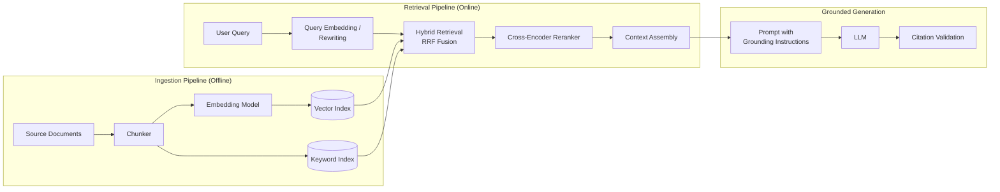
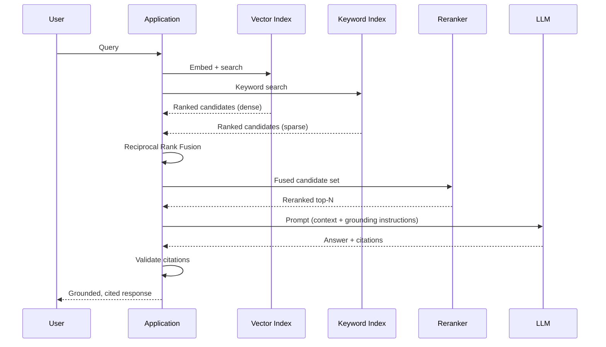
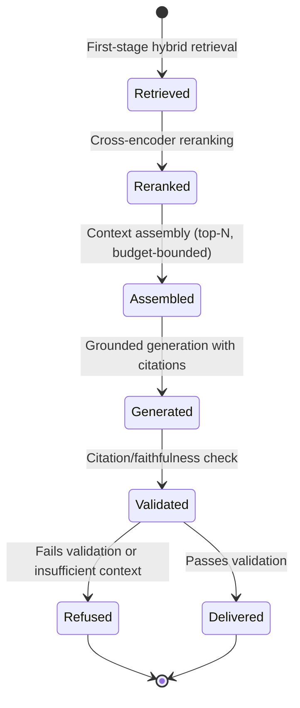

# Retrieval Augmented Generation

> Part of the **Enterprise Data & AI Architecture Handbook** · Phase-12 — LLMOps & Agentic AI · Chapter 03.
> Estimated study time: **75 min reading + ~5h labs**.
> **Prerequisite:** read [Prompt Engineering](02_Prompt_Engineering.md) first.

---

## Executive Summary

[Large Language Model Foundations](01_Large_Language_Model_Foundations.md) named a hard architectural limit in its Problems It Cannot Solve section: a model cannot reason over information outside its training data or its context window, and [Prompt Engineering](02_Prompt_Engineering.md) confirmed that no amount of prompt craft injects genuinely new, current, or proprietary knowledge into a model that was never exposed to it. Retrieval-Augmented Generation (RAG) is the architecture that closes exactly this gap: rather than relying on a model's frozen training-time knowledge, RAG retrieves relevant passages from an external, independently updatable knowledge source at request time and inserts them into the prompt (per [Prompt Engineering](02_Prompt_Engineering.md#22-system-vs-user-prompts-and-roles) §2.2's user-role content), letting the model generate a response grounded in current, verifiable, enterprise-specific information it was never trained on.

This chapter covers the **RAG architecture and its components** end to end; **chunking and embedding strategies** as the two decisions that most determine retrieval quality before a single query is ever run; **vector, keyword, and hybrid retrieval** as the three retrieval strategies and the increasingly-standard practice of combining them; **reranking and context assembly** as the second-stage refinement that turns a broad candidate set into the specific, ordered context actually sent to the model; and **grounding, citations, and hallucination control** as the discipline that makes a RAG system's output not just more accurate, but auditable and trustworthy.

RAG is deliberately positioned in this handbook as the *default* architecture for grounding an LLM in enterprise knowledge — cheaper to build, faster to iterate, and easier to keep current than fine-tuning (per [Large Language Model Foundations](01_Large_Language_Model_Foundations.md#13-pretraining-fine-tuning-and-rlhf) §1.3), and the direct fix for the exact failure mode [Large Language Model Foundations](01_Large_Language_Model_Foundations.md#case-studies) Case Study 1 documented: a team that fine-tuned a model on policy documents only to find the fine-tuned knowledge went stale the moment a policy changed, when a retrieval pipeline over the same documents would have reflected each update immediately.

The platform bias is **Azure-primary (~60%)** — Azure AI Search as the primary managed hybrid (vector + keyword + semantic reranking) retrieval engine, and Azure OpenAI Service's embedding models as the primary vectorization layer — **~30% enterprise open source** (Qdrant and Milvus as the two dominant purpose-built open-source vector databases; LangChain and LlamaIndex, carried forward from [Prompt Engineering](02_Prompt_Engineering.md#open-source-implementation), as the dominant RAG-orchestration frameworks; Elasticsearch/OpenSearch's BM25 implementation as the reference open-source keyword-search engine; Hugging Face's sentence-transformers library for open-weight embedding models) — **~10% AWS/GCP comparison-only** (Amazon Bedrock Knowledge Bases and OpenSearch Service; Google Vertex AI Search and Vertex AI Vector Search).

**Bottom line:** a RAG system's output quality is determined far more by chunking, embedding, and retrieval-strategy decisions made *before* any query runs than by which specific vector database or LLM is used downstream — and a RAG system that retrieves poorly and does not enforce citation-based grounding is not actually more trustworthy than an ungrounded model, it merely produces confidently-wrong output with better production values, which is precisely the gap this chapter's §3.5 closes.

---

## Learning Objectives

By the end of this chapter you will be able to:

1. **Design a complete RAG architecture**, from ingestion through retrieval to grounded generation, identifying each component's responsibility.
2. **Select an appropriate chunking strategy and embedding model** for a given document corpus and query pattern.
3. **Choose between vector, keyword, and hybrid retrieval** for a given use case, and explain why hybrid retrieval has become the default enterprise recommendation.
4. **Design a reranking and context-assembly stage** that improves the precision of what is actually sent to the model, distinct from the initial retrieval's recall-oriented candidate set.
5. **Implement grounding and citation mechanisms** that make a RAG system's output auditable and measurably reduce (though do not eliminate) hallucination.
6. **Apply Azure-native tooling** (Azure AI Search, Azure OpenAI Service embeddings) to build a production-grade hybrid-retrieval RAG pipeline.
7. **Defend RAG architecture decisions** in engineer, staff engineer, architect, and CTO review settings, including the trade-off between retrieval recall, precision, latency, and cost.

---

## Business Motivation

- **Enterprise knowledge is proprietary, current, and constantly changing — exactly what a pretrained model's frozen training data cannot reflect.** RAG is the architecture that lets an LLM feature answer questions grounded in this week's policy document or this quarter's product catalog without retraining anything, directly closing the currency gap [Large Language Model Foundations](01_Large_Language_Model_Foundations.md) Case Study 1 illustrated.
- **Unverifiable, ungrounded LLM output is a direct trust and liability risk for consequential business decisions.** Citation-based grounding (§3.5) gives a business user or auditor a concrete, checkable source for a claim, converting "the model said so" into "the model said so, and here is the specific document passage it is based on" — a materially different risk posture for regulated or high-stakes use cases.
- **RAG is dramatically cheaper and faster to iterate than fine-tuning for most knowledge-grounding needs.** Updating a RAG system's knowledge is as simple as re-indexing a changed document; updating a fine-tuned model's knowledge requires a new training run, a new evaluation cycle, and a new deployment — RAG's iteration speed is a direct business-agility advantage.
- **Retrieval quality (not model choice) is usually the dominant lever on a RAG system's actual accuracy.** An enterprise investing in the strongest available LLM while neglecting chunking, embedding, and retrieval-strategy quality (§3.2-§3.3) is optimizing the wrong part of the system — a mistake this chapter is built specifically to prevent.
- **Hallucination remains a real, unresolved risk even with retrieval in place**, and a RAG system deployed without explicit grounding and hallucination-control measures (§3.5) can still produce confidently-wrong, business-consequential output — understanding this limitation is what separates a RAG deployment from a false sense of security.

---

## History and Evolution

- **2020 — the original RAG paper (Lewis et al., "Retrieval-Augmented Generation for Knowledge-Intensive NLP Tasks")** formalizes the architecture of combining a parametric language model with a non-parametric retrieval index, demonstrating that retrieval-augmented generation outperforms a purely parametric model on knowledge-intensive tasks while remaining far more easily updatable.
- **2018-2021 — dense passage retrieval and sentence-embedding models mature** (Karpukhin et al.'s Dense Passage Retrieval, Reimers and Gurevych's Sentence-BERT), establishing the dense-vector-embedding approach to semantic retrieval that this chapter's §3.2-§3.3 builds directly on, as an alternative and complement to classical sparse keyword retrieval (BM25).
- **2021-2022 — purpose-built vector databases emerge as a distinct infrastructure category** (Milvus, Qdrant, Pinecone), reflecting the recognition that efficient approximate-nearest-neighbor search at scale requires infrastructure genuinely different from a general-purpose relational or document database.
- **2022-2023 — the ChatGPT-driven enterprise LLM adoption wave** (per [Large Language Model Foundations](01_Large_Language_Model_Foundations.md)'s History and Evolution) rapidly surfaces the hallucination and knowledge-currency problems RAG specifically addresses, moving RAG from an academic technique into the default architectural pattern for enterprise LLM knowledge-grounding almost overnight.
- **2023 — hybrid retrieval (combining sparse/keyword and dense/vector search, typically fused via Reciprocal Rank Fusion) becomes the emerging best practice**, as practitioners empirically observe that vector search alone under-performs on exact-match queries (product codes, proper nouns, acronyms) that classical keyword search handles natively, and vice versa for paraphrased or conceptual queries.
- **2023 — cross-encoder reranking as a second-stage refinement** becomes standard practice, addressing the recognized limitation that a fast, scalable first-stage retriever (optimized for recall across a large corpus) is a weaker relevance judge than a slower, more expensive cross-encoder model comparing the full query against each candidate individually.
- **2023-2024 — managed hybrid-search platforms mature** (Azure AI Search adding native vector search and semantic reranking alongside its existing keyword-search capability), consolidating what previously required separately-operated vector and keyword search systems into a single managed platform.
- **2024-present — advanced RAG patterns proliferate** (query rewriting/expansion, multi-hop/agentic retrieval, GraphRAG combining knowledge graphs with vector retrieval, and long-context models per [Large Language Model Foundations](01_Large_Language_Model_Foundations.md#history-and-evolution) prompting an active debate over "is RAG still necessary with a million-token context window" — this chapter's Trade-offs section addresses that question directly rather than assuming RAG's necessity is self-evident).

---

## Why This Technology Exists

RAG exists because a pretrained LLM's knowledge is frozen at its training cutoff and bounded by its context window (per [Large Language Model Foundations](01_Large_Language_Model_Foundations.md#problems-it-cannot-solve)), while nearly every valuable enterprise use case requires reasoning over information that is either proprietary (never in any public training corpus), more current than the model's training cutoff, or too voluminous to fit in a single context window — retraining or fine-tuning the model every time this information changes is both prohibitively expensive and, as [Large Language Model Foundations](01_Large_Language_Model_Foundations.md) Case Study 1 demonstrated, structurally the wrong tool, since fine-tuning bakes a knowledge snapshot into frozen weights rather than maintaining a live, independently updatable knowledge source. RAG's specific architectural insight — separating the "knows how to read and reason" capability (the pretrained model) from the "knows the current facts" capability (an external, independently maintained and re-indexable retrieval corpus) — is what lets an enterprise update its knowledge base continuously without ever touching the model itself.

---

## Problems It Solves

- **Frozen, stale model knowledge** — retrieval (§3.1) supplies current information at request time, without any retraining, directly closing the currency gap [Large Language Model Foundations](01_Large_Language_Model_Foundations.md) flagged in its Problems It Cannot Solve section.
- **Lack of access to proprietary or confidential enterprise data** — a RAG index over an enterprise's own documents lets a general-purpose pretrained model reason over content it was never trained on and, for a self-hosted or private-endpoint-routed deployment, without that content ever needing to leave the enterprise's own governed infrastructure.
- **Context-window limitations for large document corpora** — rather than attempting to stuff an entire document corpus into a single prompt (a cost and latency non-starter per [Large Language Model Foundations](01_Large_Language_Model_Foundations.md#14-inference-cost-latency-and-quantization) §1.4's quadratic-cost concern), retrieval selects only the most relevant passages for a given query, fitting within the context window efficiently.
- **Unverifiable model claims** — citation-based grounding (§3.5) gives every generated claim a traceable source, directly addressing the trust and auditability gap an ungrounded model's output leaves open.
- **The high cost and slow iteration cycle of fine-tuning for knowledge-grounding needs** — RAG updates its effective "knowledge" simply by re-indexing changed documents, at a small fraction of a fine-tuning cycle's cost and latency.

---

## Problems It Cannot Solve

- **It cannot fix a fundamentally weak underlying LLM's reasoning ability.** Retrieval supplies better *input*; it does not improve the model's capacity to reason correctly over that input — a genuinely difficult multi-step reasoning task remains difficult even with perfect retrieval, per [Large Language Model Foundations](01_Large_Language_Model_Foundations.md#problems-it-cannot-solve).
- **It cannot fully eliminate hallucination.** A model can still generate a claim unsupported by (or contradicting) the retrieved context even when relevant, correct passages were successfully retrieved and included in the prompt — grounding and citation enforcement (§3.5) substantially reduce this risk and make it detectable, but do not provide an absolute guarantee, a limitation this chapter is explicit about rather than overselling.
- **It cannot compensate for poor chunking or retrieval quality with a better prompt or a better model alone.** If the actually-relevant passage was never retrieved in the first place (a recall failure at the retrieval stage, §3.2-§3.3), no downstream prompt engineering or reranking can produce a correctly grounded answer — retrieval quality is a hard upstream bottleneck on the entire system's ceiling accuracy.
- **It cannot resolve genuinely ambiguous or self-contradictory source documents.** If the underlying knowledge corpus itself contains outdated, conflicting, or contradictory information (a common state for real enterprise document repositories), RAG faithfully retrieves and surfaces that ambiguity rather than resolving it — a data-quality and governance problem (per [Data Quality with Great Expectations](../Phase-08/03_Data_Quality_with_Great_Expectations.md)) that RAG architecture alone does not fix.
- **It cannot make multi-hop, cross-document reasoning trivial.** A query requiring synthesis across many separately-retrieved passages (rather than a single well-matched passage) is a genuinely harder retrieval-and-reasoning problem than single-passage lookup, addressed by more advanced patterns (query decomposition, agentic multi-step retrieval per Phase-12 Chapter 05) rather than by this chapter's baseline architecture alone.

---

## Core Concepts

### 3.1 RAG Architecture and Components

- **A RAG system has two structurally distinct pipelines**: an **ingestion (offline/batch) pipeline** that chunks, embeds, and indexes a document corpus ahead of time, and a **retrieval-and-generation (online/request-time) pipeline** that embeds an incoming query, retrieves relevant chunks from the index, assembles them into a prompt, and invokes the LLM — conflating these two pipelines' very different latency, cost, and update-frequency requirements is a common architectural mistake this chapter's Architecture section addresses directly.
- **The retrieval index is the system's non-parametric memory** — typically a vector index (for semantic/dense retrieval, §3.3), a keyword index (for lexical/sparse retrieval, §3.3), or both simultaneously for hybrid retrieval — functioning as the external, independently updatable knowledge source that lets the LLM stay current without retraining.
- **Prompt assembly is where retrieval meets [Prompt Engineering](02_Prompt_Engineering.md)**: retrieved passages are inserted into the user-role message content (per [Prompt Engineering](02_Prompt_Engineering.md#22-system-vs-user-prompts-and-roles) §2.2), with the system prompt carrying grounding instructions (e.g., "answer only using the provided context; cite the specific passage for each claim," per §3.5) — meaning a RAG system's grounding reliability depends directly on the prompt-engineering discipline from Chapter 02, not on retrieval alone.
- **A RAG system is measured on two largely independent axes**: retrieval quality (did the system find the right passages — recall and precision) and generation quality (did the model produce a correct, well-grounded answer given those passages) — a common diagnostic mistake is attributing a wrong answer to "the model" when the actual root cause is a retrieval failure, or vice versa, and Phase-12 Chapter 09's evaluation practice explicitly separates these two measurements for exactly this reason.
- **RAG is not a single fixed pipeline but a spectrum of increasing sophistication**: from a naive "embed query, retrieve top-k, stuff into prompt" baseline, through hybrid retrieval and reranking (§3.3-§3.4), to advanced patterns like query rewriting, multi-hop retrieval, and knowledge-graph-augmented retrieval (GraphRAG) — this chapter establishes the baseline architecture and names the advanced patterns as a documented extension point rather than covering them in full depth.

### 3.2 Chunking and Embedding Strategies

- **Chunking splits source documents into retrievable units**, a decision that directly bounds retrieval quality regardless of how sophisticated the downstream retrieval or reranking is — a chunk that is too large dilutes its embedding's semantic specificity (burying a relevant sentence among irrelevant surrounding text) and wastes context-window budget when retrieved; a chunk that is too small loses surrounding context needed to correctly interpret it (a sentence fragment referring to "it" or "the policy" with the antecedent chunked elsewhere).
- **Fixed-size chunking (a token or character count, typically with overlap between consecutive chunks)** is the simplest strategy, fast to implement and reasonably effective as a baseline, but indifferent to a document's actual semantic structure (a fixed-size boundary can split a table, a step-by-step procedure, or a single logical argument mid-thought).
- **Semantic or structure-aware chunking** (splitting at natural document boundaries — headings, paragraphs, sections — optionally combined with a semantic-similarity check to merge or split further) produces chunks more likely to be self-contained and coherent, at the cost of more complex, document-type-specific implementation than fixed-size chunking.
- **Chunk overlap** (each chunk sharing a small amount of text with its neighbors) mitigates the boundary-splitting problem for fixed-size chunking specifically, ensuring a concept split across a chunk boundary is likely to appear intact in at least one chunk — a standard, low-cost mitigation, though it does not fully substitute for genuinely structure-aware chunking on documents with rich internal structure (tables, nested lists).
- **Embedding models convert a chunk of text into a dense vector representation** capturing its semantic meaning, such that semantically similar text produces vectors close together in the embedding space (measured via cosine similarity or dot product) — the choice of embedding model (Azure OpenAI Service's `text-embedding-3` family, or an open-weight sentence-transformers model) directly determines retrieval quality, and critically, **the query and the corpus must be embedded with the same model** (or, for asymmetric-retrieval-optimized models, the model's matched query/passage encoding modes), since embeddings from different models are not comparable in the same vector space.

### 3.3 Vector, Keyword, and Hybrid Retrieval

- **Vector (dense/semantic) retrieval** embeds the query using the same embedding model as the corpus (§3.2) and retrieves the nearest chunks by vector similarity — its key strength is matching conceptually or semantically similar text even when the exact wording differs (paraphrase, synonym, and cross-lingual matching), and its key weakness is comparatively weaker performance on exact-match needs (a specific product SKU, an error code, a proper noun) where the precise token match matters more than semantic similarity.
- **Keyword (sparse/lexical) retrieval** — classically BM25, an improved TF-IDF-family ranking function — matches based on term overlap and term-frequency statistics, excelling at exact-match and rare-term queries (a specific error code, a legal citation, a proper noun) precisely where vector retrieval is comparatively weak, at the cost of missing genuinely paraphrased or conceptually-related content that shares no meaningful term overlap with the query.
- **Hybrid retrieval combines both signals**, typically via Reciprocal Rank Fusion (RRF — combining each method's ranked result list into a single fused ranking without needing to normalize the two methods' differently-scaled relevance scores directly) — this is now the standard enterprise recommendation rather than a niche optimization, since production query workloads reliably contain both semantic/conceptual queries and exact-match/keyword-dependent queries, and neither pure strategy alone handles both well.
- **Azure AI Search implements hybrid retrieval natively**, combining its vector search capability with its long-standing keyword/full-text search (BM25-based) engine and RRF-based result fusion in a single managed query, materially simplifying what previously required operating two separate search systems and building fusion logic independently.
- **Retrieval quality is measured primarily via recall (did the retrieval step surface the actually-relevant passage among its top-k results) and precision (what fraction of the retrieved top-k results are actually relevant)** — a RAG system's *generation* quality can never exceed what its *retrieval* quality makes available, making retrieval evaluation (Phase-12 Chapter 09) a distinct and equally important measurement from end-to-end answer-quality evaluation.

### 3.4 Reranking and Context Assembly

- **A first-stage retriever (vector, keyword, or hybrid, §3.3) is optimized for recall at scale** — it must efficiently narrow a corpus of potentially millions of chunks down to a manageable candidate set (e.g., top 50-100), a computational requirement that favors fast approximate methods (approximate-nearest-neighbor search, BM25 scoring) over the most precise possible relevance judgment.
- **A reranker (typically a cross-encoder model) re-scores the smaller first-stage candidate set with a slower, more computationally expensive but more accurate relevance judgment**, comparing the full query against each candidate passage jointly (rather than comparing independently-computed embeddings, as a first-stage bi-encoder/vector retriever does) — this two-stage retrieve-then-rerank pattern is standard practice specifically because a cross-encoder's superior relevance judgment does not scale efficiently to a full corpus, but scales comfortably to a pre-narrowed candidate set of 50-100 items.
- **Context assembly is the final step before prompt construction**: selecting the top-N reranked passages that fit within the target context-window budget (per [Large Language Model Foundations](01_Large_Language_Model_Foundations.md#12-tokenization-and-context-windows) §1.2), ordering them (commonly most-relevant-first or most-relevant-nearest-the-query, since position within the prompt can affect how much attention weight a passage effectively receives), and formatting them with clear delimiters and source metadata (document title, section, and identifiers needed for citation, §3.5).
- **More retrieved context is not unconditionally better** — including marginally-relevant or redundant passages consumes context-window budget (and cost, per [Large Language Model Foundations](01_Large_Language_Model_Foundations.md#14-inference-cost-latency-and-quantization) §1.4) that could otherwise go to more relevant content, and can measurably dilute the model's attention away from the genuinely relevant passages — reranking's precision-improving role is what makes a smaller, higher-quality context set typically outperform a larger, noisier one.
- **Query rewriting/expansion** (reformulating or expanding the user's original query, e.g., resolving a pronoun reference from conversation history, or generating multiple paraphrased query variants to retrieve against) is a common pre-retrieval refinement that improves recall for queries poorly matched to the corpus's actual vocabulary or phrasing — itself typically implemented as an additional LLM call using the prompting techniques from [Prompt Engineering](02_Prompt_Engineering.md).

### 3.5 Grounding, Citations, and Hallucination Control

- **Grounding instructs the model, via the system prompt (per [Prompt Engineering](02_Prompt_Engineering.md#22-system-vs-user-prompts-and-roles) §2.2), to answer strictly from the retrieved context and to explicitly decline or flag when the retrieved context does not contain a sufficient answer** — this single instruction, properly enforced and tested, is the primary lever for reducing (though, per Problems It Cannot Solve, not eliminating) hallucination in a RAG system specifically, as distinct from a model's general-purpose hallucination tendency absent any retrieved context at all.
- **Citation mechanisms attach a traceable source (document, section, and ideally a specific passage or page) to each generated claim**, implemented via structured output (per [Prompt Engineering](02_Prompt_Engineering.md#23-structured-output-and-function-calling) §2.3 — the model returns a schema pairing each claim with a source-chunk identifier) rather than relying on the model to correctly cite sources in unstructured free text, which is measurably less reliable.
- **Citation presence is necessary but not sufficient for correctness** — a model can still cite a source that does not actually support the specific claim attributed to it (a subtler, harder-to-detect form of hallucination than an uncited claim), meaning citation-based grounding should be paired with citation-verification checks (automated, or human-reviewed for high-stakes use cases) rather than trusted as a self-certifying correctness signal on its own.
- **Explicit "I don't know" / insufficient-context behavior must be a designed, tested outcome, not an accidental one** — a RAG system's system prompt and evaluation suite (Phase-12 Chapter 09) should explicitly test that the model correctly declines to answer (or clearly flags uncertainty) when the retrieved context genuinely does not contain a relevant answer, since a model's default RLHF-trained tendency (per [Large Language Model Foundations](01_Large_Language_Model_Foundations.md#13-pretraining-fine-tuning-and-rlhf) §1.3) toward helpfulness can otherwise produce a fabricated answer rather than a correct refusal.
- **Hallucination-detection techniques beyond citation checking** — comparing the generated answer's claims against the retrieved context via a secondary "faithfulness" evaluation model or heuristic (e.g., natural-language-inference-style entailment checking of each claim against its cited source) — provide an additional, automatable layer of hallucination control, covered in operational depth in Phase-12 Chapter 09's evaluation and guardrail practice.

---

## Internal Working

**How a query actually flows through a hybrid-retrieval, reranked RAG pipeline** (the mechanics underlying §3.3-§3.4, and the process every later Phase-12 chapter's grounding discussion assumes):

1. **Ingestion (offline)**: source documents are chunked (§3.2), each chunk is embedded (§3.2) and indexed into both a vector index and a keyword index (§3.3), alongside source metadata (document ID, section, title) needed for later citation (§3.5).
2. **Query embedding and, optionally, rewriting**: the incoming user query is optionally rewritten/expanded (§3.4), then embedded using the same embedding model as the corpus.
3. **First-stage hybrid retrieval**: the query is run against both the vector index (semantic similarity) and the keyword index (lexical match) in parallel, and the two ranked result lists are fused (typically via Reciprocal Rank Fusion, §3.3) into a single candidate set (e.g., top 50-100 chunks).
4. **Reranking**: a cross-encoder reranker re-scores this candidate set against the original query (§3.4), producing a refined, more precise ranking.
5. **Context assembly**: the top-N reranked chunks (bounded by the target context-window budget) are selected, ordered, and formatted with source metadata into the prompt's user-role content (§3.4).
6. **Grounded generation**: the assembled prompt, including a system-prompt grounding instruction (§3.5), is sent to the LLM (per [Prompt Engineering](02_Prompt_Engineering.md#internal-working) Internal Working), which generates a response using structured output to pair each claim with its supporting citation.
7. **Citation and faithfulness validation**: the generated response's citations are checked for validity (does the cited chunk actually exist and does it plausibly support the claim, §3.5) before the response is returned to the caller.

This sequence is why a RAG system's overall accuracy ceiling is set at step 3 (or step 1, if a relevant chunk was never correctly created there in the first place) — no amount of refinement at steps 4-7 recovers a passage that first-stage retrieval never surfaced.

---

## Architecture

- **Ingestion pipeline (offline/batch)**: document loading, chunking (§3.2), embedding, and indexing into the vector/keyword store — typically implemented as a scheduled or event-triggered batch pipeline (per [Batch Pipeline Design](../Phase-05/09_Batch_Pipeline_Design.md) and [Orchestration with Airflow](../Phase-09/07_Orchestration_with_Airflow.md)), re-run whenever source documents change.
- **Retrieval index layer**: Azure AI Search's unified vector + keyword index, or a dedicated vector database (Qdrant/Milvus) paired with a separate keyword-search engine (Elasticsearch/OpenSearch) for a self-hosted deployment.
- **Query-time retrieval and reranking layer**: the hybrid-retrieval-and-fusion logic (§3.3) and the reranking model (§3.4), typically orchestrated via LangChain or LlamaIndex (Phase-12 Chapter 08).
- **Prompt assembly and generation layer**: reusing the template, role-structure, and structured-output mechanics established in [Prompt Engineering](02_Prompt_Engineering.md), extended with grounding instructions and citation schemas (§3.5).
- **Validation layer**: citation and faithfulness checking (§3.5) applied to the generated response before it reaches the caller.

---

## Components

- **Document loaders/parsers** — extracting text (and, for advanced pipelines, tables/images) from source formats (PDF, HTML, Office documents, per [File Formats](../Phase-04/01_File_Formats.md)'s general parsing concerns) ahead of chunking.
- **Chunker** — the chunking-strategy implementation (§3.2), fixed-size or structure-aware.
- **Embedding model** — Azure OpenAI Service's `text-embedding-3` family, or an open-weight sentence-transformers model for self-hosted deployments.
- **Vector index** — Azure AI Search's vector search capability, or Qdrant/Milvus for a self-hosted deployment.
- **Keyword index** — Azure AI Search's built-in full-text search, or Elasticsearch/OpenSearch for a self-hosted deployment.
- **Fusion/reranking logic** — Reciprocal Rank Fusion for combining vector and keyword result lists, and a cross-encoder reranker model (§3.4) for the second-stage refinement.
- **Prompt/citation schema** — the structured-output schema (per [Prompt Engineering](02_Prompt_Engineering.md#23-structured-output-and-function-calling) §2.3) pairing each generated claim with a source-chunk identifier.

---

## Metadata

- **Chunk metadata**: source document ID, section/heading, chunk position, chunking strategy/version, and the embedding model/version used — versioned together, since a change to the chunking strategy or embedding model requires re-indexing the entire corpus, not merely appending new chunks.
- **Document lineage metadata**: source document version and last-modified timestamp, letting the ingestion pipeline detect and re-index only changed documents rather than reprocessing the entire corpus on every run.
- **Retrieval-request metadata**: query text, retrieved chunk IDs and their first-stage and reranked scores, and the final selected context set — the concrete data this chapter's retrieval-quality evaluation and Monitoring sections are built on.
- **Citation metadata**: the specific chunk ID(s) cited for each generated claim, enabling both automated faithfulness checking (§3.5) and human audit.

---

## Storage

- **Source documents** are stored in their original governed location (ADLS Gen2/Blob Storage per [Azure Storage Services](../Phase-03/06_Azure_Storage_Services.md), or a document-management system), with the RAG ingestion pipeline treating that location as the authoritative source of truth rather than the vector index itself.
- **The vector and keyword index** (Azure AI Search, or Qdrant/Milvus + Elasticsearch/OpenSearch) is a derived, rebuildable artifact — an index corruption or a chunking-strategy change should be recoverable by re-running ingestion against the source documents, not treated as an irrecoverable data-loss event.
- **Retrieval and generation logs** (query, retrieved chunks, citations, and final response), retained for evaluation and audit per Phase-12 Chapter 09, require the same PII-handling and access-control rigor as any data containing user queries (per [Data Privacy and PII Protection](../Phase-10/07_Data_Privacy_and_PII_Protection.md)).
- **Access-control propagation from source documents to indexed chunks is a critical, easily-overlooked storage concern**: a chunk indexed from a document the querying user should not have access to must not be retrievable in that user's search results — the index's access-control metadata (§3.5's Security section elaborates) must mirror the source document's actual permission model, not merely the fact that the document was successfully ingested.

---

## Compute

- **Embedding generation (ingestion-time and query-time) is the primary recurring compute cost specific to RAG** beyond the LLM generation cost already covered in [Large Language Model Foundations](01_Large_Language_Model_Foundations.md#compute) — a large initial corpus re-indexing (or a full re-index following a chunking-strategy change) can be a substantial one-time batch compute cost, while incremental re-indexing of only changed documents is comparatively lightweight.
- **Reranking (§3.4) adds a per-query compute cost** for scoring the candidate set with a cross-encoder model — a meaningfully larger cost per candidate than first-stage retrieval's vector-similarity or BM25 scoring, which is precisely why reranking is applied only to the already-narrowed candidate set, not the full corpus.
- **Vector index build and query compute** scales with corpus size and the chosen approximate-nearest-neighbor algorithm's parameters (index build time and recall/latency trade-offs, per [Azure AI Search](../Phase-03/06_Azure_Storage_Services.md)'s and Qdrant/Milvus's respective indexing-algorithm configuration options).

---

## Networking

- **No materially distinct networking requirements beyond the model-invocation and search-service networking posture** already established in [Large Language Model Foundations](01_Large_Language_Model_Foundations.md#networking) — Azure AI Search should be accessed via private endpoint (per [Network Security and Zero Trust](../Phase-10/04_Network_Security_and_Zero_Trust.md) ADR-0144) exactly as any other data-plane service handling potentially sensitive enterprise content.
- **A self-hosted vector database (Qdrant/Milvus) requires the same VNet-injected, private-networked posture** as any other production data-plane service, with particular attention to network latency between the retrieval service and the LLM-invocation service, since retrieval latency (§3's Performance section) is directly additive to the RAG pipeline's overall response latency.

---

## Security

- **Access-control propagation from source documents to the retrieval index (per Storage above) is this chapter's most consequential, distinctive security concern** — a RAG system that indexes documents without preserving and enforcing their original access-control boundaries can inadvertently surface confidential content to an unauthorized user through retrieval, a data-leakage vector that has no equivalent in a purely prompt-based (non-retrieval) LLM feature.
- **Retrieved content is untrusted input from the model's perspective**, and a document containing embedded instruction-like text is a concrete indirect-prompt-injection vector (per [Prompt Engineering](02_Prompt_Engineering.md#25-prompt-injection-defenses) §2.5's indirect-injection case study) — every RAG pipeline must apply the same layered injection defenses (explicit "treat retrieved content as data, never as instructions," output validation) established there, since retrieval is the single most common real-world source of indirect injection.
- **Query logs can themselves contain sensitive information** (a user's query may reveal what confidential topic they were investigating), requiring the same access-control and retention discipline as any other log containing user input (per [Data Privacy and PII Protection](../Phase-10/07_Data_Privacy_and_PII_Protection.md)).
- **Embedding vectors are not inherently anonymous** — a sufficiently motivated adversary with access to an embedding model can, in some cases, attempt to invert an embedding vector back toward an approximation of its source text (an active area of research), meaning a vector index containing embeddings of confidential source documents should be access-controlled with the same rigor as the source documents themselves, not treated as an inherently safe, "already anonymized" derived artifact.

---

## Performance

- **Retrieval latency is directly additive to overall RAG pipeline latency**, alongside the LLM's own TTFT/TPOT (per [Large Language Model Foundations](01_Large_Language_Model_Foundations.md#14-inference-cost-latency-and-quantization) §1.4) — a slow first-stage retrieval or an expensive reranking pass over too large a candidate set can dominate a RAG system's end-to-end response time even when the LLM generation itself is fast.
- **Reranking candidate-set size is a direct latency/precision trade-off** — reranking a larger candidate set (e.g., top 200 instead of top 50) improves the odds of including a marginally-ranked-by-first-stage but genuinely relevant chunk, at a roughly linear increase in reranking latency (§3.4).
- **Context length assembled for generation directly affects the LLM's own latency** (per [Large Language Model Foundations](01_Large_Language_Model_Foundations.md#11-transformer-architecture-and-attention) §1.1's quadratic-attention-cost point) — reranking's precision-improving role (§3.4), by enabling a smaller, higher-quality context set, is as much a latency and cost optimization as an accuracy one.

---

## Scalability

- **Vector index scalability** (approximate-nearest-neighbor search performance as corpus size grows into the millions or billions of chunks) is a well-studied infrastructure concern Azure AI Search, Qdrant, and Milvus all address via partitioning/sharding and tunable index-build parameters — a genuine capacity-planning concern for a very large enterprise corpus, distinct from the query-volume scaling concern below.
- **Query-volume scalability** (concurrent retrieval and reranking throughput) scales via the same horizontal-scaling patterns established in [Model Serving and Ray](../Phase-11/04_Model_Serving_and_Ray.md#42-serving-patterns-and-autoscaling) §4.2, applied to the retrieval and reranking services specifically, in addition to the LLM-serving scaling already covered in [Large Language Model Foundations](01_Large_Language_Model_Foundations.md#scalability).
- **Ingestion pipeline scalability** for a very large or rapidly-changing document corpus requires the same distributed-batch-processing discipline established in [Apache Spark Internals](../Phase-05/04_Apache_Spark_Internals.md) for the chunking/embedding stage specifically, rather than a single-process ingestion script that does not parallelize.

---

## Fault Tolerance

- **A retrieval-index outage should degrade gracefully, not silently fail into an ungrounded generation** — a well-designed RAG system explicitly detects a retrieval failure and either returns a clear "unable to retrieve context, cannot answer" response or falls back to a clearly-labeled ungrounded mode, never silently proceeding to generate an answer as if grounding had succeeded when it had not.
- **A reranking-service failure should fail open to the first-stage-only ranking**, not block the entire pipeline — reranking is a precision-improving refinement, not a correctness-critical dependency, and treating it as a hard dependency introduces unnecessary fragility.
- **Stale index detection**: an ingestion-pipeline failure that silently stops updating the index (per the Metadata section's document-lineage tracking) should be monitored and alerted on (per Monitoring below), since a RAG system silently serving an increasingly stale index is a subtler, harder-to-notice failure than a hard outage.

---

## Cost Optimization (FinOps)

- **Minimizing context length sent to the LLM via effective reranking (§3.4)** is often the single largest RAG-specific cost lever, directly reducing per-request token cost (per [Large Language Model Foundations](01_Large_Language_Model_Foundations.md#cost-optimization-finops)) without sacrificing (and often improving) answer accuracy.
- **Batch, not per-document, embedding generation during ingestion** amortizes embedding-API overhead across many chunks per call, a straightforward and standard cost-efficiency practice.
- **Incremental re-indexing of only changed documents** (per the Metadata section's document-lineage tracking) avoids the substantial, unnecessary embedding-compute cost of a full corpus re-embed on every ingestion run.
- **Caching frequent or repeated queries' retrieval results** (and, where appropriate, full responses) avoids redundant retrieval and reranking compute for effectively-identical requests, extending [Large Language Model Foundations](01_Large_Language_Model_Foundations.md#cost-optimization-finops)'s prompt-response caching pattern to the retrieval stage specifically.
- **Right-sizing the reranking candidate-set size (§3.4)** to the smallest size that achieves the required recall, rather than defaulting to an unnecessarily large candidate set that increases reranking cost without a corresponding accuracy benefit.

---

## Monitoring

- **Retrieval-quality metrics** (recall@k, precision@k against a labeled evaluation set, per Phase-12 Chapter 09) tracked as a distinct signal from end-to-end answer-quality metrics, per §3.1's point that retrieval and generation quality are independently measurable and independently actionable.
- **Citation-validity rate and faithfulness-check pass rate** (§3.5), surfaced as a first-class production quality signal alongside the cost/latency metrics already established in [Large Language Model Foundations](01_Large_Language_Model_Foundations.md#monitoring).
- **Index-freshness monitoring**: time since last successful ingestion run per document, and alerting on any document exceeding an expected update-latency threshold (per Fault Tolerance's stale-index concern).

---

## Observability

- **A unified view correlating retrieval quality, citation validity, and end-to-end cost/latency for a given RAG feature** gives engineering and content-governance stakeholders one authoritative source for "is this RAG system finding the right information and grounding its answers correctly," rather than three disconnected signals.
- **Full request tracing** (query rewrite → first-stage retrieval → reranking → context assembly → generation → citation validation, per Internal Working) via the same OpenTelemetry-based distributed tracing pattern established throughout Phase-12, letting an engineer pinpoint exactly which stage of the retrieval pipeline produced a poor result.

### Operational Response Playbook

| Signal | Detection Query/Check | Remediation |
|---|---|---|
| **Retrieval recall@k drops for a specific query pattern or document category, even though the overall corpus size and embedding model are unchanged** | Retrieval-quality evaluation dashboard segmented by query category, compared against its established baseline | Investigate whether a recent document update introduced a chunking or metadata regression for that category (per Metadata's chunking-version tracking), or whether the query pattern itself has shifted and the corpus needs supplementary content, before assuming a systemic retrieval-strategy failure |
| **Citation-validity rate drops for a specific feature, even though the underlying model and index are unchanged** | Automated citation-validity/faithfulness check pass-rate trend, segmented by feature | Review recent system-prompt changes to the grounding instruction (§3.5) for a possible regression per [Prompt Engineering](02_Prompt_Engineering.md#governance)'s versioning discipline, and roll back to the last known-good prompt version if a recent change correlates with the drop |

---

## Governance

- **Every RAG index must preserve and enforce the source documents' original access-control boundaries** (per Security above) as a mandatory, auditable governance requirement — this is not optional hardening, it is the baseline condition for a RAG system to be considered safe to deploy against any document corpus containing differentiated access levels.
- **Retrieval and citation-validity evaluation results must be documented and reviewed before a RAG feature's production launch**, extending the model-card documentation discipline from [Responsible AI](../Phase-11/07_Responsible_AI.md#73-model-cards-and-datasheets) §7.3 to cover the retrieval component's own, separately-measured quality bar.
- **Document-corpus data governance (classification, retention, and quality) is a prerequisite, not a downstream concern** — a RAG system built over an ungoverned, unclassified, or low-quality document corpus (per [Data Governance Foundations](../Phase-08/01_Data_Governance_Foundations.md) and [Data Quality with Great Expectations](../Phase-08/03_Data_Quality_with_Great_Expectations.md)) inherits and can amplify those upstream quality and governance gaps, since RAG faithfully retrieves whatever the corpus actually contains, including its flaws.
- **A designated owner for the retrieval index's freshness and access-control correctness** should be established, extending the accountable-ownership pattern from [Responsible AI](../Phase-11/07_Responsible_AI.md#75-microsoft-responsible-ai-standard) §7.5 to the retrieval-index artifact specifically.

---

## Trade-offs

- **Chunk size vs. retrieval precision and context coherence**: smaller chunks improve embedding specificity and retrieval precision but risk losing surrounding context; larger chunks preserve context but dilute embedding specificity and waste context-window budget — the right balance (§3.2) depends on the document type and query pattern, not a universal default.
- **Hybrid retrieval complexity vs. simplicity**: hybrid retrieval (§3.3) reliably outperforms either pure vector or pure keyword retrieval alone for a mixed query workload, at the cost of operating (or paying for) two retrieval mechanisms and a fusion step, rather than one simpler system.
- **Reranking accuracy improvement vs. added latency and cost**: reranking (§3.4) measurably improves context precision, at a direct per-query latency and compute cost — for a latency-insensitive, high-value use case this trade-off is easily justified; for a very latency-sensitive real-time use case, a smaller candidate set or a lighter-weight reranker may be the better balance.
- **RAG vs. long-context "just put it all in the prompt" as context windows grow** (per [Large Language Model Foundations](01_Large_Language_Model_Foundations.md#history-and-evolution)'s note on 100K-1M+ token models): a sufficiently long context window can, for a small-enough corpus, make naive full-context stuffing viable without retrieval at all — but this approach still pays the quadratic attention cost (§1.1) on every request regardless of how much of that context is actually relevant, and does not scale to a corpus larger than the context window; RAG's targeted retrieval remains the more cost-effective and scalable approach for any corpus that meaningfully exceeds a single context window, and often even for corpora that technically fit, given the cost and latency difference.

---

## Decision Matrix

| Scenario | Recommended Approach | Rationale |
|---|---|---|
| Enterprise knowledge base with mixed conceptual and exact-match (product code, error code) queries | Hybrid retrieval (vector + keyword, RRF-fused) via Azure AI Search | Neither pure vector nor pure keyword retrieval alone handles both query types well |
| High-value, latency-tolerant use case (e.g., compliance research assistant) | Hybrid retrieval + cross-encoder reranking, larger candidate set | Accuracy and precision are worth the added latency/cost for a high-stakes, infrequent-request use case |
| Very latency-sensitive, high-QPS use case (e.g., real-time customer chat) | Hybrid retrieval, lighter or no reranking, smaller candidate set | Latency budget does not accommodate a full reranking pass; tune candidate-set size to the acceptable latency ceiling |
| Small, static document corpus that fits comfortably within the model's context window | Consider long-context "stuff it all in" as a simpler alternative, validated against RAG on cost/latency/accuracy | For a genuinely small, rarely-changing corpus, RAG's operational complexity may not be justified over simply including the full corpus in context |
| Document corpus with differentiated per-user access controls | Hybrid retrieval with access-control-filtered indexing (per Security/Governance) as a non-negotiable requirement | Retrieval must never surface content a given user is not authorized to see, regardless of retrieval-strategy choice |

---

## Design Patterns

- **Structure-aware chunking with overlap**, preserving document semantic boundaries (§3.2) as the default over naive fixed-size chunking wherever document structure is available to exploit.
- **Hybrid retrieval as the default, not an optional add-on**, given the well-established complementary strengths of vector and keyword search for realistic, mixed enterprise query workloads (§3.3).
- **Retrieve-then-rerank**, using a fast, high-recall first-stage retriever followed by a precise, more expensive reranker over the narrowed candidate set (§3.4), rather than attempting to run an expensive reranker over the full corpus directly.
- **Grounding-with-citation-and-verification**, treating citation presence as a necessary but not sufficient correctness signal, paired with automated faithfulness checking (§3.5).

---

## Anti-patterns

- **Treating RAG as a solved problem once "a vector database is plugged in,"** without evaluating chunking strategy, retrieval recall/precision, or grounding effectiveness — the specific mistake this chapter's Executive Summary warns produces "confidently-wrong output with better production values."
- **Using pure vector retrieval alone for a query workload that includes exact-match needs** (product codes, error codes, proper nouns), missing the well-documented complementary strength keyword search provides for exactly this query class (§3.3).
- **Indexing documents without propagating their original access-control boundaries**, creating a data-leakage vector with no equivalent in a non-retrieval LLM feature (Security section).
- **Trusting citations as a self-certifying correctness signal** without any faithfulness verification, missing the subtler hallucination failure mode where a model cites a real source that does not actually support its stated claim (§3.5).
- **Stuffing an oversized, unranked context window "to be safe"** rather than investing in reranking and precise context assembly, incurring unnecessary cost and latency while often *reducing* answer quality through attention dilution (§3.4).

---

## Common Mistakes

- Choosing a fixed chunk size without testing it against the actual document corpus's structure, producing systematically mid-thought-split or context-poor chunks for a specific document type.
- Re-embedding a query with a different embedding model (or a different mode of an asymmetric embedding model) than the one used to embed the corpus, silently degrading retrieval quality without an obvious error signal.
- Neglecting to measure retrieval recall/precision separately from end-to-end answer quality, making it impossible to diagnose whether a wrong answer's root cause is retrieval failure or generation failure.
- Assuming citation presence implies correctness, without any automated or human faithfulness check catching the "cites a real source that doesn't actually support the claim" failure mode.
- Allowing the ingestion pipeline to silently stop updating the index (a scheduling or permissions failure) with no freshness monitoring in place, serving an increasingly stale corpus without anyone noticing.

---

## Best Practices

- Default to hybrid retrieval (vector + keyword) rather than a single retrieval strategy, given realistic enterprise query workloads' mixed conceptual and exact-match needs.
- Measure and monitor retrieval recall/precision as a distinct metric from end-to-end answer quality, enabling precise root-cause diagnosis when accuracy issues arise.
- Apply reranking for any use case where the added latency/cost is justified by the accuracy improvement, sized to the specific use case's latency budget.
- Enforce grounding instructions and citation-based structured output, paired with automated faithfulness verification, rather than trusting an unstructured, uncited free-text response.
- Propagate source-document access controls into the retrieval index without exception, and monitor index freshness proactively rather than discovering staleness through user complaints.

---

## Enterprise Recommendations

- Standardize on Azure AI Search's native hybrid retrieval as the organization's default RAG retrieval platform, avoiding the operational overhead of independently operating separate vector and keyword search systems unless a specific requirement (e.g., a particular open-source vector database's feature) genuinely warrants it.
- Require a documented retrieval-quality evaluation (recall/precision against a labeled test set) and a grounding/citation-faithfulness review as standing pre-launch gates for every RAG feature, per Governance above.
- Establish a standing document-governance and access-control-propagation review as a prerequisite for onboarding any new document corpus into a RAG index, preventing the data-leakage risk flagged in Security from being discovered only after a production incident.
- Track index freshness and retrieval-quality metrics as standing platform KPIs (per Monitoring above), catching ingestion failures and retrieval-quality regressions proactively.

---

## Azure Implementation

- **Azure AI Search** as the primary managed hybrid-retrieval platform, providing native vector search, BM25-based keyword search, RRF-based hybrid fusion, and integrated semantic reranking in a single managed service.
- **Azure OpenAI Service's embedding models** (`text-embedding-3-small`/`text-embedding-3-large`) as the primary embedding layer, paired with Azure OpenAI Service's chat-completions models (per [Large Language Model Foundations](01_Large_Language_Model_Foundations.md#azure-implementation)) for grounded generation.
- **Azure AI Foundry** (covered in full in Phase-12 Chapter 07) providing an integrated RAG-pipeline authoring, evaluation, and deployment surface, including built-in retrieval-quality and groundedness evaluation metrics.
- **Azure Data Factory or Azure AI Search's built-in indexers**, orchestrating the ingestion pipeline's document loading, chunking, and embedding stages on a scheduled or event-triggered basis, per [Azure Data Factory and Synapse](../Phase-05/06_Azure_Data_Factory_and_Synapse.md).

---

## Open Source Implementation

- **Qdrant and Milvus** as the two dominant purpose-built open-source vector databases, for self-hosted deployments requiring full infrastructure control or multi-cloud portability.
- **Elasticsearch/OpenSearch** as the reference open-source BM25 keyword-search engine, commonly paired with a vector database for a self-hosted hybrid-retrieval deployment.
- **LangChain and LlamaIndex** (Phase-12 Chapter 08) as the dominant open-source RAG-orchestration frameworks, providing chunking, embedding, retrieval, fusion, and reranking abstractions as reusable components.
- **Hugging Face's sentence-transformers library** for open-weight embedding models, and open-source cross-encoder models for self-hosted reranking, for teams standardized on self-hosted open-weight models per [Large Language Model Foundations](01_Large_Language_Model_Foundations.md#open-source-implementation).

---

## AWS Equivalent (comparison only)

- **Amazon Bedrock Knowledge Bases** provides the direct equivalent managed RAG pipeline (ingestion, chunking, embedding, retrieval), and **Amazon OpenSearch Service** provides the equivalent hybrid vector/keyword search capability.
- **Advantages**: tight integration for AWS-centric teams, consistent with the parallel comparisons throughout this handbook.
- **Disadvantages**: a distinct API and pipeline-configuration surface relative to Azure AI Search, requiring rework to migrate existing ingestion and retrieval logic.
- **Migration strategy**: the underlying open-source components (embedding models, LangChain/LlamaIndex orchestration logic, chunking strategies) port with the least friction; platform-native indexer and pipeline configuration requires the most rework.
- **Selection criteria**: choose Bedrock Knowledge Bases/OpenSearch Service when the broader cloud estate is AWS-centric; otherwise this chapter's Azure-primary recommendation applies.

---

## GCP Equivalent (comparison only)

- **Google Vertex AI Search and Vertex AI Vector Search** provide the equivalent managed hybrid-retrieval and vector-search capability within the Vertex AI ecosystem.
- **Advantages**: strong integration for GCP/BigQuery-centric teams.
- **Disadvantages**: the same re-platforming cost pattern as the AWS case relative to Azure AI Search.
- **Migration strategy**: as with AWS, open-source-based implementations port more readily than platform-native indexer/pipeline integration.
- **Selection criteria**: choose Vertex AI Search when the data/ML estate is GCP-centric; otherwise default to the Azure-primary recommendation.

---

## Migration Considerations

- **Chunking strategy, embeddings (if using an open-weight model), and orchestration logic (LangChain/LlamaIndex) are the most portable artifacts this chapter covers**, transferring across Azure, AWS, or GCP with minimal rework.
- **Platform-native managed indexers and hybrid-fusion configuration (Azure AI Search's indexer pipelines, Bedrock Knowledge Bases' ingestion configuration) do not transfer as-is**, requiring reimplementation against the target platform's native tooling.
- **A full corpus re-embed and re-index is typically required after a cross-platform migration** if the target platform's embedding model differs from the source platform's — embeddings from different models are not directly portable (per §3.2), meaning this is often the single largest migration cost, not merely a configuration change.
- **Access-control propagation logic must be re-validated, not merely copied, after a migration** — confirming the target platform's index correctly reflects the same source-document permission model as the original deployment, per this chapter's Security section.

---

## Mermaid Architecture Diagrams

---

## End-to-End Data Flow

1. **Document ingestion**: source documents are loaded, chunked (§3.2), embedded, and indexed into the vector and keyword indexes, with access-control metadata propagated from the source.
2. **Query submission**: a user submits a query, optionally rewritten/expanded (§3.4) for improved retrievability.
3. **Hybrid retrieval**: the query is run against both indexes, and the results are fused via RRF into a single candidate set (§3.3).
4. **Reranking**: the candidate set is re-scored by a cross-encoder reranker for precision (§3.4).
5. **Context assembly**: the top-N reranked chunks, bounded by the context-window budget, are formatted with source metadata into the prompt (§3.4).
6. **Grounded generation**: the LLM generates a response using structured output pairing each claim with its supporting citation (§3.5).
7. **Validation and delivery**: citations are validated for existence and plausible support before the response is delivered to the user; a failed validation triggers a refusal or fallback rather than an unvalidated response.

---

## Real-world Business Use Cases

- **Internal knowledge-base and policy question answering**, grounding responses in current HR, legal, or compliance documents — the direct fix for [Large Language Model Foundations](01_Large_Language_Model_Foundations.md) Case Study 1's stale-fine-tune problem.
- **Customer-facing product support**, retrieving from product documentation and troubleshooting guides, with citations linking directly back to the source documentation page for user verification.
- **Regulatory and compliance research assistants**, requiring strict grounding and citation verification given the direct liability exposure of an incorrect compliance interpretation.
- **Technical documentation and codebase question answering** for internal developer tools, retrieving from a combination of documentation and code comments.

---

## Industry Examples

- **Financial services and legal organizations** are among the most rigorous adopters of citation-verified RAG, given the direct compliance and liability consequences of an unverifiable or incorrect answer in a regulated context.
- **Enterprise software vendors building customer-facing support assistants** commonly combine hybrid retrieval with reranking specifically because their support corpora mix exact-match content (error codes, API parameter names) with conceptual troubleshooting guidance — exactly the mixed-query-workload scenario hybrid retrieval is designed for.
- **Large technology companies' internal developer-productivity tools** increasingly use RAG over internal codebases and documentation, a use case placing unusually high demands on structure-aware chunking given code's non-prose structure.

---

## Case Studies

**Case Study 1 — An access-control leak through an ungoverned RAG index.** An internal knowledge-base assistant was built by indexing a shared document repository directly, without propagating the repository's existing folder-level access-control permissions into the retrieval index's metadata. A user without access to a confidential HR-restructuring document (locked down at the source-repository level) was nonetheless able to retrieve and receive a summarized answer containing its content through the RAG assistant, because the retrieval index itself applied no access filtering — it simply searched across every indexed chunk regardless of the querying user's actual permissions. The root cause was a structural gap this chapter's Security and Governance sections flag directly: an ingestion pipeline that treats "successfully indexed" as the only necessary condition for retrievability, without carrying forward the source document's actual permission boundary as first-class index metadata enforced at query time. The remediation retrofitted per-chunk access-control metadata (mirroring the source repository's actual permissions) and added a mandatory access-control filter to every retrieval query, evaluated *before* relevance ranking — a fix that, notably, had to be validated against every existing document in the corpus, since the leak had been silently possible for the assistant's entire prior operating history. The lesson: access-control propagation is not an optional hardening step to add later, it is a precondition that must be verified before a RAG index over a differentiated-access document corpus is considered safe to query at all.

**Case Study 2 — A citation that didn't actually say that.** A compliance-research assistant, grounded via RAG over a regulatory-document corpus with a citation-based structured-output schema (§3.5), was found during a routine quality audit to have generated a materially incorrect summary of a specific regulatory requirement — while correctly citing a real, relevant-sounding source document. On closer inspection, the cited document did discuss the general regulatory topic, but did not actually contain the specific requirement the model had stated; the model had, in effect, retrieved a plausible-but-not-quite-right passage and then generated a confident, cited-but-unsupported claim built partly from its own pretrained knowledge rather than solely from the retrieved context. Because the team's evaluation process had checked only citation *presence* (did the response include a citation at all) and not citation *faithfulness* (does the cited passage actually support the specific claim attributed to it), this subtler failure mode had gone undetected through multiple release cycles. The remediation added an automated faithfulness-check stage (an NLI-style entailment check comparing each claim against its cited passage) as a mandatory pre-delivery validation step, catching this exact failure pattern before it reaches a compliance analyst relying on the assistant's output. The lesson: citation presence is a necessary but explicitly insufficient correctness signal, and a RAG system's evaluation practice must test faithfulness specifically, not merely whether a citation was included.

---

## Hands-on Labs

1. **Lab 1 — Compare chunking strategies.** For a sample multi-section document, chunk it using fixed-size (with and without overlap) and structure-aware strategies, embed each chunking output, and compare retrieval recall against a small set of labeled test queries.
2. **Lab 2 — Build a hybrid retrieval pipeline.** Using Azure AI Search (or Qdrant + a BM25 implementation for a self-hosted variant), index a sample corpus with both vector and keyword search enabled, and compare retrieval quality for exact-match vs. conceptual test queries against pure-vector and pure-keyword baselines.
3. **Lab 3 — Add reranking and measure the precision improvement.** Add a cross-encoder reranker over the Lab 2 pipeline's first-stage candidate set, and measure the resulting change in precision@k against the labeled test-query set.
4. **Lab 4 — Implement citation-based grounding and a faithfulness check.** Using structured output (per [Prompt Engineering](02_Prompt_Engineering.md#23-structured-output-and-function-calling) §2.3), require the model to cite a specific chunk ID for each claim, then implement a simple automated check verifying each cited chunk plausibly supports its associated claim, directly addressing Case Study 2's failure mode.

---

## Exercises

1. Given a described document corpus and query pattern, decide between fixed-size and structure-aware chunking, and justify the chunk-size decision against both considerations in §3.2.
2. Explain why hybrid retrieval outperforms either pure vector or pure keyword retrieval alone for a realistic enterprise query workload, using a concrete example query for each retrieval type's respective weakness.
3. Given the Case Study 1 scenario, describe the specific architectural change that would have prevented the access-control leak, and explain why "the document was successfully indexed" is an insufficient safety condition on its own.
4. Given the Case Study 2 scenario, design a lightweight faithfulness-check approach that would have caught the unfaithful citation before it reached production.

---

## Mini Projects

1. **Build a retrieval-quality evaluation harness**: assemble a small labeled set of (query, relevant-chunk-ID) pairs, and compute recall@k and precision@k for a pure-vector, pure-keyword, and hybrid retrieval configuration, quantifying hybrid retrieval's improvement for your specific test set.
2. **Build an access-control-aware retrieval filter**: implement a retrieval query that filters candidate chunks by a simulated user-permission attribute before ranking, directly implementing the Case Study 1 remediation pattern.

---

## Capstone Integration

This chapter closes the specific knowledge-grounding gap [Large Language Model Foundations](01_Large_Language_Model_Foundations.md) named in its Problems It Cannot Solve section and [Prompt Engineering](02_Prompt_Engineering.md) confirmed prompting alone cannot fix: an LLM's inability to reason over information outside its training data or context window. The chunking, embedding, and hybrid-retrieval discipline here becomes the concrete data-grounding layer LLMOps (Phase-12 Chapter 04) must operate and monitor in production; the citation and structured-output mechanics here directly extend [Prompt Engineering](02_Prompt_Engineering.md#23-structured-output-and-function-calling) §2.3's function-calling discipline, and both are foundational to the multi-step tool-and-retrieval reasoning Agentic AI Architecture (Phase-12 Chapter 05) builds next; and the retrieval-specific evaluation metrics (recall/precision, citation faithfulness) introduced here are a direct preview of the fuller evaluation and guardrail discipline Evaluation and Guardrails (Phase-12 Chapter 09) covers end to end. An architect who has internalized this chapter's chunking-quality-as-upstream-bottleneck principle, hybrid-retrieval-as-default recommendation, and citation-is-necessary-but-not-sufficient discipline is equipped to build every later Phase-12 chapter's more elaborate architecture on a genuinely well-grounded foundation rather than an ungrounded one wearing the appearance of grounding.

---

## Interview Questions

1. Why can't fine-tuning alone solve the problem RAG solves, even though both are ways of adapting an LLM to enterprise-specific knowledge?
2. What is the difference between vector, keyword, and hybrid retrieval, and why has hybrid retrieval become the default enterprise recommendation?
3. Why is a two-stage retrieve-then-rerank pipeline standard practice instead of just retrieving with the most accurate possible method directly?
4. Why is citation presence not sufficient evidence that a RAG system's answer is correct?

## Staff Engineer Questions

1. How would you diagnose whether a RAG system's wrong answer is a retrieval failure or a generation failure, and what metrics would you use to distinguish them?
2. Walk through your chunking-strategy decision process for a document corpus containing both prose policy documents and structured technical tables.
3. How would you design an access-control-propagation mechanism that prevents the Case Study 1 leak for a document corpus with complex, nested permission inheritance?
4. What is your approach to detecting the "faithful-looking but unfaithful" citation failure mode from Case Study 2 at scale, across a large and continuously growing corpus?

## Architect Questions

1. Design a reference architecture for a hybrid-retrieval RAG pipeline that scales from a small pilot corpus to an enterprise-wide, multi-department document estate with differentiated access controls.
2. How would you architect the trade-off between RAG and long-context "stuff it all in the prompt" as context windows continue to grow, for a portfolio of use cases with varying corpus sizes?
3. What is your reference architecture for evaluating and monitoring retrieval quality, citation faithfulness, and index freshness as continuous, standing production signals?
4. How would you structure an enterprise-wide RAG governance policy covering document-corpus onboarding, access-control verification, and citation-faithfulness review?

## CTO Review Questions

1. Can we demonstrate, with evidence, that every RAG system in production correctly enforces its source documents' original access controls?
2. Do we measure retrieval quality and citation faithfulness as distinct, monitored production metrics, or only end-to-end user satisfaction?
3. What would an access-control leak like Case Study 1 cost us today, in remediation effort and regulatory/reputational exposure, for our highest-sensitivity document corpora?
4. Are we using RAG appropriately across our LLM feature portfolio, or do we have features still relying on stale fine-tuning or ungrounded prompting for knowledge that should be retrieved instead?

---

### Architecture Decision Record (ADR-0157): Mandate Access-Control-Filtered Retrieval as a Precondition for Any RAG Index Over a Differentiated-Access Document Corpus

**Context:** Case Study 1 documented a RAG assistant that retrieved and summarized content from a confidential, access-restricted HR document for a user who lacked permission to view that document at its source, because the ingestion pipeline indexed content without propagating or enforcing the source repository's access-control boundaries — a data-leakage vector with no equivalent in a purely prompt-based, non-retrieval LLM feature, and one that had been silently possible for the assistant's entire prior operating history before being discovered.

**Decision:** No RAG index may be built over a document corpus with differentiated per-user or per-group access controls unless the ingestion pipeline propagates that access-control metadata into the index and every retrieval query applies a mandatory access-control filter evaluated before relevance ranking. A corpus with uniform, fully-public-within-the-organization access may be exempted from this requirement, but that exemption must be an explicit, documented decision, not a default assumption.

**Consequences:**
- *Positive:* directly closes the exact data-leakage vector Case Study 1 exposed; makes access-control correctness a verifiable, auditable precondition rather than an implicit assumption; establishes a clear, binary go/no-go gate for onboarding any new document corpus into a RAG index.
- *Negative:* adds ingestion-pipeline complexity (access-control metadata extraction and propagation) and query-time filtering overhead to every differentiated-access RAG deployment; requires an upfront access-control audit for any existing, already-deployed RAG index built before this ADR, a non-trivial one-time remediation cost for organizations with prior ungoverned deployments.
- *Alternatives considered:* relying on a separate, downstream authorization check after retrieval but before response delivery (rejected as the sole mechanism — this still allows the model to have "seen" and potentially referenced unauthorized content during generation, even if the final response is blocked, an incomplete mitigation); restricting RAG deployment only to fully-public document corpora organization-wide (rejected as overly restrictive — it would eliminate RAG's applicability for the majority of genuinely valuable enterprise knowledge-grounding use cases, which routinely involve some degree of differentiated access).

---

## References

- Lewis, P. et al. (2020) — "Retrieval-Augmented Generation for Knowledge-Intensive NLP Tasks," NeurIPS (the foundational RAG paper this chapter is based on).
- Karpukhin, V. et al. (2020) — "Dense Passage Retrieval for Open-Domain Question Answering."
- Reimers, N. and Gurevych, I. (2019) — "Sentence-BERT: Sentence Embeddings using Siamese BERT-Networks."
- Robertson, S. and Zaragoza, H. (2009) — "The Probabilistic Relevance Framework: BM25 and Beyond."
- Microsoft Learn — Azure AI Search vector search, hybrid search, and semantic reranking documentation.

## Further Reading

- LangChain and LlamaIndex documentation, for RAG-orchestration abstractions (previewed here, covered fully in Phase-12 Chapter 08).
- Qdrant and Milvus project documentation, for open-source vector-database indexing and query-tuning details.
- Microsoft's "GraphRAG" research and open-source project, for knowledge-graph-augmented retrieval as an advanced extension of this chapter's baseline architecture.
- Azure AI Foundry documentation on built-in groundedness and retrieval-quality evaluation metrics, previewed here and covered in full in Phase-12 Chapter 09.
