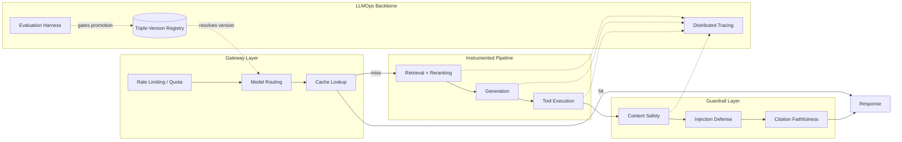
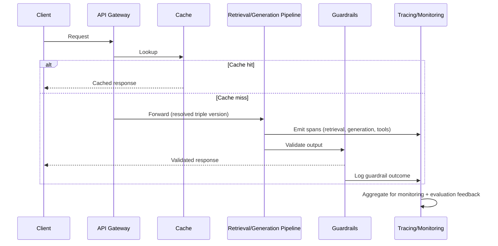
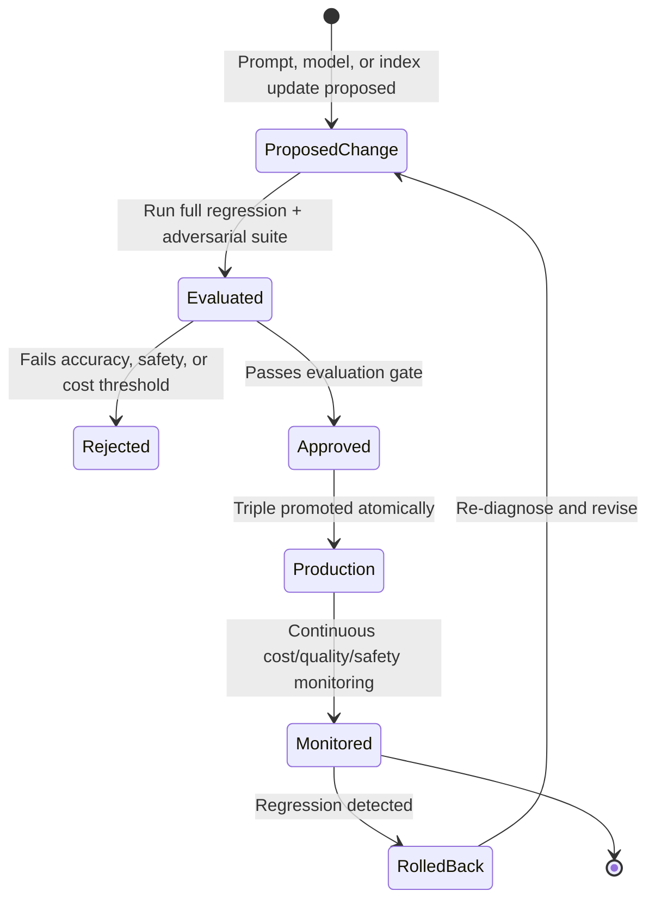

# LLMOps

> Part of the **Enterprise Data & AI Architecture Handbook** · Phase-12 — LLMOps & Agentic AI · Chapter 04.
> Estimated study time: **60 min reading + ~4h labs**.
> **Prerequisites:** read [Retrieval Augmented Generation](03_Retrieval_Augmented_Generation.md) and [MLOps and MLflow](../Phase-11/03_MLOps_and_MLflow.md) first.

---

## Executive Summary

[MLOps and MLflow](../Phase-11/03_MLOps_and_MLflow.md) established the classical ML operational discipline — experiment tracking, model registry, CI/CD/CT, and a non-bypassable evaluation gate — for models with a single well-defined accuracy metric and a comparatively simple input/output contract. Every Phase-12 chapter so far has quietly assumed that discipline extends to LLMs, but an LLM-powered feature is structurally different in ways that discipline does not automatically cover: its "model" is often a third-party API rather than an artifact the enterprise trains; its output is open-ended natural language (or structured output built on top of it, per [Prompt Engineering](02_Prompt_Engineering.md#23-structured-output-and-function-calling) §2.3) rather than a single scalar prediction; its behavior depends on a *pair* of versioned artifacts (model version and prompt version, per [Prompt Engineering](02_Prompt_Engineering.md#24-prompt-templates-and-versioning) §2.4) rather than one; and its retrieval component (per [Retrieval Augmented Generation](03_Retrieval_Augmented_Generation.md)) adds a second, independently-evaluated subsystem with its own quality metrics. LLMOps is the discipline that adapts and extends classical MLOps to this reality.

This chapter covers the **LLM lifecycle and versioning** model that tracks the model/prompt/retrieval-index triple as a single deployable unit; **prompt/response logging and tracing** as the observability foundation every other LLMOps capability depends on; **cost controls, caching, and routing** as the operational levers that keep a production LLM feature's unit economics sustainable at scale; **evaluation and regression testing** as the non-bypassable gate — extending [MLOps and MLflow](../Phase-11/03_MLOps_and_MLflow.md#32-model-registry-and-stage-transitions) §3.2's champion/challenger pattern — that any change to model, prompt, or retrieval index must clear before reaching production; and **guardrails and safety in production** as the standing runtime enforcement layer that content-safety, injection-defense (per [Prompt Engineering](02_Prompt_Engineering.md#25-prompt-injection-defenses) §2.5), and citation-faithfulness (per [Retrieval Augmented Generation](03_Retrieval_Augmented_Generation.md#35-grounding-citations-and-hallucination-control) §3.5) checks are actually operated within.

This chapter's central thesis: every prior Phase-12 chapter introduced a *capability* (prompting, retrieval, function calling); LLMOps is what makes any of those capabilities safe, cost-controlled, and reliable to actually run in production at scale, continuously, rather than as a one-time demo — extending [MLOps and MLflow](../Phase-11/03_MLOps_and_MLflow.md)'s "the evaluation gate never gets bypassed" principle to a domain where "the model" is now a versioned triple of model, prompt, and retrieval index, any one of which can silently regress the system's behavior if changed without going through this chapter's gate.

The platform bias is **Azure-primary (~60%)** — Azure AI Foundry's evaluation, tracing, and observability tooling, Azure API Management for request routing/caching/rate-limiting in front of Azure OpenAI Service, and Azure Monitor/Application Insights for production telemetry — **~30% enterprise open source** (MLflow, carried forward from [MLOps and MLflow](../Phase-11/03_MLOps_and_MLflow.md), extended with its LLM-tracing and evaluation capabilities; Redis for prompt/response caching; Grafana/Prometheus/OpenTelemetry for the metrics and tracing backbone; LangChain/LlamaIndex's built-in tracing and evaluation callback hooks) — **~10% AWS/GCP comparison-only** (Amazon Bedrock's model evaluation and guardrails; Google Vertex AI's evaluation service and Model Armor).

**Bottom line:** an LLM feature that has not been operated through this chapter's lifecycle-versioning, logging, cost-control, evaluation-gate, and guardrail disciplines is not production-ready regardless of how good its prompt or retrieval pipeline looks in a demo — LLMOps is what converts every capability the rest of Phase-12 builds into something an enterprise can actually run, monitor, and trust continuously.

---

## Learning Objectives

By the end of this chapter you will be able to:

1. **Design a versioning scheme** that tracks the model/prompt/retrieval-index triple as a single deployable, auditable unit.
2. **Implement prompt/response logging and distributed tracing** across a multi-stage LLM pipeline (retrieval, generation, tool calls, validation).
3. **Apply cost-control levers** — caching, semantic caching, model routing, and rate limiting — to keep a production LLM feature's unit economics sustainable.
4. **Build an automated evaluation and regression-testing pipeline** that gates every model, prompt, or retrieval-index change before production promotion.
5. **Operate production guardrails** (content safety, injection defense, citation faithfulness) as a continuously-monitored runtime layer, not a one-time pre-launch check.
6. **Apply Azure-native tooling** (Azure AI Foundry, Azure API Management, Azure Monitor) to implement a complete LLMOps pipeline.
7. **Defend LLMOps architecture decisions** in engineer, staff engineer, architect, and CTO review settings, including the trade-off between operational rigor and delivery velocity.

---

## Business Motivation

- **An ungoverned, unversioned LLM feature accumulates silent regression risk with every prompt edit, model update, or document re-index.** [Large Language Model Foundations](01_Large_Language_Model_Foundations.md) Case Study 2 and [Prompt Engineering](02_Prompt_Engineering.md) Case Study 2 both demonstrated cost and quality regressions that compounded for months before detection — LLMOps's evaluation-gate and monitoring discipline (§4.4) is the concrete, systemic fix for that entire class of failure, not just a one-off patch for either individual incident.
- **LLM inference cost scales directly with usage, and unmanaged cost growth is a recurring line item, not a one-time engineering cost** (per [Large Language Model Foundations](01_Large_Language_Model_Foundations.md#cost-optimization-finops)) — caching, routing, and rate-limiting (§4.3) are the operational levers that keep this cost sustainable as a feature's usage scales, not a one-time optimization exercise.
- **Regulatory and customer trust increasingly require demonstrable evaluation and safety evidence, not just a working demo.** An enterprise unable to show, on request, what evaluation a production LLM feature passed and what guardrails it operates under is in a materially weaker compliance and trust posture than one with this chapter's evaluation and guardrail discipline (§4.4-§4.5) operating continuously.
- **A production incident traced back to "which prompt version, which model version, and which retrieval-index version was live at the time" is unanswerable without the versioning and tracing discipline this chapter establishes** (§4.1-§4.2) — this is a direct, practical incident-response and audit capability, not merely an engineering-hygiene nicety.
- **Multi-model routing (§4.3) is a direct cost-and-resilience lever with clear business value**: routing a well-scoped task to a cheaper model and a genuinely complex task to a more capable one, and falling back to a secondary provider on an outage, both have measurable cost and availability impact at enterprise scale.

---

## History and Evolution

- **2020-2022 — MLflow and classical MLOps tooling** (per [MLOps and MLflow](../Phase-11/03_MLOps_and_MLflow.md)) mature as the standard operational discipline for classical ML, establishing the experiment-tracking, registry, and evaluation-gate patterns this chapter extends.
- **2022 — ChatGPT's release** (per [Large Language Model Foundations](01_Large_Language_Model_Foundations.md#history-and-evolution)) triggers a wave of LLM features shipped with far less operational rigor than classical ML teams had come to expect, as the new capability's novelty and speed of adoption briefly outpaced the operational tooling to govern it.
- **2023 — the term "LLMOps" emerges as a distinct practitioner discipline**, explicitly naming the gap between classical MLOps tooling (built around a single scalar-metric model artifact) and what an LLM-powered feature's prompt/retrieval/model triple actually requires.
- **2023 — LLM observability and tracing platforms mature** (LangSmith, and comparable tracing integrations added to MLflow and Azure AI Foundry), giving practitioners purpose-built tooling for the multi-stage, multi-hop tracing this chapter's §4.2 requires, beyond what classical single-model-call logging provided.
- **2023 — semantic caching emerges as a distinct optimization technique**, extending simple exact-match response caching (per [Large Language Model Foundations](01_Large_Language_Model_Foundations.md#cost-optimization-finops)) to also match semantically-similar-but-not-identical queries against a cached response, a meaningfully more impactful cost lever for natural-language query workloads where exact repeats are comparatively rare.
- **2023-2024 — LLM-as-judge evaluation techniques mature** (using a separate, typically more capable LLM to score a candidate response's quality against defined criteria), becoming the standard scalable alternative to purely human-reviewed evaluation for the open-ended, natural-language output classical accuracy metrics cannot directly score.
- **2024 — model routing and gateway platforms mature** (Azure API Management's AI gateway capabilities, and open-source equivalents), formalizing multi-model routing, rate-limiting, and caching as a distinct infrastructure layer sitting in front of one or more LLM providers, rather than logic embedded ad hoc in each application.
- **2024-present — production guardrail platforms consolidate** (Azure AI Content Safety's expanding capability set, open-source guardrail frameworks), moving injection defense, content safety, and groundedness checking from bespoke per-application logic toward a shared, centrally-operated platform capability — the direction this chapter's §4.5 and Enterprise Recommendations both point toward.

---

## Why This Technology Exists

LLMOps exists because classical MLOps tooling (per [MLOps and MLflow](../Phase-11/03_MLOps_and_MLflow.md)) was built around assumptions that do not hold for LLM-powered features: a single trained model artifact the enterprise owns and versions (vs. a third-party API model, a prompt template, and a retrieval index that must all be versioned *together*, per §4.1); a single scalar accuracy metric computable by comparing a prediction to a ground-truth label (vs. open-ended natural-language output requiring a fundamentally different evaluation approach, per §4.4); and a comparatively simple, single-call request path (vs. a multi-stage pipeline of retrieval, reranking, generation, and tool calls, per [Retrieval Augmented Generation](03_Retrieval_Augmented_Generation.md#internal-working) and [Prompt Engineering](02_Prompt_Engineering.md#internal-working), each stage of which can independently fail or regress). LLMOps exists to extend the *principles* of MLOps (versioning, gated promotion, continuous evaluation, monitored production operation) to this genuinely different technical reality, rather than either abandoning operational discipline entirely or forcing an ill-fitting classical-MLOps toolchain onto a problem it was not designed for.

---

## Problems It Solves

- **Silent regression from an unversioned prompt, model, or retrieval-index change** — the versioning discipline (§4.1) extends [MLOps and MLflow](../Phase-11/03_MLOps_and_MLflow.md#32-model-registry-and-stage-transitions) §3.2's registry pattern to the full model/prompt/index triple, closing the exact gap that let [Prompt Engineering](02_Prompt_Engineering.md) Case Study 2's cost creep and [Retrieval Augmented Generation](03_Retrieval_Augmented_Generation.md) Case Study 2's citation-faithfulness regression go undetected for as long as they did.
- **Inability to diagnose a multi-stage pipeline failure** — distributed tracing (§4.2) across retrieval, generation, and tool-call stages gives an engineer the ability to pinpoint exactly which stage produced an unexpected result, rather than treating the pipeline as an opaque black box.
- **Unmanaged, scaling inference cost** — caching, routing, and rate-limiting (§4.3) give concrete, measurable levers for controlling cost as usage scales, extending [Large Language Model Foundations](01_Large_Language_Model_Foundations.md#cost-optimization-finops)'s cost-optimization discipline into a continuously-operated platform capability.
- **The inability to score open-ended natural-language output against a single ground truth** — LLM-as-judge and retrieval-quality evaluation (§4.4) give a scalable, automatable evaluation approach suited to this genuinely different output type, extending the evaluation-gate principle from [MLOps and MLflow](../Phase-11/03_MLOps_and_MLflow.md) ADR-0150 without requiring the classical single-scalar-metric assumption.
- **Ad hoc, per-application safety logic** — centrally-operated production guardrails (§4.5) give every LLM feature a consistent, continuously-monitored safety baseline rather than each team reimplementing content-safety and injection-defense logic independently and inconsistently.

---

## Problems It Cannot Solve

- **It cannot make a fundamentally poor prompt, retrieval pipeline, or model choice good through operational rigor alone.** LLMOps disciplines *detect* regression and enforce *gates*; it does not substitute for the underlying prompt-engineering (Chapter 02) and retrieval-engineering (Chapter 03) quality the gated pipeline is evaluating.
- **It cannot fully automate evaluation for every quality dimension.** LLM-as-judge and automated metrics (§4.4) scale well for many quality dimensions but some genuinely nuanced judgments (subtle tone appropriateness, culturally-sensitive content, truly novel edge cases) still benefit from periodic human review — full automation is a scaling aid, not a complete substitute for human judgment on every dimension.
- **It cannot eliminate all production incidents.** Even a fully-instrumented, gated, guardrailed LLM pipeline can still encounter a genuinely novel failure mode (a new prompt-injection technique, an unanticipated edge-case query) that existing evaluation and guardrail coverage did not anticipate — LLMOps materially reduces incident frequency and severity and enables fast diagnosis, it does not provide an absolute guarantee.
- **It cannot resolve the tension between operational rigor and delivery velocity by itself.** Every additional evaluation check, tracing instrumentation point, and guardrail layer adds engineering and review overhead — this chapter's Trade-offs section names this tension explicitly rather than pretending more process is always strictly better.
- **It cannot substitute for the underlying governance decisions** (per [Large Language Model Foundations](01_Large_Language_Model_Foundations.md#governance) and [Retrieval Augmented Generation](03_Retrieval_Augmented_Generation.md#governance)) about what data can be sent to which model provider, or what document corpora are safe to index — LLMOps operates and enforces those decisions once made, it does not make them.

---

## Core Concepts

### 4.1 LLM Lifecycle and Versioning

- **An LLM feature's behavior is determined by a triple, not a single artifact**: the model version (proprietary API version or self-hosted model checkpoint, per [Large Language Model Foundations](01_Large_Language_Model_Foundations.md#13-pretraining-fine-tuning-and-rlhf) §1.3), the prompt template version (per [Prompt Engineering](02_Prompt_Engineering.md#24-prompt-templates-and-versioning) §2.4), and, for a RAG feature, the retrieval-index version (per [Retrieval Augmented Generation](03_Retrieval_Augmented_Generation.md#metadata)'s chunking-strategy and embedding-model versioning) — LLMOps versioning must track and pin this entire triple together as a single deployable, auditable release unit, since changing any one member independently can change the system's overall behavior.
- **A registry entry for an LLM feature release records the full triple's specific versions plus its evaluation results** (§4.4), directly extending the model-registry stage-transition pattern from [MLOps and MLflow](../Phase-11/03_MLOps_and_MLflow.md#32-model-registry-and-stage-transitions) §3.2 to cover prompt and retrieval-index versions alongside the model version, rather than tracking the model in isolation.
- **A third-party proprietary model's own version updates are a distinctive LLMOps versioning challenge classical MLOps does not face**: the enterprise does not control when or how a provider updates a model version, meaning a "model version" pin must account for the provider's own versioning and deprecation policy (e.g., Azure OpenAI Service's model version lifecycle and retirement dates), and a provider-initiated model deprecation requires the same re-evaluation-before-promotion discipline as any other change to the triple.
- **The CI/CD/CT pattern from [MLOps and MLflow](../Phase-11/03_MLOps_and_MLflow.md#33-cicd-ct-for-models) §3.3 extends directly**: continuous integration validates a proposed triple change (a prompt edit, a retrieval-index re-index, a model-version bump) against the regression suite (§4.4); continuous deployment promotes an approved triple to production following the same non-bypassable gate discipline established there.
- **Rollback must restore the entire triple atomically**, not just the model or just the prompt independently — a partial rollback (reverting the prompt but leaving a newer, unevaluated retrieval index in place) can produce an equally unvalidated, unpredictable combination the regression suite never actually tested.

### 4.2 Prompt/Response Logging and Tracing

- **Every production request should log the full resolved triple version** (§4.1) alongside the rendered prompt, the model's response, retrieved chunks and their citations (per [Retrieval Augmented Generation](03_Retrieval_Augmented_Generation.md#metadata)), any tool calls invoked (per [Prompt Engineering](02_Prompt_Engineering.md#23-structured-output-and-function-calling) §2.3), and the resulting token counts, latency, and cost — the concrete data every other section of this chapter's Monitoring, Observability, and evaluation practice is built on.
- **Distributed tracing** (extending the OpenTelemetry-based pattern established in [Large Language Model Foundations](01_Large_Language_Model_Foundations.md#observability) and [Prompt Engineering](02_Prompt_Engineering.md#observability)) instruments each stage of a multi-hop pipeline — query rewrite, retrieval, reranking, generation, tool execution, validation (per [Retrieval Augmented Generation](03_Retrieval_Augmented_Generation.md#internal-working) Internal Working) — as a distinct traced span, letting an engineer pinpoint exactly which stage introduced a latency spike or an unexpected result, rather than treating the entire pipeline's response time and output as a single opaque unit.
- **Logged prompts and responses require the same PII-handling and access-control rigor as any other data containing user input**, per [Data Privacy and PII Protection](../Phase-10/07_Data_Privacy_and_PII_Protection.md) and the logging-security concerns already flagged in [Large Language Model Foundations](01_Large_Language_Model_Foundations.md#storage) and [Retrieval Augmented Generation](03_Retrieval_Augmented_Generation.md#security) — a logging pipeline that itself becomes an unreviewed store of sensitive content is a governance gap, not a solved problem simply because logging exists.
- **Tracing is the foundation for both proactive monitoring (detecting a regression before a user reports it) and reactive incident response (diagnosing a reported problem after the fact)** — a production LLM feature with response logging but no structured, span-level tracing can tell you *that* a request was slow or wrong, but not efficiently *where* in the pipeline the problem originated.
- **Azure AI Foundry's integrated tracing** (and, for a self-hosted or MLflow-centric stack, MLflow's LLM-tracing extensions or LangChain/LlamaIndex's built-in tracing callbacks) provide this span-level instrumentation largely out of the box, materially lowering the engineering cost of adopting this discipline relative to building bespoke tracing instrumentation per application.

### 4.3 Cost Controls, Caching, and Routing

- **Exact-match response caching** (per [Large Language Model Foundations](01_Large_Language_Model_Foundations.md#cost-optimization-finops)'s original mention) avoids redundant inference cost for identical repeated requests, typically implemented with Redis or an equivalent low-latency key-value store keyed on the resolved prompt content.
- **Semantic caching** extends exact-match caching to also match a new query against a cached response when the new query is *semantically* similar (not identical) to a previously-answered one, using the same embedding-similarity mechanics established in [Retrieval Augmented Generation](03_Retrieval_Augmented_Generation.md#32-chunking-and-embedding-strategies) §3.2 — a meaningfully more impactful cache-hit-rate improvement for natural-language query workloads where users phrase the same underlying question many different ways, at the cost of a small risk of returning a stale or subtly-mismatched cached answer for a genuinely different query the similarity threshold incorrectly matched.
- **Model routing** directs a given request to the most cost-appropriate model tier based on estimated task complexity (per [Large Language Model Foundations](01_Large_Language_Model_Foundations.md#decision-matrix)'s model-tiering recommendation), typically implemented as a gateway layer (Azure API Management's AI gateway capabilities) sitting in front of multiple deployed model tiers, making the routing decision (and, where configured, multi-provider failover per [Large Language Model Foundations](01_Large_Language_Model_Foundations.md#fault-tolerance)) a centrally-operated platform capability rather than logic duplicated in every application.
- **Rate limiting and quota management** protect both cost predictability and the underlying model provider's own throughput limits, preventing a single misbehaving client or a traffic spike from generating an unbounded cost exposure or triggering cascading rate-limit errors across the platform.
- **Every cost-control lever must be validated against its accuracy/quality impact before being trusted at scale** — an aggressive semantic-caching similarity threshold or an overly-aggressive model-downgrade routing rule can silently degrade answer quality in pursuit of cost savings, meaning cost-control changes should pass through the same evaluation gate (§4.4) as any other change to the model/prompt/index triple.

### 4.4 Evaluation and Regression Testing

- **Every change to the model/prompt/retrieval-index triple (§4.1) must pass an automated regression evaluation before promotion**, directly extending the champion/challenger evaluation-gate principle from [MLOps and MLflow](../Phase-11/03_MLOps_and_MLflow.md) ADR-0148/ADR-0150 to this chapter's triple-artifact reality — no single-artifact change (a prompt edit alone, a model-version bump alone) is exempt from this gate merely because the other two members of the triple are unchanged.
- **Retrieval-quality evaluation** (recall@k, precision@k against a labeled query set, per [Retrieval Augmented Generation](03_Retrieval_Augmented_Generation.md#33-vector-keyword-and-hybrid-retrieval) §3.3) and **generation-quality evaluation** (accuracy, groundedness/citation-faithfulness per [Retrieval Augmented Generation](03_Retrieval_Augmented_Generation.md#35-grounding-citations-and-hallucination-control) §3.5, and task-specific correctness) must be measured as **distinct metrics**, directly extending [Retrieval Augmented Generation](03_Retrieval_Augmented_Generation.md#31-rag-architecture-and-components) §3.1's principle that retrieval and generation quality are independently diagnosable, so a regression can be correctly attributed to the specific pipeline stage that caused it.
- **LLM-as-judge evaluation** — using a separate, typically more capable model to score a candidate response against defined rubric criteria (correctness, relevance, groundedness, tone) — is the standard scalable technique for evaluating open-ended natural-language output that a classical single-ground-truth accuracy metric cannot directly score; it requires its own validation (periodically checking the judge model's scores against human-reviewed ground truth) to confirm it remains a reliable proxy, since the judge model itself can drift or exhibit systematic biases.
- **Adversarial/red-team evaluation** (testing known prompt-injection patterns per [Prompt Engineering](02_Prompt_Engineering.md#25-prompt-injection-defenses) §2.5, and known hallucination-inducing query patterns) must be a standing part of the regression suite, not a one-time pre-launch exercise, since new attack and failure patterns continue to emerge and a suite that is not periodically expanded loses coverage over time.
- **A regression suite's own quality and representativeness must itself be maintained and periodically audited** — a stale evaluation set that no longer reflects the actual production query distribution gives a false sense of confidence, the same "verification gap" pattern recurring throughout this handbook ([Data Security and Encryption](../Phase-10/03_Data_Security_and_Encryption.md) ADR-0143, [Responsible AI](../Phase-11/07_Responsible_AI.md) ADR-0154), now applied to the evaluation suite's own currency.

### 4.5 Guardrails and Safety in Production

- **Guardrails are runtime-enforced controls applied to every production request**, not merely design-time considerations validated once — content-safety filtering (Azure AI Content Safety), injection-defense checks (per [Prompt Engineering](02_Prompt_Engineering.md#25-prompt-injection-defenses) §2.5), least-privilege tool-execution scoping (per [Prompt Engineering](02_Prompt_Engineering.md) ADR-0156), and citation-faithfulness validation (per [Retrieval Augmented Generation](03_Retrieval_Augmented_Generation.md#35-grounding-citations-and-hallucination-control) §3.5) must all operate continuously on live traffic, not only during pre-launch testing.
- **A guardrail failure (a request blocked by a content-safety filter, a schema-validation failure, an injection-defense trigger) must be logged and monitored as a first-class production signal** (per §4.2's tracing discipline), both to detect an active attack pattern and to catch an overly-broad, false-positive-prone guardrail configuration requiring tuning — the same distinction [Prompt Engineering](02_Prompt_Engineering.md)'s Operational Response Playbook drew between these two very different root causes for a rising trigger rate.
- **Guardrails must fail closed for safety-critical checks (content safety, injection defense) and can fail open for precision-only refinements (reranking)**, mirroring the differentiated fault-tolerance treatment established in [Retrieval Augmented Generation](03_Retrieval_Augmented_Generation.md#fault-tolerance) — a content-safety filter that is unreachable should block the response (or fall back to a safe default), not silently pass an unfiltered response through.
- **Guardrail effectiveness must be validated adversarially and on a recurring cadence** (per §4.4's adversarial-evaluation requirement), never assumed effective indefinitely based on its initial design or a single pre-launch test pass, since guardrail-bypass techniques continue to evolve.
- **Centrally-operated guardrail platforms** (rather than each application team reimplementing content-safety and injection-defense logic independently) give an enterprise a single place to update a defense against a newly-discovered attack pattern once, propagating the fix across every LLM feature simultaneously, rather than requiring every team to independently patch their own bespoke implementation.

---

## Internal Working

**How a production request actually flows through a fully-instrumented LLMOps pipeline** (the mechanics underlying §4.2-§4.5, and the operational reality every earlier Phase-12 chapter's architecture assumes gets wrapped in):

1. **Gateway ingress**: the request arrives at the API gateway (Azure API Management's AI gateway), where rate-limiting and quota checks are applied (§4.3).
2. **Cache lookup**: an exact-match or semantic-cache lookup (§4.3) is attempted; a cache hit returns immediately, bypassing the remaining pipeline entirely and logging the cache-hit event (§4.2).
3. **Model/prompt/index resolution**: on a cache miss, the currently-promoted triple version (§4.1) is resolved, and a trace span is opened for the request (§4.2).
4. **Retrieval and generation**: the request proceeds through the retrieval, reranking, and generation pipeline established in [Retrieval Augmented Generation](03_Retrieval_Augmented_Generation.md#internal-working) and [Prompt Engineering](02_Prompt_Engineering.md#internal-working), with each stage logged as a distinct traced span.
5. **Guardrail enforcement**: content-safety, injection-defense, and citation-faithfulness checks (§4.5) are applied to the input and output at their respective boundaries, each check's outcome logged.
6. **Response delivery and full-request logging**: the final validated response is returned to the caller, and the complete request record (triple version, prompt, retrieved chunks, response, guardrail outcomes, token counts, latency, cost) is persisted (§4.2).
7. **Asynchronous monitoring aggregation**: the logged request record feeds the monitoring dashboards and alerting rules (§4's Monitoring section) on a near-real-time basis, and periodically feeds back into the regression-evaluation suite's production-representativeness audit (§4.4).

This sequence is why a production LLM feature's actual behavior at any point in time is fully reconstructable from its logs — the triple version resolved at step 3, combined with the full trace from steps 4-6, gives an engineer everything needed to reproduce or diagnose a specific historical request, exactly the capability that was missing in the incidents [Large Language Model Foundations](01_Large_Language_Model_Foundations.md) Case Study 2 and [Prompt Engineering](02_Prompt_Engineering.md) Case Study 2 both had to reconstruct after the fact.

---

## Architecture

- **Gateway layer**: Azure API Management's AI gateway, handling rate-limiting, quota management, model routing, and (optionally) caching (§4.3) in front of one or more deployed model endpoints.
- **Pipeline layer**: the retrieval, generation, and tool-execution architecture established in [Retrieval Augmented Generation](03_Retrieval_Augmented_Generation.md#architecture) and [Prompt Engineering](02_Prompt_Engineering.md#architecture), now wrapped in distributed tracing instrumentation (§4.2).
- **Guardrail layer**: content-safety, injection-defense, and citation-faithfulness checks (§4.5), operating at input and output boundaries across the pipeline.
- **Versioning/registry layer**: the model/prompt/retrieval-index triple registry (§4.1), directly extending the [MLOps and MLflow](../Phase-11/03_MLOps_and_MLflow.md#architecture)-established registry architecture.
- **Evaluation/CI pipeline**: the automated regression-suite gate (§4.4) that every proposed triple change must pass before promotion, mirroring [MLOps and MLflow](../Phase-11/03_MLOps_and_MLflow.md#33-cicd-ct-for-models) §3.3's CI/CD/CT pipeline.
- **Observability layer**: Azure Monitor/Application Insights (or Grafana/Prometheus/OpenTelemetry for a self-hosted stack) aggregating traces, logs, and metrics from every layer above into the dashboards covered in Monitoring and Observability below.

---

## Components

- **API gateway** — Azure API Management (AI gateway capabilities), enforcing rate limits, quotas, routing, and caching.
- **Triple version registry** — extending the MLflow model registry (per [MLOps and MLflow](../Phase-11/03_MLOps_and_MLflow.md#components)) to track model, prompt, and retrieval-index versions together.
- **Distributed tracing backend** — Azure Monitor Application Insights or an OpenTelemetry-compatible backend, storing span-level traces across the full pipeline.
- **Cache layer** — Redis (or an equivalent low-latency store) for exact-match and semantic caching.
- **Evaluation harness** — the regression-suite runner combining classical metrics, retrieval-quality metrics, LLM-as-judge scoring, and adversarial test cases (§4.4).
- **Guardrail services** — Azure AI Content Safety, injection-defense filters, and citation-faithfulness checkers (§4.5), invoked at defined pipeline checkpoints.
- **Monitoring/alerting dashboards** — Azure Monitor/Grafana dashboards surfacing cost, latency, quality, and guardrail-trigger metrics.

---

## Metadata

- **Triple-version metadata**: the specific model, prompt, and retrieval-index version combination deployed to production at any point in time, plus its evaluation results (§4.1, §4.4) — extending the model-lineage metadata schema from [MLOps and MLflow](../Phase-11/03_MLOps_and_MLflow.md#metadata) to cover all three artifact types together.
- **Per-request trace metadata**: the full span tree (retrieval, reranking, generation, tool calls, guardrail checks) for every production request, per §4.2.
- **Cache metadata**: cache-hit/miss rate, and for semantic caching, the similarity score and threshold applied for each cache decision (§4.3), needed to audit and tune cache-quality trade-offs.
- **Guardrail-outcome metadata**: which guardrail check fired, on which request, with what specific trigger/reason, feeding both the Monitoring dashboards and any downstream security investigation.

---

## Storage

- **Trace and log data** is stored in the observability backend (Azure Monitor Log Analytics, or a self-hosted equivalent), with retention policies aligned to both operational-debugging needs and the PII-handling/retention requirements established in [Data Privacy and PII Protection](../Phase-10/07_Data_Privacy_and_PII_Protection.md), since this data routinely contains user-submitted content.
- **The triple-version registry** is stored alongside (or directly extending) the MLflow-based model registry from [MLOps and MLflow](../Phase-11/03_MLOps_and_MLflow.md#storage), with prompt templates and retrieval-index version references stored as linked registry metadata rather than as separately-tracked, disconnected artifacts.
- **Cached responses (exact-match or semantic)** are stored in Redis (or an equivalent low-latency store) with a defined TTL and invalidation policy — critically, a cache entry generated against an older triple version must be invalidated (not served) once that triple version is superseded, preventing a stale-response bug distinct from, but analogous to, the retrieval-index-staleness concern in [Retrieval Augmented Generation](03_Retrieval_Augmented_Generation.md#fault-tolerance).
- **Evaluation datasets and results** follow the same versioned-artifact storage discipline as any other governed evaluation asset (per [MLOps and MLflow](../Phase-11/03_MLOps_and_MLflow.md#storage)), retained and queryable for audit.

---

## Compute

- **Gateway, caching, and routing infrastructure** typically run as a lightweight, horizontally-scalable service layer (Azure API Management's managed compute, or a self-hosted equivalent), a materially smaller compute footprint than the model-inference compute it fronts.
- **The evaluation harness (§4.4)** runs as a batch or scheduled workload against the regression suite, with LLM-as-judge evaluation itself consuming inference compute/cost against the judge model — a cost that should be tracked and budgeted explicitly, per Cost Optimization below, rather than treated as a "free" testing overhead.
- **Guardrail checks (content safety, injection-defense classifiers)** typically add a modest, per-request compute/latency overhead at the input and output boundaries, distinct from and additional to the core model-inference compute already covered in [Large Language Model Foundations](01_Large_Language_Model_Foundations.md#compute).

---

## Networking

- **The API gateway is the primary new networking boundary this chapter introduces**, and should be deployed with the same private-endpoint, VNet-injected posture established in [Network Security and Zero Trust](../Phase-10/04_Network_Security_and_Zero_Trust.md), sitting between calling applications and the underlying model/retrieval/guardrail services.
- **Distributed tracing introduces cross-service network calls to the observability backend** (exporting spans/logs/metrics), which should be considered in the pipeline's overall latency budget, particularly for synchronous (blocking) trace-export configurations versus asynchronous, batched export.

---

## Security

- **The API gateway is a natural, centralized enforcement point for rate-limiting, authentication, and routing security policy** — consolidating this enforcement in one gateway layer (rather than duplicating it in every application) is both an operational-simplicity and a security-consistency improvement, directly extending the centralized-guardrail-platform recommendation from §4.5.
- **Trace and log data can itself contain sensitive prompt/response content** (per Storage above), requiring the same access-control rigor as any other store of user-submitted content — an observability platform is not exempt from the data-governance obligations established in [Data Privacy and PII Protection](../Phase-10/07_Data_Privacy_and_PII_Protection.md) merely because its purpose is engineering diagnostics.
- **Cache poisoning is a distinctive LLMOps security concern**: if an attacker can influence what gets cached (e.g., via a crafted request that gets cached and later served to a different, unrelated user), a cache becomes a vector for serving manipulated or unauthorized content — cache keys and semantic-caching similarity thresholds must be designed with this risk in mind, particularly for any RAG feature where access-control-filtered results (per [Retrieval Augmented Generation](03_Retrieval_Augmented_Generation.md#security)) must never be cached and served across different users' differing permission scopes.
- **Guardrail bypass attempts should themselves be treated as a security-monitoring signal** (per §4.5), not merely an application-quality metric, since a rising or novel-pattern guardrail-trigger rate may indicate an active, evolving attack campaign against the platform.

---

## Performance

- **Cache hits (§4.3) are the single largest latency improvement lever available**, returning a response in a fraction of the time a full pipeline invocation requires — a well-tuned semantic cache's hit rate is directly correlated with both cost savings and average latency improvement.
- **Guardrail checks add a modest but real latency overhead at the input and output boundaries** (§4.5), a cost that must be budgeted within the overall latency target established for the feature, particularly for a latency-sensitive real-time use case.
- **Tracing instrumentation overhead should be negligible when properly implemented** (asynchronous, batched span export rather than synchronous, blocking export per request) — a tracing implementation that measurably degrades production latency defeats its own purpose and should be re-architected, not disabled.

---

## Scalability

- **The gateway layer must scale independently of the underlying model-serving infrastructure**, since a gateway's own throughput ceiling (rate-limiting, routing, caching logic) should not become a bottleneck the model-serving layer's own scaling headroom cannot compensate for.
- **The evaluation harness must scale with the number of actively-maintained model/prompt/retrieval-index triple combinations across the organization** — the same portfolio-wide governance-capacity concern raised in [ML Pipeline Architecture](../Phase-11/06_ML_Pipeline_Architecture.md#scalability) and [Prompt Engineering](02_Prompt_Engineering.md#scalability) applies here to the combined triple's evaluation surface specifically.
- **Trace and log storage volume scales directly with request volume**, requiring the same data-lifecycle and retention-tiering discipline (hot vs. cold storage, per [Azure Storage Services](../Phase-03/06_Azure_Storage_Services.md)) as any other high-volume operational-telemetry data, to avoid an unbounded, cost-prohibitive storage footprint.

---

## Fault Tolerance

- **A guardrail-service outage must fail closed for safety-critical checks** (§4.5) — a request should be blocked or degraded to a safe default rather than proceeding unfiltered if the content-safety or injection-defense service is unreachable, directly extending the fail-closed principle established in [MLOps and MLflow](../Phase-11/03_MLOps_and_MLflow.md) ADR-0150 and [Responsible AI](../Phase-11/07_Responsible_AI.md) ADR-0154 to the runtime guardrail layer.
- **A cache-layer outage should fail open to the full pipeline** (treating it as equivalent to a cache miss), never blocking a request merely because the caching optimization is temporarily unavailable, since caching is a performance/cost optimization, not a correctness-critical dependency.
- **A gateway or routing-layer failure should have a defined fallback path** (e.g., routing directly to a default model tier if the routing-decision logic itself fails), mirroring the multi-provider fallback resilience pattern established in [Large Language Model Foundations](01_Large_Language_Model_Foundations.md#fault-tolerance).
- **Triple-version rollback must be atomic and rehearsed** (§4.1) — a partial, inconsistent rollback (reverting only one member of the triple) risks deploying an untested combination the regression suite never actually validated, a distinct and more subtle failure mode than a simple full-triple rollback to a previously-validated, known-good combination.

---

## Cost Optimization (FinOps)

- **Cache hit rate is the single most directly measurable cost-optimization KPI this chapter introduces** — tracking and actively improving exact-match and semantic cache hit rate (§4.3) compounds directly into reduced inference spend as usage scales.
- **Model routing to the smallest viable model tier for a given task** (per [Large Language Model Foundations](01_Large_Language_Model_Foundations.md#decision-matrix)'s tiering recommendation, now operationalized as a gateway-level routing rule) remains the single largest lever, now implemented as a continuously-operated platform capability rather than a one-time architectural decision.
- **LLM-as-judge evaluation cost (§4.4) must itself be budgeted and right-sized** — running a full evaluation suite against every proposed change is necessary, but an unnecessarily large evaluation set or an unnecessarily capable (and expensive) judge model for a straightforward evaluation task both needlessly inflate evaluation cost; size the evaluation suite and judge-model choice to the actual confidence bar required, not reflexively to the maximum available.
- **Guardrail-check cost** (content-safety and injection-defense classifier calls, per §4.5) is a per-request cost addition that should be included in the feature's total unit-economics calculation from [Large Language Model Foundations](01_Large_Language_Model_Foundations.md#cost-optimization-finops)'s worked example methodology, not treated as a separate, unaccounted-for line item.
- **Trace and log storage retention tiering** (per Scalability above) directly controls observability-storage cost — retaining full-fidelity traces for a shorter hot-storage window and a lower-fidelity aggregate for longer-term audit is a standard, effective cost-control pattern.

---

## Monitoring

- **Triple-version-segmented cost, latency, and quality metrics** (extending every prior Phase-12 chapter's per-request monitoring with the full triple-version dimension established in §4.1), enabling precise attribution of any regression to the specific model, prompt, or retrieval-index change responsible.
- **Cache hit rate, guardrail-trigger rate, and evaluation-suite pass rate** as standing production KPIs, each independently trended and alertable.
- **A unified cost-per-request, quality, and safety dashboard per feature**, directly extending the pattern established across [Large Language Model Foundations](01_Large_Language_Model_Foundations.md#monitoring), [Prompt Engineering](02_Prompt_Engineering.md#monitoring), and [Retrieval Augmented Generation](03_Retrieval_Augmented_Generation.md#monitoring) into the single, triple-version-aware view this chapter's operational discipline is built to provide.

---

## Observability

- **Full end-to-end trace visibility across every pipeline stage** (gateway → cache → retrieval → reranking → generation → tool execution → guardrails → delivery, per Internal Working) is this chapter's central observability capability, letting an engineer reconstruct exactly what happened for any specific historical request.
- **Correlating a production incident (a cost spike, a quality regression, a guardrail-trigger spike) directly back to the specific triple-version change that introduced it** is the concrete, practical payoff of §4.1's versioning discipline combined with §4.2's tracing — the capability that was structurally missing in [Large Language Model Foundations](01_Large_Language_Model_Foundations.md) Case Study 2 and [Prompt Engineering](02_Prompt_Engineering.md) Case Study 2, both of which required manual, after-the-fact reconstruction rather than a direct, immediate correlation.

### Operational Response Playbook

| Signal | Detection Query/Check | Remediation |
|---|---|---|
| **A newly promoted model/prompt/retrieval-index triple shows a sustained regression in cost, latency, or evaluation-suite score relative to the prior triple** | Triple-version-segmented monitoring dashboard, comparing the newly promoted version against the immediately prior one across cost, latency, and quality metrics | Roll back the entire triple atomically to the last known-good combination (per Fault Tolerance's atomic-rollback discipline), then re-diagnose the specific member of the triple responsible in a non-production environment before re-attempting promotion |
| **Guardrail-trigger rate rises sharply and correlates with a spike in a specific query pattern from a specific source** | Guardrail-trigger-rate trend, segmented by feature, guardrail type, and request-source attributes | Distinguish an active, evolving attack campaign (escalate per the security-monitoring signal in Security above, consider temporarily tightening input validation) from a legitimate query pattern shift triggering false positives (tune the guardrail configuration); do not disable the guardrail to resolve the symptom without first determining which case applies |

---

## Governance

- **Every production LLM feature's currently-deployed triple version and its evaluation results must be documented and queryable** (§4.1, §4.4), extending the model-card and registry-documentation discipline established in [Responsible AI](../Phase-11/07_Responsible_AI.md#73-model-cards-and-datasheets) §7.3 and [MLOps and MLflow](../Phase-11/03_MLOps_and_MLflow.md#governance) to this chapter's triple-artifact reality.
- **No change to any member of the model/prompt/retrieval-index triple may bypass the evaluation gate** (§4.4), regardless of how small or "obviously safe" the change appears — this is the direct, non-negotiable extension of [MLOps and MLflow](../Phase-11/03_MLOps_and_MLflow.md) ADR-0150's "no bypass, manual or automated" principle to this chapter's full triple.
- **Guardrail configuration changes require the same review and version-control discipline as a prompt-template change** (per [Prompt Engineering](02_Prompt_Engineering.md#24-prompt-templates-and-versioning) §2.4), since loosening a guardrail's sensitivity is a security-relevant, behavior-changing decision deserving the same scrutiny as any other production change.
- **A designated owner for each production LLM feature's ongoing evaluation-suite currency and guardrail-effectiveness review** should be established, extending the accountable-ownership pattern from [Responsible AI](../Phase-11/07_Responsible_AI.md#75-microsoft-responsible-ai-standard) §7.5.

---

## Trade-offs

- **Evaluation-gate thoroughness vs. iteration velocity**: a more comprehensive regression suite (more test cases, more evaluation dimensions, adversarial coverage) catches more regressions but slows every promotion cycle — a risk-tiered evaluation depth (lighter for low-stakes features, full-depth for high-stakes ones) resolves this the same way [Responsible AI](../Phase-11/07_Responsible_AI.md#trade-offs)'s risk-tiered governance resolved the analogous tension.
- **Caching aggressiveness vs. answer freshness and correctness**: a more aggressive semantic-caching similarity threshold improves cache hit rate and cost savings but increases the risk of serving a stale or subtly-mismatched cached answer — this trade-off should be tuned against measured evaluation impact (§4.4), not set by cost-savings intuition alone.
- **Centralized guardrail/gateway platform vs. per-team autonomy**: a centrally-operated gateway and guardrail platform (§4.3, §4.5) gives consistency and single-point-of-update leverage, at the cost of requiring every team to adopt a shared platform rather than a bespoke, team-specific implementation — the standard build-once-consume-many governance trade-off, resolved in this chapter's Enterprise Recommendations in favor of centralization given the security-consistency benefit.
- **Tracing/logging granularity vs. storage cost and latency overhead**: full-fidelity, span-level tracing on every request gives maximum diagnostic power at a real storage-cost and (if implemented synchronously) latency cost — a tiered approach (full fidelity for a sampled subset of traffic or for flagged/anomalous requests, lighter-weight aggregate metrics for the rest) is a common resolution.

---

## Decision Matrix

| Scenario | Recommended Approach | Rationale |
|---|---|---|
| Any production LLM feature change (prompt, model version, or retrieval-index update) | Full regression-evaluation gate before promotion, triple versioned and rolled back atomically | No change is exempt regardless of how small it appears (per Governance) |
| High-volume, natural-language, FAQ-adjacent query workload | Semantic caching enabled, validated against evaluation impact | Highest-leverage cost/latency lever for this workload shape |
| Feature with mixed task complexity across requests | Gateway-level model routing to smallest viable tier per request | Directly operationalizes the model-tiering cost lever at scale |
| High-stakes, regulated, or safety-critical feature | Full-depth evaluation suite, fail-closed guardrails, no caching of access-control-sensitive content | Regulatory and liability exposure justifies maximal rigor over velocity |
| Low-stakes, experimental, internal-only feature | Lighter-weight evaluation suite, standard guardrail baseline | Full rigor is not proportionate; escalate to full-depth if the feature progresses toward higher-stakes use |

---

## Design Patterns

- **Triple-versioned, gated promotion**, treating model, prompt, and retrieval-index versions as one atomically-versioned release unit that must clear a regression gate together (§4.1, §4.4).
- **Full-pipeline distributed tracing**, instrumenting every stage from gateway to guardrail as a distinct traced span (§4.2), enabling precise regression attribution.
- **Centralized gateway and guardrail platform**, consolidating rate-limiting, routing, caching, and safety enforcement into a shared, once-updated platform layer rather than per-application bespoke logic (§4.3, §4.5).
- **Risk-tiered evaluation and guardrail depth**, applying full rigor to high-stakes features and a lighter, proportionate baseline to low-stakes ones (Trade-offs, Decision Matrix).

---

## Anti-patterns

- **Promoting a prompt or retrieval-index change without running it through the same evaluation gate as a model-version change**, on the mistaken assumption that "only the prompt changed" makes the change lower-risk by definition — the exact anti-pattern this chapter's Governance section rules out.
- **Treating tracing and logging as a nice-to-have added after a production incident** rather than a foundational, day-one capability — the reactive posture that made [Large Language Model Foundations](01_Large_Language_Model_Foundations.md) Case Study 2 and [Prompt Engineering](02_Prompt_Engineering.md) Case Study 2 both take longer to diagnose than a properly-instrumented pipeline would have.
- **Enabling aggressive semantic caching without validating its accuracy impact**, silently degrading answer quality in pursuit of cost savings with no corresponding evaluation check catching the regression.
- **Allowing a guardrail configuration to be loosened without the same review rigor as a prompt-template change**, treating a security-relevant configuration change as a low-stakes operational tweak.
- **Caching access-control-filtered RAG results across different users without partitioning the cache by permission scope**, reintroducing the exact access-control-leak risk [Retrieval Augmented Generation](03_Retrieval_Augmented_Generation.md) Case Study 1 documented, now via the cache layer instead of the retrieval index itself.

---

## Common Mistakes

- Assuming a third-party proprietary model's version is stable indefinitely and never re-validating after a provider-initiated model update or deprecation.
- Building an evaluation suite once at initial launch and never expanding it to cover new production query patterns or newly-discovered adversarial techniques.
- Measuring only end-to-end cost and latency, without the triple-version segmentation needed to attribute a regression to its actual root cause.
- Assuming a cache layer is inherently safe from access-control concerns simply because the underlying retrieval index already enforces them correctly.
- Disabling or loosening a guardrail to resolve a user complaint about false positives without first determining whether the underlying cause is a genuine configuration issue or an active attack pattern.

---

## Best Practices

- Version and gate every change to the model/prompt/retrieval-index triple through the same non-bypassable evaluation process, regardless of which single member changed.
- Instrument full-pipeline distributed tracing from day one of any production LLM feature, not as a retrofit after an incident.
- Measure cache hit rate, model-routing distribution, and guardrail-trigger rate as standing production KPIs alongside cost, latency, and quality.
- Validate every cost-control lever (caching aggressiveness, model-routing rules) against its accuracy/quality impact before trusting it at scale.
- Maintain and periodically expand the regression-evaluation suite's adversarial and production-representativeness coverage, treating suite currency itself as a governed, audited asset.

---

## Enterprise Recommendations

- Standardize on a centrally-operated gateway and guardrail platform (Azure API Management's AI gateway, Azure AI Content Safety) as the default for every LLM feature, rather than allowing each team to build bespoke rate-limiting, routing, or safety logic independently.
- Require a documented triple-version registry entry and passing regression-evaluation result as a non-negotiable condition of production promotion for every LLM feature, mirroring [MLOps and MLflow](../Phase-11/03_MLOps_and_MLflow.md)'s model-promotion discipline.
- Establish a standing, cross-team-shared adversarial-evaluation test suite (covering known prompt-injection and hallucination-inducing patterns), updated centrally as new techniques are discovered, rather than each team maintaining its own incomplete version.
- Track triple-version-segmented cost, quality, and safety metrics as a standing platform-wide FinOps and governance KPI, catching regressions and cost drift proactively across the entire LLM feature portfolio.

---

## Azure Implementation

- **Azure AI Foundry** as the integrated evaluation, tracing, and triple-version-tracking platform, extending its Prompt Flow capabilities (per [Prompt Engineering](02_Prompt_Engineering.md#azure-implementation)) with built-in evaluation metrics (groundedness, relevance, coherence) and full-pipeline tracing.
- **Azure API Management's AI gateway capabilities** for rate-limiting, quota management, model routing, and caching in front of Azure OpenAI Service deployments.
- **Azure Monitor and Application Insights** for distributed tracing, log aggregation, and the cost/latency/quality/safety dashboards covered in Monitoring and Observability.
- **Azure AI Content Safety** as the primary managed guardrail service for content-safety and (in combination with application-level logic) injection-defense enforcement.
- **MLflow on Azure Machine Learning or Azure Databricks** for the triple-version registry, extending the model-registry pattern from [MLOps and MLflow](../Phase-11/03_MLOps_and_MLflow.md) with prompt and retrieval-index version metadata.

---

## Open Source Implementation

- **MLflow** (carried forward from [MLOps and MLflow](../Phase-11/03_MLOps_and_MLflow.md)), extended with its LLM-tracing and evaluation capabilities, as the open-source registry and experiment-tracking backbone for teams not standardized on Azure AI Foundry's native tooling.
- **Redis** for exact-match and semantic-caching implementation.
- **Grafana, Prometheus, and OpenTelemetry**, carried forward from [Model Serving and Ray](../Phase-11/04_Model_Serving_and_Ray.md#observability), as the metrics-and-tracing backbone for a self-hosted observability stack.
- **LangChain and LlamaIndex's** built-in tracing callbacks and evaluation harnesses (Phase-12 Chapter 08) as a lighter-weight, framework-native alternative to a fully separate observability platform for teams already standardized on those orchestration frameworks.

---

## AWS Equivalent (comparison only)

- **Amazon Bedrock's model evaluation and Guardrails capabilities**, combined with Amazon API Gateway and CloudWatch, provide the direct equivalent evaluation, guardrail, and observability stack.
- **Advantages**: tight integration for AWS-centric teams, consistent with the parallel comparisons throughout this handbook.
- **Disadvantages**: a distinct evaluation-configuration and tracing-integration surface relative to Azure AI Foundry, requiring rework to migrate existing evaluation harnesses and dashboards.
- **Migration strategy**: MLflow-based triple-version tracking and OpenTelemetry-based tracing (where used instead of a fully platform-native equivalent) port with the least friction; platform-native evaluation-metric definitions and gateway-routing configuration require the most rework.
- **Selection criteria**: choose the Bedrock/CloudWatch stack when the broader cloud estate is AWS-centric; otherwise this chapter's Azure-primary recommendation applies.

---

## GCP Equivalent (comparison only)

- **Google Vertex AI's evaluation service and Model Armor**, combined with Google Cloud's API Gateway and Cloud Monitoring/Trace, provide the equivalent evaluation, guardrail, and observability capability.
- **Advantages**: strong integration for GCP-centric teams.
- **Disadvantages**: the same re-platforming cost pattern as the AWS case relative to Azure AI Foundry.
- **Migration strategy**: as with AWS, open-source/MLflow/OpenTelemetry-based implementations port more readily than platform-native evaluation and gateway configuration.
- **Selection criteria**: choose the Vertex AI stack when the data/ML estate is GCP-centric; otherwise default to the Azure-primary recommendation.

---

## Migration Considerations

- **MLflow-based triple-version tracking and OpenTelemetry-based tracing are the most portable artifacts this chapter covers**, transferring across Azure, AWS, or GCP with minimal rework, since neither depends on a single cloud provider's proprietary tooling.
- **Platform-native evaluation-metric definitions, gateway-routing rules, and guardrail configurations do not transfer as-is**, requiring reimplementation against the target platform's native tooling and, critically, re-validation of guardrail effectiveness (per §4.5) rather than assuming equivalent protection transfers automatically.
- **Cached responses and trace/log data generally should not be migrated directly** — a fresh cache-warming period and a defined trace/log retention cutover are standard, low-risk practices rather than attempting to carry forward potentially stale or platform-format-incompatible operational data.
- **A full re-validation of the evaluation suite against the target platform's model versions and API behavior is required post-migration**, since even a "compatible" model on a different platform can behave subtly differently, per the general model/prompt-pairing sensitivity established in [Prompt Engineering](02_Prompt_Engineering.md#24-prompt-templates-and-versioning) §2.4.

---

## Mermaid Architecture Diagrams

---

## End-to-End Data Flow

1. **Change proposal**: a prompt edit, model-version update, or retrieval-index re-index is proposed and versioned (§4.1).
2. **Evaluation gate**: the proposed triple change is run through the regression suite — classical metrics, retrieval-quality metrics, LLM-as-judge scoring, and adversarial tests (§4.4).
3. **Promotion**: an approved triple is promoted atomically to production, recorded in the triple-version registry.
4. **Request-time gateway processing**: incoming requests pass through rate-limiting, routing, and cache lookup (§4.3) at the gateway.
5. **Pipeline execution and tracing**: on a cache miss, the request proceeds through the retrieval/generation/tool-execution pipeline, with every stage traced (§4.2).
6. **Guardrail enforcement**: content-safety, injection-defense, and citation-faithfulness checks are applied before response delivery (§4.5).
7. **Logging and monitoring feedback**: the complete request record feeds the monitoring dashboards and, periodically, the evaluation suite's production-representativeness audit.

---

## Real-world Business Use Cases

- **A customer-support assistant operated at high volume**, where cache hit rate and model routing directly determine unit economics, and triple-versioned regression testing prevents the cost-creep and quality-regression failure modes documented in earlier Phase-12 case studies.
- **A regulated-industry compliance-research assistant**, where full-depth evaluation, fail-closed guardrails, and complete request traceability are a direct compliance and audit requirement, not merely an engineering best practice.
- **A multi-team enterprise platform hosting many LLM features**, where a centrally-operated gateway and guardrail platform gives consistent security and cost governance across teams that would otherwise each build inconsistent, bespoke operational tooling.

---

## Industry Examples

- **Financial services and healthcare organizations** are typically the most rigorous adopters of full triple-versioned evaluation gates and fail-closed guardrails, given direct regulatory and liability exposure.
- **High-volume consumer-facing platforms** (customer service, e-commerce) place the heaviest emphasis on caching and model-routing cost optimization, given the direct, compounding cost impact of even small per-request inefficiencies at their scale.
- **Large technology organizations operating many internal LLM features** increasingly consolidate on a shared internal LLMOps platform (gateway, guardrails, evaluation harness) specifically to avoid the governance fragmentation and inconsistent security posture that independent, per-team implementations produce.

---

## Case Studies

**Case Study 1 — A silent model-version deprecation that broke a fine-tuned production feature.** An enterprise support-automation feature depended on a specific Azure OpenAI Service model version that had been fine-tuned and extensively evaluated against that exact version. When the provider announced a scheduled retirement of that model version several months out, the team, lacking a triple-versioned registry entry clearly flagging this fine-tuned model's specific version dependency, missed the deprecation notice until the retirement date arrived and the feature's API calls began failing outright. Because there was no established re-evaluation procedure for a forced model-version migration, the team had to scramble to re-fine-tune and re-validate against a successor model version under time pressure, discovering in the process that the successor model's behavior differed enough that several previously-passing evaluation cases now failed and required prompt adjustments as well — changes that, under time pressure, received far less scrutiny than a normal promotion cycle would have applied. The root cause was the missing link this chapter's §4.1 establishes: a proprietary model version is not a "set it and forget it" dependency, and its own provider-driven lifecycle must be tracked and monitored with the same rigor as any internally-versioned artifact, with a defined re-evaluation procedure ready before a forced migration deadline, not invented under pressure during one.

**Case Study 2 — A semantic cache silently serving a stale answer after a policy update.** A customer-facing FAQ assistant used aggressive semantic caching to control cost at high query volume. When an underlying policy document changed (correctly triggering a RAG index re-index per [Retrieval Augmented Generation](03_Retrieval_Augmented_Generation.md)'s ingestion pipeline), the semantic cache was not invalidated as part of that re-index event, since the cache-invalidation logic had been built only to key on exact query text matches, an assumption that had quietly become stale once semantic caching was added. For several weeks, semantically-similar queries continued to receive a cached, pre-policy-change answer even though the underlying retrieval index itself was correctly current — a stale-answer failure mode invisible to any monitoring that checked only the retrieval index's freshness (per [Retrieval Augmented Generation](03_Retrieval_Augmented_Generation.md#fault-tolerance)'s stale-index concern) without also checking the cache layer sitting in front of it. The issue was discovered only when a customer complaint referenced the outdated policy language directly. The fix: cache entries were tagged with the retrieval-index version active at generation time (per this chapter's Storage section), and index re-indexing events now trigger an explicit cache invalidation for any entries tagged with the superseded index version. The lesson: a cache layer is itself a versioned artifact tied to the underlying triple, and its invalidation must be wired into the same versioning and promotion events as the retrieval index and model — a cache is not "outside" the triple's versioning discipline merely because it was added as a separate optimization layer later.

---

## Hands-on Labs

1. **Lab 1 — Build a triple-version registry entry.** Extend an MLflow experiment run to record a prompt-template version and a retrieval-index version alongside a model version, and implement a simple promotion check that blocks promotion unless all three have passing evaluation results attached.
2. **Lab 2 — Instrument full-pipeline distributed tracing.** Using OpenTelemetry, instrument a sample retrieval-generation-guardrail pipeline with distinct spans for each stage, and use the resulting trace to diagnose an artificially-introduced latency regression in one specific stage.
3. **Lab 3 — Implement semantic caching with version-aware invalidation.** Build a semantic cache keyed on query embedding similarity, tag each cache entry with the retrieval-index version active at generation time, and implement an invalidation routine triggered by a simulated re-index event — directly addressing Case Study 2's failure mode.
4. **Lab 4 — Build an LLM-as-judge evaluation harness.** Using a separate judge-model call, score a set of candidate responses against a defined rubric (correctness, groundedness, tone), and validate the judge's scores against a small human-reviewed ground-truth sample.

---

## Exercises

1. Explain why a prompt-only change still requires the same evaluation gate as a model-version change, using the model/prompt/retrieval-index triple concept from §4.1.
2. Given the Case Study 1 scenario, describe the specific registry and monitoring change that would have surfaced the pending model deprecation with enough lead time to avoid a scramble.
3. Given the Case Study 2 scenario, explain why checking retrieval-index freshness alone was insufficient to catch the stale-cache bug, and what additional monitoring signal would have caught it earlier.
4. Design a risk-tiered evaluation-depth policy distinguishing a high-stakes regulated feature from a low-stakes internal experimental one, per this chapter's Decision Matrix.

---

## Mini Projects

1. **Build a cost/quality/safety unified dashboard**: instrument a sample LLM pipeline to log triple version, cost, latency, evaluation score, and guardrail-trigger outcome per request, and build a Grafana (or Azure Monitor) dashboard correlating all four dimensions by triple version.
2. **Build an atomic rollback mechanism**: implement a promotion/rollback routine for the Lab 1 triple-version registry that reverts all three artifact versions together, and verify that a partial (single-artifact) rollback is structurally prevented.

---

## Capstone Integration

This chapter is the operational backbone every prior Phase-12 chapter's capability depends on to run safely and sustainably in production: the model/prompt versioning from [Large Language Model Foundations](01_Large_Language_Model_Foundations.md) and [Prompt Engineering](02_Prompt_Engineering.md) is formalized here into the full triple-versioning discipline (§4.1); the retrieval-quality and citation-faithfulness metrics introduced in [Retrieval Augmented Generation](03_Retrieval_Augmented_Generation.md) become concrete, continuously-monitored production signals here (§4.4); the injection-defense and least-privilege tool-scoping principles from [Prompt Engineering](02_Prompt_Engineering.md) are operationalized here as centrally-enforced, monitored production guardrails (§4.5); and the cost-optimization levers named throughout Chapters 01-03 become concrete, gateway-operated platform capabilities here (§4.3). Every case study across this handbook phase so far — the fine-tuning-instead-of-retrieval mistake, the cost-creep from unmonitored prompt edits, the indirect-injection and overprivileged-tool near-misses, the access-control index leak, the unfaithful citation — shares a common structural lesson this chapter closes the loop on: a change or a gap that seems individually small and reasonable can compound into a significant production failure without the versioning, tracing, evaluation-gate, and guardrail discipline this chapter establishes as a continuously-operated practice, not a one-time launch checklist. This LLMOps foundation is what Agentic AI Architecture (Phase-12 Chapter 05) assumes is already in place as it introduces the added complexity of multi-step, autonomous tool-using systems next.

---

## Interview Questions

1. Why does an LLM-powered feature require versioning a "triple" (model, prompt, retrieval index) rather than just the model, unlike classical MLOps?
2. What is the difference between exact-match caching and semantic caching, and what risk does semantic caching introduce that exact-match caching does not?
3. Why must retrieval-quality and generation-quality be evaluated as distinct metrics rather than a single end-to-end score?
4. What does "fail closed" mean for a guardrail, and why does it matter for a content-safety check specifically?

## Staff Engineer Questions

1. How would you design a triple-versioned registry and promotion gate that prevents the "only the prompt changed, so it's low-risk" anti-pattern from bypassing evaluation?
2. Walk through your diagnostic process for attributing a production quality regression to a specific stage in a multi-hop retrieval-generation-guardrail pipeline, using distributed tracing.
3. How would you design cache-invalidation logic that avoids the stale-answer failure mode from Case Study 2, tying cache entries to the underlying retrieval-index version?
4. What is your strategy for validating that an LLM-as-judge evaluation approach remains a reliable proxy for human judgment over time?

## Architect Questions

1. Design a reference architecture for a centrally-operated LLMOps gateway and guardrail platform serving many teams' independent LLM features.
2. How would you architect monitoring and alerting to track and manage a portfolio of third-party proprietary model version dependencies and their deprecation timelines, per Case Study 1?
3. What is your reference architecture for risk-tiered evaluation depth, balancing rigor against delivery velocity across a portfolio ranging from experimental to regulated features?
4. How would you structure an enterprise-wide LLMOps governance policy covering triple-versioning, evaluation gating, and guardrail-configuration change control?

## CTO Review Questions

1. Can we demonstrate, with evidence, exactly which model, prompt, and retrieval-index version combination is live in production for every LLM feature today?
2. Do we have a proactive monitoring process tracking our proprietary model-version dependencies against provider deprecation timelines, or would we discover a forced migration only when it breaks a feature?
3. What is our current cache hit rate and model-routing cost-savings realization across our LLM feature portfolio, and are we validating that these cost levers aren't degrading quality?
4. Are our guardrails currently fail-closed for every safety-critical check, and can we produce evidence of when each guardrail configuration was last reviewed and adversarially tested?

---

### Architecture Decision Record (ADR-0158): Mandate Atomic Triple-Versioned Promotion and Rollback for Every Production LLM Feature

**Context:** Case Study 1 documented a fine-tuned production feature broken by a silent, provider-driven model-version deprecation the team had no monitoring in place to anticipate, and Case Study 2 documented a semantic cache serving stale answers for weeks after a retrieval-index update because the cache's invalidation logic was never wired into the same versioning event as the index itself — both incidents share a root cause: individual artifacts (model, prompt, retrieval index, cache) were versioned and updated independently, with no single mechanism ensuring all of them move together, or that a change to any one of them is evaluated in the full context of the others.

**Decision:** Every production LLM feature must maintain a single, atomic triple-version registry entry covering its model version, prompt version, and retrieval-index version (extended, per Case Study 2's lesson, to also tag any cache-layer entries with their generating triple version). No individual artifact may be promoted, deprecated, or rolled back independently of the others; every promotion must pass the full regression-evaluation gate (§4.4) against the complete proposed triple, and every rollback must atomically restore a previously-validated triple combination in full.

**Consequences:**
- *Positive:* directly closes both the provider-driven-deprecation blind spot (Case Study 1) and the cache-invalidation gap (Case Study 2), since both are now structurally tied to the same versioning and promotion event; gives every production LLM feature a single, auditable source of truth for "what is actually running right now"; prevents the "this one small change doesn't need the full gate" anti-pattern from ever having a valid justification.
- *Negative:* adds registry and promotion-pipeline engineering overhead beyond what a simpler, independently-versioned-artifact approach would require; requires proactively monitoring third-party model-version deprecation schedules as an ongoing operational responsibility, not a one-time integration task; may slow a well-intentioned, genuinely low-risk isolated change (e.g., a trivial prompt typo fix) by requiring it to pass through the same full gate as any other triple change.
- *Alternatives considered:* versioning each artifact (model, prompt, index, cache) independently with looser coordination (rejected — this is precisely the structure that produced both case-study incidents); a lightweight "fast path" for trivial changes bypassing the full evaluation gate (rejected as the sole mechanism — a change's apparent triviality is not a reliable predictor of its actual behavioral impact, per the general "no exemptions" lesson established throughout this handbook's MLOps and Responsible AI chapters).

---

## References

- Zaharia, M. et al. (MLflow project) — extended documentation for LLM tracing and evaluation capabilities.
- Microsoft Learn — Azure AI Foundry evaluation and tracing documentation; Azure API Management AI gateway documentation; Azure AI Content Safety documentation.
- OpenTelemetry project documentation, for distributed tracing standards applicable to multi-hop LLM pipelines.
- Zheng, L. et al. (2023) — "Judging LLM-as-a-Judge with MT-Bench and Chatbot Arena," the foundational empirical study on LLM-as-judge evaluation reliability.

## Further Reading

- LangSmith and comparable LLM observability platform documentation, for purpose-built tracing and evaluation tooling patterns.
- Redis documentation on semantic caching implementation patterns.
- Azure API Management AI gateway documentation, for model-routing and rate-limiting configuration details.
- [MLOps and MLflow](../Phase-11/03_MLOps_and_MLflow.md), for the classical MLOps foundation this chapter extends.
