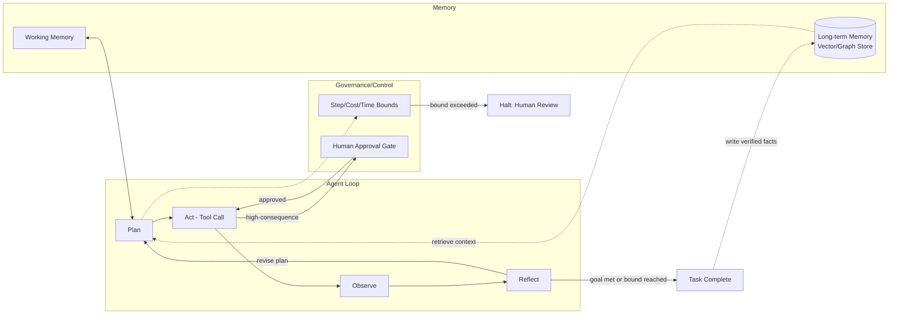
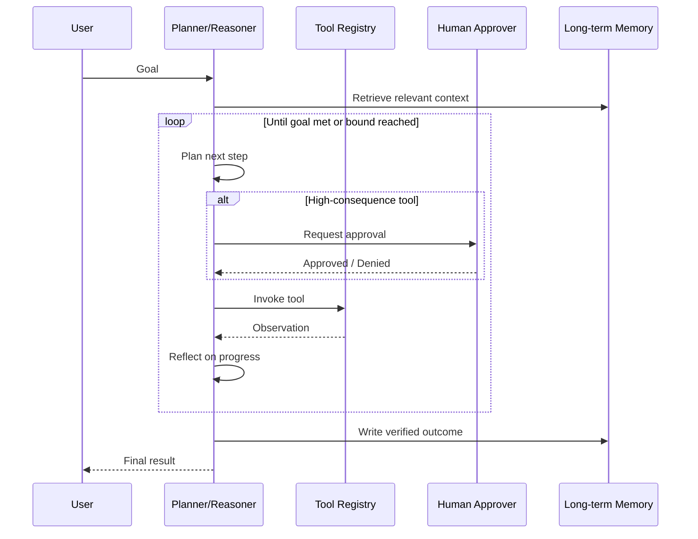
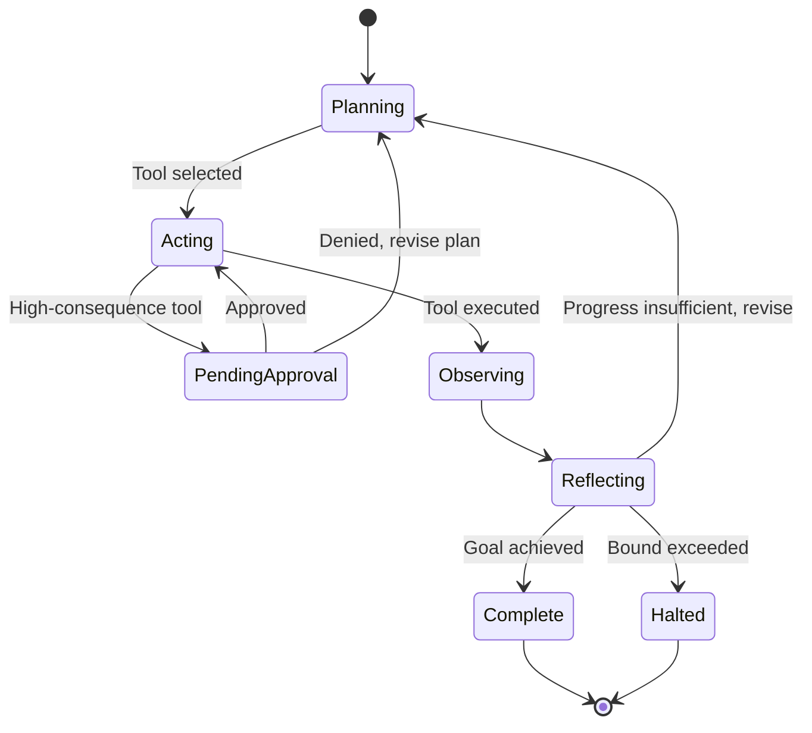

# Agentic AI Architecture

> Part of the **Enterprise Data & AI Architecture Handbook** · Phase-12 — LLMOps & Agentic AI · Chapter 05.
> Estimated study time: **75 min reading + ~5h labs**.
> **Prerequisite:** read [LLMOps](04_LLMOps.md) first.

---

## Executive Summary

Every prior Phase-12 chapter built toward, but deliberately stopped short of, full autonomy: [Prompt Engineering](02_Prompt_Engineering.md) introduced function calling as a single-step "the model requests one tool invocation" capability; [Retrieval Augmented Generation](03_Retrieval_Augmented_Generation.md) named multi-hop, cross-document reasoning as a gap its baseline architecture does not close; and [LLMOps](04_LLMOps.md) built the versioning, tracing, evaluation, and guardrail discipline required to operate *any* LLM-powered system safely in production. Agentic AI architecture is where these threads combine into a system that does not just answer a single question but autonomously plans a sequence of steps, invokes tools and observes their results, reflects on whether it is making progress, and adapts its plan — all without a human manually orchestrating each step.

This chapter covers the **agent loop** (plan, act, observe, reflect) as the foundational control-flow pattern every agentic system implements in some form; **tool use and function calling** as the mechanism (introduced in [Prompt Engineering](02_Prompt_Engineering.md#23-structured-output-and-function-calling) §2.3) now chained across multiple sequential steps rather than invoked once; **short- and long-term memory design** as the mechanism that lets an agent maintain state across a multi-step task and, for long-term memory, across separate sessions entirely; **multi-agent orchestration** as the pattern of decomposing a complex task across multiple specialized agents rather than one monolithic agent attempting everything; and **reliability, cost, and failure modes** as the discipline that keeps an autonomous, multi-step, compounding-cost system from becoming unpredictable, runaway, or unsafe in production.

This chapter's central and recurring caution: autonomy is a genuine capability upgrade, and it is also a genuine risk multiplier — every additional autonomous step compounds cost (per [LLMOps](04_LLMOps.md#cost-optimization-finops)'s per-request economics, now multiplied across a variable, potentially unbounded number of steps), compounds the opportunity for a single reasoning error to derail the entire task, and compounds the security surface a successful prompt injection (per [Prompt Engineering](02_Prompt_Engineering.md#25-prompt-injection-defenses) §2.5) can exploit, since a compromised agent can now autonomously chain multiple tool calls rather than being limited to one. This chapter is built specifically to give architects the concrete design patterns and guardrails that make agentic autonomy a deliberately-bounded, governed capability rather than an open-ended risk.

The platform bias is **Azure-primary (~60%)** — Azure AI Foundry's Agent Service as the primary managed agent-hosting and orchestration platform, and Azure OpenAI Service's function-calling capability (per [Prompt Engineering](02_Prompt_Engineering.md#azure-implementation)) as the underlying tool-invocation mechanism — **~30% enterprise open source** (Microsoft's own AutoGen and Semantic Kernel frameworks as the dominant open-source multi-agent orchestration toolkits; LangChain's LangGraph extension, carried forward from [Prompt Engineering](02_Prompt_Engineering.md#open-source-implementation) and [Retrieval Augmented Generation](03_Retrieval_Augmented_Generation.md#open-source-implementation), for graph-based agent-workflow orchestration; Redis for short-term/working-memory state; Neo4j for long-term, relationship-structured agent memory) — **~10% AWS/GCP comparison-only** (Amazon Bedrock Agents; Google Vertex AI Agent Builder and the Agent Development Kit).

**Bottom line:** an agentic system is not "a chatbot that can also call tools" — it is a fundamentally different reliability, cost, and security problem because the number of steps, tool calls, and tokens consumed for a given task is no longer fixed and predictable but plan-dependent and potentially unbounded, and every design decision in this chapter exists to make that variability bounded, observable, and governable rather than accepted as an unavoidable cost of autonomy.

---

## Learning Objectives

By the end of this chapter you will be able to:

1. **Implement and reason about the plan-act-observe-reflect agent loop**, including its termination conditions and failure modes.
2. **Design a tool/function registry for multi-step, chained tool use**, applying the least-privilege scoping principle from [Prompt Engineering](02_Prompt_Engineering.md) ADR-0156 to an autonomous, multi-call context.
3. **Design short-term (working) and long-term (persistent) memory architectures** appropriate to a given agent's task duration and continuity requirements.
4. **Decide between a single-agent and a multi-agent architecture**, and select an appropriate multi-agent orchestration pattern (supervisor, sequential, or collaborative) for a given task decomposition.
5. **Identify and mitigate agent-specific reliability and cost failure modes** — infinite loops, runaway tool-call chains, compounding cost, and cascading reasoning errors.
6. **Apply Azure-native tooling** (Azure AI Foundry Agent Service, Azure OpenAI Service function calling) to build and operate a production agentic system.
7. **Defend agentic architecture decisions** in engineer, staff engineer, architect, and CTO review settings, including when a simpler, non-agentic (single-call or RAG-only) architecture is the correct choice instead.

---

## Business Motivation

- **Many valuable enterprise tasks are inherently multi-step and cannot be answered by a single retrieval-and-generation call.** A task requiring gathering information from multiple sources, taking an action based on intermediate findings, and adapting the plan based on what is discovered along the way needs an architecture with a loop, not a single request/response — the direct business case for agentic architecture over the single-shot patterns covered in Chapters 02-04.
- **Autonomous, multi-step execution introduces a fundamentally different and larger cost-and-risk exposure than a single LLM call**, and business stakeholders must understand this distinction *before* approving an agentic feature — an unbounded agent loop can consume an unpredictable amount of cost and, if a tool has broad permissions, cause unpredictable real-world side effects, both of which are direct, quantifiable business risks this chapter's Reliability and Security sections address concretely.
- **Multi-agent decomposition can meaningfully improve reliability and specialization for complex tasks**, since a narrowly-scoped, specialized agent is easier to evaluate, govern, and reason about than one monolithic agent attempting every sub-task — a direct extension of the risk-tiered-rigor and least-privilege principles established throughout this handbook.
- **The gap between an impressive agentic demo and a production-ready agentic system is almost entirely about the guardrails, memory design, and failure-mode handling this chapter covers**, not the underlying model capability — an enterprise evaluating "should we build this as an agent" needs to budget for this operational discipline as a first-class cost, not an afterthought.
- **Getting the single-agent-vs-multi-agent-vs-non-agentic decision right the first time avoids expensive rearchitecture** — over-engineering a simple, well-scoped task into a multi-agent system (or under-engineering a genuinely multi-step task into a single brittle prompt) both carry real, avoidable cost, and this chapter's Decision Matrix exists specifically to make that call deliberately.

---

## History and Evolution

- **2022 — ReAct (Yao et al., "ReAct: Synergizing Reasoning and Acting in Language Models")** formalizes interleaving explicit reasoning traces with tool-invoking actions in a single loop, the direct academic foundation for this chapter's §5.1 plan-act-observe-reflect pattern.
- **2023 — early autonomous-agent projects (AutoGPT, BabyAGI) demonstrate open-ended, self-directed multi-step task execution publicly** for the first time at broad scale, generating significant enterprise interest alongside an equally significant, well-documented set of reliability problems (infinite loops, runaway cost, unpredictable behavior) that directly motivate this chapter's Reliability and Cost sections.
- **2023 — function/tool calling matures as a first-class LLM API capability** (per [Prompt Engineering](02_Prompt_Engineering.md#history-and-evolution)), providing the reliable, structured tool-invocation mechanism agentic loops depend on, replacing earlier, more brittle text-parsing-based tool-use approaches.
- **2023 — Microsoft releases AutoGen and Semantic Kernel** as open-source frameworks explicitly targeting enterprise multi-agent orchestration, reflecting the recognition that reliable agentic systems require dedicated orchestration tooling beyond a single prompt loop.
- **2024 — LangGraph (LangChain's graph-based agent-orchestration extension) formalizes agent workflows as explicit state graphs** rather than implicit control-flow loops, giving practitioners a more inspectable, debuggable structure for complex multi-step and multi-agent workflows.
- **2024 — reflection and self-critique patterns mature** (an agent evaluating its own intermediate output against the task's goal before proceeding, per this chapter's §5.1), demonstrated to measurably improve task success rates for complex, multi-step tasks relative to a pure plan-and-act loop without a reflection step.
- **2024 — managed agent-hosting platforms emerge** (Azure AI Foundry's Agent Service, Amazon Bedrock Agents), consolidating agent lifecycle, tool registration, memory management, and observability into a managed platform rather than requiring every team to build this operational scaffolding from scratch.
- **2024-present — Model Context Protocol (covered in full in Phase-12 Chapter 06) emerges as a standardized way to expose tools and context to agents**, addressing the tool-registry fragmentation problem of every agentic framework and application defining its own bespoke tool-integration format.

---

## Why This Technology Exists

Agentic architecture exists because a single LLM call, however well-prompted (Chapter 02) or well-grounded via retrieval (Chapter 03), can only produce one bounded response to one bounded input — it cannot, within that single call, decide it needs additional information, go get it, incorporate what it learns, and adapt its approach, because a single forward pass through the model (per [Large Language Model Foundations](01_Large_Language_Model_Foundations.md#internal-working) Internal Working) has no mechanism for taking an action in the world and then continuing to reason with that action's actual result. The agent loop exists specifically to provide that mechanism: by structuring a task as a sequence of separate LLM calls, each informed by the observed results of the previous step's tool invocation, an agentic system gains the ability to gather information incrementally, take real-world actions, and adapt its plan — capabilities no single, isolated LLM call can provide regardless of how sophisticated its prompt or retrieval context is.

---

## Problems It Solves

- **Tasks requiring multiple, sequentially-dependent steps** where a later step's correct approach depends on an earlier step's actual result — the agent loop's observe-then-continue-planning structure (§5.1) directly enables this, where a single-shot prompt cannot.
- **Tasks requiring real-world action, not just information retrieval or text generation** — chained tool use (§5.2) lets an agent actually perform an action (update a record, send a notification, execute a query) as part of accomplishing a goal, extending [Prompt Engineering](02_Prompt_Engineering.md#23-structured-output-and-function-calling) §2.3's single-call function calling into a genuinely multi-step capability.
- **Tasks requiring continuity across a long-running interaction or across separate sessions** — memory design (§5.3) gives an agent the ability to maintain relevant context beyond what fits in a single context window or a single request.
- **Tasks too broad or too varied in required expertise for one general-purpose agent to handle reliably** — multi-agent orchestration (§5.4) decomposes such a task across specialized agents, each individually more evaluable and governable than one monolithic agent attempting everything.
- **The unpredictability and runaway-cost risk of naive, unbounded autonomous loops** (the well-documented AutoGPT-era failure pattern) — this chapter's reliability, cost, and failure-mode discipline (§5.5) gives concrete, tested mitigations for exactly this class of problem.

---

## Problems It Cannot Solve

- **It cannot make a fundamentally weak underlying model reason correctly at every step of a long chain.** An agentic loop compounds, rather than corrects, an underlying model's reasoning error rate — if each step has even a small independent probability of a reasoning mistake, a longer chain of steps has a correspondingly higher probability that at least one step fails, a mathematical reality this chapter's Reliability section confronts directly rather than assuming more steps are free.
- **It cannot guarantee a bounded, predictable cost or completion time for a genuinely open-ended task.** Unlike a single LLM call's roughly predictable token cost (per [Large Language Model Foundations](01_Large_Language_Model_Foundations.md#14-inference-cost-latency-and-quantization) §1.4), an agent loop's total cost depends on how many steps the plan actually requires, which is not known in advance for a genuinely novel task — explicit step and cost limits (§5.5) bound this risk, they do not eliminate the underlying unpredictability.
- **It cannot eliminate prompt injection risk, and in fact increases the potential consequences of a successful injection.** A compromised single-call system can produce one bad response; a compromised agent can potentially chain multiple unauthorized tool calls autonomously — the least-privilege tool-scoping principle from [Prompt Engineering](02_Prompt_Engineering.md) ADR-0156 becomes correspondingly more, not less, critical in an agentic context, not a solved problem this chapter's architecture makes moot.
- **It cannot substitute good task decomposition and scoping for good agent design.** A poorly-scoped agent given too broad a goal and too many available tools is measurably less reliable than a narrowly-scoped agent with a well-defined task and a curated tool set — this chapter's design patterns favor narrow scoping deliberately, and no orchestration framework fixes a fundamentally too-broad agent design.
- **It cannot make multi-agent coordination free of its own new failure modes.** Splitting a task across multiple agents introduces coordination overhead, the possibility of agents working at cross-purposes or duplicating work, and its own evaluation complexity (§5.4) — multi-agent architecture is a trade-off, not a strictly-better default over a well-scoped single agent.

---

## Core Concepts

### 5.1 Agent Loops: Plan, Act, Observe, Reflect

- **The agent loop is the foundational control-flow pattern**: given a goal, the agent (1) **plans** — decides, via an LLM call, what step to take next (which tool to invoke, or whether the task is complete); (2) **acts** — invokes the chosen tool with specific arguments, per [Prompt Engineering](02_Prompt_Engineering.md#23-structured-output-and-function-calling) §2.3's function-calling mechanism; (3) **observes** — incorporates the tool's actual result into the agent's ongoing context; and (4) **reflects** — evaluates whether the observed result represents genuine progress toward the goal, or whether the plan needs revision — repeating this loop until the goal is achieved or a termination condition (§5.5) is reached.
- **ReAct (Reason + Act)** interleaves an explicit reasoning trace with each action, directly extending the chain-of-thought prompting technique from [Prompt Engineering](02_Prompt_Engineering.md#21-zero-shot-few-shot-and-chain-of-thought) §2.1 into a loop where each reasoning step is followed by a concrete, observable action rather than only a final answer — this interleaving is what lets a human reviewer (or an automated evaluator, per [LLMOps](04_LLMOps.md#44-evaluation-and-regression-testing) §4.4) inspect *why* the agent chose each action, not just what action it took.
- **Reflection (self-critique)** adds an explicit step where the agent evaluates its own progress against the original goal before continuing — measurably improving task success on complex, multi-step tasks by catching and correcting an agent's own reasoning error before it compounds across further steps, at the cost of an additional LLM call (and therefore cost and latency, per §5.5) per reflection point.
- **A well-designed agent loop has explicit, bounded termination conditions**: a maximum step count, a maximum cost budget, a maximum wall-clock time, and a defined "I cannot make further progress" exit condition — an agent loop without these explicit bounds is the single most common root cause of the runaway-cost and infinite-loop failure modes this chapter's §5.5 and Case Studies document.
- **The loop's plan-time reasoning is only as good as the context available to it** — the agent's current context window (per [Large Language Model Foundations](01_Large_Language_Model_Foundations.md#12-tokenization-and-context-windows) §1.2) at each planning step includes the original goal, the history of prior actions and observations, and any retrieved or memory-supplied context (§5.3), meaning the same context-window and cost-scaling concerns from earlier Phase-12 chapters compound across every iteration of the loop, not just once per task.

### 5.2 Tool Use and Function Calling

- **Chained, multi-step function calling directly extends the single-call mechanism from [Prompt Engineering](02_Prompt_Engineering.md#23-structured-output-and-function-calling) §2.3**: rather than one function-call request and one follow-up response, an agent's tool registry is invoked repeatedly across the agent loop, with each tool's result feeding the next planning step (§5.1) — the underlying API mechanics (structured function definitions, schema-validated arguments, a tool-role message carrying the result back) are unchanged, but the orchestration around them now spans multiple sequential calls rather than one.
- **A well-curated, narrowly-described tool registry is even more consequential in an agentic context than in a single-call context** — [Prompt Engineering](02_Prompt_Engineering.md#23-structured-output-and-function-calling) §2.3 already flagged tool-description quality as a common failure source for single-call tool selection; in a multi-step agent, an incorrect tool selection at an early step can derail every subsequent step built on its (wrong) result, compounding a single-step mistake into a fully failed task.
- **Least-privilege scoping (per [Prompt Engineering](02_Prompt_Engineering.md) ADR-0156) is non-negotiable and higher-stakes for an agentic tool registry**: an autonomous agent, if manipulated via prompt injection (per [Prompt Engineering](02_Prompt_Engineering.md#25-prompt-injection-defenses) §2.5) or simply misled by a reasoning error, can chain multiple tool calls without a human reviewing each individual step — the tool-scoping discipline that bounded a single injected call's blast radius in Chapter 02's Case Study 2 becomes the primary defense against a *chain* of unauthorized actions here.
- **Human-in-the-loop approval gates for high-consequence tool calls** (a tool invocation that writes data, sends a communication, or spends money) are a standard, risk-tiered mitigation for exactly the "no human reviewed this specific step" concern above — a read-only or low-consequence tool can reasonably execute autonomously, while a high-consequence tool's invocation should pause for explicit human approval before executing, a distinction this chapter's Decision Matrix formalizes.
- **Tool results (observations) are, from the agent's perspective, untrusted external content requiring the same injection-defense discipline as retrieved documents** (per [Retrieval Augmented Generation](03_Retrieval_Augmented_Generation.md#security)'s indirect-injection concern) — a tool that queries an external, potentially attacker-influenced source (a web page, a third-party API response) can return content engineered to manipulate the agent's subsequent planning step, meaning the layered injection defenses from [Prompt Engineering](02_Prompt_Engineering.md#25-prompt-injection-defenses) §2.5 must be applied to every tool observation, not only to the original user input.

### 5.3 Short- and Long-Term Memory Design

- **Short-term (working) memory** is the agent's in-context history for the current task — the accumulated sequence of plans, actions, and observations within the current agent-loop execution (§5.1) — bounded by the model's context window (per [Large Language Model Foundations](01_Large_Language_Model_Foundations.md#12-tokenization-and-context-windows) §1.2), meaning a sufficiently long-running agent task can exhaust its available context purely from its own accumulated history, requiring a summarization or truncation strategy (retaining a compressed summary of earlier steps rather than the full verbatim history) once that budget is approached.
- **Long-term (persistent) memory** stores information that should survive beyond a single task execution or session — learned facts, user preferences, or a record of past task outcomes — typically implemented as an external store (a vector database per [Retrieval Augmented Generation](03_Retrieval_Augmented_Generation.md#33-vector-keyword-and-hybrid-retrieval) §3.3 for semantic recall, or a structured store like Redis or a relational database for exact-key lookups) that the agent explicitly queries as a tool/retrieval step, rather than something implicitly "remembered" by the model itself.
- **Long-term memory is architecturally a specialized application of RAG** (per [Retrieval Augmented Generation](03_Retrieval_Augmented_Generation.md)) — the agent retrieves relevant prior context (a past interaction, a learned preference) using the same chunking/embedding/retrieval mechanics already covered there, applied to a corpus of the agent's own historical interactions and derived knowledge rather than a static enterprise document set.
- **Memory write policy is as important a design decision as memory read/retrieval** — deciding *what* an agent should persist to long-term memory (a confirmed fact, a user correction, a successful task pattern) and *when* (immediately, or only after a task's outcome is verified) directly affects whether long-term memory becomes a genuinely useful accumulated asset or a noisy, unreliable one; writing unverified or incorrect intermediate reasoning to long-term memory risks that error being retrieved and trusted in a future, unrelated task.
- **Graph-structured memory** (using a graph database like Neo4j) is an emerging pattern for agents whose memory benefits from explicit relationship structure (e.g., "this preference applies to this specific customer, who is related to this specific account") beyond what a purely similarity-based vector retrieval captures — a more specialized, higher-implementation-cost option reserved for agents whose memory genuinely has this relational structure, not a default replacement for vector-based long-term memory.

### 5.4 Multi-Agent Orchestration

- **A single, well-scoped agent remains the correct default** for a task that, while multi-step, does not genuinely require distinct areas of specialized expertise or parallel, independently-progressing sub-tasks — multi-agent architecture is a response to genuine task-decomposition complexity, not a default upgrade path from a single agent, per this chapter's Decision Matrix.
- **The supervisor (orchestrator) pattern** uses one coordinating agent that decomposes a task and delegates specific sub-tasks to specialized worker agents, then synthesizes their results — giving a clear locus of overall-task responsibility and making it comparatively straightforward to reason about the task's overall progress, at the cost of the supervisor becoming a potential bottleneck or single point of coordination failure.
- **The sequential (pipeline) pattern** chains agents in a fixed order, each consuming the previous agent's output as its own input — appropriate when a task has a genuinely fixed, linear sub-task dependency structure (e.g., research agent → drafting agent → review agent), and simpler to reason about and evaluate than a more dynamic collaborative pattern.
- **The collaborative (peer) pattern** lets multiple agents communicate and coordinate more dynamically, without a strict supervisor or fixed sequence — offering more flexibility for genuinely interdependent sub-tasks, at the cost of materially harder-to-predict emergent behavior and evaluation complexity, since the interaction pattern between agents is not fixed in advance.
- **Multi-agent systems multiply, rather than divide, the operational discipline from [LLMOps](04_LLMOps.md)**: each agent's own model/prompt/tool-registry versioning (extending [LLMOps](04_LLMOps.md#41-llm-lifecycle-and-versioning) §4.1's triple-versioning concept to cover multiple agents' triples together), tracing (§4.2, now spanning inter-agent messages as additional traced spans), and evaluation (§4.4, now requiring both per-agent and whole-system evaluation) all apply per agent *and* to the overall system's coordination behavior — a genuinely larger operational surface than a single-agent system, a cost this chapter's Trade-offs section weighs explicitly against multi-agent's task-decomposition benefits.

### 5.5 Reliability, Cost, and Failure Modes

- **Runaway loops (an agent repeating a step, or a sequence of steps, without making genuine progress toward its goal)** are the most-documented failure mode from early autonomous-agent systems (per History and Evolution's AutoGPT-era experience) — mitigated by explicit step-count and cost-budget limits (§5.1), and by a reflection step (§5.1) specifically designed to detect "am I actually making progress" rather than merely "did the last action complete without an error."
- **Compounding cost is structurally different from a single LLM call's cost** (per [Large Language Model Foundations](01_Large_Language_Model_Foundations.md#cost-optimization-finops)): an agent's total cost for a task is the sum of every planning call, every tool invocation's associated compute, and every reflection call across however many steps the task actually required — meaning cost estimation for an agentic feature must reason about *expected step count distribution* for representative tasks, not a single per-request token estimate, and a cost budget/circuit-breaker (halting a task that exceeds an expected cost ceiling) is a standard, necessary production control, not an optional hardening measure.
- **Cascading reasoning errors** occur when an early step's incorrect conclusion is treated as established fact by every subsequent step built on it, compounding a single mistake into a fully derailed task outcome — the reflection step (§5.1) and human-in-the-loop approval gates for high-consequence actions (§5.2) are the two primary mitigations, since detecting an error early (before further steps compound it) is materially cheaper than detecting it only at the task's final, failed outcome.
- **Non-determinism across repeated runs of the same task** (per [Prompt Engineering](02_Prompt_Engineering.md#problems-it-cannot-solve)'s determinism limitation, now compounded across every step of a multi-step loop) means an agent may take a different path, or a different number of steps, to the same or a different outcome across repeated invocations with identical input — an evaluation approach (§4.4) for an agentic system must account for this genuine outcome variability rather than expecting byte-for-byte reproducible execution traces.
- **Every agent-specific failure mode above requires its own monitoring signal**, extending [LLMOps](04_LLMOps.md#monitoring)'s per-request monitoring with agent-specific metrics: step count per task, cost per task (not per call), tool-call success/failure rate, and reflection-triggered plan-revision rate — the concrete operational data this chapter's Monitoring section is built on.

---

## Internal Working

**How a bounded agent loop actually executes a multi-step task** (the mechanics underlying §5.1-§5.2, and the process every later Phase-12 chapter's discussion of autonomous behavior assumes):

1. **Goal initialization**: the agent receives a goal (a user request or an upstream trigger), and its working memory (§5.3) is initialized with the goal and any relevant retrieved long-term-memory context.
2. **Plan**: an LLM call (per [Large Language Model Foundations](01_Large_Language_Model_Foundations.md#internal-working) Internal Working, using the current working-memory context) determines the next action — invoke a specific tool with specific arguments, or conclude the task is complete.
3. **Act**: if a tool call was chosen, it is invoked (per [Prompt Engineering](02_Prompt_Engineering.md#internal-working) Internal Working's function-calling mechanics), subject to any human-in-the-loop approval gate required for a high-consequence tool (§5.2).
4. **Observe**: the tool's result is appended to working memory as an observation, becoming part of the context for the next planning step.
5. **Reflect**: an explicit (or implicit, folded into the next planning call) evaluation checks whether the observed result represents genuine progress; if not, the plan is revised rather than blindly continuing down the same path.
6. **Termination check**: the loop checks its bounds (§5.1's step count, cost budget, wall-clock time) and its goal-completion condition — continuing to step 2 if neither is met, or exiting (successfully or with an explicit "unable to complete" outcome) otherwise.
7. **Long-term memory write**: on task completion, any information warranting persistence (§5.3's memory-write policy) is written to long-term memory for future retrieval.

This sequence is why an agent's total cost and latency for a given task is fundamentally plan-dependent rather than fixed — a task resolved in two steps costs a small fraction of one requiring twenty, and no architectural feature of this loop removes that variability; it can only be bounded (step 6) and monitored (per this chapter's Monitoring section).

---

## Architecture

- **Planning layer**: the LLM call responsible for the plan/reflect steps (§5.1), built on the same model-invocation architecture established in [Large Language Model Foundations](01_Large_Language_Model_Foundations.md#architecture), now invoked repeatedly per task.
- **Tool-execution layer**: the tool registry and execution logic (§5.2), extending [Prompt Engineering](02_Prompt_Engineering.md#architecture)'s tool-execution layer with least-privilege scoping and, for high-consequence tools, a human-approval gate.
- **Memory layer**: working memory (in-context, per task) and long-term memory (an external vector/graph/key-value store, §5.3), queried as an explicit retrieval step using the same mechanics as [Retrieval Augmented Generation](03_Retrieval_Augmented_Generation.md#architecture).
- **Orchestration layer**: for a multi-agent system (§5.4), the supervisor, pipeline, or collaborative coordination logic managing inter-agent task delegation and message passing.
- **Governance/control layer**: step-count, cost-budget, and wall-clock termination bounds (§5.1, §5.5), and the human-in-the-loop approval gate for high-consequence tool calls (§5.2).
- **LLMOps backbone**: the triple-versioning, tracing, evaluation, and guardrail infrastructure from [LLMOps](04_LLMOps.md), now extended to cover the agent's full multi-step execution trace and, for a multi-agent system, inter-agent messages as additional traced spans.

---

## Components

- **Planner/reasoner** — the LLM call(s) responsible for the plan and reflect steps of the agent loop.
- **Tool registry** — the curated, least-privilege-scoped set of callable functions (§5.2), extending [Prompt Engineering](02_Prompt_Engineering.md#components)'s function/tool registry to an agentic, multi-call context.
- **Working-memory store** — the in-context accumulated history for the current task, with a summarization/truncation strategy for long-running tasks (§5.3).
- **Long-term memory store** — a vector database (Qdrant/Milvus, or Azure AI Search per [Retrieval Augmented Generation](03_Retrieval_Augmented_Generation.md#components)) for semantic recall, a Redis or relational store for exact-key state, or Neo4j for relationship-structured memory.
- **Orchestrator** (multi-agent systems only) — the supervisor, pipeline-coordinator, or collaborative-messaging logic (§5.4).
- **Termination/budget controller** — the step-count, cost-budget, and wall-clock enforcement logic (§5.1, §5.5).
- **Human-in-the-loop approval interface** — the pause-and-request-approval mechanism for high-consequence tool invocations (§5.2).

---

## Metadata

- **Agent-run metadata**: goal, full step-by-step plan/act/observe/reflect trace, total steps taken, total cost, and final outcome (success/failure/exceeded-bounds) — the concrete per-task record this chapter's Monitoring and evaluation practice is built on, extending [LLMOps](04_LLMOps.md#metadata)'s per-request trace metadata to a per-task, multi-step granularity.
- **Tool-invocation metadata**: which tool was called, with what arguments, at which step, its result, and whether it required (and received) human approval — extending [Prompt Engineering](02_Prompt_Engineering.md#metadata)'s function/tool schema metadata to the agentic execution record.
- **Memory metadata**: what was written to long-term memory, when, and from which task/session — needed to audit memory-write quality (§5.3) and to trace a later task's behavior back to a specific piece of retrieved memory context.
- **Multi-agent coordination metadata** (where applicable): which agent handled which sub-task, and the specific messages or handoffs between agents, per §5.4.

---

## Storage

- **Working memory** is typically an in-process or session-scoped store (not persisted beyond the task's execution, aside from what is explicitly written to long-term memory per the memory-write policy in §5.3).
- **Long-term memory** is stored in a durable, queryable store (vector database, Redis, relational database, or Neo4j per §5.3's options), following the same governed, access-controlled storage discipline established in [Retrieval Augmented Generation](03_Retrieval_Augmented_Generation.md#storage) — critically including the same access-control-propagation requirement (per [Retrieval Augmented Generation](03_Retrieval_Augmented_Generation.md) ADR-0157), since agent memory can accumulate sensitive information over many interactions just as a document corpus can.
- **Agent-run traces and logs** are stored with the same retention and PII-handling discipline as any other request log (per [LLMOps](04_LLMOps.md#storage) and [Data Privacy and PII Protection](../Phase-10/07_Data_Privacy_and_PII_Protection.md)), at correspondingly larger volume than a single-call system given the multi-step trace's greater size per task.

---

## Compute

- **An agent task's total compute cost is the sum of every planning, tool-execution, and reflection call across its actual step count** (§5.5), a structurally different and less predictable compute-provisioning problem than a single LLM call's roughly fixed cost per request.
- **Tool execution compute varies enormously by tool** — a lightweight lookup tool costs a fraction of a tool that itself triggers a heavyweight downstream computation (e.g., a data-pipeline run, per [Batch Pipeline Design](../Phase-05/09_Batch_Pipeline_Design.md)) — meaning an agent's overall task-compute budget must account for its most expensive available tools' worst-case invocation cost, not just the planning LLM calls.
- **Long-term memory retrieval compute** follows the same embedding and vector-search compute profile established in [Retrieval Augmented Generation](03_Retrieval_Augmented_Generation.md#compute), incurred as an additional step within the agent loop rather than a separate, one-time cost.

---

## Networking

- **No materially distinct networking requirements beyond the model-invocation, retrieval, and tool-execution networking postures already established** in [Large Language Model Foundations](01_Large_Language_Model_Foundations.md#networking), [Retrieval Augmented Generation](03_Retrieval_Augmented_Generation.md#networking), and [Prompt Engineering](02_Prompt_Engineering.md#networking) — each tool invocation's specific networking dependency should be reviewed under the same private-networking and least-privilege posture per [Network Security and Zero Trust](../Phase-10/04_Network_Security_and_Zero_Trust.md).
- **Multi-agent coordination (§5.4) introduces inter-agent network communication** (for a distributed, multi-service agent deployment rather than a single-process implementation), requiring the same private-networked, access-controlled posture as any other internal service-to-service communication.

---

## Security

- **Least-privilege tool scoping (per [Prompt Engineering](02_Prompt_Engineering.md) ADR-0156) is this chapter's single most important carried-forward security control, now applied at higher stakes**: an autonomous agent chaining multiple tool calls without per-step human review means a successful prompt injection or a cascading reasoning error can potentially trigger multiple unauthorized actions in sequence, not just one — every tool's permission scope must be evaluated against this compounded risk, not just its single-call risk.
- **Human-in-the-loop approval gates for high-consequence actions (§5.2)** are the primary structural mitigation for the "autonomous chain of actions with no human review" risk specifically — a risk-tiered policy (autonomous execution for low-consequence, read-only tools; mandatory approval for high-consequence, state-changing or externally-visible tools) is the standard resolution.
- **Tool observations are untrusted input requiring the same injection-defense discipline as any retrieved or user-supplied content** (per §5.2 and [Retrieval Augmented Generation](03_Retrieval_Augmented_Generation.md#security)'s indirect-injection concern) — an agent that queries an external, potentially adversarial data source and then acts on its result without validating that result's content is exposed to a distinctive indirect-injection vector where the "attacker" is whatever external system a tool call reaches.
- **Long-term memory is a persistent, accumulating store of potentially sensitive information**, requiring the same data-classification and access-control review as any other governed data store (per [Data Privacy and PII Protection](../Phase-10/07_Data_Privacy_and_PII_Protection.md)) — and, notably, a right-to-be-forgotten request (per [Data Privacy and PII Protection](../Phase-10/07_Data_Privacy_and_PII_Protection.md) ADR-0147) must now also propagate to any agent long-term memory that may have persisted information about the affected individual, extending that ADR's cascading-erasure requirement to this new memory-storage location.

---

## Performance

- **An agent task's end-to-end latency is the sum of every step's planning-call latency plus every tool invocation's execution latency**, compounding [Large Language Model Foundations](01_Large_Language_Model_Foundations.md#14-inference-cost-latency-and-quantization) §1.4's TTFT/TPOT latency profile across however many steps the task actually requires — a structurally slower, less predictable latency profile than a single-call feature, and one that should be communicated clearly to end users (e.g., via progress indication) rather than presented as if it were a single-request-latency interaction.
- **Parallel tool invocation, where a plan step identifies multiple independent sub-tasks that do not depend on each other's results**, can reduce overall task latency by executing those tool calls concurrently rather than strictly sequentially — an optimization available whenever the plan step correctly identifies genuine independence between sub-tasks, not a universal speedup for every task shape.
- **Working-memory summarization (§5.3)**, applied once accumulated context approaches the model's context-window budget, trades some historical fidelity for continued ability to plan effectively within budget — a necessary performance and correctness trade-off for long-running agent tasks, not an optional optimization.

---

## Scalability

- **Concurrent agent-task throughput scales via the same horizontal-scaling patterns established for LLM serving generally** (per [Model Serving and Ray](../Phase-11/04_Model_Serving_and_Ray.md#42-serving-patterns-and-autoscaling) §4.2), with the added complexity that an agent task's variable step count makes capacity planning based on average task cost/duration rather than a fixed per-request cost.
- **Long-term memory store scalability** follows the same vector-index and query-volume scaling concerns established in [Retrieval Augmented Generation](03_Retrieval_Augmented_Generation.md#scalability), compounded by the fact that an agentic system's memory corpus grows continuously from its own accumulated task history, not just from a periodically-updated external document set.
- **Multi-agent orchestration scalability** requires the coordination/messaging layer itself to scale with the number of concurrent multi-agent task executions, an additional scaling dimension beyond the per-agent LLM-serving throughput concern.

---

## Fault Tolerance

- **A tool-invocation failure must be observable and recoverable within the agent loop**, not a hard task failure — a well-designed agent should incorporate a failed tool call's error as an observation (§5.1) and revise its plan (e.g., retry, try an alternative tool, or report an inability to proceed) rather than the entire task crashing on a single tool error.
- **Runaway-loop and cost-budget-exceeded conditions must fail closed to an explicit "task halted, human review required" state**, never silently continuing past a configured bound (§5.1, §5.5) — this is the direct fault-tolerance analog of [LLMOps](04_LLMOps.md#fault-tolerance)'s fail-closed principle for safety-critical guardrails, applied to agentic execution bounds specifically.
- **A partial multi-agent task failure** (one agent in a pipeline or collaborative system fails or produces an unusable result) requires a defined fallback — escalating to a human, retrying with an alternative agent, or gracefully degrading to a partial result with clear labeling — rather than the overall system silently presenting an incomplete or inconsistent result as if it were complete.

---

## Cost Optimization (FinOps)

- **Explicit step-count and cost-budget circuit breakers (§5.1, §5.5) are the primary cost-control mechanism specific to agentic systems**, directly preventing the unbounded-cost risk this chapter names as a structural difference from single-call LLM features.
- **Right-sizing the planning model to the task's actual complexity** (per [Large Language Model Foundations](01_Large_Language_Model_Foundations.md#decision-matrix)'s model-tiering recommendation, and [LLMOps](04_LLMOps.md#43-cost-controls-caching-and-routing) §4.3's routing pattern) applies per planning call within the loop — a simpler intermediate planning decision may not require the same model tier as the final synthesis step.
- **Caching tool results for idempotent, repeatable tool calls** (e.g., a lookup against relatively static data) avoids redundant tool-execution cost across steps or across separate task executions, extending [LLMOps](04_LLMOps.md#43-cost-controls-caching-and-routing) §4.3's caching discipline to the tool-execution layer specifically.
- **Monitoring cost-per-task (not just cost-per-call) as the primary agentic-system FinOps KPI** (per §5.5's Monitoring point) is what actually surfaces whether a specific task type's typical step count is within expected, budgeted bounds — a cost review that only examines per-call cost misses the compounding, per-task cost signature that is this chapter's distinctive cost-governance concern.

---

## Monitoring

- **Step count, cost, and duration per completed task**, tracked as the primary agentic-system-specific monitoring signals, extending [LLMOps](04_LLMOps.md#monitoring)'s per-request metrics with this chapter's per-task granularity.
- **Tool-call success/failure rate and human-approval-gate trigger rate**, surfaced per tool, identifying both unreliable tools and disproportionately high-consequence-action-triggering task patterns.
- **Reflection-triggered plan-revision rate**, a signal for how often the agent's own self-critique step (§5.1) catches and corrects a reasoning error — a very low rate may indicate reflection is not meaningfully engaged, while a very high rate may indicate an underlying planning-model or task-scoping problem warranting investigation.

---

## Observability

- **Full step-by-step trace visibility for every agent task** (goal → plan → act → observe → reflect, repeated per step, per Internal Working), extending [LLMOps](04_LLMOps.md#observability)'s distributed tracing to the agentic loop's full multi-step structure, letting an engineer reconstruct exactly what an agent did and why for any specific historical task.
- **Correlating a task's outcome (success, failure, halted-at-bound) with its full trace** is what lets an engineer distinguish a genuine task-complexity limitation from a tool-registry, prompt, or memory-design defect — the concrete diagnostic capability this chapter's tracing discipline is built to provide.

### Operational Response Playbook

| Signal | Detection Query/Check | Remediation |
|---|---|---|
| **A specific task type's average step count or cost-per-task trends upward over time, without a corresponding change to its underlying tools or prompts** | Cost-per-task and step-count-per-task trend dashboard, segmented by task type, compared against its established baseline | Investigate whether the task's typical input complexity has genuinely shifted (may require a scoping or tool-registry adjustment) or whether a subtle planning/reflection regression is causing the agent to take more steps than necessary for the same class of task, before assuming the trend is an unavoidable cost of a naturally harder workload |
| **Human-approval-gate trigger rate spikes for a specific tool or task type** | Approval-gate trigger-rate trend, segmented by tool and by task type | Distinguish a genuine shift toward more high-consequence task requests (may warrant additional approver capacity) from an agent increasingly and inappropriately reaching for a high-consequence tool where a lower-consequence alternative would suffice (may warrant a tool-description or prompt adjustment to correct the selection bias) |

---

## Governance

- **Every production agentic system requires a documented tool registry with each tool's permission scope and human-approval-gate classification** (§5.2), extending the model-card and function/tool-registry governance discipline from [Prompt Engineering](02_Prompt_Engineering.md#governance) and [Responsible AI](../Phase-11/07_Responsible_AI.md#73-model-cards-and-datasheets) §7.3 to this chapter's agentic, multi-step context.
- **Explicit step-count and cost-budget bounds must be documented and reviewed as a governance artifact for every production agent**, not left as an implicit default buried in code — a reviewer evaluating whether to approve an agentic feature's launch needs to see these bounds explicitly, per this chapter's Reliability discipline.
- **Long-term memory's data-classification, retention, and right-to-be-forgotten propagation requirements** (per Security above) must be reviewed as part of any agentic system's launch governance, extending [Data Privacy and PII Protection](../Phase-10/07_Data_Privacy_and_PII_Protection.md) ADR-0147's cascading-erasure requirement explicitly to this new memory-storage location.
- **A designated owner for each production agent's tool-registry currency, evaluation-suite coverage, and cost-budget appropriateness** should be established, extending the accountable-ownership pattern from [Responsible AI](../Phase-11/07_Responsible_AI.md#75-microsoft-responsible-ai-standard) §7.5.

---

## Trade-offs

- **Agentic autonomy vs. predictability and cost control**: an agent's ability to adapt its plan dynamically is exactly what makes its cost and behavior harder to predict than a fixed, single-call pipeline — this is not a flaw to be engineered away but a genuine, inherent trade-off this chapter's bounding and monitoring discipline manages rather than eliminates.
- **Multi-agent specialization vs. coordination overhead**: decomposing a task across specialized agents (§5.4) can improve per-sub-task reliability and evaluability, at the cost of inter-agent coordination complexity, additional evaluation surface, and a genuinely harder-to-predict emergent system behavior, particularly for the collaborative pattern.
- **Reflection depth vs. cost and latency**: more frequent or more thorough reflection steps (§5.1) catch more reasoning errors before they compound, at a direct additional per-step cost and latency — the right reflection frequency depends on the task's error-cost asymmetry (how expensive is an undetected error versus an additional reflection call).
- **Full autonomous execution vs. human-in-the-loop approval gates**: autonomous execution is faster and requires no human availability, at the cost of removing the per-step review that catches an error or a manipulated action before it executes — the risk-tiered approach (§5.2) resolves this per-tool rather than choosing one policy for the entire system.

---

## Decision Matrix

| Scenario | Recommended Approach | Rationale |
|---|---|---|
| A well-scoped, sequential task with a small number of clearly-defined steps | A single agent with a bounded step count, or even a non-agentic fixed pipeline | Agentic overhead and unpredictability are not justified when the task's steps are already known and fixed |
| A genuinely open-ended, multi-step task requiring adaptive planning based on intermediate findings | Single agent with explicit step/cost bounds, reflection enabled | The core case agentic architecture is designed for |
| A complex task requiring genuinely distinct areas of specialization (e.g., research, drafting, and technical review) | Multi-agent supervisor or sequential pipeline pattern | Specialization improves per-sub-task reliability and evaluability over one generalist agent |
| A task involving high-consequence actions (financial transactions, external communications, data deletion) | Human-in-the-loop approval gate mandatory for those specific tool calls, regardless of overall autonomy elsewhere in the task | Bounds the blast radius of a reasoning error or successful injection to require human confirmation before real-world effect |
| A task with tightly-coupled, highly interdependent sub-tasks whose coordination pattern is not well-understood in advance | Start with sequential pipeline pattern before attempting a collaborative multi-agent pattern | Collaborative coordination's emergent, harder-to-predict behavior is best adopted only once the simpler pattern is demonstrated insufficient |

---

## Design Patterns

- **Bounded agent loops**, with explicit, documented step-count, cost-budget, and wall-clock termination conditions as a mandatory design element, never an afterthought (§5.1, §5.5).
- **Least-privilege, risk-tiered tool registries**, with human-in-the-loop approval gates specifically for high-consequence tools (§5.2).
- **RAG-as-long-term-memory**, reusing the chunking/embedding/retrieval architecture from [Retrieval Augmented Generation](03_Retrieval_Augmented_Generation.md) for an agent's persistent memory rather than inventing a bespoke memory mechanism (§5.3).
- **Narrow specialization over broad generalization for multi-agent decomposition**, favoring a supervisor or sequential pipeline pattern with clearly-scoped specialist agents over an unconstrained collaborative pattern, until the simpler pattern is demonstrated insufficient (§5.4).

---

## Anti-patterns

- **Building an unbounded agent loop with no explicit step-count or cost-budget limit**, the direct, well-documented failure mode this chapter's History and Evolution and Reliability sections trace back to the AutoGPT era.
- **Granting an agent's tool registry broad permissions "so it can handle whatever comes up,"** reintroducing the exact overprivileged-function risk [Prompt Engineering](02_Prompt_Engineering.md) ADR-0156 was designed to prevent, now at a compounded, multi-step-chain scale.
- **Defaulting to a multi-agent architecture for a task that a single, well-scoped agent (or even a non-agentic pipeline) would handle just as reliably**, incurring unnecessary coordination complexity and evaluation surface without a corresponding benefit.
- **Allowing an agent to act on a tool observation (including retrieved or third-party content) without applying the same injection-defense scrutiny given to original user input**, a distinctive and easily overlooked agentic-context extension of the indirect-injection risk.
- **Treating long-term memory writes as unconditionally safe to persist**, without a verification step, risking an unverified or incorrect intermediate reasoning result being retrieved and trusted as established fact in a later, unrelated task.

---

## Common Mistakes

- Omitting an explicit termination bound and discovering the runaway-cost or infinite-loop failure mode only in production rather than through deliberate design review.
- Measuring only per-call cost and missing the compounding per-task cost signature that is this chapter's distinctive FinOps concern.
- Assuming a reflection step is a "free" accuracy improvement without accounting for its added cost and latency per invocation.
- Applying a uniform autonomy policy (fully autonomous or fully human-gated) across every tool in a registry, rather than a risk-tiered policy matching each tool's actual consequence level.
- Building a multi-agent system before validating that a single, well-scoped agent genuinely cannot handle the task reliably.

---

## Best Practices

- Always define explicit, documented step-count, cost-budget, and wall-clock termination bounds for every production agent loop before launch.
- Apply least-privilege tool scoping and risk-tiered human-approval gates to every tool in an agent's registry, reviewed with the same rigor as any other production access-control decision.
- Reuse the RAG architecture from [Retrieval Augmented Generation](03_Retrieval_Augmented_Generation.md) for long-term memory rather than building a bespoke memory mechanism, and apply the same access-control and right-to-be-forgotten propagation discipline to it.
- Start with a single, well-scoped agent and escalate to multi-agent decomposition only when a specific task's specialization or parallelization needs are demonstrated, not assumed.
- Monitor cost, step count, and duration per completed task (not just per call) as the primary agentic-system FinOps and reliability KPIs.

---

## Enterprise Recommendations

- Require a documented tool registry with explicit permission scoping and human-approval-gate classification as a non-negotiable pre-launch governance artifact for every production agentic feature.
- Standardize on a managed agent-hosting platform (Azure AI Foundry Agent Service) or a well-supported open-source orchestration framework (AutoGen, Semantic Kernel, LangGraph) rather than each team building bespoke agent-loop control flow independently.
- Establish a standing, risk-tiered approval-gate policy template (which tool categories require human approval by default) as a shared platform capability, rather than each team independently deciding this per feature.
- Track cost-per-task, step-count-per-task, and human-approval-gate trigger rate as standing platform KPIs across the organization's agentic feature portfolio, catching cost or reliability drift proactively.

---

## Azure Implementation

- **Azure AI Foundry's Agent Service** as the primary managed agent-hosting platform, providing built-in tool registration, memory management, tracing, and evaluation integration extending [LLMOps](04_LLMOps.md#azure-implementation)'s Azure AI Foundry tooling to agentic workloads specifically.
- **Azure OpenAI Service's function-calling capability** (per [Prompt Engineering](02_Prompt_Engineering.md#azure-implementation)) as the underlying tool-invocation mechanism, now orchestrated across multiple sequential calls within an agent loop.
- **Azure AI Search** (per [Retrieval Augmented Generation](03_Retrieval_Augmented_Generation.md#azure-implementation)) as the long-term-memory retrieval backend for semantic recall.
- **Azure API Management** (per [LLMOps](04_LLMOps.md#azure-implementation)) extended with agent-specific rate-limiting and cost-budget enforcement at the gateway layer.

---

## Open Source Implementation

- **Microsoft AutoGen and Semantic Kernel** as the dominant open-source multi-agent orchestration frameworks, providing built-in agent-loop, tool-registry, and multi-agent coordination abstractions.
- **LangChain's LangGraph** extension, providing graph-based, explicitly-inspectable agent-workflow orchestration as an alternative to an implicit control-flow loop.
- **Redis** for working-memory/session state, and **Qdrant/Milvus or Neo4j** (per §5.3's memory-architecture options) for long-term memory, carried forward from [Retrieval Augmented Generation](03_Retrieval_Augmented_Generation.md#open-source-implementation).
- **Ray**, carried forward from [Model Serving and Ray](../Phase-11/04_Model_Serving_and_Ray.md), as a distributed-execution substrate for scaling concurrent multi-agent task execution.

---

## AWS Equivalent (comparison only)

- **Amazon Bedrock Agents** provides the direct equivalent managed agent-hosting and tool-orchestration capability.
- **Advantages**: tight integration for AWS-centric teams, consistent with the parallel comparisons throughout this handbook.
- **Disadvantages**: a distinct agent-definition and tool-registration API relative to Azure AI Foundry's Agent Service, requiring rework to migrate existing tool registries and orchestration logic.
- **Migration strategy**: open-source orchestration frameworks (AutoGen, Semantic Kernel, LangGraph) port with the least friction across clouds; platform-native agent-hosting configuration requires the most rework.
- **Selection criteria**: choose Bedrock Agents when the broader cloud estate is AWS-centric; otherwise this chapter's Azure-primary recommendation applies.

---

## GCP Equivalent (comparison only)

- **Google Vertex AI Agent Builder and the Agent Development Kit** provide the equivalent managed agent-hosting and orchestration capability within the Vertex AI ecosystem.
- **Advantages**: strong integration for GCP-centric teams.
- **Disadvantages**: the same re-platforming cost pattern as the AWS case relative to Azure AI Foundry's Agent Service.
- **Migration strategy**: as with AWS, open-source-framework-based implementations port more readily than platform-native agent-hosting configuration.
- **Selection criteria**: choose the Vertex AI stack when the data/ML estate is GCP-centric; otherwise default to the Azure-primary recommendation.

---

## Migration Considerations

- **Open-source orchestration frameworks (AutoGen, Semantic Kernel, LangGraph) and their tool-registry definitions are the most portable artifacts this chapter covers**, transferring across Azure, AWS, or GCP with minimal rework.
- **Platform-native agent-hosting configuration (Azure AI Foundry Agent Service's specific agent definitions, Bedrock Agents' action groups) do not transfer as-is**, requiring reimplementation against the target platform's native tooling.
- **Long-term memory stores built on open-source technology (Qdrant/Milvus/Neo4j/Redis) port with the same portability profile already established in [Retrieval Augmented Generation](03_Retrieval_Augmented_Generation.md#migration-considerations)**, while a platform-native managed memory service requires migration-specific reimplementation.
- **Human-approval-gate and cost-budget enforcement logic must be re-validated, not merely copied, after a migration**, confirming the target platform's equivalent mechanism actually enforces the same risk-tiered policy rather than assuming configuration transfers with identical semantics.

---

## Mermaid Architecture Diagrams

---

## End-to-End Data Flow

1. **Goal receipt and memory retrieval**: a task goal is received, and relevant long-term memory context is retrieved (§5.3) to initialize working memory.
2. **Plan**: the planner determines the next action given the current working-memory context (§5.1).
3. **Approval gate (conditional)**: if the chosen action involves a high-consequence tool, execution pauses for human approval (§5.2).
4. **Act and observe**: the tool is invoked and its result is appended to working memory (§5.1).
5. **Reflect**: the agent evaluates progress and either continues planning, revises its plan, or determines the goal is met.
6. **Termination check**: step-count, cost-budget, and wall-clock bounds are checked at every iteration, halting the loop if exceeded (§5.1, §5.5).
7. **Memory write and delivery**: on completion, verified outcomes are written to long-term memory, and the final result is delivered to the caller, with the full trace logged per [LLMOps](04_LLMOps.md#42-promptresponse-logging-and-tracing) §4.2's extended agentic tracing.

---

## Real-world Business Use Cases

- **Research and synthesis assistants**, autonomously gathering information from multiple internal and external sources and synthesizing a structured report, adapting their search strategy based on intermediate findings.
- **IT/operations automation agents**, diagnosing an issue by querying multiple monitoring and logging systems, with a human-approval gate before executing any remediation action with real production impact.
- **Customer-service resolution agents**, handling a multi-step support request (checking account status, applying a policy-compliant remedy, confirming with the customer) with human approval gated on any financially consequential action.
- **Multi-agent content-production pipelines**, decomposing a content-creation task across a research agent, a drafting agent, and a review agent in a sequential pipeline pattern (§5.4).

---

## Industry Examples

- **Software engineering organizations** increasingly deploy coding agents that autonomously plan and execute multi-file code changes, with a human-approval gate before any change is merged — a direct real-world instance of this chapter's risk-tiered autonomy pattern.
- **Financial services firms** applying agentic automation to back-office reconciliation tasks typically mandate human approval for any agent-proposed correction involving an actual financial adjustment, while allowing fully autonomous execution for read-only discrepancy detection.
- **Large technology companies' internal IT-operations teams** increasingly use agentic systems for the diagnostic phase of incident response (autonomously correlating logs and metrics across systems) while retaining mandatory human approval for any remediation action with production impact — directly illustrating this chapter's low-consequence-autonomous vs. high-consequence-gated distinction in practice.

---

## Case Studies

**Case Study 1 — A runaway agent loop with no cost ceiling.** An internal research-assistant agent was deployed without an explicit step-count or cost-budget termination bound, relying only on the planner's own judgment of when a task was "complete." For a particular class of genuinely ambiguous research query (where the available tools never returned a single, clearly definitive answer), the agent repeatedly revised its plan and issued further tool calls, cycling through variations of the same underlying search without making measurable progress, for several hours before an unrelated infrastructure quota limit incidentally halted it — by which point the single task's cost had exceeded the organization's entire typical daily budget for that feature. The root cause was the exact gap this chapter's §5.1 and §5.5 warn against: no explicit, hard termination bound independent of the model's own (unreliable, for this ambiguous-query class) judgment of task completion. The remediation added a hard step-count and cost-budget ceiling with an explicit "unable to resolve within budget, escalating for human review" exit path — converting an open-ended, potentially unbounded failure into a bounded, cheap, and clearly-labeled one. The lesson: an agent's own self-assessed completion judgment is not a reliable sole termination condition — an explicit, external, hard-enforced bound is mandatory regardless of how well-designed the reflection step appears to be.

**Case Study 2 — An agent manipulated via a poisoned tool observation.** An IT-operations diagnostic agent was granted a tool that fetched content from internal wiki pages to help diagnose a reported issue, as part of its otherwise read-only, fully-autonomous diagnostic phase. A wiki page the agent's tool call retrieved (edited, in this case, by an internal red-team exercise deliberately testing the system, though the same technique would work for a genuine attacker) contained embedded instruction-like text similar in spirit to the indirect-injection pattern from [Retrieval Augmented Generation](03_Retrieval_Augmented_Generation.md) Case Study 1 and [Prompt Engineering](02_Prompt_Engineering.md) Case Study 1 — but in this agentic context, the manipulated observation caused the agent to autonomously plan and attempt an additional, unrelated tool call (an attempt to query a different, more sensitive internal system) as its "next diagnostic step," rather than merely producing one bad text response. Because that additional tool was correctly scoped to read-only, low-consequence access (per this chapter's least-privilege recommendation, applied at design time before this incident), the attempted action caused no actual harm, but the incident confirmed that a tool observation is exactly as viable an injection vector for an autonomous agent as a retrieved document is for a RAG system — and that the compounding, multi-step nature of an agent loop means a single successful injection can now autonomously chain into a further action, not just a single bad response. The remediation added the same layered injection-defense treatment (§5.2) to every tool observation an agent processes, not only to the original user-facing input. The lesson: in an agentic system, every tool's output is a potential injection vector into every subsequent planning step, and the existing least-privilege tool-scoping discipline is precisely what prevented this near-miss from becoming an actual incident.

---

## Hands-on Labs

1. **Lab 1 — Build a bounded ReAct-style agent loop.** Implement a simple plan-act-observe loop with a small set of tools, adding explicit step-count and cost-budget termination bounds, and test it against a task designed to be genuinely ambiguous (directly reproducing and then fixing Case Study 1's failure mode).
2. **Lab 2 — Add a reflection step and measure its impact.** Add an explicit self-critique step to the Lab 1 agent, and compare task success rate and cost with and without reflection enabled on a small set of multi-step test tasks.
3. **Lab 3 — Implement a risk-tiered tool registry with a human-approval gate.** Extend the Lab 1 agent's tool registry with a mix of low-consequence (autonomous) and high-consequence (approval-required) tools, and implement the approval-pause mechanism.
4. **Lab 4 — Build a simple sequential multi-agent pipeline.** Implement a two-agent sequential pipeline (e.g., a research agent feeding a drafting agent), and trace the full inter-agent handoff using the same tracing discipline established in [LLMOps](04_LLMOps.md#42-promptresponse-logging-and-tracing) §4.2.

---

## Exercises

1. Explain why an agent's total cost for a task cannot be estimated the same way as a single LLM call's cost, and describe the specific monitoring signal that would catch a cost regression for a specific task type.
2. Given the Case Study 1 scenario, describe the specific termination-bound design that would have converted the runaway task into a bounded, cheap failure, and explain why relying on the planner's own judgment alone was insufficient.
3. Given the Case Study 2 scenario, explain why least-privilege tool scoping (rather than only prompt-level injection defense) was the control that actually prevented harm, and describe how this generalizes to any future tool observation-based injection attempt.
4. Given a described multi-step task, decide between a single agent, a supervisor multi-agent pattern, and a sequential multi-agent pipeline, and justify your choice against this chapter's Decision Matrix.

---

## Mini Projects

1. **Build a cost-per-task monitoring dashboard**: instrument the Lab 1 agent to log step count, cumulative cost, and outcome per completed task, and build a dashboard trending cost-per-task by task type, directly implementing this chapter's Operational Response Playbook signal.
2. **Build a tool-observation injection-defense filter**: implement a pre-processing check applied to every tool observation before it re-enters the agent's planning context, testing it against a small set of known injection patterns embedded in simulated tool results, directly addressing Case Study 2's failure mode.

---

## Capstone Integration

This chapter is where every prior Phase-12 chapter's capability converges into genuine autonomy: the function-calling mechanism from [Prompt Engineering](02_Prompt_Engineering.md) is chained across multiple steps here (§5.2); the retrieval architecture from [Retrieval Augmented Generation](03_Retrieval_Augmented_Generation.md) becomes an agent's long-term memory mechanism here (§5.3); and the versioning, tracing, evaluation, and guardrail discipline from [LLMOps](04_LLMOps.md) is extended here to cover the agent's full multi-step, variable-cost, compounding-risk execution profile (§5's Architecture, Monitoring, and Governance sections throughout). Every prior case study's lesson about individually-small changes compounding into significant failures reappears here in a more consequential form: a single successful prompt injection or a single early reasoning error no longer produces one bad response, it can now autonomously chain into further unauthorized actions or an unbounded, cascading task failure — which is exactly why this chapter's bounded-loop, least-privilege-tool, and human-approval-gate disciplines are presented as mandatory, non-optional design elements rather than advanced hardening options. Model Context Protocol (Phase-12 Chapter 06) standardizes the tool-registry and context-exposure mechanism this chapter's agents depend on; Azure OpenAI and AI Foundry (Phase-12 Chapter 07) covers the concrete managed platform for hosting the agents this chapter designs; LangChain and LlamaIndex (Phase-12 Chapter 08) covers the orchestration frameworks previewed throughout this chapter's Open Source Implementation section; and Evaluation and Guardrails (Phase-12 Chapter 09) covers the full evaluation methodology for agentic systems specifically, extending the evaluation concepts this chapter has referenced throughout.

---

## Interview Questions

1. Explain the plan-act-observe-reflect agent loop, and why each of the four steps is necessary.
2. Why is an agent's total cost for a task structurally harder to predict than a single LLM call's cost?
3. Why does least-privilege tool scoping matter even more in an agentic context than in a single-call function-calling context?
4. What is the difference between working memory and long-term memory in an agentic system, and how are they typically implemented differently?

## Staff Engineer Questions

1. How would you design termination bounds for an agent loop that prevent the runaway-cost failure mode from Case Study 1 while still allowing genuinely complex, legitimately multi-step tasks to complete?
2. Walk through your approach to applying injection-defense scrutiny to tool observations, not just original user input, per Case Study 2's lesson.
3. How would you decide between a single-agent and a multi-agent architecture for a given complex task, and what would change your mind mid-implementation?
4. What is your strategy for evaluating an agentic system's reliability, given that repeated runs of the same task may take different paths or a different number of steps?

## Architect Questions

1. Design a reference architecture for a risk-tiered tool registry with human-approval gates, scaling across a large enterprise agentic-feature portfolio.
2. How would you architect long-term memory for a multi-agent system such that access-control and right-to-be-forgotten propagation (per [Data Privacy and PII Protection](../Phase-10/07_Data_Privacy_and_PII_Protection.md) ADR-0147) are correctly enforced?
3. What is your reference architecture for monitoring and cost-governing a portfolio of production agentic features with genuinely variable, plan-dependent cost profiles?
4. How would you structure an enterprise-wide policy governing when a team is authorized to build a multi-agent system versus a simpler single-agent or non-agentic architecture?

## CTO Review Questions

1. Do all of our production agentic systems have explicit, documented step-count and cost-budget termination bounds, or could any of them run unbounded?
2. Can we demonstrate that every high-consequence tool available to an agent requires human approval before executing, with no exceptions made silently for convenience?
3. What would a Case-Study-1-style runaway agent cost us today, across our current agentic feature portfolio, if a similar ambiguous-task pattern occurred without a cost ceiling in place?
4. Are we appropriately choosing single-agent versus multi-agent architectures based on genuine task-decomposition needs, or do we have unnecessary multi-agent complexity that a simpler architecture would have handled just as reliably?

---

### Architecture Decision Record (ADR-0159): Mandate Explicit Step-Count and Cost-Budget Termination Bounds, Independent of the Agent's Own Completion Judgment, for Every Production Agent Loop

**Context:** Case Study 1 documented a research-assistant agent that ran for several hours and consumed a full day's typical feature budget on a single task, because its only termination condition was the planner's own (unreliable, for a genuinely ambiguous query class) judgment of task completion, with no independent, hard-enforced ceiling on step count or cost — a runaway-loop failure mode this chapter's History and Evolution traces back to well-documented early autonomous-agent (AutoGPT-era) experience, meaning this was a known, foreseeable risk class rather than a novel one.

**Decision:** Every production agent loop must enforce an explicit, hard, externally-imposed step-count limit, cost-budget ceiling, and wall-clock time limit, checked at every loop iteration, independent of and in addition to the agent's own reflection-based judgment of task completion. Exceeding any bound must halt the task in a fail-closed, explicitly-labeled "unable to complete within budget, escalating for human review" state — never silently continuing past the bound, and never relying on the model's own self-assessment as the sole termination mechanism.

**Consequences:**
- *Positive:* directly closes the exact failure mode Case Study 1 exposed; bounds worst-case cost and duration for every agentic task to a known, budgeted ceiling, making agentic-feature cost forecasting and approval materially more tractable; converts an open-ended failure into a bounded, cheap, and clearly-diagnosable one that feeds directly into the evaluation and monitoring loop rather than silently consuming unbounded resources.
- *Negative:* a genuinely complex, legitimately multi-step task may occasionally hit the bound before achieving its goal, requiring either a higher budget for that specific task category (a deliberate, reviewed exception) or an acknowledgment that the task requires decomposition or human assistance rather than full agentic autonomy; requires establishing and periodically recalibrating appropriate bounds per task category, an ongoing operational responsibility rather than a one-time configuration.
- *Alternatives considered:* relying solely on the reflection step's own judgment of "am I making progress" as the termination mechanism (rejected — this is precisely the mechanism that failed in Case Study 1, since the model's own judgment can be unreliable exactly in the ambiguous cases where a hard bound matters most); a purely advisory, non-enforced budget with alerting only (rejected as insufficient on its own — an alert that fires after a task has already consumed its full budget does not prevent the cost from being incurred, though continued as an additional early-warning signal alongside the hard-enforced bound, not a replacement for it).

---

## References

- Yao, S. et al. (2022) — "ReAct: Synergizing Reasoning and Acting in Language Models," the foundational paper for this chapter's §5.1 agent-loop pattern.
- Shinn, N. et al. (2023) — "Reflexion: Language Agents with Verbal Reinforcement Learning," the foundational paper for this chapter's reflection/self-critique concept.
- Microsoft — AutoGen and Semantic Kernel project documentation and research papers.
- Microsoft Learn — Azure AI Foundry Agent Service documentation.

## Further Reading

- LangChain's LangGraph documentation, for graph-based agent-workflow orchestration patterns.
- Public post-mortems and analyses of early autonomous-agent (AutoGPT-era) projects, for concrete, well-documented examples of the runaway-loop and cost failure modes this chapter's Reliability section addresses.
- Neo4j documentation on graph-structured memory patterns for AI agents.
- Model Context Protocol (MCP) specification and documentation (Phase-12 Chapter 06 — forthcoming), for the standardized tool/context-exposure protocol this chapter's tool registry concept anticipates.
