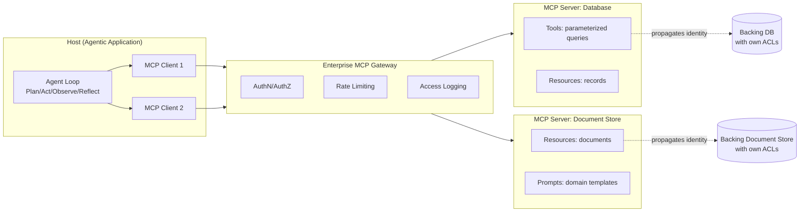
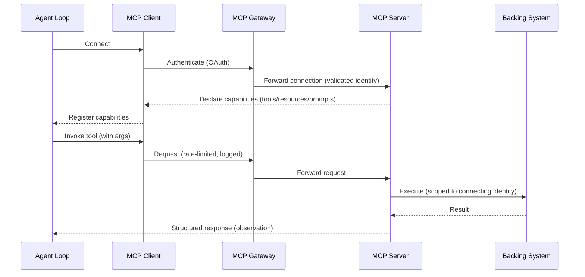
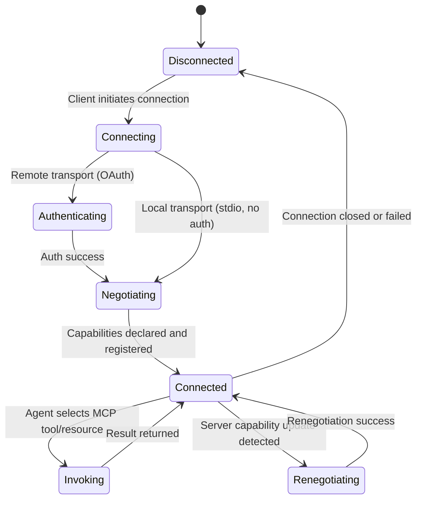

# Model Context Protocol (MCP)

> Part of the **Enterprise Data & AI Architecture Handbook** · Phase-12 — LLMOps & Agentic AI · Chapter 06.
> Estimated study time: **60 min reading + ~4h labs**.
> **Prerequisite:** read [Agentic AI Architecture](05_Agentic_AI_Architecture.md) first.

---

## Executive Summary

[Agentic AI Architecture](05_Agentic_AI_Architecture.md) established that a tool registry (per [Prompt Engineering](02_Prompt_Engineering.md#23-structured-output-and-function-calling) §2.3's function calling, extended to multi-step agentic use) is the mechanism through which an agent takes real-world action, but left one structural problem unaddressed: every application, framework, and vendor historically defined its own bespoke format for describing tools, connecting them to data sources, and exposing reusable prompts — meaning an enterprise building agentic features across multiple frameworks (LangChain, Semantic Kernel, a custom implementation) had to re-implement the same tool integrations, in a different shape, for each one. The Model Context Protocol (MCP) is an open standard, originally introduced by Anthropic and rapidly adopted industry-wide (including by Microsoft across Azure AI Foundry, Semantic Kernel, and GitHub Copilot itself), that solves exactly this fragmentation: a single MCP server implementation exposes an enterprise's tools, data resources, and reusable prompts once, in a standard protocol, consumable by any MCP-compatible client or agent framework.

This chapter covers the **MCP architecture** of hosts, clients, and servers as the three structural roles the protocol defines; **tools, resources, and prompts** as MCP's three primitive capability types a server can expose; the **transport and security model** governing how an MCP client and server actually communicate and authenticate; **building MCP servers for enterprise data** as the practical discipline of exposing an enterprise's own systems (databases, APIs, document stores) through this standard interface; and **MCP vs. proprietary plugin ecosystems** as the architectural and business case for adopting an open, vendor-neutral standard over a single vendor's bespoke tool-integration format.

This chapter's central thesis: MCP does for agentic tool integration what a REST API standard, an ODBC/JDBC driver, or the transformer chat-message role convention (per [Prompt Engineering](02_Prompt_Engineering.md#22-system-vs-user-prompts-and-roles) §2.2) did for their respective domains — it replaces N-times-M bespoke integrations (N tools, M frameworks) with a single, standard interface every tool implements once and every framework consumes once, and every governance, security, and least-privilege-scoping principle established in [Agentic AI Architecture](05_Agentic_AI_Architecture.md) and [Prompt Engineering](02_Prompt_Engineering.md) ADR-0156 applies with undiminished force to an MCP server — MCP standardizes *how* a tool is exposed, it does not relax *what* permissions that tool should carry.

The platform bias is **Azure-primary (~60%)** — Azure AI Foundry's native MCP server/client support and Azure API Management's MCP-gateway capabilities as the primary managed hosting and governance surface for enterprise MCP servers — **~30% enterprise open source** (the MCP specification and reference SDKs themselves are open source; LangChain, LlamaIndex, and Semantic Kernel's MCP-client integrations, carried forward from [Agentic AI Architecture](05_Agentic_AI_Architecture.md#open-source-implementation); PostgreSQL, Redis, and Neo4j as common backing stores an enterprise MCP server fronts) — **~10% AWS/GCP comparison-only** (Amazon Bedrock's MCP support and AWS's MCP server registry efforts; Google's Agent2Agent protocol and Vertex AI's MCP integration, positioned as a complementary rather than competing standard).

**Bottom line:** an enterprise standardizing its tool and data-source integrations on MCP converts what would otherwise be a combinatorial integration burden (every tool re-implemented for every agent framework) into a linear one (every tool implemented once, every framework consuming the same standard) — but MCP is an integration and interoperability standard, not a security or governance mechanism in itself, and every access-control, least-privilege, and injection-defense discipline this handbook has established must still be deliberately applied to every MCP server an enterprise builds or exposes.

---

## Learning Objectives

By the end of this chapter you will be able to:

1. **Explain the MCP host/client/server architecture** and the specific responsibility of each role.
2. **Distinguish MCP's three primitive capability types** (tools, resources, prompts) and select the appropriate primitive for a given integration need.
3. **Evaluate MCP's transport options and security model**, including authentication, authorization, and the specific risks introduced by a standardized, broadly-consumable tool-exposure protocol.
4. **Design and implement an MCP server exposing enterprise data**, applying the least-privilege and governance principles established throughout this handbook.
5. **Compare MCP against a proprietary, vendor-specific plugin ecosystem**, articulating the concrete interoperability and maintenance-cost case for the open standard.
6. **Apply Azure-native tooling** (Azure AI Foundry, Azure API Management) to host and govern enterprise MCP servers.
7. **Defend MCP architecture decisions** in engineer, staff engineer, architect, and CTO review settings, including when a simpler, direct function-calling integration remains the right choice instead of adopting MCP.

---

## Business Motivation

- **Tool-integration fragmentation is a direct, quantifiable engineering cost.** Without a shared standard, an enterprise with multiple agentic features built on different frameworks re-implements the same database connector, the same document-search integration, and the same internal-API wrapper multiple times, in incompatible shapes — MCP's single-implementation-many-consumers model directly eliminates this duplicated cost.
- **A standardized protocol lowers the cost of adopting new agent frameworks or switching between them.** An enterprise not locked into a single vendor's bespoke tool format retains negotiating leverage and architectural flexibility, directly extending the vendor-neutrality and portability considerations already raised throughout [Large Language Model Foundations](01_Large_Language_Model_Foundations.md#15-open-vs-proprietary-models) §1.5 and [LLMOps](04_LLMOps.md#migration-considerations).
- **Centralizing tool and data-source access through governed MCP servers gives security and data-governance teams a single enforcement point**, rather than needing to audit tool-access logic scattered across every individual agentic application — directly extending the centralized-guardrail-platform recommendation from [LLMOps](04_LLMOps.md#enterprise-recommendations) to the tool-integration layer specifically.
- **Broad, standardized tool consumability is also a broader attack surface if governance does not keep pace.** An MCP server, once built, can potentially be discovered and consumed by any MCP-compatible client across the organization — meaning the same least-privilege and access-review discipline from [Prompt Engineering](02_Prompt_Engineering.md) ADR-0156 and [Agentic AI Architecture](05_Agentic_AI_Architecture.md#security) must scale to a genuinely broader population of potential consumers, a governance cost this chapter is explicit about rather than treating standardization as an unqualified security improvement.
- **Enterprise-wide MCP adoption is increasingly a practical interoperability requirement, not merely an efficiency nicety**, as major platform vendors (Microsoft, Anthropic, and an increasing share of the broader agent-tooling ecosystem) converge on MCP as the de facto standard — an enterprise that does not adopt it risks growing integration debt relative to peers who do.

---

## History and Evolution

- **November 2024 — Anthropic introduces the Model Context Protocol** as an open specification for standardizing how LLM applications connect to external tools, data sources, and prompts, directly motivated by the same N-tools-times-M-frameworks integration fragmentation this chapter's Business Motivation names.
- **Late 2024-2025 — rapid, broad industry adoption follows**, with Microsoft integrating MCP support across GitHub Copilot, Semantic Kernel, and Azure AI Foundry, and the open-source agent-framework ecosystem (LangChain, LlamaIndex, and others, per [Agentic AI Architecture](05_Agentic_AI_Architecture.md#open-source-implementation)) adding native MCP-client support — an unusually fast standardization trajectory for a protocol this new, reflecting how acutely the integration-fragmentation problem it solves was already being felt across the industry.
- **2025 — an ecosystem of publicly-available MCP servers emerges** for common developer tools, SaaS platforms, and data sources, giving enterprises a growing library of pre-built integrations to adopt rather than building every server from scratch.
- **2025 — MCP's security model matures beyond its initial specification**, adding stronger authorization patterns (OAuth-based authentication for remote MCP servers) in direct response to early, well-documented security concerns about the initial specification's comparatively lightweight trust model for locally-run servers — a maturation this chapter's §6.3 covers in its current, hardened form.
- **2025 — Google introduces the Agent2Agent (A2A) protocol**, addressing a complementary problem (standardizing communication *between* autonomous agents, rather than between an agent and its tools) — the two protocols are increasingly discussed as complementary layers (MCP for tool/data access, A2A for inter-agent communication) rather than competitors, a distinction this chapter's §6.5 clarifies.
- **2025-present — enterprise MCP governance and gateway tooling matures** (Azure API Management adding native MCP-gateway capabilities, and comparable capabilities emerging across other API-management platforms), reflecting the industry's recognition that MCP's rapid adoption requires the same centralized governance, rate-limiting, and access-control discipline any other enterprise integration surface requires — the direction this chapter's Governance and Enterprise Recommendations sections both point toward.

---

## Why This Technology Exists

MCP exists because the function-calling mechanism established in [Prompt Engineering](02_Prompt_Engineering.md#23-structured-output-and-function-calling) §2.3 defines *how a model requests a tool invocation* within a single API call, but says nothing about *how that tool's definition, its connection to an actual backing system, and any associated reusable prompts or contextual resources get built, packaged, and shared* across multiple different applications and agent frameworks — without a shared standard for that packaging and exposure layer, every team independently re-invents it, in an incompatible shape, for every tool and every framework they use. MCP exists to be that shared packaging and exposure layer: a standard protocol any tool/data-source implementer builds against once (an MCP server) and any agent-framework or application implementer consumes against once (an MCP client), decoupling the N-tools-times-M-frameworks integration problem into an N-plus-M one.

---

## Problems It Solves

- **Duplicated, bespoke tool-integration code across multiple agent frameworks or applications** — a single MCP server implementation is consumable by any MCP-compatible client, directly eliminating the need to re-implement the same database connector or API wrapper per framework.
- **Vendor lock-in to a single agent framework's proprietary tool format** — adopting MCP as the integration standard preserves the enterprise's ability to switch or diversify agent frameworks without re-implementing its entire tool-integration layer, extending the portability considerations from [Large Language Model Foundations](01_Large_Language_Model_Foundations.md#migration-considerations).
- **Inconsistent, scattered tool-access governance across independently-built agentic applications** — centralizing tool exposure through governed MCP servers (per Business Motivation) gives security and governance teams a single enforcement point rather than an audit burden spread across every application independently.
- **Slow onboarding of new data sources or tools into an agentic ecosystem** — a growing library of pre-built, community- or vendor-published MCP servers (per History and Evolution) lets an enterprise adopt a tested integration rather than building one from scratch for common systems.
- **The discoverability gap between "a tool/data source exists somewhere in the enterprise" and "an agent can actually find and correctly use it"** — MCP's structured tool, resource, and prompt primitives (§6.2) give an agent framework a standard way to enumerate and understand what capabilities are actually available from a given server.

---

## Problems It Cannot Solve

- **It cannot make an underlying tool or data source secure, well-governed, or correctly access-controlled by itself.** MCP standardizes *how* a tool is exposed and invoked; it does not enforce least-privilege scoping, data classification, or access control on the underlying system an MCP server fronts — every governance discipline from [Prompt Engineering](02_Prompt_Engineering.md) ADR-0156 and [Agentic AI Architecture](05_Agentic_AI_Architecture.md#security) must still be deliberately applied by whoever builds the server, a point this chapter returns to repeatedly rather than letting "we use MCP" be mistaken for "our tool access is governed."
- **It cannot eliminate the reasoning-quality dependency on tool description quality.** An MCP server exposing a poorly-described tool is exactly as susceptible to the incorrect-tool-selection failure mode named in [Prompt Engineering](02_Prompt_Engineering.md#23-structured-output-and-function-calling) §2.3 and [Agentic AI Architecture](05_Agentic_AI_Architecture.md#52-tool-use-and-function-calling) §5.2 as a bespoke, non-MCP tool definition would be — standardizing the packaging format does not standardize or guarantee the quality of the description content within it.
- **It cannot guarantee interoperability across every possible client/server combination without active version management.** As with any evolving protocol, a client and server implementing different protocol-specification versions can encounter compatibility gaps, requiring the same version-awareness discipline this handbook has applied to every other versioned dependency (per [LLMOps](04_LLMOps.md#41-llm-lifecycle-and-versioning) §4.1's triple-versioning principle, now extended to include MCP server/client version compatibility).
- **It cannot substitute for the same injection-defense discipline tool observations already required.** An MCP tool's returned result is exactly as much untrusted, potentially adversarial input as any other tool observation covered in [Agentic AI Architecture](05_Agentic_AI_Architecture.md#52-tool-use-and-function-calling) §5.2 — MCP's standardization does not make a malicious or compromised MCP server's response inherently trustworthy.
- **It cannot resolve the broader attack-surface expansion that broad tool consumability introduces on its own.** A standard that makes tools more discoverable and more easily consumed by more clients is, by the same token, more broadly reachable by a compromised or misconfigured client — this chapter's Security section names this trade-off directly rather than presenting standardization as a purely positive security development.

---

## Core Concepts

### 6.1 MCP Architecture: Hosts, Clients, Servers

- **A host** is the user-facing application that embeds an LLM and orchestrates the overall interaction — for example, an IDE with an integrated coding assistant, or a standalone agentic application built on [Agentic AI Architecture](05_Agentic_AI_Architecture.md)'s agent loop — responsible for managing one or more client connections and ultimately presenting results to the end user.
- **A client** lives within the host and maintains a one-to-one connection to a specific MCP server, handling the protocol-level communication (requests, responses, capability negotiation) on the host's behalf — a host may maintain multiple clients simultaneously, each connected to a different server exposing a different set of capabilities.
- **A server** exposes a specific set of tools, resources, and prompts (§6.2) to any connecting client, typically implemented as a thin integration layer in front of an actual backing system (a database, an internal API, a document store, per §6.4) — a server has no direct knowledge of the LLM or the broader agentic task it is being invoked as part of, it simply responds to the standardized protocol requests a connected client sends it.
- **This three-role separation is what makes MCP's single-implementation-many-consumers model work**: a server implementer needs to know nothing about which host or agent framework will eventually consume their server, and a host/client implementer needs to know nothing about a given server's internal implementation — both sides only need to correctly implement the shared protocol, the same decoupling principle a REST API or a database driver standard provides in their respective domains.
- **A given agentic system (per [Agentic AI Architecture](05_Agentic_AI_Architecture.md#architecture)) typically plays the host/client role, connecting to one or more MCP servers** as its tool-and-resource-access layer — meaning this chapter's architecture is a direct, standardized implementation of the tool-registry and tool-execution layer [Agentic AI Architecture](05_Agentic_AI_Architecture.md#components) already established as a necessary agentic-system component.

### 6.2 Tools, Resources, and Prompts

- **Tools** are the invokable, action-taking primitive — directly analogous to the function-calling mechanism from [Prompt Engineering](02_Prompt_Engineering.md#23-structured-output-and-function-calling) §2.3, now packaged in MCP's standard format: a tool has a name, a description, and a JSON-Schema-defined argument signature, and invoking it causes the server to execute some action against its backing system and return a result — an MCP tool is functionally the same concept as the tool registry entries covered in [Agentic AI Architecture](05_Agentic_AI_Architecture.md#52-tool-use-and-function-calling) §5.2, now exposed through a standardized, cross-framework-consumable protocol rather than a framework-specific format.
- **Resources** are addressable, read-only pieces of context a server exposes — a specific document, a database record, a configuration value — that a client can retrieve and supply to the model as context, conceptually similar to the retrieved-passage content [Retrieval Augmented Generation](03_Retrieval_Augmented_Generation.md#31-rag-architecture-and-components) §3.1 assembles into a prompt, but exposed through MCP's standard resource-addressing mechanism rather than a bespoke retrieval pipeline — a server can expose a static resource or a dynamically-generated one (e.g., the current contents of a specific file, refreshed on each request).
- **Prompts** are reusable, server-defined prompt templates a client can retrieve and populate with its own parameters — directly extending the prompt-template-as-versioned-artifact discipline from [Prompt Engineering](02_Prompt_Engineering.md#24-prompt-templates-and-versioning) §2.4, now allowing a server (which may have deeper domain expertise about its own backing system than the consuming client/host does) to publish a well-engineered prompt template for interacting with its specific domain, rather than requiring every consuming application to independently re-engineer an equivalent prompt.
- **Choosing the correct primitive for a given integration need is itself a design decision**: exposing a read-only piece of context as a resource (rather than as a tool the model must explicitly decide to call) can be more efficient when the context is broadly needed regardless of the specific query, while exposing an action or a conditionally-needed piece of information as a tool preserves the model's ability to decide, per its own reasoning, whether and when retrieving it is actually necessary — this decision should be made deliberately per capability, not defaulted to "everything is a tool" or "everything is a resource."
- **Capability negotiation** — the process by which a client, upon connecting to a server, discovers exactly which tools, resources, and prompts that specific server exposes — is a core part of the protocol's design, letting a host/client dynamically adapt to whatever capability set a given server actually provides rather than requiring the client to have hardcoded, advance knowledge of every server's specific capabilities.

### 6.3 Transport and Security Model

- **MCP supports multiple transport mechanisms**: local, same-machine communication (typically via standard input/output, `stdio`) for a server running directly alongside its host — the common pattern for developer-tooling integrations — and remote, network-based communication (typically HTTP with server-sent events for streaming) for a server hosted as a separate, potentially shared network service, the pattern relevant for a centrally-governed enterprise MCP server.
- **A locally-run (`stdio`-transport) server executes with the same privileges as the host application itself**, meaning the trust boundary is effectively the same as installing and running any other local application — this makes local server provenance and supply-chain trust (per [Security Foundations](../Phase-10/01_Security_Foundations.md)'s general software-supply-chain concerns) a directly relevant MCP-specific security consideration, not a theoretical one, since a malicious local MCP server has essentially the same access as the host process itself.
- **A remote (network-transport) server requires an explicit authentication and authorization model**, and MCP's specification has matured to support OAuth-based authentication for exactly this scenario — an enterprise-hosted MCP server exposed over the network should require the same identity-and-access-management rigor established in [Identity and Access Management with Entra](../Phase-10/02_Identity_and_Access_Management_with_Entra.md), never relying on an implicit trust model appropriate only for a local, same-machine server.
- **A remote MCP server's own permission scope must still follow the least-privilege principle from [Prompt Engineering](02_Prompt_Engineering.md) ADR-0156 and [Agentic AI Architecture](05_Agentic_AI_Architecture.md#52-tool-use-and-function-calling) §5.2** — MCP's authentication model determines *who or what can connect to the server at all*; it is a separate, additional concern from *what that server is permitted to do once connected*, and both must be deliberately scoped, not conflated.
- **A compromised or malicious MCP server is a genuine, documented risk class** distinct from a compromised tool observation covered in [Agentic AI Architecture](05_Agentic_AI_Architecture.md#security) — since a server can, in principle, be published by any party and consumed by any MCP-compatible client, an enterprise must apply the same software-supply-chain vetting to a third-party or community-published MCP server before connecting to it that it would apply to any other third-party dependency, per [Security Foundations](../Phase-10/01_Security_Foundations.md)'s software-supply-chain discipline.

### 6.4 Building MCP Servers for Enterprise Data

- **An enterprise MCP server is, in most cases, a thin protocol-translation layer in front of an existing, already-governed system** — a database (exposing specific, parameterized queries as tools, or specific records as resources), an internal REST API, or a document-retrieval pipeline (per [Retrieval Augmented Generation](03_Retrieval_Augmented_Generation.md)) — meaning the server implementation itself should carry forward, not re-derive, that backing system's existing access-control model.
- **Least-privilege tool design applies to MCP server authoring with the same force as any other tool registry** (per [Prompt Engineering](02_Prompt_Engineering.md) ADR-0156): an MCP server exposing a database should expose narrowly-scoped, parameterized query tools (e.g., "look up order status by order ID for the authenticated user's own orders") rather than a broad, unscoped "run arbitrary SQL" tool — the latter pattern reintroduces exactly the overprivileged-function risk this handbook has repeatedly warned against, now packaged behind a standard protocol rather than mitigated by it.
- **Authentication and authorization must be propagated through the server, not bypassed by it** — an enterprise MCP server fronting a system with per-user access controls (e.g., a document store with differentiated permissions, per [Retrieval Augmented Generation](03_Retrieval_Augmented_Generation.md) ADR-0157) must carry the connecting user's or agent's actual identity and permission scope through to the backing system's own access-control check, exactly mirroring the access-control-propagation requirement established there for a retrieval index — an MCP server that authenticates the connection but then queries its backing system with a privileged service identity regardless of the connecting user's actual permissions reintroduces the exact access-control-leak risk that ADR was designed to prevent.
- **Resource and prompt design for an enterprise MCP server benefits from the same versioning and evaluation discipline established in [LLMOps](04_LLMOps.md#41-llm-lifecycle-and-versioning) §4.1** — a server's exposed prompt templates and resource-generation logic are versioned, evaluable artifacts in their own right, and a server change (a modified tool description, a changed resource format) should be evaluated for its downstream impact on every consuming client before being deployed to a shared, multi-consumer server.
- **Observability and rate-limiting must be built into an enterprise MCP server from the start**, extending [LLMOps](04_LLMOps.md#42-promptresponse-logging-and-tracing) §4.2's tracing discipline to cover MCP-specific request/response spans, and [LLMOps](04_LLMOps.md#43-cost-controls-caching-and-routing) §4.3's rate-limiting discipline to protect a shared server from being overwhelmed by any single consuming client or agent — a genuinely important consideration once a server is consumed by multiple, independently-operated agentic applications simultaneously, a usage pattern MCP's standardization specifically encourages.

### 6.5 MCP vs. Proprietary Plugin Ecosystems

- **A proprietary plugin ecosystem (a single vendor's bespoke tool-integration format, specific to one agent framework or platform) optimizes for depth of integration within that one platform**, at the cost of requiring a separate, incompatible integration effort for every other platform the enterprise also uses — the direct N-tools-times-M-frameworks cost this chapter's Business Motivation and Problems It Solves both name.
- **MCP optimizes for breadth of interoperability across the growing ecosystem of MCP-compatible hosts and frameworks**, at the cost of a comparatively thinner, more generic integration surface than a deeply platform-specific plugin format might offer for a single platform's most advanced, platform-unique capabilities — a genuine trade-off, not a strictly-dominant choice in every dimension.
- **The realistic enterprise decision is rarely "MCP or nothing"** — an enterprise already invested in a specific platform's proprietary plugin ecosystem for a mature, deeply-integrated existing capability may reasonably continue using it there, while adopting MCP as the default for new tool integrations and for any capability intended to be consumed across multiple frameworks or platforms — the same incremental-adoption, not big-bang-migration, pattern this handbook has recommended for other standardization efforts (e.g., [DevOps and CI/CD](../Phase-09/03_DevOps_and_CI_CD.md)'s trunk-based migration guidance).
- **MCP and Google's Agent2Agent (A2A) protocol address complementary, not competing, layers**: MCP standardizes how an individual agent connects to its tools and data sources; A2A standardizes how multiple autonomous agents communicate and delegate tasks between each other (a distinct concern from [Agentic AI Architecture](05_Agentic_AI_Architecture.md#54-multi-agent-orchestration) §5.4's multi-agent orchestration patterns) — an enterprise building a multi-agent system may reasonably adopt both protocols for their respective, non-overlapping purposes rather than treating them as mutually exclusive choices.
- **The business case for MCP over a proprietary alternative strengthens with the number of distinct agent frameworks or platforms an enterprise actually operates** — an organization genuinely committed to a single vendor's platform for the foreseeable future has a weaker interoperability argument for MCP adoption than a multi-platform enterprise does, though the growing industry-wide convergence on MCP (per History and Evolution) means even a single-platform-committed enterprise increasingly benefits from the growing ecosystem of pre-built MCP servers regardless of its own internal framework choices.

---

## Internal Working

**How an MCP client actually discovers and invokes a server's capabilities** (the mechanics underlying §6.1-§6.2, and the process every enterprise MCP integration this chapter covers is built on):

1. **Connection and capability negotiation**: a client establishes a connection to a server (via `stdio` for a local server or an authenticated network connection for a remote one, per §6.3), and the server responds with its declared capabilities — the specific tools, resources, and prompts it exposes, each with its name, description, and schema.
2. **Capability registration in the host's context**: the connecting host/agent (per [Agentic AI Architecture](05_Agentic_AI_Architecture.md#architecture)) registers the discovered tools alongside any other tools already in its registry (per [Agentic AI Architecture](05_Agentic_AI_Architecture.md#52-tool-use-and-function-calling) §5.2), and any discovered resources or prompts become available for the agent to retrieve or use as needed.
3. **Agent planning incorporates the discovered capabilities**: during the agent loop's plan step (per [Agentic AI Architecture](05_Agentic_AI_Architecture.md#51-agent-loops-plan-act-observe-reflect) §5.1), the model reasons over the full available tool/resource/prompt set — including those sourced from one or more connected MCP servers — exactly as it would over any other tool in its registry, with no structural distinction visible to the model between an MCP-sourced tool and a natively-defined one.
4. **Invocation**: when the agent selects an MCP-sourced tool (or requests an MCP-sourced resource), the client sends the corresponding protocol request to the appropriate server, which executes the request against its backing system (subject to whatever authentication/authorization the connection carries, per §6.3) and returns a structured result.
5. **Observation and continued reasoning**: the returned result is incorporated into the agent's working memory as an observation (per [Agentic AI Architecture](05_Agentic_AI_Architecture.md#internal-working) Internal Working step 4), subject to the same injection-defense scrutiny as any other tool observation.
6. **Connection lifecycle management**: the client maintains its connection to each server for the duration of the host's session (or the specific task requiring that server's capabilities), handling reconnection, capability re-negotiation on server updates, and graceful degradation if a server becomes unavailable (per this chapter's Fault Tolerance section).

This sequence is why MCP integrates transparently into the agent-loop architecture from [Agentic AI Architecture](05_Agentic_AI_Architecture.md) — from the model's own reasoning perspective, an MCP-sourced tool is indistinguishable from any other tool in its registry; MCP's value is entirely in *how that tool got into the registry and how it is invoked under the hood*, not in any change to the agent's own planning and reasoning process.

---

## Architecture

- **Host/client layer**: the agentic application (per [Agentic AI Architecture](05_Agentic_AI_Architecture.md#architecture)) embedding one or more MCP clients, each maintaining a connection to a specific MCP server.
- **Server layer**: one or more MCP servers, each exposing a specific backing system's tools, resources, and prompts (§6.2) through the standard protocol.
- **Transport layer**: `stdio` for local servers, or an authenticated HTTP/SSE connection for remote, centrally-governed servers (§6.3).
- **Gateway/governance layer**: for enterprise deployment, a centralized MCP gateway (Azure API Management's MCP-gateway capabilities) enforcing authentication, rate-limiting, and access logging across every server a given consumer connects to, directly extending [LLMOps](04_LLMOps.md#architecture)'s gateway-layer pattern to the MCP-specific transport.
- **Backing-system layer**: the actual database, API, or document store an MCP server fronts, retaining its own existing access-control and governance model, which the server must propagate rather than bypass (§6.4).

---

## Components

- **MCP server implementation** — the protocol-compliant service exposing a specific backing system's tools, resources, and prompts.
- **MCP client library** — the protocol-compliant library embedded in a host application, handling connection, capability negotiation, and request/response mechanics.
- **Transport connector** — `stdio` process management for local servers, or an HTTP/SSE client for remote servers.
- **Authentication/authorization provider** — for a remote server, an OAuth-based identity provider (Microsoft Entra ID, per [Identity and Access Management with Entra](../Phase-10/02_Identity_and_Access_Management_with_Entra.md)) issuing and validating the credentials a client presents.
- **MCP gateway** (enterprise deployments) — a centralized enforcement point for rate-limiting, access logging, and server discovery across an organization's MCP server portfolio.
- **Backing system** — the database, API, or document store the server ultimately queries or acts upon, retaining its own native access-control model.

---

## Metadata

- **Server capability metadata**: the declared set of tools, resources, and prompts a server exposes, including each tool's schema and description (§6.2) — the concrete data a client's capability-negotiation step (Internal Working step 1) discovers and registers.
- **Connection and authentication metadata**: which identity or credential a client presented when connecting to a remote server, and the specific permission scope that credential carries (§6.3) — essential for the access-control-propagation auditing this chapter's §6.4 requires.
- **Per-invocation metadata**: which tool/resource was invoked, by which connected client, with what arguments, and the resulting response — extending [Agentic AI Architecture](05_Agentic_AI_Architecture.md#metadata)'s tool-invocation metadata to the MCP-specific request/response shape.
- **Server-version metadata**: the specific protocol-specification version and server-implementation version a given server runs, needed to diagnose a client/server compatibility gap (per Problems It Cannot Solve).

---

## Storage

- **MCP server implementations themselves are typically stateless or thin-state**, with the actual data residing in the backing system they front (§6.4) — meaning MCP introduces no new primary data-storage requirement of its own beyond what the backing system already requires.
- **Capability schemas, connection logs, and per-invocation audit records** should be stored with the same retention and access-control discipline as any other API-gateway or tool-invocation log (per [LLMOps](04_LLMOps.md#storage) and [Agentic AI Architecture](05_Agentic_AI_Architecture.md#storage)).
- **A published, community, or third-party MCP server's source and provenance information** should itself be tracked as governed software-supply-chain metadata (per [Security Foundations](../Phase-10/01_Security_Foundations.md)) before the enterprise adopts and connects to it.

---

## Compute

- **An MCP server's own compute footprint is typically lightweight** — a thin protocol-translation layer — with the actual compute cost residing in whatever backing system or downstream LLM call the server's tool invocations ultimately trigger, mirroring the tool-execution compute concern already established in [Agentic AI Architecture](05_Agentic_AI_Architecture.md#compute).
- **A centralized MCP gateway (enterprise deployments) must scale its own compute to the aggregate connection and request volume across every consuming client and every fronted server**, a genuinely additive compute and capacity-planning consideration once MCP adoption scales across many agentic applications simultaneously.

---

## Networking

- **Local (`stdio`-transport) servers require no network communication at all**, operating entirely within the host's own process boundary — the simplest and, per §6.3, most trust-permissive deployment model.
- **Remote (network-transport) servers require the same private-networking, access-controlled posture established in [Network Security and Zero Trust](../Phase-10/04_Network_Security_and_Zero_Trust.md)** — an enterprise MCP server exposed over the network should sit behind a private endpoint and the centralized gateway (per Architecture above), never exposed with unauthenticated public network access.

---

## Security

- **This chapter's central, recurring security caution: MCP standardizes tool exposure, it does not itself provide security** — every least-privilege, authentication, and injection-defense discipline established in [Prompt Engineering](02_Prompt_Engineering.md) ADR-0156, [Agentic AI Architecture](05_Agentic_AI_Architecture.md#security), and [Retrieval Augmented Generation](03_Retrieval_Augmented_Generation.md) ADR-0157 must be deliberately, explicitly applied by whoever builds and operates a given MCP server, and adopting the protocol itself confers no security benefit on its own.
- **A locally-run MCP server executes with the host's own privileges** (§6.3), meaning the same software-supply-chain vetting applied to any other locally-installed dependency (per [Security Foundations](../Phase-10/01_Security_Foundations.md)) must be applied before adopting a third-party or community-published local MCP server — a malicious local server is not a sandboxed, limited-privilege risk, it is effectively equivalent to running arbitrary code with the host application's own access.
- **Access-control propagation from a server's backing system through to the server's actual query execution** (§6.4) is this chapter's most consequential, distinctive security requirement — a server that authenticates the connecting client but then executes backing-system queries under a privileged, unscoped service identity regardless of that client's actual permission reintroduces the exact access-control-leak pattern [Retrieval Augmented Generation](03_Retrieval_Augmented_Generation.md) ADR-0157 was designed to prevent, now at the tool-invocation layer rather than the retrieval-index layer.
- **A broadly-discoverable, standard-protocol tool surface is, by construction, more broadly reachable than a bespoke one** — this is a genuine, named trade-off (per Problems It Cannot Solve), meaning an enterprise's MCP-server access-review cadence must scale to match the genuinely larger population of potential consumers a standardized, broadly-interoperable protocol enables, rather than assuming the same review cadence appropriate for a single bespoke integration still suffices.
- **Tool results returned by an MCP server remain untrusted observations** requiring the same injection-defense scrutiny established in [Agentic AI Architecture](05_Agentic_AI_Architecture.md#52-tool-use-and-function-calling) §5.2 — MCP's standardized packaging does not make a compromised or maliciously-crafted server response any less capable of attempting to manipulate a consuming agent's subsequent reasoning.

---

## Performance

- **Local (`stdio`-transport) server invocation latency is typically negligible**, comparable to an in-process function call, given the absence of network round-trip overhead.
- **Remote server invocation latency includes network round-trip time in addition to the server's own processing time**, adding to the overall agent-loop latency profile established in [Agentic AI Architecture](05_Agentic_AI_Architecture.md#performance) — a consideration for any latency-sensitive agentic feature relying on remote MCP servers for tool invocation.
- **A centralized MCP gateway adds a modest additional latency hop** for authentication, rate-limiting, and logging (per Architecture above), a trade-off directly analogous to the gateway-overhead consideration already established in [LLMOps](04_LLMOps.md#performance) for the general API-gateway layer.

---

## Scalability

- **A shared, centrally-hosted enterprise MCP server must scale its throughput to the aggregate request volume across every consuming agentic application**, a genuinely different capacity-planning profile than a bespoke, single-application tool integration that only ever serves one consumer's request volume.
- **MCP's standard protocol makes horizontal scaling of a given server comparatively straightforward** (multiple stateless server instances behind a load balancer, mirroring any other stateless API service's scaling pattern), provided the server implementation itself is designed statelessly per Storage above.
- **The MCP gateway/governance layer must scale its own capacity to the growing number of distinct servers and consuming clients** as enterprise-wide MCP adoption expands, the same portfolio-wide governance-capacity concern raised throughout this handbook for other shared platform capabilities (per [Prompt Engineering](02_Prompt_Engineering.md#scalability) and [LLMOps](04_LLMOps.md#scalability)).

---

## Fault Tolerance

- **A client's connection to an MCP server can fail or become unavailable**, and a well-designed host/agent should treat this the same way it treats any other tool-invocation failure covered in [Agentic AI Architecture](05_Agentic_AI_Architecture.md#fault-tolerance) — incorporating the failure as an observation and revising its plan (retry, fall back to an alternative tool, or report an inability to proceed), rather than the entire agentic task crashing outright.
- **A server-side capability change (a tool's schema or description updated) requires the client to re-negotiate capabilities** rather than continuing to operate against stale, cached capability information — a version-mismatch fault-tolerance concern directly extending [LLMOps](04_LLMOps.md#41-llm-lifecycle-and-versioning) §4.1's versioning discipline to MCP server updates specifically.
- **A centralized MCP gateway outage should have a defined fallback** — for a critical tool integration, this may mean a direct, gateway-bypassing fallback connection path with reduced governance visibility accepted as a deliberate, reviewed trade-off for availability, or simply an accepted, monitored degradation of that specific capability until the gateway is restored, per a risk-tiered decision matching the tool's actual criticality.

---

## Cost Optimization (FinOps)

- **MCP itself introduces no new direct inference cost** — the underlying LLM call cost is unaffected by whether a given tool was sourced via MCP or a bespoke integration; MCP's cost impact is entirely in engineering-effort savings (per Business Motivation's N-plus-M vs. N-times-M framing), not per-request inference economics.
- **Consolidating tool integrations onto shared, reusable MCP servers reduces duplicated engineering and maintenance cost** across multiple agentic applications, the direct, measurable FinOps case for MCP adoption at an organizational level, distinct from any individual feature's own per-request cost optimization.
- **A centralized MCP gateway's own operating cost** (compute, licensing where applicable) should be weighed against the aggregate duplicated-integration cost it eliminates — a straightforward build-vs-avoid-duplication calculation once an enterprise operates more than a small handful of agentic applications and tool integrations.

---

## Monitoring

- **Per-server request volume, latency, and error rate**, extending [LLMOps](04_LLMOps.md#monitoring)'s per-request monitoring to the MCP-specific transport and server layer.
- **Capability-negotiation failure and version-mismatch rate**, surfacing client/server compatibility gaps proactively (per Fault Tolerance above) before they manifest as a broader agentic-task failure.
- **Per-consumer access patterns against each shared MCP server**, a governance-relevant monitoring signal distinct from raw performance metrics, letting a security review identify an unexpected or newly-onboarded consumer accessing a server's capabilities.

---

## Observability

- **Full request tracing spanning the host/client's agent-loop trace and the connected MCP server's own request-handling span**, extending the distributed-tracing discipline established in [LLMOps](04_LLMOps.md#42-promptresponse-logging-and-tracing) §4.2 and [Agentic AI Architecture](05_Agentic_AI_Architecture.md#observability) across the MCP transport boundary specifically, letting an engineer diagnose whether a latency or correctness issue originated in the agent's own reasoning or in a specific connected server's response.
- **A unified view of every MCP server's consumer population, request volume, and capability-negotiation health** gives platform and security stakeholders one authoritative source for "which servers are actually in use, by whom, and how reliably," directly supporting the access-review cadence this chapter's Security section calls for.

### Operational Response Playbook

| Signal | Detection Query/Check | Remediation |
|---|---|---|
| **A previously-unknown or unreviewed consumer begins connecting to a governed enterprise MCP server** | Per-server consumer-access log, alerting on a new client identity or application connecting for the first time | Verify the new consumer's access was actually authorized and reviewed per this chapter's access-review cadence before allowing continued access; if unauthorized, revoke the connection and investigate how it was established |
| **A server's capability-negotiation failure or version-mismatch rate rises after a server-side update** | Capability-negotiation failure rate, segmented by server and by consumer client version | Roll back the server update or coordinate a client-version update across affected consumers, applying the same atomic-versioned-rollback discipline established in [LLMOps](04_LLMOps.md) ADR-0158 to this chapter's client/server version-pairing specifically |

---

## Governance

- **Every enterprise MCP server requires a documented owner, a declared least-privilege permission scope, and a recorded access-control-propagation design** (§6.4) before being connected to any production agentic application, extending the tool-registry governance discipline from [Prompt Engineering](02_Prompt_Engineering.md#governance) and [Agentic AI Architecture](05_Agentic_AI_Architecture.md#governance) to this chapter's standardized protocol layer.
- **Third-party or community-published MCP servers require the same software-supply-chain review as any other external dependency** (per [Security Foundations](../Phase-10/01_Security_Foundations.md)) before an enterprise connects to and trusts them, particularly for a locally-run server executing with the host's own privileges (§6.3).
- **A centralized registry of approved, governed enterprise MCP servers** (analogous to an internal package or API registry) should be the default discovery mechanism for teams building new agentic features, rather than each team independently sourcing or building ad hoc, unreviewed servers.
- **Access reviews for a shared, broadly-consumable MCP server must occur on a cadence proportionate to its actual consumer population's growth** (per Security above), not the same fixed cadence appropriate for a narrowly-scoped, single-consumer bespoke integration.

---

## Trade-offs

- **Interoperability and reuse vs. depth of platform-specific integration**: MCP's standard, cross-framework interface trades some of the deepest, most platform-unique integration capability a proprietary plugin format might offer for a single platform, in exchange for broad reusability across every MCP-compatible framework (§6.5).
- **Broad discoverability and consumability vs. a larger, harder-to-govern attack surface**: the same standardization that makes a tool easy to find and reuse across the enterprise also makes it more broadly reachable by more potential consumers, requiring a correspondingly scaled-up access-review discipline (Security, Governance) rather than assuming standardization is a purely positive security development.
- **Local (`stdio`) simplicity and low latency vs. remote (networked) governability and shared reuse**: a local server is simpler to deploy and faster to invoke, at the cost of running with the host's full privileges and being harder to centrally govern across many independent host installations; a remote, gatewayed server is more governable and reusable, at the cost of network latency and the operational overhead of running a shared service.
- **Adopting MCP for new integrations vs. maintaining an existing, mature proprietary plugin investment**: a big-bang migration of a deeply-integrated, already-working proprietary plugin to MCP is rarely justified purely for standardization's sake — the incremental-adoption pattern (new integrations on MCP, existing mature ones left as-is until a natural refactor point) typically has the better cost/benefit profile.

---

## Decision Matrix

| Scenario | Recommended Approach | Rationale |
|---|---|---|
| A new tool integration intended for reuse across multiple agent frameworks or applications | Build as an MCP server from the start | Directly captures MCP's core interoperability and reuse benefit |
| A single, deeply platform-specific integration with no near-term multi-framework reuse need | A proprietary/native plugin format may remain acceptable, especially if already mature | The interoperability benefit is weaker when there is genuinely only one consumer platform |
| An enterprise data source with differentiated per-user access controls (e.g., a document store, a customer database) | MCP server with explicit access-control propagation from the connecting identity through to the backing system's own permission check | Directly extends the access-control-propagation requirement from RAG ADR-0157 to this chapter's tool layer |
| Adopting a third-party or community-published MCP server | Full software-supply-chain review before adoption, especially for a locally-run server | A local server runs with the host's own privileges; provenance and trust must be established first |
| A multi-agent system requiring both tool access and inter-agent communication | MCP for tool/data access, Agent2Agent (or an equivalent) for inter-agent communication | The two protocols address complementary, non-overlapping layers, per §6.5 |

---

## Design Patterns

- **Server-per-backing-system**, exposing each distinct backing system (a specific database, a specific internal API) through its own dedicated MCP server with a narrowly-scoped tool set, rather than one monolithic server exposing many unrelated systems.
- **Access-control propagation through the server**, carrying the connecting client's actual identity and permission scope through to the backing system's own access-control check, never substituting a privileged service identity for the actual connecting user's scope (§6.4).
- **Centralized gateway for shared, enterprise-wide servers**, applying rate-limiting, authentication, and access logging at a single enforcement point rather than duplicated per consuming application (Architecture, Governance).
- **Incremental MCP adoption**, defaulting new tool integrations to MCP while leaving a mature, already-working proprietary integration in place until a natural refactor point, rather than a disruptive big-bang migration (§6.5, Trade-offs).

---

## Anti-patterns

- **Building an MCP server that exposes a broad, unscoped "run arbitrary query" tool "for flexibility,"** reintroducing the exact overprivileged-function risk [Prompt Engineering](02_Prompt_Engineering.md) ADR-0156 was designed to prevent, now packaged behind a standard protocol.
- **Authenticating a connecting client but then executing all backing-system operations under one privileged service identity regardless of that client's actual permissions**, reintroducing the access-control-leak pattern [Retrieval Augmented Generation](03_Retrieval_Augmented_Generation.md) ADR-0157 was designed to prevent.
- **Adopting a third-party or community-published MCP server without any software-supply-chain review**, treating protocol standardization as if it were equivalent to a security or trust guarantee, which it is not.
- **Treating "we adopted MCP" as itself a completed security or governance milestone**, rather than recognizing MCP as an interoperability standard that still requires every access-control and least-privilege decision this handbook has established to be made deliberately, per server.
- **Building a separate, incompatible MCP server for every consuming application** rather than a single shared, reusable one — missing MCP's core interoperability benefit and effectively reverting to the pre-MCP fragmentation this protocol exists to solve.

---

## Common Mistakes

- Assuming a locally-run MCP server is inherently lower-risk than a remote one, when in fact it runs with the host's full privileges and warrants at least as much supply-chain scrutiny.
- Failing to re-negotiate capabilities after a server-side update, causing a client to operate against stale, mismatched tool schemas.
- Building a new, redundant MCP server for a capability an existing, already-governed server already exposes, due to poor internal discoverability of the approved server registry.
- Neglecting to scale access-review cadence as a shared server's consumer population grows, applying a review frequency appropriate for a narrow, single-consumer integration to a now-broadly-consumed one.
- Conflating "the connection is authenticated" with "the requested operation is authorized," omitting the actual permission-scope check against the connecting identity's real access rights.

---

## Best Practices

- Design every MCP server's tool set with the same least-privilege scoping rigor as any other function/tool registry, never exposing a broad, unscoped capability for convenience.
- Propagate the connecting client's actual identity and permission scope through to the backing system's own access-control check, without exception.
- Maintain a centralized, discoverable registry of approved enterprise MCP servers, directing new integration work toward reuse rather than redundant server proliferation.
- Apply the same software-supply-chain review to any third-party or community-published MCP server as to any other external dependency, with particular rigor for locally-run servers.
- Scale access-review cadence to a server's actual, growing consumer population rather than a fixed, one-size-fits-all review frequency.

---

## Enterprise Recommendations

- Standardize on MCP as the default integration pattern for any new tool or data-source integration intended for reuse across more than one agentic application or framework, per this chapter's Decision Matrix.
- Operate a centralized MCP gateway (Azure API Management's MCP-gateway capabilities) and a governed server registry as shared platform infrastructure, rather than allowing each team to independently host and expose its own ungoverned servers.
- Require a documented least-privilege scoping and access-control-propagation review as a non-negotiable pre-launch gate for every enterprise MCP server, mirroring the tool-registry governance already established in [Prompt Engineering](02_Prompt_Engineering.md) and [Agentic AI Architecture](05_Agentic_AI_Architecture.md).
- Maintain a supply-chain vetting process for any third-party or community-published MCP server before enterprise adoption, treating this exactly as rigorously as any other external software dependency review.

---

## Azure Implementation

- **Azure AI Foundry's native MCP server and client support**, integrating directly with the Agent Service covered in [Agentic AI Architecture](05_Agentic_AI_Architecture.md#azure-implementation).
- **Azure API Management's MCP-gateway capabilities**, extending its existing AI-gateway functionality (per [LLMOps](04_LLMOps.md#azure-implementation)) to MCP-specific authentication, rate-limiting, and access logging for centrally-governed enterprise servers.
- **Microsoft Entra ID** as the OAuth-based identity provider for remote MCP server authentication, per [Identity and Access Management with Entra](../Phase-10/02_Identity_and_Access_Management_with_Entra.md).
- **Semantic Kernel and GitHub Copilot's native MCP integration**, giving Azure-centric development teams built-in MCP-client capability without a separate integration effort.

---

## Open Source Implementation

- **The MCP specification and reference SDKs** (Anthropic's open-source release) as the foundational, cloud-agnostic protocol implementation every server and client builds against.
- **LangChain, LlamaIndex, and Semantic Kernel's MCP-client integrations**, carried forward from [Agentic AI Architecture](05_Agentic_AI_Architecture.md#open-source-implementation), providing framework-native MCP consumption without bespoke integration code.
- **PostgreSQL, Redis, and Neo4j** as common backing stores an enterprise MCP server fronts, carried forward from [Retrieval Augmented Generation](03_Retrieval_Augmented_Generation.md#open-source-implementation) and [Agentic AI Architecture](05_Agentic_AI_Architecture.md#open-source-implementation).
- **The growing community ecosystem of publicly-published MCP servers** for common developer tools and SaaS platforms, usable as a starting point (subject to the supply-chain review discipline in Governance) rather than building every integration from scratch.

---

## AWS Equivalent (comparison only)

- **Amazon Bedrock's MCP support and AWS's emerging MCP server registry efforts** provide a comparable managed hosting and discovery capability within the AWS ecosystem.
- **Advantages**: tight integration for AWS-centric teams, consistent with the parallel comparisons throughout this handbook.
- **Disadvantages**: since MCP itself is an open, cloud-agnostic protocol, the primary difference here is in the surrounding managed-hosting and gateway tooling rather than the protocol itself — a comparatively smaller platform-lock-in concern than for a fully proprietary capability.
- **Migration strategy**: MCP servers themselves are inherently portable across clouds since the protocol is vendor-neutral; only the surrounding gateway/hosting infrastructure requires re-platforming.
- **Selection criteria**: choose AWS's MCP-hosting tooling when the broader cloud estate is AWS-centric; the underlying MCP servers themselves remain reusable regardless of this choice.

---

## GCP Equivalent (comparison only)

- **Google's Vertex AI MCP integration, alongside the complementary Agent2Agent (A2A) protocol**, provides the equivalent tool-integration capability within the Vertex AI ecosystem.
- **Advantages**: strong integration for GCP-centric teams, and native support for A2A where inter-agent communication (per §6.5) is also a requirement.
- **Disadvantages**: as with AWS, a comparatively smaller platform-lock-in concern than for other, fully proprietary capabilities, since MCP itself remains cloud-agnostic.
- **Migration strategy**: as with AWS, MCP servers themselves port with minimal friction; the surrounding managed-hosting tooling requires re-platforming.
- **Selection criteria**: choose the Vertex AI stack when the data/ML estate is GCP-centric, particularly when A2A's inter-agent-communication capability is also needed.

---

## Migration Considerations

- **MCP servers themselves are inherently the most portable artifact this chapter covers**, since MCP is an open, cloud-agnostic protocol — a well-built server migrates across Azure, AWS, or GCP hosting with minimal rework, provided its backing-system connection details are appropriately re-pointed.
- **Platform-native gateway and governance tooling (Azure API Management's MCP-gateway capabilities, AWS's or GCP's equivalents) do not transfer as-is**, requiring reimplementation of rate-limiting, authentication-integration, and access-logging configuration against the target platform.
- **Authentication/authorization integration must be re-validated, not merely copied, after a migration**, confirming the target platform's identity provider correctly enforces the same access-control-propagation behavior (§6.4) established on the source platform.
- **A migrating enterprise's existing proprietary plugin investments (§6.5) are, by definition, the least portable artifacts in this space**, requiring a deliberate re-implementation decision (migrate to MCP now, or continue maintaining the proprietary format on the new platform if an equivalent exists there) rather than assuming a like-for-like transfer.

---

## Mermaid Architecture Diagrams

---

## End-to-End Data Flow

1. **Server registration and governance review**: an enterprise MCP server is built, least-privilege-scoped, access-control-propagation-designed, and registered in the approved server registry (§6.4, Governance).
2. **Connection and authentication**: a host/client connects to the server via the gateway, authenticating through Microsoft Entra ID for a remote server (§6.3).
3. **Capability negotiation**: the server declares its tools, resources, and prompts; the client registers them in the host's tool registry (Internal Working steps 1-2).
4. **Agent planning**: the agent loop (per [Agentic AI Architecture](05_Agentic_AI_Architecture.md#51-agent-loops-plan-act-observe-reflect) §5.1) reasons over the full available capability set, including MCP-sourced tools, indistinguishably from natively-defined ones.
5. **Invocation and access-control enforcement**: the agent invokes an MCP tool; the request passes through the gateway (rate-limited, logged) to the server, which executes it under the connecting identity's actual permission scope against the backing system.
6. **Observation and continued reasoning**: the result is returned as an observation, subject to the same injection-defense scrutiny as any other tool result, and the agent loop continues.
7. **Monitoring and governance feedback**: per-server request volume, consumer population, and error rates feed the monitoring dashboards and periodic access-review process.

---

## Real-world Business Use Cases

- **A shared "customer data access" MCP server**, exposing narrowly-scoped, access-control-propagating tools (order lookup, account status) consumed by multiple independent agentic features (support chatbot, internal ops agent) without each one re-implementing the same database integration.
- **Developer-tooling integrations** (an IDE-embedded coding assistant connecting to an MCP server exposing a company's internal code-search, ticketing, or CI/CD systems), directly extending the coding-agent use case named in [Agentic AI Architecture](05_Agentic_AI_Architecture.md#industry-examples).
- **A document-retrieval MCP server** fronting an existing RAG pipeline (per [Retrieval Augmented Generation](03_Retrieval_Augmented_Generation.md)), making a governed, access-control-propagating retrieval capability consumable by any MCP-compatible agent framework rather than only the framework it was originally built for.

---

## Industry Examples

- **Software companies building internal developer-productivity agents** are among the earliest and most enthusiastic MCP adopters, given the direct, immediate benefit of exposing internal developer tools (code search, ticketing, deployment systems) once, consumably across every IDE or agent framework their engineers use.
- **Enterprises operating a genuinely multi-framework agentic estate** (some teams on LangChain, some on Semantic Kernel, some on a custom implementation) realize the largest, most direct engineering-cost-avoidance benefit from MCP standardization, precisely the N-tools-times-M-frameworks scenario this chapter's Business Motivation names.
- **Organizations publishing their own MCP servers for widely-used internal or external systems** (a common CRM, a common internal knowledge base) are increasingly treating this as a standard integration deliverable, analogous to how an organization might publish a standard REST API or SDK for a widely-consumed internal system.

---

## Case Studies

**Case Study 1 — An MCP server that quietly bypassed its backing system's access controls.** An enterprise built an MCP server fronting an internal document-management system, intending it to respect the same per-department document-access restrictions already enforced natively in that system. For implementation convenience, the server authenticated each connecting client's identity correctly (per its OAuth configuration) but then executed every document-retrieval query using a single, broadly-privileged service account against the backing system, rather than propagating the connecting client's actual identity through to the backing system's own per-department access check — a shortcut that "worked" functionally for every legitimate use case tested during development, since the test users all happened to have broad access already. Several weeks after production rollout, an internal audit discovered that an agent connected on behalf of a marketing-department user had successfully retrieved a finance-department-restricted document through the MCP server, something that would have been correctly blocked had the user queried the backing system directly. The root cause was exactly the anti-pattern this chapter's §6.4 and Security section warn against: authentication (verifying who is connecting) was implemented correctly, but authorization propagation (ensuring the backing system's own access check is evaluated against that specific connecting identity, not a privileged service account) was not. The remediation re-implemented the server to pass the connecting identity's actual token through to the backing system's native access-control layer for every query, closing the gap. The lesson: MCP's authentication layer answers "who is this," not "what is this connection allowed to see" — the latter question must still be answered by faithfully propagating that identity to the backing system's own, already-correct access-control logic, exactly as [Retrieval Augmented Generation](03_Retrieval_Augmented_Generation.md) ADR-0157 required for a retrieval index.

**Case Study 2 — Server proliferation from poor internal discoverability.** Over roughly a year of organic, team-by-team MCP adoption, an enterprise ended up with four separate, independently-built MCP servers all exposing substantially overlapping capability against the same core customer database — one built by the support-automation team, one by an internal analytics-agent team, one by a sales-tooling team, and one by a platform team that had, unknowingly, built essentially the same integration a fourth time. Each server had its own slightly different tool descriptions, its own independently-reviewed (with varying rigor) access-control-propagation implementation, and its own separate maintenance burden — precisely the fragmented, duplicated-effort outcome MCP standardization exists to prevent, now recreated *within* MCP itself due to the absence of a discoverable, centrally-registered catalog of already-existing, approved servers. The remediation consolidated the four servers into one, centrally-owned, well-governed server, and established a mandatory registry-check step (querying the approved-server catalog before starting any new MCP server implementation) as part of the platform team's standard onboarding process for any team beginning agentic-feature work. The lesson: MCP's interoperability benefit is only realized if servers are actually discovered and reused — the protocol standardizes format, but organizational discoverability and a governed registry are what actually prevent MCP adoption from recreating the exact fragmentation problem it was adopted to solve.

---

## Hands-on Labs

1. **Lab 1 — Build a minimal MCP server.** Implement a simple MCP server exposing one narrowly-scoped tool (e.g., a parameterized lookup against a small sample dataset) and one static resource, and connect to it from a sample MCP client, observing the capability-negotiation handshake from Internal Working.
2. **Lab 2 — Implement access-control propagation.** Extend the Lab 1 server to accept a connecting identity's token and enforce a per-identity permission check against the backing dataset before returning a result, directly implementing the fix for Case Study 1's failure mode.
3. **Lab 3 — Connect an agentic system to multiple MCP servers.** Using an agent framework from [Agentic AI Architecture](05_Agentic_AI_Architecture.md#open-source-implementation) (AutoGen, Semantic Kernel, or LangGraph), connect an agent loop to two different MCP servers simultaneously, and observe how the agent's planning step incorporates tools from both indistinguishably.
4. **Lab 4 — Design a governed server registry entry.** For the Lab 1/2 server, document its owner, permission scope, access-control-propagation design, and supply-chain provenance as a registry entry, directly modeling the governance artifact this chapter's §6.4 and Governance sections require before production adoption.

---

## Exercises

1. Explain why MCP's authentication layer alone does not guarantee correct authorization, using the Case Study 1 scenario as a concrete illustration.
2. Given a described enterprise integration need, decide whether it should be exposed as an MCP tool, resource, or prompt, and justify your choice against §6.2's guidance.
3. Given the Case Study 2 scenario, describe the specific organizational (not technical) change that would have prevented the server-proliferation outcome.
4. Explain the difference between MCP and Google's Agent2Agent protocol, and describe a scenario where an enterprise would reasonably adopt both.

---

## Mini Projects

1. **Build a governed MCP server registry**: implement a simple catalog service listing approved MCP servers with their owner, scope, and provenance metadata, and require a registry lookup as a precondition before a simulated "new server" request is approved — directly modeling Case Study 2's remediation.
2. **Build an access-control-propagation test harness**: given a sample MCP server, write a test suite that verifies a request from a low-privilege identity is correctly denied access to a resource a high-privilege identity can retrieve, directly validating the fix for Case Study 1's failure mode.

---

## Capstone Integration

This chapter standardizes the tool-registry and tool-execution layer [Agentic AI Architecture](05_Agentic_AI_Architecture.md) established conceptually: the function-calling mechanism from [Prompt Engineering](02_Prompt_Engineering.md) §2.3, the chained multi-step tool use from [Agentic AI Architecture](05_Agentic_AI_Architecture.md) §5.2, and the long-term-memory-as-RAG pattern from [Agentic AI Architecture](05_Agentic_AI_Architecture.md) §5.3 can all now be packaged as MCP tools, resources, and prompts respectively, consumable across every MCP-compatible agent framework rather than re-implemented per framework. This chapter's most important carried-forward lesson, reinforced by both of its case studies: standardizing *how* a tool is exposed does nothing to standardize or guarantee *what permissions that tool should carry* — the least-privilege scoping from [Prompt Engineering](02_Prompt_Engineering.md) ADR-0156 and the access-control propagation from [Retrieval Augmented Generation](03_Retrieval_Augmented_Generation.md) ADR-0157 remain fully the responsibility of whoever builds an MCP server, unchanged and undiminished by the protocol's adoption. Azure OpenAI and AI Foundry (Phase-12 Chapter 07) covers the concrete managed platform for hosting the agents and MCP servers this chapter designs; LangChain and LlamaIndex (Phase-12 Chapter 08) covers the orchestration frameworks that consume MCP servers as clients; and Evaluation and Guardrails (Phase-12 Chapter 09) covers how to evaluate and guardrail a system whose tool surface may now span many independently-governed MCP servers.

---

## Interview Questions

1. Explain the host, client, and server roles in MCP's architecture, and why this separation enables MCP's interoperability benefit.
2. What are MCP's three primitive capability types (tools, resources, prompts), and how would you decide which one to use for a given integration need?
3. Why does adopting MCP not, by itself, make a tool integration secure or well-governed?
4. What is the difference between authenticating a connection to an MCP server and authorizing a specific request against that server's backing system?

## Staff Engineer Questions

1. How would you design access-control propagation for an MCP server fronting a backing system with complex, nested per-department permissions, per Case Study 1's lesson?
2. What organizational process would you put in place to prevent the server-proliferation outcome from Case Study 2 as MCP adoption scales across many teams?
3. How would you decide whether a new integration should be built as a native, bespoke tool integration versus an MCP server, for a team not yet using multiple agent frameworks?
4. What is your approach to vetting a third-party or community-published MCP server before allowing it to be connected to a production agentic system?

## Architect Questions

1. Design a reference architecture for a centrally-governed enterprise MCP gateway serving many internal agentic applications and MCP servers.
2. How would you architect a discoverable, governed MCP server registry that scales across a large, multi-team organization without becoming a bottleneck?
3. What is your reference architecture for access-control propagation from a connecting agent's identity through an MCP server to a backing system with its own native permission model?
4. How would you structure an enterprise policy distinguishing when MCP adoption is warranted versus when a mature proprietary plugin integration should remain as-is?

## CTO Review Questions

1. Do we have a centrally-governed registry of approved MCP servers, or is server proliferation (per Case Study 2) currently an unmanaged risk across our organization?
2. Can we demonstrate, with evidence, that every MCP server fronting a system with differentiated access controls correctly propagates the connecting identity's actual permissions, rather than a privileged service account?
3. What is our current process for vetting third-party or community-published MCP servers before adoption, and does it match the rigor we apply to any other external software dependency?
4. As MCP adoption grows across our agentic-feature portfolio, is our access-review cadence scaling to match the genuinely larger, more broadly-consumable attack surface this standardization introduces?

---

### Architecture Decision Record (ADR-0160): Mandate Identity Propagation Through Every Enterprise MCP Server to Its Backing System's Native Access-Control Layer

**Context:** Case Study 1 documented an MCP server that correctly authenticated each connecting client's identity but then executed every backing-system query under a single, broadly-privileged service account rather than propagating the connecting identity through to the backing document-management system's own per-department access-control check — resulting in a marketing-department user successfully retrieving a finance-restricted document through the MCP server, a retrieval that would have been correctly blocked had the same user queried the backing system directly. This mirrors the identical structural gap [Retrieval Augmented Generation](03_Retrieval_Augmented_Generation.md) ADR-0157 addressed for RAG indexes and [Agentic AI Architecture](05_Agentic_AI_Architecture.md) addressed for agent memory stores: a new access layer (in this case, an MCP server) was introduced in front of an already-correctly-governed backing system, without carrying that backing system's access-control enforcement through to the new layer.

**Decision:** Every enterprise MCP server fronting a backing system with differentiated, per-identity access controls must propagate the connecting client's actual authenticated identity through to the backing system's own native access-control check for every request — never substituting a privileged, unscoped service account for the connecting identity's actual permission scope. A server's own authentication (verifying who is connecting) is explicitly insufficient on its own and must never be treated as equivalent to authorization (verifying what that specific identity is permitted to access).

**Consequences:**
- *Positive:* directly closes the exact access-control-leak pattern Case Study 1 exposed; extends the identical, now three-times-independently-motivated ([Retrieval Augmented Generation](03_Retrieval_Augmented_Generation.md) ADR-0157, [Agentic AI Architecture](05_Agentic_AI_Architecture.md)'s memory-access requirement, and this ADR) access-control-propagation principle to every new access layer this handbook's agentic-AI chapters introduce, establishing it as a structural, non-negotiable pattern rather than a lesson re-learned independently each time; gives every MCP server governance review a concrete, auditable, binary go/no-go criterion.
- *Negative:* requires every MCP server implementation to carry and correctly use the connecting identity's actual credential/token on every backing-system call, adding implementation complexity relative to the simpler (but incorrect) single-privileged-service-account shortcut; requires the backing system itself to support identity-scoped access checks callable from the server layer, which may require backing-system-side changes for a legacy system not originally designed with this integration pattern in mind.
- *Alternatives considered:* relying on the MCP server's own authentication layer alone as a sufficient control (rejected — this is precisely the gap Case Study 1 exposed, since authentication answers only "who," never "what they're allowed to see"); implementing coarse-grained, server-level access tiers instead of full identity propagation (rejected as insufficient for a backing system with genuinely fine-grained, per-department or per-record access requirements, though acceptable as a documented, explicitly-reviewed exception for a backing system whose actual access model is genuinely coarse-grained to begin with).

---

## References

- Anthropic — Model Context Protocol specification and reference documentation.
- Microsoft Learn — Azure AI Foundry MCP integration documentation; Azure API Management MCP-gateway documentation; Semantic Kernel MCP-client documentation.
- Google — Agent2Agent (A2A) protocol specification, for the complementary inter-agent-communication standard referenced in §6.5.

## Further Reading

- The MCP specification's own published security best-practices guidance, for the current, hardened authentication and authorization model referenced in §6.3.
- LangChain, LlamaIndex, and Semantic Kernel documentation, for framework-specific MCP-client integration details.
- Public post-incident writeups on MCP server security concerns, for concrete, documented examples of the access-control-propagation and supply-chain risks this chapter's Security section addresses.
- [Retrieval Augmented Generation](03_Retrieval_Augmented_Generation.md) ADR-0157 and [Agentic AI Architecture](05_Agentic_AI_Architecture.md) ADR-0159, for the directly-related access-control-propagation and bounded-execution principles this chapter extends.
