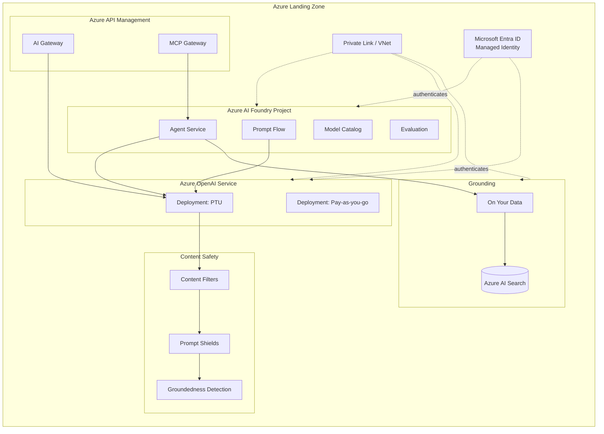
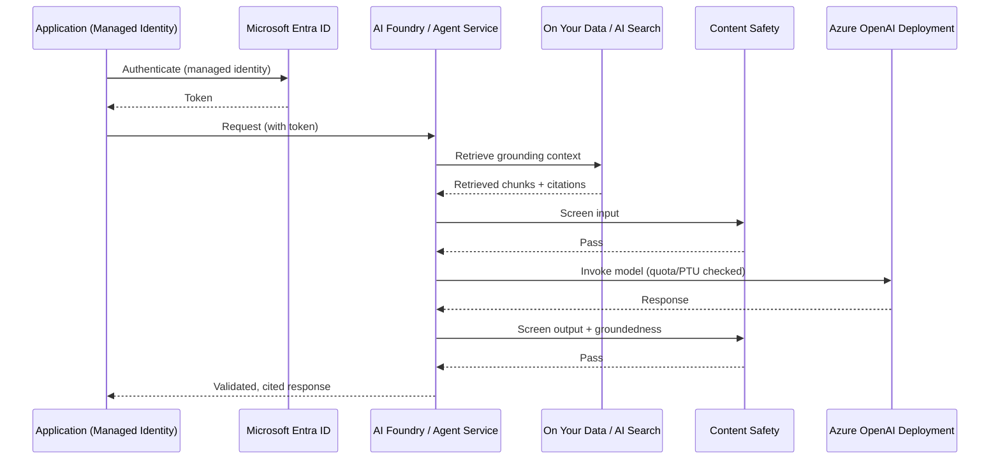
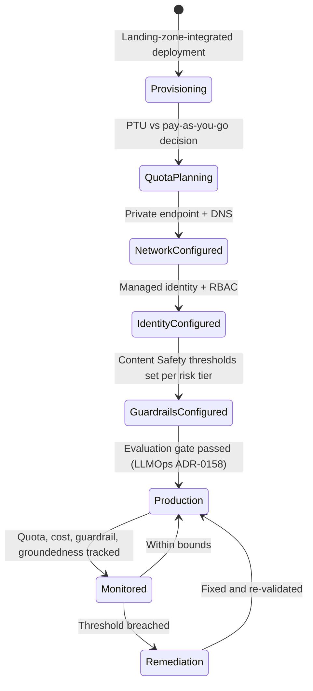

# Azure OpenAI and AI Foundry

> Part of the **Enterprise Data & AI Architecture Handbook** · Phase-12 — LLMOps & Agentic AI · Chapter 07.
> Estimated study time: **60 min reading + ~4h labs**.
> **Prerequisite:** read [LLMOps](04_LLMOps.md) first.

---

## Executive Summary

Every prior Phase-12 chapter has referenced Azure OpenAI Service and Azure AI Foundry as the primary implementation platform without stopping to cover either in full depth — [Large Language Model Foundations](01_Large_Language_Model_Foundations.md) named Azure OpenAI Service as the managed proprietary-model option, [LLMOps](04_LLMOps.md) named Azure AI Foundry as the evaluation and tracing platform, and [Agentic AI Architecture](05_Agentic_AI_Architecture.md) and [Model Context Protocol (MCP)](06_Model_Context_Protocol_MCP.md) both named Azure AI Foundry's Agent Service as the managed agent-hosting surface. This chapter is where that platform is covered concretely and completely: deployment models and quota management for Azure OpenAI Service; Azure AI Foundry's project structure, Agent Service, and Prompt Flow as the unifying development and operations surface; the "On Your Data" managed grounding capability as a fully-managed alternative to the custom RAG pipeline built in [Retrieval Augmented Generation](03_Retrieval_Augmented_Generation.md); Azure AI Content Safety as the concrete guardrail implementation referenced throughout Chapters 02-06; and the networking, identity, and cost configuration that makes all of the above safe and economical to run at enterprise scale.

Because this chapter's subject *is* the Azure platform itself, it is necessarily more Azure-concentrated than the usual ~60% ratio — consistent with the same platform-deep-dive precedent established in [Azure Machine Learning](../Phase-11/05_Azure_Machine_Learning.md) for the classical-ML equivalent. This chapter covers **Azure OpenAI deployments and quotas** as the foundational unit of capacity and cost management; **AI Foundry, agents, and Prompt Flow** as the unified project, orchestration, and agent-hosting surface; **On Your Data and grounding** as Azure's fully-managed retrieval-augmentation offering; **content safety and guardrails** as the concrete, configurable implementation of the safety principles established in [Prompt Engineering](02_Prompt_Engineering.md) and [LLMOps](04_LLMOps.md); and **networking, identity, and cost** as the enterprise-landing-zone-integration concerns that determine whether an Azure OpenAI/AI Foundry deployment is actually production-ready, not merely functional in a demo.

This chapter's central thesis: Azure OpenAI Service and Azure AI Foundry are not merely "where the model runs" — they are where nearly every governance, security, and cost-control principle established across this handbook phase (prompt versioning per [Prompt Engineering](02_Prompt_Engineering.md) §2.4, access-control propagation per [Retrieval Augmented Generation](03_Retrieval_Augmented_Generation.md) ADR-0157, triple-versioned promotion per [LLMOps](04_LLMOps.md) ADR-0158, and bounded agent execution per [Agentic AI Architecture](05_Agentic_AI_Architecture.md) ADR-0159) is actually configured, enforced, and operated concretely — this chapter is the "how" behind every "what" the preceding six chapters established conceptually.

The platform bias for this chapter is **~75% Azure** (elevated from the handbook's usual ~60% baseline given this chapter's subject matter) — Azure OpenAI Service, Azure AI Foundry (projects, Agent Service, Prompt Flow, On Your Data, evaluation), Azure AI Content Safety, Azure API Management, Azure Private Link, and Microsoft Entra ID — **~15% enterprise open source** (Terraform and Bicep for infrastructure-as-code deployment of Azure OpenAI/AI Foundry resources; LangChain/Semantic Kernel as the orchestration frameworks consuming Azure OpenAI Service; Grafana as an alternative visualization layer atop Azure Monitor data) — **~10% AWS/GCP comparison-only** (Amazon Bedrock; Google Vertex AI).

**Bottom line:** an Azure OpenAI Service deployment that is not correctly quota-planned, network-isolated, identity-integrated, content-safety-configured, and cost-governed is not a production platform regardless of how well the model itself performs — this chapter is the concrete configuration and operational discipline that converts every architectural principle from Chapters 01-06 into an actually-running, actually-governed enterprise system.

---

## Learning Objectives

By the end of this chapter you will be able to:

1. **Plan and provision Azure OpenAI Service deployments**, including model selection, deployment types, and quota (TPM/RPM) management across an enterprise's usage portfolio.
2. **Navigate Azure AI Foundry's project structure, Agent Service, and Prompt Flow** to build, version, and evaluate LLM and agentic applications.
3. **Configure "On Your Data"** as a managed grounding capability, and evaluate it against the custom RAG pipeline from [Retrieval Augmented Generation](03_Retrieval_Augmented_Generation.md).
4. **Configure Azure AI Content Safety** as the concrete implementation of the guardrail principles established in [Prompt Engineering](02_Prompt_Engineering.md) and [LLMOps](04_LLMOps.md).
5. **Design network isolation and identity integration** for an Azure OpenAI/AI Foundry deployment, using private endpoints and Microsoft Entra ID/managed identities.
6. **Apply Azure-native cost-governance tooling** (provisioned throughput units, Azure Cost Management, quota allocation) to keep an enterprise LLM platform's spend predictable and bounded.
7. **Defend Azure OpenAI/AI Foundry architecture decisions** in engineer, staff engineer, architect, and CTO review settings, including the trade-off between Azure's managed capabilities and a custom-built equivalent.

---

## Business Motivation

- **A managed platform converts the architectural principles from Chapters 01-06 into an operable, supportable production system**, rather than requiring every enterprise to build and maintain its own model-hosting, evaluation, tracing, and guardrail infrastructure from open-source components alone — the direct business case for choosing Azure OpenAI Service and Azure AI Foundry as the default platform this handbook has recommended throughout.
- **Quota and deployment-type decisions directly determine both cost predictability and availability** — an enterprise that has not planned its Provisioned Throughput Unit (PTU) versus pay-as-you-go allocation deliberately risks either paying for unused reserved capacity or being subject to unpredictable throttling during peak demand, a direct, quantifiable business risk this chapter's §7.1 and Cost Optimization sections address concretely.
- **"On Your Data" materially lowers the time-to-value for grounding a model in enterprise content**, letting a team stand up a governed RAG-equivalent capability without building and operating the full custom pipeline from [Retrieval Augmented Generation](03_Retrieval_Augmented_Generation.md) — a direct velocity advantage for a large class of enterprise use cases, at a real, documented capability trade-off this chapter's §7.3 and Decision Matrix make explicit.
- **Content Safety misconfiguration is a direct compliance and reputational risk**, and understanding its concrete filtering categories and severity thresholds (§7.4) is what lets an enterprise actually demonstrate — not merely assert — that its production LLM features meet an agreed safety bar.
- **Network and identity misconfiguration is one of the most common, most consequential production incidents for an enterprise LLM platform** — an Azure OpenAI Service resource left with public network access enabled, or an application using a static API key instead of a managed identity, is a direct, avoidable security exposure this chapter's §7.5 and Security section are built to prevent.

---

## History and Evolution

- **2023 — Azure OpenAI Service launches**, bringing OpenAI's GPT-family models to Azure with enterprise-grade networking, identity, and compliance controls layered on top of the underlying model API — directly extending [Large Language Model Foundations](01_Large_Language_Model_Foundations.md#history-and-evolution)'s account of the broader ChatGPT-driven enterprise adoption wave into a concrete, governed Azure product.
- **2023 — Azure OpenAI's "On Your Data" (originally "Azure OpenAI on your data") capability launches**, providing a first-party, managed grounding experience directly integrated with Azure AI Search, materially lowering the barrier to building a governed retrieval-augmented feature relative to hand-assembling the full pipeline from [Retrieval Augmented Generation](03_Retrieval_Augmented_Generation.md).
- **2023 — Provisioned Throughput Units (PTUs) are introduced** as a reserved-capacity billing and performance model, alongside the original pay-as-you-go (token-based) model, giving enterprises a predictable-latency, predictable-cost alternative for high-volume production workloads — the foundational capacity-planning decision this chapter's §7.1 covers.
- **2024 — Azure AI Studio (the predecessor to Azure AI Foundry) consolidates prompt engineering, evaluation, and content safety into a single development surface**, directly building on Prompt Flow's earlier standalone capability (per [Prompt Engineering](02_Prompt_Engineering.md#azure-implementation)) to give teams one integrated environment rather than several disconnected tools.
- **2024 — Azure AI Foundry launches as the unified successor to Azure AI Studio and Azure Machine Learning's generative-AI capabilities**, consolidating projects, model catalog (spanning both Azure OpenAI Service models and open-weight models per [Large Language Model Foundations](01_Large_Language_Model_Foundations.md#azure-implementation)), Prompt Flow, evaluation, and — later in 2024-2025 — the Agent Service, into a single platform, directly reflecting the industry-wide convergence toward integrated agent-development platforms already noted in [Agentic AI Architecture](05_Agentic_AI_Architecture.md#history-and-evolution).
- **2024-2025 — Azure AI Foundry's Agent Service adds native support for building, hosting, and governing agentic applications**, including built-in tool-calling, code interpretation, and — following the broader industry adoption pattern covered in [Model Context Protocol (MCP)](06_Model_Context_Protocol_MCP.md#history-and-evolution) — native MCP client and server support.
- **2024-2025 — Azure API Management adds AI-gateway and MCP-gateway capabilities** (per [LLMOps](04_LLMOps.md#history-and-evolution) and [Model Context Protocol (MCP)](06_Model_Context_Protocol_MCP.md#history-and-evolution)), consolidating rate-limiting, routing, caching, and MCP governance into the same API-management platform enterprises already operate for their non-AI APIs.
- **2025-present — Azure AI Foundry's evaluation and Responsible AI tooling continues to deepen**, adding native groundedness, relevance, and safety metrics directly into the platform (per [LLMOps](04_LLMOps.md#44-evaluation-and-regression-testing) §4.4's evaluation discipline), reducing the custom evaluation-harness engineering effort a team must build independently.

---

## Why This Technology Exists

Azure OpenAI Service and Azure AI Foundry exist because building and operating every capability this handbook phase has covered — model hosting, retrieval, prompt versioning, tracing, evaluation, guardrails, and agent orchestration — entirely from first principles and open-source components, while possible, is a substantial, ongoing engineering investment most enterprises should not need to independently re-create; a managed platform exists to absorb that shared, undifferentiated engineering burden once, centrally, so that individual product teams can focus on their specific business logic rather than re-building model-serving infrastructure, evaluation harnesses, and guardrail pipelines from scratch. Azure OpenAI Service specifically exists to bring OpenAI's models into Azure's existing enterprise trust boundary — its identity, networking, compliance, and governance model (per [Cloud Architecture Fundamentals](../Phase-03/01_Cloud_Architecture_Fundamentals.md) and [Well-Architected Framework](../Phase-03/07_Well_Architected_Framework.md)) — rather than requiring an enterprise to establish a separate trust relationship with an external API provider for every LLM-powered feature. Azure AI Foundry exists to unify the otherwise-scattered tooling this handbook has referenced piecemeal (Prompt Flow, evaluation, Agent Service, model catalog) into one coherent development and operations surface, directly addressing the tooling-fragmentation problem [LLMOps](04_LLMOps.md) named as a core LLMOps challenge.

---

## Problems It Solves

- **The engineering burden of building model-hosting, evaluation, and guardrail infrastructure from scratch** — Azure OpenAI Service and Azure AI Foundry provide this as a managed capability, directly reducing the undifferentiated engineering investment [LLMOps](04_LLMOps.md) established as necessary but costly to build independently.
- **Establishing enterprise trust and governance for a third-party model API** — Azure OpenAI Service brings the model within Azure's existing identity, networking, and compliance boundary, rather than requiring a separate trust relationship with an external provider for every feature.
- **The cost and complexity of building a full custom RAG pipeline for every grounding use case** — "On Your Data" (§7.3) provides a managed, faster-to-adopt alternative to the custom pipeline architecture from [Retrieval Augmented Generation](03_Retrieval_Augmented_Generation.md), appropriate for a meaningful subset of enterprise grounding needs.
- **Inconsistent, per-team guardrail implementation** — Azure AI Content Safety (§7.4) gives every team a shared, centrally-configurable content-safety capability, directly extending the centralized-guardrail-platform recommendation from [LLMOps](04_LLMOps.md#enterprise-recommendations).
- **Unpredictable cost and throughput for high-volume production workloads** — Provisioned Throughput Units (§7.1) give a reserved-capacity option with predictable latency and cost, addressing the throughput unpredictability that pure pay-as-you-go pricing can introduce at scale.

---

## Problems It Cannot Solve

- **It cannot substitute for the architectural judgment this handbook's prior chapters established.** Azure AI Foundry provides the tooling to implement good prompt engineering (Chapter 02), retrieval design (Chapter 03), and agentic architecture (Chapter 05) — it does not make a poorly-designed prompt, a poorly-chunked retrieval corpus, or a poorly-scoped agent good merely by being hosted on a managed platform.
- **It cannot make "On Your Data" a universal substitute for a custom RAG pipeline.** As §7.3 covers, "On Your Data" trades some of the fine-grained control over chunking strategy, hybrid-retrieval tuning, and reranking (per [Retrieval Augmented Generation](03_Retrieval_Augmented_Generation.md) §3.2-§3.4) for faster time-to-value — a genuine trade-off, not a strictly-dominant replacement for every use case.
- **It cannot guarantee quota availability on demand.** Azure OpenAI Service quota (TPM/RPM per deployment) is a finite, region-and-subscription-scoped resource, and a sudden demand spike beyond an enterprise's provisioned or approved quota can still result in throttling — quota planning (§7.1) mitigates but does not eliminate this constraint.
- **It cannot eliminate the need for deliberate network and identity configuration.** Azure OpenAI Service and Azure AI Foundry resources are not automatically network-isolated or least-privilege-identity-integrated by default — an engineer must deliberately configure private endpoints and managed identities (§7.5); the platform provides the capability, not an automatic, zero-configuration secure posture.
- **It cannot make Azure AI Content Safety's content-safety categories a complete substitute for the injection-defense and citation-faithfulness disciplines established in [Prompt Engineering](02_Prompt_Engineering.md) and [Retrieval Augmented Generation](03_Retrieval_Augmented_Generation.md).** Content Safety addresses harmful-content categories (hate, violence, self-harm, sexual content) specifically; it is one layer of the defense-in-depth stack this handbook has built, not a comprehensive replacement for role separation, least-privilege tool scoping, or faithfulness checking.

---

## Core Concepts

### 7.1 Azure OpenAI Deployments and Quotas

- **A deployment is the unit of provisioning within Azure OpenAI Service** — binding a specific model version (e.g., a specific GPT-family model version, per [Large Language Model Foundations](01_Large_Language_Model_Foundations.md#13-pretraining-fine-tuning-and-rlhf) §1.3's model-versioning discussion) to a named endpoint within an Azure OpenAI resource, with its own quota allocation and, for a fine-tuned model, its own specific fine-tuned artifact — this is the concrete Azure implementation of the "model version" member of [LLMOps](04_LLMOps.md#41-llm-lifecycle-and-versioning) §4.1's versioned triple.
- **Quota is allocated and consumed in Tokens-Per-Minute (TPM) and Requests-Per-Minute (RPM)**, scoped per subscription, per region, and per model — capacity planning must account for the aggregate TPM/RPM demand across every deployment and application sharing a given subscription/region's quota pool, not just a single feature's own expected usage, since quota is a genuinely shared, finite resource across the enterprise's entire Azure OpenAI footprint in that scope.
- **Pay-as-you-go (standard) deployments** bill per token consumed, offering elastic, unreserved capacity suited to variable or lower-volume workloads, at the cost of being subject to throttling if aggregate demand within the subscription/region exceeds available quota during a demand spike.
- **Provisioned Throughput Units (PTUs)** reserve a fixed amount of dedicated model-serving capacity for a defined term (hourly, monthly, or annual commitment), giving predictable latency and a fixed cost regardless of actual token volume — the appropriate choice for a high-volume, latency-sensitive production workload where pay-as-you-go's throttling risk and per-token cost variability are unacceptable, directly extending [Large Language Model Foundations](01_Large_Language_Model_Foundations.md#14-inference-cost-latency-and-quantization) §1.4's inference-economics discussion into a concrete Azure billing-model decision.
- **Regional model and quota availability varies**, and a multi-region deployment strategy (for both latency and quota-pooling reasons) should be planned deliberately, extending the multi-provider-fallback resilience pattern from [Large Language Model Foundations](01_Large_Language_Model_Foundations.md#fault-tolerance) to a multi-region-within-Azure-OpenAI-Service pattern specifically.

### 7.2 AI Foundry, Agents, and Prompt Flow

- **An Azure AI Foundry project is the organizing unit for a team's models, prompts, agents, data connections, and evaluation results** — providing the concrete Azure implementation of the model/prompt/retrieval-index triple registry [LLMOps](04_LLMOps.md#41-llm-lifecycle-and-versioning) §4.1 established conceptually, now as an actual, navigable Azure resource with role-based access control per [Identity and Access Management with Entra](../Phase-10/02_Identity_and_Access_Management_with_Entra.md).
- **Prompt Flow** (introduced in [Prompt Engineering](02_Prompt_Engineering.md#azure-implementation)) provides a visual and code-based authoring surface for building, versioning, and evaluating prompt flows (chains of prompt, retrieval, and tool-invocation steps) — directly implementing the prompt-template versioning and promotion-gate discipline from [Prompt Engineering](02_Prompt_Engineering.md#24-prompt-templates-and-versioning) §2.4 and [LLMOps](04_LLMOps.md#41-llm-lifecycle-and-versioning) §4.1 as a concrete, Azure-native CI/CD-integrated workflow.
- **Azure AI Foundry's Agent Service** provides managed hosting for the agent-loop architecture from [Agentic AI Architecture](05_Agentic_AI_Architecture.md#51-agent-loops-plan-act-observe-reflect) §5.1, including built-in tool/function-calling integration, code-interpreter and file-search built-in tools, thread-based conversation state management (a managed implementation of [Agentic AI Architecture](05_Agentic_AI_Architecture.md#53-short--and-long-term-memory-design) §5.3's working-memory concept), and native MCP client/server support (per [Model Context Protocol (MCP)](06_Model_Context_Protocol_MCP.md#azure-implementation)).
- **Azure AI Foundry's built-in evaluation capabilities** (groundedness, relevance, coherence, fluency, and safety metrics, plus support for custom and LLM-as-judge evaluators) directly implement the evaluation-and-regression-testing discipline from [LLMOps](04_LLMOps.md#44-evaluation-and-regression-testing) §4.4 as native platform tooling, reducing the custom evaluation-harness engineering effort a team would otherwise need to build from scratch using MLflow or an equivalent framework directly.
- **The model catalog** spans both Azure OpenAI Service's proprietary models and a curated set of open-weight models (per [Large Language Model Foundations](01_Large_Language_Model_Foundations.md#15-open-vs-proprietary-models) §1.5), letting a team evaluate and deploy either family from within the same project structure, directly supporting the hybrid-portfolio recommendation established there.

### 7.3 On Your Data and Grounding

- **"On Your Data" is Azure OpenAI Service's managed grounding capability**, connecting a chat-completions deployment directly to an Azure AI Search index (or another supported data source) and automatically handling query embedding, retrieval, and prompt assembly with grounding instructions — a fully-managed implementation of the core RAG architecture from [Retrieval Augmented Generation](03_Retrieval_Augmented_Generation.md#31-rag-architecture-and-components) §3.1, requiring materially less custom pipeline engineering than building the ingestion, retrieval, reranking, and prompt-assembly stages independently.
- **"On Your Data" includes built-in citation support**, returning the specific source documents/chunks a response drew from — directly implementing the citation-based grounding discipline from [Retrieval Augmented Generation](03_Retrieval_Augmented_Generation.md#35-grounding-citations-and-hallucination-control) §3.5 as a managed, out-of-the-box feature rather than custom structured-output schema work.
- **The trade-off for this faster time-to-value is reduced fine-grained control** over the specific chunking strategy, hybrid-retrieval tuning, and reranking configuration relative to a fully custom pipeline (per [Retrieval Augmented Generation](03_Retrieval_Augmented_Generation.md#32-chunking-and-embedding-strategies) §3.2-§3.4) — "On Your Data" exposes a defined set of configuration options (chunk size, and increasingly, some retrieval-tuning parameters) but does not offer the same depth of control as hand-building each pipeline stage independently, a genuine and explicit trade-off rather than a strictly-inferior option.
- **Access-control propagation remains the deploying team's own responsibility even when using "On Your Data"** — the underlying Azure AI Search index must still be correctly access-control-filtered per [Retrieval Augmented Generation](03_Retrieval_Augmented_Generation.md) ADR-0157's requirement; "On Your Data" manages the retrieval-and-prompt-assembly mechanics, it does not manage or guarantee the correctness of the underlying index's own access-control design.
- **"On Your Data" is the recommended default starting point for a new grounding use case**, per this chapter's Decision Matrix, with migration to a fully custom RAG pipeline (per [Retrieval Augmented Generation](03_Retrieval_Augmented_Generation.md)) reserved for use cases where the specific retrieval-tuning control a custom pipeline provides is demonstrated to be necessary, not assumed necessary from the outset.

### 7.4 Content Safety and Guardrails

- **Azure AI Content Safety provides configurable content-filtering categories** (hate and fairness, sexual, violence, self-harm) with adjustable severity thresholds, applied to both the input prompt and the model's output — the concrete Azure implementation of the input/output content-safety guardrail layer referenced throughout [Prompt Engineering](02_Prompt_Engineering.md#25-prompt-injection-defenses) §2.5, [Agentic AI Architecture](05_Agentic_AI_Architecture.md#security), and [LLMOps](04_LLMOps.md#45-guardrails-and-safety-in-production) §4.5.
- **Prompt Shields** (Content Safety's specific capability for detecting both direct and indirect prompt injection attempts) directly implements the injection-defense layer from [Prompt Engineering](02_Prompt_Engineering.md#25-prompt-injection-defenses) §2.5 as a managed, continuously-updated detection service, rather than requiring every team to build and maintain its own injection-classifier model.
- **Groundedness detection** (verifying whether a generated response is actually supported by its provided context) directly implements the citation-faithfulness checking discipline from [Retrieval Augmented Generation](03_Retrieval_Augmented_Generation.md#35-grounding-citations-and-hallucination-control) §3.5 as a managed Content Safety capability, addressing the exact "citation presence is not sufficient" gap that chapter's Case Study 2 identified.
- **Content Safety severity thresholds must be configured deliberately per use case**, per this chapter's risk-tiered governance pattern — a customer-facing feature processing untrusted, potentially adversarial input generally warrants stricter thresholds than an internal, trusted-user tool, directly extending the risk-tiered guardrail-depth principle established in [LLMOps](04_LLMOps.md#trade-offs).
- **Content Safety is one layer of the defense-in-depth stack this handbook has built, not a complete substitute for it** — role separation (per [Prompt Engineering](02_Prompt_Engineering.md#22-system-vs-user-prompts-and-roles) §2.2), least-privilege tool scoping (per [Prompt Engineering](02_Prompt_Engineering.md) ADR-0156), and access-control propagation (per [Retrieval Augmented Generation](03_Retrieval_Augmented_Generation.md) ADR-0157 and [Model Context Protocol (MCP)](06_Model_Context_Protocol_MCP.md) ADR-0160) remain necessary, independent controls that Content Safety configuration does not replace.

### 7.5 Networking, Identity, and Cost

- **Azure OpenAI Service and Azure AI Foundry resources should be deployed behind Azure Private Link**, disabling public network access entirely for any production deployment handling enterprise data — directly extending the private-endpoint-only baseline from [Network Security and Zero Trust](../Phase-10/04_Network_Security_and_Zero_Trust.md) ADR-0144 to this chapter's specific Azure AI resources, and closing the exact "added private endpoint but forgot to disable public access" gotcha that ADR's case study documented.
- **Managed identities (system-assigned or user-assigned) should authenticate every application-to-Azure-OpenAI/AI-Foundry connection**, never a long-lived API key — directly extending [Identity and Access Management with Entra](../Phase-10/02_Identity_and_Access_Management_with_Entra.md)'s managed-identity/workload-identity-federation default (ADR-0142) to this chapter's specific services, and eliminating the credential-leakage and rotation-burden risk a static API key carries.
- **Azure role-based access control (RBAC)** should scope each application's or team's access to only the specific Azure OpenAI/AI Foundry resources and operations it actually requires (e.g., a specific project's `Cognitive Services OpenAI User` role rather than a subscription-wide `Contributor` role), directly extending the least-privilege principle this handbook has applied to every other access-control decision.
- **Cost governance requires tracking spend at the deployment, project, and subscription level**, using Azure Cost Management combined with the PTU-vs-pay-as-you-go allocation decision (§7.1) and the triple-versioned, per-task/per-request cost monitoring already established in [LLMOps](04_LLMOps.md#cost-optimization-finops) and [Agentic AI Architecture](05_Agentic_AI_Architecture.md#cost-optimization-finops) — Azure-native cost tooling gives the billing-level visibility that complements, but does not replace, the application-level per-request/per-task cost instrumentation those chapters established.
- **A landing-zone-integrated deployment** (per [Azure Landing Zones](../Phase-03/03_Azure_Landing_Zones.md)) — placing Azure OpenAI Service and Azure AI Foundry resources within the enterprise's existing subscription-vending, policy-as-code, and network-topology structure — is what actually makes this chapter's networking, identity, and cost-governance recommendations enforceable at scale, rather than each project team independently and inconsistently configuring these controls.

---

## Internal Working

**How a request actually flows through an Azure AI Foundry-hosted agentic application grounded via "On Your Data"** (the mechanics underlying §7.2-§7.3, and the concrete Azure implementation of the architecture established in [Agentic AI Architecture](05_Agentic_AI_Architecture.md#internal-working) and [Retrieval Augmented Generation](03_Retrieval_Augmented_Generation.md#internal-working)):

1. **Authenticated ingress**: a request arrives at the application, authenticated via Microsoft Entra ID, and the application's managed identity authenticates its outbound call to the Azure AI Foundry project (§7.5).
2. **Agent Service thread management**: for an agentic application, the Agent Service resolves the current conversation thread's state (working memory, per [Agentic AI Architecture](05_Agentic_AI_Architecture.md#53-short--and-long-term-memory-design) §5.3), or initializes a new thread for a new task.
3. **Planning and "On Your Data" retrieval**: the agent's planning step (per [Agentic AI Architecture](05_Agentic_AI_Architecture.md#51-agent-loops-plan-act-observe-reflect) §5.1) determines the next action; if grounding is needed, "On Your Data" automatically queries the connected Azure AI Search index (§7.3) and assembles the retrieved context into the prompt.
4. **Content Safety input filtering**: Azure AI Content Safety and Prompt Shields (§7.4) screen the assembled prompt (including any user input and retrieved content) before it reaches the model.
5. **Model invocation**: the request is routed to the appropriate Azure OpenAI Service deployment (§7.1), subject to the deployment's quota/PTU allocation.
6. **Content Safety output filtering and groundedness check**: the generated response is screened by Content Safety's output filters and, where "On Your Data" or a custom groundedness evaluator is configured, checked for citation faithfulness (§7.4) before being returned.
7. **Tracing and cost logging**: the full request — prompt, retrieved context, response, Content Safety outcomes, and token/cost metrics — is logged to Azure AI Foundry's tracing and Azure Monitor's cost-tracking pipeline, feeding the monitoring dashboards this chapter's Monitoring section and [LLMOps](04_LLMOps.md#observability) both depend on.

This sequence is the concrete, Azure-native instantiation of every architectural diagram from Chapters 03-05 — the same retrieval, generation, guardrail, and tracing stages, now implemented as specific, configurable Azure AI Foundry and Azure OpenAI Service capabilities rather than custom-built pipeline components.

---

## Architecture

- **Azure OpenAI Service layer**: one or more deployments (§7.1) within an Azure OpenAI resource, each bound to a specific model version and quota/PTU allocation.
- **Azure AI Foundry project layer**: the organizing unit for prompts (Prompt Flow), agents (Agent Service), data connections ("On Your Data"/Azure AI Search), and evaluation configuration (§7.2).
- **Grounding layer**: Azure AI Search, connected via "On Your Data" (§7.3) or a fully custom retrieval pipeline (per [Retrieval Augmented Generation](03_Retrieval_Augmented_Generation.md#azure-implementation)) for use cases requiring finer-grained control.
- **Guardrail layer**: Azure AI Content Safety, Prompt Shields, and groundedness detection (§7.4), applied at input and output boundaries.
- **Gateway layer**: Azure API Management's AI-gateway and MCP-gateway capabilities (per [LLMOps](04_LLMOps.md#architecture) and [Model Context Protocol (MCP)](06_Model_Context_Protocol_MCP.md#architecture)) for rate-limiting, routing, and centralized MCP governance.
- **Networking and identity layer**: Azure Private Link, VNet integration, and Microsoft Entra ID managed identities/RBAC (§7.5), all provisioned within an [Azure Landing Zone](../Phase-03/03_Azure_Landing_Zones.md)-integrated subscription structure.
- **Observability and cost layer**: Azure Monitor, Application Insights, and Azure Cost Management, aggregating the tracing and cost data this chapter's Monitoring section and [LLMOps](04_LLMOps.md#observability) both depend on.

---

## Components

- **Azure OpenAI resource and deployments** — the provisioned model endpoints, each with its own quota/PTU allocation (§7.1).
- **Azure AI Foundry project** — the organizing resource for prompts, agents, data connections, and evaluation (§7.2).
- **Azure AI Search index** — the backing retrieval index for "On Your Data" or a custom RAG pipeline (§7.3).
- **Azure AI Content Safety resource** — the configurable content-filtering, Prompt Shields, and groundedness-detection service (§7.4).
- **Azure API Management instance** — the AI/MCP gateway layer for rate-limiting, routing, and centralized governance.
- **Private endpoints and managed identities** — the networking and identity components (§7.5) enforcing the private-only, credential-free access posture.
- **Azure Monitor / Application Insights / Azure Cost Management** — the observability and cost-tracking backbone.

---

## Metadata

- **Deployment metadata**: model version, deployment type (pay-as-you-go or PTU), and quota allocation (§7.1), extending [LLMOps](04_LLMOps.md#metadata)'s triple-version metadata with Azure-specific deployment configuration.
- **Project and Prompt Flow metadata**: flow version, associated evaluation results, and Agent Service thread configuration (§7.2), the concrete Azure implementation of the triple-version registry from [LLMOps](04_LLMOps.md#41-llm-lifecycle-and-versioning) §4.1.
- **"On Your Data" configuration metadata**: connected Azure AI Search index, chunking configuration, and citation settings (§7.3).
- **Content Safety configuration metadata**: severity thresholds per category, per feature — needed to audit whether a given feature's guardrail configuration matches its actual risk tier (§7.4).

---

## Storage

- **Azure AI Search indexes** store the vectorized and keyword-indexed content for "On Your Data" or a custom RAG pipeline, following the same access-control-propagation and storage discipline established in [Retrieval Augmented Generation](03_Retrieval_Augmented_Generation.md#storage).
- **Azure AI Foundry project artifacts** (Prompt Flow definitions, agent configurations, evaluation datasets and results) are stored within the project's associated storage account, versioned per §7.2's registry discipline.
- **Fine-tuned model artifacts** (where fine-tuning per [Large Language Model Foundations](01_Large_Language_Model_Foundations.md#13-pretraining-fine-tuning-and-rlhf) §1.3 is used) are stored and versioned within the Azure OpenAI resource, associated with their specific deployment.
- **Request/response logs and traces** are stored in Azure Monitor Log Analytics, following the same PII-handling and retention discipline established in [LLMOps](04_LLMOps.md#storage) and [Data Privacy and PII Protection](../Phase-10/07_Data_Privacy_and_PII_Protection.md).

---

## Compute

- **Azure OpenAI Service's underlying model-serving compute is entirely managed by Microsoft**, with the enterprise's only visible compute-adjacent lever being the deployment-type (pay-as-you-go vs. PTU, §7.1) and region selection.
- **Azure AI Search's indexing and query compute** scales with the search tier and replica/partition configuration selected, per the general vector/keyword-index scaling considerations established in [Retrieval Augmented Generation](03_Retrieval_Augmented_Generation.md#compute).
- **Azure AI Foundry's Agent Service compute** (for code-interpreter and other built-in tool execution) is managed, with per-invocation cost tracked alongside the underlying model-invocation cost.

---

## Networking

- **Private endpoints for Azure OpenAI Service, Azure AI Foundry, and Azure AI Search** are the default, non-negotiable configuration for any production deployment handling enterprise data, per §7.5 and [Network Security and Zero Trust](../Phase-10/04_Network_Security_and_Zero_Trust.md) ADR-0144.
- **VNet integration and private DNS zone configuration** must be correctly established for private endpoint name resolution to function — a common, well-documented configuration gap where a private endpoint is created but DNS resolution still routes to the public endpoint, directly recreating the "added private endpoint but forgot to disable public access" gotcha that ADR-0144's case study specifically warned against.
- **Azure API Management, when deployed in front of these services**, should itself be internally-networked (or exposed via a WAF-protected Application Gateway for any legitimately public-facing surface), maintaining the same private-by-default posture end to end.

---

## Security

- **Managed identity authentication, never a long-lived API key, for every service-to-service connection** (§7.5) is this chapter's most consequential, non-negotiable security control, directly extending [Identity and Access Management with Entra](../Phase-10/02_Identity_and_Access_Management_with_Entra.md) ADR-0142.
- **Content Safety and Prompt Shields configuration (§7.4) must be reviewed and tuned per feature's actual risk tier**, never left at a default configuration assumed to be universally sufficient, extending the risk-tiered guardrail principle from [LLMOps](04_LLMOps.md#trade-offs).
- **Azure AI Search index access-control propagation** (per [Retrieval Augmented Generation](03_Retrieval_Augmented_Generation.md) ADR-0157) and **MCP server identity propagation** (per [Model Context Protocol (MCP)](06_Model_Context_Protocol_MCP.md) ADR-0160), where either capability is used within an Azure AI Foundry project, remain the deploying team's full responsibility — the platform provides the mechanism, not an automatic guarantee of correct configuration.
- **RBAC scoping** (§7.5) must follow least privilege at every layer — the Azure OpenAI resource, the AI Foundry project, and the Azure AI Search index each have their own distinct role assignments, and a broad, subscription-level role grant "for convenience" reintroduces the same overprivileged-access risk this handbook has repeatedly warned against at every other layer.

---

## Performance

- **PTU deployments provide predictable, reserved-capacity latency**, avoiding the variable queueing/throttling latency pay-as-you-go deployments can experience under contention within a shared quota pool (§7.1) — the primary performance lever this chapter adds beyond the general TTFT/TPOT discussion in [Large Language Model Foundations](01_Large_Language_Model_Foundations.md#14-inference-cost-latency-and-quantization) §1.4.
- **"On Your Data's" managed retrieval pipeline latency** is generally comparable to a well-tuned custom RAG pipeline for a standard configuration, though a custom pipeline's fine-grained reranking-candidate-set tuning (per [Retrieval Augmented Generation](03_Retrieval_Augmented_Generation.md#34-reranking-and-context-assembly) §3.4) offers more precise latency/precision trade-off control than "On Your Data's" more limited configuration surface.
- **Content Safety and Prompt Shields add a modest, per-request latency overhead** at input and output boundaries, consistent with the general guardrail-latency-cost trade-off established in [LLMOps](04_LLMOps.md#performance).

---

## Scalability

- **Quota pooling across deployments within a subscription/region** (§7.1) requires deliberate capacity planning as the number of features and teams sharing that quota pool grows — a genuinely shared, finite resource requiring the same portfolio-wide governance-capacity discipline established throughout [LLMOps](04_LLMOps.md#scalability) and [Agentic AI Architecture](05_Agentic_AI_Architecture.md#scalability).
- **PTU capacity is provisioned in discrete units and scaled by adjusting the reservation**, not elastically autoscaled per request — capacity planning for a PTU deployment requires forecasting expected peak demand rather than relying on automatic, request-driven scaling.
- **Azure AI Foundry projects and Azure API Management gateways scale via the same horizontal-scaling and managed-service-scaling patterns** established throughout this handbook, with the gateway layer's own throughput ceiling requiring the same independent-scaling consideration raised in [LLMOps](04_LLMOps.md#scalability).

---

## Fault Tolerance

- **Multi-region Azure OpenAI Service deployment** (§7.1), with a defined failover or load-balancing strategy across regions, extends the multi-provider-fallback pattern from [Large Language Model Foundations](01_Large_Language_Model_Foundations.md#fault-tolerance) to a multi-region-within-Azure pattern, mitigating both a regional service incident and a regional quota-exhaustion event.
- **A Content Safety service outage should fail closed**, per the fail-closed principle established in [LLMOps](04_LLMOps.md#fault-tolerance) — a request should not bypass content-safety filtering merely because the filtering service is temporarily unreachable.
- **Azure API Management's own outage or misconfiguration** should have a defined, reviewed fallback path (per [LLMOps](04_LLMOps.md#fault-tolerance)'s gateway-failure consideration), balancing availability against the governance visibility a gateway bypass would sacrifice.

---

## Cost Optimization (FinOps)

- **PTU-vs-pay-as-you-go allocation is this chapter's single largest cost-optimization decision** — right-sizing PTU reservation to actual sustained demand (avoiding both under-provisioned throttling and over-provisioned idle reserved capacity) directly extends [Large Language Model Foundations](01_Large_Language_Model_Foundations.md#cost-optimization-finops)'s general model-tiering cost discipline into a concrete Azure billing decision.
- **"On Your Data's" reduced engineering-effort cost** should be weighed against its retrieval-tuning-control trade-off (§7.3) — for a use case where the custom pipeline's additional precision genuinely reduces token cost (via better reranking, per [Retrieval Augmented Generation](03_Retrieval_Augmented_Generation.md#cost-optimization-finops)) enough to justify its build cost, the custom pipeline may be the better total-cost-of-ownership choice despite its higher upfront engineering investment.
- **Azure Cost Management's tagging and budget-alert capabilities**, applied per project/deployment, give the org-level cost visibility that complements the per-request/per-task cost monitoring established in [LLMOps](04_LLMOps.md#cost-optimization-finops) and [Agentic AI Architecture](05_Agentic_AI_Architecture.md#cost-optimization-finops) — neither layer of visibility substitutes for the other.
- **Content Safety and Prompt Shields' per-request cost** should be included in a feature's total unit-economics calculation, consistent with the general guardrail-cost-accounting practice established in [LLMOps](04_LLMOps.md#cost-optimization-finops).

---

## Monitoring

- **Deployment-level quota utilization (TPM/RPM consumed vs. allocated) and PTU utilization rate**, extending [LLMOps](04_LLMOps.md#monitoring)'s general cost/latency monitoring with Azure-specific capacity metrics.
- **Content Safety and Prompt Shields trigger rates per category and per feature**, directly implementing the guardrail-trigger-rate monitoring established in [LLMOps](04_LLMOps.md#monitoring) and [Prompt Engineering](02_Prompt_Engineering.md#monitoring) as concrete Azure Monitor metrics.
- **"On Your Data" groundedness scores and citation rates**, tracked per feature, directly implementing the retrieval/citation-quality monitoring established in [Retrieval Augmented Generation](03_Retrieval_Augmented_Generation.md#monitoring).

---

## Observability

- **Azure AI Foundry's integrated tracing**, spanning "On Your Data" retrieval, Agent Service tool invocations, and Content Safety checks, gives the same full-pipeline trace visibility established conceptually in [LLMOps](04_LLMOps.md#42-promptresponse-logging-and-tracing) §4.2 and [Agentic AI Architecture](05_Agentic_AI_Architecture.md#observability), now as a native platform capability requiring no custom instrumentation.
- **Azure Monitor Workbooks and Grafana dashboards atop Azure Monitor data** give a unified, correlatable view of quota utilization, cost, guardrail-trigger rate, and groundedness score per feature — the concrete Azure implementation of the unified cost/quality/safety dashboard pattern established throughout Chapters 02-05.

### Operational Response Playbook

| Signal | Detection Query/Check | Remediation |
|---|---|---|
| **A deployment's TPM/RPM utilization approaches its allocated quota, or PTU utilization sustains near 100%** | Azure Monitor quota-utilization metric, alerted at a defined threshold (e.g., 80% sustained) below the hard limit | Request a quota increase or additional PTU capacity proactively before throttling occurs, or apply the model-routing/caching cost-control levers from [LLMOps](04_LLMOps.md#43-cost-controls-caching-and-routing) §4.3 to reduce demand within existing capacity |
| **Content Safety or Prompt Shields trigger rate spikes for a specific feature after a prompt or data-source change** | Content Safety trigger-rate trend, segmented by feature and category, correlated with recent Prompt Flow or "On Your Data" configuration changes | Apply the same investigation discipline from [LLMOps](04_LLMOps.md)'s Operational Response Playbook — distinguish an active attack pattern from a legitimate configuration change producing more false positives, before tuning thresholds or rolling back the recent change |

---

## Governance

- **Every Azure OpenAI/AI Foundry deployment must be provisioned within the enterprise's [Azure Landing Zone](../Phase-03/03_Azure_Landing_Zones.md)-governed subscription structure**, inheriting its policy-as-code, network-topology, and identity baseline rather than being provisioned as an ungoverned, standalone resource.
- **Quota and PTU allocation decisions require a documented capacity-planning review**, extending the pre-launch cost-review discipline from [Large Language Model Foundations](01_Large_Language_Model_Foundations.md) ADR-0155 to this chapter's specific Azure billing-model decision.
- **Content Safety configuration per feature must be documented and reviewed against that feature's actual risk tier**, extending the model-card and guardrail-documentation discipline established throughout [Responsible AI](../Phase-11/07_Responsible_AI.md) and [LLMOps](04_LLMOps.md#governance).
- **A designated owner for each Azure AI Foundry project's quota, cost, and guardrail-configuration currency** should be established, extending the accountable-ownership pattern from [Responsible AI](../Phase-11/07_Responsible_AI.md#75-microsoft-responsible-ai-standard) §7.5.

---

## Trade-offs

- **Managed platform convenience vs. fine-grained control**: Azure OpenAI Service and Azure AI Foundry's managed capabilities (especially "On Your Data," §7.3) trade some of the deep customization a fully custom-built pipeline offers for materially faster time-to-value and lower ongoing operational burden — the right choice depends on whether a specific use case's control requirements genuinely exceed what the managed capability offers.
- **PTU reserved-capacity cost predictability vs. pay-as-you-go elasticity**: PTUs give predictable cost and latency at the cost of committing to a fixed reservation regardless of actual demand variability; pay-as-you-go scales elastically with actual usage at the cost of potential throttling and less predictable per-period cost (§7.1).
- **Azure-native tooling consolidation vs. multi-cloud/open-source portability**: standardizing on Azure AI Foundry's integrated tooling (versus a self-assembled MLflow/LangChain/Grafana stack, per [LLMOps](04_LLMOps.md#open-source-implementation)) reduces integration effort at the cost of the portability [LLMOps](04_LLMOps.md#migration-considerations) flagged for open-source-based implementations.

---

## Decision Matrix

| Scenario | Recommended Approach | Rationale |
|---|---|---|
| New grounding use case, no demonstrated need for fine-grained retrieval tuning | "On Your Data" | Fastest time-to-value; sufficient for most standard grounding needs |
| Grounding use case demonstrated to need custom chunking, hybrid-retrieval tuning, or reranking control | Custom RAG pipeline (per [Retrieval Augmented Generation](03_Retrieval_Augmented_Generation.md)) | "On Your Data's" configuration surface does not provide this depth of control |
| High-volume, latency-sensitive production workload | Provisioned Throughput Units | Predictable latency and cost; avoids pay-as-you-go throttling risk under contention |
| Variable, lower-volume, or experimental workload | Pay-as-you-go | Elastic, no reservation commitment for uncertain or low-volume demand |
| Any production feature handling enterprise data | Private endpoints, managed identity, RBAC as non-negotiable baseline | Extends the handbook's zero-trust and least-privilege baseline without exception |

---

## Design Patterns

- **Landing-zone-integrated provisioning**, deploying every Azure OpenAI/AI Foundry resource within the enterprise's governed subscription-vending structure rather than as a standalone, ungoverned resource.
- **"On Your Data" as the default grounding starting point**, escalating to a custom RAG pipeline only when a specific, demonstrated control requirement warrants it.
- **PTU-for-production, pay-as-you-go-for-experimentation**, matching deployment-type choice to a workload's actual volume and latency-predictability requirements.
- **Defense-in-depth guardrails**, layering Content Safety/Prompt Shields (§7.4) with the role-separation, least-privilege, and access-control-propagation controls established throughout this handbook, never relying on Content Safety configuration alone.

---

## Anti-patterns

- **Leaving Azure OpenAI Service or Azure AI Foundry resources with public network access enabled "temporarily" during development and forgetting to disable it before production launch** — the exact gotcha [Network Security and Zero Trust](../Phase-10/04_Network_Security_and_Zero_Trust.md) ADR-0144's case study documented.
- **Authenticating application-to-Azure-OpenAI-Service connections with a static API key** instead of a managed identity, reintroducing the credential-leakage risk this handbook has repeatedly warned against.
- **Assuming "we use 'On Your Data'" is equivalent to "our retrieval is correctly access-controlled,"** when the underlying Azure AI Search index's access-control-propagation design remains the deploying team's own responsibility.
- **Provisioning PTU capacity based on peak-demand guesswork without a documented capacity-planning review**, risking either expensive over-provisioning or throttling under-provisioning.
- **Treating Content Safety's default configuration as sufficient for every feature regardless of its actual risk tier**, without a deliberate, documented review matching threshold configuration to the feature's specific risk profile.

---

## Common Mistakes

- Forgetting to configure private DNS zone resolution alongside a private endpoint, leaving traffic silently routing to the public endpoint despite the private endpoint's existence.
- Sizing PTU capacity to average rather than peak expected demand, causing throttling during legitimate demand spikes.
- Assuming quota is dedicated per application rather than shared per subscription/region, leading to unexpected throttling when a new feature launches and consumes quota another team was implicitly relying on.
- Not reviewing Content Safety severity thresholds per feature's actual risk tier, either over-blocking legitimate content for a low-risk internal tool or under-filtering for a high-risk, public-facing one.
- Building a custom RAG pipeline by default without first evaluating whether "On Your Data" would have met the use case's needs at a fraction of the engineering cost.

---

## Best Practices

- Provision every Azure OpenAI/AI Foundry resource within the enterprise's governed landing-zone structure, with private endpoints and managed identity authentication as a non-negotiable baseline.
- Start new grounding use cases with "On Your Data," escalating to a custom RAG pipeline only when a demonstrated control requirement warrants the additional engineering investment.
- Conduct a documented capacity-planning review before committing to PTU reservation, based on realistic peak-demand forecasting rather than average-demand assumptions.
- Review and document Content Safety severity thresholds per feature's actual risk tier, rather than accepting default configuration universally.
- Track quota utilization, cost, and guardrail-trigger rate as standing Azure Monitor dashboards, correlated with the per-request/per-task application-level monitoring established in [LLMOps](04_LLMOps.md) and [Agentic AI Architecture](05_Agentic_AI_Architecture.md).

---

## Enterprise Recommendations

- Standardize Azure OpenAI Service and Azure AI Foundry as the organization's default LLM platform, with a documented, landing-zone-integrated provisioning template every new project inherits by default.
- Establish a centralized quota/PTU capacity-planning function that reviews and approves allocation requests across the organization's full Azure OpenAI Service footprint, preventing the shared-quota-exhaustion surprise named in Common Mistakes.
- Require "On Your Data" as the default grounding approach for new use cases, with a documented justification required to escalate to a custom RAG pipeline.
- Maintain a standard, risk-tiered Content Safety configuration template per feature-risk category, rather than leaving each team to independently determine appropriate severity thresholds.

---

## Azure Implementation

*(This chapter's entire Core Concepts, Architecture, and Internal Working sections constitute its Azure Implementation — see §7.1-§7.5 above for the complete, concrete platform coverage.)*

- **Azure OpenAI Service** — deployments, quota, and PTU management (§7.1).
- **Azure AI Foundry** — projects, Prompt Flow, Agent Service, model catalog, and evaluation (§7.2).
- **Azure AI Search** — the backing retrieval index for "On Your Data" and custom RAG (§7.3).
- **Azure AI Content Safety** — content filtering, Prompt Shields, and groundedness detection (§7.4).
- **Azure API Management, Azure Private Link, Microsoft Entra ID, Azure Cost Management** — the gateway, networking, identity, and cost-governance layer (§7.5).

---

## Open Source Implementation

- **Terraform and Bicep** for infrastructure-as-code provisioning of Azure OpenAI Service, Azure AI Foundry, Azure AI Search, and their associated networking/identity configuration, extending [Infrastructure as Code with Terraform](../Phase-09/04_Infrastructure_as_Code_with_Terraform.md)'s general IaC discipline to this chapter's specific resources.
- **LangChain and Semantic Kernel** (carried forward from [Agentic AI Architecture](05_Agentic_AI_Architecture.md#open-source-implementation)) as the orchestration frameworks most commonly used to consume Azure OpenAI Service deployments from application code, for teams preferring an open-source orchestration layer atop the managed Azure model-hosting platform.
- **Grafana**, atop Azure Monitor's metrics data source, as an alternative or supplementary visualization layer for the monitoring dashboards this chapter's Observability section describes.
- **GitHub Actions or Azure DevOps** for CI/CD of Prompt Flow definitions and infrastructure-as-code deployments, extending [DevOps and CI/CD](../Phase-09/03_DevOps_and_CI_CD.md)'s general pipeline discipline to this chapter's Azure AI resources specifically.

---

## AWS Equivalent (comparison only)

- **Amazon Bedrock** provides the direct equivalent managed proprietary-model hosting, with Bedrock Knowledge Bases as the "On Your Data" equivalent and Bedrock Guardrails as the Content Safety equivalent.
- **Advantages**: tight integration for AWS-centric teams, consistent with the parallel comparisons throughout this handbook.
- **Disadvantages**: a distinct provisioning, quota, and configuration model relative to Azure OpenAI Service/AI Foundry, requiring rework to migrate existing deployments and Prompt Flow definitions.
- **Migration strategy**: application-level orchestration code (LangChain/Semantic Kernel) and infrastructure-as-code patterns (Terraform, adapted per provider) port with the least friction; platform-native Prompt Flow definitions and Agent Service configurations require the most rework.
- **Selection criteria**: choose Bedrock when the broader cloud estate is AWS-centric; otherwise this chapter's Azure-primary recommendation applies.

---

## GCP Equivalent (comparison only)

- **Google Vertex AI** provides the equivalent managed model-hosting, grounding (via Vertex AI Search integration), and safety-filtering capability within the Vertex AI ecosystem.
- **Advantages**: strong integration for GCP-centric teams, and Gemini's native long-context capability (per [Large Language Model Foundations](01_Large_Language_Model_Foundations.md#gcp-equivalent-comparison-only)).
- **Disadvantages**: the same re-platforming cost pattern as the AWS case relative to Azure OpenAI Service/AI Foundry.
- **Migration strategy**: as with AWS, application-level orchestration and IaC patterns port more readily than platform-native Prompt Flow/Agent Service configuration.
- **Selection criteria**: choose Vertex AI when the data/ML estate is GCP-centric; otherwise default to the Azure-primary recommendation.

---

## Migration Considerations

- **Application-level orchestration code (LangChain, Semantic Kernel) and infrastructure-as-code definitions (Terraform) are the most portable artifacts this chapter covers**, transferring across Azure, AWS, or GCP with minimal rework.
- **Platform-native Prompt Flow definitions, Agent Service agent configurations, and "On Your Data" data-source connections do not transfer as-is**, requiring reimplementation against the target platform's native tooling.
- **Fine-tuned models and PTU reservations are the least portable artifacts** — a fine-tuned model must be re-trained and re-validated against the target platform's model versions, and a PTU-equivalent reserved-capacity commitment must be independently re-established and re-sized on the target platform.
- **Content Safety configuration and severity thresholds must be re-validated, not merely copied**, confirming the target platform's guardrail service actually enforces an equivalent protection level rather than assuming configuration transfers with identical semantics, per the general guardrail-migration caution established in [LLMOps](04_LLMOps.md#migration-considerations).

---

## Mermaid Architecture Diagrams

---

## End-to-End Data Flow

1. **Landing-zone provisioning**: Azure OpenAI Service, Azure AI Foundry, and Azure AI Search resources are provisioned within the enterprise's governed landing zone, with private endpoints and managed identities configured (§7.5).
2. **Deployment and quota allocation**: a model deployment is created with an appropriate PTU or pay-as-you-go allocation, based on a documented capacity-planning review (§7.1).
3. **Grounding configuration**: "On Your Data" is connected to an access-control-propagating Azure AI Search index, or a custom RAG pipeline is integrated (§7.3).
4. **Guardrail configuration**: Content Safety severity thresholds and Prompt Shields are configured per the feature's risk tier (§7.4).
5. **Evaluation gate**: the full configuration (model, prompt/Prompt Flow, grounding index) is evaluated against Azure AI Foundry's built-in evaluation metrics before promotion, per [LLMOps](04_LLMOps.md#44-evaluation-and-regression-testing) §4.4.
6. **Production request handling**: requests flow through authentication, grounding, model invocation, and guardrail screening as detailed in Internal Working.
7. **Monitoring and cost governance**: quota utilization, guardrail-trigger rate, groundedness scores, and cost are tracked continuously, feeding the Operational Response Playbook above.

---

## Real-world Business Use Cases

- **Enterprise knowledge-base assistants** using "On Your Data" for fast time-to-value grounding over internal document repositories.
- **Customer-facing support agents** built on Azure AI Foundry's Agent Service, with PTU-provisioned deployments for predictable latency at production volume and strict Content Safety thresholds given untrusted customer input.
- **Internal developer-productivity tools** consuming Azure OpenAI Service via a self-hosted orchestration framework (LangChain/Semantic Kernel), for teams wanting Azure's managed model hosting without full Azure AI Foundry platform adoption.
- **Regulated-industry compliance assistants**, requiring the full private-endpoint, managed-identity, and documented-Content-Safety-configuration posture this chapter establishes as the non-negotiable baseline.

---

## Industry Examples

- **Financial services and healthcare organizations** are typically the most rigorous adopters of the full private-networking, managed-identity, and landing-zone-integration posture this chapter recommends, given direct regulatory exposure.
- **High-volume consumer platforms** place the heaviest emphasis on PTU capacity planning and quota governance, given the direct cost and availability impact of throttling at their request volumes.
- **Software and technology companies** building internal and external AI features often standardize on Azure AI Foundry's integrated tooling specifically to reduce the custom-tooling engineering burden [LLMOps](04_LLMOps.md) named as a real, ongoing cost of a fully self-assembled stack.

---

## Case Studies

**Case Study 1 — A quota exhaustion incident from unplanned shared consumption.** A new internal agentic feature was launched using pay-as-you-go Azure OpenAI Service deployments within an existing shared subscription, without any coordination with the platform team already operating several other production features against the same regional quota pool. The new feature's launch-day traffic, combined with the pre-existing features' steady baseline demand, pushed aggregate TPM consumption beyond the subscription's allocated quota for that region, causing intermittent throttling across *all* features sharing that quota pool — not just the newly-launched one. The incident was resolved by requesting an emergency quota increase and, longer-term, by establishing the centralized quota/capacity-planning review this chapter's Enterprise Recommendations call for, ensuring every new feature's expected demand is reviewed against remaining quota headroom before launch, not discovered as a shared-resource surprise on launch day. The lesson: Azure OpenAI Service quota is a genuinely shared, finite resource across every deployment in a subscription/region, and launching a new feature without checking its impact on that shared pool can degrade unrelated, already-stable production features — a distinctly Azure-platform-specific instance of the "individually reasonable change compounds into a shared failure" pattern this handbook has documented repeatedly.

**Case Study 2 — "On Your Data" deployed against an incorrectly-configured Azure AI Search index.** A team adopted "On Your Data" to quickly stand up a policy-question-answering assistant, connecting it to an existing Azure AI Search index that had been originally built for a different, internal-only search tool without per-department access filtering, on the (incorrect) assumption that "On Your Data" would apply its own access control. Because "On Your Data" retrieves from whatever index it is pointed at exactly as configured — it does not add an independent access-control layer of its own — the resulting assistant surfaced department-restricted policy content to users outside that department, precisely the access-control-leak pattern [Retrieval Augmented Generation](03_Retrieval_Augmented_Generation.md) ADR-0157 addressed for a custom pipeline, now recurring through a managed capability the team had mistakenly assumed handled this concern automatically. The remediation rebuilt the underlying Azure AI Search index with correct per-department access-control metadata and query-time filtering before reconnecting "On Your Data" to it. The lesson: "On Your Data's" reduced engineering effort is specifically for the retrieval-and-prompt-assembly mechanics (§7.3) — it does not relieve the deploying team of the same access-control-design responsibility [Retrieval Augmented Generation](03_Retrieval_Augmented_Generation.md) ADR-0157 established for any RAG-pattern retrieval index, managed or custom.

---

## Hands-on Labs

1. **Lab 1 — Provision a governed Azure OpenAI deployment.** Using Bicep or Terraform, provision an Azure OpenAI Service resource with a private endpoint, managed-identity-only authentication, and a pay-as-you-go deployment, verifying public network access is disabled.
2. **Lab 2 — Configure "On Your Data" with access-control-filtered retrieval.** Connect a chat-completions deployment to an Azure AI Search index configured with per-identity access-control metadata, and verify that a query from a restricted identity correctly excludes restricted content — directly addressing Case Study 2's failure mode.
3. **Lab 3 — Configure and test Content Safety and Prompt Shields.** Configure severity thresholds for a sample feature, and test both a legitimate request and a known prompt-injection pattern against the configured Prompt Shields, verifying the injection attempt is correctly flagged.
4. **Lab 4 — Build a quota-utilization monitoring dashboard.** Using Azure Monitor, build a dashboard tracking TPM/RPM utilization against allocated quota for a sample deployment, and configure an alert at 80% sustained utilization, directly implementing this chapter's Operational Response Playbook.

---

## Exercises

1. Given a described use case, decide between "On Your Data" and a custom RAG pipeline, and justify your choice against §7.3's trade-offs.
2. Given a described workload's volume and latency requirements, decide between PTU and pay-as-you-go deployment, and justify your choice against §7.1.
3. Given the Case Study 1 scenario, describe the specific organizational process that would have prevented the shared-quota-exhaustion incident.
4. Given the Case Study 2 scenario, explain why "we used a managed grounding feature" was not sufficient justification for skipping an access-control review of the underlying index.

---

## Mini Projects

1. **Build a capacity-planning review template**: create a checklist/template requiring documented peak-demand forecasting, quota-headroom verification, and PTU-vs-pay-as-you-go justification before any new feature is approved to launch against a shared Azure OpenAI Service subscription — directly modeling Case Study 1's remediation.
2. **Build an access-control verification test suite for "On Your Data"**: implement an automated test that queries a connected Azure AI Search index with several different simulated identities and verifies each identity only receives content it is authorized to see, directly modeling Case Study 2's remediation.

---

## Capstone Integration

This chapter is where every architectural principle from Chapters 01-06 becomes a concrete, configurable Azure platform capability: the model/prompt/retrieval-index triple-versioning from [LLMOps](04_LLMOps.md) is implemented as an Azure AI Foundry project's version history (§7.2); the RAG architecture from [Retrieval Augmented Generation](03_Retrieval_Augmented_Generation.md) is available as either "On Your Data" or a custom Azure AI Search-based pipeline (§7.3); the content-safety and injection-defense principles from [Prompt Engineering](02_Prompt_Engineering.md) are implemented as Azure AI Content Safety and Prompt Shields configuration (§7.4); the agent-loop architecture from [Agentic AI Architecture](05_Agentic_AI_Architecture.md) is hosted by Azure AI Foundry's Agent Service (§7.2); and the MCP client/server architecture from [Model Context Protocol (MCP)](06_Model_Context_Protocol_MCP.md) is natively supported by the same Agent Service and governed through Azure API Management's MCP gateway (§7.5). Both of this chapter's case studies reinforce the same lesson threaded throughout this entire handbook phase: a managed platform capability (shared quota, "On Your Data") does not relieve the deploying team of the underlying architectural and governance responsibility — it changes *how much engineering effort* that responsibility requires, not *whether* the responsibility still exists. LangChain and LlamaIndex (Phase-12 Chapter 08) covers the open-source orchestration frameworks that can consume this chapter's Azure OpenAI Service deployments as an alternative or complement to Azure AI Foundry's native tooling; and Evaluation and Guardrails (Phase-12 Chapter 09) covers the full evaluation methodology this chapter's Azure AI Foundry evaluation capabilities implement as native platform tooling.

---

## Interview Questions

1. What is the difference between a pay-as-you-go and a Provisioned Throughput Unit (PTU) deployment, and when would you choose each?
2. What does "On Your Data" provide, and what specific control does it trade away relative to a fully custom RAG pipeline?
3. Why is a managed identity preferred over an API key for authenticating an application to Azure OpenAI Service?
4. What is Prompt Shields, and how does it relate to the injection-defense discipline covered in [Prompt Engineering](02_Prompt_Engineering.md)?

## Staff Engineer Questions

1. How would you design a quota/capacity-planning review process that prevents the shared-quota-exhaustion incident from Case Study 1?
2. Walk through your decision process for choosing "On Your Data" versus a custom RAG pipeline for a new grounding use case.
3. How would you verify that an "On Your Data" deployment's underlying Azure AI Search index is correctly access-control-filtered, per Case Study 2's lesson?
4. What is your approach to right-sizing PTU capacity against realistic peak, not average, demand?

## Architect Questions

1. Design a reference architecture for provisioning Azure OpenAI Service and Azure AI Foundry resources within an enterprise landing zone, covering networking, identity, and governance.
2. How would you architect a multi-region Azure OpenAI Service deployment for both latency and quota-pooling resilience?
3. What is your reference architecture for centralized quota and cost governance across an organization's full Azure OpenAI Service footprint?
4. How would you structure an enterprise-wide Content Safety configuration policy that scales appropriately across features with genuinely different risk tiers?

## CTO Review Questions

1. Are all of our production Azure OpenAI/AI Foundry resources deployed with private endpoints and managed-identity-only authentication, with no exceptions?
2. Do we have a centralized quota/capacity-planning process, or could a new feature's launch degrade an unrelated, already-stable production feature as in Case Study 1?
3. Can we demonstrate that every "On Your Data" or custom RAG deployment's underlying search index is correctly access-control-filtered?
4. What is our current PTU-vs-pay-as-you-go cost allocation across our Azure OpenAI Service footprint, and have we validated it against actual, not assumed, demand patterns?

---

### Architecture Decision Record (ADR-0161): Mandate a Centralized Quota and Capacity-Planning Review Before Any New Feature Launches Against a Shared Azure OpenAI Service Subscription

**Context:** Case Study 1 documented a new agentic feature launched against an existing shared Azure OpenAI Service subscription without any coordination with the platform team operating other production features against the same regional TPM quota pool, causing the new feature's launch-day traffic to push aggregate consumption beyond the available quota and triggering intermittent throttling across every feature sharing that pool — not merely the newly-launched one. This mirrors the general "individually reasonable change compounds into a shared failure" pattern recurring throughout this handbook (per [LLMOps](04_LLMOps.md)'s case studies and [Agentic AI Architecture](05_Agentic_AI_Architecture.md) Case Study 1), now specifically manifesting as an Azure-platform quota-sharing incident.

**Decision:** No new feature may be approved to launch against a shared Azure OpenAI Service subscription/region quota pool without a documented capacity-planning review verifying sufficient quota headroom exists for the feature's realistic peak demand, coordinated with a centralized function tracking every other feature's existing consumption against that same pool. This review must be a mandatory pre-launch gate, not an advisory recommendation.

**Consequences:**
- *Positive:* directly prevents the shared-quota-exhaustion pattern Case Study 1 exposed; gives the organization a single, authoritative view of quota consumption and headroom across its full Azure OpenAI Service footprint, rather than each team independently and unknowingly competing for the same finite resource; extends the pre-launch cost-review discipline from [Large Language Model Foundations](01_Large_Language_Model_Foundations.md) ADR-0155 to this chapter's specific shared-capacity concern.
- *Negative:* adds a coordination and review step to every new feature launch, potentially slowing time-to-market relative to a team independently launching without this check; requires establishing and staffing a centralized capacity-planning function with visibility across every team's Azure OpenAI Service usage, an ongoing organizational responsibility rather than a one-time process definition.
- *Alternatives considered:* relying on per-subscription quota isolation (each team/feature in its own dedicated subscription) to avoid shared-pool contention entirely (rejected as the sole mechanism — this trades the shared-quota risk for a different cost-inefficiency and management-overhead problem, of many small, underutilized quota pools, and does not scale cleanly for an enterprise wanting centralized cost and capacity visibility); relying solely on reactive quota-increase requests after throttling occurs (rejected — this is precisely the reactive posture that let Case Study 1's incident actually happen and degrade unrelated existing features, rather than being caught proactively before it could).

---

## References

- Microsoft Learn — Azure OpenAI Service documentation (deployments, quotas, Provisioned Throughput Units, "On Your Data").
- Microsoft Learn — Azure AI Foundry documentation (projects, Prompt Flow, Agent Service, model catalog, evaluation).
- Microsoft Learn — Azure AI Content Safety documentation (content filtering categories, Prompt Shields, groundedness detection).
- Microsoft Learn — Azure Landing Zones and Well-Architected Framework documentation, for the governance baseline this chapter's resources should inherit.

## Further Reading

- Azure AI Foundry's published Responsible AI and evaluation-metrics documentation, for the current, evolving set of native evaluation capabilities referenced in §7.2.
- Azure API Management's AI-gateway and MCP-gateway documentation, for current gateway-configuration capabilities referenced in Architecture.
- [Retrieval Augmented Generation](03_Retrieval_Augmented_Generation.md) ADR-0157 and [Model Context Protocol (MCP)](06_Model_Context_Protocol_MCP.md) ADR-0160, for the access-control-propagation principle this chapter's §7.3 and Case Study 2 directly extend to "On Your Data" specifically.
