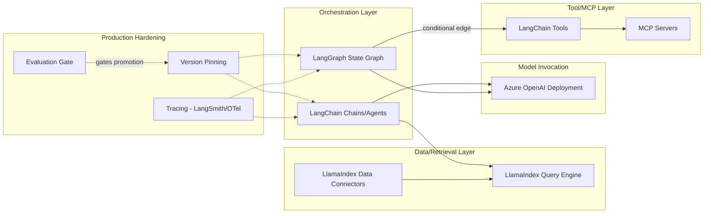
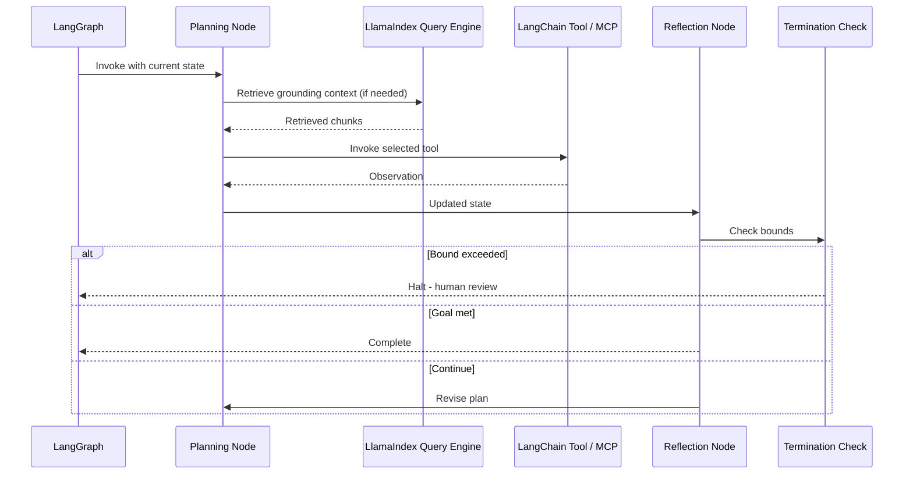
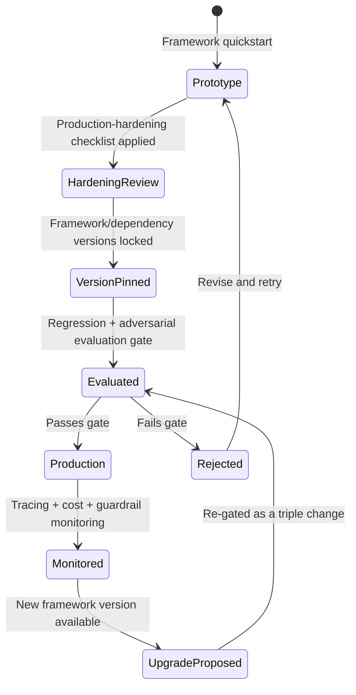

# LangChain and LlamaIndex

> Part of the **Enterprise Data & AI Architecture Handbook** · Phase-12 — LLMOps & Agentic AI · Chapter 08.
> Estimated study time: **60 min reading + ~4h labs**.
> **Prerequisite:** read [Retrieval Augmented Generation](03_Retrieval_Augmented_Generation.md) first.

---

## Executive Summary

Every prior Phase-12 chapter has named LangChain and LlamaIndex in passing — as the orchestration layer that assembles prompts (per [Prompt Engineering](02_Prompt_Engineering.md#open-source-implementation)), implements retrieval pipelines (per [Retrieval Augmented Generation](03_Retrieval_Augmented_Generation.md#open-source-implementation)), provides tracing hooks (per [LLMOps](04_LLMOps.md#open-source-implementation)), builds agent loops and multi-agent systems (per [Agentic AI Architecture](05_Agentic_AI_Architecture.md#open-source-implementation)), and consumes MCP servers (per [Model Context Protocol (MCP)](06_Model_Context_Protocol_MCP.md#open-source-implementation)) — without ever covering either framework as a first-class subject. This chapter closes that gap: it covers LangChain and LlamaIndex concretely, as the two dominant open-source orchestration frameworks an enterprise chooses between (or combines) when building the architectures every prior chapter has established conceptually.

This chapter covers **LangChain's chains, agents, and tools** as its core composability abstractions; **LlamaIndex's data connectors and indexes** as its data-ingestion-and-retrieval specialization; **LangGraph** (LangChain's graph-based extension) as the explicit, inspectable state-machine alternative to an implicit agent-loop control flow; the **framework-vs-build-your-own** decision that every enterprise adopting either framework must make deliberately rather than by default; and **production hardening** as the discipline that closes the well-documented gap between a framework's quickstart-tutorial demo and an actually reliable, governed production deployment.

This chapter's central thesis: LangChain and LlamaIndex are **composability and integration accelerators**, not a substitute for the architectural discipline established throughout Chapters 02-07 — a chain, agent, or index built with either framework still requires the same prompt-versioning ([Prompt Engineering](02_Prompt_Engineering.md) §2.4), access-control-propagation ([Retrieval Augmented Generation](03_Retrieval_Augmented_Generation.md) ADR-0157), triple-versioned evaluation gate ([LLMOps](04_LLMOps.md) ADR-0158), and bounded-execution ([Agentic AI Architecture](05_Agentic_AI_Architecture.md) ADR-0159) discipline this handbook has established — the framework accelerates *building* the architecture, it does not relieve the team of *governing* it.

Because this chapter's subject is squarely the open-source orchestration layer, its platform ratio is deliberately shifted from the handbook's usual 60/30/10 baseline toward **~50% Azure** (as the primary deployment and model-hosting context these frameworks integrate with — Azure OpenAI Service, Azure AI Search, Azure Container Apps/AKS hosting) — **~40% enterprise open source** (LangChain, LlamaIndex, and LangGraph themselves as the chapter's actual subject, plus Redis, Qdrant/Milvus, and OpenTelemetry as their common integration points) — **~10% AWS/GCP comparison-only** (Amazon Bedrock's and Google Vertex AI's own framework-integration patterns), consistent with the same subject-matter-driven ratio adjustment already established as precedent in [Azure Machine Learning](../Phase-11/05_Azure_Machine_Learning.md) and [Azure OpenAI and AI Foundry](07_Azure_OpenAI_and_AI_Foundry.md).

**Bottom line:** choosing and correctly hardening an orchestration framework is a genuine, consequential architecture decision — not a default, interchangeable implementation detail — and an enterprise that treats LangChain or LlamaIndex's quickstart tutorial as production-ready without applying this chapter's hardening discipline inherits every failure mode this handbook has already documented (unversioned prompts, unbounded agent loops, ungoverned tool access) with a framework's convenience layered on top rather than a solution underneath.

---

## Learning Objectives

By the end of this chapter you will be able to:

1. **Explain LangChain's chain, agent, and tool abstractions**, and how they compose into the architectures established in [Prompt Engineering](02_Prompt_Engineering.md) and [Agentic AI Architecture](05_Agentic_AI_Architecture.md).
2. **Explain LlamaIndex's data-connector and index abstractions**, and how they implement the ingestion and retrieval architecture from [Retrieval Augmented Generation](03_Retrieval_Augmented_Generation.md).
3. **Design a stateful, graph-based agent workflow using LangGraph**, applying the bounded-execution principles from [Agentic AI Architecture](05_Agentic_AI_Architecture.md) ADR-0159.
4. **Evaluate the framework-vs-build-your-own decision** for a given enterprise use case, considering maintenance cost, control, and lock-in.
5. **Apply production-hardening practices** (versioning, tracing, evaluation, guardrails, cost control) to a framework-built application, extending [LLMOps](04_LLMOps.md)'s discipline to a framework-specific implementation.
6. **Apply Azure-native tooling** to deploy, monitor, and govern a LangChain, LlamaIndex, or LangGraph application in production.
7. **Defend framework-selection and hardening decisions** in engineer, staff engineer, architect, and CTO review settings, including when a direct, framework-free implementation is the better choice.

---

## Business Motivation

- **Orchestration frameworks materially reduce time-to-first-prototype for LLM and agentic applications**, providing pre-built abstractions for prompt templating, retrieval, tool calling, and agent loops rather than requiring every team to build these from the API primitives covered in Chapters 02-05 independently.
- **The well-documented gap between a framework quickstart and a production-ready system is a direct, quantifiable engineering cost an enterprise must budget for explicitly** — a team that treats a working demo as "done" inherits every governance gap this handbook has warned against, now with the added risk of mistaking framework convenience for production readiness.
- **Framework choice has real lock-in and maintenance-cost consequences.** LangChain's broad, general-purpose composability and LlamaIndex's data-and-retrieval specialization represent different bets about where an enterprise's engineering effort will concentrate — a decision that, once significant application code is built against a framework's abstractions, is genuinely costly to reverse.
- **LangGraph's explicit state-machine model directly addresses a real, documented production-reliability gap** in the earlier, more implicit agent-loop patterns covered in [Agentic AI Architecture](05_Agentic_AI_Architecture.md) §5.1 — an inspectable, debuggable graph structure is a concrete engineering-reliability improvement with direct incident-diagnosis-time and audit-defensibility value.
- **An enterprise standardizing on a small number of well-hardened frameworks, rather than allowing ad hoc per-team framework selection**, gets the same shared-tooling and consistent-governance benefit [LLMOps](04_LLMOps.md#enterprise-recommendations) and [Model Context Protocol (MCP)](06_Model_Context_Protocol_MCP.md#enterprise-recommendations) established for gateways and MCP servers, now applied to the orchestration-framework layer.

---

## History and Evolution

- **October 2022 — LangChain is released**, providing composable abstractions (chains, prompt templates, and early agent patterns) for building LLM-powered applications atop the GPT-3-era API, rapidly becoming the most widely-adopted orchestration framework during the initial post-ChatGPT enterprise adoption wave (per [Large Language Model Foundations](01_Large_Language_Model_Foundations.md#history-and-evolution)).
- **November 2022 — LlamaIndex (originally GPT Index) is released**, focused specifically on the data-ingestion, indexing, and retrieval problem — establishing itself as the framework of choice for teams whose primary need was grounding a model in external data (per [Retrieval Augmented Generation](03_Retrieval_Augmented_Generation.md)) rather than general-purpose orchestration.
- **2023 — both frameworks rapidly expand their tool-use and agent capabilities**, adding native function/tool-calling integration (per [Prompt Engineering](02_Prompt_Engineering.md#23-structured-output-and-function-calling) §2.3's API-level capability) and early agent-loop implementations, alongside a growing ecosystem of third-party integrations (vector databases, data loaders, and model providers).
- **2023 — the gap between LangChain's rapid feature growth and production-hardening maturity becomes a widely-documented practitioner concern**, with public critiques centering on debugging difficulty in deeply-nested chain abstractions and version-to-version breaking changes — directly motivating this chapter's Production Hardening section and the framework-vs-build-your-own evaluation in §8.4.
- **January 2024 — LangGraph is released** as LangChain's answer to this reliability concern, providing an explicit, graph-based state-machine abstraction for agent workflows — directly addressing the debuggability gap by making an agent's control flow and state transitions an inspectable graph rather than an implicit loop, aligning with the broader industry shift toward more structured, evaluable agent architectures noted in [Agentic AI Architecture](05_Agentic_AI_Architecture.md#history-and-evolution).
- **2023-2024 — both frameworks add native tracing and evaluation integration** (LangChain's LangSmith, LlamaIndex's observability integrations), directly responding to the same LLMOps tracing-and-evaluation gap [LLMOps](04_LLMOps.md) established as a mandatory operational discipline, not an optional add-on.
- **2024-2025 — both frameworks add native MCP-client support** (per [Model Context Protocol (MCP)](06_Model_Context_Protocol_MCP.md#history-and-evolution)), reflecting the broader industry convergence on MCP as the standard tool-integration protocol.
- **2024-present — enterprise adoption patterns increasingly favor a deliberate, risk-aware framework-selection process** (rather than defaulting to whichever framework a prototype happened to be built with), directly reflecting the maturation this chapter's §8.4 and Enterprise Recommendations both codify.

---

## Why This Technology Exists

LangChain and LlamaIndex exist because building a production LLM or agentic application from raw API primitives alone — the chat-completions API, function calling, and a hand-rolled retrieval pipeline, all covered individually in Chapters 01-05 — requires re-implementing a substantial amount of genuinely reusable composability logic (prompt templating, chain-of-calls sequencing, tool-registry management, data-connector integrations for dozens of common source-document formats and stores) independently for every application. Both frameworks exist to provide that reusable composability layer once, so that an application team assembles pre-built, tested components (a chain, an index, a tool) rather than re-implementing the same integration logic from scratch — LangChain's original focus was general-purpose orchestration composability, while LlamaIndex's original and continuing focus is the data-ingestion-and-retrieval specialization directly relevant to [Retrieval Augmented Generation](03_Retrieval_Augmented_Generation.md)'s architecture. LangGraph exists because the earlier, more implicit chain/agent-loop abstraction both frameworks originally offered proved difficult to debug and reason about for genuinely complex, multi-step, stateful agent workflows — an explicit graph structure exists to make an agent's control flow and state transitions inspectable and testable in a way an implicit loop does not.

---

## Problems It Solves

- **Re-implementing prompt templating, chain sequencing, and tool-registry management for every application** — LangChain's chains, agents, and tools (§8.1) provide these as reusable, tested abstractions, directly reducing the custom-implementation burden for the architecture established in [Prompt Engineering](02_Prompt_Engineering.md) and [Agentic AI Architecture](05_Agentic_AI_Architecture.md).
- **Re-implementing document loading, chunking, and indexing for every data source and every RAG pipeline** — LlamaIndex's data connectors and indexes (§8.2) provide a broad library of pre-built loaders and indexing strategies, directly reducing the ingestion-pipeline engineering effort established in [Retrieval Augmented Generation](03_Retrieval_Augmented_Generation.md#31-rag-architecture-and-components) §3.1.
- **Debugging and reasoning about a complex, multi-step agent's control flow** — LangGraph's explicit state-graph model (§8.3) makes an agent's plan-act-observe-reflect loop (per [Agentic AI Architecture](05_Agentic_AI_Architecture.md#51-agent-loops-plan-act-observe-reflect) §5.1) inspectable and testable as a defined graph rather than an implicit, harder-to-trace loop.
- **Framework lock-in risk from an undeliberate, default framework choice** — the structured framework-vs-build-your-own evaluation (§8.4) gives an enterprise a deliberate decision process rather than defaulting to whichever framework a prototype happened to use.
- **The gap between a working prototype and a production-ready system** — this chapter's Production Hardening section (§8.5) gives a concrete checklist extending [LLMOps](04_LLMOps.md)'s operational discipline to a framework-specific implementation, directly closing the well-documented demo-to-production reliability gap named in History and Evolution.

---

## Problems It Cannot Solve

- **Neither framework makes a poorly-designed prompt, poorly-chunked retrieval corpus, or poorly-scoped agent good merely by being built with it.** Both frameworks provide composability tooling; they do not substitute for the prompt-engineering (Chapter 02), retrieval-engineering (Chapter 03), or agent-design (Chapter 05) judgment those architectures require.
- **Neither framework, by itself, provides the versioning, evaluation-gate, or guardrail discipline [LLMOps](04_LLMOps.md) established as mandatory.** Both frameworks offer tracing and evaluation *integration points* — they do not enforce a non-bypassable evaluation gate or guardrail configuration automatically; that discipline must be deliberately built and operated by the adopting team, exactly as it would for a framework-free implementation.
- **Neither framework eliminates the underlying LLM's cost, latency, or reasoning limitations** established in [Large Language Model Foundations](01_Large_Language_Model_Foundations.md) — a chain or agent built with either framework still pays the same per-token cost, the same quadratic attention-cost scaling, and is subject to the same reasoning-error compounding [Agentic AI Architecture](05_Agentic_AI_Architecture.md#55-reliability-cost-and-failure-modes) §5.5 named.
- **Neither framework's abstraction layer is free of its own performance and debugging overhead.** A deeply-nested chain or an overly-abstracted LlamaIndex query pipeline can itself introduce latency and debugging difficulty beyond what a more direct, framework-free implementation would have — the well-documented practitioner critique named in History and Evolution, and a genuine cost this chapter's Trade-offs section weighs explicitly.
- **Neither framework resolves the fundamental tension between rapid, framework-accelerated prototyping and the deliberate architectural review this handbook has established throughout** — a framework's ease of assembly can tempt a team to skip the same governance and evaluation discipline [LLMOps](04_LLMOps.md) established as mandatory, a temptation this chapter's Production Hardening section is built specifically to counter.

---

## Core Concepts

### 8.1 LangChain Chains, Agents, and Tools

- **A chain composes a sequence of LLM calls, prompt-template renderings, and data-transformation steps into a single, reusable, invokable unit** — the direct framework implementation of the prompt-template-plus-assembly-logic architecture established in [Prompt Engineering](02_Prompt_Engineering.md#24-prompt-templates-and-versioning) §2.4, letting a team compose (for example) a retrieval step, a prompt-assembly step, and a generation step into one chain rather than hand-wiring each step's output into the next.
- **LangChain Expression Language (LCEL)** provides a declarative, composable syntax for building chains via a pipe-like operator composition, making a chain's structure — which steps run in sequence, which run in parallel — explicit and inspectable at the code level, directly supporting the same tracing and debuggability goals [LLMOps](04_LLMOps.md#42-promptresponse-logging-and-tracing) §4.2 established as a foundational LLMOps requirement.
- **LangChain's agent abstraction** implements the plan-act-observe loop from [Agentic AI Architecture](05_Agentic_AI_Architecture.md#51-agent-loops-plan-act-observe-reflect) §5.1 as a pre-built executor, handling the mechanics of repeatedly invoking the model, parsing its tool-call requests, executing the selected tool, and feeding the result back — the framework accelerates *building* this loop, but every termination-bound, least-privilege-scoping, and human-approval-gate requirement from [Agentic AI Architecture](05_Agentic_AI_Architecture.md) ADR-0159 and [Prompt Engineering](02_Prompt_Engineering.md) ADR-0156 must still be deliberately configured by the adopting team — the framework does not supply these bounds by default.
- **LangChain's tool abstraction** wraps a Python function (or an external API call) in a standard interface (name, description, argument schema) directly analogous to the function-calling and MCP tool-registry concepts from [Prompt Engineering](02_Prompt_Engineering.md#23-structured-output-and-function-calling) §2.3 and [Model Context Protocol (MCP)](06_Model_Context_Protocol_MCP.md#62-tools-resources-and-prompts) §6.2 — and, per LangChain's native MCP-client support, a LangChain application can directly consume tools exposed by an MCP server without a separate integration layer.
- **Chain and agent composability is LangChain's primary strength, and also its primary documented risk**: a deeply-nested chain of chains can become genuinely difficult to trace, debug, and reason about — the specific practitioner concern History and Evolution named as directly motivating both LangGraph's more explicit graph model (§8.3) and this chapter's Production Hardening tracing requirements (§8.5).

### 8.2 LlamaIndex Data Connectors and Indexes

- **Data connectors (loaders)** provide a broad library of pre-built integrations for ingesting content from common source formats and systems (documents, databases, APIs, and SaaS platforms) into LlamaIndex's ingestion pipeline — directly implementing the document-loading stage of the RAG architecture from [Retrieval Augmented Generation](03_Retrieval_Augmented_Generation.md#31-rag-architecture-and-components) §3.1, reducing the custom-integration effort for dozens of common enterprise data sources.
- **Indexes** are LlamaIndex's core abstraction over a chunked, embedded document corpus, supporting multiple indexing strategies (a flat vector index, a hierarchical/tree index for structured summarization-then-drill-down retrieval, or a keyword-table index) — giving a team a choice of retrieval strategy matched to a specific corpus's structure, extending the chunking-and-embedding-strategy decision from [Retrieval Augmented Generation](03_Retrieval_Augmented_Generation.md#32-chunking-and-embedding-strategies) §3.2 into a framework-supported set of pre-built strategy options rather than requiring each to be hand-implemented.
- **Query engines** wrap an index with the actual retrieval-and-generation logic — including, in LlamaIndex's more advanced query-engine configurations, built-in support for hybrid retrieval, reranking, and query decomposition — directly implementing the reranking-and-context-assembly discipline from [Retrieval Augmented Generation](03_Retrieval_Augmented_Generation.md#34-reranking-and-context-assembly) §3.4 as configurable, pre-built query-engine options.
- **LlamaIndex's specialization in data ingestion and retrieval makes it a common complementary choice alongside LangChain** (using LlamaIndex for the ingestion/retrieval layer and LangChain or LangGraph for the broader orchestration and agent-loop layer) rather than the two frameworks being treated as strictly mutually exclusive alternatives — a common enterprise architecture pattern this chapter's Architecture section reflects.
- **As with LangChain's chain-composability risk, LlamaIndex's higher-level, more abstracted query-engine configurations can obscure the underlying retrieval mechanics** (which specific chunking, embedding, and retrieval-fusion decisions are actually being applied) from a team not deliberately inspecting the configuration — the same "understand what the framework is actually doing under the abstraction" discipline this chapter's Production Hardening section applies equally to both frameworks.

### 8.3 LangGraph for Stateful Agents

- **LangGraph models an agent's workflow as an explicit directed graph of nodes (steps) and edges (transitions, including conditional branching)**, with a defined, persistent state object passed between nodes — directly implementing the plan-act-observe-reflect loop from [Agentic AI Architecture](05_Agentic_AI_Architecture.md#51-agent-loops-plan-act-observe-reflect) §5.1 as an inspectable graph structure rather than an implicit control-flow loop, the direct architectural response to the debuggability concern named in History and Evolution.
- **Explicit state management** is LangGraph's core distinguishing capability relative to LangChain's earlier, more implicit agent executor — the full working-memory state (per [Agentic AI Architecture](05_Agentic_AI_Architecture.md#53-short--and-long-term-memory-design) §5.3) is a first-class, inspectable object at every graph node, making it straightforward to log, checkpoint, and resume an agent's execution state, and to test individual nodes in isolation.
- **Conditional edges** implement the reflection-driven plan-revision behavior from [Agentic AI Architecture](05_Agentic_AI_Architecture.md#51-agent-loops-plan-act-observe-reflect) §5.1 as an explicit graph transition (e.g., "if the reflection node determines progress is insufficient, route back to the planning node; if the goal is met, route to the completion node") — making an agent's actual decision logic for continuing, revising, or terminating fully visible and testable at the graph-definition level, rather than buried inside a loop's implicit conditional logic.
- **LangGraph's explicit graph structure directly supports implementing [Agentic AI Architecture](05_Agentic_AI_Architecture.md) ADR-0159's mandatory termination bounds as first-class graph elements** — a step-count or cost-budget check can be modeled as an explicit conditional edge routing to a "halt: human review required" terminal node, making the bound's enforcement a visible, testable part of the graph definition rather than an easily-overlooked implicit check buried in a loop's body.
- **Human-in-the-loop approval gates** (per [Agentic AI Architecture](05_Agentic_AI_Architecture.md#52-tool-use-and-function-calling) §5.2's least-privilege, risk-tiered tool-approval requirement) are directly modeled in LangGraph as an explicit "interrupt" node that pauses graph execution pending external approval before proceeding — giving this chapter's most safety-critical agentic-architecture requirement a first-class, framework-supported implementation rather than requiring bespoke pause/resume logic.

### 8.4 Framework vs. Build-Your-Own

- **The framework-vs-build-your-own decision should be evaluated against the specific application's complexity, the team's existing familiarity, and the genuine reusability of the framework's abstractions for the use case at hand** — not defaulted to "always use a framework" or "always build direct," per this chapter's Decision Matrix.
- **A framework is the stronger default choice when an application genuinely benefits from its pre-built composability** (multiple chained steps, multiple data-source integrations, a need for LangGraph's explicit state management for a complex agent) — the engineering-effort savings from reusing tested abstractions typically outweighs the framework's own abstraction overhead and learning curve for these cases.
- **A direct, framework-free implementation (calling the Azure OpenAI Service API and Azure AI Search directly, per [Prompt Engineering](02_Prompt_Engineering.md#azure-implementation) and [Retrieval Augmented Generation](03_Retrieval_Augmented_Generation.md#azure-implementation)) is the stronger choice for a simple, well-scoped, single-call or single-retrieval-step application** where a framework's abstraction overhead (additional dependency surface, version-upgrade risk, debugging-through-abstraction-layers cost) is not justified by genuine composability need — the same right-sizing principle this handbook has applied to model selection (per [Large Language Model Foundations](01_Large_Language_Model_Foundations.md#decision-matrix)) and evaluation depth (per [Responsible AI](../Phase-11/07_Responsible_AI.md#trade-offs)) now applied to framework adoption.
- **Framework version-upgrade risk is a genuine, recurring maintenance cost** — both frameworks have a documented history of breaking changes across versions (per History and Evolution), meaning an enterprise adopting either framework must budget for periodic version-upgrade testing and regression validation as an ongoing cost, not a one-time adoption decision.
- **Adopting a framework does not preclude a hybrid approach**: using a framework for the components that genuinely benefit from its abstractions (e.g., LlamaIndex for data ingestion) while implementing a simpler, more latency-sensitive component directly against the underlying API — a common, pragmatic pattern rather than an all-or-nothing framework commitment.

### 8.5 Production Hardening

- **Version-pin the framework and every framework-managed dependency (embedding models, vector-store client libraries)** as part of the same triple-versioning discipline established in [LLMOps](04_LLMOps.md#41-llm-lifecycle-and-versioning) §4.1 — an unpinned framework version can silently change chain, agent, or query-engine behavior on a routine dependency update, directly recreating the "only the prompt changed, so it's low-risk" anti-pattern [LLMOps](04_LLMOps.md#governance) warns against, now at the framework-dependency layer.
- **Instrument full-pipeline tracing using the framework's native tracing integration** (LangSmith for LangChain/LangGraph, LlamaIndex's observability integrations) or a framework-agnostic OpenTelemetry integration, directly implementing [LLMOps](04_LLMOps.md#42-promptresponse-logging-and-tracing) §4.2's distributed-tracing requirement rather than relying on a framework's default (often comparatively sparse) built-in logging.
- **Apply the same evaluation gate, guardrail configuration, and least-privilege tool scoping this handbook has established throughout Chapters 02-06 explicitly**, since neither framework enforces these by default — a chain, agent, or LangGraph workflow's tool registry must still be reviewed against [Prompt Engineering](02_Prompt_Engineering.md) ADR-0156, and its retrieval index must still satisfy [Retrieval Augmented Generation](03_Retrieval_Augmented_Generation.md) ADR-0157's access-control-propagation requirement, regardless of which framework assembled the pipeline.
- **Load-test and profile a framework-built application's actual latency and cost profile before production launch**, since a framework's convenience-oriented default configuration (e.g., an unnecessarily deep chain, an unoptimized query-engine configuration) can introduce latency or cost overhead beyond what a hand-tuned implementation would incur — validated against the same TTFT/TPOT and per-request-cost discipline established in [Large Language Model Foundations](01_Large_Language_Model_Foundations.md#14-inference-cost-latency-and-quantization) §1.4.
- **Treat a framework upgrade exactly like any other change to the model/prompt/retrieval-index triple** (per [LLMOps](04_LLMOps.md) ADR-0158's atomic-triple-versioning mandate, now extended to include the framework/library-version dimension) — requiring the same full regression-evaluation gate before promotion, since a framework version bump can change chain, agent, or query-engine behavior in ways a superficial code review would not catch.

---

## Internal Working

**How a LangGraph-orchestrated, LlamaIndex-grounded agentic request actually executes** (the mechanics underlying §8.1-§8.3, and a concrete instantiation of the architecture established in [Agentic AI Architecture](05_Agentic_AI_Architecture.md#internal-working) and [Retrieval Augmented Generation](03_Retrieval_Augmented_Generation.md#internal-working) using this chapter's specific frameworks):

1. **Graph initialization**: a LangGraph state graph is initialized with the incoming goal, and its state object (working memory, per [Agentic AI Architecture](05_Agentic_AI_Architecture.md#53-short--and-long-term-memory-design) §5.3) is populated.
2. **Planning node**: the graph's planning node invokes the LLM (via LangChain's chat-model abstraction, backed by an Azure OpenAI Service deployment per [Azure OpenAI and AI Foundry](07_Azure_OpenAI_and_AI_Foundry.md#71-azure-openai-deployments-and-quotas) §7.1) to determine the next action.
3. **Conditional routing**: LangGraph's conditional edge logic evaluates the planning node's output, routing to a retrieval node (if grounding is needed, invoking a LlamaIndex query engine per §8.2), a tool-invocation node (per LangChain's tool abstraction, §8.1, potentially sourced from an MCP server per [Model Context Protocol (MCP)](06_Model_Context_Protocol_MCP.md#internal-working)), a human-approval interrupt node (for a high-consequence tool, per [Agentic AI Architecture](05_Agentic_AI_Architecture.md#52-tool-use-and-function-calling) §5.2), or a completion node.
4. **Action execution and state update**: the selected node executes (a LlamaIndex retrieval, a tool invocation, or an approval wait), and its result updates the shared graph state object.
5. **Reflection node**: a subsequent node evaluates the updated state against the original goal, routing back to the planning node (§8.3's conditional-edge revision pattern) or forward to a termination-bound check.
6. **Termination-bound check**: an explicit graph node checks the accumulated step count and cost against the configured bounds (per [Agentic AI Architecture](05_Agentic_AI_Architecture.md) ADR-0159), routing to a "halt: human review" terminal node if exceeded, or continuing the loop otherwise.
7. **Tracing and logging**: every node transition and state update is captured by the framework's tracing integration (§8.5), feeding the same monitoring and evaluation pipeline established in [LLMOps](04_LLMOps.md#42-promptresponse-logging-and-tracing) §4.2.

This sequence is the concrete, framework-specific instantiation of every architectural principle from Chapters 03-06 — LangGraph's explicit graph structure does not change *what* the agent-loop architecture requires, it changes *how visibly and testably* that architecture's control flow, state, and termination bounds are represented in code.

---

## Architecture

- **Orchestration layer**: LangChain (chains, agents, tools, §8.1) or LangGraph (explicit stateful agent workflows, §8.3), composing the application's overall control flow.
- **Data/retrieval layer**: LlamaIndex (data connectors and indexes, §8.2), commonly used alongside LangChain/LangGraph for the ingestion-and-retrieval-specific portion of the pipeline (per §8.2's complementary-use pattern), or Azure AI Search directly for a simpler, "On Your Data"-integrated deployment (per [Azure OpenAI and AI Foundry](07_Azure_OpenAI_and_AI_Foundry.md#73-on-your-data-and-grounding) §7.3).
- **Model-invocation layer**: Azure OpenAI Service deployments (per [Azure OpenAI and AI Foundry](07_Azure_OpenAI_and_AI_Foundry.md#71-azure-openai-deployments-and-quotas) §7.1), invoked via either framework's chat-model abstraction.
- **Tool/MCP layer**: LangChain's tool abstraction and native MCP-client support (§8.1), consuming tools from governed MCP servers per [Model Context Protocol (MCP)](06_Model_Context_Protocol_MCP.md#architecture).
- **Governance/hardening layer**: version pinning, tracing integration, evaluation gates, and guardrail configuration (§8.5), extending [LLMOps](04_LLMOps.md#architecture)'s architecture to this chapter's specific framework layer.
- **Hosting layer**: Azure Container Apps or AKS (per [Kubernetes](../Phase-09/06_Kubernetes.md)), hosting the framework-built application itself, distinct from the managed model-hosting Azure OpenAI Service provides.

---

## Components

- **Chains/LCEL pipelines** — composed sequences of prompt, retrieval, and generation steps (§8.1).
- **Agent executor or LangGraph state graph** — the agent-loop implementation (§8.1, §8.3).
- **Tool registry** — LangChain tool definitions, potentially sourced from an MCP server (§8.1).
- **LlamaIndex data connectors and query engines** — the ingestion and retrieval components (§8.2).
- **Tracing integration** — LangSmith, LlamaIndex observability hooks, or OpenTelemetry (§8.5).
- **Version-pinned dependency manifest** — the framework and library version lock file, treated as part of the versioned triple (§8.5).
- **Human-approval interrupt mechanism** (LangGraph) — the pause/resume node for high-consequence tool calls (§8.3).

---

## Metadata

- **Chain/graph-definition metadata**: the specific chain composition or LangGraph node/edge structure, version-controlled alongside the prompt templates it invokes (per [Prompt Engineering](02_Prompt_Engineering.md#metadata)).
- **Framework/library version metadata**: the specific LangChain, LlamaIndex, and LangGraph versions (and their transitive dependency versions) pinned for a given deployment — extending [LLMOps](04_LLMOps.md#metadata)'s triple-version metadata with a framework-version dimension.
- **Index configuration metadata**: the specific LlamaIndex indexing strategy, chunking configuration, and connected data sources (§8.2), extending [Retrieval Augmented Generation](03_Retrieval_Augmented_Generation.md#metadata)'s chunk metadata to the framework-specific configuration layer.
- **Graph-execution trace metadata**: the full node-by-node state transition history for a given LangGraph execution, extending [Agentic AI Architecture](05_Agentic_AI_Architecture.md#metadata)'s agent-run metadata with framework-specific graph-trace detail.

---

## Storage

- **Chain, agent, and graph definitions** are stored in source control alongside application code, versioned identically to any other governed code artifact (per [DevOps and CI/CD](../Phase-09/03_DevOps_and_CI_CD.md)).
- **LlamaIndex indexes** are persisted to the same backing vector/keyword store already covered in [Retrieval Augmented Generation](03_Retrieval_Augmented_Generation.md#storage) (Azure AI Search, or Qdrant/Milvus for a self-hosted deployment), with LlamaIndex itself typically storing only index-configuration metadata rather than duplicating the underlying document corpus.
- **Trace and evaluation data** generated by a framework's tracing integration follows the same retention and PII-handling discipline established in [LLMOps](04_LLMOps.md#storage).

---

## Compute

- **The orchestration framework's own compute overhead is typically small relative to the underlying LLM inference cost**, though a deeply-nested chain or an inefficiently-configured LlamaIndex query engine can introduce meaningful additional latency-driving compute (extra intermediate LLM calls, redundant re-embedding) that a load-test (§8.5) should surface before production launch.
- **The application hosting itself** (Azure Container Apps or AKS, per Architecture above) requires its own compute provisioning, sized to the framework application's actual request volume, distinct from the managed Azure OpenAI Service compute it invokes.

---

## Networking

- **No materially distinct networking requirements beyond the model-invocation, retrieval, and MCP networking postures already established** in [Large Language Model Foundations](01_Large_Language_Model_Foundations.md#networking), [Retrieval Augmented Generation](03_Retrieval_Augmented_Generation.md#networking), and [Model Context Protocol (MCP)](06_Model_Context_Protocol_MCP.md#networking) — the framework application itself should be deployed with the same private-networked posture as any other production service handling enterprise data.

---

## Security

- **A framework's tool-execution mechanism carries the same least-privilege scoping requirement as any other tool registry** (per [Prompt Engineering](02_Prompt_Engineering.md) ADR-0156) — LangChain's ease of wrapping an arbitrary Python function as a tool makes it correspondingly easy to accidentally expose an overprivileged capability "for convenience," a risk this chapter's Anti-patterns section names directly.
- **A framework's default configuration is not inherently secure** — neither framework enables content-safety filtering, injection defense, or access-control-propagating retrieval by default; every security control from [Prompt Engineering](02_Prompt_Engineering.md), [Retrieval Augmented Generation](03_Retrieval_Augmented_Generation.md), and [LLMOps](04_LLMOps.md) must be deliberately configured regardless of framework choice.
- **Third-party framework integrations (data-loader connectors, vector-store clients, tool wrappers) carry the same software-supply-chain risk** as any other external dependency (per [Security Foundations](../Phase-10/01_Security_Foundations.md)) — both frameworks' large, actively-growing ecosystem of community-contributed integrations warrants the same provenance review [Model Context Protocol (MCP)](06_Model_Context_Protocol_MCP.md#security) established for third-party MCP servers.

---

## Performance

- **Chain and query-engine abstraction depth directly affects latency**, per Problems It Cannot Solve — a load-test comparing a framework-assembled pipeline's actual latency against a direct API-call baseline (§8.5) is the concrete way to surface and quantify any abstraction-layer overhead before it reaches production.
- **LangGraph's explicit state management adds negligible overhead relative to an implicit agent loop** when implemented correctly, since the state object is simply passed between nodes rather than introducing additional LLM calls of its own — the performance cost of adopting LangGraph over a simpler agent executor is primarily in initial implementation complexity, not runtime overhead.

---

## Scalability

- **A framework-built application scales via the same horizontal-scaling patterns established for any other stateless (or externally-state-backed) service** (per [Model Serving and Ray](../Phase-11/04_Model_Serving_and_Ray.md#42-serving-patterns-and-autoscaling) §4.2), provided the application itself does not hold in-process state that would prevent horizontal scaling — a LangGraph application's state object should be persisted to an external store (Redis, per [Agentic AI Architecture](05_Agentic_AI_Architecture.md#open-source-implementation)) for a multi-instance, horizontally-scaled deployment rather than held only in a single process's memory.
- **LlamaIndex query-engine and index scalability** follows the same vector/keyword-index scaling concerns established in [Retrieval Augmented Generation](03_Retrieval_Augmented_Generation.md#scalability).

---

## Fault Tolerance

- **A framework-level exception (a malformed tool-call parse, an unexpected chain-step failure) should be caught and handled explicitly**, following the same fail-gracefully-not-silently principle established in [Agentic AI Architecture](05_Agentic_AI_Architecture.md#fault-tolerance) — neither framework's default exception behavior should be assumed production-ready without explicit testing and handling.
- **A framework version upgrade should be validated through the same regression-evaluation gate as any other triple-versioned change** (§8.5, per [LLMOps](04_LLMOps.md) ADR-0158), with a documented rollback path to the previously-pinned version if the upgrade introduces a regression.

---

## Cost Optimization (FinOps)

- **Minimizing unnecessary intermediate LLM calls within a chain or query engine** (e.g., an unnecessary summarization step, a redundant re-ranking pass) directly reduces per-request cost, extending [Large Language Model Foundations](01_Large_Language_Model_Foundations.md#cost-optimization-finops)'s general cost-optimization discipline to framework-specific configuration choices.
- **Right-sizing LlamaIndex's index and query-engine configuration** (avoiding an unnecessarily deep hierarchical index or an oversized reranking candidate set where a simpler flat vector index would suffice) is a direct, framework-specific instance of the general right-sizing principle established throughout this handbook.
- **Framework-adoption cost itself (learning curve, version-upgrade maintenance) should be weighed against its engineering-effort savings** in the framework-vs-build-your-own decision (§8.4) — a genuine, if less obviously visible, FinOps consideration beyond per-request inference cost alone.

---

## Monitoring

- **Framework-specific tracing metrics** (chain/graph node-level latency and error rate, LlamaIndex query-engine retrieval-quality metrics) extending [LLMOps](04_LLMOps.md#monitoring)'s general per-request monitoring with framework-specific granularity.
- **Framework and dependency version currency**, tracked as a standing monitoring signal to catch an unpinned or drifted dependency before it causes an unreviewed behavior change.

---

## Observability

- **Full node-by-node or chain-step tracing** (via LangSmith, LlamaIndex's observability integration, or a framework-agnostic OpenTelemetry integration) gives the same diagnostic capability established in [LLMOps](04_LLMOps.md#observability) and [Agentic AI Architecture](05_Agentic_AI_Architecture.md#observability), now at the specific granularity of a chain's individual steps or a LangGraph's individual nodes.

### Operational Response Playbook

| Signal | Detection Query/Check | Remediation |
|---|---|---|
| **A framework or dependency version upgrade correlates with a sustained regression in latency, cost, or evaluation-suite score** | Version-segmented monitoring dashboard, comparing the newly-upgraded version against the immediately prior pinned version | Roll back to the previously-pinned framework/dependency version (per Fault Tolerance's rollback path) and re-diagnose the specific behavioral change in a non-production environment before re-attempting the upgrade |
| **A specific chain step or LangGraph node shows disproportionately high latency or error rate relative to the rest of the pipeline** | Node/step-level tracing dashboard, isolating the specific stage's contribution to overall request latency and error rate | Investigate whether the specific step's abstraction depth (an unnecessary intermediate call, an oversized candidate set) is the root cause, per the load-testing discipline in §8.5, rather than assuming the entire pipeline is uniformly slow |

---

## Governance

- **Every framework-built application requires the same documented tool registry, evaluation-gate result, and guardrail configuration as any framework-free implementation** — framework adoption does not exempt an application from any governance requirement established in [Prompt Engineering](02_Prompt_Engineering.md), [Retrieval Augmented Generation](03_Retrieval_Augmented_Generation.md), or [LLMOps](04_LLMOps.md).
- **Framework and dependency version pins must be documented and reviewed as part of the triple-versioning registry** (§8.5, per [LLMOps](04_LLMOps.md) ADR-0158's atomic-versioning mandate, extended in this chapter's ADR-0162 to include the framework-version dimension explicitly).
- **A standing organizational framework-selection policy** (which frameworks are approved, and the criteria for choosing among them per §8.4) should be established, rather than each team independently and inconsistently selecting a framework.

---

## Trade-offs

- **Composability and reuse vs. debugging transparency**: both frameworks' higher-level abstractions (deeply-nested chains, highly-configured query engines) accelerate assembly at the cost of debugging transparency — LangGraph's explicit state model (§8.3) directly improves this trade-off for agentic workflows specifically, without fully eliminating the general abstraction-depth cost.
- **Framework adoption vs. version-upgrade maintenance burden**: adopting either framework accelerates initial development at the cost of an ongoing, recurring version-upgrade validation burden (§8.4, §8.5) that a framework-free implementation does not carry to the same degree.
- **Standardizing on one framework vs. using each framework for its specific strength**: using LangChain/LangGraph for orchestration and LlamaIndex for data ingestion (§8.2's complementary-use pattern) captures each framework's specific strength, at the cost of operating and versioning two frameworks together rather than one.

---

## Decision Matrix

| Scenario | Recommended Approach | Rationale |
|---|---|---|
| Simple, single-call or single-retrieval-step application | Direct API implementation (Azure OpenAI Service, Azure AI Search) without a framework | Framework abstraction overhead is not justified for a use case without genuine composability need |
| Multi-step orchestration with multiple chained prompt/retrieval/generation steps | LangChain (chains/LCEL) | Directly captures the composability benefit this framework is built for |
| Data-ingestion-heavy use case with many source formats and a need for flexible indexing strategies | LlamaIndex | Purpose-built data-connector and index abstractions reduce ingestion-pipeline engineering effort |
| Complex, multi-step agent requiring explicit state management, human-approval gates, or precise termination-bound enforcement | LangGraph | Explicit graph structure directly supports [Agentic AI Architecture](05_Agentic_AI_Architecture.md) ADR-0159's bounded-execution and approval-gate requirements as first-class graph elements |
| An application needing both broad orchestration and deep data-ingestion capability | LangChain/LangGraph for orchestration + LlamaIndex for ingestion/retrieval | Captures each framework's specific strength, per §8.2's complementary-use pattern |

---

## Design Patterns

- **Framework-for-composability, direct-API-for-simplicity**: deliberately evaluating each component of an application against the framework-vs-build-your-own decision (§8.4) rather than defaulting either way.
- **LangGraph for bounded, safety-critical agentic workflows**, making termination bounds and human-approval gates explicit, first-class graph elements rather than implicit loop logic (§8.3).
- **LlamaIndex-for-ingestion, LangChain/LangGraph-for-orchestration**, combining each framework's specific strength (§8.2).
- **Framework-and-dependency version pinning as part of the triple**, treating every framework upgrade with the same evaluation-gate rigor as a model or prompt change (§8.5).

---

## Anti-patterns

- **Treating a framework's quickstart-tutorial demo as production-ready** without applying this chapter's Production Hardening discipline — the single most consequential anti-pattern this chapter's History and Evolution and §8.5 both address.
- **Wrapping an overprivileged Python function as a LangChain tool "for convenience,"** reintroducing the exact overprivileged-function risk [Prompt Engineering](02_Prompt_Engineering.md) ADR-0156 was designed to prevent, now behind a framework's easy tool-wrapping syntax.
- **Adopting a framework by default without evaluating the framework-vs-build-your-own decision**, incurring unnecessary abstraction overhead and version-upgrade maintenance burden for a use case simple enough not to need it.
- **Building a deeply-nested chain or an over-configured LlamaIndex query engine without load-testing its actual latency and cost profile**, discovering the abstraction-overhead cost only in production.
- **Upgrading a framework version without running it through the same regression-evaluation gate as any other triple-versioned change**, risking an unreviewed, silent behavior change per [LLMOps](04_LLMOps.md) ADR-0158's principle now extended to this dimension.

---

## Common Mistakes

- Assuming a framework's default configuration includes content-safety filtering, injection defense, or access-control-propagating retrieval, when in fact every one of these must be deliberately configured regardless of framework choice.
- Choosing LangGraph for a simple, non-agentic use case where its explicit state-graph overhead is not justified, or conversely, choosing a simpler agent executor for a genuinely complex agent where LangGraph's explicit bounds and approval gates would have materially improved reliability.
- Leaving framework and dependency versions unpinned, allowing a routine dependency update to silently change chain or agent behavior.
- Building an application with a deeply-nested chain structure without validating its actual end-to-end latency against a simpler, direct-API baseline.
- Assuming LlamaIndex's or LangChain's third-party community integrations carry the same trust and support guarantees as the core framework itself, without independent supply-chain review.

---

## Best Practices

- Evaluate the framework-vs-build-your-own decision deliberately per application component, rather than defaulting to a single framework choice organization-wide.
- Apply the full [Prompt Engineering](02_Prompt_Engineering.md), [Retrieval Augmented Generation](03_Retrieval_Augmented_Generation.md), and [LLMOps](04_LLMOps.md) governance discipline to every framework-built application, treating framework adoption as an implementation accelerator, not a governance exemption.
- Use LangGraph's explicit state and interrupt-node capabilities to implement [Agentic AI Architecture](05_Agentic_AI_Architecture.md) ADR-0159's termination bounds and approval gates as first-class, testable graph elements.
- Pin and version-control every framework and dependency version as part of the model/prompt/retrieval-index triple, gating every upgrade through the same evaluation process as any other triple change.
- Load-test a framework-assembled pipeline's actual latency and cost against a direct-API baseline before production launch, catching abstraction-overhead cost proactively.

---

## Enterprise Recommendations

- Establish a standing, organization-approved framework-selection policy (which frameworks are supported, and the criteria for choosing among them) rather than allowing ad hoc, per-team framework proliferation.
- Require the same governance artifacts (tool-registry review, evaluation-gate result, guardrail configuration) for every framework-built application as for a framework-free one — no governance exemption for "we used a framework."
- Treat framework and dependency version upgrades as a scheduled, tested, and gated maintenance activity, not an ad hoc, reactive one triggered only by a security patch necessity.
- Build a shared, reusable production-hardening template (tracing integration, evaluation harness, guardrail configuration) for framework-built applications, so every new team adopting LangChain, LlamaIndex, or LangGraph inherits this discipline by default rather than re-deriving it independently.

---

## Azure Implementation

- **Azure OpenAI Service** as the model-invocation backend both frameworks integrate with via their respective chat-model abstractions (per [Azure OpenAI and AI Foundry](07_Azure_OpenAI_and_AI_Foundry.md#71-azure-openai-deployments-and-quotas) §7.1).
- **Azure AI Search** as the backing vector/keyword store LlamaIndex and LangChain's retrieval integrations commonly connect to.
- **Azure Container Apps or AKS** for hosting the framework-built application itself, with Azure API Management fronting it per [LLMOps](04_LLMOps.md#azure-implementation)'s gateway pattern.
- **Azure Monitor and Application Insights**, integrated via OpenTelemetry, as the tracing and monitoring backend for framework-emitted traces, complementing or substituting for LangSmith depending on the enterprise's centralized-observability preference.
- **Azure AI Foundry's native LangChain/Semantic Kernel integration** (per [Azure OpenAI and AI Foundry](07_Azure_OpenAI_and_AI_Foundry.md#72-ai-foundry-agents-and-prompt-flow) §7.2), letting a framework-built application register within the same Foundry project structure as a natively-built Prompt Flow application.

---

## Open Source Implementation

- **LangChain, LlamaIndex, and LangGraph** as this chapter's core subject — the dominant open-source orchestration, data-retrieval, and stateful-agent frameworks respectively.
- **LangSmith** as LangChain's native tracing and evaluation platform, and LlamaIndex's own observability integrations, as the framework-native alternatives to a fully custom OpenTelemetry/Grafana stack.
- **Redis** for externalizing LangGraph state for horizontally-scaled deployments (per Scalability above), and **Qdrant/Milvus** as the self-hosted vector-store alternative to Azure AI Search for either framework's retrieval integration.
- **GitHub Actions** for CI/CD of the version-pinning, regression-evaluation, and load-testing discipline established in §8.5.

---

## AWS Equivalent (comparison only)

- **Amazon Bedrock's own framework-integration patterns**, alongside continued LangChain/LlamaIndex support targeting Bedrock as the model backend, provide the equivalent capability within the AWS ecosystem.
- **Advantages**: tight integration for AWS-centric teams, and since both frameworks are themselves cloud-agnostic, the core framework code requires minimal change to target Bedrock instead of Azure OpenAI Service.
- **Disadvantages**: Azure-specific integrations (Azure AI Search-specific retrievers, Azure AI Foundry-native tooling) require adaptation or replacement with AWS-native equivalents.
- **Migration strategy**: the framework application code itself (chains, agents, LangGraph definitions) ports with minimal friction; only the model-backend and retrieval-store integration points require re-pointing.
- **Selection criteria**: choose Bedrock as the backend when the broader cloud estate is AWS-centric; the framework choice itself is largely independent of this decision.

---

## GCP Equivalent (comparison only)

- **Google Vertex AI's framework-integration patterns**, with both LangChain and LlamaIndex supporting Vertex AI and Gemini as an alternative model backend.
- **Advantages**: strong integration for GCP-centric teams, consistent with the cloud-agnostic nature of both frameworks.
- **Disadvantages**: as with AWS, Azure-specific integrations require adaptation.
- **Migration strategy**: as with AWS, framework application code ports with minimal friction; model-backend and retrieval-store integration points require re-pointing.
- **Selection criteria**: choose Vertex AI as the backend when the data/ML estate is GCP-centric; otherwise default to the Azure-primary recommendation.

---

## Migration Considerations

- **Both frameworks' core application code (chains, agents, LangGraph definitions, LlamaIndex query engines) is inherently cloud-agnostic**, since neither framework is itself tied to a specific cloud provider — migrating the model-invocation and retrieval-store backend between Azure, AWS, or GCP requires re-pointing specific integration points, not rewriting the application's core logic.
- **Framework version compatibility with a new model backend must be validated**, since a framework's integration for a specific provider (Azure OpenAI Service vs. Bedrock vs. Vertex AI) may lag behind the framework's own core release cadence — a genuine, framework-specific migration risk to plan for.
- **A framework's tracing/observability integration (LangSmith) may itself be tied to a specific hosting choice**, requiring reimplementation against a cloud-agnostic OpenTelemetry integration if migrating away from LangSmith's own managed service.

---

## Mermaid Architecture Diagrams

---

## End-to-End Data Flow

1. **Framework selection**: the framework-vs-build-your-own decision is made deliberately per application component (§8.4).
2. **Prototype assembly**: chains, agents, LangGraph workflows, or LlamaIndex indexes are assembled using framework abstractions.
3. **Production hardening**: version pinning, tracing integration, evaluation-gate configuration, and guardrail application (§8.5) are applied before any production consideration.
4. **Evaluation gate**: the fully-hardened application is evaluated against the same regression suite established in [LLMOps](04_LLMOps.md#44-evaluation-and-regression-testing) §4.4.
5. **Production request handling**: requests flow through the orchestration, retrieval, model-invocation, and tool/MCP layers as detailed in Internal Working.
6. **Monitoring and version governance**: framework-version currency, node/chain-step latency, and cost are tracked continuously, feeding the Operational Response Playbook above.

---

## Real-world Business Use Cases

- **A multi-step research-and-drafting application** using LangChain chains to sequence a retrieval step, a drafting step, and a review step.
- **A customer-support agent** built on LangGraph, with explicit termination bounds and a human-approval interrupt node for any refund or account-change action.
- **An enterprise document-question-answering system** built primarily on LlamaIndex, given its data-ingestion and indexing specialization, for a use case not requiring complex multi-agent orchestration.
- **A developer-productivity agent** combining LlamaIndex for codebase/documentation ingestion with LangGraph for the agent's multi-step diagnostic-and-fix workflow.

---

## Industry Examples

- **Software and technology companies** building internal developer-productivity tools are among the most common adopters of the LlamaIndex-plus-LangGraph combination, given the natural fit between LlamaIndex's data-ingestion strength and LangGraph's explicit-state agent capability for genuinely multi-step diagnostic tasks.
- **Enterprises with a mature MLOps/LLMOps discipline** (per [LLMOps](04_LLMOps.md)) tend to adopt frameworks more deliberately and with more rigorous production hardening than organizations newer to LLM development, directly reflecting this chapter's framework-vs-build-your-own and hardening guidance.
- **Organizations that adopted LangChain early (2022-2023) and experienced the documented debuggability challenges** named in History and Evolution frequently migrated specific agentic components to LangGraph once it became available, rather than abandoning LangChain entirely — an incremental-adoption pattern consistent with this handbook's general migration philosophy.

---

## Case Studies

**Case Study 1 — A deeply-nested chain that quietly tripled latency.** A team built a customer-support summarization feature using a LangChain chain composed of several sequential sub-chains: a classification step, a retrieval step, a drafting step, and a tone-adjustment step, each independently added over successive development iterations as new requirements emerged. Individually, each sub-chain addition seemed reasonable, and the feature's output quality genuinely improved with each addition. However, no one had load-tested the fully-assembled chain's end-to-end latency against the original single-step baseline it had grown from, and the feature quietly grew to nearly triple its original response time by the time of a routine performance review — well past the point where a customer-facing summarization feature's latency budget was being met. Investigation traced the regression to the tone-adjustment step, a nearly-redundant final LLM call that, once benchmarked in isolation, provided only a marginal, difficult-to-perceive quality improvement over the drafting step's own output. The remediation removed the redundant step, incorporating its guidance directly into the drafting step's own prompt instead, restoring the feature to its original latency budget with no measurable quality loss. The lesson: a framework's ease of chaining additional steps together makes it correspondingly easy to accumulate unnecessary latency incrementally, exactly the same "individually reasonable change compounds into a regression" pattern this handbook has documented repeatedly — and the concrete fix is the same one this chapter's §8.5 and Common Mistakes both prescribe: load-test the assembled pipeline's actual latency, don't assume each individually-reasonable addition is free.

**Case Study 2 — An unpinned framework upgrade that silently changed agent tool-selection behavior.** An agentic support-automation application, built on an early version of LangChain's agent executor, had its framework dependency specified with a permissive version range (allowing automatic minor-version updates) rather than a pinned exact version, on the assumption that minor version updates would only ever be safe bug fixes. A routine dependency-update pipeline run pulled in a new minor version that, among its changes, subtly altered the framework's internal tool-selection prompt template — a change the framework's own release notes described as a "prompt improvement" but that, for this specific application's particular tool registry, measurably increased the rate at which the agent selected an unnecessary, higher-cost tool for a class of requests it had previously handled more efficiently. Because the application had no framework-version-segmented monitoring in place (per the general triple-versioning monitoring discipline established in [LLMOps](04_LLMOps.md)), the resulting cost increase went unnoticed for several weeks, surfacing only during a routine cost review. The remediation pinned the framework to an exact version, added the framework/dependency version as an explicit dimension to the application's triple-versioned registry, and required any future framework upgrade to pass through the same regression-evaluation gate as any other triple change before promotion. The lesson: a framework's own internal implementation details (including its default prompt templates) are not exempt from the versioning and evaluation discipline this handbook has established for every other artifact in the model/prompt/retrieval-index triple — an "invisible," dependency-level change can regress production behavior exactly as visibly as a deliberate prompt edit would, and deserves the identical gate.

---

## Hands-on Labs

1. **Lab 1 — Build and load-test a LangChain chain.** Compose a multi-step LCEL chain (classification, retrieval, generation), measure its end-to-end latency, then remove one step and re-measure — directly reproducing and diagnosing Case Study 1's pattern.
2. **Lab 2 — Build a bounded LangGraph agent.** Implement a simple LangGraph state graph with an explicit termination-bound conditional edge and a human-approval interrupt node for a simulated high-consequence tool, directly implementing [Agentic AI Architecture](05_Agentic_AI_Architecture.md) ADR-0159 as first-class graph elements.
3. **Lab 3 — Build a LlamaIndex ingestion pipeline and compare indexing strategies.** Ingest a sample document corpus using LlamaIndex, build both a flat vector index and a hierarchical index, and compare retrieval quality and latency for a set of representative queries.
4. **Lab 4 — Pin and version-gate a framework upgrade.** Pin a framework to an exact version, simulate a minor-version upgrade, and run the application through a regression-evaluation suite before and after the upgrade to detect any behavioral change — directly reproducing and preventing Case Study 2's failure mode.

---

## Exercises

1. Given a described application, decide between LangChain, LlamaIndex, LangGraph, and a direct API implementation, and justify your choice against §8.4's framework-vs-build-your-own criteria.
2. Given the Case Study 1 scenario, describe the specific load-testing practice that would have caught the latency regression before it accumulated across multiple development iterations.
3. Given the Case Study 2 scenario, explain why a permissive version range was an inadequate practice for a production agentic application, and describe the specific versioning and monitoring changes that would prevent a recurrence.
4. Design a LangGraph state-graph structure (nodes and conditional edges) for a described multi-step agentic task, explicitly including a termination-bound check and a human-approval interrupt.

---

## Mini Projects

1. **Build a framework-version-segmented monitoring dashboard**: instrument a sample framework-built application to log its framework/dependency version alongside cost, latency, and tool-selection outcomes, and build a dashboard trending these metrics by version — directly implementing the fix for Case Study 2's failure mode.
2. **Build a chain-step latency profiler**: instrument each step of a multi-step LangChain chain with tracing, and build a report identifying which specific step contributes disproportionately to overall latency — directly implementing the diagnostic practice that would have caught Case Study 1's regression earlier.

---

## Capstone Integration

This chapter is where the architectural principles from Chapters 02-06 become concretely implementable using the two dominant open-source orchestration frameworks: LangChain's chains and agents implement the prompt-engineering and agent-loop architectures from Chapters 02 and 05; LlamaIndex's data connectors and indexes implement the RAG architecture from Chapter 03; and LangGraph's explicit state-graph model gives Chapter 05's bounded-execution and human-approval-gate requirements a first-class, testable implementation. Both of this chapter's case studies reinforce the same lesson this chapter shares with [Azure OpenAI and AI Foundry](07_Azure_OpenAI_and_AI_Foundry.md)'s Capstone Integration: a tool that accelerates *building* an architecture (a managed platform capability, or here, an orchestration framework) does not change *whether* the underlying governance, versioning, and evaluation discipline this handbook has established throughout still applies — it only changes how quickly the architecture can be assembled, for better or worse. Evaluation and Guardrails (Phase-12 Chapter 09), the final chapter of Phase-12, covers the complete evaluation methodology this chapter's Production Hardening section has referenced throughout, closing the loop on every evaluation and guardrail concept this entire handbook phase has built toward.

---

## Interview Questions

1. What is the difference between LangChain's chain/agent abstraction and LangGraph's explicit state-graph model, and why was LangGraph introduced?
2. What is LlamaIndex specifically optimized for, and how does it complement rather than compete with LangChain?
3. Why doesn't adopting an orchestration framework exempt an application from the evaluation-gate and guardrail discipline established in [LLMOps](04_LLMOps.md)?
4. What criteria would you use to decide between a framework-based implementation and a direct, framework-free API implementation?

## Staff Engineer Questions

1. How would you design a load-testing practice that catches the kind of gradual, chain-step-driven latency regression documented in Case Study 1 before it reaches production?
2. Walk through your framework-version-pinning and upgrade-gating strategy that would have prevented the silent tool-selection regression in Case Study 2.
3. How would you decide whether a complex agentic use case warrants LangGraph's explicit state management versus a simpler agent executor?
4. What is your approach to auditing a framework-built application's tool registry for least-privilege compliance, given how easily either framework lets a team wrap an arbitrary function as a tool?

## Architect Questions

1. Design a reference architecture combining LlamaIndex for data ingestion and LangGraph for agent orchestration, including the governance and versioning layer spanning both frameworks.
2. How would you architect a standing production-hardening template that every new framework-built application inherits by default, per this chapter's Enterprise Recommendations?
3. What is your reference architecture for framework-version-segmented monitoring and evaluation across an organization's portfolio of framework-built LLM applications?
4. How would you structure an enterprise policy governing when a team is authorized to adopt a new orchestration framework versus standardizing on an already-approved one?

## CTO Review Questions

1. Are our framework-built LLM applications held to the same governance, versioning, and evaluation-gate standard as our framework-free implementations, or is there an unreviewed gap?
2. Do we have framework-version-segmented monitoring in place, or could a routine dependency update silently regress a production feature's behavior as in Case Study 2?
3. Have we load-tested our framework-assembled pipelines' actual latency and cost against a direct-API baseline, or are we assuming framework convenience is free?
4. Do we have a deliberate, documented framework-selection policy, or is framework choice currently ad hoc and inconsistent across teams?

---

### Architecture Decision Record (ADR-0162): Extend Atomic Triple-Versioned Promotion to Include Framework and Dependency Version Pinning

**Context:** Case Study 2 documented a production agentic application running with a permissive, unpinned framework version range, which allowed a routine automated dependency update to silently change the framework's internal tool-selection prompt template, measurably increasing cost for several weeks before detection — because the application's monitoring and evaluation gate (per [LLMOps](04_LLMOps.md) ADR-0158) tracked only the model, application prompt, and retrieval-index versions, with no equivalent tracking or gating applied to the framework/library dependency layer itself.

**Decision:** Every framework-built production LLM or agentic application must pin its orchestration-framework and critical-dependency versions to exact, specific versions (never a permissive range), and must treat every framework or dependency version upgrade as a triple-versioned change subject to the identical regression-evaluation gate established in [LLMOps](04_LLMOps.md) ADR-0158 — extending that ADR's "no artifact moves independently" principle to explicitly include the framework/library-version dimension, not only model, prompt, and retrieval-index versions.

**Consequences:**
- *Positive:* directly closes the exact silent-regression gap Case Study 2 exposed; extends an already-established, proven versioning discipline to a dimension that was previously an unmonitored blind spot; gives every framework-built application's governance review a concrete, auditable criterion for framework-dependency currency and change control.
- *Negative:* adds ongoing version-pinning maintenance and periodic, deliberate upgrade-testing overhead that a permissive-version-range approach avoided (at the cost of exactly the risk this ADR addresses); may cause an application to lag behind a framework's latest release (including genuine bug fixes or security patches) until the next scheduled, gated upgrade cycle, requiring a documented process for expediting a security-driven upgrade outside the normal cadence when necessary.
- *Alternatives considered:* relying on the framework's own semantic-versioning discipline to guarantee minor-version safety (rejected — Case Study 2 demonstrated this assumption does not reliably hold in practice, since a "prompt improvement" was shipped as a minor version change with a measurable behavioral and cost impact); monitoring for behavioral regressions reactively without a proactive pinning/gating requirement (rejected as insufficient alone — this is precisely the reactive posture that let Case Study 2's regression persist undetected for weeks, though retained as a complementary, not sole, detection layer per this chapter's Monitoring section).

---

## References

- LangChain, LlamaIndex, and LangGraph official documentation and release notes.
- LangSmith documentation, for LangChain/LangGraph's native tracing and evaluation integration.
- [LLMOps](04_LLMOps.md) ADR-0158, for the atomic triple-versioning principle this chapter's ADR-0162 directly extends.

## Further Reading

- Public practitioner writeups and post-mortems on LangChain production-debugging challenges, for concrete, documented examples of the abstraction-depth and version-upgrade risks this chapter's Production Hardening section addresses.
- LlamaIndex's documentation on advanced query-engine configurations (hybrid retrieval, query decomposition), for depth beyond this chapter's introductory coverage of §8.2.
- LangGraph's documentation on persistence and human-in-the-loop interrupt patterns, for implementation depth beyond this chapter's introductory coverage of §8.3.
- Evaluation and Guardrails (Phase-12 Chapter 09 — forthcoming), for the complete evaluation methodology this chapter's Production Hardening section has referenced throughout.
